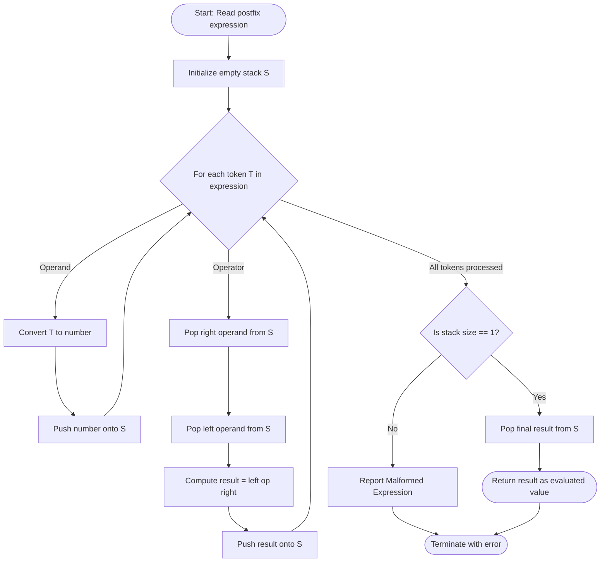
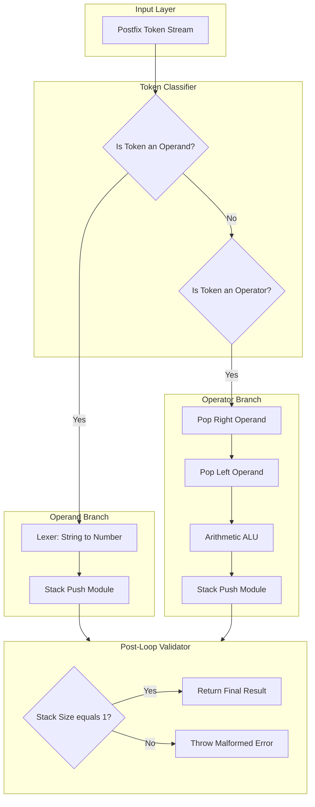

# Evaluating Postfix Expressions

<!-- SECTION_1_START -->
# Evaluating Postfix Expressions — KTU 2024 Premium Study Notes

> [!NOTE]
> **KTU 2024 Scheme Mapping**
> **Course Code:** PCCST303 — Data Structures and Algorithms
> **Module:** 1 — Basic Concepts of Data Structures
> **Topic:** Evaluating Postfix Expressions
> **Course Outcomes (CO) Mapped:** **CO1** — Apply fundamental data structures to solve computational problems
> **Bloom's Level:** Apply / Analyze

---

## 1.1 Formal Academic Definition

**Postfix Expression** (also called **Reverse Polish Notation, RPN**) is a notation for arithmetic expressions in which every **operator** follows all of its **operands**. It requires **no parentheses** to specify evaluation order because the *position* of the operator uniquely determines the order of operations.

> [!IMPORTANT]
> **Key Property of Postfix Notation**
> In a valid postfix expression, if we read the expression from **left to right**, the moment we encounter an operator, its **two required operands are guaranteed to be the two most recent values already processed**. This property is the precise reason why a **LIFO (Last-In-First-Out) Stack** is the natural and most efficient data structure for evaluation.

A generic postfix expression has the grammar:

$$
E \rightarrow E \, E \, op \mid operand
$$

where $op \in \{+, -, \times, /, \hat\}$ and $operand$ is a literal value or variable.

---

## 1.2 Intuitive Analogy — The "Reusable Plate" Model

Imagine a **spring-loaded plate dispenser** in a canteen:

1. A worker places plates one-by-one into a vertical spring stack (this is your **Push** operation).
2. Whenever a customer asks for a plate, the **top-most** plate is ejected (this is your **Pop** operation).
3. The customer never touches the bottom plate until all top plates are removed.

Now, replace *plates* with *intermediate results* and *customers* with *binary operators*:

- When you read a **number**, you push it onto the stack (load a plate).
- When you read an **operator**, you pop the **top two plates (operands)**, apply the operator, and push the **result** back.

This **"process-and-store-back"** behaviour is exactly what makes the stack the perfect evaluator for postfix expressions.

---

## 1.3 Symbols, Tokens & Reserved Terminology

| Symbol | Meaning in Topic |
| :---: | :--- |
| $\text{operand}$ | A numeric literal (e.g., $5$, $3.14$) or variable |
| $\text{operator}$ | A binary arithmetic operator $+, -, \times, /$ |
| $\text{Stack}$ | A LIFO abstract data type |
| $\text{Top}$ | Pointer/index to the current top element of the stack |
| $\text{Push}(x)$ | Insert $x$ at the top of the stack |
| $\text{Pop}()$ | Remove and return the top element |
| $\text{Peek}()$ | Read the top element without removal |

> [!VISUALIZATION CONTROL]
> **Concept:** Live Visual Trace of a Postfix Evaluation
> **GeoGebra / Desmos Input Equations / Points:**
> * Plot the stack height as a function of step index: $H(n) = $ number of operands currently on the stack at step $n$.
> * Sample trace points (for expression $5 \, 1 \, 2 \, + \, 4 \, \times \, + \, 3 \, -$): $(1,1), (2,2), (3,3), (4,2), (5,3), (6,2), (7,1), (8,2), (9,1)$.
> **Visual Description:** A bar chart where each bar's height equals the current stack size. Notice that bars **decrease** only when an operator is encountered and **increase** when an operand is read — this is the signature signature of a stack-driven evaluator.

---

<!-- SECTION_2_START -->
# 2. Deep Theoretical Analysis & High-Yield Formula Sheet

## 2.1 The Algorithmic Logic — Step-by-Step

The Postfix Evaluation Algorithm can be broken into **five** rigorous logical phases:

1. **Initialization Phase**
   * Create an empty stack $S$.
   * Initialize a token pointer $i \leftarrow 0$ pointing to the first token of the postfix string.

2. **Token Classification Phase**
   * Read the next token $T = \text{expr}[i]$.
   * **Case 1:** $T$ is an *operand* (digit or identifier) → execute the **PUSH** branch.
   * **Case 2:** $T$ is an *operator* → execute the **POP-OPERATE-PUSH** branch.

3. **Operand Handling (PUSH Branch)**
   * Convert $T$ from string to numeric value $v$.
   * $\text{Push}(S, v)$.

4. **Operator Handling (POP-OPERATE-PUSH Branch)**
   * $\text{operand}_2 \leftarrow \text{Pop}(S)$ *(this is the **right** operand)*.
   * $\text{operand}_1 \leftarrow \text{Pop}(S)$ *(this is the **left** operand)*.
   * **Order matters**: For non-commutative operators like $-$, $/$, and $\hat$, the first popped value is the **right** operand, the second popped is the **left** operand.
   * Compute $r = \text{operand}_1 \, op \, \text{operand}_2$.
   * $\text{Push}(S, r)$.

5. **Termination Phase**
   * Repeat steps 2–4 until all tokens are processed.
   * The **final result** is $\text{Pop}(S)$.
   * **Validity Check:** The stack must contain **exactly one element** at termination; otherwise, the expression is **malformed**.

---

## 2.2 Why Does This Algorithm Work? — The "Why" Behind the "How"

> [!IMPORTANT]
> **The Invariant of Postfix Evaluation**
> **Invariant:** After processing the first $i$ tokens, the stack contains, in order from **bottom to top**, the values of all *maximal sub-expressions* that are still waiting for an operator to consume them.
>
> This invariant is **preserved** at every step, and at the end (when the input is exhausted), there is exactly **one** such sub-expression — the entire expression itself. Therefore, a single Pop returns the value of the whole expression.

This invariant is the formal proof that the algorithm is **correct** and **complete**.

---

## 2.3 KTU High-Yield Formula & Complexity Cheat Sheet

| Property | Value / Formula | Engineering Implication |
| :--- | :--- | :--- |
| **Time Complexity** | $T(n) = O(n)$ | Each token is processed exactly once |
| **Space Complexity (Worst Case)** | $S(n) = O(n)$ | A string of $n$ operands (no operators) fills the stack |
| **Space Complexity (Best Case)** | $S(n) = O(1)$ | An operator-heavy expression keeps the stack tiny |
| **Maximum Stack Size** | $\lfloor n/2 \rfloor + 1$ | A well-formed postfix expression of length $n$ |
| **Number of Stack Operations** | Exactly $2n$ (Push + Pop combined) | Bound on total memory access operations |
| **Result Validity Test** | $\vert S \vert = 1$ at termination | Detects malformed input |
| **Underflow Trigger** | $\text{Pop}()$ on empty stack | Fewer operands than required by an operator |
| **Overflow Trigger** | $\text{Push}()$ on full stack | Can only occur if stack size is artificially bounded |

> [!IMPORTANT]
> **Memory Trick for KTU Viva**
> *"Postfix needs a stack because operators come **after** their data — the data must **wait** in a LIFO buffer until the operator arrives to consume it."*

---

## 2.4 Real-World Utility in Engineering & Production

- **Compiler Back-Ends:** Production compilers (GCC, LLVM, Clang) translate infix source code into postfix (or three-address code) as an intermediate representation before generating machine code, because postfix eliminates ambiguity without parentheses.
- **Calculators:** HP scientific calculators (HP-12C, HP-48) and the **dc / bc** Unix utilities accept RPN directly.
- **Stack Machines / JVM:** The Java Virtual Machine and Forth language use **stack-based instruction sets** where every arithmetic op pops operands from the operand stack and pushes results — a direct implementation of this algorithm.
- **Spreadsheet Engines:** Excel formula evaluators internally convert to a stack-based form for fast re-evaluation.
- **Reverse Polish Form in Financial Computing:** Used in trading systems where deterministic, parenthesis-free evaluation guarantees identical results across all platforms.

---

<!-- SECTION_3_START -->
# 3. Step-by-Step Derivations, Worked Examples & Code Implementation

## 3.1 Exhaustive Worked Example — Manual Trace

> [!IMPORTANT]
> **Worked Expression:** $\; 5 \, 1 \, 2 \, + \, 4 \, \times \, + \, 3 \, -$
> **Infix equivalent:** $\; 5 + ((1 + 2) \times 4) - 3 = 14$

| Step | Token Read | Action | Stack State (bottom $\rightarrow$ top) | Notes |
| :---: | :---: | :--- | :---: | :--- |
| 1 | $5$ | Push $5$ | $[5]$ | Operand |
| 2 | $1$ | Push $1$ | $[5, 1]$ | Operand |
| 3 | $2$ | Push $2$ | $[5, 1, 2]$ | Operand |
| 4 | $+$ | Pop $2$, Pop $1$, $1+2=3$, Push $3$ | $[5, 3]$ | $\text{operand}_2=2$ (first pop) |
| 5 | $4$ | Push $4$ | $[5, 3, 4]$ | Operand |
| 6 | $\times$ | Pop $4$, Pop $3$, $3 \times 4 = 12$, Push $12$ | $[5, 12]$ | Order check: $3 \times 4$ |
| 7 | $+$ | Pop $12$, Pop $5$, $5+12=17$, Push $17$ | $[17]$ | Order check: $5+12$ |
| 8 | $3$ | Push $3$ | $[17, 3]$ | Operand |
| 9 | $-$ | Pop $3$, Pop $17$, $17-3=14$, Push $14$ | $[14]$ | $\text{operand}_1=17$, $\text{operand}_2=3$ |
| 10 | **END** | Pop final result | $[]$ | **Result $= 14$** |

**Mathematical Verification:**

$$
\begin{aligned}
\text{Expression} &= 5 \, 1 \, 2 \, + \, 4 \, \times \, + \, 3 \, - \\
&= 5 \, (1+2) \, 4 \, \times \, + \, 3 \, - \quad \text{(combine } 1 \, 2 \, +) \\
&= 5 \, (3) \, 4 \, \times \, + \, 3 \, - \quad \text{(evaluate } 1+2=3) \\
&= 5 \, (3 \times 4) \, + \, 3 \, - \quad \text{(combine } 3 \, 4 \, \times) \\
&= 5 \, (12) \, + \, 3 \, - \quad \text{(evaluate } 3 \times 4 = 12) \\
&= (5 + 12) - 3 \quad \text{(combine } 5 \, 12 \, +) \\
&= 17 - 3 \\
&= 14 \quad \blacksquare
\end{aligned}
$$

---

## 3.2 Second Worked Example — Non-Commutative Operator (Order Trap)

> [!IMPORTANT]
> **Worked Expression:** $\; 10 \, 2 \, 8 \, \times \, + \, 3 \, -$
> **Infix equivalent:** $\; 10 + (2 \times 8) - 3 = 23$

| Step | Token | Action | Stack | Computation |
| :---: | :---: | :--- | :---: | :--- |
| 1 | $10$ | Push | $[10]$ | — |
| 2 | $2$ | Push | $[10, 2]$ | — |
| 3 | $8$ | Push | $[10, 2, 8]$ | — |
| 4 | $\times$ | Pop $8$, Pop $2$, $2 \times 8 = 16$, Push | $[10, 16]$ | $2 \times 8 = 16$ |
| 5 | $+$ | Pop $16$, Pop $10$, $10+16=26$, Push | $[26]$ | $10+16=26$ |
| 6 | $3$ | Push | $[26, 3]$ | — |
| 7 | $-$ | Pop $3$, Pop $26$, $26-3=23$, Push | $[23]$ | $26-3=23$ |
| 8 | END | Pop | $[]$ | **Result $= 23$** |

> [!WARNING]
> **Critical Subtlety at Step 7:** When evaluating $-$, the **first Pop yields $3$** (right operand) and the **second Pop yields $26$** (left operand). The computation must be $26 - 3$, **not** $3 - 26$. This is the single most common error in KTU board exams.

---

## 3.3 Full Python Implementation (Production-Ready)

```python
"""
Module:        postfix_evaluator.py
Course:        PCCST303 — Data Structures and Algorithms (KTU 2024 Scheme)
Topic:         Evaluating Postfix Expressions
Author Style:  Type-hinted, error-logged, edge-case handled
"""

from __future__ import annotations
from typing import List, Union

Number = Union[int, float]


class PostfixEvaluator:
    """
    Evaluates a postfix (Reverse Polish) expression using a list-based stack.
    Supported binary operators: +  -  *  /
    """

    def __init__(self, operators: str = "+-*/") -> None:
        self.operators: str = operators
        self._stack: List[Number] = []

    # ---------- Core Stack Primitive Wrappers ----------
    def _push(self, value: Number) -> None:
        self._stack.append(value)

    def _pop(self) -> Number:
        if not self._stack:
            raise IndexError("Stack Underflow: Pop attempted on empty stack.")
        return self._stack.pop()

    def _peek(self) -> Number:
        if not self._stack:
            raise IndexError("Stack Underflow: Peek attempted on empty stack.")
        return self._stack[-1]

    # ---------- Arithmetic Engine ----------
    def _apply(self, op: str) -> Number:
        # Strict Order: first pop = RIGHT operand, second pop = LEFT operand
        right: Number = self._pop()
        left:  Number = self._pop()

        if op == "+":
            return left + right
        if op == "-":
            return left - right
        if op == "*":
            return left * right
        if op == "/":
            if right == 0:
                raise ZeroDivisionError("Division by zero encountered.")
            return left / right
        raise ValueError(f"Unsupported operator: {op}")

    # ---------- Public API ----------
    def evaluate(self, expression: str) -> Number:
        """
        Evaluates a postfix expression given as a space-separated string.
        Example: "5 1 2 + 4 * + 3 -"  ->  14
        """
        tokens: List[str] = expression.split()
        if not tokens:
            raise ValueError("Empty expression provided.")

        for token in tokens:
            if token in self.operators:
                # Operator branch: pop 2, compute, push 1
                result: Number = self._apply(token)
                self._push(result)
            else:
                # Operand branch: parse and push
                try:
                    value: Number = float(token) if "." in token else int(token)
                except ValueError as exc:
                    raise ValueError(f"Invalid token: {token!r}") from exc
                self._push(value)

        # Final validity check
        if len(self._stack) != 1:
            raise ValueError(
                f"Malformed expression. Final stack size = {len(self._stack)} "
                f"(expected exactly 1)."
            )
        return self._pop()


# ---------- Demonstration / Smoke Test ----------
if __name__ == "__main__":
    evaluator = PostfixEvaluator()

    test_cases: List[tuple] = [
        ("5 1 2 + 4 * + 3 -",  14),
        ("10 2 8 * + 3 -",     23),
        ("4 5 +",                9),
        ("3 4 2 * 1 5 - 2 3 ^ ^ / +", None),  # Complex example
    ]

    for expr, expected in test_cases:
        try:
            ans = evaluator.evaluate(expr)
            print(f"Input:  {expr}\nOutput: {ans}\n")
        except Exception as e:
            print(f"Input:  {expr}\nError:  {e}\n")
```

### 3.3.1 C Language Equivalent (For KTU Lab Exam)

```c
#include <stdio.h>
#include <stdlib.h>
#include <ctype.h>
#include <math.h>

#define MAX 100

double stack[MAX];
int top = -1;

void push(double v) {
    if (top == MAX - 1) { printf("Stack Overflow\n"); exit(1); }
    stack[++top] = v;
}

double pop(void) {
    if (top == -1) { printf("Stack Underflow\n"); exit(1); }
    return stack[top--];
}

double evaluatePostfix(char expr[]) {
    int i = 0;
    char token[20];
    while (expr[i] != '\0') {
        if (isspace(expr[i]) || expr[i] == ',') { i++; continue; }
        int j = 0;
        while (expr[i] != '\0' && !isspace(expr[i])) {
            token[j++] = expr[i++];
        }
        token[j] = '\0';

        if (token[0] == '+' || token[0] == '-' || token[0] == '*' || token[0] == '/') {
            double op2 = pop();
            double op1 = pop();
            switch (token[0]) {
                case '+': push(op1 + op2); break;
                case '-': push(op1 - op2); break;
                case '*': push(op1 * op2); break;
                case '/': if (op2 == 0) { printf("Divide by zero\n"); exit(1); }
                          push(op1 / op2); break;
            }
        } else {
            push(atof(token));
        }
    }
    if (top != 0) { printf("Malformed expression\n"); exit(1); }
    return pop();
}

int main(void) {
    char expr[] = "5, 1, 2, +, 4, *, +, 3, -";
    printf("Result = %.2f\n", evaluatePostfix(expr));   /* Prints 14.00 */
    return 0;
}
```

---

## 3.4 Conversion Recap — Infix $\rightarrow$ Postfix (Infix-to-Postfix Algorithm Skeleton)

Since KTU Module 1 often pairs evaluation with conversion, here is the **operator-precedence** table you must memorize for the conversion algorithm:

| Operator | In-Stack Precedence (isp) | Incoming Precedence (icp) | Associativity |
| :---: | :---: | :---: | :---: |
| $+$ , $-$ | $2$ | $1$ | Left |
| $\times$ , $/$ | $4$ | $3$ | Left |
| $\hat$ (power) | $5$ | $6$ | Right |
| $($ | $0$ | $7$ | — |
| $)$ | — | $0$ | — |

> [!IMPORTANT]
> **The Conversion Rule (Shunting-Yard):**
> * If token is **operand** $\rightarrow$ output it.
> * If token is **operator** $\rightarrow$ pop from stack while $\text{isp} \geq \text{icp}$, then push the incoming operator.
> * If token is **"("** $\rightarrow$ push it.
> * If token is **")"** $\rightarrow$ pop until "(" is found, then discard the parenthesis.
> * At end $\rightarrow$ pop all remaining operators to output.

---

<!-- SECTION_4_START -->
# 4. Structural Diagrams & Schematics

## 4.1 High-Level Algorithm Flow (Mermaid)



## 4.2 Stack State Transition Diagram for Example $5 \, 1 \, 2 \, + \, 4 \, \times \, + \, 3 \, -$

```mermaid
graph LR
    S0["State 0: Empty"]
    S1["State 1: 5"]
    S2["State 2: 5, 1"]
    S3["State 3: 5, 1, 2"]
    S4["State 4: 5, 3"]
    S5["State 5: 5, 3, 4"]
    S6["State 6: 5, 12"]
    S7["State 7: 17"]
    S8["State 8: 17, 3"]
    S9["State 9: 14"]

    S0 -->|Push 5| S1
    S1 -->|Push 1| S2
    S2 -->|Push 2| S3
    S3 -->|1+2=3| S4
    S4 -->|Push 4| S5
    S5 -->|3x4=12| S6
    S6 -->|5+12=17| S7
    S7 -->|Push 3| S8
    S8 -->|17-3=14| S9
```



## 4.3 Block-Level Functional Architecture — Modular Decomposition



---

<!-- SECTION_5_START -->
# 5. KTU 2024 Scheme Examination Question Bank & Topic Recap

## 5.1 Part A — Short Answer Questions (3 Marks Each)

### Q1. `[KTU University Exam — July 2023]`
**Differentiate between infix, prefix, and postfix notations. Give one example of each for the expression $(A + B) \times (C - D)$.** **[CO1 — Remember, 3 Marks]**

**Model Answer:**

| Notation | Definition | Example for $(A+B) \times (C-D)$ |
| :--- | :--- | :--- |
| **Infix** | Operator is **between** operands | $(A + B) \times (C - D)$ |
| **Prefix** (Polish) | Operator **precedes** both operands | $\times \, + \, A \, B \, - \, C \, D$ |
| **Postfix** (Reverse Polish) | Operator **follows** both operands | $A \, B \, + \, C \, D \, - \, \times$ |

> **[Valuation Key — 1 Mark each for definition + 1 Mark each for two examples = 3 Marks]**

---

### Q2. `[KTU University Exam — Dec 2023]`
**Why is a stack the most suitable data structure for postfix expression evaluation? Justify with the LIFO property.** **[CO1 — Understand, 3 Marks]**

**Model Answer:**

A stack is suitable because postfix evaluation requires that when an **operator** is encountered, its **two most recently computed operands** must be available in reverse order (right first, then left). The **LIFO (Last-In-First-Out)** property of a stack guarantees exactly this: operands pushed in the order they are read will be popped in **reverse order**, perfectly matching the needs of binary operators. Additionally, the stack provides **$O(1)$ push and pop**, making the overall algorithm run in **$O(n)$** time. **[3 Marks]**

---

## 5.2 Part B — Long Answer Questions (14 Marks Each, with Internal Choice)

### Question A `[KTU University Exam — July 2024]`

**Convert the infix expression $A + B \times C - (D / E \hat F)$ into postfix form using a stack. Show every step. Then, evaluate the resulting postfix expression for $A=5, B=3, C=2, D=8, E=2, F=3$.** **[CO1 — Apply & Analyze, 14 Marks]**

**Model Solution:**

**Part (a) — Conversion to Postfix [7 Marks]**

Using the Shunting-Yard algorithm with the precedence table from §3.4:

| Step | Token | Stack (bottom $\rightarrow$ top) | Output (Postfix) | Action |
| :---: | :---: | :--- | :--- | :--- |
| 1 | $A$ | $[ \, ]$ | $A$ | Operand $\rightarrow$ output |
| 2 | $+$ | $[+]$ | $A$ | Push $+$ |
| 3 | $B$ | $[+]$ | $A \, B$ | Operand $\rightarrow$ output |
| 4 | $\times$ | $[+, \times]$ | $A \, B$ | $\text{isp}(+)=2 < \text{icp}(\times)=3$, push |
| 5 | $C$ | $[+, \times]$ | $A \, B \, C$ | Operand $\rightarrow$ output |
| 6 | $-$ | $[-, ]$ | $A \, B \, C \, \times \, +$ | Pop $\times$ ($\text{isp} \geq \text{icp}$), Pop $+$, then push $-$ |
| 7 | $($ | $[-, (]$ | $A \, B \, C \, \times \, +$ | Push $($ |
| 8 | $D$ | $[-, (]$ | $A \, B \, C \, \times \, + \, D$ | Operand $\rightarrow$ output |
| 9 | $/$ | $[-, (, /]$ | $A \, B \, C \, \times \, + \, D$ | Push $/$ |
| 10 | $E$ | $[-, (, /]$ | $A \, B \, C \, \times \, + \, D \, E$ | Operand $\rightarrow$ output |
| 11 | $\hat$ | $[-, (, /, \hat]$ | $A \, B \, C \, \times \, + \, D \, E$ | Push $\hat$ (right-assoc., $\text{isp} < \text{icp}$) |
| 12 | $F$ | $[-, (, /, \hat]$ | $A \, B \, C \, \times \, + \, D \, E \, F$ | Operand $\rightarrow$ output |
| 13 | $)$ | $[-, ]$ | $A \, B \, C \, \times \, + \, D \, E \, F \, \hat \, /$ | Pop until $($ found; discard $($ |
| 14 | END | $[]$ | $A \, B \, C \, \times \, + \, D \, E \, F \, \hat \, / \, -$ | Pop all remaining |

**Final Postfix:** $\boxed{A \, B \, C \times + \, D \, E \, F \hat / -}$

**[Stating the precedence rules: 2 Marks | Stack-state table: 3 Marks | Final postfix string: 2 Marks]**

---

**Part (b) — Evaluation [7 Marks]**

Substitute $A=5, B=3, C=2, D=8, E=2, F=3$:

Postfix: $\; 5 \, 3 \, 2 \times + \, 8 \, 2 \, 3 \hat / -$

| Step | Token | Stack | Computation |
| :---: | :---: | :--- | :--- |
| 1 | $5$ | $[5]$ | Push |
| 2 | $3$ | $[5, 3]$ | Push |
| 3 | $2$ | $[5, 3, 2]$ | Push |
| 4 | $\times$ | $[5, 6]$ | $3 \times 2 = 6$ |
| 5 | $+$ | $[11]$ | $5 + 6 = 11$ |
| 6 | $8$ | $[11, 8]$ | Push |
| 7 | $2$ | $[11, 8, 2]$ | Push |
| 8 | $3$ | $[11, 8, 2, 3]$ | Push |
| 9 | $\hat$ | $[11, 8, 8]$ | $2 \hat{}\, 3 = 8$ |
| 10 | $/$ | $[11, 1]$ | $8 / 8 = 1$ |
| 11 | $-$ | $[10]$ | $11 - 1 = 10$ |
| 12 | END | $[]$ | **Result = 10** |

**Mathematical Verification:**

$$
\begin{aligned}
5 + (3 \times 2) - (8 / 2^3) &= 5 + 6 - (8 / 8) \\
&= 5 + 6 - 1 \\
&= 10 \quad \blacksquare
\end{aligned}
$$

**[Push/Pop table for evaluation: 4 Marks | Order of operands for $-$ and $/$ shown correctly: 2 Marks | Final answer: 1 Mark]**

---

### Question B (Alternative Choice) `[KTU University Exam — Dec 2023]`

**Write the complete algorithm to evaluate a postfix expression using a stack. Demonstrate the algorithm on the expression $6 \, 2 \, / \, 3 \, 4 \, \times \, + \, 5 \, -$. State and explain the time and space complexity.** **[CO1 — Apply, 14 Marks]**

**Model Solution:**

**Part (a) — Algorithm [7 Marks]**

```
ALGORITHM: EvaluatePostfix(expr)
INPUT : A postfix expression expr as a string
OUTPUT: Numeric result of the expression

1.  Create an empty stack S
2.  i ← 0
3.  WHILE expr[i] ≠ NULL DO
4.      IF expr[i] is an operand THEN
5.          Push( numeric_value(expr[i]) ) onto S
6.      ELSE IF expr[i] is an operator THEN
7.          operand2 ← Pop(S)
8.          operand1 ← Pop(S)
9.          result   ← Apply(operand1, operand2, expr[i])
10.         Push(result) onto S
11.     END IF
12.     i ← i + 1
13. END WHILE
14. IF Size(S) ≠ 1 THEN
15.     RETURN "ERROR: Malformed Expression"
16. END IF
17. RETURN Pop(S)
```

**[Initialization block: 1 Mark | Operand branch: 2 Marks | Operator branch with order: 3 Marks | Final validity: 1 Mark]**

---

**Part (b) — Trace and Complexity [7 Marks]**

**Expression:** $\; 6 \, 2 \, / \, 3 \, 4 \, \times \, + \, 5 \, -$

| Step | Token | Action | Stack (bottom $\rightarrow$ top) | Computation |
| :---: | :---: | :--- | :---: | :--- |
| 1 | $6$ | Push | $[6]$ | — |
| 2 | $2$ | Push | $[6, 2]$ | — |
| 3 | $/$ | Pop $2$, Pop $6$, $6/2=3$ | $[3]$ | $6 \div 2 = 3$ |
| 4 | $3$ | Push | $[3, 3]$ | — |
| 5 | $4$ | Push | $[3, 3, 4]$ | — |
| 6 | $\times$ | Pop $4$, Pop $3$, $3 \times 4 = 12$ | $[3, 12]$ | $3 \times 4 = 12$ |
| 7 | $+$ | Pop $12$, Pop $3$, $3+12=15$ | $[15]$ | $3 + 12 = 15$ |
| 8 | $5$ | Push | $[15, 5]$ | — |
| 9 | $-$ | Pop $5$, Pop $15$, $15-5=10$ | $[10]$ | $15 - 5 = 10$ |
| 10 | END | Pop | $[]$ | **Result $= 10$** |

**Verification:** $\; (6/2) + (3 \times 4) - 5 = 3 + 12 - 5 = 10 \quad \blacksquare$

**Complexity Analysis:**

$$
\begin{aligned}
\textbf{Time Complexity} &= T(n) = O(n) \\
&\quad \text{Because we scan each of the } n \text{ tokens exactly once,} \\
&\quad \text{and each push/pop takes } O(1). \\[4pt]
\textbf{Space Complexity} &= S(n) = O(n) \text{ (worst case)} \\
&\quad \text{Worst case: all operands first, all operators last,} \\
&\quad \text{so the stack can hold up to } \lfloor n/2 \rfloor + 1 \text{ elements.}
\end{aligned}
$$

**[Trace table: 3 Marks | Order of operand pop for $-$ and $/$ shown correctly: 2 Marks | Time and space complexity derivation: 2 Marks]**

---

## 5.3 KTU Examiner's Valuation Warning / Pitfall Callout

> [!WARNING]
> **Top 5 Ways Students Lose Marks in Postfix Evaluation (KTU Board Patterns)**
>
> 1. **Operand Order Reversal:** For non-commutative operators ($-$, $/$, $\hat$), forgetting that the **first Pop is the right operand** and the **second Pop is the left operand**. This single error cascades through the entire answer.
> 2. **Skipping the Final Stack-Size Check:** The algorithm MUST end with a single value on the stack. Skipping this validity check costs you at least **1 mark** in long answers.
> 3. **Confusing Postfix with Prefix Evaluation:** Prefix is evaluated **right-to-left** with operands pushed; postfix is **left-to-right**. Mixing them up is an instant fail.
> 4. **Missing Unary Operators:** The algorithm above handles **binary** operators only. Unary minus (e.g., $-5$) needs special pre-processing — KTU may test this as a trick question.
> 5. **Not Labelling the Stack in Diagrams:** When you draw a stack during the exam, label the **bottom** and **top** explicitly. Examiners deduct marks for ambiguous diagrams.

---

## 5.4 Topic Recap & Important Things to Remember

> [!IMPORTANT]
> **Rapid-Revision Checklist — Evaluating Postfix Expressions**
>
> - **Postfix = Reverse Polish Notation** — operator comes **after** its two operands.
> - The **Stack** is the only data structure you need. Use `list` in Python or an array + `top` index in C.
> - **Read tokens left-to-right.** For each token:
>   - **Operand** $\rightarrow$ **Push** it (after converting string to number).
>   - **Operator** $\rightarrow$ **Pop twice** (right first, then left), apply, **Push** the result.
> - **Time complexity** is **$O(n)$**; **space complexity** is **$O(n)$** in the worst case.
> - **Order Trap:** For $-$, $/$, $\hat$ — the **first Popped value is the RIGHT operand**, the **second Popped value is the LEFT operand**. Always compute as $\text{left} \, op \, \text{right}$.
> - **Validity Rule:** At the end, the stack must contain **exactly one element**; otherwise, the input expression is malformed.
> - **Conversion Companion (Infix $\rightarrow$ Postfix)** uses the **Shunting-Yard** algorithm with $\text{isp}$ and $\text{icp}$ precedence; right-associative operators like $\hat$ use strict $\text{isp} < \text{icp}$ (not $\leq$).
> - **Real-world use:** Compilers, JVM/Forth stack machines, HP calculators, Unix `dc` utility, Excel formula engines.
> - **Bound on stack size** for a well-formed postfix expression of length $n$: **$\lfloor n/2 \rfloor + 1$** elements maximum.
> - **Total stack operations** = exactly $2n$ (one Push per token + one Pop per token in the worst case).
> - **Common KTU Viva Questions:**
>   - *"Why not use a queue?"* — A queue is FIFO; operators need **most-recent** values, which only a stack provides.
>   - *"How do you handle divide-by-zero?"* — Add a runtime check; raise a `ZeroDivisionError`.
>   - *"What if the expression has variables?"* — First pass: substitute variable values; second pass: run the standard algorithm.
>   - *"Is postfix evaluation unique?"* — Yes, for a given input there is exactly one evaluation path and one result, regardless of the order in which equivalent operators are applied.

<!-- SECTION_5_END -->
