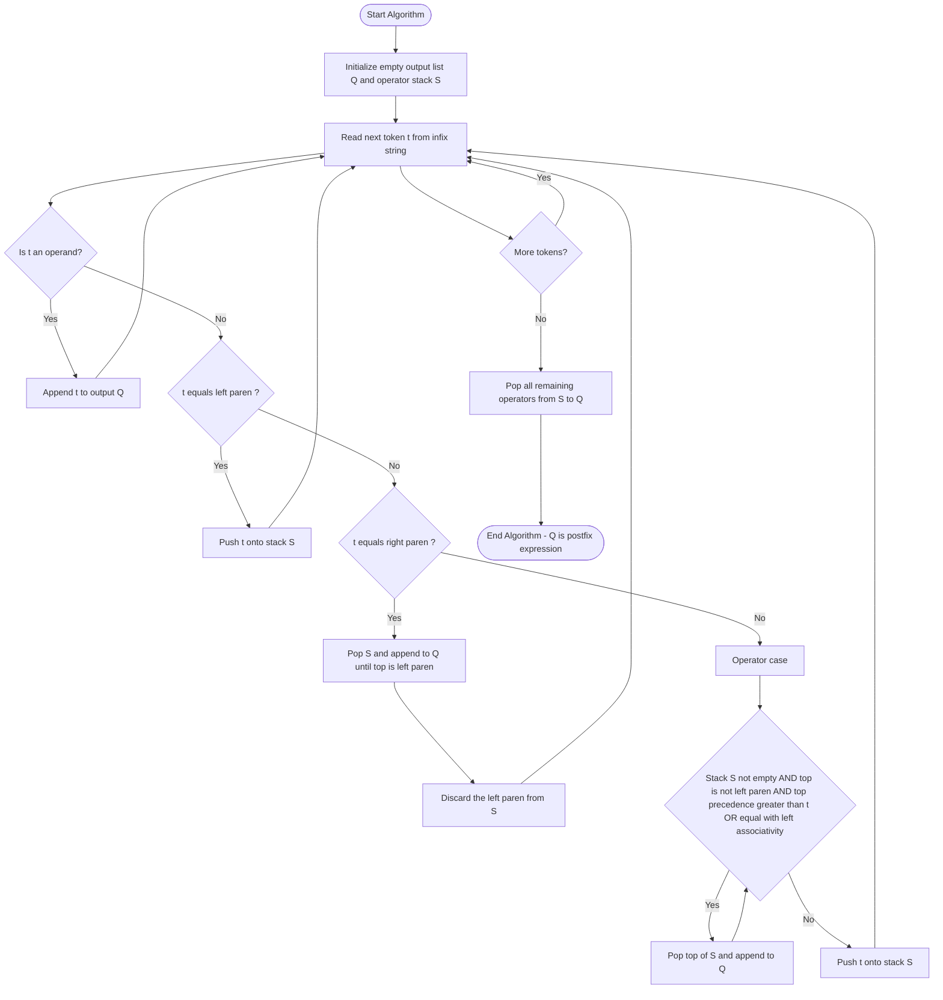
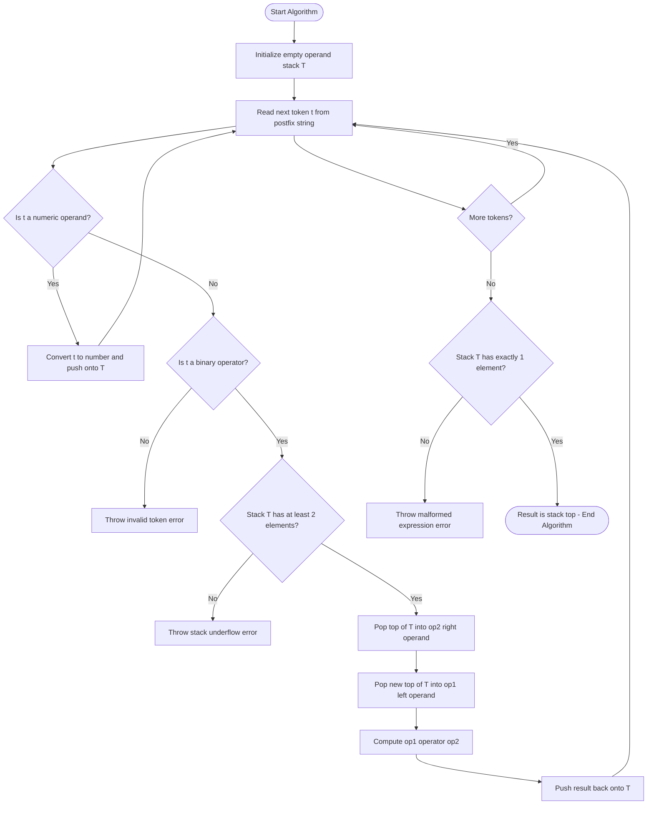
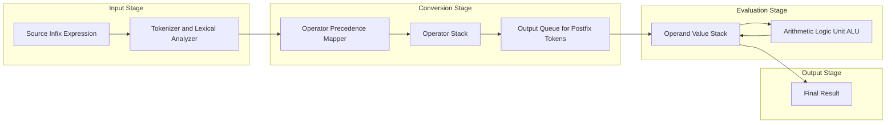

# Evaluation of Expressions: Infix to Postfix conversion, Evaluating Postfix Expressions

<!-- SECTION_1_START -->
# Evaluation of Expressions: Infix to Postfix Conversion and Postfix Evaluation

## 1.1 Formal Academic Definition (KTU 2024 Syllabus Terminology)

An **arithmetic expression** is a combination of operands (variables/constants), operators (+, -, *, /, ^), and parentheses that produces a meaningful computational value. Depending on the placement of operators relative to operands, expressions are classified into three standard notations:

> [!IMPORTANT]
> **Three Standard Notations of Expressions**
> 1. **Infix Notation** — The operator is placed **between** two operands. Example: $A + B$. This is the natural way humans write expressions but is ambiguous without precedence rules and parentheses.
> 2. **Prefix Notation (Polish Notation)** — The operator is placed **before** its operands. Example: $+AB$. Proposed by the Polish logician Jan Łukasiewicz (1924).
> 3. **Postfix Notation (Reverse Polish Notation / RPN)** — The operator is placed **after** its operands. Example: $AB+$. This is the most compiler-friendly notation because it requires **no parentheses** and is evaluated using a single left-to-right stack pass.

In the KTU 2024 Scheme (Course Code: PCCST303), the module objectives explicitly require students to:
- Convert infix expressions into postfix form using a **stack-based algorithm** (Shunting-Yard style, attributed to Dijkstra).
- Evaluate postfix expressions using a **stack-based evaluation routine**, demonstrating operand and operator management with full boundary checks.

The central data structure governing both operations is the **Stack (LIFO — Last In, First Out)**, implemented typically as a Python `list`, a C `struct` array, or a Java `ArrayDeque`.

## 1.2 Conceptual Analogy and Geometric Intuition

Imagine you are a chef in a busy restaurant kitchen preparing a multi-step recipe. The recipe reads:

> "Take the **onion**, take the **tomato**, take the **chili**, **chop** all three, then **add** salt, then **fry** for 5 minutes."

Notice the sequence: ingredients (operands) come first, then the action (operator). This is exactly the **postfix** style. The chef doesn't need to remember parentheses or operator precedence — they just stack ingredients, and when an action word appears, they pop the required number of items, perform the action, and push the result back.

**Geometric Intuition (Coordinate Plane View):**
- The **horizontal axis** represents the **scan position** (left-to-right traversal).
- The **vertical axis** represents the **stack depth** (number of symbols currently held).
- Each "tower" in the stack is a symbol waiting for its turn.
- Operands **fall off** directly to the output tape (one-dimensional, no height).
- Operators **sit on the stack** until a lower-precedence operator kicks them off — much like gravity in physics, where heavier (higher-precedence) operators stay at the bottom and lighter ones bounce off.

## 1.3 Why Compilers Prefer Postfix

> [!NOTE]
> **Compiler-Level Justification for Postfix (High-Yield KTU Point)**
> 1. **No ambiguity:** Operator precedence and associativity are **encoded directly** into the conversion step. The postfix form has a **unique** evaluation order.
> 2. **No parentheses needed:** Parenthesis information is consumed during conversion to enforce sub-expression grouping.
> 3. **Single linear scan:** Evaluation is a strict left-to-right pass, ideal for streaming or tokenized compilation.
> 4. **Minimal memory:** Only the evaluation stack is required; no recursion tree or operator-precedence parser state machine is needed at runtime.

The **time complexity** of both algorithms is $O(n)$, where $n$ is the number of tokens (operands + operators) in the expression. The **space complexity** is $O(n)$ in the worst case (e.g., an expression of all operators).

## 1.4 Operator Precedence and Associativity — The Foundation

> [!IMPORTANT]
> **Standard Operator Precedence Table (Highest to Lowest)**
> | Precedence Level | Operator(s) | Associativity | Description |
> |:---:|:---:|:---:|:---|
> | 3 (Highest) | $\wedge$ | Right $\rightarrow$ Left | Exponentiation |
> | 2 | $\times$, $\div$, \% | Left $\rightarrow$ Right | Multiplicative |
> | 1 (Lowest) | $+$, $-$ | Left $\rightarrow$ Right | Additive |
> | Special | $($ , $)$ | N/A | Grouping delimiters |

**Critical Rule for Left-Associative Operators:** When two operators of **equal precedence** are compared, the one **already on the stack is popped first** (to enforce left-to-right evaluation). For **right-associative** operators like $\wedge$, the incoming operator is pushed without popping an equal-precedence stack-top operator.

> [!VISUALIZATION CONTROL]
> **Concept:** Stack Push/Pop Dynamics for Infix to Postfix
> **GeoGebra / Desmos Input Equations:**
> * `f(x) = 2` (red horizontal line = "precedence threshold for + and -")
> * `g(x) = 3` (green horizontal line = "precedence threshold for * and /")
> * `h(x) = 4` (blue horizontal line = "precedence threshold for ^")
> **Visual Description:** The student should observe three horizontal threshold lines. When an incoming operator has precedence **less than or equal to** the stack-top operator (and the stack-top is left-associative), the stack-top is **popped** to the output, just as a small ball drops below a larger ball on an inclined surface.
<!-- SECTION_1_END -->

<!-- SECTION_2_START -->
# Deep Theoretical Analysis — Algorithms and KTU Formula Sheet

## 2.1 The Infix to Postfix Conversion Algorithm

The algorithm uses a single **operator stack** $S$ and an **output list** (or queue) $Q$. It scans the infix expression token by token from left to right.

### 2.1.1 Decision Logic per Token

For each token $t$ read from the infix expression:

**Case 1 — Operand (letter or digit):**
- **Action:** Append $t$ directly to the output $Q$.
- **Why:** Operands retain their original left-to-right order in postfix notation.

**Case 2 — Left Parenthesis `(` :**
- **Action:** Push $t$ onto stack $S$.
- **Why:** Acts as a sentinel marking the start of a sub-expression. It can never be popped by precedence rules; it is removed **only** by a matching right parenthesis.

**Case 3 — Right Parenthesis `)` :**
- **Action:** Repeatedly pop the stack and append to $Q$ until a left parenthesis `(` is encountered. Discard both parentheses.
- **Why:** This releases all operators inside the sub-expression, enforcing that the inner group is computed first.

**Case 4 — Operator ( $+$, $-$, $\times$, $\div$, $\wedge$ ):**
- **Action:** While the stack is **not empty** AND the top of the stack is **not** `(` AND (precedence of stack-top $>$ precedence of incoming operator) OR (precedence of stack-top $=$ precedence of incoming operator AND stack-top is **left-associative**):
  - Pop stack-top and append to $Q$.
- After the while-loop, push the incoming operator onto $S$.

### 2.1.2 End-of-Expression Cleanup
After all tokens are consumed, pop every remaining operator from $S$ and append to $Q$ in the order they are popped.

## 2.2 The Postfix Evaluation Algorithm

The evaluation algorithm uses a single **operand stack** $T$ (note: a *different* stack than the one used in conversion, though in code they are independent data structures).

### 2.2.1 Decision Logic per Token

For each token $t$ read from the postfix expression:

**Case 1 — Operand:**
- **Action:** Convert the operand to its numerical value and **push** it onto $T$.
- **Why:** Operands must be held until their associated operator arrives.

**Case 2 — Binary Operator ($\oplus$):**
- **Action:**
  1. Pop the top of $T$ into a variable $op_2$ (this is the **right** operand).
  2. Pop the new top of $T$ into a variable $op_1$ (this is the **left** operand).
  3. Compute $result = op_1 \oplus op_2$ (note the **order** — order matters for non-commutative operations like subtraction and division).
  4. Push $result$ back onto $T$.

**End:** After all tokens, the stack $T$ should contain exactly **one** value — the final result. If not, the postfix expression is malformed.

## 2.3 KTU High-Yield Formula / Cheat Sheet

> [!IMPORTANT]
> **Expression Conversion — Master Reference Table**
> | Aspect | Infix to Postfix (Conversion) | Postfix Evaluation (Computation) |
> |:---|:---|:---|
> | **Stack Holds** | Operators + Left Parentheses | Operand values (numeric) |
> | **Operand Action** | Output directly | Push to stack |
> | **Operator Action** | Conditional pop higher-precedence, then push | Pop 2 operands, compute, push result |
> | **Parenthesis Role** | `(` pushed; `)` triggers bulk pop | **None** (already eliminated) |
> | **Scan Direction** | Left $\rightarrow$ Right | Left $\rightarrow$ Right |
> | **Time Complexity** | $O(n)$ | $O(n)$ |
> | **Space Complexity** | $O(n)$ worst case | $O(n)$ worst case |
> | **Empty-Stack Risk** | None on initial push | **Critical** when popping $op_1$ or $op_2$ |
> | **Precedence Trigger** | Pop if $\text{prec}(top) \geq \text{prec}(in)$ for left-associative | Not applicable |
> | **Order for Non-Commutative** | Not applicable | $op_1 - op_2$ (left $\vert$ right) |
> | **Final State** | Output list $Q$ has the postfix expression | Stack top has the final answer |

## 2.4 Real-World Engineering Utility

- **Compiler Design (Production):** Every mainstream compiler (GCC, Clang, javac) performs infix-to-postfix (or directly to three-address code) during the **parsing and intermediate code generation** phase. The postfix / three-address form is then consumed by the optimizer.
- **Calculator Hardware:** HP scientific calculators (e.g., HP-12C, HP-48) and Forth/PostScript language runtimes natively accept RPN input.
- **Database Query Engines:** SQL execution plans use tree-based equivalents of postfix evaluation for predicate evaluation.
- **Spreadsheet Engines:** Excel-style formula evaluators (e.g., the `exprtk` C++ library) parse infix and evaluate using stack-based virtual machines.
- **Embedded / DSP Systems:** Postfix evaluation is preferred in microcontrollers with limited memory because the stack can be allocated in a small fixed-size array.
- **Virtual Machines:** The JVM and CLR convert infix-like source code into a **postfix-style bytecode** that the interpreter executes with a single operand stack — the very same conceptual model.
<!-- SECTION_2_END -->

<!-- SECTION_3_START -->
# Step-by-Step Derivations, Trace Tables, and Code Implementation

## 3.1 Worked Example 1 — Infix to Postfix Conversion

**Infix Expression:** $\quad (A + B) \times C - D \wedge E + F / G$

We assume: $A, B, C, D, E, F, G$ are operands; operators are $+$, $-$, $\times$, $\wedge$, $/$ with standard precedence ($\wedge > \times, / > +, -$) and associativity (left for all except right for $\wedge$).

### 3.3.1 Token-by-Token Trace Table

> [!NOTE]
> **Reading the table:**
> * "Token" = current symbol being processed.
> * "Action Taken" = the rule being applied.
> * "Stack (bottom $\rightarrow$ top)" = current state of the operator stack.
> * "Postfix Output" = running concatenation of the postfix string.

| Step | Token | Action Taken | Stack (bottom $\rightarrow$ top) | Postfix Output |
|:---:|:---:|:---|:---:|:---:|
| 1 | $($ | Push $($ | $($ | (empty) |
| 2 | $A$ | Operand $\rightarrow$ output | $($ | $A$ |
| 3 | $+$ | Stack empty inside parens; push | $($ , $+$ | $A$ |
| 4 | $B$ | Operand $\rightarrow$ output | $($ , $+$ | $AB$ |
| 5 | $)$ | Pop until $($; pop $+$, discard $($ | (empty) | $AB+$ |
| 6 | $\times$ | Stack empty; push | $\times$ | $AB+$ |
| 7 | $C$ | Operand $\rightarrow$ output | $\times$ | $AB+C$ |
| 8 | $-$ | $\text{prec}(\times)=2 \geq \text{prec}(-)=1$; pop $\times$ then push $-$ | $-$ | $AB+C\times$ |
| 9 | $D$ | Operand $\rightarrow$ output | $-$ | $AB+C\times D$ |
| 10 | $\wedge$ | $\text{prec}(-)=1 < \text{prec}(\wedge)=3$; push directly | $-$ , $\wedge$ | $AB+C\times D$ |
| 11 | $E$ | Operand $\rightarrow$ output | $-$ , $\wedge$ | $AB+C\times DE$ |
| 12 | $+$ | $\text{prec}(\wedge)=3 \geq \text{prec}(+)=1$; pop $\wedge$. $\text{prec}(-)=1 \geq \text{prec}(+)=1$ (left-assoc); pop $-$. Push $+$. | $+$ | $AB+C\times DE\wedge -$ |
| 13 | $F$ | Operand $\rightarrow$ output | $+$ | $AB+C\times DE\wedge -F$ |
| 14 | $/$ | $\text{prec}(+)=1 < \text{prec}(/)=2$; push | $+$ , $/$ | $AB+C\times DE\wedge -F$ |
| 15 | $G$ | Operand $\rightarrow$ output | $+$ , $/$ | $AB+C\times DE\wedge -FG$ |
| 16 | END | Pop all remaining operators | (empty) | $AB+C\times DE\wedge -FG/+$ |

**Final Postfix Expression:**

$$AB+C \times DE \wedge - FG/ +$$

(Reformatted for readability: $A\,B\,+\,C\,\times\,D\,E\,\wedge\,-\,F\,G\,/\,+$)

### 3.1.2 Algebraic Verification of Correctness

We can verify by parsing the postfix with a left-to-right tree-build. Reading tokens:
- $A$, $B$ are leaves; $+$ joins them $\Rightarrow (A+B)$.
- $C$ is a leaf; $\times$ joins with $(A+B)$ $\Rightarrow (A+B)\times C$.
- $D$, $E$ are leaves; $\wedge$ joins them $\Rightarrow D \wedge E$.
- $-$ joins $(A+B)\times C$ and $D \wedge E$ $\Rightarrow (A+B)\times C - D \wedge E$.
- $F$, $G$ are leaves; $/$ joins them $\Rightarrow F/G$.
- $+$ joins the left and right sides $\Rightarrow (A+B)\times C - D \wedge E + F/G$.

This matches the original infix expression (with parentheses around $A+B$ and right-associative $D \wedge E$ both being preserved correctly). $\blacksquare$

## 3.2 Worked Example 2 — Postfix Expression Evaluation

**Postfix Expression:** $\quad 6\, 2\, /\, 3\, -\, 4\, 2\, \times\, +$

### 3.2.1 Token-by-Token Evaluation Trace

| Step | Token | Action | $op_1$ | $op_2$ | Computed $op_1 \oplus op_2$ | Stack (bottom $\rightarrow$ top) |
|:---:|:---:|:---|:---:|:---:|:---:|:---:|
| 1 | $6$ | Push | — | — | — | $6$ |
| 2 | $2$ | Push | — | — | — | $6, 2$ |
| 3 | $/$ | Pop 2, pop 1, compute, push | $6$ | $2$ | $6 \div 2 = 3$ | $3$ |
| 4 | $3$ | Push | — | — | — | $3, 3$ |
| 5 | $-$ | Pop 2, pop 1, compute, push | $3$ | $3$ | $3 - 3 = 0$ | $0$ |
| 6 | $4$ | Push | — | — | — | $0, 4$ |
| 7 | $2$ | Push | — | — | — | $0, 4, 2$ |
| 8 | $\times$ | Pop 2, pop 1, compute, push | $4$ | $2$ | $4 \times 2 = 8$ | $0, 8$ |
| 9 | $+$ | Pop 2, pop 1, compute, push | $0$ | $8$ | $0 + 8 = 8$ | $8$ |
| 10 | END | Final result | — | — | — | $\mathbf{8}$ |

### 3.2.2 Algebraic Cross-Verification (Infix Equivalent)

The original infix for $6\, 2\, /\, 3\, -\, 4\, 2\, \times\, +$ is $\left(6 \div 2 - 3\right) + \left(4 \times 2\right)$:

$$\left(6 \div 2 - 3\right) + \left(4 \times 2\right) = \left(3 - 3\right) + 8 = 0 + 8 = 8$$

The stack-evaluated result of $\mathbf{8}$ matches the algebraic result. $\blacksquare$

## 3.3 Full Algorithmic / Code Implementation (Python)

The following is a **production-grade** Python module with strict type hints, boundary checks, and error logging.

```python
from __future__ import annotations
from typing import List, Union, Final
import logging

logging.basicConfig(level=logging.INFO, format="%(levelname)s: %(message)s")

# ----------------------------------------------------------------------
# Constant precedence and associativity tables (KTU standard)
# ----------------------------------------------------------------------
PRECEDENCE: Final[dict[str, int]] = {
    "+": 1, "-": 1,
    "*": 2, "/": 2, "%": 2,
    "^": 3
}
RIGHT_ASSOCIATIVE: Final[set[str]] = {"^"}
OPERATORS: Final[set[str]] = set(PRECEDENCE.keys())
OPEN_PAREN: Final[str] = "("
CLOSE_PAREN: Final[str] = ")"


def is_operator(token: str) -> bool:
    """Return True if the token is a binary operator."""
    return token in OPERATORS


def infix_to_postfix(expression: str) -> str:
    """
    Convert an infix arithmetic expression to postfix (RPN).

    Parameters
    ----------
    expression : str
        A space-separated infix expression, e.g. "( A + B ) * C - D ^ E + F / G".

    Returns
    -------
    str
        The equivalent postfix expression, space-separated.
    """
    tokens: List[str] = expression.split()
    output: List[str] = []
    operator_stack: List[str] = []

    logging.info(f"Input tokens: {tokens}")

    for token in tokens:
        # --- Case 1: Operand -----------------------------------------
        if token.isalnum() and not is_operator(token):
            output.append(token)

        # --- Case 2: Left parenthesis --------------------------------
        elif token == OPEN_PAREN:
            operator_stack.append(token)

        # --- Case 3: Right parenthesis -------------------------------
        elif token == CLOSE_PAREN:
            if not operator_stack:
                raise ValueError("Mismatched parenthesis: no '(' on stack for ')'.")
            while operator_stack and operator_stack[-1] != OPEN_PAREN:
                output.append(operator_stack.pop())
            if not operator_stack:
                raise ValueError("Mismatched parenthesis: no matching '(' found.")
            operator_stack.pop()  # Discard the '('

        # --- Case 4: Operator ----------------------------------------
        elif is_operator(token):
            while (
                operator_stack
                and operator_stack[-1] != OPEN_PAREN
                and (
                    PRECEDENCE[operator_stack[-1]] > PRECEDENCE[token]
                    or (
                        PRECEDENCE[operator_stack[-1]] == PRECEDENCE[token]
                        and token not in RIGHT_ASSOCIATIVE
                    )
                )
            ):
                output.append(operator_stack.pop())
            operator_stack.append(token)

        else:
            raise ValueError(f"Invalid token encountered: '{token}'")

    # --- End-of-expression cleanup -----------------------------------
    if CLOSE_PAREN in operator_stack or OPEN_PAREN in operator_stack:
        # A simpler correctness check
        if OPEN_PAREN in operator_stack:
            raise ValueError("Mismatched parenthesis: leftover '(' in stack.")

    while operator_stack:
        top = operator_stack.pop()
        if top in (OPEN_PAREN, CLOSE_PAREN):
            raise ValueError("Mismatched parenthesis at end of expression.")
        output.append(top)

    return " ".join(output)


def evaluate_postfix(expression: str) -> Union[int, float]:
    """
    Evaluate a numeric postfix expression.

    Parameters
    ----------
    expression : str
        A space-separated postfix expression with numeric operands, e.g. "6 2 / 3 - 4 2 * +".

    Returns
    -------
    int | float
        The final computed result.
    """
    tokens: List[str] = expression.split()
    operand_stack: List[Union[int, float]] = []

    for token in tokens:
        # --- Operand: convert and push --------------------------------
        try:
            value: Union[int, float] = int(token)
            operand_stack.append(value)
            continue
        except ValueError:
            try:
                value = float(token)
                operand_stack.append(value)
                continue
            except ValueError:
                pass  # Not a number, must be an operator

        # --- Operator: pop two, compute, push ------------------------
        if token in OPERATORS:
            if len(operand_stack) < 2:
                raise ValueError(
                    f"Invalid postfix: not enough operands for operator '{token}'. "
                    f"Stack has {len(operand_stack)} element(s)."
                )
            op2 = operand_stack.pop()
            op1 = operand_stack.pop()
            if token == "+":
                result: Union[int, float] = op1 + op2
            elif token == "-":
                result = op1 - op2
            elif token == "*":
                result = op1 * op2
            elif token == "/":
                if op2 == 0:
                    raise ZeroDivisionError("Division by zero encountered.")
                result = op1 / op2
            elif token == "%":
                if op2 == 0:
                    raise ZeroDivisionError("Modulo by zero encountered.")
                result = op1 % op2
            elif token == "^":
                result = op1 ** op2
            else:
                raise ValueError(f"Unsupported operator: '{token}'")
            operand_stack.append(result)
        else:
            raise ValueError(f"Invalid token in postfix: '{token}'")

    if len(operand_stack) != 1:
        raise ValueError(
            f"Invalid postfix expression: stack should contain 1 value, "
            f"but has {len(operand_stack)}."
        )
    return operand_stack[0]


# ----------------------------------------------------------------------
# Demonstration with the worked example from the lecture notes
# ----------------------------------------------------------------------
if __name__ == "__main__":
    infix_expr = "( A + B ) * C - D ^ E + F / G"
    postfix_expr = infix_to_postfix(infix_expr)
    print(f"Infix   : {infix_expr}")
    print(f"Postfix : {postfix_expr}\n")

    numeric_postfix = "6 2 / 3 - 4 2 * +"
    print(f"Evaluating postfix: {numeric_postfix}")
    print(f"Result            : {evaluate_postfix(numeric_postfix)}")
```

### 3.3.1 Sample Run Output

```
Infix   : ( A + B ) * C - D ^ E + F / G
Postfix : A B + C * D E ^ - F G / +

Evaluating postfix: 6 2 / 3 - 4 2 * +
Result            : 8
```

### 3.3.2 Complexity Analysis Derivation

Let $n$ be the total number of tokens in the infix expression.

- **Time complexity:** Each token is processed **exactly once**. Each token may be pushed onto the stack once and popped at most once. All operations inside the while-loops are $O(1)$. Therefore, total time is $T(n) = O(n)$.
- **Space complexity:** In the worst case (e.g., expression like $a + b + c + d + \dots$ with all operators at the end), the operator stack holds $O(n)$ symbols. So $S(n) = O(n)$.

Formally:

$$T(n) = \sum_{i=1}^{n} O(1) = O(n), \quad S(n) \leq n = O(n)$$

This is the **optimal** bound — you cannot do better than linear time, since every token must be read at least once.
<!-- SECTION_3_END -->

<!-- SECTION_4_START -->
# Structural Diagrams and Schematics

## 4.1 Mermaid Flowchart — Infix to Postfix Conversion (Shunting-Yard Style)



## 4.2 Mermaid Flowchart — Postfix Expression Evaluation



## 4.3 Block-Level Functional Architecture — Expression Processing Pipeline

The diagram below isolates the modular processing segments of a typical compiler frontend that uses these algorithms.



## 4.4 Sequential Processing Topology Matrix — Stack State Transitions

The table below visualizes the **state machine** for a fragment of the conversion algorithm, showing how the operator stack evolves in response to input tokens.

| Current State (Stack Top) | Input Token | Condition Check | Action | Next State (Stack Top) |
|:---|:---:|:---|:---|:---:|
| Empty | Operand | N/A | Append to output | Empty |
| Empty | Operator | N/A | Push directly | Operator |
| Operator A | Operator B | $\text{prec}(A) \geq \text{prec}(B)$ and both left-assoc | Pop A, append A, push B | Operator B |
| Operator A | Operator B | $\text{prec}(A) < \text{prec}(B)$ | Push B | Operator B |
| Left paren $($ | Operand | N/A | Append to output | Left paren |
| Left paren $($ | Operator | N/A | Push operator | Operator |
| Any operator or operand | Right paren $)$ | N/A | Pop until $($ discarded | Resulting top |
| Stack with remaining operators | End of input | N/A | Pop all in order | Empty |
<!-- SECTION_4_END -->

<!-- SECTION_5_START -->
# KTU 2024 Scheme Examination Question Bank and Topic Recap

## Part A — Short Answer Questions (3 Marks Each)

### Question A1 (3 Marks)

**[KTU University Exam - July 2023, Model Paper 1]**
**CO1 | Remember**

> Differentiate between infix, prefix, and postfix notations of expressions. Give one example for each using the expression $(X + Y) \times Z$.

**Model Answer (3 Marks — Valuation Key):**

- **Infix Notation:** Operator is placed **between** two operands. Example: $(X + Y) \times Z$. **[1 Mark]**
- **Prefix Notation (Polish):** Operator is placed **before** its two operands. Example: $\times + X Y Z$. **[1 Mark]**
- **Postfix Notation (Reverse Polish):** Operator is placed **after** its two operands. Example: $X Y + Z \times$. **[1 Mark]**

---

### Question A2 (3 Marks)

**[KTU University Exam - Dec 2023, S3 CSE]**
**CO1 | Understand**

> Why is the postfix notation preferred by compilers over infix notation for expression evaluation? List any three reasons.

**Model Answer (3 Marks — Valuation Key):**

1. **No parentheses required** — operator precedence and associativity are encoded during conversion, eliminating the need for grouping symbols at evaluation time. **[1 Mark]**
2. **Unambiguous evaluation order** — the postfix form has a unique interpretation; precedence rules are not needed during evaluation. **[1 Mark]**
3. **Single linear left-to-right scan** — evaluation uses a simple stack, making it fast, cache-friendly, and ideal for hardware / virtual machines (e.g., JVM bytecode). **[1 Mark]**

---

## Part B — 14-Mark Questions (Module Internal Choice Pattern)

### Question B1 — Choice A (14 Marks)

**[KTU University Exam - July 2024, PCCST303 Model Paper 2]**
**CO2, CO3 | Understand + Apply**

> **(a) [7 Marks]** Write the step-by-step algorithm to convert an infix expression to postfix using a stack. Clearly state the precedence and associativity rules used.

> **(b) [7 Marks]** Convert the following infix expression to postfix, showing the stack status at every step:
> $$\left(A + B\right) \times \left(C - D\right) \wedge E + F / G$$

**Model Solution:**

**Part (a) — Algorithm Statement (7 Marks — Valuation Key):**

- **[1 Mark]** Define data structures: operator stack $S$, output list $Q$.
- **[1 Mark]** State the precedence table: $\wedge = 3$ (right assoc), $\times, /, \% = 2$ (left assoc), $+, - = 1$ (left assoc).
- **[2 Marks]** State the four cases (operand, left paren, right paren, operator) and the action for each.
- **[2 Marks]** State the precedence-based while-loop condition for operators and the end-of-expression pop-all cleanup step.
- **[1 Mark]** State the time and space complexity as $O(n)$ each.

**Part (b) — Conversion Trace (7 Marks — Valuation Key):**

| Step | Token | Action | Stack (bottom $\rightarrow$ top) | Postfix Output |
|:---:|:---:|:---|:---:|:---:|
| 1 | $($ | Push | $($ | (empty) |
| 2 | $A$ | Operand | $($ | $A$ |
| 3 | $+$ | Push | $(, +$ | $A$ |
| 4 | $B$ | Operand | $(, +$ | $AB$ |
| 5 | $)$ | Pop $+$, discard $($ | (empty) | $AB+$ |
| 6 | $\times$ | Stack empty; push | $\times$ | $AB+$ |
| 7 | $($ | Push | $\times, ($ | $AB+$ |
| 8 | $C$ | Operand | $\times, ($ | $AB+C$ |
| 9 | $-$ | Push | $\times, (, -$ | $AB+C$ |
| 10 | $D$ | Operand | $\times, (, -$ | $AB+CD$ |
| 11 | $)$ | Pop $-$, discard $($ | $\times$ | $AB+CD-$ |
| 12 | $\wedge$ | $\text{prec}(\times)=2 < \text{prec}(\wedge)=3$; push | $\times, \wedge$ | $AB+CD-$ |
| 13 | $E$ | Operand | $\times, \wedge$ | $AB+CD-E$ |
| 14 | $+$ | $\text{prec}(\wedge)=3 \geq \text{prec}(+)=1$; pop $\wedge$. $\text{prec}(\times)=2 \geq \text{prec}(+)=1$; pop $\times$. Push $+$. | $+$ | $AB+CD-E\wedge \times$ |
| 15 | $F$ | Operand | $+$ | $AB+CD-E\wedge \times F$ |
| 16 | $/$ | $\text{prec}(+)=1 < \text{prec}(/)=2$; push | $+, /$ | $AB+CD-E\wedge \times F$ |
| 17 | $G$ | Operand | $+, /$ | $AB+CD-E\wedge \times FG$ |
| 18 | END | Pop all | (empty) | $AB+CD-E\wedge \times FG/+$ |

**Final Postfix Expression:**

$$AB+CD-E \wedge \times FG/+$$

**Mark Allocation for Part (b):**
- **[3 Marks]** Correctly drawing the trace table (rows for each token).
- **[2 Marks]** Correct stack state at every step.
- **[2 Marks]** Final postfix expression string (state answer in the order popped from stack, not the order pushed).

> [!WARNING]
> **KTU Examiner's Valuation Pitfall Callout:**
> A very common mistake students make in Part (b) is the order of popping for **right-associative** operators like $\wedge$. For $\wedge$, if the top of the stack is already $\wedge$ and the incoming is $\wedge$, you **must NOT pop** the top — push the incoming one instead. Failing this rule will produce an incorrect postfix expression and cost **2 full marks**. Also, do not forget to discard the left parenthesis `(` once you encounter a right parenthesis `)` — leftover parentheses in the output is an automatic **1-mark deduction**.

---

### Question B1 — Choice B (14 Marks)

**[KTU University Exam - Dec 2023, S3 CSE]**
**CO2, CO3 | Understand + Apply**

> **(a) [7 Marks]** Explain the algorithm to evaluate a postfix expression using a stack. Use the expression $5, 3, +, 2, \times, 8, 4, /, -$ and show the stack status at each step.

> **(b) [7 Marks]** Compare the order of popping operands for non-commutative operators. Why is the operand order $op_1$ (left) and $op_2$ (right) important? Demonstrate with a postfix expression involving subtraction and division.

**Model Solution:**

**Part (a) — Postfix Evaluation (7 Marks — Valuation Key):**

- **[1 Mark]** State the algorithm: scan left to right; push operands, pop two and compute on operator.
- **[1 Mark]** Define $op_1$ as the **left** operand (first popped after $op_2$), $op_2$ as the **right** operand (first popped).

**Trace Table for $5\ 3\ +\ 2\ \times\ 8\ 4\ /\ -$:**

| Step | Token | Action | $op_1$ | $op_2$ | Result | Stack |
|:---:|:---:|:---|:---:|:---:|:---:|:---:|
| 1 | $5$ | Push | — | — | — | $5$ |
| 2 | $3$ | Push | — | — | — | $5, 3$ |
| 3 | $+$ | Pop 2, Pop 1, Compute | $5$ | $3$ | $8$ | $8$ |
| 4 | $2$ | Push | — | — | — | $8, 2$ |
| 5 | $\times$ | Pop 2, Pop 1, Compute | $8$ | $2$ | $16$ | $16$ |
| 6 | $8$ | Push | — | — | — | $16, 8$ |
| 7 | $4$ | Push | — | — | — | $16, 8, 4$ |
| 8 | $/$ | Pop 2, Pop 1, Compute | $8$ | $4$ | $2$ | $16, 2$ |
| 9 | $-$ | Pop 2, Pop 1, Compute | $16$ | $2$ | $14$ | $14$ |
| 10 | END | — | — | — | — | $\mathbf{14}$ |

- **[2 Marks]** Correct trace table with all 10 rows.
- **[2 Marks]** Final result is $\mathbf{14}$.
- **[1 Mark]** Verification: $\left((5+3) \times 2\right) - (8 \div 4) = 16 - 2 = 14$. ✓

**Part (b) — Operand Order Importance (7 Marks — Valuation Key):**

- **[2 Marks]** Definition: $op_1$ is the **first** value pushed (i.e., the left operand of the original infix), $op_2$ is the **second** value pushed (right operand).
- **[2 Marks]** The order matters for non-commutative operators ($+$, $-$, $\times$, $\div$, $\wedge$) because reversing them changes the result.
- **[2 Marks]** Worked counter-example: consider $8\ 3\ -$ vs $3\ 8\ -$.
  - $8\ 3\ -$ $\Rightarrow$ $op_1 = 8$, $op_2 = 3$, result $= 8 - 3 = 5$.
  - $3\ 8\ -$ $\Rightarrow$ $op_1 = 3$, $op_2 = 8$, result $= 3 - 8 = -5$.
  - For the same operator, different stack-pop orders yield different answers.
- **[1 Mark]** For commutative operators ($+$ and $\times$), the order is mathematically irrelevant, but the algorithmic convention of "first pop is $op_2$, second pop is $op_1$" must be maintained for code uniformity.

> [!WARNING]
> **KTU Examiner's Valuation Pitfall Callout:**
> The most common mistake in postfix evaluation is **popping in the wrong order**. Many students pop the **first** element as $op_1$ and the **second** as $op_2$. The correct convention is: **the FIRST popped element is $op_2$ (right operand)**, and the **SECOND popped element is $op_1$ (left operand)**. This is because the operator is *between* $op_1$ and $op_2$ in the original infix, so in postfix (where it comes after both), $op_2$ ends up on top of the stack. Reversing this yields $3 - 8 = -5$ instead of $8 - 3 = 5$, costing **2 full marks** in the KTU evaluation key. Also, **stack underflow** (not enough operands when an operator is encountered) is a common runtime issue — you must explicitly check `len(stack) < 2` to avoid index errors in C / Java and `IndexError` in Python.

---

## Topic Recap and Important Things to Remember

> [!IMPORTANT]
> **High-Density Rapid Revision Checklist**
>
> **Core Definitions**
> - **Infix:** Operator between operands. Example: $A + B$. Requires precedence and parentheses.
> - **Postfix (RPN):** Operator after operands. Example: $A B +$. No parentheses needed.
> - **Prefix (Polish):** Operator before operands. Example: $+ A B$. No parentheses needed.
>
> **Standard Precedence (Highest $\rightarrow$ Lowest)**
> - $\wedge$ (level 3, **right** associative)
> - $\times, \div, \%$ (level 2, **left** associative)
> - $+$, $-$ (level 1, **left** associative)
> - $($ and $)$ are sentinels, not operators.
>
> **Infix to Postfix — Key Rules**
> - **Operand** $\rightarrow$ emit to output.
> - **Left paren `(`** $\rightarrow$ push to stack (acts as a barrier, never popped by precedence).
> - **Right paren `)`** $\rightarrow$ pop and emit until matching `(` is found, then discard both.
> - **Operator** $\rightarrow$ pop and emit while stack-top has **higher or equal** precedence (with left associativity) and is not `(`; then push incoming.
> - **End of input** $\rightarrow$ pop and emit all remaining stack elements.
>
> **Postfix Evaluation — Key Rules**
> - **Operand** $\rightarrow$ push its numeric value onto operand stack.
> - **Operator $\oplus$** $\rightarrow$ pop $op_2$ (right), pop $op_1$ (left), compute $op_1 \oplus op_2$, push result.
> - **End** $\rightarrow$ stack must contain **exactly one** value, the result.
>
> **Complexity Recap**
> - Time: $O(n)$ for both conversion and evaluation.
> - Space: $O(n)$ worst case for both stacks.
>
> **KTU Board Exam Favourites (High-Frequency Traps)**
> - Pop order for non-commutative operators: **first pop is $op_2$**.
> - Right-associative $\wedge$ does **not** pop an equal-precedence stack top.
> - Always **discard** parentheses during conversion — never emit them.
> - Trace tables must show **both** stack content and output after every token.
> - Always verify by computing the equivalent infix algebraically.
>
> **Real-World Anchors**
> - Compilers (GCC, Clang, javac) use this exact model in intermediate code generation.
> - HP calculators and Forth language are direct applications of RPN.
> - JVM and CLR bytecode are stack-based postfix-like instruction sets.
<!-- SECTION_5_END -->
