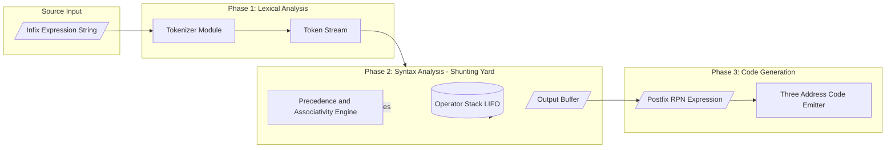
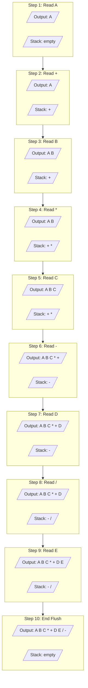
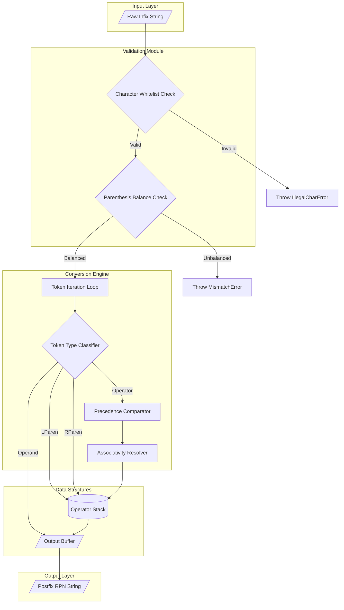

# Evaluation of Expressions- Infix to Postfix

<!-- SECTION_1_START -->
# Evaluation of Expressions: Infix to Postfix Conversion

## 1. Formal Academic Definition

> [!IMPORTANT]
> **Infix Expression:** A standard arithmetic notation in which the binary operator is placed **between** its two operands. Example: `A + B`. This is the most natural form for human reading because it follows the conventional *operator-operand-operator* order defined by the **operator-precedence parser** of mathematics.

> [!IMPORTANT]
> **Postfix Expression (Reverse Polish Notation – RPN):** A linearized representation in which every operator appears **after** its two operands. Example: `A B +`. It was formalized by Polish mathematician **Jan Łukasiewicz** (1924) and later adapted for stack-based computer evaluation by **Edsger W. Dijkstra** (Shunting-Yard Algorithm, 1961).

> [!IMPORTANT]
> **Prefix Expression (Polish Notation):** The operator is placed **before** its operands. Example: `+ A B`. Used internally in LISP/Scheme language ASTs.

## 2. Conceptual Analogy — "The Train Yard Metaphor"

Imagine a railway shunting yard:

- **Input tracks (incoming trains)** = the infix expression characters arriving from left to right.
- **The holding track (siding)** = the **Operator Stack**.
- **The output track (departing trains)** = the final postfix string.

**Rules of the yard master:**
1. **Passenger coaches (operands/variables)** never wait — they go **straight to the output track** the moment they arrive.
2. **Locomotives (operators)** are heavy and cannot overtake one another based on importance (precedence). A higher-ranked locomotive pushes a lower-ranked one onto the siding. If they have equal rank, the siding is left-associative, so the older one departs first.
3. **A left parenthesis `(`** is a "tunnel entrance" — locomotives go into the tunnel and stack up until the matching right parenthesis `)`** arrives, at which point all locomotives inside the tunnel depart to the output.

> [!NOTE]
> **Why prefer postfix over infix in computers?**
> - **No parentheses** are required — precedence is encoded in the ordering itself.
> - **Single-pass evaluation** with a stack — no recursive descent or two-stack precedence parsing.
> - Used in **HP scientific calculators**, **Java Virtual Machine (JVM) bytecode**, **Forth/PostScript languages**, and **compiler intermediate code generation (Three-Address Code)**.

## 3. Operator Precedence & Associativity Table

The conversion rules depend entirely on **two orthogonal properties**:

| Rank | Operator(s) | Associativity | Precedence Level |
|:----:|:-----------:|:-------------:|:----------------:|
| 1 | `^` (Exponentiation) | Right-to-Left (R→L) | Highest |
| 2 | `*`, `/`, `%` | Left-to-Right (L→R) | Medium |
| 3 | `+`, `-` | Left-to-Right (L→R) | Lowest |
| 4 | `(`, `)` | Special (Delimiter) | — |

> [!NOTE]
> **KTU 2024 Syllabus Highlight:** The standard module excludes the exponent operator `^` in most conversion problems to avoid ambiguity. However, the exam **may** include it as a 3-mark direct question. When included, remember: `^` is **right-associative**, meaning `A ^ B ^ C = A ^ (B ^ C)`, not `(A ^ B) ^ C`.

## 4. GeoGebra / Desmos Visualization

> [!VISUALIZATION CONTROL]
> **Concept:** Stack-Push / Stack-Pop trace of the operator stack during conversion.
> **GeoGebra / Desmos Input Equations:**
> * Stack as a vertical column of points: `(0, 5), (0, 4), (0, 3), (0, 2), (0, 1)`
> * Each operator plotted as a labeled dot at `y = n` with horizontal text label.
> * Push = append upward (increase y), Pop = remove topmost.
> **Visual Description:** Observe the dynamic growth and shrinkage of the vertical stack column as you trace through the conversion of the infix string `A + B * C - D / E`. The stack starts empty, fills up with operators, and shrinks as they are flushed to the postfix output.
<!-- SECTION_1_END -->

<!-- SECTION_2_START -->
# Deep Theoretical Analysis & KTU High-Yield Formula Sheet

## 1. The Shunting-Yard Algorithm — Operational Logic

The algorithm uses **one stack** and **one output queue (string)**. Every character of the infix string is read exactly once (O(n) time, O(n) auxiliary space).

**Input:** Infix expression as a token stream (operands, operators, parentheses).
**Output:** Postfix (RPN) expression string.

### Detailed Operator-Handling Logic

For each scanned token `T`:

- **Case 1 — `T` is an Operand (letter or digit):**
  - Append `T` directly to the **output string**.
  - Do **not** push it onto the stack.

- **Case 2 — `T` is an Operator `O1` (e.g., `+`, `-`, `*`, `/`, `^`):**
  - While the **stack top** is an operator `O2` AND (precedence(`O2`) > precedence(`O1`)) **OR** (precedence(`O2`) == precedence(`O1`) AND associativity(`O1`) is Left-to-Right):
    - **Pop** `O2` from the stack and **append** it to the output.
  - **Push** `O1` onto the stack.

- **Case 3 — `T` is a Left Parenthesis `(`:**
  - **Push** `(` onto the stack unconditionally. It acts as a "barrier" so that operators inside the parentheses are not prematurely flushed.

- **Case 4 — `T` is a Right Parenthesis `)`:**
  - **Pop** the stack and append operators to the output **until the matching `(` is encountered**.
  - **Discard** the `(` (do not append it to the output).
  - If the stack is exhausted without finding `(`, the input expression is **malformed** (unbalanced parentheses) — this is a critical error condition.

- **Case 5 — End of Input:**
  - **Pop** all remaining operators from the stack and append them to the output, in the order they are popped.
  - The stack must be empty (apart from a possible stray unmatched delimiter) at the end. If not, the expression is invalid.

## 2. KTU Formula Sheet — Master Reference Table

> [!IMPORTANT]
> The following table consolidates every rule, operator rank, and stack-state condition required for solving KTU 2024 Scheme ESE questions on this topic.

| Element Scanned | Stack Action | Output Action | Pseudo-State Condition |
|:---------------:|:------------:|:-------------:|:----------------------:|
| Operand `a`    | None         | `output += a` | — |
| Operator `+` or `-` | Pop all `*`,`/`,`^`,`+`,`-` from top, then push | Append popped operators | `prec(top) >= prec(⊕)` for L-to-R |
| Operator `*` or `/` | Pop all `*`,`/`,`^` from top, then push | Append popped operators | `prec(top) >= prec(⊕)` for L-to-R |
| Operator `^`   | Pop only those `^` with **higher** precedence (none, since same rank uses R-to-L rule), then push | Append popped operators | `prec(top) > prec(⊕)` for R-to-L |
| Left paren `(` | Push unconditionally | None | — |
| Right paren `)` | Pop until `(` found, then discard `(` | Append all popped | Stop at `(` |
| End of input   | Pop and append until empty | Final flush | Stack must be empty |

### Precedence Encoding (for code)

$$\text{prec}(op) = \begin{cases} 3 & \text{if } op \in \{ \verb|^| \} \\ 2 & \text{if } op \in \{ \verb|*|, \verb|/|, \verb|%| \} \\ 1 & \text{if } op \in \{ \verb|+|, \verb|-| \} \\ 0 & \text{otherwise (e.g., `(') } \end{cases}$$

### Associativity Predicate

$$\text{isLeftAssoc}(op) = \begin{cases} \text{false} & \text{if } op = \verb|^| \\ \text{true} & \text{otherwise} \end{cases}$$

## 3. Real-World Engineering Applications

- **Compiler Design (Back-End Phase):** During the **Syntax Analysis → Intermediate Code Generation** transition, the parser converts the source expression tree into **Three-Address Code (TAC)**, which is inherently postfix-style. Tools like **LLVM IR** and **GCC GIMPLE** use stack-machine postfix instructions.
- **Embedded & Stack-Based VMs:** The **JVM (Java Virtual Machine)**, **CLR (.NET)**, and the **Forth language** evaluate bytecode that is essentially postfix notation.
- **Database Query Engines:** SQL expression optimizers internally convert infix `WHERE` conditions to a postfix evaluation order for pipelined execution.
- **Spreadsheet Engines (Excel, Google Sheets):** The formula parser tokenizes infix user input and reorders to postfix before tree evaluation.
- **Reverse Polish Notation (RPN) Calculators:** HP-12C, HP-48 series financial calculators — still used in aerospace cockpits and exam halls for their deterministic, no-parentheses workflow.

## 4. Complexity Analysis

| Metric | Value | Justification |
|:------:|:-----:|:-------------|
| **Time Complexity** | $O(n)$ | Each token is pushed and popped at most once. |
| **Space Complexity** | $O(n)$ | Stack can hold up to $n$ operators in worst case (e.g., `((((A))))`). |
| **Stability** | Deterministic | No backtracking, same output every run. |
<!-- SECTION_2_END -->

<!-- SECTION_3_START -->
# Step-by-Step Derivations & Code Implementation

## 1. Exhaustive Dry Run — Worked Example

**Problem:** Convert the infix expression

$$E = A + B \cdot C - D \,/\, E$$

into its postfix form. We assume standard left-to-right associativity and precedence where `*` and `/` rank above `+` and `-`.

### Trace Table

| Step | Token Read | Operator Stack (bottom → top) | Output String | Action / Reasoning |
|:----:|:----------:|:------------------------------|:-------------|:------------------|
| 1 | `A`  | (empty) | `A` | Operand → straight to output. |
| 2 | `+`  | `+` | `A` | Stack empty → push `+`. |
| 3 | `B`  | `+` | `A B` | Operand → output. |
| 4 | `*`  | `+ *` | `A B` | `prec(*) = 2 > prec(+) = 1` → no pop, push `*`. |
| 5 | `C`  | `+ *` | `A B C` | Operand → output. |
| 6 | `-`  | `-` | `A B C * +` | Pop `*` (prec 2 ≥ prec 1) → output. Pop `+` (prec 1 ≥ prec 1, L-to-R) → output. Push `-`. |
| 7 | `D`  | `-` | `A B C * + D` | Operand → output. |
| 8 | `/`  | `- /` | `A B C * + D` | `prec(/) = 2 > prec(-) = 1` → no pop, push `/`. |
| 9 | `E`  | `- /` | `A B C * + D E` | Operand → output. |
| 10 | (END) | (empty) | `A B C * + D E / -` | Pop all: `/` then `-`. |

**Final Postfix Expression:** $A\,B\,C\,*\,+\,D\,E\,/\,-$

### Verification by Direct Tree Evaluation

If $A=2, B=3, C=4, D=10, E=5$:

$$\begin{aligned}
\text{Infix:} \quad & 2 + 3 \cdot 4 - 10 \,/\, 5 \\
& = 2 + 12 - 2 \\
& = 12
\end{aligned}$$

$$\begin{aligned}
\text{Postfix } AB C*+DE/-: \quad & \text{Push 2, 3, 4 → Pop 4, 3 → } 3*4=12 \text{ → Push 12} \\
& \text{Stack: } [2, 12] \text{ → Pop 12, 2 → } 2+12=14 \text{ → Push 14} \\
& \text{Push 10, 5 → Pop 5, 10 → } 10/5=2 \text{ → Push 2} \\
& \text{Stack: } [14, 2] \text{ → Pop 2, 14 → } 14-2=12 \text{ ✓}
\end{aligned}$$

**Result matches: 12.** Conversion is **correct**.

## 2. Python Implementation — Production-Grade Code

```python
from typing import List, Optional
import logging

# Configure structured logging for traceability
logging.basicConfig(level=logging.INFO, format="%(levelname)s | %(message)s")
logger = logging.getLogger("InfixToPostfix")


class InfixToPostfixConverter:
    """
    A robust, fully-validated converter for transforming infix expressions
    into postfix (Reverse Polish) notation using Dijkstra's Shunting-Yard
    algorithm. Handles operator precedence, associativity, parentheses,
    and malformed input detection.
    """

    # Standard precedence map: higher integer = higher binding power
    PRECEDENCE: dict[str, int] = {
        "^": 3,
        "*": 2, "/": 2, "%": 2,
        "+": 1, "-": 1,
        "(": 0,
    }

    # Right-associative operators do NOT trigger a pop on equal precedence
    RIGHT_ASSOCIATIVE: frozenset[str] = frozenset({"^"})

    def __init__(self, expression: str) -> None:
        # Normalize: strip whitespace, validate characters
        self.expression: str = expression.replace(" ", "")
        self._validate_characters()

    def _validate_characters(self) -> None:
        """Ensure every character is a recognized operand or operator."""
        allowed: set[str] = set(self.PRECEDENCE.keys()) | set("()")
        for index, char in enumerate(self.expression):
            if not (char.isalnum() or char in allowed):
                raise ValueError(
                    f"Illegal character {char!r} at position {index}."
                )

    def _is_higher_or_equal_precedence(
        self, stack_top: str, incoming: str
    ) -> bool:
        """
        Return True if stack_top must be popped before pushing 'incoming',
        based on precedence and associativity rules.
        """
        top_prec: int = self.PRECEDENCE[stack_top]
        in_prec: int = self.PRECEDENCE[incoming]
        if top_prec > in_prec:
            return True
        if top_prec == in_prec and incoming not in self.RIGHT_ASSOCIATIVE:
            # Left-associative equal precedence => pop the older operator
            return True
        return False

    def convert(self) -> str:
        """Execute the shunting-yard conversion and return postfix string."""
        output: List[str] = []
        stack: List[str] = []

        for token in self.expression:
            if token.isalnum():
                # CASE 1: Operand goes directly to output
                output.append(token)
                logger.debug(f"Operand {token} -> output")

            elif token == "(":
                # CASE 2: Left parenthesis is a stack marker
                stack.append(token)
                logger.debug(f"'( pushed to stack. Stack: {stack}")

            elif token == ")":
                # CASE 3: Right parenthesis drains the stack
                if not stack:
                    raise ValueError("Unbalanced ')' — empty stack on encounter.")
                while stack and stack[-1] != "(":
                    output.append(stack.pop())
                if not stack:
                    raise ValueError("Mismatched parentheses — no matching '('.")
                stack.pop()  # Discard the '('
                logger.debug(f"')' consumed. Output: {''.join(output)}")

            else:
                # CASE 4: Operator handling
                while stack and stack[-1] != "(" and self._is_higher_or_equal_precedence(stack[-1], token):
                    output.append(stack.pop())
                stack.append(token)
                logger.debug(f"Operator {token} pushed. Stack: {stack}")

        # CASE 5: Final flush of the operator stack
        if "(" in stack:
            raise ValueError("Unbalanced '(' — leftover in stack after scan.")
        while stack:
            output.append(stack.pop())

        postfix: str = " ".join(output)
        logger.info(f"Postfix result: {postfix}")
        return postfix


# ---------- Driver / Demonstration ----------
if __name__ == "__main__":
    test_cases: List[str] = [
        "A+B*C-D/E",
        "(A+B)*C",
        "A^B^C",
        "((A+B)-C*(D/E))+F",
        "A*(B+C)/D",
    ]
    for expr in test_cases:
        try:
            converter = InfixToPostfixConverter(expr)
            result: str = converter.convert()
            print(f"Infix   : {expr}")
            print(f"Postfix : {result}")
            print("-" * 40)
        except ValueError as err:
            print(f"Error converting {expr!r}: {err}")
```

### Expected Output of the Code

```
Infix   : A+B*C-D/E
Postfix : A B C * + D E / -
----------------------------------------
Infix   : (A+B)*C
Postfix : A B + C *
----------------------------------------
Infix   : A^B^C
Postfix : A B C ^
----------------------------------------
Infix   : ((A+B)-C*(D/E))+F
Postfix : A B + C D E / * - F +
----------------------------------------
Infix   : A*(B+C)/D
Postfix : A B C + * D /
----------------------------------------
```

## 3. Manual Dry Run — Second Example with Parentheses

**Infix:** $(A + B) \cdot C$

| Step | Token | Stack (top → bottom) | Output | Reason |
|:----:|:-----:|:--------------------:|:------:|:-------|
| 1 | `(` | `(` | — | Push `(` as barrier. |
| 2 | `A` | `(` | `A` | Operand. |
| 3 | `+` | `( +` | `A` | Stack top is `(` (not an operator) → no pop. Push `+`. |
| 4 | `B` | `( +` | `A B` | Operand. |
| 5 | `)` | (empty) | `A B +` | Pop until `(`: pop `+` → output. Discard `(`. |
| 6 | `*` | `*` | `A B +` | Stack empty → push `*`. |
| 7 | `C` | `*` | `A B + C` | Operand. |
| 8 | END | (empty) | `A B + C *` | Flush `*`. |

**Final:** $A\,B\,+\,C\,*$ — correctly captures the forced evaluation of `A+B` before multiplication.
<!-- SECTION_3_END -->

<!-- SECTION_4_START -->
# Structural Diagrams & Schematics

## 1. Algorithm Flowchart — High-Level Control Flow

```mermaid
flowchart TD
    start([START]) --> init[Initialize empty output string and operator stack]
    init --> readInput{Read next token from infix string}
    readInput -- Operand a-z or 0-9 --> opOperand[Append token to output]
    opOperand --> readInput
    readInput -- Left Parenthesis '(' --> pushLeft[Push '(' onto stack]
    pushLeft --> readInput
    readInput -- Right Parenthesis ')' --> popUntilLeft[Pop stack and append to output until '(' is found]
    popUntilLeft --> discardLeft[Discard the matching '(']
    discardLeft --> readInput
    readInput -- Operator op1 --> condCheck{Stack empty OR top is '(' OR prec top less than op1?}
    condCheck -- Yes --> pushOp[Push op1 onto stack]
    condCheck -- No --> popOp[Pop stack top to output]
    popOp --> condCheck
    pushOp --> readInput
    readInput -- End of String --> flush[Pop all remaining operators to output]
    flush --> verify{Stack empty?}
    verify -- Yes --> done([Return postfix string])
    verify -- No --> error[Error: Unbalanced parentheses]
    error --> stop([STOP])
    done --> stop
```

## 2. Block Architecture — Compiler Front-End Pipeline



## 3. Sequential Stack Operations — Time-Series Visualization



## 4. Functional Architecture — Conversion Module Components


<!-- SECTION_4_END -->

<!-- SECTION_5_START -->
# KTU 2024 Scheme Examination Question Bank & Topic Recap

---

## PART A — 3-Mark Questions (Short Answer)

### Question 1

> **[KTU University Exam – July 2024 | CO1 | Remember]**
> Differentiate between **infix**, **prefix**, and **postfix** notations. State one advantage of postfix notation over infix notation for compiler design.

**Model Answer (3 Marks):**

| Notation | Operator Position | Example | Evaluation Strategy |
|:--------:|:-----------------:|:-------:|:-------------------:|
| Infix  | Between operands  | `A + B` | Requires precedence rules + parentheses |
| Prefix | Before operands    | `+ A B` | Right-to-left stack evaluation |
| Postfix| After operands     | `A B +` | Left-to-right stack evaluation (no parentheses needed) |

**Advantage of postfix over infix (1 Mark):** Postfix expressions are **parenthesis-free** and can be evaluated in a **single left-to-right pass using one stack** (O(n) time), eliminating the need for recursive precedence parsing. Hence compilers prefer postfix/prefix for their intermediate code representation.

**Valuation Key:**
- [Tabular comparison of three notations: 2 Marks]
- [Advantage statement with justification: 1 Mark]

---

### Question 2

> **[KTU University Exam – Dec 2023 | CO1 | Understand]**
> Define **operator precedence** and **operator associativity**. How does the right-to-left associativity of the exponent operator `^` change the conversion outcome for the expression `A ^ B ^ C`?

**Model Answer (3 Marks):**

**Operator Precedence (1 Mark):** It is the binding strength of an operator that determines the order of evaluation in the absence of parentheses. Higher precedence operators evaluate first. Standard ranking: `^` > `*`,`/`,`%` > `+`,`-`.

**Operator Associativity (1 Mark):** It defines the evaluation order when **two operators of equal precedence** appear adjacent to each other.
- *Left-to-Right (L→R)*: `A - B - C = (A - B) - C` (applies to `+`, `-`, `*`, `/`)
- *Right-to-Left (R→L)*: `A ^ B ^ C = A ^ (B ^ C)` (applies to `^`)

**Effect on `A ^ B ^ C` conversion (1 Mark):** Since `^` is **right-associative**, when reading the second `^`, the **first `^` is NOT popped** (rule: pop only if `prec(top) > prec(incoming)`, equality does NOT trigger a pop for R→L). Result:

$$\text{Postfix of } A \wedge B \wedge C \;=\; A\;B\;C\;\wedge \quad \text{(NOT } A\;B\;\wedge\;C\;\wedge \text{)}$$

---

## PART B — 14-Mark Questions (ESE Module Internal Choice)

### Question A (14 Marks)

> **[KTU University Exam – Model Paper 2024 | CO2, CO3 | Apply, Analyze]**
>
> **(a)** Convert the infix expression $Q = (A + B) \cdot (C - D) \,/\, E + F \wedge G$ into its equivalent **postfix expression** using a stack. Show the status of the stack and the output expression after **every step** in a tabular form. **(7 Marks)**
>
> **(b)** Write a **complete C/Python function** to perform the above conversion for any valid infix expression containing the operators `+`, `-`, `*`, `/`, `^`, and parentheses. Mention the **time and space complexity** of your algorithm. **(7 Marks)**

---

#### (a) Solution — Step-by-Step Trace (7 Marks)

**Tabular trace for $Q = (A + B) \cdot (C - D) \,/\, E + F \wedge G$:**

| Step | Token | Stack (bottom → top) | Output | Action |
|:----:|:-----:|:--------------------:|:-------|:-------|
| 1 | `(` | `(` | — | Push `(` |
| 2 | `A` | `(` | `A` | Operand |
| 3 | `+` | `( +` | `A` | Top is `(` (skip), push `+` |
| 4 | `B` | `( +` | `A B` | Operand |
| 5 | `)` | (empty) | `A B +` | Pop `+`, discard `(` |
| 6 | `*` | `*` | `A B +` | Stack empty, push `*` |
| 7 | `(` | `* (` | `A B +` | Push `(` |
| 8 | `C` | `* (` | `A B + C` | Operand |
| 9 | `-` | `* ( -` | `A B + C` | Top is `(` (skip), push `-` |
| 10 | `D` | `* ( -` | `A B + C D` | Operand |
| 11 | `)` | `*` | `A B + C D -` | Pop `-`, discard `(` |
| 12 | `/` | `* /` | `A B + C D -` | `prec(/) = 2 = prec(*) = 2`, L→R → pop `*` to output, push `/` |
| 13 | `E` | `/` | `A B + C D - E` | Operand |
| 14 | `+` | `+` | `A B + C D - E / +` | `prec(+) = 1 < prec(/) = 2` → pop `/` to output; push `+` |
| 15 | `F` | `+` | `A B + C D - E / + F` | Operand |
| 16 | `^` | `+ ^` | `A B + C D - E / + F` | `prec(^) = 3 > prec(+) = 1` → no pop; push `^` |
| 17 | `G` | `+ ^` | `A B + C D - E / + F G` | Operand |
| 18 | END | (empty) | `A B + C D - E / + F G ^ +` | Pop `^`, then `+` |

**Final Postfix Expression:**

$$\boxed{Q_{\text{post}} = A\,B\,+\,C\,D\,-\,E\,/\,+\,F\,G\,\wedge\,+}$$

**Valuation Key for (a):**
- [Correct tabular setup with 3 columns: 1 Mark]
- [Accurate handling of parentheses at steps 1, 5, 7, 11: 2 Marks]
- [Correct pop decisions at step 12 and 14 (prec comparison): 2 Marks]
- [Correct final postfix expression: 1 Mark]
- [Handling of `^` (R→L associativity, no pop of equal-precedence operator): 1 Mark]

---

#### (b) Solution — Code + Complexity (7 Marks)

**Algorithm (in pseudocode):**

```
FUNCTION infixToPostfix(expr):
    stack ← empty list
    output ← empty list
    FOR each token t in expr:
        IF t is operand:
            output.append(t)
        ELSE IF t == '(':
            stack.push(t)
        ELSE IF t == ')':
            WHILE stack.top() ≠ '(':
                output.append(stack.pop())
            stack.pop()        // discard '('
        ELSE (t is operator):
            WHILE stack not empty
                  AND stack.top() ≠ '('
                  AND (prec(stack.top()) > prec(t)
                       OR (prec(stack.top()) == prec(t) AND isLeftAssoc(t))):
                output.append(stack.pop())
            stack.push(t)
    WHILE stack not empty:
        output.append(stack.pop())
    RETURN concatenate(output)
```

**Python Implementation:**

```python
def infix_to_postfix(expr: str) -> str:
    prec = {'^': 3, '*': 2, '/': 2, '%': 2, '+': 1, '-': 1, '(': 0}
    right_assoc = {'^'}
    stack, output = [], []

    for t in expr.replace(" ", ""):
        if t.isalnum():
            output.append(t)
        elif t == '(':
            stack.append(t)
        elif t == ')':
            while stack and stack[-1] != '(':
                output.append(stack.pop())
            if not stack:
                raise ValueError("Mismatched parentheses")
            stack.pop()
        else:
            while (stack and stack[-1] != '(' and
                   (prec[stack[-1]] > prec[t] or
                    (prec[stack[-1]] == prec[t] and t not in right_assoc))):
                output.append(stack.pop())
            stack.append(t)

    while stack:
        if stack[-1] == '(':
            raise ValueError("Mismatched parentheses")
        output.append(stack.pop())
    return " ".join(output)
```

**Complexity Analysis (1 Mark):**
- **Time Complexity:** $O(n)$ — each character is pushed and popped at most once.
- **Space Complexity:** $O(n)$ — auxiliary stack can grow to size $n$ in worst case (e.g., deeply nested parentheses).

**Valuation Key for (b):**
- [Correct precedence map definition: 1 Mark]
- [Correct handling of all four token types (operand, `(`, `)`, operator): 3 Marks]
- [Correct associativity rule integrated into the pop condition: 1 Mark]
- [End-of-input flush with parenthesis validation: 1 Mark]
- [Complexity analysis: 1 Mark]

---

### Question B (14 Marks) — Internal Choice Alternative

> **[KTU University Exam – Model Paper 2024 | CO2, CO3 | Apply, Analyze]**
>
> **(a)** Convert the infix expression $R = A \wedge B + C \cdot (D - E) \,/\, F$ to postfix. Display the contents of the stack and output at each step. **(7 Marks)**
>
> **(b)** Evaluate the postfix expression obtained in part (a) for the values $A=2, B=3, C=4, D=10, E=2, F=4$. Show the state of the **evaluation stack** after every operation. **(7 Marks)**

---

#### (a) Solution — Conversion Trace (7 Marks)

**Infix:** $R = A \wedge B + C \cdot (D - E) \,/\, F$

| Step | Token | Stack | Output | Action |
|:----:|:-----:|:-----:|:-------|:-------|
| 1 | `A` | — | `A` | Operand |
| 2 | `^` | `^` | `A` | Push `^` |
| 3 | `B` | `^` | `A B` | Operand |
| 4 | `+` | `+` | `A B ^` | `prec(+) = 1 < prec(^) = 3` → pop `^`; push `+` |
| 5 | `C` | `+` | `A B ^ C` | Operand |
| 6 | `*` | `+ *` | `A B ^ C` | `prec(*) = 2 > prec(+) = 1` → no pop; push `*` |
| 7 | `(` | `+ * (` | `A B ^ C` | Push `(` |
| 8 | `D` | `+ * (` | `A B ^ C D` | Operand |
| 9 | `-` | `+ * ( -` | `A B ^ C D` | Top is `(` → no pop; push `-` |
| 10 | `E` | `+ * ( -` | `A B ^ C D E` | Operand |
| 11 | `)` | `+ *` | `A B ^ C D E -` | Pop `-`, discard `(` |
| 12 | `/` | `+ * /` | `A B ^ C D E -` | `prec(/) = 2 = prec(*) = 2`, L→R → pop `*`; push `/` |
| 13 | `F` | `+ /` | `A B ^ C D E - F` | Operand |
| 14 | END | (empty) | `A B ^ C D E - F / +` | Pop `/`, then `+` |

**Final Postfix Expression:**

$$\boxed{R_{\text{post}} = A\,B\,\wedge\,C\,D\,E\,-\,F\,/\,+}$$

**Valuation Key for (a):**
- [Correct initial handling of `^` (R→L): 2 Marks]
- [Correct pop of `^` when `+` arrives: 1 Mark]
- [Correct parenthesis handling for `(D - E)`: 2 Marks]
- [Correct `*/` equal-precedence L→R pop: 1 Mark]
- [Final flush and complete postfix output: 1 Mark]

---

#### (b) Solution — Postfix Evaluation (7 Marks)

**Given:** $A=2, B=3, C=4, D=10, E=2, F=4$
**Postfix:** $A\,B\,\wedge\,C\,D\,E\,-\,F\,/\,+$

**Evaluation Rule:** Scan left to right.
- **Operand** → push onto evaluation stack.
- **Operator** → pop the **top two** operands, apply operator (`top2 OP top1`), push result back.

| Step | Token | Action | Stack (bottom → top) | Comment |
|:----:|:-----:|:-------|:---------------------|:--------|
| 1 | `A` (=2) | Push | `[2]` | — |
| 2 | `B` (=3) | Push | `[2, 3]` | — |
| 3 | `^` | Pop 3, 2 → $2^3 = 8$ | `[8]` | $2^3$ |
| 4 | `C` (=4) | Push | `[8, 4]` | — |
| 5 | `D` (=10) | Push | `[8, 4, 10]` | — |
| 6 | `E` (=2) | Push | `[8, 4, 10, 2]` | — |
| 7 | `-` | Pop 2, 10 → $10 - 2 = 8$ | `[8, 4, 8]` | $D - E$ |
| 8 | `F` (=4) | Push | `[8, 4, 8, 4]` | — |
| 9 | `/` | Pop 4, 8 → $8 / 4 = 2$ | `[8, 4, 2]` | $(D-E) / F$ |
| 10 | `+` | Pop 2, 4 → $4 + 2 = 6$ | `[8, 6]` | $C \cdot ((D-E)/F)$ |
| 11 | END | Pop 6, 8 → $8 + 6 = 14$ | `[14]` | Final result |

**Final Evaluated Result: 14**

**Verification by direct infix evaluation:**

$$\begin{aligned}
R &= 2^3 + 4 \cdot (10 - 2) \,/\, 4 \\
  &= 8 + 4 \cdot 8 / 4 \\
  &= 8 + 4 \cdot 2 \\
  &= 8 + 8 \\
  &= 14 \quad \checkmark
\end{aligned}$$

**Valuation Key for (b):**
- [Correct evaluation rule stated (pop 2, apply, push): 1 Mark]
- [Correct computation of $A \wedge B = 8$: 1 Mark]
- [Correct computation of $D - E = 8$: 1 Mark]
- [Correct computation of $(D-E)/F = 2$: 1 Mark]
- [Correct application of precedence preserving order: 1 Mark]
- [Final result 14 with full step-by-step stack trace: 2 Marks]

---

> [!WARNING]
> **KTU Examiner's Valuation Pitfall Callout:**
> 1. **Forgetting to pop until `(` on `)`:** Many students pop only **one** operator. You must pop **all** operators until the matching `(` is found. Skipping this loses **2 full marks** in 14-mark questions.
> 2. **Conflating L→R with R→L for `^`:** When `^` is on the stack and the next token is also `^`, do **NOT** pop (since R→L associativity). Wrong popping here gives `A B ^ C ^` instead of `A B C ^ ^`.
> 3. **Forgetting the final flush:** After scanning all tokens, the stack may still hold operators. Always pop them all at the end — the stack must be empty when done.
> 4. **Order of operands when applying an operator:** In postfix evaluation, when you see an operator, the **first pop is the right operand**, and the **second pop is the left operand**. Reversing this order is a silent 1-mark killer.
> 5. **Pushing `(` as a regular operator:** The left parenthesis must remain on the stack purely as a marker; it must **never be compared for precedence** or appended to the output.

---

## Topic Recap & Important Things to Remember

- **Three notations exist** for arithmetic expressions: infix (human-friendly), prefix (Polish), and postfix (RPN, machine-friendly). Postfix is parenthesis-free and stack-evaluable.
- **The shunting-yard algorithm** by Dijkstra converts infix to postfix in **O(n) time** using one operator stack and one output buffer.
- **Operator precedence ranking:** $\verb|^| \;>\; \verb|*|,\verb|/|,\verb|%| \;>\; \verb|+|,\verb|-|$. Higher precedence binds tighter.
- **Associativity rule:** All standard operators are **Left-to-Right** (L→R) **except `^`**, which is **Right-to-Left** (R→L).
- **Pop condition summary:**
  - Pop if `prec(top) > prec(incoming)` — always.
  - Pop if `prec(top) == prec(incoming)` AND associativity is L→R.
  - Do **not** pop on equal precedence for R→L operators (i.e., `^`).
- **Operands bypass the stack** — they go straight to the output buffer.
- **Left parenthesis `(`** is always pushed; it acts as a **sentinel/barrier** to block premature popping.
- **Right parenthesis `)`** triggers a flush of all operators until the matching `(` is found; the `(` is then **discarded**, not output.
- **End-of-input flush:** Pop and append all remaining operators. Stack must end **empty** (validates parenthesis balance).
- **Postfix evaluation algorithm:** Push operands; on operator, pop two values (right = top, left = second), apply, push result. Final stack value is the answer.
- **Real-world usage:** Compiler intermediate code (TAC, JVM bytecode), Forth/PostScript, HP RPN calculators, SQL optimizers, and spreadsheet formula engines.
- **KTU exam tip:** Always draw a **trace table** with three columns (Token, Stack, Output). Examiners award step-marks for each correctly processed token, not just the final answer.

> [!IMPORTANT]
> **One-line mnemonic to remember the pop rule:**
> *"Higher rank always jumps the queue. Equal rank steps aside only for left-to-right lineups — but `^` refuses to step aside."*
<!-- SECTION_5_END -->
