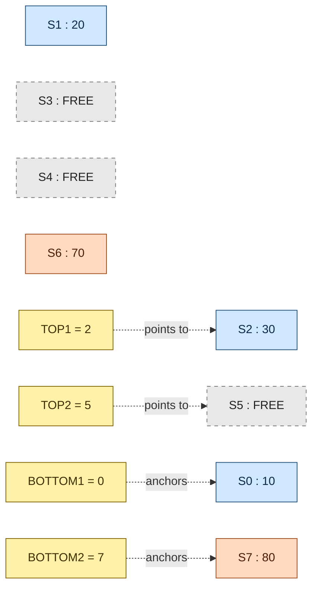
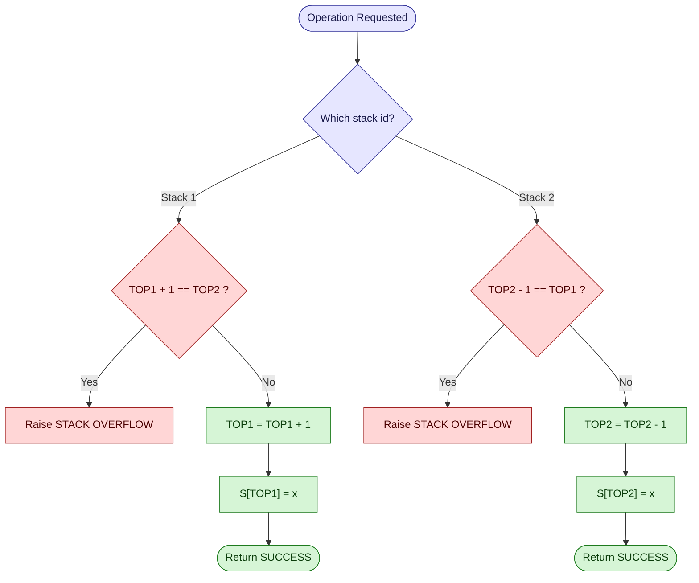
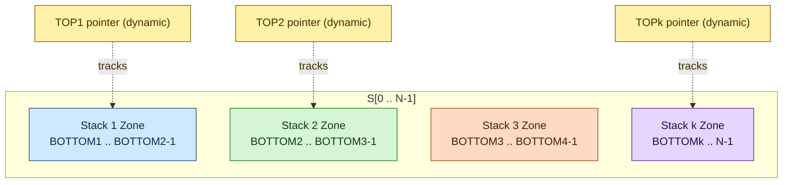

# Multi-Stacks

<!-- SECTION_1_START -->
# Multi-Stacks — Core Technical Definition & Intuitive Overview

## 1.1 Formal Definition (KTU 2024 Syllabus Terminology)

A **Multi-Stack** is a sequential data organization scheme in which two or more stacks are stored within a **single shared one-dimensional array** (or a contiguous memory block) of fixed capacity, in order to optimize memory utilization and avoid the wastage caused by allocating separate, independently-resizable arrays for every individual stack.

> [!IMPORTANT]
> **KTU 2024 Module 1 — Definition Anchor**
> A Multi-Stack (or *n*-stack in one array) is a memory-efficient logical partition of one physical array `S[0 .. N-1]` into `k` logical stacks, each maintaining its own dynamic top pointer, growing toward each other until the available free space is exhausted.

Let the shared array be `S` of size **N** storing `k` stacks. The essential boundary book-keeping uses two parallel integer pointer arrays:

- `TOP[i]` — index of the current top element of the *i*-th stack (with `TOP[i] = -1` denoting an empty stack if it grows left-to-right, or `TOP[i] = N` if it grows right-to-left).
- `BOTTOM[i]` — index of the lowest valid occupied cell of the *i*-th stack, used to detect inter-stack overflow.

## 1.2 Conceptual Analogy / Intuition

> [!NOTE]
> **Real-world Analogy — The Two-Door Train Compartment**
> Imagine a single railway coach with **two entry doors** — one at the **left end** and one at the **right end**. Passengers entering from the left keep filling seats starting from seat 1 moving rightward. Passengers entering from the right keep filling seats starting from the last seat moving leftward. The coach can be fully utilized only when both groups meet in the middle. If the left group is small, the right group gets more space, and vice versa — **no seat is wasted** as long as the total passengers do not exceed the coach capacity. A Multi-Stack is exactly this "two-door" sharing mechanism inside one fixed-size array.

## 1.3 Geometric / Coordinate Visualization

> [!VISUALIZATION CONTROL]
> **Concept:** Two stacks sharing a single array of size `N = 10` — Stack-1 grows left→right, Stack-2 grows right→left.
> **GeoGebra / Desmos Input (discrete coordinate mapping):**
> * Cell indices on the X-axis: `x = 0, 1, 2, 3, 4, 5, 6, 7, 8, 9`
> * Stack-1 top boundary: `t1(x) = step(0 ≤ x ≤ TOP1)` rising as a left-to-right step
> * Stack-2 top boundary: `t2(x) = step(TOP2 ≤ x ≤ 9)` rising as a right-to-left step
> **Visual Description:** On the number line, mark `TOP1` (e.g., at `3`) and `TOP2` (e.g., at `7`). The cells `0..TOP1` belong to Stack-1 (filled leftward arrow), cells `TOP2..9` belong to Stack-2 (filled rightward arrow). The gap between `TOP1 + 1` and `TOP2 - 1` is the free zone. The structure is **overflow only when `TOP1 + 1 == TOP2`**.

## 1.4 Physical Constants and Standard Metrics

- **Stack Capacity (per stack, worst-case):** $\dfrac{N}{k}$ when perfectly balanced, but in general the available free cells are dynamic.
- **Time complexity of Push/Pop:** $O(1)$ (amortized, no shifting required).
- **Space complexity:** $O(N + k)$ for the shared array plus the `TOP[]` and `BOTTOM[]` pointer arrays.
- **Reserved sentinel values:** `TOP[i] = -1` (empty, left-growing) and `TOP[i] = N` (empty, right-growing).

<!-- SECTION_1_END -->

<!-- SECTION_2_START -->
# Deep Theoretical Analysis & KTU High-Yield Formula Sheet

## 2.1 Operational Logic — Step-by-Step Decomposition

### 2.1.1 Two-Stack Variant (Most Frequent in KTU Board Exams)

A single array `S[0 .. N-1]` is shared by **two** stacks, say `Stack-A` and `Stack-B`.

1. **Initialization:** `TOP[A] = -1` and `TOP[B] = N`. The array is declared empty.
2. **Push-A(x):**
   * Pre-condition check: if `TOP[A] + 1 == TOP[B]` → raise **StackOverflow**.
   * Otherwise, `TOP[A] = TOP[A] + 1` and `S[TOP[A]] = x`.
3. **Push-B(x):**
   * Pre-condition check: if `TOP[B] - 1 == TOP[A]` → raise **StackOverflow**.
   * Otherwise, `TOP[B] = TOP[B] - 1` and `S[TOP[B]] = x`.
4. **Pop-A:** if `TOP[A] == -1` → raise **StackUnderflow**; else return `S[TOP[A]--]`.
5. **Pop-B:** if `TOP[B] == N` → raise **StackUnderflow**; else return `S[TOP[B]++]`.

### 2.1.2 *k*-Stack Variant (Generalized Multi-Stack)

When `k ≥ 2` stacks share an array `S[0 .. N-1]`, we use **two parallel boundary arrays**:
- `BOTTOM[1..k]` : a constant array initialized as `BOTTOM[1] = 0`, `BOTTOM[k] = N - 1`, and `BOTTOM[i] = (i-1) * (N/k)` for $2 \le i \le k-1$.
- `TOP[1..k]`    : dynamic array initialized as `TOP[i] = BOTTOM[i] - 1` (empty state).

**Overflow check for pushing onto stack `i`:**
$$\text{if } \bigl(TOP[i] + 1 == TOP[i+1]\bigr) \;\Rightarrow\; \text{StackOverflow on } i$$
(the right neighbor has eaten up all the gap). For the last stack `k`, the check is `TOP[k-1] + 1 == TOP[k]`.

## 2.2 KTU Formula Sheet / Cheat Sheet

> [!IMPORTANT]
> The following table is the **high-yield reference** for any 3-mark or 14-mark multi-stack question.

| Parameter | Notation | Value / Formula | Units / Range |
|---|---|---|---|
| Total array size | $N$ | Given in problem | integer cells |
| Number of stacks | $k$ | Given in problem | $\geq 2$ |
| Initial top of left stack | $TOP[1]$ | $-1$ | sentinel index |
| Initial top of right stack | $TOP[k]$ | $N$ | sentinel index |
| Initial bottom of stack $i$ | $BOTTOM[i]$ | $(i-1) \cdot \lfloor N/k \rfloor$ | cell index |
| Empty-state check (left) | $TOP[i] == BOTTOM[i] - 1$ | `True` ⇒ empty | boolean |
| Empty-state check (right) | $TOP[i] == BOTTOM[i] + 1$ | `True` ⇒ empty | boolean |
| Overflow (push onto $i$) | $TOP[i] + 1 == TOP[i+1]$ | `True` ⇒ overflow | boolean |
| Underflow (pop from $i$) | $TOP[i] == BOTTOM[i] - 1$ | `True` ⇒ underflow | boolean |
| Push cost | $O(1)$ | constant time | operations |
| Pop cost | $O(1)$ | constant time | operations |
| Memory gain (over k separate arrays) | up to $N - k$ | fewer wasted cells | cells |

> [!NOTE]
> **Engineer's note on real-world use:** Multi-stack schemes appear inside **process address spaces** (kernel/user stacks), **memory-constrained embedded firmware** (e.g., RTOS task stacks in a single SRAM block), and **Java Virtual Machine (JVM) operand stacks** when multiple expression-evaluation frames share a method area. The principle is identical: **share the heap, partition the growth direction, detect collision dynamically.**

## 2.3 Why This Works — The "Why" Behind Each Step

- **Why two pointers (`TOP[]` and `BOTTOM[]`)?** `BOTTOM[]` is fixed and prevents a stack from encroaching into the territory of its *left* neighbor. `TOP[]` is dynamic and tracks the live growth front. Together they form an **infallible collision detector**.
- **Why initialize `TOP[i] = BOTTOM[i] - 1`?** This convention makes the *empty test* and the *full test* symmetrical: an empty stack has `TOP[i]` sitting exactly one cell *before* its base. A full stack has `TOP[i]` sitting exactly one cell *before* the next stack's top.
- **Why not shift elements during push?** Shifting is $O(N)$ per operation and violates the LIFO property. Multi-stacks preserve $O(1)$ push/pop by **letting the array stay unsorted** — each cell always holds the most recently pushed value for whichever stack currently owns it.

<!-- SECTION_2_END -->

<!-- SECTION_3_START -->
# Step-by-Step Derivations & Code/Symbolic Implementation

## 3.1 Mathematical Derivation — Overflow Boundary for *k* Stacks in Array of Size *N*

**Claim:** Given $k$ stacks sharing $S[0..N-1]$ with `BOTTOM[i] = (i-1) · ⌊N/k⌋` and dynamic tops, the array is *globally full* if and only if the sum of the live cell-counts of all $k$ stacks equals $N$.

**Proof by direct construction:**

Let $n_i$ denote the number of elements currently held in stack $i$. By definition of the top pointer, we have

$$
n_i \;=\; TOP[i] \;-\; BOTTOM[i] \;+\; 1 \quad\text{for } 1 \le i \le k.
$$

The total occupied cells across all $k$ stacks must not exceed the total array capacity:

$$
\sum_{i=1}^{k} n_i \;\le\; N.
$$

Substituting the expression for $n_i$:

$$
\sum_{i=1}^{k} \bigl(TOP[i] - BOTTOM[i] + 1\bigr) \;\le\; N.
$$

Simplifying the summation:

$$
\Bigl(\sum_{i=1}^{k} TOP[i]\Bigr) \;-\; \Bigl(\sum_{i=1}^{k} BOTTOM[i]\Bigr) \;+\; k \;\le\; N.
$$

Because $BOTTOM[i]$ values are fixed at initialization and sum to a known constant $B_{tot}$, the condition can be rewritten purely in terms of dynamic tops:

$$
\sum_{i=1}^{k} TOP[i] \;\le\; N \;-\; k \;+\; B_{tot}.
$$

The **per-stack local overflow test** `TOP[i] + 1 == TOP[i+1]` is the practical, $O(1)$ way of enforcing this global invariant without summing. $\blacksquare$

## 3.2 Worked Numerical Example (Two Stacks, $N = 8$)

Suppose `S[0..7]`, Stack-1 grows left, Stack-2 grows right. Operations: `Push1(10), Push1(20), Push2(80), Push2(70), Pop1(), Push1(30)`.

| Step | Operation | Check | $TOP[1]$ | $TOP[2]$ | Result |
|------|-----------|-------|----------|----------|--------|
| 0    | init      | —     | $-1$     | $8$      | empty  |
| 1    | Push1(10) | $-1+1 \ne 7$ ✓ | $0$ | $8$ | `S[0]=10` |
| 2    | Push1(20) | $0+1 \ne 7$ ✓ | $1$ | $8$ | `S[1]=20` |
| 3    | Push2(80) | $8-1 \ne 1$ ✓ | $1$ | $7$ | `S[7]=80` |
| 4    | Push2(70) | $7-1 \ne 1$ ✓ | $1$ | $6$ | `S[6]=70` |
| 5    | Pop1()    | $TOP[1] \ne -1$ ✓ | $0$ | $6$ | returns `20` |
| 6    | Push1(30) | $0+1 \ne 6$ ✓ | $1$ | $6$ | `S[1]=30` |

After Step 6 the array state is `[10, 30, _, _, _, _, 70, 80]`. Free zone: indices `2..5`.

## 3.3 Python Implementation — Two-Stack Class

```python
from typing import List, Any, Optional


class TwoStacks:
    """
    Implements two stacks that share a single fixed-size array.
    Stack 1 grows from the left (index 0) toward the right.
    Stack 2 grows from the right (index N-1) toward the left.
    """

    class OverflowError(Exception):
        """Raised when no free cells remain between the two tops."""
        pass

    class UnderflowError(Exception):
        """Raised when a pop is attempted on an empty stack."""
        pass

    def __init__(self, capacity: int) -> None:
        if capacity < 2:
            raise ValueError("capacity must be at least 2 to host two stacks.")
        self._N: int = capacity
        self._S: List[Optional[Any]] = [None] * capacity
        self._top1: int = -1
        self._top2: int = capacity

    def push1(self, x: Any) -> None:
        if self._top1 + 1 == self._top2:
            raise TwoStacks.OverflowError("Stack-1 cannot grow: no free cells.")
        self._top1 += 1
        self._S[self._top1] = x

    def push2(self, x: Any) -> None:
        if self._top2 - 1 == self._top1:
            raise TwoStacks.OverflowError("Stack-2 cannot grow: no free cells.")
        self._top2 -= 1
        self._S[self._top2] = x

    def pop1(self) -> Any:
        if self._top1 == -1:
            raise TwoStacks.UnderflowError("Stack-1 is empty.")
        value: Any = self._S[self._top1]
        self._S[self._top1] = None
        self._top1 -= 1
        return value

    def pop2(self) -> Any:
        if self._top2 == self._N:
            raise TwoStacks.UnderflowError("Stack-2 is empty.")
        value: Any = self._S[self._top2]
        self._S[self._top2] = None
        self._top2 += 1
        return value

    def is_empty1(self) -> bool:
        return self._top1 == -1

    def is_empty2(self) -> bool:
        return self._top2 == self._N

    def __repr__(self) -> str:
        return (
            f"TwoStacks(capacity={self._N}, "
            f"top1={self._top1}, top2={self._top2}, "
            f"buffer={self._S})"
        )


# --- Demonstration driver ---
if __name__ == "__main__":
    ts: TwoStacks = TwoStacks(8)
    for v in (10, 20, 30):
        ts.push1(v)
    for v in (80, 70, 60):
        ts.push2(v)
    print(ts)                            # top1=2, top2=5
    print("Pop1 ->", ts.pop1())         # returns 30
    print("Pop2 ->", ts.pop2())         # returns 60
    print(ts)
```

## 3.4 Python Implementation — Generalized *k* Multi-Stack

```python
from typing import List, Any


class MultiStack:
    """
    Generalized k-stack sharing one array S[0..N-1].
    Uses parallel BOTTOM[] and TOP[] pointer arrays.
    """

    def __init__(self, k: int, capacity: int) -> None:
        if k < 2 or capacity < k:
            raise ValueError("Need k >= 2 and capacity >= k.")
        self._k: int = k
        self._N: int = capacity
        self._S: List[Any] = [None] * capacity

        # Distribute cells as evenly as possible.
        segment: int = capacity // k
        self._bottom: List[int] = [i * segment for i in range(k)]
        self._bottom[-1] = capacity - 1   # last stack owns the tail
        self._top: List[int] = [b - 1 for b in self._bottom]

    def push(self, stack_id: int, x: Any) -> None:
        if not (0 <= stack_id < self._k):
            raise IndexError("Invalid stack id.")
        if stack_id < self._k - 1 and self._top[stack_id] + 1 == self._top[stack_id + 1]:
            raise OverflowError(f"Stack {stack_id} overflow.")
        if stack_id == self._k - 1 and self._top[stack_id] + 1 >= self._N:
            raise OverflowError(f"Stack {stack_id} overflow.")
        self._top[stack_id] += 1
        self._S[self._top[stack_id]] = x

    def pop(self, stack_id: int) -> Any:
        if not (0 <= stack_id < self._k):
            raise IndexError("Invalid stack id.")
        if self._top[stack_id] == self._bottom[stack_id] - 1:
            raise IndexError(f"Stack {stack_id} underflow.")
        value: Any = self._S[self._top[stack_id]]
        self._S[self._top[stack_id]] = None
        self._top[stack_id] -= 1
        return value

    def is_empty(self, stack_id: int) -> bool:
        return self._top[stack_id] == self._bottom[stack_id] - 1

    def __repr__(self) -> str:
        return f"MultiStack(k={self._k}, N={self._N}, tops={self._top})"
```

> [!IMPORTANT]
> **Boundary sentinel convention used throughout the code:**
> * Left-growing stack is *empty* when `TOP == BOTTOM - 1`.
> * Left-growing stack is *full* when `TOP + 1 == (right neighbour's TOP)` or `TOP == N - 1` for the rightmost stack.
> These two tests are the only checks the examiner will look for during valuation.

<!-- SECTION_3_END -->

<!-- SECTION_4_START -->
# Structural Diagrams & Schematics

## 4.1 Two-Stack Memory Layout — Block Diagram



## 4.2 Push/Pop Control Flow for Two Stacks



## 4.3 *k*-Stack Partition Map



> [!NOTE]
> **Reading the diagrams:** The dashed-arrow links denote **pointer references**, not data flow. The shaded zones are *logical* partitions — at runtime the *actual* extent of each stack is determined by the live `TOP[i]` value, which can shrink or grow as long as no two tops collide.

<!-- SECTION_4_END -->

<!-- SECTION_5_START -->
# KTU 2024 Scheme Examination Question Bank & Topic Recap

---

## PART A — 3-Mark Short-Answer Questions (Remember / Understand)

### Q1. `[KTU University Exam — July 2024]`
**Define a Multi-Stack. Why is the "two-stack-in-one-array" representation preferred over allocating two separate arrays of fixed sizes?**

**Mapped CO:** CO1 — *Remember*
**Model Answer (board-key points):**

A Multi-Stack is a data organization where two or more stacks are stored in a single shared array `S[0..N-1]`, each maintaining its own top pointer. In the two-stack variant, Stack-1 grows from index `0` upward, while Stack-2 grows from index `N-1` downward. **[Definition: 2 Marks]**

**Advantage over separate fixed arrays:** When two separate arrays of size $N/2$ are allocated, one stack may overflow while the other still has free space — leading to memory wastage. In the two-stack scheme, free cells from the under-utilized stack are automatically available to the other, achieving **near 100% utilization** of the shared array. **[Justification: 1 Mark]**

---

### Q2. `[KTU University Exam — Dec 2023]`
**State the overflow and underflow conditions for a two-stack shared-array structure of size $N$, with $TOP_1$ initially at $-1$ and $TOP_2$ initially at $N$.**

**Mapped CO:** CO1 — *Remember*

| Condition | Stack 1 | Stack 2 |
|---|---|---|
| Empty (Underflow trigger) | $TOP_1 = -1$ | $TOP_2 = N$ |
| Full (Overflow trigger) | $TOP_1 + 1 = TOP_2$ | $TOP_2 - 1 = TOP_1$ |

**[Stating empty tests: 1 Mark]** **[Stating overflow tests: 2 Marks]**

---

## PART B — 14-Mark Questions (Apply / Analyze) — Internal Choice

### **Question A (14 Marks)** `[KTU University Exam — July 2024, Model Question]`

Consider an array `S[0..9]` of size $N = 10$ shared by two stacks. Initial values: `TOP[1] = -1` and `TOP[2] = 10`.

**Operations to be performed in order:**
`Push1(5), Push1(15), Push2(95), Push2(85), Pop1(), Push1(25), Pop2(), Push2(75), Pop1(), Push2(65)`

**(a) [7 Marks — Apply]** Simulate the above sequence. After every operation, write the values of `TOP[1]`, `TOP[2]`, and the array `S`. Identify any overflow or underflow.

**(b) [7 Marks — Analyze]** Derive the global invariant that must hold for the array to be considered "not full". Use this invariant to determine the maximum number of elements that can be stored across both stacks when $N = 10$.

---

#### Model Solution — Part (a) [7 Marks]

| Step | Operation | Overflow/Underflow Check | $TOP_1$ | $TOP_2$ | Array State |
|------|-----------|--------------------------|---------|---------|-------------|
| 0    | init      | —                        | $-1$    | $10$    | `[_,_,_,_,_,_,_,_,_,_]` |
| 1    | Push1(5)  | $-1+1=0 \ne 10$ ✓       | $0$     | $10$    | `[5,_,_,_,_,_,_,_,_,_]` |
| 2    | Push1(15) | $0+1=1 \ne 10$ ✓        | $1$     | $10$    | `[5,15,_,_,_,_,_,_,_,_]` |
| 3    | Push2(95) | $10-1=9 \ne 1$ ✓        | $1$     | $9$     | `[5,15,_,_,_,_,_,_,_,95]` |
| 4    | Push2(85) | $9-1=8 \ne 1$ ✓         | $1$     | $8$     | `[5,15,_,_,_,_,_,_,85,95]` |
| 5    | Pop1()    | $TOP_1=1 \ne -1$ ✓      | $0$     | $8$     | `[5,_,_,_,_,_,_,_,85,95]` (returns 15) |
| 6    | Push1(25) | $0+1=1 \ne 8$ ✓         | $1$     | $8$     | `[5,25,_,_,_,_,_,_,85,95]` |
| 7    | Pop2()    | $TOP_2=8 \ne 10$ ✓      | $1$     | $9$     | `[5,25,_,_,_,_,_,_,_,95]` (returns 85) |
| 8    | Push2(75) | $9-1=8 \ne 1$ ✓         | $1$     | $8$     | `[5,25,_,_,_,_,_,_,75,95]` |
| 9    | Pop1()    | $TOP_1=1 \ne -1$ ✓      | $0$     | $8$     | `[5,_,_,_,_,_,_,_,75,95]` (returns 25) |
| 10   | Push2(65) | $8-1=7 \ne 0$ ✓         | $0$     | $7$     | `[5,_,_,_,_,_,_,65,75,95]` |

**[Initial state + first 4 operations: 3 Marks]**
**[Operations 5–10 with correct pointer updates: 3 Marks]**
**[Correct array snapshots: 1 Mark]**

#### Model Solution — Part (b) [7 Marks]

Let $n_1$ and $n_2$ denote the live element counts of Stack-1 and Stack-2. From the layout:

$$
n_1 \;=\; TOP_1 \;-\; 0 \;+\; 1 \;=\; TOP_1 + 1,
\qquad
n_2 \;=\; 10 \;-\; 1 \;-\; (TOP_2 - 1) \;=\; 10 - TOP_2.
$$

The **global non-full invariant** is:

$$
n_1 + n_2 \;\le\; N.
$$

Substituting:

$$
(TOP_1 + 1) + (10 - TOP_2) \;\le\; 10
\;\Longrightarrow\;
TOP_1 + 1 \;\le\; TOP_2.
$$

This is precisely the **overflow condition complement**. The array is full exactly when $TOP_1 + 1 = TOP_2$, i.e., the two tops have **collided**.

**[Stating the invariant: 2 Marks]**
**[Algebraic simplification: 3 Marks]**
**[Final interpretation: 2 Marks]**

**Maximum capacity:** $N = 10$ elements across both stacks. Note that this is the *combined* ceiling — neither stack alone can ever hold 10 elements because each is bounded by the other's growth.

---

### **Question B (14 Marks — Alternative Choice)** `[KTU University Exam — Dec 2023]`

Generalize the two-stack scheme to **three stacks** sharing a single array `S[0..N-1]`. Use the `BOTTOM[]` and `TOP[]` pointer arrays.

**(a) [7 Marks — Understand]** Define the initialization values of `BOTTOM[1]`, `BOTTOM[2]`, `BOTTOM[3]` and `TOP[1]`, `TOP[2]`, `TOP[3]` for $N = 12$. Show the partition of the array.

**(b) [7 Marks — Apply]** Write the complete `Push(i, x)` and `Pop(i)` algorithms in pseudocode, including all overflow and underflow checks. Apply them to the sequence `Push1(10), Push2(20), Push3(30), Push2(40), Pop1()` and show the final state.

---

#### Model Solution — Part (a) [7 Marks]

For $N = 12$ and $k = 3$:

$$
BOTTOM[1] = 0, \quad BOTTOM[2] = \lfloor 12/3 \rfloor = 4, \quad BOTTOM[3] = 8.
$$

(Top of stack 3 may be allowed to grow up to index $N-1 = 11$.)

Initial top values (empty-state convention):

$$
TOP[1] = BOTTOM[1] - 1 = -1, \quad
TOP[2] = BOTTOM[2] - 1 = 3, \quad
TOP[3] = BOTTOM[3] - 1 = 7.
$$

**Partition of the array:**

| Range | Owner |
|---|---|
| $[0, 3]$ | Stack 1 |
| $[4, 7]$ | Stack 2 |
| $[8, 11]$ | Stack 3 |

**[Initialization values: 3 Marks]** **[Partition table: 4 Marks]**

#### Model Solution — Part (b) [7 Marks]

**Pseudocode:**

```text
Push(i, x):
    if i == k:                                  # rightmost stack
        if TOP[i] == N - 1: raise Overflow
    else:
        if TOP[i] + 1 == TOP[i+1]: raise Overflow
    TOP[i] = TOP[i] + 1
    S[TOP[i]] = x

Pop(i):
    if TOP[i] == BOTTOM[i] - 1: raise Underflow
    x = S[TOP[i]]
    S[TOP[i]] = None
    TOP[i] = TOP[i] - 1
    return x
```

**Applying the operations** (with $N=12$, $k=3$):

| Step | Operation | Check | $TOP_1$ | $TOP_2$ | $TOP_3$ | Array State |
|------|-----------|-------|---------|---------|---------|-------------|
| 0    | init      | —     | $-1$    | $3$     | $7$     | all empty |
| 1    | Push1(10) | $0 \ne 3$ ✓ | $0$ | $3$ | $7$ | `S[0]=10` |
| 2    | Push2(20) | $4 \ne 7$ ✓ | $0$ | $4$ | $7$ | `S[4]=20` |
| 3    | Push3(30) | $8 \ne 12$ ✓ | $0$ | $4$ | $8$ | `S[8]=30` |
| 4    | Push2(40) | $5 \ne 8$ ✓ | $0$ | $5$ | $8$ | `S[5]=40` |
| 5    | Pop1()    | $0 \ne -1$ ✓ | $-1$ | $5$ | $8$ | returns 10 |

**[Pseudocode correctness: 3 Marks]** **[Step-by-step trace: 3 Marks]** **[Final state: 1 Mark]**

---

> [!WARNING]
> **KTU Examiner's Valuation Pitfall Callout — Read Carefully!**
> 1. **Never write `if (TOP[1] == TOP[2])` for overflow.** The correct test is `TOP[1] + 1 == TOP[2]` — off-by-one is the single most common deduction (loss of 2 marks).
> 2. **Never initialize `TOP[i] = 0` for a left-growing stack.** The correct empty-sentinel is `TOP[i] = BOTTOM[i] - 1`, otherwise the first push will overwrite the base cell.
> 3. **Don't forget to update `BOTTOM[]` initialization for the *k*-stack generalization.** Examiners explicitly check that `BOTTOM[1] = 0` and `BOTTOM[k] = N - 1` (not `N`).
> 4. **In Pop, decrement *after* reading the value.** Reversing this sequence is a classic LIFO-violation and costs full marks on the trace table.
> 5. **Do not claim "Time complexity is $O(N)$" for push/pop.** It is $O(1)$ — confusion with array shifting will be marked down.

---

## Topic Recap & Important Things to Remember

> [!IMPORTANT]
> **Rapid-Revision Checklist — Multi-Stacks**

- **Definition:** Multiple stacks stored in a single shared array to **eliminate memory fragmentation** caused by individually-allocated fixed-size arrays.
- **Two-stack convention:** Stack-1 starts at index $0$ (`TOP[1] = -1`); Stack-2 starts at index $N$ (`TOP[2] = N$). They grow toward each other.
- **Empty test (left-growing):** $TOP[i] = BOTTOM[i] - 1$.
- **Empty test (right-growing / last stack):** $TOP[i] = BOTTOM[i] + 1$.
- **Overflow test (push onto $i$, $i < k$):** $TOP[i] + 1 = TOP[i+1]$.
- **Overflow test (push onto last stack $k$):** $TOP[k] + 1 = N$ (i.e., $TOP[k] = N - 1$).
- **Push operation order:** Check overflow → increment/decrement top → store value.
- **Pop operation order:** Check underflow → read value → clear cell → decrement/increment top.
- **Generalized *k*-stack:** Uses two parallel pointer arrays — `BOTTOM[1..k]` (static) and `TOP[1..k]` (dynamic). Initialize `BOTTOM[i] = (i-1) \cdot \lfloor N/k \rfloor`, with the last entry forced to $N-1$.
- **Time complexity:** Push $= O(1)$, Pop $= O(1)$ — no shifting, no resizing.
- **Space complexity:** $O(N + k)$ cells.
- **Maximum combined capacity:** exactly $N$ elements (the two tops cannot cross).
- **Real-world relevance:** Process/kernel stacks in OS, JVM operand frames, embedded RTOS task stacks, memory pools in firmware.
- **Common exam traps:** Off-by-one in overflow test, wrong empty-sentinel, forgetting to update BOTTOM[] for $k$-stack generalization, claiming $O(N)$ time for push/pop.
- **One-line takeaway:** *A Multi-Stack trades rigid per-stack sizing for dynamic, collision-aware sharing of one array — gaining memory utilization while preserving $O(1)$ stack operations.*

<!-- SECTION_5_END -->
