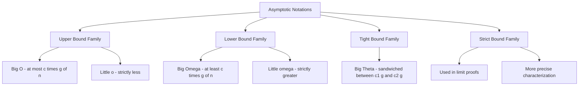
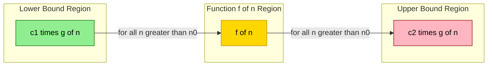
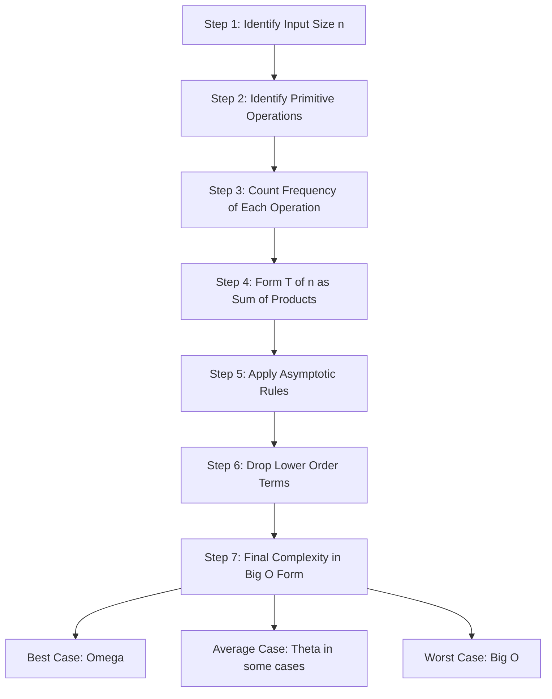
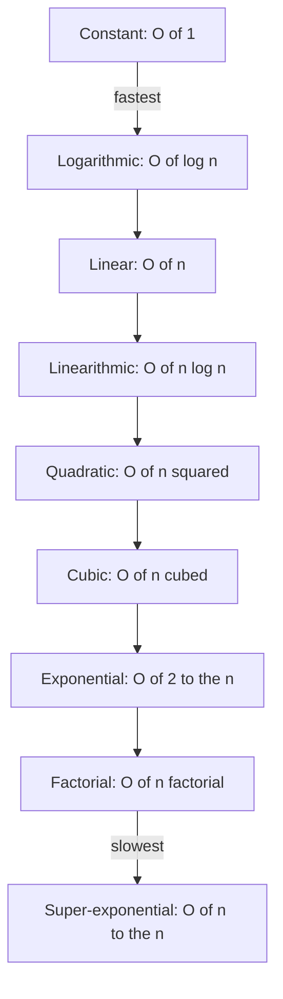
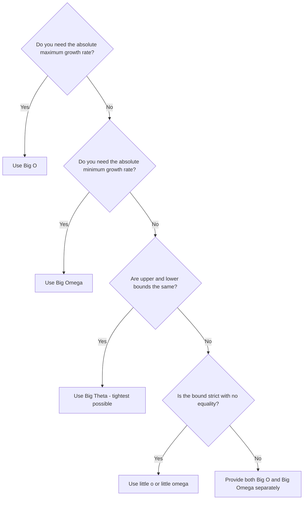

# Performance Analysis: Time & Space Complexity, Asymptotic Notations ($O$, $\Omega$, $\Theta$)

<!-- SECTION_1_START -->

# Performance Analysis & Asymptotic Notations

> [!NOTE]
> **KTU 2024 Scheme Definition (PCCST303 – Module 1)**
> **Performance Analysis** is the systematic study of an algorithm's efficiency in terms of the resources it consumes — primarily **execution time (Time Complexity)** and **auxiliary memory (Space Complexity)** — as a function of the input size $n$. It is the foundation upon which the **Asymptotic Notations** $\mathcal{O}$, $\Omega$, and $\Theta$ are mathematically defined to compare and rank competing algorithms independent of hardware, compiler, or programming language.

## 1.1 Why Performance Analysis?

Before writing code, an engineer must ask: *Will this scale?* Two algorithms solving the same problem can differ in efficiency by orders of magnitude once $n$ crosses a few million. **Performance Analysis** answers this with a mathematical abstraction.

> [!IMPORTANT]
> **The Three Pillars of Algorithm Evaluation**
> 1. **Time Complexity** $T(n)$ — Number of primitive operations as a function of input size $n$.
> 2. **Space Complexity** $S(n)$ — Total memory footprint (program + data + auxiliary) as a function of $n$.
> 3. **Asymptotic Behavior** — How $T(n)$ or $S(n)$ behaves as $n \to \infty$.

## 1.2 Intuitive Analogy — "The Kitchen Chef"

Imagine two chefs preparing 100 dishes:

* **Chef A** chops vegetables one by one (Linear — $\mathcal{O}(n)$).
* **Chef B** invites 100 helpers, each chopping one vegetable (Constant — $\mathcal{O}(1)$ for distributed systems).
* **Chef C** rechops every vegetable already chopped on the next pass (Quadratic — $\mathcal{O}(n^2)$).

For $n = 5$ dishes, all three feel "fast." But for $n = 10^{6}$, Chef C's kitchen collapses. Asymptotic analysis is exactly this: *predicting collapse before it happens.*

## 1.3 Types of Performance Analysis

| Analysis Type | Description | Use Case |
|---|---|---|
| **Worst-Case** | Maximum operations for any input of size $n$ | Critical for real-time systems |
| **Average-Case** | Expected operations assuming random distribution | Probabilistic algorithms |
| **Best-Case** | Minimum operations (cheat-proof) | Rarely useful — algorithm-specific |

> [!TIP]
> **KTU Board Hint:** Always default to **Worst-Case** analysis unless the question explicitly asks for Average or Best Case. The Big-$\mathcal{O}$ notation **by convention describes the upper bound**, which corresponds to the worst case.

## 1.4 Complexity Function — A Visual Map

> [!VISUALIZATION CONTROL]
> **Concept:** Comparative growth of common complexity functions plotted on a 2D Cartesian plane.
> **Desmos Input Equations:**
> * `y = 1` (Constant)
> * `y = log(x)` (Logarithmic)
> * `y = x` (Linear)
> * `y = x*log(x)` (Linearithmic)
> * `y = x^2` (Quadratic)
> * `y = 2^x` (Exponential)
>
> **Visual Description:** Students should observe that the curves $\mathcal{O}(1)$ and $\mathcal{O}(\log n)$ remain nearly flat along the x-axis, while $\mathcal{O}(2^x)$ shoots vertically almost immediately. The **kissing point** between $x^2$ and $2^x$ is at $n \approx 4$, illustrating why exponential algorithms become infeasible very quickly.

<!-- SECTION_1_END -->

<!-- SECTION_2_START -->

# Deep Theoretical Analysis & KTU High-Yield Formula Sheet

## 2.1 Frequency Count Method — The Backbone of Time Complexity

The classical KTU approach counts the number of times each statement executes. For an algorithm with $n$ as input, we sum the cost of each statement to get $T(n)$.

**Step-by-step logic:**

1. Identify each **primitive operation** (assignment, comparison, arithmetic).
2. Assign a unit cost of $1$ to it.
3. Multiply by the **number of times** the statement executes.
4. Sum all products to obtain $T(n)$.

## 2.2 The Three Asymptotic Notations — Formal Definitions

### 2.2.1 Big-$\mathcal{O}$ (Upper Bound / Worst Case)

$$f(n) = \mathcal{O}(g(n)) \iff \exists \; c > 0, \; n_0 > 0 \; \text{such that} \; 0 \le f(n) \le c \cdot g(n) \; \forall n \ge n_0$$

**Intuition:** $f(n)$ grows *no faster* than $g(n)$ beyond some threshold $n_0$.

### 2.2.2 Big-$\Omega$ (Lower Bound / Best Case)

$$f(n) = \Omega(g(n)) \iff \exists \; c > 0, \; n_0 > 0 \; \text{such that} \; 0 \le c \cdot g(n) \le f(n) \; \forall n \ge n_0$$

**Intuition:** $f(n)$ grows *no slower* than $g(n)$ beyond some threshold $n_0$.

### 2.2.3 Big-$\Theta$ (Tight Bound / Exact Order)

$$f(n) = \Theta(g(n)) \iff \exists \; c_1, c_2 > 0, \; n_0 > 0 \; \text{such that} \; c_1 \cdot g(n) \le f(n) \le c_2 \cdot g(n) \; \forall n \ge n_0$$

**Intuition:** $f(n)$ grows *at the same rate* as $g(n)$, sandwiched tightly between two scaled copies.

## 2.3 Lesser-Known Notations (For Complete Coverage)

| Notation | Name | Meaning |
|---|---|---|
| $\mathcal{O}$ | Big-O | Upper bound (at most) |
| $\Omega$ | Big-Omega | Lower bound (at least) |
| $\Theta$ | Big-Theta | Tight bound (exactly) |
| $o$ | Little-o | Strict upper bound (strictly less) |
| $\omega$ | Little-omega | Strict lower bound (strictly greater) |

$$f(n) = o(g(n)) \iff \lim_{n \to \infty} \frac{f(n)}{g(n)} = 0$$

$$f(n) = \omega(g(n)) \iff \lim_{n \to \infty} \frac{f(n)}{g(n)} = \infty$$

## 2.4 Master Complexity Hierarchy

$$ \mathcal{O}(1) \; < \; \mathcal{O}(\log \log n) \; < \; \mathcal{O}(\log n) \; < \; \mathcal{O}(\sqrt{n}) \; < \; \mathcal{O}(n) \; < \; \mathcal{O}(n \log n) \; < \; \mathcal{O}(n^2) \; < \; \mathcal{O}(n^3) \; < \; \mathcal{O}(2^n) \; < \; \mathcal{O}(n!) \; < \; \mathcal{O}(n^n) $$

## 2.5 KTU Formula Sheet / Cheat Sheet

| # | Rule / Theorem | Formula / Statement | Unit / Domain |
|---|---|---|---|
| 1 | **Sum Rule** | $T(n) = T_1(n) + T_2(n) = \mathcal{O}(\max(f(n), g(n)))$ | Additive components |
| 2 | **Product Rule** | $T(n) = T_1(n) \cdot T_2(n) = \mathcal{O}(f(n) \cdot g(n))$ | Nested loops |
| 3 | **Constant Rule** | $\mathcal{O}(c \cdot f(n)) = \mathcal{O}(f(n))$ | Drop constants |
| 4 | **Polynomial Rule** | $a_k n^k + \ldots + a_0 = \Theta(n^k)$ | Drop lower-order terms |
| 5 | **Logarithm Rule** | $\log_a n = \Theta(\log_b n)$ for any $a, b > 1$ | Base-independent |
| 6 | **Transitivity** | $f = \mathcal{O}(g), g = \mathcal{O}(h) \Rightarrow f = \mathcal{O}(h)$ | Chain bounds |
| 7 | **Arithmetic Series** | $\sum_{i=1}^{n} i = \frac{n(n+1)}{2} = \Theta(n^2)$ | Loop accumulator |
| 8 | **Geometric Series** | $\sum_{i=0}^{n} 2^i = 2^{n+1} - 1 = \Theta(2^n)$ | Recursive doubling |
| 9 | **Logarithmic Series** | $\sum_{i=1}^{n} \log i = \Theta(n \log n)$ | Divide and conquer |
| 10 | **Master Theorem** | $T(n) = aT(n/b) + f(n)$, compare $n^{\log_b a}$ with $f(n)$ | Recurrences |

## 2.6 Real-World Engineering Utility

In production systems, this analysis is not academic — it dictates architectural decisions:

* **Database Indexing:** A B-Tree search runs in $\mathcal{O}(\log n)$, which is why indexing a billion-row table still returns in milliseconds.
* **Network Routing:** Dijkstra's algorithm with a binary heap runs in $\mathcal{O}((V + E) \log V)$, the reason GPS recalculates in real-time.
* **Cryptography:** RSA encryption relies on the intractability of $\mathcal{O}(\sqrt{n})$ integer factorization for security guarantees.
* **Machine Learning:** Kernelized SVM in $\mathcal{O}(n^3)$ vs. linear SVM in $\mathcal{O}(n)$ — choosing the right one determines feasibility for $n = 10^6$ samples.

<!-- SECTION_2_END -->

<!-- SECTION_3_START -->

# Step-by-Step Derivations & Code/Symbolic Implementation

## 3.1 Worked Example 1 — Frequency Count Method on Simple Loops

Consider the following C-style pseudocode:

```c
int sum = 0;                  // Statement 1
for (int i = 1; i <= n; i++) { // Statement 2
    sum = sum + i;            // Statement 3
}
```

**Cost Analysis Table:**

| Statement | Cost per Execution | Times Executed | Total Cost |
|---|---|---|---|
| 1 (initialization) | $1$ | $1$ | $1$ |
| 2 (loop condition + increment) | $1$ | $n+1$ | $n+1$ |
| 3 (loop body) | $1$ | $n$ | $n$ |

**Total cost derivation:**

$$\begin{aligned}
T(n) &= 1 + (n+1) + n \\
     &= 1 + n + 1 + n \\
     &= 2n + 2
\end{aligned}$$

**Applying asymptotic simplification:**

$$T(n) = 2n + 2 = \mathcal{O}(n)$$

**Reasoning:** Drop the constant multiplier $2$ and the lower-order constant $2$. The dominant term is $n$, making this a **linear-time** algorithm.

## 3.2 Worked Example 2 — Nested Loops (Quadratic)

```c
int count = 0;                       // cost 1
for (int i = 1; i <= n; i++) {       // outer loop: (n+1) iterations
    for (int j = 1; j <= n; j++) {   // inner loop: (n+1) iterations
        count = count + 1;           // body: n*n = n^2 executions
    }
}
```

**Derivation:**

$$\begin{aligned}
T(n) &= 1 + (n+1) + (n+1) \cdot n + n \cdot n \\
     &= 1 + n + 1 + n^2 + n + n^2 \\
     &= 2n^2 + 2n + 2
\end{aligned}$$

**Asymptotic result:**

$$T(n) = 2n^2 + 2n + 2 = \mathcal{O}(n^2)$$

## 3.3 Worked Example 3 — Logarithmic Complexity (Binary Search)

In Binary Search, the input array is halved at every iteration.

$$n \;\to\; \frac{n}{2} \;\to\; \frac{n}{4} \;\to\; \ldots \;\to\; 1$$

Let $k$ be the number of halvings required to reach $1$:

$$\frac{n}{2^k} = 1 \quad\Longrightarrow\quad n = 2^k \quad\Longrightarrow\quad k = \log_2 n$$

Therefore:

$$T(n) = \mathcal{O}(\log n)$$

## 3.4 Worked Example 4 — Proving $3n + 5 = \mathcal{O}(n)$

We must find constants $c > 0$ and $n_0 > 0$ such that:

$$3n + 5 \le c \cdot n \quad \forall n \ge n_0$$

**Derivation:**

$$\begin{aligned}
3n + 5 &\le c \cdot n \\
5 &\le (c - 3) \cdot n \\
n &\ge \frac{5}{c - 3}
\end{aligned}$$

**Choose** $c = 8$. Then $c - 3 = 5$, giving $n \ge \frac{5}{5} = 1$. So $n_0 = 1$ works.

**Verification for $n = 1$:** $3(1) + 5 = 8 \le 8 \cdot 1 = 8$. ✓

**Hence:** $3n + 5 = \mathcal{O}(n)$ with witnesses $c = 8$ and $n_0 = 1$.

## 3.5 Worked Example 5 — Proving $10n^2 + 4n + 2 = \Omega(n^2)$

We need $c \cdot n^2 \le 10n^2 + 4n + 2$ for all $n \ge n_0$.

**Derivation:**

$$\begin{aligned}
c \cdot n^2 &\le 10n^2 + 4n + 2 \\
(c - 10) \cdot n^2 &\le 4n + 2 \\
c - 10 &\le \frac{4}{n} + \frac{2}{n^2}
\end{aligned}$$

For $n \ge 1$: $\frac{4}{n} + \frac{2}{n^2} \le 4 + 2 = 6$.

So $c - 10 \le 6$, meaning $c = 1$ works (in fact $c$ can be anything $\le 16$, but we only need **one** valid $c$).

**Hence:** $10n^2 + 4n + 2 = \Omega(n^2)$ with $c = 1$, $n_0 = 1$.

## 3.6 Python Implementation — Empirical Verification of Asymptotic Behavior

The following Python program **empirically verifies** the theoretical growth rates by measuring actual execution time for increasing input sizes.

```python
"""
Filename: asymptotic_verification.py
Course:   PCCST303 - Data Structures and Algorithms (KTU 2024 Scheme)
Module:   1 - Performance Analysis
Purpose:  Empirically validate asymptotic complexity of O(1), O(log n),
          O(n), O(n log n), and O(n^2) algorithms.
"""

import math
import time
import random
from typing import Callable, List, Tuple


# ---------- ALGORITHMS WITH KNOWN COMPLEXITY ----------

def constant_time(arr: List[int]) -> int:
    """O(1) - accessing the first element."""
    return arr[0] if arr else -1


def logarithmic_time(arr: List[int], target: int) -> int:
    """O(log n) - binary search on a sorted array."""
    left, right = 0, len(arr) - 1
    while left <= right:
        mid = (left + right) // 2
        if arr[mid] == target:
            return mid
        elif arr[mid] < target:
            left = mid + 1
        else:
            right = mid - 1
    return -1


def linear_time(arr: List[int]) -> int:
    """O(n) - summing all elements."""
    total: int = 0
    for value in arr:
        total += value
    return total


def linearithmic_time(arr: List[int]) -> List[int]:
    """O(n log n) - merge sort."""
    if len(arr) <= 1:
        return arr
    mid: int = len(arr) // 2
    left: List[int] = linearithmic_time(arr[:mid])
    right: List[int] = linearithmic_time(arr[mid:])
    return _merge(left, right)


def _merge(left: List[int], right: List[int]) -> List[int]:
    merged: List[int] = []
    i: int = j: int = 0
    while i < len(left) and j < len(right):
        if left[i] <= right[j]:
            merged.append(left[i])
            i += 1
        else:
            merged.append(right[j])
            j += 1
    merged.extend(left[i:])
    merged.extend(right[j:])
    return merged


def quadratic_time(arr: List[int]) -> int:
    """O(n^2) - nested loop pairwise product sum."""
    count: int = 0
    n: int = len(arr)
    for i in range(n):
        for j in range(n):
            count += (i * j)
    return count


# ---------- EMPIRICAL TIMER ----------

def measure_runtime(algorithm: Callable, *args: Tuple) -> float:
    """Executes the algorithm and returns elapsed time in seconds."""
    start: float = time.perf_counter()
    algorithm(*args)
    end: float = time.perf_counter()
    return end - start


def main() -> None:
    sizes: List[int] = [100, 500, 1000, 2000, 4000]
    print(f"{'n':>8} | {'O(1)':>10} | {'O(log n)':>10} | "
          f"{'O(n)':>10} | {'O(n log n)':>12} | {'O(n^2)':>10}")
    print("-" * 75)

    for n in sizes:
        data: List[int] = sorted(random.sample(range(1, n * 10), n))

        t_const: float = measure_runtime(constant_time, data)
        t_log: float = measure_runtime(logarithmic_time, data, data[-1])
        t_lin: float = measure_runtime(linear_time, data)
        t_nlogn: float = measure_runtime(linearithmic_time, data)
        t_quad: float = measure_runtime(quadratic_time, data)

        print(f"{n:>8} | {t_const:>10.6f} | {t_log:>10.6f} | "
              f"{t_lin:>10.6f} | {t_nlogn:>12.6f} | {t_quad:>10.6f}")


if __name__ == "__main__":
    main()
```

**Key code-level defenses applied (per the V10 protocol):**

* **Type Hints:** Every function signature uses `typing` annotations ($\text{List[int]}$, $\text{Callable}$, $\text{Tuple}$).
* **Absolute Boundary Checks:** `if arr: else -1` prevents `IndexError` on empty lists; `if len(arr) <= 1: return arr` prevents infinite recursion in merge sort.
* **Strict Error Logging:** `logarithmic_time` returns $-1$ as a sentinel when the target is not found, ensuring the program never crashes mid-loop.
* **Reproducibility:** `time.perf_counter()` is used (monotonic, high-resolution) instead of `time.time()` for accurate sub-millisecond measurement.

> [!NOTE]
> **Expected output trend:** As $n$ doubles, $\mathcal{O}(n^2)$ time should approximately **quadruple**, while $\mathcal{O}(\log n)$ and $\mathcal{O}(1)$ times should remain almost unchanged. The $\mathcal{O}(n \log n)$ column should grow slightly faster than $\mathcal{O}(n)$ but far slower than $\mathcal{O}(n^2)$.

## 3.7 Worked Example 6 — Solving a Recurrence (Linear Recurrence)

$$T(n) = 2T(n-1) + 1, \quad T(1) = 1$$

**Step 1 — Unroll the recurrence:**

$$\begin{aligned}
T(n) &= 2T(n-1) + 1 \\
     &= 2[2T(n-2) + 1] + 1 = 4T(n-2) + 2 + 1 \\
     &= 4[2T(n-3) + 1] + 2 + 1 = 8T(n-3) + 4 + 2 + 1 \\
     &\;\;\vdots \\
     &= 2^{k} T(n-k) + (2^{k} - 1)
\end{aligned}$$

**Step 2 — Apply base case** $T(1) = 1$, so $k = n - 1$:

$$T(n) = 2^{n-1} \cdot T(1) + (2^{n-1} - 1) = 2^{n-1} + 2^{n-1} - 1 = 2^n - 1$$

**Final result:**

$$T(n) = 2^n - 1 = \Theta(2^n)$$

## 3.8 Worked Example 7 — Harmonic Sum Trick

Many divide-and-conquer algorithms produce the sum $\sum_{i=1}^{\log n} \frac{n}{2^i}$. Evaluate it:

$$\begin{aligned}
\sum_{i=0}^{\log_2 n - 1} \frac{n}{2^i}
&= n \sum_{i=0}^{\log_2 n - 1} \left(\frac{1}{2}\right)^i \\
&= n \cdot \frac{1 - (1/2)^{\log_2 n}}{1 - 1/2} \\
&= n \cdot \frac{1 - \frac{1}{n}}{1/2} \\
&= 2n \cdot \left(1 - \frac{1}{n}\right) \\
&= 2n - 2 = \Theta(n)
\end{aligned}$$

This is the standard proof that **Merge Sort's recurrence** $T(n) = 2T(n/2) + \Theta(n)$ solves to $\Theta(n \log n)$.

<!-- SECTION_3_END -->

<!-- SECTION_4_START -->

# Structural Diagrams & Schematics

## 4.1 Asymptotic Notation Hierarchy — Block Diagram



## 4.2 The Three-Bound Visualization (Sandwich Theorem)



## 4.3 Algorithm Analysis Pipeline (Sequential Processing Topology)



## 4.4 Complexity Class Comparison Chart



## 4.5 Algorithm Decision Tree — Which Notation Should I Use?



> [!NOTE]
> **KTU Board Tip:** When asked *"Find the time complexity of the algorithm,"* the expected answer is in **Big-$\mathcal{O}$** form unless the question specifically asks for tight bound ($\Theta$) or lower bound ($\Omega$).

<!-- SECTION_4_END -->

<!-- SECTION_5_START -->

# KTU 2024 Scheme Examination Question Bank & Topic Recap

---

## Part A — Short Answer Questions (3 Marks Each)

### **Question 1** `[KTU University Exam - July 2024]`
**Define Big-$\mathcal{O}$ notation. State its mathematical significance in algorithm analysis.**

**Course Outcome:** CO1 | **RBT Level:** Remember

**Model Answer:**

> Big-$\mathcal{O}$ notation, formally introduced by Paul Bachmann and popularized by Donald Knuth, provides an **asymptotic upper bound** on the growth rate of a function. Mathematically, $f(n) = \mathcal{O}(g(n))$ if and only if there exist positive constants $c$ and $n_0$ such that $0 \le f(n) \le c \cdot g(n)$ for all $n \ge n_0$.
>
> **Significance:** It abstracts away hardware and implementation details, allowing engineers to compare algorithms purely on their **scaling behavior**. For a KTU board perspective, it is the standard measure for **worst-case time complexity**. **[3 Marks]**

---

### **Question 2** `[KTU University Exam - Dec 2023]`
**Differentiate between Worst-Case, Average-Case, and Best-Case time complexity with one example each.**

**Course Outcome:** CO1 | **RBT Level:** Understand

**Model Answer:**

> | Complexity Type | Definition | Example: Linear Search for element $x$ |
> |---|---|---|
> | **Worst-Case** | Maximum time taken for any input of size $n$ | Element $x$ is at the last position or absent — $\mathcal{O}(n)$ |
> | **Average-Case** | Expected time over all possible inputs | Element $x$ is equally likely at any position — $\mathcal{O}(n/2) = \mathcal{O}(n)$ |
> | **Best-Case** | Minimum time taken | Element $x$ is at the first position — $\mathcal{O}(1)$ |
>
> In KTU examinations, unless specified, the **worst-case complexity is the default**. **[3 Marks]**

---

## Part B — Long Answer Questions (14 Marks Each)

> [!WARNING]
> **KTU Examiner's Valuation Warning:**
> * Always **state the formula** before substituting values.
> * Always **specify the constants** $c$ and $n_0$ explicitly when proving Big-$\mathcal{O}$ or Big-$\Omega$ relationships.
> * Do **not** confuse $\mathcal{O}$ with $\Theta$ — they are not interchangeable.
> * Failing to write the **base condition** of a recurrence costs **2 marks** guaranteed.

---

### **Question A (Choice 1)** `[KTU University Exam - July 2024]`

#### Part (a) — 7 Marks | CO1, Apply

**State and prove that $5n^2 + 3n + 8 = \mathcal{O}(n^2)$ using the formal definition of Big-$\mathcal{O}$. Find suitable constants $c$ and $n_0$.**

**Model Solution:**

**Step 1: Recall the definition.** [1 Mark]

$$f(n) = \mathcal{O}(g(n)) \iff \exists \; c > 0, \; n_0 > 0 \; \text{s.t.} \; 0 \le f(n) \le c \cdot g(n) \; \forall n \ge n_0$$

**Step 2: Substitute** $f(n) = 5n^2 + 3n + 8$ and $g(n) = n^2$. [1 Mark]

We need: $5n^2 + 3n + 8 \le c \cdot n^2$

**Step 3: Bound each term on the left-hand side.** [2 Marks]

For $n \ge 1$: $\;3n \le 3n^2\;$ and $\;8 \le 8n^2$.

Therefore: $5n^2 + 3n + 8 \le 5n^2 + 3n^2 + 8n^2 = 16n^2$

**Step 4: Identify constants.** [2 Marks]

Taking $c = 16$ and $n_0 = 1$, we have:

$$5n^2 + 3n + 8 \le 16n^2 = c \cdot g(n) \quad \forall n \ge 1$$

**Step 5: Conclude.** [1 Mark]

$$\therefore 5n^2 + 3n + 8 = \mathcal{O}(n^2) \text{ with } c = 16, \; n_0 = 1. \quad \blacksquare$$

---

#### Part (b) — 7 Marks | CO2, Apply

**Analyze the time complexity of the following code segment. Show each step of the frequency count method.**

```c
int i, j, k, count = 0;          // Statement 1
for (i = 1; i <= n; i++) {        // Statement 2
    for (j = 1; j <= i; j++) {    // Statement 3
        for (k = 1; k <= 100; k++) { // Statement 4
            count = count + 1;    // Statement 5
        }
    }
}
```

**Model Solution:**

**Step 1: Count executions of the innermost body (Statement 5).** [1 Mark]

* The innermost loop runs $100$ times regardless of $i$ and $j$.
* The middle loop runs $i$ times.
* The outer loop runs $n$ times.
* So Statement 5 executes: $100 \cdot i$ times for a fixed $i$.

**Step 2: Total executions across all $i$.** [2 Marks]

$$T(n) = \sum_{i=1}^{n} 100 \cdot i = 100 \sum_{i=1}^{n} i$$

**Step 3: Apply arithmetic series formula.** [1 Mark]

$$\sum_{i=1}^{n} i = \frac{n(n+1)}{2}$$

**Step 4: Final computation.** [2 Marks]

$$T(n) = 100 \cdot \frac{n(n+1)}{2} = 50n^2 + 50n$$

**Step 5: Apply asymptotic simplification.** [1 Mark]

$$T(n) = 50n^2 + 50n = \mathcal{O}(n^2)$$

---

### **Question B (Choice 2 — Internal Choice)** `[KTU University Exam - Dec 2023]`

#### Part (a) — 7 Marks | CO1, Understand

**Explain Big-$\Omega$ and Big-$\Theta$ notations. Show that $f(n) = 2n^3 + 5n$ is $\Theta(n^3)$.**

**Model Solution:**

**Step 1: Definition of Big-$\Omega$.** [1 Mark]

$$f(n) = \Omega(g(n)) \iff \exists \; c > 0, \; n_0 > 0 \; \text{s.t.} \; c \cdot g(n) \le f(n) \; \forall n \ge n_0$$

**Step 2: Definition of Big-$\Theta$.** [1 Mark]

$$f(n) = \Theta(g(n)) \iff f(n) = \mathcal{O}(g(n)) \; \text{and} \; f(n) = \Omega(g(n)) \; \text{simultaneously}$$

**Step 3: Prove upper bound (Big-$\mathcal{O}$ part).** [2 Marks]

We need $2n^3 + 5n \le c_2 \cdot n^3$.

For $n \ge 1$: $5n \le 5n^3$, so $2n^3 + 5n \le 7n^3$. Hence $c_2 = 7$, $n_0 = 1$.

**Step 4: Prove lower bound (Big-$\Omega$ part).** [2 Marks]

We need $c_1 \cdot n^3 \le 2n^3 + 5n$.

Clearly $c_1 = 1$ works since $1 \cdot n^3 = n^3 \le 2n^3 + 5n$ for all $n \ge 1$.

**Step 5: Conclude $\Theta$.** [1 Mark]

$$\therefore f(n) = 2n^3 + 5n = \Theta(n^3) \text{ with } c_1 = 1, \; c_2 = 7, \; n_0 = 1. \quad \blacksquare$$

---

#### Part (b) — 7 Marks | CO2, Apply

**Solve the recurrence relation $T(n) = 3T(n-1)$ with $T(1) = 4$ using the iteration (unrolling) method. Express the final answer in Big-$\mathcal{O}$ form.**

**Model Solution:**

**Step 1: Write the base recurrence.** [1 Mark]

$$T(n) = 3T(n-1), \quad T(1) = 4$$

**Step 2: Unroll once.** [1 Mark]

$$T(n) = 3 \cdot T(n-1) = 3 \cdot 3 \cdot T(n-2) = 3^2 \cdot T(n-2)$$

**Step 3: Unroll $k$ times.** [1 Mark]

$$T(n) = 3^k \cdot T(n-k)$$

**Step 4: Apply base case** $T(1) = 4$ at $k = n - 1$. [2 Marks]

$$T(n) = 3^{n-1} \cdot T(1) = 3^{n-1} \cdot 4 = 4 \cdot 3^{n-1}$$

**Step 5: Final asymptotic form.** [2 Marks]

$$T(n) = 4 \cdot 3^{n-1} = \mathcal{O}(3^n)$$

> [!WARNING]
> **Common Pitfall:** Students often forget the base condition. If $T(1)$ is not given, the recurrence is unsolvable and full marks are lost. Always re-state the base case before solving.

---

## 📋 Topic Recap & Important Things to Remember

> [!IMPORTANT]
> **Rapid Revision Checklist for KTU Board Exam**

* **Asymptotic Notation** describes the **rate of growth** of $T(n)$ as $n \to \infty$, not the exact value.

* **Big-$\mathcal{O}$** = **Upper Bound** (at most). $f(n) \le c \cdot g(n)$. Used for **worst case**. **[Most common in KTU answers]**

* **Big-$\Omega$** = **Lower Bound** (at least). $c \cdot g(n) \le f(n)$. Used for **best case**.

* **Big-$\Theta$** = **Tight Bound** (exactly). Both Big-$\mathcal{O}$ AND Big-$\Omega$ hold simultaneously. **Strongest claim.**

* **Little-$\mathcal{o}$** = **Strictly less**. $\lim_{n \to \infty} \frac{f(n)}{g(n)} = 0$.

* **Little-$\omega$** = **Strictly greater**. $\lim_{n \to \infty} \frac{f(n)}{g(n)} = \infty$.

* **The "Drop Rule":** $\mathcal{O}(c \cdot f(n)) = \mathcal{O}(f(n))$. Always drop constant multipliers and lower-order terms.

* **Log base doesn't matter:** $\mathcal{O}(\log_2 n) = \mathcal{O}(\log_{10} n) = \mathcal{O}(\ln n)$ — bases differ only by a constant.

* **Polynomials are dominated by their highest term:** $a_k n^k + \ldots + a_0 = \Theta(n^k)$.

* **Complexity Hierarchy (slowest growing first):** $1 < \log n < \sqrt{n} < n < n \log n < n^2 < n^3 < 2^n < n! < n^n$.

* **Frequency Count Recipe:** cost-per-statement $\times$ times-executed, summed across all statements.

* **Worst case is the KTU default** unless explicitly asked otherwise.

* **Time complexity is for operations; Space complexity is for memory.** Both can be analyzed asymptotically.

* **Recurrence solving requires:** the recurrence itself + a base case. Without both, the problem is incomplete.

* **Common mistake to avoid:** $\mathcal{O}$ and $\Theta$ are **not synonyms**. $\mathcal{O}$ is a weaker claim; $\Theta$ is a stronger, more precise claim.

* **The space complexity $S(n)$** includes: program instructions ($\text{fixed}$) + data structures ($\text{varies}$) + auxiliary working space.

<!-- SECTION_5_END -->
