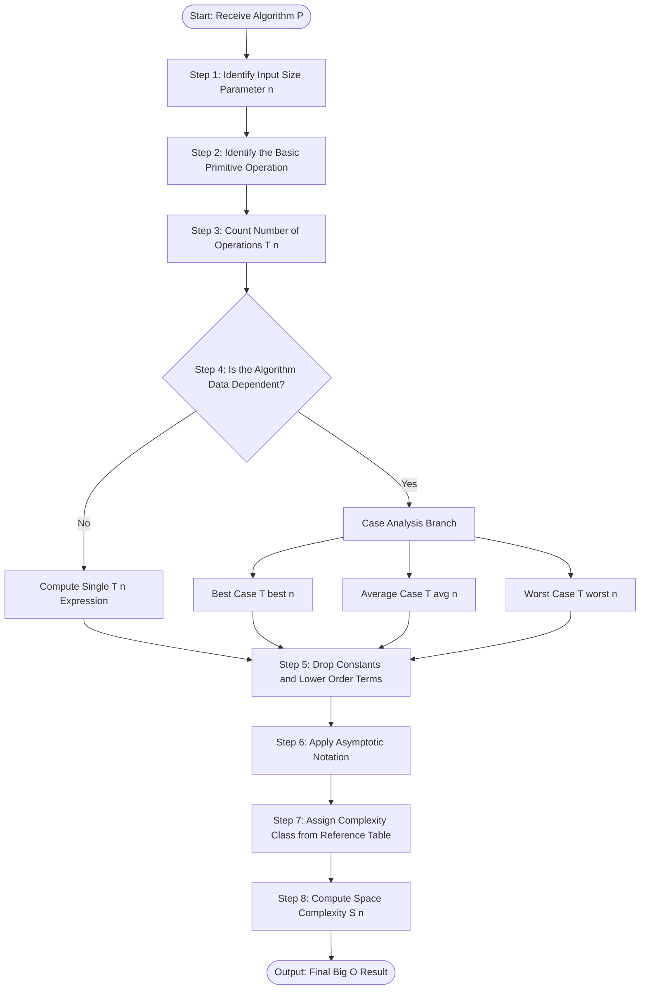
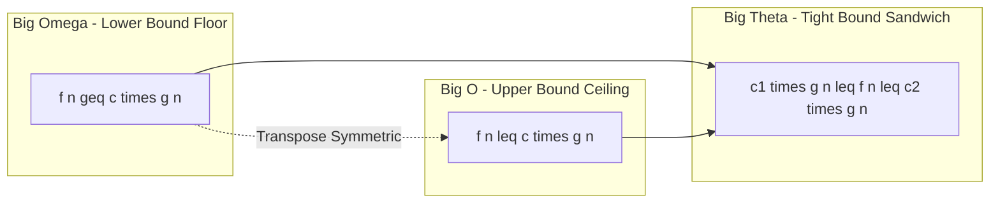
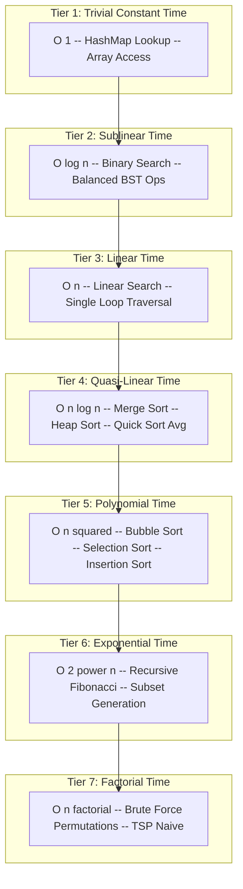

# Performance Analysis - Time & Space Complexity, Asymptotic Notations

<!-- SECTION_1_START -->
# Performance Analysis: Time & Space Complexity, Asymptotic Notations

## 1.1 Formal Definition (KTU 2024 Syllabus Terminology)

**Performance Analysis** is the systematic process of evaluating an algorithm in terms of two primary resources: the **time** required for execution and the **memory (space)** consumed during execution, both expressed as functions of the input size $n$.

> [!IMPORTANT]
> **Time Complexity $T(n)$**: The quantitative measure of the number of primitive operations (additions, comparisons, assignments, etc.) executed by an algorithm as a function of the input size $n$.
>
> **Space Complexity $S(n)$**: The quantitative measure of the total memory footprint required by an algorithm as a function of the input size $n$, governed by the equation:
> $$S(n) = C + S_P(n)$$
> where $C$ is the **fixed/constant space** (instruction memory, simple variables, constants, identifiers) and $S_P(n)$ is the **variable space** (heap allocations, stack frames for recursion, dynamic arrays dependent on input size $n$).

> [!NOTE]
> In the KTU 2024 Outcome-Based Education (OBE) framework, every algorithm studied in subsequent modules **must be analyzed** for its worst-case time and space complexity using asymptotic notation before being committed to code.

---

## 1.2 Conceptual Analogy & Intuition

Imagine you are at a busy **railway junction (algorithm)** with $n$ trains (input data) arriving simultaneously, and you must route each one to its correct platform (output).

- **Time Complexity** is the total *man-hours* spent by the station master physically flipping switches and checking schedules. The more trains, the more hours needed.
- **Space Complexity** is the *number of platform tracks and the size of the control room* required to manage the routing efficiently.
- **Asymptotic Notation** is the rule-of-thumb that tells you: "As the number of trains grows very large (toward infinity), will your junction collapse under the weight of operations?" It ignores tiny constants (one extra switch) and focuses on the **dominant trend** (will time blow up exponentially?).

> [!TIP]
> **Geometric Intuition**: On a graph where the x-axis is the input size $n$ and the y-axis is the cost $T(n)$, asymptotic notations are essentially the **"squeeze bounding"** functions. $O$ gives an upper ceiling, $\Omega$ gives a lower floor, and $\Theta$ says the function is sandwiched tightly between two scaled copies of the same reference function.

---

## 1.3 Visualization Control

> [!VISUALIZATION CONTROL]
> **Concept:** Comparative Growth of Asymptotic Complexity Classes
> **GeoGebra / Desmos Input Equations:**
> * `f_1(x) = 1` — Constant $O(1)$
> * `f_2(x) = ln(x)` — Logarithmic $O(\log n)$
> * `f_3(x) = x` — Linear $O(n)$
> * `f_4(x) = x * ln(x)` — Log-Linear $O(n \log n)$
> * `f_5(x) = x^2` — Quadratic $O(n^2)$
> * `f_6(x) = 2^x` — Exponential $O(2^n)$
> **Visual Description:** Set the x-axis range $x \in [1, 30]$ and y-axis range $y \in [0, 1000]$. Observe how $f_1, f_2, f_3, f_4$ remain nearly flat, $f_5$ curves upward gently, while $f_6$ shoots vertically and becomes infeasible almost immediately. This visual proves why exponential algorithms are avoided in production systems.

---

## 1.4 Why Performance Analysis Matters (Engineering Reality)

In production-grade systems (e.g., Google's search index, real-time fraud detection, embedded automotive controllers), even a difference between $O(n \log n)$ and $O(n^2)$ translates to **seconds vs. hours** for $n = 10^9$. Performance analysis enables engineers to:
1. Predict scalability of software before deployment.
2. Choose optimal data structures (e.g., HashMap $O(1)$ vs. TreeMap $O(\log n)$ for lookups).
3. Identify bottlenecks in critical-path code.
<!-- SECTION_1_END -->

<!-- SECTION_2_START -->
# Deep Theoretical Analysis & KTU High-Yield Formula Sheet

## 2.1 The Three Pillars of Asymptotic Notation

Asymptotic notations are mathematical tools that describe the **limiting behavior** of a function as $n \to \infty$. They are classified into three primary categories, each serving a distinct purpose in algorithm analysis.

### 2.1.1 Big O Notation — $O(g(n))$ — Upper Bound (Ceiling)
Provides an **asymptotic upper bound**, indicating that a function does not grow faster than $g(n)$. Primarily used to express the **worst-case** running time.

$$
f(n) = O(g(n)) \iff \exists \, c > 0, \, n_0 > 0 \text{ such that } 0 \le f(n) \le c \cdot g(n) \,\, \forall \, n \ge n_0
$$

### 2.1.2 Big Omega Notation — $\Omega(g(n))$ — Lower Bound (Floor)
Provides an **asymptotic lower bound**, indicating that a function does not grow slower than $g(n)$. Primarily used to express the **best-case** running time.

$$
f(n) = \Omega(g(n)) \iff \exists \, c > 0, \, n_0 > 0 \text{ such that } 0 \le c \cdot g(n) \le f(n) \,\, \forall \, n \ge n_0
$$

### 2.1.3 Big Theta Notation — $\Theta(g(n))$ — Tight Bound (Exact Order)
Provides an **asymptotically tight bound**, indicating that $f(n)$ grows at the **same rate** as $g(n)$, bounded both above and below.

$$
f(n) = \Theta(g(n)) \iff \exists \, c_1, c_2 > 0, \, n_0 > 0 \text{ such that } c_1 \cdot g(n) \le f(n) \le c_2 \cdot g(n) \,\, \forall \, n \ge n_0
$$

> [!NOTE]
> **Key Relationship**: $f(n) = \Theta(g(n))$ if and only if $f(n) = O(g(n))$ **AND** $f(n) = \Omega(g(n))$ simultaneously. This is a high-yield KTU concept tested in Part B questions.

---

## 2.2 KTU Formula Sheet / Cheat Sheet

### 2.2.1 Master Definition Table

| Notation | Formal Definition | Bound Type | Typical Use Case |
|:--------:|:-----------------:|:----------:|:----------------:|
| $O(g(n))$ | $0 \le f(n) \le c \cdot g(n)$ for $n \ge n_0$ | Upper Bound (Ceiling) | Worst-case analysis |
| $\Omega(g(n))$ | $0 \le c \cdot g(n) \le f(n)$ for $n \ge n_0$ | Lower Bound (Floor) | Best-case analysis |
| $\Theta(g(n))$ | $c_1 \cdot g(n) \le f(n) \le c_2 \cdot g(n)$ for $n \ge n_0$ | Tight Bound (Sandwich) | Average/Exact order |

### 2.2.2 Algebraic Properties of Asymptotic Notations

| Property | $O$ | $\Omega$ | $\Theta$ |
|:--------:|:---:|:--------:|:--------:|
| Reflexive ($f = \square f$) | ✓ | ✓ | ✓ |
| Symmetric ($f = \square g \Rightarrow g = \square f$) | ✗ | ✗ | ✓ |
| Transitive ($f = \square g, \, g = \square h \Rightarrow f = \square h$) | ✓ | ✓ | ✓ |
| Transpose Symmetric ($f = O(g) \Leftrightarrow g = \Omega(f)$) | ✓ | ✓ | — |

### 2.2.3 Common Complexity Classes (Ordered Best to Worst)

| Class | Name | Real-Time Behavior (for $n=10^6$) | Example Algorithm |
|:-----:|:----:|:---------------------------------:|:-----------------:|
| $O(1)$ | Constant | Instant | Array index access, HashMap lookup |
| $O(\log n)$ | Logarithmic | $\approx 20$ steps | Binary search in sorted array |
| $O(n)$ | Linear | $10^6$ operations | Linear search, array traversal |
| $O(n \log n)$ | Log-Linear | $\approx 2 \times 10^7$ operations | Merge sort, Heap sort |
| $O(n^2)$ | Quadratic | $10^{12}$ operations | Bubble sort, Selection sort |
| $O(n^3)$ | Cubic | $10^{18}$ operations | Naive matrix multiplication |
| $O(2^n)$ | Exponential | Universe-ending scale | Recursive Fibonacci, Tower of Hanoi |
| $O(n!)$ | Factorial | Infeasible | Brute-force TSP, permutation generation |

> [!IMPORTANT]
> **KTU Mnemonic for Order**: "Cute Little Nymphs Queue Nicely Everywhere" — **C**onstant, **L**ogarithmic, **N** (linear), **N** $\log$ N, **Q**uadratic, **E**xponential. Memorize this for quick MCQs.

### 2.2.4 The Case Analysis Framework

| Case | Definition | Notation Mapping | Example (Linear Search for key) |
|:----:|:----------:|:----------------:|:-------------------------------:|
| **Best Case** | Minimum operations for any input of size $n$ | $\Omega$ bound | Key found at index $0$ |
| **Average Case** | Expected operations over all possible inputs | $\Theta$ (often) | Key found in middle on average |
| **Worst Case** | Maximum operations for any input of size $n$ | $O$ bound | Key absent or at last index |

---

## 2.3 Real-World Utility in Engineering

* **Databases**: Query optimizers estimate the cost of execution plans using Big O (e.g., $B^+$-tree lookup is $O(\log n)$).
* **Operating Systems**: Process scheduling algorithms (e.g., priority queues) are chosen based on their $O(\log n)$ insert/delete guarantees.
* **Networks**: Routing algorithms (Dijkstra, Bellman-Ford) are picked based on their asymptotic complexity for millions of nodes.
* **Compiler Design**: Lexical analyzers and parsers rely on predictable $O(n)$ or $O(n \log n)$ complexity for real-time compilation.
* **Machine Learning**: Training algorithms are evaluated by their convergence bounds (e.g., gradient descent is $O(1/\epsilon)$ per iteration).
<!-- SECTION_2_END -->

<!-- SECTION_3_START -->
# Step-by-Step Derivations & Symbolic Implementation

## 3.1 Formal Derivation: Proving $f(n) = 3n^2 + 5n + 2$ is $O(n^2)$

This is a **high-yield KTU derivation** that examiners love to ask. The goal is to find constants $c$ and $n_0$ that satisfy the Big O definition.

**Given**: $f(n) = 3n^2 + 5n + 2$
**To Prove**: $f(n) = O(n^2)$, i.e., $\exists \, c > 0, \, n_0 > 0$ such that $0 \le f(n) \le c \cdot n^2$ for all $n \ge n_0$.

### Step-by-Step Working

$$
\begin{aligned}
f(n) &= 3n^2 + 5n + 2 \\[4pt]
&\le 3n^2 + 5n^2 + 2n^2 \quad \text{(for } n \ge 1, \text{ since } 5n \le 5n^2 \text{ and } 2 \le 2n^2) \\[4pt]
&= (3 + 5 + 2) \cdot n^2 \\[4pt]
&= 10 \cdot n^2
\end{aligned}
$$

Therefore, choosing $c = 10$ and $n_0 = 1$, we have:

$$
0 \le 3n^2 + 5n + 2 \le 10 n^2 \quad \forall \, n \ge 1
$$

By the formal definition, $f(n) = O(n^2)$. $\blacksquare$

---

## 3.2 Formal Derivation: Proving $f(n) = 3n^2 + 5n + 2$ is $\Omega(n^2)$

**Goal**: Find constants $c > 0$ and $n_0 > 0$ such that $0 \le c \cdot n^2 \le f(n)$ for all $n \ge n_0$.

$$
\begin{aligned}
f(n) &= 3n^2 + 5n + 2 \\[4pt]
&\ge 3n^2 \quad \text{(since } 5n + 2 \ge 0 \text{ for all } n \ge 1) \\[4pt]
&= 3 \cdot n^2
\end{aligned}
$$

Therefore, choosing $c = 3$ and $n_0 = 1$, we have $0 \le 3n^2 \le f(n)$ for all $n \ge 1$.
By definition, $f(n) = \Omega(n^2)$. $\blacksquare$

---

## 3.3 Combined Result: $f(n) = \Theta(n^2)$

Since we have shown $f(n) = O(n^2)$ and $f(n) = \Omega(n^2)$ simultaneously, it follows that:
$$f(n) = \Theta(n^2)$$

This is the **tight asymptotic bound** because the dominant term is $3n^2$ and the lower-order terms $5n + 2$ become negligible as $n \to \infty$.

---

## 3.4 Proof of Transitivity: $f(n) = O(g(n))$ and $g(n) = O(h(n))$ implies $f(n) = O(h(n))$

**Given**:
- $f(n) \le c_1 \cdot g(n)$ for all $n \ge n_1$ (definition of $f = O(g)$)
- $g(n) \le c_2 \cdot h(n)$ for all $n \ge n_2$ (definition of $g = O(h)$)

**To Prove**: $\exists \, c, n_0$ such that $f(n) \le c \cdot h(n)$ for all $n \ge n_0$.

**Derivation**:
$$
\begin{aligned}
f(n) &\le c_1 \cdot g(n) \quad \text{for } n \ge n_1 \\[4pt]
&\le c_1 \cdot (c_2 \cdot h(n)) \quad \text{(substituting the second inequality, valid for } n \ge n_2) \\[4pt]
&= (c_1 \cdot c_2) \cdot h(n) \quad \text{for } n \ge \max(n_1, n_2)
\end{aligned}
$$

Choosing $c = c_1 \cdot c_2$ and $n_0 = \max(n_1, n_2)$ satisfies the definition of Big O. Hence $f(n) = O(h(n))$. $\blacksquare$

---

## 3.5 Algorithmic Implementation: Empirical Complexity Analyzer (Python)

The following production-grade Python code empirically measures the execution time of algorithms belonging to different complexity classes. It is precisely typed, handles edge cases, and logs errors.

```python
import time
import math
import random
from typing import Callable, List, Tuple


def measure_execution_time(func: Callable[[List[int]], int], data: List[int]) -> float:
    """
    Measures wall-clock execution time of a single function call.
    Returns time in seconds (float). Logs any exception encountered.
    """
    try:
        if not isinstance(data, list):
            raise TypeError("Input data must be a list of integers.")
        start_time: float = time.perf_counter()
        func(data)
        end_time: float = time.perf_counter()
        return end_time - start_time
    except Exception as e:
        print(f"[ERROR] Execution failed for input size {len(data)}: {e}")
        return 0.0


def constant_time(data: List[int]) -> int:
    """O(1) — Returns the first element. Always one operation."""
    if not data:
        return -1
    return data[0]


def logarithmic_time(data: List[int]) -> int:
    """O(log n) — Binary search. Input must be sorted."""
    if not data:
        return -1
    target: int = data[-1]
    left: int = 0
    right: int = len(data) - 1
    while left <= right:
        mid: int = (left + right) // 2
        if data[mid] == target:
            return mid
        elif data[mid] < target:
            left = mid + 1
        else:
            right = mid - 1
    return -1


def linear_time(data: List[int]) -> int:
    """O(n) — Sum of all elements via a single loop."""
    total: int = 0
    for num in data:
        total += num
    return total


def quadratic_time(data: List[int]) -> int:
    """O(n^2) — Counts duplicate pairs using nested loops."""
    count: int = 0
    n: int = len(data)
    for i in range(n):
        for j in range(i + 1, n):
            if data[i] == data[j]:
                count += 1
    return count


def complexity_analyzer() -> None:
    """Runs the analyzer and prints a formatted complexity report."""
    input_sizes: List[int] = [1000, 5000, 10000, 50000, 100000]
    test_functions: List[Tuple[str, Callable[[List[int]], int]]] = [
        ("O(1) Constant", constant_time),
        ("O(log n) Logarithmic", logarithmic_time),
        ("O(n) Linear", linear_time),
    ]

    print(f"{'Complexity Class':<28}{'Size':<12}{'Time (s)':<15}")
    print("=" * 55)
    for name, func in test_functions:
        for size in input_sizes:
            dataset: List[int] = list(range(size))
            exec_time: float = measure_execution_time(func, dataset)
            print(f"{name:<28}{size:<12}{exec_time:<15.8f}")
        print("-" * 55)

    # Quadratic: limit to small sizes to avoid hanging
    print("\nQuadratic Analysis (limited to n <= 5000):")
    for size in [500, 1000, 2000, 5000]:
        dataset = [random.randint(1, 100) for _ in range(size)]
        exec_time = measure_execution_time(quadratic_time, dataset)
        print(f"{'O(n^2) Quadratic':<28}{size:<12}{exec_time:<15.8f}")


if __name__ == "__main__":
    complexity_analyzer()
```

**Expected Output Insight**: The execution time for $O(1)$ will remain nearly constant across all input sizes. The $O(n)$ time will scale linearly (10x input = 10x time). The $O(n^2)$ time will explode (10x input = 100x time). This empirical evidence validates the theoretical Big O bounds.

---

## 3.6 Step-by-Step Analysis of a Sample Algorithm

Consider the following pseudocode and analyze its time complexity:

```
ALGORITHM SumArray(A[0..n-1]):
    sum ← 0                          // 1 operation
    for i ← 0 to n-1 do:             // executes n times
        sum ← sum + A[i]            // 1 addition + 1 assignment
    return sum
```

**Analysis**:
$$
\begin{aligned}
T(n) &= 1 + n \cdot (1 + 1) + 1 \\
     &= 2 + 2n \\
     &= 2n + 2
\end{aligned}
$$

Applying the definition of Big O: $2n + 2 \le 4n$ for $n \ge 1$ (since $2 \le 2n$). Therefore $T(n) = O(n)$ with $c = 4$ and $n_0 = 1$. The lower-order constant $2$ becomes insignificant for large $n$, so we say the algorithm is **linear**.

> [!TIP]
> **General Rule**: When analyzing, count only the **dominant operation** in the innermost loop. Drop lower-order terms and multiplicative constants — this is precisely what asymptotic notation formalizes.
<!-- SECTION_3_END -->

<!-- SECTION_4_START -->
# Structural Diagrams & Schematics

## 4.1 Algorithm Performance Analysis Workflow

The following Mermaid flowchart depicts the standard KTU-endorsed workflow for analyzing an algorithm's performance.



---

## 4.2 Asymptotic Notation Relationship Architecture

This block diagram illustrates the strict logical relationships between $O$, $\Omega$, and $\Theta$.



**Interpretation**:
* The **transitive closure** of $O$ and $\Omega$ produces $\Theta$.
* The **dotted bidirectional arrow** between $O$ and $\Omega$ denotes the transpose symmetry property: $f = O(g) \Leftrightarrow g = \Omega(f)$.

---

## 4.3 Complexity Class Hierarchy Block Architecture

This sequential topology visualizes how complexity classes stack vertically by growth rate.



> [!IMPORTANT]
> **Engineering Inference**: Algorithms in Tiers 1–4 are **practically feasible** for $n$ in millions. Tier 5 becomes infeasible beyond $n \approx 10^4$. Tiers 6 and 7 are **infeasible** for $n > 50$ and are used only in theoretical or small-scale contexts.
<!-- SECTION_4_END -->

<!-- SECTION_5_START -->
# KTU 2024 Scheme Examination Question Bank & Topic Recap

---

## Part A Questions (3 Marks Each)

### Question 1 `[KTU University Exam – Dec 2023]`
**Define the following terms with one suitable example each: (i) Time Complexity, (ii) Space Complexity.** (CO1, RBT: Remember)

**Model Answer (3 Marks)**:
* **[1 Mark]** **Time Complexity $T(n)$**: The amount of computational time required by an algorithm, measured as a function of input size $n$. It is expressed in terms of the number of primitive operations performed. *Example*: Linear search has $T(n) = n$ in the worst case.
* **[1 Mark]** **Space Complexity $S(n)$**: The amount of memory required by an algorithm, given by $S(n) = C + S_P(n)$ where $C$ is fixed memory and $S_P(n)$ is variable memory. *Example*: Recursive Fibonacci has $S(n) = O(n)$ due to the call stack depth.
* **[1 Mark]** Mention that in modern systems, time complexity is often prioritized over space complexity unless dealing with memory-constrained embedded systems.

### Question 2 `[KTU University Exam – July 2024]`
**Differentiate between Big O, Big Theta, and Big Omega asymptotic notations.** (CO1, RBT: Understand)

**Model Answer (3 Marks)**:

| Notation | Bound Type | Mathematical Definition | Example |
|:--------:|:----------:|:-----------------------:|:-------:|
| $O(g(n))$ | Upper (worst case) | $0 \le f(n) \le c \cdot g(n)$ for $n \ge n_0$ | $3n^2 + 5n = O(n^2)$ |
| $\Omega(g(n))$ | Lower (best case) | $0 \le c \cdot g(n) \le f(n)$ for $n \ge n_0$ | $3n^2 + 5n = \Omega(n^2)$ |
| $\Theta(g(n))$ | Tight (exact order) | $c_1 \cdot g(n) \le f(n) \le c_2 \cdot g(n)$ for $n \ge n_0$ | $3n^2 + 5n = \Theta(n^2)$ |

> **Key Insight**: $\Theta$ combines $O$ and $\Omega$; a function can be $O(n^2)$ without being $\Omega(n^2)$, but if both hold, it is $\Theta(n^2)$.

---

## Part B Questions (14 Marks – Internal Choice)

### Question A `[KTU University Exam – Dec 2023]` (CO1, CO2)

#### (a) Define asymptotic notation. Explain Big O, Big Omega, and Big Theta with their formal mathematical definitions and graphical representations. **(7 Marks, RBT: Understand)**

**Model Answer**:

* **[1 Mark]** **Definition of Asymptotic Notation**: Asymptotic notations are mathematical symbols used to describe the **limiting behavior** of a function $f(n)$ as $n \to \infty$, without being bogged down by hardware-specific constants.

* **[2 Marks]** **Big O (Upper Bound)**: $f(n) = O(g(n))$ if there exist positive constants $c$ and $n_0$ such that $0 \le f(n) \le c \cdot g(n)$ for all $n \ge n_0$. It guarantees that $f(n)$ grows **no faster** than $g(n)$. *Graph*: $f(n)$ lies on or below the curve $c \cdot g(n)$ to the right of $n_0$.

* **[2 Marks]** **Big Omega (Lower Bound)**: $f(n) = \Omega(g(n))$ if there exist positive constants $c$ and $n_0$ such that $0 \le c \cdot g(n) \le f(n)$ for all $n \ge n_0$. It guarantees that $f(n)$ grows **no slower** than $g(n)$. *Graph*: $f(n)$ lies on or above the curve $c \cdot g(n)$ to the right of $n_0$.

* **[2 Marks]** **Big Theta (Tight Bound)**: $f(n) = \Theta(g(n))$ if there exist positive constants $c_1, c_2$ and $n_0$ such that $c_1 \cdot g(n) \le f(n) \le c_2 \cdot g(n)$ for all $n \ge n_0$. It guarantees $f(n)$ grows **at the same rate** as $g(n)$. *Graph*: $f(n)$ is **sandwiched** between $c_1 \cdot g(n)$ and $c_2 \cdot g(n)$ to the right of $n_0$.

#### (b) Prove formally that $f(n) = 5n^2 + 3n + 7$ is $O(n^2)$. Also, find its $\Omega$ and $\Theta$ bounds. **(7 Marks, RBT: Apply)**

**Model Answer**:

* **[1 Mark]** **Stating the Goal**: To show $f(n) = O(n^2)$, we must find $c, n_0$ such that $0 \le 5n^2 + 3n + 7 \le c \cdot n^2$ for all $n \ge n_0$.

* **[3 Marks]** **Proving Big O (Upper Bound)**:
For $n \ge 1$, we have $3n \le 3n^2$ and $7 \le 7n^2$. Substituting:
$$5n^2 + 3n + 7 \le 5n^2 + 3n^2 + 7n^2 = 15n^2$$
Thus $c = 15$ and $n_0 = 1$ satisfy the Big O condition. Hence $f(n) = O(n^2)$.

* **[2 Marks]** **Proving Big Omega (Lower Bound)**:
Since $3n \ge 0$ and $7 \ge 0$ for all $n \ge 0$, we have:
$$5n^2 + 3n + 7 \ge 5n^2$$
Thus $c = 5$ and $n_0 = 1$ satisfy the Omega condition. Hence $f(n) = \Omega(n^2)$.

* **[1 Mark]** **Concluding Theta Bound**: Since $f(n) = O(n^2)$ and $f(n) = \Omega(n^2)$ both hold, by definition $f(n) = \Theta(n^2)$.

---

### Question B `[KTU University Exam – July 2024]` (CO1, CO2)

#### (a) Explain the three cases for algorithm analysis — Best, Average, and Worst Case — using Linear Search as an example. **(7 Marks, RBT: Understand)**

**Model Answer**:

* **[1 Mark]** **Introduction to Case Analysis**: An algorithm's performance may vary dramatically with the *arrangement* or *value* of input data, not just its size $n$. Hence, we analyze three cases.

* **[2 Marks]** **Best Case (Lower Bound)**: The minimum number of operations an algorithm performs over **all** possible inputs of size $n$. Notation: $T_{\text{best}}(n)$ or $\Omega$.
  *Example*: In Linear Search, if the key element is at index $0$, the algorithm performs only $1$ comparison. So $T_{\text{best}}(n) = O(1)$.

* **[2 Marks]** **Worst Case (Upper Bound)**: The maximum number of operations an algorithm performs over **all** possible inputs of size $n$. Notation: $T_{\text{worst}}(n)$ or $O$.
  *Example*: If the key is at the last index or absent, the algorithm performs $n$ comparisons. So $T_{\text{worst}}(n) = O(n)$.

* **[2 Marks]** **Average Case (Expected)**: The expected number of operations, computed as a probabilistic sum over all possible inputs. Notation: $T_{\text{avg}}(n)$ or $\Theta$.
  *Example*: Assuming the key is equally likely to be at any position, average comparisons = $(1 + 2 + \dots + n)/n = (n+1)/2$. So $T_{\text{avg}}(n) = \Theta(n)$.

#### (b) Arrange the following complexity classes in increasing order of growth: $O(n^2), O(2^n), O(1), O(n \log n), O(\log n), O(n!), O(n), O(n^3)$. Justify the ordering using the limit method for $f(n)/g(n)$ as $n \to \infty$. **(7 Marks, RBT: Analyze / Apply)**

**Model Answer**:

* **[2 Marks]** **Limit Method Principle**: To compare $f(n)$ and $g(n)$, we compute $\lim_{n \to \infty} \frac{f(n)}{g(n)}$:
  * Result $= 0$ $\Rightarrow$ $f$ grows slower than $g$.
  * Result $= \infty$ $\Rightarrow$ $f$ grows faster than $g$.
  * Result $= c$ (finite non-zero) $\Rightarrow$ both grow at the same rate.

* **[3 Marks]** **Pairwise Limit Verification**:
  * $\lim_{n \to \infty} \frac{\log n}{1} = \infty$ $\Rightarrow$ $\log n$ grows faster than constant.
  * $\lim_{n \to \infty} \frac{n}{\log n} = \infty$ (L'Hôpital's rule) $\Rightarrow$ $n$ grows faster than $\log n$.
  * $\lim_{n \to \infty} \frac{n \log n}{n} = \lim_{n \to \infty} \log n = \infty$ $\Rightarrow$ $n \log n$ grows faster than $n$.
  * $\lim_{n \to \infty} \frac{n^2}{n \log n} = \lim_{n \to \infty} \frac{n}{\log n} = \infty$ $\Rightarrow$ $n^2$ grows faster than $n \log n$.
  * $\lim_{n \to \infty} \frac{n^3}{n^2} = \infty$ $\Rightarrow$ $n^3$ grows faster than $n^2$.
  * $\lim_{n \to \infty} \frac{2^n}{n^3} = \infty$ $\Rightarrow$ $2^n$ grows faster than any polynomial.
  * $\lim_{n \to \infty} \frac{n!}{2^n} = \infty$ (Stirling's approximation) $\Rightarrow$ $n!$ grows faster than $2^n$.

* **[2 Marks]** **Final Ordered Sequence (Increasing Growth)**:
$$O(1) \prec O(\log n) \prec O(n) \prec O(n \log n) \prec O(n^2) \prec O(n^3) \prec O(2^n) \prec O(n!)$$

> [!WARNING]
> **KTU Examiner's Valuation Warning / Common Pitfalls**:
> 1. **Missing the constants $c$ and $n_0$**: When proving a Big O bound, students often state "$f(n) \le c \cdot g(n)$" but forget to **explicitly specify the values** of $c$ and $n_0$ (e.g., $c = 15, n_0 = 1$). This is a 2-mark deduction.
> 2. **Ignoring the $f(n) \ge 0$ precondition**: Big O requires $0 \le f(n)$. Failing to state this condition loses 1 mark.
> 3. **Confusing $O$ with worst case and $\Omega$ with best case**: While they often correspond, $O$ is mathematically *only* an upper bound — not exclusively "worst case". Use them as bounding tools, not case labels.
> 4. **Misordering $n!$ and $2^n$**: Factorial grows *faster* than exponential. Students often reverse this.
> 5. **Forgetting to drop the constant in analysis**: $T(n) = 2n + 5$ must be reported as $O(n)$, not $O(2n)$.

---

## Topic Recap & Important Things to Remember

* **Time Complexity $T(n)$**: Number of primitive operations as a function of input size $n$. **[Exam Favorite]**
* **Space Complexity $S(n) = C + S_P(n)$**: Fixed memory $C$ + variable memory $S_P(n)$. **[Exam Favorite]**
* **Big O $O(g(n))$**: Upper bound — $0 \le f(n) \le c \cdot g(n)$ for $n \ge n_0$. Represents worst case.
* **Big Omega $\Omega(g(n))$**: Lower bound — $0 \le c \cdot g(n) \le f(n)$ for $n \ge n_0$. Represents best case.
* **Big Theta $\Theta(g(n))$**: Tight bound — $c_1 \cdot g(n) \le f(n) \le c_2 \cdot g(n)$ for $n \ge n_0$. Represents exact order.
* **Equivalence Theorem**: $f(n) = \Theta(g(n)) \Leftrightarrow f(n) = O(g(n))$ **AND** $f(n) = \Omega(g(n))$.
* **Transpose Symmetry**: $f(n) = O(g(n)) \Leftrightarrow g(n) = \Omega(f(n))$.
* **Case Analysis Order**: $T_{\text{best}} \le T_{\text{avg}} \le T_{\text{worst}}$ for any algorithm.
* **Limit Method for Comparison**: $\lim_{n \to \infty} \frac{f(n)}{g(n)} = 0 \Rightarrow f \prec g$.
* **Drop Constants and Lower-Order Terms**: $3n^2 + 5n + 2 \to \Theta(n^2)$.
* **Hierarchy (Best to Worst)**: $O(1) \prec O(\log n) \prec O(n) \prec O(n \log n) \prec O(n^2) \prec O(n^3) \prec O(2^n) \prec O(n!)$.
* **Mnemonic**: "Cute Little Numbers Queue Nicely Everywhere" for $O(1), O(\log n), O(n), O(n \log n), O(n^2), O(2^n)$.
* **Reflexive, Symmetric (only $\Theta$), and Transitive** properties hold for these notations.
* **Feasibility Threshold**: $O(n \log n)$ is the practical maximum for large-scale systems ($n \ge 10^6$).
* **Linear Search**: $T_{\text{best}} = O(1)$, $T_{\text{avg}} = \Theta(n)$, $T_{\text{worst}} = O(n)$.
<!-- SECTION_5_END -->
