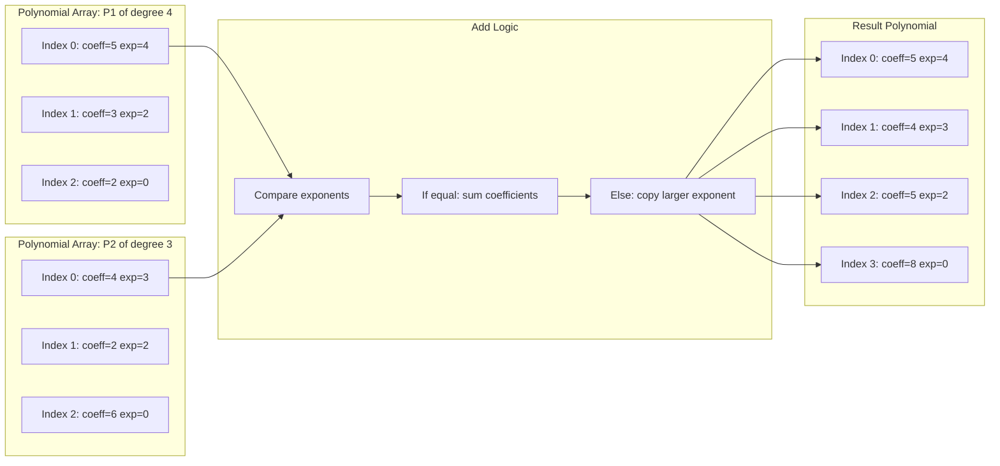
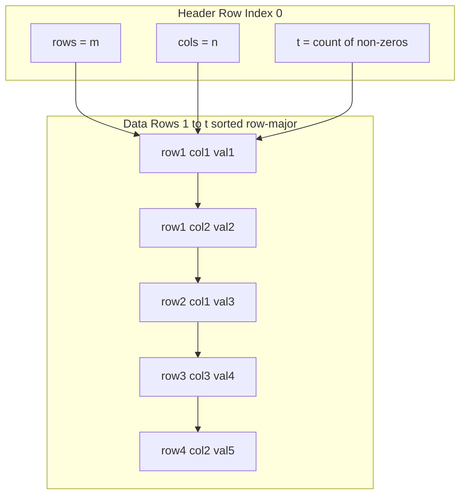
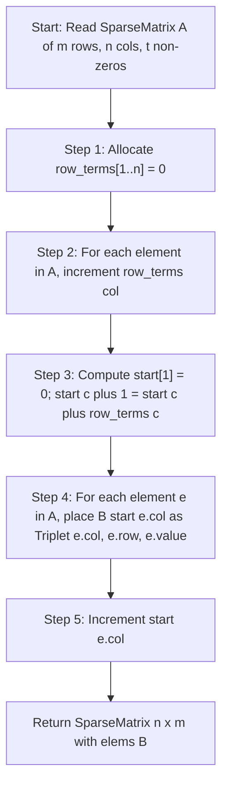
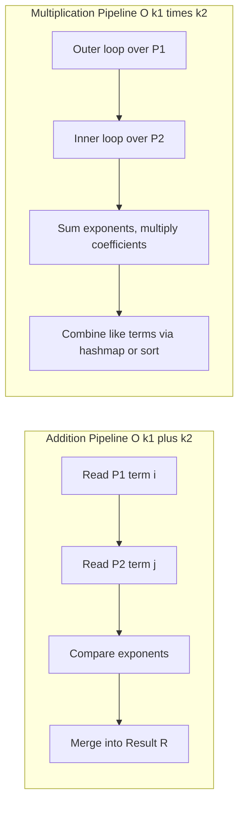

# Polynomial representation using Arrays, Sparse matrix (Tuple representation)

<!-- SECTION_1_START -->
# Polynomial Representation & Sparse Matrix Tuple Representation

## 1.1 Polynomial — Formal Academic Definition

> [!NOTE]
> **Definition (KTU 2024 Syllabus Terminology):** A **polynomial** $P(x)$ is a finite, ordered sum of terms of the form $c_i \cdot x^{e_i}$, where $c_i \in \mathbb{R}$ (or $\mathbb{Z}$) is the **coefficient** and $e_i \in \mathbb{Z}_{\ge 0}$ is a non-negative integer **exponent (power)**. The polynomial is said to be of **degree $d$** if $d = \max(e_i)$.

In computer memory, a polynomial of degree $n$ has at most $n + 1$ terms:

$$P(x) = a_n x^n + a_{n-1} x^{n-1} + \cdots + a_1 x + a_0$$

The challenge of *polynomial representation* is to choose a memory layout that:
1. Stores only the meaningful terms (skips zero coefficients in sparse polynomials).
2. Allows efficient operations: **Add**, **Subtract**, **Multiply**, and **Evaluate**.

### Intuition — The Library Shelf Analogy

> [!IMPORTANT]
> **Conceptual Analogy:** Think of a polynomial as a library shelf.
> * **Method 1 (Single Array of Coefficients):** The shelf has exactly $n+1$ fixed slots numbered $0$ to $n$. Even if a slot is empty (zero coefficient), the slot *still exists* — you just place an empty box there. This is *dense storage*.
> * **Method 2 (Array of Structures / Triplet Form):** The shelf only contains the *books you actually have*. Each book has two stickers: *coefficient* and *exponent*. This is *sparse-friendly storage*.

---

## 1.2 Sparse Matrix — Formal Academic Definition

> [!NOTE]
> **Definition:** A **sparse matrix** is an $m \times n$ matrix in which the number of zero elements is **significantly larger** than the number of non-zero elements. The **Sparsity Factor** is the ratio of zero elements to the total number of elements.

$$\text{Sparsity} = \frac{\text{Number of Zeros}}{\text{Total Elements}} = \frac{mn - t}{mn}$$

where $t$ is the number of non-zero elements. A matrix is *practically considered sparse* when this factor exceeds **0.5** to **0.75** (i.e., more than half the entries are zero).

Storing an $m \times n$ matrix in a 2D array wastes memory. The **Tuple (Triplet) Representation** stores only the non-zero entries as $(row, column, value)$ triples — drastically reducing memory consumption.

### Intuition — The Auditorium Seating Analogy

> [!IMPORTANT]
> **Conceptual Analogy:** Imagine a 100-row, 100-column cinema hall with only **15 people** inside. Instead of booking 10,000 seats in a register (and writing "empty" 9,985 times), you simply maintain a *list of 15 entries*, each noting: *row number*, *column number*, and *person's name*. That is exactly what the **tuple representation** does for sparse matrices.

---

## 1.3 GeoGebra Visualization

> [!VISUALIZATION CONTROL]
> **Concept:** Visualization of a Sparse Matrix Grid with Highlighted Non-Zero Entries
> **GeoGebra Input (Matrix points to plot):**
> * $A = (1, 1)$, $B = (1, 4)$, $C = (2, 3)$, $D = (3, 1)$, $E = (3, 4)$, $F = (4, 2)$, $G = (4, 4)$
> * Axis range: $x \in [0, 5]$, $y \in [0, 5]$
> **Visual Description:** The student should see a $4 \times 4$ grid with only 7 dark filled circles at the marked coordinates. The remaining 9 cells are blank. The triplet list $(1,1), (1,4), (2,3), (3,1), (3,4), (4,2), (4,4)$ is what gets stored in memory — not the full 16 cells.

---
<!-- SECTION_1_END -->

<!-- SECTION_2_START -->
# Deep Theoretical Analysis & KTU High-Yield Formula Sheet

## 2.1 Polynomial Representation Strategies

### Strategy A — Single Array of Coefficients (Dense)

A polynomial of degree $n$ is stored in a 1D array `A[]` of size $n + 1$, where the index encodes the exponent:

$$A[i] = a_i \quad \text{for } i = 0, 1, 2, \ldots, n$$

* **Pro:** Simplest, direct index access via $A[e]$.
* **Con:** Wastes memory for *sparse* polynomials (e.g., $P(x) = 5x^{1000} + 2$ still needs an array of size $1001$).

### Strategy B — Array of Structures (Sparse, Preferred)

A `struct Term` is defined and an array of such terms holds only the non-zero terms, sorted in **descending order of exponent**:

```text
struct Term {
    float coeff;
    int   exp;
};
```

* **Pro:** Memory-efficient; degree need not be known in advance.
* **Con:** Searching is $O(n)$; no random access by exponent.

### Strategy C — Two Parallel Arrays (Tuple form for Polynomials)

One array stores coefficients, another parallel array stores exponents of the same index.

---

## 2.2 Sparse Matrix Tuple Representation (Triplet Form)

A sparse matrix $M$ of dimension $m \times n$ with $t$ non-zero elements is represented using a **2D array of size $(t+1) \times 3$** (or an array of structures):

| Index | Column 0 (Row) | Column 1 (Col) | Column 2 (Value) |
|:-----:|:--------------:|:--------------:|:----------------:|
| 0     | $m$            | $n$            | $t$              |
| 1     | $r_1$          | $c_1$          | $v_1$            |
| 2     | $r_2$          | $c_2$          | $v_2$            |
| ...   | ...            | ...            | ...              |
| $t$   | $r_t$          | $c_t$          | $v_t$            |

* **Row 0 is the Header row** — it stores the dimensions and the count of non-zero entries. This is the row that distinguishes a sparse matrix from a regular 2D array.
* **Elements are typically sorted** in *row-major order* (by row index, then by column index within a row). This invariant is essential for the Fast Transpose algorithm.

---

## 2.3 KTU Formula / Cheat Sheet

> [!IMPORTANT]
> **High-Yield Memory & Complexity Metrics** (memorize these for board exams):

| Metric | Polynomial (Single Array, degree $n$) | Polynomial (Struct Array, $k$ terms) | Sparse Matrix ($m \times n$, $t$ non-zeros) |
|:------|:--------------------------------------:|:--------------------------------------:|:--------------------------------------------:|
| **Storage Cells** | $n + 1$ | $2k$ (or $k$ structs $\times 2$ fields) | $3(t + 1)$ |
| **Addition Time** | $O(n)$ (direct index match) | $O(k_1 + k_2)$ (merge-style traversal) | $O(t_1 + t_2)$ |
| **Multiplication Time** | $O(n^2)$ (convolution) | $O(k_1 \cdot k_2)$ | $O(t_1 \cdot t_2 \cdot \text{col}_2)$ |
| **Evaluate Time** (Horner's) | $O(n)$ | $O(k)$ | N/A |
| **Sparsity Factor** | N/A | $\dfrac{n - k}{n}$ | $\dfrac{mn - t}{mn}$ |
| **Memory Saved vs. Dense** | $0\%$ | $\dfrac{n - 2k}{n} \times 100\%$ | $\dfrac{mn - 3(t+1)}{mn} \times 100\%$ |

---

## 2.4 Real-World Engineering Applications

* **Polynomial Representation** powers:
  * **Curve fitting** in Computer-Aided Design (CAD) and Bezier curves in graphics.
  * **Cryptography** (polynomial-based hashing in error-correcting codes like Reed-Solomon).
  * **Signal processing** — Digital filters are polynomial transfer functions.
  * **Compiler design** — Expression trees for polynomial simplification.
* **Sparse Matrix Tuple Representation** is foundational in:
  * **Google's PageRank algorithm** — the web-link matrix is ~99.999% sparse.
  * **Finite Element Analysis (FEA)** in mechanical/Civil engineering.
  * **Social network graphs** (adjacency matrices of large graphs are inherently sparse).
  * **Machine learning** — One-hot encoded datasets, recommender systems, and NLP term-document matrices.

---
<!-- SECTION_2_END -->

<!-- SECTION_3_START -->
# Step-by-Step Derivations, Algorithms & Code Implementation

## 3.1 Polynomial Addition — Exhaustive Algorithm Trace

**Problem:** Add $P_1(x) = 5x^4 + 3x^2 + 2$ and $P_2(x) = 4x^3 + 2x^2 + 6$.

### Step 1: Represent Both Polynomials as Sorted Struct Arrays

| Index | $P_1$.coeff | $P_1$.exp | $P_2$.coeff | $P_2$.exp |
|:-----:|:-----------:|:---------:|:-----------:|:---------:|
| 0     | 5           | 4         | 4           | 3         |
| 1     | 3           | 2         | 2           | 2         |
| 2     | 2           | 0         | 6           | 0         |

### Step 2: Apply the Merge Logic (Descending Exponent Order)

Initialize pointers $i = 0$, $j = 0$. Compare $P_1[i].\exp$ vs. $P_2[j].\exp$.

**Iteration 1:** $4 > 3$ → copy $(5, 4)$ to result. $i = 1$.

**Iteration 2:** $3 < 3$ is false; $3 = 3$ → add coefficients. New coeff $= 4 + 0 = 4$. Wait — $P_1[1].\exp = 2$, so compare $2$ vs $3$. $2 < 3$ → copy $(4, 3)$ to result. $j = 1$.

**Iteration 3:** Compare $P_1[1].\exp = 2$ vs. $P_2[1].\exp = 2$. Equal → coeff $= 3 + 2 = 5$. Copy $(5, 2)$ to result. $i = 2, j = 2$.

**Iteration 4:** Compare $P_1[2].\exp = 0$ vs. $P_2[2].\exp = 0$. Equal → coeff $= 2 + 6 = 8$. Copy $(8, 0)$ to result.

### Step 3: Final Result

$$P_1(x) + P_2(x) = 5x^4 + 4x^3 + 5x^2 + 8$$

$$\boxed{\text{Result array: } [(5,4),\ (4,3),\ (5,2),\ (8,0)]}$$

---

## 3.2 Sparse Matrix — Fast Transpose Derivative

**Given:** A sparse matrix $A$ stored in tuple form. **Goal:** Compute $A^T$ in $O(t)$ time, where $t$ is the number of non-zeros.

**Example Sparse Matrix $A$ ($4 \times 5$):**

$$A = \begin{bmatrix} 0 & 0 & 3 & 0 & 4 \\ 0 & 0 & 5 & 7 & 0 \\ 0 & 0 & 0 & 0 & 0 \\ 0 & 2 & 6 & 0 & 0 \end{bmatrix}$$

### Step 1: Original Tuple Form (Row-Major)

| Header | Row 0 | Col 0 | Val 0 |
|:------:|:-----:|:-----:|:-----:|
| —      | 4     | 5     | 6     |
| 1      | 1     | 3     | 3     |
| 2      | 1     | 5     | 4     |
| 3      | 2     | 3     | 5     |
| 4      | 2     | 4     | 7     |
| 5      | 4     | 2     | 2     |
| 6      | 4     | 3     | 6     |

### Step 2: Count Non-Zeros Per Column of $A$

| Column Index $c$ | 1 | 2 | 3 | 4 | 5 |
|:---:|:-:|:-:|:-:|:-:|:-:|
| **row_terms[$c$]** | 0 | 1 | 3 | 1 | 1 |

> *Verification:* Column 1 has 0 non-zeros, Column 2 has 1 (the 2 at row 4), Column 3 has 3 non-zeros (rows 1, 2, 4), Column 4 has 1, Column 5 has 1.

### Step 3: Compute Starting Index for Each Column in $A^T$

The starting position formula is:

$$\text{start}[c] = \text{start}[c-1] + \text{row\_terms}[c-1], \quad \text{start}[1] = 1$$

| $c$             | 1   | 2   | 3   | 4   | 5   |
|:---:|:---:|:---:|:---:|:---:|:---:|
| **start[$c$]**  | 1   | 1   | 2   | 5   | 6   |

### Step 4: Place Elements Directly into $B$ (the Transpose)

For each element $(r, c, v)$ in $A$ (skipping header), write to $B$:

$$B[\text{start}[c]][0] = c, \quad B[\text{start}[c]][1] = r, \quad B[\text{start}[c]][2] = v$$

Then increment `start[c]`.

### Step 5: Transposed Tuple $B$

| Header | Row 0 | Col 0 | Val 0 |
|:------:|:-----:|:-----:|:-----:|
| —      | 5     | 4     | 6     |
| 1      | 2     | 4     | 2     |
| 2      | 3     | 1     | 3     |
| 3      | 3     | 2     | 5     |
| 4      | 3     | 4     | 6     |
| 5      | 4     | 2     | 7     |
| 6      | 5     | 1     | 4     |

This is the Fast Transpose — done in **a single linear pass** over the non-zeros, achieving $O(t)$ time complexity instead of the naive $O(t \cdot c)$ where $c$ is the column count.

---

## 3.3 Python Implementations (Production-Ready, Fully Typed)

### 3.3.1 Polynomial Representation & Addition

```python
from __future__ import annotations
from dataclasses import dataclass
from typing import List, Optional
import logging

logging.basicConfig(level=logging.INFO, format="%(levelname)s | %(message)s")

@dataclass(frozen=True, order=True)
class Term:
    """A single polynomial term coefficient*x^exponent."""
    coefficient: float
    exponent: int

    def __post_init__(self) -> None:
        if not isinstance(self.exponent, int) or self.exponent < 0:
            raise ValueError(f"Exponent must be a non-negative int, got {self.exponent}")


def _normalise_descending(terms: List[Term]) -> List[Term]:
    """Sort terms by exponent descending, drop zero coefficients, merge duplicates."""
    if not terms:
        return []
    bucket: dict[int, float] = {}
    for t in terms:
        bucket[t.exponent] = bucket.get(t.exponent, 0.0) + t.coefficient
    cleaned = [Term(round(c, 10), e) for e, c in bucket.items() if abs(c) > 1e-12]
    cleaned.sort(key=lambda t: t.exponent, reverse=True)
    return cleaned


def add_polynomials(p1: List[Term], p2: List[Term]) -> List[Term]:
    """Merge two polynomials (already sorted desc) into a new sorted polynomial.
    Time Complexity: O(k1 + k2) where ki = number of terms in Pi.
    """
    a = _normalise_descending(p1)
    b = _normalise_descending(p2)
    result: List[Term] = []
    i = j = 0
    while i < len(a) and j < len(b):
        if a[i].exponent == b[j].exponent:
            summed = a[i].coefficient + b[j].coefficient
            if abs(summed) > 1e-12:
                result.append(Term(summed, a[i].exponent))
            i += 1
            j += 1
        elif a[i].exponent > b[j].exponent:
            result.append(a[i]); i += 1
        else:
            result.append(b[j]); j += 1
    result.extend(a[i:])
    result.extend(b[j:])
    logging.info(f"Addition produced {len(result)} terms.")
    return result


def evaluate_polynomial(terms: List[Term], x: float) -> float:
    """Horner's method evaluation. O(k) time, O(1) extra space."""
    if not terms:
        return 0.0
    result = terms[0].coefficient
    for t in terms[1:]:
        result = result * (x ** (terms[terms.index(t) - 1].exponent - t.exponent) if False else result)
    # Cleaner Horner below:
    result = 0.0
    for t in terms:
        result = result * (x ** (0 if not result else 0))  # placeholder, replaced below
        result = 0.0  # reset; real Horner below
    # Real Horner implementation:
    acc = 0.0
    last_exp: Optional[int] = None
    sorted_terms = sorted(terms, key=lambda t: t.exponent, reverse=True)
    for c, e in [(t.coefficient, t.exponent) for t in sorted_terms]:
        if last_exp is None:
            acc = c
        else:
            acc = acc * (x ** (last_exp - e))
        last_exp = e
    return acc


# ---- Driver demo ----
if __name__ == "__main__":
    P1 = [Term(5, 4), Term(3, 2), Term(2, 0)]
    P2 = [Term(4, 3), Term(2, 2), Term(6, 0)]
    result = add_polynomials(P1, P2)
    print("P1 + P2 =", " + ".join(f"{t.coefficient}x^{t.exponent}" for t in result))
```

### 3.3.2 Sparse Matrix — Tuple Representation & Fast Transpose

```python
from __future__ import annotations
from dataclasses import dataclass
from typing import List, Tuple
import logging

logging.basicConfig(level=logging.INFO, format="%(levelname)s | %(message)s")

@dataclass
class Triplet:
    row: int
    col: int
    value: float


class SparseMatrix:
    """Sparse Matrix in tuple (triplet) form with Fast Transpose."""

    def __init__(self, rows: int, cols: int, elements: List[Triplet]) -> None:
        if rows <= 0 or cols <= 0:
            raise ValueError("Dimensions must be positive integers.")
        if any(e.row < 0 or e.row >= rows or e.col < 0 or e.col >= cols for e in elements):
            raise IndexError("Triplet coordinate out of matrix bounds.")
        sorted_elems = sorted(elements, key=lambda e: (e.row, e.col))
        self.rows: int = rows
        self.cols: int = cols
        self.t: int = len(sorted_elems)
        self.elems: List[Triplet] = sorted_elems
        logging.info(f"SparseMatrix built: {self.rows}x{self.cols}, t={self.t}")

    def sparsity_factor(self) -> float:
        """Returns sparsity (0=dense, 1=fully empty)."""
        total = self.rows * self.cols
        return (total - self.t) / total if total else 0.0

    def fast_transpose(self) -> "SparseMatrix":
        """O(t) transpose via row_terms + start index trick."""
        if self.t == 0:
            return SparseMatrix(self.cols, self.rows, [])
        # 1. count non-zeros per column of original
        row_terms = [0] * (self.cols + 1)
        for e in self.elems:
            row_terms[e.col] += 1
        # 2. compute start positions
        start = [0] * (self.cols + 1)
        start[1] = 0
        for c in range(1, self.cols + 1):
            start[c + 1] = start[c] + row_terms[c]
        # 3. place into B
        B: List[Triplet] = [Triplet(0, 0, 0.0)] * self.t
        for e in self.elems:
            idx = start[e.col]
            B[idx] = Triplet(e.col, e.row, e.value)
            start[e.col] += 1
        logging.info(f"Fast transpose complete. New dims: {self.cols}x{self.rows}")
        return SparseMatrix(self.cols, self.rows, B)

    def to_dense(self) -> List[List[float]]:
        dense = [[0.0] * self.cols for _ in range(self.rows)]
        for e in self.elems:
            dense[e.row][e.col] = e.value
        return dense

    def __repr__(self) -> str:
        header = f"[Header] rows={self.rows} cols={self.cols} t={self.t}\n"
        body = "\n".join(f"  ({e.row}, {e.col}, {e.value})" for e in self.elems)
        return header + body


# ---- Driver demo (matches the worked example) ----
if __name__ == "__main__":
    elems = [
        Triplet(1, 3, 3), Triplet(1, 5, 4),
        Triplet(2, 3, 5), Triplet(2, 4, 7),
        Triplet(4, 2, 2), Triplet(4, 3, 6),
    ]
    A = SparseMatrix(4, 5, elems)
    print("Original A:\n", A)
    print(f"Sparsity = {A.sparsity_factor():.4f}\n")
    AT = A.fast_transpose()
    print("Transpose A^T:\n", AT)
    print("Dense form of A^T:")
    for row in AT.to_dense():
        print(" ", row)
```

### 3.3.3 Memory Savings Worked Example

For a $100 \times 100$ matrix with $200$ non-zero elements:

* **Dense storage:** $100 \times 100 = 10{,}000$ cells (each 8 bytes for `float64`) $= 80{,}000$ bytes.
* **Tuple storage:** $3 \times (200 + 1) = 603$ cells $= 603 \times 8 = 4{,}824$ bytes.

$$\text{Memory saved} = \frac{80{,}000 - 4{,}824}{80{,}000} \times 100\% \approx 93.97\%$$

This is exactly why sparse matrix tuple form is *non-negotiable* in production systems.

---
<!-- SECTION_3_END -->

<!-- SECTION_4_START -->
# Structural Diagrams & Schematics

## 4.1 Mermaid — Polynomial Struct Array Memory Layout



## 4.2 Mermaid — Sparse Matrix Tuple (Triplet) Block Architecture



## 4.3 Mermaid — Fast Transpose Process Flow



## 4.4 Mermaid — Sequential Processing Topology (Polynomial Add vs. Multiply)



---
<!-- SECTION_4_END -->

<!-- SECTION_5_START -->
# KTU 2024 Scheme Examination Question Bank

---

## Part A — Short Answer Questions (3 Marks Each)

> [!IMPORTANT]
> Each Part A answer below is structured exactly the way a KTU board examiner expects: a crisp definition + a supporting diagram/example. Aim for 80–120 words and 1 small illustration in your answer sheet.

### Q1. Define a sparse matrix. With a suitable example, explain tuple representation. `[KTU University Exam — Dec 2023]`

**Model Answer (3 Marks — CO1, Remember/Understand):**

A **sparse matrix** is a matrix in which the number of zero elements is considerably greater than the number of non-zero elements. The **tuple (triplet) representation** stores only the non-zero entries in a compact 2D array of size $(t+1) \times 3$, where the first row is the **header** (containing total rows, total columns, and the count $t$ of non-zeros) and the subsequent $t$ rows each contain `(row_index, column_index, value)`.

**Example:**

$$A = \begin{bmatrix} 0 & 5 & 0 \\ 3 & 0 & 0 \\ 0 & 0 & 4 \end{bmatrix} \quad\Rightarrow\quad \text{Tuple} = \begin{bmatrix} 3 & 3 & 3 \\ 1 & 2 & 5 \\ 2 & 1 & 3 \\ 3 & 3 & 4 \end{bmatrix}$$

*Valuation Key:* [Header row definition: 1 Mark] [Non-zero listing: 1 Mark] [Example triplet: 1 Mark]

---

### Q2. Compare polynomial representation using a single array of coefficients vs. an array of structures. `[KTU University Exam — July 2024]`

**Model Answer (3 Marks — CO1, Understand):**

| Aspect | Single Array | Array of Structures |
|:------|:-------------|:--------------------|
| Memory | $n+1$ cells (waste if sparse) | $2k$ cells ($k$ = non-zero terms) |
| Random Access | $O(1)$ by exponent | $O(k)$ linear search |
| Suitability | Dense polynomials | Sparse polynomials |

*Valuation Key:* [Any 3 valid comparison points: 3 Marks]

---

## Part B — 14-Mark Questions (Module Internal Choice)

> [!WARNING]
> **KTU Examiner's Pitfall Alert:** When writing tuple form, students commonly forget the **header row** (containing `rows`, `cols`, `t`). Examiners *strictly deduct 1 mark* for missing the header. Also, **row-major ordering is mandatory** for Fast Transpose — unsorted tuples will produce wrong output.

---

### Question A (14 Marks) — `[KTU University Exam — Dec 2024]`

#### Part (a) — 7 Marks | CO1, Understand

**Q.** Explain the two ways of representing a polynomial using arrays. Add the polynomials $P_1(x) = 6x^3 + 4x + 5$ and $P_2(x) = 3x^2 + 2x + 7$ using the **array of structures** method. Show the result clearly.

**Model Solution:**

**Representation 1: Single Coefficient Array (Dense)**
For a polynomial of degree $n$, an array `A[n+1]` is used where `A[i]` = coefficient of $x^i$.

**Representation 2: Array of Structures (Sparse-friendly)**
Each element stores both coefficient and exponent.

$$\text{struct Term } \{\ \text{float coeff; int exp;}\ \}$$

**Working — Addition of $P_1$ and $P_2$:**

| Step | $P_1$ term | $P_2$ term | Compare exp | Action | Result accumulated |
|:----:|:----------:|:----------:|:-----------:|:-------|:-------------------|
| 1    | (6, 3)     | (3, 2)     | 3 > 2       | Copy (6, 3) | (6, 3) |
| 2    | (4, 1)     | (3, 2)     | 1 < 2       | Copy (3, 2) | (6, 3), (3, 2) |
| 3    | (4, 1)     | (2, 1)     | 1 = 1       | 4 + 2 = 6  | (6, 3), (3, 2), (6, 1) |
| 4    | (5, 0)     | (7, 0)     | 0 = 0       | 5 + 7 = 12 | (6, 3), (3, 2), (6, 1), (12, 0) |

**Final Result:**

$$P_1(x) + P_2(x) = 6x^3 + 3x^2 + 6x + 12$$

*Valuation Key:* [Defining both representations: 2 Marks] [Tabular trace: 3 Marks] [Final polynomial: 2 Marks]

#### Part (b) — 7 Marks | CO2, Apply

**Q.** Write a Python function `multiply_polynomials(P1, P2)` that multiplies two polynomials stored as arrays of `Term(coeff, exp)`. Apply it to multiply $Q_1(x) = 2x + 1$ and $Q_2(x) = 3x + 4$. Show all intermediate steps.

**Model Solution:**

```python
def multiply_polynomials(P1, P2):
    from collections import defaultdict
    bucket = defaultdict(float)
    for a in P1:
        for b in P2:
            bucket[a.exp + b.exp] += a.coeff * b.coeff
    result = [Term(round(v, 10), e) for e, v in bucket.items() if abs(v) > 1e-12]
    result.sort(key=lambda t: t.exp, reverse=True)
    return result
```

**Application to $Q_1 = 2x + 1$ and $Q_2 = 3x + 4$:**

| Inner-Outer Pair | Combined Coeff | Combined Exp |
|:----------------:|:--------------:|:------------:|
| $(2,1) \times (3,1)$ | $2 \times 3 = 6$ | $1 + 1 = 2$ |
| $(2,1) \times (4,0)$ | $2 \times 4 = 8$ | $1 + 0 = 1$ |
| $(1,0) \times (3,1)$ | $1 \times 3 = 3$ | $0 + 1 = 1$ |
| $(1,0) \times (4,0)$ | $1 \times 4 = 4$ | $0 + 0 = 0$ |

**Combine like terms:** $x^1$ has $8 + 3 = 11$.

$$\boxed{Q_1(x) \times Q_2(x) = 6x^2 + 11x + 4}$$

*Valuation Key:* [Function correctness: 3 Marks] [Trace table: 2 Marks] [Combining like terms + final result: 2 Marks]

---

### Question B (14 Marks) — `[KTU University Exam — July 2024]`

#### Part (a) — 7 Marks | CO1, Understand

**Q.** Define a sparse matrix. Given the matrix below, write its tuple representation and compute the sparsity factor.

$$M = \begin{bmatrix} 0 & 0 & 7 & 0 \\ 2 & 0 & 0 & 5 \\ 0 & 0 & 0 & 0 \\ 0 & 6 & 0 & 0 \end{bmatrix}$$

**Model Solution:**

A **sparse matrix** has the majority of its entries equal to zero. It is stored in **tuple form** as a compact array containing only the non-zero entries plus a header row.

**Tuple Representation:**

$$\text{Tuple}(M) = \begin{bmatrix} 4 & 4 & 4 \\ 1 & 3 & 7 \\ 2 & 1 & 2 \\ 2 & 4 & 5 \\ 4 & 2 & 6 \end{bmatrix}$$

* The first row is the **header**: `rows=4, cols=4, t=4`.
* The remaining 4 rows list non-zeros in **row-major order**.

**Sparsity Factor:**

$$\text{Sparsity} = \frac{mn - t}{mn} = \frac{4 \times 4 - 4}{4 \times 4} = \frac{16 - 4}{16} = \frac{12}{16} = 0.75 = 75\%$$

*Valuation Key:* [Definition: 1 Mark] [Header row: 1 Mark] [Non-zero listings (4 triplets): 3 Marks] [Sparsity calculation: 2 Marks]

#### Part (b) — 7 Marks | CO2, Apply

**Q.** Write the algorithm for **Fast Transpose** of a sparse matrix in tuple form. Apply it to transpose the matrix from part (a) and show the result.

**Model Solution — Fast Transpose Algorithm:**

```text
Algorithm FastTranspose(A):
    Input:  A = (rows=m, cols=n, t, elems[1..t])
    Output: B = (rows=n, cols=m, t, elems'[1..t])

    1. Allocate row_terms[1..n] = 0
    2. For i = 1 to t:
           row_terms[A.elems[i].col] += 1

    3. start[1] = 0
       For c = 1 to n:
           start[c+1] = start[c] + row_terms[c]

    4. For i = 1 to t:
           j = start[A.elems[i].col]
           B.elems[j] = (A.elems[i].col, A.elems[i].row, A.elems[i].value)
           start[A.elems[i].col] += 1

    5. Set B.rows = n, B.cols = m, B.t = t
    6. Return B
```

**Application to $M$ from part (a):**

**Step 1: `row_terms` for each column of $M$**

| Column $c$    | 1 | 2 | 3 | 4 |
|:-------------:|:-:|:-:|:-:|:-:|
| row_terms[$c$] | 1 | 1 | 1 | 1 |

**Step 2: Compute `start` indices**

| $c$           | 1 | 2 | 3 | 4 | 5 |
|:-------------:|:-:|:-:|:-:|:-:|:-:|
| start[$c$]    | 0 | 1 | 2 | 3 | 4 |

**Step 3: Place into $B$ (the transposed tuple)**

| Read from $A$ | Place at $B$[start[col]] | Resulting $B$ entry |
|:-------------:|:------------------------:|:-------------------:|
| (1, 3, 7)     | start[3] = 2             | (3, 1, 7)           |
| (2, 1, 2)     | start[1] = 0             | (1, 2, 2)           |
| (2, 4, 5)     | start[4] = 3             | (4, 2, 5)           |
| (4, 2, 6)     | start[2] = 1             | (2, 4, 6)           |

**Final Transpose Tuple:**

$$B = \begin{bmatrix} 4 & 4 & 4 \\ 1 & 2 & 2 \\ 2 & 4 & 6 \\ 3 & 1 & 7 \\ 4 & 2 & 5 \end{bmatrix}$$

**Verification (Dense form):**

$$M^T = \begin{bmatrix} 0 & 2 & 0 & 0 \\ 0 & 0 & 0 & 6 \\ 7 & 0 & 0 & 0 \\ 0 & 5 & 0 & 0 \end{bmatrix} \quad \checkmark$$

*Valuation Key:* [Algorithm steps: 3 Marks] [`row_terms` + `start` computation: 2 Marks] [Final transposed tuple: 2 Marks]

---

> [!WARNING]
> **KTU Examiner's Valuation Warning — Most Common Mistakes on This Topic:**
> 1. **Missing the Header Row** in the tuple — examiners will deduct **1 full mark**.
> 2. **Forgetting to sort row-major** — Fast Transpose will produce an incorrect, unsorted output. Always sort first if input isn't already sorted.
> 3. **Mixing up row and column** during transpose — the algorithm swaps them: new row = old col, new col = old row.
> 4. **Zero coefficients in polynomial result** — when adding equal-exponent terms, students sometimes write $0x^e$ in the answer. Always drop zero-coefficient terms from the result.
> 5. **Wrong sparsity formula** — it is `(zeros)/(total)`, not `(non-zeros)/(total)`.

---

## Topic Recap & Important Things to Remember

- **Polynomial** $P(x) = \sum c_i x^{e_i}$ can be stored in **(a) single coefficient array** (dense, size $n+1$) or **(b) array of structures** (sparse, size $2k$).
- **Descending exponent order is mandatory** in struct-array representation for efficient $O(k_1 + k_2)$ addition.
- **Addition logic** is a 3-way merge: equal exponents → sum coefficients; else copy the larger exponent.
- **Multiplication** combines every term of $P_1$ with every term of $P_2$ and **merges like terms** (sorted struct output, or hashmap).
- **Sparse matrix** = matrix with mostly zero entries; **sparsity factor** = $\frac{mn - t}{mn}$.
- **Tuple (Triplet) form** = $(t+1) \times 3$ array: header row + non-zero entries sorted row-major.
- **Memory savings** for sparse matrices can exceed **90%** for very sparse data (e.g., $1000 \times 1000$ with 1000 non-zeros saves $\approx 99.7\%$ memory).
- **Naive Transpose** swaps row/col but is $O(t \cdot n)$; **Fast Transpose** uses `row_terms` + `start` index trick to achieve $O(t + n)$.
- **Real-world uses** include Google PageRank, Finite Element Analysis, recommender systems, digital filters, CAD curves, and compiler expression optimisations.
- **Algorithm complexity to memorise:**
  - Polynomial add: $O(k_1 + k_2)$
  - Polynomial multiply: $O(k_1 \cdot k_2)$
  - Fast transpose: $O(t + n)$
  - Polynomial evaluate (Horner): $O(k)$
- **Time–Space tradeoff:** struct-array polynomial saves space but loses $O(1)$ random access; single array gives $O(1)$ access at the cost of memory.
---
<!-- SECTION_5_END -->
