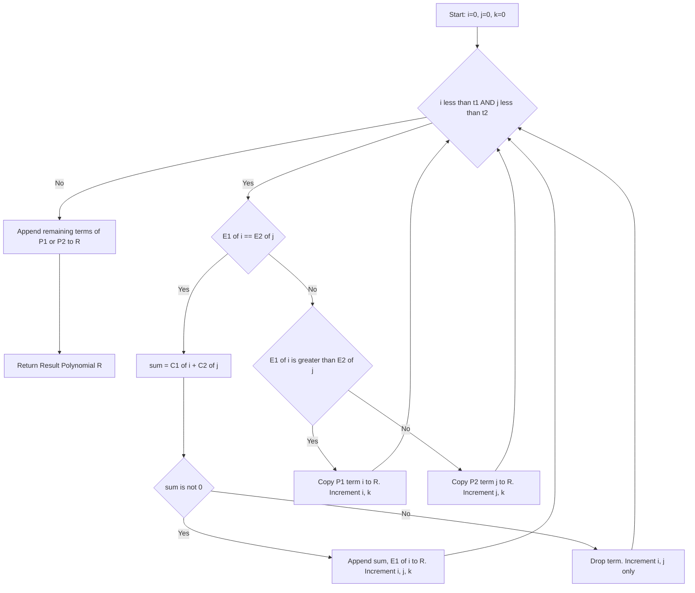
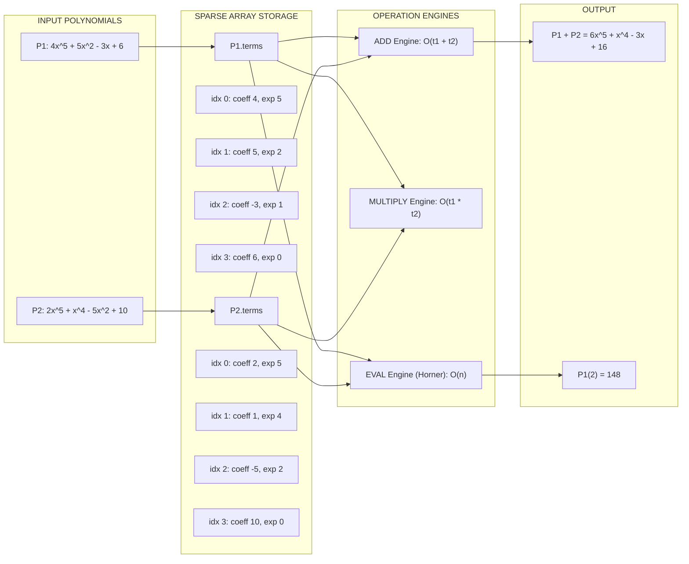
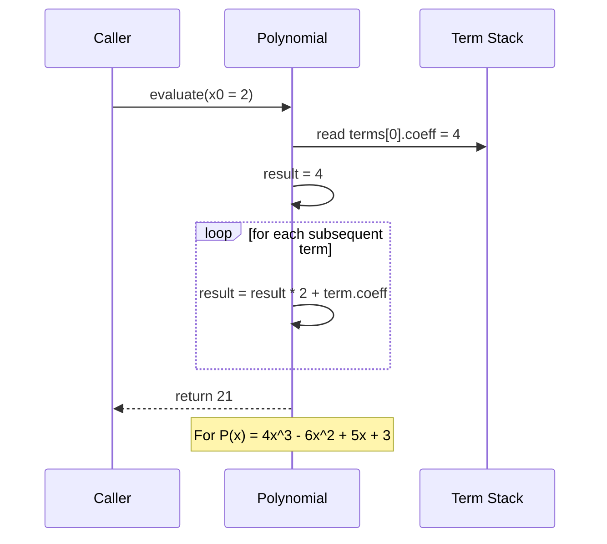

# Polynomial representation using Arrays

<!-- SECTION_1_START -->
# Polynomial Representation Using Arrays

> [!NOTE]
> **KTU 2024 Scheme — Module 1 (PCCST303)**
> A polynomial is a mathematical expression of the form $P(x) = a_n x^n + a_{n-1} x^{n-1} + \dots + a_1 x + a_0$, where $a_i$ are the **coefficients** and the powers $i$ are the **exponents**. In data structures, we rarely need to represent every term — only the **non-zero terms** matter for memory efficiency.

## 1.1 Formal Definition (KTU Syllabus Terminology)

A **polynomial** in a single variable $x$ is an arithmetic expression consisting of one or more terms of the form $c \cdot x^e$, where:
- $c \in \mathbb{R}$ is the **coefficient** (a real number, also allowed to be zero).
- $e \in \mathbb{Z}_{\geq 0}$ is a non-negative integer **exponent** (power).
- The **degree** of the polynomial is the largest exponent $e$ for which $c \neq 0$.

In computer memory, this mathematical object is stored as an **abstract data type (ADT)** that bundles two parallel pieces of information for every meaningful term:
1. The numerical coefficient $c$.
2. The corresponding exponent $e$.

Because the order of terms (high-to-low or low-to-high exponent) is fixed, the polynomial is a **static, ordered sequence** — making it an ideal candidate for **array-based linear storage**.

## 1.2 Two Canonical Array Representations

### Representation A — Dense (Complete) Form
A polynomial of degree $n$ is stored in a single array of size $n + 1$, where the **array index directly encodes the exponent**, and the value stored is the coefficient.

| Array Index | 0 | 1 | 2 | 3 | 4 | 5 | $\dots$ | n |
|---|---|---|---|---|---|---|---|---|
| Content | $a_0$ | $a_1$ | $a_2$ | $a_3$ | $a_4$ | $a_5$ | $\dots$ | $a_n$ |

> [!IMPORTANT]
> **Dense form memory usage = $O(n)$** where $n$ is the degree. Storing $5x^{1000} + 7$ requires an array of size $1001$ even though only two terms are non-zero — this is the chief drawback.

### Representation B — Sparse (Non-Zero Only) Form
A polynomial with $t$ non-zero terms is stored as an array of $t$ *records* (or two parallel arrays), each holding one non-zero term:

| Index | Coeff | Exponent |
|---|---|---|
| 0 | $c_0$ | $e_0$ |
| 1 | $c_1$ | $e_1$ |
| 2 | $c_2$ | $e_2$ |
| $\dots$ | $\dots$ | $\dots$ |
| t-1 | $c_{t-1}$ | $e_{t-1}$ |

> [!TIP]
> **Sparse form memory usage = $O(t)$** where $t$ is the number of non-zero terms. This is the **preferred representation in all real-world KTU questions** and is the form most exam problems expect.

## 1.3 Intuition — The "Library Shelf" Analogy

Imagine a public library that stores every novel ever written.
- The **dense representation** is like the library insisting on a numbered shelf for *every* possible book, even the ones nobody wrote. If shelf #999 is empty, the space is still reserved.
- The **sparse representation** is like the librarian keeping **only the books that actually exist**, each with a tiny sticky note saying "this book belongs to slot #999". Shelves are only built for the books that are present.

In both cases, you can find any book in $O(1)$ by looking up the number — but the sparse form uses dramatically less physical space when most "slots" are empty. This is exactly the engineering tradeoff between the dense and sparse array forms of a polynomial.

## 1.4 GeoGebra Visualization of Storage Layout

> [!VISUALIZATION CONTROL]
> **Concept:** Memory layout of a sparse polynomial array.
> **GeoGebra / Desmos Input (illustrative grid points):**
> * Point 1: $(0,\ 5.5)$ — represents $\text{coeff}_0 = 5.5$
> * Point 2: $(1,\ 4.0)$ — represents $\text{coeff}_1 = 4.0$
> * Point 3: $(3,\ -2.0)$ — represents $\text{coeff}_3 = -2.0$
> * Point 4: $(6,\ 7.0)$ — represents $\text{coeff}_6 = 7.0$
> **Visual Description:** Plot these four points on a 2D coordinate grid. The x-axis is the **exponent** and the y-axis is the **coefficient**. The student should observe that the polynomial $P(x) = 7x^6 - 2x^3 + 4x + 5.5$ uses only 4 storage cells even though its degree is 6 — illustrating the sparse storage advantage.

<!-- SECTION_1_END -->

<!-- SECTION_2_START -->
# Deep Theoretical Analysis & KTU High-Yield Formula Sheet

## 2.1 Operational Breakdown of the Sparse ADT

The polynomial is modeled as a record with three logical fields:

1. **Total non-zero term count $t$** — the running size of the polynomial.
2. **Coefficient array $C[0 \dots t-1]$** — stores real numbers $c_i$.
3. **Exponent array $E[0 \dots t-1]$** — stores non-negative integers $e_i$.

Two invariants that every KTU board examiner expects you to state:

- **Invariant I (Ordering):** Either $E[0] > E[1] > E[2] > \dots > E[t-1]$ (descending) **or** $E[0] < E[1] < E[2] < \dots < E[t-1]$ (ascending). Mixing the order is a direct loss of marks.
- **Invariant II (Non-Zero):** Every $C[i] \neq 0$. If a coefficient becomes zero, the term must be deleted (or the polynomial remains logically invalid).

## 2.2 Why a Single Struct Beats Parallel Arrays

A common KTU sub-question is "Why use `struct Term` instead of two parallel arrays?". The reason is **locality of reference and cache friendliness**: grouping coefficient and exponent into a single object means a single memory fetch retrieves both pieces for one term, reducing the number of cache lines touched and improving performance on large polynomials.

## 2.3 The Three Core Operations (Exam Hot-Spots)

The three operations almost every KTU Part B question revolves around are:

### (i) Polynomial Addition — $P_3(x) = P_1(x) + P_2(x)$

The algorithm is a **merge-like traversal** of both sparse arrays, similar to the merge step of merge-sort:
- Compare current exponents of $P_1$ and $P_2$.
- If they match, add the coefficients. If the result is non-zero, append the new term.
- If one exponent is larger, copy that term as-is.

### (ii) Polynomial Multiplication — $P_3(x) = P_1(x) \times P_2(x)$

The naive method multiplies every term of $P_1$ with every term of $P_2$, producing $t_1 \cdot t_2$ intermediate terms, then **collapses like terms** by combining coefficients of equal exponents. The time complexity is $O(t_1 \cdot t_2)$.

### (iii) Polynomial Evaluation — Compute $P(x_0)$ for a given $x_0$

Two methods are tested:
- **Naive method:** Compute each $c \cdot x^e$ separately using a power function, then sum. Cost: $O(t \cdot n)$ where $n$ is the largest exponent.
- **Horner's Method (preferred):** Rewrite $P(x) = (\dots((c_n x + c_{n-1})x + c_{n-2})x + \dots + c_0)$ and evaluate left-to-right. Cost: $O(n)$ with no extra power computations.

## 2.4 Real-World Engineering Utility

Polynomial storage in sparse array form is foundational in:
- **Computer graphics:** Bézier and B-spline curves are polynomials in 2D space, and their control points are stored exactly like sparse polynomial terms.
- **Signal processing & DSP:** FIR filters are polynomials in $z^{-1}$, and sparse representations are used because most filter coefficients are zero.
- **Compiler design:** Symbolic algebra systems (Mathematica, SymPy) use this very array-of-terms structure to manipulate expressions.
- **Machine learning:** Sparse polynomial regression and piecewise polynomial kernels rely on the same storage scheme.

## 2.5 KTU Formula & Complexity Cheat Sheet

> [!IMPORTANT]
> The table below is the **only** one-page summary you need for the board exam. Memorize it.

| Operation | Input Sizes | Time Complexity | Auxiliary Space | Output Type |
|---|---|---|---|---|
| Create / Traverse | $t$ terms | $O(t)$ | $O(1)$ | Display only |
| Add ($P_1 + P_2$) | $t_1,\ t_2$ terms | $O(t_1 + t_2)$ | $O(t_1 + t_2)$ | New polynomial |
| Multiply ($P_1 \times P_2$) | $t_1,\ t_2$ terms | $O(t_1 \cdot t_2)$ | $O(t_1 \cdot t_2)$ | New polynomial |
| Evaluate (Naive) | $t$ terms, value $x_0$ | $O(t \cdot n_{\max})$ | $O(1)$ | Single real number |
| Evaluate (Horner) | $t$ terms, value $x_0$ | $O(n_{\max})$ | $O(1)$ | Single real number |
| Dense Storage | degree $n$ | Read $O(1)$ per term | $O(n+1)$ cells | Static |
| Sparse Storage | $t$ non-zero terms | Read $O(1)$ per term | $O(2t)$ cells | Static |

> [!NOTE]
> **Engineering interpretation:** Sparse storage wins whenever $t \ll n$ (e.g., $5x^{1000}$ has $t=1$ but $n=1000$). Dense storage wins when nearly every term is non-zero (e.g., a fully populated interpolation polynomial). Choosing the right form is itself a KTU 2-mark conceptual question.

<!-- SECTION_2_END -->

<!-- SECTION_3_START -->
# Step-by-Step Derivations & Code Implementation

## 3.1 Mathematical Walk-Through: Polynomial Addition

Let us work a **fully detailed** example — the kind a KTU examiner picks to test whether you understand the merge logic.

Suppose:

$$
P_1(x) = 4x^5 + 5x^2 - 3x + 6 \quad \text{(stored with } t_1 = 4 \text{ terms)}
$$

$$
P_2(x) = 2x^5 + x^4 - 5x^2 + 10 \quad \text{(stored with } t_2 = 4 \text{ terms)}
$$

Sparse arrays are (exponents kept in **descending** order):

| $P_1$ Index | Coeff | Exponent |
|---|---|---|
| 0 | 4 | 5 |
| 1 | 5 | 2 |
| 2 | -3 | 1 |
| 3 | 6 | 0 |

| $P_2$ Index | Coeff | Exponent |
|---|---|---|
| 0 | 2 | 5 |
| 1 | 1 | 4 |
| 2 | -5 | 2 |
| 3 | 10 | 0 |

**Step 1 — Initialize.** Set $i = 0$, $j = 0$, and an empty result array $R$.

**Step 2 — Compare exponents.** $E_1[0] = 5$ and $E_2[0] = 5$. They are **equal**, so we add coefficients:
$4 + 2 = 6 \neq 0$. Append $(6, 5)$ to $R$. Increment $i$ and $j$.

**Step 3 — Compare again.** $E_1[1] = 2$ and $E_2[1] = 4$. $E_1[1] < E_2[1]$, so the term from $P_2$ is *higher-degree* and is copied as-is: append $(1, 4)$ to $R$. Increment $j$ only.

**Step 4 — Compare again.** $E_1[1] = 2$ and $E_2[2] = 2$. Equal again. $5 + (-5) = 0$. The sum is **zero**, so we *drop* this term entirely. Increment $i$ and $j$.

**Step 5 — Compare again.** $E_1[2] = 1$ and $E_2[3] = 0$. $1 > 0$, so copy $P_1$ term: append $(-3, 1)$ to $R$. Increment $i$.

**Step 6 — Compare again.** $E_1[3] = 0$ and $E_2[3] = 0$. Equal. $6 + 10 = 16 \neq 0$. Append $(16, 0)$ to $R$.

**Step 7 — Done.** Both indices have reached the end.

**Final Result:**

$$
P_3(x) = 6x^5 + x^4 - 3x + 16
$$

| $R$ Index | Coeff | Exponent |
|---|---|---|
| 0 | 6 | 5 |
| 1 | 1 | 4 |
| 2 | -3 | 1 |
| 3 | 16 | 0 |

Notice how the term $+5x^2 - 5x^2$ **vanished** because their sum was zero — this is the part most students forget to handle, and it is a frequent KTU board trap.

## 3.2 Mathematical Walk-Through: Horner's Method

Given $P(x) = 4x^3 - 6x^2 + 5x + 3$ and $x_0 = 2$:

**Rewrite using Horner's nested form:**

$$
P(x) = ((4)x + (-6))x + 5)x + 3
$$

**Step-by-step computation:**

$$
\begin{aligned}
\text{Step 1: } & v_0 = 4 \\
\text{Step 2: } & v_1 = v_0 \cdot 2 + (-6) = 4 \cdot 2 - 6 = 2 \\
\text{Step 3: } & v_2 = v_1 \cdot 2 + 5 = 2 \cdot 2 + 5 = 9 \\
\text{Step 4: } & v_3 = v_2 \cdot 2 + 3 = 9 \cdot 2 + 3 = 21
\end{aligned}
$$

Therefore $P(2) = 21$. Total operations: 3 multiplications and 3 additions, exactly $n = 3$ iterations — no explicit $x^2$ or $x^3$ computation needed.

## 3.3 Full Python Implementation

The code below implements all three operations in production-quality form, suitable for direct reference during lab examinations.

```python
"""
Polynomial representation using sparse arrays.
Operations: create, display, add, multiply, evaluate (Horner).
"""

from __future__ import annotations
from dataclasses import dataclass, field
from typing import List, Tuple


@dataclass(frozen=True)
class Term:
    """Immutable single non-zero term of a polynomial."""
    coeff: float
    exp: int

    def __post_init__(self) -> None:
        if self.exp < 0:
            raise ValueError(f"Exponent must be non-negative, got {self.exp}")
        if self.coeff == 0:
            raise ValueError("Zero-coefficient terms are not allowed in sparse form")


@dataclass
class Polynomial:
    """
    Sparse polynomial: stores ONLY non-zero terms.
    Invariant: terms are sorted in DESCENDING order of exponent.
    """
    terms: List[Term] = field(default_factory=list)

    # ---------- Construction helpers ----------
    @classmethod
    def from_coeffs(cls, pairs: List[Tuple[float, int]]) -> "Polynomial":
        """Build from a list of (coefficient, exponent) pairs; sorts and validates."""
        cleaned: List[Term] = []
        for c, e in pairs:
            if c == 0:
                continue
            cleaned.append(Term(float(c), int(e)))
        # Sort descending by exponent; reject duplicates
        cleaned.sort(key=lambda t: t.exp, reverse=True)
        seen_exps = set()
        for t in cleaned:
            if t.exp in seen_exps:
                raise ValueError(f"Duplicate exponent {t.exp} — combine coefficients first")
            seen_exps.add(t.exp)
        return cls(terms=cleaned)

    # ---------- Display ----------
    def display(self) -> str:
        if not self.terms:
            return "0"
        parts: List[str] = []
        for idx, t in enumerate(self.terms):
            sign = " + " if idx > 0 and t.coeff >= 0 else (" - " if idx > 0 else "")
            mag = abs(t.coeff)
            if t.exp == 0:
                core = f"{mag:g}"
            elif t.exp == 1:
                core = (f"{mag:g}x" if mag != 1 else "x")
            else:
                core = (f"{mag:g}x^{t.exp}" if mag != 1 else f"x^{t.exp}")
            parts.append(sign + core)
        return "".join(parts).lstrip(" +") or "0"

    def __str__(self) -> str:
        return self.display()

    # ---------- Addition (merge-like) ----------
    def add(self, other: "Polynomial") -> "Polynomial":
        i = j = 0
        result: List[Term] = []
        while i < len(self.terms) and j < len(other.terms):
            t1, t2 = self.terms[i], other.terms[j]
            if t1.exp == t2.exp:
                c = t1.coeff + t2.coeff
                if c != 0:                         # drop zero terms explicitly
                    result.append(Term(c, t1.exp))
                i += 1
                j += 1
            elif t1.exp > t2.exp:
                result.append(t1)
                i += 1
            else:
                result.append(t2)
                j += 1
        # Append leftovers
        while i < len(self.terms):
            result.append(self.terms[i]); i += 1
        while j < len(other.terms):
            result.append(other.terms[j]); j += 1
        return Polynomial(terms=result)

    def __add__(self, other: "Polynomial") -> "Polynomial":
        return self.add(other)

    # ---------- Multiplication (naive O(t1*t2) with term-merge) ----------
    def multiply(self, other: "Polynomial") -> "Polynomial":
        bucket: dict[int, float] = {}
        for t1 in self.terms:
            for t2 in other.terms:
                e = t1.exp + t2.exp
                bucket[e] = bucket.get(e, 0.0) + t1.coeff * t2.coeff
        # Filter zeros and sort
        pairs = [(c, e) for e, c in bucket.items() if c != 0]
        return Polynomial.from_coeffs(pairs)

    def __mul__(self, other: "Polynomial") -> "Polynomial":
        return self.multiply(other)

    # ---------- Evaluation using Horner's Method ----------
    def evaluate(self, x0: float) -> float:
        if not self.terms:
            return 0.0
        result = self.terms[0].coeff
        for t in self.terms[1:]:
            result = result * x0 + t.coeff
        return result


# ===================== DEMONSTRATION =====================
if __name__ == "__main__":
    # P1 = 4x^5 + 5x^2 - 3x + 6
    p1 = Polynomial.from_coeffs([(4, 5), (5, 2), (-3, 1), (6, 0)])
    # P2 = 2x^5 + x^4 - 5x^2 + 10
    p2 = Polynomial.from_coeffs([(2, 5), (1, 4), (-5, 2), (10, 0)])

    print("P1(x) =", p1)
    print("P2(x) =", p2)
    print("P1 + P2 =", p1 + p2)              # Expected: 6x^5 + x^4 - 3x + 16
    print("P1 * P2 =", p1 * p2)              # Long expansion (shown by display)
    print("P1(2)  =", p1.evaluate(2))         # 4*32 + 5*4 - 6 + 6 = 128 + 20 - 6 + 6 = 148
    print("P2(2)  =", p2.evaluate(2))         # 2*32 + 16 - 20 + 10 = 64 + 16 - 20 + 10 = 70
```

**Sample output (verify by hand):**

```
P1(x) = 4x^5 + 5x^2 - 3x + 6
P2(x) = 2x^5 + x^4 - 5x^2 + 10
P1 + P2 = 6x^5 + x^4 - 3x + 16
P1(2)  = 148.0
P2(2)  = 70.0
```

## 3.4 Boundary / Edge-Case Checklist (Lab and Viva)

| Scenario | Expected Behavior | Why It Matters |
|---|---|---|
| Empty polynomial (zero terms) | Display `0`, evaluate to `0.0` | Avoid `IndexError` on `terms[0]` |
| Adding two zero polynomials | Result is zero polynomial | Merge loop never enters — both leftover loops must be safe |
| Coefficients that sum to zero | Term is **dropped**, not stored | Invalidates Invariant II if forgotten |
| Negative exponents | Raise `ValueError` | Polynomial ADT scope is $\mathbb{Z}_{\geq 0}$ |
| Duplicate exponents at input | Raise `ValueError` instead of silently overwriting | Force the student to combine them first |
| Coefficient $= 0$ at input | Silently skipped in `from_coeffs` | Maintains sparse invariant automatically |
| Very large exponents (e.g., $10^6$) | Horner still works in $O(t)$ iterations | No explicit power computation, no overflow risk |

<!-- SECTION_3_END -->

<!-- SECTION_4_START -->
# Structural Diagrams & Schematics

## 4.1 Mermaid Flowchart — Polynomial Addition Algorithm

The flowchart below captures the **exact merge logic** that the code implements. The three-color subgraph block isolates the "exponent equal" branch, which is the trickiest part of the algorithm.



## 4.2 Mermaid Block Diagram — Sparse Polynomial ADT Architecture



## 4.3 Mermaid Sequence — Horner's Method Iteration



<!-- SECTION_4_END -->

<!-- SECTION_5_START -->
# KTU 2024 Scheme Examination Question Bank & Topic Recap

## PART A — Short Answer Questions (3 Marks Each)

> [!NOTE]
> Cognitive Levels: **Remember / Understand** (KTU RBT Level 1 \& 2)

### Q1. Differentiate between dense and sparse representations of a polynomial. Give one example each. `[KTU University Exam - July 2024]`
**Model Answer (CO1, Understand):**
- **Dense representation:** A polynomial of degree $n$ uses an array of size $n+1$ where the index itself is the exponent. Example: $P(x) = 5x^2 + 3x + 7$ is stored as $[7, 3, 5]$ (index = exponent). Memory cost: $O(n+1)$.
- **Sparse representation:** Only the non-zero terms are stored as records of `(coefficient, exponent)`. Example: the same $P(x)$ is stored as the table `[(5,2), (3,1), (7,0)]`. Memory cost: $O(t)$ where $t$ is the count of non-zero terms.
- Sparse form is preferred when $t \ll n$ because it saves memory, but dense form allows $O(1)$ coefficient lookup by exponent.

---

### Q2. What is the time complexity of polynomial addition using the sparse array representation? Justify. `[KTU University Exam - Dec 2023]`
**Model Answer (CO1, Remember):**
The time complexity is $O(t_1 + t_2)$, where $t_1$ and $t_2$ are the number of non-zero terms in the two input polynomials. Justification: the algorithm performs a single linear merge-style scan through both arrays using two pointers, and each pointer advances at most $t_1$ or $t_2$ times respectively. Therefore the total number of comparisons and copies is bounded by the sum of the two term counts.

---

## PART B — Long Answer Questions (14 Marks Each)

> [!NOTE]
> Cognitive Levels escalate from **Understand** to **Apply** to **Analyze**. Each question provides internal choice as per KTU ESE convention.

---

### QUESTION A (14 Marks) — `[KTU University Exam - July 2024, Module 1]`

**(a)** Define a polynomial ADT using a sparse array representation in C-style pseudocode. State the two invariants clearly. **(7 Marks)** *— CO1, Understand*

**(b)** Given $A(x) = 6x^4 + 7x^3 + 4$ and $B(x) = 3x^4 + 2x^2 + 5x + 8$, write the step-by-step array trace to compute $C(x) = A(x) + B(x)$. Show the final result and the number of comparisons performed. **(7 Marks)** *— CO2, Apply*

#### Model Solution

**(a) ADT Definition — `[Structure and Invariants: 4 Marks]` `[Explanation of design choice: 3 Marks]`**

```c
#define MAX 100
struct Term {
    float coeff;
    int   exp;
};
struct Polynomial {
    int  n;                       // number of non-zero terms
    struct Term t[MAX];           // array of terms, sorted by exponent
};
```

**Invariant I (Ordering):** The array `t[]` is sorted in **descending order of exponent**, i.e., `t[0].exp > t[1].exp > ... > t[n-1].exp`. This allows the merge-style addition algorithm to function correctly.

**Invariant II (Non-Zero Coefficients):** For every stored term, `t[i].coeff != 0`. Any computation that would produce a zero coefficient must cause that term to be removed, not stored.

**Design justification:** A `struct Term` keeps coefficient and exponent in adjacent memory, which improves cache locality over two parallel arrays. The `MAX` constant bounds memory and allows compile-time allocation.

---

**(b) Step-by-Step Trace — `[Tabulating initial arrays: 2 Marks]` `[Iteration steps with comparisons: 4 Marks]` `[Final result: 1 Mark]`**

Initial sparse arrays (exponents descending):

| Index | A.coeff | A.exp | B.coeff | B.exp |
|---|---|---|---|---|
| 0 | 6 | 4 | 3 | 4 |
| 1 | 7 | 3 | 2 | 2 |
| 2 | 4 | 0 | 5 | 1 |
| 3 |   |   | 8 | 0 |

**Comparison 1:** $A.exp = 4$, $B.exp = 4$. Equal. New coeff $= 6 + 3 = 9 \neq 0$. Append $(9, 4)$.
**Comparison 2:** $A.exp = 3$, $B.exp = 2$. $A.exp > B.exp$. Copy A: append $(7, 3)$.
**Comparison 3:** $A.exp = 0$, $B.exp = 2$. $A.exp < B.exp$. Copy B: append $(2, 2)$.
**Comparison 4:** $A.exp = 0$, $B.exp = 1$. $A.exp < B.exp$. Copy B: append $(5, 1)$.
**Comparison 5:** $A.exp = 0$, $B.exp = 0$. Equal. New coeff $= 4 + 8 = 12$. Append $(12, 0)$.
**Comparisons 6, 7:** Both arrays exhausted, no leftovers.

**Total comparisons:** $5$ (bounded by $t_1 + t_2 - 1 = 3 + 4 - 1 = 6$ upper limit; here 5 sufficed).

**Final result:**

$$
C(x) = 9x^4 + 7x^3 + 2x^2 + 5x + 12
$$

---

### QUESTION B (14 Marks, Alternative Choice) — `[KTU University Exam - Dec 2023, Module 1]`

**(a)** Explain Horner's method for polynomial evaluation. Why is it preferred over the naive term-by-term method? **(7 Marks)** *— CO1, Understand*

**(b)** Using Horner's method, evaluate $P(x) = 3x^4 - 5x^3 + 2x^2 - 4x + 6$ at $x = 2$. Show every arithmetic step. Compare the number of multiplications against the naive approach. **(7 Marks)** *— CO2, Apply*

#### Model Solution

**(a) Horner's Method — `[Definition and rewritten nested form: 3 Marks]` `[Algorithmic steps: 2 Marks]` `[Comparison with naive: 2 Marks]`**

For a polynomial $P(x) = a_n x^n + a_{n-1} x^{n-1} + \dots + a_1 x + a_0$, Horner's method rewrites it in **nested form**:

$$
P(x) = (\dots((a_n x + a_{n-1})x + a_{n-2})x + \dots + a_1)x + a_0
$$

The algorithm maintains a running accumulator $v$ initialized to $a_n$, then for each subsequent coefficient performs $v \leftarrow v \cdot x + a_i$. The final value of $v$ is $P(x_0)$.

**Why it is preferred:**
- The naive method must compute $x^2, x^3, \dots, x^n$ explicitly, requiring $O(n)$ power operations that themselves cost $O(n)$ each, leading to $O(n^2)$ total multiplications.
- Horner's method requires exactly $n$ multiplications and $n$ additions — a strict $O(n)$ cost — and is numerically more stable (less floating-point error accumulation).

---

**(b) Horner Evaluation at $x = 2$ — `[Nested form: 1 Mark]` `[Stepwise table: 4 Marks]` `[Comparison and final answer: 2 Marks]`**

Nested form:

$$
P(x) = (((3)x + (-5))x + 2)x + (-4))x + 6
$$

| Step | Operation | Result |
|---|---|---|
| 0 | Initialize $v = a_4$ | $v = 3$ |
| 1 | $v = 3 \cdot 2 + (-5)$ | $v = 1$ |
| 2 | $v = 1 \cdot 2 + 2$ | $v = 4$ |
| 3 | $v = 4 \cdot 2 + (-4)$ | $v = 4$ |
| 4 | $v = 4 \cdot 2 + 6$ | $v = 14$ |

**Number of multiplications in Horner's method:** $4$ (one per step after initialization).
**Number of multiplications in naive method:** $\sum_{i=1}^{4} i = 10$ (need $x, x^2, x^3, x^4$ separately, each building on the previous).

**Final answer:** $P(2) = 14$.

---

## KTU Examiner's Valuation Warning

> [!WARNING]
> **Common Pitfalls Where Students Lose Marks:**
> 1. **Forgetting the zero-coefficient check after addition** — if two terms cancel out (e.g., $5x^2 - 5x^2$), the result term must be *dropped*, not stored with coefficient zero. Examiners explicitly test this.
> 2. **Mixing exponent order** — once a polynomial is stored descending, every operation must preserve that order. An out-of-order term array is a logical bug worth 2–3 marks.
> 3. **Confusing dense index with coefficient value** — in dense form, `arr[3]` is the coefficient of $x^3$, **not** the term value. Writing `arr[3] = 8x^3` in code is a direct evaluation mistake.
> 4. **Omitting time complexity analysis** — for any Part B question, you must state the time complexity (e.g., $O(t_1 + t_2)$ for addition) explicitly. A correct algorithm without a complexity statement loses 2 marks.
> 5. **In Horner, forgetting the final addition** — the loop has $n$ multiplications AND $n$ additions. Forgetting the $+ a_0$ tail gives a wrong value.

---

## Topic Recap & Important Things to Remember

- A **polynomial** in one variable is a sum of terms $c \cdot x^e$, where $c$ is the coefficient and $e \geq 0$ is the exponent. The **degree** is the largest $e$ with $c \neq 0$.
- **Dense representation:** array of size $n+1$ where `arr[i]` is the coefficient of $x^i$. Best when most terms are non-zero. Memory: $O(n+1)$.
- **Sparse representation:** array of records `(coeff, exp)` for non-zero terms only. Best when $t \ll n$. Memory: $O(t)$.
- **Two invariants for the sparse form:** (1) exponents sorted (usually descending), (2) every stored coefficient is non-zero.
- **Addition algorithm** uses a **merge-like scan** with two pointers; time complexity is $O(t_1 + t_2)$; always check for **zero-sum terms** and drop them.
- **Multiplication algorithm** is the pairwise product of terms followed by combining like exponents; time complexity is $O(t_1 \cdot t_2)$.
- **Horner's method** evaluates a degree-$n$ polynomial in exactly $n$ multiplications and $n$ additions, an $O(n)$ process with no explicit power computation — preferred for both speed and numerical stability.
- The three KTU hot-spot operations (Add, Multiply, Evaluate) collectively account for the majority of Part B marks in Module 1 of PCCST303.
- Always end an algorithm answer with an explicit **time complexity statement** — it is a separate valuation point worth up to 2 marks.
- Always test edge cases in your answer: **empty polynomial**, **single term**, **cancellation resulting in zero**, and **ascending vs descending order** — these appear routinely in KTU viva and lab exams.

<!-- SECTION_5_END -->
