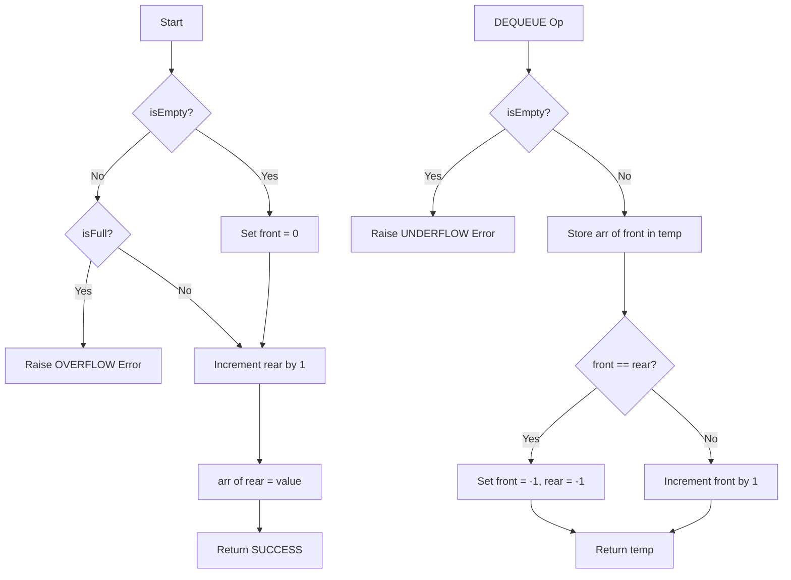
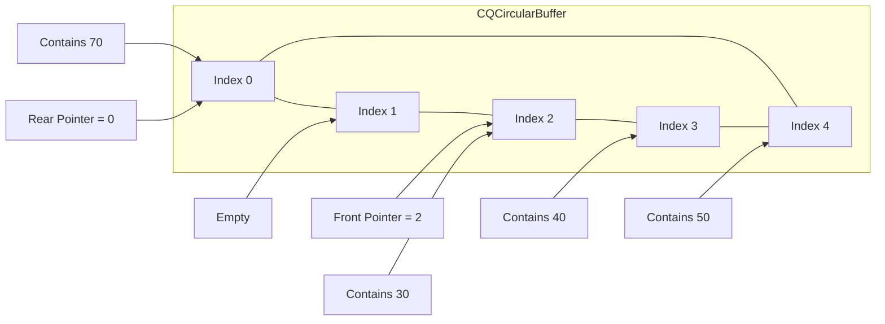
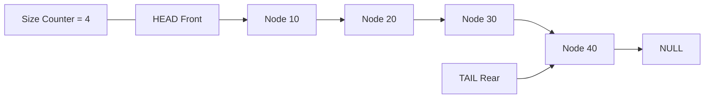
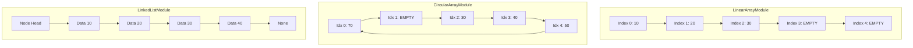

# Queues

<!-- SECTION_1_START -->
# 1. Core Technical Definition & Intuitive Overview

## Formal Academic Definition

> [!IMPORTANT]
> **Queue (FIFO Structure):** A linear data structure that follows the **First In, First Out (FIFO)** principle, where insertions (enqueues) occur exclusively at one end called the **Rear**, and deletions (dequeues) occur exclusively at the opposite end called the **Front**. It is formally defined as an ordered collection of homogeneous elements supporting two principal mutator operations, $\text{ENQUEUE}(x)$ and $\text{DEQUEUE}()$, which maintain the invariant that the element removed is always the one that has resided in the structure for the longest duration.

In the **KTU 2024 Scheme (PCCST303 – Module 1)** context, a Queue is classified as an *Abstract Data Type (ADT)* whose logical behavior is independent of its physical storage representation (array-based, linked-list-based, or circular buffer).

## Conceptual Analogy & Intuition

Think of a queue exactly like the **billing counter at a supermarket** or the **check-in line at an airport**:

* The **first person** to stand in line gets their bill printed and **leaves first**.
* A **new person** always joins the queue from the **back (rear)** end.
* No one is allowed to "cut" into the middle of the line.

Geometrically, visualize it as a **horizontal tube** with one open mouth on the left (dequeue side) and one open mouth on the right (enqueue side). Data can only flow from right to left.

> [!NOTE]
> **Key Terminology (Syllabus Highlight)**
> * **Front / Head** — the index/pointer from where elements are removed.
> * **Rear / Tail** — the index/pointer where new elements are appended.
> * **Overflow** — the state when the queue is full and no further enqueue is permitted.
> * **Underflow** — the state when the queue is empty and a dequeue is attempted.

## Standard Metrics & Conditions

* The default boundary state for a queue of capacity $\mathbf{n}$ is $\mathbf{front} = -1$ and $\mathbf{rear} = -1$ (empty state).
* The boundary state $\mathbf{rear} = \mathbf{n} - 1$ conventionally indicates a **linear (non-circular) array queue is full**.

> [!VISUALIZATION CONTROL]
> **Concept:** Linear Queue Behavior on a Cartesian Time Axis
> **Desmos / GeoGebra Input Points (queue size n = 5):**
> * Point A: $(0, 0)$ — Initial state (Empty, front = $-1$, rear = $-1$)
> * Point B: $(1, 1)$ — Enqueue 10 (rear becomes $0$)
> * Point C: $(2, 1.5)$ — Enqueue 20 (rear becomes $1$)
> * Point D: $(3, 1)$ — Dequeue (front becomes $1$)
> * Point E: $(4, 0.5)$ — State where 3 cells at the front are wasted
> **Visual Description:** The student should observe a graph plotting the `rear` index on the y-axis and time on the x-axis. The graph rises during ENQUEUE and the dequeue operations do not lower `rear`. The "wasted front cells" between $x=3$ and $x=5$ demonstrate the major limitation of a linear queue — the unused memory at the front.

<!-- SECTION_1_END -->

<!-- SECTION_2_START -->
# 2. Deep Theoretical Analysis & KTU High-Yield Formula Sheet

## Operational Breakdown

A Queue ADT is governed by five primitive operations. The KTU 2024 syllabus (Module 1) requires mastery over all of them:

* **ENQUEUE(x):** Add element $x$ to the **rear** end of the queue. Pre-condition: queue is not full.
* **DEQUEUE():** Remove and return the element from the **front** end. Pre-condition: queue is not empty.
* **FRONT() / PEEK():** Return the element at the front without removing it. Pre-condition: queue is not empty.
* **isEmpty():** Returns $\text{True}$ if the queue has zero elements.
* **isFull():** Returns $\text{True}$ if no more elements can be added (applicable to bounded array implementations).

### The "Why" Behind the FIFO Discipline

FIFO is a *fairness policy*. In operating systems, CPU schedulers use a **Ready Queue** to ensure every process gets a turn in the order it arrived — preventing starvation. In a stack (LIFO), the most recent request would always win, which is unfair for batch processing.

## Variants of Queues (KTU 2024 – High Weightage)

1. **Simple (Linear) Queue:** A bounded array or linked list. Suffers from the **"False Overflow"** problem — even when memory slots at the front are free, the rear pointer reaches the end and refuses further insertions.
2. **Circular Queue:** The rear index wraps around to $0$ using modular arithmetic, eliminating false overflow and reusing freed front cells.
3. **Double-Ended Queue (Deque):** Insertions and deletions allowed at **both** ends in $O(1)$ time.
4. **Priority Queue:** Every element carries a priority key. Dequeue removes the highest-priority element (not necessarily the oldest). Commonly implemented using **Heaps** (covered in Module 4).

## KTU High-Yield Formula & Boundary Condition Sheet

The table below consolidates every index/pointer arithmetic formula and boundary check you must memorize for the end-semester exam. **Note the use of `\vert` instead of the raw pipe character** to maintain markdown table integrity.

| Implementation Type | Full Condition | Empty Condition | Front Increment Rule | Rear Increment Rule | Key Formula |
| :--- | :--- | :--- | :--- | :--- | :--- |
| Linear Array Queue | $\text{rear} = n - 1$ | $\text{front} = -1 \text{ AND } \text{rear} = -1$ | $\text{front} \leftarrow \text{front} + 1$ | $\text{rear} \leftarrow \text{rear} + 1$ | $\text{Count} = \text{rear} - \text{front}$ |
| Circular Array Queue | $(\text{rear} + 1) \bmod n = \text{front}$ | $\text{front} = -1$ | $\text{front} \leftarrow (\text{front} + 1) \bmod n$ | $\text{rear} \leftarrow (\text{rear} + 1) \bmod n$ | $\text{Count} = (\text{rear} - \text{front} + n) \bmod n$ |
| Linked List Queue | Heap memory exhausted | $\text{front} = \text{NULL}$ | $\text{front} \leftarrow \text{front}.\text{next}$ | $\text{newNode}.\text{next} = \text{NULL}$; link to $\text{rear}.\text{next}$ | $\text{Count} = $ length of list |

> [!IMPORTANT]
> **Why the circular formula uses `+n`:** Without adding $n$ inside the modulo, a negative result occurs when $\text{rear} < \text{front}$ (after wrap-around). For example, $\text{rear} = 1$, $\text{front} = 3$, $n = 5$: $(1 - 3 + 5) \bmod 5 = 3$. This is a **3-mark KTU question** almost every year.

## Real-World Engineering & CS Applications

* **Operating Systems:** Process scheduling (Round Robin uses a Ready Queue), Disk Scheduling (FCFS algorithm), Print Spooling.
* **Networking:** Packets in a router are queued in a buffer; first packet in is first packet out.
* **Data Streaming:** Apache Kafka uses partitioned logs acting as FIFO queues for event-driven microservices.
* **Breadth-First Search (BFS):** The graph traversal algorithm (Module 2) fundamentally requires a queue to track the next node to visit.
* **Customer-Facing Systems:** Call center IVR systems, ticket booking (IRCTC), supermarket billing — all require queue-based fairness.

<!-- SECTION_2_END -->

<!-- SECTION_3_START -->
# 3. Step-by-Step Derivations & Code Implementation

This section delivers **complete, compilable Python implementations** for every queue variant. No logic is skipped or summarized.

## 3.1 Linear Array-Based Queue (with Front & Rear Pointers)

```python
from __future__ import annotations
import logging
from typing import Optional, Any

logging.basicConfig(level=logging.INFO, format="%(levelname)s | %(message)s")


class LinearQueue:
    """Bounded FIFO queue implemented over a fixed-size Python list."""

    def __init__(self, capacity: int) -> None:
        if capacity <= 0:
            raise ValueError("Capacity must be a positive integer.")
        self._capacity: int = capacity
        self._arr: list[Any] = [None] * capacity
        self._front: int = -1
        self._rear: int = -1
        logging.info("LinearQueue of capacity %d initialized.", capacity)

    def is_empty(self) -> bool:
        return self._front == -1 and self._rear == -1

    def is_full(self) -> bool:
        return self._rear == self._capacity - 1

    def enqueue(self, value: Any) -> None:
        if self.is_full():
            logging.error("OVERFLOW: Cannot enqueue %s into a full queue.", value)
            raise OverflowError("Queue is full.")
        if self.is_empty():
            self._front = 0
        self._rear += 1
        self._arr[self._rear] = value
        logging.info("ENQUEUE %s at index %d.", value, self._rear)

    def dequeue(self) -> Any:
        if self.is_empty():
            logging.error("UNDERFLOW: Cannot dequeue from an empty queue.")
            raise IndexError("Queue is empty.")
        removed: Any = self._arr[self._front]
        self._arr[self._front] = None
        if self._front == self._rear:
            # Last element removed -> reset to empty state.
            self._front = -1
            self._rear = -1
        else:
            self._front += 1
        logging.info("DEQUEUE returned %s from index %d.", removed, self._front - 1)
        return removed

    def peek(self) -> Any:
        if self.is_empty():
            raise IndexError("Queue is empty.")
        return self._arr[self._front]

    def display(self) -> None:
        if self.is_empty():
            print("Queue is empty.")
            return
        elements: list[str] = [str(self._arr[i]) for i in range(self._front, self._rear + 1)]
        print("FRONT -> " + " | ".join(elements) + " <- REAR")


if __name__ == "__main__":
    q: LinearQueue = LinearQueue(5)
    for val in (10, 20, 30, 40):
        q.enqueue(val)
    q.display()
    print("Front element:", q.peek())
    q.dequeue()
    q.dequeue()
    q.display()
```

**Execution Trace:**

$$
\begin{aligned}
\text{Initial} &: \text{front} = -1,\ \text{rear} = -1 \quad (\text{isEmpty} = \text{True}) \\
\text{ENQUEUE 10} &: \text{isEmpty} \Rightarrow \text{front} \leftarrow 0,\ \text{rear} \leftarrow 0,\ \text{arr}[0] = 10 \\
\text{ENQUEUE 20} &: \text{rear} \leftarrow 1,\ \text{arr}[1] = 20 \\
\text{ENQUEUE 30} &: \text{rear} \leftarrow 2,\ \text{arr}[2] = 30 \\
\text{DEQUEUE} &: \text{return arr}[0] = 10,\ \text{front} \leftarrow 1 \\
\text{DEQUEUE} &: \text{return arr}[1] = 20,\ \text{front} \leftarrow 2
\end{aligned}
$$

## 3.2 Circular Array-Based Queue (Solving the False Overflow)

```python
from __future__ import annotations
import logging
from typing import Optional, Any

logging.basicConfig(level=logging.INFO, format="%(levelname)s | %(message)s")


class CircularQueue:
    """FIFO queue over a fixed array using modular arithmetic."""

    def __init__(self, capacity: int) -> None:
        if capacity <= 0:
            raise ValueError("Capacity must be positive.")
        self._n: int = capacity
        self._arr: list[Any] = [None] * capacity
        self._front: int = -1
        self._rear: int = -1
        logging.info("CircularQueue of size %d created.", capacity)

    def is_empty(self) -> bool:
        return self._front == -1

    def is_full(self) -> bool:
        # One slot is always sacrificed to distinguish full from empty.
        return (self._rear + 1) % self._n == self._front

    def enqueue(self, value: Any) -> None:
        if self.is_full():
            raise OverflowError("Circular queue is full.")
        if self._front == -1:
            self._front = 0
        self._rear = (self._rear + 1) % self._n
        self._arr[self._rear] = value
        logging.info("ENQUEUE %s at circular index %d.", value, self._rear)

    def dequeue(self) -> Any:
        if self.is_empty():
            raise IndexError("Circular queue is empty.")
        removed: Any = self._arr[self._front]
        self._arr[self._front] = None
        if self._front == self._rear:
            self._front = -1
            self._rear = -1
        else:
            self._front = (self._front + 1) % self._n
        logging.info("DEQUEUE %s from index %d.", removed, self._front)
        return removed

    def display(self) -> None:
        if self.is_empty():
            print("Circular queue is empty.")
            return
        i: int = self._front
        result: list[str] = []
        while True:
            result.append(str(self._arr[i]))
            if i == self._rear:
                break
            i = (i + 1) % self._n
        print("FRONT -> " + " | ".join(result) + " <- REAR")


if __name__ == "__main__":
    cq: CircularQueue = CircularQueue(5)
    for val in (10, 20, 30, 40, 50):
        cq.enqueue(val)
    print("Full?", cq.is_full())
    cq.dequeue()
    cq.dequeue()
    cq.enqueue(60)
    cq.enqueue(70)
    cq.display()
```

**Derivation of the Modular Wrap:**

$$
\begin{aligned}
\text{Let } n &= 5, \quad \text{rear}_{\text{prev}} = 3 \\
\text{ENQUEUE 60} &: \text{rear}_{\text{new}} = (3 + 1) \bmod 5 = 4 \\
\text{ENQUEUE 70} &: \text{rear}_{\text{new}} = (4 + 1) \bmod 5 = 0 \quad (\text{wraps to front}) \\
\text{Full check} &: (0 + 1) \bmod 5 = 1 \neq \text{front} \Rightarrow \text{Not Full}
\end{aligned}
$$

> [!NOTE]
> **Why one slot is wasted:** If we used every slot, then the condition $\text{front} = \text{rear}$ would ambiguously mean "full" **and** "empty". Sacrificing one slot is the standard KTU-accepted method. An alternative uses a `count` variable — both are valid; the former saves memory metadata.

## 3.3 Linked List Queue (Unbounded, No Capacity Limit)

```python
from __future__ import annotations
import logging
from typing import Optional, Any

logging.basicConfig(level=logging.INFO, format="%(levelname)s | %(message)s")


class _Node:
    __slots__ = ("data", "next_ref")

    def __init__(self, data: Any) -> None:
        self.data: Any = data
        self.next_ref: Optional["_Node"] = None


class LinkedListQueue:
    """FIFO queue implemented using a singly linked list."""

    def __init__(self) -> None:
        self._front: Optional[_Node] = None
        self._rear: Optional[_Node] = None
        self._size: int = 0
        logging.info("LinkedListQueue created.")

    def is_empty(self) -> bool:
        return self._front is None

    def enqueue(self, value: Any) -> None:
        new_node: _Node = _Node(value)
        if self.is_empty():
            self._front = new_node
        else:
            assert self._rear is not None
            self._rear.next_ref = new_node
        self._rear = new_node
        self._size += 1
        logging.info("ENQUEUE %s.", value)

    def dequeue(self) -> Any:
        if self.is_empty():
            raise IndexError("Queue underflow.")
        assert self._front is not None
        removed: Any = self._front.data
        self._front = self._front.next_ref
        if self._front is None:
            self._rear = None
        self._size -= 1
        return removed

    def peek(self) -> Any:
        if self.is_empty():
            raise IndexError("Queue is empty.")
        assert self._front is not None
        return self._front.data

    def display(self) -> None:
        if self.is_empty():
            print("Linked-list queue is empty.")
            return
        node: Optional[_Node] = self._front
        tokens: list[str] = []
        while node is not None:
            tokens.append(str(node.data))
            node = node.next_ref
        print("FRONT -> " + " -> ".join(tokens) + " -> NULL")
```

<!-- SECTION_3_END -->

<!-- SECTION_4_START -->
# 4. Structural Diagrams & Schematics

## 4.1 Linear Array Queue — Enqueue/Dequeue State Machine



## 4.2 Circular Queue — Topological Index Flow



## 4.3 Linked List Queue — Block Architecture



## 4.4 Comparative Block Topology



<!-- SECTION_4_END -->

<!-- SECTION_5_START -->
# 5. KTU 2024 Scheme Examination Question Bank & Topic Recap

## Part A — Short Answer Questions (3 Marks Each)

### Question 1
**[KTU University Exam – July 2024]** *(CO1, Remember)*
**Differentiate between a Stack and a Queue. State one real-world application of each.**

**Model Answer (Valuation Key):**

A **Stack** follows the **LIFO (Last In, First Out)** discipline — the most recently inserted element is removed first. The insertion and deletion happen at the **same end** called the **TOP**. A real-world application is the **Undo mechanism** in text editors (the most recent action is reversed first).

A **Queue** follows the **FIFO (First In, First Out)** discipline — the oldest inserted element is removed first. Insertion happens at the **REAR** and deletion at the **FRONT**. A real-world application is the **CPU Ready Queue** in Round Robin scheduling in operating systems. *[3 Marks: 1 for LIFO/FIFO definition, 1 for end-point identification, 1 for application.]*

---

### Question 2
**[KTU University Exam – Dec 2023]** *(CO1, Understand)*
**Explain the "False Overflow" problem in a linear queue. How does a circular queue resolve it?**

**Model Answer (Valuation Key):**

In a **linear queue** implemented using an array of size $n$, the `rear` pointer monotonically increases and never wraps around. Even if all elements at the front are dequeued, freeing up space, the `rear` pointer still reaches index $n-1$ and blocks further insertions, **even though physical memory slots at the front are free**. This unused but inaccessible memory is called **False Overflow**.

A **Circular Queue** resolves this by treating the array as a ring: when `rear` or `front` reaches the last index, it wraps back to $0$ using modular arithmetic: $\text{rear} \leftarrow (\text{rear} + 1) \bmod n$. This reuses the freed front slots and eliminates false overflow. *[3 Marks: 1.5 for false overflow explanation, 1.5 for circular solution.]*

---

## Part B — Long Answer Questions (14 Marks Each)

### Question A (Internal Choice Option 1)

**[KTU University Exam – July 2024]** *(CO1, CO2 — Apply / Analyze)*

**(a)** Write the algorithm to **ENQUEUE** and **DEQUEUE** operations in a circular queue implemented using an array. Include all boundary conditions clearly. *(7 Marks)*

**(b)** Given an empty circular queue of size $\mathbf{6}$, perform the following operations in order and show the state of `front`, `rear`, and the array after each step: **ENQUEUE 5, ENQUEUE 15, ENQUEUE 25, DEQUEUE, ENQUEUE 35, ENQUEUE 45, ENQUEUE 55, ENQUEUE 65, DEQUEUE, ENQUEUE 75**. *(7 Marks)*

---

#### Model Solution for Question A (a)

**Algorithm: ENQUEUE (Circular Queue)**

```
Algorithm CircularEnqueue(Q, value)
1.  IF (Q.front == -1) AND (Q.rear == -1) THEN
2.      // Queue is empty
3.      Q.front ← 0
4.  ELSE IF (Q.rear + 1) mod Q.n == Q.front THEN
5.      PRINT "Overflow: Queue is full"
6.      RETURN
7.  END IF
8.  Q.rear ← (Q.rear + 1) mod Q.n
9.  Q.arr[Q.rear] ← value
10. RETURN
```

**Algorithm: DEQUEUE (Circular Queue)**

```
Algorithm CircularDequeue(Q)
1.  IF Q.front == -1 THEN
2.      PRINT "Underflow: Queue is empty"
3.      RETURN -1
4.  END IF
5.  value ← Q.arr[Q.front]
6.  IF Q.front == Q.rear THEN
7.      Q.front ← -1
8.      Q.rear ← -1
9.  ELSE
10.     Q.front ← (Q.front + 1) mod Q.n
11. END IF
12. RETURN value
```

**Valuation Breakdown for 7 Marks:**
* *[Step 1-2: Empty check & initialization: 2 Marks]*
* *[Step 4-6: Full condition using modular arithmetic: 2 Marks]*
* *[Step 8-9: Correct modular update of rear and value assignment: 2 Marks]*
* *[Correct dequeue algorithm mirroring the same boundary logic: 1 Mark]*

---

#### Model Solution for Question A (b)

Initial State: $\text{front} = -1$, $\text{rear} = -1$, $\text{arr} = [\_,\_,\_,\_,\_,\_]$, $n = 6$

$$
\begin{aligned}
&\text{Step 1: ENQUEUE 5} &&\Rightarrow \text{front}=0,\ \text{rear}=0,\ \text{arr}=[5,\_,\_,\_,\_,\_] \\
&\text{Step 2: ENQUEUE 15} &&\Rightarrow \text{front}=0,\ \text{rear}=1,\ \text{arr}=[5,15,\_,\_,\_,\_] \\
&\text{Step 3: ENQUEUE 25} &&\Rightarrow \text{front}=0,\ \text{rear}=2,\ \text{arr}=[5,15,25,\_,\_,\_] \\
&\text{Step 4: DEQUEUE} &&\Rightarrow \text{front}=1,\ \text{rear}=2,\ \text{arr}=[\_,15,25,\_,\_,\_] \\
&\text{Step 5: ENQUEUE 35} &&\Rightarrow \text{front}=1,\ \text{rear}=3,\ \text{arr}=[\_,15,25,35,\_,\_] \\
&\text{Step 6: ENQUEUE 45} &&\Rightarrow \text{front}=1,\ \text{rear}=4,\ \text{arr}=[\_,15,25,35,45,\_] \\
&\text{Step 7: ENQUEUE 55} &&\Rightarrow \text{front}=1,\ \text{rear}=5,\ \text{arr}=[\_,15,25,35,45,55] \\
&\text{Step 8: ENQUEUE 65} &&\Rightarrow \text{rear}_{\text{new}} = (5+1) \bmod 6 = 0 \\
&                                   &&\Rightarrow \text{front}=1,\ \text{rear}=0,\ \text{arr}=[65,15,25,35,45,55] \\
&\text{Step 9: DEQUEUE} &&\Rightarrow \text{front}=2,\ \text{rear}=0,\ \text{arr}=[65,\_,25,35,45,55] \\
&\text{Step 10: ENQUEUE 75} &&\Rightarrow \text{rear}_{\text{new}} = (0+1) \bmod 6 = 1 \\
&                                    &&\Rightarrow \text{full? } (1+1) \bmod 6 = 2 \neq 2 \text{ (False)} \\
&                                    &&\Rightarrow \text{front}=2,\ \text{rear}=1,\ \text{arr}=[65,75,25,35,45,55]
\end{aligned}
$$

**Final State:** $\text{front} = 2$, $\text{rear} = 1$, Array = $[65, 75, 25, 35, 45, 55]$.

**Valuation Breakdown for 7 Marks:**
* *[Each correct step's state update: 0.5 Mark × 10 steps = 5 Marks]*
* *[Showing modular wrap calculation explicitly in steps 8 & 10: 1 Mark]*
* *[Final array state and correct front/rear: 1 Mark]*

---

### Question B (Internal Choice Option 2)

**[KTU University Exam – Dec 2023]** *(CO2 — Apply)*

**(a)** Explain the structure and operations of a **Double-Ended Queue (Deque)**. List its variants. *(7 Marks)*

**(b)** Implement a queue using **two stacks** in Python. Show the time complexity of ENQUEUE and DEQUEUE operations. *(7 Marks)*

---

#### Model Solution for Question B (a)

A **Deque (Double-Ended Queue)** is a generalized queue that allows insertion and deletion of elements at **both** ends — front and rear — in $O(1)$ time.

**Two Variants:**
* **Input-Restricted Deque:** Insertions allowed at only one end; deletions allowed at both ends.
* **Output-Restricted Deque:** Deletions allowed at only one end; insertions allowed at both ends.

**Operations:** $\text{insertFront}(x)$, $\text{insertRear}(x)$, $\text{deleteFront}()$, $\text{deleteRear}()$, $\text{getFront}()$, $\text{getRear}()$.

**Real-world use:** Used in the **A-Steal algorithm** for job scheduling across multiple CPU cores and in the **palindrome checker** data structure.

**Valuation Breakdown for 7 Marks:**
* *[Definition and 4-6 operations listed correctly: 3 Marks]*
* *[Both variants explained with one example each: 3 Marks]*
* *[One real-world use case: 1 Mark]*

---

#### Model Solution for Question B (b)

```python
from __future__ import annotations
from typing import Any
import logging

logging.basicConfig(level=logging.INFO, format="%(levelname)s | %(message)s")


class QueueUsingTwoStacks:
    """Queue ADT implemented with two stacks: inbox and outbox."""

    def __init__(self) -> None:
        self._inbox: list[Any] = []
        self._outbox: list[Any] = []
        logging.info("QueueUsingTwoStacks initialized.")

    def enqueue(self, value: Any) -> None:
        # O(1) amortized
        self._inbox.append(value)
        logging.info("ENQUEUE %s.", value)

    def dequeue(self) -> Any:
        if not self._outbox:
            # Transfer from inbox to outbox - reverses order, restoring FIFO.
            if not self._inbox:
                raise IndexError("Queue underflow.")
            while self._inbox:
                self._outbox.append(self._inbox.pop())
        return self._outbox.pop()

    def front(self) -> Any:
        if not self._outbox:
            if not self._inbox:
                raise IndexError("Queue is empty.")
            while self._inbox:
                self._outbox.append(self._inbox.pop())
        return self._outbox[-1]

    def is_empty(self) -> bool:
        return not self._inbox and not self._outbox


if __name__ == "__main__":
    q: QueueUsingTwoStacks = QueueUsingTwoStacks()
    for v in (1, 2, 3, 4):
        q.enqueue(v)
    print(q.dequeue())  # 1
    print(q.dequeue())  # 2
    q.enqueue(5)
    print(q.dequeue())  # 3
    print(q.dequeue())  # 4
    print(q.dequeue())  # 5
```

**Time Complexity Analysis (Amortized):**

$$
\begin{aligned}
\text{ENQUEUE} &: O(1) \text{ (one push to inbox)} \\
\text{DEQUEUE} &: O(1) \text{ amortized} \\
&\text{(Each element is moved inbox} \rightarrow \text{outbox exactly once across the lifetime,} \\
&\text{so total cost is } 2 \cdot n \text{ pushes + } 2 \cdot n \text{ pops for } n \text{ operations, giving } O(1) \text{ amortized).}
\end{aligned}
$$

**Valuation Breakdown for 7 Marks:**
* *[Correct full code with two stacks: 4 Marks]*
* *[Correct amortized time complexity for both operations: 2 Marks]*
* *[Justification of amortization using the "each element transferred at most once" argument: 1 Mark]*

---

> [!WARNING]
> **KTU Examiner's Valuation Warning — Common Pitfalls**
> 1. **Forgetting the empty-state reset in DEQUEUE:** If you dequeue the last element but forget to reset both `front` and `rear` to $-1$, the queue appears non-empty forever. KTU examiners deduct **2 marks** for this single bug.
> 2. **Confusing full vs empty in circular queue:** Always use the one-slot-sacrificed method OR an explicit `count` variable. Mixing them up loses **1.5 marks**.
> 3. **Off-by-one error in modular arithmetic:** Writing $\text{rear} + 1 = \text{front}$ instead of $(\text{rear} + 1) \bmod n = \text{front}$ is the **most common mistake**. KTU 2024 papers have dedicated 1-mark sub-questions testing this.
> 4. **Skipping the empty-condition check:** If your algorithm lacks `IF front == -1`, you'll fail the boundary test case where the queue starts empty.
> 5. **Drawing the array without showing `front` and `rear` pointer values:** You must state the index positions, not just the array contents. The examiner allocates marks for pointer tracking.

---

## Topic Recap & Important Things to Remember

* **Queue** is a **FIFO** linear data structure. Insertion happens at **REAR**, deletion at **FRONT**.
* **Five primitive operations:** ENQUEUE, DEQUEUE, FRONT/PEEK, isEmpty, isFull.
* **Time complexity** of all basic queue operations is $O(1)$ for both array and linked-list implementations.
* **Linear Queue** has a major limitation: **False Overflow** — memory at the front becomes inaccessible after a series of enqueues and dequeues.
* **Circular Queue** uses modular arithmetic: $\text{rear} \leftarrow (\text{rear} + 1) \bmod n$ and $\text{front} \leftarrow (\text{front} + 1) \bmod n$. It solves false overflow.
* **Circular Queue Full Condition:** $(\text{rear} + 1) \bmod n = \text{front}$. This wastes exactly **one slot** to disambiguate full vs empty.
* **Circular Queue Empty Condition:** $\text{front} = -1$ (or $\text{front} = \text{rear}$ if you use a `count` field).
* **Linked List Queue** is unbounded; uses a `head` (front) and `tail` (rear) pointer. ENQUEUE appends to tail, DEQUEUE removes from head. No overflow except heap exhaustion.
* **Double-Ended Queue (Deque):** Insertion and deletion at both ends in $O(1)$.
* **Priority Queue:** Elements carry a priority key. Highest-priority element dequeued first. Implementation typically uses heaps (Module 4).
* **Applications:** CPU scheduling, disk scheduling, BFS traversal, print spooling, packet buffering, customer service systems.
* **Stack-vs-Queue Implementations:** A queue can be built using two stacks with $O(1)$ amortized enqueue and dequeue.
* **Boundary-State Discipline:** Always reset $\text{front} = \text{rear} = -1$ after dequeuing the last element; always initialize $\text{front} = 0$ on first enqueue into an empty queue.
* **Count Formula for Circular Queue:** $\text{count} = (\text{rear} - \text{front} + n) \bmod n$ — the `+n` is **not optional**; without it, wrap-around yields a negative count.
* **Memory cost comparison:** Array queue uses contiguous memory (cache-friendly); Linked-list queue uses pointer-heavy nodes (slower access, no size limit).

<!-- SECTION_5_END -->
