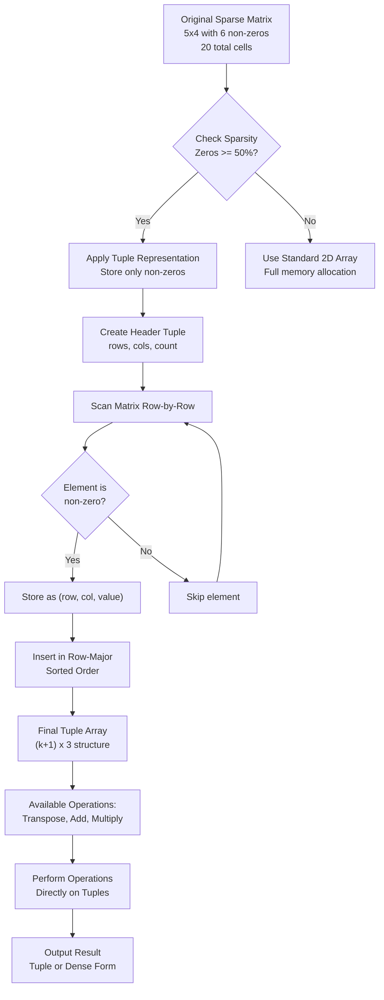
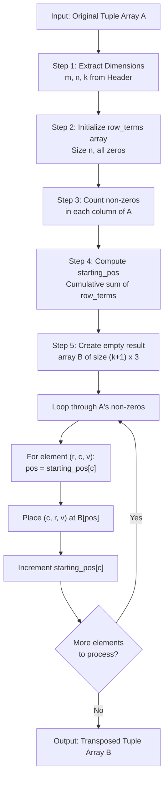
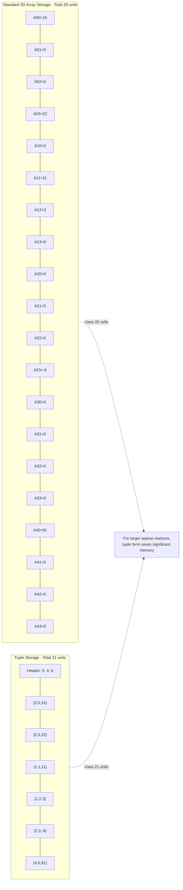
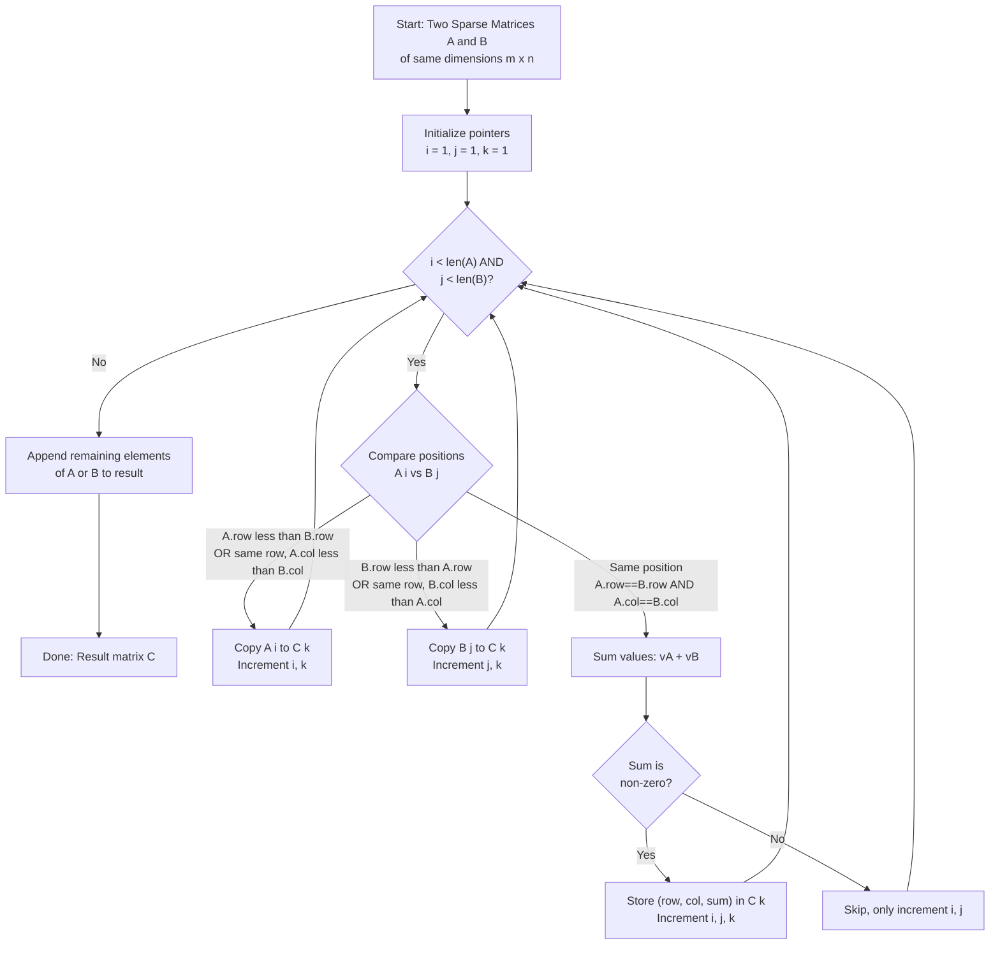

# Sparse matrix ( Tuple representation )

<!-- SECTION_1_START -->
# Sparse Matrix Representation using Tuples

## Formal Academic Definition (KTU 2024 Syllabus Aligned)

A **sparse matrix** is a two-dimensional array in which the number of zero elements significantly exceeds the number of non-zero elements. Formally, if $M$ is an $m \times n$ matrix with $T$ total entries such that $T = m \times n$, and $Z$ denotes the count of zero entries, then $M$ is classified as sparse if:

$$\text{Sparsity Ratio} = \frac{Z}{T} \geq 0.5 \quad \text{(i.e., more than 50\% elements are zero)}$$

The **Tuple Representation** (also called **Coordinate List / 3-Tuple Representation / Triplet Representation**) is a memory-efficient storage scheme that stores only the non-zero elements along with their positional coordinates. Each non-zero element is encoded as a triple $(row, column, value)$, and the entire matrix is represented as a collection of such triples, prefixed by a header tuple $(m, n, k)$ where $k$ is the count of non-zero elements.

> [!IMPORTANT]
> **KTU Board Definition (Verbatim Style):** A sparse matrix is one in which a large number of elements are zero. The tuple representation stores the matrix as a set of triples $(i, j, a_{ij})$, where $i$ is the row index, $j$ is the column index, and $a_{ij}$ is the corresponding non-zero value. The first tuple stores the dimensions of the original matrix and the total number of non-zero elements.

## Conceptual Analogy / Intuition

Imagine a **class attendance register of 1000 students** for an entire semester (200 working days). Out of the $1000 \times 200 = 200{,}000$ total slots, students are absent on most days. Instead of recording every single day (with 198,000 zeros for absent students), we maintain a compact list saying: *"Roll No. 47 was absent on Day 3, Day 17, Day 88..."* — this is exactly the philosophy behind sparse matrix representation.

Think of the original matrix as a **giant chessboard with only a few pieces placed on it**. Storing the entire board wastes memory on 90%+ empty squares. The tuple representation is like writing down a **strategic list**: *"Knight at (3,4), Pawn at (1,7), Bishop at (6,2)..."* — efficient, compact, and retrieval-friendly.

> [!NOTE]
> **Key Insight for Students:** The original matrix is **never physically reconstructed** during operations. All algorithms (transpose, addition, multiplication) work directly on the tuple form using clever coordinate manipulation — this is what makes tuple representation memory-efficient and algorithmically elegant.

## Standard Metrics and Constants

- **Space Complexity of Tuple Form:** $O(3(k+1))$ for a matrix with $k$ non-zero entries
- **Space Complexity of Standard 2D Array:** $O(m \times n)$
- **Break-even Point:** Tuple form becomes more efficient when $k < \frac{m \times n}{3}$
- **Header Tuple Convention:** The first tuple is always $(rows, columns, num\_non\_zero)$

> [!VISUALIZATION CONTROL]
> **Concept:** Sparse Matrix Density Visualization
> **GeoGebra / Desmos Input Equations:**
> * `Density(x) = x` (where x is the fraction of non-zero elements)
> * `Efficiency_Tuple(x) = 3 * x`
> * `Efficiency_Array(x) = 1`
> **Visual Description:** Plot two lines — `y = 3x` (tuple space) and `y = 1` (array space). The intersection at $x = 1/3$ is the break-even point. For $x < 1/3$, the tuple line is below the array line, indicating tuple representation is more memory-efficient.
<!-- SECTION_1_END -->

<!-- SECTION_2_START -->
# Deep Theoretical Analysis & KTU High-Yield Formula Sheet

## Structural Anatomy of the Tuple Representation

The tuple (triplet) representation of an $m \times n$ sparse matrix with $k$ non-zero elements is structured as a $(k+1) \times 3$ array of records:

| Row Index of Tuple Array | Field 1 (Row) | Field 2 (Column) | Field 3 (Value) |
|:---:|:---:|:---:|:---:|
| 0 (Header) | $m$ | $n$ | $k$ |
| 1 | $i_1$ | $j_1$ | $a_{i_1 j_1}$ |
| 2 | $i_2$ | $j_2$ | $a_{i_2 j_2}$ |
| $\vdots$ | $\vdots$ | $\vdots$ | $\vdots$ |
| $k$ | $i_k$ | $j_k$ | $a_{i_k j_k}$ |

> [!NOTE]
> **Convention Used in KTU Boards:** Non-zero entries are stored in **row-major order** (sorted by row index, then by column index within each row). This convention simplifies the Fast Transpose Algorithm.

## Algorithmic Operations on Tuple Representation

### 1. Simple Transpose Algorithm

The naive approach swaps row and column indices for every non-zero element, then re-sorts.

- **Time Complexity:** $O(k \cdot n)$ in the worst case (sorting overhead dominates)
- **Drawback:** Sorting after index swap is expensive

### 2. Fast Transpose Algorithm

This optimized approach uses a **counting sort** strategy:

**Step-by-Step Logic:**

1. Determine the **number of non-zero elements in each column** of the original matrix.
2. Compute the **starting position** of each column's elements in the transposed tuple array (cumulative sum).
3. Place each non-zero element directly at its computed position in the transposed array.

- **Time Complexity:** $O(m + n + k)$, which is significantly better than the simple transpose.

### 3. Sparse Matrix Addition

To add two sparse matrices $A$ and $B$ of dimensions $m \times n$:

- Compare row indices; if equal, compare column indices.
- Three cases arise per traversal:
  1. $A.row < B.row$ → copy $A$ tuple to result
  2. $A.row > B.row$ → copy $B$ tuple to result
  3. $A.row == B.row$ and $A.col == B.col$ → add values, store if non-zero
- **Time Complexity:** $O(m + n)$ where $m, n$ are the number of non-zero entries in $A$ and $B$ respectively.

### 4. Sparse Matrix Multiplication

To multiply $A$ (dimension $m \times n$) with $B$ (dimension $n \times p$):

- For each row $i$ of $A$, scan all elements of $B$ to compute result row $i$ of $C$.
- Accumulate dot products and store only non-zero results.
- **Time Complexity:** $O(m \cdot n \cdot p)$ in the worst case, but in practice much faster due to sparsity.

## KTU Formula Sheet / Cheat Sheet

| Operation | Time Complexity | Space Complexity | Key Insight |
|:---|:---:|:---:|:---|
| Storage of Sparse Matrix | $O(k)$ | $O(3(k+1))$ | Only $k$ non-zero elements stored |
| Simple Transpose | $O(k \cdot n)$ | $O(3(k+1))$ | Requires sorting after swap |
| Fast Transpose | $O(m + n + k)$ | $O(m + n + k)$ | Uses counting sort approach |
| Sparse Addition (A + B) | $O(k_A + k_B)$ | $O(3(k_A + k_B + 1))$ | Requires same dimensions |
| Sparse Multiplication (A × B) | $O(k_A \cdot k_B)$ avg | $O(3(k_C + 1))$ | Inner dimensions must match |
| Density Check | $O(1)$ | $O(1)$ | Calculate $k / (m \cdot n)$ |

### Auxiliary Arrays Used in Fast Transpose

| Array Name | Size | Purpose |
|:---|:---:|:---|
| `row_terms[]` | $n$ (original columns) | Count of non-zero elements in each column |
| `starting_pos[]` | $n$ | Starting index of each column in transposed array |

**Cumulative Sum Formula:**

$$\text{starting\_pos}[j] = \text{starting\_pos}[j-1] + \text{row\_terms}[j-1]$$

**Initial Condition:** $\text{starting\_pos}[0] = 1$ (since index 0 is the header)

## Real-World Engineering Utility

Sparse matrices and tuple representations are foundational in:

1. **Graph Algorithms:** Adjacency matrices of large graphs (social networks, web graphs) are extremely sparse — tuple representation maps directly to edge lists.
2. **Machine Learning:** Natural Language Processing uses sparse term-document matrices (TF-IDF) where most entries are zero.
3. **Computer Graphics:** 3D mesh transformations use sparse matrices for selective vertex manipulation.
4. **Scientific Computing:** Finite Element Analysis (FEA) generates sparse stiffness matrices.
5. **Network Routing:** GPS systems use sparse distance matrices for path optimization.
6. **Recommendation Systems:** User-item interaction matrices (Netflix, Amazon) are highly sparse.

> [!TIP]
> **Production Engineering Note:** Libraries like SciPy (`scipy.sparse`) in Python directly implement tuple-like representations (COO — Coordinate Format, CSR — Compressed Sparse Row, CSC — Compressed Sparse Column). The tuple representation you learn in KTU is the conceptual foundation for these production-grade formats.
<!-- SECTION_2_END -->

<!-- SECTION_3_START -->
# Step-by-Step Derivations & Code Implementation

## Worked Example 1: Constructing a Tuple Representation

**Given Sparse Matrix $A$:**

$$A = \begin{bmatrix} 15 & 0 & 0 & 22 \\ 0 & 11 & 3 & 0 \\ 0 & 0 & 0 & -6 \\ 0 & 0 & 0 & 0 \\ 91 & 0 & 0 & 0 \end{bmatrix}$$

**Step 1: Identify dimensions.** $m = 5$ rows, $n = 4$ columns.

**Step 2: Identify non-zero elements** (with their coordinates):
- $(0, 0, 15)$
- $(0, 3, 22)$
- $(1, 1, 11)$
- $(1, 2, 3)$
- $(2, 3, -6)$
- $(4, 0, 91)$

Total non-zero elements: $k = 6$

**Step 3: Build the tuple array in row-major order:**

| Index | Row | Col | Value |
|:---:|:---:|:---:|:---:|
| 0 | 5 | 4 | 6 |
| 1 | 0 | 0 | 15 |
| 2 | 0 | 3 | 22 |
| 3 | 1 | 1 | 11 |
| 4 | 1 | 2 | 3 |
| 5 | 2 | 3 | -6 |
| 6 | 4 | 0 | 91 |

> [!NOTE]
> **Storage Comparison:**
> * Standard 2D array: $5 \times 4 = 20$ memory units
> * Tuple representation: $(6 + 1) \times 3 = 21$ memory units (header + 6 entries)
> * For this small example, tuple form uses slightly more memory because the matrix is not very sparse. For larger matrices with sparsity, tuple form wins significantly.

## Worked Example 2: Fast Transpose Derivation

**Given the tuple form of matrix $A$ from Example 1, derive the tuple form of $A^T$.**

**Step 1: Determine `row_terms[]`** (count of non-zero elements per column of $A$):
- Column 0: elements at rows 0, 4 → count = 2
- Column 1: element at row 1 → count = 1
- Column 2: element at row 1 → count = 1
- Column 3: elements at rows 0, 2 → count = 2

$$\text{row\_terms} = [2, 1, 1, 2]$$

**Step 2: Compute `starting_pos[]`** using cumulative sum:

$$\text{starting\_pos}[0] = 1$$
$$\text{starting\_pos}[1] = 1 + 2 = 3$$
$$\text{starting\_pos}[2] = 3 + 1 = 4$$
$$\text{starting\_pos}[3] = 4 + 1 = 5$$

$$\text{starting\_pos} = [1, 3, 4, 5]$$

**Step 3: Place each element** in the transposed array at the position given by `starting_pos[original_col]`, then increment the position.

- Element $(0, 0, 15)$: place at $A^T[\text{starting\_pos}[0]=1] \rightarrow (0, 0, 15)$. Increment $\text{starting\_pos}[0]$ to 2.
- Element $(0, 3, 22)$: place at $A^T[\text{starting\_pos}[3]=5] \rightarrow (3, 0, 22)$. Increment $\text{starting\_pos}[3]$ to 6.
- Element $(1, 1, 11)$: place at $A^T[\text{starting\_pos}[1]=3] \rightarrow (1, 1, 11)$. Increment $\text{starting\_pos}[1]$ to 4.
- Element $(1, 2, 3)$: place at $A^T[\text{starting\_pos}[2]=4] \rightarrow (2, 1, 3)$. Increment $\text{starting\_pos}[2]$ to 5.
- Element $(2, 3, -6)$: place at $A^T[\text{starting\_pos}[3]=6] \rightarrow (3, 2, -6)$. Increment $\text{starting\_pos}[3]$ to 7.
- Element $(4, 0, 91)$: place at $A^T[\text{starting\_pos}[0]=2] \rightarrow (0, 4, 91)$. Increment $\text{starting\_pos}[0]$ to 3.

**Step 4: Final Transposed Tuple Array $A^T$** (Header: $4 \times 5$, 6 non-zeros):

| Index | Row | Col | Value |
|:---:|:---:|:---:|:---:|
| 0 | 4 | 5 | 6 |
| 1 | 0 | 0 | 15 |
| 2 | 0 | 4 | 91 |
| 3 | 1 | 1 | 11 |
| 4 | 2 | 1 | 3 |
| 5 | 3 | 0 | 22 |
| 6 | 3 | 2 | -6 |

**Verification:** $A^T$ is a $4 \times 5$ matrix, and the elements match the transpose of the original $5 \times 4$ matrix $A$.

## Complete Python Implementation

```python
from typing import List, Tuple, Optional
import logging

logging.basicConfig(level=logging.INFO, format='%(levelname)s: %(message)s')
logger = logging.getLogger(__name__)


class SparseMatrixTuple:
    """
    Tuple (Triplet) representation of a sparse matrix.
    Each non-zero element is stored as (row, col, value).
    Index 0 stores the header: (num_rows, num_cols, num_nonzero).
    """

    def __init__(self, num_rows: int, num_cols: int) -> None:
        if num_rows <= 0 or num_cols <= 0:
            raise ValueError("Matrix dimensions must be positive integers.")
        self.data: List[Tuple[int, int, int]] = [(num_rows, num_cols, 0)]
        logger.info(f"Initialized empty sparse matrix of size {num_rows}x{num_cols}")

    def insert(self, row: int, col: int, value: int) -> None:
        """Insert a non-zero element, maintaining row-major order."""
        if value == 0:
            logger.warning(f"Skipping zero value at ({row}, {col})")
            return
        if row < 0 or col < 0 or row >= self.data[0][0] or col >= self.data[0][1]:
            raise IndexError(f"Position ({row}, {col}) out of matrix bounds.")

        # Maintain row-major sorted order
        insert_pos = len(self.data)
        for i in range(1, len(self.data)):
            if (row, col) < (self.data[i][0], self.data[i][1]):
                insert_pos = i
                break
        self.data.insert(insert_pos, (row, col, value))
        header = self.data[0]
        self.data[0] = (header[0], header[1], header[2] + 1)
        logger.info(f"Inserted value {value} at ({row}, {col})")

    def display_tuple(self) -> None:
        """Display the tuple representation in tabular form."""
        print("\n--- Tuple Representation ---")
        print(f"{'Index':<8}{'Row':<8}{'Col':<8}{'Value':<8}")
        print("-" * 32)
        for i, (r, c, v) in enumerate(self.data):
            label = "Header" if i == 0 else str(i)
            print(f"{label:<8}{r:<8}{c:<8}{v:<8}")
        print("--- End ---\n")

    def display_dense(self) -> None:
        """Reconstruct and display the dense matrix from tuple form."""
        rows, cols, _ = self.data[0]
        matrix = [[0 for _ in range(cols)] for _ in range(rows)]
        for i in range(1, len(self.data)):
            r, c, v = self.data[i]
            matrix[r][c] = v

        print("\n--- Dense Matrix ---")
        for row in matrix:
            print(" ".join(f"{val:4}" for val in row))
        print("--- End ---\n")

    def fast_transpose(self) -> 'SparseMatrixTuple':
        """
        Fast Transpose Algorithm using row_terms[] and starting_pos[].
        Time Complexity: O(m + n + k)
        """
        rows, cols, k = self.data[0]
        transposed = SparseMatrixTuple(cols, rows)
        transposed.data[0] = (cols, rows, k)

        if k == 0:
            logger.info("Fast Transpose on zero matrix returned empty matrix.")
            return transposed

        # Step 1: row_terms - count non-zeros per column of original
        row_terms: List[int] = [0] * cols
        for i in range(1, len(self.data)):
            _, original_col, _ = self.data[i]
            row_terms[original_col] += 1

        # Step 2: starting_pos - cumulative sum with offset
        starting_pos: List[int] = [0] * cols
        starting_pos[0] = 1
        for j in range(1, cols):
            starting_pos[j] = starting_pos[j - 1] + row_terms[j - 1]

        # Step 3: Place elements at computed positions
        result: List[Optional[Tuple[int, int, int]]] = [None] * (k + 1)
        result[0] = (cols, rows, k)
        for i in range(1, len(self.data)):
            r, c, v = self.data[i]
            pos = starting_pos[c]
            result[pos] = (c, r, v)
            starting_pos[c] += 1

        transposed.data = [item for item in result if item is not None]
        logger.info(f"Fast Transpose complete: {rows}x{cols} -> {cols}x{rows}")
        return transposed

    def add(self, other: 'SparseMatrixTuple') -> 'SparseMatrixTuple':
        """Add two sparse matrices. Both must have identical dimensions."""
        if self.data[0][:2] != other.data[0][:2]:
            raise ValueError("Matrix dimensions must match for addition.")

        rows, cols, _ = self.data[0]
        result = SparseMatrixTuple(rows, cols)
        i, j = 1, 1
        result_data: List[Tuple[int, int, int]] = [(rows, cols, 0)]

        while i < len(self.data) and j < len(other.data):
            r1, c1, v1 = self.data[i]
            r2, c2, v2 = other.data[j]
            if (r1, c1) < (r2, c2):
                result_data.append((r1, c1, v1))
                i += 1
            elif (r1, c1) > (r2, c2):
                result_data.append((r2, c2, v2))
                j += 1
            else:
                summed = v1 + v2
                if summed != 0:
                    result_data.append((r1, c1, summed))
                i += 1
                j += 1

        # Append remaining elements
        while i < len(self.data):
            result_data.append(self.data[i])
            i += 1
        while j < len(other.data):
            result_data.append(other.data[j])
            j += 1

        result_data[0] = (rows, cols, len(result_data) - 1)
        result.data = result_data
        logger.info(f"Matrix addition complete: {len(result_data) - 1} non-zero entries")
        return result

    def multiply(self, other: 'SparseMatrixTuple') -> 'SparseMatrixTuple':
        """
        Multiply two sparse matrices: A (m x n) * B (n x p) = C (m x p).
        """
        m, n, _ = self.data[0]
        n2, p, _ = other.data[0]
        if n != n2:
            raise ValueError(f"Inner dimensions mismatch: {n} != {n2}")

        result = SparseMatrixTuple(m, p)
        result_data: List[Tuple[int, int, int]] = [(m, p, 0)]

        # Group A's elements by row
        a_rows: dict = {}
        for i in range(1, len(self.data)):
            r, c, v = self.data[i]
            a_rows.setdefault(r, []).append((c, v))

        # Group B's elements by row
        b_rows: dict = {}
        for i in range(1, len(other.data)):
            r, c, v = other.data[i]
            b_rows.setdefault(r, []).append((c, v))

        for i in range(m):
            for k_idx in range(p):
                a_row_elements = a_rows.get(i, [])
                b_row_elements = b_rows.get(k_idx, [])
                b_col_map = {c: v for c, v in b_row_elements}
                dot_product = sum(a_val * b_col_map.get(a_col, 0)
                                  for a_col, a_val in a_row_elements
                                  if a_col in b_col_map)
                if dot_product != 0:
                    result_data.append((i, k_idx, dot_product))

        result_data[0] = (m, p, len(result_data) - 1)
        result.data = result_data
        logger.info(f"Matrix multiplication complete: {m}x{n} * {n}x{p} = {m}x{p}")
        return result


def main() -> None:
    # Demo
    A = SparseMatrixTuple(5, 4)
    A.insert(0, 0, 15)
    A.insert(0, 3, 22)
    A.insert(1, 1, 11)
    A.insert(1, 2, 3)
    A.insert(2, 3, -6)
    A.insert(4, 0, 91)

    A.display_tuple()
    A.display_dense()

    AT = A.fast_transpose()
    AT.display_tuple()
    AT.display_dense()


if __name__ == "__main__":
    main()
```

## Worked Example 3: Sparse Matrix Addition

**Given:**
$$A = \begin{bmatrix} 10 & 0 \\ 0 & 20 \end{bmatrix}, \quad B = \begin{bmatrix} 0 & 5 \\ 30 & 20 \end{bmatrix}$$

**Tuple form of A:** $((2, 2, 2), (0, 0, 10), (1, 1, 20))$

**Tuple form of B:** $((2, 2, 2), (0, 1, 5), (1, 0, 30), (1, 1, 20))$

**Step-by-step merging:**

| Step | i (A index) | j (B index) | Comparison | Action | Result |
|:---:|:---:|:---:|:---|:---|:---|
| 1 | 1 | 1 | $(0,0)$ vs $(0,1)$ | Copy A's $(0,0,10)$ | $\rightarrow (0,0,10)$ |
| 2 | 2 | 1 | $(1,1)$ vs $(0,1)$ | Copy B's $(0,1,5)$ | $\rightarrow (0,0,10), (0,1,5)$ |
| 3 | 2 | 2 | $(1,1)$ vs $(1,0)$ | Copy B's $(1,0,30)$ | $\rightarrow \ldots, (1,0,30)$ |
| 4 | 2 | 3 | $(1,1)$ vs $(1,1)$ | Sum: $20 + 20 = 40$ | $\rightarrow \ldots, (1,1,40)$ |
| 5 | End | End | Done | Result header: $(2,2,4)$ | Final |

**Result:** $C = A + B$ has tuple form $((2, 2, 4), (0, 0, 10), (0, 1, 5), (1, 0, 30), (1, 1, 40))$

**Dense form:**

$$C = \begin{bmatrix} 10 & 5 \\ 30 & 40 \end{bmatrix} \quad \checkmark$$
<!-- SECTION_3_END -->

<!-- SECTION_4_START -->
# Structural Diagrams & Schematics

## Diagram 1: Conceptual Flow of Tuple Representation



## Diagram 2: Fast Transpose Algorithm Flow



## Diagram 3: Memory Layout Comparison



## Diagram 4: Sparse Matrix Addition Algorithm


<!-- SECTION_4_END -->

<!-- SECTION_5_START -->
# KTU 2024 Scheme Examination Question Bank & Topic Recap

## Part A: Short Answer Questions (3 Marks Each)

### Question 1 [KTU University Exam – Dec 2023]
**Q: Define a sparse matrix. When is tuple representation preferred over standard 2D array representation?**

**Model Answer:**

A **sparse matrix** is a matrix in which the number of zero elements is significantly greater than the number of non-zero elements. Typically, a matrix is considered sparse if more than **50%** of its elements are zero.

**Tuple representation** is preferred when:
- The matrix is large in dimensions
- The number of non-zero elements $k$ is much smaller than $m \times n$
- Memory conservation is critical
- The break-even condition $k < \frac{m \times n}{3}$ is satisfied

Tuple representation stores only the non-zero elements as triples $(row, col, value)$ along with a header tuple $(rows, cols, count)$, reducing memory waste from storing zeros.

> **[Valuation Key: Definition of sparse matrix – 1 Mark, Numerical condition / threshold – 1 Mark, Justification of tuple preference – 1 Mark]**

---

### Question 2 [KTU University Exam – July 2024]
**Q: Explain the structure of tuple representation with an example. What does the header tuple contain?**

**Model Answer:**

The **tuple representation** stores a sparse matrix as a collection of triples. Each non-zero element is encoded as $(i, j, value)$ where $i$ is the row index, $j$ is the column index, and $value$ is the non-zero element at that position.

**Example:** For the matrix $\begin{bmatrix} 0 & 5 & 0 \\ 3 & 0 & 0 \\ 0 & 0 & 7 \end{bmatrix}$, the tuple form is:

| Index | Row | Col | Value |
|:---:|:---:|:---:|:---:|
| 0 | 3 | 3 | 3 |
| 1 | 0 | 1 | 5 |
| 2 | 1 | 0 | 3 |
| 3 | 2 | 2 | 7 |

The **header tuple** (index 0) contains $(rows, columns, num\_non\_zero)$ — in this case, $(3, 3, 3)$ indicating a $3 \times 3$ matrix with 3 non-zero elements. This header enables reconstruction of the original matrix dimensions when needed.

> **[Valuation Key: Explanation of structure – 1 Mark, Example with correct conversion – 1 Mark, Header tuple definition – 1 Mark]**

---

## Part B: Full 14-Mark Questions (Module Internal Choice)

### Question A (14 Marks) [KTU University Exam – Dec 2023]

**Q: (a)** Consider the following sparse matrix $A$ of size $6 \times 5$. Convert it into tuple representation. **(7 Marks)**

$$A = \begin{bmatrix} 0 & 0 & 8 & 0 & 0 \\ 0 & 4 & 0 & 0 & 0 \\ 0 & 0 & 0 & 0 & 0 \\ 12 & 0 & 0 & -3 & 0 \\ 0 & 0 & 0 & 0 & 7 \\ 0 & 0 & 0 & 0 & 0 \end{bmatrix}$$

**Model Solution:**

**Step 1: Identify dimensions and non-zero elements.**

- Matrix dimensions: $6 \times 5$, so header will start with $(6, 5, k)$.
- Non-zero elements in row-major order:
  - $(0, 2, 8)$
  - $(1, 1, 4)$
  - $(3, 0, 12)$
  - $(3, 3, -3)$
  - $(4, 4, 7)$
- Total non-zero count: $k = 5$

**[Identifying non-zero elements: 2 Marks]**

**Step 2: Construct the tuple array.**

| Index | Row | Col | Value |
|:---:|:---:|:---:|:---:|
| 0 | 6 | 5 | 5 |
| 1 | 0 | 2 | 8 |
| 2 | 1 | 1 | 4 |
| 3 | 3 | 0 | 12 |
| 4 | 3 | 3 | -3 |
| 5 | 4 | 4 | 7 |

**[Writing header tuple: 1 Mark, Writing non-zero tuples in row-major order: 2 Marks]**

**Step 3: State memory savings.**

- Standard 2D array: $6 \times 5 = 30$ memory units
- Tuple representation: $(5 + 1) \times 3 = 18$ memory units
- **Memory saved:** $30 - 18 = 12$ units (40% reduction)

**[Memory comparison calculation: 2 Marks]**

---

**(b)** Explain the Fast Transpose algorithm for tuple representation. Using the matrix from part (a), compute the fast transpose step by step. **(7 Marks)**

**Model Solution:**

**Step 1: Algorithm explanation.**

The Fast Transpose algorithm operates in $O(m + n + k)$ time using two auxiliary arrays:
- `row_terms[j]`: number of non-zero elements in column $j$ of the original matrix
- `starting_pos[j]`: starting index of column $j$'s elements in the transposed tuple array

The algorithm:
1. Counts non-zeros per column → `row_terms[]`
2. Computes cumulative sums → `starting_pos[]`
3. Places each element at its computed position in the result

**[Algorithm description with formula: 2 Marks]**

**Step 2: Compute `row_terms[]` for the given matrix.**

Scanning the original tuple entries by their column indices:
- Column 0: 1 element (at row 3)
- Column 1: 1 element (at row 1)
- Column 2: 1 element (at row 0)
- Column 3: 1 element (at row 3)
- Column 4: 1 element (at row 4)

$$\text{row\_terms} = [1, 1, 1, 1, 1]$$

**[Computing row_terms: 1 Mark]**

**Step 3: Compute `starting_pos[]`.**

$$\text{starting\_pos}[0] = 1$$
$$\text{starting\_pos}[j] = \text{starting\_pos}[j-1] + \text{row\_terms}[j-1]$$

- $\text{starting\_pos}[0] = 1$
- $\text{starting\_pos}[1] = 1 + 1 = 2$
- $\text{starting\_pos}[2] = 2 + 1 = 3$
- $\text{starting\_pos}[3] = 3 + 1 = 4$
- $\text{starting\_pos}[4] = 4 + 1 = 5$

$$\text{starting\_pos} = [1, 2, 3, 4, 5]$$

**[Computing starting_pos with formula: 1 Mark]**

**Step 4: Place elements in transposed array.**

| Original Element | Original Col $c$ | Position | Transposed Entry |
|:---:|:---:|:---:|:---:|
| $(0, 2, 8)$ | 2 | 3 | $(2, 0, 8)$ |
| $(1, 1, 4)$ | 1 | 2 | $(1, 1, 4)$ |
| $(3, 0, 12)$ | 0 | 1 | $(0, 3, 12)$ |
| $(3, 3, -3)$ | 3 | 4 | $(3, 3, -3)$ |
| $(4, 4, 7)$ | 4 | 5 | $(4, 4, 7)$ |

**Final Transposed Tuple Array $A^T$** (Header: $5 \times 6$, 5 non-zeros):

| Index | Row | Col | Value |
|:---:|:---:|:---:|:---:|
| 0 | 5 | 6 | 5 |
| 1 | 0 | 3 | 12 |
| 2 | 1 | 1 | 4 |
| 3 | 2 | 0 | 8 |
| 4 | 3 | 3 | -3 |
| 5 | 4 | 4 | 7 |

**[Final transposed table: 2 Marks]**

---

### Question B (14 Marks) [KTU University Exam – July 2024]

**Q: (a)** Explain the algorithm for adding two sparse matrices using tuple representation. State its time complexity. **(7 Marks)**

**Model Solution:**

**Step 1: Pre-condition.** Two sparse matrices $A$ (with $k_A$ non-zeros) and $B$ (with $k_B$ non-zeros) must have identical dimensions $m \times n$ for addition to be defined.

**Step 2: Algorithm using two pointers.**

```
Initialize: i = 1, j = 1, k = 1
While i <= k_A AND j <= k_B:
    If A[i].row < B[j].row OR (A[i].row == B[j].row AND A[i].col < B[j].col):
        Copy A[i] to C[k]
        i = i + 1, k = k + 1
    Else if A[i].row > B[j].row OR (A[i].row == B[j].row AND A[i].col > B[j].col):
        Copy B[j] to C[k]
        j = j + 1, k = k + 1
    Else (same row and column):
        Sum = A[i].value + B[j].value
        If Sum != 0:
            Store (A[i].row, A[i].col, Sum) in C[k]
            k = k + 1
        i = i + 1, j = j + 1
Copy remaining elements of A or B to C
```

**Step 3: Time complexity.**

- Worst case: $O(k_A + k_B)$
- Each element of $A$ and $B$ is examined at most once.

**[Algorithm explanation: 3 Marks, Pseudocode: 2 Marks, Time complexity: 2 Marks]**

---

**(b)** Given the following two sparse matrices in tuple form, compute $C = A + B$. **(7 Marks)**

$$A_{tuple} = \begin{pmatrix} 4 & 4 & 3 \\ 0 & 1 & 5 \\ 1 & 2 & 8 \\ 3 & 3 & 2 \end{pmatrix}, \quad B_{tuple} = \begin{pmatrix} 4 & 4 & 3 \\ 0 & 0 & 4 \\ 1 & 1 & -5 \\ 3 & 3 & 2 \end{pmatrix}$$

**Model Solution:**

**Step 1: Verify preconditions.** Both have dimensions $4 \times 4$ with 3 non-zeros each. ✓

**Step 2: Apply the addition algorithm.**

| Step | A element | B element | Comparison | Action | Result C |
|:---:|:---:|:---:|:---|:---|:---|
| 1 | $(0,1,5)$ | $(0,0,4)$ | $0=0, 1>0$ | Copy $B$ | $\{(0,0,4)\}$ |
| 2 | $(0,1,5)$ | $(1,1,-5)$ | $0<1$ | Copy $A$ | $\{(0,0,4), (0,1,5)\}$ |
| 3 | $(1,2,8)$ | $(1,1,-5)$ | $1=1, 2>1$ | Copy $B$ | $\{..., (1,1,-5)\}$ |
| 4 | $(1,2,8)$ | $(3,3,2)$ | $1<3$ | Copy $A$ | $\{..., (1,2,8)\}$ |
| 5 | $(3,3,2)$ | $(3,3,2)$ | Same pos | $2+2=4$ | $\{..., (3,3,4)\}$ |

**[Step-by-step merge table: 4 Marks]**

**Step 3: Final result.**

$$C_{tuple} = \begin{pmatrix} 4 & 4 & 4 \\ 0 & 0 & 4 \\ 0 & 1 & -5 \\ 1 & 2 & 8 \\ 3 & 3 & 4 \end{pmatrix}$$

**Dense form verification:**

$$C = \begin{bmatrix} 4 & 5 & 0 & 0 \\ 0 & -5 & 8 & 0 \\ 0 & 0 & 0 & 0 \\ 0 & 0 & 0 & 4 \end{bmatrix} \quad \checkmark$$

**[Final tuple and verification: 3 Marks]**

---

> [!WARNING]
> **KTU Examiner's Valuation Warning / Common Pitfalls:**
> 1. **Forgetting the header tuple:** Many students omit the $(m, n, k)$ header row. The header is mandatory and carries 1 mark by itself.
> 2. **Wrong sort order:** Entries must be in **row-major order** (sorted by row first, then column). Random order loses marks.
> 3. **Storing zero elements in addition:** When two values sum to zero, that tuple must be **omitted** from the result, not stored.
> 4. **Fast Transpose off-by-one error:** `starting_pos[0] = 1`, not 0. The 0th index of the tuple array is reserved for the header.
> 5. **Dimension mismatch:** Always check that matrices have compatible dimensions before addition or multiplication. Mention this explicitly in your answer.
> 6. **Confusing multiplication with element-wise multiplication:** Sparse matrix multiplication is the standard matrix product ($C = A \times B$), not the Hadamard product.

---

## Topic Recap & Important Things to Remember

### Core Definitions
- A **sparse matrix** has more zero elements than non-zero elements (typically $\geq 50\%$ zeros).
- **Tuple representation** stores only non-zero elements as triples $(row, col, value)$ plus a header tuple $(m, n, k)$.
- **Header tuple** convention: Index 0 stores $(rows, columns, num\_non\_zero)$.

### Critical Algorithms
- **Simple Transpose:** Swap row and column indices, then re-sort. Time: $O(k \cdot n)$.
- **Fast Transpose:** Use `row_terms[]` and `starting_pos[]` auxiliary arrays. Time: $O(m + n + k)$.
- **Sparse Addition:** Two-pointer merge in row-major order. Time: $O(k_A + k_B)$.
- **Sparse Multiplication:** Nested loop with dot products. Time: $O(k_A \cdot k_B)$ average.

### Key Formulas to Memorize
- **Memory break-even:** $k < \frac{m \times n}{3}$
- **Sparsity ratio:** $\frac{Z}{m \cdot n} \geq 0.5$
- **Starting position:** $\text{starting\_pos}[j] = \text{starting\_pos}[j-1] + \text{row\_terms}[j-1]$
- **Initial value:** $\text{starting\_pos}[0] = 1$ (header offset)

### Standard Conventions
- **Row-major order** for storing non-zero entries.
- **Zero-based indexing** for row and column numbers (matches C/Python).
- **Header at index 0**, data tuples from index 1 onwards.

### Common Operations Performed in Exams
- Converting a given sparse matrix to tuple form
- Drawing the tuple table with proper headers
- Performing fast transpose with full `row_terms[]` and `starting_pos[]` computation
- Adding two sparse matrices via merge algorithm
- Computing memory savings comparisons

### Engineering Applications to Mention
- Graph adjacency matrices
- NLP term-document matrices
- Finite Element Analysis
- Recommendation systems
- Network routing algorithms
- Computer graphics transformations

### Common Exam Mistakes to Avoid
- Skipping the header tuple
- Forgetting to omit zero-sums during addition
- Incorrect starting position initialization
- Mixing up simple and fast transpose time complexities
- Not maintaining row-major order
- Missing dimension validation in multiplication
<!-- SECTION_5_END -->
