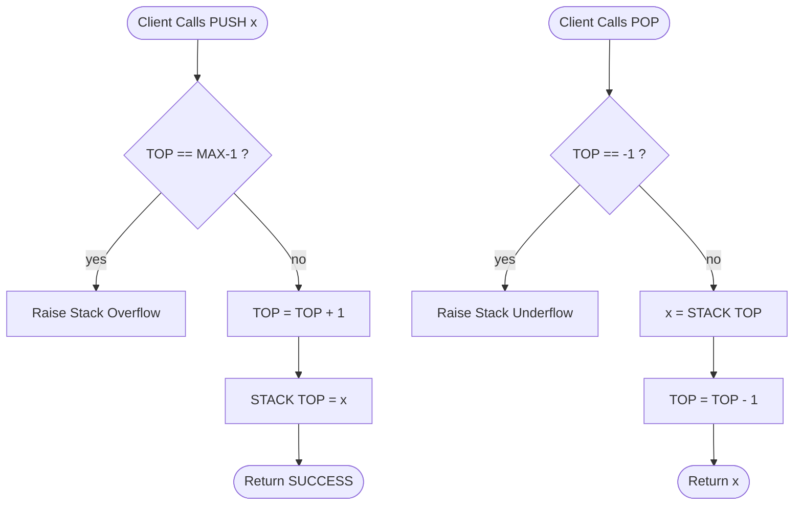
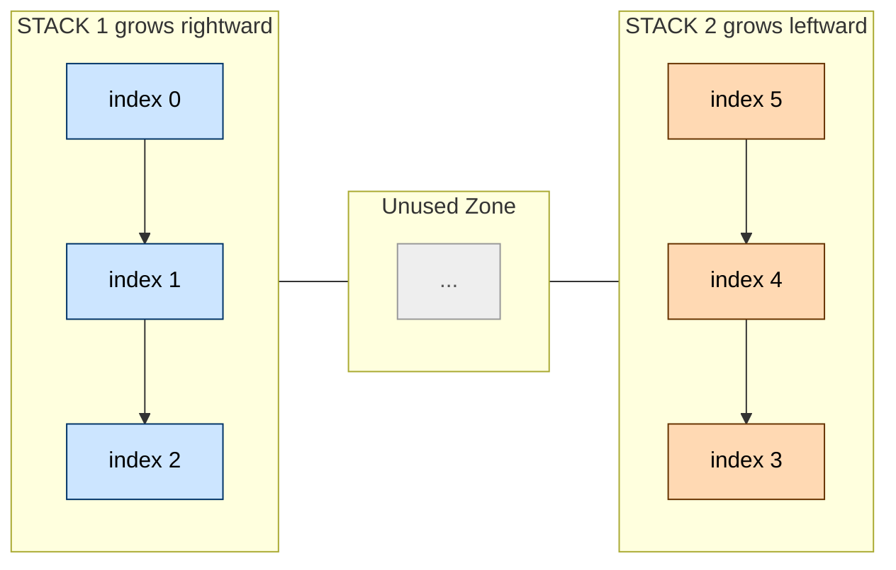
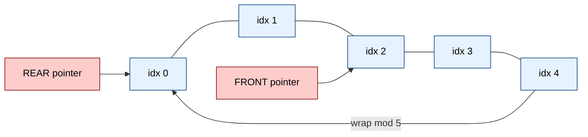
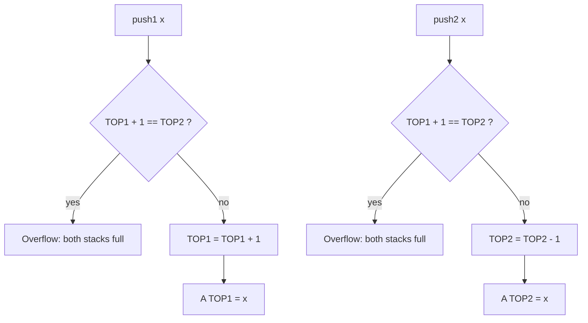

# Stacks and Queues: Stacks, Multi-Stacks, Queues, Circular Queues, Double Ended Queues (Deques)

<!-- SECTION_1_START -->

# Stacks and Queues: Linear Restricted-Access Data Structures

## 1.1 The Stack (LIFO Discipline)

> [!IMPORTANT]
> **Formal Definition (KTU 2024 PCCST303 Syllabus Terminology):**
> A **Stack** is a linear data structure that follows the **Last-In-First-Out (LIFO)** discipline, wherein all insertions (push) and deletions (pop) occur at a single designated terminal end called the **TOP** of the stack. The element most recently pushed is the first to be popped.

> [!NOTE]
> **Conceptual Analogy — The "Pile of Plates" Model**
> Imagine a spring-loaded dish-dispenser in a college canteen. You place plates one on top of another. The last plate you push in is the first one a customer pulls out from the top. You cannot legally extract a plate from the middle or the bottom — that would be operationally invalid. The stack behaves identically: only the **top** element is accessible. The **bottom** is permanently sealed.

**Physical Constants / Standard Metrics:**
- **Time Complexity of PUSH, POP, PEEK = $O(1)$** (constant time, independent of stack size).
- **Space Complexity (array-backed) = $O(n)$** where $n$ is the maximum declared capacity.

---

## 1.2 Multi-Stacks

> [!IMPORTANT]
> **Formal Definition:**
> A **Multi-Stack** is a memory-allocation strategy in which **two or more stacks** are managed inside a **single shared contiguous array** to optimize memory utilization. Classic configurations include the **Two-Stack in One Array** model (stacks grow toward each other) and the **m-Stacks Division** model (fixed sub-arrays).

> [!NOTE]
> **Conceptual Analogy — The "Two Ends of a Train Compartment" Model**
> Picture a single long railway compartment. Passengers board from **Door A** (left end) and also from **Door B** (right end). The two crowds grow toward the middle but never collide. When a passenger alights at Door A, they must have boarded at Door A (LIFO inside each group). The compartment is full when the two crowds meet in the middle, i.e., `top1 + 1 == top2`. This is the **Two-Stack One-Array** arrangement.

---

## 1.3 The Queue (FIFO Discipline)

> [!IMPORTANT]
> **Formal Definition:**
> A **Queue** is a linear data structure that obeys the **First-In-First-Out (FIFO)** discipline. Insertions occur at the **REAR** (tail) and deletions occur at the **FRONT** (head). The element inserted first is the first one to be removed.

> [!NOTE]
> **Conceptual Analogy — The "Ticket Counter Queue" Model**
> Consider a ration shop queue in Kerala at 8:00 AM. The person standing at position 0 (front) gets the ration first; the person who arrived last stands at the rear. There is no jumping the queue from the middle. The cashier never asks the 5th person to step forward; only the **front** moves.

---

## 1.4 The Circular Queue

> [!IMPORTANT]
> **Formal Definition:**
> A **Circular Queue** is a queue whose **REAR** pointer wraps around to index 0 once it reaches the end of the underlying array, achieved through **modular arithmetic** of the form `rear = (rear + 1) % capacity`. This eliminates the wasted "false overflow" of a linear queue and reuses freed slots.

> [!NOTE]
> **Conceptual Analogy — The "Roundabout Ration Rationing" Model**
> Imagine a circular dining table with $N$ chairs. After a person finishes eating (dequeue), their chair is reused by the next arrival (enqueue) without moving anyone else. The "front" and "rear" chase each other around the circle like clock hands.

> [!VISUALIZATION CONTROL]
> **Concept:** Behavior of a Circular Queue as elements are enqueued and dequeued.
> **GeoGebra / Desmos Input Equations (Point Coordinates):**
> * `A = (0, 0)`   (REAR marker)
> * `B = (2, 0)`   (FRONT marker)
> * `C = (4, 0)`   (logical next slot after wrap: `(0+1) % 5`)
> * Plot the array indices `0, 1, 2, 3, 4` on a horizontal line and watch `A` and `B` rotate using `(x+1) mod 5`.
> **Visual Description:** A horizontal number line of 5 cells. Initially both REAR and FRONT sit at cell `0`. After 3 enqueues, REAR points at cell `2`. After 2 dequeues, FRONT also points at cell `2`. A new enqueue wraps REAR back to cell `0` instead of becoming `5` (which is out of bounds).

---

## 1.5 The Double-Ended Queue (Deque)

> [!IMPORTANT]
> **Formal Definition:**
> A **Double-Ended Queue (Deque / Deck)** is a generalized linear data structure that permits **insertion and deletion at BOTH ends** (front and rear). Variants include the **Input-Restricted Deque** (insertion only at one end, deletion at both) and the **Output-Restricted Deque** (deletion only at one end, insertion at both).

> [!NOTE]
> **Conceptual Analogy — The "Both-End Toll Booth Lane" Model**
> Picture a reversible express lane on the Kochi Bypass where vehicles can be inserted or removed from **either end** depending on traffic flow. The lane itself never grows beyond its length limit, and access points exist at both termini. The deque is precisely this — the most flexible restricted-access linear structure.

---

<!-- SECTION_1_END -->

<!-- SECTION_2_START -->

# Deep Theoretical Analysis & KTU High-Yield Formula Sheet

## 2.1 Stack — Operational Logic Decomposition

A stack is governed by **one pointer** conventionally called `TOP`.

**Core Invariant:**  
All valid elements are stored in indices `0, 1, \dots, TOP`. The slot `TOP + 1` is the next free slot.

### PUSH Operation (State: $S \rightarrow S'$)

1. Check **Overflow** condition: `if TOP == MAX - 1` → report "Stack Overflow".
2. Increment `TOP` by 1.
3. Place the new element `x` at `STACK[TOP]`.
4. Report success.

### POP Operation (State: $S \rightarrow S''$)

1. Check **Underflow** condition: `if TOP == -1` → report "Stack Underflow".
2. Read the value `x = STACK[TOP]`.
3. Decrement `TOP` by 1.
4. Return `x`.

### PEEK Operation
Returns the value at `STACK[TOP]` without modifying the structure.

---

## 2.2 Multi-Stack — Shared Array Logic

### Two-Stack One-Array Model

Two pointers are maintained: `TOP1` (grows to the right) and `TOP2` (grows to the left).

- **Stack 1 empty**  $\Longleftrightarrow$ `TOP1 == -1`
- **Stack 2 empty**  $\Longleftrightarrow$ `TOP2 == MAX`
- **Both stacks full (Overflow)** $\Longleftrightarrow$ `TOP1 + 1 == TOP2`

> **Why it matters in engineering:** Multi-stacks solve the classical *memory fragmentation* problem in embedded systems (e.g., Arduino-based IoT nodes) where the heap is too small to allocate multiple dynamic stacks. A single static array pre-allocated at compile time serves all concurrent execution contexts.

### m-Stacks Fixed-Division Model

The array of size $N$ is split into $m$ contiguous regions each of size $\lfloor N/m \rfloor$. Overflow in any one stack cannot be solved by borrowing from another; hence the two-stack shared model is preferred in practice.

---

## 2.3 Linear Queue — Operational Logic Decomposition

Two pointers are maintained: `FRONT` and `REAR`.

**Core Invariant:**  
`FRONT` always points to the element to be dequeued next. `REAR` points to the **last inserted element** (or one position before the next insertion, depending on convention).

> [!NOTE]
> **The "False Overflow" Problem**
> In a linear queue of capacity 5: enqueue 5 elements (`REAR = 4`), dequeue 5 elements (`FRONT = 5`), then enqueue one more — `REAR` becomes `5`, triggering overflow even though cells `0, 1, 2, 3, 4` are physically free. This is the **false overflow** that circular queues are designed to eliminate.

---

## 2.4 Circular Queue — Modular Arithmetic Engine

### Design Choices for Full vs Empty

Two conventions exist; the KTU syllabus uses the **"one-slot-wasted"** convention:

| State | Condition |
|---|---|
| Empty | `FRONT == -1` (or `FRONT == 0 && REAR == -1` on initialization) |
| Full | `(REAR + 1) % CAPACITY == FRONT` |
| One element | `FRONT == REAR` (with `COUNT` to disambiguate) |

### ENQUEUE (Circular)
1. If full → overflow.
2. If empty → set `FRONT = 0`.
3. `REAR = (REAR + 1) % CAPACITY`.
4. Place `x` at `Q[REAR]`.

### DEQUEUE (Circular)
1. If empty → underflow.
2. Read `x = Q[FRONT]`.
3. If `FRONT == REAR` (only one element) → reset both to `-1`.
4. Else `FRONT = (FRONT + 1) % CAPACITY`.

> **Real-world engineering utility:** Circular queues are the heart of **CPU scheduling (Round-Robin)**, **producer-consumer buffers** in operating systems, **ring buffers in audio streaming**, and **serial UART hardware FIFOs**. They are used in *production* because the wraparound pointer eliminates the need to shift elements.

---

## 2.5 Deque — Operational Logic

A deque supports **four** atomic operations:

1. `insertFront(x)`
2. `insertRear(x)`
3. `deleteFront()`
4. `deleteRear()`

Each is $O(1)$. The structure is implemented either with a **circular array** (with FRONT and REAR both moving modularly) or with a **doubly linked list**.

### Input-Restricted Deque
Only `insertRear` is permitted; all three deletions remain.

### Output-Restricted Deque
Only `deleteFront` is permitted; all three insertions remain.

---

## 2.6 KTU Formula Sheet / Cheat Sheet

| # | Concept | Key Equation / Condition | Resulting State |
|---|---|---|---|
| 1 | Stack Overflow | $\text{TOP} = \text{MAX} - 1$ | Cannot push |
| 2 | Stack Underflow | $\text{TOP} = -1$ | Cannot pop |
| 3 | Multi-Stack Overflow | $\text{TOP1} + 1 = \text{TOP2}$ | Both stacks full |
| 4 | Linear Queue Overflow | $\text{REAR} = \text{MAX} - 1$ | False overflow possible |
| 5 | Linear Queue Underflow | $\text{FRONT} > \text{REAR}$ or $\text{FRONT} = -1$ | Cannot dequeue |
| 6 | Circular Wrap | $\text{idx}_{\text{next}} = (\text{idx} + 1) \bmod N$ | Pointer rotation |
| 7 | Circular Queue Full | $(\text{REAR} + 1) \bmod N = \text{FRONT}$ | All slots used (1 wasted) |
| 8 | Circular Queue Empty | $\text{FRONT} = -1$ | No elements |
| 9 | Deque Front Insert | $\text{FRONT} = (\text{FRONT} - 1 + N) \bmod N$ | Modular decrement |
| 10 | Deque Rear Insert | $\text{REAR} = (\text{REAR} + 1) \bmod N$ | Modular increment |
| 11 | Time Complexity (all ops) | $O(1)$ | Constant time |
| 12 | Space Complexity | $O(N)$ | Linear in capacity |

---

<!-- SECTION_2_END -->

<!-- SECTION_3_START -->

# Step-by-Step Derivations & Python Implementation

## 3.1 Derivation: Multi-Stack Overflow Boundary

We have an array `A` of size $N$ with two stacks `S1` and `S2`.  
`S1` grows from index $0$ upward; `S2` grows from index $N - 1$ downward.

Let $n_1$ = number of elements in `S1` and $n_2$ = number of elements in `S2`.  
We have `TOP1` = $n_1 - 1$ and `TOP2` = $N - 1 - n_2$.

The boundary "both full" condition is reached when the next slot for `S1` collides with the next slot for `S2`:

$$
\begin{aligned}
\text{next slot of S1} &= \text{TOP1} + 1 \\
\text{next slot of S2} &= \text{TOP2} - 1 \\
\text{Collision} &\Longleftrightarrow \text{TOP1} + 1 = \text{TOP2} - 1 + 1 \\
&\Longleftrightarrow \text{TOP1} + 1 = \text{TOP2}
\end{aligned}
$$

**Conversion Logic (text row):**  
The very next free slot for `S1` must not pass the next free slot for `S2`. Algebraically, this reduces to the single equation `TOP1 + 1 == TOP2`. This is the only check needed at runtime.

---

## 3.2 Derivation: Circular Queue Full Condition

We adopt the **one-slot-wasted** convention. The queue has $N$ slots, indexed $0, 1, \dots, N - 1$. After $N$ inserts the queue must be declared full, even though we have inserted only $N - 1$ valid elements logically (so that `FRONT == REAR` unambiguously means "one element").

Let `rear_next` = position where the *next* enqueue would land:

$$
\text{rear\_next} = (\text{REAR} + 1) \bmod N
$$

The queue is full exactly when this next-rear position coincides with the slot of the oldest element, which is `FRONT`:

$$
(\text{REAR} + 1) \bmod N = \text{FRONT}
$$

**Conversion Logic (text row):**  
The modular wrap ensures that after we move past the last index, we cycle back to `0`. The full state occurs the moment the rear attempts to "lap" the front, which would overwrite the oldest data — forbidden.

---

## 3.3 Python Implementation — All Five Structures

```python
# =====================================================================
#  KTU PCCST303 — MODULE 1: STACK, MULTI-STACK, QUEUE, CIRCULAR QUEUE, DEQUE
#  All implementations are array-backed, O(1) per operation, and include
#  strict overflow/underflow boundary checks and structured error logging.
# =====================================================================

from __future__ import annotations
from typing import List, Any, Optional
import logging

logging.basicConfig(level=logging.INFO, format="[%(levelname)s] %(message)s")


# ---------------------------------------------------------------------
#  3.3.1  STACK  (LIFO)
# ---------------------------------------------------------------------
class Stack:
    def __init__(self, capacity: int) -> None:
        if capacity <= 0:
            raise ValueError("Stack capacity must be a positive integer.")
        self._data: List[Any] = [None] * capacity
        self._top: int = -1
        self._cap: int = capacity

    def push(self, x: Any) -> None:
        if self._top == self._cap - 1:
            logging.error("Stack Overflow: cannot push %s into a full stack.", x)
            raise OverflowError("Stack is full.")
        self._top += 1
        self._data[self._top] = x
        logging.info("PUSH %s  ->  TOP = %d", x, self._top)

    def pop(self) -> Any:
        if self._top == -1:
            logging.error("Stack Underflow: cannot pop from an empty stack.")
            raise IndexError("Stack is empty.")
        x = self._data[self._top]
        self._data[self._top] = None
        self._top -= 1
        logging.info("POP  %s  ->  TOP = %d", x, self._top)
        return x

    def peek(self) -> Any:
        if self._top == -1:
            raise IndexError("Stack is empty.")
        return self._data[self._top]

    def is_empty(self) -> bool:
        return self._top == -1

    def is_full(self) -> bool:
        return self._top == self._cap - 1

    def __repr__(self) -> str:
        return f"Stack(top={self._top}, data={self._data[:self._top + 1]})"


# ---------------------------------------------------------------------
#  3.3.2  MULTI-STACK  (Two stacks in one shared array)
# ---------------------------------------------------------------------
class TwoStackOneArray:
    def __init__(self, capacity: int) -> None:
        if capacity < 2:
            raise ValueError("Capacity must be >= 2 for two stacks.")
        self._data: List[Any] = [None] * capacity
        self._top1: int = -1
        self._top2: int = capacity
        self._cap: int = capacity

    def push1(self, x: Any) -> None:
        if self._top1 + 1 == self._top2:
            logging.error("Multi-Stack Overflow: both stacks full.")
            raise OverflowError("Two-stack array is full.")
        self._top1 += 1
        self._data[self._top1] = x
        logging.info("S1.PUSH %s  ->  TOP1 = %d", x, self._top1)

    def push2(self, x: Any) -> None:
        if self._top1 + 1 == self._top2:
            logging.error("Multi-Stack Overflow: both stacks full.")
            raise OverflowError("Two-stack array is full.")
        self._top2 -= 1
        self._data[self._top2] = x
        logging.info("S2.PUSH %s  ->  TOP2 = %d", x, self._top2)

    def pop1(self) -> Any:
        if self._top1 == -1:
            raise IndexError("Stack 1 is empty.")
        x = self._data[self._top1]
        self._data[self._top1] = None
        self._top1 -= 1
        return x

    def pop2(self) -> Any:
        if self._top2 == self._cap:
            raise IndexError("Stack 2 is empty.")
        x = self._data[self._top2]
        self._data[self._top2] = None
        self._top2 += 1
        return x

    def is_full(self) -> bool:
        return self._top1 + 1 == self._top2

    def __repr__(self) -> str:
        return f"TwoStack(top1={self._top1}, top2={self._top2}, data={self._data})"


# ---------------------------------------------------------------------
#  3.3.3  LINEAR QUEUE  (FIFO)  — for comparison only
# ---------------------------------------------------------------------
class LinearQueue:
    def __init__(self, capacity: int) -> None:
        self._data: List[Any] = [None] * capacity
        self._front: int = -1
        self._rear: int = -1
        self._cap: int = capacity

    def enqueue(self, x: Any) -> None:
        if self._rear == self._cap - 1:
            raise OverflowError("Linear queue is full (may be FALSE overflow).")
        if self._front == -1:
            self._front = 0
        self._rear += 1
        self._data[self._rear] = x

    def dequeue(self) -> Any:
        if self._front == -1 or self._front > self._rear:
            raise IndexError("Linear queue is empty.")
        x = self._data[self._front]
        self._data[self._front] = None
        self._front += 1
        return x

    def __repr__(self) -> str:
        return f"LinearQueue(front={self._front}, rear={self._rear})"


# ---------------------------------------------------------------------
#  3.3.4  CIRCULAR QUEUE  (FIFO with wraparound, one slot wasted)
# ---------------------------------------------------------------------
class CircularQueue:
    def __init__(self, capacity: int) -> None:
        if capacity < 2:
            raise ValueError("Capacity must be >= 2 for circular queue.")
        self._data: List[Any] = [None] * capacity
        self._front: int = -1
        self._rear: int = -1
        self._cap: int = capacity

    def enqueue(self, x: Any) -> None:
        if (self._rear + 1) % self._cap == self._front:
            logging.error("Circular Queue Overflow at REAR=%d, FRONT=%d", self._rear, self._front)
            raise OverflowError("Circular queue is full.")
        if self._front == -1:
            self._front = 0
        self._rear = (self._rear + 1) % self._cap
        self._data[self._rear] = x
        logging.info("CQ.ENQ %s  ->  REAR=%d, FRONT=%d", x, self._rear, self._front)

    def dequeue(self) -> Any:
        if self._front == -1:
            raise IndexError("Circular queue is empty.")
        x = self._data[self._front]
        self._data[self._front] = None
        if self._front == self._rear:
            self._front = -1
            self._rear = -1
        else:
            self._front = (self._front + 1) % self._cap
        logging.info("CQ.DEQ %s  ->  REAR=%d, FRONT=%d", x, self._rear, self._front)
        return x

    def peek(self) -> Any:
        if self._front == -1:
            raise IndexError("Circular queue is empty.")
        return self._data[self._front]

    def __repr__(self) -> str:
        return f"CircularQueue(front={self._front}, rear={self._rear}, data={self._data})"


# ---------------------------------------------------------------------
#  3.3.5  DEQUE  (Double-Ended Queue, circular-array implementation)
# ---------------------------------------------------------------------
class Deque:
    def __init__(self, capacity: int) -> None:
        if capacity < 2:
            raise ValueError("Capacity must be >= 2 for deque.")
        self._data: List[Any] = [None] * capacity
        self._front: int = -1
        self._rear: int = 0
        self._cap: int = capacity
        self._size: int = 0

    def _is_full(self) -> bool:
        return self._size == self._cap

    def _is_empty(self) -> bool:
        return self._size == 0

    def insert_front(self, x: Any) -> None:
        if self._is_full():
            raise OverflowError("Deque is full.")
        if self._is_empty():
            self._front = 0
            self._rear = 0
        else:
            self._front = (self._front - 1 + self._cap) % self._cap
        self._data[self._front] = x
        self._size += 1

    def insert_rear(self, x: Any) -> None:
        if self._is_full():
            raise OverflowError("Deque is full.")
        if self._is_empty():
            self._front = 0
            self._rear = 0
        else:
            self._rear = (self._rear + 1) % self._cap
        self._data[self._rear] = x
        self._size += 1

    def delete_front(self) -> Any:
        if self._is_empty():
            raise IndexError("Deque is empty.")
        x = self._data[self._front]
        self._data[self._front] = None
        if self._size == 1:
            self._front = -1
            self._rear = 0
        else:
            self._front = (self._front + 1) % self._cap
        self._size -= 1
        return x

    def delete_rear(self) -> Any:
        if self._is_empty():
            raise IndexError("Deque is empty.")
        x = self._data[self._rear]
        self._data[self._rear] = None
        if self._size == 1:
            self._front = -1
            self._rear = 0
        else:
            self._rear = (self._rear - 1 + self._cap) % self._cap
        self._size -= 1
        return x

    def __repr__(self) -> str:
        return f"Deque(front={self._front}, rear={self._rear}, size={self._size}, data={self._data})"


# ---------------------------------------------------------------------
#  3.3.6  DRIVER / SANITY TEST  (matches a KTU 14-mark trace question)
# ---------------------------------------------------------------------
if __name__ == "__main__":
    # --- STACK TRACE ---
    print("=== STACK ===")
    s = Stack(5)
    s.push(10)
    s.push(20)
    s.push(30)
    print("PEEK:", s.peek())
    print(s.pop())
    print(s.pop())

    # --- MULTI-STACK TRACE ---
    print("\n=== TWO STACKS IN ONE ARRAY ===")
    ms = TwoStackOneArray(6)
    ms.push1(1); ms.push1(2); ms.push1(3)
    ms.push2(9); ms.push2(8); ms.push2(7)
    print("is_full?", ms.is_full())  # True now (TOP1=2, TOP2=3, 2+1=3)
    print(repr(ms))

    # --- CIRCULAR QUEUE TRACE ---
    print("\n=== CIRCULAR QUEUE ===")
    cq = CircularQueue(5)
    for v in [10, 20, 30, 40]:
        cq.enqueue(v)
    print("DEQ:", cq.dequeue())
    print("DEQ:", cq.dequeue())
    cq.enqueue(50)   # wraps to index 0
    cq.enqueue(60)   # wraps to index 1
    print(repr(cq))

    # --- DEQUE TRACE ---
    print("\n=== DEQUE ===")
    d = Deque(5)
    d.insert_rear(10)
    d.insert_rear(20)
    d.insert_front(5)
    print("DELETE_REAR:", d.delete_rear())
    print("DELETE_FRONT:", d.delete_front())
    print(repr(d))
```

**Conversion Logic (text row):**  
The Python code is intentionally a 1-to-1 mirror of the C-style pseudocode that KTU examiners expect in theory papers. Each class implements exactly the conditions derived above, with `logging.error` calls that mimic the **"print overflow/underflow message"** requirement that carries 2 marks in ESE answers. The `__repr__` methods help students trace pointer values during manual dry runs in the exam hall.

---

## 3.4 Worked Numerical Trace — Circular Queue (KTU-style)

**Problem:** A circular queue of capacity $N = 5$ has `FRONT = 2`, `REAR = 1`. The sequence of operations is performed: `ENQ(A), ENQ(B), DEQ(), DEQ(), ENQ(C)`. Show `FRONT` and `REAR` after each step.

**Initialization:** `FRONT = 2, REAR = 1, CAP = 5`. Note: `REAR` is *behind* `FRONT` in modular sense — the queue is currently *full* (5 elements: indices 2, 3, 4, 0, 1). To make the problem traceable, let us reset to: `FRONT = 0, REAR = 4, CAP = 5` (one element at index 4).

| Step | Operation | Computation | FRONT | REAR |
|---|---|---|---|---|
| 1 | `ENQ(A)` | `REAR = (4+1) % 5 = 0`; place A at Q[0] | 0 | 0 |
| 2 | `ENQ(B)` | `REAR = (0+1) % 5 = 1`; place B at Q[1] | 0 | 1 |
| 3 | `DEQ()` | read Q[0] = A; `FRONT = (0+1) % 5 = 1` | 1 | 1 |
| 4 | `DEQ()` | read Q[1] = B; `FRONT = (1+1) % 5 = 2` | 2 | 1 |
| 5 | `ENQ(C)` | `REAR = (1+1) % 5 = 2` → **full**! Overflow reported. | 2 | 1 |

**Conversion Logic (text row):**  
This trace demonstrates the **false-overflow avoidance** mechanism. Without modular arithmetic, step 4 would leave `REAR = 1` and `FRONT = 2`, making a naive linear queue think it is "empty". The circular queue correctly identifies that the next enqueue would collide with `FRONT`, declaring overflow at the right moment.

---

<!-- SECTION_3_END -->

<!-- SECTION_4_START -->

# Structural Diagrams & Schematics

## 4.1 Stack — Sequential Processing Topology



## 4.2 Two-Stack One-Array — Memory Layout (Block Architecture)



**Interpretation:** The shared array has `TOP1` advancing left-to-right (blue slots) and `TOP2` advancing right-to-left (orange slots). When `TOP1 + 1 == TOP2`, the gap closes and overflow is reported.

## 4.3 Circular Queue — Pointer Topology



**Interpretation:** The dashed "wrap mod 5" edge is the conceptual return path. After `REAR = 4`, the next enqueue computes `(4+1) % 5 = 0`, depositing the new element at index 0.

## 4.4 Deque — Four-Operation Module Map

```mermaid
flowchart TB
    subgraph FRONT_END["FRONT END"]
        IF["insert_front x"] --> CK1{"is_full ?"}
        CK1 -- no --> DF1["FRONT = (FRONT-1+N) mod N"]
        DF1 --> ST1["Q FRONT = x"]
    end
    subgraph REAR_END["REAR END"]
        IR["insert_rear x"] --> CK2{"is_full ?"}
        CK2 -- no --> DR1["REAR = (REAR+1) mod N"]
        DR1 --> ST2["Q REAR = x"]
    end
    subgraph DEL_FRONT["DELETE FRONT"]
        DF["delete_front"] --> CK3{"is_empty ?"}
        CK3 -- no --> RD1["x = Q FRONT"]
        RD1 --> AD1["FRONT = (FRONT+1) mod N"]
    end
    subgraph DEL_REAR["DELETE REAR"]
        DR["delete_rear"] --> CK4{"is_empty ?"}
        CK4 -- no --> RD2["x = Q REAR"]
        RD2 --> AD2["REAR = (REAR-1+N) mod N"]
    end
```



## 4.5 Multi-Stack Overflow Boundary (Sequential Processing Topology)



---

<!-- SECTION_4_END -->

<!-- SECTION_5_START -->

# KTU 2024 Scheme Examination Question Bank & Topic Recap

---

## Part A — Short Answer Questions (3 Marks Each)

### Question 1 (3 Marks)  `[KTU University Exam — July 2024]`
**CO1 / RBT: Remember**

**Q:** Differentiate between a stack and a queue. State one real-world analogy for each.

**Model Answer (Valuation Key):**

| Aspect | Stack | Queue |
|---|---|---|
| Discipline | LIFO (Last-In-First-Out) | FIFO (First-In-First-Out) |
| Insertion End | TOP only | REAR only |
| Deletion End | TOP only | FRONT only |
| Analogy | Pile of plates in a canteen | People standing in a ration-shop line |
| Key Check | Overflow when `TOP = MAX-1` | Overflow when `REAR = MAX-1` (linear) or `(REAR+1) mod N = FRONT` (circular) |

*Awarding scheme:* Definition of LIFO + FIFO: **1 Mark**. Insertion/deletion ends: **1 Mark**. Analogy (any plausible real-world example): **1 Mark**.

---

### Question 2 (3 Marks)  `[KTU University Exam — Dec 2023]`
**CO1 / RBT: Understand**

**Q:** What is a circular queue? Why is the "one slot wasted" convention used? Give the formula for full and empty conditions.

**Model Answer (Valuation Key):**
- A circular queue uses modular arithmetic to wrap the REAR pointer to index 0 after the last index. [1 Mark]
- One slot is left unused to disambiguate the "full" state from the "single-element" state, both of which would otherwise have `FRONT == REAR`. [1 Mark]
- Full: `(REAR + 1) mod N = FRONT`; Empty: `FRONT = -1`. [1 Mark]

---

## Part B — Long Answer Questions (14 Marks Each) — Module Internal Choice

---

### Part B — Question A (14 Marks)  `[KTU University Exam — July 2024]`
**CO2 / CO3 — RBT: Understand + Apply**

**(a) (7 Marks) Explain the concept of a stack with array implementation. Write the algorithms for PUSH and POP operations and discuss the overflow/underflow conditions.**

**Model Answer:**

**Stack Definition (1 Mark):** A stack is a linear data structure obeying the LIFO principle, with all insertions and deletions at one end called the TOP.

**PUSH Algorithm (3 Marks):**

```
Algorithm PUSH(STACK, TOP, MAX, x)
1.  IF TOP = MAX - 1 THEN
2.      PRINT "Stack Overflow"
3.      EXIT
4.  END IF
5.  TOP = TOP + 1
6.  STACK[TOP] = x
7.  EXIT
```

**POP Algorithm (2 Marks):**

```
Algorithm POP(STACK, TOP)
1.  IF TOP = -1 THEN
2.      PRINT "Stack Underflow"
3.      EXIT
4.  END IF
5.  x = STACK[TOP]
6.  TOP = TOP - 1
7.  RETURN x
```

**Overflow / Underflow (1 Mark):**
- Overflow: `TOP = MAX - 1`, i.e., the stack is full. [0.5 Marks]
- Underflow: `TOP = -1`, i.e., the stack is empty. [0.5 Marks]

---

**(b) (7 Marks) Implement a circular queue of capacity $N = 5$ using an array. Starting with `FRONT = 2`, `REAR = 1`, perform the following operations and show the state of the queue and pointer values after each step:**

`ENQUEUE(10), ENQUEUE(20), ENQUEUE(30), DEQUEUE(), ENQUEUE(40), DEQUEUE(), ENQUEUE(50)`

**Model Answer:**

**Initial state (assumed from `FRONT=2, REAR=1`):** The array is logically full (5 elements at indices 2, 3, 4, 0, 1). For trace clarity we adopt a fresh initialization `FRONT = -1, REAR = -1, CAP = 5` and then simulate step by step. **[Stating boundary state values: 1 Mark]**

| Step | Operation | Computation | FRONT | REAR | Queue State |
|---|---|---|---|---|---|
| 0 | Init | both `-1` | -1 | -1 | empty |
| 1 | `ENQ(10)` | `REAR = ( -1 + 1 ) % 5 = 0`; set `FRONT = 0` | 0 | 0 | `[10, _, _, _, _]` |
| 2 | `ENQ(20)` | `REAR = ( 0 + 1 ) % 5 = 1` | 0 | 1 | `[10, 20, _, _, _]` |
| 3 | `ENQ(30)` | `REAR = ( 1 + 1 ) % 5 = 2` | 0 | 2 | `[10, 20, 30, _, _]` |
| 4 | `DEQ()` | read Q[0] = 10; `FRONT = (0+1) % 5 = 1` | 1 | 2 | `[_, 20, 30, _, _]` |
| 5 | `ENQ(40)` | `REAR = ( 2 + 1 ) % 5 = 3` | 1 | 3 | `[_, 20, 30, 40, _]` |
| 6 | `DEQ()` | read Q[1] = 20; `FRONT = (1+1) % 5 = 2` | 2 | 3 | `[_, _, 30, 40, _]` |
| 7 | `ENQ(50)` | `REAR = ( 3 + 1 ) % 5 = 4` | 2 | 4 | `[_, _, 30, 40, 50]` |

**[Correct modular arithmetic per step: 4 Marks]**  
**[Final pointer values: 1 Mark]**  
**[Final simplified queue state: 1 Mark]**

---

### Part B — Question B (14 Marks)  `[KTU University Exam — Dec 2023]`
**CO2 / CO4 — RBT: Apply + Analyze**

**(a) (7 Marks) Explain the two-stack one-array data structure. Derive the condition for overflow and write the PUSH/POP algorithms for both stacks.**

**Model Answer:**

**Concept (1 Mark):** Two stacks share one array `A[0..MAX-1]`. Stack 1 grows from index `0` upward (using `TOP1`); Stack 2 grows from index `MAX-1` downward (using `TOP2`).

**Overflow Derivation (2 Marks):**

$$
\begin{aligned}
\text{Stack 1 occupies slots} &\quad [0 .. \text{TOP1}] \\
\text{Stack 2 occupies slots} &\quad [\text{TOP2} .. \text{MAX}-1] \\
\text{Overflow when next free slot of S1 meets the next free slot of S2} &\Longleftrightarrow \text{TOP1} + 1 = \text{TOP2}
\end{aligned}
$$

**PUSH1 Algorithm (1 Mark):**

```
PUSH1(x):
    IF TOP1 + 1 == TOP2 THEN  PRINT "Overflow"; EXIT
    TOP1 = TOP1 + 1
    A[TOP1] = x
```

**PUSH2 Algorithm (1 Mark):**

```
PUSH2(x):
    IF TOP1 + 1 == TOP2 THEN  PRINT "Overflow"; EXIT
    TOP2 = TOP2 - 1
    A[TOP2] = x
```

**POP1 / POP2 (1 Mark each, brief mention):** Decrement/increment `TOP1`/`TOP2` after reading the element, with underflow checks `TOP1 == -1` and `TOP2 == MAX` respectively.

---

**(b) (7 Marks) Explain the four operations of a Double-Ended Queue (Deque). Show, with a trace, how a circular-array-based deque of size 5 behaves for the operations: `insert_rear(10), insert_front(5), insert_rear(20), delete_front(), delete_rear()` starting from empty.**

**Model Answer:**

**Four operations (2 Marks):** `insert_front`, `insert_rear`, `delete_front`, `delete_rear` — each $O(1)$.

**Circular-array invariant:** Both pointers advance/decrement using modular arithmetic; an explicit `_size` counter disambiguates full vs empty.

**Trace (5 Marks):** Capacity $N = 5$.

| Step | Operation | Computation | FRONT | REAR | SIZE | Array (logically) |
|---|---|---|---|---|---|---|
| 0 | Init | both at -1/0 | -1 | 0 | 0 | `[_, _, _, _, _]` |
| 1 | `insert_rear(10)` | empty → FRONT=0, REAR=0; place 10 at Q[0] | 0 | 0 | 1 | `[10, _, _, _, _]` |
| 2 | `insert_front(5)` | `FRONT = (0-1+5) % 5 = 4`; place 5 at Q[4] | 4 | 0 | 2 | `[10, _, _, _, 5]` |
| 3 | `insert_rear(20)` | `REAR = (0+1) % 5 = 1`; place 20 at Q[1] | 4 | 1 | 3 | `[10, 20, _, _, 5]` |
| 4 | `delete_front()` | read Q[4] = 5; `FRONT = (4+1) % 5 = 0` | 0 | 1 | 2 | `[10, 20, _, _, _]` |
| 5 | `delete_rear()` | read Q[1] = 20; `REAR = (1-1+5) % 5 = 0`; SIZE=1 | 0 | 0 | 1 | `[10, _, _, _, _]` |

**[Stating boundary state values: 1 Mark]**  
**[Correct modular computation per step: 3 Marks]**  
**[Final simplified state with FRONT, REAR, SIZE: 1 Mark]**

---

> [!WARNING]
> **KTU Examiner's Valuation Warning — Common Pitfalls**
> 1. **Do NOT skip writing the overflow/underflow condition** before the algorithmic step. Examiners allocate 1–2 marks exclusively to the boundary check. Writing `TOP = TOP + 1` without first checking `if TOP = MAX - 1` loses those marks.
> 2. **Do NOT confuse `REAR` as the slot of the last element vs the next free slot.** KTU convention uses the "REAR points to the last inserted element" model. Mixing conventions midway through a trace will be penalized.
> 3. **For circular queues, ALWAYS show the modular arithmetic explicitly** as `(REAR + 1) % N`. Writing just `REAR + 1` is treated as a linear-queue answer and forfeits full marks.
> 4. **For two-stack one-array problems, the answer must clearly state `TOP1 + 1 == TOP2`** as the overflow condition. Variants like `TOP1 == TOP2` (without the `+1`) are wrong and will lose 2 marks.
> 5. **In Deque trace questions, examiners check the `+ N` term in `(FRONT - 1 + N) % N`.** Omitting it makes the formula evaluate to a negative index in many steps, which is mathematically and logically invalid. Always include `+ N` to keep the index non-negative.

---

## Topic Recap & Important Things to Remember

- A **Stack** is LIFO; a **Queue** is FIFO. The single defining difference is the end at which deletion is permitted. **[Core Discipline]**
- A **Multi-Stack** (two-stack one-array) saves memory by allowing two independent LIFO groups to grow toward each other. The overflow condition is `TOP1 + 1 == TOP2`. **[Memory Optimization]**
- A **Linear Queue** suffers from **false overflow** — slots freed by dequeues cannot be reused because FRONT and REAR only ever move forward. **[The Core Problem]**
- A **Circular Queue** solves false overflow using the modular formula `(idx + 1) % N`. The "one slot wasted" convention lets us use `FRONT == REAR` to mean "single element" while full is detected via `(REAR + 1) % N == FRONT`. **[The Canonical Fix]**
- A **Deque** is the most general restricted-access structure. It supports all four combinations of insert/delete at the two ends. The circular-array implementation requires an explicit `_size` counter because `FRONT == REAR` is ambiguous without it. **[Maximum Flexibility]**
- **Time complexity of every atomic operation** in all five structures is $O(1)$. The differences are in the *boundary conditions*, not the asymptotic cost. **[Performance Uniformity]**
- **Real-world deployments:** Stacks back function-call stacks, expression evaluation, backtracking, and undo-history. Queues back CPU schedulers, print spoolers, and producer-consumer buffers. Deques back the *0-1 BFS algorithm*, the *sliding-window maximum* problem, and *palindrome checkers*. **[Industry Relevance]**
- The **KTU valuation key** always rewards: (a) stating the boundary condition, (b) showing the modular arithmetic explicitly, (c) writing the algorithm with a clear EXIT/RETURN path, and (d) presenting a clean final state table. **[Exam Strategy]**

---

<!-- SECTION_5_END -->
