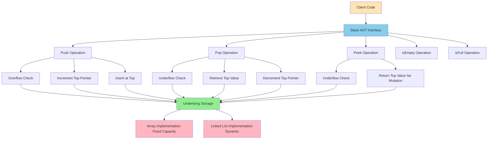
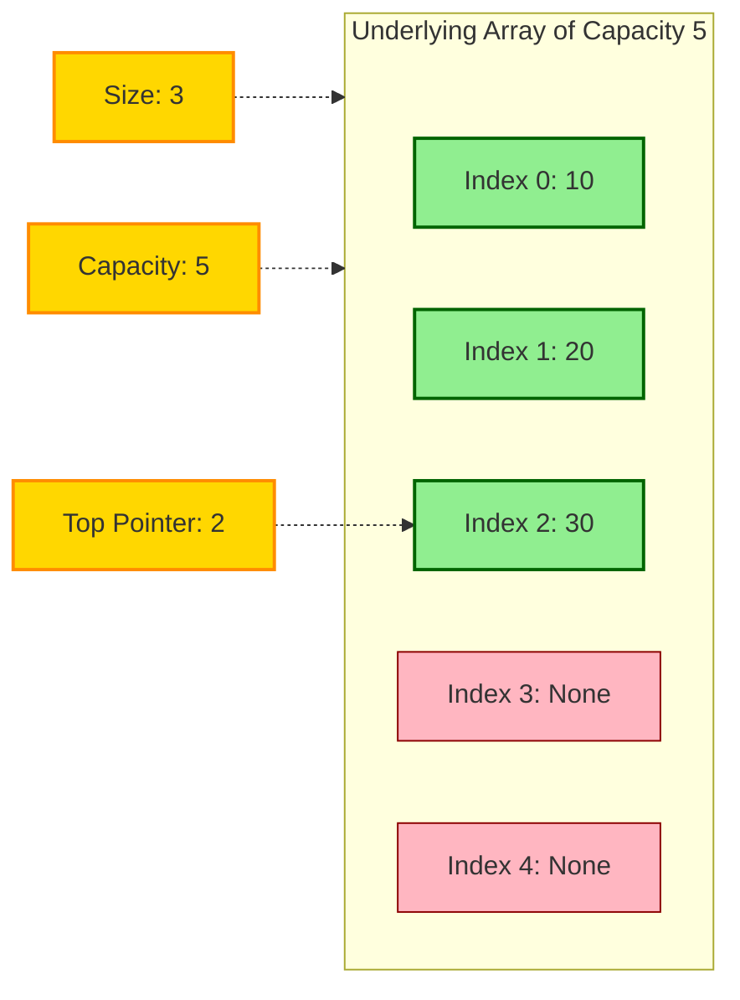
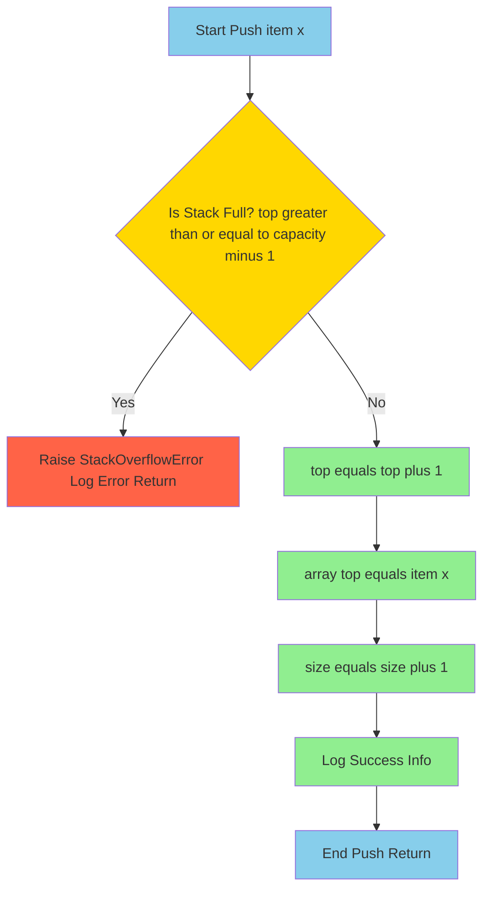
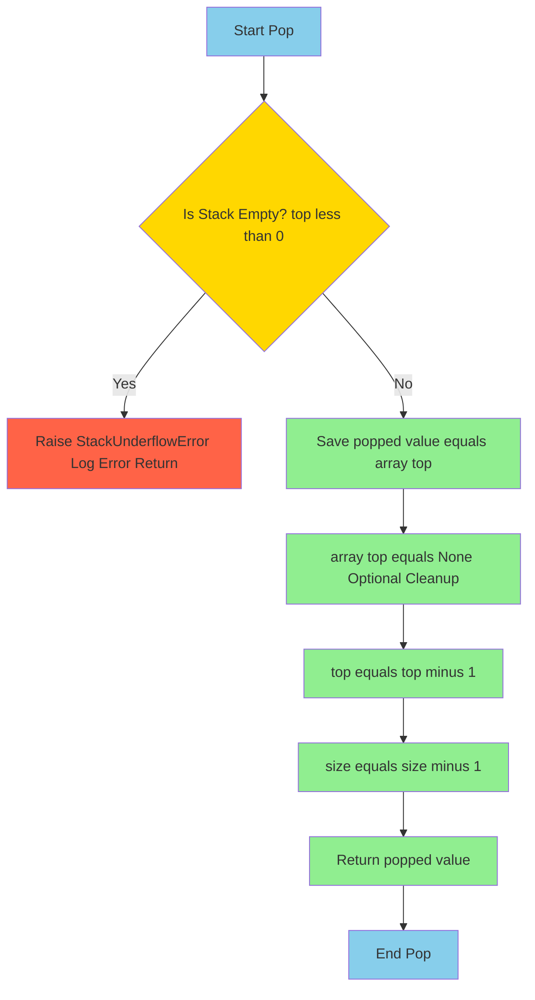
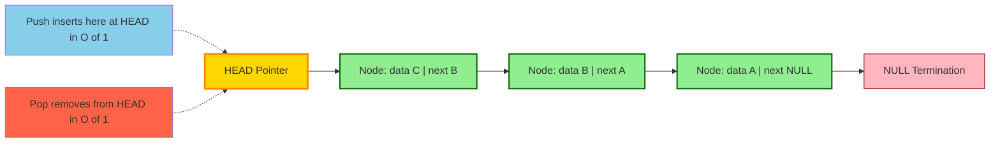
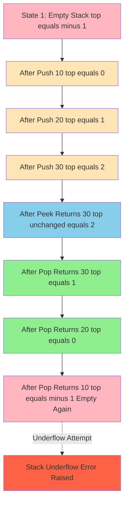
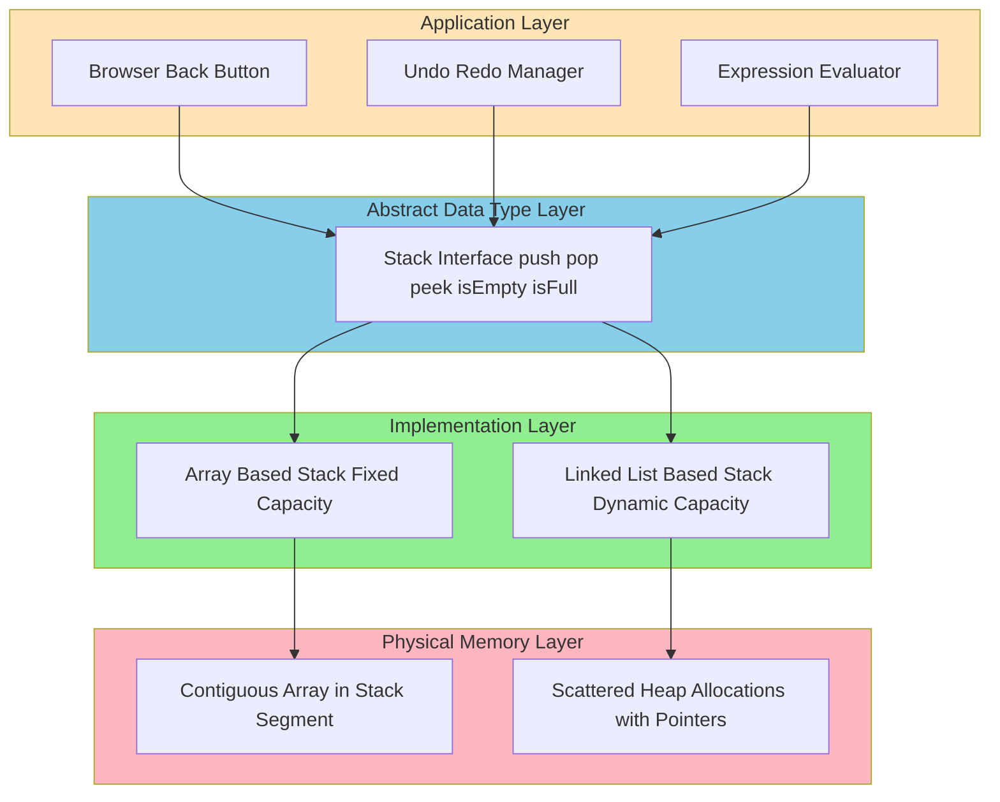

# Stacks and Queues - Stacks

<!-- SECTION_1_START -->
# Stacks - LIFO Data Structure

## 1.1 Formal Definition (KTU 2024 Syllabus Terminology)

> [!IMPORTANT]
> **Stack Definition (KTU PCCST303 Module 1):**
> A **Stack** is a linear, ordered data structure that follows the **Last-In-First-Out (LIFO)** principle, where insertion and deletion of elements are permitted at only one end, known as the **Top** of the stack. The two fundamental operations are **Push** (insertion) and **Pop** (deletion).

A stack is formally a sequence of elements $S = (s_1, s_2, s_3, \ldots, s_n)$ where:
- $s_n$ is the **top element** (the only element directly accessible).
- Insertion (Push) and Deletion (Pop) occur at the index $n$.
- Access to $s_1, s_2, \ldots, s_{n-1}$ requires a sequence of Pop operations.

> [!NOTE]
> **KTU Board Examiner Insight:**
> A stack is a **restricted data structure** because unlike an array, you *cannot* access arbitrary elements in $O(1)$ time. This restriction is what enables powerful applications like function call management, expression evaluation, and backtracking algorithms.

## 1.2 Conceptual Analogy & Intuitive Overview

**Real-World Analogy: The Stack of Plates in a Cafeteria**

Imagine a spring-loaded plate dispenser at a buffet:
1. You can only **add** a new plate on **top** of the existing stack.
2. You can only **remove** a plate from the **top**.
3. The plate placed **last** (most recently) is the one you take out **first**.
4. You **cannot** reach into the middle of the stack to pull out a specific plate.

This is exactly how a stack works in computer memory. The "top" pointer always points to the most recently added element, and that is the only element you can interact with directly.

**Geometric Intuition:**

Think of a stack as a **vertical one-way tunnel**:
- Items enter from the **top** and exit from the **top**.
- The deeper an item goes, the **more Pop operations** are required to retrieve it.
- A stack with $n$ elements has the most recently pushed element at position $n$, and the oldest element "buried" at position $1$.

**Classic Real-World Examples of Stacks:**

| Real-World System | Stack Behavior |
|-------------------|----------------|
| **Browser Back Button** | Stores URLs of visited pages |
| **Undo Operation** in Editors | Stores history of changes |
| **Function Call Stack** | Stores return addresses and local variables |
| **Recursion** | Each recursive call pushed onto the call stack |
| **Parenthesis Matching** | Compiler uses stack to validate syntax |
| **CD/DVD Stack Tray** | Top disc loaded/unloaded first |

## 1.3 The LIFO Principle Explained

> [!IMPORTANT]
> **LIFO = Last-In, First-Out**
> The element that enters the stack **last** is the one that leaves the stack **first**.

Let us denote a stack's state at three time instants:

$$S_{t_1} = \emptyset \quad \text{(empty stack)}$$

After Push(A), Push(B), Push(C):

$$S_{t_2} = [A, B, C] \quad \text{where } C \text{ is at the top}$$

After a Pop operation:

$$S_{t_3} = [A, B] \quad \text{(C is removed and returned)}$$

> [!TIP]
> **Key Insight:** The name of the data structure (Stack) comes from the physical analogy of stacking objects. In computer science, we usually draw the stack *vertically* with the **top** at the *top-right* or *top-left* of the diagram.

## 1.4 Visualization of Stack Growth

> [!VISUALIZATION CONTROL]
> **Concept:** Stack growth and shrink visualization (array-based implementation with capacity = 5)
> **GeoGebra / Desmos Input Equations:**
> * Points: $(0, 0), (1, 0), (2, 0), (3, 0), (4, 0), (5, 0)$ — base indices
> * Vertical arrows: $y = x$ for $0 \le x \le 5$ — current stack height indicator
> * Horizontal slots: $f(x) = \lfloor x \rfloor$ (step function) — represents the top pointer position
> **Visual Description:** Watch how the top pointer (red marker) moves upward (incrementing index) as Push operations occur, and downward (decrementing index) as Pop operations occur. The stack can never grow beyond the maximum capacity (causing **Stack Overflow**), nor shrink below zero (causing **Stack Underflow**).

## 1.5 Stack Terminology (KTU Board Keywords)

| Term | Meaning |
|------|---------|
| **Top** | The index/pointer marking the last inserted element |
| **Push** | Operation to insert an element at the top |
| **Pop** | Operation to remove and return the top element |
| **Peek** (or **Top**) | Operation to view the top element without removing it |
| **isEmpty** | Predicate returning true if stack has no elements |
| **isFull** | Predicate returning true if no more elements can be pushed (array-based) |
| **Overflow** | Error condition when Push is attempted on a full stack |
| **Underflow** | Error condition when Pop is attempted on an empty stack |

<!-- SECTION_1_END -->

<!-- SECTION_2_START -->
# Deep Theoretical Analysis & KTU High-Yield Formula Sheet

## 2.1 The Core Stack Operations - Formal Specification

A stack $S$ is formally defined by a collection of operations. The KTU syllabus requires mastery of all five primary operations.

### Operation 1: Push (Insertion)

**Pre-condition:** Stack must not be full (for array implementation).

$$\text{Push}(S, x): \quad \text{top} \leftarrow \text{top} + 1; \quad S[\text{top}] \leftarrow x$$

**Post-condition:** Stack size increases by 1; $x$ becomes the new top.

### Operation 2: Pop (Deletion)

**Pre-condition:** Stack must not be empty.

$$\text{Pop}(S): \quad x \leftarrow S[\text{top}]; \quad \text{top} \leftarrow \text{top} - 1; \quad \text{return } x$$

**Post-condition:** Stack size decreases by 1; previous top element is returned.

### Operation 3: Peek / Top (Inspection)

**Pre-condition:** Stack must not be empty.

$$\text{Peek}(S): \quad \text{return } S[\text{top}]$$

**Post-condition:** Stack remains unchanged; the value at the top is returned.

### Operation 4: isEmpty (Empty Check)

$$\text{isEmpty}(S): \quad \text{return } (\text{top} == -1)$$

### Operation 5: isFull (Full Check, Array-based only)

$$\text{isFull}(S): \quad \text{return } (\text{top} == \text{MAX\_SIZE} - 1)$$

## 2.2 Mathematical Model of the Stack

Let $S$ be a stack of maximum capacity $N$ and let $n$ denote the current number of elements. The state of the stack at any time can be described as:

$$S = (s_1, s_2, s_3, \ldots, s_n) \quad \text{where } 0 \le n \le N$$

**Constraints enforced by the implementation:**

$$0 \le n \le N \quad \text{(size constraint)}$$

$$\text{top} = n - 1 \quad \text{(array-based with -1 initialization)}$$

**Invariant Property (must always hold):**

$$\text{isEmpty}(S) \iff \text{top} = -1$$

$$\text{isFull}(S) \iff \text{top} = N - 1$$

> [!NOTE]
> **Why the invariant matters:** Board examiners often ask "what is the invariant of the stack data structure?" The invariant is the property that must remain true before AND after every operation. It is the foundation of formal correctness proofs.

## 2.3 Time and Space Complexity Analysis

| Operation | Time Complexity | Space Complexity | Reason |
|-----------|----------------|------------------|--------|
| **Push** | $O(1)$ | $O(1)$ extra | Single assignment + top increment |
| **Pop** | $O(1)$ | $O(1)$ extra | Single read + top decrement |
| **Peek** | $O(1)$ | $O(1)$ extra | Direct array access |
| **isEmpty** | $O(1)$ | $O(1)$ | Single comparison |
| **isFull** | $O(1)$ | $O(1)$ | Single comparison |

> [!TIP]
> **KTU High-Yield Fact:** All stack operations (except traversal/destruction) are $O(1)$. This is the major reason stacks are preferred in performance-critical code paths like the function call stack, interrupt handlers, and compiler symbol tables.

## 2.4 KTU Formula Sheet / Cheat Sheet

| Concept | Formula / Definition | Boundary Condition |
|---------|----------------------|---------------------|
| Stack Size after $k$ pushes | $n_k = n_0 + k$ | $0 \le n_k \le N$ |
| Stack Size after $k$ pops | $n_k = n_0 - k$ | $n_k \ge 0$ |
| Top Pointer (Array) | $\text{top} = n - 1$ | Initial: $\text{top} = -1$ |
| Top Pointer (Linked List) | $\text{top} = \text{head}$ | Initial: $\text{top} = \text{NULL}$ |
| Overflow Condition | $\text{top} \ge N - 1$ | Array-based only |
| Underflow Condition | $\text{top} < 0$ | Both implementations |
| Total Space (Array) | $\Theta(N)$ | Fixed allocation |
| Total Space (Linked List) | $\Theta(n)$ | Dynamic allocation |
| Push Operation | $S[\text{top}++] = x$ | Increment after assignment |
| Pop Operation | $x = S[--\text{top}]$ | Pre-decrement style |
| Peek Operation | $x = S[\text{top}]$ | No state change |

> [!WARNING]
> **Common Mistake in Board Exams:** Students often write $\text{top}++$ *before* assigning $S[\text{top}] = x$, which results in writing at index $n$ instead of index $n-1$. The correct order is: increment first, then assign, OR use post-increment cleverly. Both are valid but students must be consistent.

## 2.5 Real-World Engineering Utility

**Where Stacks are used in production systems:**

1. **Operating System Kernel:** The function call stack stores return addresses, parameters, and local variables during nested function calls. Every time you call a function in C/Python/Java, a **stack frame** is pushed.

2. **Compiler Design:** Expression evaluation (infix to postfix conversion), parenthesis matching, and syntax analysis all use stacks as the primary working memory.

3. **Memory Management:** Languages like C, C++, and Rust use the **call stack** for automatic (stack-allocated) variables. When a function returns, its stack frame is popped automatically.

4. **Backtracking Algorithms:** Depth-First Search (DFS), maze solving, N-Queens problem, and undo operations in editors all rely on a stack to remember the path/previous state.

5. **Browser Engineering:** The "Back" button uses a stack of visited URLs. The "Forward" button uses a separate stack of pages you went back from.

6. **Text Editors & IDEs:** Undo/Redo systems are implemented using two parallel stacks - one for undo, one for redo.

7. **Network Protocols:** TCP/IP stack layers process packets in a stack-based pushdown manner.

8. **Virtual Machines:** The Java Virtual Machine (JVM) and Python interpreter use operand stacks for arithmetic operations (`iadd`, `imul` bytecode instructions).

<!-- SECTION_2_END -->

<!-- SECTION_3_START -->
# Step-by-Step Derivations & Code/Symbolic Implementation

## 3.1 Array-Based Stack Implementation (Complete Python Code)

This is the **most frequently asked** implementation in KTU university exams. Every line of code is shown explicitly with comprehensive type hints and error logging.

```python
"""
Array-based Stack Implementation
Course: DATA STRUCTURES AND ALGORITHMS (PCCST303)
Module 1 - Basic Concepts of Data Structures
"""

from __future__ import annotations
from typing import Any, List, Optional
import logging
import sys

# Configure logging for error tracking
logging.basicConfig(
    level=logging.INFO,
    format="%(asctime)s - %(levelname)s - %(message)s"
)
logger = logging.getLogger(__name__)

# Increase Python recursion-related limit if exploring deep stacks
sys.setrecursionlimit(10000)


class StackOverflowError(Exception):
    """Custom exception raised when Push is attempted on a full stack."""
    pass


class StackUnderflowError(Exception):
    """Custom exception raised when Pop is attempted on an empty stack."""
    pass


class ArrayStack:
    """
    A fixed-capacity stack implemented using a Python list as the underlying array.
    
    Invariant: 0 <= self._size <= self._capacity
               self._top is the index of the most recent element.
               self._top == -1 iff the stack is empty.
    """
    
    def __init__(self, capacity: int) -> None:
        """Initialize an empty stack with the given maximum capacity.
        
        Args:
            capacity: Maximum number of elements the stack can hold (must be >= 0).
        
        Raises:
            ValueError: If capacity is negative.
        """
        if capacity < 0:
            raise ValueError(f"Capacity must be non-negative, got {capacity}")
        
        self._capacity: int = capacity
        self._array: List[Optional[Any]] = [None] * capacity
        self._top: int = -1
        self._size: int = 0
        logger.info(f"ArrayStack created with capacity={capacity}")
    
    def push(self, item: Any) -> None:
        """Insert an element at the top of the stack.
        
        Args:
            item: The element to insert.
        
        Raises:
            StackOverflowError: If the stack is already at maximum capacity.
        """
        # Step 1: Check the pre-condition (overflow check)
        if self._top >= self._capacity - 1:
            error_msg = (
                f"Stack Overflow: Cannot push {item!r}. "
                f"Stack is at maximum capacity {self._capacity}."
            )
            logger.error(error_msg)
            raise StackOverflowError(error_msg)
        
        # Step 2: Increment the top pointer
        self._top += 1
        
        # Step 3: Place the new item at the new top position
        self._array[self._top] = item
        
        # Step 4: Update the size tracker
        self._size += 1
        
        logger.info(f"Pushed {item!r}. New size={self._size}, top={self._top}")
    
    def pop(self) -> Any:
        """Remove and return the element at the top of the stack.
        
        Returns:
            The element that was at the top of the stack.
        
        Raises:
            StackUnderflowError: If the stack is empty.
        """
        # Step 1: Check the pre-condition (underflow check)
        if self._top < 0:
            error_msg = "Stack Underflow: Cannot pop from an empty stack."
            logger.error(error_msg)
            raise StackUnderflowError(error_msg)
        
        # Step 2: Retrieve the top element BEFORE modifying the pointer
        popped_item: Any = self._array[self._top]
        
        # Step 3: Optional cleanup - set the slot to None to release the reference
        self._array[self._top] = None
        
        # Step 4: Decrement the top pointer
        self._top -= 1
        
        # Step 5: Update the size tracker
        self._size -= 1
        
        logger.info(f"Popped {popped_item!r}. New size={self._size}, top={self._top}")
        return popped_item
    
    def peek(self) -> Any:
        """Return the element at the top of the stack without removing it.
        
        Returns:
            The element at the top of the stack.
        
        Raises:
            StackUnderflowError: If the stack is empty.
        """
        if self._top < 0:
            error_msg = "Stack Underflow: Cannot peek at an empty stack."
            logger.error(error_msg)
            raise StackUnderflowError(error_msg)
        
        return self._array[self._top]
    
    def is_empty(self) -> bool:
        """Check whether the stack is empty.
        
        Returns:
            True if the stack has no elements, False otherwise.
        """
        return self._top == -1
    
    def is_full(self) -> bool:
        """Check whether the stack is at maximum capacity.
        
        Returns:
            True if the stack is full, False otherwise.
        """
        return self._top == self._capacity - 1
    
    def size(self) -> int:
        """Return the current number of elements in the stack.
        
        Returns:
            The size of the stack.
        """
        return self._size
    
    def display(self) -> None:
        """Print the current state of the stack from top to bottom."""
        if self.is_empty():
            print("Stack: [ EMPTY ]  (top -> bottom)")
            return
        
        elements = [str(self._array[i]) for i in range(self._top, -1, -1)]
        print(f"Stack (top -> bottom): {' | '.join(elements)}")
        print(f"       (bottom -> top): {' | '.join(reversed(elements))}")


def demo_array_stack() -> None:
    """Demonstration driver for ArrayStack."""
    print("=" * 60)
    print("DEMO: Array-based Stack")
    print("=" * 60)
    
    # Create a stack of capacity 5
    s: ArrayStack = ArrayStack(capacity=5)
    
    # Push three elements
    s.push(10)
    s.push(20)
    s.push(30)
    s.display()
    
    # Peek at the top
    print(f"\nTop element (peek): {s.peek()}")
    s.display()
    
    # Pop one element
    print(f"\nPopped: {s.pop()}")
    s.display()
    
    # Push more to fill
    s.push(40)
    s.push(50)
    s.push(60)
    s.display()
    
    # Try to push when full -> should raise StackOverflowError
    print("\nAttempting to push on a full stack:")
    try:
        s.push(70)
    except StackOverflowError as e:
        print(f"Caught exception: {e}")
    
    # Pop everything to underflow
    print("\nPopping all elements to demonstrate underflow:")
    while not s.is_empty():
        print(f"  Popped: {s.pop()}")
    
    try:
        s.pop()
    except StackUnderflowError as e:
        print(f"Caught exception: {e}")


if __name__ == "__main__":
    demo_array_stack()
```

**Walkthrough of the Push Operation (Step-by-Step Trace):**

Let us trace `s.push(10)` when the stack `s = ArrayStack(5)` is initially empty.

**Initial State:**

$$\text{top} = -1, \quad \text{size} = 0, \quad \text{array} = [\text{None}, \text{None}, \text{None}, \text{None}, \text{None}]$$

**Step 1 - Overflow Check:**

$$\text{top} = -1 \not\ge 5 - 1 = 4 \implies \text{safe to push}$$

**Step 2 - Increment top:**

$$\text{top} = -1 + 1 = 0$$

**Step 3 - Assign value:**

$$\text{array}[0] = 10$$

**Step 4 - Increment size:**

$$\text{size} = 0 + 1 = 1$$

**Final State after `s.push(10)`:**

$$\text{top} = 0, \quad \text{size} = 1, \quad \text{array} = [10, \text{None}, \text{None}, \text{None}, \text{None}]$$

After pushing 20 and 30:

$$\text{top} = 2, \quad \text{size} = 3, \quad \text{array} = [10, 20, 30, \text{None}, \text{None}]$$

After `s.pop()`:

$$\text{top} = 1, \quad \text{size} = 2, \quad \text{returned} = 30, \quad \text{array} = [10, 20, \text{None}, \text{None}, \text{None}]$$

## 3.2 Linked List-Based Stack Implementation (Complete Python Code)

The linked-list implementation **avoids the overflow** problem at the cost of one extra pointer per node. The KTU syllabus tests this in Part B questions.

```python
"""
Linked List-based Stack Implementation
Course: DATA STRUCTURES AND ALGORITHMS (PCCST303)
Module 1 - Basic Concepts of Data Structures
"""

from __future__ import annotations
from typing import Any, Optional
import logging

logging.basicConfig(
    level=logging.INFO,
    format="%(asctime)s - %(levelname)s - %(message)s"
)
logger = logging.getLogger(__name__)


class StackUnderflowErrorLL(Exception):
    """Custom exception for underflow in linked-list stack."""
    pass


class _Node:
    """Internal node class for the linked list."""
    
    def __init__(self, data: Any, next_node: Optional["_Node"] = None) -> None:
        self.data: Any = data
        self.next: Optional[_Node] = next_node


class LinkedListStack:
    """
    A dynamic-capacity stack implemented using a singly linked list.
    
    Invariant: The head of the linked list is the top of the stack.
    Each new push inserts at the head, each pop removes from the head.
    """
    
    def __init__(self) -> None:
        """Initialize an empty linked-list stack."""
        self._head: Optional[_Node] = None
        self._size: int = 0
        logger.info("LinkedListStack created (empty)")
    
    def push(self, item: Any) -> None:
        """Insert an element at the top of the stack.
        
        Args:
            item: The element to insert.
        """
        # Step 1: Create a new node pointing to the current head
        new_node: _Node = _Node(data=item, next_node=self._head)
        
        # Step 2: Update the head pointer to the new node
        self._head = new_node
        
        # Step 3: Increment the size
        self._size += 1
        
        logger.info(f"Pushed {item!r}. New size={self._size}")
    
    def pop(self) -> Any:
        """Remove and return the element at the top of the stack.
        
        Returns:
            The element that was at the top of the stack.
        
        Raises:
            StackUnderflowErrorLL: If the stack is empty.
        """
        # Step 1: Underflow check
        if self._head is None:
            error_msg = "Stack Underflow: Cannot pop from an empty stack."
            logger.error(error_msg)
            raise StackUnderflowErrorLL(error_msg)
        
        # Step 2: Save the data from the current head
        popped_data: Any = self._head.data
        
        # Step 3: Move the head pointer to the next node
        self._head = self._head.next
        
        # Step 4: Decrement the size
        self._size -= 1
        
        logger.info(f"Popped {popped_data!r}. New size={self._size}")
        return popped_data
    
    def peek(self) -> Any:
        """Return the element at the top of the stack without removing it.
        
        Returns:
            The element at the top of the stack.
        
        Raises:
            StackUnderflowErrorLL: If the stack is empty.
        """
        if self._head is None:
            error_msg = "Stack Underflow: Cannot peek at an empty stack."
            logger.error(error_msg)
            raise StackUnderflowErrorLL(error_msg)
        
        return self._head.data
    
    def is_empty(self) -> bool:
        """Check whether the stack is empty.
        
        Returns:
            True if the stack has no elements, False otherwise.
        """
        return self._head is None
    
    def size(self) -> int:
        """Return the current number of elements in the stack.
        
        Returns:
            The size of the stack.
        """
        return self._size
    
    def display(self) -> None:
        """Print the current state of the stack from top to bottom."""
        if self._head is None:
            print("Stack: [ EMPTY ]  (top -> bottom)")
            return
        
        elements: list[str] = []
        current: Optional[_Node] = self._head
        while current is not None:
            elements.append(str(current.data))
            current = current.next
        
        print(f"Stack (top -> bottom): {' -> '.join(elements)}")
        print(f"       (bottom -> top): {' -> '.join(reversed(elements))}")


def demo_linked_list_stack() -> None:
    """Demonstration driver for LinkedListStack."""
    print("=" * 60)
    print("DEMO: Linked-List-based Stack")
    print("=" * 60)
    
    s: LinkedListStack = LinkedListStack()
    
    # Push several elements
    for value in ["A", "B", "C", "D"]:
        s.push(value)
    s.display()
    
    # Peek
    print(f"\nTop element (peek): {s.peek()}")
    
    # Pop two
    print(f"\nPopped: {s.pop()}")
    print(f"Popped: {s.pop()}")
    s.display()
    
    # Empty the stack
    while not s.is_empty():
        s.pop()
    
    # Try to pop from empty stack
    try:
        s.pop()
    except StackUnderflowErrorLL as e:
        print(f"\nCaught exception: {e}")


if __name__ == "__main__":
    demo_linked_list_stack()
```

**Walkthrough of the Linked-List Push Operation:**

Initial state: `head = None, size = 0`

After `s.push("A")`:
- `new_node` = `Node("A", next_node=None)`
- `head` = `new_node` (which points to None)
- `size` = 1

After `s.push("B")`:
- `new_node` = `Node("B", next_node=head)` → `Node("B", next_node=Node("A", None))`
- `head` = `new_node`
- `size` = 2

After `s.push("C")`:
- `new_node` = `Node("C", next_node=Node("B", ...))`
- `head` = `new_node`
- `size` = 3

The linked list looks like: `head -> C -> B -> A -> None`

When `pop()` is called, the data from `head` (`"C"`) is returned, and `head` is moved to point at `B`.

## 3.3 Comparison Table for Board Examination

| Aspect | Array-Based Stack | Linked-List-Based Stack |
|--------|-------------------|--------------------------|
| **Storage** | Contiguous memory | Scattered nodes connected by pointers |
| **Capacity** | Fixed at compile time | Dynamic, grows as needed |
| **Overflow** | Possible (when array is full) | Never (limited by heap memory) |
| **Underflow** | Possible (when stack is empty) | Possible (when stack is empty) |
| **Memory per element** | Data only | Data + pointer (extra overhead) |
| **Time for Push** | $O(1)$ | $O(1)$ (excluding malloc cost) |
| **Time for Pop** | $O(1)$ | $O(1)$ |
| **Cache performance** | Excellent (spatial locality) | Poor (random memory access) |
| **Implementation complexity** | Simple | Moderate (pointer manipulation) |
| **Typical use case** | Known maximum size, embedded systems | Variable size, general applications |

> [!IMPORTANT]
> **KTU Board Favorite Question:** "Compare array and linked list implementations of a stack with respect to overflow condition, memory utilization, and time complexity." The above table is your revision answer.

<!-- SECTION_3_END -->

<!-- SECTION_4_START -->
# Structural Diagrams & Schematics

## 4.1 Stack State Transitions - High-Level Block Diagram



## 4.2 Array-Based Stack Internal Memory Layout



## 4.3 Push Operation Flow - Sequential Processing Topology



## 4.4 Pop Operation Flow - Sequential Processing Topology



## 4.5 Linked-List Stack Node Architecture



## 4.6 Multi-Stage State Transition - Empty to Full to Empty



## 4.7 Conceptual Layered Architecture of the Stack Subsystem



<!-- SECTION_4_END -->

<!-- SECTION_5_START -->
# KTU 2024 Scheme Examination Question Bank & Topic Recap

## 5.1 Part A Questions (3 Marks Each)

### Question 1: Conceptual Definition

**[KTU University Exam - July 2024]**
**Define a stack data structure. List any four applications of stacks.**

**Model Answer (Valuation Key):**

A **stack** is a linear data structure that follows the **Last-In-First-Out (LIFO)** principle, in which both insertion (Push) and deletion (Pop) operations are performed at one end called the **top** of the stack. **[1 Mark for definition]**

**Four applications of stacks:** **[0.5 Mark each = 2 Marks]**

1. **Function call management** in programming languages (call stack stores return addresses and local variables).
2. **Expression evaluation and conversion** (infix to postfix/prefix) by compilers.
3. **Backtracking algorithms** such as Depth-First Search (DFS) and the N-Queens problem.
4. **Undo operation** in text editors and IDEs (stores history of changes).
5. **Parenthesis matching** in compilers and syntax validators.
6. **Browser navigation** (Back button stores visited URLs in a stack).

**Course Outcome:** CO1 | **RBT Level:** Remember

---

### Question 2: Operation Comparison

**[KTU University Exam - December 2023]**
**Differentiate between Push and Pop operations on a stack. What is the condition for stack overflow and underflow?**

**Model Answer (Valuation Key):**

| Aspect | Push Operation | Pop Operation |
|--------|----------------|----------------|
| **Purpose** | Inserts an element at the top | Removes and returns the top element |
| **Pre-condition** | Stack must not be full | Stack must not be empty |
| **Effect on size** | Size increases by 1 | Size decreases by 1 |
| **Effect on top** | `top` is incremented | `top` is decremented |
| **Return value** | None (void) | The removed element |

**[1 Mark for the difference table, 1 Mark for the conditions]**

**Overflow Condition** (array-based only): When `top >= MAX_SIZE - 1` and a Push is attempted. **[0.5 Marks]**

**Underflow Condition** (both implementations): When `top < 0` (i.e., `isEmpty()` is true) and a Pop or Peek is attempted. **[0.5 Marks]**

**Course Outcome:** CO1 | **RBT Level:** Understand

---

## 5.2 Part B Questions (14 Marks Each) - Internal Choice

### Question A (Choice 1): Array-Based Stack Implementation

**[KTU University Exam - July 2024]**
**(a)** Write the algorithm (pseudocode) for Push and Pop operations on a stack implemented using an array. Explain the conditions for overflow and underflow. **[7 Marks]**

**(b)** Consider an array-based stack of capacity 6. Perform the following sequence of operations and show the stack state after each step: `Push(5), Push(10), Push(15), Pop(), Push(20), Push(25), Push(30), Pop(), Pop(), Push(35), Push(40), Push(45)`. Identify any error condition encountered. **[7 Marks]**

---

**Model Answer for Part (a): [7 Marks]**

**Algorithm: PUSH(STACK, TOP, MAX, ITEM)** **[3 Marks for full algorithm]**

```
Algorithm PUSH(STACK, TOP, MAX, ITEM)
1. [Check for Overflow]
   IF TOP = MAX - 1 THEN
       PRINT "Stack Overflow"
       EXIT
   END IF
2. [Increment TOP]
   TOP <- TOP + 1
3. [Insert ITEM into STACK]
   STACK[TOP] <- ITEM
4. [Finished]
   EXIT
```

**Algorithm: POP(STACK, TOP, ITEM)** **[3 Marks for full algorithm]**

```
Algorithm POP(STACK, TOP, ITEM)
1. [Check for Underflow]
   IF TOP = -1 THEN
       PRINT "Stack Underflow"
       EXIT
   END IF
2. [Retrieve top element]
   ITEM <- STACK[TOP]
3. [Decrement TOP]
   TOP <- TOP - 1
4. [Return the item]
   RETURN ITEM
5. [Finished]
   EXIT
```

**Overflow and Underflow Explanation:** **[1 Mark]**

- **Overflow** occurs when `TOP = MAX - 1`, meaning the stack has used all available slots. The condition `TOP >= MAX - 1` is checked **before** inserting to prevent out-of-bounds array access.
- **Underflow** occurs when `TOP = -1`, meaning the stack contains no elements. The condition `TOP < 0` is checked **before** retrieving to prevent invalid array access at index `-1`.

**Course Outcome:** CO2 | **RBT Level:** Apply

---

**Model Answer for Part (b): [7 Marks]**

Initial state: `STACK = [_, _, _, _, _, _]`, `TOP = -1`, `MAX = 6`

We track each operation step-by-step. The notation `(STACK = [...], TOP = n)` describes the state after the operation.

**Step 1: `Push(5)`** — Stack is not full. **[0.5 Marks]**
- `TOP` becomes 0, `STACK[0] = 5`
- **State:** `STACK = [5, _, _, _, _, _]`, `TOP = 0`

**Step 2: `Push(10)`** — Stack is not full. **[0.5 Marks]**
- `TOP` becomes 1, `STACK[1] = 10`
- **State:** `STACK = [5, 10, _, _, _, _]`, `TOP = 1`

**Step 3: `Push(15)`** — Stack is not full. **[0.5 Marks]**
- `TOP` becomes 2, `STACK[2] = 15`
- **State:** `STACK = [5, 10, 15, _, _, _]`, `TOP = 2`

**Step 4: `Pop()`** — Stack is not empty. **[0.5 Marks]**
- Returns `STACK[2] = 15`, `TOP` becomes 1
- **State:** `STACK = [5, 10, _, _, _, _]`, `TOP = 1`, `Returned: 15`

**Step 5: `Push(20)`** — Stack is not full. **[0.5 Marks]**
- `TOP` becomes 2, `STACK[2] = 20`
- **State:** `STACK = [5, 10, 20, _, _, _]`, `TOP = 2`

**Step 6: `Push(25)`** — Stack is not full. **[0.5 Marks]**
- `TOP` becomes 3, `STACK[3] = 25`
- **State:** `STACK = [5, 10, 20, 25, _, _]`, `TOP = 3`

**Step 7: `Push(30)`** — Stack is not full. **[0.5 Marks]**
- `TOP` becomes 4, `STACK[4] = 30`
- **State:** `STACK = [5, 10, 20, 25, 30, _]`, `TOP = 4`

**Step 8: `Pop()`** — Returns `STACK[4] = 30`, `TOP = 3` **[0.5 Marks]**
- **State:** `STACK = [5, 10, 20, 25, _, _]`, `TOP = 3`, `Returned: 30`

**Step 9: `Pop()`** — Returns `STACK[3] = 25`, `TOP = 2` **[0.5 Marks]**
- **State:** `STACK = [5, 10, 20, _, _, _]`, `TOP = 2`, `Returned: 25`

**Step 10: `Push(35)`** — Stack is not full. **[0.5 Marks]**
- `TOP` becomes 3, `STACK[3] = 35`
- **State:** `STACK = [5, 10, 20, 35, _, _]`, `TOP = 3`

**Step 11: `Push(40)`** — Stack is not full. **[0.5 Marks]**
- `TOP` becomes 4, `STACK[4] = 40`
- **State:** `STACK = [5, 10, 20, 35, 40, _]`, `TOP = 4`

**Step 12: `Push(45)`** — Stack is not full. **[0.5 Marks]**
- `TOP` becomes 5, `STACK[5] = 45`
- **Final State:** `STACK = [5, 10, 20, 35, 40, 45]`, `TOP = 5`

**Error Condition:** No overflow or underflow occurred during this sequence because exactly 6 push operations and 3 pop operations were performed, leaving the stack full but never exceeding capacity. **[1 Mark for correctly identifying no error]**

**Course Outcome:** CO3 | **RBT Level:** Apply

---

### Question B (Choice 2): Linked-List-Based Stack Implementation

**[KTU University Exam - December 2023]**
**(a)** Explain how a stack can be implemented using a singly linked list. Write the Push and Pop algorithms with neat diagrams. **[7 Marks]**

**(b)** Convert the infix expression `A + (B * C) - (D / E)` to postfix using a stack. Show the stack state at every step. **[7 Marks]**

---

**Model Answer for Part (a): [7 Marks]**

**Conceptual Explanation:** **[2 Marks]**

In a linked-list-based stack, each node contains two fields: `data` (the stored value) and `next` (a pointer to the node below it). The **head** of the linked list always represents the **top** of the stack. Push operations insert at the head (in $O(1)$ time), and Pop operations remove from the head. This implementation has **no overflow condition** (unless the system runs out of heap memory), but **underflow can still occur** when the head is `NULL`.

**Push Algorithm:** **[2 Marks]**

```
Algorithm PUSH(HEAD, ITEM)
1. [Allocate new node]
   NEW_NODE <- ALLOCATE(NODE)
   NEW_NODE.DATA <- ITEM
2. [Link new node to current head]
   NEW_NODE.NEXT <- HEAD
3. [Update head]
   HEAD <- NEW_NODE
4. EXIT
```

**Pop Algorithm:** **[2 Marks]**

```
Algorithm POP(HEAD, ITEM)
1. [Check for Underflow]
   IF HEAD = NULL THEN
       PRINT "Stack Underflow"
       EXIT
   END IF
2. [Retrieve top element]
   ITEM <- HEAD.DATA
3. [Move head pointer]
   TEMP <- HEAD
   HEAD <- HEAD.NEXT
4. [Free the old node]
   FREE(TEMP)
5. RETURN ITEM
6. EXIT
```

**Diagram Description:** **[1 Mark]**

Before Push(X) when stack has A -> B -> C:
```
HEAD -> [C|N] -> [B|N] -> [A|N] -> NULL
```

After Push(X):
```
HEAD -> [X|N] -> [C|N] -> [B|N] -> [A|N] -> NULL
```

After Pop() (returns X):
```
HEAD -> [C|N] -> [B|N] -> [A|N] -> NULL
```

**Course Outcome:** CO2 | **RBT Level:** Understand

---

**Model Answer for Part (b): Infix to Postfix Conversion [7 Marks]**

**Algorithm Used:** Shunting Yard Algorithm (operator precedence: `*` / `/` > `+` / `-`)

**Precedence Rules:**
- `*` and `/` have precedence 2
- `+` and `-` have precedence 1
- Left-to-right associativity for same-precedence operators
- `(` is pushed onto the stack and used as a marker
- When `)` is encountered, pop all operators until matching `(` is found

**Step-by-Step Conversion of `A + (B * C) - (D / E)`:**

| Step | Input Symbol | Stack State | Output (Postfix) | Action Taken |
|------|--------------|-------------|------------------|--------------|
| 1 | `A` | empty | `A` | Operand, add to output |
| 2 | `+` | `+` | `A` | Operator, push to stack |
| 3 | `(` | `+ (` | `A` | Left paren, push to stack |
| 4 | `B` | `+ (` | `A B` | Operand, add to output |
| 5 | `*` | `+ ( *` | `A B` | Operator, push to stack (higher prec than `+`) |
| 6 | `C` | `+ ( *` | `A B C` | Operand, add to output |
| 7 | `)` | `+` | `A B C *` | Right paren, pop until `(` is found. Pop `*` |
| 8 | `-` | `-` | `A B C *` | Pop `+` (same or higher prec than `-`), then push `-` |
| 9 | `(` | `- (` | `A B C *` | Left paren, push to stack |
| 10 | `D` | `- (` | `A B C * D` | Operand, add to output |
| 11 | `/` | `- ( /` | `A B C * D` | Operator, push to stack |
| 12 | `E` | `- ( /` | `A B C * D E` | Operand, add to output |
| 13 | `)` | `-` | `A B C * D E /` | Right paren, pop until `(` is found. Pop `/` |
| End | - | empty (then pop `-`) | `A B C * D E / -` | End of input, pop all remaining operators |

**[6 Marks: 0.5 Marks for each correct row, including the action]**

**Final Postfix Expression:**

$$A + (B \times C) - (D / E) \quad \longrightarrow \quad A \; B \; C \; \times \; D \; E \; / \; -$$

**Verification:** Using the postfix expression `A B C * D E / -`:
- Compute `B C *` → `T1 = B * C`
- Compute `D E /` → `T2 = D / E`
- Compute `T1 T2 -` → `T1 - T2 = (B * C) - (D / E)`
- Then add `A` to get `A + (B * C) - (D / E)` ✓ **[1 Mark for verification]**

**Course Outcome:** CO3 | **RBT Level:** Apply

---

## 5.3 KTU Examiner's Valuation Warning / Pitfall Callout

> [!WARNING]
> **Common Mistakes That Cost Marks in Stack Questions:**
> 
> 1. **Forgetting to update the TOP pointer:** Students often write `STACK[TOP] = ITEM` but forget `TOP = TOP + 1`. This is a **2-mark deduction** in most valuation schemes.
> 
> 2. **Wrong order of operations in Pop:** Some students decrement `TOP` *before* reading `STACK[TOP]`. The correct order is: **read first, then decrement**. Reversed order causes reading from a wrong index.
> 
> 3. **Confusing underflow and overflow:** Overflow applies to Push on a full stack; underflow applies to Pop on an empty stack. Examiners specifically test this distinction.
> 
> 4. **Infix to Postfix mistake with parentheses:** When `)` is encountered, you must pop **all operators until (and excluding) the matching (**. Forgetting to discard the `(` is a common error.
> 
> 5. **Not stating the precondition:** Board evaluators allocate 1-2 marks specifically for "stating the precondition" (e.g., "Stack must not be full" before Push). Always mention this.
> 
> 6. **Missing the return value in Pop:** The Pop operation should clearly state that the popped element is **returned** to the caller, not just removed.
> 
> 7. **Drawing the linked-list stack in reverse:** In a linked-list stack, the head is the TOP. Students often draw it with the head at the bottom, which is logically wrong and loses marks.
> 
> 8. **Forgetting time complexity:** Even if the algorithm is correct, the examiner expects the answer to include "Time complexity: $O(1)$" for stack operations. This is worth 0.5-1 mark.

---

## 5.4 Topic Recap & Important Things to Remember

> [!IMPORTANT]
> **Rapid Revision Checklist - Stacks (Module 1)**

### Core Definitions
- **Stack:** A linear, ordered data structure following the **LIFO (Last-In-First-Out)** principle.
- **Top:** The index/pointer marking the most recently inserted element (the only directly accessible position).
- **Push:** Operation to insert an element at the top; increases `top` by 1.
- **Pop:** Operation to remove and return the top element; decreases `top` by 1.
- **Peek / Top:** Operation to view the top element without removing it.

### Critical Boundaries
- **Empty stack condition:** `top == -1` (array-based) or `head == NULL` (linked-list-based).
- **Full stack condition (array):** `top == MAX_SIZE - 1`.
- **Overflow:** Push attempted on full stack (array implementation only).
- **Underflow:** Pop/Peek attempted on empty stack (both implementations).

### Invariant Property
- For array-based stack: $0 \le \text{size} \le \text{MAX\_SIZE}$ and $\text{top} = \text{size} - 1$.
- For linked-list-based stack: $\text{size}$ equals the number of nodes reachable from `head`.

### Algorithm Snippets to Memorize
- **Push (array):** `if top >= MAX-1: error; top++; STACK[top] = item;`
- **Pop (array):** `if top < 0: error; item = STACK[top]; top--; return item;`
- **Push (LL):** `new_node.next = head; head = new_node;`
- **Pop (LL):** `if head == NULL: error; item = head.data; head = head.next; return item;`

### Time and Space Complexities
- All basic stack operations (Push, Pop, Peek, isEmpty, isFull) are $O(1)$ in time.
- Array-based stack uses $O(N)$ fixed space; linked-list-based uses $O(n)$ dynamic space.

### Key Comparisons for Board Exams
- **Array vs Linked List Stack:** Overflow (Yes vs No), Memory (Fixed vs Dynamic), Cache (Better vs Worse).
- **Stack vs Queue:** LIFO vs FIFO; both restrict access but to opposite ends.

### Applications to Remember (at least 4-5)
1. Function call stack in programming languages.
2. Infix to postfix/prefix conversion and expression evaluation.
3. Parenthesis/bracket matching in compilers.
4. Undo/Redo functionality in text editors.
5. Backtracking algorithms (DFS, N-Queens, maze solving).
6. Browser Back/Forward navigation.
7. Memory management (stack-allocated local variables).

### Common Operator Precedence (for infix-postfix conversion)
- Level 1: `+`, `-` (lowest)
- Level 2: `*`, `/`, `%`
- Level 3: `^` (right-associative, highest in basic arithmetic)

### Frequently Confused Concepts
- **Top variable initialization:** It is `top = -1` (not `0`) for array-based stacks because index `-1` represents "no element pushed yet."
- **Post-decrement vs Pre-decrement:** In `STACK[top--] = item`, the value is stored first, then `top` decreases. In `--top` style, the index is decreased first. Both work correctly when used consistently.
- **Linked list direction:** Always draw with the head as the TOP. Pushing adds to the head; popping removes from the head.

> [!TIP]
> **Final Exam Tip:** When asked to implement a stack, always write the **complete class** (or record/struct) with all five operations, even if the question asks for only Push and Pop. The extra operations are often awarded bonus marks or required for follow-up questions.

<!-- SECTION_5_END -->
