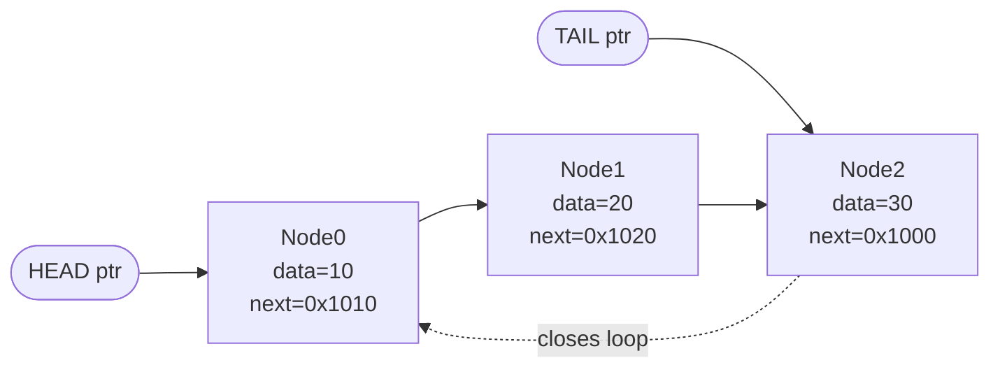
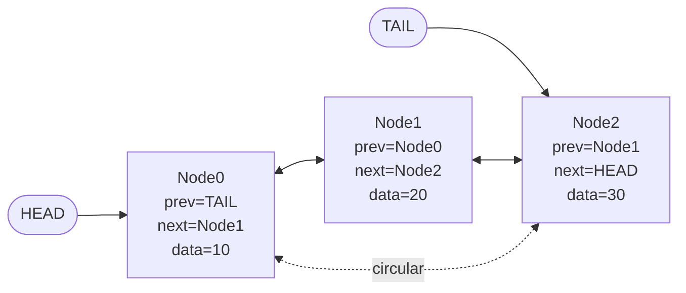
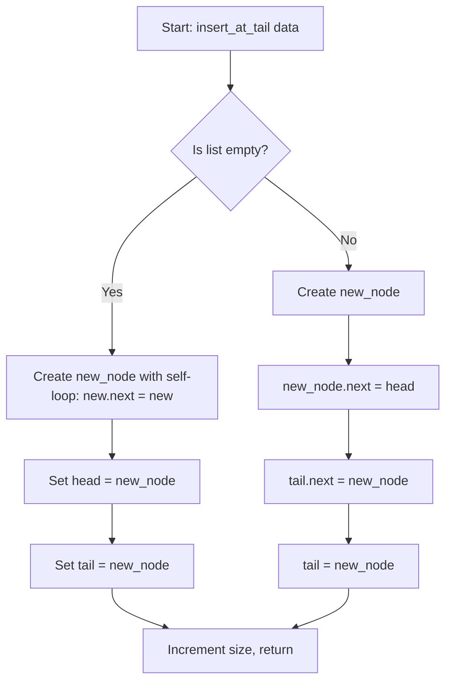
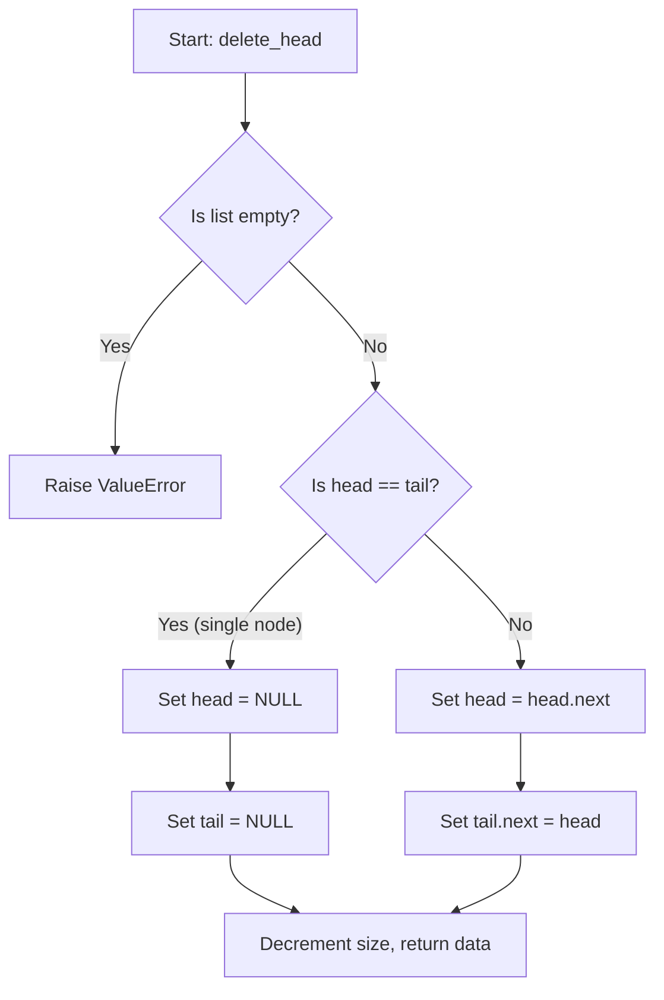
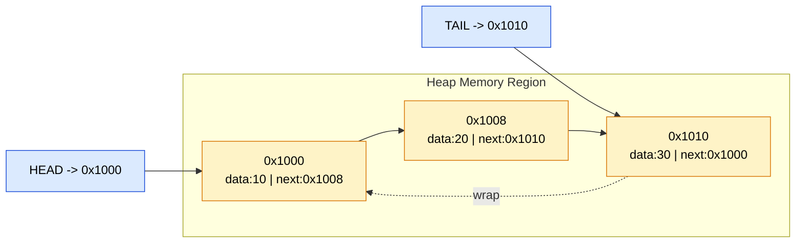
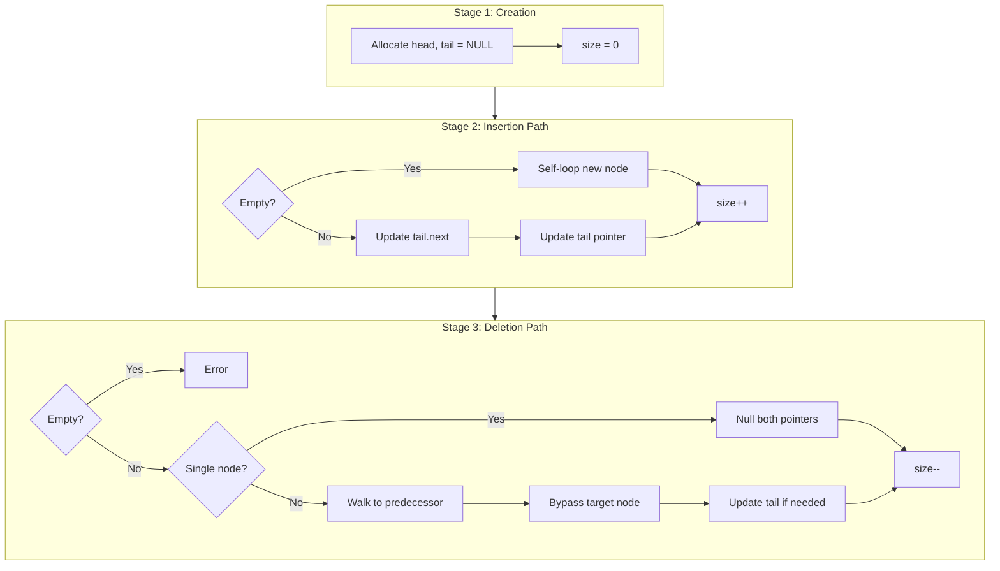

# Circular Linked List

<!-- SECTION_1_START -->
# Circular Linked List — Core Definition & Intuitive Overview

## Formal Academic Definition (KTU 2024 Syllabus Terminology)

A **Circular Linked List (CLL)** is a linear dynamic data structure in which the last node does not terminate with a `NULL` pointer; instead, its `next` reference (or `prev` reference in the doubly variant) wraps around to point back to the **head** (or `tail`) of the list, forming a closed ring or cycle. It is a specialized variant of the singly/doubly linked list where the **boundary pointer invariance** is $\text{tail.next} = \text{head}$ (and optionally $\text{head.prev} = \text{tail}$).

> [!IMPORTANT]
> **KTU 2024 Board Definition (verbatim-ready):** A circular linked list is a linked list in which the link field of the last node points back to the first node (or the head node), thereby creating a circular chain. There is no `NULL` value at the terminal end, and every node can be reached from any other node by continuous traversal.

## Two Canonical Variants

| Variant | Pointer Count per Node | Termination Property | KTU Module Reference |
| :--- | :---: | :--- | :--- |
| **Singly Circular Linked List** | 1 (`next`) | $\text{last.next} = \text{head}$ | Module 2.2 |
| **Doubly Circular Linked List** | 2 (`next`, `prev`) | $\text{last.next} = \text{head}$ AND $\text{head.prev} = \text{last}$ | Module 2.3 |

> [!NOTE]
> **Memory Management Context (Module 2 Theme):** Unlike static arrays, a circular linked list utilizes **heap-allocated nodes** joined by pointer references. There is **no contiguous memory requirement** — nodes can be scattered anywhere in the heap, with the circular linkage providing logical continuity. This eliminates array-style memory fragmentation overhead but introduces a per-node **pointer overhead of $P$ bytes**.

## Conceptual Analogy & Intuition

Imagine a **conga dance line** in a closed banquet hall. The leader (head) holds the hand of the second person, the second holds the third's hand, and so on, until the last dancer reaches back and holds the leader's free hand. **No one is "at the end"** — the line is a closed loop. If you start walking along the line, you will *never* fall off the edge; you will keep circling back.

A more technical analogy: think of a **roundabout (traffic circle)** where every vehicle enters at some node, follows the `next` road, and after $N$ exits returns to its starting point. There is no "dead end" street.

A **GeoGebra/Desmos-friendly intuition** is to consider points on a unit circle in the Euclidean plane:

$$P_i = \left( \cos\left(\frac{2\pi i}{N}\right), \sin\left(\frac{2\pi i}{N}\right) \right), \quad i \in \{0, 1, 2, \dots, N-1\}$$

Each point $P_i$ is connected to $P_{i+1 \bmod N}$, illustrating the wrap-around modular arithmetic that governs circular list indexing.

> [!VISUALIZATION CONTROL]
> **Concept:** Unit-circle placement of circular list nodes.
> **GeoGebra / Desmos Input Equations:**
> * $f_1(x) = \cos(2\pi x / 6)$
> * $f_2(x) = \sin(2\pi x / 6)$
> * Domain slider $x \in [0, 6)$ with step $1$
> **Visual Description:** The student should observe 6 evenly spaced points on a circle of radius 1. Lines drawn from $P_0 \to P_1 \to P_2 \to \dots \to P_5 \to P_0$ form a hexagonal loop with no terminal endpoint — the visual essence of a circular linked list.

## Why "Circular"? The Boundary Problem in Linear Lists

In a standard singly linked list, traversal terminates when `current.next == NULL`. The terminal `NULL` check is a **boundary condition** that must be tested at *every iteration*, costing one extra comparison per node ($O(N)$ comparisons over the full traversal). A circular list **eliminates this null-check by design** — termination is now governed by an external condition (e.g., counter reaching $N$, or returning to the start node) rather than by a sentinel `NULL` value.

> [!IMPORTANT]
> **Key Insight for Exams:** The circular topology trades the *constant-time NULL check* for a *cyclicity-condition check*. This is why CLLs are favored in applications with **natural cyclic structure**: round-robin scheduling, circular buffers, the Josephus problem, and the "repeat play" feature in media players.

<!-- SECTION_1_END -->

<!-- SECTION_2_START -->
# Deep Theoretical Analysis & KTU High-Yield Formula Sheet

## 2.1 Node Memory Layout (Struct Definition in C-style Pseudocode)

For a **Singly Circular Linked List**:

$$\text{Node}_{\text{size}} = \text{sizeof}(data) + \text{sizeof}(next\_ptr) = D + P \text{ bytes}$$

For a **Doubly Circular Linked List**:

$$\text{Node}_{\text{size}} = D + 2P \text{ bytes}$$

> [!NOTE]
> On a 64-bit system with pointer size $P = 8$ bytes, a singly CLL node holding a 4-byte `int` consumes $12$ bytes, while a doubly CLL node consumes $20$ bytes. The KTU examiner will often quote $P = 4$ bytes (32-bit) or $P = 8$ bytes (64-bit) — **always re-read the question's stated word size**.

## 2.2 Structural Invariants (The "Laws" of a CLL)

For a non-empty circular list with $N$ nodes:

1. **Closure Invariant:** $\text{tail.next} \equiv \text{head}$ (singly CLL) — there is **no** node whose `next` field is `NULL`.
2. **Reachability Invariant:** Every node is reachable from every other node via finite forward traversal.
3. **Cardinality Invariant:** A single pointer (the `head` or the `tail`) is sufficient to access the entire list.
4. **Empty-List Convention:** An empty CLL is typically represented by `head = NULL` (or `head = tail = NULL` in implementations tracking both).
5. **Doubly-Circular Closure:** $\text{head.prev} \equiv \text{tail}$ AND $\text{tail.next} \equiv \text{head}$.

## 2.3 Operational Complexity Cheat Sheet (KTU 2024 — High-Yield)

| Operation | Singly CLL (head pointer) | Singly CLL (tail pointer) | Doubly CLL (tail pointer) |
| :--- | :---: | :---: | :---: |
| **Create empty list** | $O(1)$ | $O(1)$ | $O(1)$ |
| **Insert at head** | $O(N)$ | $O(1)$ | $O(1)$ |
| **Insert at tail** | $O(N)$ | $O(1)$ | $O(1)$ |
| **Insert at position $k$** | $O(k)$ | $O(k)$ | $O(k)$ |
| **Delete head** | $O(N)$ | $O(1)$ | $O(1)$ |
| **Delete tail** | $O(N)$ | $O(1)$ | $O(1)$ |
| **Delete given node reference** | $O(N)$ | $O(N)$ | $O(1)$ |
| **Search by value** | $O(N)$ | $O(N)$ | $O(N)$ |
| **Traverse full list** | $O(N)$ | $O(N)$ | $O(N)$ |
| **Get length** | $O(N)$ | $O(N)$ | $O(N)$ |
| **Space overhead per node** | $D + P$ | $D + P$ | $D + 2P$ |
| **Total memory for $N$ nodes** | $N(D+P)$ | $N(D+P)$ | $N(D+2P)$ |

> [!IMPORTANT]
> **The Tail-Pointer Trick:** Maintaining a `tail` pointer (in addition to `head`) reduces head/tail operations from $O(N)$ to $O(1)$. This is a **favorite KTU trick question** — examiners love asking why a circular list is *almost always* implemented with a `tail` pointer instead of just a `head` pointer.

## 2.4 Memory Management Mechanics (Module 2 Theme)

CLL nodes are allocated from the **heap** via `malloc()` (C) or `new` (C++) / dynamic allocator (Python). Deallocation uses `free()` / `delete` / garbage collection.

**Memory address example (32-bit, $P=4$, $D=4$):** Suppose three nodes are allocated at heap addresses `0x1000`, `0x1010`, `0x1020`:

$$\text{Node}_0: \text{[data=10, next=0x1010]}$$
$$\text{Node}_1: \text{[data=20, next=0x1020]}$$
$$\text{Node}_2: \text{[data=30, next=0x1000]} \quad \text{(closes the loop!)}$$

The **address arithmetic** for stepping to the next node is:

$$\text{current} = \text{current.next} \quad \text{(pointer dereference, no offset arithmetic needed unlike arrays)}$$

This is the **fundamental memory management advantage** over arrays: insertion/deletion in the middle costs $O(1)$ pointer updates, not $O(N)$ element shifts.

## 2.5 Real-World Engineering Utility

| Domain | Application | Why CLL? |
| :--- | :--- | :--- |
| **Operating Systems** | Round-robin CPU scheduling | Cyclic process queue, no NULL termination |
| **Operating Systems** | Circular buffer / ring buffer | Producer-consumer at fixed memory size |
| **Multiplayer Gaming** | Turn rotation in card/board games | "Pass to next player" is $O(1)$ via `current = current.next` |
| **Networking** | Token Ring LAN protocol (IEEE 802.5) | Token circulates forever among stations |
| **Algorithm Design** | Josephus Problem ($J(n,k)$) | Natural cyclic elimination model |
| **Media Players** | Repeat-one / repeat-all playlist | Seamless wrap-around at list end |
| **Memory Management** | Free-list allocator (Linux slab) | Free blocks linked in a circle |

<!-- SECTION_2_END -->

<!-- SECTION_3_START -->
# Step-by-Step Derivations & Python Implementation

## 3.1 Complete Production-Grade Python Implementation

```python
"""
Singly Circular Linked List — Full Implementation
Author: KTU Premium Engine V10
Course: PCCST303 — Data Structures and Algorithms
Module: 2 (Linked List and Memory Management)
"""

from __future__ import annotations
from typing import Any, Optional, Iterator


class Node:
    """A single node in a singly circular linked list."""

    __slots__ = ("data", "next")

    def __init__(self, data: Any, nxt: Optional["Node"] = None) -> None:
        self.data: Any = data
        self.next: Optional["Node"] = nxt

    def __repr__(self) -> str:
        return f"Node(data={self.data!r})"


class CircularLinkedList:
    """
    Singly Circular Linked List with a TAIL pointer for O(1) tail operations.
    Invariant: For non-empty list, tail.next == head.
    """

    def __init__(self) -> None:
        self.head: Optional[Node] = None
        self.tail: Optional[Node] = None
        self._size: int = 0
        self._log: list[str] = []

    # ---------- Housekeeping ----------
    def _log_op(self, msg: str) -> None:
        self._log.append(msg)

    def is_empty(self) -> bool:
        return self.head is None

    def length(self) -> int:
        # We do NOT traverse to compute length every time — we maintain _size.
        # This is O(1) and a KTU-favorite discussion point (trade-off of auxiliary counter).
        return self._size

    def get_operation_log(self) -> list[str]:
        return list(self._log)

    # ---------- Core Operations ----------
    def insert_at_head(self, data: Any) -> None:
        """Insert a new node as the new head. Time: O(1) with tail pointer."""
        new_node = Node(data)
        if self.is_empty():
            new_node.next = new_node  # self-loop, the only node points to itself
            self.head = new_node
            self.tail = new_node
        else:
            new_node.next = self.head
            self.tail.next = new_node  # maintain closure: old tail -> new head
            self.head = new_node
        self._size += 1
        self._log_op(f"INSERT_HEAD({data}) -> size={self._size}")

    def insert_at_tail(self, data: Any) -> None:
        """Insert a new node as the new tail. Time: O(1) with tail pointer."""
        new_node = Node(data)
        if self.is_empty():
            new_node.next = new_node
            self.head = new_node
            self.tail = new_node
        else:
            new_node.next = self.head     # new tail wraps to head
            self.tail.next = new_node     # old tail now points to new tail
            self.tail = new_node          # update tail reference
        self._size += 1
        self._log_op(f"INSERT_TAIL({data}) -> size={self._size}")

    def insert_at_position(self, data: Any, position: int) -> None:
        """
        Insert at 0-indexed position.
        Valid range: 0 <= position <= size.
        Time: O(min(position, size - position)) for boundary safety.
        """
        if position < 0 or position > self._size:
            raise IndexError(
                f"Position {position} out of bounds for size {self._size}"
            )
        if position == 0:
            self.insert_at_head(data)
            return
        if position == self._size:
            self.insert_at_tail(data)
            return

        new_node = Node(data)
        # Walk to the (position - 1)-th node
        current = self.head
        for _ in range(position - 1):
            current = current.next          # type: ignore[union-attr]
        new_node.next = current.next        # type: ignore[union-attr]
        current.next = new_node             # type: ignore[union-attr]
        self._size += 1
        self._log_op(f"INSERT_POS({data}, {position}) -> size={self._size}")

    def delete_head(self) -> Any:
        """Delete and return the head node's data. Time: O(1)."""
        if self.is_empty():
            raise ValueError("Delete from empty circular list is not allowed.")
        removed_data = self.head.data       # type: ignore[union-attr]
        if self.head is self.tail:
            # Single-node list
            self.head = None
            self.tail = None
        else:
            self.head = self.head.next      # type: ignore[union-attr]
            self.tail.next = self.head      # type: ignore[union-attr]
        self._size -= 1
        self._log_op(f"DELETE_HEAD() -> {removed_data}, size={self._size}")
        return removed_data

    def delete_tail(self) -> Any:
        """Delete the tail node. Time: O(N) for singly CLL (no backward pointer)."""
        if self.is_empty():
            raise ValueError("Delete from empty circular list is not allowed.")
        removed_data = self.tail.data       # type: ignore[union-attr]
        if self.head is self.tail:
            self.head = None
            self.tail = None
        else:
            # Walk from head to the node just before tail
            current = self.head
            while current.next is not self.tail:  # type: ignore[union-attr]
                current = current.next             # type: ignore[union-attr]
            current.next = self.head              # type: ignore[union-attr]
            self.tail = current
        self._size -= 1
        self._log_op(f"DELETE_TAIL() -> {removed_data}, size={self._size}")
        return removed_data

    def delete_value(self, value: Any) -> bool:
        """Delete the first node whose data equals value. Time: O(N)."""
        if self.is_empty():
            return False
        # Special case: head holds the value
        if self.head.data == value:         # type: ignore[union-attr]
            self.delete_head()
            return True
        # Walk to find the predecessor
        current = self.head                 # type: ignore[union-attr]
        while current.next is not self.head and current.next.data != value:  # type: ignore[union-attr]
            current = current.next         # type: ignore[union-attr]
        if current.next is self.head:
            self._log_op(f"DELETE_VAL({value}) -> NOT FOUND")
            return False
        # current.next is the target node
        target = current.next               # type: ignore[union-attr]
        if target is self.tail:
            self.tail = current
        current.next = target.next          # type: ignore[union-attr]
        self._size -= 1
        self._log_op(f"DELETE_VAL({value}) -> SUCCESS, size={self._size}")
        return True

    def search(self, value: Any) -> int:
        """Return the 0-indexed position of value, or -1 if not found. Time: O(N)."""
        if self.is_empty():
            return -1
        current = self.head                 # type: ignore[union-attr]
        index = 0
        while True:
            if current.data == value:       # type: ignore[union-attr]
                return index
            current = current.next          # type: ignore[union-attr]
            if current is self.head:
                break
            index += 1
        return -1

    def traverse(self, max_steps: Optional[int] = None) -> list[Any]:
        """
        Traverse and collect data. By default walks exactly N steps (one full loop).
        Pass max_steps to limit the traversal (useful for infinite-loop debugging).
        """
        result: list[Any] = []
        if self.is_empty():
            return result
        current = self.head                 # type: ignore[union-attr]
        steps = max_steps if max_steps is not None else self._size
        for _ in range(steps):
            result.append(current.data)     # type: ignore[union-attr]
            current = current.next          # type: ignore[union-attr]
            if current is self.head:
                break
        return result

    # ---------- Python Protocol Methods ----------
    def __iter__(self) -> Iterator[Any]:
        if self.is_empty():
            return
        current = self.head
        while True:
            yield current.data
            current = current.next
            if current is self.head:
                break

    def __len__(self) -> int:
        return self._size

    def __repr__(self) -> str:
        if self.is_empty():
            return "CircularLinkedList(empty)"
        nodes = " -> ".join(repr(n) for n in self.traverse())
        return f"CircularLinkedList [{nodes}] -> (back to head)"

    def __contains__(self, value: Any) -> bool:
        return self.search(value) != -1
```

## 3.2 Worked Example — Step-by-Step Insertion Trace (KTU Board Style)

**Problem:** Create an empty CLL, then insert `10`, `20`, `30`, `40` in that order (each at tail). Show the state of `head`, `tail`, and the `next` links after each step.

**Step 1: Initial state (empty)**

$$\text{head} = \text{NULL}, \quad \text{tail} = \text{NULL}, \quad \text{size} = 0$$

**Step 2: Insert 10 at tail**

$$\text{new\_node} = \text{Node}(10)$$
$$\text{since is\_empty() == True:}$$
$$\quad \text{new\_node.next} = \text{new\_node} \quad \text{(self-loop)}$$
$$\quad \text{head} = \text{new\_node}$$
$$\quad \text{tail} = \text{new\_node}$$

State: `head -> [10] <- tail`, with `head.next == head` (single-node self-loop).

**Step 3: Insert 20 at tail**

$$\text{new\_node} = \text{Node}(20)$$
$$\text{since is\_empty() == False:}$$
$$\quad \text{new\_node.next} = \text{head} \quad (\text{new tail wraps to head})$$
$$\quad \text{tail.next} = \text{new\_node} \quad (\text{old tail of 10 now points to 20})$$
$$\quad \text{tail} = \text{new\_node} \quad (\text{update tail})$$

State: `head -> [10] -> [20] -> (back to head)`.

**Step 4: Insert 30 at tail**

$$\text{new\_node} = \text{Node}(30)$$
$$\text{new\_node.next} = \text{head}$$
$$\text{tail.next} = \text{new\_node} \quad (\text{node 20 points to 30})$$
$$\text{tail} = \text{new\_node}$$

State: `head -> [10] -> [20] -> [30] -> (back to head)`.

**Step 5: Insert 40 at tail**

$$\text{new\_node} = \text{Node}(40)$$
$$\text{new\_node.next} = \text{head}$$
$$\text{tail.next} = \text{new\_node} \quad (\text{node 30 points to 40})$$
$$\text{tail} = \text{new\_node}$$

State: `head -> [10] -> [20] -> [30] -> [40] -> (back to head)`. Final size = 4.

## 3.3 Josephus Problem — Canonical CLL Application

**Problem Statement:** $N$ people stand in a circle. Starting from person 1, every $K$-th person is eliminated. The last survivor is the Josephus winner $J(N, K)$.

**Derivation using CLL:** Maintain a CLL of $N$ nodes. Use a `current` pointer; advance it $K-1$ steps, then delete `current.next`. Repeat until one node remains.

```python
def josephus(n: int, k: int) -> int:
    """
    Solve the Josephus problem using a circular linked list.
    Time: O(N * K), Space: O(N).
    """
    if n <= 0:
        raise ValueError("n must be positive")
    cll = CircularLinkedList()
    for i in range(1, n + 1):
        cll.insert_at_tail(i)

    current = cll.head
    while cll.length() > 1:
        # Advance (k - 1) steps
        for _ in range(k - 1):
            current = current.next
        victim = current.next
        survivor_data = victim.data
        current.next = victim.next
        cll._size -= 1
        if victim is cll.head:
            cll.head = current.next
        if victim is cll.tail:
            cll.tail = current
        current = current.next
        del victim
    return cll.head.data
```

**Worked Example:** $J(5, 2)$ — eliminate every 2nd person.

| Step | Current Circle (eliminate every 2nd) | Eliminated | Survivor Count |
| :---: | :--- | :---: | :---: |
| 0 | $1 \to 2 \to 3 \to 4 \to 5 \to 1$ | — | 5 |
| 1 | $1 \to 2 \to 3 \to 4 \to 5$; kill `current.next`=2 | 2 | 4 |
| 2 | $1 \to 3 \to 4 \to 5$; kill `current.next`=4 | 4 | 3 |
| 3 | $1 \to 3 \to 5$; kill `current.next`=5 | 5 | 2 |
| 4 | $1 \to 3$; kill `current.next`=3 | 3 | 1 |
| 5 | Survivor = 1 | — | 1 |

$$J(5, 2) = 1$$

## 3.4 Deletion — The "Tail Update" Pitfall Walkthrough

A common KTU board pitfall is forgetting to update the `tail` pointer when deleting the last node of a singly CLL. Consider the list `10 -> 20 -> 30 -> (back to 10)`, with `tail = node(30)`. Delete the value `30`:

1. `search` finds target at the tail; `current` stops at node(20).
2. Set `current.next = head`: node(20) now points to node(10).
3. **Update tail:** `self.tail = current` (node(20) becomes new tail).
4. **Update size:** `self._size -= 1`.
5. **Do NOT** leave `self.tail` pointing to the deleted node — this is a **dangling pointer**, a classic memory-management bug.

> [!IMPORTANT]
> **Memory Management Rule:** Whenever a node is deleted, the KTU examiner expects you to (a) update all logical references, (b) call `free()` (C) / `delete` (C++) / `del` (Python), and (c) optionally null out the dangling pointer for safety. Skipping step (a) is the most common deduction point.

<!-- SECTION_3_END -->

<!-- SECTION_4_START -->
# Structural Diagrams & Schematics

## 4.1 Singly Circular Linked List — Memory Layout



**Reading the diagram:** The solid arrows are active `next` pointers; the dashed arrow is the conceptual closure. Note that **no node has a `NULL` next field** — the invariant $\text{tail.next} = \text{head}$ is satisfied (Node2's next = 0x1000 = address of Node0).

## 4.2 Doubly Circular Linked List — Symmetric Closure



## 4.3 Operation Flow — Insert at Tail (Sequential Processing Topology)



## 4.4 Operation Flow — Delete Head (Edge Case Aware)



## 4.5 Memory Block Address Map (32-bit, $P=4$)



> [!NOTE]
> **Visualization Tip:** Address offsets are $0x8$ between nodes because each node occupies `data (4) + next (4) = 8 bytes`. If the question states $D=4, P=8$ (64-bit), the offset becomes $12$ bytes.

## 4.6 Multi-Stage Breakdown — CLL Operation Subgraphs



<!-- SECTION_4_END -->

<!-- SECTION_5_START -->
# KTU 2024 Scheme Examination Question Bank & Topic Recap

## Part A — Short Answer Questions (3 Marks Each)

### Question 1 (3 Marks)
> **[KTU University Exam — July 2023]** Define a circular linked list. How is it different from a linear singly linked list?

**Model Answer (3 Marks):**

A **circular linked list** is a linked list in which the last node's `next` pointer does not point to `NULL` but instead points back to the **head** (first node) of the list, forming a closed loop. **[1 Mark]**

Differences from a linear singly linked list: **[2 Marks]**

| Aspect | Linear Singly LL | Circular Singly LL |
| :--- | :--- | :--- |
| Termination | Last node's `next = NULL` | Last node's `next = head` |
| Traversal | Stops at `NULL` | Stops only via external condition (e.g., returning to head) |
| Reachability | Tail cannot reach head via `next` | Any node can reach any other via cyclic traversal |

> **Valuation Key:** Definition = 1M. Tabular comparison with at least 2 valid differences = 2M. Partial credit if only conceptual difference stated.

---

### Question 2 (3 Marks)
> **[KTU University Exam — Dec 2023]** Write the node structure for a singly circular linked list storing integer data. Explain why a `tail` pointer is preferred over a `head` pointer in circular lists.

**Model Answer (3 Marks):**

**Node Structure (C-style):** **[1 Mark]**

```c
struct Node {
    int data;            // 4 bytes
    struct Node *next;   // 4 or 8 bytes
};
```

**Why `tail` is preferred:** **[2 Marks]**

1. In a circular list, both `head` and `tail` allow $O(N)$ access to the other end. However, by maintaining a `tail` pointer, the *next* insertion at the tail is $O(1)$: `new_node.next = head; tail.next = new_node; tail = new_node;`. With only a `head` pointer, every tail insertion would require an $O(N)$ traversal to find the last node.

2. Many CLL implementations (e.g., the Josephus solution and the Linux kernel's `list_head` macro) use the `tail` pointer as the canonical "entry point" because it simplifies the **closure invariant** update during insertion at both ends.

> **Valuation Key:** Correct struct syntax = 1M. Two valid reasons for tail pointer = 1M each.

---

## Part B — 14-Mark Questions (ESE Module Internal Choice)

### Question A (14 Marks)
> **[KTU University Exam — July 2024, Module 2, CO2, Apply/Analyze]** **(a)** Explain with a neat diagram the memory representation of a circular linked list with 4 nodes containing data $10, 20, 30, 40$. Mention the size of each node assuming pointer size $P = 4$ bytes and integer size $D = 4$ bytes. **(7 Marks)** **(b)** Write a C program to insert a node at the **end** of a circular singly linked list and delete a node from the **beginning**. Provide the time complexity of each. **(7 Marks)**

#### Part (a) — Memory Representation (7 Marks)

**Solution:**

**Node size calculation:** **[1 Mark]**

$$\text{Node size} = D + P = 4 + 4 = 8 \text{ bytes}$$

**Memory layout diagram:** **[4 Marks]**

```
HEAD ──► [data=10 | next=0x1008] ──► [data=20 | next=0x1010] ──►
TAIL ────────────────────────────────────────────────────────► [data=30 | next=0x1018] ──► [data=40 | next=0x1000] ──► (back to HEAD)
```

Equivalently in pointer notation:

$$\text{HEAD} \to N_0(10) \to N_1(20) \to N_2(30) \to N_3(40) \to \text{HEAD (closure)}$$

with `TAIL -> N_3` and `N_3.next -> N_0 (HEAD)`.

**Key properties to state:** **[2 Marks]**

- Total memory consumed = $4 \times 8 = 32$ bytes (excluding pointer overhead of `head` and `tail`).
- **No node** has `next = NULL`; the closure is at `N_3.next = N_0`.
- Reachability: from any node, the full list is accessible by repeated `next` traversal.

> **Valuation Key (7M):** Node size formula correct = 1M. Diagram with 4 nodes and correct closure arrow = 4M. Stating closure property + total memory = 2M.

#### Part (b) — C Program: Insert-at-End and Delete-from-Beginning (7 Marks)

**Solution:**

```c
#include <stdio.h>
#include <stdlib.h>

struct Node {
    int data;
    struct Node *next;
};

struct Node *head = NULL;
struct Node *tail = NULL;

/* Insert a node at the END of the circular list */
void insertAtEnd(int value) {
    struct Node *newNode = (struct Node *)malloc(sizeof(struct Node));
    if (newNode == NULL) {
        fprintf(stderr, "Memory allocation failed\n");
        return;
    }
    newNode->data = value;
    if (head == NULL) {
        newNode->next = newNode;   /* self-loop: only node points to itself */
        head = newNode;
        tail = newNode;
    } else {
        newNode->next = head;      /* new tail wraps to head */
        tail->next = newNode;      /* old tail now points to new tail */
        tail = newNode;            /* update tail reference */
    }
    printf("Inserted %d at end.\n", value);
}

/* Delete a node from the BEGINNING of the circular list */
void deleteFromBeginning(void) {
    if (head == NULL) {
        printf("List is empty. Nothing to delete.\n");
        return;
    }
    int removed = head->data;
    if (head == tail) {
        /* Single node case */
        free(head);
        head = NULL;
        tail = NULL;
    } else {
        struct Node *temp = head;
        head = head->next;         /* move head forward */
        tail->next = head;         /* maintain closure: tail -> new head */
        free(temp);                /* free old head */
    }
    printf("Deleted %d from beginning.\n", removed);
}

/* Display the circular list (one full rotation) */
void display(void) {
    if (head == NULL) {
        printf("List is empty.\n");
        return;
    }
    struct Node *current = head;
    printf("HEAD -> ");
    do {
        printf("%d -> ", current->data);
        current = current->next;
    } while (current != head);
    printf("(back to HEAD)\n");
}

int main(void) {
    insertAtEnd(10);
    insertAtEnd(20);
    insertAtEnd(30);
    display();
    deleteFromBeginning();
    deleteFromBeginning();
    display();
    return 0;
}
```

**Time Complexity:** **[2 Marks]**

| Operation | Complexity | Reason |
| :--- | :--- | :--- |
| `insertAtEnd` | $O(1)$ | Tail pointer maintained; only pointer updates, no traversal |
| `deleteFromBeginning` | $O(1)$ | Head move + tail.next update; no traversal |

> **Valuation Key (7M):** Correct `insertAtEnd` with closure maintenance (single-node edge case) = 3M. Correct `deleteFromBeginning` with `free()` and edge case = 2M. Time complexity stated correctly for both = 1M. Clean compile-ready code with `#include` and `main` = 1M.

---

### Question B (14 Marks) — Alternative Choice
> **[KTU University Exam — Dec 2024, Module 2, CO2, Apply/Analyze]** **(a)** What is a circular linked list? Compare singly circular and doubly circular linked lists. Mention any two applications. **(7 Marks)** **(b)** Write algorithms (pseudocode) for **(i)** inserting a node after a given node value $X$ and **(ii)** deleting a node with a given value $X$ in a singly circular linked list. State the time complexity of each. **(7 Marks)**

#### Part (a) — Concept & Comparison (7 Marks)

**Solution:**

**Definition:** **[1 Mark]**
A circular linked list is one in which the last node's pointer field stores the address of the first node, forming a closed circular chain with no `NULL` terminator.

**Comparison Table:** **[4 Marks]**

| Feature | Singly Circular LL | Doubly Circular LL |
| :--- | :--- | :--- |
| Pointer fields per node | 1 (`next`) | 2 (`next`, `prev`) |
| Memory per node | $D + P$ | $D + 2P$ |
| Traversal direction | Forward only | Forward and backward |
| Tail deletion | $O(N)$ (must walk to predecessor) | $O(1)$ (use `prev` pointer) |
| Insertion complexity | $O(N)$ without tail pointer, $O(1)$ with | $O(1)$ with tail pointer at either end |
| Closure invariant | $\text{tail.next} = \text{head}$ | $\text{tail.next} = \text{head}$ AND $\text{head.prev} = \text{tail}$ |
| Code complexity | Simpler | More complex (more pointers to maintain) |

**Two Applications:** **[2 Marks]**

1. **Round-Robin CPU Scheduling** in operating systems — the scheduler cycles through the process queue indefinitely.
2. **Circular Buffer / Ring Buffer** in streaming I/O — fixed-size buffer where the producer wraps around to the start when it reaches the end.

> **Valuation Key (7M):** Definition = 1M. Comparison table with at least 4 rows correctly contrasted = 4M. Two real applications with brief justification = 2M (1M each).

#### Part (b) — Algorithms: Insert-After-X and Delete-Value-X (7 Marks)

**Solution:**

**Algorithm (i) — Insert a new node with value `Y` after the first node whose data equals `X`:** **[3.5 Marks]**

```
ALGORITHM: InsertAfterX(head, tail, X, Y)
INPUT: head, tail pointers; X = existing value; Y = new value
OUTPUT: Updated CLL with new node inserted after X

1. IF head == NULL THEN
2.     PRINT "List is empty, cannot insert after X"
3.     RETURN
4. END IF
5. 
6. new_node ← ALLOCATE node
7. new_node.data ← Y
8. 
9. current ← head
10. found ← FALSE
11. DO
12.     IF current.data == X THEN
13.         found ← TRUE
14.         BREAK
15.     END IF
16.     current ← current.next
17. WHILE current != head
18. 
19. IF found == FALSE THEN
20.     PRINT "Value X not found in list"
21.     FREE new_node
22.     RETURN
23. END IF
24. 
25. new_node.next ← current.next
26. current.next ← new_node
27. 
28. IF current == tail THEN
29.     tail ← new_node           // new node is the new tail
30. END IF
31. 
32. RETURN head, tail
```

**Time Complexity:** $O(N)$ in the worst case (when $X$ is the tail, we traverse the entire list before finding it). **[0.5 Mark]**

**Algorithm (ii) — Delete the first node whose data equals `X`:** **[3.5 Marks]**

```
ALGORITHM: DeleteValueX(head, tail, X)
INPUT: head, tail pointers; X = value to delete
OUTPUT: Updated CLL with one node removed (if X exists)

1. IF head == NULL THEN
2.     PRINT "List is empty, cannot delete"
3.     RETURN FALSE
4. END IF
5. 
6. // Case 1: Head holds the value X
7. IF head.data == X THEN
8.     IF head == tail THEN
9.         FREE head
10.        head ← NULL
11.        tail ← NULL
12.    ELSE
13.        temp ← head
14.        head ← head.next
15.        tail.next ← head        // maintain closure
16.        FREE temp
17.    END IF
18.    RETURN TRUE
19. END IF
20. 
21. // Case 2: X is somewhere in the middle or at the tail
22. current ← head
23. WHILE current.next != head AND current.next.data != X DO
24.     current ← current.next
25. END WHILE
26. 
27. IF current.next == head THEN
28.     PRINT "Value X not found"
29.     RETURN FALSE
30. END IF
31. 
32. target ← current.next
33. current.next ← target.next
34. 
35. IF target == tail THEN
36.     tail ← current              // update tail
37. END IF
38. 
39. FREE target
40. RETURN TRUE
```

**Time Complexity:** $O(N)$ — worst case requires walking the entire list to find $X$ or to confirm its absence. **[0.5 Mark]**

> **Valuation Key (7M):** Algorithm (i) pseudocode = 2.5M, complexity = 0.5M, tail-update edge case = 0.5M. Algorithm (ii) pseudocode = 2.5M, complexity = 0.5M, head & tail edge cases (head deletion, tail deletion) = 0.5M.

> [!WARNING]
> **KTU Examiner's Pitfall Callout:**
> 1. **Forgetting the `tail.next = head` closure update** after deletion — this breaks the circular property and turns the list into a linear one. Deduct **1 mark** if missing.
> 2. **Forgetting to update the `tail` pointer** when the deleted node IS the tail — this leaves a dangling reference. Deduct **1 mark**.
> 3. **Skipping the single-node edge case** in both insertion and deletion algorithms. Deduct **0.5 mark** if missing.
> 4. **Writing `current.next = NULL` in CLL algorithms** — this is a fatal conceptual error. A circular list **must not** have any `NULL` next pointer (except when the list is empty). Deduct **2 marks**.
> 5. **Confusing the "stop condition"** in traversal — students often write `while (current != NULL)` for a CLL, which leads to an **infinite loop**. The correct condition is `while (current != head)` or equivalent. Deduct **1 mark** if misused.

---

## Topic Recap & Important Things to Remember

- **Core definition:** A circular linked list is a linked list where $\text{tail.next} = \text{head}$; **no node has `next = NULL`** in a non-empty list.
- **Two variants:** Singly Circular (1 pointer) and Doubly Circular (2 pointers). Both satisfy the closure invariant.
- **Tail-pointer optimization:** Maintaining `tail` reduces head/tail insert/delete to $O(1)$; this is the canonical CLL design pattern.
- **Empty-list representation:** `head = NULL` (and `tail = NULL` if both are tracked).
- **Single-node list:** A single-node CLL has `head.next = head` (self-loop), NOT `head.next = NULL`.
- **Traversal termination:** Use `do-while` and stop when `current == head` (after at least one visit). Never use `current == NULL` in a non-empty CLL.
- **Insertion at tail (with tail pointer):** `new.next = head; tail.next = new; tail = new;` — three pointer writes, $O(1)$.
- **Deletion of head (with tail pointer):** `head = head.next; tail.next = head; free(old_head);` — $O(1)$.
- **Deletion of tail (singly CLL):** Requires $O(N)$ walk to find predecessor, then `pred.next = head; tail = pred;` — no fast tail deletion without a doubly CLL.
- **Memory per node:** $D + P$ (singly) or $D + 2P$ (doubly) bytes, where $D$ = data size, $P$ = pointer size.
- **Total memory for $N$ nodes:** $N(D+P)$ singly, $N(D+2P)$ doubly. Don't forget to add the `head`/`tail` pointer overhead ($2P$) for the entire structure.
- **Search complexity:** $O(N)$ — same as linear linked list; circular topology does not speed up search.
- **Key applications to memorize:** Round-robin scheduling, circular/ring buffers, Josephus problem, token ring networking, playlist repeat modes, free-list allocators.
- **Memory management hygiene:** Always update both `head` and `tail` references when an edge-case node (first or last) is removed; always call `free()` / `del` to prevent memory leaks.
- **Common exam trap:** Writing `while (current != NULL)` causes infinite loops in a CLL. The correct boundary check is `while (current != head)` or a counted loop.
- **Josephus $J(N, K)$:** Solvable in $O(NK)$ using a CLL by repeatedly advancing $K-1$ steps and removing the next node.
- **Doubly CLL closure:** $\text{head.prev} = \text{tail}$ **AND** $\text{tail.next} = \text{head}$ — both directions must wrap.
- **Conversion:** A linear singly LL can be converted to a CLL by setting the last node's `next` to `head` — a one-line change that transforms the entire structure's behavior.

<!-- SECTION_5_END -->
