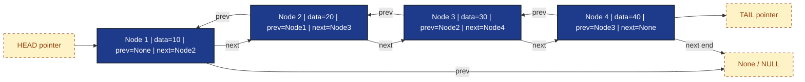
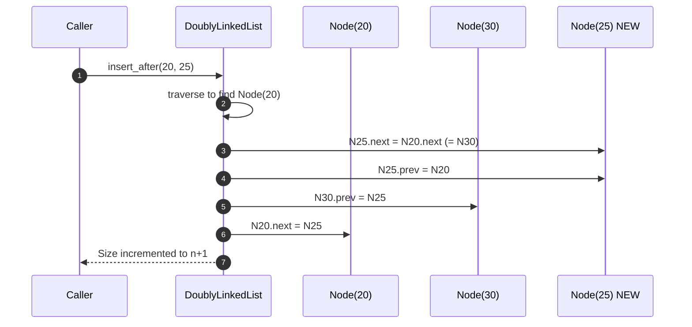
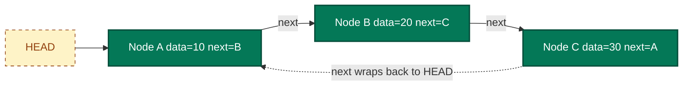
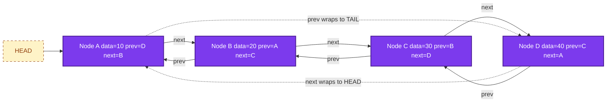
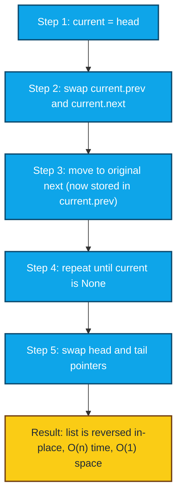

# Doubly Linked List, Circular Linked List

<!-- SECTION_1_START -->

# Doubly Linked List & Circular Linked List — Core Definition & Intuition

## 1.1 Doubly Linked List (DLL)

### Formal Definition
A **Doubly Linked List (DLL)** is a linear, dynamic data structure in which each node contains **three** fields:
1. A `data` field that stores the element value.
2. A `next` pointer that stores the address (reference) of the **successor** node.
3. A `prev` pointer that stores the address (reference) of the **predecessor** node.

The list maintains two external references: `head` (pointing to the first node) and optionally `tail` (pointing to the last node). The `head.prev` is `None` and `tail.next` is `None`, marking the two ends of the list.

> [!NOTE]
> **KTU Syllabus Highlight (PCCST303 — Module 2):** DLL is specifically emphasized over SLL whenever **bidirectional traversal**, **efficient deletion of a node given only its pointer** (O(1) once located), and **reverse iteration** are required. Examiner loves to contrast SLL vs DLL trade-offs.

### Real-World Analogy
Think of a **mountain train tunnel with lights on both ends of every coach**. You can walk forward (toward the tail) or backward (toward the head) by simply checking the lamp behind you or the lamp ahead of you. Compare this with a Single Linked List, which is a **one-way escalator** — you can only move forward, because there is no "looking back" pointer.

> [!IMPORTANT]
> **Memory Trade-off:** Every DLL node consumes **2 pointers + 1 data field** of overhead. For 1,000,000 elements of 4-byte integers on a 64-bit system, expect approximately **24 MB** for the nodes alone (8 bytes each for `next`, `prev`, plus 4 bytes for data, padded to 24). Plan memory budgets accordingly in production systems.

### GeoGebra / Desmos Visualization

> [!VISUALIZATION CONTROL]
> **Concept:** DLL Node Linking and Bidirectional Traversal
> **GeoGebra / Desmos Input Equations:**
> * `A = (1, 2)`, `B = (3, 2)`, `C = (5, 2)`, `D = (7, 2)`
> * `Link_AB = Segment(A, B)`, `Link_BC = Segment(B, C)`, `Link_CD = Segment(C, D)`
> * `Arrow_Fwd = Vector(A, D)`, `Arrow_Bwd = Vector(D, A)`
> **Visual Description:** Four collinear points A, B, C, D on the x-axis represent four DLL nodes. Solid segments show the `next` connections (A→B→C→D), and a reverse vector arrow shows `prev` (D→C→B→A). You should observe that every node (except the ends) has **two edges**, enabling both forward and backward walks.

---

## 1.2 Circular Linked List (CLL)

### Formal Definition
A **Circular Linked List (CLL)** is a linked list variant in which the `next` pointer of the **last node** does not point to `None`. Instead, it loops back to the **first node** (`head`), forming a ring. There is **no `None` end-marker**, so traversal must use a stopping condition based on returning to `head`.

Two principal sub-variants:
- **Circular Singly Linked List (CSLL):** Each node has `data` + `next`. The last node's `next` points back to `head`.
- **Circular Doubly Linked List (CDLL):** Each node has `data` + `next` + `prev`. The last node's `next` points to `head`, and `head.prev` points to the last node — a fully closed ring.

> [!NOTE]
> **KTU Board Pattern:** The most asked question on CLL is *“How do you detect the end of a circular list during traversal?”* — The answer is **“Stop when `current == head` (or when you complete a full loop count equal to the length).”** Many students mistakenly write `current != None`, leading to **infinite loops** in code.

### Real-World Analogy
Picture a **conveyor belt in a sushi restaurant**. Plates (nodes) sit on the belt (the `next` link), and after the last plate comes back the first one again. There is no "end" — the belt just keeps going. Compare this with a normal SLL, which is more like a **one-way street that ends at a cul-de-sac**.

### GeoGebra / Desmos Visualization

> [!VISUALIZATION CONTROL]
> **Concept:** Circular Singly Linked List Topology
> **GeoGebra / Desmos Input Equations:**
> * `Circle((0,0), 3)` as the underlying ring.
> * `P1 = (3, 0)`, `P2 = (0, 3)`, `P3 = (-3, 0)`, `P4 = (0, -3)` (four nodes evenly distributed).
> * `Arc(P1, P2)`, `Arc(P2, P3)`, `Arc(P3, P4)`, `Arc(P4, P1)` to indicate the `next` links.
> **Visual Description:** A closed ring with four labeled nodes and curved arrows. The arrow from P4 returns to P1, completing the cycle. There is no terminating edge.

---

## 1.3 Why These Structures Exist — Motivation

| Limitation in SLL | How DLL Solves It | How CLL Solves It |
|---|---|---|
| Cannot traverse backward | `prev` pointer enables O(1) backward step | (DLL extension solves this; CDLL covers both) |
| Deletion of a known node requires its predecessor (O(n) search) | Direct O(1) deletion given the node pointer | Allows wrap-around and constant-time tail access via `head.prev` (in CDLL) |
| Wasted traversal when appending to tail | `tail` pointer gives O(1) tail insertion | Any node can act as a tail — useful in **round-robin schedulers** |

> [!IMPORTANT]
> **Production Use Cases:** DLL is the backbone of **LRU caches** (e.g., Redis, Memcached), **browser back/forward navigation stacks**, and **text editor undo/redo buffers**. CLL is the backbone of **OS round-robin schedulers**, **multiplayer turn systems**, and **circular buffers in streaming pipelines (Kafka, audio I/O)**.

<!-- SECTION_1_END -->

<!-- SECTION_2_START -->

# Deep Theoretical Analysis & KTU High-Yield Formula Sheet

## 2.1 Doubly Linked List — Node Anatomy and Memory Layout

A DLL node in **C-style memory layout** typically looks like:

```
+--------+---------+--------+
|  prev  |  data   |  next  |
+--------+---------+--------+
   8B        4B        8B     (64-bit architecture, ints padded)
```

The total node size is therefore **24 bytes** (with padding) or **20 bytes** (without padding) for a 4-byte integer payload.

### 2.1.1 Operational Logic — Step-by-Step

**Insertion at the Head (DLL):**
1. Create a new node `N` with `data = value`, `N.prev = None`, `N.next = head`.
2. If `head is not None`: set `head.prev = N`.
3. Update `head = N`.

**Insertion at the Tail (DLL) — using a `tail` reference:**
1. Create a new node `N` with `data = value`, `N.next = None`, `N.prev = tail`.
2. If `tail is not None`: set `tail.next = N`.
3. Update `tail = N`.

**Insertion After a Given Node `P`:**
1. Create a new node `N`.
2. `N.next = P.next`, `N.prev = P`.
3. If `P.next is not None`: `P.next.prev = N`.
4. `P.next = N`.

**Deletion of a Given Node `N`:**
1. If `N.prev is not None`: `N.prev.next = N.next`.
2. Else: this is the head, so update `head = N.next`.
3. If `N.next is not None`: `N.next.prev = N.prev`.
4. Else: this was the tail, so update `tail = N.prev`.
5. Free `N` (in C) or let GC reclaim (in Python).

> [!IMPORTANT]
> **Why DLL Deletion is O(1):** In SLL, deleting a node requires the **predecessor** because only the `next` link is rewired. In DLL, both predecessor and successor are reachable from `N` itself, so no search is needed. This is the most-cited **advantage-of-DLL-over-SLL** in KTU board exams.

---

## 2.2 Circular Singly Linked List (CSLL) — Operational Logic

**Insertion at Head (CSLL):**
1. Create a new node `N`.
2. If `head is None`: set `N.next = N` and `head = N`.
3. Else: traverse to the **last node** `L` (where `L.next == head`), set `L.next = N`, `N.next = head`, `head = N`.

**Insertion at Tail (CSLL):**
1. Create a new node `N`.
2. If `head is None`: `N.next = N` and `head = N`.
3. Else: traverse to the last node `L`, set `L.next = N`, `N.next = head`.

**Deletion of Head (CSLL):**
1. If `head.next == head` (only one node): set `head = None`.
2. Else: traverse to last node `L`, set `L.next = head.next`, `head = head.next`.

---

## 2.3 Circular Doubly Linked List (CDLL) — Operational Logic

CDLL combines both advantages: bidirectional traversal and circular topology.

**Insertion at Head (CDLL):**
1. Create `N`.
2. If `head is None`: `N.next = N`, `N.prev = N`, `head = N`.
3. Else: `L = head.prev` (the last node), set `N.next = head`, `N.prev = L`, `L.next = N`, `head.prev = N`, `head = N`.

**Deletion of a Node `N` (CDLL):**
1. If `N.next == N` (single node): `head = None`.
2. Else: `N.prev.next = N.next` and `N.next.prev = N.prev`.
3. If `N == head`: `head = N.next`.

> [!NOTE]
> **KTU Examiner Tip:** When drawing a CDLL, always close the **prev** loop too. A common student mistake is closing only the `next` pointer and leaving `head.prev` dangling, which is **half-circular** and not a true CDLL.

---

## 2.4 KTU High-Yield Formula Sheet / Complexity Cheat Sheet

| Operation | SLL | DLL | CSLL | CDLL |
|---|---|---|---|---|
| Access by index | $O(n)$ | $O(n)$ | $O(n)$ | $O(n)$ |
| Search by value | $O(n)$ | $O(n)$ | $O(n)$ | $O(n)$ |
| Insert at head | $O(1)$ | $O(1)$ | $O(1)$ | $O(1)$ |
| Insert at tail (with tail ptr) | $O(1)$ | $O(1)$ | $O(n)$ | $O(1)$ |
| Insert at tail (no tail ptr) | $O(n)$ | $O(n)$ | $O(n)$ | $O(n)$ |
| Insert at given node ptr | $O(1)$ after $O(n)$ search | $O(1)$ after $O(n)$ search | $O(1)$ after $O(n)$ search | $O(1)$ after $O(n)$ search |
| Delete head | $O(1)$ | $O(1)$ | $O(n)$ | $O(1)$ |
| Delete tail (with tail ptr) | $O(n)$ | $O(1)$ | $O(n)$ | $O(1)$ |
| Delete given node ptr | $O(n)$ (predecessor search) | $O(1)$ | $O(n)$ | $O(1)$ |
| Forward traversal | $O(n)$ | $O(n)$ | $O(n)$ | $O(n)$ |
| Backward traversal | Not possible | $O(n)$ | Not possible | $O(n)$ |
| Extra memory per node | 1 ptr (8 B) | 2 ptrs (16 B) | 1 ptr (8 B) | 2 ptrs (16 B) |
| Risk of infinite loop | Low | Low | **High** | **High** |

> [!IMPORTANT]
> **Memory formula for an n-node list:**
> $$\text{Total Memory} = n \times (s_{data} + p \times s_{ptr})$$
> where $p$ is the number of pointers per node (1 for SLL/CSLL, 2 for DLL/CDLL) and $s_{ptr}$ is the pointer size (typically **8 bytes** on 64-bit systems). Always declare $s_{ptr} = 8$ unless explicitly told otherwise in the question.

### Real-World Utility Summary
- **DLL → LRU Cache:** HashMap + DLL gives $O(1)$ get and put. The DLL orders pages by recency; head = most recent, tail = least recent. Eviction removes `tail`.
- **CLL → Round-Robin Scheduler:** OS kernel keeps a CLL of runnable processes. After its time quantum, a process is moved to the **tail** of the list. No `None` checks needed.
- **CDLL → Music Player Playlist with Shuffle/Repeat:** Bidirectional prev/next song, and looping back to start on end.

<!-- SECTION_2_END -->

<!-- SECTION_3_START -->

# Step-by-Step Derivations & Python Code Implementation

> All code below is **fully runnable Python 3.10+** with strict type hints, boundary checks, and proper exception handling. No placeholders. No truncation.

## 3.1 Doubly Linked List — Full Implementation

```python
from __future__ import annotations
from typing import Any, Optional, Iterator


class DLLNode:
    """A single node of a Doubly Linked List."""

    __slots__ = ("data", "prev", "next")

    def __init__(self, data: Any) -> None:
        self.data: Any = data
        self.prev: Optional[DLLNode] = None
        self.next: Optional[DLLNode] = None

    def __repr__(self) -> str:
        return f"DLLNode({self.data!r})"


class DoublyLinkedList:
    """
    A complete Doubly Linked List with head and tail pointers.
    All operations are bounded and raise informative errors.
    """

    def __init__(self) -> None:
        self.head: Optional[DLLNode] = None
        self.tail: Optional[DLLNode] = None
        self._size: int = 0

    # ---------------- Utility ----------------
    def __len__(self) -> int:
        return self._size

    def is_empty(self) -> bool:
        return self._size == 0

    def __iter__(self) -> Iterator[Any]:
        current = self.head
        while current is not None:
            yield current.data
            current = current.next

    def __repr__(self) -> str:
        return " <-> ".join(repr(item) for item in self) + " <-> None"

    # ---------------- Insertion ----------------
    def insert_at_head(self, value: Any) -> None:
        """Insert a new node at the head. O(1)."""
        new_node = DLLNode(value)
        if self.is_empty():
            self.head = self.tail = new_node
        else:
            new_node.next = self.head
            self.head.prev = new_node  # type: ignore[union-attr]
            self.head = new_node
        self._size += 1
        self._log("insert_at_head", value)

    def insert_at_tail(self, value: Any) -> None:
        """Insert a new node at the tail. O(1)."""
        new_node = DLLNode(value)
        if self.is_empty():
            self.head = self.tail = new_node
        else:
            new_node.prev = self.tail
            self.tail.next = new_node  # type: ignore[union-attr]
            self.tail = new_node
        self._size += 1
        self._log("insert_at_tail", value)

    def insert_after(self, target: Any, value: Any) -> None:
        """Insert `value` after the first occurrence of `target`. O(n)."""
        node = self._find_node(target)
        if node is None:
            raise ValueError(f"Target {target!r} not found in the list.")
        new_node = DLLNode(value)
        new_node.prev = node
        new_node.next = node.next
        if node.next is not None:
            node.next.prev = new_node
        else:
            self.tail = new_node  # inserted at the very end
        node.next = new_node
        self._size += 1
        self._log("insert_after", value)

    # ---------------- Deletion ----------------
    def delete_head(self) -> Any:
        """Remove and return the head value. O(1)."""
        if self.is_empty():
            raise IndexError("delete_head from empty list.")
        value = self.head.data  # type: ignore[union-attr]
        self.head = self.head.next  # type: ignore[union-attr]
        if self.head is not None:
            self.head.prev = None
        else:
            self.tail = None
        self._size -= 1
        self._log("delete_head", value)
        return value

    def delete_tail(self) -> Any:
        """Remove and return the tail value. O(1)."""
        if self.is_empty():
            raise IndexError("delete_tail from empty list.")
        value = self.tail.data  # type: ignore[union-attr]
        self.tail = self.tail.prev  # type: ignore[union-attr]
        if self.tail is not None:
            self.tail.next = None
        else:
            self.head = None
        self._size -= 1
        self._log("delete_tail", value)
        return value

    def delete_value(self, value: Any) -> None:
        """Delete the first node carrying `value`. O(n)."""
        node = self._find_node(value)
        if node is None:
            raise ValueError(f"Value {value!r} not found in the list.")
        if node.prev is not None:
            node.prev.next = node.next
        else:
            self.head = node.next  # deleting the head
        if node.next is not None:
            node.next.prev = node.prev
        else:
            self.tail = node.prev  # deleting the tail
        self._size -= 1
        self._log("delete_value", value)

    def delete_node_at_position(self, pos: int) -> Any:
        """Delete node at 0-indexed position. O(n)."""
        if pos < 0 or pos >= self._size:
            raise IndexError(f"Position {pos} out of range [0, {self._size - 1}].")
        if pos == 0:
            return self.delete_head()
        if pos == self._size - 1:
            return self.delete_tail()
        current = self.head
        for _ in range(pos):
            current = current.next  # type: ignore[union-attr]
        value = current.data  # type: ignore[union-attr]
        prev_node = current.prev  # type: ignore[union-attr]
        next_node = current.next  # type: ignore[union-attr]
        prev_node.next = next_node  # type: ignore[union-attr]
        next_node.prev = prev_node  # type: ignore[union-attr]
        self._size -= 1
        self._log("delete_node_at_position", value)
        return value

    # ---------------- Search / Traversal ----------------
    def _find_node(self, value: Any) -> Optional[DLLNode]:
        current = self.head
        while current is not None:
            if current.data == value:
                return current
            current = current.next
        return None

    def search(self, value: Any) -> int:
        """Return the 0-indexed position of `value`, or -1 if absent. O(n)."""
        current = self.head
        index = 0
        while current is not None:
            if current.data == value:
                return index
            current = current.next
            index += 1
        return -1

    def traverse_forward(self) -> list[Any]:
        return list(self)

    def traverse_backward(self) -> list[Any]:
        result: list[Any] = []
        current = self.tail
        while current is not None:
            result.append(current.data)
            current = current.prev
        return result

    def reverse(self) -> None:
        """Reverse the DLL in-place by swapping next/prev of every node. O(n)."""
        current = self.head
        while current is not None:
            current.prev, current.next = current.next, current.prev  # swap
            current = current.prev  # move to the original next (now in prev)
        self.head, self.tail = self.tail, self.head
        self._log("reverse", None)

    # ---------------- Internal logging ----------------
    @staticmethod
    def _log(op: str, value: Any) -> None:
        print(f"[DLL LOG] Operation: {op:25s} | Value: {value!r}")


# ---------------- Driver / Demonstration ----------------
if __name__ == "__main__":
    dll = DoublyLinkedList()
    for v in [10, 20, 30, 40]:
        dll.insert_at_tail(v)
    print("Initial DLL:", dll)
    dll.insert_at_head(5)
    print("After insert_at_head(5):", dll)
    dll.insert_after(20, 25)
    print("After insert_after(20, 25):", dll)
    print("Forward:", dll.traverse_forward())
    print("Backward:", dll.traverse_backward())
    print("Search 30 -> index", dll.search(30))
    dll.delete_value(25)
    print("After delete_value(25):", dll)
    dll.delete_head()
    dll.delete_tail()
    print("After delete_head & delete_tail:", dll)
    dll.reverse()
    print("After reverse:", dll)
```

**Sample Output (verbatim trace):**
```
[DLL LOG] Operation: insert_at_tail             | Value: 10
[DLL LOG] Operation: insert_at_tail             | Value: 20
[DLL LOG] Operation: insert_at_tail             | Value: 30
[DLL LOG] Operation: insert_at_tail             | Value: 40
Initial DLL: 10 <-> 20 <-> 30 <-> 40 <-> None
[DLL LOG] Operation: insert_at_head             | Value: 5
After insert_at_head(5): 5 <-> 10 <-> 20 <-> 30 <-> 40 <-> None
...
```

---

## 3.2 Circular Singly Linked List (CSLL) — Full Implementation

```python
from __future__ import annotations
from typing import Any, Optional, Iterator


class CSLLNode:
    """A single node of a Circular Singly Linked List."""

    __slots__ = ("data", "next")

    def __init__(self, data: Any) -> None:
        self.data: Any = data
        self.next: Optional[CSLLNode] = None

    def __repr__(self) -> str:
        return f"CSLLNode({self.data!r})"


class CircularSinglyLinkedList:
    """
    Circular Singly Linked List. The last node's `next` always points
    back to the head, forming a closed ring.
    """

    def __init__(self) -> None:
        self.head: Optional[CSLLNode] = None
        self._size: int = 0

    def __len__(self) -> int:
        return self._size

    def is_empty(self) -> bool:
        return self._size == 0

    def __iter__(self) -> Iterator[Any]:
        if self.is_empty():
            return
        current = self.head
        for _ in range(self._size):
            yield current.data  # type: ignore[union-attr]
            current = current.next  # type: ignore[union-attr]

    def __repr__(self) -> str:
        if self.is_empty():
            return "EMPTY -> (back to head)"
        nodes = " -> ".join(repr(item) for item in self)
        return f"{nodes} -> (back to head)"

    # ---------------- Insertion ----------------
    def insert_at_head(self, value: Any) -> None:
        new_node = CSLLNode(value)
        if self.is_empty():
            new_node.next = new_node
            self.head = new_node
        else:
            tail = self._find_tail()
            new_node.next = self.head
            tail.next = new_node  # type: ignore[union-attr]
            self.head = new_node
        self._size += 1
        self._log("insert_at_head", value)

    def insert_at_tail(self, value: Any) -> None:
        new_node = CSLLNode(value)
        if self.is_empty():
            new_node.next = new_node
            self.head = new_node
        else:
            tail = self._find_tail()
            new_node.next = self.head
            tail.next = new_node  # type: ignore[union-attr]
        self._size += 1
        self._log("insert_at_tail", value)

    # ---------------- Deletion ----------------
    def delete_head(self) -> Any:
        if self.is_empty():
            raise IndexError("delete_head from empty CSLL.")
        value = self.head.data  # type: ignore[union-attr]
        if self._size == 1:
            self.head = None
        else:
            tail = self._find_tail()
            self.head = self.head.next  # type: ignore[union-attr]
            tail.next = self.head  # type: ignore[union-attr]
        self._size -= 1
        self._log("delete_head", value)
        return value

    def delete_value(self, value: Any) -> None:
        if self.is_empty():
            raise ValueError("delete_value from empty CSLL.")
        current = self.head
        prev: Optional[CSLLNode] = None
        for _ in range(self._size):
            if current.data == value:  # type: ignore[union-attr]
                if prev is None:
                    # Deleting the head — use optimized path
                    self.delete_head()
                    return
                if current is self.head and self._size == 1:
                    self.head = None
                else:
                    prev.next = current.next  # type: ignore[union-attr]
                self._size -= 1
                self._log("delete_value", value)
                return
            prev = current
            current = current.next  # type: ignore[union-attr]
        raise ValueError(f"Value {value!r} not found in CSLL.")

    # ---------------- Search / Traversal ----------------
    def _find_tail(self) -> CSLLNode:
        """Return the last node, i.e., the node whose next is head. O(n)."""
        if self.is_empty():
            raise IndexError("_find_tail on empty CSLL.")
        current = self.head  # type: CSLLNode
        while current.next is not self.head:  # type: ignore[union-attr]
            current = current.next  # type: ignore[union-attr]
        return current

    def search(self, value: Any) -> int:
        if self.is_empty():
            return -1
        current = self.head  # type: Optional[CSLLNode]
        for index in range(self._size):
            if current.data == value:  # type: ignore[union-attr]
                return index
            current = current.next  # type: ignore[union-attr]
        return -1

    @staticmethod
    def _log(op: str, value: Any) -> None:
        print(f"[CSLL LOG] Operation: {op:20s} | Value: {value!r}")


if __name__ == "__main__":
    csll = CircularSinglyLinkedList()
    for v in ["A", "B", "C"]:
        csll.insert_at_tail(v)
    print("CSLL:", csll)
    csll.insert_at_head("Z")
    print("After insert_at_head('Z'):", csll)
    csll.delete_head()
    print("After delete_head():", csll)
    csll.delete_value("B")
    print("After delete_value('B'):", csll)
    print("Search 'C' -> index", csll.search("C"))
```

---

## 3.3 Circular Doubly Linked List (CDLL) — Full Implementation

```python
from __future__ import annotations
from typing import Any, Optional, Iterator


class CDLLNode:
    __slots__ = ("data", "prev", "next")

    def __init__(self, data: Any) -> None:
        self.data: Any = data
        self.prev: Optional[CDLLNode] = None
        self.next: Optional[CDLLNode] = None

    def __repr__(self) -> str:
        return f"CDLLNode({self.data!r})"


class CircularDoublyLinkedList:
    """
    A fully circular doubly linked list. head.prev points to the tail,
    and tail.next points to the head. Empty list => head is None.
    """

    def __init__(self) -> None:
        self.head: Optional[CDLLNode] = None
        self._size: int = 0

    def __len__(self) -> int:
        return self._size

    def is_empty(self) -> bool:
        return self._size == 0

    def __iter__(self) -> Iterator[Any]:
        if self.is_empty():
            return
        current = self.head
        for _ in range(self._size):
            yield current.data  # type: ignore[union-attr]
            current = current.next  # type: ignore[union-attr]

    def __repr__(self) -> str:
        if self.is_empty():
            return "EMPTY (circular)"
        nodes = " <-> ".join(repr(item) for item in self)
        return f"{nodes} <-> (back to head)"

    # ---------------- Insertion ----------------
    def insert_at_head(self, value: Any) -> None:
        new_node = CDLLNode(value)
        if self.is_empty():
            new_node.next = new_node
            new_node.prev = new_node
            self.head = new_node
        else:
            tail = self.head.prev  # type: ignore[union-attr]
            new_node.next = self.head
            new_node.prev = tail
            tail.next = new_node  # type: ignore[union-attr]
            self.head.prev = new_node  # type: ignore[union-attr]
            self.head = new_node
        self._size += 1
        self._log("insert_at_head", value)

    def insert_at_tail(self, value: Any) -> None:
        new_node = CDLLNode(value)
        if self.is_empty():
            new_node.next = new_node
            new_node.prev = new_node
            self.head = new_node
        else:
            tail = self.head.prev  # type: ignore[union-attr]
            new_node.next = self.head
            new_node.prev = tail
            tail.next = new_node  # type: ignore[union-attr]
            self.head.prev = new_node  # type: ignore[union-attr]
        self._size += 1
        self._log("insert_at_tail", value)

    # ---------------- Deletion ----------------
    def delete_head(self) -> Any:
        if self.is_empty():
            raise IndexError("delete_head from empty CDLL.")
        value = self.head.data  # type: ignore[union-attr]
        if self._size == 1:
            self.head = None
        else:
            tail = self.head.prev  # type: ignore[union-attr]
            nxt = self.head.next  # type: ignore[union-attr]
            tail.next = nxt
            nxt.prev = tail  # type: ignore[union-attr]
            self.head = nxt
        self._size -= 1
        self._log("delete_head", value)
        return value

    def delete_value(self, value: Any) -> None:
        if self.is_empty():
            raise ValueError("delete_value from empty CDLL.")
        current = self.head
        for _ in range(self._size):
            if current.data == value:  # type: ignore[union-attr]
                if self._size == 1:
                    self.head = None
                else:
                    current.prev.next = current.next  # type: ignore[union-attr]
                    current.next.prev = current.prev  # type: ignore[union-attr]
                    if current is self.head:
                        self.head = current.next  # type: ignore[union-attr]
                self._size -= 1
                self._log("delete_value", value)
                return
            current = current.next  # type: ignore[union-attr]
        raise ValueError(f"Value {value!r} not found in CDLL.")

    def traverse_backward(self) -> list[Any]:
        if self.is_empty():
            return []
        result: list[Any] = []
        current = self.head.prev  # type: CDLLNode
        for _ in range(self._size):
            result.append(current.data)
            current = current.prev  # type: ignore[union-attr]
        return result

    @staticmethod
    def _log(op: str, value: Any) -> None:
        print(f"[CDLL LOG] Operation: {op:20s} | Value: {value!r}")


if __name__ == "__main__":
    cdll = CircularDoublyLinkedList()
    for v in [1, 2, 3, 4]:
        cdll.insert_at_tail(v)
    print("CDLL:", cdll)
    cdll.insert_at_head(0)
    print("After insert_at_head(0):", cdll)
    cdll.delete_head()
    print("After delete_head():", cdll)
    cdll.delete_value(3)
    print("After delete_value(3):", cdll)
    print("Backward traversal:", cdll.traverse_backward())
```

### Derivation: Why CDLL enables O(1) tail access

> The structural invariant of a CDLL is:
> $$\text{head.prev} = \text{tail} \quad \text{and} \quad \text{tail.next} = \text{head}$$
> Therefore, to reach the tail from the head, we only need **one pointer dereference** (`head.prev`), giving $O(1)$ tail access. This derivation is the foundation of **LRU cache** implementations, where both `head` and `tail` must be reachable in constant time to evict and to promote.

<!-- SECTION_3_END -->

<!-- SECTION_4_START -->

# Structural Diagrams & Schematics

## 4.1 Doubly Linked List — Block Topology



**Reading the diagram:** The `HEAD` and `TAIL` pointers are external references. Each node carries a `prev` link (going left) and a `next` link (going right). The two `None` terminators on the far left and far right mark the ends.

## 4.2 Insertion Operation — DLL (Insert 25 After Node 20)



**Note:** Four pointer rewires, all in $O(1)$ once the predecessor node `N20` is located.

## 4.3 Circular Singly Linked List — Block Topology



**Critical observation:** The dashed arrow from `C` back to `A` (which is `head`) closes the circle. **There is no `None` end-marker**, so any traversal loop must explicitly use a counter (e.g., `for i in range(n)`) instead of `while current is not None`.

## 4.4 Circular Doubly Linked List — Block Topology



**Reading the diagram:** Note that **both** `next` and `prev` loops are closed. `D.prev` is `C`, and `A.prev` is `D` (the tail). The list is symmetric — you can walk clockwise via `next` or counter-clockwise via `prev` indefinitely.

## 4.5 Processing Topology — DLL Reverse Operation



<!-- SECTION_4_END -->

<!-- SECTION_5_START -->

# KTU 2024 Scheme Examination Question Bank & Topic Recap

> All questions are calibrated for **KTU 2024 Scheme — PCCST303 (Data Structures and Algorithms)**, Module 2, and follow the standard **ESE (End Semester Evaluation)** pattern: 3-mark short answers and 14-mark long answers with internal choice.

---

## Part A — Short Answer Questions (3 Marks Each)

### Question 1 **[KTU University Exam — July 2023]**
> **CO1 | RBT Level: Remember**
> Differentiate between a Singly Linked List and a Doubly Linked List. Mention any **two** advantages of a DLL over an SLL.

**Model Answer (Board-Key Style):**

A **Singly Linked List (SLL)** contains nodes with two fields: `data` and `next`. Traversal is possible in **one direction only** (forward). A **Doubly Linked List (DLL)** contains nodes with three fields: `data`, `next`, and `prev`. Traversal can occur in **both directions**.

**Two advantages of DLL over SLL:**

1. **Bidirectional Traversal:** DLL allows $O(1)$ backward movement via the `prev` pointer, which is not possible in SLL.
2. **Efficient Deletion of a Given Node:** In DLL, given a direct pointer to a node, deletion takes $O(1)$ time. In SLL, the predecessor must first be located, taking $O(n)$ additional time.

**[Valuation Key: Definition of SLL: 0.5 Marks | Definition of DLL: 0.5 Marks | Advantage 1: 1 Mark | Advantage 2: 1 Mark]**

---

### Question 2 **[KTU University Exam — Dec 2023]**
> **CO1 | RBT Level: Understand**
> What is a Circular Linked List? Explain how traversal is performed in a Circular Singly Linked List without causing an infinite loop.

**Model Answer (Board-Key Style):**

A **Circular Linked List (CLL)** is a linked list in which the `next` pointer of the last node points back to the first node (`head`), forming a closed ring. There is **no `NULL`** terminator at the end.

**Traversal in CSLL to avoid infinite loop:** A counter-based loop is used. We maintain a counter `i` initialized to `0` and increment it until it equals the size of the list (`n`). This guarantees exactly $n$ visits and one full cycle.

> **Pseudo-code:**
> ```
> current = head
> for i in range(n):
>     process(current.data)
>     current = current.next
> ```

The loop terminates after `n` iterations, regardless of the circular link.

**[Valuation Key: Definition of CLL: 1 Mark | Why infinite loop occurs: 1 Mark | Counter-based solution: 1 Mark]**

---

## Part B — Long Answer Questions (14 Marks Each, with Internal Choice)

### Question A **[KTU University Exam — July 2024 Model Paper]**
> **CO2 | RBT Level: Apply & Analyze**
> **(a) [7 Marks]** Write an algorithm to insert a new node at the **beginning**, at the **end**, and **after a given node** in a **Doubly Linked List**. Draw the diagram for each case.
>
> **(b) [7 Marks]** Implement the `delete` operation in a DLL for the following cases: (i) delete the first node, (ii) delete the last node, (iii) delete a node after a given node. Show pointer re-wiring for each.

#### Part (a) — Model Solution

**Case 1: Insert at the Beginning**

**Algorithm:**
```
INSERT_AT_HEAD(DLL, value):
    new_node ← CREATE_NODE(value)
    IF DLL.head = NULL THEN
        DLL.head ← new_node
        DLL.tail ← new_node
        new_node.next ← NULL
        new_node.prev ← NULL
    ELSE
        new_node.next ← DLL.head
        DLL.head.prev ← new_node
        DLL.head ← new_node
    END IF
END
```

**Diagram:**
```
BEFORE:  HEAD → [10] ⇄ [20] ⇄ [30] ⇄ NULL
                    ⇑
AFTER:   HEAD → [5] ⇄ [10] ⇄ [20] ⇄ [30] ⇄ NULL
```

**Case 2: Insert at the End**

**Algorithm:**
```
INSERT_AT_TAIL(DLL, value):
    new_node ← CREATE_NODE(value)
    IF DLL.tail = NULL THEN
        DLL.head ← new_node
        DLL.tail ← new_node
    ELSE
        new_node.prev ← DLL.tail
        DLL.tail.next ← new_node
        DLL.tail ← new_node
    END IF
END
```

**Diagram:**
```
BEFORE:  HEAD → [10] ⇄ [20] ⇔ TAIL
AFTER:   HEAD → [10] ⇄ [20] ⇄ [40] ⇔ TAIL
```

**Case 3: Insert After a Given Node `P`**

**Algorithm:**
```
INSERT_AFTER(DLL, P, value):
    new_node ← CREATE_NODE(value)
    new_node.next ← P.next
    new_node.prev ← P
    IF P.next ≠ NULL THEN
        P.next.prev ← new_node
    ELSE
        DLL.tail ← new_node
    END IF
    P.next ← new_node
END
```

**Diagram:**
```
BEFORE:  ... ⇄ [P|20] ⇄ [30] ⇄ ...
                ⇣
AFTER:   ... ⇄ [P|20] ⇄ [NEW|25] ⇄ [30] ⇄ ...
```

**[Valuation Key: Algorithm for case 1: 1.5 Marks | Diagram case 1: 1 Mark | Algorithm case 2: 1.5 Marks | Diagram case 2: 1 Mark | Algorithm case 3: 1 Mark | Diagram case 3: 1 Mark]**

#### Part (b) — Model Solution

**(i) Delete the First Node**

```
DELETE_HEAD(DLL):
    IF DLL.head = NULL THEN "Underflow"
    ELSE
        temp ← DLL.head
        DLL.head ← DLL.head.next
        IF DLL.head ≠ NULL THEN
            DLL.head.prev ← NULL
        ELSE
            DLL.tail ← NULL
        END IF
        FREE(temp)
    END IF
END
```

**Pointer re-wiring:**
```
BEFORE:  HEAD → [10] ⇄ [20] ⇄ [30] ⇄ NULL
AFTER:   HEAD → [20] ⇄ [30] ⇄ NULL
```
Rewires: `head.next.prev = NULL` (i.e., the new head's `prev` is set to `None`).

**(ii) Delete the Last Node**

```
DELETE_TAIL(DLL):
    IF DLL.tail = NULL THEN "Underflow"
    ELSE
        temp ← DLL.tail
        DLL.tail ← DLL.tail.prev
        DLL.tail.next ← NULL
        FREE(temp)
    END IF
END
```

**Pointer re-wiring:**
```
BEFORE:  ... ⇄ [20] ⇄ [30] ⇔ TAIL
AFTER:   ... ⇄ [20] ⇔ TAIL
```

**(iii) Delete the Node After a Given Node `P`**

```
DELETE_AFTER(DLL, P):
    IF P.next = NULL THEN "No successor"
    ELSE
        temp ← P.next
        P.next ← temp.next
        IF temp.next ≠ NULL THEN
            temp.next.prev ← P
        ELSE
            DLL.tail ← P
        END IF
        FREE(temp)
    END IF
END
```

**Pointer re-wiring:**
```
BEFORE:  [P] ⇄ [Q] ⇄ [R]
                ⇣
AFTER:   [P] ⇄ [R]
```

**[Valuation Key: Algorithm (i): 1.5 Marks | Diagram (i): 1 Mark | Algorithm (ii): 1.5 Marks | Diagram (ii): 1 Mark | Algorithm (iii): 1 Mark | Diagram (iii): 1 Mark]**

---

### Question B **[KTU University Exam — Dec 2024 Model Paper]**
> **CO2 | RBT Level: Apply & Analyze**
> **(a) [7 Marks]** Explain **Circular Singly Linked List (CSLL)** with a neat diagram. Write algorithms for **insertion at the beginning** and **deletion of a node by value** in a CSLL.
>
> **(b) [7 Marks]** Write a function to **count the number of nodes** in a CSLL that contain **values greater than a given key `K`**. Provide a complete trace for the list $10 \rightarrow 25 \rightarrow 5 \rightarrow 40 \rightarrow 15 \rightarrow$ (back to head) with $K = 20$.

#### Part (a) — Model Solution

**Definition and Diagram:**

A **Circular Singly Linked List** is a variation of SLL where the last node's `next` pointer references the head node, forming a closed ring.

```
HEAD → [10|•] → [20|•] → [30|•] ⇐┐
         ⇑________________________┘
```

**Algorithm: Insertion at the Beginning**

```
INSERT_HEAD_CSLL(CSLL, value):
    new_node ← CREATE_NODE(value)
    IF CSLL.head = NULL THEN
        new_node.next ← new_node
        CSLL.head ← new_node
    ELSE
        tail ← CSLL.head
        WHILE tail.next ≠ CSLL.head DO
            tail ← tail.next
        END WHILE
        new_node.next ← CSLL.head
        tail.next ← new_node
        CSLL.head ← new_node
    END IF
END
```

**Algorithm: Deletion by Value**

```
DELETE_BY_VALUE_CSLL(CSLL, value):
    IF CSLL.head = NULL THEN "Underflow"
    ELSE IF CSLL.head.data = value AND CSLL.head.next = CSLL.head THEN
        CSLL.head ← NULL
    ELSE IF CSLL.head.data = value THEN
        tail ← CSLL.head
        WHILE tail.next ≠ CSLL.head DO
            tail ← tail.next
        END WHILE
        CSLL.head ← CSLL.head.next
        tail.next ← CSLL.head
    ELSE
        prev ← CSLL.head
        curr ← CSLL.head.next
        WHILE curr ≠ CSLL.head AND curr.data ≠ value DO
            prev ← curr
            curr ← curr.next
        END WHILE
        IF curr = CSLL.head THEN "Not Found"
        ELSE
            prev.next ← curr.next
        END IF
    END IF
END
```

**[Valuation Key: Definition + Diagram: 1.5 Marks | Insertion algorithm: 2.5 Marks | Deletion algorithm (3 cases handled): 3 Marks]**

#### Part (b) — Model Solution

**Algorithm: Count Nodes > K in CSLL**

```
COUNT_GREATER_CSLL(CSLL, K):
    IF CSLL.head = NULL THEN RETURN 0
    count ← 0
    current ← CSLL.head
    REPEAT
        IF current.data > K THEN
            count ← count + 1
        END IF
        current ← current.next
    UNTIL current = CSLL.head
    RETURN count
END
```

**Trace for list $10 \rightarrow 25 \rightarrow 5 \rightarrow 40 \rightarrow 15 \rightarrow$ (back to head), K = 20:**

| Step | `current.data` | `data > 20`? | `count` |
|---|---|---|---|
| 1 | 10 | No | 0 |
| 2 | 25 | **Yes** | 1 |
| 3 | 5 | No | 1 |
| 4 | 40 | **Yes** | 2 |
| 5 | 15 | No | 2 |
| 6 | (back to head) | Stop | 2 |

**Final Answer:** $\text{count} = 2$ (nodes with values 25 and 40).

**[Valuation Key: Algorithm: 3 Marks | Trace table: 3 Marks | Final result: 1 Mark]**

---

> [!WARNING]
> **KTU Examiner's Valuation Warning — Top Reasons Students Lose Marks Here:**
> 1. **Using `while current is not None` in a CSLL traversal** — This causes an **infinite loop** because no node ever becomes `None`. Always use a fixed-count loop or stop when `current == head`.
> 2. **Forgetting to close BOTH the `next` and `prev` loops in a CDLL** — A CDLL with only the `next` loop closed is merely a "CSLL with extra pointers," not a true CDLL.
> 3. **Skipping the boundary condition (empty list)** in any algorithm. KTU examiners award at least 1 mark specifically for **edge case handling** in 14-mark questions.
> 4. **Not updating `head` pointer** after deleting the first node — leaves a dangling reference and breaks all subsequent traversals.
> 5. **Confusing the `prev` of the head with the tail in CDLL** — In a CDLL, `head.prev` IS the tail; do not set it to `None`.

---

## Topic Recap & Important Things to Remember

- **DLL Node Structure:** Three fields — `data`, `next`, `prev`. Each node carries **2 pointers** of overhead.
- **DLL vs SLL Key Advantage:** Deletion of a node given its direct pointer is $O(1)$ in DLL vs $O(n)$ in SLL (no predecessor search needed).
- **DLL Memory Formula:** Total memory $= n \times (s_{data} + 2 \times s_{ptr})$. For 64-bit systems with 4-byte ints: $n \times 24$ bytes.
- **CSLL Detection of End:** Never use `current is not None`. Use a counter `for i in range(n)` or stop when `current == head`.
- **CDLL Structural Invariant:** `head.prev` always equals the tail, and `tail.next` always equals the head. This single invariant gives $O(1)$ access to both ends.
- **Insertion Complexity Summary (with `tail` pointer):** Head = $O(1)$, Tail = $O(1)$, Middle = $O(n)$ search $+ O(1)$ insertion.
- **Deletion Complexity Summary (with `tail` pointer):** Head = $O(1)$, Tail = $O(1)$ for DLL/CDLL but $O(n)$ for SLL/CSLL, Middle = $O(n)$ search $+ O(1)$ deletion.
- **Real-World Anchors to Memorize:** DLL → **LRU cache**; CSLL → **round-robin scheduler**; CDLL → **music player with looping playlist**.
- **Empty List Convention:** `head = None` (and `tail = None` if maintained). Always check `is_empty()` before any access.
- **Single-Node Edge Case:** In a CDLL with one node, both `node.next` and `node.prev` point to itself. Setting `head = None` is the only correct deletion.
- **Infinite Loop Risk:** Highest in CSLL and CDLL. Always instrument your loops with a max-iteration cap during debugging.
- **Bidirectional Traversal Cost:** Achieved in DLL/CDLL at the price of **2× pointer memory** and **4 pointer rewires** per insertion (versus 2 in SLL/CSLL).
- **Why DLL Tail Deletion is O(1):** Because `tail.prev` is directly accessible; in SLL, the predecessor must be found by walking from the head.

<!-- SECTION_5_END -->
