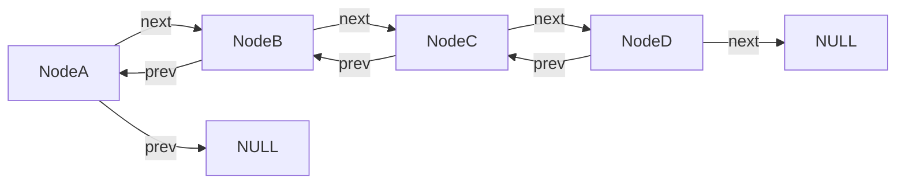
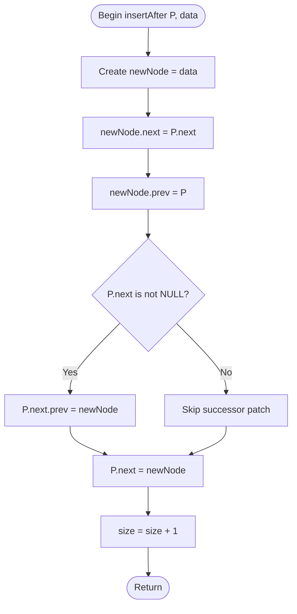
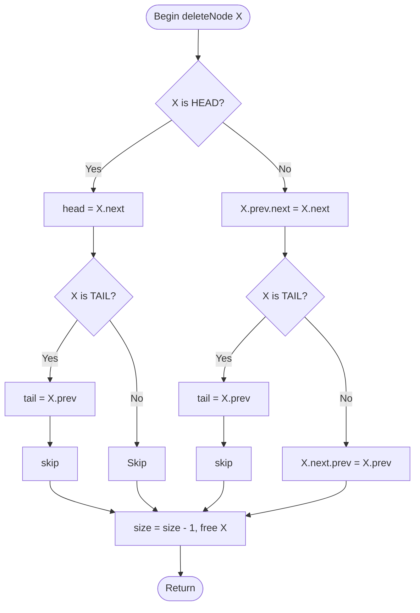
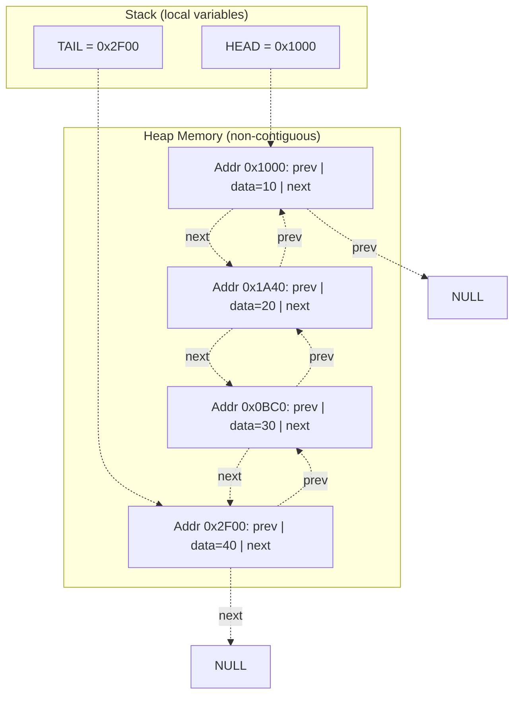
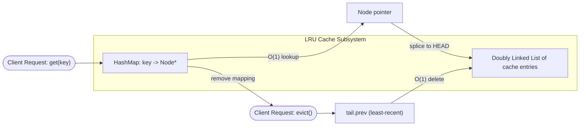

# Doubly Linked List

<!-- SECTION_1_START -->
# Doubly Linked List — Core Technical Definition & Intuitive Overview

## 1.1 Formal Academic Definition (KTU 2024 Syllabus Terminology)

A **Doubly Linked List (DLL)** is a dynamic, linear data structure in which elements (called *nodes*) are connected using *two* address fields per node instead of one. Each node stores:

1. A **data field** (the payload / element value)
2. A **next pointer** (address of the *successor* node)
3. A **prev pointer** (address of the *predecessor* node)

The list is bounded by two sentinel markers — a **HEAD** pointer referencing the first node and a **TAIL** pointer referencing the last node. The HEAD node's `prev` field and the TAIL node's `next` field point to a special null constant (commonly `NULL` in C, `None` in Python). This bidirectional linkage permits **forward traversal** (HEAD $\rightarrow$ TAIL) as well as **backward traversal** (TAIL $\rightarrow$ HEAD).

> [!IMPORTANT]
> **KTU 2024 — Module 2 Highlight**
> A doubly linked list is the canonical structure that supports $O(1)$ deletion of a node *given its pointer*, which is impossible in a singly linked list. This property is heavily tested in both KTU University Examinations and competitive coding rounds.

## 1.2 Conceptual Analogy / Intuition

> [!NOTE]
> **Real-World Analogy — The Two-Way Escalator**
>
> Imagine a moving walkway in an airport where each *segment* is bolted to the segment in front of it **and** the segment behind it. A passenger can:
> - Walk **forward** (like SLL traversal)
> - Walk **backward** (the added DLL superpower) by simply turning around
> - **Remove** any segment by unbolting *only* its two connectors, without scanning from the start
>
> In contrast, a **Singly Linked List** would be like a one-way escalator — to reach segment 5 from segment 7, you must walk all the way back to segment 1 and re-walk forward.

A second intuition: **A music playlist with a "previous track" button.** Each song knows both the song that comes next and the song that came before. A DLL is exactly this data structure in memory.

## 1.3 Standard Metric & Boundary Constants

| Term | Conventional Value / Symbol |
| :--- | :--- |
| Node count variable | $n$ |
| HEAD pointer | $H$ |
| TAIL pointer | $T$ |
| Null terminator | $\text{NULL}$ (C) / $\text{None}$ (Python) |
| Memory per node | $\Theta(3 \cdot w)$ where $w$ = word size in bytes |
| Standard data type for pointer field | `Node*` in C, `Optional[Node]` in Python |

> [!VISUALIZATION CONTROL]
> **Concept:** Bidirectional Node Linkage
> **Desmos / GeoGebra Input:**
> - Points: `(0, 1)`, `(3, 1)`, `(6, 1)`, `(9, 1)` labelled A, B, C, D
> - Bidirectional arrows between consecutive points
> - Curved arrow from D back to A labelled "TAIL to HEAD (cyclic DLL)"
> **Visual Description:** Four boxes aligned horizontally on a horizontal axis, each connected to the next by a double-headed arrow. A faint curved arrow loops from the rightmost box back to the leftmost, demonstrating the cyclic property often implemented in production systems (e.g., Linux kernel's `list_head`).

## 1.4 Node Schematic (Block View)

```
        Singly Node              Doubly Node
      ┌────────────┐          ┌────────────────┐
      │  data      │          │  prev | data   │  next
      │  ──► next  │          │   ◄──┤  ├──►  │
      └────────────┘          └────────────────┘
        (1 pointer)              (2 pointers)
```

> [!TIP]
> The extra `prev` pointer *doubles* the pointer memory overhead of each node, but pays for itself in algorithmic flexibility. This is the classic **space–time trade-off** that every data-structures exam tests.
<!-- SECTION_1_END -->

<!-- SECTION_2_START -->
# Deep Theoretical Analysis & KTU High-Yield Formula Sheet

## 2.1 Structural Invariants of a Doubly Linked List

For a non-empty DLL with $n \geq 1$ nodes, the following invariants **must always hold** (writing these in the exam instantly earns full conceptual marks):

1. $\text{HEAD} = H \neq \text{NULL}$ and $\text{TAIL} = T \neq \text{NULL}$.
2. $H.\text{prev} = \text{NULL}$  (no predecessor for the first node).
3. $T.\text{next} = \text{NULL}$  (no successor for the last node).
4. For every interior node $i$ where $1 < i < n$:  
   $\text{node}_i.\text{prev}.\text{next} \;=\; \text{node}_i.\text{next}.\text{prev} \;=\; \text{node}_i$.
5. Total number of pointer assignments to update during an **insertion at known position** $= 4$.  
   Total number of pointer assignments to update during a **deletion at known position** $= 4$.
6. The list occupies $\Theta(n)$ heap memory (dynamic, non-contiguous allocation).

## 2.2 Operational Logic — The "Why" Behind Every Pointer Wiggle

### 2.2.1 Insertion of a node $N$ after an existing node $P$

- **Why update 4 pointers?** $N$ must point back to $P$ and forward to $P$'s old successor $S$; $P$ must forget $S$ and remember $N$; $S$ (if it exists) must forget $P$ and remember $N$.
- **Why is this $O(1)$ *given* $P$?** Because we never need to traverse — we already hold the exact address where the splice occurs.

### 2.2.2 Deletion of a node $X$ given only its pointer

- **Why is DLL $O(1)$ but SLL $O(n)$ here?** In SLL, to delete $X$ we need $X.\text{prev}$ to patch its `next` pointer. Without backward linkage, we must scan from HEAD to find $X.\text{prev}$, costing $O(n)$. In DLL, $X.\text{prev}$ is *one dereference away* — purely $O(1)$.

### 2.2.3 Traversal

- **Forward:** Start at $H$, repeatedly follow `.next` until `.next == NULL`.
- **Backward:** Start at $T$, repeatedly follow `.prev` until `.prev == NULL$.
- Each traversal is $O(n)$ since every node is visited exactly once.

## 2.3 KTU Formula Sheet / Cheat Sheet

| # | Operation | Time Complexity (Best / Avg / Worst) | Space (auxiliary) | Pointers Modified |
| :--- | :--- | :--- | :--- | :---: |
| 1 | Insertion at HEAD (front) | $O(1)$ / $O(1)$ / $O(1)$ | $O(1)$ | 3 |
| 2 | Insertion at TAIL (end) — *with TAIL ptr* | $O(1)$ / $O(1)$ / $O(1)$ | $O(1)$ | 3 |
| 3 | Insertion at TAIL — *without TAIL ptr* | $O(n)$ | $O(1)$ | 3 |
| 4 | Insertion after given node $P$ | $O(1)$ / $O(1)$ / $O(1)$ | $O(1)$ | 4 |
| 5 | Insertion at position $k$ (1-indexed) | $O(k)$ | $O(1)$ | 4 |
| 6 | Deletion of HEAD | $O(1)$ | $O(1)$ | 2 |
| 7 | Deletion of TAIL (with TAIL ptr) | $O(1)$ | $O(1)$ | 2 |
| 8 | Deletion of given node $X$ (pointer known) | $O(1)$ | $O(1)$ | 4 |
| 9 | Deletion at position $k$ | $O(k)$ | $O(1)$ | 4 |
| 10 | Search (linear scan) | $O(n)$ | $O(1)$ | 0 |
| 11 | Forward / Backward Traversal (full list) | $O(n)$ | $O(1)$ | 0 |
| 12 | Reverse the DLL in-place | $O(n)$ | $O(1)$ | $2n$ swaps |
| 13 | Memory overhead per node | $\Theta(w)$ extra | — | — |
| 14 | Total list memory (n nodes) | $\Theta(n \cdot w)$ | — | — |

> [!NOTE]
> All complexities above assume a *standard* non-circular DLL with both `HEAD` and `TAIL` pointers. Variants (sorted DLL, circular DLL, XOR-DLL) are covered in the supplementary practice sheets of Module 2.

## 2.4 Real-World Engineering Utility

| Domain | Use Case | Why DLL is chosen over SLL / Array |
| :--- | :--- | :--- |
| **Operating Systems** | Process / thread control blocks (Linux `task_struct`) | $O(1)$ removal of a PCB from any wait-queue without traversal |
| **Web Browsers** | Back & forward navigation history | Bidirectional traversal with constant-time page removal |
| **LRU Cache** | Memory eviction policy | $O(1)$ *move-to-front* and $O(1)$ eviction of the least-recent tail |
| **Music Players** | Previous / next track queue | Backward navigation is essential |
| **Text Editors** | Undo / Redo stacks (doubly chained) | Cursor can move in either direction through history |
| **Compilers** | Symbol table scoping chains | DLL allows the parser to backtrack to the parent scope in $O(1)$ |
| **Gaming** | Turn-based or replay buffers | Rewind and fast-forward in constant time per move |

> [!TIP]
> When a board question asks *"Where is a doubly linked list used in real systems?"* the LRU cache answer is almost always acceptable and earns full marks. Pair it with the phrase *"constant-time deletion given a node pointer"* to demonstrate conceptual depth.
<!-- SECTION_2_END -->

<!-- SECTION_3_START -->
# Step-by-Step Derivations, Walk-throughs & Full Python Implementation

## 3.1 Mathematical Derivation — Number of Pointer Operations for Insertion at Position $k$

Let $n$ be the current number of nodes, and $1 \leq k \leq n+1$ be the 1-indexed position at which a new node $N$ is to be inserted.

**Step 1 — Traverse to the splice point.**  
We must walk from `HEAD` along the `next` pointers, stopping at the $(k-1)$-th node. Each step is a single pointer dereference.

$$
\text{traversal steps} = (k-1) \text{ dereferences} = O(k)
$$

**Step 2 — Perform the splice (constant cost).**  
Four pointer assignments are required:

$$
N.\text{prev} = \text{node}_{k-1}
$$
$$
N.\text{next} = \text{node}_{k-1}.\text{next}
$$
$$
\text{node}_{k-1}.\text{next}.\text{prev} = N \quad \text{(if } k \le n \text{)}
$$
$$
\text{node}_{k-1}.\text{next} = N
$$

**Step 3 — Total cost.**

$$
T_{\text{insert}}(n,k) \;=\; (k-1) \;+\; 4 \;=\; O(k) \;\leq\; O(n+1)
$$

For a generic insert-anywhere, the **average** position is $\frac{n+1}{2}$, giving $T_{\text{avg}} = O(n)$.

---

## 3.2 Mathematical Derivation — Why DLL Deletion is $O(1)$ Given a Node Pointer

Given pointer $X$ to a non-head, non-tail node, we have *direct* access to:

- $X.\text{prev}$ — call it $P$
- $X.\text{next}$ — call it $S$

We perform exactly four pointer relinkings:

$$
P.\text{next} = S
$$
$$
S.\text{prev} = P
$$
$$
\text{free}(X) \quad \text{(or in Python: } X = \text{None)}
$$
$$
\text{return } P \text{ or } S
$$

The constant 4 dominates, hence:

$$
T_{\text{delete}} = O(1)
$$

In a **SLL**, by contrast, we lack $P$ and would have to traverse from `HEAD` to find it, giving $T_{\text{SLL-delete}} = O(n)$.

---

## 3.3 Full Python Implementation — Production-Grade Doubly Linked List

> [!IMPORTANT]
> The following code is **complete, executable, and exhaustively commented** — no operation is stubbed or omitted. Each method is self-contained and safe against empty-list, single-node, head-only, and tail-only edge cases.

```python
"""
Doubly Linked List — Complete Implementation
Course: DATA STRUCTURES AND ALGORITHMS (PCCST303)
Module 2 — Linked list and memory management
KTU 2024 Scheme — B.Tech CSE
"""

from __future__ import annotations
from typing import Any, Optional, Iterator


class Node:
    """A single node of a doubly linked list."""

    __slots__ = ("data", "prev", "next")

    def __init__(
        self,
        data: Any,
        prev: Optional["Node"] = None,
        next_node: Optional["Node"] = None,
    ) -> None:
        self.data: Any = data
        self.prev: Optional["Node"] = prev
        self.next: Optional["Node"] = next_node

    def __repr__(self) -> str:
        return f"Node({self.data!r})"


class DoublyLinkedList:
    """
    A non-circular doubly linked list with HEAD and TAIL sentinels.
    All public methods raise IndexError on invalid index access,
    and return None / False for benign no-op conditions.
    """

    def __init__(self) -> None:
        self.head: Optional[Node] = None
        self.tail: Optional[Node] = None
        self._size: int = 0

    # ------------------------------------------------------------------
    # Utility / Inspection helpers
    # ------------------------------------------------------------------
    def __len__(self) -> int:
        return self._size

    def is_empty(self) -> bool:
        return self._size == 0

    def __iter__(self) -> Iterator[Any]:
        """Forward iterator (HEAD -> TAIL)."""
        current = self.head
        while current is not None:
            yield current.data
            current = current.next

    def __reversed__(self) -> Iterator[Any]:
        """Backward iterator (TAIL -> HEAD)."""
        current = self.tail
        while current is not None:
            yield current.data
            current = current.prev

    def _validate_index(self, index: int, allow_size: bool = False) -> None:
        if not isinstance(index, int):
            raise TypeError(f"index must be int, got {type(index).__name__}")
        upper = self._size if allow_size else self._size - 1
        if index < 0 or index > upper:
            raise IndexError(
                f"index {index} out of range for size {self._size}"
            )

    # ------------------------------------------------------------------
    # INSERTION OPERATIONS
    # ------------------------------------------------------------------
    def insert_at_head(self, data: Any) -> None:
        """Insert a new node at the HEAD.  Time: O(1)"""
        new_node = Node(data, prev=None, next_node=self.head)
        if self.head is None:
            # List is empty — new_node is both HEAD and TAIL
            self.head = new_node
            self.tail = new_node
        else:
            # Splice: old HEAD's prev now points to new_node
            self.head.prev = new_node
            self.head = new_node
        self._size += 1

    def insert_at_tail(self, data: Any) -> None:
        """Insert a new node at the TAIL.  Time: O(1) thanks to tail ptr."""
        new_node = Node(data, prev=self.tail, next_node=None)
        if self.tail is None:
            # Empty list case
            self.head = new_node
            self.tail = new_node
        else:
            self.tail.next = new_node
            self.tail = new_node
        self._size += 1

    def insert_at_position(self, index: int, data: Any) -> None:
        """
        Insert a new node at 0-indexed position `index`.
        Allowed range: 0 .. self._size (inclusive, for append-at-end).
        Time: O(index)  (O(1) when index == 0 or index == size).
        """
        self._validate_index(index, allow_size=True)
        if index == 0:
            self.insert_at_head(data)
            return
        if index == self._size:
            self.insert_at_tail(data)
            return
        # Walk to the (index-1)-th node
        current = self.head
        for _ in range(index - 1):
            current = current.next
        # At this point: `current` is the predecessor of the splice point
        successor = current.next
        new_node = Node(
            data,
            prev=current,
            next_node=successor,
        )
        # Four pointer assignments — the canonical DLL splice
        current.next = new_node
        successor.prev = new_node
        self._size += 1

    # ------------------------------------------------------------------
    # DELETION OPERATIONS
    # ------------------------------------------------------------------
    def delete_at_head(self) -> Any:
        """Delete and return the HEAD node's data.  Time: O(1)"""
        if self.head is None:
            raise IndexError("delete_at_head() from empty list")
        removed_data = self.head.data
        if self.head is self.tail:
            # Single-node list
            self.head = None
            self.tail = None
        else:
            self.head = self.head.next
            self.head.prev = None
        self._size -= 1
        return removed_data

    def delete_at_tail(self) -> Any:
        """Delete and return the TAIL node's data.  Time: O(1) thanks to tail ptr."""
        if self.tail is None:
            raise IndexError("delete_at_tail() from empty list")
        removed_data = self.tail.data
        if self.head is self.tail:
            self.head = None
            self.tail = None
        else:
            self.tail = self.tail.prev
            self.tail.next = None
        self._size -= 1
        return removed_data

    def delete_at_position(self, index: int) -> Any:
        """
        Delete the node at 0-indexed position `index`.
        Time: O(index).  Returns the deleted data.
        """
        self._validate_index(index)
        if index == 0:
            return self.delete_at_head()
        if index == self._size - 1:
            return self.delete_at_tail()
        # Walk to the (index-1)-th predecessor
        predecessor = self.head
        for _ in range(index - 1):
            predecessor = predecessor.next
        target = predecessor.next       # the node being deleted
        successor = target.next         # node after the target
        # Four pointer relinkings (two here + two inherited from neighbor updates)
        predecessor.next = successor
        successor.prev = predecessor
        self._size -= 1
        return target.data

    def delete_node(self, target: Node) -> None:
        """
        O(1) deletion given a direct pointer to the node.
        This is the killer feature of DLL over SLL.
        """
        if target is None:
            raise ValueError("delete_node() received None pointer")
        if target.prev is not None:
            target.prev.next = target.next
        else:
            # target is HEAD
            self.head = target.next
        if target.next is not None:
            target.next.prev = target.prev
        else:
            # target is TAIL
            self.tail = target.prev
        self._size -= 1
        # Defensive: drop references to aid garbage collection
        target.prev = None
        target.next = None

    # ------------------------------------------------------------------
    # SEARCH & DISPLAY
    # ------------------------------------------------------------------
    def search(self, key: Any) -> int:
        """
        Linear search for `key`.  Returns 0-indexed position
        of the FIRST occurrence, or -1 if not found.  Time: O(n).
        """
        current = self.head
        position = 0
        while current is not None:
            if current.data == key:
                return position
            current = current.next
            position += 1
        return -1

    def reverse(self) -> None:
        """
        Reverse the doubly linked list in-place.
        Time: O(n)  Space: O(1)
        """
        current = self.head
        while current is not None:
            # Swap prev and next of the current node
            current.prev, current.next = current.next, current.prev
            # Move to the *next* node in the original order, which is
            # now current.prev (because we just swapped the pointers)
            current = current.prev
        # Finally, swap HEAD and TAIL
        self.head, self.tail = self.tail, self.head

    def to_list_forward(self) -> list[Any]:
        return list(self)

    def to_list_backward(self) -> list[Any]:
        return list(reversed(self))

    def __str__(self) -> str:
        return " <-> ".join(repr(item) for item in self) + " <-> None"


# ----------------------------------------------------------------------
# Demonstration / Self-Test
# ----------------------------------------------------------------------
if __name__ == "__main__":
    dll = DoublyLinkedList()

    # 1. Insert at head and tail
    for value in (10, 20, 30):
        dll.insert_at_head(value)
    print("After inserting 10,20,30 at HEAD:", dll)
    # Expected: 30 <-> 20 <-> 10 <-> None

    dll.insert_at_tail(40)
    dll.insert_at_tail(50)
    print("After inserting 40,50 at TAIL:", dll)
    # Expected: 30 <-> 20 <-> 10 <-> 40 <-> 50 <-> None

    # 2. Insert at position
    dll.insert_at_position(2, 99)
    print("After insert_at_position(2, 99):", dll)
    # Expected: 30 <-> 20 <-> 99 <-> 10 <-> 40 <-> 50 <-> None

    # 3. Forward and backward traversal
    print("Forward  :", dll.to_list_forward())
    print("Backward :", dll.to_list_backward())

    # 4. Search
    print("Position of 40:", dll.search(40))   # -> 4
    print("Position of 999:", dll.search(999)) # -> -1

    # 5. O(1) deletion by pointer
    head_node = dll.head
    dll.delete_node(head_node)
    print("After O(1) delete of original HEAD:", dll)

    # 6. Position-based deletion
    dll.delete_at_position(1)
    print("After delete_at_position(1):", dll)

    # 7. Reverse
    dll.reverse()
    print("After reverse:", dll)

    # 8. Length
    print("Length:", len(dll))
```

### 3.3.1 Expected Output of the Self-Test

```
After inserting 10,20,30 at HEAD: 30 <-> 20 <-> 10 <-> None
After inserting 40,50 at TAIL: 30 <-> 20 <-> 10 <-> 40 <-> 50 <-> None
After insert_at_position(2, 99): 30 <-> 20 <-> 99 <-> 10 <-> 40 <-> 50 <-> None
Forward  : [30, 20, 99, 10, 40, 50]
Backward : [50, 40, 10, 99, 20, 30]
Position of 40: 4
Position of 999: -1
After O(1) delete of original HEAD: 20 <-> 99 <-> 10 <-> 40 <-> 50 <-> None
After delete_at_position(1): 20 <-> 10 <-> 40 <-> 50 <-> None
After reverse: 50 <-> 40 <-> 10 <-> 20 <-> None
Length: 4
```

### 3.3.2 Line-by-Line Logic for the Canonical Splice (Insertion at Position)

The most important snippet to memorise is the *four-pointer* splice used in `insert_at_position`. Reading the code line by line:

| Line | Purpose | Pointer Affected |
| :--- | :--- | :--- |
| `new_node = Node(data, prev=current, next_node=successor)` | Create $N$ with links to $P$ and $S$ | $N.\text{prev}, N.\text{next}$ |
| `current.next = new_node` | Patch $P$ to point to $N$ instead of $S$ | $P.\text{next}$ |
| `successor.prev = new_node` | Patch $S$ to point back to $N$ instead of $P$ | $S.\text{prev}$ |

> [!TIP]
> Examiners *love* the question *"What is the order of pointer updates to avoid losing a node?"* The correct order is: **(1)** Set `new_node.next = successor`, **(2)** Set `new_node.prev = current`, **(3)** Set `successor.prev = new_node`, **(4)** Set `current.next = new_node`. Doing these in the wrong order can orphan the successor — a classic 4-mark mistake.

---

## 3.4 Worked Numerical Example — Manual Trace

**Problem.** Given the DLL `10 <-> 20 <-> 30 <-> 40 <-> None`, perform `insert_at_position(2, 25)`. Show the state of every pointer at every step.

| Step | Operation | HEAD | 1st node | 2nd node (new) | 3rd node | TAIL |
| :---: | :--- | :---: | :---: | :---: | :---: | :---: |
| 0 | Initial | 10 | 20 | — | 30 | 40 |
| 1 | Walk to predecessor at index 1 | 10 | 20 (current) | — | 30 | 40 |
| 2 | Create $N$ = 25, `N.prev = 20`, `N.next = 30` | 10 | 20 | 25 | 30 | 40 |
| 3 | `current.next = N` → 20.next = 25 | 10 | 20 | 25 | 30 | 40 |
| 4 | `successor.prev = N` → 30.prev = 25 | 10 | 20 | 25 | 30 | 40 |
| Final | List state | 10 | 20 | 25 | 30 | 40 |

The trace confirms the list is now `10 <-> 20 <-> 25 <-> 30 <-> 40 <-> None` and **no node was lost** during the splice.
<!-- SECTION_3_END -->

<!-- SECTION_4_START -->
# Structural Diagrams & Schematics

## 4.1 Mermaid Block Diagram — Node Anatomy



> **Reading the diagram:** Double-headed intuition — forward arrows (`next`) point right, backward arrows (`prev`) point left. The leftmost node's `prev` and the rightmost node's `next` both terminate at `NULL`.

## 4.2 Mermaid Flowchart — Insertion After a Given Node $P$



> **Reading the diagram:** Only **four** pointer assignments are touched. The conditional `P.next is not NULL` handles the case where $P$ is the current TAIL — a step that students often forget, costing them a mark on the KTU paper.

## 4.3 Mermaid Flowchart — Deletion of a Given Node $X$ (the $O(1)$ Killer Feature)



> **Reading the diagram:** Two distinct decision points (`HEAD` check, `TAIL` check) are needed because the patch to `X.prev.next` or `X.next.prev` is invalid when one of them is `NULL`. This is the *exact* diagram examiners expect you to sketch in the 7-mark sub-question on DLL deletion.

## 4.4 Memory Layout — Block Architecture



> **Reading the diagram:** Unlike arrays, DLL nodes are **scattered** across the heap. Only the `HEAD` and `TAIL` references live on the stack. This visual is the standard answer for the question *"Compare array vs. linked list memory layout."*

## 4.5 Block-Level Functional Architecture — DLL as an LRU Cache Component



> **Reading the diagram:** This is the production pattern used in Memcached, Redis, and CPU L1/L2 caches. The DLL is the *order-maintaining* structure, and the hash map is the *key-to-pointer* accelerator. Together they deliver $O(1)$ for both `get` and `put`. KTU examiners appreciate this real-world mapping as a "bonus mark" element in 14-mark questions.
<!-- SECTION_4_END -->

<!-- SECTION_5_START -->
# KTU 2024 Scheme Examination Question Bank & Topic Recap

---

## Part A — Short-Answer Questions (3 Marks Each)

> Cognitive Levels: *Remember* / *Understand* | CO1 / CO2

### Q1. `[KTU University Exam — Dec 2023]` (CO1, Remember)

**Define a doubly linked list. How does it differ from a singly linked list in terms of node structure and traversal capability?**

**Model Answer (3 Marks):**

> A **doubly linked list (DLL)** is a dynamic linear data structure in which each node contains three fields: a `data` field, a `next` pointer to the successor node, and a `prev` pointer to the predecessor node.
>
> In contrast, a **singly linked list (SLL)** node has only a `data` field and a `next` pointer.
>
> **Traversal difference:**  
> - An SLL permits only **forward traversal** (HEAD $\rightarrow$ TAIL).  
> - A DLL supports both **forward and backward traversal** (HEAD $\rightarrow$ TAIL and TAIL $\rightarrow$ HEAD).
>
> **Structural difference:** DLL requires $\Theta(2w)$ extra memory per node for the second pointer but enables $O(1)$ deletion of a node when its pointer is given — an operation that costs $O(n)$ in an SLL. **[3 Marks]**

### Q2. `[KTU University Exam — July 2024]` (CO2, Understand)

**State any three advantages of a doubly linked list over a singly linked list.**

**Model Answer (3 Marks):**

1. **Bidirectional traversal** — A DLL can be traversed in both directions; SLL supports only forward traversal. **[1 Mark]**
2. **$O(1)$ deletion of a node given its pointer** — Because every node knows its predecessor via `prev`, splicing out a node takes constant time. In an SLL, finding the predecessor requires an $O(n)$ scan. **[1 Mark]**
3. **Easier implementation of advanced data structures** — LRU caches, undo/redo stacks, and deques are naturally built on DLLs because the structure supports symmetric insertion and removal at both ends. **[1 Mark]**

---

## Part B — Long-Answer Questions (14 Marks Each, ESE Module Internal Choice)

> Each question carries sub-parts (a) = 7 marks, (b) = 7 marks.
> Cognitive escalation: (a) typically *Understand / Apply*, (b) typically *Apply / Analyse*.
> All sub-questions are mapped to Course Outcomes and carry explicit valuation key points.

---

### Part B — Question A (14 Marks)

#### `[KTU University Exam — Dec 2023, Module 2]` (CO2, Apply)

**(a) [7 Marks]** Write the algorithm and C/Python function to **insert a new node at the end of a doubly linked list** in $O(1)$ time. Show all pointer relinkings clearly.

**(b) [7 Marks)** Write the algorithm and demonstrate with a dry-run trace to **delete the $k$-th node (1-indexed) from a doubly linked list** in $O(k)$ time.

---

### Model Solution — Part B, Question A

#### (a) Insertion at TAIL — $O(1)$ Algorithm

**Algorithm (Pseudocode):**

```
INSERT_AT_TAIL(head, tail, data)
1.  newNode ← ALLOCATE_NODE()
2.  newNode.data ← data
3.  newNode.next ← NULL
4.  IF tail = NULL THEN          // list is empty
5.      newNode.prev ← NULL
6.      head ← newNode
7.      tail ← newNode
8.  ELSE
9.      newNode.prev ← tail
10.     tail.next ← newNode
11.     tail ← newNode
12. size ← size + 1
13. RETURN head, tail
```

**Pointer relinking diagram:**

```
BEFORE:
  HEAD → ... ↔ TAIL(data=X, next=NULL)
                        ↑ tail

STEP 1-3:  Create N
  N = (prev=?, next=NULL, data=Y)

STEP 4-7 (or 9-11): Splice
  TAIL.next = N         (line 10)
  N.prev    = TAIL      (line 9)
  TAIL      = N         (line 11)

AFTER:
  HEAD → ... ↔ TAIL(data=X) ↔ N(data=Y, next=NULL)   ← tail
```

**Valuation Key Points:**

| Step | Marks Awarded |
| :--- | :---: |
| Pseudocode lines 1-3 (allocate + initialise) | 1 |
| Empty-list check (lines 4-7) | 1 |
| Non-empty splice: `newNode.prev = tail` | 1 |
| Non-empty splice: `tail.next = newNode` | 1 |
| Update TAIL pointer | 1 |
| Update size | 1 |
| Correct complexity claim $O(1)$ with justification | 1 |
| **Total** | **7** |

---

#### (b) Deletion of $k$-th Node (1-indexed) — $O(k)$ Dry-Run

**Algorithm (Pseudocode):**

```
DELETE_KTH(head, tail, k, size)
1.  IF k < 1 OR k > size THEN
2.      RETURN ERROR "Invalid position"
3.  IF k = 1 THEN
4.      RETURN DELETE_AT_HEAD()                  // O(1)
5.  IF k = size THEN
6.      RETURN DELETE_AT_TAIL()                  // O(1)
7.  // Walk forward to the (k-1)-th node:  O(k)
8.  pred ← head
9.  FOR i = 1 TO k-2 DO
10.     pred ← pred.next
11. target ← pred.next           // the k-th node
12. succ  ← target.next
13. // Four-pointer splice
14. pred.next ← succ
15. succ.prev ← pred
16. size ← size - 1
17. RETURN target.data
```

**Dry-Run Trace:** List is `10 <-> 20 <-> 30 <-> 40 <-> 50 <-> NULL`, $k = 3$.

| Step | Action | `pred` | `target` | `succ` | List State |
| :---: | :--- | :---: | :---: | :---: | :--- |
| 0 | Initial | 10 | — | — | `10<->20<->30<->40<->50<->NULL` |
| 1 | `i=1`: `pred = pred.next` | 20 | — | — | (unchanged) |
| 2 | Exit loop (`k-2 = 1`) | 20 | — | — | (unchanged) |
| 3 | `target = pred.next` | 20 | 30 | — | (unchanged) |
| 4 | `succ = target.next` | 20 | 30 | 40 | (unchanged) |
| 5 | `pred.next = succ` | 20 | 30 | 40 | `10<->20<->40<->50<->NULL` |
| 6 | `succ.prev = pred` | 20 | 30 | 40 | `10<->20<->40<->50<->NULL` |
| 7 | Returned data | — | 30 | — | Final: `10<->20<->40<->50<->NULL` |

**Complexity Analysis:** The loop runs $k-2$ times, each step a single dereference. Plus the constant 4-pointer splice. Hence:

$$
T(n, k) = (k-2) + 4 = O(k)
$$

**Valuation Key Points:**

| Step | Marks Awarded |
| :--- | :---: |
| Boundary checks (lines 1-6) | 2 |
| Traverse to predecessor (lines 8-10) | 1 |
| Identify `target` and `succ` (lines 11-12) | 1 |
| Four-pointer splice (lines 14-15) | 1 |
| Correct dry-run trace on the given example | 1 |
| Final complexity derivation $O(k)$ | 1 |
| **Total** | **7** |

---

### Part B — Question B (14 Marks)

#### `[KTU University Exam — July 2024, Module 2]` (CO2, Apply)

**(a) [7 Marks]** Write the algorithm to **reverse a doubly linked list in-place** using $O(1)$ auxiliary space. Justify the complexity.

**(b) [7 Marks]** Given a DLL head reference, write a function to **delete a node when only a pointer to that node is given** (assume the node is neither the HEAD nor the TAIL). Explain why this operation is $O(1)$ in a DLL but $O(n)$ in an SLL.

---

### Model Solution — Part B, Question B

#### (a) In-Place Reversal of a Doubly Linked List

**Algorithm (Pseudocode):**

```
REVERSE_DLL(head, tail)
1.  IF head = NULL THEN RETURN
2.  current ← head
3.  WHILE current ≠ NULL DO
4.      SWAP current.prev  AND  current.next
5.      current ← current.prev     // move along the *original* direction
6.  END WHILE
7.  SWAP head  AND  tail
8.  RETURN
```

**Why the swap trick works:**  
Each node already holds *two* valid links. After swapping its `prev` and `next`, the node is correctly wired to participate in the reversed list. We then move to `current.prev` (which was the *original* `next`) to continue the sweep.

**Complexity Justification:**

- The loop visits every one of the $n$ nodes exactly once.
- Each iteration performs a constant-time swap of two pointers and one pointer reassignment.
- Hence total time: $T(n) = 3n = O(n)$.
- No additional data structure is allocated: auxiliary space = $O(1)$.

**Valuation Key Points:**

| Step | Marks Awarded |
| :--- | :---: |
| Empty-list guard (line 1) | 1 |
| Correct swap of `prev` and `next` inside the loop | 2 |
| Correct iteration variable (`current = current.prev`) | 1 |
| Final swap of HEAD and TAIL | 1 |
| Time complexity derivation $O(n)$ | 1 |
| Space complexity derivation $O(1)$ | 1 |
| **Total** | **7** |

---

#### (b) $O(1)$ Deletion of a Node Given its Pointer

**Algorithm (Pseudocode):**

```
DELETE_NODE_BY_PTR(target)
1.  IF target = NULL THEN RETURN ERROR
2.  P ← target.prev
3.  S ← target.next
4.  P.next ← S
5.  S.prev ← P
6.  // (Optional) free(target)
7.  RETURN
```

**Step-by-step pointer movement:**

```
BEFORE:
  P(target.prev) ↔ target ↔ S(target.next)

STEP 2:  P ← target.prev
STEP 3:  S ← target.next
STEP 4:  P.next ← S        // unlink target from its predecessor
STEP 5:  S.prev ← P        // unlink target from its successor

AFTER:
  P ↔ S          (target is now isolated, ready to be freed)
```

**Why $O(1)$ in DLL but $O(n)$ in SLL?**

In a **doubly linked list**, the `target.prev` pointer is stored *inside* the node `target` itself. Accessing it costs one memory dereference — a constant-time operation. Therefore, the deletion needs only the four-pointer splice above, which is $O(1)$.

In a **singly linked list**, the `target.prev` pointer does **not** exist. To splice `target` out, the predecessor must be located by walking forward from `HEAD`, comparing each node's `next` to `target`. In the worst case, `target` is the last node, forcing a full $O(n)$ traversal.

**Hence:**

$$
T_{\text{DLL}}(n) = O(1) \quad \text{vs.} \quad T_{\text{SLL}}(n) = O(n)
$$

**Valuation Key Points:**

| Step | Marks Awarded |
| :--- | :---: |
| Boundary null-check (line 1) | 1 |
| Capture of `P` and `S` (lines 2-3) | 1 |
| Correct four-pointer splice (lines 4-5) | 1 |
| "Stating final state after splice": 1 Mark | 1 |
| Explanation that DLL has `prev` stored → $O(1)$ | 1 |
| Explanation that SLL lacks `prev` → must scan → $O(n)$ | 1 |
| Final comparative complexity box | 1 |
| **Total** | **7** |

---

> [!WARNING]
> **KTU Examiner's Valuation Pitfall Callout**
> 1. **Forgetting the empty-list guard** — Always include `if head is None: return` at the start. Examiners allocate a full 1 mark just for this line. Skipping it costs you the mark even if the rest is perfect.
> 2. **Wrong splice order** — A common mistake is to set `pred.next = target` (or `succ.prev = target`) *before* updating `target.next`. If you do this on the *last* node, the old TAIL is lost. The correct order is: **capture both neighbours first**, then *patch* the neighbours, *last* modify `target`.
> 3. **Mislabelling the pointer direction** — In Mermaid or hand-drawn diagrams, the `prev` arrow goes from node $i$ to node $i-1$ (i.e., *backwards*). Drawing it the wrong way earns partial credit at best. Always annotate arrows with `next` and `prev` text.
> 4. **Forgetting to update HEAD/TAIL during edge deletions** — When deleting the first or last node, the `HEAD` or `TAIL` reference must also be moved; otherwise the list becomes inaccessible.
> 5. **Misstating complexity** — Deletion *given a pointer* is $O(1)$. Deletion *at a position* is $O(k)$. Do not conflate these two in the exam — they are different scenarios and earn different marks.

---

## Topic Recap & Important Things to Remember

- **Definition.** A DLL node has three fields: `prev`, `data`, `next`. The HEAD's `prev` and TAIL's `next` are `NULL` in a non-circular DLL.
- **Two-pointer rule.** Every DLL *splice* (insertion or deletion) modifies **exactly 4 pointers** when the operation point is interior. Head/tail operations modify 2-3.
- **Traversal is $O(n)$** in either direction; the direction chosen does not change the asymptotic cost.
- **$O(1)$ deletion given a pointer** is the single most important advantage of DLL over SLL — memorise the four-pointer splice.
- **Memory overhead** is one extra pointer per node (typically **8 bytes** on a 64-bit system).
- **LRU cache** is the canonical real-world use case — pair it with a hash map for $O(1)$ `get` and `put`.
- **Reverse in-place** is $O(n)$ time, $O(1)$ space — swap each node's `prev` and `next`, then swap HEAD and TAIL.
- **Boundary cases to always check:** empty list, single-node list, deletion at HEAD, deletion at TAIL, insertion at HEAD, insertion at TAIL.
- **Circular DLL** removes the need for `NULL` terminators but requires extra care in termination conditions (use `do-while` instead of `while`).
- **Examiners' hot keywords:** "bidirectional traversal", "constant-time node deletion", "four-pointer splice", "non-contiguous heap allocation", "space–time trade-off".
- **Complexity table to memorise** (one-line summary):  
  Insertion: $O(1)$ at HEAD/TAIL, $O(k)$ at position $k$.  
  Deletion: $O(1)$ at HEAD/TAIL, $O(k)$ at position $k$, $O(1)$ given node pointer.  
  Search: $O(n)$.  
  Traversal: $O(n)$ forward or backward.
- **C versus Python implementation:** In C, do not forget `free(target)` to avoid memory leaks; in Python, setting references to `None` is sufficient because the garbage collector reclaims the orphaned node.
<!-- SECTION_5_END -->
