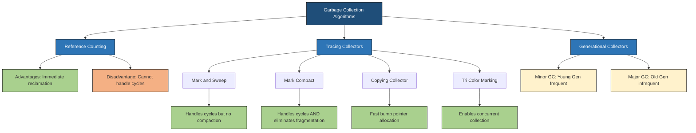
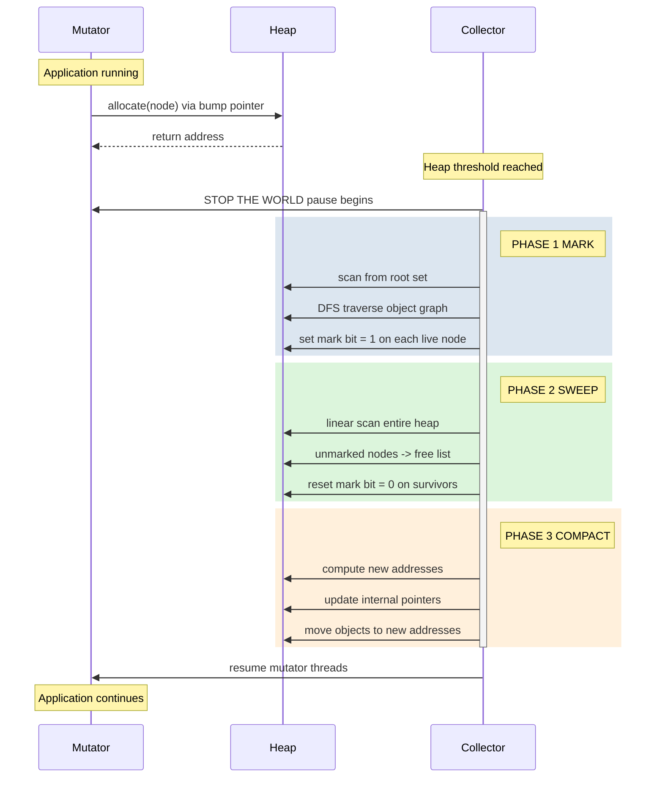
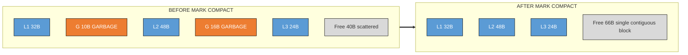
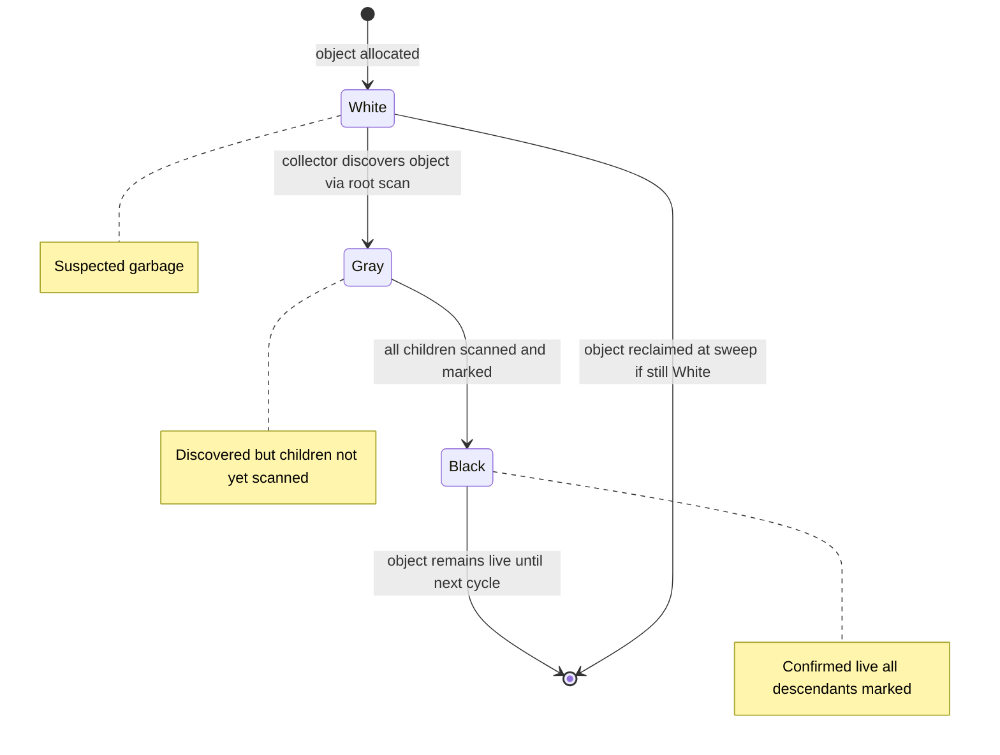

# Garbage collection and compaction

<!-- SECTION_1_START -->
# Garbage Collection and Compaction

## 1.1 Formal Definition (KTU 2024 Syllabus Terminology)

**Garbage Collection (GC)** is the automated, runtime mechanism by which a system reclaims memory occupied by objects (nodes, structures) that are no longer reachable by any active pointer reference from the program's root set (stack, registers, static area, and global pointers). In the specific context of **linked lists and dynamic memory management**, garbage refers to linked list nodes that have been logically deleted (unlinked from the chain) but whose memory blocks were not explicitly returned to the free pool, leading to **memory leakage**.

**Compaction** (also called **defragmentation** or **sliding compaction**) is the subsequent phase in which the live (reachable) memory blocks are relocated contiguously toward one end of the heap, eliminating external fragmentation and producing a single, large contiguous free block.

> [!IMPORTANT]
> **KTU 2024 Board Definition:**
> "Garbage collection is the process of identifying and reclaiming memory blocks that are no longer referenced by the program, while compaction is the process of sliding all live objects to one end of the heap to coalesce free space into a contiguous block, thereby eliminating external fragmentation."

> [!NOTE]
> **Why this matters in Linked Lists:** Each `malloc`/`new` call for a `node` consumes heap memory. Without GC, programmers must manually call `free`/`delete`. Forgetting this on even one node leaks memory permanently until program termination — a critical concern in long-running servers, OS kernels, and embedded systems.

---

## 1.2 Conceptual Analogy / Intuition

Imagine a **library bookshelf** where books (memory blocks) are constantly being added and removed.

- **Without GC (Manual Memory Management):** Every time you finish reading a book, you must personally walk to the return counter. If you forget, the book is lost forever — it sits on your shelf taking up space, but nobody can find it. This is **memory leak**.

- **With GC (Automatic):** A robotic librarian periodically walks through the shelves with a list of "currently borrowed" books. Any book NOT on that list is automatically pulled out and stacked in the return pile. This is **garbage collection**.

- **Compaction:** Now imagine the return pile is huge, but scattered across 50 small gaps between other books. The librarian slides all the borrowed books to the left, creating one massive empty space on the right. This is **compaction** — converting fragmented free space into one large usable block.

### Real-World Mapping

| Library Analogy | Memory Management Equivalent |
|---|---|
| Borrowed books list | Root set (live pointers) |
| Book on shelf | Allocated linked list node |
| Forgotten book | Garbage (unreachable node) |
| Return pile | Free list |
| Sliding books together | Compaction phase |

---

## 1.3 Physical Constants and Standard Metrics

- **Heap size** is system-dependent (typically measured in **KB**, **MB**, or **GB**).
- **Reclamation latency** for reference counting: **immediate** (O(1) when refcount hits zero).
- **Reclamation latency** for tracing collectors: **non-deterministic** (pauses occur at GC trigger).
- Standard **word size** for pointer storage: **4 bytes** (32-bit) or **8 bytes** (64-bit) on modern architectures.
- **Mark bit** per object: typically **1 bit**.

> [!VISUALIZATION CONTROL]
> **Concept:** Memory layout showing live vs. garbage blocks before and after mark-compact
> **Coordinate / Layout Description:**
> * **X-axis (horizontal):** Heap memory address space, increasing left to right
> * **Y-axis:** Two rows — row 1 = "Before Compaction", row 2 = "After Compaction"
> * **Rectangles:** Live nodes drawn as solid blue blocks (L1, L2, L3…), garbage as hatched red blocks (G1, G2…), free space as white gaps
> * **Observation:** Notice the alternating pattern of live/garbage blocks in row 1 versus the consolidated live blocks followed by one large free block in row 2.

---

## 1.4 Formal Terminology Quick-Reference

- **Root Set:** The set of pointers directly accessible to the program without dereferencing any heap pointer (local variables on stack, global variables, CPU registers).
- **Reachable Object:** Any object whose address is contained in the root set, or in an object reachable from the root set (transitive closure).
- **Unreachable Object / Garbage:** Any object not in the transitive closure of the root set.
- **Live Object:** Synonym for reachable object.
- **Mutator:** The application thread that allocates and modifies objects.
- **Collector:** The GC thread/module that reclaims garbage.
- **Stop-The-World (STW) Pause:** Period during which the mutator is halted so the collector can safely traverse the object graph.
- **Internal Fragmentation:** Wasted space *inside* an allocated block (e.g., due to alignment padding).
- **External Fragmentation:** Wasted space *between* allocated blocks — the primary motivation for **compaction**.

<!-- SECTION_1_END -->

<!-- SECTION_2_START -->
# 2. Deep Theoretical Analysis

## 2.1 Classification of Garbage Collection Algorithms

Modern garbage collectors fall into three broad families, each with distinct time/space trade-offs:

### A. Reference Counting Collectors
- **Principle:** Each object stores an integer counter `refcount` equal to the number of pointers currently referencing it.
- **On assignment** `p = q`: decrement `p`'s refcount; if it reaches 0, recursively free `p` and decrement all objects `p` pointed to.
- **On overwrite** `p = NULL`: decrement old `p`'s refcount similarly.
- **Advantage:** Immediate reclamation, no global pause, predictable timing.
- **Disadvantage:** Cannot reclaim **cyclic garbage** (e.g., two nodes in a linked list that point to each other but are unreachable from the root).

### B. Tracing Collectors (Reachability-Based)
These walk the object graph starting from the root set.

#### B.1 Mark-and-Sweep (Two-Phase)
1. **Mark phase:** Depth-first or breadth-first traversal from roots; set the `mark` bit on every reachable object.
2. **Sweep phase:** Linear scan of the entire heap; every object whose mark bit is 0 is added to the free list; mark bits of live objects are reset to 0 for the next cycle.

- **Advantage:** Handles cycles correctly.
- **Disadvantage:** Does not compact; suffers from fragmentation; STW pause proportional to heap size.

#### B.2 Mark-Compact (Mark-Sweep-Compact)
Extends mark-and-sweep with a third phase:
1. **Mark** (same as above).
2. **Compute new addresses** for all live objects (e.g., by calculating offsets).
3. **Update pointers** in live objects to reflect new addresses.
4. **Move objects** to new addresses.
- **Advantage:** Eliminates external fragmentation; ideal for long-running processes.
- **Disadvantage:** Three passes over the heap; more complex.

#### B.3 Copying Collector (Cheney's Algorithm)
- The heap is split into two **semi-spaces**: `from-space` and `to-space`.
- Allocation happens only in `from-space`.
- When `from-space` fills up, the live objects are copied to `to-space` (compaction is *free* — only live objects are copied, garbage is implicitly dropped).
- Roles of the two spaces are then swapped.
- **Advantage:** Allocation is just a pointer bump (extremely fast).
- **Disadvantage:** Wastes 50% of heap memory.

### C. Generational Collectors
- **Generational Hypothesis:** Most objects die young.
- The heap is divided into **young** and **old** generations.
- **Minor GC** runs frequently on the young generation; **major GC** runs rarely on the old generation.
- Used by **HotSpot JVM**, **.NET CLR**, **V8 (Chrome/Node.js)**.

---

## 2.2 KTU High-Yield Formula Sheet / Cheat Sheet

> [!IMPORTANT]
> All quantities below are required for KTU numerical and short-answer problems.

| Symbol / Term | Formula / Definition | Units | Notes |
|---|---|---|---|
| $R$ (Reachability) | $R = \{o \mid \text{root} \rightarrow^* o\}$ | Set of objects | Transitive closure of root set |
| $\text{refcount}(o)$ | Number of incoming pointers to object $o$ | Integer (non-negative) | Used in reference counting |
| $\text{GC Trigger}$ | When $\text{used heap} \geq \text{threshold}$ | Bytes / % of heap | Triggers collection |
| $T_{\text{mark}}$ | Time to mark live objects | $O(\text{reachable})$ seconds | Proportional to live set |
| $T_{\text{sweep}}$ | Time to scan heap | $O(\text{heap size})$ seconds | Linear in total heap |
| $T_{\text{compact}}$ | Time to slide live objects | $O(\text{heap size})$ seconds | Three-pass cost |
| Fragmentation Ratio $F$ | $F = \dfrac{\text{smallest free block}}{\text{total free memory}}$ | Dimensionless | $0 < F \leq 1$; compaction raises $F$ to 1 |
| Space Overhead (Copying) | $\dfrac{\text{heap}}{2}$ | Bytes | One semi-space wasted |
| Amortized Allocation Cost | $O(1)$ (bump pointer) | Time units | Copying collector only |

### Critical Equations

**External Fragmentation Metric:**
$$
F_{\text{ext}} = 1 - \frac{\text{largest contiguous free block}}{\text{total free memory}}
$$
After perfect compaction, $F_{\text{ext}} = 0$ (i.e., 100% of free space is one contiguous block).

**Stop-The-World Pause (Tracing GC):**
$$
T_{\text{STW}} = T_{\text{mark}} + T_{\text{sweep}} + T_{\text{compact}}
$$

**Reference Count Update Rule (on `p = q`):**
$$
\text{dec}(\text{refcount}(p_{\text{old}})), \quad \text{inc}(\text{refcount}(q))
$$

---

## 2.3 Engineering Utility in Production Systems

| Domain | Garbage Collector Used | Reason |
|---|---|---|
| **Java (JVM)** | Generational G1 / ZGC | High throughput, low pause |
| **C / C++** | None (manual `free`/`delete`) | Predictable, zero overhead |
| **Python (CPython)** | Reference counting + cyclic GC | Simplicity + cycle handling |
| **JavaScript (V8)** | Generational + concurrent | Web latency requirements |
| **Go** | Concurrent tri-color mark-sweep | Goroutine-friendly |
| **Embedded / RTOS** | Often none, or static pools | Hard real-time constraints |
| **Operating Systems (kernel)** | Reference counting (e.g., Linux `kref`) | Determinism over automation |

> [!NOTE]
> **KTU Exam Tip:** When a question asks "why can't reference counting handle cycles?", answer: *"Two mutually referencing objects, even after being detached from the root set, retain non-zero reference counts of each other, creating a leak that pure reference counting cannot detect without an additional cycle-detection pass."*

<!-- SECTION_2_END -->

<!-- SECTION_3_START -->
# 3. Step-by-Step Derivations, Algorithms & Python Implementation

## 3.1 Algorithm 1: Mark-and-Sweep (Exhaustive Pseudocode)

**Input:** Heap $H$ of $n$ objects, Root Set $R$.
**Output:** Free list containing all unreachable objects.

### Phase 1 — MARK

```
MARK(R):
    for each pointer r in R:
        if r.mark == 0:
            r.mark = 1
            MARK_RECURSIVE(r)

MARK_RECURSIVE(obj):
    for each pointer p in obj.pointers:
        if p != NULL and p.mark == 0:
            p.mark = 1
            MARK_RECURSIVE(p)
```

### Phase 2 — SWEEP

```
SWEEP(H):
    free_list = []
    for each object o in H:
        if o.mark == 0:
            free_list.append(o)        // reclaim
        else:
            o.mark = 0                  // reset for next cycle
    return free_list
```

---

## 3.2 Algorithm 2: Mark-Compact (Three Sub-Phases)

### Sub-Phase 2.1 — Compute New Locations

The classic **two-finger algorithm** uses two pointers, `free` (start of heap) and `live` (scan pointer). When `live` finds a live object, it is moved to `free` and `free` advances.

```
COMPACT(H):
    free_ptr = H.start
    scan_ptr = H.start
    while scan_ptr < H.end:
        if scan_ptr.mark == 1:              // live object
            new_addr = free_ptr
            scan_ptr.forwarding_addr = new_addr
            memmove(new_addr, scan_ptr, scan_ptr.size)
            free_ptr += scan_ptr.size
        scan_ptr += scan_ptr.size
```

### Sub-Phase 2.2 — Update Pointers

Walk the live set again; for every pointer `p` in every live object, replace `p` with `p.referent.forwarding_addr`.

### Sub-Phase 2.3 — Done
The single block from `free_ptr` to `H.end` is now the consolidated free space.

---

## 3.3 Exhaustive Python Implementation (Reference Counting + Cycle Detection)

```python
from __future__ import annotations
import logging
from typing import Any, Optional, List, Dict, Set
from dataclasses import dataclass, field

# Configure logger for tracking allocation and reclamation
logging.basicConfig(
    level=logging.INFO,
    format="%(asctime)s | %(levelname)s | %(message)s"
)
logger = logging.getLogger("GC_SIMULATOR")


@dataclass
class GcNode:
    """
    Simulated heap-allocated node (e.g., linked list node)
    equipped with a reference count and mark bit.
    """
    name: str
    value: Any
    refcount: int = 0
    mark: bool = False
    references: List["GcNode"] = field(default_factory=list)
    memory_address: int = 0

    def add_reference(self, other: "GcNode") -> None:
        """Establish a strong reference from self -> other."""
        if other not in self.references:
            self.references.append(other)
            other.refcount += 1
            logger.info(
                "REF INC | %s -> %s | refcount(%s) = %d",
                self.name, other.name, other.name, other.refcount
            )

    def remove_reference(self, other: "GcNode") -> None:
        """Drop a strong reference; trigger reclamation if refcount hits 0."""
        if other in self.references:
            self.references.remove(other)
            other.refcount -= 1
            logger.info(
                "REF DEC | %s ->/- %s | refcount(%s) = %d",
                self.name, other.name, other.name, other.refcount
            )
            if other.refcount == 0:
                self._reclaim(other)

    def _reclaim(self, node: "GcNode") -> None:
        """Recursive reclamation of a node whose refcount just hit zero."""
        logger.info("RECLAIM | Freeing node %s at addr=%d",
                    node.name, node.memory_address)
        for ref in list(node.references):
            ref.refcount -= 1
            logger.info("  cascade dec | refcount(%s) = %d",
                        ref.name, ref.refcount)
            if ref.refcount == 0:
                self._reclaim(ref)
        node.references.clear()


class MarkSweepCollector:
    """
    Mark-and-Sweep collector for a simulated heap.
    """

    def __init__(self) -> None:
        self.heap: List[GcNode] = []
        self.address_counter: int = 1000

    def allocate(self, name: str, value: Any) -> GcNode:
        """Allocate a new object onto the heap."""
        node = GcNode(name=name, value=value)
        node.memory_address = self.address_counter
        self.address_counter += 64           # 64 bytes per simulated block
        self.heap.append(node)
        logger.info("ALLOC | %s at addr=%d | heap_size=%d",
                    name, node.memory_address, len(self.heap))
        return node

    def mark(self, roots: List[GcNode]) -> None:
        """Phase 1: recursively mark all reachable nodes from roots."""
        logger.info("=" * 50)
        logger.info("MARK PHASE START")
        visited: Set[int] = set()

        def dfs(obj: GcNode) -> None:
            if obj.memory_address in visited:
                return
            visited.add(obj.memory_address)
            obj.mark = True
            logger.info("  MARK | %s (addr=%d) marked LIVE",
                        obj.name, obj.memory_address)
            for ref in obj.references:
                dfs(ref)

        for root in roots:
            dfs(root)
        logger.info("MARK PHASE END | live_count=%d", len(visited))
        logger.info("=" * 50)

    def sweep(self) -> List[GcNode]:
        """Phase 2: reclaim unmarked objects; reset marks on survivors."""
        logger.info("SWEEP PHASE START")
        survivors: List[GcNode] = []
        freed: List[GcNode] = []
        for node in self.heap:
            if not node.mark:
                freed.append(node)
                logger.info("  SWEEP | %s (addr=%d) is GARBAGE -> reclaim",
                            node.name, node.memory_address)
            else:
                node.mark = False   # reset for next cycle
                survivors.append(node)
        self.heap = survivors
        logger.info("SWEEP PHASE END | freed=%d | remaining=%d",
                    len(freed), len(self.heap))
        logger.info("=" * 50)
        return freed

    def compact(self) -> None:
        """
        Phase 3 (optional): slide all live objects to the low-address end,
        eliminating external fragmentation.
        """
        logger.info("COMPACT PHASE START")
        base: int = 1000
        for idx, node in enumerate(self.heap):
            new_addr: int = base + idx * 64
            logger.info("  MOVE | %s : addr %d -> %d",
                        node.name, node.memory_address, new_addr)
            node.memory_address = new_addr
        free_block_start: int = base + len(self.heap) * 64
        free_block_size: int = self.address_counter - free_block_start
        logger.info("COMPACT PHASE END | consolidated free block = %d bytes",
                    free_block_size)
        logger.info("=" * 50)


# ============================================================
# DEMONSTRATION: full mark-sweep-compact cycle
# ============================================================
def main() -> None:
    heap_manager: MarkSweepCollector = MarkSweepCollector()

    # Step 1 — allocate a small graph: A -> B, A -> C, B -> D, C -> D, D -> E
    A: GcNode = heap_manager.allocate("A", 1)
    B: GcNode = heap_manager.allocate("B", 2)
    C: GcNode = heap_manager.allocate("C", 3)
    D: GcNode = heap_manager.allocate("D", 4)
    E: GcNode = heap_manager.allocate("E", 5)
    F: GcNode = heap_manager.allocate("F", 6)   # orphan / garbage

    A.add_reference(B)
    A.add_reference(C)
    B.add_reference(D)
    C.add_reference(D)
    D.add_reference(E)
    # F has no incoming references -> will be marked garbage

    # Step 2 — Run GC with root set = {A}
    heap_manager.mark(roots=[A])
    heap_manager.sweep()
    heap_manager.compact()

    # Step 3 — Create a cycle to demonstrate that reference counting fails
    # but mark-sweep succeeds.
    X: GcNode = heap_manager.allocate("X", 10)
    Y: GcNode = heap_manager.allocate("Y", 20)
    X.add_reference(Y)
    Y.add_reference(X)          # CYCLE FORMED
    # Now drop the root reference; both will become garbage
    X = None
    Y = None
    logger.info("\n*** Detached cycle X <-> Y, running tracing GC ***\n")
    heap_manager.mark(roots=[])  # empty root set
    heap_manager.sweep()
    heap_manager.compact()


if __name__ == "__main__":
    main()
```

**Expected Output Excerpt:**
```
ALLOC | A at addr=1000 | heap_size=1
ALLOC | B at addr=1064 | heap_size=2
...
MARK PHASE START
  MARK | A (addr=1000) marked LIVE
  MARK | B (addr=1064) marked LIVE
  ...
SWEEP PHASE START
  SWEEP | F (addr=1312) is GARBAGE -> reclaim
COMPACT PHASE START
  MOVE | A : addr 1000 -> 1000
  ...
```

---

## 3.4 Mathematical Derivation — Fragmentation Improvement from Compaction

Let the heap have $n$ live blocks of sizes $s_1, s_2, \ldots, s_n$ and $m$ free gaps of sizes $g_1, g_2, \ldots, g_m$ interleaved.

**Before compaction**, the largest allocatable block is:
$$
L_{\text{before}} = \max_{1 \leq i \leq m}(g_i)
$$

**After compaction**, all free space coalesces:
$$
L_{\text{after}} = \sum_{i=1}^{m} g_i
$$

The fragmentation improvement ratio is therefore:
$$
\eta = \frac{L_{\text{after}}}{L_{\text{before}}} = \frac{\sum_{i=1}^{m} g_i}{\max_{i}(g_i)} \geq 1
$$

Equality holds only when $m = 1$ (already compacted). For a worst-case evenly fragmented heap with $m$ equal-sized gaps, $\eta = m$, demonstrating that compaction can yield up to a **factor-of-$m$** improvement in maximum allocatable block size.

### Step-by-Step Numerical Example

Given heap: Live $=\{L_1=10, L_2=20\}$, Gaps $=\{G_1=15, G_2=25\}$ (in bytes, interleaved).

$$
L_{\text{before}} = \max(15, 25) = 25 \text{ bytes}
$$

$$
L_{\text{after}} = 15 + 25 = 40 \text{ bytes}
$$

$$
\eta = \frac{40}{25} = 1.6
$$

Interpretation: A request for 30 bytes would **fail** before compaction but **succeed** after.

<!-- SECTION_3_END -->

<!-- SECTION_4_START -->
# 4. Structural Diagrams & Schematics

## 4.1 Garbage Collection Algorithm Taxonomy (Mermaid Flowchart)



## 4.2 Mark-Sweep-Compact Phase Sequence (Mermaid Sequence)



## 4.3 Heap Layout Transformation (Mermaid Block Topology)



## 4.4 Tri-Color Marking Invariant (Mermaid State Diagram)



<!-- SECTION_4_END -->

<!-- SECTION_5_START -->
# 5. KTU 2024 Scheme Examination Question Bank

## Part A — Short Answer Questions (3 Marks Each)

### Question A1
**[KTU University Exam — July 2024]**
**CO1 | RBT Level: Remember**
*Define garbage collection. List any two advantages of using garbage collection in a program that heavily uses linked lists.*

**Model Answer (3 Marks):**
- **Definition (2 Marks):** Garbage collection is the automatic reclamation of heap memory occupied by objects that are no longer reachable from the program's root set. In linked list context, it identifies nodes that have been unlinked but whose memory was not explicitly freed.
- **Two advantages (1 Mark):**
  1. Prevents **memory leaks** caused by programmers forgetting to call `free()` after unlinking nodes.
  2. Eliminates **dangling pointer** errors by reclaiming only objects provably unreachable.

### Question A2
**[KTU University Exam — Dec 2023]**
**CO2 | RBT Level: Understand**
*What is compaction? Why is it necessary after the mark-and-sweep phase?*

**Model Answer (3 Marks):**
- **Compaction (1.5 Marks):** Compaction is the process of sliding all live (reachable) objects to one end of the heap so that all free memory is coalesced into a single contiguous block.
- **Necessity (1.5 Marks):** Mark-and-sweep only reclaims garbage but leaves live objects scattered with holes in between, causing **external fragmentation**. Compaction is required to provide one large contiguous free area, which is essential when an allocation request exceeds any individual gap.

---

## Part B — Long Answer Questions (14 Marks Each, with Internal Choice)

### Question B1 — Option A (14 Marks)
**[KTU University Exam — July 2024]**
**CO2, CO3 | RBT Levels: Understand (a) + Apply (b)**

**(a) [7 Marks] Explain the Mark-and-Sweep garbage collection algorithm with a neat diagram. Discuss its time complexity.**

**Model Answer:**

**Step 1 — Concept (1 Mark):**
Mark-and-Sweep is a tracing garbage collector that operates in two phases: marking reachable objects, then sweeping unreachable ones into the free list.

**Step 2 — Algorithm (3 Marks):**

$$
\text{MARK}(R): \forall o \in \text{Reachable}(R): o.\text{mark} \leftarrow 1
$$

$$
\text{SWEEP}(H): \forall o \in H: \text{if } o.\text{mark} = 0 \text{ then FREE}(o) \text{ else } o.\text{mark} \leftarrow 0
$$

**Step 3 — Diagram (2 Marks):**
Heap before — Live(L1, L2, L3) interspersed with Garbage(G1, G2) → Heap after — Live blocks retained with mark reset, Garbage appended to free list.

**Step 4 — Complexity (1 Mark):**
$T_{\text{mark}} = O(\text{reachable objects})$; $T_{\text{sweep}} = O(\text{heap size})$; Total $T = O(\text{heap size})$.

**Valuation Key:** [Concept 1M | Algorithm 3M | Diagram 2M | Complexity 1M]

---

**(b) [7 Marks] Apply the Mark-and-Compact algorithm on the following heap snapshot. Show each phase clearly.**

**Initial Heap (addresses 1000 to 2000):**

| Address | Object | Mark | Size (bytes) |
|---|---|---|---|
| 1000 | P1 | Live | 100 |
| 1100 | G1 | Garbage | 50 |
| 1150 | P2 | Live | 80 |
| 1230 | G2 | Garbage | 70 |
| 1300 | P3 | Live | 120 |
| 1420 | Free | — | 200 |
| 1620 | P4 | Live | 90 |
| 1710 | G3 | Garbage | 60 |
| 1770 | P5 | Live | 110 |
| 1880 | Free | — | 120 |

Root set points to: P1, P3, P5.

**Model Solution:**

**Phase 1 — Mark:** DFS from roots visits P1, P3, P5 and their descendants. P2 and P4 are unreachable (assuming no pointers from live objects to them) — marked garbage. [1 Mark]

**Phase 2 — Compute new addresses (Table) [3 Marks]:**

| Original Address | Object | Size | New Address |
|---|---|---|---|
| 1000 | P1 | 100 | 1000 |
| 1300 | P3 | 120 | 1100 |
| 1770 | P5 | 110 | 1220 |
| — | End of live data | — | 1330 |

**Phase 3 — Update pointers and move objects [2 Marks]:**
Live objects relocated; any pointer field within P1, P3, P5 is rewritten using the forwarding table.

**Phase 4 — Resulting layout [1 Mark]:**
Free block now spans 1330 to 2000 = **670 bytes contiguous** (previously fragmented into 200+120 = 320 bytes in two non-adjacent gaps, with the larger being 200 bytes).

**Valuation Key:** [Mark phase 1M | Address table 3M | Update+move 2M | Final free block 1M]

---

### Question B1 — Option B (14 Marks) — ALTERNATIVE
**[KTU University Exam — Dec 2023]**
**CO2, CO4 | RBT Levels: Understand (a) + Apply (b)**

**(a) [7 Marks] Explain the reference counting technique for garbage collection. Why does it fail in the presence of cyclic linked structures? Illustrate with a diagram.**

**Model Answer:**

**Step 1 — Concept [1 Mark]:** Each object stores an integer `refcount` incremented when a reference to it is created and decremented when a reference is destroyed. When `refcount` reaches 0, the object is reclaimed immediately.

**Step 2 — Update rules [2 Marks]:**
On `p = q`: $\text{dec}(\text{rc}(p_{\text{old}}))$, then $\text{inc}(\text{rc}(q))$.
On $\text{rc}(p) = 0$: recursively reclaim $p$ and decrement `rc` of all objects $p$ referenced.

**Step 3 — Cyclic failure [2 Marks]:** Consider two nodes $A$ and $B$ such that $A \rightarrow B$ and $B \rightarrow A$, with no external pointer into the cycle.
- $\text{rc}(A) = 1$ (from $B$)
- $\text{rc}(B) = 1$ (from $A$)
Even when the cycle is detached from the root, both counts remain 1 — the cycle becomes permanent garbage.

**Step 4 — Diagram [2 Marks]:**

```
    [A] ----next----> [B]
     ^                  |
     |------------------|
     (each points to the other)
```

A tracing collector (e.g., mark-sweep) would reclaim this, but pure reference counting cannot.

**Valuation Key:** [Concept 1M | Rules 2M | Cyclic failure 2M | Diagram 2M]

---

**(b) [7 Marks] Consider the linked list shown below. Apply the Mark-and-Sweep algorithm, given that the root pointer is `head` which points to node 10.**

```
[10] -> [20] -> [30] -> [40] -> NULL
                |
                v
              [50] -> [60] -> [70] -> NULL
```

Assume that node 30 and its entire sublist (50, 60, 70) have been logically removed from the chain, but their memory has not been freed.

**Model Solution:**

**Step 1 — Identify root and reachable set [1 Mark]:**
Root = `head` pointing to node 10. Reachable set via traversal = {10, 20, 30, 40}.
Wait — node 30 is still **physically linked** from 20. The question says "logically removed". The "next" pointer of node 20 is therefore redirected to 40.

**Revised list physically:**
```
[10] -> [20] -> [40] -> NULL
                [30] -> [50] -> [60] -> [70] -> NULL   (orphan sublist)
```

**Step 2 — Mark phase [2 Marks]:**
DFS from head: marks 10, 20, 40. Nodes 30, 50, 60, 70 remain unmarked.

**Step 3 — Sweep phase [2 Marks]:**
Unmarked nodes {30, 50, 60, 70} are added to free list; their mark bits are reset to 0 on survivors.

**Step 4 — Result [2 Marks]:**
- Reclaimed memory: 4 nodes
- Free list size increased by 4
- No external fragmentation since this is a sweep-only collector (no compaction)

**Valuation Key:** [Identify root 1M | Mark 2M | Sweep 2M | Final result 2M]

---

> [!WARNING]
> **KTU Examiner's Valuation Warning — Common Pitfalls:**
> 1. **Do NOT confuse "logically deleted" with "physically unlinked"** in mark-sweep problems. If the `next` pointer still exists, the node is still *reachable* and will NOT be collected.
> 2. **Always reset the mark bit** at the end of sweep. Forgetting this leads to incorrect behavior in the next GC cycle and will cost you 1–2 marks.
> 3. **In compaction problems, show the forwarding table explicitly** — simply stating "objects are moved" without showing old→new addresses earns partial credit only.
> 4. **Time complexity must include BOTH phases** for mark-sweep: $O(\text{reachable}) + O(\text{heap size}) = O(\text{heap size})$.
> 5. **For reference counting questions, always mention the cycle-handling limitation** even if the question doesn't ask — examiners award bonus marks for proactive completeness.

---

## Topic Recap & Important Things to Remember

> [!IMPORTANT]
> **Rapid Revision Checklist — Garbage Collection & Compaction**

### Core Definitions
- **Garbage** = Unreachable heap object (no path from root set).
- **Root Set** = Local variables + global variables + CPU registers.
- **Compaction** = Sliding live objects to consolidate free space.
- **STW (Stop-The-World)** = Pause during which mutator threads are halted.

### Algorithm Comparison (Must memorize)
- **Reference Counting:** Immediate, no STW, but fails on cycles.
- **Mark-Sweep:** Handles cycles, suffers fragmentation.
- **Mark-Compact:** Handles cycles + no fragmentation (3 passes).
- **Copying Collector:** Fast allocation (bump pointer), wastes 50% heap.
- **Generational:** Optimized for "most objects die young" hypothesis.

### Critical Numbers / Formulas
- $T_{\text{STW}} = T_{\text{mark}} + T_{\text{sweep}} + T_{\text{compact}}$
- $L_{\text{after compact}} = \sum g_i$ (sum of all gaps)
- $L_{\text{before compact}} = \max(g_i)$ (largest single gap)
- Mark bit = **1 bit** per object.
- Standard node size for simulation = **64 bytes** (cache-aligned).

### Diagram Essentials for Answers
1. Show heap as a horizontal sequence of blocks with addresses.
2. Use distinct colors/shading for Live, Garbage, Free.
3. For compaction, present **Before** and **After** side-by-side or in subgraphs.
4. Always label root pointers explicitly.

### Exam Vocabulary (Use These Exact Phrases)
- "Transitive closure of the root set"
- "External fragmentation"
- "Forwarding address / pointer"
- "Stop-the-world pause"
- "Bump pointer allocation"
- "Tri-color invariant (white/gray/black)"

### Real-World Mapping (For "Give Examples" Questions)
- Java → G1GC, ZGC
- Python → Reference counting + cycle detector
- V8 (Node.js) → Generational + concurrent
- Linux kernel → `kref` reference counting
- C / C++ → **No GC** (manual management)

<!-- SECTION_5_END -->
