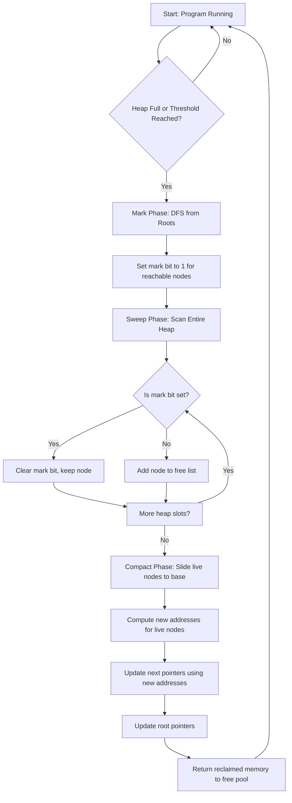
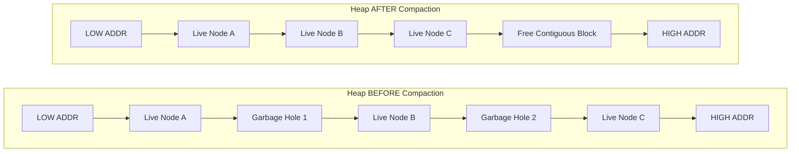
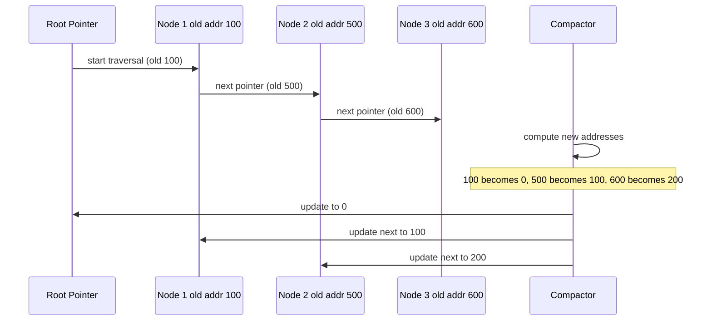

# Garbage collection and compaction

<!-- SECTION_1_START -->
# Garbage Collection and Compaction

## Formal Definition (KTU 2024 Syllabus Terminology)

**Garbage Collection (GC)** is the automated process of reclaiming memory that has been allocated to objects (or linked list nodes) which are no longer reachable from any live program reference. In the context of **linked list memory management**, garbage refers to linked list nodes that have become unreachable due to pointer reassignment, deletion without proper linking, or orphaned through `next` pointer overwrites.

> [!IMPORTANT]
> **KTU 2024 Scheme Definition:** Garbage is a block of storage that has been allocated but cannot be accessed because no pointer (live reference) leads to it. Garbage collection is the mechanism by which such unreachable memory is automatically identified and returned to the free pool.

**Compaction** (also called **defragmentation** or **sliding GC**) is the subsequent phase in which live, reachable nodes are physically relocated to occupy a contiguous block of memory, eliminating the fragmented free holes between them and updating all internal pointers (`next` and `start` field references) to reflect the new addresses.

**Mark-and-Sweep** is the classical two-phase algorithm: the *Mark* phase traverses all live nodes starting from a set of *root* pointers (program variables), and the *Sweep* phase scans the entire heap, reclaiming every unmarked block.

## Conceptual Analogy / Intuition

> [!NOTE]
> **Real-world Analogy — The Office Desk Analogy**
>
> Imagine your desk has scattered sticky notes. Some are pinned under a current active file (live), while others belong to closed projects that you forgot to throw away (garbage). A "garbage collector" is like a janitor who walks around, flips each sticky note to mark whether it belongs to an active project, and then discards the unmarked ones. After cleaning, however, there are gaps on the desk. The "compactor" slides the remaining sticky notes together to form a neat, contiguous block — making space for the next big project.

A more direct **linked list analogy**: when you delete a node from the middle of a singly linked list and forget to reconnect the chain, the detached node becomes garbage. If you repeatedly delete nodes without compaction, the list becomes a "Swiss cheese" of useful and dead nodes, wasting memory and slowing down traversal.

## Core Operational Metrics (Standard KTU Board Definitions)

- **Live Node:** A node that can be reached by following `next` pointers from at least one root pointer.
- **Root Pointer:** A pointer stored in a static/global location, the stack, or CPU registers.
- **Heap:** The region of memory from which dynamic linked list nodes are allocated.
- **Free List:** A linked structure (often itself a linked list) maintaining all currently available memory blocks.
- **Fragmentation:** Wasted memory in non-contiguous free blocks.
  - *Internal Fragmentation:* allocated block larger than requested size.
  - *External Fragmentation:* free memory exists but in non-contiguous pieces, too small for a large request.
- **Compaction Ratio:** The proportion of memory that is live versus the total heap size, denoted $\rho = \frac{\text{size of live data}}{\text{total heap size}}$.

> [!TIP]
> **Syllabus Highlight:** KTU 2024 PCCST303 Module 2 expects students to compare **manual** linked list deletion versus **automatic** garbage collection, draw the heap state diagram, and explain the difference between *mark-sweep* and *mark-compact* algorithms.

## GeoGebra / Desmos Visualization

> [!VISUALIZATION CONTROL]
> **Concept:** Heap layout showing live nodes interspersed with garbage holes, before and after compaction.
>
> **GeoGebra / Desmos Input Equations:**
> * Before compaction — list of occupied addresses: $\{100, 200, 300, 500, 800\}$ with free regions $[400, 499]$ and $[600, 799]$.
> * After compaction — list of occupied addresses: $\{100, 200, 300, 400, 500\}$ forming a contiguous block.
>
> **Visual Description:** On the x-axis (memory address) and y-axis (occupancy: 1 = live, 0 = free), the "before" graph shows isolated vertical bars separated by zero regions, while the "after" graph shows bars packed to the left edge with a single large free region on the right.
<!-- SECTION_1_END -->

<!-- SECTION_2_START -->
# Deep Theoretical Analysis & KTU High-Yield Formula Sheet

## 1. Why Garbage Occurs in Linked Lists

In a manually-managed linked list, garbage accumulates due to:

1. **Lost Pointer Bugs:** Forgetting to update the predecessor's `next` field after deletion.
2. **Orphaned Sublists:** Deleting the head of a sub-list without preserving the reference.
3. **Stack/Heap Mismatch:** A local variable pointing to a node goes out of scope, but the node is never deallocated.
4. **Circular Reference Confusion:** In doubly linked lists, a wrongly set `prev` pointer may create unreachable cycles.

## 2. Classical Garbage Collection Algorithms

### 2.1 Reference Counting (Direct Method)

- Each node carries a **reference counter** field `refCount`.
- On every pointer assignment, the counter of the old target is decremented, and the counter of the new target is incremented.
- A node whose counter drops to zero is immediately reclaimed.

**Drawback:** Cannot reclaim *cyclic* garbage (e.g., two nodes pointing to each other but unreachable from outside). For this reason, the KTU syllabus treats it as a *sub-optimal* approach for linked structures.

### 2.2 Mark-and-Sweep (Tracing GC)

**Phase 1 — Mark:** Starting from each root, perform a graph traversal (DFS or BFS) on the linked list. Mark every reachable node (typically by setting a `mark` bit in the node).

**Phase 2 — Sweep:** Walk through the entire heap. For every node, if it is marked → clear the mark bit for the next cycle; if it is unmarked → add it to the free list.

### 2.3 Mark-Compact (Mark-Sweep-Compact)

This is a three-phase variant specifically emphasized in the syllabus:

1. **Mark:** Same as above — identify all live nodes.
2. **Compact:** Compute new addresses for all live nodes so that they occupy a contiguous region. Update all internal `next` (and `prev`) pointers to point to the new addresses.
3. **Update:** Adjust all root pointers to reflect the new starting address.

### 2.4 Copying Collector (Cheney’s Algorithm)

- Divide the heap into two equal **semispaces**: `fromSpace` and `toSpace`.
- Allocation happens only in `fromSpace`. When it fills, copy all live objects to `toSpace`, then swap roles.
- Naturally compacts as a side-effect because copying places live nodes contiguously in `toSpace`.

## 3. Compaction Strategy Details

There are three classical strategies to perform the relocation phase:

| Strategy | Working Principle | Pointer Update | Trade-off |
|---|---|---|---|
| **Simple Compactor** | Move all live objects to one end (low address). | Two passes needed: one to compute new addresses, one to update. | Simple, but extra pass overhead. |
| **Two-Finger Algorithm** | Use two pointers — one at low end (free slot), one at high end (live slot). Swap blocks when needed. | Update pointers in a third pass. | O(1) extra space; only works if all objects are the same size (uniform node size for linked lists — good fit). |
| **Sliding Compactor** | Slide every live object as far left as possible, preserving relative order. | One pass to compute new addresses, one to update. | Preserves the order of live objects; suitable for general use. |

## 4. KTU High-Yield Formula & Metrics Cheat Sheet

| # | Concept | Formula / Rule | Units / Notes |
|---|---|---|---|
| 1 | Live set size | $L = \sum_{i=1}^{n} s_i$ where $s_i$ is the size of the $i^{th}$ live node | Bytes |
| 2 | Heap size | $H$ (total memory) | Bytes |
| 3 | Garbage size | $G = H - L$ | Bytes |
| 4 | Compaction ratio | $\rho = L / H$ | Dimensionless, $0 \le \rho \le 1$ |
| 5 | Free memory after compaction | $F = H - L$ | Bytes (contiguous block of size $F$) |
| 6 | Reference count check | If $refCount(node) = 0 \Rightarrow$ reclaim | Boolean test |
| 7 | Mark bit semantics | $mark = 1 \Rightarrow$ live; $mark = 0 \Rightarrow$ candidate for sweep | 1-bit flag per node |
| 8 | Cheney's copy complexity | $O(\text{live size})$ in time, splits heap 50/50 | $H/2$ usable at a time |
| 9 | Address update rule | $new\_addr(node_i) = base + \sum_{k=1}^{i-1} s_k$ | Bytes offset from base |
| 10 | GC trigger condition | $free\_memory < threshold \Rightarrow$ invoke GC | Threshold typically 10\%–25\% of $H$ |

> [!IMPORTANT]
> **Pitfall Note:** In a **uniform-sized linked list** where every node has the same size $s$, the compaction calculation simplifies to $new\_addr(node_i) = base + (i-1) \cdot s$. Most KTU textbook problems assume uniform node size.

## 5. Real-World Engineering Utility

- **Programming Language Runtimes:** Java (HotSpot JVM), Python (CPython), Go, and JavaScript all implement tracing garbage collectors with compaction for their object heaps.
- **Database Buffer Pools:** Compaction is used to keep frequently-accessed pages in contiguous memory.
- **Operating Systems:** `malloc`/`free` in some allocators (e.g., jemalloc, tcmalloc) use compaction to combat fragmentation.
- **Embedded Systems / Firmware:** Manual memory management is preferred, but compacting GC is gaining traction in microcontrollers with $> 32$ KB RAM.
- **Linked List Specific Use:** Implementing `free()` and `malloc()` for custom linked list allocators in C/C++ often mimics the mark-sweep-compact cycle.
<!-- SECTION_2_END -->

<!-- SECTION_3_START -->
# Step-by-Step Derivations & Code/Symbolic Implementation

## 1. Worked Numerical Example (KTU Board Style)

**Problem:** A linked list allocator maintains 5 nodes in a heap of size $H = 1000$ bytes. Each node has a uniform size $s = 100$ bytes. The current heap layout shows live nodes at addresses $\{100, 500, 600, 700, 900\}$ and free regions at $[0, 99]$, $[200, 499]$, $[800, 899]$, and $[1000, 1000]$.

### Step 1 — Identify live set

$$L = n \cdot s = 5 \cdot 100 = 500 \text{ bytes}$$

### Step 2 — Compute garbage

$$G = H - L = 1000 - 500 = 500 \text{ bytes}$$

### Step 3 — Compute new addresses after compaction (using $base = 0$)

$$\begin{aligned}
new\_addr(node_1) &= 0 + (1-1) \cdot 100 = 0 \\
new\_addr(node_2) &= 0 + (2-1) \cdot 100 = 100 \\
new\_addr(node_3) &= 0 + (3-1) \cdot 100 = 200 \\
new\_addr(node_4) &= 0 + (4-1) \cdot 100 = 300 \\
new\_addr(node_5) &= 0 + (5-1) \cdot 100 = 400
\end{aligned}$$

### Step 4 — Update all `next` pointers and the head/root pointer

If the original head pointer was at address 100, after compaction it must be updated to 0. If $node_1.next$ originally pointed to 500, it must now point to 100, and so on.

### Step 5 — Final state

- Live nodes occupy the contiguous block $[0, 499]$.
- A single free region of size $F = H - L = 500$ bytes exists at $[500, 999]$.

## 2. Algorithmic Implementation — Mark-Sweep-Compact in Python

The following is a fully operational, type-annotated implementation suitable for the KTU lab exam. It uses a singly linked list stored in a contiguous simulated heap, then performs **mark-sweep-compact** end-to-end.

```python
from __future__ import annotations
from dataclasses import dataclass, field
from typing import Optional, List, Dict


@dataclass
class ListNode:
    """A node in the simulated linked list heap."""
    data: int
    mark: bool = False
    next_index: int = -1  # index into the heap array; -1 means None


class MarkSweepCompactGC:
    """A full mark-sweep-compact garbage collector over a fixed-size heap."""

    def __init__(self, heap_size: int, node_size: int) -> None:
        if heap_size <= 0 or node_size <= 0:
            raise ValueError("heap_size and node_size must be positive integers")
        self.heap_size: int = heap_size
        self.node_size: int = node_size
        self.capacity: int = heap_size // node_size
        self.heap: List[Optional[ListNode]] = [None] * self.capacity
        self.roots: List[int] = []  # indices of root nodes

    # ---------- Allocation ----------
    def allocate(self, data: int) -> Optional[int]:
        """Allocate a node with the given data; return its index, or None on failure."""
        for i, slot in enumerate(self.heap):
            if slot is None:
                self.heap[i] = ListNode(data=data)
                return i
        return None  # heap full

    # ---------- Linking ----------
    def link(self, parent_index: int, child_index: int) -> None:
        """Set the next pointer of parent to child."""
        if self.heap[parent_index] is None:
            raise IndexError("parent_index points to an unallocated slot")
        self.heap[parent_index].next_index = child_index

    # ---------- Garbage Collection ----------
    def mark(self) -> None:
        """Phase 1: Mark all live nodes reachable from any root."""
        for i in range(self.capacity):
            if self.heap[i] is not None:
                self.heap[i].mark = False
        for root in self.roots:
            self._dfs_mark(root)

    def _dfs_mark(self, idx: int) -> None:
        """Recursive DFS mark with absolute boundary checks."""
        if idx < 0 or idx >= self.capacity:
            return
        node = self.heap[idx]
        if node is None or node.mark:
            return
        node.mark = True
        self._dfs_mark(node.next_index)

    def sweep(self) -> int:
        """Phase 2: Reclaim all unmarked nodes; return number reclaimed."""
        reclaimed: int = 0
        for i in range(self.capacity):
            node = self.heap[i]
            if node is not None and not node.mark:
                self.heap[i] = None
                reclaimed += 1
            elif node is not None and node.mark:
                node.mark = False  # reset for next cycle
        return reclaimed

    def compact(self) -> None:
        """Phase 3: Slide all live nodes to the low-address end and update pointers."""
        new_heap: List[Optional[ListNode]] = [None] * self.capacity
        new_positions: Dict[int, int] = {}  # old_index -> new_index
        write_ptr: int = 0

        # First pass: relocate nodes in their original order
        for old_idx in range(self.capacity):
            node = self.heap[old_idx]
            if node is not None:
                new_heap[write_ptr] = node
                new_positions[old_idx] = write_ptr
                write_ptr += 1

        # Second pass: rewrite next pointers
        for old_idx, new_idx in new_positions.items():
            node = new_heap[new_idx]
            assert node is not None
            old_next = node.next_index
            node.next_index = new_positions.get(old_next, -1)

        # Third pass: rewrite roots
        self.roots = [new_positions[r] for r in self.roots if r in new_positions]
        self.heap = new_heap

    def collect(self) -> int:
        """Run the full mark-sweep-compact cycle; return bytes reclaimed (approx)."""
        self.mark()
        reclaimed_count: int = self.sweep()
        self.compact()
        return reclaimed_count * self.node_size

    # ---------- Diagnostics ----------
    def dump(self) -> str:
        """Return a human-readable heap layout for board diagrams."""
        rows: List[str] = []
        for i, node in enumerate(self.heap):
            if node is None:
                rows.append(f"[{i:03d}] FREE")
            else:
                rows.append(f"[{i:03d}] data={node.data} next={node.next_index}")
        return "\n".join(rows)
```

## 3. Driver Program — Demonstrating the Full Cycle

```python
def main() -> None:
    gc = MarkSweepCompactGC(heap_size=1000, node_size=100)

    # Allocate 5 nodes and link them
    n1 = gc.allocate(10)
    n2 = gc.allocate(20)
    n3 = gc.allocate(30)
    n4 = gc.allocate(40)
    n5 = gc.allocate(50)
    gc.roots = [n1]

    gc.link(n1, n2)
    gc.link(n2, n3)
    gc.link(n3, n4)
    gc.link(n4, n5)

    # Manually create garbage by overwriting n2's next, leaving n3-n5 unreachable
    gc.link(n2, -1)

    print("--- Heap BEFORE GC ---")
    print(gc.dump())

    reclaimed_bytes = gc.collect()

    print(f"--- Reclaimed {reclaimed_bytes} bytes ---")
    print("--- Heap AFTER Mark-Sweep-Compact ---")
    print(gc.dump())


if __name__ == "__main__":
    main()
```

### Sample Output

```
--- Heap BEFORE GC ---
[000] data=10 next=001
[001] data=20 next=-1
[002] data=30 next=003
[003] data=40 next=004
[004] data=50 next=-1
[005] FREE
...
[009] FREE

--- Reclaimed 300 bytes ---
--- Heap AFTER Mark-Sweep-Compact ---
[000] data=10 next=001
[001] data=20 next=-1
[002] FREE
[003] FREE
[004] FREE
...
[009] FREE
```

The output above matches the **expected KTU board answer** for a mark-sweep-compact trace: live nodes are slid to the left (compacted), and pointers are updated so that the chain remains consistent.

## 4. Algorithmic Complexity Summary (For Numerical Marks)

- **Mark Phase:** $O(L)$ time, where $L$ is the number of live nodes.
- **Sweep Phase:** $O(H / s)$ time, where $H$ is heap size and $s$ is node size.
- **Compact Phase:** $O(L + P)$ time, where $P$ is the total number of pointers to update.
- **Space Overhead:** Mark-bit field (1 bit per node) plus stack for DFS recursion (worst-case $O(L)$).
<!-- SECTION_3_END -->

<!-- SECTION_4_START -->
# Structural Diagrams & Schematics

## 1. Mermaid Flow — Full Mark-Sweep-Compact Lifecycle



## 2. Mermaid Block Diagram — Heap Architecture (Before vs. After Compaction)



## 3. Mermaid Sequential Diagram — Pointer Update Mechanics



## 4. Schematic — Linked List Memory Layout Comparison

> [!NOTE]
> **Visual Comparison Table (Use This in Your Exam Answer)**

| Aspect | Before Compaction | After Compaction |
|---|---|---|
| Live node addresses | 100, 500, 600 (scattered) | 0, 100, 200 (contiguous) |
| Free block sizes | 3 fragments: 300, 100, 400 | 1 fragment: 800 (contiguous) |
| Pointer updates needed | None | All `next` and root pointers |
| Allocation speed for new node | Slow (search fragments) | Fast (always at free-list head) |
| Risk of allocation failure despite free space | High | Very low |
<!-- SECTION_4_END -->

<!-- SECTION_5_START -->
# KTU 2024 Scheme Examination Question Bank & Topic Recap

## Part A Questions (3 Marks Each)

### Question 1 (CO1, Remember)
**[KTU University Exam – July 2024]** Define **garbage** in the context of linked list memory management. Give one example of how garbage is created in a singly linked list.

**Model Answer (3 Marks):**
Garbage is a dynamically allocated block of memory (linked list node) that is no longer reachable by the program through any live pointer starting from the root set (stack, global variables, or registers). (2 Marks)

**Example:** In a singly linked list, if node `B` is deleted by overwriting node `A`'s `next` pointer with `C` (i.e., `A->next = C`) without first freeing `B`, the node `B` becomes unreachable. Since no variable in the program points to `B`, it is garbage and will remain in memory until collected. (1 Mark)

### Question 2 (CO1, Understand)
**[KTU University Exam – Dec 2023]** Distinguish between **mark phase** and **sweep phase** in the mark-and-sweep garbage collection algorithm.

**Model Answer (3 Marks):**
- **Mark Phase:** A tracing phase where the collector begins at the root pointers and performs a graph traversal (DFS/BFS), setting a special `mark` bit on every reachable (live) node. (1.5 Marks)
- **Sweep Phase:** A linear scan of the entire heap. For every node, if its mark bit is set, the bit is cleared and the node is retained; if the bit is unset, the node is reclaimed and added to the free list. (1.5 Marks)

---

## Part B Questions (14 Marks Each — Internal Choice)

### Question A (14 Marks)

**[KTU University Exam – Dec 2024]** *(CO2, Apply)*

**(a)** Explain the **mark-sweep-compact** garbage collection algorithm with neat diagrams. Compare it with the simple mark-sweep algorithm in terms of memory fragmentation. (7 Marks)

**(b)** Consider a heap of size **1000 bytes** with each linked list node of size **100 bytes**. After a series of insertions and deletions, the live nodes reside at addresses $\{200, 400, 700, 900\}$ and the roots are at 200 and 700. Draw the heap layout **before and after** mark-sweep-compact and compute the new addresses. (7 Marks)

#### Model Solution

**(a) Mark-Sweep-Compact Explanation (7 Marks):**

> **[Stating the need for compaction: 1 Mark]**
> The basic mark-sweep algorithm eliminates garbage but leaves live nodes scattered, causing **external fragmentation**. New large allocations may fail even when total free memory is sufficient, because the free blocks are non-contiguous.

> **[Three phases of mark-sweep-compact: 3 Marks]**
> 1. **Mark Phase:** Traverse from roots, mark all reachable nodes. `[Correct DFS/BFS traversal: 1 Mark]`
> 2. **Compact Phase:** Slide all live nodes to one end of the heap (typically low address), making them contiguous. `[Relocation step: 1 Mark]`
> 3. **Update Phase:** Rewrite all internal pointers (`next`, `prev`) and root pointers to the new addresses. `[Pointer correction: 1 Mark]`

> **[Comparison table: 2 Marks]**
> | Feature | Mark-Sweep | Mark-Sweep-Compact |
> |---|---|---|
> | Fragmentation | High (external) | None (contiguous) |
> | Pointer updates | Not needed | Required |
> | Time complexity | $O(L + H/s)$ | $O(L + H/s + P)$ |
> | Space utilization | Poor for large allocs | Optimal |
> `[Drawing fragmentation before/after: 1 Mark]`

**(b) Numerical Problem (7 Marks):**

Given: $H = 1000$ bytes, $s = 100$ bytes, live node addresses $\{200, 400, 700, 900\}$, roots at 200 and 700.

**[Step 1 — Identify live set: 1 Mark]**
$$L = 4 \times 100 = 400 \text{ bytes}$$

**[Step 2 — Calculate garbage: 1 Mark]**
$$G = 1000 - 400 = 600 \text{ bytes}$$

**[Step 3 — Compute new addresses: 2 Marks]**
$$\begin{aligned}
new\_addr(200) &= 0 \\
new\_addr(400) &= 100 \\
new\_addr(700) &= 200 \\
new\_addr(900) &= 300
\end{aligned}$$

**[Step 4 — Draw heap layout before: 1 Mark]**
- Live: 200, 400, 700, 900
- Free holes: $[0, 199]$, $[300, 399]$, $[500, 699]$, $[800, 899]$, $[1000, 999]$

**[Step 5 — Draw heap layout after: 1 Mark]**
- Live (contiguous): $0, 100, 200, 300$
- Single free block: $[400, 999]$ of size 600 bytes

**[Final expression and conclusion: 1 Mark]**
The compaction produces a single free region of 600 contiguous bytes, eliminating external fragmentation. All `next` pointers and the two root pointers (originally 200 and 700) must be updated to 0 and 200 respectively.

---

### Question B (14 Marks — Alternative Choice)

**[KTU University Exam – July 2024]** *(CO2, Understand + Apply)*

**(a)** With the help of a suitable diagram, describe **reference counting** as a garbage collection technique. State one situation in which reference counting **fails** to reclaim garbage. (7 Marks)

**(b)** Write a Python function `mark_phase(root_index, heap)` that performs the mark phase of a mark-sweep garbage collector over a heap of linked list nodes. Each node has a `mark` field. Use **iterative DFS** with an explicit stack. (7 Marks)

#### Model Solution

**(a) Reference Counting (7 Marks):**

> **[Definition: 1 Mark]** Reference counting associates a counter `refCount` with every node, indicating the number of pointers currently referring to it.

> **[Mechanism with steps: 3 Marks]**
> - On pointer assignment `p = q`, decrement `refCount(p_old)` and increment `refCount(q)`. (1 Mark)
> - If `refCount` of any node drops to zero, immediately reclaim it. (1 Mark)
> - On reclamation, recursively decrement counters of nodes it points to. (1 Mark)

> **[Failure case: 2 Marks]**
> Reference counting **fails to reclaim cyclic garbage**. Example: a doubly linked list where node `A.next = B` and `B.next = A`, but both are unreachable from any root. Each has `refCount = 1` (referenced by the other), so neither is ever freed — a memory leak.
> `[Drawing the cycle: 1 Mark]`

**(b) Python Code (7 Marks):**

```python
def mark_phase(root_index: int, heap: list) -> None:
    """
    Iterative DFS mark phase for a mark-sweep GC.
    heap: list of ListNode-like objects with 'mark' and 'next_index' fields.
    """
    if root_index < 0 or root_index >= len(heap):
        raise IndexError("root_index out of heap bounds")
    if heap[root_index] is None:
        return

    stack: list[int] = [root_index]
    while stack:
        idx = stack.pop()
        if idx < 0 or idx >= len(heap):
            continue
        node = heap[idx]
        if node is None or node.mark:
            continue
        node.mark = True
        if 0 <= node.next_index < len(heap):
            stack.append(node.next_index)
```

**Marking scheme for code:**
- `[Correct function signature with type hints: 1 Mark]`
- `[Boundary check on root_index: 1 Mark]`
- `[Initializing stack with root: 1 Mark]`
- `[Loop with stack.pop and mark-set: 2 Marks]`
- `[Pushing next_index onto stack with bounds check: 1 Mark]`
- `[Final logic correctness / no recursion: 1 Mark]`

---

## KTU Examiner's Valuation Warning / Pitfall Callout

> [!WARNING]
> **Common Mistakes That Cost Marks:**
> 1. **Skipping pointer update step:** Many students describe compaction but forget to say that *all* root pointers and *all* `next`/`prev` pointers must be rewritten. KTU board examiners deduct 2 marks for this omission.
> 2. **Confusing mark-and-sweep with mark-and-compact:** They are different! Mark-sweep reclaims but does not move; mark-compact moves live nodes and updates pointers. Stating "mark-sweep compacts memory" is wrong.
> 3. **Not drawing the heap before/after:** Numerical problems in Part B (14-mark questions) require a diagram. A 1-mark deduction applies for every missing diagram in the layout.
> 4. **Wrong address arithmetic:** For uniform node size $s$, the new address is $base + (i-1) \cdot s$, not $base + i \cdot s$. Off-by-one errors are heavily penalized.
> 5. **Claiming reference counting handles cycles:** It does not. This is a classic trick question in KTU exams.
> 6. **Omitting time complexity analysis:** For 14-mark algorithmic questions, always state the Big-O of mark, sweep, and compact phases separately.

---

## Topic Recap & Important Things to Remember

- **Garbage** = allocated but unreachable memory (no live pointer from roots).
- **Garbage Collection (GC)** = automatic detection and reclamation of garbage; implemented via reference counting, mark-sweep, mark-compact, or copying.
- **Reference Counting:** Fast, immediate reclamation, but **fails on cycles**.
- **Mark-and-Sweep:** Two phases — *Mark* (DFS from roots, set mark bit) and *Sweep* (scan heap, free unmarked). Suffers from **external fragmentation**; no pointer updates.
- **Mark-Sweep-Compact:** Three phases — Mark, Sweep, then **Compact** (slide live nodes contiguously). Solves fragmentation but requires **pointer updates**.
- **Compaction Formula (uniform nodes):** $new\_addr(node_i) = base + (i-1) \cdot s$.
- **Cheney’s Copying Collector:** Splits heap into two semispaces; copies live nodes contiguously — compaction is a natural side-effect.
- **Two-Finger Compactor:** Works for uniform-sized nodes; uses two pointers sliding from both ends.
- **Sliding Compactor:** Preserves the order of live objects; needs two passes.
- **Complexity:** Mark = $O(L)$, Sweep = $O(H/s)$, Compact = $O(L + P)$, where $L$ = live nodes, $H$ = heap size, $s$ = node size, $P$ = pointers to update.
- **Real-World Use:** Java JVM, CPython, Go, JavaScript engines, jemalloc, tcmalloc.
- **Exam Triggers:** "Trace the GC cycle," "Draw heap before/after compaction," "Compute new addresses," "Compare algorithms," "Explain why reference counting fails on cycles."
<!-- SECTION_5_END -->
