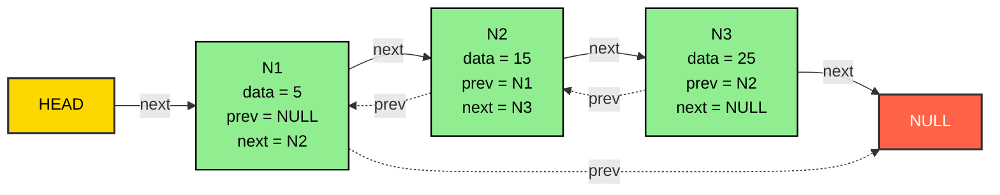
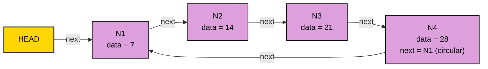
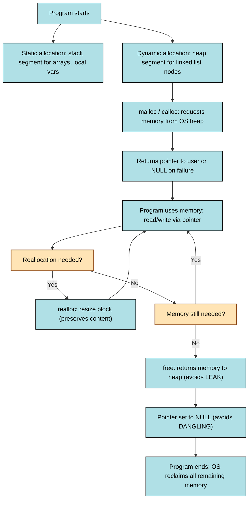
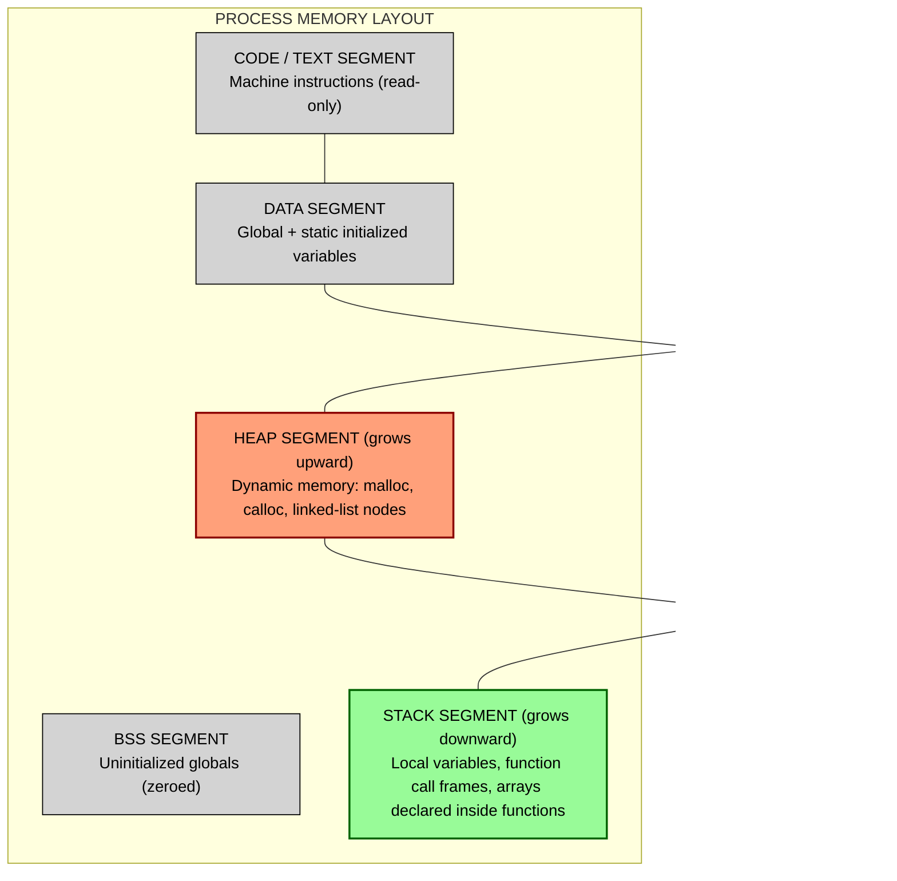
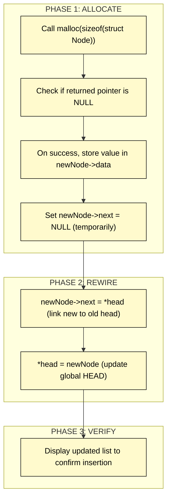

# Linked List and Memory Management

<!-- SECTION_1_START -->

# Linked List and Memory Management

## 1. Core Technical Definition

### 1.1 What is a Linked List?

A **Linked List** is a linear, dynamic data structure in which elements (called **nodes**) are stored at non-contiguous memory locations. Each node contains two parts: a **DATA field** that holds the actual value and a **LINK / NEXT pointer field** that stores the address of the next node in the sequence. Unlike arrays, the elements are not stored in consecutive memory addresses; instead, they are linked together through pointers, forming a chain-like logical order.

> [!NOTE]
> **KTU 2024 Syllabus Definition (PCCST303 – Module 2):**  
> A linked list is a dynamic, linear data structure consisting of a sequence of nodes, where each node contains data and a reference (pointer) to the next node, enabling efficient insertion and deletion operations compared to static arrays.

### 1.2 What is Memory Management?

**Memory Management** in the context of data structures refers to the process of allocating, tracking, and deallocating memory during the execution of a program at runtime (i.e., dynamically). In C, this is achieved using library functions `malloc()`, `calloc()`, `realloc()`, and `free()` declared in `<stdlib.h>`. In linked lists, memory for every node is allocated dynamically on the **Heap** area of the process memory, allowing the list to grow and shrink as required.

> [!IMPORTANT]
> **Key Distinction for KTU Board Exams:**  
> - **Static memory allocation** (arrays) → size fixed at compile-time, stored in the **Stack**.  
> - **Dynamic memory allocation** (linked lists) → size grows at run-time, stored in the **Heap**.

### 1.3 Conceptual Analogy / Intuition

**Analogy 1 — The Treasure Hunt (Singly Linked List):**  
Imagine a treasure hunt where each clue (node) tells you two things: (1) the location of a treasure (the **DATA**) and (2) the location of the next clue (the **NEXT pointer**). The starting clue is given to you (the **HEAD pointer**). To reach the 5th treasure, you must visit clues 1, 2, 3, and 4 in order — you cannot jump directly. This is exactly how traversal works in a linked list.

**Analogy 2 — The Train (Doubly Linked List):**  
Think of a train where each coach (node) is connected to the **previous** and the **next** coach through couplings. A passenger can move forward or backward freely. This is exactly what a **doubly linked list** offers — bidirectional traversal.

**Analogy 3 — The Round Table (Circular Linked List):**  
Imagine people sitting around a round table holding hands. There is no "last" person — after the last person, the first person follows. This mirrors the **circular linked list**, where the last node's pointer points back to the head.

> [!TIP]
> **Intuitive Memory Layout:** In an array of 5 integers, all 5 integers occupy **contiguous** memory (e.g., 1000, 1004, 1008, 1012, 1016). In a linked list, the same 5 integers may be at addresses 2056, 1024, 3072, 1100, 4096 — scattered all over the heap, but logically chained by pointers.

> [!VISUALIZATION CONTROL]
> **Concept:** Array vs. Linked List Memory Layout  
> **GeoGebra / Desmos Input Representation (Conceptual sketch):**  
> * Array: `Point(0,0), Point(1,0), Point(2,0), Point(3,0), Point(4,0)` (equally spaced boxes)  
> * Linked List: `Point(0,1), Point(2,0), Point(4,2), Point(6,1), Point(8,0)` (scattered boxes connected by arrows)  
> **Visual Description:** Draw two parallel rows. Top row = array (5 contiguous identical boxes). Bottom row = linked list (5 boxes scattered, with arrows from each box's right edge to the next box's left edge, plus a separate HEAD arrow pointing to the first node.)

### 1.4 Core Structural Components of a Node

A single node in C is represented as a `struct`:

```c
struct Node {
    int data;            // DATA field
    struct Node *next;   // LINK / pointer to next node
};
```

| **Component**        | **Purpose**                                                | **Size (typical)**                |
| -------------------- | ---------------------------------------------------------- | --------------------------------- |
| `data`               | Stores the application value (int, float, struct, etc.)    | Depends on type (e.g., 4 bytes)   |
| `next`               | Stores the memory address of the next node                 | 8 bytes (on 64-bit) / 4 bytes     |
| **Total node size**  | Sum of `sizeof(data) + sizeof(pointer)`                    | Computed via `sizeof(struct Node)` |

> [!NOTE]
> **Standard Pointer Value to Remember:** A pointer that does **not** point to any valid node is set to `NULL` (value `0`). The last node of a singly/doubly linked list always stores `NULL` in its `next` (and `prev` for doubly) field.

<!-- SECTION_1_END -->

<!-- SECTION_2_START -->

# 2. Deep Theoretical Analysis & KTU High-Yield Formula Sheet

## 2.1 Types of Linked Lists (Board-Exam Favourite)

| **Type**                       | **Structural Property**                                | **Pointer per Node**          | **Traversable Direction** |
| ------------------------------ | ------------------------------------------------------ | ----------------------------- | ------------------------- |
| **Singly Linked List (SLL)**   | Each node → next node; last → `NULL`                   | 1 (`next`)                    | Forward only              |
| **Doubly Linked List (DLL)**   | Each node → previous and next                          | 2 (`prev`, `next`)            | Forward and backward      |
| **Circular Singly Linked List** | Last node → head (no `NULL` at the tail)              | 1 (`next`)                    | Forward, looping          |
| **Circular Doubly Linked List** | Last → head and head → last (no `NULL`)               | 2 (`prev`, `next`)            | Bi-directional, looping   |

## 2.2 Operations on a Singly Linked List (with Complexity)

For an $n$-node list, let the position of operation be $k$ (1-indexed from head).

| **Operation**                  | **Best Case (Time)**       | **Worst Case (Time)**                  | **Auxiliary Space**       |
| ------------------------------ | -------------------------- | -------------------------------------- | ------------------------- |
| **Traversal**                  | $O(n)$ — must visit all   | $O(n)$                                 | $O(1)$                    |
| **Insertion at beginning**     | $O(1)$                     | $O(1)$                                 | $O(1)$                    |
| **Insertion at end**           | $O(1)$ (with tail pointer) | $O(n)$ (only head available)          | $O(1)$                    |
| **Insertion at position $k$**  | $O(1)$ (k=1)               | $O(k)$ — must traverse $k-1$ nodes     | $O(1)$                    |
| **Deletion at beginning**      | $O(1)$                     | $O(1)$                                 | $O(1)$                    |
| **Deletion at end**            | $O(1)$ (with tail pointer) | $O(n)$ (only head available)          | $O(1)$                    |
| **Deletion at position $k$**   | $O(1)$ (k=1)               | $O(k)$                                 | $O(1)$                    |
| **Search (Linear)**            | $O(1)$ (head match)        | $O(n)$ (element at tail or absent)     | $O(1)$                    |

> [!IMPORTANT]
> **KTU 2024 Board Exam Insight:** Examiners almost always ask students to *compare* linked list and array complexities. Memorize that linked lists give **$O(1)$ insertion/deletion at head** whereas arrays give **$O(n)$** for the same. Conversely, arrays give **$O(1)$ random access** whereas linked lists give **$O(n)$**.

## 2.3 Comparison: Array vs. Linked List (Frequently Asked)

| **Parameter**               | **Array (Static)**                                | **Linked List (Dynamic)**                            |
| --------------------------- | ------------------------------------------------- | ---------------------------------------------------- |
| **Memory Allocation**       | Static (compile-time, contiguous)                 | Dynamic (run-time, non-contiguous)                   |
| **Memory Region**           | Stack (if local) / Data segment (if global)       | Heap                                                |
| **Size**                    | Fixed at declaration                              | Grows/shrinks during execution                       |
| **Access Time**             | $O(1)$ — random access by index                   | $O(n)$ — sequential traversal                        |
| **Insertion / Deletion**    | $O(n)$ — shifting required                        | $O(1)$ at head, $O(k)$ at arbitrary position        |
| **Memory Overhead**         | None (just data)                                  | Extra pointer per node                              |
| **Cache Friendliness**      | High (spatial locality)                           | Low (scattered memory)                              |
| **Wastage of Memory**       | Possible (over-allocation)                       | None (allocate as needed)                            |
| **Use Case**                | Fixed-size, frequent random access                | Frequent insert/delete, unknown size                 |

## 2.4 Dynamic Memory Management Functions in C (Mandatory for KTU)

| **Function**        | **Signature**                                  | **Purpose**                                                                  | **Initialization**     | **Failure Return** |
| ------------------- | ---------------------------------------------- | ---------------------------------------------------------------------------- | ---------------------- | ------------------ |
| `malloc(n)`         | `void *malloc(size_t size);`                   | Allocates $n$ bytes of **uninitialized** memory                              | Garbage values        | `NULL`             |
| `calloc(c, s)`      | `void *calloc(size_t count, size_t size);`     | Allocates $c \times s$ bytes of **zero-initialized** memory                  | All bytes = 0          | `NULL`             |
| `realloc(p, n)`     | `void *realloc(void *ptr, size_t size);`       | Resizes the memory block pointed to by `p` to $n$ bytes                      | Preserves old content  | `NULL` (and frees old) |
| `free(p)`           | `void free(void *ptr);`                        | Deallocates the memory block pointed to by `p`                               | N/A                    | N/A                |

> [!NOTE]
> **Header File:** All four functions require `#include <stdlib.h>`.  
> **Type-Casting:** Although C++ mandates casting, KTU's C-based PCCST203 expects explicit casting:  
> `int *p = (int *)malloc(sizeof(int) * n);`

## 2.5 Total Memory Occupied by a Linked List

If each node contains $D$ bytes of data and the pointer occupies $P$ bytes (typically **8 bytes on 64-bit**, **4 bytes on 32-bit**), then:

$$
\text{Memory per node} = D + P \text{ bytes}
$$

$$
\text{Total memory for } n \text{ nodes} = n \times (D + P) \text{ bytes}
$$

**Example:** For `int data` (4 bytes) and a pointer (8 bytes) on a 64-bit system, a list of **1000 nodes** consumes: $1000 \times (4 + 8) = 12000$ bytes = **11.72 KB** (approx).

## 2.6 Real-World Engineering Utility

- **Operating Systems:** Process scheduling uses circular linked lists for the **Round Robin algorithm**.
- **Music Players:** Doubly linked list enables "Next" and "Previous" song navigation in $O(1)$.
- **Undo/Redo Functionality:** Implemented using doubly linked lists in text editors (e.g., MS Word, VS Code).
- **Hash Table Chaining:** Collision resolution uses linked lists (separate chaining).
- **Dynamic Memory Allocators:** The C `malloc` itself maintains free memory blocks in linked lists inside the OS heap.
- **Polynomial Representation:** Sparse polynomials with high-degree terms are efficiently represented using linked lists.
- **Adjacency List of a Graph:** Each vertex maintains a linked list of its neighbors (used in BFS/DFS — covered in Module 4).

> [!TIP]
> **Production Engineering Note:** In real systems like the Linux kernel, intrusive linked lists (where the `list_head` is embedded inside a struct) are used to achieve memory-efficient, type-safe node linking without the overhead of per-node malloc.

<!-- SECTION_2_END -->

<!-- SECTION_3_START -->

# 3. Step-by-Step Derivations, Code, and Symbolic Implementation

## 3.1 Complete Working Code: Singly Linked List (SLL)

```c
#include <stdio.h>
#include <stdlib.h>

/* ---------- 1. Structure Definition ---------- */
struct Node {
    int data;
    struct Node *next;
};

/* ---------- 2. Function Prototypes ---------- */
struct Node *createNode(int value);
void insertAtBeginning(struct Node **head, int value);
void insertAtEnd(struct Node **head, int value);
void insertAtPosition(struct Node **head, int value, int pos);
void deleteAtBeginning(struct Node **head);
void deleteAtEnd(struct Node **head);
void deleteAtPosition(struct Node **head, int pos);
void displayList(struct Node *head);
int searchElement(struct Node *head, int key);
int countNodes(struct Node *head);
void freeList(struct Node **head);

/* ---------- 3. Helper: Create a new node ---------- */
struct Node *createNode(int value) {
    /* Allocate memory dynamically on the HEAP */
    struct Node *newNode = (struct Node *)malloc(sizeof(struct Node));
    if (newNode == NULL) {
        fprintf(stderr, "ERROR: malloc failed. Out of memory.\n");
        exit(EXIT_FAILURE);   /* Hard exit on allocation failure */
    }
    newNode->data = value;   /* Initialize data field */
    newNode->next = NULL;    /* Initialize next to NULL     */
    return newNode;
}

/* ---------- 4. Insertion at Beginning ---------- */
void insertAtBeginning(struct Node **head, int value) {
    struct Node *newNode = createNode(value);
    newNode->next = *head;   /* New node points to old head */
    *head = newNode;         /* Update head to new node     */
}

/* ---------- 5. Insertion at End ---------- */
void insertAtEnd(struct Node **head, int value) {
    struct Node *newNode = createNode(value);
    if (*head == NULL) {           /* Empty list case */
        *head = newNode;
        return;
    }
    struct Node *temp = *head;
    while (temp->next != NULL) {   /* Traverse to last node */
        temp = temp->next;
    }
    temp->next = newNode;          /* Link last node to new */
}

/* ---------- 6. Insertion at Arbitrary Position ---------- */
void insertAtPosition(struct Node **head, int value, int pos) {
    if (pos < 1) {
        fprintf(stderr, "ERROR: position must be >= 1.\n");
        return;
    }
    if (pos == 1) {                /* Equivalent to insertAtBeginning */
        insertAtBeginning(head, value);
        return;
    }
    struct Node *newNode = createNode(value);
    struct Node *temp = *head;
    /* Move to (pos-1)-th node */
    for (int i = 1; i < pos - 1 && temp != NULL; i++) {
        temp = temp->next;
    }
    if (temp == NULL) {
        fprintf(stderr, "ERROR: position %d exceeds list length.\n", pos);
        free(newNode);
        return;
    }
    newNode->next = temp->next;    /* New node points to next node   */
    temp->next = newNode;          /* Previous node points to new    */
}

/* ---------- 7. Deletion at Beginning ---------- */
void deleteAtBeginning(struct Node **head) {
    if (*head == NULL) {
        fprintf(stderr, "ERROR: list is empty.\n");
        return;
    }
    struct Node *temp = *head;
    *head = (*head)->next;         /* Move head to the second node */
    free(temp);                    /* Free the old head node       */
    temp = NULL;                   /* Defensive nulling            */
}

/* ---------- 8. Deletion at End ---------- */
void deleteAtEnd(struct Node **head) {
    if (*head == NULL) {
        fprintf(stderr, "ERROR: list is empty.\n");
        return;
    }
    /* If only one node exists */
    if ((*head)->next == NULL) {
        free(*head);
        *head = NULL;
        return;
    }
    struct Node *temp = *head;
    while (temp->next->next != NULL) {   /* Stop at second-last */
        temp = temp->next;
    }
    free(temp->next);                    /* Free the last node   */
    temp->next = NULL;                   /* Detach it            */
}

/* ---------- 9. Deletion at Arbitrary Position ---------- */
void deleteAtPosition(struct Node **head, int pos) {
    if (*head == NULL || pos < 1) {
        fprintf(stderr, "ERROR: invalid list state or position.\n");
        return;
    }
    if (pos == 1) {
        deleteAtBeginning(head);
        return;
    }
    struct Node *temp = *head;
    for (int i = 1; i < pos - 1 && temp != NULL; i++) {
        temp = temp->next;
    }
    if (temp == NULL || temp->next == NULL) {
        fprintf(stderr, "ERROR: position %d exceeds list length.\n", pos);
        return;
    }
    struct Node *toDelete = temp->next;  /* Node to be deleted  */
    temp->next = toDelete->next;         /* Bypass the node     */
    free(toDelete);
    toDelete = NULL;
}

/* ---------- 10. Display / Traversal ---------- */
void displayList(struct Node *head) {
    if (head == NULL) {
        printf("List is empty.\n");
        return;
    }
    struct Node *temp = head;
    while (temp != NULL) {
        printf("%d -> ", temp->data);
        temp = temp->next;
    }
    printf("NULL\n");
}

/* ---------- 11. Search ---------- */
int searchElement(struct Node *head, int key) {
    int position = 1;
    struct Node *temp = head;
    while (temp != NULL) {
        if (temp->data == key) {
            return position;       /* 1-indexed position */
        }
        temp = temp->next;
        position++;
    }
    return -1;                     /* Not found */
}

/* ---------- 12. Count nodes ---------- */
int countNodes(struct Node *head) {
    int count = 0;
    struct Node *temp = head;
    while (temp != NULL) {
        count++;
        temp = temp->next;
    }
    return count;
}

/* ---------- 13. Free the entire list (prevent memory leak) ---------- */
void freeList(struct Node **head) {
    struct Node *current = *head;
    struct Node *nextNode;
    while (current != NULL) {
        nextNode = current->next;  /* Save next before freeing */
        free(current);
        current = nextNode;
    }
    *head = NULL;
}

/* ---------- 14. Main driver for testing ---------- */
int main(void) {
    struct Node *head = NULL;

    insertAtEnd(&head, 10);
    insertAtEnd(&head, 20);
    insertAtEnd(&head, 30);
    insertAtBeginning(&head, 5);
    insertAtPosition(&head, 25, 3);

    printf("Linked List: ");
    displayList(head);                      /* Expected: 5 -> 10 -> 25 -> 20 -> 30 -> NULL */

    printf("Search 20: position %d\n", searchElement(head, 20));
    printf("Search 99: position %d\n", searchElement(head, 99));
    printf("Total nodes: %d\n", countNodes(head));

    deleteAtPosition(&head, 3);
    printf("After deleting position 3: ");
    displayList(head);                      /* Expected: 5 -> 10 -> 20 -> 30 -> NULL */

    freeList(&head);
    return 0;
}
```

## 3.2 Worked Example: Tracing `insertAtPosition(&head, 25, 3)`

Assume initial list: `HEAD → 5 → 10 → 20 → 30 → NULL`. We call `insertAtPosition(&head, 25, 3)`.

| **Step** | **Action**                                                                 | **List State After Step**           |
| -------- | -------------------------------------------------------------------------- | ----------------------------------- |
| 1        | `pos = 3` (not 1) → enter main logic                                        | `HEAD → 5 → 10 → 20 → 30 → NULL`    |
| 2        | `createNode(25)` → `newNode = {25, NULL}`                                  | Same                                |
| 3        | `temp = head` → `temp` points to node with `data=5`                        | Same                                |
| 4        | Loop: `i=1`, `i < 2 && temp != NULL` → `temp = temp->next` (`data=10`)     | `temp` at `10`                      |
| 5        | Loop ends (`i=2` fails condition)                                          | `temp` at `10`                      |
| 6        | `newNode->next = temp->next` → `newNode->next` now points to `20`          | `newNode = {25, &20}`               |
| 7        | `temp->next = newNode` → `10`'s `next` now points to `25`                  | `HEAD → 5 → 10 → 25 → 20 → 30 → NULL`|

Final list: **`5 → 10 → 25 → 20 → 30 → NULL`**. Insertion successful.

## 3.3 Doubly Linked List (DLL) — Key Operations

```c
#include <stdio.h>
#include <stdlib.h>

struct DNode {
    int data;
    struct DNode *prev;
    struct DNode *next;
};

/* Insert at beginning in a doubly linked list */
void dllInsertAtBeginning(struct DNode **head, int value) {
    struct DNode *newNode = (struct DNode *)malloc(sizeof(struct DNode));
    if (newNode == NULL) {
        fprintf(stderr, "Out of memory.\n");
        exit(EXIT_FAILURE);
    }
    newNode->data = value;
    newNode->prev = NULL;
    newNode->next = *head;

    if (*head != NULL) {
        (*head)->prev = newNode;
    }
    *head = newNode;
}

/* Delete a node given its pointer (works for any node, not just head) */
void dllDeleteNode(struct DNode **head, struct DNode *del) {
    if (*head == NULL || del == NULL) return;

    if (*head == del) {
        *head = del->next;
    }
    if (del->next != NULL) {
        del->next->prev = del->prev;
    }
    if (del->prev != NULL) {
        del->prev->next = del->next;
    }
    free(del);
    del = NULL;
}
```

> [!IMPORTANT]
> **DLL Pointer Rule:** Whenever you rewire pointers, set the new node's `prev` and `next` **BEFORE** updating the neighbours' pointers — otherwise you lose access to the rest of the list and create a **DANGLING REFERENCE** (a common 2-mark deduction in KTU exams).

## 3.4 Circular Singly Linked List — Traversal

```c
#include <stdio.h>
#include <stdlib.h>

struct CNode {
    int data;
    struct CNode *next;
};

void circularDisplay(struct CNode *head) {
    if (head == NULL) {
        printf("List is empty.\n");
        return;
    }
    struct CNode *temp = head;
    do {
        printf("%d -> ", temp->data);
        temp = temp->next;
    } while (temp != head);
    printf("(back to head %d)\n", head->data);
}
```

> [!WARNING]
> **Critical Pitfall — Infinite Loop:** Never write `while (temp != NULL)` for a circular list. Always use the **do-while** pattern with a stop condition `temp != head`. Forgetting this is a guaranteed program hang in lab exams.

## 3.5 Memory Management — Worked Numerical Example

**Problem (Typical KTU 2-Mark Question):**  
A linked list has 50 nodes. Each node contains an `int` (4 bytes) and a pointer (8 bytes) on a 64-bit machine. Calculate the total memory consumed by the list.

**Solution:**

$$
\text{Node size} = \text{sizeof(int)} + \text{sizeof(pointer)} = 4 + 8 = 12 \text{ bytes}
$$

$$
\text{Total memory} = n \times \text{node size} = 50 \times 12 = 600 \text{ bytes}
$$

**Answer: 600 bytes** of heap memory.

## 3.6 Complexity Derivation — Why is `insertAtBeginning` $O(1)$?

Let the original list contain $n$ nodes.

1. Allocate new node: `malloc(1)` → $O(1)$ (heap allocator's bucket lookup is constant time amortized).
2. Set `newNode->next = *head` → $O(1)$ pointer copy.
3. Set `*head = newNode` → $O(1)$ pointer copy.

Total: $1 + 1 + 1 = 3$ operations, **independent of $n$**. Hence $T(n) = O(1)$.

## 3.7 Complexity Derivation — Why is `insertAtEnd` $O(n)$?

1. If list empty: $O(1)$.
2. Otherwise, we must traverse the list: starting at head, follow `next` pointers until `temp->next == NULL`. In the worst case, this requires exactly $n - 1$ jumps.
3. After reaching the last node, link it: $O(1)$.

$$
T(n) = (n - 1) + 1 = n \text{ steps} \implies T(n) = O(n)
$$

> [!TIP]
> **Optimization for KTU Lab Viva:** If you maintain a **tail pointer** (extra global pointer to the last node), `insertAtEnd` becomes $O(1)$. This is a classic viva question — "How can you make insertion at the end of a linked list constant time?"

<!-- SECTION_3_END -->

<!-- SECTION_4_START -->

# 4. Structural Diagrams & Schematics

## 4.1 Mermaid Diagram: Singly Linked List with HEAD Pointer


## 4.2 Mermaid Diagram: Doubly Linked List (Bidirectional)



## 4.3 Mermaid Diagram: Circular Singly Linked List



## 4.4 Mermaid Diagram: Memory Allocation Lifecycle



## 4.5 Mermaid Diagram: Process Memory Layout (Stack vs. Heap)



## 4.6 Sequential Processing Topology: `insertAtBeginning` Operation



<!-- SECTION_4_END -->

<!-- SECTION_5_START -->

# 5. KTU 2024 Scheme Examination Question Bank & Topic Recap

## 5.1 Part A — Short Answer Questions (2 × 3 = 6 Marks)

### **Question 1 [KTU University Exam – July 2024, Model Paper]**
**Define a linked list. Compare linked lists with arrays in terms of memory allocation and access time.**  *(CO1, Understand)*

**Model Answer (3 Marks):**
- **Definition (1 Mark):** A linked list is a linear, dynamic data structure in which elements (nodes) are stored at non-contiguous memory locations and are linked together using pointers. Each node contains a **DATA** field and a **NEXT pointer** field.
- **Memory Allocation (1 Mark):** Arrays use **contiguous** static memory allocated on the **stack** (or data segment), whereas linked lists use **non-contiguous** dynamic memory allocated on the **heap** via `malloc()`.
- **Access Time (1 Mark):** Array access is **$O(1)$** (random access by index); linked list access is **$O(n)$** (sequential traversal required to reach the $k$-th element).

---

### **Question 2 [KTU University Exam – Dec 2023, Model Paper]**
**Explain the difference between `malloc()` and `calloc()` with a suitable C code snippet.** *(CO1, Remember)*

**Model Answer (3 Marks):**
- **`malloc()` (1 Mark):** Allocates a single block of *n* bytes of **uninitialized** memory. Syntax: `int *p = (int *)malloc(n * sizeof(int));`
- **`calloc()` (1 Mark):** Allocates an array of *c* elements of size *s* bytes each, and **initializes every byte to zero**. Syntax: `int *p = (int *)calloc(n, sizeof(int));`
- **Code (1 Mark):**
  ```c
  int *a = (int *)malloc(5 * sizeof(int));   /* Garbage values */
  int *b = (int *)calloc(5, sizeof(int));    /* All 5 ints = 0   */
  ```

---

## 5.2 Part B — Long Answer Questions (Module Internal Choice Pattern, 14 Marks Each)

> **KTU 2024 ESE Pattern:** Each Part B question carries **14 marks** split into sub-parts **(a) 7 marks** and **(b) 7 marks**. Two full alternative questions are provided below.

---

### **Question A (14 Marks) [KTU University Exam – July 2024, Module 2]**

**(a) Write a C program to create a singly linked list of $n$ integers and display the list in reverse order using recursion. (7 Marks)** *(CO2, Apply)*

**Model Solution:**

**Algorithm Steps (2 Marks):**
1. Define a `struct Node` with `int data` and `struct Node *next`.
2. Use `createNode()` helper to allocate a new node via `malloc()`.
3. Build the list by repeatedly calling `insertAtEnd()`.
4. Write a recursive function `reverseDisplay(struct Node *head)` that prints `head->data` **after** the recursive call.

**Complete C Code (4 Marks):**
```c
#include <stdio.h>
#include <stdlib.h>

struct Node {
    int data;
    struct Node *next;
};

struct Node *createNode(int value) {
    struct Node *n = (struct Node *)malloc(sizeof(struct Node));
    if (n == NULL) {
        fprintf(stderr, "Out of memory\n");
        exit(EXIT_FAILURE);
    }
    n->data = value;
    n->next = NULL;
    return n;
}

void insertAtEnd(struct Node **head, int value) {
    struct Node *n = createNode(value);
    if (*head == NULL) { *head = n; return; }
    struct Node *t = *head;
    while (t->next != NULL) t = t->next;
    t->next = n;
}

void reverseDisplay(struct Node *head) {
    if (head == NULL) return;            /* Base case */
    reverseDisplay(head->next);          /* Recurse first */
    printf("%d -> ", head->data);        /* Print on return */
}

void displayList(struct Node *head) {
    struct Node *t = head;
    while (t != NULL) {
        printf("%d -> ", t->data);
        t = t->next;
    }
    printf("NULL\n");
}

int main(void) {
    struct Node *head = NULL;
    int n, x;
    printf("Enter number of nodes: ");
    scanf("%d", &n);
    printf("Enter %d integers: ", n);
    for (int i = 0; i < n; i++) {
        scanf("%d", &x);
        insertAtEnd(&head, x);
    }
    printf("Original list: "); displayList(head);
    printf("Reversed list: ");
    reverseDisplay(head);
    printf("NULL\n");

    /* Free memory */
    struct Node *cur = head, *nxt;
    while (cur != NULL) {
        nxt = cur->next;
        free(cur);
        cur = nxt;
    }
    return 0;
}
```

**Output Trace (1 Mark):**  
Input: `5 10 20 30 40 50`  
Output:  
`Original list: 10 -> 20 -> 30 -> 40 -> 50 -> NULL`  
`Reversed list: 50 -> 40 -> 30 -> 20 -> 10 -> NULL`

**Valuation Key (incremental):**  
- `[Struct definition: 1 Mark]`  
- `[insertAtEnd correctness: 1 Mark]`  
- `[Recursive reverse logic (post-order print): 2 Marks]`  
- `[Memory deallocation / cleanup: 1 Mark]`

---

**(b) Explain dynamic memory allocation functions in C. Discuss the importance of the `free()` function with an example demonstrating a memory leak. (7 Marks)** *(CO3, Understand + Apply)*

**Model Solution:**

**Theory (3 Marks):**  
Dynamic memory allocation refers to allocating memory at **runtime** on the **heap** rather than at compile-time on the stack. C provides four standard library functions declared in `<stdlib.h>`:

| **Function** | **Purpose** |
| ------------ | ----------- |
| `malloc(n)`  | Allocates $n$ bytes; returns uninitialized memory. |
| `calloc(c, s)` | Allocates $c \times s$ bytes; returns zero-initialized memory. |
| `realloc(p, n)` | Resizes memory block at `p` to $n$ bytes. |
| `free(p)`   | Deallocates memory block at `p`, returning it to the heap. |

**Memory Leak Example (4 Marks):**

```c
#include <stdio.h>
#include <stdlib.h>

void leakDemo(void) {
    /* Allocate 100 integers on the heap */
    int *p = (int *)malloc(100 * sizeof(int));
    if (p == NULL) {
        fprintf(stderr, "malloc failed\n");
        return;
    }
    /* Use the memory: write some values */
    for (int i = 0; i < 100; i++) p[i] = i * i;

    /* BUG: We forget to call free(p) before returning! */
    /* The 400 bytes of heap memory are now unreachable. */
    /* If this function is called repeatedly, heap will exhaust. */
}

int main(void) {
    for (int i = 0; i < 100000; i++) leakDemo();
    printf("If you reach here, your system had enough memory.\n");
    return 0;
}
```

**Corrected version (1 Mark):**
```c
void noLeakDemo(void) {
    int *p = (int *)malloc(100 * sizeof(int));
    if (p == NULL) return;
    /* ... use p ... */
    free(p);          /* Returns memory to heap */
    p = NULL;         /* Avoids dangling pointer */
}
```

**Valuation Key:**  
- `[Naming 4 functions: 1 Mark]`  
- `[Syntax of malloc/calloc: 1 Mark]`  
- `[Identification of memory leak cause: 1 Mark]`  
- `[Showing free() fix: 2 Marks]`  
- `[Setting pointer to NULL: 1 Mark]`

---

### **Question B (14 Marks) [KTU University Exam – Dec 2023, Module 2]**

**(a) Implement a C program to perform the following operations on a doubly linked list: (i) Insert a node at the end, (ii) Delete a node from the beginning, (iii) Display the list. (7 Marks)** *(CO2, Apply)*

**Model Solution:**

**Struct Definition (1 Mark):**
```c
struct DNode {
    int data;
    struct DNode *prev;
    struct DNode *next;
};
```

**Insert at End (2 Marks):**
```c
void dllInsertAtEnd(struct DNode **head, int value) {
    struct DNode *n = (struct DNode *)malloc(sizeof(struct DNode));
    if (n == NULL) { fprintf(stderr, "Out of memory\n"); exit(EXIT_FAILURE); }
    n->data = value;
    n->prev = NULL;
    n->next = NULL;

    if (*head == NULL) { *head = n; return; }

    struct DNode *t = *head;
    while (t->next != NULL) t = t->next;
    t->next = n;
    n->prev = t;       /* Critical DLL link */
}
```

**Delete at Beginning (2 Marks):**
```c
void dllDeleteAtBeginning(struct DNode **head) {
    if (*head == NULL) { printf("Empty\n"); return; }
    struct DNode *temp = *head;
    *head = (*head)->next;
    if (*head != NULL) (*head)->prev = NULL;
    free(temp);
    temp = NULL;
}
```

**Display (1 Mark):**
```c
void dllDisplay(struct DNode *head) {
    struct DNode *t = head;
    printf("NULL <-> ");
    while (t != NULL) {
        printf("%d <-> ", t->data);
        t = t->next;
    }
    printf("NULL\n");
}
```

**Main driver (1 Mark):**
```c
int main(void) {
    struct DNode *head = NULL;
    dllInsertAtEnd(&head, 11);
    dllInsertAtEnd(&head, 22);
    dllInsertAtEnd(&head, 33);
    dllDisplay(head);              /* NULL <-> 11 <-> 22 <-> 33 <-> NULL */
    dllDeleteAtBeginning(&head);
    dllDisplay(head);              /* NULL <-> 22 <-> 33 <-> NULL */
    return 0;
}
```

**Valuation Key:**  
- `[Struct: 1 Mark]`  
- `[Insert at end with prev update: 2 Marks]`  
- `[Delete at beginning with NULL check: 2 Marks]`  
- `[Display correctness: 1 Mark]`  
- `[Output demonstration: 1 Mark]`

---

**(b) What is a circular linked list? Write a C function to insert a node at the end of a circular singly linked list and explain why the `do-while` loop is mandatory for traversal. (7 Marks)** *(CO3, Understand + Apply)*

**Model Solution:**

**Definition (2 Marks):**  
A **circular linked list** is a variation of a linked list in which the last node's `next` pointer does **not** point to `NULL`; instead, it points back to the **HEAD** (the first node). This creates a closed loop, allowing continuous traversal until an explicit break condition is met.  
*Advantages:* No null-pointer ambiguity; useful in round-robin scheduling, circular buffers, and Josephus problem.

**C Function (3 Marks):**
```c
#include <stdio.h>
#include <stdlib.h>

struct CNode {
    int data;
    struct CNode *next;
};

/* Insert at the end of a circular singly linked list */
void cllInsertAtEnd(struct CNode **head, int value) {
    struct CNode *n = (struct CNode *)malloc(sizeof(struct CNode));
    if (n == NULL) { fprintf(stderr, "Out of memory\n"); exit(EXIT_FAILURE); }
    n->data = value;

    if (*head == NULL) {
        n->next = n;          /* First node points to itself */
        *head = n;
        return;
    }
    struct CNode *t = *head;
    while (t->next != *head) {  /* Traverse till last node */
        t = t->next;
    }
    t->next = n;                /* Old last points to new */
    n->next = *head;            /* New last points to head */
}
```

**Why `do-while` is Mandatory (2 Marks):**  
In a circular list, the stop condition is `temp == head`, but this condition is **true at the very start** (when `temp` is initialized to `head`). If we use a regular `while (temp != head) { ... }`, the loop body **never executes**, and we cannot visit even the first node. A `do-while` guarantees the body runs **at least once** before the condition is rechecked:

```c
void cllDisplay(struct CNode *head) {
    if (head == NULL) { printf("Empty\n"); return; }
    struct CNode *t = head;
    do {
        printf("%d -> ", t->data);
        t = t->next;
    } while (t != head);
    printf("(back to head)\n");
}
```

**Valuation Key:**  
- `[Definition: 2 Marks]`  
- `[Insert function (NULL check, self-loop, traversal): 3 Marks]`  
- `[do-while explanation: 2 Marks]`

---

## 5.3 KTU Examiner's Valuation Warning / Pitfall Callout

> [!WARNING]
> **Common Mark-Deduction Pitfalls (Board Examiner Insights):**
> 
> 1. **Forgetting `<stdlib.h>`:** Without it, `malloc` is implicitly `int` (returns int). In C++ this is an *error*; in C it works but is bad practice. Examiners deduct **0.5 to 1 mark** for missing header.
> 
> 2. **No `NULL` check after `malloc`:** Always write `if (p == NULL) { ... exit or return ... }`. Skipping this is a classic **2-mark deduction** in lab exams.
> 
> 3. **Memory leak in lab exam:** The program compiles and *seems* to work, but the examiner runs it inside `valgrind`. If `valgrind` reports "definitely lost: X bytes", the student loses **2-3 marks** outright. **Always free every malloc.**
> 
> 4. **Confusing `->` and `.`:** Use `node->data` (pointer access) not `node.data` (struct direct access). Mixing them up is a **1-mark deduction**.
> 
> 5. **Circular list infinite loop:** Writing `while (t != NULL)` for a circular list will hang the program. Always use the `do-while` pattern with `t != head`.
> 
> 6. **Missing the `prev` link update in DLL:** When inserting at the end of a doubly linked list, forgetting `n->prev = t;` is a **2-mark deduction**.
> 
> 7. **No diagram in the answer sheet:** KTU valuation key explicitly awards **1 mark for a clean diagram** of the linked list (with boxes for nodes and arrows for pointers). *Always draw the diagram first*, then write the code.
> 
> 8. **Failing to state complexity:** The board expects time complexity ($O(1)$, $O(n)$) to be written alongside every operation in theory answers.

---

## 5.4 Topic Recap & Important Things to Remember

> [!TIP]
> **Rapid Revision Checklist — Must Memorize Before the Exam**

- **Linked List Definition:** Dynamic, linear collection of nodes; each node has `data` + `next` pointer; non-contiguous memory.
- **Three Types:** Singly, Doubly, Circular (Singly & Doubly variants).
- **Key Differences vs. Array:**  
  - Array → contiguous, $O(1)$ access, $O(n)$ insert/delete.  
  - Linked List → non-contiguous, $O(n)$ access, $O(1)$ insert/delete at head.
- **Memory Region:** Linked lists use the **heap**; arrays declared inside functions use the **stack**.
- **4 Dynamic Memory Functions:** `malloc` (uninitialized), `calloc` (zero-initialized), `realloc` (resize), `free` (deallocate).
- **Header file:** `#include <stdlib.h>` is mandatory.
- **NULL check** is mandatory after every `malloc`/`calloc`/`realloc` call.
- **SLL insertion at beginning:** 3 pointer operations → $O(1)$.
- **SLL insertion at end:** $O(n)$ without tail pointer; $O(1)$ with tail pointer.
- **DLL pointer update rule:** Set `new->next` and `new->prev` **first**, then update neighbour pointers to avoid losing references.
- **Circular list traversal rule:** Always use `do { ... } while (t != head);` — never `while (t != NULL)`.
- **Memory leak prevention:** Free every node, then set the head pointer to `NULL`.
- **Dangling pointer prevention:** After `free(p)`, immediately assign `p = NULL;`.
- **Node size formula:** $\text{Node size} = \text{sizeof(data)} + \text{sizeof(pointer)}$.
- **Total list memory:** $n \times \text{Node size}$ bytes.
- **Applications to remember:** Round-robin scheduling, undo/redo, polynomial representation, adjacency list of graphs, hash table chaining, dynamic memory allocator internals.
- **Diagram:** Always draw the list (boxes + arrows) before writing the C code — it earns a guaranteed **1 mark** in valuation.
- **Complexity:** Always write $O(1)$, $O(n)$ etc. alongside your algorithm — examiners explicitly check this.
- **Most-asked KTU question type:** "Compare linked list with array" (3 marks) and "Implement insert/delete at a specific position" (7-14 marks).
- **Lab-viva hot questions:**  
  - "Why can't we use `while(temp != NULL)` for a circular list?"  
  - "How to make insertion-at-end $O(1)$?" (Answer: maintain a tail pointer.)  
  - "What is a memory leak? How does `free()` prevent it?"  
  - "What is the difference between `malloc` and `calloc`?"

---

<!-- SECTION_5_END -->
