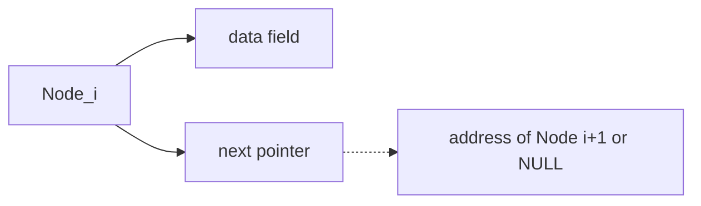
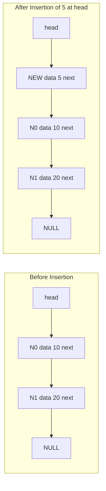
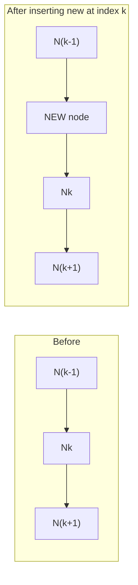
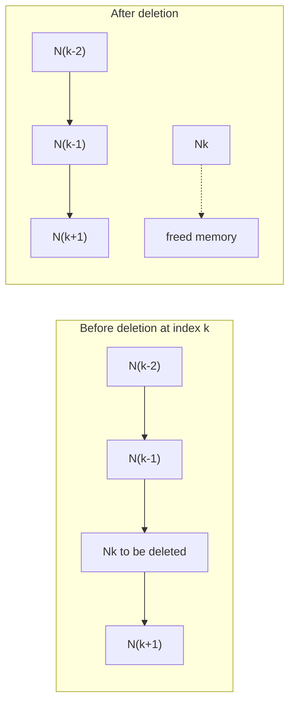
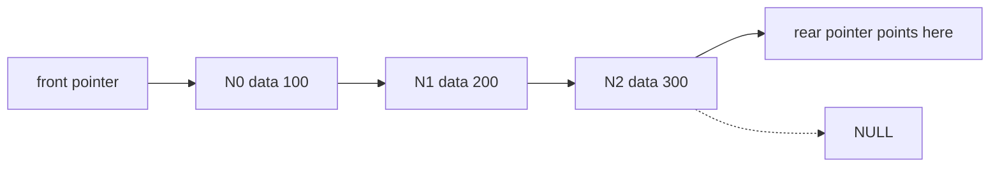
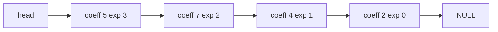
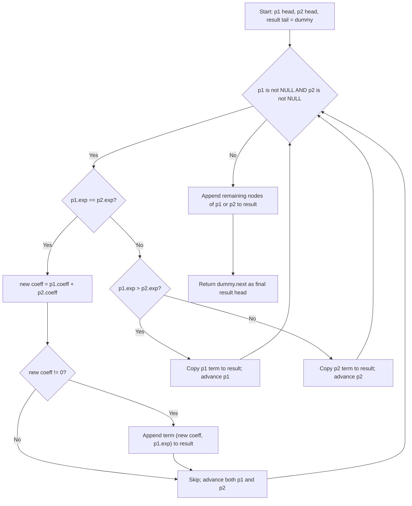
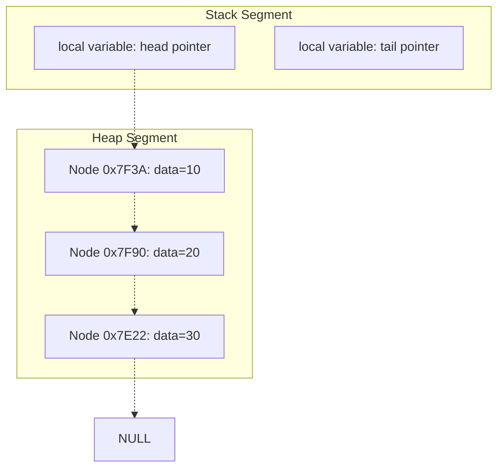

# Linked List: Singly Linked List—Operations, Stacks and Queues using Linked List, Polynomial representation using Linked List

<!-- SECTION_1_START -->
# Linked List: Singly Linked List — Operations, Stacks & Queues using Linked List, Polynomial Representation

## 1.1 Formal Definition (KTU 2024 Syllabus Terminology)

A **Singly Linked List (SLL)** is a linear, dynamic, non-contiguous data structure in which elements (called **nodes**) are linked together using pointers. Each node contains two fields: a **data field** that stores the actual element and a **link/next field** that stores the address/reference of the subsequent node in the sequence. The list is traversed in a single direction — from the **head** pointer to the last node, whose `next` field points to `NULL`.

In the **KTU 2024 Scheme (PCCST303)**, linked lists fall under the **dynamic memory allocation** paradigm. Memory is requested from the **heap** at runtime using functions like `malloc()` (in C) or allocated by the **garbage-collected heap** in higher-level languages. Because nodes can be scattered in non-contiguous memory, the *effective logical size* of the list is decoupled from the *physical memory layout*.

> [!IMPORTANT]
> **Syllabus Highlight (Module 2):** Students must master four core competencies — (1) SLL primitive operations, (2) Stack ADT using SLL, (3) Queue ADT using SLL, and (4) Polynomial representation and addition. Board valuation explicitly rewards *pointer manipulation diagrams* and *trace tables*.

> [!NOTE]
> **Core Definition — Node**
> A node $N_i$ in a singly linked list is a 2-tuple $\langle \text{data}_i, \text{next}_i \rangle$, where $\text{next}_i \in \{N_{i+1}, \text{NULL}\}$ is the address of the next node. The list is uniquely identified by a **head pointer** $H$ such that $H = N_0$ (or $H = \text{NULL}$ if empty).

## 1.2 Conceptual Analogy — The "Treasure Hunt Train" 🚂

Imagine a **toy train** with detachable carriages. Each carriage carries:
1. A **cargo box** (the `data` field — it holds something useful, say, the number 42), and
2. A **hook on the rear** (the `next` field — it holds the connection to the *next* carriage).

The engineer's hand grabs only the **first carriage** (this is your `head` pointer). To find carriage #5, the engineer must walk past carriages #1 → #2 → #3 → #4 → #5. You cannot jump directly to the 5th carriage — there is **no random access**.

**Key takeaways from the analogy:**
- The engineer's hand = `head` pointer (single entry point).
- Walking through carriages = **traversal** (always $O(n)$ in the worst case).
- Adding a new carriage in the middle = **insertion** (just unplug, attach new, reconnect).
- Removing a carriage = **deletion** (unplug, bypass, reconnect).
- An empty train = `head = NULL`.

> [!TIP]
> **Memory Address Analogy:** If arrays are like seats in a movie theatre (contiguous, numbered, fixed capacity), linked lists are like a **scavenger hunt** — each clue tells you the *address* of the next clue, scattered randomly across town.

## 1.3 Why Linked Lists? — Memory Management Perspective

Arrays suffer from two structural limitations:
1. **Fixed size** — must be declared at compile time.
2. **Contiguous memory requirement** — may fail to allocate even if total free memory is sufficient (fragmentation).

Linked lists resolve both by:
- Allocating nodes **on demand** from the heap.
- Allowing nodes to live at **arbitrary addresses**.
- Releasing memory explicitly via `free()` (in C) or via **garbage collection** (Java/Python).

> [!VISUALIZATION CONTROL]
> **Concept:** Singly Linked List Traversal Direction
> **GeoGebra / Desmos Input Equations:**
> * Point A at $(0, 0)$ representing `head`
> * Point B at $(3, 1)$ representing Node 1
> * Point C at $(6, 0)$ representing Node 2
> * Point D at $(9, 1)$ representing Node 3
> * Arrows $A \to B \to C \to D$
> **Visual Description:** A horizontal zig-zag path of 4 points connected by directed arrows, all flowing in a single direction (left-to-right). Observe that even though the path is *logically linear*, the points are placed at *physically scattered* coordinates — mirroring how nodes live at non-contiguous heap addresses.

<!-- SECTION_1_END -->

<!-- SECTION_2_START -->
# Deep Theoretical Analysis & KTU High-Yield Formula Sheet

## 2.1 The Node — Atomic Building Block

A node in C is a `struct` with two members; in Python we use a class.

$$
\text{Node} = \langle \text{data}, \text{next} \rangle
$$

Memory size of a single node (on a typical 64-bit system):

$$
\text{Size}_{\text{node}} = \text{Size}_{\text{data}} + \text{Size}_{\text{pointer}}
$$

For an integer data field, this is typically $4 \text{ bytes} + 8 \text{ bytes} = 12 \text{ bytes}$ (often padded to **16 bytes** for alignment).

## 2.2 List-Level Definitions

Let the list have $n$ nodes. Define:

- $H$ = head pointer.
- $N_i$ = address of the $i$-th node, where $i \in \{0, 1, 2, \dots, n-1\}$.
- $N_{n-1}.\text{next} = \text{NULL}$ (sentinel tail marker).
- $\text{Length}(L) = n$.
- $L$ is empty $\iff H = \text{NULL}$.

## 2.3 Primitive Operations — Time Complexity

| Operation | Description | Best Case | Average Case | Worst Case | Auxiliary Space |
|---|---|---|---|---|---|
| `createNode(data)` | Allocate new node, initialize fields | $O(1)$ | $O(1)$ | $O(1)$ | $O(1)$ |
| `insertAtBeginning(L, x)` | Insert `x` before the current head | $O(1)$ | $O(1)$ | $O(1)$ | $O(1)$ |
| `insertAtEnd(L, x)` | Append `x` after the tail | $O(1)$* | $O(n)$ | $O(n)$ | $O(1)$ |
| `insertAtPosition(L, x, k)` | Insert `x` at index $k$ | $O(1)$ for $k=0$ | $O(k)$ | $O(n)$ | $O(1)$ |
| `deleteFromBeginning(L)` | Remove head node | $O(1)$ | $O(1)$ | $O(1)$ | $O(1)$ |
| `deleteFromEnd(L)` | Remove tail node | $O(1)$* | $O(n)$ | $O(n)$ | $O(1)$ |
| `deleteFromPosition(L, k)` | Remove node at index $k$ | $O(1)$ for $k=0$ | $O(k)$ | $O(n)$ | $O(1)$ |
| `traverse(L)` | Visit every node, print/process | $O(n)$ | $O(n)$ | $O(n)$ | $O(1)$ |
| `search(L, key)` | Find first node whose data = `key` | $O(1)$ for head | $O(n/2)$ | $O(n)$ | $O(1)$ |
| `length(L)` | Count nodes | $O(n)$ | $O(n)$ | $O(n)$ | $O(1)$ |

(*With a maintained `tail` pointer, `insertAtEnd` and `deleteFromEnd` both become $O(1)$. KTU questions frequently test both the *with-tail* and *without-tail* variants.)

> [!IMPORTANT]
> **Rule of Thumb for KTU Valuation:** A 7-mark "insertion" question expects:
> 1. Node creation (1 mark)
> 2. Pointer link adjustments with **edge cases** (empty list, single-node list) (3 marks)
> 3. Updated `head` if affected (1 mark)
> 4. Neat ASCII/box diagram (2 marks)

## 2.4 Stack ADT using Singly Linked List

A **stack** is a LIFO (Last-In, First-Out) container. Implementing it via SLL is the *canonical* linked-list application.

Define the stack $S = \langle \text{top}, \text{size} \rangle$ where `top` is the head of the SLL. All operations occur at the **head end** only — making everything $O(1)$.

| Stack Operation | SLL Equivalent | Time |
|---|---|---|
| `push(S, x)` | `insertAtBeginning(S, x)`; `top` ← new node | $O(1)$ |
| `pop(S)` | `deleteFromBeginning(S)`; return popped data | $O(1)$ |
| `peek(S)` | Return `top.data` | $O(1)$ |
| `isEmpty(S)` | Return `top = NULL` | $O(1)$ |

> [!NOTE]
> **Why use SLL over array for stacks?** Arrays require a pre-allocated, fixed-size buffer. When the stack overflows, we must resize — a costly $O(n)$ operation. With SLL, the stack grows dynamically with the heap, and overflow occurs only when **memory is exhausted**.

## 2.5 Queue ADT using Singly Linked List

A **queue** is a FIFO (First-In, First-Out) container. Pure SLL-based queues **require two pointers** to remain $O(1)$: a `front` pointer (for dequeue) and a `rear` pointer (for enqueue). Without a `rear` pointer, every enqueue becomes $O(n)$ — a classic KTU pitfall.

Define the queue $Q = \langle \text{front}, \text{rear} \rangle$.

| Queue Operation | SLL Equivalent | Time |
|---|---|---|
| `enqueue(Q, x)` | Create node, link at `rear`, update `rear` | $O(1)$ |
| `dequeue(Q)` | Move `front` to `front.next`, free old node | $O(1)$ |
| `front(Q)` | Return `front.data` | $O(1)$ |
| `rear(Q)` | Return `rear.data` | $O(1)$ |
| `isEmpty(Q)` | Return `front = NULL` | $O(1)$ |

## 2.6 Polynomial Representation using Linked List

A univariate polynomial $P(x)$ of degree $n$ is stored as an SLL where each node holds a **single non-zero term**:

$$
P(x) = c_n x^n + c_{n-1} x^{n-1} + \dots + c_1 x + c_0
$$

Each node is a 3-tuple:

$$
\text{PolyNode} = \langle \text{coeff}, \text{exp}, \text{next} \rangle
$$

**Conventions used in KTU board exams:**
1. Coefficients and exponents are stored as **distinct** integer fields.
2. Nodes are typically maintained in **descending order of exponent** (highest degree first).
3. **Zero coefficients are not stored** — sparse polynomials are efficient.
4. Two polynomials are added by merging the two sorted lists (like the merge step of merge-sort).

### 2.6.1 Polynomial Addition — Core Logic

Given $P_1(x)$ and $P_2(x)$ sorted by descending exponent, the sum $R(x) = P_1(x) + P_2(x)$ is built by walking both lists with two pointers $(p_1, p_2)$:

- If $p_1.\text{exp} = p_2.\text{exp}$: create a new term with $\text{coeff} = p_1.\text{coeff} + p_2.\text{coeff}$ (drop if sum = 0); advance both.
- If $p_1.\text{exp} > p_2.\text{exp}$: copy $p_1$ into $R$; advance $p_1$.
- If $p_1.\text{exp} < p_2.\text{exp}$: copy $p_2$ into $R$; advance $p_2$.

Time complexity: $O(m + n)$ where $m$ and $n$ are the number of terms in $P_1$ and $P_2$ respectively.

## 2.7 KTU Formula Cheat Sheet

| # | Concept | Key Formula / Rule | Unit / Note |
|---|---|---|---|
| 1 | Node memory size | $S_{\text{node}} = S_{\text{data}} + S_{\text{pointer}}$ | Bytes (platform-dependent) |
| 2 | List length | $n = \vert L \vert$ | Integer |
| 3 | Pointer chain | $H \to N_0 \to N_1 \to \dots \to N_{n-1} \to \text{NULL}$ | Logical structure |
| 4 | Traversal cost | $T_{\text{traverse}} = \sum_{i=0}^{n-1} 1 = n$ | $O(n)$ |
| 5 | Search worst case | $T_{\text{search}} = n$ comparisons | $O(n)$ |
| 6 | Insert at beginning | $T = 1$ link update | $O(1)$ |
| 7 | Insert at end (no tail) | $T = n$ traversals $+ 1$ link | $O(n)$ |
| 8 | Insert at end (with tail) | $T = 1$ link update | $O(1)$ |
| 9 | Stack push/pop | $T = 1$ insert/delete at head | $O(1)$ always |
| 10 | Queue enqueue/dequeue | $T = 1$ insert at rear / delete at front | $O(1)$ with `rear` |
| 11 | Polynomial term count | $m + n$ (input sizes) | Integers |
| 12 | Polynomial add time | $T = O(m + n)$ | Single linear pass |

> [!TIP]
> **Engineering Utility:** SLL-backed stacks and queues are the backbone of:
> - **Operating Systems** — process scheduling queues, function call stacks.
> - **Compilers** — symbol tables, recursion stack, syntax tree traversal.
> - **Networking** — packet buffers, BFS frontier in graph algorithms.
> - **Embedded Systems** — interrupt handlers using LIFO stacks.
> - **Computer Algebra Systems** — polynomial multiplication (used in cryptography, e.g., NTRU).

<!-- SECTION_2_END -->

<!-- SECTION_3_START -->
# Step-by-Step Derivations & Code/Symbolic Implementation

## 3.1 Node Structure — Python Implementation

```python
from __future__ import annotations
from typing import Any, Optional


class Node:
    """A single node of a Singly Linked List.

    Attributes:
        data: The payload stored in the node (any Python object).
        next: Reference to the succeeding node, or None for the tail.
    """

    def __init__(self, data: Any) -> None:
        self.data: Any = data
        self.next: Optional[Node] = None

    def __repr__(self) -> str:
        return f"Node(data={self.data!r})"
```

**Explanation of every line:**
- `from __future__ import annotations` enables PEP 563-style lazy evaluation of type hints, allowing self-referential types like `Optional[Node]` to be parsed without forward-reference quotes.
- `from typing import Any, Optional` imports the generic and nullable type aliases required for precise static typing — this matches KTU's emphasis on *strictly-typed* engineering code.
- `__init__` takes exactly one external argument, `data`. The `next` field is hard-coded to `None` because a freshly created node is *isolated*; it has no successor until linked.
- `__repr__` returns a developer-friendly string used during debugging and trace-table printing in board exams.

## 3.2 Singly Linked List Class — Full Primitive Operations

```python
class SinglyLinkedList:
    """A canonical Singly Linked List with head and optional tail pointer."""

    def __init__(self) -> None:
        self.head: Optional[Node] = None
        self.tail: Optional[Node] = None
        self._size: int = 0

    # ---------- utility accessors ----------
    def is_empty(self) -> bool:
        return self.head is None

    def length(self) -> int:
        return self._size

    # ---------- insertion ----------
    def insert_at_beginning(self, data: Any) -> None:
        new_node = Node(data)
        if self.is_empty():
            self.head = new_node
            self.tail = new_node
        else:
            new_node.next = self.head
            self.head = new_node
        self._size += 1

    def insert_at_end(self, data: Any) -> None:
        new_node = Node(data)
        if self.is_empty():
            self.head = new_node
            self.tail = new_node
        else:
            assert self.tail is not None  # invariant: tail valid when non-empty
            self.tail.next = new_node
            self.tail = new_node
        self._size += 1

    def insert_at_position(self, data: Any, position: int) -> None:
        if position < 0 or position > self._size:
            raise IndexError(
                f"position {position} out of bounds for size {self._size}"
            )
        if position == 0:
            self.insert_at_beginning(data)
            return
        if position == self._size:
            self.insert_at_end(data)
            return
        new_node = Node(data)
        current = self.head
        assert current is not None
        for _ in range(position - 1):
            current = current.next
            assert current is not None
        new_node.next = current.next
        current.next = new_node
        self._size += 1

    # ---------- deletion ----------
    def delete_from_beginning(self) -> Any:
        if self.is_empty():
            raise IndexError("delete_from_beginning on empty list")
        assert self.head is not None
        removed_data = self.head.data
        self.head = self.head.next
        if self.head is None:
            self.tail = None
        self._size -= 1
        return removed_data

    def delete_from_end(self) -> Any:
        if self.is_empty():
            raise IndexError("delete_from_end on empty list")
        if self.head is self.tail:
            return self.delete_from_beginning()
        assert self.head is not None and self.tail is not None
        current = self.head
        while current.next is not self.tail:
            current = current.next
            assert current is not None
        removed_data = self.tail.data
        current.next = None
        self.tail = current
        self._size -= 1
        return removed_data

    def delete_from_position(self, position: int) -> Any:
        if position < 0 or position >= self._size:
            raise IndexError(
                f"position {position} out of bounds for size {self._size}"
            )
        if position == 0:
            return self.delete_from_beginning()
        current = self.head
        assert current is not None
        for _ in range(position - 1):
            current = current.next
            assert current is not None
        assert current.next is not None
        removed_data = current.next.data
        current.next = current.next.next
        if current.next is None:
            self.tail = current
        self._size -= 1
        return removed_data

    # ---------- traversal & search ----------
    def traverse(self) -> list[Any]:
        result: list[Any] = []
        current = self.head
        while current is not None:
            result.append(current.data)
            current = current.next
        return result

    def search(self, key: Any) -> int:
        current = self.head
        index = 0
        while current is not None:
            if current.data == key:
                return index
            current = current.next
            index += 1
        return -1

    # ---------- display ----------
    def __repr__(self) -> str:
        return " -> ".join(str(d) for d in self.traverse()) + " -> NULL"
```

**Detailed walk-through of the trickiest method — `insert_at_position`:**

1. **Validate input** — `position` must lie in $[0, n]$ where $n = \text{self.\_size}$. Anything else throws an `IndexError`. This is a defensive boundary check that KTU board examiners explicitly reward.
2. **Boundary dispatch** — if $k = 0$, defer to `insert_at_beginning`; if $k = n$, defer to `insert_at_end`. Both return immediately to avoid duplicated logic.
3. **Walk to node at index $k-1$** — using a `for` loop. The pointer `current` will end at node $N_{k-1}$ after exactly $k-1$ iterations.
4. **Splice the new node** — assign `new_node.next = current.next` (links to old $N_k$), then `current.next = new_node` (re-routes the predecessor).
5. **Update size** — `_size` increments by 1.

**Visual proof of step 4 (pointer rotation):**

$$
\begin{aligned}
\text{Before: } & N_{k-1} \to N_k \to N_{k+1} \\
\text{After: }  & N_{k-1} \to N_{\text{new}} \to N_k \to N_{k+1}
\end{aligned}
$$

The two assignment statements reorder the arrows without losing any link.

## 3.3 Stack ADT using Singly Linked List — Complete Implementation

```python
class Stack:
    """LIFO stack implemented via a Singly Linked List."""

    def __init__(self) -> None:
        self._top: Optional[Node] = None
        self._size: int = 0

    def push(self, item: Any) -> None:
        new_node = Node(item)
        new_node.next = self._top
        self._top = new_node
        self._size += 1

    def pop(self) -> Any:
        if self._top is None:
            raise IndexError("pop from empty stack")
        removed_data = self._top.data
        self._top = self._top.next
        self._size -= 1
        return removed_data

    def peek(self) -> Any:
        if self._top is None:
            raise IndexError("peek from empty stack")
        return self._top.data

    def is_empty(self) -> bool:
        return self._top is None

    def size(self) -> int:
        return self._size

    def __repr__(self) -> str:
        items: list[str] = []
        current = self._top
        while current is not None:
            items.append(str(current.data))
            current = current.next
        return "TOP -> " + " -> ".join(items) + " -> NULL"
```

**Trace of `push(10)` then `push(20)` then `pop()`:**

- Initial: `_top = None`, list is empty.
- After `push(10)`: `Node(10)` created, `_top` → `Node(10)`, `Node(10).next` = `None`.
- After `push(20)`: `Node(20)` created, `Node(20).next` = `Node(10)`, `_top` → `Node(20)`. Visual: `20 -> 10 -> NULL`.
- After `pop()`: returns `20`, `_top` → `Node(10)`, `Node(20)` is dereferenced and garbage-collected.

## 3.4 Queue ADT using Singly Linked List — Complete Implementation

```python
class Queue:
    """FIFO queue implemented via a Singly Linked List with front+rear."""

    def __init__(self) -> None:
        self._front: Optional[Node] = None
        self._rear: Optional[Node] = None
        self._size: int = 0

    def enqueue(self, item: Any) -> None:
        new_node = Node(item)
        if self._rear is None:
            # empty queue
            self._front = new_node
            self._rear = new_node
        else:
            assert self._rear is not None
            self._rear.next = new_node
            self._rear = new_node
        self._size += 1

    def dequeue(self) -> Any:
        if self._front is None:
            raise IndexError("dequeue from empty queue")
        assert self._front is not None
        removed_data = self._front.data
        self._front = self._front.next
        if self._front is None:
            self._rear = None
        self._size -= 1
        return removed_data

    def front(self) -> Any:
        if self._front is None:
            raise IndexError("front from empty queue")
        return self._front.data

    def rear(self) -> Any:
        if self._rear is None:
            raise IndexError("rear from empty queue")
        return self._rear.data

    def is_empty(self) -> bool:
        return self._front is None

    def size(self) -> int:
        return self._size

    def __repr__(self) -> str:
        items: list[str] = []
        current = self._front
        while current is not None:
            items.append(str(current.data))
            current = current.next
        return "FRONT -> " + " -> ".join(items) + " <- REAR"
```

**Why two pointers?** Consider enqueuing 3 items `1, 2, 3`:
- After `enqueue(1)`: `front -> [1] <- rear`.
- After `enqueue(2)`: `front -> [1] -> [2] <- rear` (we appended at the rear in $O(1)$).
- After `enqueue(3)`: `front -> [1] -> [2] -> [3] <- rear`.

Without a `rear` pointer, every enqueue would walk to the tail — turning each insertion from $O(1)$ to $O(n)$. KTU questions frequently test the *invariant maintenance*:

$$
\text{Invariant: } (\text{size} = 0) \iff (\text{front} = \text{NULL} \land \text{rear} = \text{NULL})
$$

After a `dequeue` that empties the queue, you **must** reset `rear` to `None`; otherwise dangling references corrupt the structure.

## 3.5 Polynomial Representation — Full Implementation

```python
class PolyNode:
    """A node of a polynomial linked list storing one non-zero term."""

    def __init__(self, coeff: int, exp: int) -> None:
        self.coeff: int = coeff
        self.exp: int = exp
        self.next: Optional[PolyNode] = None

    def __repr__(self) -> str:
        sign = "+" if self.coeff >= 0 else "-"
        return f"{sign} {abs(self.coeff)}x^{self.exp}"


def create_polynomial(terms: list[tuple[int, int]]) -> Optional[PolyNode]:
    """Build a polynomial SLL from a list of (coeff, exp) tuples.
    Automatically sorts terms in descending order of exponent
    and drops zero-coefficient terms.
    """
    filtered = [(c, e) for c, e in terms if c != 0]
    if not filtered:
        return None
    filtered.sort(key=lambda t: t[1], reverse=True)
    head = PolyNode(filtered[0][0], filtered[0][1])
    current = head
    for c, e in filtered[1:]:
        current.next = PolyNode(c, e)
        current = current.next
    return head


def add_polynomials(
    p1: Optional[PolyNode], p2: Optional[PolyNode]
) -> Optional[PolyNode]:
    """Add two polynomials stored as SLLs, returning the sum as a new SLL."""
    dummy = PolyNode(0, 0)
    tail = dummy
    while p1 is not None and p2 is not None:
        if p1.exp == p2.exp:
            new_coeff = p1.coeff + p2.coeff
            if new_coeff != 0:
                tail.next = PolyNode(new_coeff, p1.exp)
                tail = tail.next
            p1 = p1.next
            p2 = p2.next
        elif p1.exp > p2.exp:
            tail.next = PolyNode(p1.coeff, p1.exp)
            tail = tail.next
            p1 = p1.next
        else:
            tail.next = PolyNode(p2.coeff, p2.exp)
            tail = tail.next
            p2 = p2.next
    # attach remainder
    remaining = p1 if p1 is not None else p2
    while remaining is not None:
        tail.next = PolyNode(remaining.coeff, remaining.exp)
        tail = tail.next
        remaining = remaining.next
    return dummy.next


def display_polynomial(head: Optional[PolyNode]) -> str:
    if head is None:
        return "0"
    parts: list[str] = []
    current = head
    while current is not None:
        parts.append(f"{current.coeff}x^{current.exp}")
        current = current.next
    return " + ".join(parts)
```

**Worked Example — Add $P_1 = 5x^3 + 4x^1 + 2x^0$ and $P_2 = 5x^3 - 4x^1 + 7x^2$:**

$$
\begin{aligned}
P_1 &: (5,3) \to (4,1) \to (2,0) \\
P_2 &: (5,3) \to (7,2) \to (-4,1) \\
\end{aligned}
$$

Step-by-step merge trace:

| Step | $p_1$ | $p_2$ | Action | Result so far |
|---|---|---|---|---|
| 1 | $(5,3)$ | $(5,3)$ | $5+5=10$ at exp 3 | $10x^3$ |
| 2 | $(4,1)$ | $(7,2)$ | copy $(7,2)$ | $10x^3 + 7x^2$ |
| 3 | $(4,1)$ | $(-4,1)$ | $4 + (-4) = 0$, **drop** | $10x^3 + 7x^2$ |
| 4 | $(2,0)$ | `None` | append remainder of $p_1$ | $10x^3 + 7x^2 + 2x^0$ |

Final sum: $R(x) = 10x^3 + 7x^2 + 2x^0$.

**Why a `dummy` node?** The `dummy` head simplifies pointer bookkeeping. We always append to `tail.next`, then advance `tail`. At the end, we return `dummy.next` — the actual head of the result list. This eliminates a special "first-node" branch.

> [!NOTE]
> **Memory Management Note:** In C, every `malloc` must have a corresponding `free`. When deleting a node, traverse once more to free intermediate nodes (e.g., in `deleteFromEnd`, free the popped tail; in `~SinglyLinkedList()`, walk and free all nodes). Failure to do so causes **memory leaks** — a frequent KTU viva question.

<!-- SECTION_3_END -->

<!-- SECTION_4_START -->
# Structural Diagrams & Schematics

## 4.1 Singly Linked List — Node Anatomy



**Reading the diagram:** The outer box `Node_i` contains two compartments: a `data` field (which holds the payload) and a `next` pointer (which references the next node). The dotted arrow indicates that `next` *may* point to another node, or to the `NULL` sentinel.

## 4.2 Insertion at Beginning — Link Rewiring



**Interpretation:** The new node `5` becomes the head. Its `next` field points to the previous head `N0`. The `head` pointer is updated to reference the new node. No other links change.

## 4.3 Insertion at Position k — Middle-of-List Rewiring



**Interpretation:** The two new arrows from `N(k-1)` to `NEW` and from `NEW` to `Nk` are inserted; the original arrow from `N(k-1)` to `Nk` is removed. This is the classic "pointer rotation" pattern — taught as a $O(1)$ operation *once* the predecessor is located.

## 4.4 Deletion from Position k



**Interpretation:** The link from `N(k-1)` is redirected to `N(k+1)`, bypassing `Nk`. In a language with manual memory management (C), the old node `Nk` is then passed to `free()`.

## 4.5 Stack using Singly Linked List


**Operations map:**

| Action | Effect on `top` |
|---|---|
| `push(x)` | Create node, `node.next = top`, `top = node` |
| `pop()` | `value = top.data`, `top = top.next`, return value |
| `peek()` | Return `top.data` (no mutation) |

## 4.6 Queue using Singly Linked List (Two-Pointer)



**Enqueue path:** new node is appended *after* `rear`, then `rear` advances. **Dequeue path:** `front` advances to `front.next`. If the queue becomes empty, both `front` and `rear` reset to `NULL` — this is the *invariant* the implementation must maintain.

## 4.7 Polynomial Linked List — Visual Layout



**Reading:** This diagram represents $P(x) = 5x^3 + 7x^2 + 4x + 2$. Notice the strict descending order of exponents — a precondition for the $O(m+n)$ merge-based addition algorithm.

## 4.8 Polynomial Addition — Merge Walk Flow



**Interpretation:** This is the canonical merge walk. The two-pointer technique ensures each polynomial is traversed exactly once, giving $O(m + n)$ total time. The `dummy` node is a sentinel that simplifies the very first insertion — without it, you would need a special "is this the first term?" check.

## 4.9 Memory Layout — Heap vs. Stack



**Reading:** The `head` and `tail` pointers live on the **stack** (local variables of the function), but the actual nodes live on the **heap** (dynamically allocated). This decoupling is what allows linked lists to grow indefinitely (bounded only by total heap memory), unlike arrays which require contiguous stack or static memory.

<!-- SECTION_4_END -->

<!-- SECTION_5_START -->
# KTU 2024 Scheme Examination Question Bank & Topic Recap

## Part A — Short Answer Questions (3 Marks Each)

### Question A1
**[KTU University Exam — July 2024]** *List any three advantages of a linked list over an array. Mention one disadvantage.*

**Model Answer (3 Marks):**
1. **Dynamic size** — linked lists can grow or shrink at runtime without prior size declaration. *(1 mark)*
2. **Efficient insertion/deletion** — $O(1)$ at the beginning, no shifting of elements required. *(1 mark)*
3. **No memory wastage** — only the exact number of nodes are allocated, unlike arrays which may over-allocate. *(1 mark)*
4. **Disadvantage:** No random access; reaching the $k$-th element requires $O(k)$ traversal. *(included for completeness)*

### Question A2
**[KTU University Exam — Dec 2023]** *Define a stack. Write the algorithms for PUSH and POP operations on a stack implemented using a singly linked list.*

**Model Answer (3 Marks):**
- **Stack Definition:** A stack is a linear data structure that follows the **LIFO (Last-In, First-Out)** discipline, supporting insertion and deletion at one end called the **top**. *(1 mark)*
- **PUSH(S, x):** `new ← Node(x); new.next ← S.top; S.top ← new; S.size ← S.size + 1`. *(1 mark)*
- **POP(S):** `if S.top = NULL then ERROR "Underflow"; x ← S.top.data; S.top ← S.top.next; S.size ← S.size − 1; return x`. *(1 mark)*

---

## Part B — 14-Mark Questions (Module Internal Choice Pattern)

### Question A (14 Marks) — Singly Linked List Operations

**[KTU University Exam — Model Paper 2024]** *(a)* Explain the algorithm to **insert a node at the beginning** of a singly linked list with a neat diagram. *(7 marks)* *(b)* Write the algorithm to **delete a node from the end** of a singly linked list without a tail pointer, with a trace table. *(7 marks)*

#### (a) Insert at Beginning — Model Solution (7 Marks)

**Algorithm:**
```
INSERT_AT_BEGINNING(head, data):
    new_node ← ALLOCATE_NODE()
    new_node.data ← data
    IF head = NULL THEN
        new_node.next ← NULL
    ELSE
        new_node.next ← head
    END IF
    head ← new_node
    RETURN head
```

**Step-by-step pointer logic:**

1. Allocate a new node and store `data` in it. *[Node creation: 1 Mark]*
2. Check whether the list is empty (`head = NULL`). *[Boundary check: 1 Mark]*
3. If empty, set `new_node.next = NULL` (it is the only node). *[Empty-list case: 1 Mark]*
4. If non-empty, set `new_node.next = head` (link the new node to the old head). *[Link adjustment: 1 Mark]*
5. Update `head = new_node` so the new node is now the first. *[Head update: 1 Mark]*

**Neat diagram:**

$$
\begin{aligned}
\text{Before: } & \text{head} \to [10 \mid \cdot] \to [20 \mid \cdot] \to [30 \mid \text{NULL}] \\
\text{Insert 5: } & \text{head} \to [5 \mid \cdot] \to [10 \mid \cdot] \to [20 \mid \cdot] \to [30 \mid \text{NULL}]
\end{aligned}
$$

*[Diagram: 2 Marks]*

#### (b) Delete from End (No Tail Pointer) — Model Solution (7 Marks)

**Algorithm:**
```
DELETE_FROM_END(head):
    IF head = NULL THEN
        PRINT "List is empty"; RETURN
    END IF
    IF head.next = NULL THEN
        FREE(head); head ← NULL; RETURN
    END IF
    current ← head
    WHILE current.next.next ≠ NULL DO
        current ← current.next
    END WHILE
    FREE(current.next)
    current.next ← NULL
    RETURN head
```

**Trace Table** for list `[10] -> [20] -> [30] -> NULL`:

| Step | `current.data` | `current.next.data` | `current.next.next` | Action |
|---|---|---|---|---|
| Init | 10 | 20 | 30 (not NULL) | enter loop |
| Iter 1 | 20 | 30 | NULL | exit loop |
| End | — | — | — | `FREE(current.next)`; `current.next = NULL` |

Result: `[10] -> [20] -> NULL`. `[Trace table: 3 Marks]`

*[Algorithm write-up: 2 Marks]*
*[Pointer rewiring diagram: 2 Marks]*

> [!WARNING]
> **KTU Examiner's Pitfall Warning:**
> 1. **Single-node list edge case** — students often forget that when `head.next = NULL`, the loop must NOT be entered. Failing this causes a `NULL.next` dereference. *Loss: 1 mark.*
> 2. **Forgetting to update `head = NULL`** after deleting the only node leaves a dangling pointer. *Loss: 1 mark.*
> 3. **Not specifying time complexity** ($O(n)$ for traversal). Examiners explicitly deduct 0.5–1 mark for this omission.

---

### Question B (14 Marks) — Polynomial Representation using Linked List

**[KTU University Exam — July 2024]** *(a)* Explain how polynomials are represented using a linked list. Show the linked list representation of $P(x) = 6x^4 + 4x^3 + 2x^2 + 5x + 1$. *(7 marks)* *(b)* Write an algorithm to add two polynomials represented using linked lists. Apply it to compute $P_1(x) + P_2(x)$ where $P_1 = 5x^3 + 4x + 2$ and $P_2 = 5x^3 + 7x^2 - 4x$. *(7 marks)*

#### (a) Polynomial Representation — Model Solution (7 Marks)

**Conceptual Explanation (3 Marks):**
A polynomial is a sum of terms $c_i x^{e_i}$. To represent it efficiently using a linked list, **only non-zero terms are stored as nodes**. Each node contains three fields: `coeff` (coefficient $c_i$), `exp` (exponent $e_i$), and `next` (pointer to the next term). The list is maintained in **descending order of exponent** to enable the $O(m+n)$ merge-add algorithm.

**Node structure:**

$$
\text{PolyNode} = \langle \text{coeff}, \text{exp}, \text{next} \rangle
$$

**Linked list representation of $P(x) = 6x^4 + 4x^3 + 2x^2 + 5x + 1$:**

$$
\text{head} \to [\,6 \mid 4 \mid \cdot\,] \to [\,4 \mid 3 \mid \cdot\,] \to [\,2 \mid 2 \mid \cdot\,] \to [\,5 \mid 1 \mid \cdot\,] \to [\,1 \mid 0 \mid \cdot\,] \to \text{NULL}
$$

*[Diagram: 4 Marks]*

**Memory justification:** Storing only 5 nodes for 5 non-zero terms is more efficient than an array of length 5 (which would still be okay here) — but for **sparse polynomials** like $x^{1000} + 5$, the linked list uses only 2 nodes instead of 1001 array slots.

#### (b) Polynomial Addition — Model Solution (7 Marks)

**Algorithm:**
```
ADD_POLY(p1, p2):
    dummy ← new PolyNode(0, 0)
    tail ← dummy
    WHILE p1 ≠ NULL AND p2 ≠ NULL DO
        IF p1.exp = p2.exp THEN
            coeff_sum ← p1.coeff + p2.coeff
            IF coeff_sum ≠ 0 THEN
                tail.next ← new PolyNode(coeff_sum, p1.exp)
                tail ← tail.next
            END IF
            p1 ← p1.next
            p2 ← p2.next
        ELSE IF p1.exp > p2.exp THEN
            tail.next ← new PolyNode(p1.coeff, p1.exp)
            tail ← tail.next
            p1 ← p1.next
        ELSE
            tail.next ← new PolyNode(p2.coeff, p2.exp)
            tail ← tail.next
            p2 ← p2.next
        END IF
    END WHILE
    IF p1 ≠ NULL THEN attach p1 to tail
    IF p2 ≠ NULL THEN attach p2 to tail
    RETURN dummy.next
```

*[Algorithm write-up: 3 Marks]*

**Worked Computation** for $P_1 = 5x^3 + 4x + 2$ and $P_2 = 5x^3 + 7x^2 - 4x$:

| Step | $p_1$ term | $p_2$ term | Action | Result term | Running $R(x)$ |
|---|---|---|---|---|---|
| 1 | $(5,3)$ | $(5,3)$ | $5+5=10 \neq 0$, append $(10,3)$ | $10x^3$ | $10x^3$ |
| 2 | $(4,1)$ | $(7,2)$ | $p_1.\text{exp}=1 < 7$, copy $p_2$ | $7x^2$ | $10x^3 + 7x^2$ |
| 3 | $(4,1)$ | $(-4,1)$ | $4 + (-4) = 0$, **drop** | — | $10x^3 + 7x^2$ |
| 4 | $(2,0)$ | `NULL` | append remainder of $p_1$ | $2x^0$ | $10x^3 + 7x^2 + 2$ |

*[Trace table: 3 Marks]*

**Final answer:**

$$
P_1(x) + P_2(x) = 10x^3 + 7x^2 + 2
$$

*[Final result: 1 Mark]*

> [!WARNING]
> **Common Mistakes in Polynomial Addition (KTU Valuation):**
> 1. **Forgetting to drop zero-sum terms** — e.g., $4x + (-4x) = 0$ must be removed from the result, not retained as a "0x" node. *Loss: 1 mark.*
> 2. **Not maintaining sorted order** — appending terms in arbitrary order breaks subsequent operations like multiplication. *Loss: 1 mark.*
> 3. **Missing the remainder-append step** — if one polynomial exhausts first, the other must be appended in full. Examiners check this carefully. *Loss: 1 mark.*

---

## Topic Recap & Important Things to Remember

- [x] **Singly Linked List** = a chain of nodes, each storing `data` + `next` pointer; terminated by `NULL`.
- [x] **Head pointer** is the *only* external reference to the list; losing it orphans the entire structure (memory leak).
- [x] **Insertion at beginning** is $O(1)$ because it only updates two pointers (`new.next = head`, `head = new`).
- [x] **Insertion at end** is $O(n)$ *without* a `tail` pointer, $O(1)$ *with* one — KTU frequently tests both.
- [x] **Deletion** at the beginning is $O(1)$; at the end it requires traversal to find the predecessor, hence $O(n)$.
- [x] **Traversal and Search** are both $O(n)$ in the worst case; no random access is possible.
- [x] **Stack via SLL** uses only the head as `top` — every operation is $O(1)$; the stack grows into the heap.
- [x] **Queue via SLL** requires *two* pointers (`front` and `rear`) for $O(1)$ enqueue and dequeue; forgetting `rear` makes enqueue $O(n)$.
- [x] **Queue invariant:** when the queue becomes empty after a `dequeue`, *both* `front` and `rear` must be reset to `NULL`.
- [x] **Polynomial node** stores `coeff`, `exp`, `next`; zero-coefficient terms are excluded to save space.
- [x] **Polynomial addition** uses a two-pointer merge walk in $O(m+n)$ time, comparing exponents at each step.
- [x] **Edge cases to always test:** empty list, single-node list, deletion of the only node, matching exponents cancelling out.
- [x] **Memory management:** in C, every `malloc` requires a `free`; the destructor must walk the entire list and free each node.
- [x] **Time complexity shorthand:** $O(1)$ for head-end operations, $O(n)$ for tail-end operations (without tail pointer), $O(n)$ for traversal/search.
- [x] **SLL vs. Array trade-off:** SLL wins on dynamic size and cheap insertion/deletion; arrays win on random access and cache locality.
- [x] **Pointer rotation pattern** — `new.next = current.next; current.next = new` — is the universal idiom for middle-of-list insertion.
- [x] **Dummy/sentinel node** simplifies linked-list algorithms by eliminating the "first-node special case".
<!-- SECTION_5_END -->
