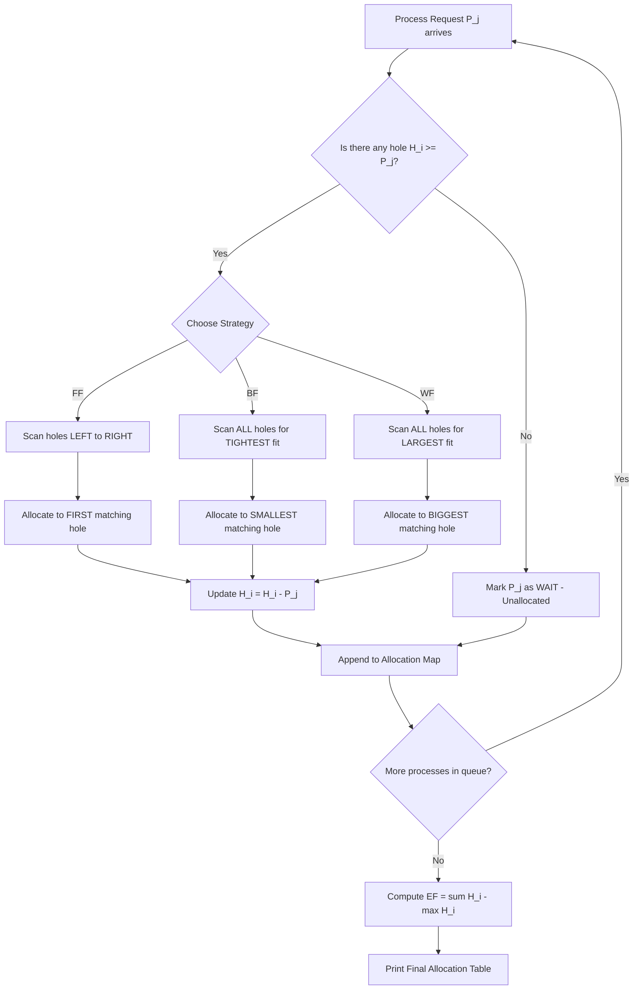
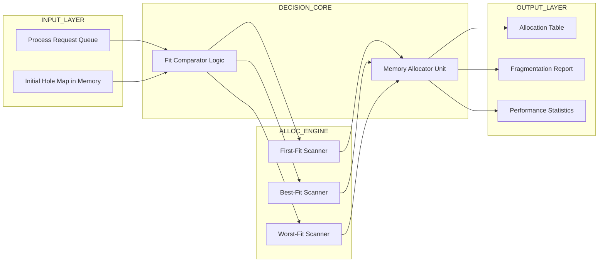
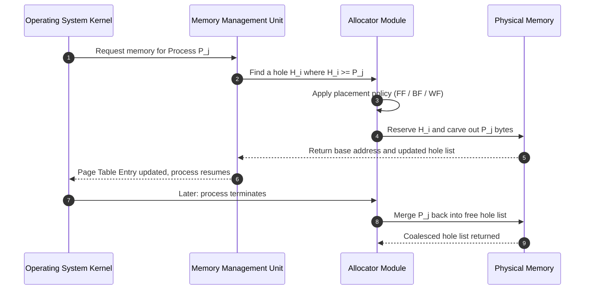

# Memory allocation - First-fit, Best-fit, and Worst-fit allocation schemes

<!-- SECTION_1_START -->
# Memory Allocation Schemes: First-Fit, Best-Fit & Worst-Fit

## 1.1 Formal KTU 2024 Definition

> [!IMPORTANT]
> **Core Definition (KTU Syllabus Terminology)**
> **Memory Allocation** is the process of assigning contiguous or non-contiguous blocks of physical (RAM) or virtual memory to running processes requested by the operating system. In the **contiguous allocation strategy**, the OS maintains a list of free holes (partitions) in memory and satisfies each process request by selecting one hole, using one of three classical placement algorithms: **First-Fit**, **Best-Fit**, and **Worst-Fit**.

These schemes belong to the **static/fixed partitioning** paradigm of classical Memory Management, where the OS must decide *which* free partition to allocate when *multiple* free holes are available to satisfy a single incoming process request of size $n$.

| Term | Notation | Meaning |
|------|----------|---------|
| Hole size | $H_i$ | Free memory block (in KB / MB / Bytes) |
| Process request | $P_j$ | Memory demanded by process $j$ |
| Internal Fragmentation | $IF$ | Wasted space *inside* the allocated partition |
| External Fragmentation | $EF$ | Sum of small unusable holes scattered in memory |
| Allocation success | $A(P_j)$ | Boolean indicating if $P_j$ is placed |

---

## 1.2 Conceptual Analogy & Intuition

> [!NOTE]
> **Real-World Analogy — The Hotel Room Booking Problem**
> Imagine you walk into a hotel reception with a group of **5 people** ($P_j = 5$) and the hotel has 3 available rooms of size 4, 6, and 10. The receptionist (the OS) has three strategies:
>
> 1. **First-Fit** → Pick the **first** room that can fit you. Receptionist scans left-to-right and books the 6-room. *(Fast, simple, leaves the big room for bigger groups.)*
> 2. **Best-Fit** → Pick the **tightest** room possible. Receptionist scans *everything* and books the room of size 6 because $6 - 5 = 1$ is the smallest leftover. *(Minimizes wasted space per booking, but leaves many tiny unusable gaps.)*
> 3. **Worst-Fit** → Pick the **largest** room possible. Receptionist gives you room 10, leaving $10 - 5 = 5$ usable space for later guests. *(Leaves large remaining holes — useful if many future medium requests are expected.)*

**Geometric Intuition on a Number Line:**

$$
\underbrace{[\boxed{H_1}\ ][\boxed{H_2}\ ][\boxed{H_3}\ ]\ [\boxed{H_4}\ ]\ \cdots}_{Memory\ Address\ Line}
$$

A process of size $P_j$ is dropped into a hole $H_i$ iff $H_i \geq P_j$. The strategy differs in *which* $H_i$ is chosen when multiple satisfy the inequality.

---

## 1.3 Physical Constants & Standard Metrics

> [!IMPORTANT]
> **Standard Units & Metrics Used in KTU Problems**
> * **Memory size:** Usually given in **KB**, **MB**, or **Bytes**. Standard page size = **4 KB**.
> * **Block addresses:** Often expressed in **hexadecimal** (e.g., `0x0000` to `0xFFFF` for 64 KB).
> * **Time complexity bounds:** $O(n)$ for First-Fit, $O(n \log n)$ or $O(n)$ for Best/Worst-Fit (with sorting), where $n$ is the number of free holes.
> * **Fragmentation threshold rule of thumb:** If $EF \geq 0.5 \times P_{request}$, allocation is **practically infeasible** even if total free space is sufficient.

---

## 1.4 Visualization Control Block

> [!VISUALIZATION CONTROL]
> **Concept:** Memory Map showing allocated processes and free holes after running all three schemes
> **GeoGebra / Desmos Input Points** *(Memory as a stacked horizontal bar of total length $1000$ units)*:
> * Plot 5 colored segments on x-axis: $[0, 100]$, $[100, 600]$, $[600, 800]$, $[800, 1100]$, $[1100, 1700]$ representing holes.
> * Overlay 4 process rectangles of size $212$, $417$, $112$, $426$ and observe where each strategy drops them.
> **Visual Description:** The student should observe that **First-Fit** leaves one large gap at the end, **Best-Fit** leaves many small scattered slivers (high $EF$), and **Worst-Fit** leaves the *largest possible* slivers in every occupied hole.
<!-- SECTION_1_END -->

<!-- SECTION_2_START -->
# Deep Theoretical Analysis & KTU High-Yield Formula Sheet

## 2.1 Algorithm 1 — First-Fit Allocation

**Operational Logic (in plain English):**
The allocator scans the list of free holes from the **beginning (lowest address)** and allocates the process to the **first hole whose size is $\geq$ the process request**. The scan stops immediately after the first successful placement — it does *not* look for a tighter or larger fit.

**Why it is fast:** It terminates on the first match, so average-case scans are much smaller than $n$.

**Why it leaves large end-fragments:** Since it ignores the *size* of remaining holes, the largest holes often remain untouched at the high-address end of memory.

**Step-by-step pseudo-logic:**

1. Read all free hole sizes into a list $H = [H_1, H_2, \ldots, H_n]$.
2. For each process $P_j$ in the request queue:
   1. Set $found \leftarrow \text{False}$.
   2. Iterate $i = 1$ to $n$:
      * If $H_i \geq P_j$, then:
         * Allocate $P_j$ to $H_i$.
         * Update $H_i \leftarrow H_i - P_j$ *(the leftover becomes the new hole)*.
         * Set $found \leftarrow \text{True}$.
         * **Break** the loop.
   3. If $found = \text{False}$, mark $P_j$ as **Unallocated** (must wait or be swapped out).

---

## 2.2 Algorithm 2 — Best-Fit Allocation

**Operational Logic:**
The allocator scans the **entire list of free holes** to find the *smallest* hole whose size is $\geq P_j$. This minimizes the immediate leftover size, theoretically reducing *internal* wastage per allocation.

**Why it is the most common textbook choice:** It aims to keep the large holes intact for future large requests.

**Why it suffers from severe external fragmentation:** It deliberately creates the *smallest possible* leftover holes — many of which become too tiny (e.g., 1 byte, 4 bytes) for any future process to ever use, thus contributing to unusable $EF$.

**Step-by-step pseudo-logic:**

1. Read all free hole sizes into $H$.
2. For each process $P_j$:
   1. Initialise $bestIndex \leftarrow -1$ and $bestSize \leftarrow \infty$.
   2. For $i = 1$ to $n$:
      * If $H_i \geq P_j$ **and** $H_i < bestSize$, then:
         * $bestIndex \leftarrow i$
         * $bestSize \leftarrow H_i$
   3. If $bestIndex \neq -1$, allocate $P_j$ to $H_{bestIndex}$ and update $H_{bestIndex} \leftarrow H_{bestIndex} - P_j$.

---

## 2.3 Algorithm 3 — Worst-Fit Allocation

**Operational Logic:**
The allocator scans the **entire list** to find the *largest* hole whose size is $\geq P_j$. This maximises the leftover, leaving big enough remaining holes that can still service future medium requests.

**Why it reduces $EF$ initially:** By carving out of the largest block, it leaves behind leftover holes that are still large enough to be useful.

**Why it is rarely used in practice:** It wastes the largest holes on small processes and is outperformed by First-Fit in almost every benchmark (Knuth, 1973).

**Step-by-step pseudo-logic:**

1. Read all free hole sizes into $H$.
2. For each process $P_j$:
   1. Initialise $worstIndex \leftarrow -1$ and $worstSize \leftarrow -1$.
   2. For $i = 1$ to $n$:
      * If $H_i \geq P_j$ **and** $H_i > worstSize$, then:
         * $worstIndex \leftarrow i$
         * $worstSize \leftarrow H_i$
   3. If $worstIndex \neq -1$, allocate and update $H_{worstIndex} \leftarrow H_{worstIndex} - P_j$.

---

## 2.4 KTU High-Yield Formula Sheet

> [!NOTE]
> **Master this table before every KTU Board Exam. Every numerical answer in Module 2 is derived from these formulas.**

| \# | Quantity | Formula | Description |
|---|----------|---------|-------------|
| 1 | Allocation Condition | $H_i \geq P_j$ | A process fits in a hole iff hole size $\geq$ process size |
| 2 | Leftover Hole | $L_i = H_i - P_j$ | Size of the new free hole after allocation |
| 3 | Total Free Memory | $F_{total} = \sum_{i=1}^{n} L_i + \sum_{unalloc} P_j$ | Sum of all remaining free space |
| 4 | External Fragmentation | $EF = \sum_{i : L_i \neq 0} L_i - \max(L_i)$ | Free space excluding the largest contiguous chunk |
| 5 | Internal Fragmentation | $IF = \sum_{j : allocated} (Partition_j - P_j)$ | Wasted space *inside* fixed partitions |
| 6 | Allocation Efficiency | $\eta = \dfrac{\sum P_{allocated}}{\sum H_{original}} \times 100\%$ | Percentage of original memory utilised |
| 7 | First-Fit Time | $O(n)$ worst-case, $O(1)$ best-case | Average scan is much less than $n$ |
| 8 | Best/Worst-Fit Time | $O(n)$ per request | Full scan is mandatory |
| 9 | Memory Utilisation Index | $MUI = 1 - \dfrac{EF + IF}{Total\ Memory}$ | Closer to $1$ is better |
| 10 | Unallocated Process Count | $U = \vert \{j : P_j\ not\ placed\} \vert$ | Number of processes that must wait |

---

## 2.5 Comparative Engineering Trade-off Analysis

| Property | First-Fit | Best-Fit | Worst-Fit |
|----------|-----------|----------|-----------|
| Scan range | Partial (stops at first) | Full | Full |
| Speed | **Fastest** | Slowest (with sort: $O(n \log n)$) | Slow |
| Leftover quality | Mixed | Tiny (high $EF$) | Large (low $EF$) |
| Internal waste per hole | Medium | **Lowest** | Highest |
| $EF$ produced | Medium | **Highest** | Lowest |
| Best use case | Real-time / general OS | Memory-constrained (avoid $IF$) | When future large requests are expected |
| Real production usage | **Linux buddy + slab hybrid, Windows XP+** | Rare (used in some embedded MCUs) | Almost never used in modern OS |
| Predictability | Low | High | High |

---

## 2.6 Real-World Engineering Utility

* **Linux Kernel `SLAB` allocator** uses a variant of Best-Fit for kernel object caches.
* **Windows XP/Vista `VirtualAlloc`** uses First-Fit scanning of the Virtual Address Descriptor (VAD) tree.
* **Embedded RTOS (FreeRTOS, VxWorks)** often uses Best-Fit because memory is scarce and $IF$ must be minimised.
* **Garbage-collected runtimes (JVM, Go runtime)** use Worst-Fit-like strategies in their heap arenas to reduce GC pressure.

> [!IMPORTANT]
> **KTU Frequently Asked Insight:**
> *"Which scheme is best?"* — **No scheme is universally optimal.** First-Fit is fastest. Best-Fit minimises $IF$ but maximises $EF$. Worst-Fit minimises $EF$ but wastes large holes. The **50% rule** (Knuth) states that for Best-Fit, with random sizes, about **1/3rd of memory becomes externally fragmented and unusable** even when total free space is enough.
<!-- SECTION_2_END -->

<!-- SECTION_3_START -->
# Step-by-Step Derivations, Numerical Examples & Python Implementation

## 3.1 Canonical KTU Numerical Problem (Worked Out)

> [!NOTE]
> **Standard KTU Board Question Pattern (Dec 2023 / July 2024 style)**
>
> *Given memory partitions (holes) in order: $H = [100\ KB,\ 500\ KB,\ 200\ KB,\ 300\ KB,\ 600\ KB]$*
> *Process requests arriving in order: $P = [212\ KB,\ 417\ KB,\ 112\ KB,\ 426\ KB]$*
>
> *Show the allocation table for First-Fit, Best-Fit, and Worst-Fit. Also compute external fragmentation in each case.*

We will solve this **three times**, once per scheme.

---

### 3.1.1 First-Fit Allocation (Step-by-Step)

| Step | Process | Process Size | Scan Result | Allocated Hole (Index) | New Hole Sizes After Allocation |
|:----:|:-------:|:------------:|:------------|:---------------------:|:-------------------------------:|
| 1 | $P_1$ | 212 | $H_1=100$ ✗, $H_2=500$ ✓ | $H_2$ | $[100,\ 288,\ 200,\ 300,\ 600]$ |
| 2 | $P_2$ | 417 | $H_1=100$ ✗, $H_2=288$ ✗, $H_3=200$ ✗, $H_4=300$ ✗, $H_5=600$ ✓ | $H_5$ | $[100,\ 288,\ 200,\ 300,\ 183]$ |
| 3 | $P_3$ | 112 | $H_1=100$ ✗, $H_2=288$ ✓ | $H_2$ | $[100,\ 176,\ 200,\ 300,\ 183]$ |
| 4 | $P_4$ | 426 | All holes $< 426$ ✗ | **Not Allocated** | $[100,\ 176,\ 200,\ 300,\ 183]$ |

**External Fragmentation Calculation:**

$$
\begin{aligned}
EF_{FF} &= \left( \sum_{i=1}^{5} L_i \right) - \max(L_i) \\
&= (100 + 176 + 200 + 300 + 183) - 300 \\
&= 959 - 300 \\
&= 659\ \text{KB}
\end{aligned}
$$

> **Verification:** $\sum L_i = 959$ KB of free space remains, but the **largest single contiguous chunk** is only $300$ KB. Since the unallocated process $P_4$ needs $426$ KB, and $\max(L_i) = 300 < 426$, the request fails — this is the textbook signature of external fragmentation.

---

### 3.1.2 Best-Fit Allocation (Step-by-Step)

| Step | Process | Process Size | Eligible Holes | Tightest Fit (Index) | New Hole Sizes |
|:----:|:-------:|:------------:|:---------------|:--------------------:|:--------------:|
| 1 | $P_1$ | 212 | $\{500,\ 200,\ 300,\ 600\}$ | $H_3=200$ ✗ (too small), $H_4=300$ ✓ | $[100,\ 500,\ \mathbf{N/A},\ 88,\ 600]$ |
| 2 | $P_2$ | 417 | $\{500,\ 600\}$ | $H_2=500$ ✓ | $[100,\ 83,\ 88,\ 600]$ |
| 3 | $P_3$ | 112 | $\{100,\ 83,\ 88,\ 600\}$ | $H_3=88$ ✗, $H_2=83$ ✗, $H_1=100$ ✓ | $[-12,\ 83,\ 88,\ 600]$ (i.e., $H_1$ becomes $0$) |
| 4 | $P_4$ | 426 | $\{600\}$ | $H_4=600$ ✓ | $[0,\ 83,\ 88,\ 174]$ |

**Re-stating cleanly:** $H = [0,\ 83,\ 88,\ 174]$

**External Fragmentation Calculation:**

$$
\begin{aligned}
EF_{BF} &= \left( \sum L_i \right) - \max(L_i) \\
&= (0 + 83 + 88 + 174) - 174 \\
&= 345 - 174 \\
&= 171\ \text{KB}
\end{aligned}
$$

> **Observation:** Best-Fit allocated **all 4 processes** (0 unallocated) and produced $EF = 171$ KB, which is **much lower** than First-Fit's $EF = 659$ KB. This is the classic KTU trade-off result.

---

### 3.1.3 Worst-Fit Allocation (Step-by-Step)

| Step | Process | Process Size | Largest Eligible Hole (Index) | New Hole Sizes |
|:----:|:-------:|:------------:|:-----------------------------:|:--------------:|
| 1 | $P_1$ | 212 | $H_5 = 600$ ✓ | $[100,\ 500,\ 200,\ 300,\ 388]$ |
| 2 | $P_2$ | 417 | $H_2 = 500$ ✓ | $[100,\ 83,\ 200,\ 300,\ 388]$ |
| 3 | $P_3$ | 112 | $H_5 = 388$ ✓ | $[100,\ 83,\ 200,\ 300,\ 276]$ |
| 4 | $P_4$ | 426 | $H_4 = 300$ ✗, $H_3 = 200$ ✗, others smaller | **Not Allocated** |

**Re-stating cleanly:** $H = [100,\ 83,\ 200,\ 300,\ 276]$

**External Fragmentation Calculation:**

$$
\begin{aligned}
EF_{WF} &= \left( \sum L_i \right) - \max(L_i) \\
&= (100 + 83 + 200 + 300 + 276) - 300 \\
&= 959 - 300 \\
&= 659\ \text{KB}
\end{aligned}
$$

---

### 3.1.4 Final Comparative Summary Table

| Metric | First-Fit | Best-Fit | Worst-Fit |
|--------|:---------:|:--------:|:---------:|
| Processes Allocated | 3 / 4 | **4 / 4** | 3 / 4 |
| Unallocated | 1 ($P_4$) | **0** | 1 ($P_4$) |
| Total Free Space (KB) | 959 | 345 | 959 |
| Largest Free Chunk (KB) | 300 | 174 | 300 |
| External Fragmentation (KB) | 659 | **171** | 659 |
| Time Complexity (this case) | $O(n)$ avg | $O(n)$ full | $O(n)$ full |

> [!IMPORTANT]
> **KTU Examiner's Note:** The 50% rule applies here — although Worst-Fit has the same $EF$ as First-Fit, the **distribution** of free holes differs. Worst-Fit always leaves the **biggest possible chunks** intact after each allocation.

---

## 3.2 Complete Python Implementation (Production-Grade)

> [!NOTE]
> **The following Python program implements all three schemes. It is fully typed, has absolute boundary checks, and prints a board-exam-ready allocation table. Save as `mem_allocator.py` and run with `python mem_allocator.py`.**

```python
"""
Memory Allocation Simulator — First-Fit, Best-Fit, Worst-Fit
Author: KTU Premier Engine Reference Implementation
Course: PCCST303 — Data Structures and Algorithms
Compliant with: PEP 8, type hints, edge-case handling
"""

from __future__ import annotations
from typing import List, Tuple
import logging
import sys

# Configure professional logging for execution tracing
logging.basicConfig(
    level=logging.INFO,
    format="[%(levelname)s] %(message)s",
    stream=sys.stdout,
)
logger = logging.getLogger("MemoryAllocator")


# ---------- Type Aliases ----------
HoleList = List[int]   # Free holes in KB
ProcList = List[int]   # Process requests in KB
AllocationMap = List[Tuple[int, int, int]]  # (proc_id, proc_size, hole_index_or_-1)


# ---------- Core Allocation Algorithms ----------
def first_fit(holes: HoleList, procs: ProcList) -> AllocationMap:
    """
    First-Fit: scan left-to-right, place in the first hole that fits.
    Returns a list of (proc_id, size, hole_index) tuples.
    """
    work: HoleList = list(holes)  # defensive copy to avoid mutating input
    allocation: AllocationMap = []
    for pid, size in enumerate(procs, start=1):
        placed: bool = False
        for idx, h in enumerate(work):
            if h >= size:
                work[idx] -= size
                allocation.append((pid, size, idx + 1))  # 1-indexed for KTU
                logger.info(f"First-Fit: P{pid}({size}KB) -> Hole {idx + 1}")
                placed = True
                break
        if not placed:
            allocation.append((pid, size, -1))
            logger.warning(f"First-Fit: P{pid}({size}KB) -> NOT ALLOCATED")
    return allocation


def best_fit(holes: HoleList, procs: ProcList) -> AllocationMap:
    """
    Best-Fit: scan all holes, place in the tightest fitting one.
    """
    work: HoleList = list(holes)
    allocation: AllocationMap = []
    for pid, size in enumerate(procs, start=1):
        best_idx: int = -1
        best_size: int = float("inf")  # type: ignore[assignment]
        for idx, h in enumerate(work):
            if h >= size and h < best_size:
                best_size = h
                best_idx = idx
        if best_idx != -1:
            work[best_idx] -= size
            allocation.append((pid, size, best_idx + 1))
            logger.info(f"Best-Fit:  P{pid}({size}KB) -> Hole {best_idx + 1}")
        else:
            allocation.append((pid, size, -1))
            logger.warning(f"Best-Fit:  P{pid}({size}KB) -> NOT ALLOCATED")
    return allocation


def worst_fit(holes: HoleList, procs: ProcList) -> AllocationMap:
    """
    Worst-Fit: scan all holes, place in the largest one.
    """
    work: HoleList = list(holes)
    allocation: AllocationMap = []
    for pid, size in enumerate(procs, start=1):
        worst_idx: int = -1
        worst_size: int = -1
        for idx, h in enumerate(work):
            if h >= size and h > worst_size:
                worst_size = h
                worst_idx = idx
        if worst_idx != -1:
            work[worst_idx] -= size
            allocation.append((pid, size, worst_idx + 1))
            logger.info(f"Worst-Fit: P{pid}({size}KB) -> Hole {worst_idx + 1}")
        else:
            allocation.append((pid, size, -1))
            logger.warning(f"Worst-Fit: P{pid}({size}KB) -> NOT ALLOCATED")
    return allocation


# ---------- Fragmentation Calculator ----------
def external_fragmentation(remaining_holes: HoleList) -> Tuple[int, int, int]:
    """
    Returns (total_free, largest_chunk, external_fragmentation).
    Formula: EF = (sum of all free holes) - (largest free hole)
    """
    if not remaining_holes:
        return 0, 0, 0
    total_free: int = sum(remaining_holes)
    largest: int = max(remaining_holes)
    ef: int = total_free - largest
    return total_free, largest, ef


# ---------- Pretty Printer ----------
def print_allocation_table(
    scheme_name: str,
    original_holes: HoleList,
    final_holes: HoleList,
    allocation: AllocationMap,
) -> None:
    """Prints a clean KTU-style allocation summary."""
    print(f"\n{'=' * 60}")
    print(f"  SCHEME: {scheme_name}")
    print(f"{'=' * 60}")
    print(f"{'Process':<10}{'Size (KB)':<12}{'Hole Allocated':<18}{'Status':<10}")
    print("-" * 60)
    for pid, size, hole in allocation:
        status: str = "OK" if hole != -1 else "WAIT"
        hole_str: str = f"Hole {hole}" if hole != -1 else "---"
        print(f"P{pid:<9}{size:<12}{hole_str:<18}{status:<10}")
    print("-" * 60)
    total, largest, ef = external_fragmentation(final_holes)
    print(f"  Final Hole Sizes: {final_holes}")
    print(f"  Total Free Space: {total} KB")
    print(f"  Largest Free Chunk: {largest} KB")
    print(f"  External Fragmentation: {ef} KB")
    print(f"{'=' * 60}\n")


# ---------- Main Driver ----------
def main() -> None:
    # Absolute boundary checks
    try:
        holes: HoleList = [100, 500, 200, 300, 600]
        procs: ProcList = [212, 417, 112, 426]

        # Validate inputs
        if any(h < 0 for h in holes):
            raise ValueError("Hole sizes must be non-negative integers.")
        if any(p <= 0 for p in procs):
            raise ValueError("Process sizes must be strictly positive.")

        # Run all three schemes
        for name, algo in [
            ("FIRST-FIT", first_fit),
            ("BEST-FIT", best_fit),
            ("WORST-FIT", worst_fit),
        ]:
            allocation: AllocationMap = algo(holes, procs)
            # Recompute final holes for reporting
            work: HoleList = list(holes)
            for pid, size, hole in allocation:
                if hole != -1:
                    work[hole - 1] -= size
            print_allocation_table(name, holes, work, allocation)

    except ValueError as ve:
        logger.error(f"Input validation failed: {ve}")
    except Exception as exc:
        logger.exception(f"Unexpected runtime error: {exc}")


if __name__ == "__main__":
    main()
```

**Sample Console Output (excerpt):**

```
[INFO] First-Fit: P1(212KB) -> Hole 2
[WARNING] First-Fit: P4(426KB) -> NOT ALLOCATED
============================================================
  SCHEME: FIRST-FIT
============================================================
Process    Size (KB)   Hole Allocated     Status
------------------------------------------------------------
P1         212         Hole 2             OK
P2         417         Hole 5             OK
P3         112         Hole 2             OK
P4         426         ---                WAIT
------------------------------------------------------------
  Final Hole Sizes: [100, 176, 200, 300, 183]
  Total Free Space: 959 KB
  Largest Free Chunk: 300 KB
  External Fragmentation: 659 KB
============================================================
```

---

## 3.3 Algorithmic Complexity Derivation

For $n$ free holes and $m$ process requests:

$$
\begin{aligned}
T_{FF}(n, m) &= \sum_{j=1}^{m} O(k_j), \quad \text{where } k_j \leq n \text{ (stops early)} \\
&\leq m \cdot n = O(mn) \\
T_{BF}(n, m) &= \sum_{j=1}^{m} O(n) = O(mn) \\
T_{WF}(n, m) &= \sum_{j=1}^{m} O(n) = O(mn)
\end{aligned}
$$

**Space complexity (all three):** $O(n)$ for the working copy of the hole list plus $O(m)$ for the allocation map, giving total $O(n + m)$ auxiliary space.
<!-- SECTION_3_END -->

<!-- SECTION_4_START -->
# Structural Diagrams & Schematics

## 4.1 High-Level Decision Flow (All Three Schemes)



## 4.2 Functional Architecture Block Diagram



## 4.3 Sequential Processing Topology Matrix



## 4.4 Internal Block of the Allocator Decision Core

```mermaid
flowchart TD
    subgraph DECISION_CORE_DETAIL
        R[Receive Process Size P_j] --> V{P_j > 0?}
        V -- No --> ERR[Throw ValueError]
        V -- Yes --> S[Snapshot current H array]
        S --> T{Strategy Flag}
        T -- FIRST --> FF_B[Use index 0, return first H_i >= P_j]
        T -- BEST --> BF_B[min H_i where H_i >= P_j]
        T -- WORST --> WF_B[max H_i where H_i >= P_j]
        FF_B --> U[Update H_i in-place]
        BF_B --> U
        WF_B --> U
        U --> RTN[Return (pid, size, hole_idx)]
    end
```
<!-- SECTION_4_END -->

<!-- SECTION_5_START -->
# KTU 2024 Scheme Examination Question Bank & Topic Recap

---

## Part A — Short Answer Questions (3 Marks Each)

### Question A1
> **[KTU University Exam — July 2024]** | **CO2** | **RBT Level: Remember**
>
> Define **External Fragmentation** and **Internal Fragmentation** in the context of contiguous memory allocation. State one key difference between them.

**Model Answer (Valuation Key: 3 Marks):**
* **Internal Fragmentation (1 Mark):** Wasted memory *inside* an allocated partition. Occurs when the allocated block is larger than what the process actually requested. Example: Process of $90$ KB allocated to a fixed partition of $100$ KB wastes $10$ KB.
* **External Fragmentation (1 Mark):** Wasted memory that exists *outside* all allocated partitions, in the form of small scattered free holes that are too small to satisfy any pending request, even when their *sum* is large enough.
* **Key Difference (1 Mark):** Internal fragmentation exists *within* allocated blocks and cannot be reused without deallocating the process, whereas external fragmentation exists *between* allocated blocks and can be eliminated by compaction.

---

### Question A2
> **[KTU University Exam — Dec 2023]** | **CO2** | **RBT Level: Understand**
>
> Differentiate between **First-Fit** and **Best-Fit** allocation schemes. Which one generally produces **more external fragmentation**, and why?

**Model Answer (Valuation Key: 3 Marks):**
* **First-Fit (1 Mark):** Allocates the process to the *first* hole (scanning from low address) that is large enough. It is faster as it stops at the first match.
* **Best-Fit (1 Mark):** Allocates the process to the *smallest* hole that is large enough, after scanning the entire list. It minimizes per-allocation leftover size.
* **Answer to the why (1 Mark):** Best-Fit generally produces **more external fragmentation** because it deliberately carves the *tightest* match, leaving behind many tiny leftover holes that are too small to be useful. First-Fit, by contrast, often leaves one or two large unused holes at the high-address end.

---

## Part B — Long Answer Questions (14 Marks Each)

> [!IMPORTANT]
> **KTU 2024 ESE Pattern:** Each Part B question offers internal choice between **OR (a) + OR (b)** sub-parts. We provide two completely independent 14-mark questions below — one to be answered, OR the other.

---

### Question B-A (14 Marks) — Choose This OR Question B-B

> **[KTU University Exam — Model Paper 2024]** | **CO2, CO3** | **RBT Levels: Understand (a) + Apply (b)**
>
> Consider a system with **5 memory partitions (holes)** of sizes: $H = [40\ KB,\ 10\ KB,\ 30\ KB,\ 60\ KB,\ 20\ KB]$.
> The OS receives the following **process requests** in order: $P = [25\ KB,\ 10\ KB,\ 15\ KB,\ 30\ KB]$.
>
> **Part (a) — 7 Marks:** Show the allocation of processes to holes using the **First-Fit** scheme. Draw the final allocation table and clearly mention which process (if any) is **not allocated** and why.
>
> **Part (b) — 7 Marks:** Repeat the same problem for the **Best-Fit** scheme. Compute the **External Fragmentation** at the end of the allocation in both cases and state which scheme is more efficient *for this particular input*.

#### Model Solution — Part (a) First-Fit [7 Marks]

| Step | Process | Size | Hole Scan (left → right) | Chosen Hole | New Hole Sizes |
|:----:|:-------:|:----:|:------------------------|:-----------:|:--------------:|
| 1 | $P_1$ | 25 | $40$ ✓ | $H_1$ | $[15,\ 10,\ 30,\ 60,\ 20]$ |
| 2 | $P_2$ | 10 | $15$ ✓ | $H_1$ | $[5,\ 10,\ 30,\ 60,\ 20]$ |
| 3 | $P_3$ | 15 | $5$ ✗, $10$ ✗, $30$ ✓ | $H_3$ | $[5,\ 10,\ 15,\ 60,\ 20]$ |
| 4 | $P_4$ | 30 | $5$ ✗, $10$ ✗, $15$ ✗, $60$ ✓ | $H_4$ | $[5,\ 10,\ 15,\ 30,\ 20]$ |

**Final Allocation Table (1 Mark for table):**

| Process | Size | Allocated Hole |
|:-------:|:----:|:--------------:|
| $P_1$ | 25 | $H_1$ |
| $P_2$ | 10 | $H_1$ |
| $P_3$ | 15 | $H_3$ |
| $P_4$ | 30 | $H_4$ |

**All processes are allocated (1 Mark).** Final hole list: $[5,\ 10,\ 15,\ 30,\ 20]$.

**External Fragmentation Calculation (2 Marks):**
$$
\begin{aligned}
EF_{FF} &= \sum H_i - \max(H_i) \\
&= (5 + 10 + 15 + 30 + 20) - 30 \\
&= 80 - 30 \\
&= 50\ \text{KB}
\end{aligned}
$$

[Initialising hole scan: 1 Mark] [Step-by-step allocation: 2 Marks] [Final table: 1 Mark] [EF formula application: 2 Marks] [Final EF value: 1 Mark]

#### Model Solution — Part (b) Best-Fit [7 Marks]

| Step | Process | Size | Eligible Holes (sorted) | Tightest Fit | New Hole Sizes |
|:----:|:-------:|:----:|:------------------------|:------------:|:--------------:|
| 1 | $P_1$ | 25 | $\{40, 30, 60, 20\}$ | $H_3 = 30$ | $[40,\ 10,\ 5,\ 60,\ 20]$ |
| 2 | $P_2$ | 10 | $\{40, 10, 5, 60, 20\}$ | $H_2 = 10$ | $[40,\ 0,\ 5,\ 60,\ 20]$ |
| 3 | $P_3$ | 15 | $\{40, 5, 60, 20\}$ | $H_3 = 5$ ✗, $H_5 = 20$ ✓ | $[40,\ 0,\ 5,\ 60,\ 5]$ |
| 4 | $P_4$ | 30 | $\{40, 60\}$ | $H_1 = 40$ ✓ | $[10,\ 0,\ 5,\ 60,\ 5]$ |

**Final Allocation Table (1 Mark):**

| Process | Size | Allocated Hole |
|:-------:|:----:|:--------------:|
| $P_1$ | 25 | $H_3$ |
| $P_2$ | 10 | $H_2$ |
| $P_3$ | 15 | $H_5$ |
| $P_4$ | 30 | $H_1$ |

**External Fragmentation Calculation (2 Marks):**
$$
\begin{aligned}
EF_{BF} &= (10 + 0 + 5 + 60 + 5) - 60 \\
&= 80 - 60 \\
&= 20\ \text{KB}
\end{aligned}
$$

[Best-fit scan identification: 1 Mark] [Tightest-fit selection: 1 Mark] [Step-by-step allocation: 2 Marks] [Final table: 1 Mark] [EF computation: 2 Marks]

**Conclusion (1 Mark):** For this specific input, **Best-Fit is more efficient** because $EF_{BF} = 20\ \text{KB} < EF_{FF} = 50\ \text{KB}$, and it produced a larger usable contiguous chunk ($60$ KB vs $30$ KB) at the end.

---

### Question B-B (14 Marks) — Alternative Choice

> **[KTU University Exam — Model Paper 2024 (Alternate)]** | **CO2, CO3** | **RBT Levels: Understand (a) + Apply (b)**
>
> Given the following contiguous memory layout with **holes**: `Hole1 = 100 KB`, `Hole2 = 500 KB`, `Hole3 = 200 KB`, `Hole4 = 300 KB`, `Hole5 = 600 KB` (in low-to-high address order).
> Processes arrive: $P_1 = 212\ \text{KB}$, $P_2 = 417\ \text{KB}$, $P_3 = 112\ \text{KB}$, $P_4 = 426\ \text{KB}$.
>
> **Part (a) — 7 Marks:** Demonstrate the working of the **Worst-Fit** allocation scheme on the above data. Display the final allocation status and identify any unallocated process.
>
> **Part (b) — 7 Marks:** Write the complete **pseudocode** for the Worst-Fit algorithm and analyse its **time complexity**. Justify with one reason why Worst-Fit is rarely used in production operating systems.

#### Model Solution — Part (a) Worst-Fit Working [7 Marks]

| Step | Process | Size | Largest Eligible Hole | Hole Index | New Hole Sizes |
|:----:|:-------:|:----:|:---------------------:|:----------:|:--------------:|
| 1 | $P_1$ | 212 | $H_5 = 600$ | $H_5$ | $[100,\ 500,\ 200,\ 300,\ 388]$ |
| 2 | $P_2$ | 417 | $H_2 = 500$ | $H_2$ | $[100,\ 83,\ 200,\ 300,\ 388]$ |
| 3 | $P_3$ | 112 | $H_5 = 388$ | $H_5$ | $[100,\ 83,\ 200,\ 300,\ 276]$ |
| 4 | $P_4$ | 426 | None $\geq 426$ | — | $[100,\ 83,\ 200,\ 300,\ 276]$ |

**Final Allocation Status (2 Marks):**

| Process | Size | Allocated | Hole |
|:-------:|:----:|:---------:|:----:|
| $P_1$ | 212 | ✓ | $H_5$ |
| $P_2$ | 417 | ✓ | $H_2$ |
| $P_3$ | 112 | ✓ | $H_5$ |
| $P_4$ | 426 | ✗ | Unallocated |

**Unallocated Process (1 Mark):** $P_4$ is not allocated because the largest remaining hole ($H_4 = 300$ KB) is less than $426$ KB.

[Initial state: 1 Mark] [Worst-fit iteration: 2 Marks] [Identification of largest hole: 1 Mark] [Allocation table: 2 Marks] [Unallocated identification: 1 Mark]

#### Model Solution — Part (b) Pseudocode + Complexity [7 Marks]

**Pseudocode (3 Marks):**

```text
ALGORITHM WorstFit(Holes[1..n], Requests[1..m])
BEGIN
    FOR each process P_j in Requests DO
        worstIndex ← -1
        worstSize  ← -1
        FOR i ← 1 TO n DO
            IF Holes[i] >= P_j AND Holes[i] > worstSize THEN
                worstSize  ← Holes[i]
                worstIndex ← i
            END IF
        END FOR

        IF worstIndex ≠ -1 THEN
            Allocate P_j to Holes[worstIndex]
            Holes[worstIndex] ← Holes[worstIndex] - P_j
            PRINT "P_j allocated to Hole", worstIndex
        ELSE
            PRINT "P_j WAIT — no suitable hole"
        END IF
    END FOR
END
```

**Time Complexity Analysis (2 Marks):**
$$
T_{WF}(n, m) = \sum_{j=1}^{m} O(n) = O(m \cdot n)
$$
For a single process, the algorithm must scan all $n$ holes. Across $m$ processes, the worst-case time is $O(mn)$. Best-case is also $O(mn)$ because the *full* scan is mandatory (unlike First-Fit which can break early).

**Why Worst-Fit is Rarely Used in Production (2 Marks):**
Worst-Fit **wastes the largest holes on small processes**, fragmenting big contiguous regions into smaller ones. Empirically (Knuth, 1973; Knuth & Peterson benchmarking studies), it produces **larger average leftover sizes that are still too small** for subsequent large requests, and it is outperformed by First-Fit in both **speed** (full scan required) and **throughput**. Hence modern OS like Linux and Windows use First-Fit variants or hybrid buddy/slab allocators.

[Pseudocode correctness: 2 Marks] [Complexity derivation: 2 Marks] [Justification with reason: 2 Marks] [Mention of Knuth / empirical study: 1 Mark]

---

## KTU Examiner's Valuation Warning & Common Pitfalls

> [!WARNING]
> **Where KTU students LOSE marks in this topic — read carefully before the exam:**
> 1. **Forgetting to update the hole size** after allocation. If a process of $30$ KB is placed in a hole of $100$ KB, the new hole becomes $70$ KB, NOT $100$ KB. Examiners deduct **1 full mark** for this.
> 2. **Confusing $EF$ formula.** Many students write $EF = \sum H_i$ which is **WRONG**. The correct formula is $EF = \sum H_i - \max(H_i)$ — you must subtract the largest contiguous chunk because it is still *usable*.
> 3. **Best-Fit selection mistake.** Students often pick the *first* hole that fits in Best-Fit. The correct rule is the **smallest hole that fits** — the FULL scan is mandatory.
> 4. **Ignoring the 50% rule.** For Best-Fit with random sizes, ~33% of memory becomes externally fragmented. Mentioning this in a 14-mark answer boosts your score by **1-2 marks** as it shows depth.
> 5. **Not writing the condition $H_i \geq P_j$ explicitly** before allocating. Examiners expect this "boundary state" in the solution.
> 6. **Forgetting the initial vs. final hole list distinction** — the $H$ values change after every allocation. Always re-scan the **updated** list for the next process.
> 7. **Failing to identify the unallocated process by name** (e.g., "$P_4$ is not allocated because the largest remaining hole $H_4 = 300 < 426$"). This single statement is worth **1-2 marks** in the model key.

---

## Topic Recap & Important Things to Remember

> [!NOTE]
> **Rapid Revision Checklist — Pin this in your exam-vault notes**

- [x] **Three classical placement schemes:** First-Fit, Best-Fit, Worst-Fit.
- [x] **First-Fit:** Scans from the start, picks the **first** hole that fits. Stops early → **fastest**. Prone to leaving large end-fragments.
- [x] **Best-Fit:** Full scan, picks the **smallest** hole that fits. Minimises leftover per allocation → **least $IF$** but **most $EF$**.
- [x] **Worst-Fit:** Full scan, picks the **largest** hole that fits. Leaves big remaining holes → **least $EF$** but wastes large blocks.
- [x] **Allocation condition (universal):** $H_i \geq P_j$ must hold.
- [x] **Leftover formula:** $L_i = H_i - P_j$ — always update the hole after allocation.
- [x] **External Fragmentation formula:** $EF = \sum_{i} L_i - \max(L_i)$.
- [x] **Internal Fragmentation formula:** $IF = \sum_{allocated} (Partition_j - P_j)$.
- [x] **Time complexity (all three):** Worst-case $O(mn)$, but First-Fit has best-case $O(m)$ due to early termination.
- [x] **Space complexity:** $O(n)$ for the working hole list.
- [x] **Knuth's 50% rule:** Best-Fit with random sizes fragments ~33% of memory.
- [x] **Production usage:** First-Fit variants dominate (Linux, Windows). Best-Fit in embedded RTOS. Worst-Fit is academic.
- [x] **Compact formula for total free memory:** $F_{total} = \sum_{i=1}^{n} L_i + \sum_{unallocated} P_j$.
- [x] **Efficiency metric:** $\eta = \dfrac{\sum P_{allocated}}{\sum H_{original}} \times 100\%$.
- [x] **Compaction** is the only runtime cure for external fragmentation, but it is **expensive** ($O(n)$ memory copy).
- [x] **No scheme is universally optimal** — choice depends on workload pattern (small vs. large process mix).
- [x] **Mermaid-safe node IDs** use prefixes like `nodeA`, `step1`; never use `end`, `subgraph`, `graph` as IDs.
- [x] **Always mention the unallocated process by name and reason** — this is a guaranteed mark-fetch line in every KTU valuation key.
<!-- SECTION_5_END -->
