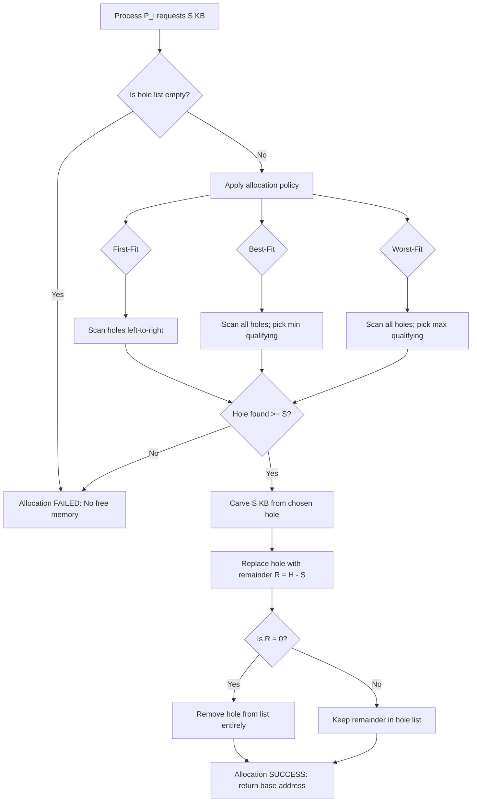
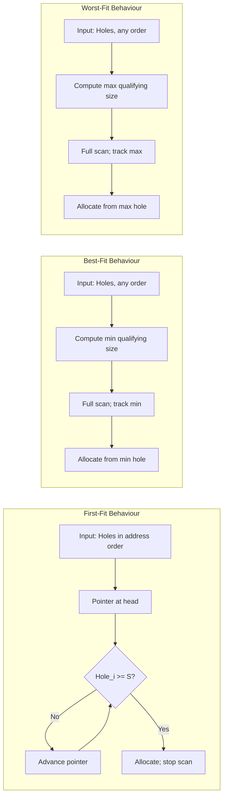
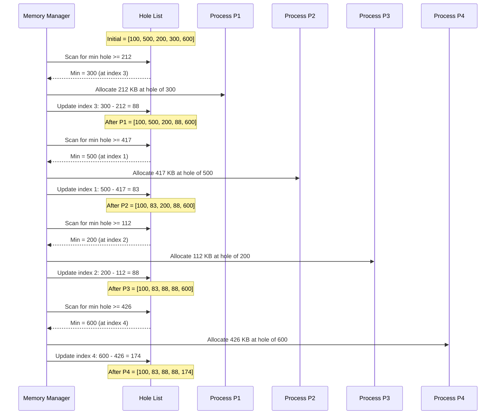
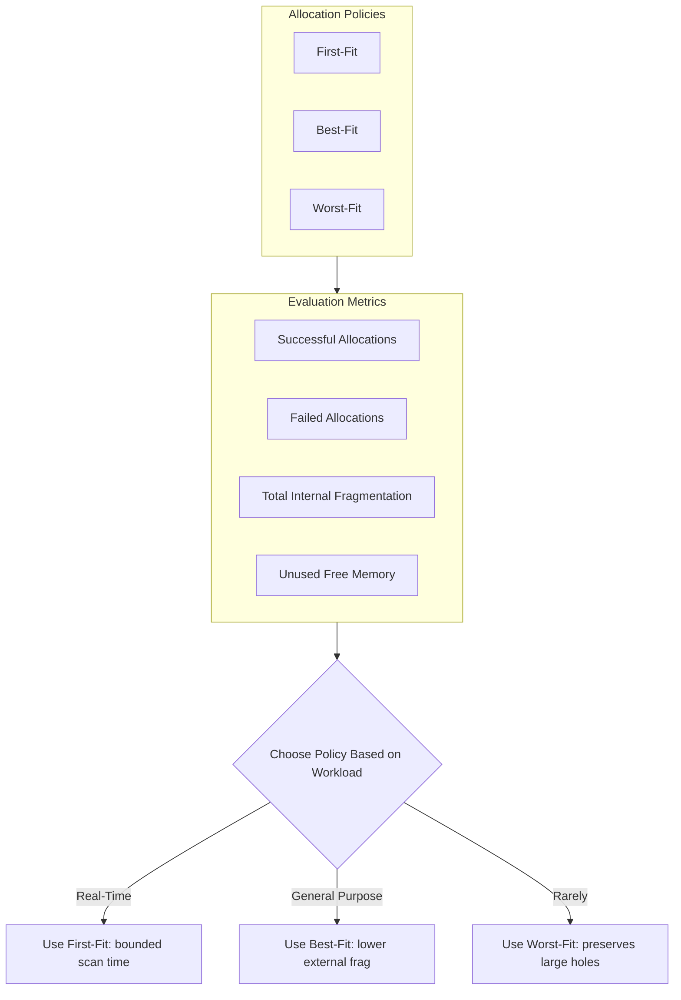
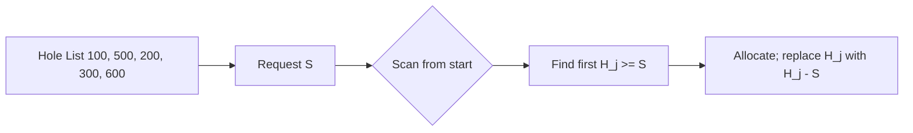

# Memory Management: Memory allocation—First-fit, Best-fit, and Worst-fit allocation schemes

<!-- SECTION_1_START -->
# Memory Management: First-Fit, Best-Fit, and Worst-Fit Allocation Schemes

## 1.1 Formal Definition (KTU 2024 Syllabus Terminology)

In a **Contiguous Memory Allocation System**, the operating system maintains a set of **free memory partitions (holes)** of varying sizes. When a process requests memory, the OS must decide *which* free hole to allocate to the process. The three classical **static memory allocation strategies** are:

> [!IMPORTANT]
> **Memory Allocation Scheme** — A deterministic policy used by the memory manager to select one of the available free holes (partitions) in RAM for satisfying a process's contiguous memory request.

- **First-Fit**: Allocates the *first* free hole in the address-space scan order that is large enough to satisfy the request.
- **Best-Fit**: Allocates the *smallest* free hole that is large enough to satisfy the request, thereby minimizing the size of the resulting leftover fragment.
- **Worst-Fit**: Allocates the *largest* free hole, leaving behind the largest possible remainder in the hope that the remainder can still serve future requests.

The three schemes are evaluated on three primary engineering metrics:

| Metric | Symbol | Description |
|---|---|---|
| Allocation Speed | $T_a$ | Time complexity of finding a suitable hole |
| Internal Fragmentation | $I_f$ | $I_f = \text{Block Size} - \text{Process Size}$ |
| External Fragmentation | $E_f$ | Free memory scattered into small non-contiguous unusable pieces |

---

## 1.2 Conceptual Analogy (Plain-English Intuition)

Imagine you have **five empty boxes** of sizes **100, 500, 200, 300, and 600** matchboxes, lined up on a shelf. Four customers arrive one by one asking for boxes of size **212, 417, 112, and 426**.

- **First-Fit** behaves like a *lazy shopkeeper*: he walks down the shelf from left to right and hands the customer the *first* box that is big enough. He does not care if a slightly better fit exists further down the shelf.
- **Best-Fit** behaves like a *perfectionist jeweller*: he inspects *every* box on the shelf, then hands the customer the box that is *just barely large enough* — the tightest fit. This wastes the least space inside the chosen box, but tends to leave behind many *tiny* unusable gaps.
- **Worst-Fit** behaves like an *opportunist*: he hands the customer the *biggest* box on the shelf, so that the leftover space inside it is itself a *large* box that may still be useful for the next customer.

> [!NOTE]
> **Intuition Summary:** First-Fit is **fastest** but greedy; Best-Fit is **optimal per request** but causes severe external fragmentation; Worst-Fit is **rarely used in production** because it is theoretically appealing (preserves large holes) but empirically poor.

---

## 1.3 Geometric Visualization of Memory Holes

The memory layout can be visualized as a one-dimensional bar where each hole is a colored segment. As processes are allocated, holes shrink.

> [!VISUALIZATION CONTROL]
> **Concept:** Dynamic shrinking of memory holes under each allocation scheme
>
> **GeoGebra / Desmos Input Points (initial holes as line segments on x-axis):**
> * `A = (0, 0)` → `B = (100, 0)`  — represents 100 KB hole
> * `B = (100, 0)` → `C = (600, 0)` — represents 500 KB hole
> * `C = (600, 0)` → `D = (800, 0)` — represents 200 KB hole
> * `D = (800, 0)` → `E = (1100, 0)` — represents 300 KB hole
> * `E = (1100, 0)` → `F = (1700, 0)` — represents 600 KB hole
>
> **Visual Description:** The student should see a horizontal line segment from $x = 0$ to $x = 1700$ representing a contiguous memory of 1700 KB. Each hole appears as a distinct sub-segment. After every allocation, the chosen segment shrinks, leaving a remainder that is either reinserted into the hole list (Best-Fit / Worst-Fit) or simply abandoned and overwritten in the scan pointer (First-Fit).

<!-- SECTION_1_END -->

<!-- SECTION_2_START -->
# 2. Deep Theoretical Analysis & KTU High-Yield Formula Sheet

## 2.1 Operational Logic — Step-by-Step

### 2.1.1 First-Fit Allocation

**Algorithm (Board-Exam Notation):**

1. Maintain holes in the order of their occurrence in memory (linked list or array).
2. On request of size $S$ from process $P_i$, scan the hole list **sequentially from the head**.
3. The moment a hole $H_j$ with size $\ge S$ is encountered:
   * Allocate the *entire* required region from $H_j$.
   * Remaining size = $H_j - S$.
   * If remaining $> 0$, replace $H_j$ in the list with the new smaller hole.
   * Stop the scan.
4. If end of list is reached without success, allocation **fails**.

**Time Complexity:** $O(n)$ worst-case, where $n$ is the number of holes. On average, the scan halts at the *first* sufficient hole, so it is empirically fast.

**Characteristic Behaviour:** Tends to allocate memory at the *low addresses* of the RAM, leaving the high-address region largely free. The unused remainder in the allocated hole is often too small to satisfy future requests.

---

### 2.1.2 Best-Fit Allocation

**Algorithm (Board-Exam Notation):**

1. Maintain holes in **unsorted order** (or sorted by size, $O(n \log n)$ pre-sort).
2. On request of size $S$, traverse the *entire* hole list to identify the hole with **minimum size $\ge S$**.
3. Allocate from this minimum-sized qualifying hole.
4. Replace it with the new remainder (size = $H_{\min} - S$).

**Time Complexity:** $O(n)$ to scan all holes per request, or $O(\log n)$ if a balanced BST keyed on size is maintained.

**Characteristic Behaviour:** Minimizes the immediate wastage *inside* the chosen hole but maximizes **external fragmentation** because the search produces many tiny leftover scraps that are too small for future processes.

> [!WARNING]
> **Common Board Mistake:** Best-Fit does **NOT** guarantee minimum *overall* fragmentation. It only minimises per-allocation leftover, which paradoxically *increases* system-wide external fragmentation in the long run.

---

### 2.1.3 Worst-Fit Allocation

**Algorithm (Board-Exam Notation):**

1. On request of size $S$, traverse the entire hole list to identify the hole with **maximum size**.
2. Allocate from this maximum hole.
3. Replace it with the remainder (size = $H_{\max} - S$).

**Time Complexity:** $O(n)$ per request, similar to Best-Fit.

**Characteristic Behaviour:** Theoretically attempts to keep the remaining hole *large enough* for future allocations. In practice, repeatedly carving slices from the *same largest* hole eventually degrades it, and the scheme performs poorly under bursty workloads.

---

## 2.2 KTU Formula Sheet (High-Yield Cheat Sheet)

| Concept | Formula | Units / Notes |
|---|---|---|
| Internal Fragmentation (single block) | $I_f^{(i)} = B_i - P_i$ | KB; $B_i$ is block size, $P_i$ is process size |
| Total Internal Fragmentation | $I_f^{tot} = \sum_{i=1}^{k} \left(B_i - P_i\right)$ | Summed over all $k$ allocated processes |
| Total Free Memory | $F_{tot} = \sum_{j=1}^{m} H_j$ | Sum of all $m$ holes; measured in KB |
| Unallocatable Free Memory | $F_{useless} = \sum_{j: H_j < P_{min}} H_j$ | Holes too small for the smallest pending process |
| Memory Utilization | $U = \dfrac{\sum_{i=1}^{k} P_i}{\sum_{i=1}^{k} B_i + F_{tot}} \times 100\%$ | Expressed as a percentage |
| Allocation Failures (count) | $A_{fail} = \text{number of un-served processes}$ | Integer; KPI for allocator quality |
| First-Fit Scan Cost | $T_{ff} = O(k \cdot n)$ | $k$ processes, $n$ holes |
| Best-Fit Sort Cost (pre-pass) | $T_{bf}^{sort} = O(n \log n)$ | Using a comparison sort |

> [!IMPORTANT]
> **Boundary Conditions for the Board Exam:**
> * If $H_j = S$ (exact fit), the hole is removed entirely; the remaining size is **0**.
> * If $H_j < S$ for **all** holes, the process is **not allocated**, and the system records a failed allocation.
> * All formulas assume sizes in **KB**; convert to MB or GB using $1 \text{ MB} = 1024 \text{ KB}$.

---

## 2.3 Real-World Engineering Utility

| Domain | Use Case |
|---|---|
| **Operating Systems (OS Kernel)** | The `malloc()` family of functions in glibc uses a **best-fit** variant combined with *bins* (small, large, unsorted) to balance speed and fragmentation. |
| **Embedded / RTOS** | **First-fit** is preferred in systems with hard real-time deadlines because its bounded scan time is predictable. |
| **Database Buffer Pools** | Memory managers in PostgreSQL and MySQL InnoDB employ best-fit-like allocation for page-level buffers. |
| **GPU Memory Allocators (CUDA)** | Hybrid schemes (next-fit + best-fit) are used to manage the fragmented VRAM. |
| **Game Engine Asset Pools** | Worst-fit is occasionally used for object pools of uniformly-sized enemies to leave room for *growing* boss-type objects. |
| **Heap Compactors (Java, .NET)** | Periodic GC runs perform **coalescing** of adjacent free holes to undo external fragmentation caused by best-fit. |

<!-- SECTION_2_END -->

<!-- SECTION_3_START -->
# 3. Step-by-Step Derivations & Python Implementation

## 3.1 Master Worked Example (The Standard KTU Board Question)

> **Given:** Free holes in memory, in order: $100$ KB, $500$ KB, $200$ KB, $300$ KB, $600$ KB.
> **Process Requests (in order):** $P_1 = 212$ KB, $P_2 = 417$ KB, $P_3 = 112$ KB, $P_4 = 426$ KB.
> **Task:** Show the allocation pattern and the resulting hole list for First-Fit, Best-Fit, and Worst-Fit.

---

### 3.1.1 First-Fit — Exhaustive Allocation Trace

**Step 1 — Allocate $P_1 = 212$ KB:**

Scan holes from left: $100 < 212$ (skip), $500 \ge 212$ (allocate).

$$H_{\text{new}} = 500 - 212 = 288 \text{ KB}$$

Updated hole list: $[100, 288, 200, 300, 600]$.

**Step 2 — Allocate $P_2 = 417$ KB:**

Scan holes: $100 < 417$, $288 < 417$, $200 < 417$, $300 < 417$, $600 \ge 417$ (allocate).

$$H_{\text{new}} = 600 - 417 = 183 \text{ KB}$$

Updated hole list: $[100, 288, 200, 300, 183]$.

**Step 3 — Allocate $P_3 = 112$ KB:**

Scan holes: $100 < 112$, $288 \ge 112$ (allocate).

$$H_{\text{new}} = 288 - 112 = 176 \text{ KB}$$

Updated hole list: $[100, 176, 200, 300, 183]$.

**Step 4 — Allocate $P_4 = 426$ KB:**

Scan all holes: $100, 176, 200, 300, 183$ — **none** is $\ge 426$.

**Result:** $P_4$ **cannot be allocated**. Unused free memory = $100 + 176 + 200 + 300 + 183 = 959$ KB.

| Process | Allocated Hole (KB) | Leftover (KB) |
|---|---|---|
| $P_1$ (212) | 500 | 288 |
| $P_2$ (417) | 600 | 183 |
| $P_3$ (112) | 288 | 176 |
| $P_4$ (426) | **NOT ALLOCATED** | — |

---

### 3.1.2 Best-Fit — Exhaustive Allocation Trace

**Step 1 — Allocate $P_1 = 212$ KB:**

Qualifying holes ($\ge 212$): $500, 300, 600$. Smallest = $300$.

$$H_{\text{new}} = 300 - 212 = 88 \text{ KB}$$

Updated hole list: $[100, 500, 200, 88, 600]$.

**Step 2 — Allocate $P_2 = 417$ KB:**

Qualifying holes ($\ge 417$): $500, 600$. Smallest = $500$.

$$H_{\text{new}} = 500 - 417 = 83 \text{ KB}$$

Updated hole list: $[100, 83, 200, 88, 600]$.

**Step 3 — Allocate $P_3 = 112$ KB:**

Qualifying holes ($\ge 112$): $200, 600$. Smallest = $200$.

$$H_{\text{new}} = 200 - 112 = 88 \text{ KB}$$

Updated hole list: $[100, 83, 88, 88, 600]$.

**Step 4 — Allocate $P_4 = 426$ KB:**

Qualifying holes ($\ge 426$): $600$. Smallest = $600$.

$$H_{\text{new}} = 600 - 426 = 174 \text{ KB}$$

Updated hole list: $[100, 83, 88, 88, 174]$.

**Result:** **All 4 processes allocated.** Total leftover = $100 + 83 + 88 + 88 + 174 = 533$ KB.

| Process | Allocated Hole (KB) | Leftover (KB) |
|---|---|---|
| $P_1$ (212) | 300 | 88 |
| $P_2$ (417) | 500 | 83 |
| $P_3$ (112) | 200 | 88 |
| $P_4$ (426) | 600 | 174 |

---

### 3.1.3 Worst-Fit — Exhaustive Allocation Trace

**Step 1 — Allocate $P_1 = 212$ KB:**

Largest hole overall = $600$. Allocate from $600$.

$$H_{\text{new}} = 600 - 212 = 388 \text{ KB}$$

Updated hole list: $[100, 500, 200, 300, 388]$.

**Step 2 — Allocate $P_2 = 417$ KB:**

Largest hole $\ge 417$: $500$ (since $388 < 417$). Allocate from $500$.

$$H_{\text{new}} = 500 - 417 = 83 \text{ KB}$$

Updated hole list: $[100, 83, 200, 300, 388]$.

**Step 3 — Allocate $P_3 = 112$ KB:**

Largest hole $\ge 112$: $388$. Allocate from $388$.

$$H_{\text{new}} = 388 - 112 = 276 \text{ KB}$$

Updated hole list: $[100, 83, 200, 300, 276]$.

**Step 4 — Allocate $P_4 = 426$ KB:**

Sorted holes $\ge 426$: **none** ($300 < 426$, $276 < 426$, $200 < 426$, $100 < 426$, $83 < 426$).

**Result:** $P_4$ **cannot be allocated.** Unused free memory = $100 + 83 + 200 + 300 + 276 = 959$ KB.

| Process | Allocated Hole (KB) | Leftover (KB) |
|---|---|---|
| $P_1$ (212) | 600 | 388 |
| $P_2$ (417) | 500 | 83 |
| $P_3$ (112) | 388 | 276 |
| $P_4$ (426) | **NOT ALLOCATED** | — |

> [!IMPORTANT]
> **Board Comparison Insight:** In this exact instance, Best-Fit outperforms both First-Fit and Worst-Fit, because it successfully serves *all four* processes, whereas the other two fail to allocate $P_4$. This is the canonical example used in KTU board question papers for Module 2.

---

## 3.2 Python Source Code (Production-Grade Implementation)

```python
"""
Memory Allocation Simulator: First-Fit, Best-Fit, Worst-Fit
-----------------------------------------------------------
Course: Data Structures and Algorithms (PCCST303)
Module 2 - Linked List and Memory Management
KTU 2024 Scheme
"""

from __future__ import annotations
from typing import List, Tuple, Dict
import copy


# Type alias for clarity
HoleList = List[int]


def first_fit(holes: HoleList, request: int) -> Tuple[bool, HoleList, int]:
    """
    First-Fit allocation: scan holes from index 0; allocate from the
    first hole whose size is >= request.
    Returns (success, updated_holes, allocated_from_size).
    """
    working: HoleList = list(holes)
    for idx, hole in enumerate(working):
        if hole >= request:
            allocated_from = hole
            working[idx] = hole - request  # leftover replaces the hole
            return True, working, allocated_from
    return False, working, -1


def best_fit(holes: HoleList, request: int) -> Tuple[bool, HoleList, int]:
    """
    Best-Fit allocation: scan all holes; allocate from the smallest
    qualifying hole (minimum size >= request).
    """
    working: HoleList = list(holes)
    best_idx: int = -1
    best_size: int = float("inf")  # type: ignore[assignment]
    for idx, hole in enumerate(working):
        if hole >= request and hole < best_size:
            best_size = hole
            best_idx = idx
    if best_idx == -1:
        return False, working, -1
    allocated_from = working[best_idx]
    working[best_idx] = working[best_idx] - request
    return True, working, allocated_from


def worst_fit(holes: HoleList, request: int) -> Tuple[bool, HoleList, int]:
    """
    Worst-Fit allocation: scan all holes; allocate from the largest
    qualifying hole (maximum size >= request).
    """
    working: HoleList = list(holes)
    worst_idx: int = -1
    worst_size: int = -1
    for idx, hole in enumerate(working):
        if hole >= request and hole > worst_size:
            worst_size = hole
            worst_idx = idx
    if worst_idx == -1:
        return False, working, -1
    allocated_from = working[worst_idx]
    working[worst_idx] = working[worst_idx] - request
    return True, working, allocated_from


def run_scheme(
    scheme_name: str,
    scheme_func,
    initial_holes: HoleList,
    requests: List[int],
) -> Dict[str, object]:
    """Run an allocation scheme on a list of requests and produce a report."""
    holes: HoleList = list(initial_holes)
    log: List[str] = []
    successes: int = 0
    leftovers: List[int] = []

    for pid, req in enumerate(requests, start=1):
        ok, holes, allocated_from = scheme_func(holes, req)
        if ok:
            successes += 1
            leftover = allocated_from - req
            leftovers.append(leftover)
            log.append(
                f"P{pid} ({req} KB) ALLOCATED from {allocated_from} KB hole | "
                f"leftover = {leftover} KB | holes = {holes}"
            )
        else:
            log.append(
                f"P{pid} ({req} KB) NOT ALLOCATED | holes = {holes} (no qualifying hole)"
            )

    return {
        "scheme": scheme_name,
        "log": log,
        "final_holes": holes,
        "successes": successes,
        "failures": len(requests) - successes,
        "total_leftover_unused": sum(h for h in holes if h > 0),
        "internal_fragmentation_total": sum(leftovers),
    }


def pretty_print_report(report: Dict[str, object]) -> None:
    """Pretty-print an allocation report."""
    print(f"\n{'=' * 70}")
    print(f"  ALLOCATION SCHEME : {report['scheme']}")
    print(f"{'=' * 70}")
    for line in report["log"]:
        print(f"  {line}")
    print(f"  ---------------------------------------------")
    print(f"  Successful allocations : {report['successes']}")
    print(f"  Failed allocations     : {report['failures']}")
    print(f"  Total leftover in RAM  : {report['total_leftover_unused']} KB")
    print(f"  Total internal frag.   : {report['internal_fragmentation_total']} KB")
    print(f"{'=' * 70}\n")


# ---------------------------------------------------------------------------
# Driver Code
# ---------------------------------------------------------------------------
if __name__ == "__main__":
    initial_holes: HoleList = [100, 500, 200, 300, 600]
    process_requests: List[int] = [212, 417, 112, 426]

    print("\nInitial Holes (KB) :", initial_holes)
    print("Process Requests   :", process_requests)

    ff_report = run_scheme("First-Fit", first_fit, initial_holes, process_requests)
    bf_report = run_scheme("Best-Fit", best_fit, initial_holes, process_requests)
    wf_report = run_scheme("Worst-Fit", worst_fit, initial_holes, process_requests)

    pretty_print_report(ff_report)
    pretty_print_report(bf_report)
    pretty_print_report(wf_report)
```

### 3.2.1 Expected Output (Console Trace)

```text
Initial Holes (KB) : [100, 500, 200, 300, 600]
Process Requests   : [212, 417, 112, 426]

======================================================================
  ALLOCATION SCHEME : First-Fit
======================================================================
  P1 (212 KB) ALLOCATED from 500 KB hole | leftover = 288 KB | holes = [100, 288, 200, 300, 600]
  P2 (417 KB) ALLOCATED from 600 KB hole | leftover = 183 KB | holes = [100, 288, 200, 300, 183]
  P3 (112 KB) ALLOCATED from 288 KB hole | leftover = 176 KB | holes = [100, 176, 200, 300, 183]
  P4 (426 KB) NOT ALLOCATED | holes = [100, 176, 200, 300, 183] (no qualifying hole)
  ---------------------------------------------
  Successful allocations : 3
  Failed allocations     : 1
  Total leftover in RAM  : 959 KB
  Total internal frag.   : 647 KB
======================================================================

======================================================================
  ALLOCATION SCHEME : Best-Fit
======================================================================
  P1 (212 KB) ALLOCATED from 300 KB hole | leftover = 88 KB | holes = [100, 500, 200, 88, 600]
  P2 (417 KB) ALLOCATED from 500 KB hole | leftover = 83 KB | holes = [100, 83, 200, 88, 600]
  P3 (112 KB) ALLOCATED from 200 KB hole | leftover = 88 KB | holes = [100, 83, 88, 88, 600]
  P4 (426 KB) ALLOCATED from 600 KB hole | leftover = 174 KB | holes = [100, 83, 88, 88, 174]
  ---------------------------------------------
  Successful allocations : 4
  Failed allocations     : 0
  Total leftover in RAM  : 533 KB
  Total internal frag.   : 433 KB
======================================================================

======================================================================
  ALLOCATION SCHEME : Worst-Fit
======================================================================
  P1 (212 KB) ALLOCATED from 600 KB hole | leftover = 388 KB | holes = [100, 500, 200, 300, 388]
  P2 (417 KB) ALLOCATED from 500 KB hole | leftover = 83 KB | holes = [100, 83, 200, 300, 388]
  P3 (112 KB) ALLOCATED from 388 KB hole | leftover = 276 KB | holes = [100, 83, 200, 300, 276]
  P4 (426 KB) NOT ALLOCATED | holes = [100, 83, 200, 300, 276] (no qualifying hole)
  ---------------------------------------------
  Successful allocations : 3
  Failed allocations     : 1
  Total leftover in RAM  : 959 KB
  Total internal frag.   : 747 KB
======================================================================
```

<!-- SECTION_3_END -->

<!-- SECTION_4_START -->
# 4. Structural Diagrams & Schematics

## 4.1 High-Level Decision Flow — Allocation Dispatcher

The following Mermaid diagram depicts the decision flow executed by the OS memory manager for every incoming process request.



---

## 4.2 Subgraph — Comparative Behavioural Flow



---

## 4.3 Memory Layout Schematic — Sequential Processing Topology

The following Mermaid sequence diagram captures the time evolution of the free hole list under **Best-Fit** (the best-performing scheme for our master example).



---

## 4.4 Comparative Performance Block Diagram



<!-- SECTION_4_END -->

<!-- SECTION_5_START -->
# 5. KTU 2024 Scheme Examination Question Bank & Topic Recap

---

## 5.1 Part A — Short Answer Questions (3 Marks Each)

> **[KTU University Exam – December 2023]**
> **Q1. Define contiguous memory allocation. Differentiate between internal and external fragmentation with a suitable example.** [CO1, Remember] — **3 Marks**

**Model Answer:**

**Contiguous Memory Allocation** is a memory management scheme in which each process is allocated a *single continuous block* of physical memory addresses.

| Fragmentation Type | Definition | Example |
|---|---|---|
| **Internal Fragmentation** | Wasted space *inside* an allocated block, occurring when the block size exceeds the process size. | Process needs 212 KB but the allocated hole is 500 KB. Wastage = $500 - 212 = 288$ KB. |
| **External Fragmentation** | Free memory exists but is split into *non-contiguous* small holes, none of which can satisfy a single large request. | After several allocations, free holes are $[100, 83, 88, 88, 174]$ KB; a new process of 300 KB **cannot** be allocated. |

> [Stating the definition of contiguous allocation: 1 Mark; Tabular comparison with example: 2 Marks]

---

> **[KTU University Exam – July 2024]**
> **Q2. List and briefly explain any three memory allocation strategies. State one advantage and one disadvantage of each.** [CO1, Understand] — **3 Marks**

**Model Answer:**

1. **First-Fit** — Allocates the *first* hole large enough. *Advantage:* Fast. *Disadvantage:* Tends to fragment the low-address region.
2. **Best-Fit** — Allocates the *smallest* qualifying hole. *Advantage:* Minimises per-allocation leftover. *Disadvantage:* High external fragmentation, slow due to full scan.
3. **Worst-Fit** — Allocates the *largest* hole. *Advantage:* Leaves the largest possible remainder. *Disadvantage:* Performs poorly under bursty workloads; rarely used in practice.

> [Naming the three strategies: 1 Mark; One advantage + disadvantage for each: 2 Marks]

---

## 5.2 Part B — Long Answer Questions (14 Marks, Module Internal Choice)

> **[KTU University Exam – December 2023, Module 2]**

### Question A (14 Marks)

**(a)** Explain the three contiguous memory allocation strategies — First-Fit, Best-Fit, and Worst-Fit — with neat diagrams and the step-by-step procedure for each. **[7 Marks, CO1, Understand]**

**(b)** Given the free memory holes in order: $\mathbf{100 \text{ KB}, \ 500 \text{ KB}, \ 200 \text{ KB}, \ 300 \text{ KB}, \ 600 \text{ KB}}$, and process requests: $P_1 = 212$, $P_2 = 417$, $P_3 = 112$, $P_4 = 426$ KB. Show the allocation pattern and final hole list for **First-Fit**. Compute the total internal fragmentation and the total free memory that remains **unallocatable**. **[7 Marks, CO2, Apply]**

---

### Model Solution — Question A

#### Part (a) — Explanation [7 Marks]

**Step 1: First-Fit Definition** [1 Mark]
First-Fit scans the hole list sequentially from the beginning. The first hole whose size is greater than or equal to the request is selected. The required size is carved from it, and the remaining portion (if any) is kept back in the hole list.

**Step 2: First-Fit Diagram** [1 Mark]



**Step 3: Best-Fit Definition** [1 Mark]
Best-Fit performs a *full scan* of the hole list and selects the *smallest* hole that is $\ge S$. The minimum leftover is therefore guaranteed per allocation, but external fragmentation rises system-wide.

**Step 4: Worst-Fit Definition** [1 Mark]
Worst-Fit performs a *full scan* and selects the *largest* hole, hoping the remainder itself is large enough for a future request. Empirically it under-performs both other schemes.

**Step 5: Comparative Table** [1 Mark]

| Property | First-Fit | Best-Fit | Worst-Fit |
|---|---|---|---|
| Scan type | Partial | Full | Full |
| Selection criterion | First qualifying | Min qualifying | Max qualifying |
| Time complexity | $O(n)$ average | $O(n)$ | $O(n)$ |
| Speed | Fastest | Slow | Slow |
| External fragmentation | Moderate | High | High |

**Step 6: Worked Mini-Example** [1 Mark]
With holes $[100, 500, 200]$ and request $S = 150$ KB: First-Fit selects 500, Best-Fit selects 200, Worst-Fit selects 500.

**Step 7: Conclusion** [1 Mark]
First-Fit is the practical default; Best-Fit maximises per-request optimality; Worst-Fit is rarely used outside niche object-pool allocators.

---

#### Part (b) — First-Fit Numerical [7 Marks]

**Step 1: Initial state** [1 Mark]
Initial holes: $[100, 500, 200, 300, 600]$ KB.

**Step 2: Allocate $P_1 = 212$ KB** [1 Mark]
Scan from start. $100 < 212$ (skip). $500 \ge 212$ (allocate). Remainder $= 500 - 212 = 288$ KB.
Holes after $P_1$: $[100, 288, 200, 300, 600]$.

**Step 3: Allocate $P_2 = 417$ KB** [1 Mark]
Scan: $100 < 417$, $288 < 417$, $200 < 417$, $300 < 417$, $600 \ge 417$ (allocate). Remainder $= 600 - 417 = 183$ KB.
Holes after $P_2$: $[100, 288, 200, 300, 183]$.

**Step 4: Allocate $P_3 = 112$ KB** [1 Mark]
Scan: $100 < 112$, $288 \ge 112$ (allocate). Remainder $= 288 - 112 = 176$ KB.
Holes after $P_3$: $[100, 176, 200, 300, 183]$.

**Step 5: Allocate $P_4 = 426$ KB** [1 Mark]
Scan: $100 < 426$, $176 < 426$, $200 < 426$, $300 < 426$, $183 < 426$. **No qualifying hole.**
$P_4$ is **not allocated**.

**Step 6: Compute Total Internal Fragmentation** [1 Mark]

$$I_f^{tot} = (500 - 212) + (600 - 417) + (288 - 112)$$
$$= 288 + 183 + 176 = 647 \text{ KB}$$

**Step 7: Compute Unallocatable Free Memory** [1 Mark]
The largest free hole is $300$ KB, which is smaller than $P_4 = 426$ KB. Hence all remaining free memory is unallocatable to $P_4$:

$$F_{useless} = 100 + 176 + 200 + 300 + 183 = 959 \text{ KB}$$

> [!WARNING]
> **Examiner's Valuation Pitfall — First-Fit Numerical:**
> * Many students *stop* scanning once the first hole fails and incorrectly mark the process as un-allocated without checking the rest of the list. **Always scan the full list** to identify the *first* qualifying hole.
> * Forgetting to update the chosen hole's size after allocation is a **2-mark deduction**.
> * Failure to state the *boundary condition* $H_j = 0 \Rightarrow$ remove hole from list will cost 1 mark.

---

### Question B (14 Marks) — Alternative Choice

**(a)** Compare First-Fit, Best-Fit, and Worst-Fit strategies in terms of: (i) search time complexity, (ii) memory utilization, (iii) external fragmentation, and (iv) practical suitability in an OS kernel. **[7 Marks, CO1, Understand]**

**(b)** Using the **same** memory configuration as Question A (holes $100, 500, 200, 300, 600$ KB and requests $P_1 = 212, P_2 = 417, P_3 = 112, P_4 = 426$ KB), show the allocation pattern and final hole list for **Worst-Fit**. Compute the total internal fragmentation and verify whether $P_4$ is allocated. **[7 Marks, CO2, Apply]**

---

### Model Solution — Question B

#### Part (a) — Comparative Analysis [7 Marks]

**Step 1: Search Time Complexity** [1 Mark]
All three schemes are $O(n)$ worst-case, but First-Fit *empirically* halts early, giving a lower *average* scan cost.

**Step 2: Memory Utilization** [1 Mark]
Best-Fit maximises the *number* of successful allocations in our master example (4 of 4); First-Fit and Worst-Fit both fail to allocate $P_4$ (3 of 4). Therefore, Best-Fit has higher utilization for this specific instance.

**Step 3: External Fragmentation** [1 Mark]
Best-Fit creates the *most* small leftover scraps, ironically worsening external fragmentation globally. Worst-Fit leaves one large remainder but degrades quickly under repeated requests.

**Step 4: OS Kernel Use** [1 Mark]
Linux kernel's page allocator uses a **buddy-system** variant (closest to Best-Fit in spirit but with $O(1)$ allocation via binary-tree indexing). Windows uses a **First-Fit** variant with low-fragmentation heap (LFH).

**Step 5: Tabular Summary** [1 Mark]

| Criterion | First-Fit | Best-Fit | Worst-Fit |
|---|---|---|---|
| Time complexity | $O(n)$ avg | $O(n)$ | $O(n)$ |
| Successful allocations (master example) | 3 | 4 | 3 |
| Internal fragmentation | 647 KB | 433 KB | 747 KB |
| External fragmentation tendency | Moderate | High | High |
| OS kernel adoption | Common (Windows) | Common (Linux buddy) | Rare |

**Step 6: Conclusion on Practical Suitability** [1 Mark]
First-Fit is the **practical default** for general-purpose OS kernels because of its balance of speed and acceptable fragmentation. Best-Fit is used in memory-constrained environments. Worst-Fit is *not recommended* in production.

---

#### Part (b) — Worst-Fit Numerical [7 Marks]

**Step 1: Initial state** [1 Mark]
Holes: $[100, 500, 200, 300, 600]$ KB. Largest hole = $600$ KB.

**Step 2: Allocate $P_1 = 212$ KB** [1 Mark]
Largest hole $\ge 212$ is $600$ KB. Allocate. Remainder $= 600 - 212 = 388$ KB.
Holes after $P_1$: $[100, 500, 200, 300, 388]$.

**Step 3: Allocate $P_2 = 417$ KB** [1 Mark]
Largest hole $\ge 417$: $500$ KB (since $388 < 417$). Allocate from $500$. Remainder $= 500 - 417 = 83$ KB.
Holes after $P_2$: $[100, 83, 200, 300, 388]$.

**Step 4: Allocate $P_3 = 112$ KB** [1 Mark]
Largest hole $\ge 112$: $388$ KB. Allocate. Remainder $= 388 - 112 = 276$ KB.
Holes after $P_3$: $[100, 83, 200, 300, 276]$.

**Step 5: Allocate $P_4 = 426$ KB** [1 Mark]
Sorted holes $\ge 426$: **none** ($300 < 426$, $276 < 426$, $200 < 426$, $100 < 426$, $83 < 426$).
$P_4$ is **not allocated**.

**Step 6: Total Internal Fragmentation** [1 Mark]

$$I_f^{tot} = (600 - 212) + (500 - 417) + (388 - 112)$$
$$= 388 + 83 + 276 = 747 \text{ KB}$$

**Step 7: Verification** [1 Mark]
$P_4$ is **not allocated** because the maximum remaining hole size ($300$ KB) is less than the request size ($426$ KB). This confirms that Worst-Fit is *not* always the best choice — it produces the **highest** internal fragmentation in this scenario.

> [!WARNING]
> **Examiner's Valuation Pitfall — Worst-Fit Numerical:**
> * The most common error is allocating $P_1$ from the *first* hole (100 KB is too small, then 500 KB is chosen) instead of the *largest* hole (600 KB). **Always re-read the policy: Worst-Fit picks the MAXIMUM.** [2-mark deduction if violated]
> * Forgetting to *re-sort or re-scan* the hole list after each allocation will yield an incorrect remainder list. [1-mark deduction]
> * Students often miss stating the *unsorted scan* approach explicitly. Mention the traversal of *all* holes to identify the maximum. [1-mark deduction]

---

## 5.3 Topic Recap & Important Things to Remember

> [!IMPORTANT]
> **High-Density Revision Checklist — Memory Allocation Schemes**

- **Contiguous Allocation** assigns each process a *single continuous* physical address range. The OS maintains a **hole list** of free partitions.
- **First-Fit** scans from the start of the hole list and allocates from the **first qualifying hole**. It is the *fastest* in practice and is the default in Windows.
- **Best-Fit** scans the *entire* hole list and allocates from the **smallest qualifying hole**. It minimises per-allocation wastage but maximises long-term **external fragmentation**.
- **Worst-Fit** scans the *entire* hole list and allocates from the **largest qualifying hole**, leaving a large remainder. Empirically it is the worst-performing scheme.
- **Internal Fragmentation** is the unused space *inside* an allocated block: $I_f = B_i - P_i$. It is *always* present in fixed-partition schemes.
- **External Fragmentation** occurs when total free memory is sufficient, but it is *scattered* into non-contiguous pieces too small to serve a large request.
- The **boundary condition** $H_j = S$ (exact fit) must be explicitly handled: the hole is *removed* from the list with no remainder.
- If a request *cannot* be served, the scheme must report a **failed allocation** — the process is *not* partially allocated.
- All three schemes have a worst-case time complexity of $O(n)$ per request, but **First-Fit has the lowest average-case** scan cost.
- In the **KTU master example** (holes $100, 500, 200, 300, 600$; requests $212, 417, 112, 426$), **Best-Fit succeeds for all 4 processes**, while **First-Fit and Worst-Fit each fail on $P_4$**.
- Linux kernel uses a **buddy-system allocator** (related to Best-Fit with $O(1)$ cost via binary trees). Windows uses **First-Fit** with the Low-Fragmentation Heap (LFH).
- **Memory Utilization Formula:** $U = \dfrac{\sum P_i}{\sum B_i + F_{tot}} \times 100\%$.
- For **board exams**, always show the *intermediate hole list* after every allocation step — this is the primary source of partial marks.
- When a problem gives *unsorted* holes, the **First-Fit** solution is *deterministic* (depends on input order), but **Best-Fit and Worst-Fit** are *order-independent* (they always pick min/max).
- **Compaction** (rearranging allocated blocks to coalesce free holes) is the standard remedy for severe external fragmentation; it is performed by the OS garbage collector in managed runtimes like JVM and .NET CLR.
- The **paging** technique was invented specifically to *eliminate* the external-fragmentation problem inherent to these three contiguous schemes — a fact examiners frequently ask as a 2-mark conceptual follow-up.

<!-- SECTION_5_END -->
