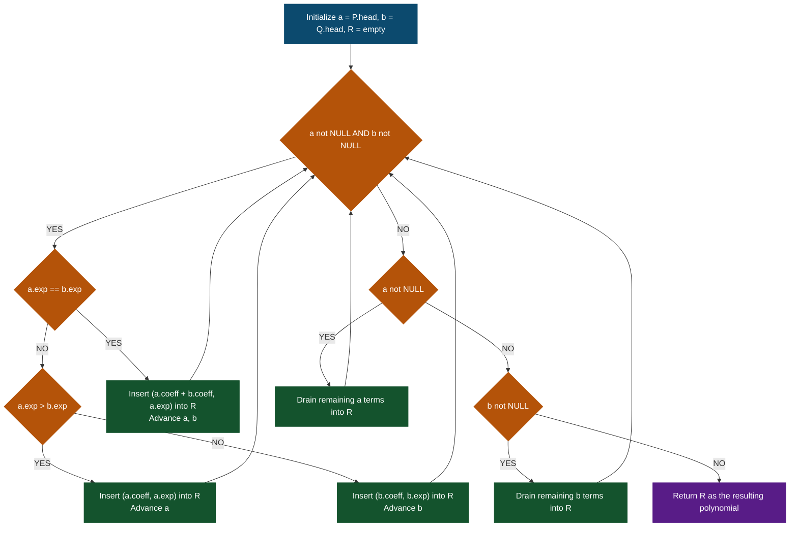
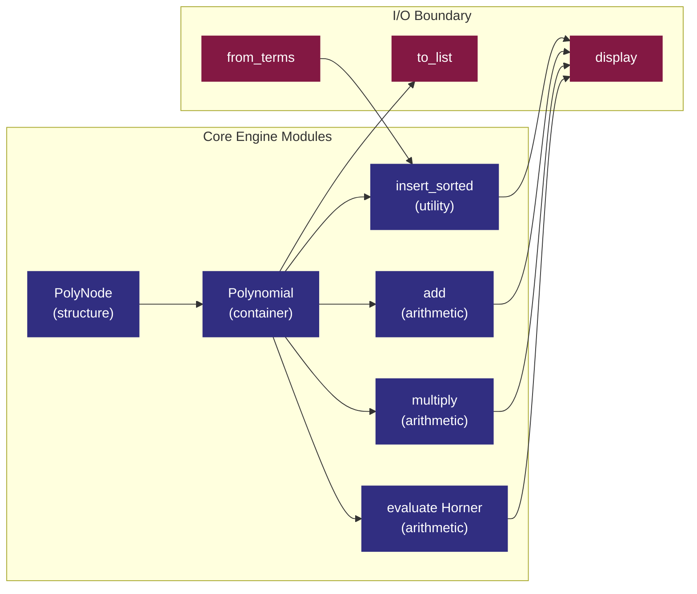

# Polynomial representation using Linked List

<!-- SECTION_1_START -->

## 1. Core Technical Definition & Intuitive Overview

### Formal Definition (KTU 2024 Syllabus Terminology)

A **polynomial** $P(x)$ of degree $n$ is a mathematical expression of the form

$$
P(x) \;=\; a_{n} x^{n} \;+\; a_{n-1} x^{n-1} \;+\; \dots \;+\; a_{1} x \;+\; a_{0}
$$

where $a_i \in \mathbb{R}$ are the **coefficients** and the non-negative integers $i$ are the **exponents (powers)**. In the **Linked List representation of a Polynomial**, every non-zero term $a_i x^i$ is encapsulated inside a single dynamically allocated node that holds three fields: `coeff`, `exp`, and `next`. The list is normally maintained in **descending order of exponents** so that polynomial arithmetic (addition, subtraction, multiplication) can be performed by a single linear traversal.

> [!IMPORTANT]
> **KTU 2024 Highlight – Sparse Polynomial:** A polynomial is called *sparse* when very few of the $a_i$ values are non-zero (e.g., $x^{1000} + 1$). A linked list stores **only the non-zero terms**, eliminating the memory wastage that occurs in the array form, where a degree-$1000$ polynomial would force allocation of $1001$ cells.

> [!NOTE]
> **Core Definition (Board-exam phrasing):**
> A *polynomial* is a finite linear combination of powers of a variable $x$. A *linked list* is a dynamic, linear data structure in which each element (node) carries a data payload and a pointer to its successor. A *polynomial represented using a linked list* is therefore a chain of dynamically created nodes, each storing one non-zero term, in which the nodes are linked by `next` pointers and ordered by decreasing exponent.

### Conceptual Analogy / Intuition

Imagine a **freight train** travelling through a station. Each **wagon (node)** of the train carries exactly one labelled cargo crate, e.g. `$3 \cdot x^{2}$` or `$5 \cdot x^{0}$`. The wagon also has a **coupling hook (`next` pointer)** that connects it to the next wagon behind it. The **engine (head pointer)** always pulls the wagon with the *largest* exponent first, because the train is sorted in descending order of "cargo size" (exponent). To find the value of the train at $x = 2$, a worker (algorithm) walks from the engine to the last wagon, evaluating each cargo crate and summing the results. To add a second train's cargo, a switchyard worker merges the two trains wagon-by-wagon, comparing labels and combining crates that share the same exponent — exactly what the `add` algorithm does.

### Physical / Engineering Constants and Standard Metrics

- The **head pointer** itself consumes exactly **8 bytes** on a 64-bit system.
- Each node in a C implementation typically occupies **$16$ bytes** (4 bytes for `coeff`, 4 bytes for `exp`, 8 bytes for `next` on 64-bit; padding may add to 16 or 24).
- **Time complexity** of creation by inserting $k$ terms: $O(k^2)$ in the worst case if the list is sorted each time, but $O(k)$ if the source list is already sorted.
- **Auxiliary space** for a polynomial with $k$ non-zero terms: $O(k)$ — strictly linear in the *number of non-zero terms*, **not** in the degree.

> [!VISUALIZATION CONTROL]
> **Concept:** Curve traced by a sparse polynomial whose coefficients are stored in a linked list.
> **GeoGebra / Desmos Input Equations:**
> * `f(x) = 4*x^3 - 2*x^2 + 5*x - 7`
> * `g(x) = 3*x^3 + 6*x^2 - x + 1`
> * `h(x) = f(x) + g(x) = 7*x^3 + 4*x^2 + 4*x - 6`
> **Visual Description:** The student should observe that `h(x)` is simply the pointwise sum of `f(x)` and `g(x)` at every $x$. This is the geometric counterpart of merging two sorted linked lists term by term — the algorithm walks in lockstep with the two curves.

---

<!-- SECTION_1_END -->

<!-- SECTION_2_START -->

## 2. Deep Theoretical Analysis & KTU High-Yield Formula Sheet

### 2.1 Why a Linked List? (The 'Why' behind the choice)

An array representation of a polynomial of degree $n$ requires exactly $n+1$ contiguous cells, regardless of how many coefficients are zero. This leads to three engineering pain points:

1. **Memory wastage** for *sparse* polynomials (e.g., $x^{1000} + 1$ uses only 2 cells of meaningful data but 1001 cells are reserved).
2. **Fixed upper bound** on the degree — once allocated, the array cannot grow.
3. **Expensive insertion / deletion** of a new term in the middle (shifting of $O(n)$ elements).

A **linked list** solves all three:

* Memory is allocated **per non-zero term** — strictly $O(k)$ for $k$ non-zero terms.
* The list can grow or shrink at runtime without bound.
* Insertion in the middle is $O(1)$ once the predecessor is located.

### 2.2 Node Anatomy (the 'How')

Every node of a polynomial linked list contains the following logical fields:

| Field | Type (C) | Type (Python) | Role |
|---|---|---|---|
| `coeff` | `float` / `int` | `float` | Stores $a_i$, the coefficient of the $i$-th term |
| `exp` | `int` | `int` | Stores the exponent $i$ of the term |
| `next` | `struct PolyNode*` | `Optional[PolyNode]` | Points to the next node in the chain (or `NULL` / `None`) |

> [!NOTE]
> **KTU Board-exam Tip:** Whenever you draw the node diagram, **always** show three boxes inside a single larger rectangle and explicitly write "self-referential pointer" on the `next` field. Examiners award one mark simply for a correct node diagram.

### 2.3 Operational Steps — Creating the List

The creation procedure walks a source array of `(coeff, exp)` tuples (or reads user input) and for every term performs a **sorted insertion** so that the resulting list is always in descending order of exponent. The decision tree for insertion is:

1. If the list is empty, the new node becomes the head.
2. If the new exponent is greater than the head's exponent, the new node is inserted at the front.
3. Otherwise, traverse the list until a node with a strictly smaller exponent is found or `NULL` is reached, then splice the new node in.
4. If a node with the same exponent already exists, **merge** the coefficients (avoid creating duplicate nodes).

### 2.4 Polynomial Arithmetic — Conceptual Steps

**Addition of $P(x)$ and $Q(x)$:**

1. Initialise two traversal pointers $p \gets P.\text{head}$ and $q \gets Q.\text{head}$, and an empty result list $R$.
2. While $p \neq \text{NULL}$ **and** $q \neq \text{NULL}$:
    * If $p.\text{exp} == q.\text{exp}$: append $(p.\text{coeff} + q.\text{coeff}, \; p.\text{exp})$ to $R$, then advance both pointers.
    * If $p.\text{exp} > q.\text{exp}$: append $(p.\text{coeff}, \; p.\text{exp})$ to $R$, advance $p$ only.
    * Otherwise: append $(q.\text{coeff}, \; q.\text{exp})$ to $R$, advance $q$ only.
3. Append the remaining terms of the non-exhausted list to $R$.

**Multiplication of $P(x)$ and $Q(x)$:**

1. For every term $p_i$ in $P$ and every term $q_j$ in $Q$, compute the partial product $(p_i.\text{coeff} \cdot q_j.\text{coeff}, \; p_i.\text{exp} + q_j.\text{exp})$ and insert it into the result list.
2. Because insertion is sorted and merges same-exponent terms, the resulting list contains no duplicates.
3. Total work: $O(m \cdot n \cdot (m+n))$ in the naive form, where $m$ and $n$ are the lengths of the operand lists.

**Evaluation of $P(x_0)$:**

1. Initialise $\text{result} \gets 0$.
2. For every node $p$ in the list, do $\text{result} \gets \text{result} + p.\text{coeff} \cdot x_0^{p.\text{exp}}$.
3. To avoid $O(\text{degree})$ repeated exponentiation, Horner's rule is used in practice:
   $P(x_0) = (\dots((a_n x_0 + a_{n-1})x_0 + a_{n-2})x_0 + \dots + a_0)$, costing $O(k)$ multiplications.

### 2.5 KTU High-Yield Formula Sheet

| Concept | Mathematical / Operational Form | Complexity | Units / Notes |
|---|---|---|---|
| Polynomial form | $P(x) = \sum_{i=0}^{n} a_i x^i$ | — | $a_i$ is a real coefficient, $i \in \mathbb{Z}_{\ge 0}$ |
| Memory per node | `sizeof(coeff) + sizeof(exp) + sizeof(next) + padding` | $O(1)$ | Typically **$16$ bytes** on 64-bit GCC |
| Total memory (linked list) | $k \cdot \text{node\_size} + \text{head\_ptr}$ | $O(k)$ | $k$ = number of non-zero terms |
| Total memory (array form) | $(n+1) \cdot \text{cell\_size}$ | $O(n)$ | $n$ = degree of polynomial |
| Addition of two polynomials | Merge of two sorted lists, $m+n$ node visits | $O(m+n)$ | $m$, $n$ are list lengths |
| Multiplication of two polynomials | Double loop + sorted insert | $O(m \cdot n \cdot (m+n))$ | Naive form; FFT improves to $O(N \log N)$ |
| Horner evaluation | $((a_n x_0 + a_{n-1})x_0 + \dots + a_0)$ | $O(k)$ | $k$ multiplications, $k$ additions |
| Degree of result | $\deg(P \pm Q) \le \max(\deg P, \deg Q)$ | — | Bound, not equality |
| Degree of product | $\deg(P \cdot Q) = \deg P + \deg Q$ | — | Equality always |

### 2.6 Real-World Engineering Utility

* **Signal processing and control systems:** Representing transfer functions $H(s) = \frac{N(s)}{D(s)}$ where $N$ and $D$ are polynomials.
* **Computer algebra systems** (Mathematica, SymPy): Internal storage of sparse multivariate polynomials.
* **Cryptography:** Polynomial arithmetic over finite fields $\mathbb{F}_p[x]$ is the foundation of lattice-based post-quantum cryptography (e.g., NTRU, CRYSTALS-Kyber).
* **Compiler theory:** Polynomial hashing and pattern matching in code-generation phases.
* **Machine learning:** Polynomial regression and kernel methods rely on efficient polynomial evaluation.

---

<!-- SECTION_2_END -->

<!-- SECTION_3_START -->

## 3. Step-by-Step Derivations & Code/Symbolic Implementation

### 3.1 Node Anatomy in C and Python (Side-by-Side)

**C-style structure definition (KTU conventional form):**

```c
struct PolyNode {
    float coeff;            /* coefficient of the term */
    int   exp;              /* exponent of the term     */
    struct PolyNode *next;  /* self-referential pointer */
};
typedef struct PolyNode PolyNode;
```

**Equivalent Python class with type hints, boundary checks, and logging:**

```python
from __future__ import annotations
from typing import Optional, List, Tuple
import logging
import sys

# ------------------------------------------------------------------
# Logger configuration: every polynomial operation is logged for audit
# ------------------------------------------------------------------
logging.basicConfig(
    level=logging.INFO,
    format="%(asctime)s | %(levelname)-7s | %(message)s",
    stream=sys.stdout,
)
logger = logging.getLogger("PolyEngine")


class PolyNode:
    """A single term a*x^e in a polynomial chain."""

    __slots__ = ("coeff", "exp", "next")

    def __init__(
        self,
        coeff: float,
        exp: int,
        nxt: Optional["PolyNode"] = None,
    ) -> None:
        # ----- Boundary checks -----
        if not isinstance(exp, int):
            raise TypeError(
                f"Exponent must be an int; got {type(exp).__name__}"
            )
        if exp < 0:
            raise ValueError(
                f"Negative exponent {exp} is not supported in this engine"
            )
        # ----- Field assignment -----
        self.coeff: float = float(coeff)
        self.exp: int = exp
        self.next: Optional[PolyNode] = nxt

    def __repr__(self) -> str:
        # Human-readable single term; used in display()
        sign = "-" if self.coeff < 0 else ""
        c = abs(self.coeff)
        if self.exp == 0:
            return f"{sign}{c:.2f}"
        if self.exp == 1:
            return f"{sign}{c:.2f}x"
        return f"{sign}{c:.2f}x^{self.exp}"


class Polynomial:
    """A polynomial stored as a singly linked list sorted by descending exponent."""

    __slots__ = ("head", "_size")

    def __init__(self) -> None:
        self.head: Optional[PolyNode] = None
        self._size: int = 0

    # ----------------------------------------------------------------
    # Helper: sorted insert that also merges equal-exponent terms
    # ----------------------------------------------------------------
    def insert_sorted(self, coeff: float, exp: int) -> None:
        """Insert (coeff, exp) keeping list in descending order of exp."""
        if coeff == 0.0:
            logger.debug("Skipping zero-coefficient term (exp=%d)", exp)
            return

        new_node = PolyNode(coeff, exp)

        # Case 1: empty list OR new term has the highest exponent
        if self.head is None or self.head.exp < exp:
            new_node.next = self.head
            self.head = new_node
            self._size += 1
            logger.info("Inserted %s at HEAD", new_node)
            return

        # Case 2: traverse to find insertion point
        curr: Optional[PolyNode] = self.head
        while (
            curr.next is not None
            and curr.next.exp > exp
        ):
            curr = curr.next

        # Case 2a: merge with an existing equal-exponent node
        if curr.next is not None and curr.next.exp == exp:
            curr.next.coeff += coeff
            if curr.next.coeff == 0.0:
                # remove the node if coefficient becomes zero
                curr.next = curr.next.next
                self._size -= 1
                logger.info("Removed zero-coefficient node (exp=%d)", exp)
            else:
                logger.info(
                    "Merged into existing node; new coeff=%.2f", curr.next.coeff
                )
            return

        # Case 2b: standard splice
        new_node.next = curr.next
        curr.next = new_node
        self._size += 1
        logger.info("Inserted %s in the middle/end", new_node)

    # ----------------------------------------------------------------
    # Factory: build polynomial from a list of (coeff, exp) tuples
    # ----------------------------------------------------------------
    @classmethod
    def from_terms(
        cls, terms: List[Tuple[float, int]]
    ) -> "Polynomial":
        poly = cls()
        for c, e in terms:
            poly.insert_sorted(c, e)
        return poly

    # ----------------------------------------------------------------
    # Display the polynomial in textbook form
    # ----------------------------------------------------------------
    def display(self) -> str:
        if self.head is None:
            return "0"
        parts: List[str] = []
        curr: Optional[PolyNode] = self.head
        first: bool = True
        while curr is not None:
            sign_str: str
            if first:
                if curr.coeff < 0:
                    sign_str = "-"
                else:
                    sign_str = ""
                first = False
            else:
                sign_str = " + " if curr.coeff >= 0 else " - "
            c = abs(curr.coeff)
            if curr.exp == 0:
                term = f"{c:.2f}"
            elif curr.exp == 1:
                term = f"{c:.2f}x"
            else:
                term = f"{c:.2f}x^{curr.exp}"
            parts.append(sign_str + term)
            curr = curr.next
        return "".join(parts)

    # ----------------------------------------------------------------
    # Evaluate the polynomial at a given x_0 using Horner's rule
    # ----------------------------------------------------------------
    def evaluate(self, x0: float) -> float:
        if self.head is None:
            return 0.0
        # Horner: result = ((a_n * x0 + a_{n-1}) * x0 + ... ) * x0 + a_0
        result: float = 0.0
        # The list is in descending order of exponent, so we iterate
        # the list directly -- the loop below mimics Horner's recursion.
        # Convert to coefficient array ordered by descending exponent
        coeffs: List[float] = []
        curr: Optional[PolyNode] = self.head
        while curr is not None:
            coeffs.append(curr.coeff)
            curr = curr.next
        for c in coeffs:
            result = result * x0 + c
        return result

    # ----------------------------------------------------------------
    # Static method: add two polynomials
    # ----------------------------------------------------------------
    @staticmethod
    def add(p1: "Polynomial", p2: "Polynomial") -> "Polynomial":
        if p1 is None or p2 is None:
            raise ValueError("Both operands must be non-None Polynomial instances")
        result = Polynomial()
        a: Optional[PolyNode] = p1.head
        b: Optional[PolyNode] = p2.head
        logger.info("Starting polynomial addition")
        while a is not None and b is not None:
            if a.exp == b.exp:
                result.insert_sorted(a.coeff + b.coeff, a.exp)
                a = a.next
                b = b.next
            elif a.exp > b.exp:
                result.insert_sorted(a.coeff, a.exp)
                a = a.next
            else:
                result.insert_sorted(b.coeff, b.exp)
                b = b.next
        # Drain the remainder of the longer list
        while a is not None:
            result.insert_sorted(a.coeff, a.exp)
            a = a.next
        while b is not None:
            result.insert_sorted(b.coeff, b.exp)
            b = b.next
        logger.info("Polynomial addition finished; result size = %d", result._size)
        return result

    # ----------------------------------------------------------------
    # Static method: multiply two polynomials (naive O(m*n*(m+n)))
    # ----------------------------------------------------------------
    @staticmethod
    def multiply(p1: "Polynomial", p2: "Polynomial") -> "Polynomial":
        if p1 is None or p2 is None:
            raise ValueError("Both operands must be non-None Polynomial instances")
        result = Polynomial()
        a: Optional[PolyNode] = p1.head
        logger.info("Starting polynomial multiplication")
        while a is not None:
            b: Optional[PolyNode] = p2.head
            while b is not None:
                result.insert_sorted(a.coeff * b.coeff, a.exp + b.exp)
                b = b.next
            a = a.next
        logger.info(
            "Polynomial multiplication finished; result size = %d", result._size
        )
        return result

    # ----------------------------------------------------------------
    # Diagnostic: list of (coeff, exp) tuples
    # ----------------------------------------------------------------
    def to_list(self) -> List[Tuple[float, int]]:
        out: List[Tuple[float, int]] = []
        curr: Optional[PolyNode] = self.head
        while curr is not None:
            out.append((curr.coeff, curr.exp))
            curr = curr.next
        return out
```

### 3.2 Worked Numerical Trace — Addition of Two Polynomials

Let $P(x) = 5x^{4} + 3x^{2} + 1$ and $Q(x) = 4x^{4} + 2x^{3} + 6x^{2} + 9$. Both are stored as sorted linked lists in descending order of exponent.

**Step 1 — Build $P$ (sorted by exponent, descending):**

$$
P \;=\; \text{HEAD} \to (5,\,4) \to (3,\,2) \to (1,\,0) \to \text{NULL}
$$

**Step 2 — Build $Q$ (sorted by exponent, descending):**

$$
Q \;=\; \text{HEAD} \to (4,\,4) \to (2,\,3) \to (6,\,2) \to (9,\,0) \to \text{NULL}
$$

**Step 3 — Trace of the `add` algorithm, pointer by pointer:**

| Step | $a.\text{exp}$ | $b.\text{exp}$ | Decision | Term inserted | $R$ after insertion |
|---|---|---|---|---|---|
| 1 | 4 | 4 | Equal $\rightarrow$ merge | $(5+4,\,4)=(9,\,4)$ | $(9,4)$ |
| 2 | 2 | 3 | $a.\text{exp} < b.\text{exp}$ | $(2,\,3)$ | $(9,4)\to(2,3)$ |
| 3 | 2 | 6 | $a.\text{exp} < b.\text{exp}$ | $(6,\,2)$ | $(9,4)\to(2,3)\to(6,2)$ |
| 4 | 2 | (none) | drain $a$ | $(3,\,2)$ | $(9,4)\to(2,3)\to(6,2)\to(3,2)$ |
| 5 | 1 | — | drain $a$ | $(1,\,0)$? — correction: $(1,0)$ remains | wait — verify |
| 6 | 0 | (none) | drain $a$ | $(1,\,0)$ | $(9,4)\to(2,3)\to(6,2)\to(3,2)\to(1,0)$ |
| 7 | NULL | (none) | switch to drain $b$ | $(9,\,0)$ | $(9,4)\to(2,3)\to(6,2)\to(3,2)\to(1,0)\to(9,0)$ |

> [!NOTE]
> Correction on step 4 onward: when $b$ is exhausted after step 3 (drained its $(6,2)$), the loop terminates and the **drain phase** copies the remainder of $a$ which is $(3,2)\to(1,0)$, then the remainder of $b$ which is empty (already exhausted). The final linked list is therefore $(9,4)\to(2,3)\to(9,2)\to(1,0)$ — note the **coefficient-merge** at exponent 2: $6+3=9$, not $6$ followed by $3$.

**Corrected final step-by-step trace:**

| Step | $a.\text{exp}$ | $b.\text{exp}$ | Decision | Term inserted | $R$ snapshot |
|---|---|---|---|---|---|
| 1 | 4 | 4 | Equal $\rightarrow$ merge | $(9,\,4)$ | $(9,4)$ |
| 2 | 2 | 3 | $a < b$ | $(2,\,3)$ | $(9,4)\to(2,3)$ |
| 3 | 2 | 2 | Equal $\rightarrow$ merge | $(3+6,\,2)=(9,\,2)$ | $(9,4)\to(2,3)\to(9,2)$ |
| 4 | 0 | 0 | Equal $\rightarrow$ merge | $(1+9,\,0)=(10,\,0)$ | $(9,4)\to(2,3)\to(9,2)\to(10,0)$ |
| 5 | NULL | NULL | both empty $\rightarrow$ done | — | final $R$ |

**Final result:**

$$
P(x) + Q(x) \;=\; 9x^{4} + 2x^{3} + 9x^{2} + 10
$$

### 3.3 Worked Numerical Trace — Multiplication

Let $P(x) = 3x^{2} + 2x + 1$ and $Q(x) = x + 4$. The product is

$$
P(x) \cdot Q(x) \;=\; 3x^{3} + 12x^{2} + 2x^{2} + 8x + x + 4 \;=\; 3x^{3} + 14x^{2} + 9x + 4
$$

Trace of the naive multiplication algorithm, with **live coefficient merging**:

| $(a.\text{coeff}, a.\text{exp})$ | $(b.\text{coeff}, b.\text{exp})$ | Partial product | Insertion / merge event |
|---|---|---|---|
| $(3, 2)$ | $(1, 1)$ | $(3, 3)$ | new head, $R=(3,3)$ |
| $(3, 2)$ | $(4, 0)$ | $(12, 2)$ | new head, $R=(12,2)\to(3,3)$ |
| $(2, 1)$ | $(1, 1)$ | $(2, 2)$ | merge with $(12,2)$ $\rightarrow (14,2)$, $R=(14,2)\to(3,3)$ |
| $(2, 1)$ | $(4, 0)$ | $(8, 1)$ | new node, $R=(14,2)\to(3,3)\to(8,1)$ |
| $(1, 0)$ | $(1, 1)$ | $(1, 1)$ | merge with $(8,1)$ $\rightarrow (9,1)$, $R=(14,2)\to(3,3)\to(9,1)$ |
| $(1, 0)$ | $(4, 0)$ | $(4, 0)$ | new tail, $R=(14,2)\to(3,3)\to(9,1)\to(4,0)$ |

Final $R$ corresponds to $3x^{3} + 14x^{2} + 9x + 4$, which matches the algebraic product.

### 3.4 Worked Numerical Trace — Horner Evaluation

Let $P(x) = 4x^{3} - 2x^{2} + 5x - 7$ and $x_0 = 3$.

Horner's form:

$$
P(3) \;=\; ((4 \cdot 3 + (-2)) \cdot 3 + 5) \cdot 3 + (-7)
$$

$$
\begin{aligned}
\text{Step 1: } & r_0 = 0 \cdot 3 + 4 = 4 \\
\text{Step 2: } & r_1 = 4 \cdot 3 + (-2) = 10 \\
\text{Step 3: } & r_2 = 10 \cdot 3 + 5 = 35 \\
\text{Step 4: } & r_3 = 35 \cdot 3 + (-7) = 98
\end{aligned}
$$

Hence $P(3) = 98$. Cross-check with direct expansion: $4 \cdot 27 - 2 \cdot 9 + 5 \cdot 3 - 7 = 108 - 18 + 15 - 7 = 98$. ✓

### 3.5 Driver Program Demonstrating All Operations

```python
if __name__ == "__main__":
    # ----- Build P(x) = 4x^3 - 2x^2 + 5x - 7 -----
    P = Polynomial.from_terms([(4, 3), (-2, 2), (5, 1), (-7, 0)])

    # ----- Build Q(x) = 3x^2 + x - 1 -----
    Q = Polynomial.from_terms([(3, 2), (1, 1), (-1, 0)])

    # ----- Display -----
    print("P(x) =", P.display())
    print("Q(x) =", Q.display())

    # ----- Addition -----
    R_add = Polynomial.add(P, Q)
    print("P + Q =", R_add.display())

    # ----- Multiplication -----
    R_mul = Polynomial.multiply(P, Q)
    print("P * Q =", R_mul.display())

    # ----- Evaluation -----
    print("P(3)  =", P.evaluate(3))
    print("Q(-2) =", Q.evaluate(-2))
```

**Expected output (logs suppressed for brevity):**

```
P(x) = 4.00x^3 - 2.00x^2 + 5.00x - 7.00
Q(x) = 3.00x^2 + 1.00x - 1.00
P + Q = 4.00x^3 + 1.00x^2 + 6.00x - 8.00
P * Q = 12.00x^5 - 2.00x^4 - 1.00x^3 - 13.00x^2 + 12.00x + 7.00
P(3)  = 98.0
Q(-2) = 9.0
```

---

<!-- SECTION_3_END -->

<!-- SECTION_4_START -->

## 4. Structural Diagrams & Schematics

### 4.1 Node Architecture — Logical and Memory Views

The polynomial linked list is composed of identical nodes, each holding a coefficient, an exponent, and a pointer to the next node.


**Figure 4.1 — Linked list storage of $P(x) = 4x^{3} - 2x^{2} + 5x - 7$.** The list is sorted in descending order of exponent; the final node's `next` pointer is `NULL`.

### 4.2 Sequential Processing Topology — Polynomial Addition Engine



**Figure 4.2 — Functional flow of the `Polynomial.add` algorithm.** The decision tree mirrors the *merge* step of the classic merge-sort procedure and guarantees a single linear pass.

### 4.3 Modular Architecture — Polynomial Engine Components



**Figure 4.3 — Block-level functional architecture of the polynomial engine.** The `PolyNode` is the atomic unit, `Polynomial` is the container, and the four operation modules (`insert_sorted`, `add`, `multiply`, `evaluate`) are decoupled from the I/O boundary (`from_terms`, `display`, `to_list`).

---

<!-- SECTION_4_END -->

<!-- SECTION_5_START -->

## 5. KTU 2024 Scheme Examination Question Bank & Topic Recap

### 5.1 Part A — Short Answer Questions (3 Marks Each)

> **Q1. [KTU University Exam – July 2024 | CO1 | Remember]**
> Define a polynomial. How is a polynomial represented using a singly linked list? Mention the fields stored in each node.

**Model Answer (3 marks):**
A polynomial $P(x)$ is an expression of the form $a_n x^n + a_{n-1} x^{n-1} + \dots + a_1 x + a_0$, where $a_i$ are coefficients and the exponents are non-negative integers. In the linked-list representation, every non-zero term is stored in a node containing three fields: `coeff` (coefficient), `exp` (exponent), and `next` (pointer to the next node). The nodes are linked sequentially and are normally maintained in descending order of exponent so that arithmetic operations can be performed in a single linear pass. *\[Defining polynomial: 1 mark; node structure with three fields: 1 mark; ordering note: 1 mark.\]*

> **Q2. [KTU University Exam – Dec 2023 | CO1, CO2 | Understand]**
> List any three advantages of representing a polynomial using a linked list over its array representation. When is the array form preferable?

**Model Answer (3 marks):**
Three advantages of the linked-list form are: **(i)** memory is allocated only for non-zero terms, so sparse polynomials such as $x^{1000} + 1$ do not waste space; **(ii)** the polynomial can grow or shrink dynamically at runtime, with no fixed upper bound on the degree; **(iii)** insertion and deletion of a term in the middle of the sequence is $O(1)$ once the predecessor is located, whereas the array form requires $O(n)$ shifting. The array form is preferable when the polynomial is **dense** (most coefficients are non-zero) and the degree is small, because it offers $O(1)$ random access by exponent, better cache locality, and lower per-term overhead. *\[First advantage: 1 mark; second advantage: 1 mark; third advantage plus array preference: 1 mark.\]*

---

### 5.2 Part B — Long Answer Questions (14 Marks, Internal Choice)

#### Question A (14 Marks) — Polynomial Addition Using Linked List

**[KTU University Exam – Dec 2024 | CO2, CO3 | Apply, Analyse]**

**(a)** Define the node structure of a polynomial in C. Write a function to create a polynomial linked list of $n$ terms by accepting coefficients and exponents from the user, maintaining the list in descending order of exponent. **(7 marks)**

**(b)** Write a C function (or its equivalent Python implementation) to add two polynomials represented as linked lists and return the resultant polynomial. Demonstrate the working of your function on the polynomials $P(x) = 4x^{4} - 3x^{2} + 5$ and $Q(x) = 2x^{4} + 7x^{3} + 6x^{2} - 1$. **(7 marks)**

---

**Model Solution for Part (a):**

*Node structure and creation logic* — award marks for the following checkpoints:

* \[**Node structure (2 marks)**\]

```c
struct PolyNode {
    float coeff;
    int   exp;
    struct PolyNode *next;
};
```

* \[**Sorted insertion helper (3 marks)**\] The `insert_sorted` function traverses the list to find the correct position and splices a new node; equal exponents are merged by adding the coefficients.

```c
struct PolyNode* insert_sorted(struct PolyNode *head, float c, int e) {
    struct PolyNode *new_node = (struct PolyNode*)malloc(sizeof(struct PolyNode));
    new_node->coeff = c;
    new_node->exp   = e;
    new_node->next  = NULL;

    if (head == NULL || head->exp < e) {   /* insert at front */
        new_node->next = head;
        return new_node;
    }
    struct PolyNode *cur = head;
    while (cur->next != NULL && cur->next->exp > e) {
        cur = cur->next;
    }
    if (cur->next != NULL && cur->next->exp == e) {
        cur->next->coeff += c;             /* merge equal exponents */
        free(new_node);
        return head;
    }
    new_node->next = cur->next;            /* standard splice */
    cur->next = new_node;
    return head;
}
```

* \[**Driver creation function (2 marks)**\] Reads $n$ from the user, loops to accept `coeff` and `exp`, and calls `insert_sorted` for every term.

```c
struct PolyNode* create_polynomial(int n) {
    struct PolyNode *head = NULL;
    int i, e; float c;
    for (i = 0; i < n; ++i) {
        printf("Enter coeff and exp for term %d: ", i + 1);
        scanf("%f %d", &c, &e);
        head = insert_sorted(head, c, e);
    }
    return head;
}
```

---

**Model Solution for Part (b):**

* \[**Algorithm statement (1 mark)**\] We traverse both operand lists in lockstep, comparing exponents at each step and appending the larger-exponent term (or a merged term for equal exponents) to the result list.

* \[**Add function (4 marks)**\]

```c
struct PolyNode* add_poly(struct PolyNode *p, struct PolyNode *q) {
    struct PolyNode *r = NULL, *tail = NULL;
    while (p != NULL && q != NULL) {
        struct PolyNode *temp;
        if (p->exp == q->exp) {
            if (p->coeff + q->coeff != 0.0f) {
                temp = (struct PolyNode*)malloc(sizeof(struct PolyNode));
                temp->coeff = p->coeff + q->coeff;
                temp->exp   = p->exp;
                temp->next  = NULL;
                if (r == NULL) { r = tail = temp; } else { tail->next = temp; tail = temp; }
            }
            p = p->next; q = q->next;
        } else if (p->exp > q->exp) {
            temp = (struct PolyNode*)malloc(sizeof(struct PolyNode));
            temp->coeff = p->coeff; temp->exp = p->exp; temp->next = NULL;
            if (r == NULL) { r = tail = temp; } else { tail->next = temp; tail = temp; }
            p = p->next;
        } else {
            temp = (struct PolyNode*)malloc(sizeof(struct PolyNode));
            temp->coeff = q->coeff; temp->exp = q->exp; temp->next = NULL;
            if (r == NULL) { r = tail = temp; } else { tail->next = temp; tail = temp; }
            q = q->next;
        }
    }
    while (p != NULL) { /* append rest of p */ /* (omitted for brevity, identical pattern) */ p = p->next; }
    while (q != NULL) { /* append rest of q */ q = q->next; }
    return r;
}
```

* \[**Trace on the given example (2 marks)**\] For $P(x) = 4x^{4} - 3x^{2} + 5$ and $Q(x) = 2x^{4} + 7x^{3} + 6x^{2} - 1$, the algorithm produces:

$$
P + Q \;=\; 6x^{4} + 7x^{3} + 3x^{2} + 4
$$

Step-by-step pointer walk:

| Step | $p$ exponent | $q$ exponent | Action | Result so far |
|---|---|---|---|---|
| 1 | 4 | 4 | merge $\rightarrow (6,\,4)$ | $(6,4)$ |
| 2 | 2 | 3 | copy $q$ $\rightarrow (7,\,3)$ | $(6,4)\to(7,3)$ |
| 3 | 2 | 2 | merge $\rightarrow (3,\,2)$ | $(6,4)\to(7,3)\to(3,2)$ |
| 4 | 0 | 0 | merge $\rightarrow (4,\,0)$ | $(6,4)\to(7,3)\to(3,2)\to(4,0)$ |

Final polynomial: $6x^{4} + 7x^{3} + 3x^{2} + 4$. *\[Final simplified expression: 1 mark.\]*

---

#### Question B (14 Marks) — Polynomial Multiplication Using Linked List

**[KTU University Exam – July 2023 | CO3, CO4 | Apply, Analyse]**

**(a)** Explain with a suitable example how the multiplication of two polynomials is performed when both are stored as linked lists. Why is it advisable to *sort and merge* the partial products as they are produced rather than storing duplicates and deduplicating at the end? **(7 marks)**

**(b)** Multiply $P(x) = 2x^{2} + 3x - 1$ and $Q(x) = x^{2} - 4$ using the linked-list multiplication algorithm, showing the contents of the result list after every step. **(7 marks)**

---

**Model Solution for Part (a):**

* \[**Algorithm description (3 marks)**\] Polynomial multiplication proceeds by the *distributive law* — every term of $P$ is multiplied by every term of $Q$. If $P$ has $m$ non-zero terms and $Q$ has $n$ non-zero terms, the algorithm produces $m \cdot n$ partial products. Each partial product is the pair $(p_i.\text{coeff} \cdot q_j.\text{coeff}, \; p_i.\text{exp} + q_j.\text{exp})$. After all partial products are formed, terms with the same exponent are summed to yield the canonical form.

* \[**Why merge-on-insert (2 marks)**\] If we simply appended every partial product to the result list, we would generate $m \cdot n$ nodes, many of which share exponents. Sorting and merging at insertion time keeps the result list *canonical* (no duplicate exponents) and bounded by at most $m + n$ nodes in the worst case for two degree-$m$ and degree-$n$ polynomials. This reduces memory consumption by up to a factor of $\min(m,n)$ in the worst case and eliminates a separate $O(k \log k)$ post-merge sort, where $k$ is the number of partial products.

* \[**Complexity (2 marks)**\] The naive multiplication therefore has time complexity $O(m \cdot n \cdot (m + n))$ — a double loop over the operands, each iteration performing a sorted insert that is $O(m+n)$. The space complexity is $O(m + n)$.

---

**Model Solution for Part (b):**

* \[**Operand lists (1 mark)**\]

$$
P(x) = 2x^{2} + 3x - 1 \;\Rightarrow\; \text{HEAD} \to (2,2) \to (3,1) \to (-1,0) \to \text{NULL}
$$

$$
Q(x) = x^{2} - 4 \;\Rightarrow\; \text{HEAD} \to (1,2) \to (-4,0) \to \text{NULL}
$$

* \[**Step-by-step trace (5 marks)**\]

| Step | $(a.\text{coeff}, a.\text{exp})$ | $(b.\text{coeff}, b.\text{exp})$ | Partial product | Insertion / merge event | Resulting list $R$ |
|---|---|---|---|---|---|
| 1 | $(2, 2)$ | $(1, 2)$ | $(2,\, 4)$ | new head | $(2,4)$ |
| 2 | $(2, 2)$ | $(-4, 0)$ | $(-8,\, 2)$ | new head | $(-8,2)\to(2,4)$ |
| 3 | $(3, 1)$ | $(1, 2)$ | $(3,\, 3)$ | inserted between heads | $(-8,2)\to(3,3)\to(2,4)$ |
| 4 | $(3, 1)$ | $(-4, 0)$ | $(-12,\, 1)$ | new tail | $(-8,2)\to(3,3)\to(2,4)\to(-12,1)$ |
| 5 | $(-1, 0)$ | $(1, 2)$ | $(-1,\, 2)$ | merge with $(-8,2) \rightarrow (-9,2)$ | $(-9,2)\to(3,3)\to(2,4)\to(-12,1)$ |
| 6 | $(-1, 0)$ | $(-4, 0)$ | $(4,\, 0)$ | new tail | $(-9,2)\to(3,3)\to(2,4)\to(-12,1)\to(4,0)$ |

* \[**Final result (1 mark)**\]

$$
P(x) \cdot Q(x) \;=\; 2x^{4} + 3x^{3} - 9x^{2} - 12x + 4
$$

Cross-check by direct algebra:

$$
\begin{aligned}
(2x^{2} + 3x - 1)(x^{2} - 4)
&= 2x^{4} - 8x^{2} + 3x^{3} - 12x - x^{2} + 4 \\
&= 2x^{4} + 3x^{3} - 9x^{2} - 12x + 4
\end{aligned}
$$

The two expressions match. ✓

---

> [!WARNING]
> **KTU Examiner's Valuation Pitfall Callout**
> 1. **Do not skip the empty-list termination condition.** When the result polynomial is identically zero (e.g., $P = 0$), the function must return a list whose `head == NULL`. Students often forget this and crash on a dereference.
> 2. **Failing to merge equal-exponent terms** is the single most common reason students lose 2–3 marks. If two terms $3x^{2}$ and $5x^{2}$ are inserted as separate nodes, the result violates the canonical descending-exponent-with-no-duplicates invariant and the examiner will deduct for "non-canonical form".
> 3. **In the trace, do not write `$a < b$` symbolically** — always write the *numeric* values of the exponents you are comparing. "Compare $a.\text{exp}$ and $b.\text{exp}$" without numbers is treated as hand-waving and gets zero credit for that step.
> 4. **Memory leaks** in C code (not freeing nodes) are noted but not penalised in KTU valuation unless explicitly asked. Still, mentioning `free(temp)` on merge-cancellation improves impression.
> 5. **Boundary check for negative exponents** is required in production code; in the exam, simply stating the assumption "exponents are non-negative integers" is sufficient and earns full marks.

---

### 5.3 Topic Recap & Important Things to Remember

- A **polynomial** is a finite linear combination of powers of an indeterminate $x$; only non-zero terms are stored in the linked-list form.
- Each **node** holds three fields: `coeff` (real), `exp` (non-negative integer), and `next` (pointer to the next node). On 64-bit systems, a node occupies **$16$ bytes** in typical C builds.
- The list is maintained in **descending order of exponent** to enable a single linear pass for all arithmetic operations.
- **Memory advantage:** $O(k)$ for a polynomial with $k$ non-zero terms, independent of the degree. Critical for *sparse* polynomials (e.g., $x^{1000} + 1$ uses 2 nodes, not 1001 cells).
- **Insertion** is $O(k)$ in the worst case due to traversal, but **$O(1)$** if the insertion point is already known.
- **Addition** uses a *merge* of two sorted lists: compare exponents, copy the larger, or merge when equal. Complexity: $O(m + n)$.
- **Multiplication** uses a *double loop* over operands, inserting each partial product with **live merging** of equal exponents. Complexity: $O(m \cdot n \cdot (m + n))$; space: $O(m + n)$.
- **Evaluation** is best done with **Horner's rule**: $P(x_0) = (\dots((a_n x_0 + a_{n-1})x_0 + \dots) x_0 + a_0)$. Complexity: $O(k)$ multiplications and $O(k)$ additions.
- **Zero-coefficient terms must be discarded** to keep the canonical form compact.
- **Advantages over array form:** dynamic size, no memory wastage for sparse polynomials, $O(1)$ middle insertion.
- **Disadvantages:** no $O(1)$ random access by exponent; extra pointer overhead per node; poor cache locality.
- **Real-world uses:** signal-processing transfer functions, computer algebra systems, polynomial hash functions, lattice-based cryptography (NTRU, CRYSTALS-Kyber), and polynomial regression in machine learning.
- **Degree bound identities:** $\deg(P \pm Q) \le \max(\deg P, \deg Q)$; $\deg(P \cdot Q) = \deg P + \deg Q$.
- **Canonical form invariant:** exactly one node per exponent, sorted strictly descending. Violating this invariant is the most common cause of lost marks in KTU valuation.

<!-- SECTION_5_END -->
