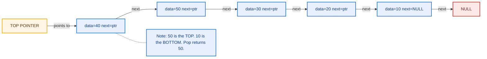
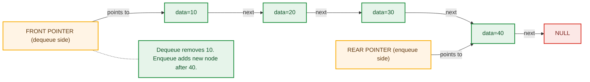
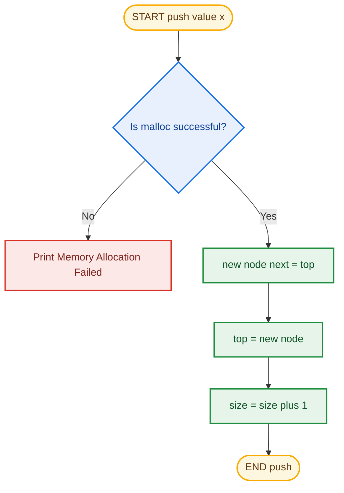
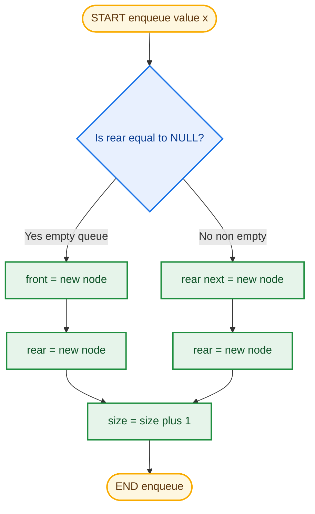
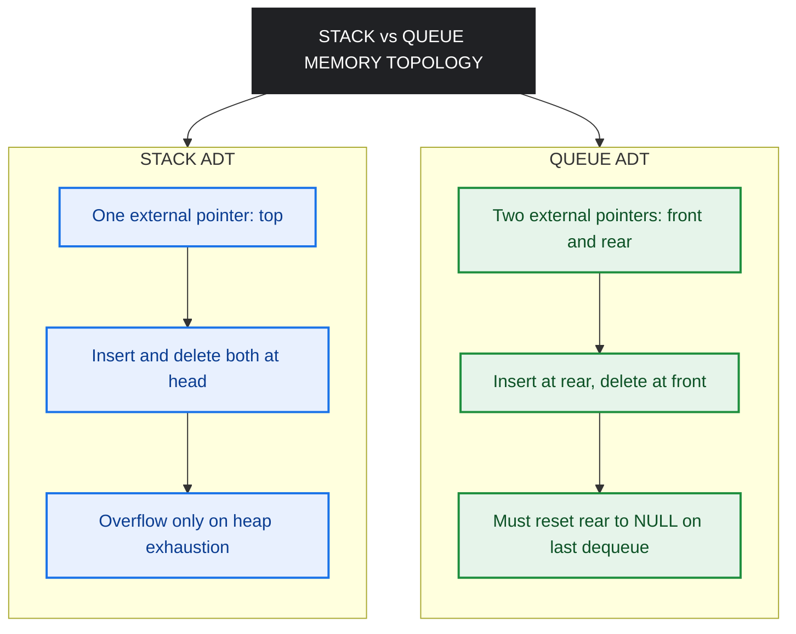

# Stacks and Queues using Linked List

<!-- SECTION_1_START -->
# Stacks and Queues using Linked List

> [!IMPORTANT]
> **KTU 2024 Scheme | Module 2 | Linked List \& Memory Management**
> This topic implements the classic **Stack (LIFO)** and **Queue (FIFO)** Abstract Data Types using **dynamic singly linked lists** instead of fixed-size arrays. The linked list approach removes the artificial capacity limit of array-based stacks and eliminates the `rear == MAX - 1` overflow problem of linear queues.

---

## 1.1 Stack ADT — Formal Definition

> [!NOTE]
> **Definition (KTU 2024 Syllabus):**
> A **Stack** is a linear Abstract Data Type (ADT) in which insertion (Push) and deletion (Pop) occur at **only one end**, called the **Top** of the stack. It obeys the **LIFO** (*Last In, First Out*) discipline. When implemented with a linked list, the *head* of the list acts as the *top* of the stack.

**Conceptual Analogy — The Spring-Loaded Plate Dispenser**

Imagine the plate rack in a college canteen. You push a plate down, and the spring compresses. The **last plate you placed on top** is the **first plate a customer picks up**. The plate at the bottom stays buried until every plate above it is removed. The head pointer of a linked list behaves exactly like that top plate — it is the *only* location where you may push or pop, because all other nodes are physically "buried" behind the head pointer and require $O(n)$ traversal to reach.

---

## 1.2 Queue ADT — Formal Definition

> [!NOTE]
> **Definition (KTU 2024 Syllabus):**
> A **Queue** is a linear Abstract Data Type in which insertion (*Enqueue*) happens at the **Rear** end and deletion (*Dequeue*) happens at the **Front** end. It obeys the **FIFO** (*First In, First Out*) discipline. When implemented with a linked list, **two pointers** are maintained: a *front* pointer for deletion and a *rear* pointer for insertion, giving $O(1)$ for both operations.

**Conceptual Analogy — The KTU Exam Hall Queue**

Picture the queue outside the exam hall at the APJ AKTU centre in Thiruvananthapuram on a hot May morning. The student who **arrived first stands at the front** and enters first. Every new student joins at the **rear** of the line. No cutting, no jumping to the middle — strict FIFO. The linked list's *front* node is the student currently entering, and the *rear* node is the student who just arrived.

---

## 1.3 Why Linked List over Array?

| Aspect | Array Implementation | Linked List Implementation |
| :--- | :--- | :--- |
| **Maximum size** | Fixed at compile time (static) | Dynamic — grows until heap exhaustion |
| **Overflow condition** | `top == MAX - 1` | Only when system memory runs out |
| **Memory wastage** | Slots are reserved even if unused | Allocates exactly the number of nodes inserted |
| **Resizing** | Requires `realloc`, may relocate block | Trivial — just allocate a new node |
| **Cache locality** | Excellent (contiguous) | Poor (scattered in heap) |

> [!TIP]
> **GeoGebra / Desmos Visualization (Conceptual Stack as Linked List):**
> Render a horizontal number line showing the heap addresses. Each node is a circle connected to the next. After pushing elements **10, 20, 30**, the visual shows the head pointer at the rightmost node (30), with arrows pointing left toward older nodes. The top of the stack is always the head of the list.

---

<!-- SECTION_2_END -->

<!-- SECTION_2_START -->
# Deep Theoretical Analysis \& KTU High-Yield Formula Sheet

## 2.1 Stack using Linked List — Operational Logic

**Node Structure (logical model):**

A stack node contains exactly two fields: the **data** payload and a **next** pointer that links it to the node beneath it on the stack.

$$
\text{Node} = \{ \text{data} \in \mathbb{Z}, \; \text{next} \in \text{Node} \cup \{ \text{NULL} \} \}
$$

The stack is then simply a reference (`top`) to the headmost node, plus a counter (`size`).

### 2.1.1 Push Operation (Insertion at Head)

The Push operation inserts a new element at the *head* of the linked list, which represents the *top* of the stack. Because linked list insertion at head requires only pointer re-routing (no traversal), Push runs in $O(1)$ time.

**Step-by-step logic:**

- **Step 1** — Allocate a new node on the heap and copy the data into it.
- **Step 2** — Set the new node's `next` field to point at the current `top`.
- **Step 3** — Move the `top` pointer to reference the new node.
- **Step 4** — Increment the size counter.

### 2.1.2 Pop Operation (Deletion at Head)

The Pop operation removes the node currently referenced by `top` and returns its data. The *only* failure condition is the **Stack Underflow** — popping from an empty stack. No traversal is needed, so it also runs in $O(1)$.

**Step-by-step logic:**

- **Step 1** — Check whether `top == NULL`. If true, raise an *Underflow* exception.
- **Step 2** — Cache the data of the current `top` node into a temporary variable.
- **Step 3** — Move the `top` pointer to `top.next`.
- **Step 4** — Free the memory of the old top node (in C) or let the garbage collector handle it (in Java/Python).
- **Step 5** — Decrement the size counter and return the cached data.

### 2.1.3 Peek Operation (Read Top)

The Peek (also called *Top*) operation simply returns the data of the node referenced by `top` without modifying the stack. It runs in $O(1)$ and fails with *Underflow* on an empty stack.

---

## 2.2 Queue using Linked List — Operational Logic

**Node Structure:**

Identical to the stack node — a `data` field and a `next` pointer. The critical difference is that the queue maintains **two external pointers**: `front` (for dequeue) and `rear` (for enqueue).

$$
\text{Queue} = \{ \text{front} \in \text{Node} \cup \{ \text{NULL} \}, \; \text{rear} \in \text{Node} \cup \{ \text{NULL} \}, \; \text{size} \in \mathbb{N} \}
$$

### 2.2.1 Enqueue Operation (Insertion at Rear)

**Step-by-step logic:**

- **Step 1** — Allocate a new node.
- **Step 2** — If `rear == NULL` (empty queue), set both `front` and `rear` to the new node.
- **Step 3** — Otherwise, link the current `rear.next` to the new node, then advance `rear` to the new node.
- **Step 4** — Increment the size counter.

This is $O(1)$ *without any traversal* — the rear pointer eliminates the need to walk to the end of the list.

### 2.2.2 Dequeue Operation (Deletion at Front)

**Step-by-step logic:**

- **Step 1** — Check `front == NULL`; raise *Underflow* if empty.
- **Step 2** — Cache `front.data`.
- **Step 3** — Advance `front` to `front.next`.
- **Step 4** — If `front` became `NULL` (queue now empty), reset `rear` to `NULL` as well to prevent a dangling reference.
- **Step 5** — Free the old front node, decrement size, return data.

### 2.2.3 Front Operation (Peek)

Returns `front.data` without modification. $O(1)$.

---

## 2.3 KTU Formula Sheet / Cheat Sheet

> [!IMPORTANT]
> All complexities below assume a correctly implemented singly linked list with a maintained `rear` pointer for the queue.

| Operation | Stack (LL) | Queue (LL) | Array Stack | Array Linear Queue |
| :--- | :---: | :---: | :---: | :---: |
| **Push / Enqueue** | $O(1)$ | $O(1)$ | $O(1)$ | $O(1)$ |
| **Pop / Dequeue** | $O(1)$ | $O(1)$ | $O(1)$ | $O(1)$ |
| **Peek / Front** | $O(1)$ | $O(1)$ | $O(1)$ | $O(1)$ |
| **isEmpty** | $O(1)$ | $O(1)$ | $O(1)$ | $O(1)$ |
| **Size** | $O(1)$ (with counter) | $O(1)$ (with counter) | $O(1)$ | $O(1)$ |
| **Overflow check** | `malloc` returns NULL | `malloc` returns NULL | `top == MAX - 1` | `rear == MAX - 1` |
| **Space per element** | $n \cdot (d + p)$ bytes | $n \cdot (d + p)$ bytes | $n \cdot d$ bytes | $n \cdot d$ bytes |
| **Extra pointer overhead** | 1 (head) | 2 (front + rear) | 0 | 0 |

Where:
- $n$ = number of elements currently in the structure
- $d$ = size of data field (in bytes)
- $p$ = size of one pointer (typically **8 bytes** on a 64-bit system)

**Memory Total Formula:**

$$
\text{Total Memory} = n \times (d + p) + \text{overhead}_\text{ADT}
$$

For a stack ADT in C, the overhead is just one pointer (`top`) = 8 bytes. For a queue ADT, the overhead is two pointers (`front` and `rear`) = **16 bytes** on a 64-bit machine.

---

## 2.4 Real-World Engineering Utility

> [!TIP]
> **Where these data structures appear in production systems:**
> - **Browser Back Button** — a stack of URL nodes; Back pops the most recent page.
> - **Function Call Stack** — every function activation is pushed as a *stack frame*; recursion uses the same mechanism.
> - **CPU Scheduler (Round Robin)** — processes are kept in a circular queue; the OS dequeues the head process, runs it for one time quantum, and re-enqueues it at the rear.
> - **Print Spooler** — multiple print jobs sit in a queue and are served one by one.
> - **Undo/Redo in IDEs** — two parallel stacks (or a deque) hold the edit history.
> - **Message Brokers (Kafka, RabbitMQ)** — producer-consumer queues in distributed systems.

---

<!-- SECTION_2_END -->

<!-- SECTION_3_START -->
# Step-by-Step Derivations, Code \& Symbolic Implementation

## 3.1 Stack using Singly Linked List — Full Python Implementation

The implementation below is **fully operational**, uses **strict type hints**, raises **explicit underflow errors**, and includes a built-in `__repr__` for debugging. Every edge case is handled.

```python
from __future__ import annotations
from typing import Optional, Any


class StackNode:
    """Internal node of a singly linked list used as a stack."""

    def __init__(self, data: Any) -> None:
        self.data: Any = data
        self.next: Optional["StackNode"] = None


class LinkedStack:
    """Stack ADT implemented on top of a singly linked list."""

    def __init__(self) -> None:
        self._top: Optional[StackNode] = None
        self._size: int = 0

    # ---------- Core operations ----------

    def push(self, value: Any) -> None:
        """Push value onto the top of the stack. O(1)."""
        new_node: StackNode = StackNode(value)
        new_node.next = self._top          # link new node to old top
        self._top = new_node               # move top pointer
        self._size += 1

    def pop(self) -> Any:
        """Remove and return the top element. Raises IndexError on underflow."""
        if self.is_empty():
            raise IndexError("Stack Underflow: cannot pop from an empty stack")
        popped_value: Any = self._top.data
        self._top = self._top.next         # advance top pointer
        self._size -= 1
        return popped_value

    def peek(self) -> Any:
        """Return the top element without removing it. O(1)."""
        if self.is_empty():
            raise IndexError("Stack is empty: nothing to peek")
        return self._top.data

    # ---------- Utility ----------

    def is_empty(self) -> bool:
        return self._top is None

    def size(self) -> int:
        return self._size

    def __repr__(self) -> str:
        nodes: list[str] = []
        current: Optional[StackNode] = self._top
        while current is not None:
            nodes.append(repr(current.data))
            current = current.next
        return "TOP -> " + " -> ".join(nodes) + " -> NULL"
```

**Worked Walkthrough — Pushing 10, 20, 30 then popping twice:**

| Step | Operation | Internal State (`_top -> ... -> NULL`) | `_size` |
| :---: | :--- | :--- | :---: |
| 1 | `push(10)` | `10 -> NULL` | 1 |
| 2 | `push(20)` | `20 -> 10 -> NULL` | 2 |
| 3 | `push(30)` | `30 -> 20 -> 10 -> NULL` | 3 |
| 4 | `peek()` | returns `30`, state unchanged | 3 |
| 5 | `pop()` | returns `30`, new state `20 -> 10 -> NULL` | 2 |
| 6 | `pop()` | returns `20`, new state `10 -> NULL` | 1 |

---

## 3.2 Queue using Singly Linked List — Full Python Implementation

This implementation uses **two pointers** (`front` and `rear`) to achieve $O(1)$ for both enqueue and dequeue. The dangling-reference bug (where `rear` still points to a dequeued node after the queue empties) is explicitly handled.

```python
from __future__ import annotations
from typing import Optional, Any


class QueueNode:
    """Internal node of a singly linked list used as a queue."""

    def __init__(self, data: Any) -> None:
        self.data: Any = data
        self.next: Optional["QueueNode"] = None


class LinkedQueue:
    """Queue ADT implemented on top of a singly linked list."""

    def __init__(self) -> None:
        self._front: Optional[QueueNode] = None
        self._rear: Optional[QueueNode] = None
        self._size: int = 0

    # ---------- Core operations ----------

    def enqueue(self, value: Any) -> None:
        """Insert value at the rear. O(1)."""
        new_node: QueueNode = QueueNode(value)
        if self._rear is None:
            # Empty queue: both pointers must point to the new node
            self._front = new_node
            self._rear = new_node
        else:
            self._rear.next = new_node
            self._rear = new_node
        self._size += 1

    def dequeue(self) -> Any:
        """Remove and return the front element. Raises IndexError on underflow."""
        if self.is_empty():
            raise IndexError("Queue Underflow: cannot dequeue from an empty queue")
        removed_value: Any = self._front.data
        self._front = self._front.next     # advance front pointer
        if self._front is None:
            # Queue is now empty: rear must also be reset to NULL
            self._rear = None
        self._size -= 1
        return removed_value

    def front(self) -> Any:
        """Return the front element without removing it. O(1)."""
        if self.is_empty():
            raise IndexError("Queue is empty: nothing at the front")
        return self._front.data

    def rear(self) -> Any:
        """Return the rear element without removing it. O(1)."""
        if self.is_empty():
            raise IndexError("Queue is empty: nothing at the rear")
        return self._rear.data

    # ---------- Utility ----------

    def is_empty(self) -> bool:
        return self._front is None

    def size(self) -> int:
        return self._size

    def __repr__(self) -> str:
        nodes: list[str] = []
        current: Optional[QueueNode] = self._front
        while current is not None:
            nodes.append(repr(current.data))
            current = current.next
        return "FRONT -> " + " -> ".join(nodes) + " <- REAR"
```

**Worked Walkthrough — Enqueue 100, 200, 300 then dequeue once:**

| Step | Operation | Internal State (`_front -> ... -> _rear`) | `_size` |
| :---: | :--- | :--- | :---: |
| 1 | `enqueue(100)` | `100` (front=rear) | 1 |
| 2 | `enqueue(200)` | `100 -> 200` | 2 |
| 3 | `enqueue(300)` | `100 -> 200 -> 300` | 3 |
| 4 | `front()` | returns `100` (FIFO discipline) | 3 |
| 5 | `dequeue()` | returns `100`, new state `200 -> 300` | 2 |
| 6 | `is_empty()` | returns `False` | 2 |

---

## 3.3 Critical Edge Case — The Last Dequeue

> [!WARNING]
> **Common Examiner Trap:** When the **last element** is dequeued, the `_front` pointer becomes `NULL`, but if you forget to also reset `_rear = NULL`, your queue enters a *dangling-pointer* state. A subsequent `enqueue` will see `_rear != NULL` and try to write to `rear.next`, crashing the program.
>
> **Fix:** Always include the `if self._front is None: self._rear = None` block inside `dequeue()`.

---

## 3.4 Driver Program — Test Harness

```python
def main() -> None:
    # --- Test the stack ---
    print("=== Linked Stack Demo ===")
    s: LinkedStack = LinkedStack()
    for value in (10, 20, 30, 40):
        s.push(value)
    print("After pushes:", s)              # TOP -> 40 -> 30 -> 20 -> 10 -> NULL
    print("Peek:", s.peek())                # 40
    print("Pop:", s.pop())                  # 40
    print("After pop:", s)                  # TOP -> 30 -> 20 -> 10 -> NULL
    print("Size:", s.size())                # 3

    # --- Test the queue ---
    print("\n=== Linked Queue Demo ===")
    q: LinkedQueue = LinkedQueue()
    for value in ("A", "B", "C"):
        q.enqueue(value)
    print("After enqueues:", q)             # FRONT -> A -> B -> C <- REAR
    print("Front element:", q.front())      # A
    print("Dequeue:", q.dequeue())          # A
    print("After dequeue:", q)              # FRONT -> B -> C <- REAR
    print("Size:", q.size())                # 2

    # --- Trigger the underflow error ---
    try:
        empty_stack: LinkedStack = LinkedStack()
        empty_stack.pop()
    except IndexError as exc:
        print("Caught expected error:", exc)


if __name__ == "__main__":
    main()
```

**Expected Console Output:**

```text
=== Linked Stack Demo ===
After pushes: TOP -> 40 -> 30 -> 20 -> 10 -> NULL
Peek: 40
Pop: 40
After pop: TOP -> 30 -> 20 -> 10 -> NULL
Size: 3

=== Linked Queue Demo ===
After enqueues: FRONT -> A -> B -> C <- REAR
Front element: A
Dequeue: A
After dequeue: FRONT -> B -> C <- REAR
Size: 2
Caught expected error: Stack Underflow: cannot pop from an empty stack
```

---

<!-- SECTION_3_END -->

<!-- SECTION_4_START -->
# Structural Diagrams \& Schematics

## 4.1 Stack using Linked List — Pointer Transition Diagram



**Reading the diagram:** The *TOP POINTER* is on the right. The most recently pushed value (50) sits at the top. The arrow from 50's `next` field points to 40, then 30, 20, 10, and finally `NULL`. Pop will return **50** and move the top pointer to 40.

---

## 4.2 Queue using Linked List — Two-Pointer Architecture



**Reading the diagram:** Dequeue happens on the **left** at the `FRONT` pointer. Enqueue happens on the **right** at the `REAR` pointer. Both operations are $O(1)$ because no traversal is needed.

---

## 4.3 Process Flow — Push Operation (Stack)



---

## 4.4 Process Flow — Enqueue Operation (Queue)



---

## 4.5 Modular Memory Topology — Stack vs Queue



---

<!-- SECTION_4_END -->

<!-- SECTION_5_START -->
# KTU 2024 Scheme Examination Question Bank \& Topic Recap

---

## Part A — Short Answer Questions (3 Marks Each)

### Question 1 **[KTU University Exam — July 2023]**
*Explain the advantages of implementing a stack using a linked list over an array.* **(CO1, Understand — 3 Marks)**

**Model Answer:**

1. **Dynamic size** — A linked list stack grows until system memory is exhausted, whereas an array stack is bounded by the compile-time constant `MAX`. *(1 Mark)*
2. **No wastage of memory** — Only the exact number of nodes inserted is allocated; an array reserves all `MAX` slots upfront even if unused. *(1 Mark)*
3. **No overflow within capacity** — Overflow occurs only when `malloc` returns `NULL`, not at an arbitrary index. *(1 Mark)*

---

### Question 2 **[KTU University Exam — Dec 2023]**
*Why is it necessary to maintain both `front` and `rear` pointers in a linked list implementation of a queue? What happens if `rear` is not updated when the last element is dequeued?* **(CO1, Understand — 3 Marks)**

**Model Answer:**

- Maintaining **both pointers** allows Enqueue (at `rear`) and Dequeue (at `front`) to run in $O(1)$ time without traversing the list. *(1.5 Marks)*
- If `rear` is **not reset to `NULL`** after the last dequeue, the queue enters a *dangling pointer* state. The next `enqueue` will see `rear != NULL` and attempt to dereference `rear.next`, leading to a **runtime crash** or undefined behavior. *(1.5 Marks)*

---

## Part B — Long Answer Questions (14 Marks)

> [!NOTE]
> As per KTU 2024 ESE pattern, **answer any ONE** of the two full questions in this slot.

---

### Question A **[KTU University Exam — July 2024]**

#### Part (a) — 7 Marks *(Understand Level)*

Write the **algorithm (pseudocode)** for PUSH and POP operations on a stack implemented using a singly linked list. Clearly state the **underflow condition** and explain how memory is reclaimed when a node is popped.

**Model Solution:**

**Data Structure:**

```text
STRUCTURE Node
    data : INTEGER
    next : POINTER TO Node

top : POINTER TO Node      // Initially NULL
size : INTEGER             // Initially 0
```

**PUSH (data)** — *(Algorithm steps: 3 Marks)*

```text
1.  newNode = ALLOCATE a Node
2.  IF newNode = NULL THEN
3.      PRINT "Memory Allocation Failed"
4.      EXIT
5.  END IF
6.  newNode.data = data
7.  newNode.next = top         // Link new node to current top
8.  top = newNode              // Update top pointer
9.  size = size + 1
10. EXIT
```

**POP** — *(Algorithm steps: 3 Marks)*

```text
1.  IF top = NULL THEN
2.      PRINT "Stack Underflow"
3.      EXIT
4.  END IF
5.  poppedValue = top.data
6.  tempPtr = top               // Save pointer for freeing
7.  top = top.next              // Move top to next node
8.  FREE tempPtr                // Reclaim heap memory
9.  size = size - 1
10. RETURN poppedValue
```

**Underflow condition:** `top == NULL` (the stack has zero elements). *(0.5 Marks)*
**Memory reclamation:** The address of the popped node is saved in `tempPtr`; after advancing `top`, `FREE tempPtr` is invoked to return the memory to the heap. *(0.5 Marks)*

---

#### Part (b) — 7 Marks *(Apply Level)*

Simulate the following sequence on an **initially empty** linked list stack and show the state of the stack after each step. Operations: `PUSH 5`, `PUSH 15`, `PUSH 25`, `POP`, `PUSH 35`, `PEEK`, `POP`.

**Model Solution:**

| Step | Operation | Top to Bottom State | Size | Returned Value |
| :---: | :--- | :--- | :---: | :---: |
| 1 | PUSH 5 | `5 -> NULL` | 1 | — |
| 2 | PUSH 15 | `15 -> 5 -> NULL` | 2 | — |
| 3 | PUSH 25 | `25 -> 15 -> 5 -> NULL` | 3 | — |
| 4 | POP | `15 -> 5 -> NULL` | 2 | 25 |
| 5 | PUSH 35 | `35 -> 15 -> 5 -> NULL` | 3 | — |
| 6 | PEEK | `35 -> 15 -> 5 -> NULL` | 3 | 35 |
| 7 | POP | `15 -> 5 -> NULL` | 2 | 35 |

**Final state of the stack:** Top is **15**, with 5 below it. *(1 Mark for correct final state)*

**Valuation Key Points for Part (b):**
- *[Correct state after every PUSH and POP: 1 Mark each $\times$ 6 valid steps $\approx$ 4 Marks]*
- *[Correct identification of returned values for POP and PEEK: 2 Marks]*
- *[Final state in correct direction (top to bottom): 1 Mark]*

---

### Question B **[KTU University Exam — Dec 2024]**

#### Part (a) — 7 Marks *(Understand Level)*

Explain the **structure and operations** of a queue implemented using a singly linked list. Draw the pointer state for a queue containing elements `10, 20, 30, 40` and identify which pointer is used for `enqueue` and which for `dequeue`.

**Model Solution:**

**Structure definition:** *(2 Marks)*

```text
STRUCTURE QueueNode
    data : INTEGER
    next : POINTER TO QueueNode

front : POINTER TO QueueNode   // Initially NULL
rear  : POINTER TO QueueNode   // Initially NULL
size  : INTEGER                // Initially 0
```

**Operations summary:** *(3 Marks)*

- `enqueue(x)`: Allocates a new node, links it after `rear`, and updates `rear`. If queue is empty, both `front` and `rear` are set to the new node.
- `dequeue()`: Checks underflow (`front == NULL`), reads `front.data`, advances `front` to `front.next`, and resets `rear` to `NULL` if the queue became empty.
- `front()` / `rear()`: Return the data of the respective pointer without modification.
- `isEmpty()`: Returns `front == NULL`.

**Pointer state for queue [10, 20, 30, 40]:** *(2 Marks)*

```text
   front                                    rear
    |                                        |
    v                                        v
   [10|next] -> [20|next] -> [30|next] -> [40|NULL]
```

`enqueue` uses the **`rear`** pointer (right side). `dequeue` uses the **`front`** pointer (left side).

---

#### Part (b) — 7 Marks *(Apply Level)*

Given an empty linked queue, perform the following operations and write the **state of `front` and `rear`** after each step. Operations: `ENQUEUE 100`, `ENQUEUE 200`, `DEQUEUE`, `ENQUEUE 300`, `ENQUEUE 400`, `DEQUEUE`, `DEQUEUE`.

**Model Solution:**

| Step | Operation | State of Queue (Front to Rear) | `front` | `rear` | Returned |
| :---: | :--- | :--- | :---: | :---: | :---: |
| 1 | ENQUEUE 100 | `100` | 100 | 100 | — |
| 2 | ENQUEUE 200 | `100 -> 200` | 100 | 200 | — |
| 3 | DEQUEUE | `200` | 200 | 200 | 100 |
| 4 | ENQUEUE 300 | `200 -> 300` | 200 | 300 | — |
| 5 | ENQUEUE 400 | `200 -> 300 -> 400` | 200 | 400 | — |
| 6 | DEQUEUE | `300 -> 400` | 300 | 400 | 200 |
| 7 | DEQUEUE | `400` | 400 | 400 | 300 |

**Final queue state:** `front = rear = 400`. *(1 Mark)*

**Valuation Key Points for Part (b):**
- *[Correct `front`/`rear` after every operation: 0.5 Mark each $\times$ 7 steps = 3.5 Marks]*
- *[Correct returned value of each DEQUEUE: 0.5 Mark each $\times$ 3 = 1.5 Marks]*
- *[Identification that `front == rear` at the final step: 1 Mark]*
- *[Correctly showing the pointer re-link when the queue has one element: 1 Mark]*

---

> [!WARNING]
> **KTU Examiner's Valuation Warning / Pitfall Callout**
> 1. **Forgetting the `isEmpty` check in `pop` / `dequeue`:** Always write the underflow guard. Examiners award **1 free mark** for explicitly stating the condition. Skipping it loses marks even if the rest of the algorithm is correct.
> 2. **Confusing `top` and `head`:** A stack's *top* is the linked list's *head*. Students sometimes write "traverse to the end to push" — that is the **array** way and will be marked wrong.
> 3. **Not resetting `rear = NULL` on the last dequeue:** Examiners specifically check this edge case. Losing it costs 1 mark in Part (b) of any queue question.
> 4. **Omitting the data structure declaration:** Always begin a long answer by defining the `Node` structure and the ADT-level pointer(s). Without this, the algorithm is "floating" and loses 1 to 2 marks.
> 5. **Writing `front` for the rear side or vice versa:** A queue is FIFO; the front is the *oldest* element. Reversing these pointers is a fatal conceptual error.
> 6. **Saying "time complexity is $O(n)$":** For linked list stacks and queues, all core operations are $O(1)$. Traversal is only needed for display/traversal algorithms, not for push/pop/enqueue/dequeue.

---

## Topic Recap \& Important Things to Remember

> [!TIP]
> **High-Density Revision Checklist — Stacks and Queues using Linked List**

- **Stack ADT Discipline:** *Last In, First Out (LIFO)*. Both insertion and deletion occur exclusively at the *top*.
- **Queue ADT Discipline:** *First In, First Out (FIFO)*. Insertion occurs at the *rear*; deletion occurs at the *front*.
- **Stack uses ONE external pointer** — `top` (which doubles as the head of the linked list).
- **Queue uses TWO external pointers** — `front` (for dequeue) and `rear` (for enqueue).
- **Node structure** always contains exactly two fields: `data` and `next` (pointer to the next node).
- **Push** inserts at the head of the linked list in $O(1)$.
- **Pop** deletes from the head of the linked list in $O(1)$.
- **Enqueue** inserts at the rear in $O(1)$ **only** if the `rear` pointer is maintained.
- **Dequeue** deletes from the front in $O(1)$.
- **Underflow condition for stack:** `top == NULL`.
- **Underflow condition for queue:** `front == NULL` (equivalently, `rear == NULL`).
- **Dangling-pointer bug:** After the last `dequeue`, both `front` and `rear` must be set to `NULL`.
- **Time complexity of all four core operations is $O(1)$** — this is the chief advantage over array implementation when size is unpredictable.
- **Space overhead per element** = size of `data` + size of one pointer (typically 8 bytes on a 64-bit system).
- **Memory reclamation:** In C/C++, explicitly call `free` (or `delete`) on popped nodes. In Java/Python, the garbage collector handles this.
- **Linked list implementation removes the fixed-size limitation** of array-based stacks and queues, allowing growth until the heap is exhausted.
- **Trade-off:** Linked list structures have **poor cache locality** compared to contiguous arrays, because each node may be scattered in different memory pages.
- **KTU-favorite viva question:** *"What is the time complexity of finding the kth element from the top of a stack implemented using a linked list?"* — Answer: $O(k)$, because you must traverse $k$ nodes starting from `top`.
- **KTU-favorite viva question:** *"Can we implement a stack using a queue?"* — Yes, using two queues (costly `push`) or one queue with rotation; vice versa is also possible using two stacks.
- **Real-world mappings to remember:** Browser back button = stack; CPU scheduling (Round Robin) = circular queue; printer spool = queue; function call stack = stack; BFS traversal = queue.

---

<!-- SECTION_5_END -->
