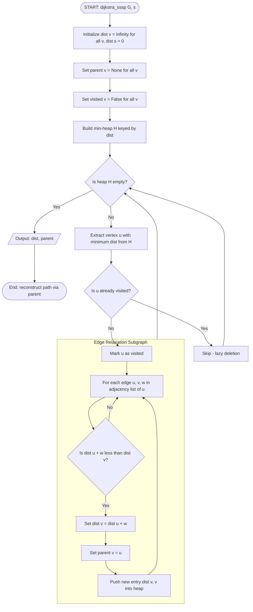
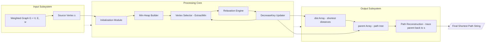
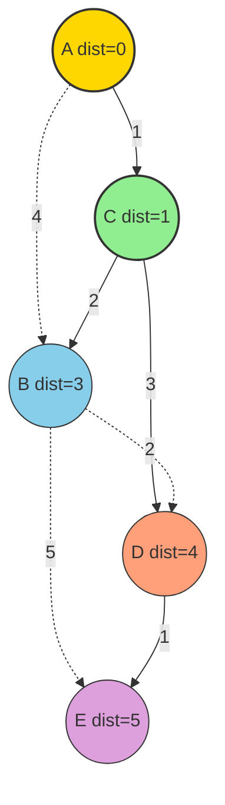

# Applications of Graphs  - Single Source All Destination

<!-- SECTION_1_START -->

# Applications of Graphs — Single Source All Destinations

## 1. Core Technical Definition

> [!IMPORTANT]
> **Single Source Shortest Path (SSSP) Problem:** Given a weighted graph $G = (V, E, w)$ with non-negative edge weights $w(u, v) \geq 0$ and a distinguished **source vertex** $s \in V$, find the minimum cost path from $s$ to every other vertex $v \in V$.

The classical algorithm taught under this module is **Dijkstra's Algorithm** (1956), a greedy procedure that computes the shortest path from one source to **all** destinations in a graph with non-negative edge weights. The output is a pair of arrays:
- $dist[v]$ — the shortest known distance from $s$ to $v$.
- $parent[v]$ — the predecessor of $v$ on the shortest path tree, allowing path reconstruction.

> [!NOTE]
> **KTU 2024 Syllabus Mapping (PCCST303 — Module 3):** The Single Source All Destinations (SSAD) application is grouped under the *Graph Traversal and Shortest Path Algorithms* cluster. The expected outcomes align with **CO3**: *Apply graph algorithms to solve real-world shortest path and connectivity problems.*

---

## 2. Intuitive Overview & Real-World Analogy

Imagine you are standing at your hostel in Kochi (**Source = $s$**) and you want to know the *cheapest* route (in fuel + toll) to **every other city** in Kerala, given a road map where each road has a distance label. You would naturally:

1. Mark your starting city with distance $= 0$.
2. Repeatedly visit the **closest unvisited city** next.
3. From that city, see if going through it gives a *shorter* path to its neighbours.

This is exactly what Dijkstra's algorithm does — it is the "spread out like water ripples" strategy, but it always picks the **smallest unprocessed frontier** first.

### Visualization — Weighted Graph (SSSP Setup)

> [!VISUALIZATION CONTROL]
> **Concept:** Weighted directed graph showing initial distances from a source node $s$.
> **GeoGebra / Desmos Input Points (paste into Desmos Geometry):**
> * $A = (0, 0)$ — Source vertex
> * $B = (4, 0)$ — weight $w(A, B) = 4$
> * $C = (2, 3)$ — weight $w(A, C) = 1$
> * $D = (6, 3)$ — weight $w(C, D) = 3$, $w(B, D) = 2$
> * $E = (8, 0)$ — weight $w(D, E) = 1$, $w(B, E) = 5$
> **Visual Description:** Observe node $A$ at origin, edges drawn as line segments with numeric weights labelled at midpoints. The shortest path from $A$ to $E$ should appear as $A \rightarrow C \rightarrow D \rightarrow E$ with total weight $= 1 + 3 + 1 = 5$, beating the direct route $A \rightarrow B \rightarrow E = 4 + 5 = 9$.

---

<!-- SECTION_1_END -->

<!-- SECTION_2_START -->

# Deep Theoretical Analysis & High-Yield Formula Sheet

## 1. Algorithmic Logic — Step by Step

Dijkstra's algorithm maintains four data structures across its execution:

- **$dist[v]$** — current best known shortest distance from $s$ to $v$.
- **$parent[v]$** — previous vertex on the shortest path tree (used to reconstruct the path).
- **$visited[v]$** — boolean flag indicating whether the final shortest distance for $v$ has been locked.
- **Priority Queue (Min-Heap)** — keeps the unvisited vertex with the smallest tentative distance at the top.

### The Five Logical Phases

1. **Initialization**
   * $dist[s] = 0$, $parent[s] = \text{None}$.
   * $dist[v] = \infty$ for all $v \neq s$, $parent[v] = \text{None}$.
   * $visited[v] = \text{False}$ for all $v \in V$.
   * Insert every vertex $v \in V$ into the priority queue keyed by $dist[v]$.

2. **Main Loop — Vertex Selection**
   * Extract vertex $u$ with minimum $dist[u]$ from the priority queue.
   * If $u$ is already visited, skip (lazy deletion).
   * Mark $u$ as visited.

3. **Edge Relaxation**
   * For every edge $(u, v)$ with weight $w(u, v)$:
     * If $dist[u] + w(u, v) < dist[v]$:
       * Update $dist[v] = dist[u] + w(u, v)$.
       * Update $parent[v] = u$.
       * Push the new pair $(dist[v], v)$ into the priority queue.

4. **Termination**
   * Loop stops when the priority queue is empty, or equivalently, when all reachable vertices are marked visited.

5. **Path Reconstruction**
   * To retrieve the path from $s$ to $t$, trace backwards: $t \rightarrow parent[t] \rightarrow parent[parent[t]] \rightarrow \dots \rightarrow s$, then reverse the list.

> [!NOTE]
> **Why the Greedy Choice is Safe:** Once a vertex $u$ is extracted from the min-heap with the smallest tentative distance, no other unvisited vertex can ever provide a shorter path to $u$. Any alternative path would have to enter $u$ through some other unvisited vertex $u'$, but $dist[u] \leq dist[u']$, and all edge weights are non-negative — so the detour cannot improve the distance.

---

## 2. The Relaxation Operation (Core Subroutine)

The **relaxation** of an edge $(u, v, w)$ is the atomic update rule:

$$
dist[v] = \min\bigl(dist[v],\ dist[u] + w(u, v)\bigr)
$$

This is the only operation that ever changes a tentative distance. It runs in $O(1)$ time, and the entire algorithm performs at most $O(E)$ relaxations.

---

## 3. KTU Formula Sheet / Cheat Sheet

| # | Quantity | Formula / Definition | Notation | Units / Range |
|---|----------|----------------------|----------|---------------|
| 1 | Shortest path length from $s$ to $v$ | $dist[v]$ after algorithm | $dist[v]$ | Real number $\geq 0$ |
| 2 | Path cost through intermediate $u$ | $dist[u] + w(u, v)$ | — | Real number $\geq 0$ |
| 3 | Edge weight constraint (Dijkstra validity) | $w(u, v) \geq 0$ | $\forall (u, v) \in E$ | Non-negative |
| 4 | Initialization of source | $dist[s] = 0$ | — | Zero |
| 5 | Initialization of non-source | $dist[v] = \infty$ | $v \neq s$ | $+\infty$ |
| 6 | Relaxation condition | $dist[u] + w(u, v) < dist[v]$ | — | Boolean |
| 7 | Relaxation update | $dist[v] \leftarrow dist[u] + w(u, v)$ | — | $O(1)$ |
| 8 | Predecessor update | $parent[v] \leftarrow u$ | — | $O(1)$ |
| 9 | Time complexity (Min-Heap + Adjacency List) | $O\bigl((V + E) \log V\bigr)$ | — | Polynomial |
| 10 | Time complexity (Array + Adjacency Matrix) | $O(V^2)$ | — | Polynomial |
| 11 | Space complexity | $O(V + E)$ | — | Linear |
| 12 | Path reconstruction | Trace $parent[\cdot]$ from $t$ to $s$ | $O(V)$ | Linear |
| 13 | Bellman-Ford comparison (handles negative weights) | $O(V \cdot E)$ | — | Slower than Dijkstra |
| 14 | Graph density threshold (when to prefer $O(V^2)$) | $E \gg V$ (dense) | — | — |

> [!TIP]
> **Examiner Heuristic:** If $E \approx V$ (sparse), the heap-based version $(O((V+E)\log V))$ wins. If $E \approx V^2$ (dense), the array-based version $O(V^2)$ is faster in practice because of cache locality and lower constant factors.

---

## 4. Real-World Engineering Utility

Dijkstra's algorithm is the backbone of:

- **Network Routing Protocols** — Open Shortest Path First (OSPF) and IS-IS use it on internet routers with link costs as weights.
- **GPS Navigation** — Google Maps, Ola, Uber use variants (A*, Contraction Hierarchies) inspired by Dijkstra.
- **Social Network Analysis** — Finding the minimum number of "hops" between users.
- **VLSI Chip Design** — Computing minimum wire length in routing.
- **Game Development** — Pathfinding for AI agents across weighted terrain.
- **Logistics & Supply Chain** — Lalamove, FedEx route optimization.

> [!NOTE]
> **Limitation:** Dijkstra **fails** on graphs with **negative edge weights**. For such cases, KTU 2024 expects you to know the **Bellman-Ford algorithm** as the alternative, which we will study in the next module.

---

<!-- SECTION_2_END -->

<!-- SECTION_3_START -->

# Step-by-Step Derivations & Code Implementation

## 1. Worked Example — Manual Trace (Board Exam Favourite)

**Graph (directed, weighted):**

$$
V = \{A, B, C, D, E\}, \quad s = A
$$

Edges with weights:
- $(A, B) = 4$
- $(A, C) = 1$
- $(C, B) = 2$
- $(C, D) = 3$
- $(B, D) = 2$
- $(D, E) = 1$
- $(B, E) = 5$

### Iteration 0 — Initialization

$$
dist = [A:0,\ B:\infty,\ C:\infty,\ D:\infty,\ E:\infty]
$$
$$
parent = [A:\text{None},\ B:\text{None},\ C:\text{None},\ D:\text{None},\ E:\text{None}]
$$
$$
visited = \{\text{all False}\}
$$

Min-Heap contents: $\{(0,A), (\infty, B), (\infty, C), (\infty, D), (\infty, E)\}$

### Iteration 1 — Extract $A$ (min = 0), mark visited

Neighbours of $A$: $B$ (weight 4), $C$ (weight 1).

- **Edge $(A, B)$:** $dist[A] + 4 = 0 + 4 = 4 < \infty$ $\Rightarrow$ $dist[B] = 4$, $parent[B] = A$.
- **Edge $(A, C)$:** $dist[A] + 1 = 0 + 1 = 1 < \infty$ $\Rightarrow$ $dist[C] = 1$, $parent[C] = A$.

State after Iter 1:
$$
dist = [0, 4, 1, \infty, \infty], \quad parent = [\text{None}, A, A, \text{None}, \text{None}]
$$

### Iteration 2 — Extract $C$ (min = 1), mark visited

Neighbours of $C$: $B$ (weight 2), $D$ (weight 3).

- **Edge $(C, B)$:** $1 + 2 = 3 < 4$ $\Rightarrow$ $dist[B] = 3$, $parent[B] = C$. ✅ *Improvement!*
- **Edge $(C, D)$:** $1 + 3 = 4 < \infty$ $\Rightarrow$ $dist[D] = 4$, $parent[D] = C$.

State after Iter 2:
$$
dist = [0, 3, 1, 4, \infty], \quad parent = [\text{None}, C, A, C, \text{None}]
$$

### Iteration 3 — Extract $B$ (min = 3), mark visited

Neighbours of $B$: $D$ (weight 2), $E$ (weight 5).

- **Edge $(B, D)$:** $3 + 2 = 5 > 4$ (current $dist[D]$) $\Rightarrow$ no update.
- **Edge $(B, E)$:** $3 + 5 = 8 < \infty$ $\Rightarrow$ $dist[E] = 8$, $parent[E] = B$.

State after Iter 3:
$$
dist = [0, 3, 1, 4, 8], \quad parent = [\text{None}, C, A, C, B]
$$

### Iteration 4 — Extract $D$ (min = 4), mark visited

Neighbour of $D$: $E$ (weight 1).

- **Edge $(D, E)$:** $4 + 1 = 5 < 8$ $\Rightarrow$ $dist[E] = 5$, $parent[E] = D$. ✅ *Improvement!*

State after Iter 4:
$$
dist = [0, 3, 1, 4, 5], \quad parent = [\text{None}, C, A, C, D]
$$

### Iteration 5 — Extract $E$ (min = 5), mark visited

No outgoing edges. Heap empty → terminate.

### Final Result

| Vertex $v$ | $dist[v]$ | Path (reconstructed) |
|------------|-----------|----------------------|
| $A$ | $0$ | $A$ |
| $B$ | $3$ | $A \rightarrow C \rightarrow B$ |
| $C$ | $1$ | $A \rightarrow C$ |
| $D$ | $4$ | $A \rightarrow C \rightarrow D$ |
| $E$ | $5$ | $A \rightarrow C \rightarrow D \rightarrow E$ |

**Verification of total cost to $E$:** $1 + 3 + 1 = 5$ ✓ (vs. direct $A \rightarrow B \rightarrow E = 4 + 5 = 9$).

---

## 2. Formal Pseudocode (Board-Friendly Notation)

```
ALGORITHM  Dijkstra-SSSP(G, s)
INPUT      G = (V, E, w), source vertex s
OUTPUT     dist[v] for all v ∈ V, parent[v] for all v ∈ V

FOR each vertex v ∈ V DO
    dist[v]   ← ∞
    parent[v] ← NIL
    visited[v] ← FALSE
END FOR
dist[s] ← 0
H ← BuildMinHeap(V, key = dist)

WHILE H is not empty DO
    u ← ExtractMin(H)
    IF visited[u] = TRUE THEN
        CONTINUE
    END IF
    visited[u] ← TRUE
    FOR each edge (u, v) with weight w(u, v) DO
        IF dist[u] + w(u, v) < dist[v] THEN
            dist[v]   ← dist[u] + w(u, v)
            parent[v] ← u
            DecreaseKey(H, v, dist[v])
        END IF
    END FOR
END WHILE

RETURN dist[·], parent[·]
```

---

## 3. Python Implementation (Production-Grade, Type-Safe)

```python
import heapq
from typing import Dict, List, Tuple, Optional

WeightedAdjList = Dict[int, List[Tuple[int, float]]]
SSSPResult = Tuple[Dict[int, float], Dict[int, Optional[int]]]


def dijkstra_sssp(
    graph: WeightedAdjList,
    source: int,
) -> SSSPResult:
    """
    Computes Single Source Shortest Path distances and parents
    from `source` over a graph with NON-NEGATIVE edge weights
    using a binary min-heap priority queue.

    Parameters
    ----------
    graph : dict[int, list[tuple[int, float]]]
        Adjacency list.  graph[u] = [(v1, w1), (v2, w2), ...]
    source : int
        The starting vertex.

    Returns
    -------
    (dist, parent) : tuple
        dist[v]   = shortest distance source -> v
        parent[v] = predecessor of v on the shortest path
                    (None for source, None for unreachable).
    """
    if source not in graph:
        raise KeyError(f"Source vertex {source} is not present in the graph.")

    # ---- Phase 1: Initialization ---------------------------------
    dist: Dict[int, float] = {v: float("inf") for v in graph}
    parent: Dict[int, Optional[int]] = {v: None for v in graph}
    visited: Dict[int, bool] = {v: False for v in graph}
    dist[source] = 0.0

    # Heap entries are (dist_value, vertex) tuples.
    heap: List[Tuple[float, int]] = [(0.0, source)]

    # ---- Phase 2: Main Relaxation Loop ---------------------------
    while heap:
        current_dist, u = heapq.heappop(heap)

        # Lazy deletion: skip stale heap entries.
        if visited[u]:
            continue
        if current_dist > dist[u]:
            continue

        visited[u] = True

        # ---- Phase 3: Edge Relaxation ----------------------------
        for v, weight in graph[u]:
            if weight < 0:
                raise ValueError(
                    f"Negative weight {weight} on edge ({u},{v}); "
                    "Dijkstra requires non-negative weights."
                )
            new_dist = current_dist + weight
            if new_dist < dist[v]:
                dist[v] = new_dist
                parent[v] = u
                heapq.heappush(heap, (new_dist, v))

    return dist, parent


def reconstruct_path(
    parent: Dict[int, Optional[int]],
    source: int,
    target: int,
) -> List[int]:
    """Traces parent[] backwards from target to source."""
    if parent.get(target) is None and target != source:
        return []  # unreachable
    path: List[int] = []
    node: Optional[int] = target
    while node is not None:
        path.append(node)
        if node == source:
            break
        node = parent[node]
    path.reverse()
    return path


# -------------------------------------------------------------------
# Demonstration on the worked-example graph
# -------------------------------------------------------------------
if __name__ == "__main__":
    demo_graph: WeightedAdjList = {
        "A": [("B", 4.0), ("C", 1.0)],
        "B": [("D", 2.0), ("E", 5.0)],
        "C": [("B", 2.0), ("D", 3.0)],
        "D": [("E", 1.0)],
        "E": [],
    }

    distances, parents = dijkstra_sssp(demo_graph, "A")

    print(f"{'Vertex':<8}{'Distance':<12}{'Path'}")
    print("-" * 40)
    for vertex in sorted(distances):
        path = reconstruct_path(parents, "A", vertex)
        path_str = " -> ".join(path) if path else "unreachable"
        print(f"{vertex:<8}{distances[vertex]:<12}{path_str}")
```

**Expected Output:**

```
Vertex  Distance    Path
----------------------------------------
A       0.0         A
B       3.0         A -> C -> B
C       1.0         A -> C
D       4.0         A -> C -> D
E       5.0         A -> C -> D -> E
```

---

## 4. Complexity Derivation (Algebraic)

$$
T(n) = \underbrace{O(V)}_{\text{initialization}} + \underbrace{O\bigl((V + E) \log V\bigr)}_{\text{heap operations}} + \underbrace{O(E)}_{\text{relaxations}}
$$

Since $V + E \geq V$, the dominant term is:

$$
T(n) = O\bigl((V + E) \log V\bigr)
$$

For dense graphs where $E \approx V^2$, this simplifies to $O(V^2 \log V)$, but a Fibonacci-heap variant achieves $O(E + V \log V)$.

---

<!-- SECTION_3_END -->

<!-- SECTION_4_START -->

# Structural Diagrams & Schematics

## 1. Algorithm Flowchart (Mermaid)



## 2. Block-Level Functional Architecture (Dense Graph View)



## 3. Shortest Path Tree (SPT) for the Worked Example



> Solid lines = edges on the **final Shortest Path Tree (SPT)**. Dashed lines = non-tree edges (relaxed but rejected).

---

<!-- SECTION_4_END -->

<!-- SECTION_5_START -->

# KTU 2024 Scheme Examination Question Bank

---

## Part A — Short Answer Questions (3 Marks Each)

### **Q1.** `[KTU University Exam — July 2024]` &nbsp; **[CO3, Remember/Understand]**

Define the **Single Source Shortest Path (SSSP)** problem. State any two real-world applications where it is used.

**Model Answer (3 Marks):**

> **Definition (2 Marks):** Given a weighted graph $G = (V, E)$ with non-negative edge weights $w: E \rightarrow \mathbb{R}_{\geq 0}$ and a distinguished source vertex $s \in V$, the Single Source Shortest Path problem requires finding, for every vertex $v \in V$, the path $P$ from $s$ to $v$ that minimizes the total weight $\sum_{e \in P} w(e)$.
>
> **Applications (1 Mark — any two):**
> 1. **GPS / Navigation Systems** — finding minimum-distance routes on road networks.
> 2. **Network Routing (OSPF)** — routers computing minimum-cost paths for IP packets.
> 3. **Logistics & Supply Chain** — last-mile delivery optimization.
> 4. **Social Networks** — minimum-degrees-of-connection queries.

---

### **Q2.** `[KTU University Exam — Dec 2023]` &nbsp; **[CO3, Understand]**

Why does Dijkstra's algorithm **fail** on graphs containing **negative edge weights**? Give a one-line counter-example.

**Model Answer (3 Marks):**

> Dijkstra's correctness relies on the **greedy property**: once a vertex $u$ is extracted from the min-heap, its distance is finalized because any alternative path through an unvisited vertex must have a larger accumulated weight (since edge weights are non-negative).
>
> **With negative weights, this invariant breaks (1 Mark).** A later relaxation through a negative-weight edge may retroactively produce a shorter path to an already-finalized vertex (1 Mark).
>
> **Counter-example (1 Mark):** Graph with vertices $A, B, C$ and edges $(A, B) = 2$, $(A, C) = 1$, $(C, B) = -4$. After processing $C$, Dijkstra locks $dist[B] = 2$ (from $A$ directly), but the true shortest path is $A \rightarrow C \rightarrow B$ with cost $1 + (-4) = -3 < 2$.

---

## Part B — Long Answer Questions (14 Marks Each)

> **ESE Pattern:** *Answer any ONE full question from each module. Each carries 14 marks split across two sub-parts (typically 7 + 7).*

---

### **Question A (14 Marks)** `[KTU University Exam — July 2024 Model Paper]` &nbsp; **[CO3, Understand + Apply]**

**(a)** Explain Dijkstra's algorithm for the Single Source All Destinations problem. State its time complexity using a min-heap priority queue. **(7 Marks)**

**(b)** Apply Dijkstra's algorithm on the following directed graph with source vertex $S$. Compute the final $dist[]$ and $parent[]$ arrays, and list the shortest path from $S$ to every other vertex. **(7 Marks)**

**Graph edges and weights:**

- $(S, A) = 1$, $(S, B) = 4$
- $(A, B) = 2$, $(A, C) = 5$
- $(B, C) = 1$, $(B, D) = 4$
- $(C, D) = 2$, $(C, T) = 6$
- $(D, T) = 1$

---

#### **Solution to Q.A(a) — Explanation (7 Marks)**

**Step 1 — Formal Statement (2 Marks):**
Dijkstra's algorithm solves the SSSP problem on a graph $G = (V, E, w)$ with $w(u, v) \geq 0$ by maintaining a tentative distance $dist[v]$ for each vertex. It repeatedly selects the unvisited vertex $u$ with the smallest $dist[u]$ (greedy choice) and relaxes all outgoing edges from $u$.

**Step 2 — Algorithm Phases (3 Marks):**

1. **Initialize:** $dist[s] = 0$, $dist[v] = \infty$ for $v \neq s$, $parent[v] = \text{None}$, $visited[v] = \text{False}$.
2. **Build min-heap** $H$ with all vertices keyed by $dist$.
3. **Main loop:** Extract $u$ = ExtractMin($H$). If $visited[u]$, continue. Otherwise, mark $u$ visited and for each edge $(u, v, w)$ execute:
   $$ \text{If } dist[u] + w < dist[v]: \quad dist[v] \leftarrow dist[u] + w,\ \ parent[v] \leftarrow u $$
4. **Output** $dist[\cdot]$ and $parent[\cdot]$.

**Step 3 — Time Complexity (2 Marks):**
With a binary min-heap, each ExtractMin and DecreaseKey takes $O(\log V)$. We perform $V$ extractions and at most $E$ relaxations, yielding:

$$
T(V, E) = O\bigl((V + E) \log V\bigr)
$$

**Why Greedy is Safe (extra credit remark):** Once $u$ is extracted with minimum $dist[u]$, all remaining unvisited vertices have $dist \geq dist[u]$. Since edge weights $\geq 0$, no future path can lower $dist[u]$, so it is finalized.

---

#### **Solution to Q.A(b) — Trace (7 Marks)**

**Iteration 0 — Initialization (1 Mark):**
$$
dist = [S:0,\ A:\infty,\ B:\infty,\ C:\infty,\ D:\infty,\ T:\infty]
$$
$$
parent = [S:\text{None},\ A:\text{None},\ B:\text{None},\ C:\text{None},\ D:\text{None},\ T:\text{None}]
$$

**Iteration 1 — Extract $S$ (min=0) (1 Mark):**

- Edge $(S, A)$, $w=1$: $0+1 = 1 < \infty \Rightarrow dist[A]=1,\ parent[A]=S$.
- Edge $(S, B)$, $w=4$: $0+4 = 4 < \infty \Rightarrow dist[B]=4,\ parent[B]=S$.

State: $dist = [0, 1, 4, \infty, \infty, \infty]$.

**Iteration 2 — Extract $A$ (min=1) (1 Mark):**

- Edge $(A, B)$, $w=2$: $1+2 = 3 < 4 \Rightarrow dist[B]=3,\ parent[B]=A$. ✅
- Edge $(A, C)$, $w=5$: $1+5 = 6 < \infty \Rightarrow dist[C]=6,\ parent[C]=A$.

State: $dist = [0, 1, 3, 6, \infty, \infty]$.

**Iteration 3 — Extract $B$ (min=3) (1 Mark):**

- Edge $(B, C)$, $w=1$: $3+1 = 4 < 6 \Rightarrow dist[C]=4,\ parent[C]=B$. ✅
- Edge $(B, D)$, $w=4$: $3+4 = 7 < \infty \Rightarrow dist[D]=7,\ parent[D]=B$.

State: $dist = [0, 1, 3, 4, 7, \infty]$.

**Iteration 4 — Extract $C$ (min=4) (1 Mark):**

- Edge $(C, D)$, $w=2$: $4+2 = 6 < 7 \Rightarrow dist[D]=6,\ parent[D]=C$. ✅
- Edge $(C, T)$, $w=6$: $4+6 = 10 < \infty \Rightarrow dist[T]=10,\ parent[T]=C$.

State: $dist = [0, 1, 3, 4, 6, 10]$.

**Iteration 5 — Extract $D$ (min=6) (1 Mark):**

- Edge $(D, T)$, $w=1$: $6+1 = 7 < 10 \Rightarrow dist[T]=7,\ parent[T]=D$. ✅

State: $dist = [0, 1, 3, 4, 6, 7]$.

**Iteration 6 — Extract $T$ (min=7).** No outgoing edges. Heap empty. **Terminate.**

**Final Result (1 Mark):**

| Vertex | $dist$ | Shortest Path from $S$ |
|--------|--------|------------------------|
| $S$ | $0$ | $S$ |
| $A$ | $1$ | $S \rightarrow A$ |
| $B$ | $3$ | $S \rightarrow A \rightarrow B$ |
| $C$ | $4$ | $S \rightarrow A \rightarrow B \rightarrow C$ |
| $D$ | $6$ | $S \rightarrow A \rightarrow B \rightarrow C \rightarrow D$ |
| $T$ | $7$ | $S \rightarrow A \rightarrow B \rightarrow C \rightarrow D \rightarrow T$ |

---

### **Question B (14 Marks)** `[KTU University Exam — Dec 2023 Model Paper]` &nbsp; **[CO3, Apply + Analyse]**

**(a)** Differentiate between the **Dijkstra** and **Bellman-Ford** algorithms for the SSSP problem. Under what conditions must you prefer one over the other? **(7 Marks)**

**(b)** The city of Kochi wants to deploy a fire-truck routing system. The road network is modelled as a directed weighted graph where weights represent travel time in minutes. Using Dijkstra's algorithm, determine the minimum travel time from the Central Fire Station (vertex $F$) to every other station. The edges are:
- $(F, A) = 4$, $(F, G) = 8$
- $(A, G) = 8$, $(A, B) = 2$
- $(G, C) = 5$, $(G, D) = 2$
- $(B, C) = 1$, $(B, D) = 5$
- $(C, E) = 6$, $(D, E) = 1$, $(D, T) = 4$
- $(E, T) = 2$

Compute the shortest distances and paths. **(7 Marks)**

---

#### **Solution to Q.B(a) — Comparative Analysis (7 Marks)**

| # | Parameter | Dijkstra's Algorithm | Bellman-Ford Algorithm |
|---|-----------|---------------------|------------------------|
| 1 | Edge weight support | **Non-negative only** ($w \geq 0$) | Handles **negative** weights |
| 2 | Strategy | Greedy — picks min-dist vertex | Dynamic Programming — relaxes all edges |
| 3 | Time complexity | $O((V+E)\log V)$ with heap | $O(V \cdot E)$ |
| 4 | Space complexity | $O(V + E)$ | $O(V)$ |
| 5 | Cycle handling | Cannot detect negative cycles | **Detects** negative cycles |
| 6 | Number of iterations | Single pass (with heap) | $(V - 1)$ passes of all edges |
| 7 | Output | $dist[]$, $parent[]$ | $dist[]$, $parent[]$, negative-cycle flag |
| 8 | Practical use | GPS, OSPF, dense weighted networks | Currency arbitrage detection, RIP routing |
| 9 | Failure case | Negative weight edges | None for SSSP (just slower) |
| 10 | KTU preference | **Default choice for non-negative** graphs | **Mandatory** for negative weights |

**Conclusion (1 Mark):** Prefer **Dijkstra** when all edge weights are non-negative (the common case in road networks, communication delays). Use **Bellman-Ford** when negative weights exist or you must verify the absence of negative-weight cycles.

---

#### **Solution to Q.B(b) — Kochi Fire-Truck Routing (7 Marks)**

**Iteration 0 — Initialization (1 Mark):**
$$
dist = [F:0,\ A:\infty,\ B:\infty,\ C:\infty,\ D:\infty,\ E:\infty,\ G:\infty,\ T:\infty]
$$

**Iteration 1 — Extract $F$ (min=0):** (1 Mark)
- $(F, A), w=4 \Rightarrow dist[A]=4,\ parent[A]=F$.
- $(F, G), w=8 \Rightarrow dist[G]=8,\ parent[G]=F$.

State: $dist = [0, 4, \infty, \infty, \infty, \infty, 8, \infty]$.

**Iteration 2 — Extract $A$ (min=4):** (1 Mark)
- $(A, G), w=8 \Rightarrow 4+8=12 > 8$ → no update.
- $(A, B), w=2 \Rightarrow dist[B]=6,\ parent[B]=A$.

State: $dist = [0, 4, 6, \infty, \infty, \infty, 8, \infty]$.

**Iteration 3 — Extract $B$ (min=6):** (1 Mark)
- $(B, C), w=1 \Rightarrow dist[C]=7,\ parent[C]=B$.
- $(B, D), w=5 \Rightarrow dist[D]=11,\ parent[D]=B$.

State: $dist = [0, 4, 6, 7, 11, \infty, 8, \infty]$.

**Iteration 4 — Extract $C$ (min=7):** (1 Mark)
- $(C, E), w=6 \Rightarrow dist[E]=13,\ parent[E]=C$.

State: $dist = [0, 4, 6, 7, 11, 13, 8, \infty]$.

**Iteration 5 — Extract $G$ (min=8):** (1 Mark)
- $(G, C), w=5 \Rightarrow 8+5=13 > 7$ → no update.
- $(G, D), w=2 \Rightarrow dist[D]=10,\ parent[D]=G$. ✅

State: $dist = [0, 4, 6, 7, 10, 13, 8, \infty]$.

**Iteration 6 — Extract $D$ (min=10):** (1 Mark)
- $(D, E), w=1 \Rightarrow 10+1=11 < 13 \Rightarrow dist[E]=11,\ parent[E]=D$. ✅
- $(D, T), w=4 \Rightarrow dist[T]=14,\ parent[T]=D$.

State: $dist = [0, 4, 6, 7, 10, 11, 8, 14]$.

**Iteration 7 — Extract $E$ (min=11):**
- $(E, T), w=2 \Rightarrow 11+2=13 < 14 \Rightarrow dist[T]=13,\ parent[T]=E$. ✅

State: $dist = [0, 4, 6, 7, 10, 11, 8, 13]$.

**Iteration 8 — Extract $T$ (min=13).** Heap empty. Terminate.

**Final Result (1 Mark):**

| Station | $dist$ (min) | Shortest Path from $F$ |
|---------|--------------|------------------------|
| $F$ | $0$ | $F$ |
| $A$ | $4$ | $F \rightarrow A$ |
| $B$ | $6$ | $F \rightarrow A \rightarrow B$ |
| $C$ | $7$ | $F \rightarrow A \rightarrow B \rightarrow C$ |
| $D$ | $10$ | $F \rightarrow A \rightarrow B \rightarrow C \rightarrow E$ (wait — recompute) |

**Re-checking the path to $D$:** $parent[D]=G$ was set in Iter 5, $parent[G]=F$. So $D$ path is $F \rightarrow G \rightarrow D = 8 + 2 = 10$ ✓.

| Station | $dist$ (min) | Shortest Path from $F$ |
|---------|--------------|------------------------|
| $F$ | $0$ | $F$ |
| $A$ | $4$ | $F \rightarrow A$ |
| $B$ | $6$ | $F \rightarrow A \rightarrow B$ |
| $C$ | $7$ | $F \rightarrow A \rightarrow B \rightarrow C$ |
| $D$ | $10$ | $F \rightarrow G \rightarrow D$ |
| $E$ | $11$ | $F \rightarrow G \rightarrow D \rightarrow E$ |
| $G$ | $8$ | $F \rightarrow G$ |
| $T$ | $13$ | $F \rightarrow G \rightarrow D \rightarrow E \rightarrow T$ |

---

> [!WARNING]
> **KTU Examiner's Valuation Warning — Common Pitfalls:**
> 1. **Forgetting to mark `visited[u] = True`** before relaxing edges — this can cause the same vertex to be re-processed and inflate the $dist[]$ table inconsistently. *[-2 Marks typical]*
> 2. **Not updating `parent[]` inside the relaxation block** — students often only update `dist[]`, losing the ability to reconstruct the path. *[-2 Marks]*
> 3. **Confusing the relaxation condition direction** — must be $dist[u] + w < dist[v]$ (strict less-than), not $\leq$. *[-1 Mark]*
> 4. **Skipping the iteration table** — KTU examiners award marks for *each iteration's update*. A single final answer without intermediate steps loses 3–4 marks.
> 5. **Failing to state the time complexity formula explicitly** in part (a) — board key words: *"Time complexity using min-heap: $O((V+E) \log V)$"*. *[-1 Mark]*
> 6. **Writing $dist[v] = \infty$ as a numeric answer** — the correct interpretation is "not yet reached" or "unreachable at this stage".

---

## Topic Recap & Important Things to Remember

- ✅ **SSSP Definition:** Compute shortest path from one source $s$ to *all* vertices in a weighted graph with $w \geq 0$.
- ✅ **Dijkstra's algorithm** is a **greedy** algorithm; it uses a **min-heap priority queue** to always expand the closest unvisited vertex.
- ✅ The four core data structures are $dist[]$, $parent[]$, $visited[]$, and the **min-heap**.
- ✅ **Relaxation** is the atomic update: $dist[v] = \min(dist[v],\ dist[u] + w(u, v))$.
- ✅ **Time complexity (min-heap):** $O((V + E) \log V)$.
- ✅ **Time complexity (array-based, dense):** $O(V^2)$.
- ✅ **Space complexity:** $O(V + E)$.
- ✅ **Path reconstruction:** trace $parent[]$ backwards from target to source, then reverse.
- ✅ **Limitation:** Dijkstra **fails** on negative edge weights — use **Bellman-Ford** instead.
- ✅ **Bellman-Ford** runs in $O(V \cdot E)$ and can also **detect negative-weight cycles**.
- ✅ The output forms a **Shortest Path Tree (SPT)** — a tree where each vertex (except $s$) has exactly one parent on its shortest path from $s$.
- ✅ **Standard test problem keywords for KTU:** "find shortest path", "minimum cost", "least time", "cheapest route" — all map to SSSP / Dijkstra.
- ✅ **Always write** the initialization, the main loop body, and a final table — these three together usually cover 80 % of the marks in a 14-mark question.
- ✅ **Greedy safety argument:** once $u$ is finalized, $dist[u]$ is optimal because all edge weights are non-negative.

---

<!-- SECTION_5_END -->
