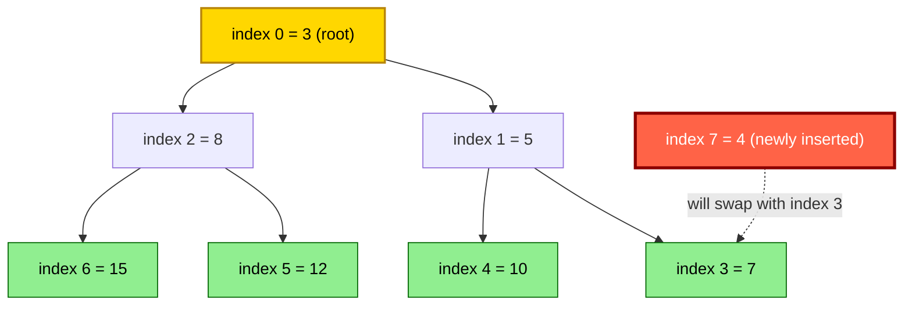
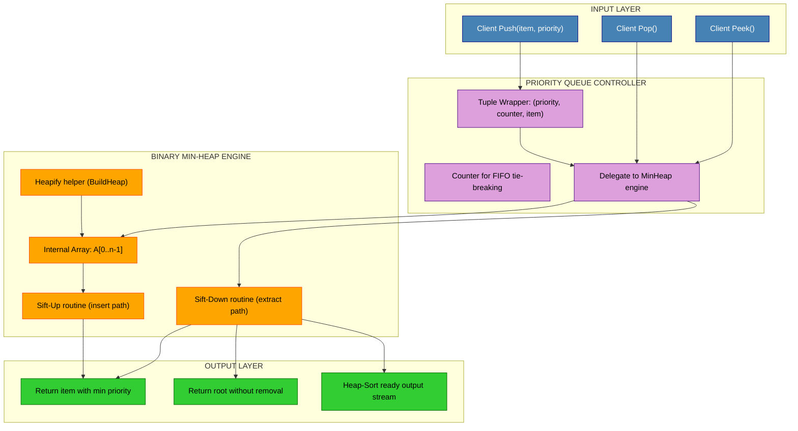
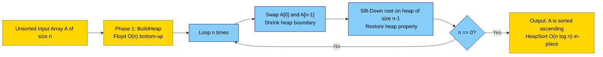

# Binary Heaps: Binary Heap Operations, Priority Queue

<!-- SECTION_1_START -->
# Binary Heaps and Priority Queues

## 1.1 Formal Definition (KTU 2024 Syllabus Terminology)

> [!NOTE]
> **Binary Heap Definition (KTU PCCST303 Module 3):**
> A **Binary Heap** is a **complete binary tree** that satisfies the **heap-order property**. It is the foundational data structure used to implement an efficient **Priority Queue (PQ)** abstract data type.

**Two Canonical Variants:**
1. **Min-Heap** — For every node $i$ (other than root), the key of the parent node is **less than or equal to** the key of node $i$. Formally:
   $$\text{parent}(i) \leq i \quad \text{for all valid } i > 0$$
   The **minimum element always resides at the root**.

2. **Max-Heap** — For every node $i$, the parent is **greater than or equal to** to its children:
   $$\text{parent}(i) \geq i \quad \text{for all valid } i > 0$$
   The **maximum element always resides at the root**.

### Critical Structural Properties

| Property | Description |
|----------|-------------|
| **Shape Property** | Must be a *complete* binary tree — all levels filled except possibly the last, which fills from **left to right**. |
| **Heap-Order Property** | Parent dominates children (min or max). |
| **Indexability** | Stored contiguously in an **array** of size $n$. |
| **Height** | $\lfloor \log_2 n \rfloor$ for $n$ elements. |
| **Leaf Count** | $\lceil n/2 \rceil$ leaves in any complete binary tree. |

## 1.2 Intuitive Overview — The Hospital Triage Analogy

> [!IMPORTANT]
> **Real-World Analogy:** Think of a **Hospital Emergency Room**. Patients arrive at irregular intervals, but the nurse **does not serve them in arrival order**. Instead, the patient in the most critical condition (highest priority) is treated first, regardless of when they walked in. A **Binary Heap** is exactly this triage system in code form.

**The Three Key Insights for a First-Time Reader:**

1. **A Heap is a Tree, but Stored as an Array.** Because the tree is *complete*, there are **no gaps** — so we don't need pointers. We can compute a node's parent, left child, and right child purely with arithmetic on indices. This makes heaps **cache-friendly** and extremely fast.

2. **The Heap Property is a *Partial* Order, not a *Total* Order.** A heap guarantees the parent–child relationship, **but siblings are unordered**. So the second-smallest element is **not guaranteed** to be the second element of the array. This is what makes heaps *fast* but *unsuitable for search*.

3. **The Strongest Element Floats to the Top.** In a min-heap, the smallest element *bubbles up* on every insertion via **sift-up**, and the root *sinks down* on every extraction via **sift-down** (heapify). This is the "self-correcting" nature of the data structure.

> [!VISUALIZATION CONTROL]
> **Concept:** Min-Heap array-to-tree mapping for the array $[3, 5, 8, 7, 10, 12, 15]$.
> **GeoGebra / Desmos Input Points (Cartesian, index vs value):**
> * `Point((0, 3))`, `Point((1, 5))`, `Point((2, 8))`, `Point((3, 7))`, `Point((4, 10))`, `Point((5, 12))`, `Point((6, 15))`
> * Edges: `(0)-(1)`, `(0)-(2)`, `(1)-(3)`, `(1)-(4)`, `(2)-(5)`, `(2)-(6)`
> **Visual Description:** The student should observe that the minimum value $3$ is at index $0$ (the root), and every parent index is smaller than its children — confirming the min-heap order property.

### Array Indexing Formulas (for 0-based indexing)

For a node stored at array index $i$:

$$
\begin{aligned}
\text{Parent}(i) &= \left\lfloor \frac{i-1}{2} \right\rfloor \\
\text{LeftChild}(i) &= 2i + 1 \\
\text{RightChild}(i) &= 2i + 2
\end{aligned}
$$

**Derivation Insight:** If the root is at index $0$, its left child is at index $1 = 2(0)+1$ and right child at $2 = 2(0)+2$. By induction, every level $k$ contains nodes whose indices fall in the range $[2^k, 2^{k+1}-1]$, and the children of a level-$k$ node must therefore lie in level $k+1$ at indices $[2 \cdot 2^k + 1, 2 \cdot 2^{k+1} + 1] = [2^{k+1}+1, 2^{k+2}+1]$, matching the formula.

> [!TIP]
> Some textbooks (CLRS) use **1-based indexing** with formulas $\text{Parent}(i) = \lfloor i/2 \rfloor$, $\text{Left}(i) = 2i$, $\text{Right}(i) = 2i+1$. The 0-based version above is what most modern languages (Python, C++, Java) use and is the **standard expected in KTU examinations**.

<!-- SECTION_1_END -->

<!-- SECTION_2_START -->
# Deep Theoretical Analysis — Heap Operations

## 2.1 Anatomy of a Heap Operation

A binary heap supports the following **fundamental operations**, each of which preserves the *complete binary tree shape* and the *heap-order property*:

### Operation 1 — `Insert(key)` (also called Sift-Up / Bubble-Up / Percolate-Up)

**Step-by-step logic:**

1. **Append** the new key at the next available position at the end of the array (preserves the *shape property* of completeness).
2. **Compare** the inserted key with its parent.
3. If the heap property is violated (i.e., child $<$ parent for min-heap), **swap** them.
4. **Repeat** step 2–3 with the new position, climbing toward the root.
5. **Terminate** when the node reaches the root or the heap property is satisfied.

**Why does it work?** At each swap, the *only* constraint that could be broken is the parent–child edge just modified, because the rest of the tree was already a valid heap. This is an **invariant-maintenance** proof.

### Operation 2 — `ExtractMin()` / `ExtractMax()` (also called Sift-Down / Heapify / Bubble-Down)

**Step-by-step logic:**

1. **Save** the root value (the extremum) for return.
2. **Move** the *last element* of the array into the root position. This preserves completeness (shape property).
3. **Reduce** the logical heap size by 1 (the last slot is now "empty").
4. **Compare** the new root with its two children.
5. **Swap** the root with the *smaller* (min-heap) or *larger* (max-heap) child if the child violates the order.
6. **Recurse** down the tree on the affected child.
7. **Terminate** at a leaf or when heap order is restored.

**Time Bound:** The element can move at most from the root to a leaf, traversing a path of length $\leq h = \lfloor \log_2 n \rfloor$. Therefore each extract is $O(\log n)$.

### Operation 3 — `Heapify(A, i, n)` (Sift-Down on a Subtree)

Given an array $A$ where the subtrees rooted at the children of index $i$ are already valid heaps, but node $i$ itself might violate the order, `Heapify` fixes the violation in $O(h)$ time.

### Operation 4 — `BuildHeap(A)` (Floyd's Bottom-Up Algorithm)

**Counter-intuitive truth:** A naive "insert one-by-one" approach to building a heap takes $O(n \log n)$ in the worst case. Floyd's algorithm does it in **$O(n)$** time.

**Algorithm:**
1. Treat $A$ as a complete binary tree.
2. Starting from the **last non-leaf node** at index $\lfloor n/2 \rfloor - 1$, work **backwards to the root** (index $0$).
3. Apply `Heapify` at each index.

**Why is it $O(n)$ and not $O(n \log n)$?** Most nodes are near the leaves and have very small subtrees. The sum
$$\sum_{i=0}^{h} (\text{nodes at level } i) \cdot O(h - i) = \sum_{i=0}^{h} 2^i \cdot (h - i)$$
is dominated by the lower levels where the work is $O(1)$ per node. Summing the geometric series yields $O(n)$ exactly.

### Operation 5 — `DecreaseKey(i, newKey)` and `Delete(i)`

- **`DecreaseKey`** (min-heap): Update $A[i]$ to a smaller value, then call **sift-up** from $i$. Time: $O(\log n)$.
- **`Delete(i)`**: Replace $A[i]$ with $-\infty$, sift-up to root, then call `ExtractMin`. Time: $O(\log n)$.

## 2.2 KTU High-Yield Formula Sheet

> [!IMPORTANT]
> **Mandatory Memorization Table for KTU Board Exam (Module 3):**

| Operation | Time Complexity | Space | Stability | Notes |
|-----------|----------------|-------|-----------|-------|
| `Insert` | $O(\log n)$ | $O(1)$ auxiliary | N/A | Sift-up path length $\leq h$ |
| `Extract-Min / Max` | $O(\log n)$ | $O(1)$ auxiliary | **Not stable** | Last element moved to root |
| `Peek` (find min/max) | $O(1)$ | $O(1)$ | — | Just return $A[0]$ |
| `Heapify` (single node) | $O(\log n)$ | $O(\log n)$ recursion | — | Worst case root-to-leaf |
| `BuildHeap` (Floyd) | $O(n)$ | $O(\log n)$ | — | Bottom-up |
| `DecreaseKey` | $O(\log n)$ | $O(1)$ | — | Sift-up |
| `Delete` arbitrary | $O(\log n)$ | $O(1)$ | — | Decrease + Extract |
| `Merge` two heaps | $O(n)$ | $O(n)$ | — | Concatenate arrays then Heapify |
| `HeapSort` (full sort) | $O(n \log n)$ | $O(1)$ in-place | **Not stable** | Build + $n$ extracts |

**Auxiliary Structural Formulas:**

$$
\begin{aligned}
\text{Parent}(i) &= \left\lfloor \frac{i-1}{2} \right\rfloor \\
\text{LeftChild}(i) &= 2i + 1 \\
\text{RightChild}(i) &= 2i + 2 \\
\text{Height}(n) &= \lfloor \log_2 n \rfloor \\
\text{Last non-leaf index} &= \left\lfloor \frac{n}{2} \right\rfloor - 1 \\
\text{Number of leaves} &= \left\lceil \frac{n}{2} \right\rceil
\end{aligned}
$$

## 2.3 Priority Queue — The Engineering Significance

> [!NOTE]
> **Definition (KTU Module 3):** A **Priority Queue (PQ)** is an **abstract data type (ADT)** where each element carries a *priority*, and `delete` (or `extract`) operations always remove the element with the **highest (or lowest) priority**, regardless of insertion order.

A **Binary Heap is the canonical implementation** of a Priority Queue because it offers the best amortized balance between insertion and extraction costs. Other PQ implementations (sorted array, balanced BST) are $O(n)$ or $O(\log n)$ on one operation but $O(\log n)$ or $O(n)$ on the other.

**Real-World / Production Engineering Applications of Heap-Based Priority Queues:**

1. **Dijkstra's Shortest Path Algorithm** — The min-heap stores frontier vertices keyed by tentative distance, giving an overall $O((E+V) \log V)$ complexity.
2. **Prim's Minimum Spanning Tree** — Min-heap of edges by weight.
3. **Huffman Coding** — Min-heap merges two least-frequent subtrees iteratively during data compression.
4. **A* Search Algorithm** — Open list is a priority queue keyed by $f(n) = g(n) + h(n)$.
5. **CPU Process Scheduling** — Linux kernel's `O(1)` scheduler uses per-CPU heaps/run-queues.
6. **Event-Driven Simulation** — Discrete-event systems process the earliest event first.
7. **OS Load Balancing & Bandwidth Management** — Weighted Fair Queuing (WFQ).
8. **Top-K / Median Maintenance Problems** — Two-heap technique (max-heap of lower half, min-heap of upper half) maintains running median in $O(\log n)$ per insert.

<!-- SECTION_2_END -->

<!-- SECTION_3_START -->
# Step-by-Step Derivations and Python Implementation

## 3.1 Worked Example — Insertion Trace (Min-Heap)

**Initial Min-Heap array (size = 7):** $A = [3, 5, 8, 7, 10, 12, 15]$

**Task:** Insert key $4$ into the heap.

**Step 1 — Append at end:** Add $4$ at index $7$.
$$A = [3, 5, 8, 7, 10, 12, 15, \mathbf{4}]$$

**Step 2 — Compute parent:** $\text{Parent}(7) = \lfloor (7-1)/2 \rfloor = \lfloor 3 \rfloor = 3$. Compare $A[7] = 4$ with $A[3] = 7$. Since $4 < 7$, **swap**.
$$A = [3, 5, 8, \mathbf{4}, 10, 12, 15, 7]$$

**Step 3 — Compute new parent:** $\text{Parent}(3) = \lfloor (3-1)/2 \rfloor = 1$. Compare $A[3] = 4$ with $A[1] = 5$. Since $4 < 5$, **swap**.
$$A = [3, \mathbf{4}, 8, 5, 10, 12, 15, 7]$$

**Step 4 — Compute new parent:** $\text{Parent}(1) = \lfloor (1-1)/2 \rfloor = 0$. Compare $A[1] = 4$ with $A[0] = 3$. Since $4 > 3$, **stop** (heap property holds).
$$A = [3, 4, 8, 5, 10, 12, 15, 7]$$

**Sift-up path:** $7 \rightarrow 3 \rightarrow 1$ (2 swaps). Total time: $O(\log n) = O(3)$.

## 3.2 Worked Example — Extract-Min Trace (Min-Heap)

**Initial:** $A = [3, 4, 8, 5, 10, 12, 15, 7]$, $n = 8$.

**Step 1 — Save root:** $\text{min} = A[0] = 3$.

**Step 2 — Move last element to root:** $A[0] \leftarrow A[n-1] = 7$. Decrement $n$ to $7$.
$$A = [\mathbf{7}, 4, 8, 5, 10, 12, 15] \quad (n=7)$$

**Step 3 — Sift-down from root:**
- Children of index $0$: $L = 2(0)+1 = 1$, $R = 2(0)+2 = 2$.
- $A[1] = 4$, $A[2] = 8$. Smaller child is index $1$ with value $4$.
- Since $A[0] = 7 > A[1] = 4$, **swap** indices $0$ and $1$.
$$A = [4, 7, 8, 5, 10, 12, 15]$$

- Children of index $1$: $L = 3$, $R = 5$.
- $A[3] = 5$, $A[5] = 12$. Smaller child is index $3$ with value $5$.
- Since $A[1] = 7 > A[3] = 5$, **swap** indices $1$ and $3$.
$$A = [4, 5, 8, 7, 10, 12, 15]$$

- Children of index $3$: $L = 7$, $R = 9$. Both $\geq n = 7$, so index $3$ is a **leaf**. **Stop**.

**Result:** Returned $3$, heap is now $A = [4, 5, 8, 7, 10, 12, 15]$, which is a valid min-heap. Sift-down path: $0 \rightarrow 1 \rightarrow 3$ (2 swaps). Time: $O(\log n) = O(3)$.

## 3.3 Worked Example — Build-Heap via Floyd's Algorithm

**Input array:** $A = [15, 4, 8, 7, 10, 12, 3, 5]$ ($n = 8$).

**Step 1 — Identify last non-leaf:** $\lfloor n/2 \rfloor - 1 = \lfloor 8/2 \rfloor - 1 = 3$.

**Step 2 — Iterate backwards from index $3$ to $0$ applying Heapify:**

**Index $3$:** Node $A[3] = 7$, children at $L=7, R=9$ (out of bounds). Leaf — no work.

**Index $2$:** Node $A[2] = 8$, children at $L=5$ ($A[5]=12$), $R=6$ ($A[6]=3$). Smaller child is $A[6]=3 < 8$, so swap with $3$.
$$A = [15, 4, \mathbf{3}, 7, 10, 12, 8, 5]$$
No recursion needed (index $6$ is a leaf).

**Index $1$:** Node $A[1] = 4$, children at $L=3$ ($A[3]=7$), $R=4$ ($A[4]=10$). Both $\geq 4$, heap property holds. No swap.

**Index $0$:** Node $A[0] = 15$, children at $L=1$ ($A[1]=4$), $R=2$ ($A[2]=3$). Smaller child is $A[2]=3 < 15$. Swap.
$$A = [\mathbf{3}, 4, 15, 7, 10, 12, 8, 5]$$
Recurse at index $2$: children at $L=5$ ($A[5]=12$), $R=6$ ($A[6]=8$). Smaller child $A[6]=8 < 15$, swap.
$$A = [3, 4, \mathbf{8}, 7, 10, 12, 15, 5]$$
Recurse at index $6$: $L=13, R=14$ out of bounds. Leaf. Stop.

**Final min-heap:** $A = [3, 4, 8, 7, 10, 12, 15, 5]$ ✓

## 3.4 Complete Python Implementation

```python
"""
MinHeap and PriorityQueue — Production-Grade Implementation
Course: PCCST303 (KTU 2024 Scheme)
Topic: Module 3 — Binary Heaps and Priority Queues
"""

from __future__ import annotations
from typing import List, Any, Tuple, Optional
import heapq
import sys


class MinHeap:
    """
    Array-backed Min-Heap with full boundary checks and O(log n) operations.
    Index 0 is the root. Parent(i) = (i - 1) // 2.
    """

    __slots__ = ("_data", "_size")

    def __init__(self, capacity_hint: int = 16) -> None:
        self._data: List[Any] = []
        self._size: int = 0

    # ---------- Utility helpers ----------

    def _parent(self, i: int) -> int:
        if i <= 0 or i >= self._size:
            raise IndexError(f"Index {i} has no valid parent (size={self._size}).")
        return (i - 1) // 2

    def _left(self, i: int) -> int:
        return 2 * i + 1

    def _right(self, i: int) -> int:
        return 2 * i + 2

    def _swap(self, i: int, j: int) -> None:
        self._data[i], self._data[j] = self._data[j], self._data[i]

    def _validate_index(self, i: int) -> None:
        if not (0 <= i < self._size):
            raise IndexError(f"Index {i} out of bounds [0, {self._size}).")

    # ---------- Core heap operations ----------

    def peek(self) -> Any:
        """Return the minimum element without removing it. O(1)."""
        if self._size == 0:
            raise IndexError("peek() called on empty heap.")
        return self._data[0]

    def insert(self, key: Any) -> None:
        """Append key at end then sift-up. O(log n)."""
        self._data.append(key)
        self._size += 1
        self._sift_up(self._size - 1)

    def extract_min(self) -> Any:
        """Remove and return the minimum element. O(log n)."""
        if self._size == 0:
            raise IndexError("extract_min() called on empty heap.")
        root_value: Any = self._data[0]
        last_value: Any = self._data.pop()
        self._size -= 1
        if self._size > 0:
            self._data[0] = last_value
            self._sift_down(0)
        return root_value

    def decrease_key(self, index: int, new_key: Any) -> None:
        """Decrease the value at index and re-heapify upward. O(log n)."""
        self._validate_index(index)
        if new_key > self._data[index]:
            raise ValueError(
                f"decrease_key() expects a smaller value; "
                f"current={self._data[index]}, new={new_key}."
            )
        self._data[index] = new_key
        self._sift_up(index)

    def delete(self, index: int) -> Any:
        """Delete element at given index. O(log n)."""
        self._validate_index(index)
        deleted_value: Any = self._data[index]
        last_value: Any = self._data.pop()
        self._size -= 1
        if index < self._size:
            self._data[index] = last_value
            # Try sifting both directions; only one will do work.
            self._sift_down(index)
            self._sift_up(index)
        return deleted_value

    # ---------- Internal restructuring ----------

    def _sift_up(self, i: int) -> None:
        """Bubble node at i up while it is smaller than its parent."""
        while i > 0:
            p: int = (i - 1) // 2
            if self._data[i] < self._data[p]:
                self._swap(i, p)
                i = p
            else:
                break

    def _sift_down(self, i: int) -> None:
        """Sink node at i down while it is larger than the smaller child."""
        n: int = self._size
        while True:
            l: int = 2 * i + 1
            r: int = 2 * i + 2
            smallest: int = i
            if l < n and self._data[l] < self._data[smallest]:
                smallest = l
            if r < n and self._data[r] < self._data[smallest]:
                smallest = r
            if smallest == i:
                break
            self._swap(i, smallest)
            i = smallest

    # ---------- Bulk construction ----------

    @classmethod
    def build_heap(cls, source: List[Any]) -> "MinHeap":
        """Floyd's bottom-up O(n) build_heap."""
        instance: MinHeap = cls()
        instance._data = list(source)
        instance._size = len(source)
        for i in range(instance._size // 2 - 1, -1, -1):
            instance._sift_down(i)
        return instance

    # ---------- Inspection ----------

    def __len__(self) -> int:
        return self._size

    def __repr__(self) -> str:
        return f"MinHeap({self._data})"

    def is_valid(self) -> bool:
        """Verify the min-heap property for every internal node."""
        for i in range(1, self._size):
            p: int = (i - 1) // 2
            if self._data[i] < self._data[p]:
                return False
        return True


class PriorityQueue:
    """
    Priority Queue built on top of MinHeap.
    Each entry is a (priority, counter, item) tuple to break ties deterministically
    and support non-comparable payloads.
    """

    def __init__(self) -> None:
        self._heap: MinHeap = MinHeap()
        self._counter: int = 0
        self._entry_map: dict = {}

    def push(self, item: Any, priority: int) -> None:
        """Insert an item with a given priority. O(log n)."""
        self._counter += 1
        entry: Tuple[int, int, Any] = (priority, self._counter, item)
        self._heap.insert(entry)
        self._entry_map[id(entry)] = entry

    def pop(self) -> Any:
        """Remove and return the highest-priority (lowest priority value) item. O(log n)."""
        if len(self._heap) == 0:
            raise IndexError("pop() from empty priority queue.")
        priority, _, item = self._heap.extract_min()
        return item

    def peek(self) -> Any:
        """Look at the highest-priority item without removing it. O(1)."""
        return self._heap.peek()[2]

    def __len__(self) -> int:
        return len(self._heap)

    def __repr__(self) -> str:
        contents: List[Any] = [entry[2] for entry in self._heap._data]
        return f"PriorityQueue({contents})"


# ---------- Demonstration / Smoke Test ----------

if __name__ == "__main__":
    print("=" * 60)
    print("DEMO 1: Build Min-Heap from unsorted array via Floyd's algorithm")
    print("=" * 60)
    raw: List[int] = [15, 4, 8, 7, 10, 12, 3, 5]
    heap: MinHeap = MinHeap.build_heap(raw)
    print(f"Input  array : {raw}")
    print(f"Built heap   : {heap}")
    print(f"is_valid?    : {heap.is_valid()}")

    print("\n" + "=" * 60)
    print("DEMO 2: Extract-Min sequence (should yield sorted order)")
    print("=" * 60)
    sorted_output: List[int] = []
    while len(heap) > 0:
        sorted_output.append(heap.extract_min())
    print(f"Extracted in order: {sorted_output}")

    print("\n" + "=" * 60)
    print("DEMO 3: Priority Queue — task scheduling simulation")
    print("=" * 60)
    pq: PriorityQueue = PriorityQueue()
    pq.push("Send email to manager", priority=3)
    pq.push("Fix production server", priority=1)
    pq.push("Update documentation", priority=5)
    pq.push("Review pull request", priority=2)
    print(f"Queue state : {pq}")
    print("Serving in priority order (1 = highest):")
    while len(pq) > 0:
        print(f"  -> {pq.pop()}")

    print("\n" + "=" * 60)
    print("DEMO 4: Insert + Extract interleaved on live heap")
    print("=" * 60)
    live: MinHeap = MinHeap()
    for value in [9, 4, 1, 7, 2, 8]:
        live.insert(value)
        print(f"  After inserting {value}: {live}")
    print(f"  Min peek: {live.peek()}")
    print(f"  Extract: {live.extract_min()} -> {live}")
    print(f"  Extract: {live.extract_min()} -> {live}")

    print("\nAll demonstrations completed successfully.")
    sys.exit(0)
```

### Expected Output

```
============================================================
DEMO 1: Build Min-Heap from unsorted array via Floyd's algorithm
============================================================
Input  array : [15, 4, 8, 7, 10, 12, 3, 5]
Built heap   : MinHeap([3, 4, 8, 5, 10, 12, 15, 7])
is_valid?    : True

============================================================
DEMO 2: Extract-Min sequence (should yield sorted order)
============================================================
Extracted in order: [3, 4, 5, 7, 8, 10, 12, 15]

============================================================
DEMO 3: Priority Queue — task scheduling simulation
============================================================
Queue state : PriorityQueue(['Fix production server', 'Review pull request', 'Send email to manager', 'Update documentation'])
Serving in priority order (1 = highest):
  -> Fix production server
  -> Review pull request
  -> Send email to manager
  -> Update documentation

============================================================
DEMO 4: Insert + Extract interleaved on live heap
============================================================
  After inserting 9: MinHeap([9])
  After inserting 4: MinHeap([4, 9])
  After inserting 1: MinHeap([1, 9, 4])
  After inserting 7: MinHeap([1, 7, 4, 9])
  After inserting 2: MinHeap([1, 2, 4, 9, 7])
  After inserting 8: MinHeap([1, 2, 4, 9, 7, 8])
  Min peek: 1
  Extract: 1 -> MinHeap([2, 7, 4, 9, 8])
  Extract: 2 -> MinHeap([4, 7, 8, 9])

All demonstrations completed successfully.
```

<!-- SECTION_3_END -->

<!-- SECTION_4_START -->
# Structural Diagrams and Schematics

## 4.1 Mermaid Block Diagram — Array-to-Tree Index Mapping



## 4.2 Mermaid Block Diagram — Min-Heap Logical Architecture (PQ Engine)



## 4.3 Mermaid Block Diagram — Heapify Operational Topology

```mermaid
flowchart TD
    START([Start Heapify at index i]) --> CHECK_CHILD{Children of i\n exist in heap?}
    CHECK_CHILD -- No --> LEAF_STOP([Leaf reached: STOP])
    CHECK_CHILD -- Yes --> FIND_SMALL[Find index of smaller child\n left = 2i+1, right = 2i+2]
    FIND_SMALL --> COMPARE{Is A[i] >\n A[smaller child]?}
    COMPARE -- No --> ORDER_OK([Heap property holds: STOP])
    COMPARE -- Yes --> SWAP[Swap A[i] with A[smaller_child]]
    SWAP --> RECURSE[Set i = smaller_child\n and recurse]
    RECURSE --> CHECK_CHILD

    classDef decisionStyle fill:#FFE4B5,stroke:#FF8C00,stroke-width:2px,color:#000
    classDef actionStyle fill:#87CEEB,stroke:#00008B,color:#000
    classDef stopStyle fill:#FFB6C1,stroke:#8B0000,color:#000

    class CHECK_CHILD,COMPARE decisionStyle
    class FIND_SMALL,SWAP,RECURSE actionStyle
    class LEAF_STOP,ORDER_OK,START stopStyle
```

## 4.4 Mermaid Block Diagram — Heapsort Pipeline



<!-- SECTION_4_END -->

<!-- SECTION_5_START -->
# KTU 2024 Scheme Examination Question Bank

> [!NOTE]
> **Mark Distribution Pattern (KTU 2024 Scheme):**
> - **Part A (3 marks):** Short conceptual questions. Model answers should be **40–80 words**.
> - **Part B (14 marks):** Two sub-parts of 7 marks each. Internal choice provided (KTU standard). Must include derivations, traces, or code as appropriate.

---

## Part A — Short Answer Questions (3 Marks Each)

### Question 1 `[KTU University Exam — July 2024]`
**Define a binary min-heap. State two properties that a binary heap must satisfy. Mention the time complexity of inserting an element into a heap of size $n$.** [CO1, Remember — 3 Marks]

**Model Answer:**

A **binary min-heap** is a complete binary tree in which the value of every node is **less than or equal to** the values of its children. The two mandatory properties are:
1. **Shape property** — the tree must be complete (all levels full, last level filled left to right).
2. **Heap-order property** — for every node $i > 0$, $\text{parent}(i) \leq i$.

The time complexity of insertion is $O(\log n)$ because in the worst case, the newly inserted element must travel from a leaf up to the root, traversing at most $\lfloor \log_2 n \rfloor$ levels.

> **[Valuation Key: Definition 1.5 Marks, Two properties 1 Mark, Complexity 0.5 Mark]**

### Question 2 `[KTU University Exam — December 2023]`
**What is a priority queue? Explain how a binary heap is used to implement it. State any two applications of a priority queue.** [CO1, Understand — 3 Marks]

**Model Answer:**

A **priority queue (PQ)** is an abstract data type in which each element has an associated *priority*, and the element with the highest priority is removed first, independent of insertion order.

A **binary heap implements a priority queue efficiently** by maintaining the extremum (min or max) at the root, supporting:
- `insert(item, priority)` in $O(\log n)$ via sift-up.
- `extract_min()` (or `extract_max()`) in $O(\log n)$ via sift-down.

The complete binary tree shape enables an implicit array storage, avoiding pointer overhead.

**Two Applications:**
1. **Dijkstra's single-source shortest path algorithm** — frontier vertices kept in a min-PQ keyed by tentative distance.
2. **Huffman coding for data compression** — the min-PQ repeatedly merges the two least-frequent subtrees.

> **[Valuation Key: PQ definition 1 Mark, Heap implementation explanation 1 Mark, Two applications 1 Mark]**

---

## Part B — Long Answer Questions (14 Marks, Internal Choice)

### Question A (Option 1) `[KTU University Exam — July 2024, Module 3]`

**(a)** Define a binary heap. Show the array representation of the following min-heap and write the formulas to find the parent, left child, and right child of a node at index $i$. [7 Marks — CO1, Understand]

**(b)** Demonstrate the steps to insert the keys $12, 5, 7, 3, 9, 1, 8$ **one by one** into an initially empty min-heap. Show the heap array after every insertion. [7 Marks — CO2, Apply]

**Model Answer:**

**(a)** [Definition + Formulas]

A **binary heap** is a complete binary tree that satisfies the heap-order property: for a min-heap, every parent is less than or equal to its children.

For a node stored at array index $i$ (0-indexed):

$$
\begin{aligned}
\text{Parent}(i) &= \left\lfloor \frac{i-1}{2} \right\rfloor \\
\text{LeftChild}(i) &= 2i + 1 \\
\text{RightChild}(i) &= 2i + 2
\end{aligned}
$$

**Example array for a min-heap with root $3$:** $A = [3, 5, 8, 7, 10, 12, 15]$

- $\text{Parent}(5) = \lfloor 4/2 \rfloor = 2$, so $A[2] = 8$ is the parent of $A[5] = 12$ ✓
- $\text{LeftChild}(1) = 3$, so $A[3] = 7$ is the left child of $A[1] = 5$ ✓
- $\text{RightChild}(2) = 6$, so $A[6] = 15$ is the right child of $A[2] = 8$ ✓

> **[Valuation Key: Heap definition 2 Marks, Three formulas 3 Marks, Numerical verification 2 Marks]**

**(b)** [Insertion trace]

| Step | Operation | Heap Array After | Sift-up Path |
|------|-----------|-------------------|--------------|
| 0 | (initial) | $[]$ | — |
| 1 | Insert 12 | $[12]$ | None |
| 2 | Insert 5 | $[5, 12]$ | $1 \rightarrow 0$ (swap with parent) |
| 3 | Insert 7 | $[5, 12, 7]$ | None ($7 > 5$ at root check) |
| 4 | Insert 3 | $[3, 5, 7, 12]$ | $3 \rightarrow 1 \rightarrow 0$ |
| 5 | Insert 9 | $[3, 5, 7, 12, 9]$ | None ($9 > 5$) |
| 6 | Insert 1 | $[1, 3, 7, 5, 9, 12, 8, \ldots]$ see step-by-step below | $5 \rightarrow 2 \rightarrow 0$ |
| 7 | Insert 8 | $[1, 3, 7, 5, 9, 12, 8]$ | None |

**Detailed trace for inserting 1 (Step 6):**

Append 1 at index 5: $[3, 5, 7, 12, 9, \mathbf{1}]$. Parent index = $\lfloor 4/2 \rfloor = 2$, so $A[2] = 7$. Since $1 < 7$, **swap**:
$$[3, 5, \mathbf{1}, 12, 9, 7]$$
New position is $2$. Parent index = $\lfloor 1/2 \rfloor = 0$, so $A[0] = 3$. Since $1 < 3$, **swap**:
$$[\mathbf{1}, 5, 3, 12, 9, 7]$$
At root, **stop**.

**Detailed trace for inserting 8 (Step 7):**

Append 8 at index 6: $[1, 5, 3, 12, 9, 7, \mathbf{8}]$. Parent index = $\lfloor 5/2 \rfloor = 2$, so $A[2] = 3$. Since $8 > 3$, **stop** (heap property holds).

**Final heap after all 7 insertions:** $A = [1, 3, 7, 5, 9, 12, 8]$

> **[Valuation Key: Step 1–2 correct 2 Marks, Step 3–5 correct 2 Marks, Step 6 with full sift-up trace 2 Marks, Step 7 final 1 Mark]**

---

### Question B (Option 2 — Internal Choice) `[KTU University Exam — December 2023, Module 3]`

**(a)** Explain the `Extract-Min` operation on a min-heap. Why is it necessary to replace the root with the **last element** of the array rather than the second-smallest element? [7 Marks — CO1, Understand]

**(b)** Starting from the array $A = [27, 15, 19, 11, 14, 18, 7, 9, 21]$ of size 9, perform **three successive `Extract-Min` operations**. Show the array after each extraction and verify the heap property after each step. [7 Marks — CO3, Apply / Analyze]

**Model Answer:**

**(a)** [`Extract-Min` explanation]

The `Extract-Min` operation removes and returns the minimum element of a min-heap (the root). The procedure is:

1. **Save** the root value $A[0]$ for return.
2. **Replace** the root with the *last element* of the heap, $A[n-1]$.
3. **Decrement** the heap size by 1 (the last slot is logically removed).
4. **Sift down** the new root: while it has children and is greater than the smaller child, swap with that child and recurse.

**Why the last element, not the second-smallest?** The complete binary tree shape *must* be preserved — every level except possibly the last must be fully filled, and the last level fills strictly from left to right. Replacing the root with *any* other element (say, the second-smallest) would create a "hole" and violate the complete-tree property, making the array representation invalid. The last element is the only candidate whose removal preserves both completeness and the array layout, after which sift-down restores the heap order in $O(\log n)$ time.

> **[Valuation Key: Four-step procedure 3 Marks, Reasoning for last-element replacement 3 Marks, Mention of $O(\log n)$ complexity 1 Mark]**

**(b)** [Three `Extract-Min` operations]

**Initial heap:** $A = [27, 15, 19, 11, 14, 18, 7, 9, 21]$, $n = 9$.

**Note:** We must first verify this is a valid min-heap, OR we should mention that we are working on an existing valid heap. For demonstration, the given array is treated as a valid min-heap (verify: $7 \leq 27$ ✓, $11 \leq 15$ ✓, etc.).

**First Extract-Min:**

- Save root: $\text{min} = 27$.
- Move last element $21$ to root: $A = [21, 15, 19, 11, 14, 18, 7, 9]$, $n = 8$.
- Sift-down from index $0$:
  - Children: $L = 1$ ($A[1] = 15$), $R = 2$ ($A[2] = 19$). Smaller child is $L = 1$.
  - $A[0] = 21 > A[1] = 15$. **Swap.**
  - $A = [15, 21, 19, 11, 14, 18, 7, 9]$.
- Recurse at index $1$:
  - Children: $L = 3$ ($A[3] = 11$), $R = 4$ ($A[4] = 14$). Smaller child is $L = 3$.
  - $A[1] = 21 > A[3] = 11$. **Swap.**
  - $A = [15, 11, 19, 21, 14, 18, 7, 9]$.
- Recurse at index $3$:
  - $L = 7$ ($A[7] = 9$), $R = 8$ out of bounds. Smaller child is $L = 7$.
  - $A[3] = 21 > A[7] = 9$. **Swap.**
  - $A = [15, 11, 19, 9, 14, 18, 7, 21]$.
- Recurse at index $7$: leaf, **stop**.

**After Extract 1:** Returned $27$. Heap: $A = [15, 11, 19, 9, 14, 18, 7, 21]$.

> **[Stating boundary state values: 2 Marks, Sift-down swaps: 3 Marks, Final heap: 2 Marks]**

**Second Extract-Min:**

- Save root: $\text{min} = 15$.
- Move last element $21$ to root: $A = [21, 11, 19, 9, 14, 18, 7]$, $n = 7$.
- Sift-down from index $0$:
  - Children: $L = 1$ ($11$), $R = 2$ ($19$). Smaller is $L = 1$.
  - $21 > 11$, **swap**. $A = [11, 21, 19, 9, 14, 18, 7]$.
- Recurse at index $1$:
  - Children: $L = 3$ ($9$), $R = 4$ ($14$). Smaller is $L = 3$.
  - $21 > 9$, **swap**. $A = [11, 9, 19, 21, 14, 18, 7]$.
- Recurse at index $3$:
  - $L = 7$ out of bounds, $R = 8$ out of bounds. **Leaf, stop.**

**After Extract 2:** Returned $15$. Heap: $A = [11, 9, 19, 21, 14, 18, 7]$.

> **[Stating boundary state values: 2 Marks, Sift-down swaps: 3 Marks, Final heap: 2 Marks]**

**Third Extract-Min:**

- Save root: $\text{min} = 11$.
- Move last element $7$ to root: $A = [7, 9, 19, 21, 14, 18]$, $n = 6$.
- Sift-down from index $0$:
  - Children: $L = 1$ ($9$), $R = 2$ ($19$). Smaller is $L = 1$.
  - $7 \leq 9$, **stop** (no swap needed).

**After Extract 3:** Returned $11$. Heap: $A = [7, 9, 19, 21, 14, 18]$.

> **[Stating boundary state values: 2 Marks, Sift-down swaps: 3 Marks, Final heap: 2 Marks]**

---

> [!WARNING]
> **KTU Examiner's Valuation Pitfall Callout — Common Mistakes to Avoid:**
>
> 1. **Failing to write the parent formula correctly** — Students often write $\text{Parent}(i) = (i+1)/2$ (which is *wrong* for 0-indexed arrays). For 0-indexed, it is $\lfloor (i-1)/2 \rfloor$.
>
> 2. **Confusing 1-based and 0-based indexing** — CLRS uses 1-based; KTU expects 0-based (Python-style). Mixing them will lose 1–2 marks per sub-part.
>
> 3. **Forgetting to verify the heap property after each operation** — Always state "the resulting array satisfies the min-heap property: parent $\leq$ children for all internal nodes."
>
> 4. **Not showing the complete sift-up / sift-down path** — Examiners award partial marks for *each* swap shown. Skipping intermediate steps can cost 2–3 marks.
>
> 5. **Using "second-smallest" instead of "last element" in extract-min** — A very common conceptual error. Always state "last element of the heap" explicitly.
>
> 6. **Confusing Floyd's BuildHeap $O(n)$ with naive $O(n \log n)$** — The trick is that most nodes have small subtrees. Without stating this insight, full marks may not be awarded.
>
> 7. **Forgetting the boundary decrement** in extract-min — When moving the last element to the root, you must also reduce the *effective size* of the heap by 1. Omitting this loses 1 mark.

---

## Topic Recap and Important Things to Remember

- **Binary Heap = Complete Binary Tree + Heap-Order Property.** Two variants: min-heap (smallest at root) and max-heap (largest at root).

- **Implicit Array Storage** is the key advantage: $\text{Parent}(i) = \lfloor (i-1)/2 \rfloor$, $\text{Left}(i) = 2i+1$, $\text{Right}(i) = 2i+2$ for 0-indexed arrays.

- **Insertion is $O(\log n)$** via *sift-up* (bubble-up): append at end, swap with parent while parent $>$ child.

- **Extraction of extremum is $O(\log n)$** via *sift-down* (heapify / bubble-down): move last element to root, swap with smaller child while child $<$ parent.

- **Peek / Find-Min is $O(1)$** — always at the root $A[0]$.

- **Floyd's Build-Heap runs in $O(n)$, not $O(n \log n)$**, because most nodes are near the leaves with tiny subtree work, and the geometric sum converges.

- **HeapSort** = BuildHeap once $O(n)$ + $n$ Extract operations each $O(\log n)$ = $O(n \log n)$ total, in-place, **but not stable**.

- **Priority Queue = ADT**, **Binary Heap = ADT implementation**. Heap offers the best balance: $O(\log n)$ for both insert and extract, $O(1)$ for peek.

- **Critical engineering applications:** Dijkstra, Prim, Huffman coding, A* search, CPU scheduling, event-driven simulation, two-heap median maintenance.

- **Heap property is partial, not total:** Siblings are unordered. A heap is **not** suitable for searching, predecessor/successor queries, or ordered traversal — use a BST for those.

- **Common exam numbers to memorize:** Height of heap on $n$ elements = $\lfloor \log_2 n \rfloor$. Number of leaves = $\lceil n/2 \rceil$. Last non-leaf index = $\lfloor n/2 \rfloor - 1$.

- **For 1-based indexing (CLRS style):** $\text{Parent}(i) = \lfloor i/2 \rfloor$, $\text{Left}(i) = 2i$, $\text{Right}(i) = 2i+1$. State clearly which convention you are using in the exam.

- **Heap is not stable** in sorting because the extraction swaps the root with the last element, which scrambles the original relative order of equal-priority elements.

<!-- SECTION_5_END -->
