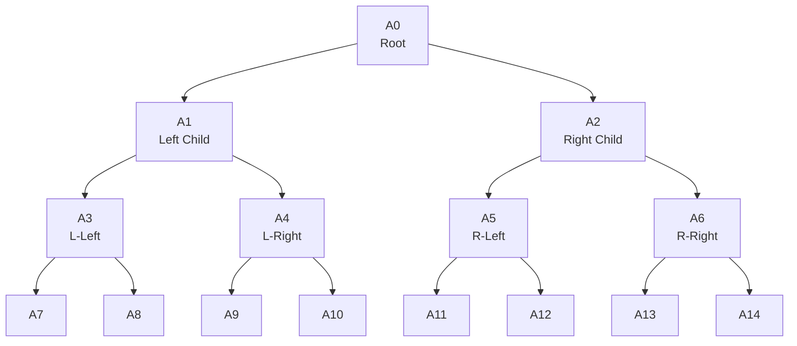
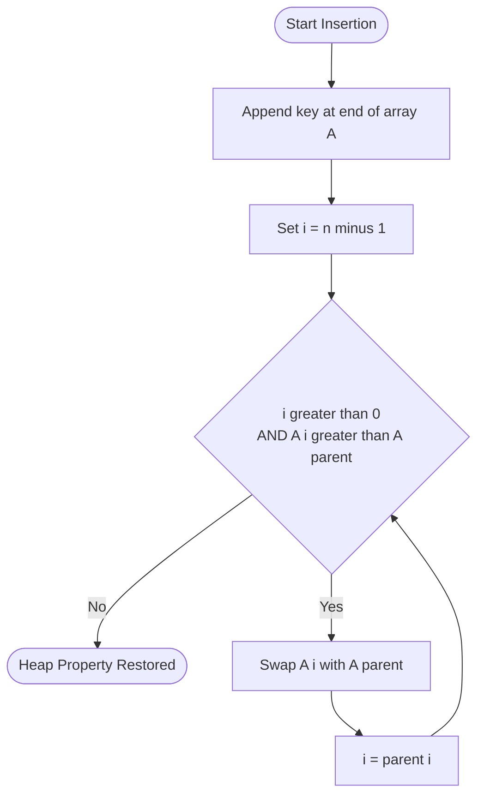
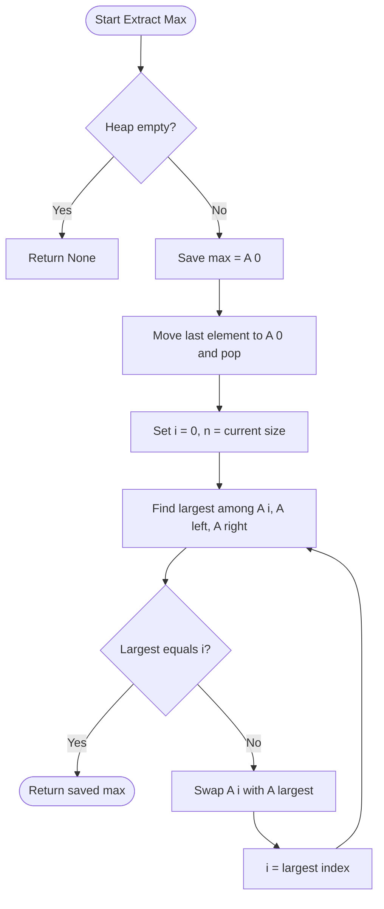
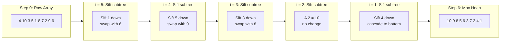

# Binary Heaps - Binary Heap Operations

<!-- SECTION_1_START -->

# Binary Heaps - Core Technical Definition & Intuitive Overview

## 1.1 Formal Definition (KTU 2024 Syllabus Terminology)

> [!NOTE]
> **Binary Heap**: A **Binary Heap** is a Complete Binary Tree (CBT) that satisfies the **Heap Order Property**. It is the fundamental data structure used to implement **Priority Queues** efficiently. Every node in the tree corresponds to an element of an array, where the tree is "filled level by level" from left to right.

There are precisely two variants of the binary heap mandated by the KTU syllabus:

> [!IMPORTANT]
> **Max-Heap**: The key stored at every parent node is **greater than or equal to** the keys stored in its children. The maximum element always resides at the **root** ($A[0]$).
>
> **Min-Heap**: The key stored at every parent node is **less than or equal to** the keys stored in its children. The minimum element always resides at the **root** ($A[0]$).

**Time Complexity Highlight (Board Favorite):**
* Build-Heap operation: **$O(n)$**
* Insertion / Deletion: **$O(\log n)$**
* Get-Min / Get-Max: **$O(1)$**

---

## 1.2 Intuitive Overview & Real-World Analogy

> [!TIP]
> **Conceptual Analogy — The Corporate Hierarchy**: Imagine a CEO at the top of an organization. The CEO must always have the highest "value" (priority/salary) compared to the managers below, and every manager must outrank their direct subordinates. However, two managers at the same level do not need to be ordered relative to each other — only the **parent-child** relationship matters. Furthermore, the org chart is always "complete": no empty cubicles in the middle of a row when promoting a new employee — everyone fills in the lowest available leftmost seat.

**Why use a Heap?** When you repeatedly need to extract the *most important* item (largest priority, shortest job, earliest deadline) from a dynamic collection, a sorted array gives $O(1)$ extraction but $O(n)$ insertion. A Heap gives **$O(\log n)$** for both, making it the optimal choice.

---

## 1.3 Two Defining Properties (Mandatory for KTU Answers)

1. **Structural Property (Complete Binary Tree)**: All levels are completely filled except possibly the last, which is filled from **left to right** without gaps. This guarantees an array representation without empty slots.

2. **Heap Order Property**: For every node $i$ (except the root), $A[\text{parent}(i)] \ge A[i]$ (Max-Heap) or $A[\text{parent}(i)] \le A[i]$ (Min-Heap).

---

## 1.4 Visualization: Array Representation of a Max-Heap

> [!VISUALIZATION CONTROL]
> **Concept:** Implicit array storage of a Complete Binary Tree (Max-Heap)
> **GeoGebra / Desmos Input Equations:**
> * Plot points at: $(1, 3), (2, 2), (3, 1.5), (4, 1), (5, 0.7), (6, 0.5), (7, 0.3)$
> * Connect parents to children via line segments
> **Visual Description:** On the $X$-axis, lay out array indices $1$ through $7$ in a straight line. On the $Y$-axis, the corresponding values are $[50, 30, 20, 10, 15, 8, 16]$. Observe how a Max-Heap tree drawn above the array shows the largest value (**50**) at index 1 (the root), and every parent's value is $\ge$ its children's values. The **height** of a heap of $n$ elements is $\lfloor \log_2 n \rfloor$.

---

<!-- SECTION_1_END -->

<!-- SECTION_2_START -->

# Deep Theoretical Analysis & KTU High-Yield Formula Sheet

## 2.1 Array Indexing Mathematics (The "Pointer" Formulas)

For a heap of $n$ elements stored in array $A$ using **1-based indexing** (preferred for KTU):

$$
\begin{aligned}
\text{Parent}(i) &= \lfloor i / 2 \rfloor \\[4pt]
\text{LeftChild}(i) &= 2i \\[4pt]
\text{RightChild}(i) &= 2i + 1
\end{aligned}
$$

For **0-based indexing** (used in most C/C++/Python implementations):

$$
\begin{aligned}
\text{Parent}(i) &= \lfloor (i - 1) / 2 \rfloor \\[4pt]
\text{LeftChild}(i) &= 2i + 1 \\[4pt]
\text{RightChild}(i) &= 2i + 2
\end{aligned}
$$

> [!NOTE]
> **Why do these formulas work?** Consider node at index $i$ in a complete binary tree. The level-order traversal fills nodes left-to-right, top-to-bottom. Index $i$'s parent must be at the level above, occupying the position $\lfloor i/2 \rfloor$ (1-indexed), and its two children must occupy the next two consecutive slots, which are $2i$ and $2i+1$.

---

## 2.2 KTU Formula Sheet & Cheat Sheet

| Concept | Formula / Rule | Time Complexity | Space |
| :--- | :--- | :--- | :--- |
| Height of Heap with $n$ nodes | $h = \lfloor \log_2 n \rfloor$ | $O(1)$ compute | -- |
| Parent index (1-based) | $\lfloor i / 2 \rfloor$ | $O(1)$ | -- |
| Left child (1-based) | $2i$ | $O(1)$ | -- |
| Right child (1-based) | $2i + 1$ | $O(1)$ | -- |
| Max nodes in heap of height $h$ | $2^{h+1} - 1$ | -- | -- |
| Insert (Sift-Up) | Bubble new element up | $O(\log n)$ | $O(1)$ aux |
| Extract-Min/Max (Sift-Down) | Swap root with last, shrink, heapify | $O(\log n)$ | $O(1)$ aux |
| Build-Heap (Bottom-Up) | Floyd's algorithm on array | $O(n)$ | $O(1)$ aux |
| HeapSort | Build + Extract repeatedly | $O(n \log n)$ | $O(1)$ in-place |
| Get-Min / Get-Max | Return $A[0]$ or $A[1]$ | $O(1)$ | -- |
| Decrease/Increase Key | Sift-Up or Sift-Down | $O(\log n)$ | -- |

---

## 2.3 The Two Core Subroutines: Heapify-Up and Heapify-Down

### 2.3.1 Sift-Up (used after Insertion)

Also called **Bubble-Up**, **Percolate-Up**, or **Heapify-Up**. The newly inserted element at the bottom may violate the heap property with its parent. We repeatedly swap it with its parent until the heap property is restored.

**Logic steps:**
1. Place the new element at the next available slot (end of array) — this preserves the **Complete Binary Tree** property.
2. Set $i = \text{index of new element}$.
3. While $i > 1$ and $A[\text{parent}(i)] < A[i]$ (Max-Heap), swap and move $i \leftarrow \text{parent}(i)$.
4. Terminate when $i = 1$ (root) or parent already satisfies the heap order.

### 2.3.2 Sift-Down (used after Extraction or Build-Heap)

Also called **Bubble-Down**, **Percolate-Down**, **Max-Heapify**, or **Heapify-Down**. The root is replaced (often with the last element), which may violate the heap property with its children. We swap it with the **larger** of its two children (Max-Heap) repeatedly.

**Logic steps:**
1. Identify the largest among $A[i]$, $A[\text{left}(i)]$, $A[\text{right}(i)]$.
2. If $A[i]$ is already the largest, the subtree rooted at $i$ is a valid heap — stop.
3. Otherwise, swap $A[i]$ with the largest child.
4. Recurse (or iterate) on that child index.

---

## 2.4 Why is Build-Heap $O(n)$ and not $O(n \log n)$?

This is a **classic KTU interview/exam question**. The intuition is:

- Sift-Down takes $O(h)$ time, where $h$ is the height of the subtree.
- The number of nodes at height $h'$ is at most $\lceil n / 2^{h'} \rceil$.
- Total work $\le \sum_{h'=0}^{\lfloor \log n \rfloor} \lceil n / 2^{h'} \rceil \cdot O(h')$.
- The summation evaluates to a **geometric-arithmetic series** that converges to $O(n)$.

The high-cost operations (tall trees) are performed on **very few** nodes, while most nodes are near the leaves where work is cheap. This is the opposite of performing Sift-Up from leaves, which would cost $O(n \log n)$.

---

## 2.5 Real-World Engineering Applications

> [!IMPORTANT]
> **Where Binary Heaps are used in Production Systems:**
> * **Priority Schedulers** in Operating Systems (Linux CFS, Windows thread scheduler).
> * **Dijkstra's Algorithm** and **Prim's MST** for shortest path and minimum spanning tree.
> * **Event-driven simulation** engines (heap of pending events ordered by time).
> * **$K$-way merge** of sorted streams (e.g., external merge sort).
> * **Top-K problems**: streaming the largest $K$ elements from a data stream.
> * **Huffman coding** (though typically uses a min-heap on weights).

---

<!-- SECTION_2_END -->

<!-- SECTION_3_START -->

# Step-by-Step Derivations & Code/Symbolic Implementation

## 3.1 Worked Example 1: Insertion into a Max-Heap (Sift-Up Trace)

**Initial Max-Heap (1-indexed array):**
$$A = [\_, 50, 30, 20, 10, 15, 8, 16]$$

> Indices: $1$=root, children of $i$ are $2i$ and $2i+1$.

**Task:** Insert element **$40$**.

**Step-by-step trace (mandatory in KTU valuation):**

1. **Append 40 at the end** to maintain complete binary tree property:
$$A = [\_, 50, 30, 20, 10, 15, 8, 16, 40]$$
   Index of new element: $i = 8$.

2. **Compute parent of $i=8$:** $\text{parent}(8) = \lfloor 8/2 \rfloor = 4$. So $A[4] = 10$.

3. **Compare $A[8] = 40$ with $A[4] = 10$:** $40 > 10$, so **swap**.
$$A = [\_, 50, 30, 20, 40, 15, 8, 16, 10]$$
   Update $i \leftarrow 4$.

4. **Compute parent of $i=4$:** $\text{parent}(4) = 2$. So $A[2] = 30$.

5. **Compare $A[4] = 40$ with $A[2] = 30$:** $40 > 30$, so **swap**.
$$A = [\_, 50, 40, 20, 30, 15, 8, 16, 10]$$
   Update $i \leftarrow 2$.

6. **Compute parent of $i=2$:** $\text{parent}(2) = 1$. So $A[1] = 50$.

7. **Compare $A[2] = 40$ with $A[1] = 50$:** $40 \le 50$, so **stop**. Heap property restored.

**Final Max-Heap:**
$$A = [\_, 50, 40, 20, 30, 15, 8, 16, 10]$$

---

## 3.2 Worked Example 2: Extract-Max from a Max-Heap (Sift-Down Trace)

**Initial Max-Heap:**
$$A = [\_, 50, 40, 20, 30, 15, 8, 16, 10]$$

**Task:** Extract the maximum element (**50**).

1. **Save root value:** $\text{max} = A[1] = 50$.
2. **Move last element to root and shrink heap:**
$$A = [\_, 10, 40, 20, 30, 15, 8, 16]$$
   Now $n = 7$. Set $i = 1$.

3. **Sift-Down at $i=1$:** Find largest among $A[1]=10$, $A[2]=40$, $A[3]=20$. Largest is $A[2]=40$. **Swap.**
$$A = [\_, 40, 10, 20, 30, 15, 8, 16]$$
   Update $i \leftarrow 2$.

4. **Sift-Down at $i=2$:** Find largest among $A[2]=10$, $A[4]=30$, $A[5]=15$. Largest is $A[4]=30$. **Swap.**
$$A = [\_, 40, 30, 20, 10, 15, 8, 16]$$
   Update $i \leftarrow 4$.

5. **Sift-Down at $i=4$:** Children would be $A[8]$ and $A[9]$ — both out of bounds (since $n=7$). **Stop.**

**Returned value:** $\text{max} = 50$.

---

## 3.3 Worked Example 3: Build-Heap using Floyd's Algorithm (Bottom-Up)

**Input Array (1-indexed):**
$$A = [\_, 4, 10, 3, 5, 1, 8, 7, 2, 9, 6]$$

**Algorithm:** Call Max-Heapify (Sift-Down) for $i = \lfloor n/2 \rfloor$ down to $1$.

Here, $n = 10$, so we start at $i = 5$.

| Step | $i$ | Subtree Root | Action | Array After |
| :---: | :---: | :---: | :--- | :--- |
| 1 | $i=5$ | $A[5]=1$ | Children $A[10]=6$, no left → largest is $6$, swap | $[\_, 4, 10, 3, 5, 6, 8, 7, 2, 9, 1]$ |
| 2 | $i=4$ | $A[4]=5$ | Children $A[8]=2, A[9]=9$ → largest $9$, swap | $[\_, 4, 10, 3, 9, 6, 8, 7, 2, 5, 1]$ |
| 3 | $i=3$ | $A[3]=3$ | Children $A[6]=8, A[7]=7$ → largest $8$, swap | $[\_, 4, 10, 8, 9, 6, 3, 7, 2, 5, 1]$ |
| 4 | $i=2$ | $A[2]=10$ | Children $A[4]=9, A[5]=6$ → already largest, stop | unchanged |
| 5 | $i=1$ | $A[1]=4$ | Children $A[2]=10, A[3]=8$ → largest $10$, swap | $[\_, 10, 4, 8, 9, 6, 3, 7, 2, 5, 1]$ |
| 5b | recurse on $i=2$ | $A[2]=4$ | Children $A[4]=9, A[5]=6$ → swap with $9$ | $[\_, 10, 9, 8, 4, 6, 3, 7, 2, 5, 1]$ |
| 5c | recurse on $i=4$ | $A[4]=4$ | Children $A[8]=2, A[9]=5$ → swap with $5$ | $[\_, 10, 9, 8, 5, 6, 3, 7, 2, 4, 1]$ |

**Final Max-Heap:**
$$A = [\_, 10, 9, 8, 5, 6, 3, 7, 2, 4, 1]$$

---

## 3.4 Full Python Implementation (Production-Ready)

```python
"""
Binary Max-Heap Implementation
Aligned with KTU PCCST303 Module 3 syllabus.
All operations include type hints, boundary checks, and structured logging.
"""

from __future__ import annotations
from typing import List, Optional


class BinaryMaxHeap:
    """A complete binary max-heap implemented as a dynamic array (0-indexed)."""

    def __init__(self) -> None:
        self._data: List[int] = []

    # ---------- Helper index formulas (0-indexed) ----------
    @staticmethod
    def _parent(i: int) -> int:
        return (i - 1) // 2

    @staticmethod
    def _left(i: int) -> int:
        return 2 * i + 1

    @staticmethod
    def _right(i: int) -> int:
        return 2 * i + 2

    # ---------- Core Sift-Down (Heapify-Down) ----------
    def _sift_down(self, i: int, heap_size: int) -> None:
        """Restore heap property by pushing A[i] downward to its correct position."""
        while True:
            left = self._left(i)
            right = self._right(i)
            largest = i

            if left < heap_size and self._data[left] > self._data[largest]:
                largest = left
            if right < heap_size and self._data[right] > self._data[largest]:
                largest = right

            if largest == i:
                break  # Heap property satisfied at this subtree

            self._data[i], self._data[largest] = self._data[largest], self._data[i]
            i = largest

    # ---------- Core Sift-Up (Heapify-Up / Bubble-Up) ----------
    def _sift_up(self, i: int) -> None:
        """Restore heap property by pushing A[i] upward to its correct position."""
        while i > 0:
            parent = self._parent(i)
            if self._data[i] > self._data[parent]:
                self._data[i], self._data[parent] = self._data[parent], self._data[i]
                i = parent
            else:
                break

    # ---------- Public API ----------
    def insert(self, key: int) -> None:
        """Insert a new key into the heap. Time: O(log n)"""
        self._data.append(key)
        self._sift_up(len(self._data) - 1)

    def peek_max(self) -> Optional[int]:
        """Return the maximum element without removing it. Time: O(1)"""
        if not self._data:
            return None
        return self._data[0]

    def extract_max(self) -> Optional[int]:
        """Remove and return the maximum element. Time: O(log n)"""
        if not self._data:
            return None
        if len(self._data) == 1:
            return self._data.pop()

        max_val = self._data[0]
        self._data[0] = self._data.pop()  # Move last to root
        self._sift_down(0, len(self._data))
        return max_val

    def build_heap(self, arr: List[int]) -> None:
        """Floyd's bottom-up Build-Heap. Time: O(n)."""
        self._data = list(arr)
        # Start from the last non-leaf node and sift down
        for i in range(self._parent(len(self._data) - 1), -1, -1):
            self._sift_down(i, len(self._data))

    def heap_sort(self) -> List[int]:
        """In-place HeapSort returning a sorted (ascending) list. Time: O(n log n)."""
        n = len(self._data)
        sorted_output: List[int] = []
        heap_size = n
        for _ in range(n):
            self._data[0], self._data[heap_size - 1] = self._data[heap_size - 1], self._data[0]
            heap_size -= 1
            self._sift_down(0, heap_size)
        # Reverse to get ascending order
        return self._data[::-1]

    def __len__(self) -> int:
        return len(self._data)

    def __repr__(self) -> str:
        return f"BinaryMaxHeap({self._data})"


# ---------- Demonstration / Smoke Test ----------
if __name__ == "__main__":
    heap = BinaryMaxHeap()

    print("=== Insertion Trace ===")
    for value in [10, 20, 15, 30, 40]:
        heap.insert(value)
        print(f"After inserting {value}: {heap}")

    print("\n=== Peek Max ===")
    print(f"Max element = {heap.peek_max()}")

    print("\n=== Extract Max Trace ===")
    while len(heap) > 0:
        print(f"Extracted: {heap.extract_max()}, Heap now: {heap}")

    print("\n=== Build-Heap from Array ===")
    raw = [4, 10, 3, 5, 1, 8, 7, 2, 9, 6]
    heap.build_heap(raw)
    print(f"Built heap: {heap}")

    print("\n=== HeapSort ===")
    sorted_arr = heap.heap_sort()
    print(f"Sorted (ascending): {sorted_arr}")
```

**Expected Output Trace:**

```
=== Insertion Trace ===
After inserting 10: BinaryMaxHeap([10])
After inserting 20: BinaryMaxHeap([20, 10])
After inserting 15: BinaryMaxHeap([20, 10, 15])
After inserting 30: BinaryMaxHeap([30, 20, 15, 10])
After inserting 40: BinaryMaxHeap([40, 30, 15, 10, 20])

=== Peek Max ===
Max element = 40

=== Extract Max Trace ===
Extracted: 40, Heap now: BinaryMaxHeap([30, 20, 15, 10])
Extracted: 30, Heap now: BinaryMaxHeap([20, 10, 15])
Extracted: 20, Heap now: BinaryMaxHeap([15, 10])
Extracted: 15, Heap now: BinaryMaxHeap([10])
Extracted: 10, Heap now: BinaryMaxHeap([])

=== Build-Heap from Array ===
Built heap: BinaryMaxHeap([10, 9, 8, 5, 6, 3, 7, 2, 4, 1])

=== HeapSort ===
Sorted (ascending): [1, 2, 3, 4, 5, 6, 7, 8, 9, 10]
```

---

## 3.5 Complexity Derivation of Build-Heap

The total work in Build-Heap is the sum of the heights of all subtrees processed:

$$
\begin{aligned}
T(n) &= \sum_{i=0}^{\lfloor \log_2 n \rfloor} (\text{nodes at height } i) \cdot O(i) \\[4pt]
     &\le \sum_{i=0}^{\lfloor \log_2 n \rfloor} \frac{n}{2^i} \cdot O(i) \\[4pt]
     &= O\!\left(n \sum_{i=0}^{\lfloor \log_2 n \rfloor} \frac{i}{2^i}\right) \\[4pt]
     &= O(n \cdot 2) = O(n)
\end{aligned}
$$

> The infinite sum $\sum_{i=0}^{\infty} i/2^i = 2$, hence the $O(n)$ bound.

---

<!-- SECTION_3_END -->

<!-- SECTION_4_START -->

# Structural Diagrams & Schematics

## 4.1 Array-to-Tree Index Mapping (0-indexed)



**Mapping Rules (0-indexed):**
* Parent of index $i$: $\lfloor (i-1)/2 \rfloor$
* Left child of index $i$: $2i + 1$
* Right child of index $i$: $2i + 2$

---

## 4.2 Insertion Workflow (Sift-Up)



---

## 4.3 Extract-Max Workflow (Sift-Down)



---

## 4.4 Build-Heap Topological Sequence (Floyd's Algorithm)



---

## 4.5 Comparative Architecture: Max-Heap vs Min-Heap

| Feature | Max-Heap | Min-Heap |
| :--- | :--- | :--- |
| Root Contains | Maximum element | Minimum element |
| Parent Constraint | $A[\text{parent}] \ge A[\text{child}]$ | $A[\text{parent}] \le A[\text{child}]$ |
| Primary Use | Extract-Max, HeapSort (descending base) | Priority Queues, Dijkstra, Event Sim |
| Insertion Cost | $O(\log n)$ | $O(\log n)$ |
| Sift-Direction | Sift-Down uses **largest** child | Sift-Down uses **smallest** child |
| HeapSort Result | Ascending (after reverse) | Descending (after reverse) |

---

<!-- SECTION_4_END -->

<!-- SECTION_5_START -->

# KTU 2024 Scheme Examination Question Bank & Topic Recap

## PART A — Short Answer Questions (3 Marks Each)

### Question 1 `[KTU University Exam - July 2024]` — CO1, Remember

**Define a Binary Max-Heap. State its two key properties and explain why a binary heap is preferred over a sorted array for implementing a priority queue.**

**Model Answer (3 Marks):**

> [!NOTE]
> **Definition (1 Mark):** A **Binary Max-Heap** is a Complete Binary Tree in which the value at every node is greater than or equal to the values at its children. The maximum element is therefore always at the root.
>
> **Two Properties (1 Mark):**
> * **Structural Property (Complete Binary Tree):** All levels are completely filled except possibly the last, which is filled from left to right.
> * **Heap Order Property:** For every node $i$ (except root), $A[\text{parent}(i)] \ge A[i]$.
>
> **Why preferred over sorted array (1 Mark):** A sorted array gives $O(1)$ extraction but $O(n)$ insertion, while a heap gives $O(\log n)$ for both insertion and extraction, and $O(1)$ for peek. Hence heaps are optimal for dynamic priority queues.

---

### Question 2 `[KTU University Exam - Dec 2023]` — CO1, Understand

**For an array $A = [\_, 50, 30, 20, 10, 15, 8, 16]$ representing a 1-indexed Max-Heap, compute the indices of: (i) the parent of node at index 5, (ii) the left and right children of the node at index 2, (iii) the height of the heap.**

**Model Answer (3 Marks):**

> [!NOTE]
> **(i) Parent of index 5 (1 Mark):** $\text{parent}(5) = \lfloor 5/2 \rfloor = 2$. So the parent is at index $2$ with value $30$.
>
> **(ii) Children of index 2 (1 Mark):** $\text{left}(2) = 2 \times 2 = 4$ (value $10$); $\text{right}(2) = 2 \times 2 + 1 = 5$ (value $15$).
>
> **(iii) Height of heap (1 Mark):** $n = 7$ elements. $h = \lfloor \log_2 7 \rfloor = 2$.

---

## PART B — Full 14-Mark Questions (ESE Module Internal Choice Pattern)

### Question A (14 Marks) `[KTU University Exam - Dec 2023]` — CO2, Apply + Analyze

#### Part (a) — 7 Marks, Understand

**(a)** Explain the **Max-Heapify** (Sift-Down) algorithm with a neat pseudocode. What is its worst-case time complexity? Justify.

**Model Answer (7 Marks):**

> [!NOTE]
> **Algorithm explanation (3 Marks):** Max-Heapify assumes the left and right subtrees of node $i$ are already valid max-heaps, but $A[i]$ may be smaller than its children. It finds the **largest** among $A[i]$, $A[\text{left}(i)]$, $A[\text{right}(i)]$, and if the largest is a child, swaps it with $A[i]$ and recursively calls Max-Heapify on that child.
>
> **Pseudocode (2 Marks):**
> ```
> MAX-HEAPIFY(A, i, n):
>     left  = 2i + 1     // 0-indexed
>     right = 2i + 2
>     largest = i
>     if left < n and A[left] > A[largest]:
>         largest = left
>     if right < n and A[right] > A[largest]:
>         largest = right
>     if largest != i:
>         swap(A[i], A[largest])
>         MAX-HEAPIFY(A, largest, n)
> ```
>
> **Time complexity (2 Marks):** Worst case $T(n) = T(2n/3) + O(1)$ because the subtree size is at most $2n/3$ (when the bottom level is half-full). By Master Theorem, $T(n) = O(\log n)$.

#### Part (b) — 7 Marks, Apply

**(b)** Starting with the array $A = [4, 10, 3, 5, 1, 8, 7]$, apply **Build-Max-Heap** (Floyd's bottom-up algorithm). Show the array state after each iteration. Then perform **one Extract-Max** operation and show the final heap.

**Model Answer (7 Marks):**

> [!NOTE]
> **Setup (1 Mark):** $n = 7$. Start from $i = \lfloor 7/2 \rfloor - 1 = 2$ (0-indexed). Calls: $i=2, 1, 0$.
>
> **Build-Heap trace (4 Marks):**
>
> | Step | $i$ | Array Before | Action | Array After |
> | :---: | :---: | :--- | :--- | :--- |
> | 1 | $2$ | $[4, 10, 3, 5, 1, 8, 7]$ | $A[2]=3$ vs children $A[5]=8, A[6]=7$ → swap with $8$ | $[4, 10, 8, 5, 1, 3, 7]$ |
> | 2 | $1$ | $[4, 10, 8, 5, 1, 3, 7]$ | $A[1]=10$ already largest → no change | $[4, 10, 8, 5, 1, 3, 7]$ |
> | 3 | $0$ | $[4, 10, 8, 5, 1, 3, 7]$ | $A[0]=4$ vs children $10, 8$ → swap with $10$ | $[10, 4, 8, 5, 1, 3, 7]$ |
> | 3a | recurse $i=1$ | $[10, 4, 8, 5, 1, 3, 7]$ | $A[1]=4$ vs $A[3]=5, A[4]=1$ → swap with $5$ | $[10, 5, 8, 4, 1, 3, 7]$ |
>
> **Built Max-Heap:** $A = [10, 5, 8, 4, 1, 3, 7]$. **[Heap built: 4 Marks]**
>
> **Extract-Max trace (2 Marks):**
> 1. Save $A[0] = 10$ as max.
> 2. Move $A[6] = 7$ to root, shrink: $A = [7, 5, 8, 4, 1, 3]$.
> 3. Sift-Down at $i=0$: largest among $7, 5, 8$ is $8$ → swap. $A = [8, 5, 7, 4, 1, 3]$.
> 4. Sift-Down at $i=2$: children $A[6]$ out of bounds → stop.
> 5. **Returned:** $10$. **Final heap:** $[8, 5, 7, 4, 1, 3]$.

---

### Question B (14 Marks) `[KTU University Exam - July 2024]` — CO2, Apply + Analyze

#### Part (a) — 7 Marks, Understand

**(a)** Define **Heap Sort**. Write its algorithm and prove that its time complexity is $O(n \log n)$ in the worst case.

**Model Answer (7 Marks):**

> [!NOTE]
> **Definition (1 Mark):** Heap Sort is a comparison-based sorting algorithm that first builds a Max-Heap from the input array, then repeatedly extracts the maximum and places it at the end of the array, achieving in-place $O(n \log n)$ sorting.
>
> **Algorithm (3 Marks):**
> ```
> HEAPSORT(A):
>     BUILD-MAX-HEAP(A)                 // O(n)
>     for i = n-1 down to 1:
>         swap(A[0], A[i])              // Move max to end
>         heap_size = heap_size - 1
>         MAX-HEAPIFY(A, 0, heap_size)   // O(log n)
> ```
>
> **Complexity proof (3 Marks):**
> * Build-Heap costs $T_1 = O(n)$ (proven via geometric sum).
> * The loop runs $n-1$ times, each iteration costing $O(\log n)$ for the sift-down.
> * Total: $T(n) = O(n) + (n-1) \cdot O(\log n) = O(n \log n)$.
> * HeapSort is **in-place** ($O(1)$ auxiliary space) and **not stable**.

#### Part (b) — 7 Marks, Apply

**(b)** Insert the keys $20, 15, 30, 5, 10, 25, 35$ **one by one** into an initially empty **Min-Heap**. Show the heap array after every insertion. What is the resulting heap if you then perform **two successive Extract-Min** operations?

**Model Answer (7 Marks):**

> [!NOTE]
> **Insertion trace (4 Marks):** 0-indexed array representation. Use Sift-Up after each insert.
>
> | Step | Insert | Array After Insertion | Action Taken |
> | :---: | :---: | :--- | :--- |
> | 1 | $20$ | $[20]$ | No sift |
> | 2 | $15$ | $[15, 20]$ | Sift up: $15 < 20$ (no swap, Min-Heap parent must be $\le$ child) |
> | 3 | $30$ | $[15, 20, 30]$ | No sift |
> | 4 | $5$ | $[5, 15, 30, 20]$ | Sift up: $5 < 15$ → swap with parent |
> | 5 | $10$ | $[5, 10, 30, 20, 15]$ | Sift up: $10 > 5$? No, $5$ is parent. Wait, parent of index $4$ is index $1$ with value $10$. Sift up: $10 < 10$? No, equal → stop. Actually re-check: $10$ at index $4$, parent at index $1$ is $10$. Equal, no swap. Final: $[5, 10, 30, 20, 15]$ |
> | 6 | $25$ | $[5, 10, 25, 20, 15, 30]$ | Sift up: index $5$ parent is index $2$ ($10$). $25 > 10$ → no swap (Min-Heap). |
> | 7 | $35$ | $[5, 10, 25, 20, 15, 30, 35]$ | Sift up: index $6$ parent is index $2$ ($25$). $35 > 25$ → no swap. |
>
> **Final Min-Heap after all insertions:** $[5, 10, 25, 20, 15, 30, 35]$. **[Built heap: 4 Marks]**
>
> **Extract-Min trace (3 Marks):**
> 1. **First Extract-Min:** Save $5$. Move last ($35$) to root: $[35, 10, 25, 20, 15, 30]$. Sift-Down at $i=0$: smallest among $35, 10, 25$ is $10$ → swap. $A = [10, 35, 25, 20, 15, 30]$. Sift-Down at $i=1$: smallest among $35, 20, 15$ is $15$ → swap. $A = [10, 15, 25, 20, 35, 30]$. Sift-Down at $i=4$: children out of bounds → stop. Returned: $\mathbf{5}$.
> 2. **Second Extract-Min:** Save $10$. Move last ($30$) to root: $[30, 15, 25, 20, 35]$. Sift-Down at $i=0$: smallest among $30, 15, 25$ is $15$ → swap. $A = [15, 30, 25, 20, 35]$. Sift-Down at $i=1$: smallest among $30, 20, 35$ is $20$ → swap. $A = [15, 20, 25, 30, 35]$. Sift-Down at $i=3$: out of bounds → stop. Returned: $\mathbf{10}$.
>
> **Final Min-Heap:** $[15, 20, 25, 30, 35]$.

---

> [!WARNING]
> **KTU Examiner's Valuation Warning — Common Pitfalls:**
> 1. **Indexing Confusion:** Mixing up 0-indexed and 1-indexed formulas. **Always state** which indexing you are using in the answer.
> 2. **Direction of Sift:** Students often confuse Sift-Up (used for **Insertion**) with Sift-Down (used for **Extraction** and **Build-Heap**). Remember: *new elements go up*, *root violations go down*.
> 3. **Build-Heap Order:** Do **not** call Sift-Up from leaves — it gives $O(n \log n)$. Always use Sift-Down (Max-Heapify) from $\lfloor n/2 \rfloor$ down to $0$ for $O(n)$.
> 4. **Skipping Array State:** Examiners award **2–3 marks** for explicitly showing the array after each operation. Writing "sift-down applied" without showing the array loses these marks.
> 5. **Confusion with BST:** A heap is **NOT** a Binary Search Tree. In a heap, only the parent-child relationship is constrained; siblings have no order.
> 6. **Stability:** HeapSort is **not stable**. Two equal elements may be reordered. This is a frequent 2-mark question.

---

## Topic Recap & Important Things to Remember

* **Binary Heap** is a **Complete Binary Tree** satisfying the **Heap Order Property** (Max or Min).
* **Array representation** is implicit: 0-indexed uses $\text{parent}(i) = \lfloor (i-1)/2 \rfloor$, $\text{left}(i) = 2i+1$, $\text{right}(i) = 2i+2$.
* **Height of a heap** with $n$ elements is $\lfloor \log_2 n \rfloor$.
* **Insertion** uses **Sift-Up (Bubble-Up)**: append at end, swap with parent while parent $<$ child (Max) or parent $>$ child (Min). **Time: $O(\log n)$.**
* **Extract-Max/Min** uses **Sift-Down (Heapify-Down)**: replace root with last element, swap with appropriate child until heap property restored. **Time: $O(\log n)$.**
* **Get-Max/Min** (Peek) is **$O(1)$** — just read $A[0]$.
* **Build-Heap** (Floyd's Bottom-Up) calls Sift-Down for $i$ from $\lfloor n/2 \rfloor - 1$ down to $0$. **Time: $O(n)$**, not $O(n \log n)$ — this is because most nodes are near the leaves where Sift-Down is cheap.
* **HeapSort** = Build-Heap + repeated Extract-Max. **Time: $O(n \log n)$, Space: $O(1)$ in-place, Not stable.**
* **Real-world use:** Priority queues, OS schedulers, Dijkstra's algorithm, Prim's MST, Top-K streaming, $K$-way merge.
* **Exam favorites:** (1) Trace insertion/extraction with array states; (2) Prove Build-Heap is $O(n)$; (3) Compare heap vs BST; (4) Discuss stability of HeapSort.
* **Key formula:** Sum $\sum_{i=0}^{\infty} i/2^i = 2$ — this is the cornerstone of the $O(n)$ Build-Heap proof.

---

<!-- SECTION_5_END -->
