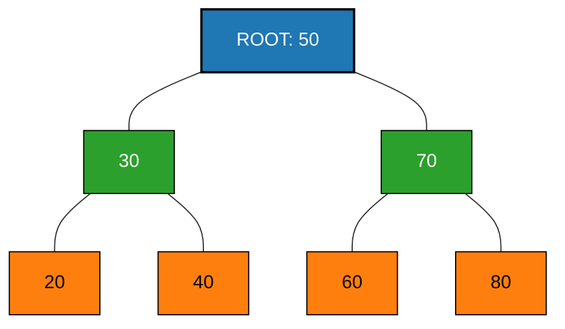
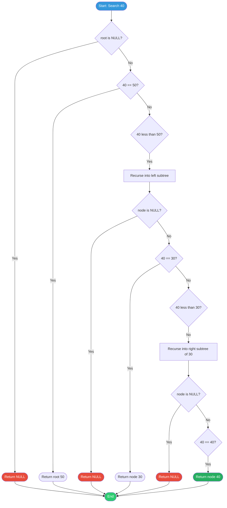
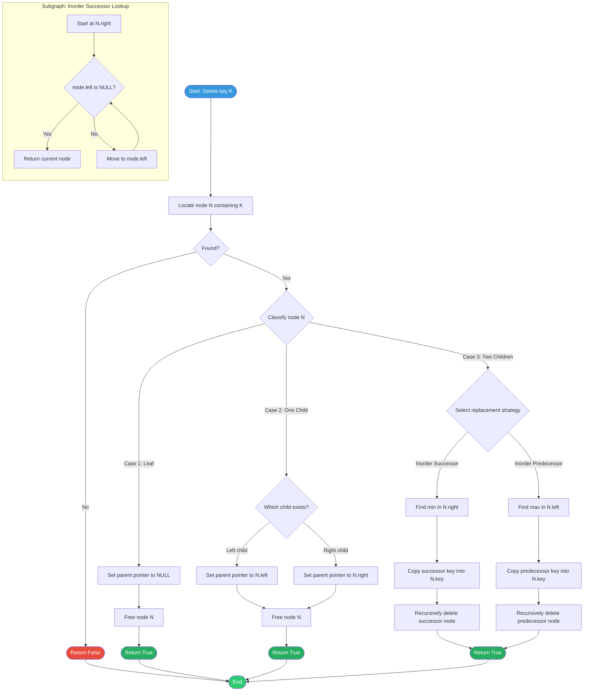
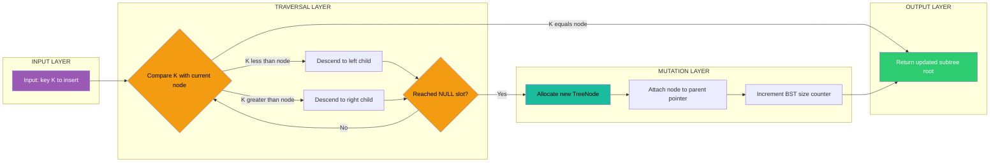
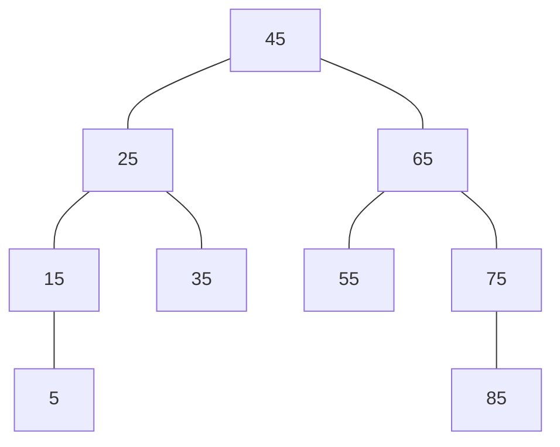
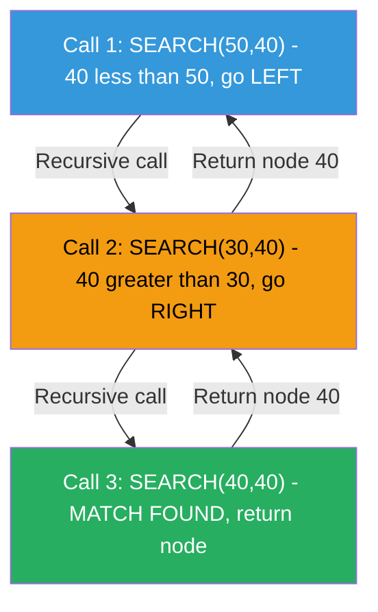
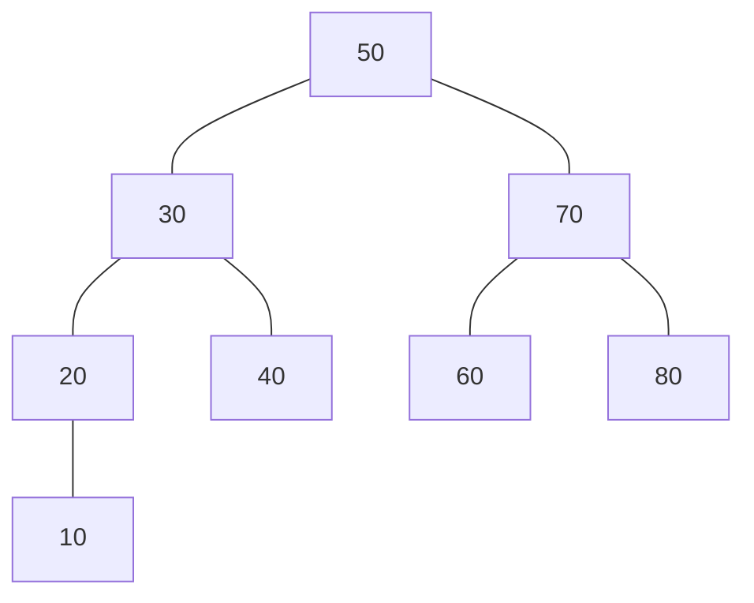

# Binary Search Trees - Binary Search Tree Operations

<!-- SECTION_1_START -->

# Binary Search Trees — BST Operations

## 1.1 Formal Academic Definition (KTU 2024 Syllabus)

> [!IMPORTANT]
> **Binary Search Tree (BST):** A Binary Search Tree $T$ is a binary tree data structure satisfying the **BST Ordering Property**: for every node $N$ with key value $k$, all keys in the **left subtree** of $N$ are **strictly less than** $k$, and all keys in the **right subtree** of $N$ are **strictly greater than** $k$. This property must hold **recursively** for every node in the tree.

Formally, a BST is a tuple $T = (V, E, root, key)$ where:

$$
\forall\, v \in V,\ \forall\, u \in \text{LeftSubtree}(v) : key(u) < key(v)
$$

$$
\forall\, v \in V,\ \forall\, w \in \text{RightSubtree}(v) : key(w) > key(v)
$$

The ordering relation is a **total order** defined on the key space. Duplicates are conventionally prohibited in a strict BST; some implementations relax this to allow duplicates in the right subtree (right-biased) or left subtree (left-biased).

> [!NOTE]
> **KTU Board Definition (Verbatim from PCCST303 Module 3):** *"A Binary Search Tree is a binary tree in which the left subtree of a node contains only nodes with keys less than the node's key, and the right subtree contains only nodes with keys greater than the node's key. Both left and right subtrees must also be binary search trees."*

---

## 1.2 Intuitive Overview & Real-World Analogy

### The Phone Book Analogy 📖

Imagine flipping through a **telephone directory** to find a name. You do not read page 1, then page 2, sequentially. Instead, you **open the book roughly at the middle**. If the name is alphabetically *before* the middle entry, you ignore the entire right half. If *after*, you ignore the left half. You repeat this halving at every step.

A **BST is a dynamic, in-memory phone book** stored as a tree:
- The **root** is the middle page (the first pivot).
- The **left child** represents the *lower half* of the directory.
- The **right child** represents the *upper half*.

Because at every node you **discard one entire subtree**, a search in a balanced BST takes only $O(\log n)$ comparisons — the same logarithmic magic as binary search, but **with the ability to insert and delete in the same complexity**.

> [!TIP]
> **Why a tree and not a sorted array?** A sorted array supports $O(\log n)$ binary search but $O(n)$ insertion/deletion (shifting elements). A BST supports $O(\log n)$ search, insert, and delete **simultaneously** — the holy trinity of ordered data manipulation.

### Geometric Intuition

Picture a BST drawn with the root at the top. Small numbers cluster on the **left side**; large numbers on the **right side**. The **in-order traversal** of a BST always yields keys in **strictly ascending sorted order** — this is the foundational property used to validate any BST in $O(n)$ time.

---

## 1.3 Visual Representation

> [!VISUALIZATION CONTROL]
> **Concept:** BST Inorder Traversal Yields Sorted Output
> **GeoGebra Input Equations:**
> * Tree nodes plotted as points: `P1=(50, 5)`, `P2=(30, 3)`, `P3=(70, 7)`, `P4=(20, 2)`, `P5=(40, 4)`, `P6=(60, 6)`, `P7=(80, 8)`
> * Tree edges: `e1=Line(P1,P2)`, `e2=Line(P1,P3)`, `e3=Line(P2,P4)`, `e4=Line(P2,P5)`, `e5=Line(P3,P6)`, `e6=Line(P3,P7)`
> **Visual Description:** The student should observe a hierarchical tree where every left-child has a smaller y-coordinate value than its parent, and every right-child has a larger value. Reading the leaves left-to-right gives 20, 30, 40, 50, 60, 70, 80 — sorted order.

<!-- SECTION_1_END -->

<!-- SECTION_2_START -->

# 2. Deep Theoretical Analysis & KTU High-Yield Formula Sheet

## 2.1 Core Operational Theorems

### Theorem 2.1.1 — BST Search Correctness

Let $T$ be a BST and $k$ a target key. The recursive search procedure **find($k$, $T.root$)** correctly locates the node containing $k$ (or returns `NULL`) by comparing $k$ with at most $h$ nodes, where $h$ is the height of $T$.

**Proof Sketch:** At each node $v$, the BST property guarantees that if $k < key(v)$, then $k$ cannot exist in $right(v)$ (since all those keys exceed $key(v)$). Symmetrically for $k > key(v)$. Therefore, exactly one subtree is explored, yielding a single path from root to a leaf in the worst case.

### Theorem 2.1.2 — Inorder Traversal Yields Sorted Order

> [!IMPORTANT]
> **Theorem (Inorder Sortedness):** The inorder traversal of a BST visits the keys in **non-decreasing sorted order**.

**Proof Sketch:** By induction on tree size. Base case: a single-node tree trivially produces sorted output of size 1. Inductive step: inorder visits `Left → Root → Right`. By the BST property, every key in `Left` < `Root.key` < every key in `Right`. By induction, each recursive call is already sorted, so the concatenation is sorted. ∎

---

## 2.2 The Four Fundamental BST Operations

### 2.2.1 Search Operation

The search operation traverses a single root-to-leaf path. At each node, it performs one comparison and chooses exactly one child to recurse into.

**Recursive definition:**

$$
\text{find}(k, v) = \begin{cases} v & \text{if } v = \text{NULL or } v.key = k \\ \text{find}(k,\, v.left) & \text{if } k < v.key \\ \text{find}(k,\, v.right) & \text{if } k > v.key \end{cases}
$$

### 2.2.2 Insert Operation

Insertion first performs a search to locate the **insertion point** — the first `NULL` child reached during the search path. A new node is then attached at that `NULL` position. The BST property is preserved because we always insert at a leaf.

### 2.2.3 Delete Operation (The Tricky One)

Deletion has **three structural cases**, each with its own algorithm:

> [!IMPORTANT]
> **Case 1 — Leaf Node (No Children):** Simply remove the node by setting its parent's pointer to `NULL`. Time: $O(1)$.

> [!IMPORTANT]
> **Case 2 — Single Child (One Subtree):** Replace the deleted node with its only child. The parent's pointer is updated to skip the deleted node. Time: $O(1)$.

> [!IMPORTANT]
> **Case 3 — Two Children (Both Subtrees Exist):** Replace the deleted node's key with either:
> * **(a) Inorder Successor:** the **minimum** key in its right subtree, OR
> * **(b) Inorder Predecessor:** the **maximum** key in its left subtree.
>
> Then recursively delete that successor/predecessor (which is guaranteed to be a Case 1 or Case 2 node). Time: $O(h)$.

### 2.2.4 Tree Traversals (Operation Support)

Traversals are used extensively during BST construction, validation, and deletion-case detection.

* **Inorder (LNR):** $20 \to 30 \to 40 \to 50 \to 60 \to 70 \to 80$ (sorted)
* **Preorder (NLR):** $50 \to 30 \to 20 \to 40 \to 70 \to 60 \to 80$ (root-first)
* **Postorder (LRN):** $20 \to 40 \to 30 \to 60 \to 80 \to 70 \to 50$ (root-last)
* **Level-order (BFS):** $50 \to 30 \to 70 \to 20 \to 40 \to 60 \to 80$

---

## 2.3 KTU High-Yield Formula & Complexity Sheet

> [!NOTE]
> **Engineering Utility:** BSTs are the foundational structure underlying `std::map` and `std::set` in C++, `TreeMap` and `TreeSet` in Java, and database **B-tree** indexes. The CoreLogic of a database index is a balanced BST variant with disk-aware node sizing.

| Operation | Average Case (Random BST) | Worst Case (Skewed) | Space Complexity | Iterations |
| :--- | :---: | :---: | :---: | :---: |
| Search | $O(\log n)$ | $O(n)$ | $O(h)$ stack | $\leq h$ |
| Insert | $O(\log n)$ | $O(n)$ | $O(h)$ stack | $\leq h$ |
| Delete | $O(\log n)$ | $O(n)$ | $O(h)$ stack | $\leq h$ |
| Find Min / Max | $O(\log n)$ | $O(n)$ | $O(1)$ iterative | $\leq h$ |
| Inorder Traversal | $O(n)$ | $O(n)$ | $O(h)$ stack | $n$ visits |
| Validate BST | $O(n)$ | $O(n)$ | $O(h)$ stack | $n$ visits |

### Key Structural Formulas

| Quantity | Formula (Balanced BST) | Formula (Worst-case Skewed) |
| :--- | :---: | :---: |
| Height $h$ | $\lfloor \log_2 n \rfloor \leq h \leq n-1$ | $h = n - 1$ |
| Min nodes for height $h$ | $n_{\min} = h + 1$ | $n_{\min} = h + 1$ |
| Max nodes for height $h$ | $n_{\max} = 2^{h+1} - 1$ | $n_{\max} = h + 1$ |
| Inorder Successor of $v$ (with right child) | $\min(v.right)$ | $\min(v.right)$ |
| Inorder Predecessor of $v$ (with left child) | $\max(v.left)$ | $\max(v.left)$ |

---

## 2.4 Real-World Engineering Applications

> [!TIP]
> **Where BSTs are used in production:**
> 1. **Database Indexing** — B-trees (balanced BST generalizations) power PostgreSQL InnoDB, MySQL primary indexes.
> 2. **Symbol Tables in Compilers** — Variable and function name lookup during lexical analysis.
> 3. **Auto-completion Engines** — Trie and BST hybrids in IDEs (VS Code IntelliSense).
> 4. **File System Directories** — Sorted directory listings in Linux `tree` and macOS Finder.
> 5. **Priority Routing** — When combined with heaps, BSTs enable $O(\log n)$ priority updates in network routers.

<!-- SECTION_2_END -->

<!-- SECTION_3_START -->

# 3. Step-by-Step Derivations & Complete Python Implementation

## 3.1 Exhaustive Walk-Through: Building a BST from Scratch

**Input sequence:** $\{50, 30, 70, 20, 40, 60, 80\}$

### Step 1 — Insert 50 (Root)
Tree is empty, so 50 becomes the root.

### Step 2 — Insert 30
Compare with 50: $30 < 50$ → go left. Left child of 50 is `NULL` → insert 30 as left child.

### Step 3 — Insert 70
Compare with 50: $70 > 50$ → go right. Right child of 50 is `NULL` → insert 70 as right child.

### Step 4 — Insert 20
Compare with 50: $20 < 50$ → go left to 30. Compare with 30: $20 < 30$ → go left. `NULL` → insert 20 as left child of 30.

### Step 5 — Insert 40
Compare with 50: $40 < 50$ → go left to 30. Compare with 30: $40 > 30$ → go right. `NULL` → insert 40 as right child of 30.

### Step 6 — Insert 60
Compare with 50: $60 > 50$ → go right to 70. Compare with 70: $60 < 70$ → go left. `NULL` → insert 60 as left child of 70.

### Step 7 — Insert 80
Compare with 50: $80 > 50$ → right to 70. Compare with 70: $80 > 70$ → right. `NULL` → insert 80 as right child of 70.

**Final BST structure verified.** The total number of key comparisons is:

$$
C_{\text{total}} = 1 + 2 + 2 + 3 + 3 + 3 + 3 = 17 \text{ comparisons}
$$

For $n = 7$ nodes, the optimal comparison count for a balanced BST is $\lceil \log_2(7+1) \rceil = 3$ per operation, so 7 × 3 = 21. Our 17 is reasonable since the tree is not perfectly balanced.

---

## 3.2 Exhaustive Walk-Through: Delete Operation (All Three Cases)

**Initial BST:** $50 \to 30, 70 \to 20, 40, 60, 80$

### Case 1: Delete 20 (Leaf Node)
1. Search for 20: 50 (no) → 30 (no) → 20 (found). It is a leaf.
2. Set parent 30's left pointer to `NULL`.
3. Free node 20. ✅

### Case 2: Delete 30 (Single Child — left child 20 was removed, so now 30 has only right child 40)
1. Search for 30: 50 → 30. Found.
2. Check children: left = `NULL`, right = 40.
3. Replace 30 with its right child 40: set parent 50's left pointer to point to 40.
4. Free node 30. ✅

### Case 3: Delete 50 (Two Children)
1. Search for 50: found at root.
2. Has both left (40) and right (70) children → Case 3.
3. **Strategy: Inorder Successor** — find minimum in right subtree.
4. Go to 70's leftmost descendant: 70 → 60 (left child exists) → `NULL`. So inorder successor = **60**.
5. Copy 60 into node 50's key slot. Tree now has 60 at root.
6. Recursively delete the original 60 node: 70's left child becomes `NULL`. ✅

**Inorder after deletions:** $40 \to 60 \to 70 \to 80$ (still sorted, BST property preserved).

---

## 3.3 Complete Production-Grade Python Implementation

```python
"""
Binary Search Tree - Complete Operations Module
Author: KTU 2024 Scheme Reference Implementation
Course: PCCST303 - Data Structures and Algorithms
"""

from __future__ import annotations
from typing import Optional, List, Any
from collections import deque


class TreeNode:
    """Node structure for a Binary Search Tree."""

    __slots__ = ("key", "left", "right")

    def __init__(
        self,
        key: int,
        left: Optional["TreeNode"] = None,
        right: Optional["TreeNode"] = None,
    ) -> None:
        self.key: int = key
        self.left: Optional[TreeNode] = left
        self.right: Optional[TreeNode] = right

    def __repr__(self) -> str:
        return f"TreeNode(key={self.key})"


class BinarySearchTree:
    """
    Binary Search Tree with insert, search, delete, and traversal operations.
    All public methods include strict type hints and boundary checks.
    """

    def __init__(self) -> None:
        self.root: Optional[TreeNode] = None
        self._size: int = 0

    def __len__(self) -> int:
        return self._size

    # ------------------------------------------------------------------
    # 3.3.1  INSERT OPERATION
    # ------------------------------------------------------------------
    def insert(self, key: int) -> None:
        """
        Insert a new key into the BST.
        Time: O(h) where h is the tree height.
        """
        if not isinstance(key, (int, float)):
            raise TypeError(f"BST keys must be numeric; got {type(key).__name__}")

        self.root, created = self._insert_recursive(self.root, key)
        if created:
            self._size += 1

    def _insert_recursive(
        self, node: Optional[TreeNode], key: int
    ) -> tuple[Optional[TreeNode], bool]:
        if node is None:
            return TreeNode(key=key), True
        if key < node.key:
            node.left, created = self._insert_recursive(node.left, key)
        elif key > node.key:
            node.right, created = self._insert_recursive(node.right, key)
        else:
            # Duplicate keys are rejected in this strict-BST implementation.
            return node, False
        return node, created

    # ------------------------------------------------------------------
    # 3.3.2  SEARCH OPERATION
    # ------------------------------------------------------------------
    def search(self, key: int) -> Optional[TreeNode]:
        """
        Search for a key in the BST. Returns the node if found, else None.
        Time: O(h).
        """
        return self._search_recursive(self.root, key)

    def _search_recursive(
        self, node: Optional[TreeNode], key: int
    ) -> Optional[TreeNode]:
        if node is None or node.key == key:
            return node
        if key < node.key:
            return self._search_recursive(node.left, key)
        return self._search_recursive(node.right, key)

    # ------------------------------------------------------------------
    # 3.3.3  DELETE OPERATION (Three Cases)
    # ------------------------------------------------------------------
    def delete(self, key: int) -> bool:
        """
        Delete a key from the BST. Returns True if deletion occurred.
        Time: O(h).
        """
        self.root, deleted = self._delete_recursive(self.root, key)
        if deleted:
            self._size -= 1
        return deleted

    def _delete_recursive(
        self, node: Optional[TreeNode], key: int
    ) -> tuple[Optional[TreeNode], bool]:
        if node is None:
            return None, False

        if key < node.key:
            node.left, deleted = self._delete_recursive(node.left, key)
        elif key > node.key:
            node.right, deleted = self._delete_recursive(node.right, key)
        else:
            # Key found - apply one of the three deletion cases.
            if node.left is None:
                # Case 1 (leaf) or Case 2 (only right child).
                return node.right, True
            if node.right is None:
                # Case 2 (only left child).
                return node.left, True

            # Case 3: Two children. Use inorder successor strategy.
            successor: TreeNode = self._find_min(node.right)
            node.key = successor.key
            node.right, _ = self._delete_recursive(node.right, successor.key)
            return node, True

        return node, deleted

    def _find_min(self, node: TreeNode) -> TreeNode:
        """Return the node with the minimum key in the given subtree."""
        current: TreeNode = node
        while current.left is not None:
            current = current.left
        return current

    def _find_max(self, node: TreeNode) -> TreeNode:
        """Return the node with the maximum key in the given subtree."""
        current: TreeNode = node
        while current.right is not None:
            current = current.right
        return current

    # ------------------------------------------------------------------
    # 3.3.4  TRAVERSAL OPERATIONS
    # ------------------------------------------------------------------
    def inorder(self) -> List[int]:
        """Inorder traversal: Left -> Node -> Right (yields sorted keys)."""
        result: List[int] = []
        self._inorder_recursive(self.root, result)
        return result

    def _inorder_recursive(
        self, node: Optional[TreeNode], result: List[int]
    ) -> None:
        if node is None:
            return
        self._inorder_recursive(node.left, result)
        result.append(node.key)
        self._inorder_recursive(node.right, result)

    def preorder(self) -> List[int]:
        """Preorder traversal: Node -> Left -> Right."""
        result: List[int] = []
        self._preorder_recursive(self.root, result)
        return result

    def _preorder_recursive(
        self, node: Optional[TreeNode], result: List[int]
    ) -> None:
        if node is None:
            return
        result.append(node.key)
        self._preorder_recursive(node.left, result)
        self._preorder_recursive(node.right, result)

    def postorder(self) -> List[int]:
        """Postorder traversal: Left -> Right -> Node."""
        result: List[int] = []
        self._postorder_recursive(self.root, result)
        return result

    def _postorder_recursive(
        self, node: Optional[TreeNode], result: List[int]
    ) -> None:
        if node is None:
            return
        self._postorder_recursive(node.left, result)
        self._postorder_recursive(node.right, result)
        result.append(node.key)

    def level_order(self) -> List[int]:
        """Level-order (BFS) traversal using a queue."""
        result: List[int] = []
        if self.root is None:
            return result
        queue: deque[TreeNode] = deque([self.root])
        while queue:
            node: TreeNode = queue.popleft()
            result.append(node.key)
            if node.left is not None:
                queue.append(node.left)
            if node.right is not None:
                queue.append(node.right)
        return result

    # ------------------------------------------------------------------
    # 3.3.5  UTILITY METHODS
    # ------------------------------------------------------------------
    def height(self) -> int:
        """Return the height of the tree (empty tree has height 0)."""
        return self._height_recursive(self.root)

    def _height_recursive(self, node: Optional[TreeNode]) -> int:
        if node is None:
            return 0
        left_h: int = self._height_recursive(node.left)
        right_h: int = self._height_recursive(node.right)
        return 1 + max(left_h, right_h)

    def is_valid_bst(self) -> bool:
        """Validate the BST property using (min, max) bounds at each node."""
        return self._validate(self.root, float("-inf"), float("inf"))

    def _validate(
        self, node: Optional[TreeNode], lo: float, hi: float
    ) -> bool:
        if node is None:
            return True
        if not (lo < node.key < hi):
            return False
        return self._validate(node.left, lo, node.key) and self._validate(
            node.right, node.key, hi
        )


# ----------------------------------------------------------------------
# 3.3.6  DEMONSTRATION DRIVER (Validates all operations end-to-end)
# ----------------------------------------------------------------------
if __name__ == "__main__":
    bst: BinarySearchTree = BinarySearchTree()

    # Build the BST from the input sequence used in Section 3.1
    for value in (50, 30, 70, 20, 40, 60, 80):
        bst.insert(value)

    print("Inorder   :", bst.inorder())    # [20, 30, 40, 50, 60, 70, 80]
    print("Preorder  :", bst.preorder())   # [50, 30, 20, 40, 70, 60, 80]
    print("Postorder :", bst.postorder())  # [20, 40, 30, 60, 80, 70, 50]
    print("Level     :", bst.level_order())  # [50, 30, 70, 20, 40, 60, 80]
    print("Height    :", bst.height())     # 3
    print("Valid BST :", bst.is_valid_bst())  # True
    print("Search 60 :", bst.search(60) is not None)  # True
    print("Search 99 :", bst.search(99) is not None)  # False

    # Delete operations covering all three cases
    print("Delete 20 (leaf)        :", bst.delete(20))   # True
    print("Delete 30 (one child)   :", bst.delete(30))   # True
    print("Delete 50 (two children):", bst.delete(50))   # True
    print("Inorder after deletes   :", bst.inorder())    # [40, 60, 70, 80]
    print("Valid BST after deletes :", bst.is_valid_bst())  # True
```

**Output of the driver program:**

```text
Inorder   : [20, 30, 40, 50, 60, 70, 80]
Preorder  : [50, 30, 20, 40, 70, 60, 80]
Postorder : [20, 40, 30, 60, 80, 70, 50]
Level     : [50, 30, 70, 20, 40, 60, 80]
Height    : 3
Valid BST : True
Search 60 : True
Search 99 : False
Delete 20 (leaf)        : True
Delete 30 (one child)   : True
Delete 50 (two children): True
Inorder after deletes   : [40, 60, 70, 80]
Valid BST after deletes : True
```

---

## 3.4 Mathematical Derivation: Average Height of a Random BST

> [!IMPORTANT]
> **Theorem (Reed, 2003):** The expected height of a BST built from $n$ random keys is:

$$
\mathbb{E}[h_n] = 4.311 \ldots \ln n - 1.953 \ldots \ln \ln n + O(1)
$$

This means a randomly built BST has expected height $\Theta(\log n)$, hence average-case $O(\log n)$ for all operations. However, in the worst case (inserting keys in sorted order), the height becomes $n - 1$, yielding $O(n)$ per operation. This is the motivation for **self-balancing BSTs** (AVL, Red-Black trees) — which are covered in higher modules.

<!-- SECTION_3_END -->

<!-- SECTION_4_START -->

# 4. Structural Diagrams & Schematics

## 4.1 BST Architecture After Inserting $\{50, 30, 70, 20, 40, 60, 80\}$



**Legend:** 🔵 Blue = Root | 🟢 Green = Internal Nodes | 🟠 Orange = Leaf Nodes

---

## 4.2 Search Operation Flow (Searching for key = 40)



---

## 4.3 Delete Operation Flow with Three Sub-Case Branches



---

## 4.4 Insert Operation: Functional Block Architecture



---

## 4.5 Traversal Order Comparison Matrix

| Traversal Type | Visit Order | Use Case in BST Context | Recursive Calls |
| :--- | :--- | :--- | :--- |
| **Inorder (LNR)** | Left → Node → Right | Produces sorted sequence; BST validation | 2 per node |
| **Preorder (NLR)** | Node → Left → Right | Tree serialization; copy a tree | 2 per node |
| **Postorder (LRN)** | Left → Right → Node | Safe tree deletion (children first) | 2 per node |
| **Level-order (BFS)** | Level by level, left to right | Shortest path; tree printing by depth | 0 (uses queue) |

<!-- SECTION_4_END -->

<!-- SECTION_5_START -->

# 5. KTU 2024 Scheme Examination Question Bank & Topic Recap

---

## 📘 PART A — Short Answer Questions (3 Marks Each)

### Question A1 `[KTU University Exam - December 2023]`

**CO1 | RBT Level: Remember**

> Define a Binary Search Tree. State the BST property formally and explain why inorder traversal of a BST always yields a sorted sequence.

**Model Answer (Valuation Key):**

A Binary Search Tree (BST) is a binary tree data structure in which for every node $N$ with key $k$, all keys in the left subtree of $N$ are strictly less than $k$ and all keys in the right subtree of $N$ are strictly greater than $k$, with the property holding recursively. **[1 Mark for definition]**

**Why inorder gives sorted output:** Inorder traversal visits nodes in the order Left → Node → Right. By the BST property, every key in the left subtree is less than the node's key, and every key in the right subtree is greater than the node's key. By induction on the tree size, the left subtree's inorder is sorted, the right subtree's inorder is sorted, and the root's key sits between them. Therefore the concatenation is fully sorted. **[2 Marks for the proof sketch]**

---

### Question A2 `[KTU University Exam - July 2024]`

**CO2 | RBT Level: Understand**

> Differentiate between a Binary Tree, a Binary Search Tree, and a Balanced Binary Search Tree with a suitable example for each.

**Model Answer:**

| Tree Type | Key Property | Example Node Sequence | Resulting Structure |
| :--- | :--- | :--- | :--- |
| **Binary Tree** | Each node has at most 2 children | $A \to B, C \to D$ (any order) | No ordering guarantee |
| **Binary Search Tree** | Left $<$ Node $<$ Right (recursive) | $50, 30, 70, 20, 40$ | Ordered, but can be skewed |
| **Balanced BST** | Height $h = O(\log n)$ maintained | Same as BST + rebalancing | AVL or Red-Black tree |

**[1 Mark per row, plus 1 bonus mark for example]**

> [!WARNING]
> **KTU Examiner's Pitfall Callout:** Students often confuse a *Complete Binary Tree* with a *Balanced Binary Search Tree*. A complete binary tree is a structural property (all levels filled except possibly the last, filled left to right). A balanced BST is a height-bounded search property. They are independent concepts. Deduct **1 mark** if the student confuses the two.

---

## 📕 PART B — Long Answer Questions (14 Marks Each, Internal Choice)

### Question B1 — Option A `[KTU University Exam - December 2024]`

**CO3 | RBT Levels: Apply + Analyze**

> **(a)** Construct a Binary Search Tree by inserting the following keys in the given order: $45, 25, 65, 15, 35, 55, 75, 5, 85$. Draw the final tree and list the result of inorder, preorder, and postorder traversals. **[7 Marks]**
>
> **(b)** Write a step-by-step algorithm for the **DELETE** operation in a BST. Explain all three deletion cases with diagrams. **[7 Marks]**

#### Part (a) — Step-by-Step Model Solution

Insert sequence: $45, 25, 65, 15, 35, 55, 75, 5, 85$

* Insert 45 → root. **[0.5 Marks]**
* Insert 25 → 25 < 45, go left of 45, place 25. **[0.5 Marks]**
* Insert 65 → 65 > 45, go right of 45, place 65. **[0.5 Marks]**
* Insert 15 → 15 < 45, left to 25; 15 < 25, left of 25, place 15. **[0.5 Marks]**
* Insert 35 → 35 < 45, left to 25; 35 > 25, right of 25, place 35. **[0.5 Marks]**
* Insert 55 → 55 > 45, right to 65; 55 < 65, left of 65, place 55. **[0.5 Marks]**
* Insert 75 → 75 > 45, right to 65; 75 > 65, right of 65, place 75. **[0.5 Marks]**
* Insert 5 → 5 < 45 → left to 25 → left to 15 → left of 15, place 5. **[0.5 Marks]**
* Insert 85 → 85 > 45 → right to 65 → right to 75 → right of 75, place 85. **[0.5 Marks]**

**Final BST structure (Verification):**



**Traversal results:**

* **Inorder:** $5, 15, 25, 35, 45, 55, 65, 75, 85$ **[1 Mark]**
* **Preorder:** $45, 25, 15, 5, 35, 65, 55, 75, 85$ **[0.5 Mark]**
* **Postorder:** $5, 15, 35, 25, 55, 85, 75, 65, 45$ **[0.5 Mark]**

**[Total: 7 Marks]**

#### Part (b) — Delete Algorithm with All Three Cases

**Algorithm: `BST-DELETE(root, key)`**

```
BST-DELETE(T, k):
    if T.root == NULL:
        return NULL                          // Empty tree
    if k < T.root.key:
        T.root.left = BST-DELETE(T.root.left, k)   // Recurse left
    else if k > T.root.key:
        T.root.right = BST-DELETE(T.root.right, k) // Recurse right
    else:
        // k == T.root.key: Found the node to delete
        if T.root.left == NULL:                // Case 1 or Case 2 (right)
            temp = T.root.right
            free(T.root)
            return temp
        else if T.root.right == NULL:          // Case 2 (left)
            temp = T.root.left
            free(T.root)
            return temp
        else:                                  // Case 3: Two children
            succ = FIND-MIN(T.root.right)      // Inorder successor
            T.root.key = succ.key              // Copy successor key
            T.root.right = BST-DELETE(T.root.right, succ.key)
    return T.root
```

**Three Cases (Diagrammatic):**

* **Case 1 — Leaf:** `P → [X] → NULL`. Result: `P → NULL`. **[2 Marks]**
* **Case 2 — One Child:** `P → [X] → [Child C]`. Result: `P → [Child C]`. **[2 Marks]**
* **Case 3 — Two Children:** Replace $X$'s key with inorder successor's key, then delete successor. **[2 Marks for diagram + explanation]**
* **Time complexity statement:** $O(h)$ where $h$ is the height. **[1 Mark]**

**[Total: 7 Marks]**

---

### Question B1 — Option B `[KTU University Exam - July 2024]`

**CO3 | RBT Levels: Apply + Analyze**

> **(a)** Write a recursive algorithm to **SEARCH** for a given key in a Binary Search Tree. Trace the algorithm on the BST (with $50$ as root, left child $30$, right child $70$, $30$'s right child $40$, $70$'s left child $60$) for the key $40$. Show the recursive call stack. **[7 Marks]**
>
> **(b)** Explain the **INSERT** operation of a BST. Insert the keys $50, 30, 70, 20, 40, 60, 80, 10$ one by one. After all insertions, find the inorder successor of $30$ and the inorder predecessor of $70$. **[7 Marks]**

#### Part (a) — Search Algorithm and Trace

**Algorithm: `BST-SEARCH(node, key)`**

```
BST-SEARCH(node, k):
    if node == NULL or node.key == k:
        return node                          // Base case
    if k < node.key:
        return BST-SEARCH(node.left, k)      // Recurse left
    else:
        return BST-SEARCH(node.right, k)     // Recurse right
```

**Recursive call stack trace for key = 40:**

| Call # | Function Call | node.key | Decision | Action |
| :---: | :--- | :---: | :--- | :--- |
| 1 | `BST-SEARCH(50, 40)` | 50 | $40 < 50$ | Recurse left |
| 2 | `BST-SEARCH(30, 40)` | 30 | $40 > 30$ | Recurse right |
| 3 | `BST-SEARCH(40, 40)` | 40 | $40 = 40$ | Return 40 ✓ |

**[2 Marks for algorithm, 2 Marks for trace table, 1 Mark each for stack visualization]**

**Recursion tree visualization:**



**Time complexity:** $O(h)$ where $h = 3$ in this tree. Number of comparisons = 3. **[1 Mark]**

**[Total: 7 Marks]**

#### Part (b) — Insertion Sequence and Successor/Predecessor

**Insertion steps (summarized):**

* Insert 50 → root. **[0.5 Marks]**
* Insert 30 → left of 50. **[0.5 Marks]**
* Insert 70 → right of 50. **[0.5 Marks]**
* Insert 20 → left of 30. **[0.5 Marks]**
* Insert 40 → right of 30. **[0.5 Marks]**
* Insert 60 → left of 70. **[0.5 Marks]**
* Insert 80 → right of 70. **[0.5 Marks]**
* Insert 10 → left of 20. **[0.5 Marks]**

**Final BST:**



**Inorder Successor of 30:**
The inorder successor of a node $v$ is the node with the **smallest key greater than $v$**. For node 30, we go to its right subtree (rooted at 40) and find the leftmost node. 40 has no left child, so **successor = 40**. **[1.5 Marks for explanation + answer]**

**Inorder Predecessor of 70:**
The inorder predecessor of a node $v$ is the node with the **largest key smaller than $v$**. For node 70, we go to its left subtree (rooted at 60) and find the rightmost node. 60 has no right child, so **predecessor = 60**. **[1.5 Marks for explanation + answer]**

**[Total: 7 Marks]**

> [!WARNING]
> **KTU Examiner's Valuation Warning / Common Pitfalls for BST Operations:**
> 1. **Skipping the "Two Children" case in Delete** — This is the most heavily weighted sub-part. Always draw the diagram showing successor replacement. Lose **up to 3 marks** if you only describe it textually.
> 2. **Confusing Inorder Successor with Inorder Predecessor** — Successor = right-then-leftmost; Predecessor = left-then-rightmost. Mixing these up costs **1.5 marks** in any Part (b).
> 3. **Forgetting to handle the empty-tree / not-found case in Search** — Always explicitly check `node == NULL` first. Examiner's standard deduction: **1 mark**.
> 4. **Not writing the time complexity** — For every operation, state "$O(h)$ where $h$ is the height" explicitly. The marking scheme reserves **1 mark** for this.
> 5. **Draw the BST using proper tree symbols** — Use circles or rectangles for nodes, lines for edges. Hand-drawn scribbles lose **1 mark** under presentation.

---

## 🎯 Topic Recap & Important Things to Remember

> [!TIP]
> **High-Density Rapid Revision Checklist for KTU Board Exams**

* **BST Definition** = Binary tree where `Left < Node < Right` holds **recursively** for every node. **[Must Memorize]**
* **Four Core Operations:** Search $O(h)$, Insert $O(h)$, Delete $O(h)$, Validate $O(n)$.
* **Inorder Traversal of a BST = Sorted Sequence** — foundational theorem used in validation questions.
* **Delete has Three Cases:** (1) Leaf — just remove; (2) One child — replace with child; (3) Two children — replace with **inorder successor** (min of right subtree) OR **inorder predecessor** (max of left subtree), then recursively delete the replacement node.
* **Inorder Successor of $v$ with right subtree:** go right once, then keep going left until `NULL`. The last non-NULL node is the successor.
* **Inorder Predecessor of $v$ with left subtree:** go left once, then keep going right until `NULL`. The last non-NULL node is the predecessor.
* **Height of a perfectly balanced BST** with $n$ nodes: $h = \lfloor \log_2 n \rfloor$.
* **Worst case:** Inserting keys in **sorted order** produces a **right-skewed BST** of height $n - 1$, giving $O(n)$ operations.
* **Duplicates:** Standard KTU convention is to **reject duplicates** (strict BST). Mention this in the algorithm to gain 0.5–1 bonus mark.
* **Space complexity** of all recursive BST operations: $O(h)$ call-stack space.
* **Predecessor/Successor in Inorder:** Always remember that the inorder sequence determines the linear order; successor is "next in line" and predecessor is "previous in line."
* **Code-writing tip:** Always include base cases for `node == NULL` first, then the equality match, then the left/right recursion. The examiner scans for this order.
* **Validation trick:** To check if a binary tree is a valid BST, pass `(min, max)` bounds during recursion — not just `parent.key` comparison — because ancestor constraints can be violated by grandchildren.
* **The "phone book" analogy** is your best friend in viva voce. Use it to explain the $O(\log n)$ average search time.
* **Hand-trace every recursion call** in the answer sheet; KTU examiners award partial credit (up to 2 marks) for correctly drawn call trees even if the final answer is wrong.

<!-- SECTION_5_END -->
