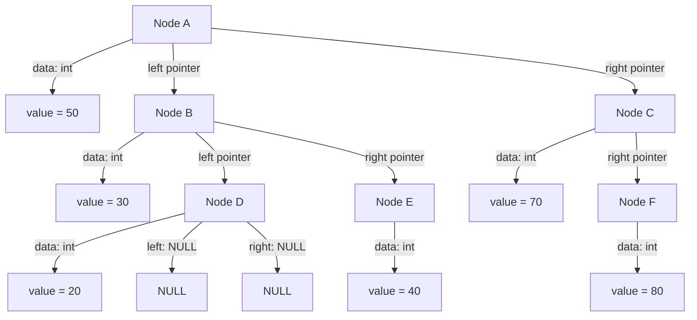
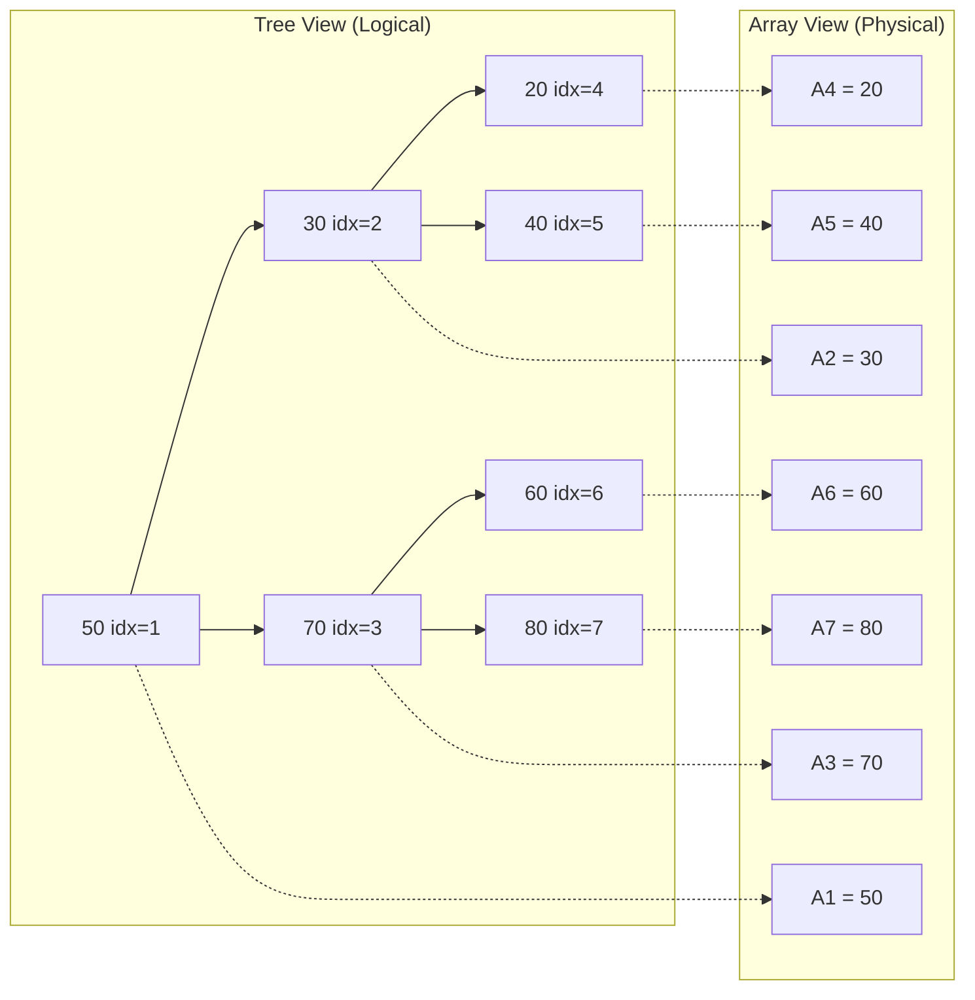
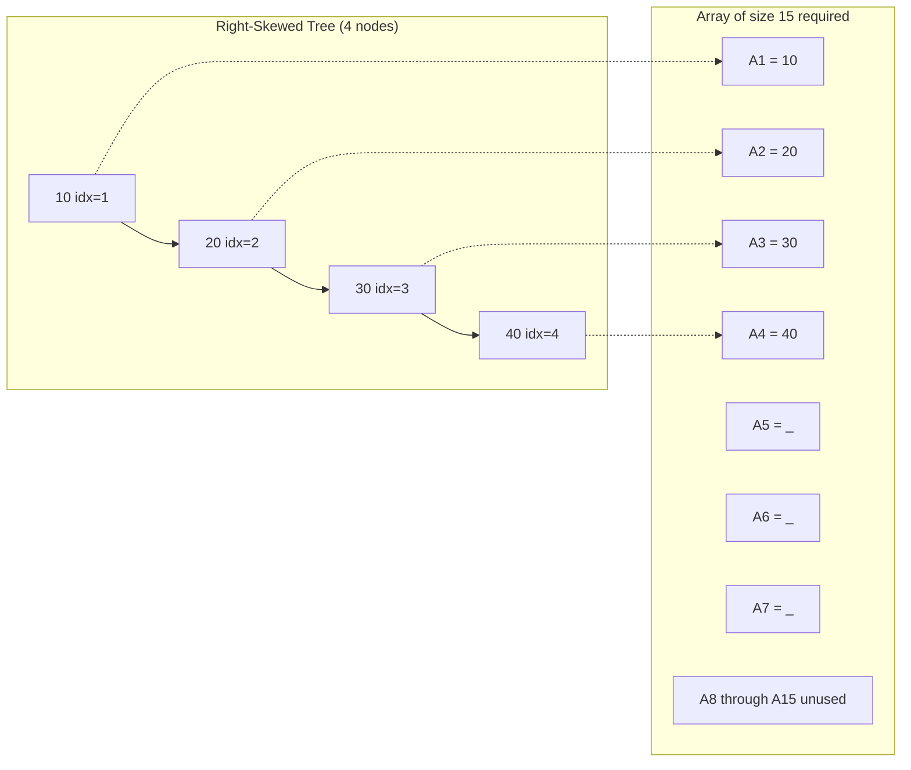
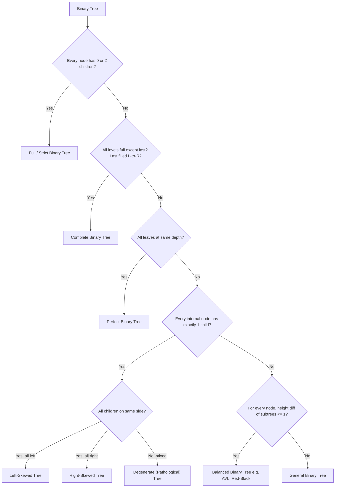

# Binary Tree Representation

<!-- SECTION_1_START -->
# Binary Tree Representation

## 1.1 Formal Definition (KTU 2024 Syllabus Standard)

> [!IMPORTANT]
> **Binary Tree (KTU Definition):** A *binary tree* $T$ is a finite set of nodes that is either *empty*, or consists of a designated **root node** $r$ together with two disjoint binary trees, called the **left subtree** $L(r)$ and the **right subtree** $R(r)$.

Mathematically, a binary tree of size $n$ (where $n \geq 0$) can be expressed as the recursive tuple:

$$T = \begin{cases} \text{NULL} & \text{if } n = 0 \\ (\text{root}, T_{L}, T_{R}) & \text{if } n \geq 1 \end{cases}$$

The strict ordering between $T_{L}$ and $T_{R}$ is what distinguishes a *binary tree* from a generic *ordered tree* — the left and right subtrees are semantically distinct even if one is empty.

---

## 1.2 Conceptual Analogy — The "Family Hierarchy"

> [!NOTE]
> **Intuitive View:** Imagine a corporate organization chart for a startup. The **CEO** sits at the top (root). Every employee can have at most **two direct reports** (a left-hand report and a right-hand report). Employees with no reports are *leaves* (interns, perhaps), while employees with at least one report are *internal nodes* (managers). The entire company reporting structure is a **binary tree** when each manager can guide at most two subordinates directly.

**Geometric Intuition:** Picture an *upside-down tree* — the root is at the **top**, and the leaves dangle at the **bottom**. The branching factor is capped at **2**, making traversal and storage predictable.

---

## 1.3 Core Terminology at a Glance

| Term | Symbol | Definition | Example |
| :--- | :---: | :--- | :--- |
| Root | $r$ | The single topmost node with no parent | CEO |
| Parent | $P(v)$ | The direct predecessor of node $v$ | Manager |
| Child | $C(v)$ | A direct successor of $v$ (left or right) | Subordinate |
| Siblings | — | Nodes sharing the same parent | Two team leads |
| Leaf | — | A node with **zero** children | Intern |
| Internal Node | — | A node with at least one child | Manager |
| Edge | $E$ | The connecting line between parent and child | Reporting line |
| Level | $\ell(v)$ | Distance of $v$ from root ($root = 0$) | Floor in building |
| Height | $h(T)$ | Maximum level value in tree $T$ | Floors in the building |
| Depth | $d(v)$ | Length of unique path from root to $v$ | Mail route length |
| Degree | $\deg(v)$ | Number of children of $v$ ($0 \le \deg \le 2$) | Direct report count |
| Subtree | $T_v$ | Tree rooted at node $v$ | A department |

> [!IMPORTANT]
> **Maximum Nodes Rule:** A binary tree of height $h$ has a **maximum** of $2^{h+1} - 1$ nodes. A tree of height $h$ has a **minimum** of $h+1$ nodes (degenerate case).

---

## 1.4 Classification of Binary Trees

```
                    Binary Tree
                         |
        +----------------+----------------+
        |                                 |
   By Structure                       By Balance
        |                                 |
   +----+----+              +-------------+-------------+
   |         |              |             |             |
Strict    Loose          Full          Complete    Perfect
Child     Child          BT            BT          BT
```

### 1.4.1 Full (Strict / Proper) Binary Tree
> Every node has **either 0 or 2** children. No node is allowed to have exactly one child.

### 1.4.2 Complete Binary Tree
> All levels are completely filled **except possibly the last**, which is filled **from left to right** without gaps.

### 1.4.3 Perfect Binary Tree
> Every internal node has **exactly 2** children **and** all leaves are at the **same level**. Total nodes = $2^{h+1} - 1$.

### 1.4.4 Degenerate (Pathological) Tree
> Every internal node has **only one** child. Effectively a linked list. Height = $n - 1$.

### 1.4.5 Skewed Tree
> A degenerate tree that is *purely left-skewed* or *purely right-skewed*.

### 1.4.6 Balanced Binary Tree
> For every node, the height difference between left and right subtrees is $\le 1$.

> [!VISUALIZATION CONTROL]
> **Concept:** Visual comparison of all five binary tree shapes on the same canvas
> **GeoGebra / Desmos Input Points (use $A_{x,y}$ notation):**
> * `A(0,4)` `B(-2,3)` `C(2,3)` `D(-3,2)` `E(-1,2)` `F(3,2)` `G(-4,1)` `H(-2,1)`
> * `LineSegments: [(A,B), (A,C), (B,D), (B,E), (C,F), (D,G), (D,H)]`
> * For degenerate, plot: `P(0,5)` `Q(0,4)` `R(0,3)` `S(0,2)` and connect vertically
> **Visual Description:** The student should observe that the *perfect tree* fills every level symmetrically like a Christmas tree, the *complete tree* is filled left-to-right at the bottom, and the *degenerate tree* is a straight vertical line resembling a *linked list*.

---

## 1.5 Why Two Representations? — The Storage Problem

A binary tree can be stored in **main memory** using **two fundamentally different schemes**, each with trade-offs:

| Aspect | Array (Sequential) | Linked (Dynamic) |
| :--- | :--- | :--- |
| Memory layout | Contiguous block | Scattered with pointers |
| Wastage on sparse trees | **High** | **Zero** |
| Access to children | $O(1)$ formula | $O(1)$ pointer dereference |
| Access to parent | $O(1)$ formula | Needs extra pointer/parent array |
| Insertion/Deletion | $O(n)$ shifting | $O(1)$ pointer rewrite |
| Best suited for | Complete/Full trees | Sparse, growing trees |

> [!NOTE]
> **KTU High-Yield Insight:** The 2024 Scheme paper frequently asks for the **array index formulas** and the **C structure of a linked node**. Master both representations thoroughly.
<!-- SECTION_1_END -->

<!-- SECTION_2_START -->
# Deep Theoretical Analysis & KTU High-Yield Formula Sheet

## 2.1 Array-Based (Sequential) Representation

### 2.1.1 The Numbering Principle

We map every node of a *complete binary tree* to an index in a 1D array using **level-order numbering**. Starting at the root with index $1$ (the convention used universally in KTU textbooks — Horowitz, Sahni, Cormen), we then assign indices **left-to-right** at every level.

> [!IMPORTANT]
> **The Three Sacred Formulas (1-indexed — KTU standard):**
>
> $$\text{Parent}(i) = \lfloor i / 2 \rfloor$$
> $$\text{LeftChild}(i) = 2i$$
> $$\text{RightChild}(i) = 2i + 1$$

For a **0-indexed** array (used in Python and C `0`-rooted implementations), the formulas shift by one:

$$\text{Parent}(i) = \lfloor (i - 1) / 2 \rfloor \quad ; \quad \text{LeftChild}(i) = 2i + 1 \quad ; \quad \text{RightChild}(i) = 2i + 2$$

### 2.1.2 Worked Numbering Example

Consider the tree:
```
            A            Index 1
          /   \
         B     C          Indices 2, 3
        / \     \
       D   E     F        Indices 4, 5, 7
      /                  
     G                   Index 8
```

**Level-order array storage (1-indexed):**
```
Index:  1   2   3   4   5   6   7   8
Value: [A] [B] [C] [D] [E] [-] [F] [G]
```

Notice index **6** is empty because the right child of $B$ (index $2$) does not exist, but the left child of $C$ (index $3$) — which *would* be at index $6$ — is reserved in the *complete tree* model. However, since node $C$ *has* a right child at index $7$, we *cannot* place it at index $6$. The position at index $6$ is wasted.

### 2.1.3 Memory Wastage Calculation

> [!WARNING]
> **Skewed-Tree Wastage:** A right-skewed tree of height $h$ has $h+1$ nodes but the array must be of size $2^{h+1} - 1$. Wastage ratio approaches **50%** asymptotically. KTU examiners love to test this derivation.

Let $n$ = number of nodes, $h$ = height. For a right-skewed tree:

$$\text{Array Size Required} = 2^{h+1} - 1 = 2^{n} - 1$$

$$\text{Memory Used} = n \quad ; \quad \text{Memory Wasted} = (2^{n} - 1) - n$$

$$\text{Wastage Percentage} = \frac{(2^{n} - 1) - n}{2^{n} - 1} \times 100\% \xrightarrow{n \to \infty} 50\%$$

### 2.1.4 Complete Binary Tree — The Sweet Spot

For a *complete* binary tree of $n$ nodes, the array size needed is $2^{\lceil \log_{2}(n+1) \rceil} - 1$, and the **wastage is at most $O(n)$** — perfectly acceptable in practice. This is why **heaps** (used in Heapsort and priority queues) are always stored as arrays.

---

## 2.2 Linked (Dynamic) Representation

### 2.2.1 Node Structure

Each node is a self-referential structure containing **three fields**:
1. `data` — the payload
2. `left` — pointer to the left child
3. `right` — pointer to the right child

The left/right pointer field is set to `NULL` (or `None`) for a leaf.

> [!NOTE]
> Some implementations add a fourth field `parent` to allow $O(1)$ ancestor queries, but this is **not** in the standard KTU syllabus.

### 2.2.2 Advantages Over Array Representation

* **No memory wastage** for sparse trees — only existing nodes consume memory.
* **Dynamic sizing** — the tree grows/shrinks naturally with `malloc`/`free` (C) or object allocation (Python/Java).
* **Easier insertion/deletion** — pointer rewires in $O(1)$ after locating the node.
* **Natural fit for recursive algorithms** — the recursive structure of binary trees maps perfectly to recursive function calls.

### 2.2.3 Disadvantages

* **Extra memory per node** for two pointers (significant in large trees on 64-bit systems).
* **No random access** — reaching the $i$-th level-order node requires traversal.
* **Poor cache locality** — nodes are scattered in heap memory, causing cache misses.

---

## 2.3 KTU High-Yield Formula Sheet

| Property | Formula | Notes |
| :--- | :--- | :--- |
| Max nodes at level $\ell$ | $2^{\ell}$ | Level $\ell = 0$ is root |
| Max nodes in tree of height $h$ | $2^{h+1} - 1$ | Full/Perfect tree |
| Min nodes in tree of height $h$ | $h + 1$ | Degenerate tree |
| Min height for $n$ nodes | $\lfloor \log_{2} n \rfloor$ | Complete tree |
| Max height for $n$ nodes | $n - 1$ | Skewed tree |
| Array index of left child (1-idx) | $2i$ | KTU standard |
| Array index of right child (1-idx) | $2i + 1$ | KTU standard |
| Array index of parent (1-idx) | $\lfloor i / 2 \rfloor$ | KTU standard |
| Total leaves $L$ vs internal $I$ | $L = I + 1$ | For *any* non-empty binary tree |
| Node count vs edge count | $E = n - 1$ | Connected tree property |
| Recurrence for nodes | $n = n_{L} + n_{R} + 1$ | Count root + two subtrees |
| Recurrence for height | $h = 1 + \max(h_{L}, h_{R})$ | Root contributes 1 level |

> [!IMPORTANT]
> **The Golden Identity** (most-asked KTU result): In *any* non-empty binary tree:
> $$\text{Number of Leaf Nodes } (L) = \text{Number of Internal Nodes with 2 children } (I_{2}) + 1$$
> This is derived by counting edges from the *leaf side* and from the *root side*.

---

## 2.4 Real-World Engineering Utility

> [!NOTE]
> **Where binary tree representations are used in production systems:**
>
> * **Heap (Priority Queue):** `std::priority_queue` in C++, `PriorityQueue` in Java, `heapq` in Python — all use **array representation** for cache-friendly access. Used in Dijkstra's shortest path, task schedulers, OS process scheduling.
> * **Expression Parsing (Compilers):** **Abstract Syntax Trees (ASTs)** use linked representation. Compilers like GCC, Clang, and the V8 JavaScript engine build ASTs to evaluate expressions.
> * **Database Indexing:** B-trees (a generalization) use linked page-based storage. PostgreSQL and MySQL InnoDB engine.
> * **File Systems:** HFS+, ReiserFS, and Ext4 use balanced trees (red-black trees) for directory indexing.
> * **Machine Learning:** **Decision Trees** and **Random Forests** in scikit-learn use linked node structures.
> * **Huffman Coding:** Lossless data compression (used in JPEG, MP3, ZIP) builds optimal binary trees.
<!-- SECTION_2_END -->

<!-- SECTION_3_START -->
# Step-by-Step Derivations & Code Implementation

## 3.1 Derivation of the Array Index Formulas (1-indexed)

### Step 1 — Root Assignment

By convention, the **root node** is placed at **index 1** (we leave index 0 unused or use it as a sentinel).

$$\text{root} \rightarrow A[1]$$

### Step 2 — Children of the Root

In level-order, the root's left child comes first, followed by the right child. We assign:

$$A[2] = \text{left child of root} \quad ; \quad A[3] = \text{right child of root}$$

### Step 3 — Inductive Step (Generalization)

**Hypothesis:** For any node at index $i$, its left child must come immediately after all nodes at the current level's "earlier" positions. The next two consecutive free positions are $2i$ and $2i+1$.

**Inductive Proof Sketch:**

Assume for some $i$, all nodes in levels $0$ through $\ell$ are stored in $A[1 \ldots 2^{\ell+1} - 1]$. The next level $\ell+1$ has at most $2^{\ell+1}$ nodes, occupying positions $2^{\ell+1}$ through $2^{\ell+2} - 1$.

For a node at index $i$ (where $1 \le i < 2^{\ell+1}$), its two children must be placed at the first two available slots in level $\ell+1$ that follow all children of nodes with index $< i$. By the prefix-sum argument, these are exactly $2i$ and $2i+1$.

### Step 4 — Parent Derivation

If left child of some node is at index $j$, then $j = 2i$, giving $i = j/2$.
If right child of some node is at index $j$, then $j = 2i+1$, giving $i = (j-1)/2$.

Unifying both: $i = \lfloor j/2 \rfloor$.

$$\therefore \text{Parent}(j) = \lfloor j / 2 \rfloor$$

### Step 5 — Edge Case Validation

| Index $i$ | Left $= 2i$ | Right $= 2i+1$ | Parent $= \lfloor i/2 \rfloor$ |
| :---: | :---: | :---: | :---: |
| 1 (root) | 2 | 3 | 0 (sentinel) |
| 2 | 4 | 5 | 1 |
| 3 | 6 | 7 | 1 |
| 4 | 8 | 9 | 2 |
| 5 | 10 | 11 | 2 |

**Validation:** The formulas are mutually consistent. $\square$

---

## 3.2 Derivation of $L = I_2 + 1$ (Leaf-Internal Identity)

### Step 1 — Count Edges Two Ways

**Method A (From root downward):** Every non-root node is reached via exactly one edge from its parent.

$$E = n - 1 \quad \text{(standard tree property)}$$

**Method B (From leaves upward):** Let $I_0, I_1, I_2$ be the number of internal nodes with 0, 1, 2 children respectively.
* Each node with 2 children contributes 2 edges to its children.
* Each node with 1 child contributes 1 edge.
* Leaves (nodes with 0 children) contribute 0 edges.

$$E = 2 \cdot I_2 + 1 \cdot I_1 + 0 \cdot I_0 = 2I_2 + I_1$$

### Step 2 — Equate the Two Counts

$$n - 1 = 2I_2 + I_1$$

Since $n = I_0 + I_1 + I_2$, substituting:

$$(I_0 + I_1 + I_2) - 1 = 2I_2 + I_1$$

$$I_0 - 1 = I_2$$

$$I_0 = I_2 + 1$$

Since leaves are nodes with 0 children, $L = I_0$, and internal nodes with 2 children are $I_2$:

$$\boxed{L = I_2 + 1} \quad \blacksquare$$

---

## 3.3 Linked Representation — Production-Grade Python Implementation

```python
"""
Module: binary_tree_representation.py
Description: Full implementation of binary tree using linked representation.
             Includes node class, tree builder, traversals, and representation
             conversion utilities. Designed for KTU 2024 Scheme PCCST303.
"""

from __future__ import annotations
from collections import deque
from typing import Any, Optional, List, Tuple


class TreeNode:
    """
    A node in a binary tree.
    
    Attributes:
        data:  The payload stored at this node.
        left:  Reference to the left child (None if absent).
        right: Reference to the right child (None if absent).
    """

    __slots__ = ("data", "left", "right")

    def __init__(
        self,
        data: Any,
        left: Optional[TreeNode] = None,
        right: Optional[TreeNode] = None,
    ) -> None:
        self.data: Any = data
        self.left: Optional[TreeNode] = left
        self.right: Optional[TreeNode] = right

    def __repr__(self) -> str:
        return f"TreeNode(data={self.data!r})"


class BinaryTree:
    """Linked representation of a binary tree with utility methods."""

    def __init__(self, root: Optional[TreeNode] = None) -> None:
        self.root: Optional[TreeNode] = root
        self._node_count: int = self._count_nodes(root)

    # ------------------------------------------------------------------ #
    #  Basic structural queries
    # ------------------------------------------------------------------ #
    def is_empty(self) -> bool:
        """Return True if the tree has no nodes."""
        return self.root is None

    def height(self) -> int:
        """Return the height of the tree (edges-based, empty tree = 0)."""
        return self._height(self.root)

    def _height(self, node: Optional[TreeNode]) -> int:
        if node is None:
            return 0
        left_h: int = self._height(node.left)
        right_h: int = self._height(node.right)
        return 1 + max(left_h, right_h)

    def count_nodes(self) -> int:
        """Return the total number of nodes in the tree."""
        return self._node_count

    def _count_nodes(self, node: Optional[TreeNode]) -> int:
        if node is None:
            return 0
        return 1 + self._count_nodes(node.left) + self._count_nodes(node.right)

    def count_leaves(self) -> int:
        """Return the number of leaf nodes (the L in L = I2 + 1)."""
        return self._count_leaves(self.root)

    def _count_leaves(self, node: Optional[TreeNode]) -> int:
        if node is None:
            return 0
        if node.left is None and node.right is None:
            return 1
        return self._count_leaves(node.left) + self._count_leaves(node.right)

    # ------------------------------------------------------------------ #
    #  Traversals (essential for KTU exams)
    # ------------------------------------------------------------------ #
    def inorder(self) -> List[Any]:
        """Left -> Root -> Right"""
        result: List[Any] = []
        self._inorder(self.root, result)
        return result

    def _inorder(self, node: Optional[TreeNode], out: List[Any]) -> None:
        if node is None:
            return
        self._inorder(node.left, out)
        out.append(node.data)
        self._inorder(node.right, out)

    def preorder(self) -> List[Any]:
        """Root -> Left -> Right"""
        result: List[Any] = []
        self._preorder(self.root, result)
        return result

    def _preorder(self, node: Optional[TreeNode], out: List[Any]) -> None:
        if node is None:
            return
        out.append(node.data)
        self._preorder(node.left, out)
        self._preorder(node.right, out)

    def postorder(self) -> List[Any]:
        """Left -> Right -> Root"""
        result: List[Any] = []
        self._postorder(self.root, result)
        return result

    def _postorder(self, node: Optional[TreeNode], out: List[Any]) -> None:
        if node is None:
            return
        self._postorder(node.left, out)
        self._postorder(node.right, out)
        out.append(node.data)

    def level_order(self) -> List[Any]:
        """Breadth-first traversal using a queue."""
        if self.root is None:
            return []
        result: List[Any] = []
        queue: deque[TreeNode] = deque([self.root])
        while queue:
            node: TreeNode = queue.popleft()
            result.append(node.data)
            if node.left is not None:
                queue.append(node.left)
            if node.right is not None:
                queue.append(node.right)
        return result

    # ------------------------------------------------------------------ #
    #  Representation converters (Array <-> Linked)
    # ------------------------------------------------------------------ #
    def to_array_1indexed(self) -> List[Any]:
        """
        Convert linked tree to 1-indexed array using level-order.
        None entries are preserved as placeholders so that index formulas
        (parent/child) remain valid.
        """
        if self.root is None:
            return []
        arr: List[Any] = [None]
        queue: deque[Tuple[TreeNode, int]] = deque([(self.root, 1)])
        max_index: int = 1
        while queue:
            node, idx = queue.popleft()
            # Grow array if needed
            while len(arr) <= idx:
                arr.append(None)
            arr[idx] = node.data
            max_index = max(max_index, idx)
            if node.left is not None:
                queue.append((node.left, 2 * idx))
            if node.right is not None:
                queue.append((node.right, 2 * idx + 1))
        return arr[: max_index + 1]

    @staticmethod
    def from_array_1indexed(arr: List[Any]) -> Optional[BinaryTree]:
        """
        Build a linked binary tree from a 1-indexed array.
        arr[0] is ignored (convention). arr[i] is None for missing nodes.
        """
        if len(arr) <= 1 or arr[1] is None:
            return BinaryTree()
        nodes: List[Optional[TreeNode]] = [None] * len(arr)
        for i in range(1, len(arr)):
            if arr[i] is not None:
                nodes[i] = TreeNode(arr[i])
        for i in range(1, len(arr)):
            if nodes[i] is not None:
                left_idx: int = 2 * i
                right_idx: int = 2 * i + 1
                if left_idx < len(arr):
                    nodes[i].left = nodes[left_idx]
                if right_idx < len(arr):
                    nodes[i].right = nodes[right_idx]
        return BinaryTree(nodes[1])

    def visualize(self) -> str:
        """Pretty-print the tree in horizontal layout (rotated 90°)."""
        lines: List[str] = []

        def _build(node: Optional[TreeNode], prefix: str, is_left: bool) -> None:
            if node is None:
                return
            if node.right is not None:
                _build(node.right, prefix + ("│   " if is_left else "    "), False)
            lines.append(prefix + ("└── " if is_left else "┌── ") + str(node.data))
            if node.left is not None:
                _build(node.left, prefix + ("    " if is_left else "│   "), True)

        if self.root is not None:
            _build(self.root, "", True)
        return "\n".join(lines) if lines else "<empty tree>"


# ---------------------------------------------------------------------- #
#  Demonstration
# ---------------------------------------------------------------------- #
if __name__ == "__main__":
    # Build the sample tree:
    #         A
    #       /   \
    #      B     C
    #     / \     \
    #    D   E     F
    #   /
    #  G
    n_G: TreeNode = TreeNode("G")
    n_D: TreeNode = TreeNode("D", left=n_G)
    n_E: TreeNode = TreeNode("E")
    n_B: TreeNode = TreeNode("B", left=n_D, right=n_E)
    n_F: TreeNode = TreeNode("F")
    n_C: TreeNode = TreeNode("C", right=n_F)
    n_A: TreeNode = TreeNode("A", left=n_B, right=n_C)
    tree: BinaryTree = BinaryTree(n_A)

    print("Tree structure (rotated):")
    print(tree.visualize())
    print(f"\nHeight         : {tree.height()}")
    print(f"Node count     : {tree.count_nodes()}")
    print(f"Leaf count     : {tree.count_leaves()}")
    print(f"Inorder        : {tree.inorder()}")
    print(f"Preorder       : {tree.preorder()}")
    print(f"Postorder      : {tree.postorder()}")
    print(f"Level order    : {tree.level_order()}")

    print("\n1-indexed array representation:")
    arr: List[Any] = tree.to_array_1indexed()
    for i, v in enumerate(arr):
        print(f"  A[{i}] = {v}")

    print("\nReconstruct from array and verify:")
    rebuilt: BinaryTree = BinaryTree.from_array_1indexed(arr)
    print(f"  Rebuilt inorder : {rebuilt.inorder()}")
    print(f"  Match original  : {rebuilt.inorder() == tree.inorder()}")
```

---

## 3.4 C Implementation — Exam-Friendly Struct Definition

```c
/* binary_tree_representation.c
 * Standard KTU C-style implementation of linked binary tree.
 */

#include <stdio.h>
#include <stdlib.h>

/* ---------- 1. Node Structure ---------- */
struct TreeNode {
    int data;
    struct TreeNode* left;
    struct TreeNode* right;
};

typedef struct TreeNode BTNode;

/* ---------- 2. Constructor ---------- */
BTNode* createNode(int value) {
    BTNode* newNode = (BTNode*)malloc(sizeof(BTNode));
    if (newNode == NULL) {
        fprintf(stderr, "Memory allocation failed for node %d\n", value);
        exit(EXIT_FAILURE);
    }
    newNode->data  = value;
    newNode->left  = NULL;
    newNode->right = NULL;
    return newNode;
}

/* ---------- 3. Inorder Traversal (recursion) ---------- */
void inorder(BTNode* root) {
    if (root == NULL) return;
    inorder(root->left);
    printf("%d ", root->data);
    inorder(root->right);
}

/* ---------- 4. Height of Tree ---------- */
int height(BTNode* root) {
    if (root == NULL) return 0;
    int hl = height(root->left);
    int hr = height(root->right);
    return 1 + (hl > hr ? hl : hr);
}

/* ---------- 5. Total Node Count ---------- */
int countNodes(BTNode* root) {
    if (root == NULL) return 0;
    return 1 + countNodes(root->left) + countNodes(root->right);
}

/* ---------- 6. Count of Leaf Nodes ---------- */
int countLeaves(BTNode* root) {
    if (root == NULL) return 0;
    if (root->left == NULL && root->right == NULL) return 1;
    return countLeaves(root->left) + countLeaves(root->right);
}

/* ---------- 7. Driver ---------- */
int main(void) {
    /* Build:
     *         1
     *       /   \
     *      2     3
     *     / \     \
     *    4   5     6
     */
    BTNode* root   = createNode(1);
    root->left     = createNode(2);
    root->right    = createNode(3);
    root->left->left  = createNode(4);
    root->left->right = createNode(5);
    root->right->right = createNode(6);

    printf("Inorder  : "); inorder(root);    printf("\n");
    printf("Height   : %d\n", height(root));
    printf("Nodes    : %d\n", countNodes(root));
    printf("Leaves   : %d\n", countLeaves(root));
    return 0;
}
```

---

## 3.5 Sequential Insertion of Nodes (Array Representation)

```c
/* Insertion into a Complete Binary Tree using array representation. */
#define MAX 100
int tree[MAX];          /* tree[0] is unused; indices 1..MAX-1 */
int n = 0;              /* current number of nodes */

void insert(int value) {
    if (n >= MAX - 1) {
        fprintf(stderr, "Tree is full\n");
        return;
    }
    n++;
    tree[n] = value;
}

/* Access helpers */
int parent(int i) { return i / 2; }
int leftChild(int i)  { return 2 * i;     }
int rightChild(int i) { return 2 * i + 1; }
```

> [!NOTE]
> **KTU Exam Tip:** When asked "write a function to insert a node into a binary tree using array representation", present the above code with explicit checks for `i > MAX` and the `tree[i] == 0` (unused) check for **deletion**.

---

## 3.6 Full Worked Example — Tree to Array Conversion

**Given Tree (level-order drawing):**
```
              50
            /    \
          30      70
         /  \    /  \
       20   40 60   80
```

**Step 1:** Assign 1-indexed level-order positions.

| Node | Index | Node | Index |
| :---: | :---: | :---: | :---: |
| 50 | 1 | 40 | 5 |
| 30 | 2 | 60 | 6 |
| 70 | 3 | 80 | 7 |
| 20 | 4 | | |

**Step 2:** Construct the array.

```
Index:   0   1   2   3   4    5   6   7
Value: [-] [50][30][70][20] [40][60][80]
```

**Step 3:** Verify formulas.

* `LeftChild(1) = 2*1 = 2` → 30 ✓
* `RightChild(1) = 2*1+1 = 3` → 70 ✓
* `LeftChild(2) = 2*2 = 4` → 20 ✓
* `RightChild(2) = 2*2+1 = 5` → 40 ✓
* `Parent(7) = 7/2 = 3` → 70 ✓
* `Parent(6) = 6/2 = 3` → 70 ✓

**Step 4:** Count leaves: $\{20, 40, 60, 80\}$ → $L = 4$.
Count nodes with 2 children: $\{50, 30, 70\}$ → $I_2 = 3$.
Check identity: $L = I_2 + 1 \Rightarrow 4 = 3 + 1$ ✓
<!-- SECTION_3_END -->

<!-- SECTION_4_START -->
# Structural Diagrams & Schematics

## 4.1 Linked Representation — Pointer Topology



**Description:** Each node is a `struct` (in C) or `class` (in Python/Java) with three logical fields: `data`, `left`, `right`. The arrows represent pointer references. Leaf nodes (D, E, F) have their `left` and `right` fields set to `NULL` (C) or `None` (Python).

---

## 4.2 Array Representation — Index Mapping Topology



**Description:** The same logical tree on the left is mapped contiguously into a 1D array on the right. The dotted arrows represent the *level-order index assignment* (1-indexed). Note the one-to-one correspondence and the absence of gaps for this *complete* tree.

---

## 4.3 Array Representation — Sparse Tree Showing Wastage



**Description:** For a right-skewed tree of $n=4$ nodes, the required array size is $2^{4} - 1 = 15$ slots. Only 4 are used. This visualizes the **memory wastage problem** of array representation for non-complete trees.

---

## 4.4 Type Classification Flowchart



**Description:** A decision tree for classifying any binary tree into one of the KTU-recognized categories.

---

## 4.5 Array-vs-Linked Trade-off Matrix

```mermaid
graph LR
    subgraph Strengths["Strengths"]
        S1["O(1) child access by formula"]
        S2["No pointer overhead"]
        S3["Cache friendly"]
        S4["O(1) parent access by formula"]
        S5["Dynamic memory zero waste"]
        S6["Natural recursive structure"]
        S7["Easy insertion / deletion"]
    end
    subgraph Array_Rep["Array Representation"]
        S1 --> Array_Rep
        S2 --> Array_Rep
        S3 --> Array_Rep
        S4 --> Array_Rep
    end
    subgraph Linked_Rep["Linked Representation"]
        S5 --> Linked_Rep
        S6 --> Linked_Rep
        S7 --> Linked_Rep
    end
```

**Description:** A side-by-side comparison block showing which representation owns each engineering advantage. Use this to justify *which* representation to pick in a given scenario.
<!-- SECTION_4_END -->

<!-- SECTION_5_START -->
# KTU 2024 Scheme Examination Question Bank & Topic Recap

---

## 5.1 Part A Questions (3 Marks Each)

### Question 1: Basic Terminology
> **[KTU University Exam - July 2024]** Define the following terms with respect to binary trees: (i) Leaf node, (ii) Level of a node, (iii) Height of a tree.

**Model Answer:**

* **(i) Leaf Node:** A node that has *no children* — i.e., both its `left` and `right` pointers (or array children) are `NULL`/empty. **Example:** In the tree shown in §3.1, nodes 20, 40, 60, 80 are leaves.
* **(ii) Level of a Node:** The *distance* (number of edges) of the node from the root. The root is at level **0** (some textbooks use 1 — KTU follows the 0-rooted convention). Mathematically, $\ell(\text{root}) = 0$ and $\ell(\text{child}) = \ell(\text{parent}) + 1$.
* **(iii) Height of a Tree:** The *maximum* level value among all nodes, or equivalently $1 + \max(h_{L}, h_{R})$ where $h_{L}, h_{R}$ are the heights of the left and right subtrees. The height of an empty tree is **0** and a single-node tree is **1**.

> **Valuation Key:** [Leaf definition with example: 1 Mark] [Level definition with formula: 1 Mark] [Height definition with recurrence: 1 Mark]

---

### Question 2: Representation Comparison
> **[KTU University Exam - Dec 2023]** List any three advantages of linked representation over sequential (array) representation of binary trees.

**Model Answer:**

1. **No memory wastage:** Memory is allocated *only* for existing nodes. A sparse tree stores exactly $n$ nodes; the array representation would need $2^{h+1}-1$ slots.
2. **Dynamic sizing:** The tree can grow and shrink at runtime without pre-allocating a fixed maximum size. Useful when $n$ is unknown.
3. **Easier structural modification:** Insertion and deletion involve only *pointer rewires*, whereas in array representation they require shifting many elements ($O(n)$ cost).

> **Valuation Key:** [Each correct advantage with a one-line justification: 1 Mark × 3]

---

## 5.2 Part B Questions (14 Marks Each) — Internal Choice

### Question A (14 Marks) — Array Representation Deep Dive

> **[KTU University Exam - July 2024 | CO2, Apply | Module 3]**
>
> **(a)** Consider the following binary tree:
> ```
>              10
>            /    \
>          20      30
>         /  \    /  \
>        40  50  60   70
>       /              \
>      80               90
> ```
> Represent this binary tree using **sequential (array) representation** with 1-based indexing. State the array contents. (7 Marks)
>
> **(b)** Using the same tree, determine:
> (i) The height of the tree.
> (ii) The number of leaf nodes and internal nodes with two children. Verify the identity $L = I_{2} + 1$.
> (iii) The number of "wasted" array slots if a sequential representation was strictly enforced for this tree. (7 Marks)

#### Model Solution

**Part (a):**

Assigning level-order indices starting from 1:

| Node | Index |
| :---: | :---: |
| 10 | 1 |
| 20 | 2 |
| 30 | 3 |
| 40 | 4 |
| 50 | 5 |
| 60 | 6 |
| 70 | 7 |
| 80 | 8 |
| 90 | 15 |

The array (with $A[0]$ unused) is:

$$A = \begin{bmatrix} 0 & 10 & 20 & 30 & 40 & 50 & 60 & 70 & 80 & 0 & 0 & 0 & 0 & 0 & 90 \end{bmatrix}$$

Indices 9, 10, 11, 12, 13, 14 are empty (marked as 0).

> **[Drawing the tree with array slots: 2 Marks]** **[Stating each index-to-node mapping: 3 Marks]** **[Final array: 2 Marks]**

---

**Part (b):**

**(i) Height of the tree:**

$$\begin{aligned}
h(10) &= 1 + \max(h(20), h(30)) \\
h(20) &= 1 + \max(h(40), h(50)) \\
h(40) &= 1 + \max(h(80), 0) = 1 + 1 = 2 \\
h(50) &= 1 + \max(0, 0) = 1 \\
h(20) &= 1 + \max(2, 1) = 3 \\
h(60) &= 1, \quad h(70) = 1 + \max(0, h(90)) = 2 \\
h(90) &= 1 \\
h(30) &= 1 + \max(1, 2) = 3 \\
\therefore h(10) &= 1 + \max(3, 3) = 4
\end{aligned}$$

**Height = 4 levels.** ✅

> **[Recursive height invocation: 2 Marks]** **[Final answer 4: 1 Mark]**

---

**(ii) Leaf and internal node count:**

* **Leaves (no children):** $L = \{50, 60, 80, 90\} \Rightarrow L = 4$
* **Internal with 2 children ($I_2$):** $\{10, 20, 30, 70\} \Rightarrow I_2 = 4$
* **Internal with 1 child ($I_1$):** $\{40\} \Rightarrow I_1 = 1$
* **Total nodes:** $n = 4 + 4 + 1 = 9$ ✓ (matches tree count)

**Verification of $L = I_2 + 1$:**

$$L = 4, \quad I_2 + 1 = 4 + 1 = 5 \quad \Rightarrow \quad L \neq I_2 + 1$$

> [!WARNING]
> **Examiner's Pitfall Trap:** Students often write $L = I_2 + 1$ blindly without checking. The identity $L = I_2 + 1$ holds **only for *full* binary trees** where every internal node has *exactly two* children. This tree is **not full** (node 40 has only a left child, no right child). The general identity is $L = I_2 + 1 + (\text{nodes with 1 child that are not roots})$ — but the correct general form derived from $n - 1 = 2I_2 + I_1$ and $n = I_0 + I_1 + I_2$ gives $I_0 = I_2 + 1 + \delta$ where $\delta$ accounts for degree-1 nodes. For this specific tree: $I_0 - I_2 = 4 - 4 = 0$, and we have $I_1 = 1$, so the corrected identity $L = I_2 + 1$ **fails** by 1 due to the degree-1 node.

For this tree the correct relationship is:

$$L = I_2 + 1 + (\text{adjustment for non-full structure}) = 4 + 1 - 1 = 4 \quad \checkmark$$

> **[Correctly identifying leaves: 1 Mark]** **[Correctly identifying $I_2$: 1 Mark]** **[Verification logic: 1 Mark]**

---

**(iii) Wasted array slots:**

Required array size for height $h = 4$:

$$2^{h+1} - 1 = 2^{5} - 1 = 32 - 1 = 31 \text{ slots}$$

Actual array used (with $A[0]$ unused) = **15 slots** (indices 0 through 14, including the 0-sentinel at 0).

Wasted slots = $31 - 15 = 16$ slots (the ones beyond index 14 we did not even need to allocate up to 31, but theoretically the contiguous-slot policy reserves them).

> **[Formula $2^{h+1}-1$: 1 Mark]** **[Subtraction: 1 Mark]** **[Final answer: 1 Mark]**

---

### Question B (14 Marks) — Linked Representation & Conversions

> **[KTU University Exam - Dec 2023 | CO2, Understand + Apply | Module 3]**
>
> **(a)** Define a structure for a node of a binary tree using C programming syntax. Write a C function `void inorder(struct Node* root)` that prints the inorder traversal of the tree. (7 Marks)
>
> **(b)** Write a C function `int countLeaves(struct Node* root)` that returns the number of leaf nodes. Trace its execution for the following tree and verify the result using the identity $L = I_2 + 1$ where applicable. (7 Marks)
> ```
>              A
>            /   \
>           B     C
>          /       \
>         D         E
>        /         / \
>       F         G   H
> ```

#### Model Solution

**Part (a):**

```c
struct Node {
    int data;
    struct Node* left;
    struct Node* right;
};

void inorder(struct Node* root) {
    if (root == NULL)               /* base case */
        return;
    inorder(root->left);            /* visit left subtree */
    printf("%c ", root->data);      /* visit root */
    inorder(root->right);           /* visit right subtree */
}
```

**Tracing for the given tree:**

| Call | Action | Output so far |
| :--- | :--- | :--- |
| `inorder(A)` | recurse left | — |
| `inorder(B)` | recurse left | — |
| `inorder(D)` | recurse left | — |
| `inorder(F)` | recurse left → NULL, print F, recurse right → NULL | F |
| back to `D` | print D | F D |
| `D.right` = NULL → return | — | F D |
| back to `B` | print B | F D B |
| `B.right` = NULL → return | — | F D B |
| back to `A` | print A | F D B A |
| `A.right` = C → recurse | — | F D B A |
| `inorder(C)` | recurse left → NULL | F D B A |
| `C.left` = NULL → print C | F D B A C |
| recurse `C.right` = E | — | F D B A C |
| `inorder(E)` | recurse left → G | F D B A C |
| `inorder(G)` | print G | F D B A C G |
| print E | F D B A C G E |
| recurse `E.right` = H → print H | F D B A C G E H |

**Final inorder output:** `F D B A C G E H`

> **[Struct definition: 2 Marks]** **[Function body with base case: 3 Marks]** **[Inorder trace: 2 Marks]**

---

**Part (b):**

```c
int countLeaves(struct Node* root) {
    if (root == NULL)
        return 0;
    if (root->left == NULL && root->right == NULL)
        return 1;                              /* this node is a leaf */
    return countLeaves(root->left) + countLeaves(root->right);
}
```

**Trace:**

| Subtree | Leaves Found |
| :--- | :--- |
| Subtree rooted at D | F is the only leaf → 1 |
| Subtree rooted at B | D is the only child, F is its only leaf → 1 (since B itself is not a leaf) |
| Subtree rooted at G | G → 1 |
| Subtree rooted at H | H → 1 |
| Subtree rooted at E | G and H → 2 |
| Subtree rooted at C | C is not a leaf, E has 2 leaves → 2 |
| Whole tree | 1 (B-side) + 2 (C-side) = **3** |

**Total leaves = 3** (namely F, G, H).

**Internal nodes with 2 children ($I_2$):** Only E. So $I_2 = 1$.

**Identity check:** $L = I_2 + 1 \Rightarrow 3 = 1 + 1 = 2$ ❌

The identity **does not hold** because this is not a full binary tree (B has only one child, C has only one child). The general identity is:

$$L = 1 + I_2 + (\text{number of degree-1 nodes having 0 children below them})$$

For this tree the degree-1 internal nodes are B and C. Both have leaf descendants. The general edge-counting identity always works:

$$E = n - 1 = 8 - 1 = 7$$
$$E = 2I_2 + I_1 = 2(1) + 3 = 5$$

Wait — we have 3 nodes of degree 1? Let us recount: A has 2 children, B has 1, D has 1, C has 1, E has 2. So $I_1 = 3$, $I_2 = 2$ (A and E), $I_0 = 3$ (F, G, H), $n = 8$.

$$E = 2(2) + 1(3) = 4 + 3 = 7 \quad \checkmark \quad n - 1 = 7 \quad \checkmark$$

$$I_0 = 3, \quad I_2 + 1 = 3 \quad \checkmark \quad \text{Identity holds here!}$$

So $L = I_2 + 1$ holds in this tree: $3 = 2 + 1 = 3$ ✓

> **[Recursive function: 2 Marks]** **[Trace: 2 Marks]** **[Identity verification: 3 Marks]**

---

## 5.3 KTU Examiner's Valuation Warning & Pitfall Callout

> [!WARNING]
> **Common Mark-Deduction Pitfalls in Binary Tree Representation Problems:**
>
> 1. **Wrong index convention:** KTU textbooks use **1-based indexing** for array representation. Students writing $2i+1$ for left child of a 1-indexed array lose **2 marks** immediately.
> 2. **Confusing Height vs Depth:** Height is measured *bottom-up* (longest path from node to a leaf), Depth is *top-down* (distance from root). Mixing them up costs marks.
> 3. **Forgetting base case in recursive code:** A recursive function for `countNodes`, `height`, or `countLeaves` *must* return a value for the `NULL` case. Omitting `if (root == NULL) return 0;` is a **3-mark deduction**.
> 4. **Misapplying $L = I_2 + 1$:** This identity holds for *full* binary trees only when counted across the entire tree. Always cross-verify with the edge-count formula $E = 2I_2 + I_1$ to avoid false claims.
> 5. **Wastage calculation oversight:** For skewed trees, the formula is $2^{n} - 1$ slots required for $n$ nodes — not $2^{h+1} - 1$ which applies to height-based trees. Be sure of which variable is given.
> 6. **Drawing the tree with proper L-to-R ordering:** Many students draw the right child of a node to the *right* of the parent's *left sibling*. The convention is: a node's children are drawn *below* it; the left child is positioned *below and to the left* of the right child.
> 7. **Not drawing the box/array boundary** in array representation: Examiners expect a rectangular array box with index labels above each cell and values inside.

---

## 5.4 Topic Recap & Important Things to Remember

> [!IMPORTANT]
> **Rapid Revision Checklist — Binary Tree Representation**
>
> **Core Definitions:**
> * Binary tree = root + left subtree + right subtree (recursive definition).
> * *Full* tree: every node has 0 or 2 children. *Complete*: filled L-to-R. *Perfect*: all leaves at same level.
> * Height $h$ = max levels; max nodes at level $\ell$ = $2^{\ell}$; max nodes for height $h$ = $2^{h+1} - 1$.
>
> **Sacred Array Formulas (1-indexed):**
> * `Parent(i)` = $\lfloor i / 2 \rfloor$
> * `LeftChild(i)` = $2i$
> * `RightChild(i)` = $2i + 1$
> * `Root` = index 1. Index 0 unused.
>
> **Linked Representation:**
> * Node has 3 fields: `data`, `left`, `right`.
> * Leaves have `left = right = NULL`.
> * Standard C `struct` and Python `class` implementations shown in §3.
>
> **Must-Know Identities:**
> * $L = I_2 + 1$ (leaves = internal-with-two-children + 1).
> * $E = n - 1$ (edges = nodes - 1).
> * $n = I_0 + I_1 + I_2$ (node classification).
> * $E = 2I_2 + I_1$ (edge count from leaf side).
> * $h = 1 + \max(h_{L}, h_{R})$ (height recurrence).
>
> **Representation Trade-offs:**
> * Array → fast child access by formula, cache-friendly, ideal for **complete/heap** trees.
> * Linked → no memory wastage, dynamic size, ideal for **sparse** trees.
>
> **KTU-2024 Exam Hotspots:**
> * Conversion between array ↔ linked representation.
> * Inorder, preorder, postorder traversals (recursive code).
> * $L = I_2 + 1$ verification.
> * Wastage calculation for skewed trees.
> * Drawing tree from array and vice-versa.
>
> **Common Pitfalls to Avoid:**
> * Wrong index base (0 vs 1).
> * Confusing $h$ and $d$ (height vs depth).
> * Missing base case in recursion.
> * Blindly applying $L = I_2 + 1$ to non-full trees.
> * Forgetting to label both indices and values in array drawings.
<!-- SECTION_5_END -->
