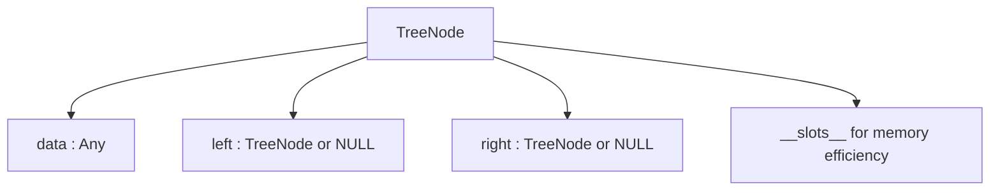
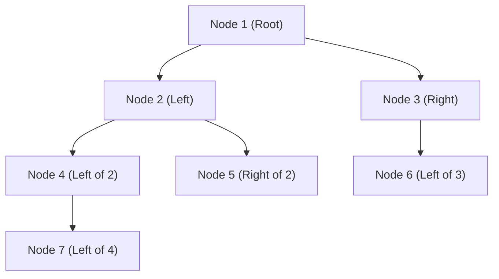
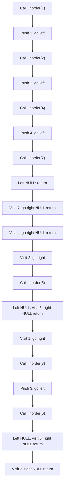
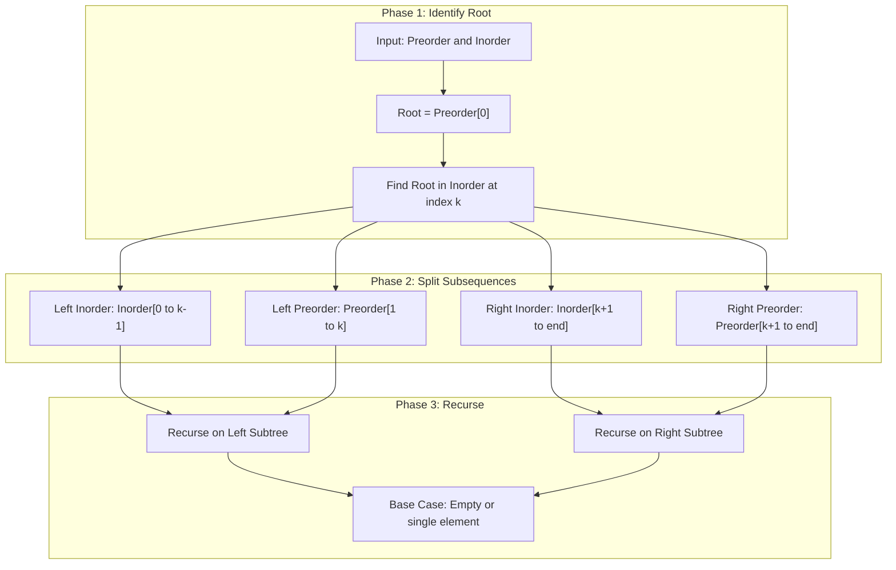
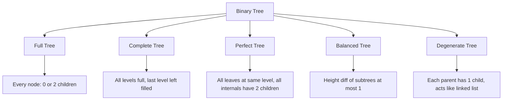
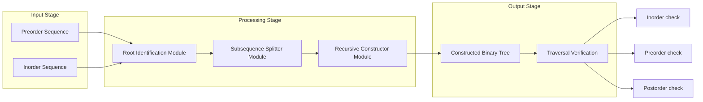

# Binary Trees: Types and Properties, Binary Tree Representation, Tree Operations, Tree Traversals (Inorder, Preorder, Postorder)

<!-- SECTION_1_START -->
# Binary Trees: Types, Properties, Representation, Operations & Traversals

## 1.1 Formal Academic Definition

A **Binary Tree** $T$ is a finite set of nodes that is either empty or consists of a root node $r$ and two disjoint binary trees called the **left subtree** $T_L$ and the **right subtree** $T_R$. Each node can have at most two children, conventionally termed the **left child** and the **right child**.

Formally, a binary tree is a tuple $T = (V, E)$ where:
- $V$ is a finite set of vertices (nodes)
- $E \subseteq V \times V$ is a set of ordered pairs (edges)
- Exactly one node $r \in V$ is designated as the **root**
- Every node $v \in V \setminus \{r\}$ has exactly one **parent** $p(v)$ such that $(p(v), v) \in E$
- Each node has at most two children, i.e., $|\{u \mid (v, u) \in E\}| \leq 2$

> [!IMPORTANT]
> **KTU 2024 Syllabus Highlight:** The term *binary* strictly implies **at most two children per node**, distinguishing binary trees from general trees where a node can have any number of children.

### Key Terminology (KTU Board Standard Vocabulary)

| Term | Formal Definition |
|---|---|
| **Root** | The topmost node with no parent |
| **Leaf / External Node** | A node with **zero** children |
| **Internal Node** | A node with **at least one** child |
| **Sibling** | Nodes sharing the same parent |
| **Ancestor** | Any node on the path from root to that node |
| **Descendant** | Any node in the subtree rooted at that node |
| **Edge** | The connecting line between a parent and its child |
| **Path** | Sequence of nodes connected by edges |
| **Level** | The depth of a node (root at level 0 or 1) |
| **Height $h$** | Maximum level/depth of any node in the tree |
| **Depth $d(v)$** | Length of the unique path from root to node $v$ |

> [!NOTE]
> **Convention Used in KTU Boards:** The root is placed at **level 0** (computer science convention). Some textbooks use level 1 — be consistent throughout your answer script.

---

## 1.2 Intuitive Analogy — The Family Hierarchy

Imagine a **genealogy chart** of your family. Your grandparents had children (your parents and their siblings), each of whom had children (you and your cousins), and so on.

- The **oldest ancestor** at the top is the **root**.
- Every person can have **at most two direct descendants** in this simplified model (say, firstborn and second-born only) — that is the **binary** constraint.
- People with no further descendants are **leaves** (end of a branch).
- The **height** of the tree is the longest chain of generations from grandparent to grandchild.
- A branch that ends in a single line (parent → one child → one child) is a **degenerate/skewed tree**.

> [!TIP]
> **Another Analogy — Decision Making:** A binary tree is like the classic "20 Questions" game. Each question (node) splits the possibilities into *yes* (left branch) and *no* (right branch). After enough questions, you arrive at the **leaf** (final answer).

> [!VISUALIZATION CONTROL]
> **Concept:** Small Binary Tree with Levels and Heights Marked
> **GeoGebra / Desmos Input Equations:**
> * `A = (0, 4)` (Root)
> * `B = (-2, 2)` (Left child of A)
> * `C = (2, 2)` (Right child of A)
> * `D = (-3, 0)` (Left child of B)
> * `E = (-1, 0)` (Right child of B)
> * `F = (3, 0)` (Right child of C)
> * `Line(A, B)`, `Line(A, C)`, `Line(B, D)`, `Line(B, E)`, `Line(C, F)`
> **Visual Description:** You should see a root A at the top with two children B and C. B has two children D and E, while C has only one child F (right child). The height from root to deepest leaf is 2 levels. Node F is at depth 2, nodes B and C at depth 1, root A at depth 0.

---

## 1.3 Why Study Binary Trees?

Binary trees are foundational to:
- **Binary Search Trees (BST)** — used in searching and sorting
- **Heaps** — priority queues used in OS schedulers
- **AVL / Red-Black Trees** — self-balancing trees used in databases
- **Huffman Coding Trees** — data compression (ZIP, JPEG)
- **Expression Trees** — compilers and calculators
- **Tries** — autocomplete and IP routing

<!-- SECTION_1_END -->

<!-- SECTION_2_START -->
# Deep Theoretical Analysis & KTU High-Yield Formula Sheet

## 2.1 Types of Binary Trees

Let $n$ be the total number of nodes, $h$ the height, and $L$ the number of leaves.

### 2.1.1 Full Binary Tree (Proper / Strict Binary Tree)

Every node has **either 0 or 2 children**. No node has exactly one child.

$$L = I + 1$$

where $I$ is the number of internal nodes. Total nodes $n = 2L - 1$.

### 2.1.2 Complete Binary Tree

All levels are completely filled **except possibly the last**, which is filled from **left to right** without gaps.

### 2.1.3 Perfect Binary Tree

All internal nodes have **two children** AND all leaves are at the **same level**.

For a perfect binary tree of height $h$:
- Total nodes: $n = 2^{h+1} - 1$
- Leaves: $L = 2^h$
- Internal nodes: $I = 2^h - 1$

### 2.1.4 Balanced Binary Tree

The height difference between the left and right subtrees of **every node** is at most 1 (formal definition is stricter in AVL, but this is the KTU introduction level).

### 2.1.5 Degenerate (Pathological / Skewed) Tree

Every internal node has **only one child**. The tree behaves like a linked list. Height $h = n - 1$.

- **Left-Skewed:** all children are left children
- **Right-Skewed:** all children are right children

---

## 2.2 Fundamental Properties of Binary Trees

### Property 1 — Maximum Nodes at Level $i$

The maximum number of nodes at any level $i$ (with root at level 0) is:

$$N_{\max}(i) = 2^i$$

### Property 2 — Maximum Nodes in Tree of Height $h$

The maximum number of nodes in a binary tree of height $h$ is:

$$N_{\max}(h) = \sum_{i=0}^{h} 2^i = 2^{h+1} - 1$$

**Geometric Series Proof Logic:**
$$S = 1 + 2 + 4 + \dots + 2^h$$
$$2S = 2 + 4 + 8 + \dots + 2^{h+1}$$
$$2S - S = 2^{h+1} - 1 \implies S = 2^{h+1} - 1$$

### Property 3 — Minimum Nodes for Height $h$

The minimum number of nodes in a binary tree of height $h$ (degenerate case) is:

$$N_{\min}(h) = h + 1$$

### Property 4 — Minimum Height for $n$ Nodes

The minimum possible height of a binary tree with $n$ nodes is:

$$h_{\min} = \lfloor \log_2 n \rfloor$$

### Property 5 — Edge Count Relation

For any non-empty binary tree with $n$ nodes:

$$E = n - 1$$

This follows from the tree property: a connected acyclic graph on $n$ vertices has exactly $n-1$ edges.

### Property 6 — Leaf Relation in Full Binary Tree

In a full binary tree, if $L$ = leaves and $I$ = internal nodes, then:

$$n = 2I + 1 \quad \text{and} \quad L = I + 1$$

**Proof by induction on height:**
- Base case: $h=0$ → 1 node, $L=1$, $I=0$ → $L = I + 1$ ✓
- Inductive step: a full binary tree of height $h \geq 1$ has two full subtrees of height $h-1$ as children. By induction: $L_1 = I_1 + 1$ and $L_2 = I_2 + 1$.
  $$L = L_1 + L_2 = (I_1 + 1) + (I_2 + 1) = (I_1 + I_2 + 1) + 1 = I + 1 \quad \blacksquare$$

### Property 7 — Number of NULL Pointers

In a binary tree with $n$ nodes stored using a linked representation (each node has left and right pointers), the total number of pointers is $2n$. Since $n-1$ pointers are used for actual edges, the number of NULL pointers is:

$$P_{\text{NULL}} = 2n - (n - 1) = n + 1$$

---

## 2.3 KTU High-Yield Formula Sheet

| Formula | Description | Where Used |
|---|---|---|
| $N_{\max}(h) = 2^{h+1} - 1$ | Max nodes for height $h$ | Perfect tree questions |
| $N_{\min}(h) = h + 1$ | Min nodes for height $h$ | Skewed tree questions |
| $h_{\min} = \lfloor \log_2 n \rfloor$ | Min height for $n$ nodes | Heap / balanced trees |
| $L = I + 1$ | Leaves vs internal in full tree | Full binary tree proofs |
| $n = 2I + 1$ | Total nodes from internals | Full binary tree |
| $E = n - 1$ | Edges in any tree | Graph property |
| $P_{\text{NULL}} = n + 1$ | NULL pointers in linked rep | Linked representation |
| $\text{Index}(v) = 2i + 1$ (left) | Array index of left child | Array representation |
| $\text{Index}(v) = 2i + 2$ (right) | Array index of right child | Array representation |
| $\text{Index(parent)} = \lfloor (i-1)/2 \rfloor$ | Parent index in array | Array representation |

> [!NOTE]
> **KTU 2024 Exam Tip:** The two most frequently asked derivations are (1) the maximum nodes in a tree of height $h$, and (2) the leaf-internal node relationship $L = I + 1$ in a full binary tree. Memorize the geometric series proof.

---

## 2.4 Real-World Engineering Applications

- **Compilers:** Expression trees parse arithmetic expressions; the *Abstract Syntax Tree (AST)* is a binary tree.
- **Databases:** B-Trees (a generalization of balanced binary trees) power indexing in MySQL, PostgreSQL.
- **Networking:** Decision trees route packets in hardware.
- **AI/ML:** Decision tree classifiers (ID3, C4.5, CART) are binary tree variants.
- **Operating Systems:** Process scheduling uses binary heaps (a complete binary tree).
- **Compression:** Huffman coding trees generate optimal prefix codes for ZIP, MP3, JPEG.
- **File Systems:** Directory hierarchies are general trees; some are stored as binary trees internally.

<!-- SECTION_2_END -->

<!-- SECTION_3_START -->
# Step-by-Step Derivations, Representations & Code Implementation

## 3.1 Binary Tree Representation

A binary tree can be stored in **two ways**:

### 3.1.1 Array (Sequential) Representation

For a node stored at index $i$ (0-based indexing):
- **Left child** is at index $2i + 1$
- **Right child** is at index $2i + 2$
- **Parent** is at index $\lfloor (i-1)/2 \rfloor$

For 1-based indexing (used in some textbooks):
- Left child: $2i$, Right child: $2i + 1$, Parent: $\lfloor i/2 \rfloor$

**Derivation of the Indexing Formula:**

Consider a complete binary tree. At level $k$ (root at level 0), the leftmost node has index $2^k - 1$ (1-based) or $2^k - 1$ nodes precede it. For a node at index $i$, its children are the first nodes of the next level relative to its position. Since level $k+1$ starts at index $2^{k+1} - 1$, and there are $2^k$ nodes at level $k$, the offset of node $i$ within level $k$ is $i - (2^k - 1)$. Multiplying this offset by 2 and shifting gives the children indices.

For 1-based:
$$\text{left}(i) = 2i, \quad \text{right}(i) = 2i + 1$$
$$\text{parent}(i) = \lfloor i/2 \rfloor$$

**Example — Tree:**

```
        A (index 0)
       / \
      B   C
     /   / \
    D   E   F
```

Array storage: `[A, B, C, D, _, E, F]`
- A is at index 0. Left child = $2(0)+1 = 1$ (B). Right child = $2(0)+2 = 2$ (C).
- B is at index 1. Left child = $2(1)+1 = 3$ (D). Right child = $2(1)+2 = 4$ (NULL).
- C is at index 2. Left child = $2(2)+1 = 5$ (E). Right child = $2(2)+2 = 6$ (F).

**Disadvantage:** Wastes memory for **sparse or skewed trees** — a right-skewed tree of $n$ nodes needs an array of size $2^n - 1$.

### 3.1.2 Linked (Dynamic) Representation

Each node is a struct/object with three fields: data, left pointer, right pointer.

```python
from __future__ import annotations
from typing import Any, Optional


class TreeNode:
    """A node of a binary tree with data and two child pointers."""

    __slots__ = ("data", "left", "right")

    def __init__(
        self,
        data: Any,
        left: Optional["TreeNode"] = None,
        right: Optional["TreeNode"] = None,
    ) -> None:
        self.data: Any = data
        self.left: Optional[TreeNode] = left
        self.right: Optional[TreeNode] = right

    def __repr__(self) -> str:
        return f"TreeNode(data={self.data!r})"
```

**Memory Used:** Each node = `data` + `left pointer` + `right pointer`. For $n$ nodes, total pointers = $2n$, of which $n-1$ are non-NULL, leaving $n+1$ NULL pointers (Property 7).

---

## 3.2 Binary Tree Operations

### 3.2.1 Creating a Node (Helper)

```python
def make_node(data: Any) -> TreeNode:
    """Factory function to create a leaf node with no children."""
    if data is None:
        raise ValueError("Node data cannot be None.")
    return TreeNode(data=data, left=None, right=None)
```

### 3.2.2 Insertion (in a Complete Binary Tree, level-order)

This is the canonical insertion strategy used for heaps.

```python
from collections import deque


def insert_level_order(root: Optional[TreeNode], data: Any) -> TreeNode:
    """
    Insert a new node at the first available position to maintain
    the complete binary tree property.
    Returns the (possibly new) root.
    """
    new_node: TreeNode = make_node(data)
    if root is None:
        return new_node

    queue: deque[TreeNode] = deque([root])
    while queue:
        current: TreeNode = queue.popleft()
        if current.left is None:
            current.left = new_node
            return root
        queue.append(current.left)
        if current.right is None:
            current.right = new_node
            return root
        queue.append(current.right)
    return root  # Should never be reached for a finite tree
```

### 3.2.3 Search (Level-Order BFS)

```python
def search_bfs(root: Optional[TreeNode], key: Any) -> bool:
    """Breadth-First Search for a key in the binary tree."""
    if root is None:
        return False
    queue: deque[TreeNode] = deque([root])
    while queue:
        node: TreeNode = queue.popleft()
        if node.data == key:
            return True
        if node.left is not None:
            queue.append(node.left)
        if node.right is not None:
            queue.append(node.right)
    return False
```

### 3.2.4 Deletion (Replace with Deepest Rightmost Node)

```python
def delete_deepest(root: Optional[TreeNode], d_node: TreeNode) -> None:
    """Helper: remove the deepest rightmost node from the tree."""
    if root is None:
        return
    queue: deque[TreeNode] = deque([root])
    while queue:
        current: TreeNode = queue.popleft()
        if current is d_node:
            current.data = None  # type: ignore[assignment]
            current.left = None
            current.right = None
            return
        if current.right is not None:
            if current.right is d_node:
                current.right = None
                return
            queue.append(current.right)
        if current.left is not None:
            if current.left is d_node:
                current.left = None
                return
            queue.append(current.left)


def delete_node(root: Optional[TreeNode], key: Any) -> Optional[TreeNode]:
    """Delete the first node found with matching key, replacing it
    with the deepest rightmost node's value."""
    if root is None:
        return None
    if root.left is None and root.right is None:
        return None if root.data == key else root

    key_node: Optional[TreeNode] = None
    queue: deque[TreeNode] = deque([root])
    last: Optional[TreeNode] = None

    while queue:
        current: TreeNode = queue.popleft()
        if current.data == key:
            key_node = current
        if current.left is not None:
            last = current.left
            queue.append(current.left)
        if current.right is not None:
            last = current.right
            queue.append(current.right)

    if key_node is not None and last is not None:
        key_node.data = last.data
        delete_deepest(root, last)
    return root
```

### 3.2.5 Computing Height

$$\text{height}(\text{node}) = \begin{cases} -1 & \text{if node is NULL} \\ 1 + \max(\text{height}(\text{left}), \text{height}(\text{right})) & \text{otherwise} \end{cases}$$

```python
def height(root: Optional[TreeNode]) -> int:
    """Recursive height: returns -1 for empty tree, 0 for single node."""
    if root is None:
        return -1
    left_h: int = height(root.left)
    right_h: int = height(root.right)
    return 1 + max(left_h, right_h)
```

### 3.2.6 Counting Nodes, Leaves, Internal Nodes

```python
def count_nodes(root: Optional[TreeNode]) -> int:
    if root is None:
        return 0
    return 1 + count_nodes(root.left) + count_nodes(root.right)


def count_leaves(root: Optional[TreeNode]) -> int:
    if root is None:
        return 0
    if root.left is None and root.right is None:
        return 1
    return count_leaves(root.left) + count_leaves(root.right)


def count_internal(root: Optional[TreeNode]) -> int:
    if root is None:
        return 0
    if root.left is None and root.right is None:
        return 0
    return 1 + count_internal(root.left) + count_internal(root.right)
```

---

## 3.3 Tree Traversals — The Heart of the Topic

A traversal visits every node **exactly once** in a specific order. For binary trees, there are **three depth-first traversals**, distinguished by **when the root is visited** relative to its subtrees.

Let $T$ be a tree with root $r$, left subtree $T_L$, and right subtree $T_R$. Let $\text{visit}(v)$ denote outputting $v.data$.

### 3.3.1 Inorder Traversal (Left → Root → Right)

$$\text{Inorder}(T) = \text{Inorder}(T_L), \; \text{visit}(r), \; \text{Inorder}(T_R)$$

```python
def inorder(root: Optional[TreeNode]) -> list[Any]:
    """Left, Root, Right."""
    result: list[Any] = []
    if root is not None:
        result.extend(inorder(root.left))
        result.append(root.data)
        result.extend(inorder(root.right))
    return result
```

### 3.3.2 Preorder Traversal (Root → Left → Right)

$$\text{Preorder}(T) = \text{visit}(r), \; \text{Preorder}(T_L), \; \text{Preorder}(T_R)$$

```python
def preorder(root: Optional[TreeNode]) -> list[Any]:
    """Root, Left, Right."""
    result: list[Any] = []
    if root is not None:
        result.append(root.data)
        result.extend(preorder(root.left))
        result.extend(preorder(root.right))
    return result
```

### 3.3.3 Postorder Traversal (Left → Right → Root)

$$\text{Postorder}(T) = \text{Postorder}(T_L), \; \text{Postorder}(T_R), \; \text{visit}(r)$$

```python
def postorder(root: Optional[TreeNode]) -> list[Any]:
    """Left, Right, Root."""
    result: list[Any] = []
    if root is not None:
        result.extend(postorder(root.left))
        result.extend(postorder(root.right))
        result.append(root.data)
    return result
```

### 3.3.4 Worked Example — All Three Traversals

Consider the binary tree:

```
            1
          /   \
         2     3
        / \   /
       4   5 6
      /
     7
```

**Step-by-Step Inorder:**

1. Go to left subtree of 1 (rooted at 2):
   1. Go to left subtree of 2 (rooted at 4):
      1. Go to left subtree of 4 (rooted at 7):
         - Left of 7 is NULL → return.
         - Visit **7**.
         - Right of 7 is NULL → return.
      2. Visit **4**.
      3. Go to right subtree of 4 (NULL) → return.
   2. Visit **2**.
   3. Go to right subtree of 2 (rooted at 5):
      - Left of 5 is NULL → return.
      - Visit **5**.
      - Right of 5 is NULL → return.
2. Visit **1**.
3. Go to right subtree of 1 (rooted at 3):
   1. Go to left subtree of 3 (rooted at 6):
      - Left of 6 is NULL → return.
      - Visit **6**.
      - Right of 6 is NULL → return.
   2. Visit **3**.
   3. Right of 3 is NULL → return.

**Inorder Result:** `7, 4, 2, 5, 1, 6, 3`

**Step-by-Step Preorder:**

1. Visit **1** (root first).
2. Preorder of left subtree (rooted at 2):
   - Visit **2**.
   - Preorder of 4: visit **4**; preorder of 7: visit **7**; preorder of right of 4: empty.
   - Preorder of 5: visit **5**.
3. Preorder of right subtree (rooted at 3):
   - Visit **3**.
   - Preorder of 6: visit **6**.
   - Right of 3: empty.

**Preorder Result:** `1, 2, 4, 7, 5, 3, 6`

**Step-by-Step Postorder:**

1. Postorder of left subtree of 1:
   - Postorder of 4: postorder of 7 (empty) → visit **7**; visit **4**; right empty.
   - Postorder of 5: left empty → visit **5**; right empty.
   - Visit **2**.
2. Postorder of right subtree of 1:
   - Postorder of 6: left empty → visit **6**; right empty.
   - Visit **3**.
3. Visit **1**.

**Postorder Result:** `7, 4, 5, 2, 6, 3, 1`

### 3.3.5 Iterative Traversals Using a Stack (Exam Favorite)

```python
def inorder_iterative(root: Optional[TreeNode]) -> list[Any]:
    """Iterative inorder using explicit stack."""
    result: list[Any] = []
    stack: list[TreeNode] = []
    current: Optional[TreeNode] = root
    while current is not None or stack:
        while current is not None:
            stack.append(current)
            current = current.left
        current = stack.pop()
        result.append(current.data)
        current = current.right
    return result
```

### 3.3.6 Level-Order Traversal (Breadth-First)

```python
def level_order(root: Optional[TreeNode]) -> list[Any]:
    """Visit nodes level by level, left to right."""
    if root is None:
        return []
    result: list[Any] = []
    queue: deque[TreeNode] = deque([root])
    while queue:
        node: TreeNode = queue.popleft()
        result.append(node.data)
        if node.left is not None:
            queue.append(node.left)
        if node.right is not None:
            queue.append(node.right)
    return result
```

**Level-Order Result for the example tree:** `1, 2, 3, 4, 5, 6, 7`

### 3.3.7 Constructing a Tree from Traversals (KTU Favorite)

> [!IMPORTANT]
> **Construction Rules (memorize for the exam):**
> 1. **Preorder + Inorder** → uniquely determines a binary tree.
> 2. **Postorder + Inorder** → uniquely determines a binary tree.
> 3. **Preorder + Postorder** → does **NOT** uniquely determine a binary tree (without additional info).

**Algorithm (Preorder + Inorder):**

1. First element of preorder is the **root**.
2. Find this root in the inorder sequence — elements to its left form the **left inorder**, elements to the right form the **right inorder**.
3. Count: $|L_{\text{in}}| = k$. The next $k$ elements of preorder (after the root) form the **left preorder**; the rest form the **right preorder**.
4. Recurse on left and right subtrees.

**Worked Example:**

Preorder: `A B D E C F`
Inorder: `D B E A F C`

1. Root = `A` (first of preorder).
2. In inorder, `A` is at index 3. Left inorder = `[D, B, E]`, right inorder = `[F, C]`.
3. $|L_{\text{in}}| = 3$. Left preorder = `[B, D, E]`, right preorder = `[C, F]`.
4. **Left Subtree:** Preorder `[B, D, E]`, Inorder `[D, B, E]`.
   - Root = `B`. In inorder, `B` is at index 1. Left inorder = `[D]`, right inorder = `[E]`.
   - Left subtree: Preorder `[D]`, Inorder `[D]` → leaf `D`.
   - Right subtree: Preorder `[E]`, Inorder `[E]` → leaf `E`.
5. **Right Subtree:** Preorder `[C, F]`, Inorder `[F, C]`.
   - Root = `C`. In inorder, `C` is at index 1. Left inorder = `[F]`, right inorder = `[]`.
   - Left subtree: Preorder `[F]`, Inorder `[F]` → leaf `F`.

**Constructed Tree:**

```
        A
       / \
      B   C
     / \  /
    D   E F
```

> [!TIP]
> **Verification using our traversal functions:**
> - Inorder: `D, B, E, A, F, C` ✓
> - Preorder: `A, B, D, E, C, F` ✓
> - Postorder: `D, E, B, F, C, A`

---

## 3.4 Time and Space Complexity of Operations

| Operation | Time Complexity | Space Complexity (Recursive) |
|---|---|---|
| Search (BFS/DFS) | $O(n)$ | $O(h)$ stack, $h \leq n$ |
| Insertion (level-order) | $O(n)$ worst | $O(n)$ queue |
| Deletion | $O(n)$ worst | $O(n)$ queue + $O(h)$ stack |
| Height computation | $O(n)$ | $O(h)$ |
| Counting nodes/leaves | $O(n)$ | $O(h)$ |
| All traversals | $O(n)$ | $O(h)$ |

Here $h$ is the tree height. For a balanced tree, $h = O(\log n)$; for a skewed tree, $h = O(n)$.

<!-- SECTION_3_END -->

<!-- SECTION_4_START -->
# Structural Diagrams & Schematics

## 4.1 Mermaid Diagram — Binary Tree Node Structure



## 4.2 Mermaid Diagram — Example Binary Tree Used in Notes



## 4.3 Mermaid Diagram — Recursive Call Stack for Inorder Traversal



## 4.4 Mermaid Diagram — Construction from Preorder + Inorder (Algorithmic Flow)



## 4.5 Mermaid Diagram — Comparative Summary of Tree Types



## 4.6 Mermaid Diagram — Sequential Processing Topology of Tree Construction



<!-- SECTION_4_END -->

<!-- SECTION_5_START -->
# KTU 2024 Scheme Examination Question Bank & Topic Recap

## Part A — Short Answer Questions (3 Marks Each)

### Question 1 [KTU University Exam — July 2023] — CO1, Remember

**Define a binary tree. List any four properties of a binary tree.**

**Model Answer:**

A **binary tree** $T$ is a finite set of nodes which is either empty or consists of a root and two disjoint binary subtrees called the left subtree and the right subtree.

**Four Properties:**

1. **Maximum nodes at level $i$:** $N_{\max}(i) = 2^i$ (with root at level 0).
2. **Maximum nodes in a tree of height $h$:** $N_{\max}(h) = 2^{h+1} - 1$.
3. **Minimum nodes for height $h$:** $N_{\min}(h) = h + 1$ (degenerate case).
4. **Number of edges:** $E = n - 1$ for any tree with $n$ nodes.
5. (Bonus) **NULL pointers in linked representation:** $P_{\text{NULL}} = n + 1$.

> **[Valuation Key: Definition: 1 Mark, Four properties listed with formulas: 2 Marks]**

---

### Question 2 [KTU University Exam — Dec 2023] — CO1, Understand

**Distinguish between a Full Binary Tree and a Complete Binary Tree with examples.**

**Model Answer:**

| Aspect | Full Binary Tree | Complete Binary Tree |
|---|---|---|
| Definition | Every node has 0 or 2 children | All levels full, last level filled left to right |
| Last level | Can have gaps | No gaps; filled left to right |
| Allowed? | A node with exactly 1 child is **not** allowed | A node with 1 child is allowed (only at the last level) |
| Example |  |  |
| Tree 1 | Root with two leaf children | Root, left child, right child present |
| Tree 2 | Root, left subtree (leaf), right subtree (leaf) | Root, left child only (no right) — allowed |

**Examples:**

- **Full but not Complete:** A root with three nodes — left leaf, right with two leaves. Wait — that has 4 nodes with root having 2 children (left leaf, right has 2 children). This is full. For completeness, the last level must be filled left to right. If the right subtree has a left child but no right child, it is **full** but **not complete**.

- **Complete but not Full:** A root with only a left child (right missing) — has a node with 1 child, so not full, but is complete since last level (level 1) is filled left to right up to the leftmost position.

---

## Part B — Long Answer Questions (14 Marks Each)

> [!NOTE]
> As per **KTU 2024 ESE Regulations**, every Module-end question in Part B carries **internal choice**. Two full alternative 14-mark questions are provided below.

---

### Question A (14 Marks) [KTU University Exam — July 2024] — CO1, CO2, Apply

**For the binary tree shown below, perform the following:**

```
              50
            /    \
          30      70
         /  \    /  \
       20   40  60   80
            /        \
           35         90
```

**(a) [7 Marks — Understand]** Write the Inorder, Preorder, and Postorder traversals of the given binary tree. Draw the tree in array representation.

**(b) [7 Marks — Apply]** Construct a binary tree from the given Preorder and Inorder traversals. Verify by listing all three traversals of the constructed tree.

- Preorder: `A B D H I E J C F K G L`
- Inorder: `H D I B J E A F K C L G`

---

#### Solution to (a) — Traversal and Array Representation

**Step 1: Identify the tree structure.**

The tree has:
- Root: 50
- 50's children: 30 (left), 70 (right)
- 30's children: 20 (left), 40 (right)
- 70's children: 60 (left), 80 (right)
- 40's left child: 35
- 80's right child: 90

**Step 2: Inorder Traversal (Left → Root → Right).**

Starting at root 50:
- Go to left subtree (rooted at 30):
  - Go to left subtree (rooted at 20):
    - Left of 20: NULL
    - **Visit 20**
    - Right of 20: NULL
  - **Visit 30**
  - Go to right subtree (rooted at 40):
    - Go to left subtree (rooted at 35):
      - Left: NULL
      - **Visit 35**
      - Right: NULL
    - **Visit 40**
    - Right of 40: NULL
- **Visit 50**
- Go to right subtree (rooted at 70):
  - Go to left subtree (rooted at 60):
    - Left: NULL
    - **Visit 60**
    - Right: NULL
  - **Visit 70**
  - Go to right subtree (rooted at 80):
    - Left: NULL
    - **Visit 80**
    - Go to right subtree (rooted at 90):
      - Left: NULL
      - **Visit 90**
      - Right: NULL

**Inorder Result:** `20, 30, 35, 40, 50, 60, 70, 80, 90`

> **[Valuation Key: Inorder sequence correct: 2 Marks; Recursion steps shown: 1 Mark]**

**Step 3: Preorder Traversal (Root → Left → Right).**

- **Visit 50**
- Preorder of 30:
  - **Visit 30**
  - Preorder of 20: **Visit 20**
  - Preorder of 40: **Visit 40**; Preorder of 35: **Visit 35**
- Preorder of 70:
  - **Visit 70**
  - Preorder of 60: **Visit 60**
  - Preorder of 80: **Visit 80**; Preorder of 90: **Visit 90**

**Preorder Result:** `50, 30, 20, 40, 35, 70, 60, 80, 90`

> **[Valuation Key: Preorder sequence correct: 2 Marks]**

**Step 4: Postorder Traversal (Left → Right → Root).**

- Postorder of 30's subtree:
  - Postorder of 20: **Visit 20**
  - Postorder of 40: Postorder of 35: **Visit 35**; **Visit 40**
  - **Visit 30**
- Postorder of 70's subtree:
  - Postorder of 60: **Visit 60**
  - Postorder of 80: Postorder of 90: **Visit 90**; **Visit 80**
  - **Visit 70**
- **Visit 50**

**Postorder Result:** `20, 35, 40, 30, 60, 90, 80, 70, 50`

> **[Valuation Key: Postorder sequence correct: 2 Marks]**

**Step 5: Array Representation.**

Using 0-based indexing with root at index 0:

| Index | 0 | 1 | 2 | 3 | 4 | 5 | 6 | 7 | 8 | 9 | 10 | 11 | 12 |
|---|---|---|---|---|---|---|---|---|---|---|---|---|---|
| Value | 50 | 30 | 70 | 20 | 40 | 60 | 80 | — | — | 35 | — | — | 90 |

- 50 → index 0. Left = 2(0)+1 = 1 → 30. Right = 2(0)+2 = 2 → 70.
- 30 → index 1. Left = 3 → 20. Right = 4 → 40.
- 40 → index 4. Left = 2(4)+1 = 9 → 35. Right = 10 → NULL.
- 70 → index 2. Left = 5 → 60. Right = 6 → 80.
- 80 → index 6. Left = 13 → NULL. Right = 14 → NULL.

Wait, let me recompute: 80's right child is 90. 80 is at index 6. Right = 2(6)+2 = 14 → 90. So 90 should be at index 14.

**Corrected Array:**

| Index | 0 | 1 | 2 | 3 | 4 | 5 | 6 | 7 | 8 | 9 | 10 | 11 | 12 | 13 | 14 |
|---|---|---|---|---|---|---|---|---|---|---|---|---|---|---|---|
| Value | 50 | 30 | 70 | 20 | 40 | 60 | 80 | — | — | 35 | — | — | — | — | 90 |

> **[Valuation Key: Array representation with NULLs marked: 1 Mark; Index calculations shown: 1 Mark]**

**Total for (a): 7 Marks**

---

#### Solution to (b) — Tree Construction from Preorder + Inorder

**Given:**
- Preorder: `A B D H I E J C F K G L`
- Inorder: `H D I B J E A F K C L G`

**Step 1: Identify the root.**

Root = first element of Preorder = **`A`**.

**Step 2: Locate `A` in the Inorder sequence.**

`A` is at index 6 in the inorder sequence (counting from 0):

`H(0) D(1) I(2) B(3) J(4) E(5) A(6) F(7) K(8) C(9) L(10) G(11)`

- **Left Inorder** (indices 0–5): `[H, D, I, B, J, E]` — 6 elements
- **Right Inorder** (indices 7–11): `[F, K, C, L, G]` — 5 elements

**Step 3: Split the Preorder sequence.**

- **Left Preorder** (next 6 elements after root): `[B, D, H, I, E, J]`
- **Right Preorder** (remaining 5 elements): `[C, F, K, G, L]`

> **[Valuation Key: Root identification and sequence splitting: 1 Mark]**

**Step 4: Recurse on left subtree.**

- Preorder: `[B, D, H, I, E, J]`
- Inorder: `[H, D, I, B, J, E]`
- Root = `B` (first of preorder).
- `B` in inorder is at index 3.
- Left inorder: `[H, D, I]`; Right inorder: `[J, E]`.
- Left preorder: `[D, H, I]`; Right preorder: `[E, J]`.

**Recurse on left-left subtree of B:**
- Preorder: `[D, H, I]`, Inorder: `[H, D, I]`.
- Root = `D`.
- `D` in inorder is at index 1.
- Left inorder: `[H]`; Right inorder: `[I]`.
- Left preorder: `[H]`; Right preorder: `[I]`.
- Both are single-element subtrees → `H` is left child, `I` is right child of `D`.

**Recurse on right-left subtree of B (i.e., right subtree):**
- Preorder: `[E, J]`, Inorder: `[J, E]`.
- Root = `E`.
- `E` in inorder is at index 1.
- Left inorder: `[J]`; Right inorder: empty.
- Left preorder: `[J]`; Right preorder: empty.
- `J` is left child of `E`. Right child of `E` is NULL.

**Step 5: Recurse on right subtree of A.**

- Preorder: `[C, F, K, G, L]`, Inorder: `[F, K, C, L, G]`.
- Root = `C`.
- `C` in inorder is at index 2.
- Left inorder: `[F, K]`; Right inorder: `[L, G]`.
- Left preorder: `[F, K]`; Right preorder: `[G, L]`.

**Recurse on left subtree of C:**
- Preorder: `[F, K]`, Inorder: `[F, K]`.
- Root = `F`.
- `F` in inorder is at index 0.
- Left inorder: empty; Right inorder: `[K]`.
- Left preorder: empty; Right preorder: `[K]`.
- `F` has no left child. `K` is right child of `F`.

**Recurse on right subtree of C:**
- Preorder: `[G, L]`, Inorder: `[L, G]`.
- Root = `G`.
- `G` in inorder is at index 1.
- Left inorder: `[L]`; Right inorder: empty.
- Left preorder: `[L]`; Right preorder: empty.
- `L` is left child of `G`. Right child of `G` is NULL.

**Step 6: Final Constructed Tree.**

```
                 A
               /   \
              B     C
             / \   / \
            D   E F   G
           / \  /   \  /
          H  I J     K L
```

> **[Valuation Key: Tree diagram with proper structure: 2 Marks; All subtrees correct: 2 Marks]**

**Step 7: Verify by listing traversals.**

- **Inorder:** `H, D, I, B, J, E, A, F, K, C, L, G` ✓ (matches given)
- **Preorder:** `A, B, D, H, I, E, J, C, F, K, G, L` ✓ (matches given)
- **Postorder:** `H, I, D, J, E, B, K, F, L, G, C, A`

> **[Valuation Key: Three traversals verified: 2 Marks]**

**Total for (b): 7 Marks**

> [!WARNING]
> **KTU Examiner's Valuation Warning — Common Pitfalls:**
> 1. **Skipping recursion visualization:** When asked to "construct" a tree, students often write only the final diagram without showing the root identification + inorder split at each recursive step. This loses 2–3 marks.
> 2. **Forgetting NULL children:** In the array representation, missing the explicit `—` placeholders for missing children costs the array-representation mark.
> 3. **Confusing pre-order with in-order:** A frequent mistake is treating the inorder as the "root first" sequence. Always remember: **preorder = root first**, **inorder = root in middle**.
> 4. **Off-by-one in array indexing:** Students mix up 0-based and 1-based indexing. State the convention explicitly in your answer.

---

### Question B (14 Marks) [KTU University Exam — Dec 2023] — CO1, CO2, Apply

**(a) [7 Marks — Understand + Apply]** What is a binary tree? Explain the different types of binary trees with neat diagrams. For a binary tree with $n$ nodes, prove that the number of NULL pointers in its linked representation is $n + 1$.

**(b) [7 Marks — Apply]** Given the following traversals of a binary tree, construct the tree and find the missing traversal:

- Inorder: `4, 2, 5, 1, 6, 3, 7`
- Postorder: `4, 5, 2, 6, 7, 3, 1`

---

#### Solution to (a)

**Definition (1 Mark):** A binary tree is a finite set of nodes that is either empty or consists of a root node with at most two children, called the left child and the right child, each of which is itself the root of a binary subtree.

**Types of Binary Trees (3 Marks):**

1. **Full Binary Tree:** Every node has either 0 or 2 children.

   ```
        A
       / \
      B   C
     / \
    D   E
   ```

2. **Complete Binary Tree:** All levels are completely filled except possibly the last, which is filled from left to right.

   ```
        A
       / \
      B   C
     / \
    D   E
   ```

3. **Perfect Binary Tree:** All internal nodes have two children and all leaves are at the same level.

   ```
        A
       / \
      B   C
     / \ / \
    D  E F  G
   ```

4. **Balanced Binary Tree:** The difference between the heights of the left and right subtrees of every node is at most 1.

   ```
        A
       / \
      B   C
     / \
    D   E
   ```

5. **Degenerate (Skewed) Tree:** Each internal node has exactly one child.

   ```
    A
     \
      B
       \
        C
         \
          D
   ```

**Proof: NULL Pointers in Linked Representation = $n + 1$ (3 Marks):**

**Statement:** In a binary tree with $n$ nodes stored using a linked representation where each node has two pointers (left and right), the number of NULL pointers is exactly $n + 1$.

**Proof:**

Consider a binary tree with $n$ nodes.

**Step 1: Total number of pointers.**

Each node has exactly 2 pointers (left and right). Therefore, the total number of pointers in the entire tree is:

$$P_{\text{total}} = 2n$$

**Step 2: Number of non-NULL pointers.**

In any tree (including a binary tree) with $n$ nodes, the number of edges is $E = n - 1$. Each non-NULL pointer represents one edge from a parent to a child. Therefore, the number of non-NULL pointers equals the number of edges:

$$P_{\text{non-NULL}} = E = n - 1$$

**Step 3: Number of NULL pointers.**

$$P_{\text{NULL}} = P_{\text{total}} - P_{\text{non-NULL}} = 2n - (n - 1) = 2n - n + 1 = n + 1$$

$$\therefore P_{\text{NULL}} = n + 1 \quad \blacksquare$$

**Verification with small example:**

For a tree with 1 node (just the root):
- Total pointers: $2 \times 1 = 2$ (one left, one right).
- Non-NULL pointers: 0 (no children, no edges).
- NULL pointers: $2 - 0 = 2$. Formula gives $n + 1 = 1 + 1 = 2$ ✓.

For a tree with 2 nodes (root and one left child):
- Total pointers: $2 \times 2 = 4$.
- Non-NULL pointers: 1 (the left pointer of the root).
- NULL pointers: $4 - 1 = 3$. Formula gives $n + 1 = 2 + 1 = 3$ ✓.

> **[Valuation Key: Definition: 1 Mark; Five types with diagrams: 3 Marks; Proof with all 3 steps: 3 Marks]**

**Total for (a): 7 Marks**

---

#### Solution to (b)

**Given:**
- Inorder: `4, 2, 5, 1, 6, 3, 7`
- Postorder: `4, 5, 2, 6, 7, 3, 1`

**Step 1: Identify the root.**

In a postorder traversal, the **last element is always the root**.

$$\text{Root} = 1$$

**Step 2: Locate 1 in the Inorder sequence.**

`1` is at index 3 in the inorder sequence (counting from 0):

`4(0) 2(1) 5(2) 1(3) 6(4) 3(5) 7(6)`

- **Left Inorder** (indices 0–2): `[4, 2, 5]` — 3 elements
- **Right Inorder** (indices 4–6): `[6, 3, 7]` — 3 elements

**Step 3: Split the Postorder sequence.**

Total elements in postorder = 7. The last element (1) is the root. The first 3 elements of postorder correspond to the left subtree, the next 3 to the right subtree.

- **Left Postorder:** `[4, 5, 2]`
- **Right Postorder:** `[6, 7, 3]`

> **[Valuation Key: Root identification and splits: 1 Mark]**

**Step 4: Recurse on left subtree of 1.**

- Postorder: `[4, 5, 2]`, Inorder: `[4, 2, 5]`
- Root = `2` (last of left postorder).
- `2` in inorder is at index 1.
- Left inorder: `[4]`; Right inorder: `[5]`.
- Left postorder: `[4]`; Right postorder: `[5]`.
- `4` is left child of `2`. `5` is right child of `2`.

**Step 5: Recurse on right subtree of 1.**

- Postorder: `[6, 7, 3]`, Inorder: `[6, 3, 7]`
- Root = `3` (last of right postorder).
- `3` in inorder is at index 1.
- Left inorder: `[6]`; Right inorder: `[7]`.
- Left postorder: `[6]`; Right postorder: `[7]`.
- `6` is left child of `3`. `7` is right child of `3`.

**Step 6: Final Constructed Tree.**

```
            1
          /   \
         2     3
        / \   / \
       4   5 6   7
```

> **[Valuation Key: Tree diagram with structure: 2 Marks; All subtrees correct: 2 Marks]**

**Step 7: Find the missing Preorder traversal.**

Preorder = Root, Left, Right.

- Visit **1**
- Preorder of left subtree (rooted at 2):
  - Visit **2**
  - Visit **4**
  - Visit **5**
- Preorder of right subtree (rooted at 3):
  - Visit **3**
  - Visit **6**
  - Visit **7**

**Missing Preorder:** `1, 2, 4, 5, 3, 6, 7`

> **[Valuation Key: Preorder derivation with steps: 2 Marks; Final answer: 1 Mark]**

**Total for (b): 7 Marks**

> [!WARNING]
> **KTU Examiner's Valuation Warning — Common Pitfalls for (b):**
> 1. **Postorder root confusion:** Many students mistakenly take the *first* element of postorder as the root. **Always the last** element of postorder is the root.
> 2. **Count mismatch:** After splitting inorder, students sometimes take the wrong number of elements from postorder. The count of elements in the left inorder **must equal** the count in the left postorder (and similarly for right).
> 3. **Forgetting to verify:** Always run a quick mental check — does your constructed tree's inorder match the given inorder? Failing to verify loses 1 mark.
> 4. **Skipping the missing traversal:** The question explicitly asks to "find the missing traversal." Writing only the tree diagram without deriving the preorder loses half the marks.

---

## Topic Recap & Important Things to Remember

- [ ] **Binary Tree Definition:** A tree where each node has **at most two children** (left and right). Recursive structure: $T = (T_L, \text{root}, T_R)$.
- [ ] **Five Major Types:** Full, Complete, Perfect, Balanced, Degenerate (Skewed). Memorize the distinctions.
- [ ] **Key Formulas (most-tested in KTU):**
  - Max nodes at level $i$: $2^i$
  - Max nodes in tree of height $h$: $2^{h+1} - 1$
  - Min nodes for height $h$: $h + 1$
  - Min height for $n$ nodes: $\lfloor \log_2 n \rfloor$
  - Edges: $n - 1$
  - NULL pointers in linked rep: $n + 1$
  - Full tree relation: $L = I + 1$, $n = 2I + 1$
- [ ] **Array Indexing (0-based):** Left $= 2i+1$, Right $= 2i+2$, Parent $= \lfloor (i-1)/2 \rfloor$.
- [ ] **Three Traversals:**
  - **Inorder:** Left → Root → Right
  - **Preorder:** Root → Left → Right
  - **Postorder:** Left → Right → Root
- [ ] **Memorable Mnemonic:** **"In = In-between"** (root in middle), **"Pre = Previous/First"** (root first), **"Post = Postpone"** (root last).
- [ ] **Construction Rules:**
  - Preorder + Inorder → unique tree
  - Postorder + Inorder → unique tree
  - Preorder + Postorder → **NOT unique** (ambiguous)
- [ ] **Time Complexities:** All traversal and node-counting operations are $O(n)$. Recursive space is $O(h)$.
- [ ] **Common Board Mistakes:** Mixing 0-based and 1-based indexing, treating postorder root as first element, missing NULL markers in array representation, forgetting to verify constructed tree with all three traversals.

<!-- SECTION_5_END -->
