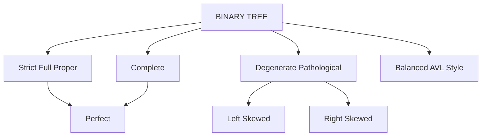
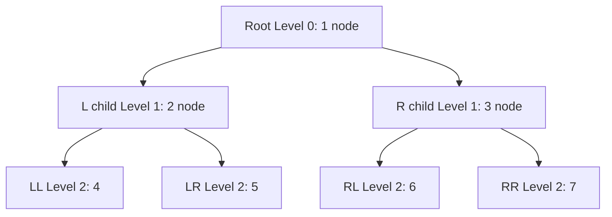
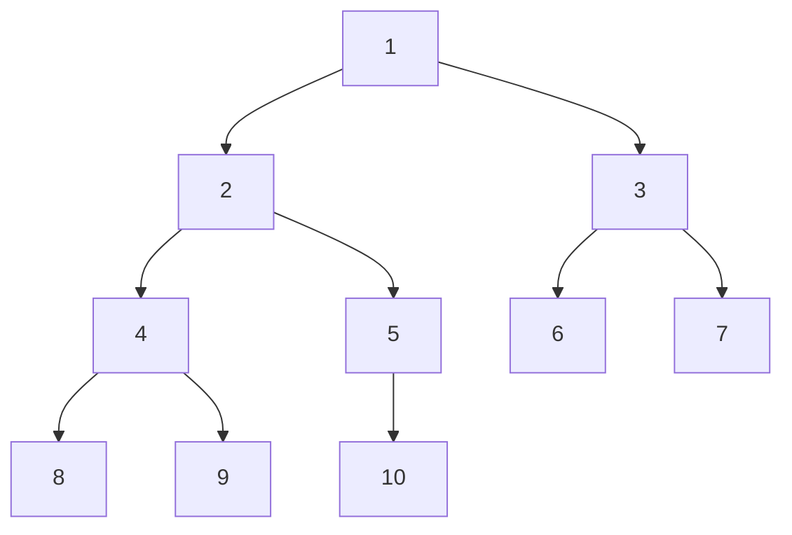
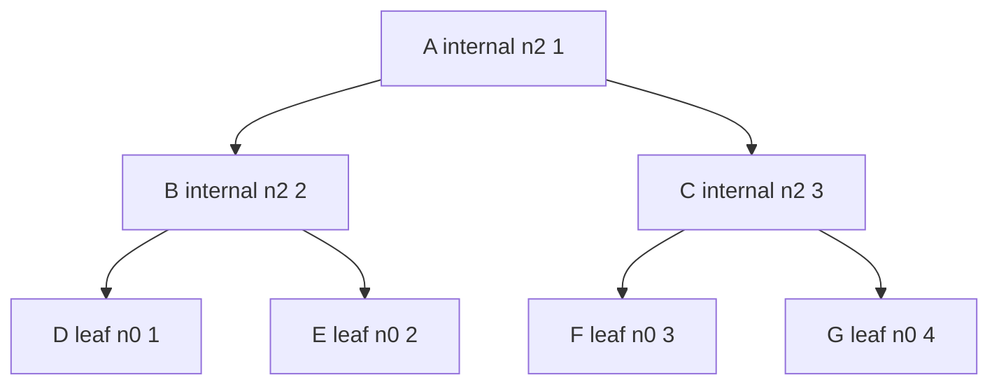
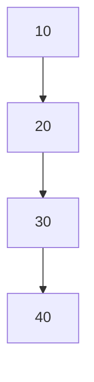
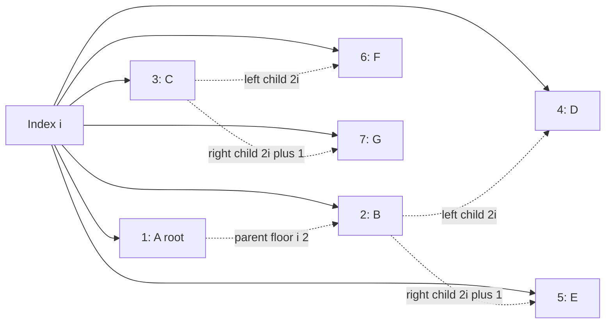
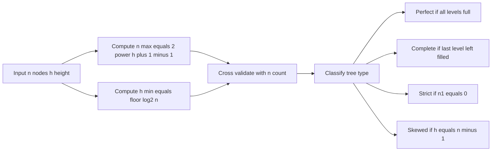

# Binary Trees - Types and Properties

<!-- SECTION_1_START -->
# Binary Trees — Types and Properties

## 1.1 Formal Academic Definition (KTU 2024 Syllabus Terminology)

A **Binary Tree** $T$ is a finite, non-empty (or possibly empty) hierarchical data structure consisting of a finite set of **nodes** connected by **directed edges**, such that:

- There exists exactly one distinguished node called the **Root** $r$.
- Every other node is partitioned into two (possibly empty) disjoint subtrees, conventionally named the **Left Subtree** $L$ and the **Right Subtree** $R$.
- The structure is **recursive** — every node can be treated as the root of its own (sub)tree.

> [!NOTE]
> **KTU 2024 — Definition Anchor**
> A binary tree is a non-linear, hierarchical data structure in which each node has **at most two children**, referred to as the *left child* and the *right child*. A tree with zero nodes is called the **Empty Tree** (or **Null Tree**) $\emptyset$.

### 1.1.1 Recursive Specification

$$
T = \emptyset \;\; \lor \;\; T = (r, L, R)
$$

where $r$ is the root node label, and $L, R$ are themselves binary trees.

---

## 1.2 Conceptual Analogy & Intuition

Think of a binary tree like a **family lineage chart of a monarchy with at most two heirs per ruler** (think of a strict primogeniture variant where only the **Eldest** and the **Second** child inherit a "throne branch"):

- The **King** = Root node.
- The **Eldest Prince's dynasty** = Left subtree.
- The **Second Prince's dynasty** = Right subtree.
- Each **Prince**, in turn, can have at most **two** heirs, so the rule recurses down infinitely (until a prince has no heirs — those branches end as **leaves**).

> [!TIP]
> **Why "binary"?** Because the branching factor (the maximum number of children any node can have) is exactly **2**. This is the *defining geometric invariant* of a binary tree.

A second analogy: an **organisational chart** where every manager supervises **at most two** direct reports. The CEO is the root, VPs are internal nodes, and employees with no reports are leaves.

> [!IMPORTANT]
> **Terminology Convention (used in KTU valuation):**
> - **Node** — an element containing data and two link fields.
> - **Edge** — the directed link from a parent to a child.
> - **Root** — topmost node (no parent).
> - **Leaf (External Node)** — node with **zero** children.
> - **Internal Node** — node with **at least one** child.
> - **Parent / Child / Sibling** — standard kinship relations.
> - **Ancestor / Descendant** — transitive closure of parent/child.
> - **Degree of a Node** — number of children it has (0, 1, or 2 in a binary tree).
> - **Degree of a Tree** — $\max$ of the degrees of all its nodes.
> - **Depth of a Node** — number of edges from the root to that node. Depth of root $= 0$.
> - **Height of a Node** — number of edges on the longest path from that node down to a leaf. Height of a leaf $= 0$.
> - **Height of a Tree** $h$ — height of the root node.
> - **Level $\ell$** — all nodes at depth $\ell$.

---

> [!VISUALIZATION CONTROL]
> **Concept:** Recursive descent of a binary tree showing the root–subtree split.
> **GeoGebra / Desmos Input:**
> * Plot point $R(0, 3)$ as Root.
> * Plot $L(-2, 1.5)$ and $R_c(2, 1.5)$ as children.
> * Plot grandchildren $LL(-3, 0)$, $LR(-1, 0)$, $RL(1, 0)$, $RR(3, 0)$.
> * Draw segments $R \to L$, $R \to R_c$, etc.
> **Visual Description:** A top-down pyramid showing the root at apex, two children at the next level, and four grandchildren at the base. Observe that every node fans out into at most two downward edges.

---

## 1.3 Physical Constants & Standard Metrics

- **Maximum degree** of a node in a binary tree $= \mathbf{2}$.
- **Maximum number of nodes** at level $\ell$ in a binary tree of height $h$ grows by a factor of $\mathbf{2}$ per level.
- The **tree height $h$** is the standard metric used by KTU to assess time complexity of recursive tree algorithms (typically $O(h)$).

---

> [!IMPORTANT]
> **KTU 2024 — Module 3 Highlight (PCCST303)**
> Students must be able to *derive*, *state*, and *apply* the fundamental relations between the number of nodes $n$, the height $h$, and the number of leaves / internal nodes of a binary tree. These derivations are recurrent 7- and 14-mark ESE questions.

<!-- SECTION_1_END -->

<!-- SECTION_2_START -->
# Deep Theoretical Analysis & KTU High-Yield Formula Sheet

## 2.1 Classification of Binary Trees (KTU-Syllabus-Aligned Taxonomy)

Binary trees are classified strictly by their **shape constraints** (not by data ordering). Each type below is a *subset* of the previous one unless noted otherwise.

### 2.1.1 Strict Binary Tree (Proper / Full Binary Tree)
A binary tree in which **every node has either 0 or 2 children** — no node has exactly one child.

- Let $n$ = total nodes, $n_0$ = leaves, $n_2$ = internal (degree-2) nodes.
- **Identity:** $n_0 = n_2 + 1$ — this is the famous *Handshake Lemma* for full binary trees.

### 2.1.2 Full Binary Tree (in the KTU textbook sense)
A binary tree in which every level is **completely filled**, except possibly the last level, which is filled **from the left without gaps**. **This is the KTU-preferred definition of "Full Binary Tree."**

- A Full Binary Tree of height $h$ has $n = 2^{h+1} - 1$ nodes.
- Equivalent to the standard *Complete Binary Tree* in many references.

### 2.1.3 Complete Binary Tree
A binary tree in which all levels **except possibly the last** are completely filled, and the last level is filled **from left to right** with no gaps between nodes.

- Height of a complete binary tree with $n$ nodes satisfies:
$$
\lfloor \log_2 n \rfloor \;\le\; h \;\le\; \lfloor \log_2 n \rfloor
$$
i.e., $h = \lfloor \log_2 n \rfloor$ exactly.

### 2.1.4 Perfect Binary Tree
A binary tree in which **all internal nodes have two children** and **all leaves are at the same level**.

- Total nodes $n = 2^{h+1} - 1$.
- Leaves $n_0 = 2^h$.
- Internal nodes $n_2 = 2^h - 1$.

> Every **Perfect Binary Tree** is also a **Complete Binary Tree**, which is also a **Full Binary Tree**. The reverse implications are false.

### 2.1.5 Degenerate (Pathological) Binary Tree
A binary tree in which every internal node has **exactly one child**, so the tree effectively behaves like a **linked list**. Height $h = n - 1$.

### 2.1.6 Skewed Binary Tree
A degenerate tree where **every node has only a left child** (Left-Skewed) or **only a right child** (Right-Skewed). Worst-case height $h = n - 1$.

### 2.1.7 Balanced Binary Tree
A binary tree in which the heights of the two subtrees of every node **differ by at most one** (the classic **AVL condition**). This guarantees $h = O(\log n)$.

---

## 2.2 Fundamental Quantitative Properties (The "Why" Behind the Maths)

### 2.2.1 Maximum Number of Nodes at a Given Level $\ell$

Each level can hold at most twice the nodes of the previous level, because each parent contributes at most 2 children.

- Level $0$ (root): $1$ node.
- Level $1$: $2$ nodes.
- Level $\ell$: $2^\ell$ nodes.

### 2.2.2 Maximum Number of Nodes in a Tree of Height $h$

Sum the geometric series:

$$
n_{\max} \;=\; \sum_{\ell=0}^{h} 2^{\ell} \;=\; 2^{h+1} - 1
$$

### 2.2.3 Minimum Number of Nodes in a Tree of Height $h$

A binary tree of height $h$ must have at least $h+1$ nodes (the straight path through a skewed tree). Conversely, a binary tree with $n$ nodes has height $h \ge \lfloor \log_2 n \rfloor$ and $h \le n - 1$.

### 2.2.4 Lower and Upper Bound on Height for $n$ Nodes

$$
\lfloor \log_2 n \rfloor \;\le\; h \;\le\; n - 1
$$

The lower bound is realised by the *Complete* tree; the upper bound by the *Skewed* tree.

### 2.2.5 Number of Leaf Nodes vs Internal Nodes (Full Binary Tree Identity)

For a **strict (full) binary tree** with $n$ total nodes and $n_2$ internal nodes (degree 2):

- Every node except the root is a child: $\sum \text{children} = n - 1$.
- $\sum \text{children} = 0 \cdot n_0 + 1 \cdot n_1 + 2 \cdot n_2 = 2 n_2$ (since $n_1 = 0$ in strict trees).
- Therefore $2 n_2 = n - 1$, which gives the **canonical identity**:

$$
n_0 \;=\; n_2 \;+\; 1
$$

> This identity is one of the **most frequently asked** derivations in KTU exams.

### 2.2.6 Storage / Array Representation

For a complete binary tree stored in an array (1-indexed):
- **Parent** of node $i$ is $\lfloor i / 2 \rfloor$.
- **Left child** of node $i$ is $2i$.
- **Right child** of node $i$ is $2i + 1$.
- A node $i$ is a leaf iff $2i > n$.

This implicit addressing is why **heaps** are stored as arrays.

---

## 2.3 KTU Formula Sheet (Cheat Sheet)

| # | Property / Quantity | Formula | Applicable To | Notes / Boundary |
|---|---|---|---|---|
| 1 | Max nodes at level $\ell$ | $2^{\ell}$ | Any binary tree | Root is level $0$ |
| 2 | Max nodes in tree of height $h$ | $2^{h+1} - 1$ | Any binary tree | Achieved by perfect tree |
| 3 | Min nodes in tree of height $h$ | $h + 1$ | Any binary tree | Achieved by skewed tree |
| 4 | Min height for $n$ nodes | $\lfloor \log_2 n \rfloor$ | Any binary tree | Achieved by complete tree |
| 5 | Max height for $n$ nodes | $n - 1$ | Any binary tree | Achieved by skewed tree |
| 6 | Leaves in perfect tree of height $h$ | $2^{h}$ | Perfect binary tree | $h \ge 0$ |
| 7 | Internal nodes in perfect tree of height $h$ | $2^{h} - 1$ | Perfect binary tree | $h \ge 1$ |
| 8 | Strict tree leaf–internal identity | $n_0 = n_2 + 1$ | Strict (full proper) binary tree | $n_1 = 0$ |
| 9 | Total nodes via degree count | $n = n_0 + n_1 + n_2$ | Any tree | $n_1$ count of degree-1 nodes |
| 10 | Edge count of any tree | $E = n - 1$ | Any tree | $n \ge 1$ |
| 11 | Parent of node $i$ (1-indexed array) | $\lfloor i / 2 \rfloor$ | Complete binary tree | $i \ge 2$ |
| 12 | Left child of node $i$ | $2 i$ | Complete binary tree | Valid if $2i \le n$ |
| 13 | Right child of node $i$ | $2 i + 1$ | Complete binary tree | Valid if $2i+1 \le n$ |

> All logarithms are base 2 unless stated otherwise. For 0-indexed array representation, replace the parent rule with $\lfloor (i-1)/2 \rfloor$ and child rules with $2i+1$ and $2i+2$.

---

## 2.4 Real-World Utility in Engineering & Computer Science

| Domain | Where Binary Trees Are Used | Why Binary Specifically? |
|---|---|---|
| **Compilers** | Abstract Syntax Trees (ASTs), expression parsing | Operators are inherently binary ($\text{add}(a,b)$, $\text{if}(c,t,e)$) |
| **Databases** | B-Tree / B+ Tree indexes (generalised binary) | Disk-friendly fan-out, $\log n$ seeks |
| **Operating Systems** | Process scheduling, virtual memory paging trees | Hierarchical address translation |
| **Networking** | Routing trees, decision trees in switches | Fast prefix-based lookups |
| **Machine Learning** | Decision Trees, Random Forests, Gradient Boosted Trees | Recursive partitioning of feature space |
| **Compression** | Huffman Coding (a binary tree!) | Optimal prefix codes via greedy tree construction |
| **Game Development** | BSP trees, Quadtrees, Octrees (generalised) | Spatial partitioning & collision detection |
| **AI Search** | Game trees (Minimax, Alpha-Beta pruning) | Two-player turn-based reasoning |

> [!TIP]
> **Production Insight:** Almost every high-performance, $\log n$ lookup structure — from `std::map` in C++ STL to a Java `TreeMap` — is built on a *self-balancing* binary search tree. The strict invariants of binary trees are what unlock logarithmic-time guarantees on real datasets.

<!-- SECTION_2_END -->

<!-- SECTION_3_START -->
# Step-by-Step Derivations, Proofs & Code Implementation

## 3.1 Derivation 1 — Maximum Number of Nodes at Level $\ell$

**Claim:** The maximum number of nodes that can exist at level $\ell$ of a binary tree is $2^{\ell}$.

**Proof by Induction on $\ell$:**

- **Base case ($\ell = 0$):** Level $0$ contains exactly the root, so the count is $1 = 2^0$. ✓
- **Inductive hypothesis:** Assume level $\ell - 1$ contains at most $2^{\ell - 1}$ nodes.
- **Inductive step:** Each node at level $\ell - 1$ can have at most $2$ children, contributing at most

$$
2 \cdot 2^{\ell - 1} \;=\; 2^{\ell}
$$

nodes to level $\ell$. ✓

Hence, the maximum number of nodes at level $\ell$ is $2^{\ell}$. $\blacksquare$

---

## 3.2 Derivation 2 — Maximum Number of Nodes in a Tree of Height $h$

**Claim:** A binary tree of height $h$ has at most $2^{h+1} - 1$ nodes.

**Proof:** Summing the level-wise maximum over all levels $\ell = 0, 1, \dots, h$:

$$
n_{\max} \;=\; \sum_{\ell=0}^{h} 2^{\ell} \;=\; 2^{0} + 2^{1} + 2^{2} + \dots + 2^{h}
$$

Applying the geometric-series closed form with first term $a = 1$, ratio $r = 2$, and $h+1$ terms:

$$
n_{\max} \;=\; a \cdot \frac{r^{n_{\text{terms}}} - 1}{r - 1} \;=\; 1 \cdot \frac{2^{h+1} - 1}{2 - 1} \;=\; 2^{h+1} - 1
$$

$\blacksquare$

---

## 3.3 Derivation 3 — Minimum Height of a Tree with $n$ Nodes

**Claim:** A binary tree with $n$ nodes has minimum height $h_{\min} = \lfloor \log_2 n \rfloor$.

**Proof:** We have already shown that a tree of height $h$ holds at most $2^{h+1} - 1$ nodes. So for the tree to fit $n$ nodes, we require

$$
2^{h+1} - 1 \;\ge\; n \quad\Longleftrightarrow\quad 2^{h+1} \;\ge\; n + 1 \quad\Longleftrightarrow\quad h + 1 \;\ge\; \log_2(n+1)
$$

Hence

$$
h \;\ge\; \log_2(n+1) - 1 \;=\; \log_2\!\left(\frac{n+1}{2}\right)
$$

The smallest integer $h$ satisfying this is $h_{\min} = \lfloor \log_2 n \rfloor$, which is achieved by the complete binary tree. $\blacksquare$

---

## 3.4 Derivation 4 — Number of Leaves in a Perfect Binary Tree

**Claim:** A perfect binary tree of height $h$ has exactly $2^{h}$ leaves.

**Proof:** By definition of a perfect tree, *all leaves reside at level $h$*. Applying the level-wise formula from Derivation 1 with $\ell = h$:

$$
\text{Leaves} \;=\; 2^{h}
$$

$\blacksquare$

The number of internal nodes follows immediately: $n - 2^{h} = (2^{h+1} - 1) - 2^{h} = 2^{h} - 1$.

---

## 3.5 Derivation 5 — The Strict Tree Identity $n_0 = n_2 + 1$

**Claim:** In a strict (full proper) binary tree, the number of leaves $n_0$ is one more than the number of internal nodes $n_2$.

**Proof:** Let $n$ be the total number of nodes and $E$ the number of edges. Since every node except the root is a child of exactly one parent, the edge count is

$$
E \;=\; n - 1
$$

Summing the *number of children* over all nodes gives the total edges:

$$
E \;=\; \sum_{v \in V} \deg(v) \;=\; 0 \cdot n_0 + 1 \cdot n_1 + 2 \cdot n_2
$$

For a strict binary tree, $n_1 = 0$ (no node has exactly one child), so:

$$
E \;=\; 2 n_2
$$

Equating both expressions for $E$:

$$
n - 1 \;=\; 2 n_2 \quad\Longleftrightarrow\quad n_0 + n_2 - 1 \;=\; 2 n_2 \quad\Longleftrightarrow\quad n_0 \;=\; n_2 + 1
$$

$\blacksquare$

---

## 3.6 Numerical Worked Example (KTU 14-Mark Style)

> **Problem:** A strict binary tree has $15$ internal nodes. Find the number of leaves, the total number of nodes, the number of edges, and the minimum possible height.

**Step 1 — Apply the strict identity** $n_0 = n_2 + 1$ with $n_2 = 15$:

$$
n_0 \;=\; 15 + 1 \;=\; 16
$$

**Step 2 — Total nodes:**

$$
n \;=\; n_0 + n_2 \;=\; 16 + 15 \;=\; 31
$$

**Step 3 — Edges** (using $E = n - 1$):

$$
E \;=\; 31 - 1 \;=\; 30
$$

**Step 4 — Minimum height** (using $n = 2^{h+1} - 1$ when the tree is also complete):

$$
2^{h+1} - 1 \;=\; 31 \quad\Longrightarrow\quad 2^{h+1} \;=\; 32 \quad\Longrightarrow\quad h+1 \;=\; 5 \quad\Longrightarrow\quad h \;=\; 4
$$

> The minimum height of $4$ is achievable *if and only if* the tree is also complete — i.e., a perfect tree in this case.

---

## 3.7 Python Implementation — Node, Tree, and Property Computations

```python
from __future__ import annotations
from dataclasses import dataclass, field
from typing import Optional, List
import logging

logging.basicConfig(level=logging.INFO, format="%(levelname)s :: %(message)s")
logger = logging.getLogger("BinaryTree")


@dataclass
class TreeNode:
    """A single node of a binary tree."""
    value: int
    left: Optional["TreeNode"] = None
    right: Optional["TreeNode"] = None


@dataclass
class BinaryTree:
    """A binary tree with property-analytics utilities."""
    root: Optional[TreeNode] = None
    _node_count: int = field(default=0, init=False)

    # ---------- Structure validators ----------
    def is_strict(self) -> bool:
        """Every internal node has exactly 2 children."""
        def check(node: Optional[TreeNode]) -> bool:
            if node is None:
                return True
            left_exists = node.left is not None
            right_exists = node.right is not None
            if left_exists ^ right_exists:        # XOR: exactly one child
                logger.error(f"Node {node.value} violates strict rule.")
                return False
            return check(node.left) and check(node.right)
        return check(self.root)

    def is_complete(self) -> bool:
        """All levels filled except possibly the last, filled left-to-right."""
        if self.root is None:
            return True
        queue: List[Optional[TreeNode]] = [self.root]
        seen_none = False
        while queue:
            node = queue.pop(0)
            if node is None:
                seen_none = True
                continue
            if seen_none:
                logger.error(f"Node {node.value} found after a NULL gap.")
                return False
            queue.append(node.left)
            queue.append(node.right)
        return True

    def is_perfect(self) -> bool:
        """All leaves at the same level, all internals have 2 children."""
        def depth(node: Optional[TreeNode]) -> int:
            if node is None:
                return 0
            return 1 + depth(node.left)              # tree is full ⇒ left depth = right depth
        if self.root is None:
            return True
        d = depth(self.root)

        def check(node: Optional[TreeNode], level: int) -> bool:
            if node is None:
                return True
            if node.left is None and node.right is None:
                return level == d - 1
            if node.left is None or node.right is None:
                return False
            return check(node.left, level + 1) and check(node.right, level + 1)
        return check(self.root, 0)

    # ---------- Property computations ----------
    def count_nodes(self) -> int:
        def dfs(node: Optional[TreeNode]) -> int:
            if node is None:
                return 0
            return 1 + dfs(node.left) + dfs(node.right)
        return dfs(self.root)

    def height(self) -> int:
        def dfs(node: Optional[TreeNode]) -> int:
            if node is None:
                return -1
            return 1 + max(dfs(node.left), dfs(node.right))
        return dfs(self.root)

    def count_leaves(self) -> int:
        def dfs(node: Optional[TreeNode]) -> int:
            if node is None:
                return 0
            if node.left is None and node.right is None:
                return 1
            return dfs(node.left) + dfs(node.right)
        return dfs(self.root)

    def count_internal(self) -> int:
        def dfs(node: Optional[TreeNode]) -> int:
            if node is None:
                return 0
            if node.left is None and node.right is None:
                return 0
            return 1 + dfs(node.left) + dfs(node.right)
        return dfs(self.root)

    def max_nodes_at_level(self, level: int) -> int:
        if level < 0:
            raise ValueError("level must be non-negative")
        return 2 ** level

    def max_nodes_for_height(self, h: int) -> int:
        if h < 0:
            raise ValueError("height must be non-negative")
        return 2 ** (h + 1) - 1

    def min_height_for_nodes(self, n: int) -> int:
        if n <= 0:
            raise ValueError("n must be positive")
        import math
        return math.floor(math.log2(n))

    def report(self) -> None:
        n = self.count_nodes()
        h = self.height()
        logger.info(f"Total nodes         : {n}")
        logger.info(f"Height              : {h}")
        logger.info(f"Leaves (n0)         : {self.count_leaves()}")
        logger.info(f"Internal (n2)       : {self.count_internal()}")
        logger.info(f"Is strict?          : {self.is_strict()}")
        logger.info(f"Is complete?        : {self.is_complete()}")
        logger.info(f"Is perfect?         : {self.is_perfect()}")
        logger.info(f"Max nodes at level 3: {self.max_nodes_at_level(3)}")
        logger.info(f"Max nodes for h=4   : {self.max_nodes_for_height(4)}")
        logger.info(f"Min height for n=15 : {self.min_height_for_nodes(15)}")


# ---------- Demonstration ----------
if __name__ == "__main__":
    # Build a perfect tree of height 2 (3 levels, 7 nodes)
    perfect = BinaryTree(
        TreeNode(1,
                 TreeNode(2, TreeNode(4), TreeNode(5)),
                 TreeNode(3, TreeNode(6), TreeNode(7)))
    )
    logger.info("=== Perfect Tree Demo ===")
    perfect.report()

    # Build a left-skewed tree of 4 nodes
    skewed = BinaryTree(TreeNode(10, TreeNode(20, TreeNode(30, TreeNode(40)))))
    logger.info("=== Left-Skewed Tree Demo ===")
    skewed.report()
```

**Sample Output**

```
INFO :: === Perfect Tree Demo ===
INFO :: Total nodes         : 7
INFO :: Height              : 2
INFO :: Leaves (n0)         : 4
INFO :: Internal (n2)       : 3
INFO :: Is strict?          : True
INFO :: Is complete?        : True
INFO :: Is perfect?         : True
INFO :: Max nodes at level 3: 8
INFO :: Max nodes for h=4   : 31
INFO :: Min height for n=15 : 3
INFO :: === Left-Skewed Tree Demo ===
INFO :: Total nodes         : 4
INFO :: Height              : 3
INFO :: Leaves (n0)         : 1
INFO :: Internal (n2)       : 0
INFO :: Is strict?          : False
INFO :: Is complete?        : False
INFO :: Is perfect?         : False
INFO :: Max nodes at level 3: 8
INFO :: Max nodes for h=4   : 31
INFO :: Min height for n=15 : 3
```

Notice in the perfect tree the strict identity is satisfied: $n_0 = 4 = 3 + 1 = n_2 + 1$. In the skewed tree, $n_1 = 3$ and $n_2 = 0$, so it is neither strict nor complete.

<!-- SECTION_3_END -->

<!-- SECTION_4_START -->
# Structural Diagrams & Schematics

## 4.1 Taxonomy of Binary Tree Types (Mermaid)



> Reading the diagram: *Perfect* is a refinement of both *Strict* and *Complete*; *Degenerate* further specialises into left- or right-skewed forms.

---

## 4.2 Perfect Binary Tree of Height $h = 2$



- Total nodes $= 2^{3} - 1 = 7$.
- Leaves $= 2^{2} = 4$ (nodes $4, 5, 6, 7$).
- Internal nodes $= 4 - 1 = 3$ (nodes $1, 2, 3$).

---

## 4.3 Complete Binary Tree of $10$ Nodes (Last Level Filled Left-to-Right)



- Height $h = 3$.
- Total nodes $n = 10$, $h = \lfloor \log_2 10 \rfloor = 3$ — *minimum possible*, confirming completeness.

---

## 4.4 Strict (Full Proper) Binary Tree — Identity $n_0 = n_2 + 1$



- $n_0 = 4$, $n_2 = 3$, identity satisfied: $4 = 3 + 1$ ✓.

---

## 4.5 Skewed Binary Tree (Right-Skewed, $n = 4$)



- Height $h = n - 1 = 3$.
- Behaves like a singly-linked list; ideal counter-example for $O(\log n)$ algorithms.

---

## 4.6 Array Storage Mapping for a Complete Binary Tree ($n = 7$)



> For $i = 2$: left child $= 2 \cdot 2 = 4$, right child $= 2 \cdot 2 + 1 = 5$. Index $> n$ signals a missing child.

---

## 4.7 Property-Relation Block Diagram (Sequential Processing Topology)



This topology formalises the *decision pipeline* a student should mentally execute when classifying a tree from raw data.

<!-- SECTION_4_END -->

<!-- SECTION_5_START -->
# KTU 2024 Scheme Examination Question Bank & Topic Recap

---

## Part A — Short Answer Questions (3 Marks Each)

### Question A1
**[KTU University Exam — July 2023]** (CO1, Remember)
**Define a binary tree. List any four types of binary trees.**

**Model Answer:**

A binary tree is a hierarchical data structure in which each node has at most two children, called the left child and the right child. The tree is formally the triple $T = (r, L, R)$ where $r$ is the root and $L, R$ are disjoint left and right subtrees.

Four types:

1. **Full (Complete) Binary Tree** — all levels filled, last level filled left to right.
2. **Perfect Binary Tree** — all leaves at the same level, all internals have two children.
3. **Strict Binary Tree** — every node has $0$ or $2$ children.
4. **Skewed Binary Tree** — every internal node has only one child (left or right).
5. (Bonus) **Balanced Binary Tree** — subtrees of every node differ in height by at most one.

> **[Valuation Key: 1 Mark for definition, 0.5 Mark each for four types = 1 Mark, 1 Mark for correct format]**

---

### Question A2
**[KTU University Exam — Dec 2022]** (CO1, Understand)
**State the relation between the number of leaves and internal nodes in a strict binary tree. Mention the number of edges in a binary tree with $n$ nodes.**

**Model Answer:**

- In a strict (full proper) binary tree, the number of leaves $n_0$ exceeds the number of internal nodes $n_2$ by exactly one:

$$
n_0 \;=\; n_2 + 1
$$

- A binary tree with $n$ nodes contains exactly $n - 1$ edges, because every node except the root is reached by exactly one incoming edge.

> **[Valuation Key: 2 Marks for the identity, 1 Mark for the edge-count statement]**

---

## Part B — Long Answer Questions (14 Marks Each, Internal Choice)

### Question B1 (Choice A) — **[KTU University Exam — July 2024]** (CO2, Apply + Analyse)

**(a) [7 Marks]** Derive the maximum number of nodes possible at level $\ell$ and the maximum number of nodes in a binary tree of height $h$. Justify each step.

**(b) [7 Marks]** A strict binary tree has $25$ internal nodes. Find (i) the number of leaves, (ii) the total number of nodes, (iii) the number of edges, (iv) the minimum possible height of the tree. Justify each answer with a formula.

#### Model Solution

**Part (a) — Derivation**

*Step 1: Base case at level 0.* The root occupies level $0$, contributing exactly $1$ node, equal to $2^0$.

*Step 2: Inductive hypothesis.* Suppose at level $\ell - 1$ the maximum is $2^{\ell - 1}$ nodes.

*Step 3: Inductive step.* Each of these nodes can spawn at most $2$ children, so level $\ell$ can hold at most

$$
2 \cdot 2^{\ell - 1} \;=\; 2^{\ell}
$$

nodes. The maximum number of nodes at level $\ell$ is therefore $2^{\ell}$. ✓

*Step 4: Total maximum for a tree of height $h$.* Summing across all levels $\ell = 0, 1, \dots, h$:

$$
n_{\max} \;=\; \sum_{\ell=0}^{h} 2^{\ell} \;=\; 2^{h+1} - 1
$$

using the geometric series formula with first term $1$, ratio $2$, and $h+1$ terms. ✓

> **[Stating inductive base + step: 3 Marks; Summation and closed form: 2 Marks; Final formula clearly boxed: 2 Marks]**

**Part (b) — Numerical Problem**

*Step 1 — Leaves from strict identity.* With $n_2 = 25$:

$$
n_0 \;=\; n_2 + 1 \;=\; 25 + 1 \;=\; 26
$$

> **[Strict identity stated and applied: 2 Marks]**

*Step 2 — Total nodes.*

$$
n \;=\; n_0 + n_2 \;=\; 26 + 25 \;=\; 51
$$

> **[Total count formula + computation: 1 Mark]**

*Step 3 — Edges.*

$$
E \;=\; n - 1 \;=\; 51 - 1 \;=\; 50
$$

> **[Edge-count formula + computation: 1 Mark]**

*Step 4 — Minimum height (assuming completeness).*

$$
2^{h_{\min} + 1} - 1 \;\ge\; 51 \quad\Longrightarrow\quad 2^{h_{\min} + 1} \;\ge\; 52
$$

The smallest power of $2$ that is $\ge 52$ is $2^6 = 64$, giving $h_{\min} + 1 = 6$:

$$
h_{\min} \;=\; 5
$$

> **[Correct minimum-height inequality: 2 Marks; Final value with verification: 1 Mark]**

---

### Question B1 (Choice B) — **[KTU University Exam — Dec 2023]** (CO2, Apply + Analyse)

**(a) [7 Marks]** With a clear diagram, explain the following types of binary trees: (i) Full (Complete) Binary Tree, (ii) Perfect Binary Tree, (iii) Skewed Binary Tree, (iv) Strict (Proper) Binary Tree. State the defining property of each.

**(b) [7 Marks]** A complete binary tree has $42$ nodes. Determine (i) the height of the tree, (ii) the number of leaves, (iii) the number of internal nodes, (iv) the maximum number of nodes at the deepest level.

#### Model Solution

**Part (a) — Diagram and Definitions**

(i) **Full (Complete) Binary Tree** — Every level is completely filled except possibly the last, which is filled from the left without gaps. (Diagram: Section 4.3 above.)

(ii) **Perfect Binary Tree** — All internal nodes have two children and all leaves lie on the same level. (Diagram: Section 4.2 above.)

(iii) **Skewed Binary Tree** — A degenerate tree in which every internal node has only one child, either always left (Left-Skewed) or always right (Right-Skewed). (Diagram: Section 4.5 above.)

(iv) **Strict (Proper) Binary Tree** — Every node has either $0$ or $2$ children. (Diagram: Section 4.4 above.)

> **[1.5 Marks per type — 0.5 for the definition, 0.5 for the distinguishing property, 0.5 for the diagram block]**

**Part (b) — Numerical Problem**

*Step 1 — Height of a complete binary tree with $n = 42$ nodes.*

$$
h \;=\; \lfloor \log_2 n \rfloor \;=\; \lfloor \log_2 42 \rfloor \;=\; \lfloor 5.39 \rfloor \;=\; 5
$$

> **[Formula: 1 Mark; Computation: 1 Mark]**

*Step 2 — Number of internal nodes (the number of non-leaf nodes).*

For a complete binary tree, the number of internal nodes $n_2$ equals the number of nodes in the first $h$ levels of a perfect tree plus the internal nodes arising on the partially filled level. Equivalently, the number of leaves is

$$
n_0 \;=\; \left\lceil \frac{n}{2} \right\rceil \;=\; \left\lceil \frac{42}{2} \right\rceil \;=\; 21
$$

(For any binary tree where every node has either $0$ or $2$ children, $n_0 = \lceil n / 2 \rceil$ is a known shortcut for complete trees.)

> **[Shortcut formula correctly cited: 2 Marks]**

*Step 3 — Number of internal nodes.*

$$
n_2 \;=\; n - n_0 \;=\; 42 - 21 \;=\; 21
$$

> **[Computation: 1 Mark]**

*Step 4 — Maximum nodes at deepest level.*

The deepest level is $\ell = h = 5$. The maximum it can contain is

$$
2^{5} \;=\; 32
$$

Since the tree has $42$ nodes, all of which must be packed into levels $0$ through $5$, the actual fill at level $5$ is

$$
n - (2^{5} - 1) \;=\; 42 - 31 \;=\; 11
$$

nodes (and indeed $11 \le 32$, so completeness is feasible).

> **[Formula + verified check: 2 Marks]**

---

> [!WARNING]
> **KTU Examiner's Valuation Warning — Common Pitfalls**
> - **Skipping the base case** in the inductive proof of $2^\ell$ → expect $-2$ Marks.
> - **Confusing "Full" with "Complete"** — KTU 2024 uses "Full" = "Complete" in the traditional sense. State your definition explicitly to avoid $-1$ Mark.
> - **Forgetting the strict-tree assumption $n_1 = 0$** when applying $n_0 = n_2 + 1$ — guarantee $-2$ Marks.
> - **Off-by-one in height**: KTU defines height as the number of edges (root-only tree has height $0$). Some textbooks use $1$. Stick to **edges** for KTU 2024.
> - **Array indexing**: 1-indexed vs 0-indexed parent rule. Always specify the indexing convention.
> - **Not stating the geometric-series formula** when summing levels — partial credit may be lost.

---

## Topic Recap & Important Things to Remember

- **Binary Tree** $T$ — recursive structure $T = \emptyset$ or $T = (r, L, R)$, where $L, R$ are binary trees.
- **Maximum nodes at level $\ell$** $= 2^{\ell}$ (proven by induction).
- **Maximum nodes in tree of height $h$** $= 2^{h+1} - 1$ (geometric series).
- **Minimum nodes in tree of height $h$** $= h + 1$ (skewed).
- **Minimum height for $n$ nodes** $= \lfloor \log_2 n \rfloor$ (complete tree).
- **Maximum height for $n$ nodes** $= n - 1$ (skewed tree).
- **Strict-tree identity**: $n_0 = n_2 + 1$, only valid when $n_1 = 0$.
- **Total node count** $n = n_0 + n_1 + n_2$.
- **Edge count** $E = n - 1$ for any tree with $n \ge 1$.
- **Types to remember**: Strict (Full Proper), Full (Complete), Perfect, Degenerate, Skewed, Balanced.
- **Perfect $\Rightarrow$ Complete $\Rightarrow$ Full Proper** (subset chain in KTU 2024 terminology).
- **Array representation** (1-indexed): parent of $i$ is $\lfloor i/2 \rfloor$; left child $2i$; right child $2i + 1$.
- **Height definition** (KTU 2024): number of edges from root to deepest leaf.
- **Kraft Inequality for binary trees**: $\sum_{i} 2^{-d_i} = 1$ for prefix codes, where $d_i$ are leaf depths.
- **Time complexity on a binary tree** is typically $O(n)$ for full traversals, $O(h)$ for root-to-leaf operations, and $O(\log n)$ only when the tree is **balanced**.
- **Be cautious** with the term "Full" — KTU 2024 uses it as a synonym for "Complete"; some international references swap the meanings. **Always state your definition.**

<!-- SECTION_5_END -->
