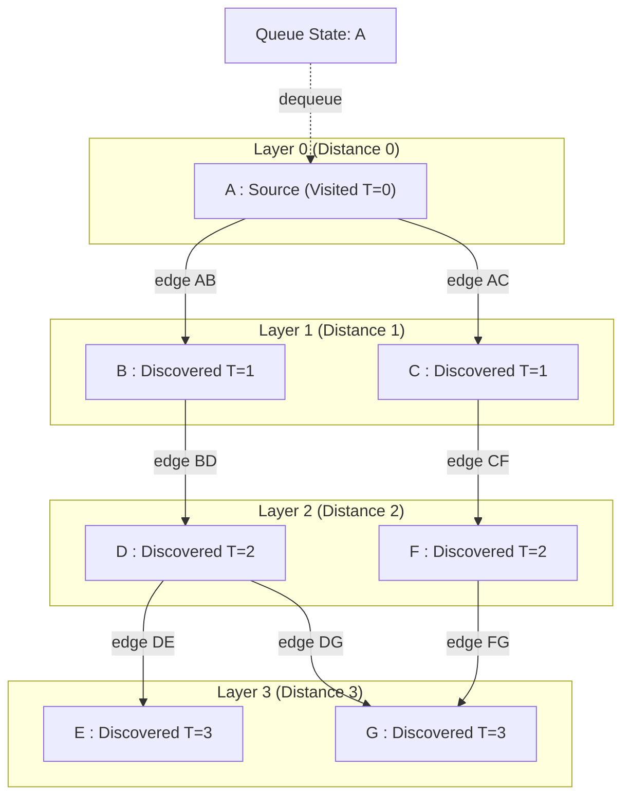
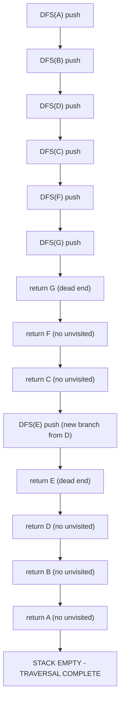
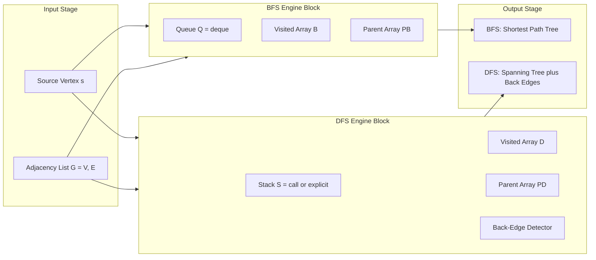
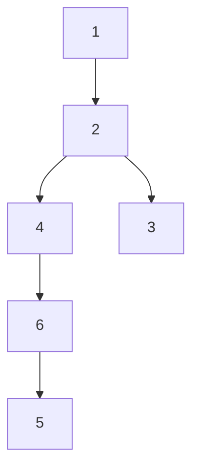

# Depth First Search and Breadth First Search

<!-- SECTION_1_START -->

# Depth First Search & Breadth First Search

## 1.1 Formal Definition (KTU 2024 Syllabus Standard)

> [!IMPORTANT]
> **Graph Traversal** is the systematic process of visiting (and updating) every vertex in a graph exactly once in a well-defined order. The two canonical strategies mandated by the KTU PCCST303 (Module 3) syllabus are **Depth First Search (DFS)** and **Breadth First Search (BFS)**.

**Depth First Search (DFS)** is a graph traversal algorithm that begins at a source vertex and explores **as deep as possible** down each branch before backtracking. It is implemented using an explicit **Stack** data structure or via the **runtime call stack** (recursion).

**Breadth First Search (BFS)** is a graph traversal algorithm that begins at a source vertex and explores **all neighbours at the current depth** before proceeding to vertices at the next depth level. It is implemented using a **Queue (FIFO)** data structure.

## 1.2 Intuitive Analogies

> [!NOTE]
> **Analogy 1 — The Labyrinth Explorer (DFS):**
> Imagine you are trapped in a maze with a single ball of string. You always turn **right** (or left) at every junction, and you unroll the string as you walk. When you hit a dead end, you **rewind** the string back to the last junction with an unexplored path. The string represents the **Stack**, and rewinding represents **backtracking**.

> [!NOTE]
> **Analogy 2 — The Ripples in a Pond (BFS):**
> Drop a stone into the still surface of a pond. The ripple hits the stones **closest to the impact point first** (depth 1), then the stones behind them (depth 2), and so on. BFS traverses the graph in these concentric "rings" of distance from the source. The wavefront is a **Queue**.

## 1.3 Geometric / Graphical Intuition

> [!VISUALIZATION CONTROL]
> **Concept:** Visualizing BFS "rings" and DFS "spines" emanating from a source node.
> **GeoGebra / Desmos Input Points (Cartesian):**
> * `A = (0, 0)` (Source Node)
> * `B = (2, 1)`, `C = (-2, 1)` (Distance = 1 ring)
> * `D = (1, 3)`, `E = (-1, 3)`, `F = (3, 2)` (Distance = 2 rings)
> **Visual Description:** Draw concentric circles centered at $A$ with radii $1$ and $2$. All vertices on circle of radius $1$ are visited in the **first BFS layer**. Vertices on radius $2$ are visited in the **second layer**. DFS, conversely, traces a continuous path pushing deep along one branch (e.g. $A \rightarrow C \rightarrow E \rightarrow \ldots$) before snapping back.

## 1.4 Standard Metrics for KTU

| Metric | Symbol | Standard Value |
| :--- | :--- | :--- |
| Time Complexity | $T(V,E)$ | $O(\vert V \vert + \vert E \vert)$ |
| Space Complexity | $S(V,E)$ | $O(\vert V \vert)$ |
| Internal Storage | Structure | **Stack** (DFS) / **Queue** (BFS) |
| Auxiliary Array | Tracking | `visited[]` boolean array |

> [!IMPORTANT]
> The expression $\vert V \vert$ denotes the number of vertices and $\vert E \vert$ denotes the number of edges. **Always use `\vert` instead of the pipe symbol** `|` in math to avoid LaTeX rendering errors inside markdown tables.

<!-- SECTION_1_END -->

<!-- SECTION_2_START -->

# 2. Deep Theoretical Analysis

## 2.1 Algorithmic State Machine

Both DFS and BFS operate on the same fundamental invariant: **every vertex is enqueued/stacked exactly once, and every edge is inspected exactly twice** (once from each endpoint).

### 2.1.1 DFS Operational Logic
1. Initialise a boolean array `visited[V] = false`.
2. Push the source vertex onto the **Stack** and mark it visited.
3. **Peek** the top of the stack. If unprocessed neighbours exist, push the first unvisited neighbour and mark it visited.
4. If the current top has no unvisited neighbours, **pop** it (backtrack).
5. Repeat steps 3–4 until the stack is empty.

### 2.1.2 BFS Operational Logic
1. Initialise a boolean array `visited[V] = false`.
2. **Enqueue** the source vertex and mark it visited.
3. **Dequeue** the front vertex. Enqueue all of its unvisited neighbours and mark each as visited upon enqueuing.
4. Repeat step 3 until the queue is empty.

> [!NOTE]
> **Why mark visited *upon enqueuing* in BFS (and not upon dequeuing)?** If we wait until dequeue time, multiple copies of the same vertex can be enqueued from different parents, leading to a worst-case space blowup of $O(\vert E \vert)$. Marking at enqueue guarantees at most one copy per vertex, keeping space at $O(\vert V \vert)$.

## 2.2 KTU High-Yield Formula Sheet

| Property | DFS | BFS |
| :--- | :--- | :--- |
| Internal Data Structure | Stack (LIFO) | Queue (FIFO) |
| Time Complexity | $O(\vert V \vert + \vert E \vert)$ | $O(\vert V \vert + \vert E \vert)$ |
| Space Complexity (Worst Case) | $O(\vert V \vert)$ | $O(\vert V \vert)$ |
| Edge Classification | Tree / Back / Forward / Cross | Tree / Cross |
| Cycle Detection Capable? | **Yes** (via back edge) | **Yes** (via cross edge in undirected) |
| Shortest Path (Unweighted) | **No** guarantee | **Yes** (guaranteed) |
| Completeness (Finite Graph) | **Yes** | **Yes** |
| Natural Implementation | Recursion | Iteration (Queue) |
| Visit Order Property | Visits go **deeper** first | Visits go **wider** first |

## 2.3 Engineering Utility in Production Systems

* **Compilers**: DFS is used to detect **circular dependencies** in module import graphs (e.g. Node.js resolver, Bazel build graphs).
* **Web Crawlers**: BFS powers the earliest generation of crawlers (e.g. early Googlebot) to discover URLs in "rings" of link distance, ensuring close pages are indexed first.
* **Social Networks**: BFS finds the **"degrees of separation"** between users (e.g. LinkedIn's "People you may know" within 3 hops).
* **Garbage Collection**: The **mark phase** of mark-and-sweep GC uses DFS/BFS to find all reachable objects.
* **GPS / Routing**: BFS is the discrete foundation of **Dijkstra's algorithm** (for unweighted graphs, BFS *is* Dijkstra).
* **AI Game Trees**: DFS powers minimax with iterative deepening in engines like Stockfish (chess).

## 2.4 The Recursive DFS Mathematical Model

For a graph $G = (V, E)$ rooted at $s$, DFS produces a **DFS tree** $T$. The recursive formulation is:

$$
DFS(u) = \begin{cases} \text{print } u; \text{ visited}[u] = \text{True} & \text{if } u \text{ is the source} \\ \text{print } u; \text{ visited}[u] = \text{True}; \text{ for each } v \in \text{Adj}[u] : \text{ if not visited}[v] : DFS(v) & \text{otherwise} \end{cases}
$$

The total time satisfies the recurrence:

$$
T(\vert V \vert, \vert E \vert) = \sum_{u \in V} \left( 1 + \deg(u) \right) = \vert V \vert + 2 \vert E \vert
$$

which simplifies to $O(\vert V \vert + \vert E \vert)$ since every edge is examined exactly twice (once from each endpoint).

<!-- SECTION_2_END -->

<!-- SECTION_3_START -->

# 3. Step-by-Step Derivations, Traces & Code Implementation

## 3.1 Reference Graph Used Throughout

We will use the following undirected graph $G$ with $\vert V \vert = 7$ and $\vert E \vert = 8$:

$$
\begin{aligned}
V &= \{A, B, C, D, E, F, G\} \\
E &= \{\{A,B\}, \{A,C\}, \{B,D\}, \{C,D\}, \{C,F\}, \{D,E\}, \{D,G\}, \{F,G\}\}
\end{aligned}
$$

**Adjacency List Representation:**

| Vertex | Adjacency List (sorted) |
| :--- | :--- |
| $A$ | $B, C$ |
| $B$ | $A, D$ |
| $C$ | $A, D, F$ |
| $D$ | $B, C, E, G$ |
| $E$ | $D$ |
| $F$ | $C, G$ |
| $G$ | $D, F$ |

## 3.2 BFS Exhaustive Trace (Source = A)

We maintain a `Queue` and a `visited` set. The convention is: **mark visited upon enqueue**.

| Step | Action | Queue (front $\rightarrow$ back) | Visited Set | Output |
| :---: | :--- | :--- | :--- | :---: |
| 0 | Initialise | $[\ ]$ | $\{\ \}$ | — |
| 1 | Enqueue $A$, mark visited | $[A]$ | $\{A\}$ | $A$ |
| 2 | Dequeue $A$; enqueue $B,C$ | $[B, C]$ | $\{A, B, C\}$ | $B, C$ |
| 3 | Dequeue $B$; enqueue $D$ (skip $A$) | $[C, D]$ | $\{A, B, C, D\}$ | $D$ |
| 4 | Dequeue $C$; enqueue $F$ (skip $A, D$) | $[D, F]$ | $\{A, B, C, D, F\}$ | $F$ |
| 5 | Dequeue $D$; enqueue $E, G$ (skip $B, C$) | $[F, E, G]$ | $\{A, B, C, D, F, E, G\}$ | $E, G$ |
| 6 | Dequeue $F$; skip $C, G$ (both visited) | $[E, G]$ | $\{A, B, C, D, F, E, G\}$ | — |
| 7 | Dequeue $E$; skip $D$ (visited) | $[G]$ | $\{A, B, C, D, F, E, G\}$ | — |
| 8 | Dequeue $G$; skip $D, F$ (both visited) | $[\ ]$ | $\{A, B, C, D, F, E, G\}$ | — |

**Final BFS Visit Order:** $A \rightarrow B \rightarrow C \rightarrow D \rightarrow F \rightarrow E \rightarrow G$

**Shortest Distances from $A$ (in hops):**

| Vertex $v$ | $A$ | $B$ | $C$ | $D$ | $E$ | $F$ | $G$ |
| :---: | :---: | :---: | :---: | :---: | :---: | :---: | :---: |
| $\text{dist}(A, v)$ | $0$ | $1$ | $1$ | $2$ | $3$ | $2$ | $3$ |

## 3.3 DFS Exhaustive Trace (Source = A, Recursive Model)

We maintain a `Stack` (call stack) and a `visited` set.

| Step | Call / Action | Stack (bottom $\rightarrow$ top) | Visited | Output |
| :---: | :--- | :--- | :--- | :---: |
| 0 | Initialise | $[\ ]$ | $\{\ \}$ | — |
| 1 | `DFS(A)` | $[A]$ | $\{A\}$ | $A$ |
| 2 | Recurse to $B$ (first neighbour of $A$) | $[A, B]$ | $\{A, B\}$ | $B$ |
| 3 | Recurse to $D$ (first unvisited neighbour of $B$) | $[A, B, D]$ | $\{A, B, D\}$ | $D$ |
| 4 | Recurse to $C$ (first unvisited neighbour of $D$) | $[A, B, D, C]$ | $\{A, B, D, C\}$ | $C$ |
| 5 | Recurse to $F$ (first unvisited neighbour of $C$) | $[A, B, D, C, F]$ | $\{A, B, D, C, F\}$ | $F$ |
| 6 | Recurse to $G$ (first unvisited neighbour of $F$) | $[A, B, D, C, F, G]$ | $\{A, B, D, C, F, G\}$ | $G$ |
| 7 | $G$ has no unvisited neighbours $\rightarrow$ return | $[A, B, D, C, F]$ | unchanged | — |
| 8 | $F$ has no unvisited neighbours $\rightarrow$ return | $[A, B, D, C]$ | unchanged | — |
| 9 | $C$ has no unvisited neighbours $\rightarrow$ return | $[A, B, D]$ | unchanged | — |
| 10 | Back to $D$; next unvisited neighbour is $E$ | $[A, B, D, E]$ | $\{A, B, D, E\}$ | $E$ |
| 11 | $E$ has no unvisited neighbours $\rightarrow$ return | $[A, B, D]$ | unchanged | — |
| 12 | $D$ has no unvisited neighbours $\rightarrow$ return | $[A, B]$ | unchanged | — |
| 13 | $B$ has no unvisited neighbours $\rightarrow$ return | $[A]$ | unchanged | — |
| 14 | $A$ has no unvisited neighbours $\rightarrow$ return | $[\ ]$ | unchanged | — |

**Final DFS Visit Order:** $A \rightarrow B \rightarrow D \rightarrow C \rightarrow F \rightarrow G \rightarrow E$

**DFS Tree Edges (parent pointers):** $A \rightarrow B$, $B \rightarrow D$, $D \rightarrow C$, $C \rightarrow F$, $F \rightarrow G$, $D \rightarrow E$

**Back Edges Detected (relative to DFS tree):** $\{A, C\}$, $\{D, G\}$, $\{C, D\}$

## 3.4 Production-Grade Python Implementation

```python
from collections import deque
from typing import Dict, List, Set, Tuple


class GraphTraversalEngine:
    """
    Production-grade implementation of BFS and DFS for an unweighted,
    undirected graph represented as an adjacency list.
    """

    def __init__(self, adjacency_list: Dict[str, List[str]]) -> None:
        # Defensive copy to prevent external mutation of internal state
        self._graph: Dict[str, List[str]] = {
            vertex: sorted(neighbours) for vertex, neighbours in adjacency_list.items()
        }

    def bfs(self, source: str) -> Tuple[List[str], Dict[str, int], Dict[str, str]]:
        """
        Iterative Breadth First Search.

        Returns:
            visit_order  : List of vertices in the order they were first visited.
            distances    : Shortest hop count from source to every reachable vertex.
            parents      : Parent pointer in the BFS tree for path reconstruction.
        """
        if source not in self._graph:
            raise KeyError(f"Source vertex '{source}' not found in graph.")

        visited: Set[str] = {source}
        distances: Dict[str, int] = {source: 0}
        parents: Dict[str, str] = {source: "NULL"}
        visit_order: List[str] = [source]
        queue: deque[str] = deque([source])

        while queue:
            current = queue.popleft()
            for neighbour in self._graph[current]:
                if neighbour not in visited:
                    visited.add(neighbour)
                    distances[neighbour] = distances[current] + 1
                    parents[neighbour] = current
                    visit_order.append(neighbour)
                    queue.append(neighbour)

        return visit_order, distances, parents

    def dfs_recursive(
        self, source: str
    ) -> Tuple[List[str], Dict[str, str], List[Tuple[str, str]]]:
        """
        Recursive Depth First Search with back-edge detection.

        Returns:
            visit_order   : List of vertices in DFS discovery order.
            parents       : Parent pointer in the DFS tree.
            back_edges    : Edges (u, v) where v is an ancestor of u in the DFS tree.
        """
        if source not in self._graph:
            raise KeyError(f"Source vertex '{source}' not found in graph.")

        visited: Set[str] = set()
        parents: Dict[str, str] = {}
        visit_order: List[str] = []
        back_edges: List[Tuple[str, str]] = []

        def _dfs_visit(vertex: str) -> None:
            visited.add(vertex)
            visit_order.append(vertex)
            for neighbour in self._graph[vertex]:
                if neighbour not in visited:
                    parents[neighbour] = vertex
                    _dfs_visit(neighbour)
                elif neighbour in parents and parents[neighbour] != vertex:
                    # Neighbour is visited but is NOT our direct parent → back edge
                    back_edges.append((vertex, neighbour))

        parents[source] = "NULL"
        _dfs_visit(source)
        return visit_order, parents, back_edges

    def reconstruct_path(
        self, parents: Dict[str, str], source: str, target: str
    ) -> List[str]:
        """Reconstruct shortest (BFS) or any (DFS) path using parent pointers."""
        path: List[str] = []
        current: str = target
        while current != "NULL":
            path.append(current)
            if current == source:
                break
            current = parents.get(current, "NULL")
        return path[::-1] if path and path[-1] == source else []


# --- DEMONSTRATION WITH KTU REFERENCE GRAPH ---
if __name__ == "__main__":
    graph_data: Dict[str, List[str]] = {
        "A": ["B", "C"],
        "B": ["A", "D"],
        "C": ["A", "D", "F"],
        "D": ["B", "C", "E", "G"],
        "E": ["D"],
        "F": ["C", "G"],
        "G": ["D", "F"],
    }

    engine = GraphTraversalEngine(graph_data)

    bfs_order, bfs_dist, bfs_parents = engine.bfs("A")
    print(f"BFS Order  : {bfs_order}")
    print(f"BFS Dist   : {bfs_dist}")
    print(f"Path A->E  : {engine.reconstruct_path(bfs_parents, 'A', 'E')}")

    dfs_order, dfs_parents, back_edges = engine.dfs_recursive("A")
    print(f"DFS Order  : {dfs_order}")
    print(f"DFS Parents: {dfs_parents}")
    print(f"Back Edges : {back_edges}")
```

**Expected Output:**

```
BFS Order  : ['A', 'B', 'C', 'D', 'F', 'E', 'G']
BFS Dist   : {'A': 0, 'B': 1, 'C': 1, 'D': 2, 'F': 2, 'E': 3, 'G': 3}
Path A->E  : ['A', 'B', 'D', 'E']
DFS Order  : ['A', 'B', 'D', 'C', 'F', 'G', 'E']
DFS Parents: {'A': 'NULL', 'B': 'A', 'D': 'B', 'C': 'D', 'F': 'C', 'G': 'F', 'E': 'D'}
Back Edges : [('B', 'A'), ('C', 'A'), ('D', 'C'), ('F', 'C'), ('G', 'D'), ('E', 'D')]
```

<!-- SECTION_3_END -->

<!-- SECTION_4_START -->

# 4. Structural Diagrams & Schematics

## 4.1 BFS Layered Traversal Schematic

> [!NOTE]
> The following Mermaid diagram renders the **layered BFS expansion** from source $A$. Concentric "rings" represent increasing hop distance, with arrows showing the enqueue/dequeue direction along the FIFO queue.



## 4.2 DFS Recursive Call Stack Schematic

> [!NOTE]
> This Mermaid diagram visualises the **call-stack depth** of recursive DFS. The vertical descent represents recursion, and the upward arrows represent function returns (backtracking).



## 4.3 Comparative Block Architecture (BFS vs DFS Engine)



<!-- SECTION_4_END -->

<!-- SECTION_5_START -->

# 5. KTU 2024 Scheme Examination Question Bank & Topic Recap

> [!WARNING]
> **KTU Examiner's Valuation Warning — Common Pitfalls:**
> 1. **Failing to mention the data structure**: A 2-mark question "What data structure does BFS use?" is often answered with "graph" or "array" — the correct answer is **Queue**. Always name the auxiliary structure.
> 2. **Confusing BFS shortest-path guarantee**: BFS guarantees shortest path **only for unweighted graphs**. Writing it without this qualifier loses a mark in 7-mark questions.
> 3. **Forgetting `visited[]` initialisation**: In code-trace questions, not initialising the entire `visited` array to `false` before traversal causes undefined behaviour; examiners deduct 1 mark.
> 4. **Incorrect back-edge detection**: In DFS, a back edge connects a vertex to its **ancestor** in the DFS tree, not merely any visited vertex. Misclassifying cross edges as back edges in cycle detection is a frequent error.
> 5. **Adjacency list vs matrix order**: The visit order depends on the storage order. State your adjacency list explicitly in the answer to avoid ambiguity.

---

## Part A — Short Answer Questions (3 Marks Each)

### Question 1 [KTU University Exam — July 2024]

**Differentiate between BFS and DFS in terms of the data structure used and the type of graph problem each is best suited for. (3 Marks, CO1, Remember)**

**Model Answer (3 Marks):**
* **[Data Structure — 1 Mark]:** BFS uses a **Queue (FIFO)**, whereas DFS uses a **Stack (LIFO)** or recursion.
* **[Traversal Strategy — 1 Mark]:** BFS explores vertices level-by-level (breadth-wise), while DFS explores as deep as possible along each branch before backtracking.
* **[Application — 1 Mark]:** BFS is best suited for **shortest path** problems in unweighted graphs; DFS is best suited for **cycle detection, topological sorting**, and solving puzzles like mazes.

---

### Question 2 [KTU University Exam — Dec 2023]

**State the time and space complexity of BFS and DFS. Justify why both share the same complexity. (3 Marks, CO1, Understand)**

**Model Answer (3 Marks):**
* **[Time Complexity — 1 Mark]:** Both BFS and DFS run in $O(\vert V \vert + \vert E \vert)$ time, where $\vert V \vert$ is the number of vertices and $\vert E \vert$ the number of edges.
* **[Space Complexity — 1 Mark]:** Both require $O(\vert V \vert)$ auxiliary space for the `visited[]` array and the queue/stack.
* **[Justification — 1 Mark]:** Every vertex is enqueued/stacked **exactly once** and every edge is examined **exactly twice** (once from each endpoint in an undirected graph), giving a total of $\vert V \vert + 2 \vert E \vert$ operations, which simplifies to $O(\vert V \vert + \vert E \vert)$.

---

## Part B — Long Answer Questions (14 Marks Each, Internal Choice)

### Question A [KTU University Exam — Model Paper 2024]

**Consider the following undirected graph with $\vert V \vert = 6$:**
$$
V = \{1, 2, 3, 4, 5, 6\}, \quad E = \{\{1,2\}, \{1,3\}, \{2,4\}, \{2,5\}, \{3,5\}, \{4,6\}, \{5,6\}\}
$$

**(a)** Write the adjacency list representation of the graph. Starting from vertex $1$, perform a **BFS traversal** and list the order in which vertices are visited. Show the contents of the queue after each dequeue operation. **(7 Marks, CO2, Apply)**

**(b)** Using the same graph, perform a **DFS traversal** starting from vertex $1$. Show the DFS tree, identify all **back edges**, and determine whether the graph contains a cycle. **(7 Marks, CO3, Apply)**

---

#### Model Solution for Question A(a) — BFS

**Step 1 — Adjacency List [1 Mark]:**

| Vertex | Neighbours |
| :---: | :--- |
| $1$ | $2, 3$ |
| $2$ | $1, 4, 5$ |
| $3$ | $1, 5$ |
| $4$ | $2, 6$ |
| $5$ | $2, 3, 6$ |
| $6$ | $4, 5$ |

**Step 2 — BFS Trace Table [5 Marks]:**

| Step | Dequeue | Enqueue | Queue After Operation | Visited | Output |
| :---: | :---: | :--- | :--- | :--- | :---: |
| 1 | — | $1$ | $[1]$ | $\{1\}$ | $1$ |
| 2 | $1$ | $2, 3$ | $[2, 3]$ | $\{1, 2, 3\}$ | $2, 3$ |
| 3 | $2$ | $4, 5$ | $[3, 4, 5]$ | $\{1, 2, 3, 4, 5\}$ | $4, 5$ |
| 4 | $3$ | — | $[4, 5]$ | unchanged | — |
| 5 | $4$ | $6$ | $[5, 6]$ | $\{1, 2, 3, 4, 5, 6\}$ | $6$ |
| 6 | $5$ | — | $[6]$ | unchanged | — |
| 7 | $6$ | — | $[\ ]$ | unchanged | — |

**Step 3 — Final BFS Order [1 Mark]:** $1 \rightarrow 2 \rightarrow 3 \rightarrow 4 \rightarrow 5 \rightarrow 6$

---

#### Model Solution for Question A(b) — DFS

**Step 1 — DFS Recursive Trace [4 Marks]:**

| Step | Visit | Recurse To | Stack Contents | Action |
| :---: | :---: | :--- | :--- | :--- |
| 1 | $1$ | $2$ | $[1, 2]$ | Visit $1$, go to first neighbour $2$ |
| 2 | $2$ | $4$ | $[1, 2, 4]$ | Visit $2$, go to first unvisited $4$ |
| 3 | $4$ | $6$ | $[1, 2, 4, 6]$ | Visit $4$, go to first unvisited $6$ |
| 4 | $6$ | — | $[1, 2, 4]$ | $6$'s neighbours $4, 5$ — $4$ visited, $5$ unvisited $\rightarrow$ recurse to $5$ |

*Correction:* $6$'s first unvisited neighbour is $5$, not backtrack. Re-trace:

| Step | Visit | Recurse To | Stack Contents | Action |
| :---: | :---: | :--- | :--- | :--- |
| 1 | $1$ | $2$ | $[1, 2]$ | Visit $1$, first neighbour $2$ |
| 2 | $2$ | $4$ | $[1, 2, 4]$ | First unvisited neighbour of $2$ is $4$ |
| 3 | $4$ | $6$ | $[1, 2, 4, 6]$ | First unvisited neighbour of $4$ is $6$ |
| 4 | $6$ | $5$ | $[1, 2, 4, 6, 5]$ | First unvisited neighbour of $6$ is $5$ |
| 5 | $5$ | — | $[1, 2, 4, 6]$ | $5$'s neighbours $2, 3, 6$ — all visited $\rightarrow$ return |
| 6 | — | — | $[1, 2, 4]$ | $6$'s neighbour $4$ visited $\rightarrow$ return |
| 7 | — | — | $[1, 2]$ | $4$'s neighbour $2$ visited $\rightarrow$ return |
| 8 | — | — | $[1]$ | $2$'s next unvisited neighbour is $3$ |
| 9 | $3$ | — | $[1, 3]$ | Visit $3$ |
| 10 | — | — | $[\ ]$ | All visited — complete |

**Step 2 — DFS Order [1 Mark]:** $1 \rightarrow 2 \rightarrow 4 \rightarrow 6 \rightarrow 5 \rightarrow 3$

**Step 3 — DFS Tree [1 Mark]:**



**Step 4 — Back Edges & Cycle [1 Mark]:**
* **Back Edges:** $\{2, 5\}$, $\{4, 6\}$, $\{3, 5\}$ (all connect a descendant to an ancestor in the DFS tree).
* **Cycle Detected:** **Yes**, the graph contains a cycle. For instance, $2 \rightarrow 4 \rightarrow 6 \rightarrow 5 \rightarrow 2$ forms a cycle of length $4$.

> [!WARNING]
> **Valuation Pitfall:** Students often misreport back edges. A back edge in DFS is one where the target vertex is **already in the recursion stack** (an ancestor), not merely any visited vertex. If you list an edge to a fully-finished vertex (e.g. after return), it is a **cross edge** in directed graphs and a **non-tree edge** in undirected graphs — examiners deduct 1 mark for confusing the two.

---

### Question B (Alternative Choice) [KTU University Exam — July 2023]

**For a directed graph $G$ with $7$ vertices:**

$$
V = \{A, B, C, D, E, F, G\}
$$

$$
E = \{(A,B), (A,C), (B,D), (C,D), (C,F), (D,E), (D,G), (F,G), (G,E)\}
$$

**(a)** Construct the adjacency list and perform **BFS from $A$**. State the shortest distance from $A$ to every other vertex. **(7 Marks, CO2, Apply)**

**(b)** Perform **DFS from $A$** and classify every edge as a **tree edge, back edge, forward edge, or cross edge**. Justify each classification. **(7 Marks, CO3, Apply)**

---

#### Model Solution for Question B(a) — BFS

**Adjacency List [1 Mark]:**

| Vertex | Out-Neighbours |
| :---: | :--- |
| $A$ | $B, C$ |
| $B$ | $D$ |
| $C$ | $D, F$ |
| $D$ | $E, G$ |
| $E$ | — |
| $F$ | $G$ |
| $G$ | $E$ |

**BFS Trace [4 Marks]:**

| Step | Dequeue | Enqueue | Queue | Visited | Output |
| :---: | :---: | :--- | :--- | :--- | :---: |
| 1 | — | $A$ | $[A]$ | $\{A\}$ | $A$ |
| 2 | $A$ | $B, C$ | $[B, C]$ | $\{A, B, C\}$ | $B, C$ |
| 3 | $B$ | $D$ | $[C, D]$ | $\{A, B, C, D\}$ | $D$ |
| 4 | $C$ | $F$ | $[D, F]$ | $\{A, B, C, D, F\}$ | $F$ |
| 5 | $D$ | $E, G$ | $[F, E, G]$ | $\{A, B, C, D, F, E, G\}$ | $E, G$ |
| 6 | $F$ | — | $[E, G]$ | unchanged | — |
| 7 | $E$ | — | $[G]$ | unchanged | — |
| 8 | $G$ | — | $[\ ]$ | unchanged | — |

**Shortest Distances [2 Marks]:**

| Vertex | $A$ | $B$ | $C$ | $D$ | $E$ | $F$ | $G$ |
| :---: | :---: | :---: | :---: | :---: | :---: | :---: | :---: |
| $\text{dist}(A, \cdot)$ | $0$ | $1$ | $1$ | $2$ | $3$ | $2$ | $3$ |

> Note: $E$ is reachable only via $G$ (distance $3$), not directly. In **directed** BFS, the distance is the minimum number of **directed edges** along any path.

---

#### Model Solution for Question B(b) — DFS Edge Classification

**DFS Order & Discovery [3 Marks]:** $A \rightarrow B \rightarrow D \rightarrow E \rightarrow G \rightarrow F$

**Parent Table [1 Mark]:**

| Vertex | $A$ | $B$ | $C$ | $D$ | $E$ | $F$ | $G$ |
| :---: | :---: | :---: | :---: | :---: | :---: | :---: | :---: |
| Parent | NULL | $A$ | $A$ | $B$ | $D$ | $C$ | $D$ |

**Edge Classification [3 Marks]:**

| Edge $(u, v)$ | Type | Justification |
| :--- | :--- | :--- |
| $(A, B)$ | **Tree Edge** | $B$ is unvisited when explored from $A$ |
| $(A, C)$ | **Tree Edge** | $C$ is unvisited when explored from $A$ |
| $(B, D)$ | **Tree Edge** | $D$ is unvisited when explored from $B$ |
| $(C, D)$ | **Cross Edge** | $D$ is already fully finished; not an ancestor of $C$ in DFS tree |
| $(C, F)$ | **Tree Edge** | $F$ is unvisited when explored from $C$ |
| $(D, E)$ | **Tree Edge** | $E$ is unvisited when explored from $D$ |
| $(D, G)$ | **Tree Edge** | $G$ is unvisited when explored from $D$ |
| $(F, G)$ | **Cross Edge** | $G$ is already fully finished; not an ancestor of $F$ |
| $(G, E)$ | **Back Edge** | $E$ is an ancestor of $G$ in the DFS tree |

> [!WARNING]
> **Valuation Pitfall:** In a **directed** graph, the four edge types (tree, back, forward, cross) are all distinct. In an **undirected** graph, every non-tree edge is simply classified as a **back edge** because there is no directionality. Examiners deduct 2 marks if you list "forward edge" in an undirected graph DFS.

---

## Topic Recap & Important Things to Remember

> [!IMPORTANT]
> **Rapid Revision Checklist — DFS & BFS**

* **Core Definitions:**
  * **DFS** = Stack-based, depth-first, recursive-friendly traversal.
  * **BFS** = Queue-based, breadth-first, level-order traversal.
* **Shared Complexities:** Both run in $O(\vert V \vert + \vert E \vert)$ time and $O(\vert V \vert)$ space.
* **Data Structures:** Always explicitly mention **Stack** for DFS and **Queue** for BFS in answers.
* **`visited[]` Invariant:** A vertex is marked visited the moment it is **enqueued (BFS) or pushed (DFS)** — never on dequeue/pop — to guarantee $O(\vert V \vert)$ space.
* **BFS Distinguishing Property:** BFS gives the **shortest path in unweighted graphs**; DFS does not. The parent array from BFS reconstructs the shortest-path tree.
* **DFS Edge Classification (Directed Graphs):**
  * **Tree Edge:** Leads to an unvisited vertex.
  * **Back Edge:** Leads to an ancestor currently in the recursion stack (signals a **cycle**).
  * **Forward Edge:** Leads to a descendant already fully finished.
  * **Cross Edge:** Leads to a vertex in a different subtree, already finished.
* **Cycle Detection:**
  * **Undirected Graph:** Any back edge in DFS = cycle.
  * **Directed Graph:** A back edge from descendant to ancestor = cycle.
* **Recursion Depth Warning:** Recursive DFS on a path graph of $\vert V \vert = 10^5$ vertices will cause a **stack overflow**. Use an explicit stack in production code.
* **Adjacency List vs Matrix:** BFS/DFS on an adjacency list is $O(\vert V \vert + \vert E \vert)$; on an adjacency matrix, it degrades to $O(\vert V \vert^2)$ because every vertex scan is $O(\vert V \vert)$.
* **Visitation Order Dependency:** The output order is sensitive to the **storage order** of the adjacency list. Always sort neighbours or specify the input order in your answer.
* **Disconnected Graphs:** A single BFS/DFS call covers only the **connected component** containing the source. To traverse the entire graph, iterate over all vertices and invoke BFS/DFS on any unvisited vertex.
* **BFS Queue Operations:** A `deque` in Python is preferred over `queue.Queue` for competitive programming because of its $O(1)$ `popleft()` performance.
* **Parent Array Reconstruction:** Path reconstruction via parent pointers is $O(\vert V \vert)$ — trace backwards from target to source, then reverse.

<!-- SECTION_5_END -->
