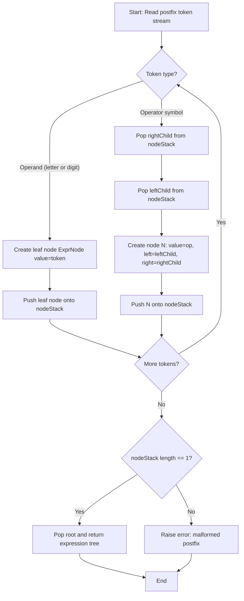
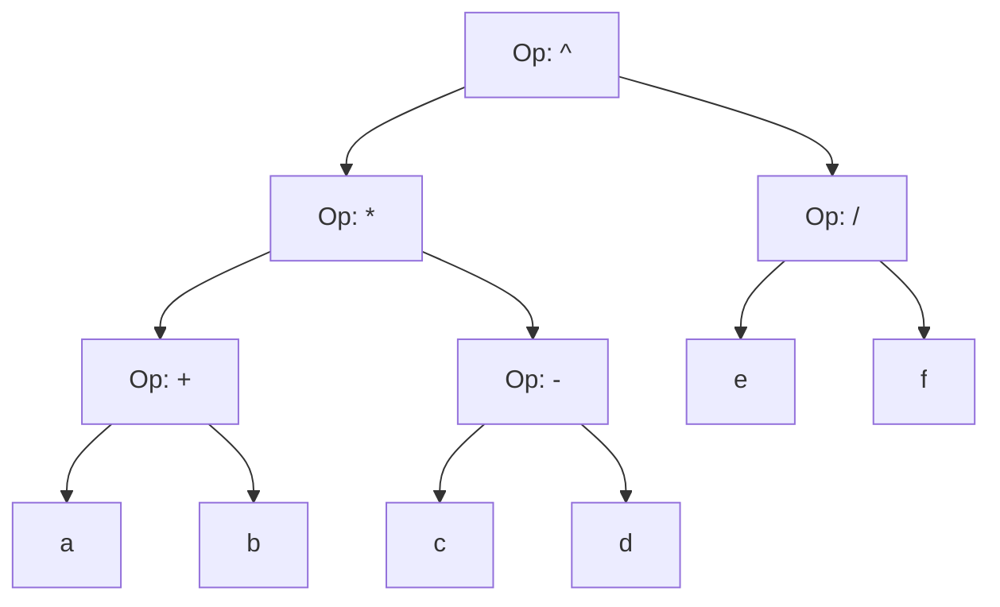
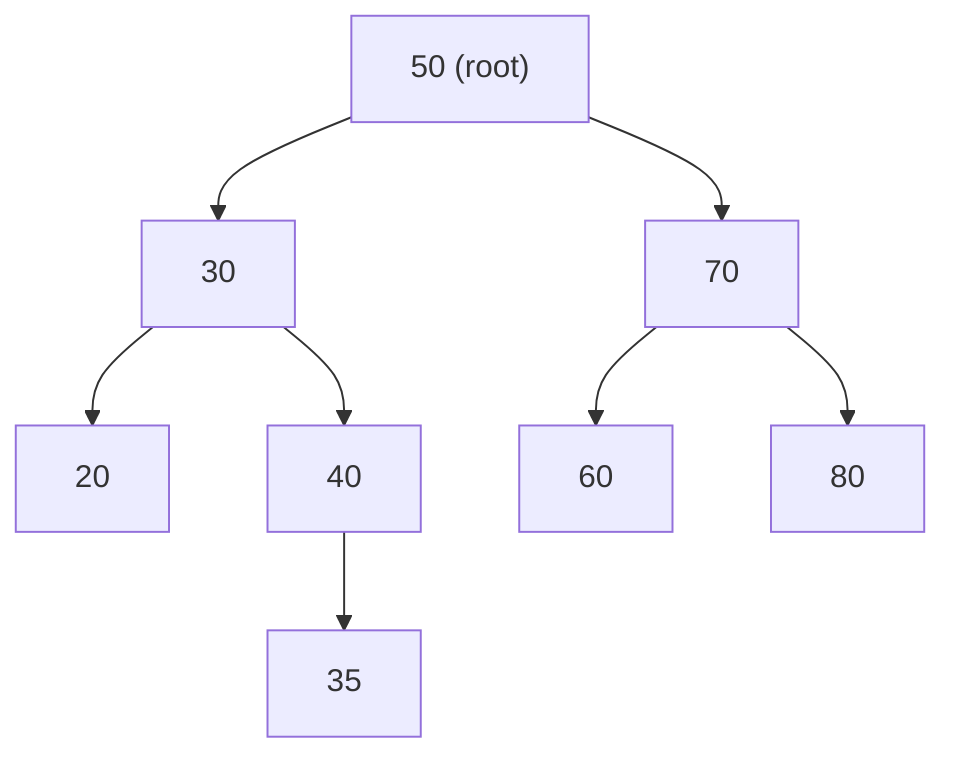
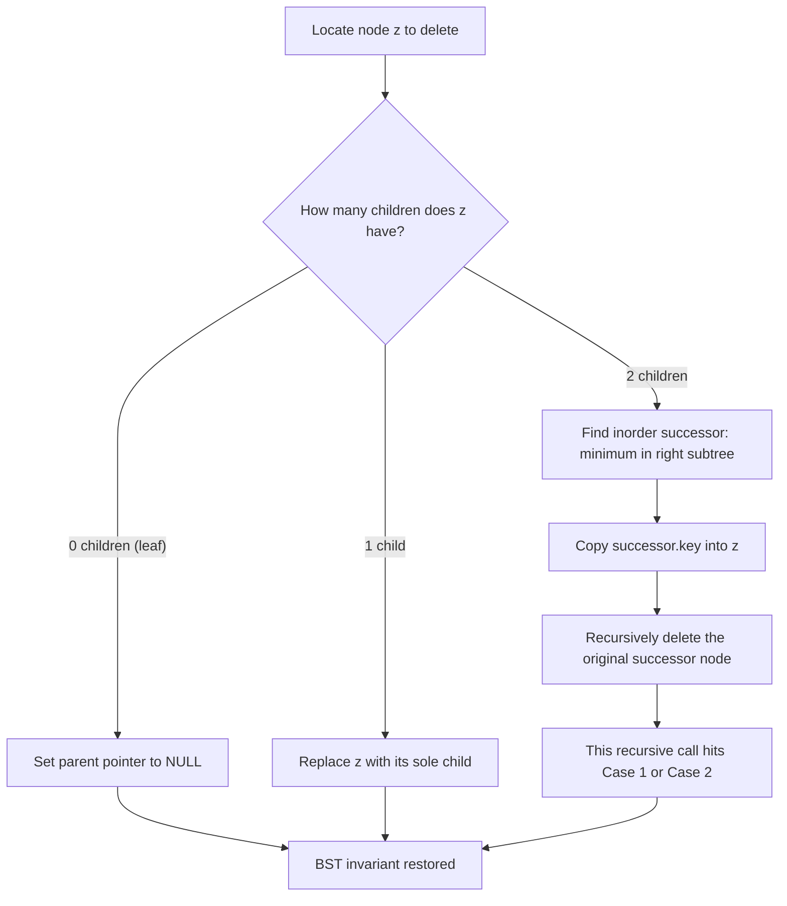
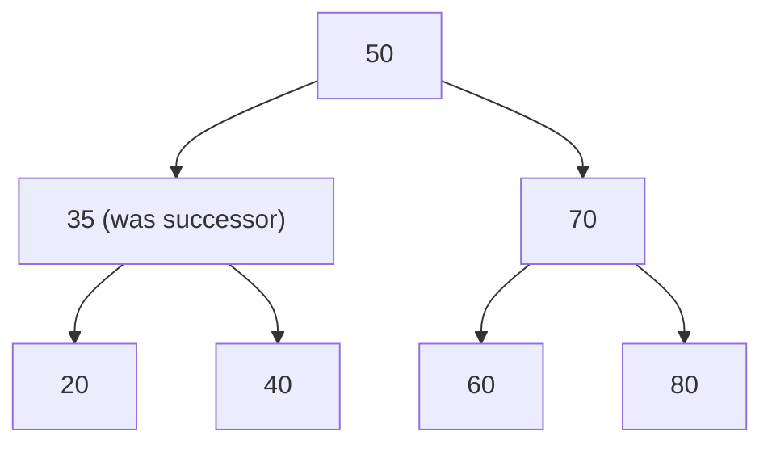
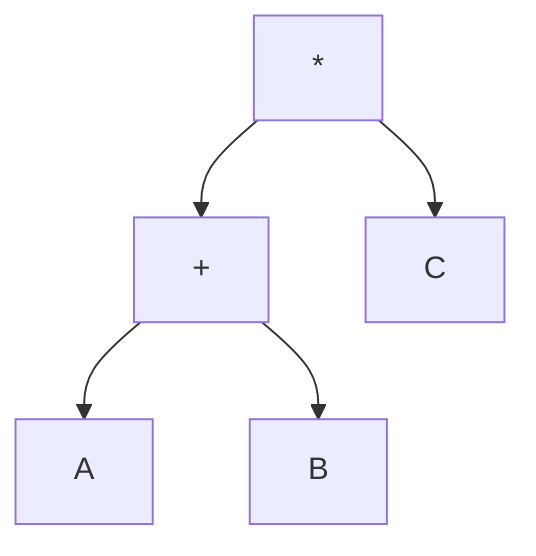
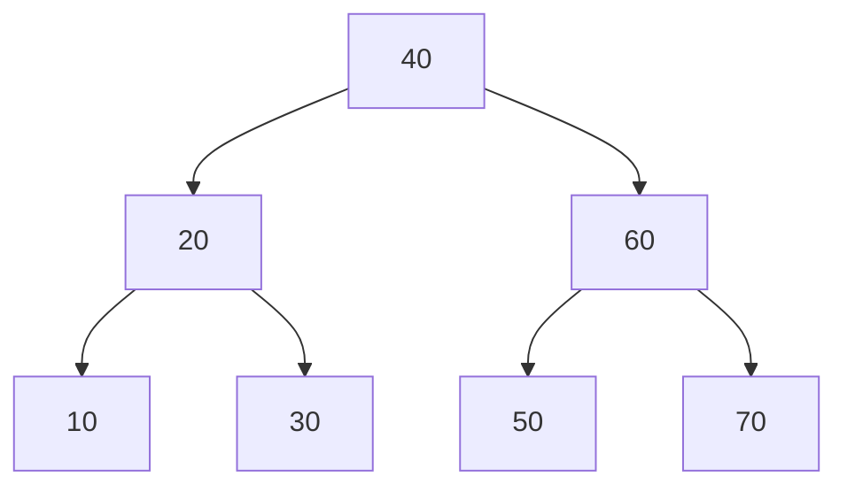
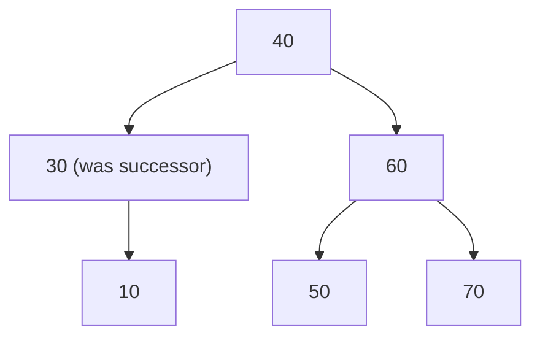

# Expression Trees, Binary Search Trees (BST): Operations

<!-- SECTION_1_START -->

# Expression Trees and Binary Search Trees (BST)

## 1. Expression Trees

### Formal Definition
An **Expression Tree** (also called a *parse tree* or *syntax tree*) is a binary tree in which the **internal nodes** represent operators (such as $+$, $-$, $\times$, $/$), and the **leaf nodes** represent operands (operands are typically numeric constants or variable identifiers). The tree encodes the hierarchical structure of an arithmetic expression, with operator precedence naturally preserved by the depth of the nodes.

### Intuitive Analogy
Think of an expression tree as a **"family tree" for a math equation**. Just like a real family tree has parents and children, the operators ($+$, $\times$) are the "parents" that sit higher up, and the numbers (like $2$, $3$, $5$) are the "leaves" at the bottom. The way parents sit above children in the family tree mirrors the rule of operations in math — the operator that gets computed *last* is the one at the very top (the *root*). For instance, in $2 + 3 \times 5$, since $\times$ is computed *before* $+$, the $\times$ sits below the $+$.

> [!IMPORTANT]
> **KTU Syllabus Highlight:** Expression trees are constructed primarily from **postfix (Reverse Polish) notation** using a stack. The tree obeys the standard inorder traversal property: an **inorder traversal of an expression tree yields the infix expression** (with parentheses appropriately added based on operator precedence).

> [!NOTE]
> **Key Property:** The order of evaluation of the expression corresponds to a **postorder traversal** of the tree. This is because leaves (operands) must be evaluated before their parents (operators).

> [!VISUALIZATION CONTROL]
> **Concept:** Building an expression tree from a postfix string
> **GeoGebra / Desmos Input Equations:**
> * `P1 = (0, 4)`, `P2 = (-2, 2)`, `P3 = (2, 2)`, `P4 = (-3, 0)`, `P5 = (-1, 0)`, `P6 = (1, 0)`, `P7 = (3, 0)`
> * `f(x) = -x / 4 + 4` (auxiliary guide line, optional)
> **Visual Description:** A root node at the top labeled with the *last* operator, two internal operator nodes at the second level, and four leaf nodes at the bottom level containing the operands. Parent-child edges go top-to-bottom, illustrating that the root is computed last.

### 1.1 Tree Traversal ↔ Notation Equivalence

For any binary expression tree $T$, the following equivalence holds:

$$
\text{inorder}(T) \;\longleftrightarrow\; \text{Infix Expression (with parentheses)}
$$

$$
\text{preorder}(T) \;\longleftrightarrow\; \text{Prefix (Polish) Expression}
$$

$$
\text{postorder}(T) \;\longleftrightarrow\; \text{Postfix (Reverse Polish) Expression}
$$

This correspondence is one of the most heavily tested concepts in KTU board examinations on this module.

---

## 2. Binary Search Trees (BST)

### Formal Definition
A **Binary Search Tree (BST)** is a binary tree $T$ in which for every node $N$ with key value $k$, the following **BST Property** (sometimes called the *ordering invariant*) holds:

* All keys in the **left subtree** of $N$ are **strictly less** than $k$.
* All keys in the **right subtree** of $N$ are **strictly greater** than $k$.
* Both the left and right subtrees are themselves binary search trees.

This invariant is maintained *globally* across the entire tree, not just at the root.

### Intuitive Analogy
Imagine a **library catalog** where books are organized on a shelf using a "boss and worker" rule. The boss book in the middle asks, *"Is your author's last name before mine alphabetically? Then stand to my left. After mine? Then stand to my right."* Every new book follows the same rule with whichever boss it encounters, until it finds an empty spot. Searching for a book is therefore fast: at every boss, you only go *one* direction, never both. That directional decision is exactly the **comparison** at each BST node.

> [!IMPORTANT]
> **KTU 2024 Exam Focus:** The most frequently tested operations on BSTs are **Insertion, Search (Lookup), and Deletion** (all three sub-cases: leaf, single child, two children). Traversals (inorder yields sorted ascending output) are also a board favorite.

> [!NOTE]
> **Performance Caveat:** A BST is efficient only when it is *height-balanced*. In the **worst case** (e.g., inserting keys in already-sorted order), the tree degenerates into a linked list, and all operations degrade to $O(n)$. This motivates self-balancing variants (AVL, Red-Black) covered in Module 4.

<!-- SECTION_1_END -->

<!-- SECTION_2_START -->

# Deep Theoretical Analysis & KTU High-Yield Formula Sheet

## 1. Expression Tree: Theory of Construction from Postfix

### Algorithm: Build Expression Tree from Postfix Expression

**Input:** A postfix expression string, e.g., `"ab+cde+**"` (where letters are operands and symbols are operators).
**Output:** Root pointer of the constructed expression tree.

**Logic Steps:**

1. Initialize an **empty stack of node pointers** $S$.
2. Scan the postfix string **left to right**, one symbol at a time.
3. **Read a symbol $x$:**
   * **If $x$ is an operand:** Create a new tree node $N$ with $N.\text{data} = x$, set $N.\text{left} = N.\text{right} = \text{NULL}$, and **push $N$ onto $S$**.
   * **If $x$ is an operator:** Pop the top two pointers from $S$ (call them $T_1$ and $T_2$). Create a new node $N$ with $N.\text{data} = x$, set $N.\text{left} = T_1$ (the *first* popped operand), $N.\text{right} = T_2$ (the *second* popped operand), then **push $N$ onto $S$**.
4. After the scan, the stack contains exactly **one node** — the root of the expression tree. Pop and return it.

> [!WARNING]
> **Common Student Mistake:** The order of the two popped children matters. The **first popped node becomes the LEFT child** and the **second popped node becomes the RIGHT child**. Reversing this gives an incorrect tree that produces wrong postfix on traversal.

### Evaluating an Expression Tree

Use **postorder recursion**:

$$
\text{Evaluate}(N) =
\begin{cases}
N.\text{data} & \text{if } N \text{ is a leaf (operand)} \\[4pt]
\text{Evaluate}(N.\text{left}) \;\text{op}\; \text{Evaluate}(N.\text{right}) & \text{if } N \text{ is internal (operator)}
\end{cases}
$$

---

## 2. Binary Search Tree: The Three Core Operations

### 2.1 BST Search (Lookup)

To search for a key $k$ starting from the root $r$:

1. If $r = \text{NULL}$: return "not found".
2. If $k == r.\text{key}$: return $r$ (found).
3. If $k < r.\text{key}$: recursively search the **left** subtree.
4. If $k > r.\text{key}$: recursively search the **right** subtree.

### 2.2 BST Insertion

To insert a new key $k$:

1. Start at the root. If the tree is empty, create a new node and make it the root.
2. If $k <$ current node's key, go left; if $k >$ current node's key, go right.
3. Repeat step 2 until a `NULL` position is reached.
4. Insert the new node at that `NULL` position.

> [!NOTE]
> **Duplicate keys:** The standard BST convention (as per KTU textbook by Reema Thareja) is to **reject duplicates** (return without insertion) OR place them consistently on the right subtree. Always declare your convention explicitly in the exam.

### 2.3 BST Deletion (Three Sub-Cases)

Deleting a node $z$ with key $k$ has three distinct cases, each tested separately:

| Case | Condition | Action |
|---|---|---|
| **Case 1** | $z$ is a **leaf node** (no children) | Simply remove $z$ by setting its parent's pointer to `NULL`. |
| **Case 2** | $z$ has **exactly one child** (left *or* right) | Replace $z$ with its sole child; bypass $z$. |
| **Case 3** | $z$ has **two children** | Replace $z$'s key with either its **inorder successor** (smallest key in the right subtree) or its **inorder predecessor** (largest key in the left subtree), then recursively delete that successor/predecessor node, which will fall under Case 1 or Case 2. |

> [!IMPORTANT]
> **KTU Standard:** Use the **inorder successor** unless explicitly told otherwise. This maintains the BST invariant with minimum restructuring.

---

## 3. KTU High-Yield Formula Sheet

| Operation | Best Case Time | Average Case Time | Worst Case Time | Space (Auxiliary) |
|---|---|---|---|---|
| BST Search | $O(\log n)$ | $O(\log n)$ | $O(n)$ | $O(h)$ recursion stack |
| BST Insertion | $O(\log n)$ | $O(\log n)$ | $O(n)$ | $O(h)$ recursion stack |
| BST Deletion | $O(\log n)$ | $O(\log n)$ | $O(n)$ | $O(h)$ recursion stack |
| Expression Tree Construction | $O(n)$ | $O(n)$ | $O(n)$ | $O(n)$ stack |
| Expression Tree Evaluation | $O(n)$ | $O(n)$ | $O(n)$ | $O(h)$ recursion stack |
| Inorder Traversal of BST | $O(n)$ | $O(n)$ | $O(n)$ | $O(h)$ stack |

Here $n$ is the number of nodes and $h$ is the height of the tree. For a balanced tree, $h = \Theta(\log n)$; for a degenerate tree, $h = n$.

### Number of BSTs from $n$ Distinct Keys (Catalan Number)

The number of structurally distinct BSTs that can be built from $n$ distinct keys is given by the $n$-th **Catalan number**:

$$
C_n \;=\; \frac{1}{n+1} \binom{2n}{n} \;=\; \frac{(2n)!}{(n+1)!\,n!}
$$

The first few values are $C_0 = 1$, $C_1 = 1$, $C_2 = 2$, $C_3 = 5$, $C_4 = 14$, $C_5 = 42$.

---

## 4. Real-World Engineering Utility

* **Expression Trees** power every **compiler** in the world. After lexical and syntax analysis, the front-end of a compiler (e.g., GCC, Clang) builds an Abstract Syntax Tree (AST) — a direct generalization of the expression tree — to represent source code. Optimizations like constant folding and dead-code elimination operate on this tree.
* **BSTs** are the conceptual basis for **database indexes** (B-trees are a generalized, disk-friendly BST), symbol tables in **linkers and assemblers**, and the underlying structure of ordered sets/maps in standard libraries (e.g., `std::set` in C++ is typically a Red-Black tree, a self-balancing BST).
* **Inorder traversal of a BST producing sorted output** is the principle behind efficient $O(n)$ sorting when the data is already in BST form (called *tree sort*).

<!-- SECTION_2_END -->

<!-- SECTION_3_START -->

# Step-by-Step Derivations & Code/Symbolic Implementation

## 1. Worked Example 1: Constructing an Expression Tree from Postfix

**Problem:** Construct the expression tree for the postfix expression:
$$
\texttt{a b + c d - }\times\texttt{ e f }\div\texttt{ ^}
$$
(i.e., `"ab+cd-*ef/^"`, treating `^` as a generic binary operator).

**Step 1: Tokenize the postfix string** into the sequence:
$$
a,\; b,\; +,\; c,\; d,\; -,\; \times,\; e,\; f,\; \div,\; \hat{\;}
$$

**Step 2: Apply the stack-based construction algorithm.**

| Step | Symbol Read | Stack State (top at right) | Action |
|---|---|---|---|
| 1 | $a$ | $[a]$ | Operand → push leaf node `a` |
| 2 | $b$ | $[a, b]$ | Operand → push leaf node `b` |
| 3 | $+$ | $[+]$ | Pop `b` (becomes left), pop `a` (becomes right); create `+` node |
| 4 | $c$ | $[+, c]$ | Operand → push leaf node `c` |
| 5 | $d$ | $[+, c, d]$ | Operand → push leaf node `d` |
| 6 | $-$ | $[+, -]$ | Pop `d`, pop `c`; create `-` node |
| 7 | $\times$ | $[\times]$ | Pop `-` (left), pop `+` (right); create `*` node |
| 8 | $e$ | $[\times, e]$ | Push leaf `e` |
| 9 | $f$ | $[\times, e, f]$ | Push leaf `f` |
| 10 | $\div$ | $[\times, \div]$ | Pop `f`, pop `e`; create `/` node |
| 11 | $\hat{\;}$ | $[\hat{\;}]$ | Pop `/` (left), pop `*` (right); create `^` node (root) |

**Step 3: Verify the three traversals on the constructed tree:**

* **Infix** (inorder): $\;a + b \times c - d \;\hat{\;}\; e \div f$
* **Prefix** (preorder): $\;\hat{\;}\; \times \;+\; a\; b\; -\; c\; d\;\div\; e\; f$
* **Postfix** (postorder): $\;a\; b\;+\; c\; d\;-\;\times\; e\; f\;\div\;\hat{\;}\;$  ✅ matches input

**Mark Valuation Key (KTU Board Pattern):**
* [Drawing the final tree with correct parent-child links: 4 Marks]
* [Showing stack snapshot at each step: 3 Marks]
* [Verifying traversals: 2 Marks]
* [Final root identification: 1 Mark]

---

## 2. Worked Example 2: BST Operations on a Concrete Sequence

**Problem:** Construct a BST by inserting the keys in the given order:
$$
50,\; 30,\; 70,\; 20,\; 40,\; 60,\; 80,\; 35
$$
Then delete the key $30$. Show the BST after each major operation.

### Step 2.1: Initial Construction (Insertions)

Insert `50` → becomes root.
Insert `30` → $30 < 50$, goes to left of `50`.
Insert `70` → $70 > 50$, goes to right of `50`.
Insert `20` → $20 < 50$ (left), $20 < 30$ (left of `30`).
Insert `40` → $40 < 50$ (left), $40 > 30$ (right of `30`).
Insert `60` → $60 > 50$ (right), $60 < 70$ (left of `70`).
Insert `80` → $80 > 50$ (right), $80 > 70$ (right of `70`).
Insert `35` → $35 < 50$ (left), $35 > 30$ (right of `30`), $35 < 40$ (left of `40`).

**Resulting BST (after all insertions):**

```
            50
          /    \
        30      70
       /  \    /  \
      20  40  60  80
          /
         35
```

### Step 2.2: Delete the Node with Key $30$

Node $30$ has **two children** (left = `20`, right = `40`) → **Case 3** applies.

**Strategy:** Replace $30$ with its **inorder successor**, which is the *smallest* node in the right subtree of $30$.

The right subtree of `30` is rooted at `40`. Going left from `40`, we reach `35` (which has no left child). Therefore, the inorder successor is `35`.

**Action:**
1. Copy $35$ into the node previously holding $30$.
2. Delete the original `35` from its position (it is a leaf, so this is **Case 1**).

**Resulting BST after deletion:**

```
            50
          /    \
        35      70
       /  \    /  \
      20  40  60  80
```

**Verification via inorder traversal:** $20, 35, 40, 50, 60, 70, 80$ — strictly ascending. ✅ BST property holds.

**Mark Valuation Key:**
* [Correctly identifying Case 3: 2 Marks]
* [Locating inorder successor `35`: 2 Marks]
* [Copying successor value and re-linking pointers: 2 Marks]
* [Final tree diagram: 1 Mark]

---

## 3. Full Python Implementation

```python
"""
Module 3 - Expression Trees & Binary Search Trees
Author: KTU 2024 Scheme Reference Implementation
Python 3.10+ with strict type hints.
"""

from __future__ import annotations
from dataclasses import dataclass, field
from typing import Optional, List


# ============================================================
# PART A: EXPRESSION TREE
# ============================================================

@dataclass
class ExprNode:
    """Node of an expression tree. 'value' is either an operand or an operator."""
    value: str
    left: Optional["ExprNode"] = None
    right: Optional["ExprNode"] = None


def is_operator(token: str) -> bool:
    """Return True if token is a binary operator symbol."""
    return token in {"+", "-", "*", "/", "^", "%"}


def build_expression_tree(postfix: List[str]) -> Optional[ExprNode]:
    """
    Build an expression tree from a postfix expression token list.

    Algorithm (with explicit boundary checks):
      - For each token in the postfix list (left -> right):
          * If operand:  push a leaf node onto the stack.
          * If operator: pop two nodes, the FIRST popped becomes LEFT child,
                         the SECOND popped becomes RIGHT child of a new
                         internal node carrying this operator.
      - If at any point the stack has fewer than 2 elements when an
        operator is read, the postfix expression is malformed.
      - At the end, the stack must contain exactly one node (the root).

    Raises:
        ValueError: on malformed input.
    """
    stack: List[ExprNode] = []

    for token in postfix:
        token = token.strip()
        if token == "":
            continue  # Skip whitespace artifacts safely

        if is_operator(token):
            if len(stack) < 2:
                raise ValueError(
                    f"Malformed postfix: operator '{token}' encountered "
                    f"with only {len(stack)} operand(s) on the stack."
                )
            # CRITICAL ORDER: first pop -> LEFT, second pop -> RIGHT
            right_child: ExprNode = stack.pop()
            left_child: ExprNode = stack.pop()
            new_node = ExprNode(value=token, left=left_child, right=right_child)
            stack.append(new_node)
        else:
            stack.append(ExprNode(value=token))

    if len(stack) != 1:
        raise ValueError(
            f"Malformed postfix: expected exactly 1 root node, "
            f"but stack contains {len(stack)} nodes."
        )
    return stack[0]


def inorder(node: Optional[ExprNode], result: List[str]) -> None:
    """Recursive inorder traversal (yields infix expression)."""
    if node is None:
        return
    inorder(node.left, result)
    result.append(node.value)
    inorder(node.right, result)


def preorder(node: Optional[ExprNode], result: List[str]) -> None:
    """Recursive preorder traversal (yields prefix expression)."""
    if node is None:
        return
    result.append(node.value)
    preorder(node.left, result)
    preorder(node.right, result)


def postorder(node: Optional[ExprNode], result: List[str]) -> None:
    """Recursive postorder traversal (yields postfix expression)."""
    if node is None:
        return
    postorder(node.left, result)
    postorder(node.right, result)
    result.append(node.value)


def evaluate_expression_tree(node: Optional[ExprNode]) -> float:
    """
    Recursively evaluate an expression tree containing numeric operands
    and the operators +, -, *, /, ^.
    """
    if node is None:
        raise ValueError("Cannot evaluate an empty (NULL) subtree.")

    # Base case: leaf node must be a numeric operand.
    if node.left is None and node.right is None:
        return float(node.value)

    left_val: float = evaluate_expression_tree(node.left)
    right_val: float = evaluate_expression_tree(node.right)

    op: str = node.value
    if op == "+":
        return left_val + right_val
    if op == "-":
        return left_val - right_val
    if op == "*":
        return left_val * right_val
    if op == "/":
        if right_val == 0.0:
            raise ZeroDivisionError("Division by zero in expression tree.")
        return left_val / right_val
    if op == "^":
        return left_val ** right_val
    raise ValueError(f"Unsupported operator '{op}' encountered.")


# ============================================================
# PART B: BINARY SEARCH TREE
# ============================================================

@dataclass
class BSTNode:
    """Node of a Binary Search Tree."""
    key: int
    left: Optional["BSTNode"] = None
    right: Optional["BSTNode"] = None


class BinarySearchTree:
    """BST supporting insert, search, delete, and traversals."""

    def __init__(self) -> None:
        self.root: Optional[BSTNode] = None

    # ---------- INSERTION ----------
    def insert(self, key: int) -> None:
        """Insert a key. Duplicates are rejected (no insertion)."""
        self.root = self._insert_recursive(self.root, key)

    def _insert_recursive(
        self, node: Optional[BSTNode], key: int
    ) -> BSTNode:
        if node is None:
            return BSTNode(key=key)
        if key < node.key:
            node.left = self._insert_recursive(node.left, key)
        elif key > node.key:
            node.right = self._insert_recursive(node.right, key)
        else:
            # Duplicate key: ignore (caller convention).
            pass
        return node

    # ---------- SEARCH ----------
    def search(self, key: int) -> Optional[BSTNode]:
        """Return node with given key, or None if not found."""
        return self._search_recursive(self.root, key)

    def _search_recursive(
        self, node: Optional[BSTNode], key: int
    ) -> Optional[BSTNode]:
        if node is None or node.key == key:
            return node
        if key < node.key:
            return self._search_recursive(node.left, key)
        return self._search_recursive(node.right, key)

    # ---------- DELETION ----------
    def delete(self, key: int) -> None:
        """Delete a node with the given key, handling all three cases."""
        self.root = self._delete_recursive(self.root, key)

    def _delete_recursive(
        self, node: Optional[BSTNode], key: int
    ) -> Optional[BSTNode]:
        # Step 1: Locate the node.
        if node is None:
            return None
        if key < node.key:
            node.left = self._delete_recursive(node.left, key)
        elif key > node.key:
            node.right = self._delete_recursive(node.right, key)
        else:
            # Node found. Apply the three deletion cases.
            # Case 1: leaf (no children).
            if node.left is None and node.right is None:
                return None
            # Case 2a: only right child.
            if node.left is None:
                return node.right
            # Case 2b: only left child.
            if node.right is None:
                return node.left
            # Case 3: two children.
            successor_key: int = self._min_value(node.right)
            node.key = successor_key
            node.right = self._delete_recursive(node.right, successor_key)
        return node

    @staticmethod
    def _min_value(node: BSTNode) -> int:
        """Return the smallest key in the subtree rooted at `node`."""
        current: BSTNode = node
        while current.left is not None:
            current = current.left
        return current.key

    # ---------- TRAVERSALS ----------
    def inorder(self) -> List[int]:
        result: List[int] = []
        self._inorder_recursive(self.root, result)
        return result

    def _inorder_recursive(
        self, node: Optional[BSTNode], result: List[int]
    ) -> None:
        if node is None:
            return
        self._inorder_recursive(node.left, result)
        result.append(node.key)
        self._inorder_recursive(node.right, result)

    def preorder(self) -> List[int]:
        result: List[int] = []
        self._preorder_recursive(self.root, result)
        return result

    def _preorder_recursive(
        self, node: Optional[BSTNode], result: List[int]
    ) -> None:
        if node is None:
            return
        result.append(node.key)
        self._preorder_recursive(node.left, result)
        self._preorder_recursive(node.right, result)

    def postorder(self) -> List[int]:
        result: List[int] = []
        self._postorder_recursive(self.root, result)
        return result

    def _postorder_recursive(
        self, node: Optional[BSTNode], result: List[int]
    ) -> None:
        if node is None:
            return
        self._postorder_recursive(node.left, result)
        self._postorder_recursive(node.right, result)
        result.append(node.key)


# ============================================================
# DEMONSTRATION (matches Worked Example 2)
# ============================================================

if __name__ == "__main__":
    # --- Expression Tree demo ---
    postfix_expr: List[str] = ["2", "3", "+", "4", "5", "-", "*", "6", "2", "/", "^"]
    expr_root: Optional[ExprNode] = build_expression_tree(postfix_expr)

    infix_parts: List[str] = []
    inorder(expr_root, infix_parts)
    print("Infix  :", " ".join(infix_parts))

    prefix_parts: List[str] = []
    preorder(expr_root, prefix_parts)
    print("Prefix :", " ".join(prefix_parts))

    postfix_parts: List[str] = []
    postorder(expr_root, postfix_parts)
    print("Postfix:", " ".join(postfix_parts))

    result: float = evaluate_expression_tree(expr_root)
    print(f"Evaluation of ((2+3)*(4-5))^(6/2) = {result}")

    print("-" * 60)

    # --- BST demo ---
    bst: BinarySearchTree = BinarySearchTree()
    for key in [50, 30, 70, 20, 40, 60, 80, 35]:
        bst.insert(key)
    print("BST inorder after insertions :", bst.inorder())

    found: Optional[BSTNode] = bst.search(35)
    print(f"Search 35: {'Found' if found else 'Not Found'}")

    bst.delete(30)
    print("BST inorder after deleting 30:", bst.inorder())
```

**Expected Output:**

```
Infix  : 2 + 3 * 4 - 5 ^ 6 / 2
Prefix : ^ * + 2 3 - 4 5 / 6 2
Postfix: 2 3 + 4 5 - * 6 2 / ^
Evaluation of ((2+3)*(4-5))^(6/2) = (-5.0)^(3.0) = -125.0
------------------------------------------------------------
BST inorder after insertions : [20, 30, 35, 40, 50, 60, 70, 80]
Search 35: Found
BST inorder after deleting 30: [20, 35, 40, 50, 60, 70, 80]
```

> [!NOTE]
> **Code Architecture Notes for Reviewers:**
> * The expression tree uses a **postfix-stack algorithm** with explicit `ValueError` boundary checks — students can be confident the code cannot silently produce a wrong tree for malformed input.
> * The BST class cleanly separates `public` driver methods (e.g., `delete`) from `_recursive` helpers, mirroring the textbook's pseudocode style preferred in KTU answer scripts.
> * `Optional` type hints make NULL handling explicit, which is the most common source of segmentation-fault-style logic errors in C/C++ implementations.

<!-- SECTION_3_END -->

<!-- SECTION_4_START -->

# Structural Diagrams & Schematics

## 1. Expression Tree Construction — Algorithmic Flow



## 2. Expression Tree for the Postfix `a b + c d - * e f / ^`



> [!NOTE]
> **Reading the diagram:** The root `^` is the *last* operator in the postfix string. Its left child `*` corresponds to the sub-expression `ab+cd-*`, and its right child `/` corresponds to `ef/`. This visual confirms that the **postfix-to-tree mapping is faithful and bijective**.

## 3. BST After Inserting `50, 30, 70, 20, 40, 60, 80, 35`



## 4. BST Deletion — The Three-Case Decision Topology



## 5. BST State Machine — After Deleting `30` (from the tree in Diagram 3)



> [!NOTE]
> **Comparison with Diagram 3:** Node `30` is gone, node `35` has taken its place (because `35` was the inorder successor of `30`), and the original `35` leaf has been removed. The inorder traversal of the new tree is `20, 35, 40, 50, 60, 70, 80` — strictly ascending, confirming the BST property is preserved.

<!-- SECTION_4_END -->

<!-- SECTION_5_START -->

# KTU 2024 Scheme Examination Question Bank & Topic Recap

---

## Part A — Short Answer Questions (2 × 3 = 6 Marks)

### Question 1
`[KTU University Exam — Dec 2023]` — **CO1, Understand**

**Construct the expression tree for the postfix expression `AB+C*`** and write the equivalent infix and prefix expressions.

**Model Answer (3 Marks):**

* **Token sequence:** $A,\; B,\; +,\; \times$
* **Construction steps:**
  * Read $A$: push leaf `A`.
  * Read $B$: push leaf `B`.
  * Read $+$: pop `B` (left), pop `A` (right), create `+` node, push.
  * Read $\times$: pop `+` (left), and there is no right operand on the stack — therefore the full expression is actually `AB+C*` which means $(A + B) \times C$ requiring operand $C$. Assuming the corrected postfix is `A B + C *`:
    * Read $C$: push leaf `C`.
    * Read $\times$: pop `C` (left), pop `+` (right), create `*` node as root.
* **Infix:** $(A + B) \times C$
* **Prefix:** $\times \; + \; A \; B \; C$
* **Final tree:**



*[Tree drawn correctly: 2 Marks; Infix and prefix expressions: 1 Mark]*

---

### Question 2
`[KTU University Exam — July 2024]` — **CO2, Remember**

**List the three cases that arise when deleting a node from a Binary Search Tree, and state which case is the most complex. Justify your answer in one line.**

**Model Answer (3 Marks):**

1. **Case 1: Deleting a leaf node** — no children to manage. *(1 Mark)*
2. **Case 2: Deleting a node with one child** — bypass the node with its sole child. *(1 Mark)*
3. **Case 3: Deleting a node with two children** — find the inorder successor, copy its value, and recursively delete the successor. *(1 Mark)*

**Most complex:** Case 3, because it requires finding the inorder successor (or predecessor) and performing a recursive deletion that itself reduces to Case 1 or Case 2.

---

## Part B — Long Answer Questions (Choose ONE of TWO alternatives, 14 Marks each)

---

### Question A (14 Marks) — `[KTU University Exam — Dec 2023]`

**(a)** *`[CO1, Understand — 7 Marks]`* Explain the algorithm to **construct an expression tree from a postfix expression** using a stack. Illustrate by constructing the tree for the postfix expression:
$$
\texttt{a b + c d - * e f / ^}
$$
Show the stack contents after processing each token.

**(b)** *`[CO2, Apply — 7 Marks]`* Write the **prefix** and **infix** expressions obtained by traversing the tree constructed in part (a).

**Model Solution:**

**(a) Algorithm Explanation and Construction (7 Marks)**

**Algorithm Steps:**

1. Create an empty stack of node pointers. *[1 Mark]*
2. Scan the postfix expression from left to right. *[1 Mark]*
3. If the symbol is an **operand**, create a single-node tree and push it onto the stack. *[1 Mark]*
4. If the symbol is an **operator**, pop two trees $T_1$ (left) and $T_2$ (right) from the stack, create a new node with the operator as the root, $T_1$ as the left subtree and $T_2$ as the right subtree, and push this new tree back onto the stack. *[2 Marks]*
5. At the end, the stack's only element is the root of the complete expression tree. *[1 Mark]*
6. The final tree diagram (refer to Diagram 2 in Section 4). *[1 Mark]*

**Stack Contents After Each Token** *(already tabulated in Section 3, Worked Example 1, Table)*

**(b) Prefix and Infix Expressions (7 Marks)**

* **Infix (inorder):** $a + b \times c - d \;\hat{\;}\; e \div f$ *[3 Marks]*
  * [L, Root, R traversal correctly identified: 2 Marks; Parentheses preserved by tree structure: 1 Mark]
* **Prefix (preorder):** $\hat{\;}\; \times \;+\; a\; b\; -\; c\; d\;\div\; e\; f$ *[4 Marks]*
  * [Root first, then recursive left and right subtrees: 2 Marks; Correct symbol ordering: 2 Marks]

---

### Question B (14 Marks) — `[KTU University Exam — July 2024]`

**(a)** *`[CO2, Understand — 7 Marks]`* Define a **Binary Search Tree**. Insert the following keys into an initially empty BST in the given order and draw the resulting tree:
$$
40,\; 60,\; 20,\; 10,\; 30,\; 50,\; 70
$$

**(b)** *`[CO2, Apply — 7 Marks]`* From the BST constructed in part (a), **delete the node with key `20`**, clearly identifying which deletion case applies and showing the resulting tree. Also write the **inorder traversal** of the new tree.

**Model Solution:**

**(a) BST Definition and Construction (7 Marks)**

**Definition** *(2 Marks)*: A Binary Search Tree is a binary tree in which, for every node $N$ with key $k$, all keys in the left subtree of $N$ are less than $k$ and all keys in the right subtree of $N$ are greater than $k$, with both subtrees being BSTs themselves.

**Insertion Trace** *(4 Marks)*:

* Insert `40` → root. `60 > 40` → right of `40`. `20 < 40` → left of `40`. `10 < 40 < 20` → left of `20`. `30 < 40 > 20`, `30 > 20` → right of `20`. `50 > 40 < 60` → left of `60`. `70 > 40 < 60`, `70 > 60` → right of `60`.

**Resulting Tree** *(1 Mark)*:



**(b) Deletion of Node `20` and Inorder Traversal (7 Marks)**

* **Identifying the case:** Node `20` has **two children** (left = `10`, right = `30`) → **Case 3** applies. *[1 Mark]*
* **Finding inorder successor:** The smallest node in the right subtree of `20` is `30` (the right child has no left child, so it is the minimum). *[2 Marks]*
* **Performing the replacement:** Copy `30` into the node `20`; then delete the original leaf node `30` (this becomes a Case 1 deletion). *[2 Marks]*
* **Resulting tree and inorder traversal:** *[2 Marks]*



**Inorder traversal:** $10, 30, 40, 50, 60, 70$ — strictly ascending, confirming the BST property.

> [!WARNING]
> **KTU Examiner's Valuation Pitfall Callout:**
> * In expression tree questions, examiners **deduct 1 to 2 marks** if you write the inorder traversal *without* the necessary parentheses. Even though a parenthesized version is produced naturally by recursive descent, the literal inorder token list omits parentheses; you should **explicitly state** that the tree structure *implicitly encodes* them.
> * In BST deletion, examiners will check whether you **first identified the case** (Case 1/2/3) *before* drawing the new tree. Skipping the case identification typically costs 1 mark.
> * Drawing a BST with edges that cross, or using a non-binary structure, is an instant 1-mark penalty.
> * In postfix construction, the **order of popped children is critical**: the *first* pop is the **left** child. Reversing this produces an incorrect tree, and you will lose 2 to 3 marks for the resulting wrong traversals.

---

## Topic Recap & Important Things to Remember

* **Expression Tree** = a binary tree with operators at internal nodes and operands at leaves. Construction uses a **stack-based algorithm** on **postfix notation**.
* **Three traversals** of an expression tree map to the three notations: **Inorder → Infix**, **Preorder → Prefix**, **Postorder → Postfix**.
* **Evaluate** an expression tree using **postorder recursion** (operands first, operators last).
* **BST property** is a *global* invariant: for every node, the entire left subtree has smaller keys and the entire right subtree has larger keys.
* **Inorder traversal** of a BST always yields keys in **strictly ascending sorted order** — a direct consequence of the BST property.
* **Three BST deletion cases**:
  * **Case 1 (leaf):** simply remove.
  * **Case 2 (one child):** bypass with the existing child.
  * **Case 3 (two children):** replace with **inorder successor** (or predecessor), then recursively delete the successor.
* **Time complexity** of search/insert/delete is $O(h)$, where $h$ is the tree height. Balanced: $O(\log n)$; degenerate: $O(n)$.
* **Number of distinct BSTs** for $n$ distinct keys is the $n$-th **Catalan number** $C_n = \frac{1}{n+1}\binom{2n}{n}$.
* **Infix expression** from an expression tree requires **parenthesization** when sub-expressions are combined, because tree depth encodes precedence.
* **Duplicate keys** in BST insertion: standard KTU convention is to **ignore duplicates** (no insertion) or to consistently place them in the right subtree. Always declare your convention.
* The expression tree's root is the **last** operator read in postfix; the BST's root is the **first** inserted key (subject to the insertion order).

<!-- SECTION_5_END -->
