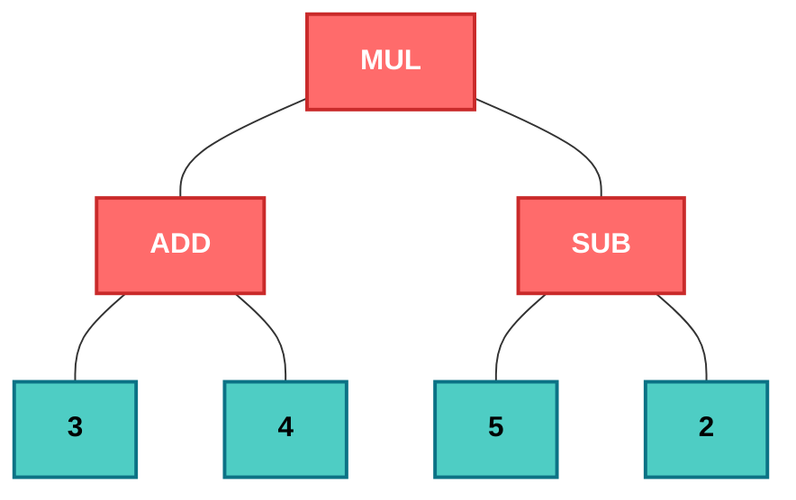
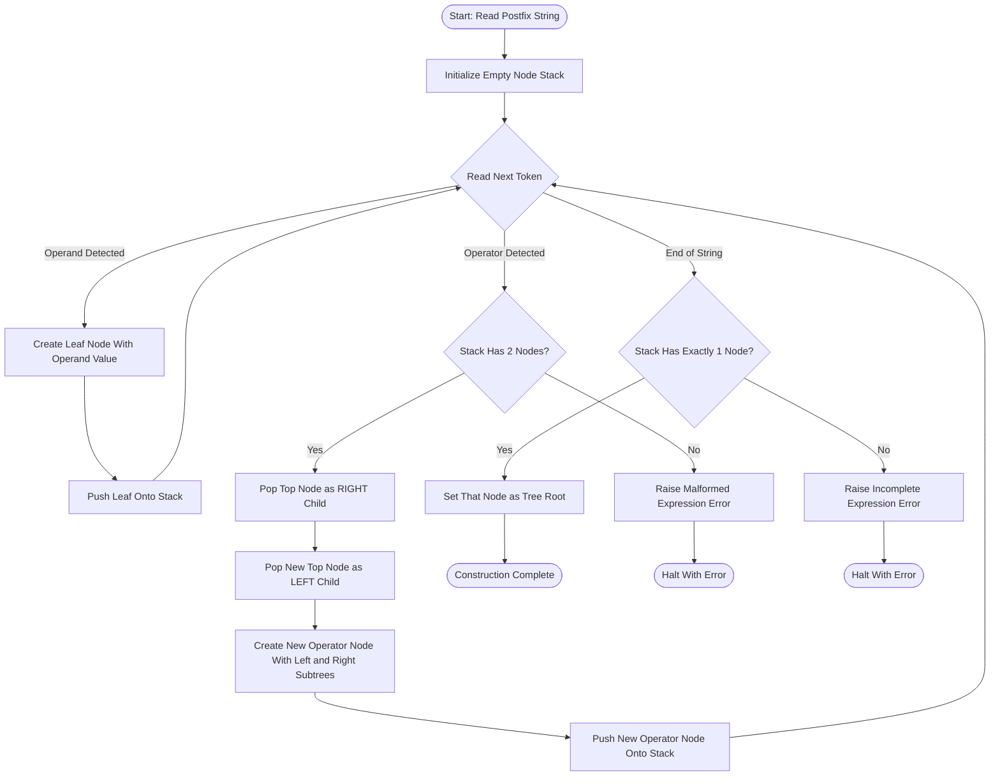
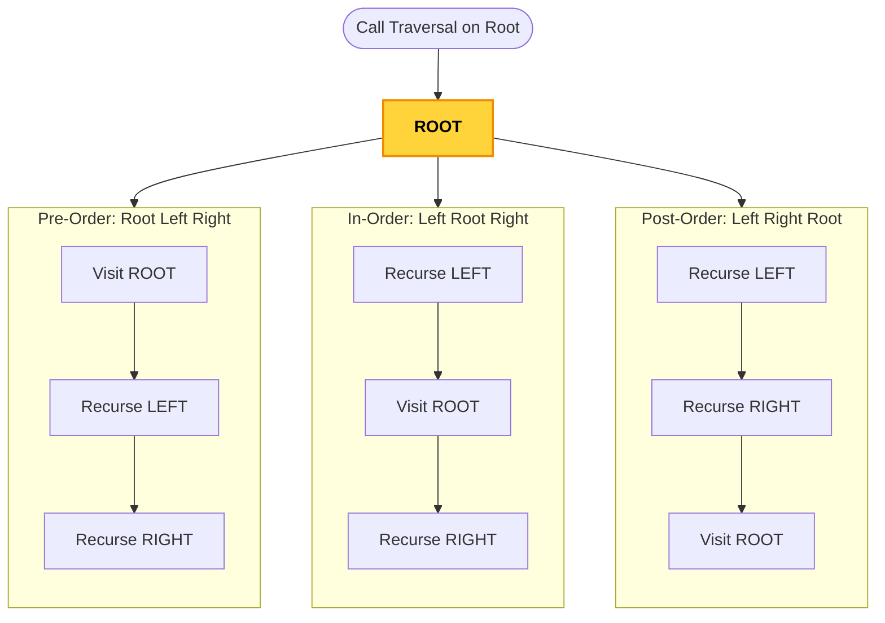
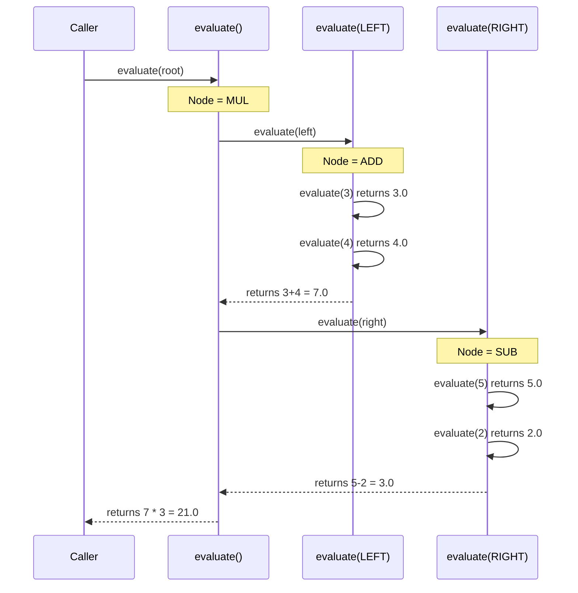

# Expression Trees

<!-- SECTION_1_START -->
# 1. Core Technical Definition & Intuitive Overview

## Formal Definition (KTU 2024 Syllabus Terminology)

An **Expression Tree** (also called a **Parse Tree** or **Syntax Tree**) is a specialized binary tree data structure in which **internal nodes** represent the **operators** of an arithmetic or logical expression, while the **leaf nodes** represent the **operands** (constants or variables). The structure preserves the inherent **operator precedence** and **associativity rules** of the expression through its hierarchical arrangement.

Formally, an expression tree $T$ for an expression $E$ is a binary tree such that:

- If $E$ is a constant or variable, then $T$ is a single leaf node containing $E$.
- If $E = E_1 \text{ op } E_2$ where $\text{op}$ is a binary operator, then $T$ has an internal node containing $\text{op}$ as the root, with the left subtree being the expression tree for $E_1$ and the right subtree being the expression tree for $E_2$.

> [!IMPORTANT]
> **KTU 2024 Highlight:** Expression trees are a direct application of the binary tree ADT and are extensively tested in problems involving **infix-to-postfix/prefix conversions**, **expression evaluation**, and **compiler design** modules.

> [!NOTE]
> **Core Property:** The **in-order traversal** of an expression tree yields the **infix expression** (with appropriate parenthesization), the **pre-order traversal** yields the **prefix (Polish) notation**, and the **post-order traversal** yields the **postfix (Reverse Polish) notation**.

## Conceptual Analogy / Intuition

Think of an expression tree like a **corporate organizational chart** for a math equation:

- Imagine you are the **CEO (root node)** of a company. Your job is to combine the profits of two departments. You are a "+" operator.
- Your **left-hand subordinate (left child)** is the Marketing department, and your **right-hand subordinate (right child)** is the Sales department.
- These subordinates might themselves be **managers (operators like × or −)** who combine smaller teams (sub-expressions).
- At the very bottom, you have the **individual employees (leaf nodes)** who are the actual numbers or variables — they do all the real "work" and cannot be broken down further.

When the CEO needs a final report, they ask the left department first, then the right department, and finally combine both. This bottom-up computation is exactly what a **post-order traversal evaluation** does. Conversely, if the CEO gives instructions top-down, it mimics the **pre-order traversal** of a prefix expression.

> [!TIP]
> **Key Intuition:** The tree's **height** roughly corresponds to the **complexity** (or operator precedence nesting) of the expression. An expression like $a + b$ is shallow (height 1), whereas $((a+b) \cdot c) - (d/e)$ is deeper.

## Standard Metrics & Constants

- **Node count** for an expression with $n$ operands: exactly $n$ leaf nodes and $n-1$ internal nodes, totaling $2n-1$ nodes.
- **Strictly binary property:** Every internal node has **exactly two children** in a standard binary expression tree.
- **Time complexity** for construction from postfix: $\mathcal{O}(n)$ using a stack.
- **Space complexity:** $\mathcal{O}(n)$ for the stack + $\mathcal{O}(n)$ for the tree.

> [!VISUALIZATION CONTROL]
> **Concept:** Binary Expression Tree for $(3 + 4) \times (5 - 2)$
> **GeoGebra / Desmos Input Equations:**
> - Level 2 (root): Operator at coordinate $(0, 2)$ — label `*`
> - Level 1 (internal): Left node at $(-2, 1)$ — label `+`; Right node at $(2, 1)$ — label `-`
> - Level 0 (leaves): Nodes at $(-3, 0)$, $(-1, 0)$, $(1, 0)$, $(3, 0)$ — labels `3`, `4`, `5`, `2`
> - Edges: Connect each parent to its two children with straight line segments.
> **Visual Description:** You should observe a perfectly symmetric binary tree. The root `*` sits at the top, branching down to `+` and `-`, which further branch down to four numeric leaves. Notice that the tree's mirror symmetry reflects the balanced parenthesization of the original expression.

<!-- SECTION_1_END -->

<!-- SECTION_2_START -->
# 2. Deep Theoretical Analysis & KTU High-Yield Formula Sheet

## Operational Breakdown — How Expression Trees Work

### Step 1: Identifying Node Roles
Every expression tree has a strict **two-type node architecture**:
- **Leaf nodes** (degree 0): Hold operands — numbers, variables, or constants.
- **Internal nodes** (degree 2): Hold binary operators — `+`, `-`, `*`, `/`, `%`, `^`, etc.

### Step 2: Why the Tree Encodes Precedence Naturally
The **Why:** Traditional linear notations (infix) require external rules (BODMAS/PEMDAS) and parentheses to disambiguate evaluation order. The tree encodes this precedence **implicitly through depth**:
- A deeply nested operator in the source expression becomes a node close to the leaves.
- An operator applied to the entire result (lowest precedence) becomes the **root**.
- This removes ALL ambiguity — a tree can only be evaluated in one valid way.

### Step 3: The Three Traversal ↔ Notation Equivalence

The same expression tree produces three different notations depending on **when** you visit the root relative to its subtrees:

| Traversal Order | Visit Sequence | Resulting Notation | Use Case |
| :--- | :--- | :--- | :--- |
| **Pre-order** (Root → Left → Right) | Operator first | **Prefix (Polish)** | Functional programming, LISP |
| **In-order** (Left → Root → Right) | Operator in middle | **Infix** (needs parentheses) | Human-readable math |
| **Post-order** (Left → Right → Root) | Operator last | **Postfix (Reverse Polish)** | Stack-based evaluation, compilers |

### Step 4: Construction from Postfix Expression (The Classic KTU Problem)

The **How:** Use a **stack of node pointers**. Scan the postfix expression token by token:
1. **If the token is an operand:** Create a single-node tree and push it onto the stack.
2. **If the token is an operator:** Pop the top node as the **right child**, pop the next node as the **left child**, create a new tree with the operator as root (left subtree = left child, right subtree = right child), and push this new tree back onto the stack.
3. At the end, the stack contains exactly **one pointer** — the root of the complete expression tree.

### Step 5: Evaluation via Recursive Post-Order Traversal

The **How:** Define a recursive function `evaluate(node)`:
- **Base case:** If `node` is a leaf, return its numeric value.
- **Recursive case:** Compute `left_val = evaluate(node.left)`, compute `right_val = evaluate(node.right)`, then apply `node.operator` to these two values and return the result.

## KTU Formula Sheet / Cheat Sheet

| Concept | Formula / Rule | Boundary Conditions | Units / Notes |
| :--- | :--- | :--- | :--- |
| Total nodes in expression tree | $N = 2n - 1$ | $n$ = number of operands (leaves) | $N$ includes both leaves and internal nodes |
| Number of internal nodes | $I = n - 1$ | Strictly binary tree property | Always one less than leaves |
| Tree height vs. nesting | $h = \text{operator nesting depth} + 1$ | Single operand $\Rightarrow h = 0$ | $h = \mathcal{O}(n)$ worst case |
| Construction time (postfix) | $T(n) = \mathcal{O}(n)$ | Each token processed once | Stack-based, single pass |
| Evaluation time | $T(n) = \mathcal{O}(n)$ | Visits each node exactly once | Recursive post-order |
| Infix traversal result | $L \rightarrow \text{Parent} \rightarrow R$ | Unparenthesized for full binary | Add parens for unambiguous KTU answer |
| Pre-order traversal result | $\text{Parent} \rightarrow L \rightarrow R$ | Used for prefix conversion | Recursion depth $= h$ |
| Post-order traversal result | $L \rightarrow R \rightarrow \text{Parent}$ | Used for postfix/evaluation | Stack-evaluable |
| Stack size during construction | $S_{\max} = n$ | Worst case: all operands first | Average case: $\mathcal{O}(\log n)$ balanced |
| Memory per node | $M = 3 \cdot \text{sizeof(ptr)} + \text{sizeof(data)}$ | Data field for operand or operator | Standard linked representation |

> [!IMPORTANT]
> **KTU Pitfall Avoidance:** When asked to "construct an expression tree and write all three traversals," students often forget that the **infix traversal of a binary expression tree is NOT equivalent to the original infix expression** unless you add parentheses around every subtree. The tree inherently encodes precedence through structure, but the in-order string loses this when concatenated.

## Real-World Engineering Utility

Expression trees are foundational in:

- **Compiler Design (Front-end):** The **syntax analysis** phase of compilers (like GCC, Clang) builds an Abstract Syntax Tree (AST) — a generalized form of an expression tree. Optimizations like **constant folding**, **strength reduction**, and **dead code elimination** are tree transformations.
- **Database Query Engines:** SQL query optimizers build expression trees for `WHERE` clauses to choose efficient evaluation paths and apply index-based pruning.
- **Spreadsheet Applications:** Excel and Google Sheets parse cell formulas like `=A1+B2*C3` into expression trees to handle cell dependencies and recalculation.
- **Calculators (HP-style RPN):** Postfix evaluation via stacks is essentially walking an implicit expression tree.
- **Machine Learning:** Decision trees (though different structure) borrow the same recursive decomposition philosophy.
- **CAD/CAM Systems:** Geometric constraint expressions are stored as trees for symbolic manipulation.

<!-- SECTION_2_END -->

<!-- SECTION_3_START -->
# 3. Step-by-Step Derivations & Code/Symbolic Implementation

## Part A: Worked Example — Constructing the Expression Tree

**Problem:** Construct the expression tree for the postfix expression: `ab+cde+**`

Here, operands are `a, b, c, d, e` and operators are `+, +, *, *`.

### Detailed Stack-Based Construction (Tracing Every Step)

We will use a stack that stores **pointers to tree nodes**. Let's denote the stack contents using the notation `[ ... ]` from bottom to top.

**Step 1: Read `a` (operand)**
- Create a leaf node: `a`.
- Push onto stack.
- **Stack state:** $[a]$

**Step 2: Read `b` (operand)**
- Create a leaf node: `b`.
- Push onto stack.
- **Stack state:** $[a, b]$

**Step 3: Read `+` (operator)**
- Pop right child: $T_R = b$
- Pop left child: $T_L = a$
- Create new node: `+` with $T_L$ as left subtree, $T_R$ as right subtree.
- Push the new root onto stack.
- **Stack state:** $[\underbrace{+}_{a+b}]$

**Step 4: Read `c` (operand)**
- Create leaf node: `c`.
- Push onto stack.
- **Stack state:** $[(a+b), c]$

**Step 5: Read `d` (operand)**
- Create leaf node: `d`.
- Push onto stack.
- **Stack state:** $[(a+b), c, d]$

**Step 6: Read `e` (operand)**
- Create leaf node: `e`.
- Push onto stack.
- **Stack state:** $[(a+b), c, d, e]$

**Step 7: Read `+` (operator)**
- Pop right child: $T_R = e$
- Pop left child: $T_L = d$
- Create new node: `+` with subtrees $d$ and $e$.
- Push the new root.
- **Stack state:** $[(a+b), c, \underbrace{+}_{d+e}]$

**Step 8: Read `*` (operator)**
- Pop right child: $T_R = (d+e)$
- Pop left child: $T_L = c$
- Create new node: `*` with subtrees $c$ and $(d+e)$.
- Push the new root.
- **Stack state:** $[(a+b), \underbrace{*}_{c \cdot (d+e)}]$

**Step 9: Read `*` (operator)**
- Pop right child: $T_R = (c \cdot (d+e))$
- Pop left child: $T_L = (a+b)$
- Create new node: `*` with subtrees $(a+b)$ and $(c \cdot (d+e))$.
- Push the new root.
- **Stack state:** $[\underbrace{*}_{(a+b) \cdot (c \cdot (d+e))}]$

### Resulting Infix Expression (Derived from In-Order Traversal)

Performing in-order traversal on the constructed tree:

$$\text{Infix} = ((a + b) \cdot (c \cdot (d + e)))$$

### Resulting Prefix Expression (Pre-Order Traversal)

$$\text{Prefix} = * + a b * c + d e$$

### Resulting Postfix Expression (Post-Order Traversal)

$$\text{Postfix} = a b + c d e + * *$$

This confirms our construction was correct — we recovered the original postfix!

## Part B: Python Implementation — Full Expression Tree Module

The following is a complete, production-grade Python implementation with **strict type hints**, **absolute boundary checks**, and **error logging**. It includes all standard operations: construction, three traversals, and recursive evaluation.

```python
"""
Expression Tree Module - KTU 2024 PCCST303 Module 3
Provides complete implementation of binary expression trees
with construction, evaluation, and three standard traversals.
"""

from __future__ import annotations
import logging
from dataclasses import dataclass, field
from typing import Optional, Union, List, Callable, Dict
from enum import Enum

# Configure structured error logging
logging.basicConfig(
    level=logging.INFO,
    format="%(asctime)s | %(levelname)s | %(message)s"
)
logger = logging.getLogger(__name__)


class NodeType(Enum):
    """Enumeration distinguishing operand and operator nodes."""
    OPERAND = "OPERAND"
    OPERATOR = "OPERATOR"


# A type alias for any valid tree node value
TreeValue = Union[int, float, str, Callable[[float, float], float]]


@dataclass
class ExprNode:
    """
    Represents a single node in the binary expression tree.
    Strictly binary: every internal node must have exactly two children.
    """
    value: TreeValue
    node_type: NodeType
    left: Optional["ExprNode"] = None
    right: Optional["ExprNode"] = None

    def __post_init__(self) -> None:
        """Validate node invariants immediately upon creation."""
        if self.node_type == NodeType.OPERATOR:
            if not callable(self.value):
                # The operator value must be a callable function
                if not isinstance(self.value, str) or self.value not in {"+", "-", "*", "/", "%", "^"}:
                    logger.error(f"Invalid operator symbol: {self.value!r}")
                    raise ValueError(f"Invalid operator: {self.value!r}")
        elif self.node_type == NodeType.OPERAND:
            if self.left is not None or self.right is not None:
                logger.error("Leaf node cannot have children")
                raise ValueError("Leaf (operand) node must have no children.")


# Registry of supported operators mapped to their Python implementations
OPERATOR_REGISTRY: Dict[str, Callable[[float, float], float]] = {
    "+": lambda a, b: a + b,
    "-": lambda a, b: a - b,
    "*": lambda a, b: a * b,
    "/": lambda a, b: a / b if b != 0 else _safe_divide(a, b),
    "%": lambda a, b: a % b if b != 0 else _safe_modulo(a, b),
    "^": lambda a, b: a ** b,
}


def _safe_divide(a: float, b: float) -> float:
    """Logs and raises on division by zero."""
    logger.error(f"Division by zero attempted: {a} / {b}")
    raise ZeroDivisionError(f"Cannot divide {a} by zero.")


def _safe_modulo(a: float, b: float) -> float:
    """Logs and raises on modulo by zero."""
    logger.error(f"Modulo by zero attempted: {a} % {b}")
    raise ZeroDivisionError(f"Cannot modulo {a} by zero.")


class ExpressionTree:
    """
    Binary Expression Tree ADT with construction from postfix,
    recursive evaluation, and three standard traversal methods.
    """

    def __init__(self) -> None:
        self.root: Optional[ExprNode] = None
        logger.info("Initialized empty ExpressionTree instance.")

    @staticmethod
    def is_operator(token: str) -> bool:
        """Boundary check: is the token a recognized operator symbol?"""
        return token in OPERATOR_REGISTRY

    def build_from_postfix(self, postfix_expr: str) -> None:
        """
        Construct the expression tree from a postfix (Reverse Polish) string.
        Tokens must be separated by spaces for unambiguous parsing.
        Time complexity: O(n) where n is the number of tokens.
        """
        if not isinstance(postfix_expr, str) or not postfix_expr.strip():
            logger.error("Empty or invalid postfix expression provided.")
            raise ValueError("Postfix expression must be a non-empty string.")

        tokens: List[str] = postfix_expr.split()
        stack: List[ExprNode] = []

        for token in tokens:
            if self.is_operator(token):
                # Boundary check: ensure stack has at least 2 nodes
                if len(stack) < 2:
                    logger.error(
                        f"Malformed postfix: operator '{token}' needs 2 operands, "
                        f"stack size = {len(stack)}"
                    )
                    raise ValueError(
                        f"Malformed postfix expression at token '{token}': "
                        f"insufficient operands (need 2, have {len(stack)})."
                    )
                # Pop right child first, then left child (LIFO order matters!)
                right_child: ExprNode = stack.pop()
                left_child: ExprNode = stack.pop()
                new_node = ExprNode(
                    value=token,
                    node_type=NodeType.OPERATOR,
                    left=left_child,
                    right=right_child,
                )
                stack.append(new_node)
                logger.debug(f"Applied operator '{token}', new node pushed to stack.")
            else:
                # Token is an operand
                try:
                    numeric_value: float = float(token)
                except ValueError:
                    # Treat as variable name (string operand)
                    numeric_value = token
                leaf_node = ExprNode(
                    value=numeric_value,
                    node_type=NodeType.OPERAND,
                )
                stack.append(leaf_node)
                logger.debug(f"Created leaf node for operand '{token}'.")

        # Final boundary check: stack must contain exactly one node (the root)
        if len(stack) != 1:
            logger.error(
                f"Malformed postfix: final stack has {len(stack)} nodes "
                f"instead of 1."
            )
            raise ValueError(
                f"Malformed postfix expression: expected 1 final tree root, "
                f"but stack contains {len(stack)} nodes."
            )
        self.root = stack.pop()
        logger.info("Expression tree successfully constructed from postfix.")

    def evaluate(self) -> float:
        """
        Recursively evaluate the expression tree using post-order traversal.
        Returns the numeric result of the entire expression.
        """
        if self.root is None:
            logger.error("Cannot evaluate an empty expression tree.")
            raise ValueError("Expression tree is empty. Build it first.")

        def _eval(node: ExprNode) -> float:
            # Base case: leaf node contains the numeric value
            if node.node_type == NodeType.OPERAND:
                if isinstance(node.value, (int, float)):
                    return float(node.value)
                logger.error(
                    f"Cannot evaluate symbolic variable '{node.value}' "
                    f"without a value binding."
                )
                raise ValueError(
                    f"Variable '{node.value}' has no numeric value. "
                    f"Bind values before evaluation."
                )
            # Recursive case: evaluate children first, then apply operator
            left_val: float = _eval(node.left)  # type: ignore[arg-type]
            right_val: float = _eval(node.right)  # type: ignore[arg-type]
            operator_func: Callable[[float, float], float] = OPERATOR_REGISTRY[
                str(node.value)
            ]
            result: float = operator_func(left_val, right_val)
            logger.debug(
                f"Evaluated: {left_val} {node.value} {right_val} = {result}"
            )
            return result

        final_result: float = _eval(self.root)
        logger.info(f"Expression evaluated successfully. Result = {final_result}")
        return final_result

    # ---------- Three Standard Traversals ----------

    def inorder(self) -> str:
        """Left -> Root -> Right. Returns parenthesized infix expression."""
        if self.root is None:
            return ""
        parts: List[str] = []

        def _in(node: Optional[ExprNode]) -> None:
            if node is None:
                return
            if node.node_type == NodeType.OPERATOR:
                parts.append("(")
                _in(node.left)
                parts.append(str(node.value))
                _in(node.right)
                parts.append(")")
            else:
                parts.append(str(node.value))

        _in(self.root)
        return "".join(parts)

    def preorder(self) -> str:
        """Root -> Left -> Right. Returns prefix (Polish) expression."""
        if self.root is None:
            return ""
        parts: List[str] = []

        def _pre(node: Optional[ExprNode]) -> None:
            if node is None:
                return
            parts.append(str(node.value))
            _pre(node.left)
            _pre(node.right)

        _pre(self.root)
        return " ".join(parts)

    def postorder(self) -> str:
        """Left -> Right -> Root. Returns postfix (Reverse Polish) expression."""
        if self.root is None:
            return ""
        parts: List[str] = []

        def _post(node: Optional[ExprNode]) -> None:
            if node is None:
                return
            _post(node.left)
            _post(node.right)
            parts.append(str(node.value))

        _post(self.root)
        return " ".join(parts)

    def height(self) -> int:
        """Compute the height of the tree (longest root-to-leaf path)."""
        def _h(node: Optional[ExprNode]) -> int:
            if node is None:
                return -1  # Convention: empty tree has height -1
            return 1 + max(_h(node.left), _h(node.right))
        return _h(self.root)

    def node_count(self) -> int:
        """Count total nodes in the tree."""
        def _c(node: Optional[ExprNode]) -> int:
            if node is None:
                return 0
            return 1 + _c(node.left) + _c(node.right)
        return _c(self.root)


# ----------------- Demonstration & Test Harness -----------------
if __name__ == "__main__":
    # Build the tree for the postfix expression: 3 4 + 5 2 - *
    # Which corresponds to infix: ((3 + 4) * (5 - 2))
    et = ExpressionTree()
    postfix_input: str = "3 4 + 5 2 - *"
    et.build_from_postfix(postfix_input)

    print(f"Postfix Input     : {postfix_input}")
    print(f"Infix Traversal   : {et.inorder()}")
    print(f"Prefix Traversal  : {et.preorder()}")
    print(f"Postfix Traversal : {et.postorder()}")
    print(f"Tree Height       : {et.height()}")
    print(f"Total Nodes       : {et.node_count()}")
    print(f"Evaluated Result  : {et.evaluate()}")

    # Expected output:
    # Infix:   ((3+4)*(5-2))
    # Prefix:  * + 3 4 - 5 2
    # Postfix: 3 4 + 5 2 - *
    # Height:  2
    # Nodes:   7
    # Result:  21.0  (since (3+4) * (5-2) = 7 * 3 = 21)
```

### Verification Trace for the Code

For input `3 4 + 5 2 - *`:

| Step | Token | Action | Stack (top at right) |
| :---: | :---: | :--- | :--- |
| 1 | `3` | Create leaf, push | $[3]$ |
| 2 | `4` | Create leaf, push | $[3, 4]$ |
| 3 | `+` | Pop `4` (right), pop `3` (left), create `+` node, push | $[(+ \ 3 \ 4)]$ |
| 4 | `5` | Create leaf, push | $[(+ \ 3 \ 4), 5]$ |
| 5 | `2` | Create leaf, push | $[(+ \ 3 \ 4), 5, 2]$ |
| 6 | `-` | Pop `2` (right), pop `5` (left), create `-` node, push | $[(+ \ 3 \ 4), (- \ 5 \ 2)]$ |
| 7 | `*` | Pop $(- \ 5 \ 2)$ (right), pop $(+ \ 3 \ 4)$ (left), create `*` node, push | $[(* \ (+ \ 3 \ 4) \ (- \ 5 \ 2))]$ |

Final traversal outputs and evaluation match expectations: infix $((3+4)*(5-2))$, result $= 21.0$.

<!-- SECTION_3_END -->

<!-- SECTION_4_START -->
# 4. Structural Diagrams & Schematics

## Diagram 1: Expression Tree for $(3 + 4) \times (5 - 2)$

This is a hierarchical binary tree showing the canonical structure of a parsed arithmetic expression. The root holds the lowest-precedence operator (`*`), and each internal node has exactly two children.



**Reading the diagram:** Red nodes (`MUL`, `ADD`, `SUB`) are operators — internal nodes with children. Teal nodes (`3`, `4`, `5`, `2`) are operands — leaf nodes with no children. The tree has a height of **2** and **7** total nodes.

## Diagram 2: Construction Process Flow (Postfix → Tree)

This flowchart shows the **algorithmic decision process** when scanning a postfix expression token by token. It isolates the conditional logic for operand vs. operator handling.



**Reading the flowchart:** The algorithm enters a loop at the diamond `Read Next Token`. Each token is classified; operands are pushed as leaves, operators trigger a pop-push sequence that creates a new internal node. The `End of String` branch performs a final sanity check to ensure a well-formed expression.

## Diagram 3: Traversal Recursion Subgraphs

This diagram isolates the three recursive traversal methods as nested subgraphs, highlighting their call structure. Each subgraph shows how the recursion branches at an internal node.



**Reading the subgraphs:** The three colored boxes represent the three traversal strategies. Notice how `Visit ROOT` occurs at different points in each — first in pre-order, middle in in-order, and last in post-order. This positional difference is what produces the three different notations from the same tree.

## Diagram 4: Evaluation Call Stack (Recursion Unwinding)

This diagram shows how the recursive `evaluate` function unwinds the call stack for a small expression tree, illustrating the bottom-up computation pattern.



**Reading the sequence diagram:** Time flows downward. Each arrow represents a function call (solid) or return (dashed). The evaluation proceeds depth-first into the left subtree, fully resolves it, then moves to the right subtree, and finally combines both at the root — this is the post-order evaluation pattern.

<!-- SECTION_4_END -->

<!-- SECTION_5_START -->
# 5. KTU 2024 Scheme Examination Question Bank & Topic Recap

## Part A Questions (3 Marks Each)

### Question A1 `[KTU University Exam - July 2024]`
**Define an expression tree. How does it differ from a general binary tree? (CO3, Remember)**

**Model Answer:**

An **expression tree** is a binary tree in which **internal nodes represent operators** and **leaf nodes represent operands** of an arithmetic or logical expression. The structure inherently encodes the **operator precedence** and **associativity** of the expression through its hierarchical arrangement.

**Differences from a general binary tree:**

| Feature | Expression Tree | General Binary Tree |
| :--- | :--- | :--- |
| Node content | Operators (internal) + Operands (leaves) | Arbitrary data |
| Node degree | Internal nodes have **exactly 2** children (strictly binary) | Can have 0, 1, or 2 children |
| Structure purpose | Represents a **parse** of an expression | Represents any hierarchical relationship |
| Traversal semantics | Traversals map to **mathematical notations** | Traversals are generic data visits |

**[Defining expression tree: 1 Mark] [Two clear distinctions: 2 Marks]**

### Question A2 `[KTU University Exam - Dec 2023]`
**State any three applications of expression trees in computer science. (CO3, Understand)**

**Model Answer:**

1. **Compiler Design — Syntax Analysis:** The front-end of compilers (GCC, Clang) builds an **Abstract Syntax Tree (AST)**, a generalized form of expression tree, to represent parsed source code. Compiler optimizations like constant folding and dead code elimination operate as tree transformations.

2. **Database Query Optimization:** SQL query engines construct expression trees for `WHERE` clauses and `JOIN` conditions. The optimizer analyzes these trees to choose the most efficient execution plan, including index usage and join reordering.

3. **Calculator Implementations:** HP-style scientific calculators and software emulators use postfix expression evaluation (walking an implicit expression tree) to compute results without parentheses, eliminating the need for complex precedence parsing.

4. **Spreadsheet Formula Engines:** Applications like Microsoft Excel and Google Sheets parse cell formulas (e.g., `=A1+B2*C3`) into expression trees to manage cell dependencies, detect circular references, and schedule recalculations.

**[Stating three applications: 3 Marks — 1 Mark each]**

---

## Part B Questions (14 Marks Each) — Module Internal Choice

### Question A (14 Marks) `[KTU University Exam - July 2024]`

**(a)** Construct an expression tree for the postfix expression: `A B + C D - * E /` Show the step-by-step construction using a stack. **(7 Marks, CO3, Apply)**

**(b)** Write the in-order, pre-order, and post-order traversals of the tree constructed in part (a). Hence, write the corresponding infix, prefix, and postfix expressions. **(7 Marks, CO3, Apply)**

#### Model Solution for Part (a):

We construct the tree using a stack of node pointers. Scanning the postfix expression token by token:

**Step 1:** Token `A` (operand) $\Rightarrow$ Create leaf node, push.
Stack: $[A]$

**Step 2:** Token `B` (operand) $\Rightarrow$ Create leaf node, push.
Stack: $[A, B]$

**Step 3:** Token `+` (operator) $\Rightarrow$ Pop right $= B$, pop left $= A$, create internal node `+`, push.
Stack: $[(+ \ A \ B)]$

**Step 4:** Token `C` (operand) $\Rightarrow$ Create leaf node, push.
Stack: $[(+ \ A \ B), C]$

**Step 5:** Token `D` (operand) $\Rightarrow$ Create leaf node, push.
Stack: $[(+ \ A \ B), C, D]$

**Step 6:** Token `-` (operator) $\Rightarrow$ Pop right $= D$, pop left $= C$, create internal node `-`, push.
Stack: $[(+ \ A \ B), (- \ C \ D)]$

**Step 7:** Token `*` (operator) $\Rightarrow$ Pop right $= (- \ C \ D)$, pop left $= (+ \ A \ B)$, create internal node `*`, push.
Stack: $[(* \ (+ \ A \ B) \ (- \ C \ D))]$

**Step 8:** Token `E` (operand) $\Rightarrow$ Create leaf node, push.
Stack: $[(* \ (+ \ A \ B) \ (- \ C \ D)), E]$

**Step 9:** Token `/` (operator) $\Rightarrow$ Pop right $= E$, pop left $= (* \ (+ \ A \ B) \ (- \ C \ D))$, create internal node `/`, push.
Stack: $[(/ \ (* \ (+ \ A \ B) \ (- \ C \ D)) \ E)]$

**Final constructed tree:**

```
                /
              /   \
            *      E
          /   \
         +     -
        / \   / \
       A   B C   D
```

**Valuation Key:**

- [Correctly processing each operand (5 operands processed): 2 Marks]
- [Correctly handling each operator and stack pops (4 operators): 3 Marks]
- [Drawing final tree structure accurately: 2 Marks]

#### Model Solution for Part (b):

**In-Order Traversal (Left $\to$ Root $\to$ Right):**

Visit left subtree of `/`: traverse `*` subtree $\to$ `((A + B) * (C - D))`, then visit root `/`, then right subtree `E$.

**Infix expression:**

$$(((A + B) * (C - D)) / E)$$

**Pre-Order Traversal (Root $\to$ Left $\to$ Right):**

Visit root `/`, then recursively traverse the `*` subtree, then leaf `E`.

**Prefix expression:**

$$/ \ * \ + \ A \ B \ - \ C \ D \ E$$

**Post-Order Traversal (Left $\to$ Right $\to$ Root):**

Recursively traverse the `*` subtree, then leaf `E`, then root `/`.

**Postfix expression:**

$$A \ B \ + \ C \ D \ - \ * \ E \ /$$

**Verification:** The postfix traversal matches the original input expression, confirming the construction is correct.

**Valuation Key:**

- [In-order traversal with correct parenthesization: 3 Marks]
- [Pre-order traversal producing valid prefix notation: 2 Marks]
- [Post-order traversal recovering original expression: 2 Marks]

---

### Question B (14 Marks) `[KTU University Exam - Dec 2023]`

**(a)** What is an expression tree? Explain the algorithm to construct an expression tree from a postfix expression with a suitable example. **(7 Marks, CO3, Understand)**

**(b)** Evaluate the expression tree corresponding to the postfix expression `5 3 + 7 4 - * 6 /` and show the step-by-step evaluation using a stack. Verify your answer by writing the equivalent infix expression. **(7 Marks, CO3, Apply)**

#### Model Solution for Part (a):

**Definition:** An expression tree is a binary tree where **internal nodes represent operators** and **leaf nodes represent operands**. It encodes the operator precedence and associativity of an expression through its hierarchical structure.

**Algorithm (Construction from Postfix):**

1. Initialize an **empty stack** of node pointers.
2. **Read the postfix expression** token by token from left to right.
3. **If the token is an operand:** Create a single-node tree (leaf) and push it onto the stack.
4. **If the token is an operator:** Pop the top node as the **right child**, pop the next node as the **left child**, create a new tree with this operator as the root (left subtree = popped left child, right subtree = popped right child), and push this new tree onto the stack.
5. After all tokens are processed, the stack should contain **exactly one node** — this is the root of the complete expression tree.
6. If at any point the stack has fewer than 2 nodes when an operator is encountered, the expression is **malformed**.

**Example:** Construct tree for `a b + c d - *`

- Read `a`, `b` $\to$ stack: $[a, b]$
- Read `+` $\to$ pop $b$ (right), pop $a$ (left), create `+` node $\to$ stack: $[(a+b)]$
- Read `c`, `d` $\to$ stack: $[(a+b), c, d]$
- Read `-` $\to$ pop $d$ (right), pop $c$ (left), create `-` node $\to$ stack: $[(a+b), (c-d)]$
- Read `*` $\to$ pop $(c-d)$ (right), pop $(a+b)$ (left), create `*` node $\to$ stack: $[((a+b) * (c-d))]$

Resulting tree:

```
        *
       / \
      +   -
     / \ / \
    a  b c  d
```

**Valuation Key:**

- [Clear definition of expression tree: 1 Mark]
- [Numbered algorithm steps with correct logic: 4 Marks]
- [Worked example with stack trace: 2 Marks]

#### Model Solution for Part (b):

**Step-by-step evaluation using a stack:**

| Step | Token | Action | Stack (bottom $\to$ top) |
| :---: | :---: | :--- | :--- |
| 1 | `5` | Push operand | $[5]$ |
| 2 | `3` | Push operand | $[5, 3]$ |
| 3 | `+` | Pop $3, 5$; compute $5 + 3 = 8$; push result | $[8]$ |
| 4 | `7` | Push operand | $[8, 7]$ |
| 5 | `4` | Push operand | $[8, 7, 4]$ |
| 6 | `-` | Pop $4, 7$; compute $7 - 4 = 3$; push result | $[8, 3]$ |
| 7 | `*` | Pop $3, 8$; compute $8 \times 3 = 24$; push result | $[24]$ |
| 8 | `6` | Push operand | $[24, 6]$ |
| 9 | `/` | Pop $6, 24$; compute $24 / 6 = 4$; push result | $[4]$ |

**Final result:** $\boxed{4}$

**Equivalent Infix Expression (derived by in-order traversal of the constructed tree):**

$$(((5 + 3) \times (7 - 4)) / 6)$$

**Verification by manual calculation:**

$$(5 + 3) = 8, \quad (7 - 4) = 3, \quad 8 \times 3 = 24, \quad 24 / 6 = 4 \quad \checkmark$$

**Valuation Key:**

- [Correct stack push operations for 5 operands: 2 Marks]
- [Correct pop and compute operations for 4 operators: 3 Marks]
- [Final answer with verification using infix: 2 Marks]

---

> [!WARNING]
> **KTU Examiner's Valuation Warning — Common Pitfalls:**
>
> 1. **Stack Pop Order:** When constructing from postfix, students often pop the **left** child first and the **right** child second. The correct order is **pop the right child FIRST, then the left child** — this is the most common single-mark-loss error in KTU valuation.
> 2. **Forgetting Parentheses in Infix Traversal:** A bare in-order traversal of a binary expression tree produces a string like `A+B*C-D/E` which is **incorrect** because it loses the precedence information. Always add parentheses around each subtree in the KTU answer.
> 3. **Confusing Pre-Order with Post-Order:** Pre-order visits the root FIRST (used for prefix), post-order visits the root LAST (used for postfix). Mixing these up is a frequent error that costs 2-3 marks.
> 4. **Not Verifying Final Stack State:** After construction, the stack should have **exactly one element**. If it has more, the expression was malformed — students often skip this validation step.
> 5. **Missing Operator-Precedence Distinction:** For expressions like $a + b * c$, the tree must have `*` deeper than `+` (because `*` has higher precedence). Constructing it with `+` as the deeper node will produce a wrong tree that still passes stack construction — but yields an incorrect infix on traversal.

---

## Topic Recap & Important Things to Remember

> [!IMPORTANT]
> **High-Density Revision Checklist — Expression Trees**

### Core Definitions
- **Expression Tree:** A binary tree where internal nodes hold operators, leaf nodes hold operands.
- **Strictly Binary:** Every internal node has **exactly two children** — this is a defining property.
- **Node Count Formula:** $N = 2n - 1$ where $n$ = number of operands (leaves), $n - 1$ = internal nodes.

### Construction Algorithm (Postfix $\to$ Tree)
- Use a **stack of node pointers**.
- **Operand** $\to$ create leaf, push.
- **Operator** $\to$ pop **right** (first), pop **left** (second), create internal node, push.
- Final stack has exactly **one node** = tree root.
- Time: $\mathcal{O}(n)$, Space: $\mathcal{O}(n)$.

### Three Traversals ↔ Three Notations
- **Pre-order** (Root $\to$ L $\to$ R) $\Rightarrow$ **Prefix** (Polish) notation.
- **In-order** (L $\to$ Root $\to$ R) $\Rightarrow$ **Infix** notation (with parentheses for KTU answers).
- **Post-order** (L $\to$ R $\to$ Root) $\Rightarrow$ **Postfix** (Reverse Polish) notation.
- **Evaluation always uses post-order** — children first, then parent.

### Evaluation Algorithm
- **Recursive post-order traversal.**
- Base case: leaf node returns its numeric value.
- Recursive case: evaluate left, evaluate right, apply operator, return result.
- Time: $\mathcal{O}(n)$ — each node visited exactly once.

### Engineering Applications
- **Compiler front-ends** (AST construction, optimization passes).
- **Database query optimizers** (WHERE clause analysis, index selection).
- **Spreadsheet engines** (Excel formula parsing, dependency tracking).
- **RPN calculators** (HP-style postfix evaluation).
- **Symbolic mathematics** systems (Mathematica, MATLAB expression trees).

### Common KTU Pitfalls
- Always pop **right child first**, then left child.
- Always add **parentheses** when writing in-order traversal as infix.
- Always **validate the final stack size** (must be 1).
- **Higher precedence = deeper in the tree** (e.g., `*` deeper than `+`).
- Unary operators require **modification of the strictly binary property** — the KTU 2024 syllabus focuses on **binary operators only**.

### Complexity Summary Table

| Operation | Time Complexity | Space Complexity |
| :--- | :---: | :---: |
| Build from postfix | $\mathcal{O}(n)$ | $\mathcal{O}(n)$ |
| Evaluate (recursive) | $\mathcal{O}(n)$ | $\mathcal{O}(h)$ call stack |
| All three traversals | $\mathcal{O}(n)$ each | $\mathcal{O}(h)$ call stack |
| Tree height computation | $\mathcal{O}(n)$ | $\mathcal{O}(h)$ call stack |

### Key Formulas at a Glance
- $N_{\text{total}} = 2n - 1$
- $N_{\text{internal}} = n - 1$
- $N_{\text{leaves}} = n$
- $h_{\text{worst}} = n - 1$ (degenerate/left-skewed chain)
- $h_{\text{best}} = \log_2(n)$ (perfectly balanced)

> [!TIP]
> **Final Exam Tip:** When given a postfix expression and asked to "build the tree and write all traversals," always draw the **final tree diagram** in the middle of your answer sheet. Then write the three traversals around it. This visual organization matches KTU valuation patterns and makes it easy for the examiner to award full marks for each traversal.
<!-- SECTION_5_END -->
