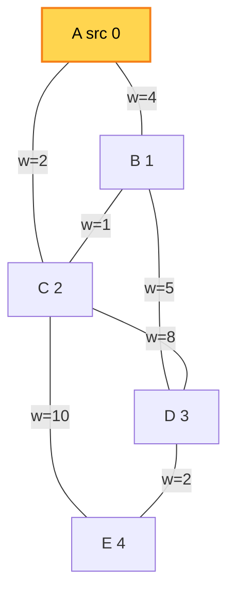
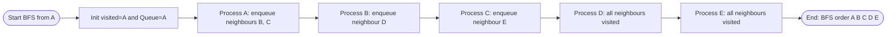
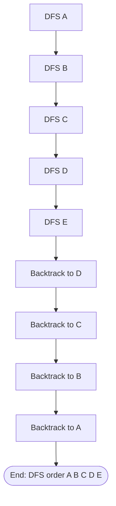
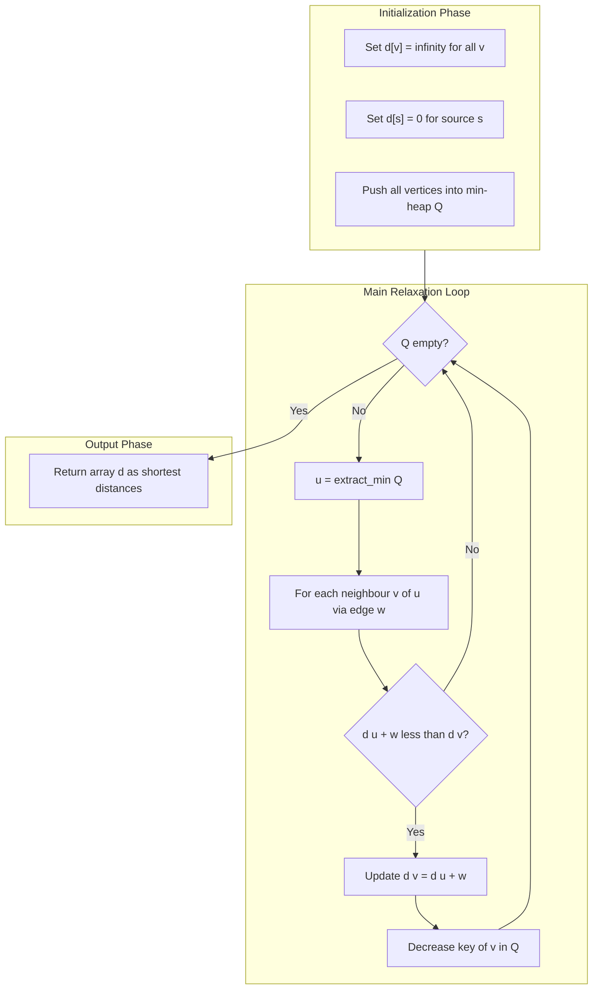
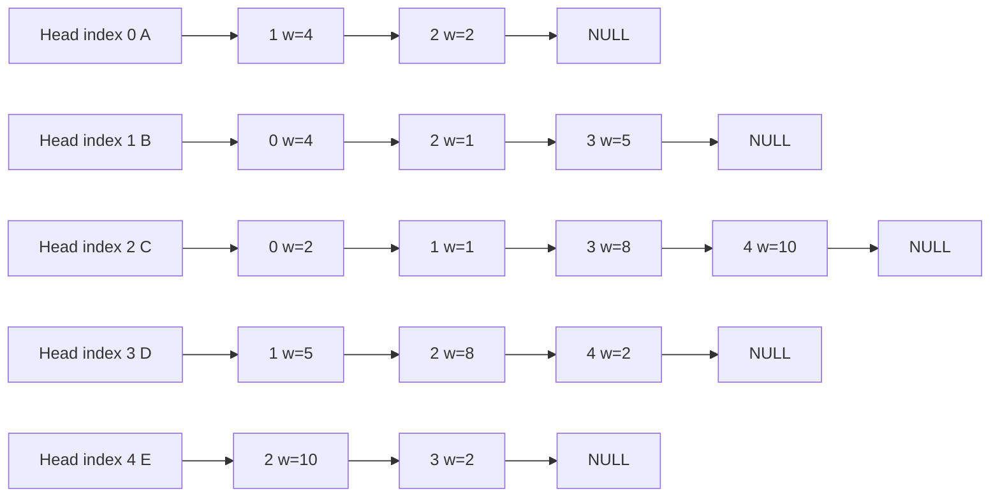
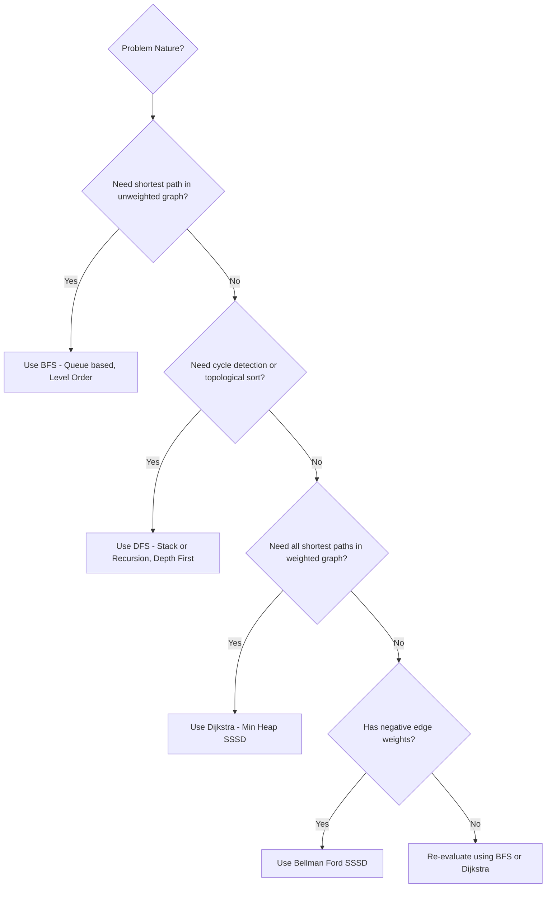

# Graphs: Definitions and Representation (Adjacency Matrix, Adjacency List), Graph Traversals: DFS and BFS, Applications: Single Source All Destination

<!-- SECTION_1_START -->
# Graphs: Definitions, Representation, Traversals & SSSD

## 1.1 Formal Definition (KTU 2024 Syllabus Terminology)

A **Graph** $G$ is formally defined as an ordered pair $G = (V, E)$ where:

$$G = (V, E)$$

- $V$ is a finite, **non-empty** set of **vertices** (also called nodes or points).
- $E$ is a set of **edges** (also called arcs or links), where each edge connects a pair of vertices.

> [!IMPORTANT]
> **KTU 2024 Board Definition:** A graph is a non-linear data structure used to represent pairwise relationships between objects. Unlike trees, graphs may contain **cycles** and a vertex may be reachable from multiple paths.

## 1.2 Intuitive Analogy — The "City Map" Model

Imagine you are a delivery driver in Kerala planning a trip covering **Thiruvananthapuram → Kochi → Calicut → Kannur**:

| Real World Object | Graph Terminology |
| :--- | :--- |
| **Cities** (Tvm, Kochi, Calicut) | **Vertices** (Nodes) |
| **Highways** (NH66, NH544) | **Edges** |
| **One-way road** | **Directed Edge** (Arc) |
| **Distance in km** | **Weight** of an edge |
| **Full road map of Kerala** | **Undirected, Weighted Graph** |
| **Pipeline flow direction** | **Directed Acyclic Graph (DAG)** |

> [!NOTE]
> **Why Graphs?** Whenever a problem involves **relationships, networks, paths, or dependencies** (Social Networks like Facebook, Google Maps, Internet Routing, Compiler Phases, AI Search), the most natural modeling primitive is a Graph.

## 1.3 Fundamental Terminology

| Term | Definition |
| :--- | :--- |
| **Vertex (Node)** | A fundamental unit of a graph. |
| **Edge** | A connection between two vertices $u, v$, denoted $(u, v)$. |
| **Adjacent Vertices** | Two vertices sharing a common edge. |
| **Degree of Vertex** $\deg(v)$ | Number of edges incident on $v$ (in-degree + out-degree for directed). |
| **Path** | A sequence of vertices where each adjacent pair is connected by an edge. |
| **Cycle** | A path that starts and ends at the same vertex. |
| **Connected Graph** | A graph where a path exists between **every** pair of vertices. |
| **Complete Graph** $K_n$ | Every pair of distinct vertices has an edge. Total edges $= \dfrac{n(n-1)}{2}$. |
| **Weighted Graph** | Each edge carries an associated numerical value (cost, distance, time). |
| **Self-loop** | An edge $(v, v)$ that starts and ends at the same vertex. |
| **Multi-edge** | More than one edge between the same pair of vertices (multigraph). |

> [!TIP]
> **Handshaking Lemma (Vital for KTU Board Exams):**
> The sum of degrees of all vertices equals **twice** the number of edges.
> $$\sum_{v \in V} \deg(v) = 2 \vert E \vert$$

## 1.4 Classification of Graphs

| Graph Type | Description | Edge Form |
| :--- | :--- | :--- |
| **Undirected Graph** | Edges have no direction. | $\{u, v\}$ |
| **Directed Graph (Digraph)** | Edges have a direction (one-way). | $(u, v)$ |
| **Weighted Graph** | Each edge has a numerical weight. | $\{u, v, w\}$ |
| **Unweighted Graph** | All edges treated equal. | $\{u, v\}$ |
| **Simple Graph** | No self-loops, no multi-edges. | — |
| **Cyclic Graph** | Contains at least one cycle. | — |
| **Acyclic Graph** | Contains no cycle. | — |
| **Tree** | A connected acyclic undirected graph. | $E = V - 1$ |

> [!VISUALIZATION CONTROL]
> **Concept:** Plotting a sample weighted undirected graph on a Cartesian plane to visualize vertex coordinates and edge weights.
> **Desmos Input Points:**
> * `A(1, 4)`, `B(4, 5)`, `C(6, 3)`, `D(3, 1)`, `E(7, 1)`
> **Desmos Input Lines (with weights as labels):**
> * `y = ...` segment A–B (weight 2)
> * segment B–C (weight 5)
> * segment A–D (weight 4)
> * segment D–E (weight 6)
> * segment C–E (weight 1)
> **Visual Description:** You will see five labelled dots scattered on the coordinate plane, joined by straight line segments. The weights (2, 5, 4, 6, 1) represent the "cost" of moving between two cities. This is the standard pictorial form expected in KTU board answers.

<!-- SECTION_1_END -->

<!-- SECTION_2_START -->
# Deep Theoretical Analysis & KTU High-Yield Formula Sheet

## 2.1 Graph Representation Strategies

A graph must be stored in computer memory. KTU 2024 mandates mastery of two principal methods: **Adjacency Matrix** and **Adjacency List**.

### 2.1.1 Adjacency Matrix Representation

For a graph with $n$ vertices, we maintain a 2D array $A$ of size $n \times n$. The entry $A[i][j]$ is **1** (or the weight) if an edge exists from vertex $i$ to vertex $j$, otherwise **0**.

$$A[i][j] = \begin{cases} 1 & \text{if } (i, j) \in E \\ 0 & \text{otherwise} \end{cases}$$

> [!IMPORTANT]
> **Symmetry Property:** For an **undirected graph**, the adjacency matrix is **symmetric**, i.e., $A[i][j] = A[j][i]$. This is a favourite KTU board question.

**Characteristics:**
- **Space Complexity:** $O(V^2)$ — independent of the number of edges.
- **Edge Lookup Time:** $O(1)$ — direct index access.
- **Vertex Neighbour Enumeration:** $O(V)$ — must scan an entire row.
- **Best for:** **Dense graphs** (where $E \approx V^2$).

### 2.1.2 Adjacency List Representation

For each vertex $v$, we maintain a linked list (or Python list / vector) of all vertices adjacent to $v$. This is the most common industrial representation.

> [!NOTE]
> In KTU 2024, students must be able to construct the Adjacency List by hand for a given undirected/directed graph and trace the order of vertices visited by BFS/DFS.

**Characteristics:**
- **Space Complexity:** $O(V + E)$ — efficient for sparse graphs.
- **Edge Lookup Time:** $O(\deg(v))$ — must search the list of $v$.
- **Vertex Neighbour Enumeration:** $O(\deg(v))$ — only iterates actual neighbours.
- **Best for:** **Sparse graphs** (where $E \ll V^2$) — social networks, web graphs.

### 2.1.3 Master Comparison Table (Board-Favourite)

| Property | Adjacency Matrix | Adjacency List |
| :--- | :--- | :--- |
| Storage | $V^2$ entries | $V + E$ entries |
| Add Edge | $O(1)$ | $O(1)$ (append to list) |
| Remove Edge | $O(1)$ | $O(\deg(v))$ |
| Query Edge Exists? | $O(1)$ | $O(V)$ worst-case |
| Iterate Neighbours | $O(V)$ | $O(\deg(v))$ |
| Best Use Case | Dense graph | Sparse graph |
| Memory Waste | High if sparse | Minimal |
| Self-loop check | $A[i][i]$ | Check list of $i$ |

## 2.2 Graph Traversal: The Foundation

**Traversal** means visiting every vertex (and possibly every edge) of a graph in a systematic manner. KTU 2024 emphasises two strategies:

| Strategy | Data Structure | Order of Visit | Analogy |
| :--- | :--- | :--- | :--- |
| **BFS** (Breadth-First Search) | **Queue** (FIFO) | Level by level from source | Ripples spreading on water surface |
| **DFS** (Depth-First Search) | **Stack** (LIFO) / Recursion | Go deep, then backtrack | Solving a maze with a single thread of string |

## 2.3 BFS — Algorithm Core

BFS explores the graph in **waves**. Starting from a source $s$, it visits all vertices at distance 1, then all at distance 2, and so on. It uses a **FIFO queue** to remember the order.

**Algorithm (Pseudocode):**
```
BFS(G, s):
    create visited[] = {False}
    create Q (empty queue)
    visited[s] = True
    enqueue(Q, s)
    while Q is not empty:
        u = dequeue(Q)
        output u
        for each neighbour v of u:
            if not visited[v]:
                visited[v] = True
                enqueue(Q, v)
```

**Time Complexity:** $O(V + E)$ using Adjacency List; $O(V^2)$ using Adjacency Matrix.

## 2.4 DFS — Algorithm Core

DFS explores as far as possible down one branch before **backtracking**. It uses a **LIFO stack** (or system recursion stack).

**Algorithm (Recursive Pseudocode):**
```
DFS(G, u):
    visited[u] = True
    output u
    for each neighbour v of u:
        if not visited[v]:
            DFS(G, v)
```

**Time Complexity:** $O(V + E)$ using Adjacency List.

## 2.5 Single Source All Destination (SSAD / SSSP)

The **Single Source All Destination** problem finds the **shortest path from one source vertex $s$ to every other vertex** in a weighted graph with non-negative weights. This is solved by **Dijkstra's Algorithm** (1956).

> [!IMPORTANT]
> **KTU Board Distinction:**
> 1. **Unweighted graph** → BFS solves SSSD in $O(V + E)$.
> 2. **Weighted graph (non-negative weights)** → Dijkstra's algorithm in $O((V + E) \log V)$ using a min-heap.
> 3. **Graph with negative weights** → Bellman–Ford algorithm.

### Dijkstra's Relaxation Formula

For every edge $(u, v)$ with weight $w(u, v)$:

$$d[v] = \min \left( d[v], \ d[u] + w(u, v) \right)$$

where $d[v]$ is the current known shortest distance from source $s$ to vertex $v$.

**Algorithm Outline:**
```
Dijkstra(G, s):
    d[v] = ∞  for all v in V
    d[s] = 0
    Q = min-priority-queue of (d[v], v) for all v
    while Q is not empty:
        (dist, u) = extract_min(Q)
        for each neighbour v of u with edge weight w:
            if d[u] + w < d[v]:
                d[v] = d[u] + w
                decrease_key(Q, v, d[v])
```

## 2.6 KTU High-Yield Formula Cheat Sheet

| Concept | Formula / Complexity | Notes |
| :--- | :--- | :--- |
| Handshaking Lemma | $\sum \deg(v) = 2 \vert E \vert$ | Undirected graphs only |
| Complete Graph Edges | $\dfrac{n(n-1)}{2}$ | Undirected; for directed: $n(n-1)$ |
| BFS Time | $O(V + E)$ | With adjacency list |
| DFS Time | $O(V + E)$ | With adjacency list |
| BFS/DFS with Matrix | $O(V^2)$ | Must scan full row |
| Adjacency Matrix Space | $O(V^2)$ | Constant regardless of $E$ |
| Adjacency List Space | $O(V + E)$ | Sum of degrees $\vert E \vert \leq V^2$ |
| Dijkstra (Min-Heap) | $O((V + E) \log V)$ | Non-negative weights only |
| Dijkstra (Array) | $O(V^2)$ | Dense graphs |
| Relaxation Step | $d[v] = \min(d[v], d[u] + w)$ | Core of Dijkstra's |
| Tree Edges (DFS) | $V - 1$ (if connected) | Forms DFS spanning tree |
| BFS Level | $\text{level}[v] = \text{level}[parent] + 1$ | Shortest path length in unweighted |

> [!TIP]
> **Real-World Engineering Use-Cases (Mention in Board Answers for Extra Marks):**
> * **BFS** → Web Crawlers, Social Network "Friends of Friends", GPS shortest road (unweighted), Broadcasting in networks.
> * **DFS** → Topological Sorting (Course Prerequisites), Cycle Detection, Solving Mazes/Puzzles (Sudoku), Strongly Connected Components (Tarjan's / Kosaraju's).
> * **Dijkstra's SSSD** → Google Maps, OSPF Routing Protocol, IP Telephony Call Routing, Network Packet Switching.

<!-- SECTION_2_END -->

<!-- SECTION_3_START -->
# Step-by-Step Derivations, Traces & Code Implementation

## 3.1 Reference Graph (Used Throughout This Section)

We use the following **weighted, undirected** sample graph with **5 vertices** $A, B, C, D, E$ for every trace:

| Edge | Weight |
| :--- | :--- |
| $A \leftrightarrow B$ | 4 |
| $A \leftrightarrow C$ | 2 |
| $B \leftrightarrow C$ | 1 |
| $B \leftrightarrow D$ | 5 |
| $C \leftrightarrow D$ | 8 |
| $C \leftrightarrow E$ | 10 |
| $D \leftrightarrow E$ | 2 |

**Vertex labels (0-indexed for code):** $A=0, \ B=1, \ C=2, \ D=3, \ E=4$.

## 3.2 Adjacency Matrix — Python Implementation

```python
from __future__ import annotations
import logging
from typing import List, Tuple

logging.basicConfig(level=logging.INFO, format="%(levelname)s :: %(message)s")
logger = logging.getLogger(__name__)

class GraphAdjMatrix:
    """Undirected weighted graph using Adjacency Matrix representation."""

    def __init__(self, num_vertices: int) -> None:
        if num_vertices <= 0:
            raise ValueError("Number of vertices must be a positive integer.")
        self._n: int = num_vertices
        self._matrix: List[List[float]] = [
            [0.0] * num_vertices for _ in range(num_vertices)
        ]
        logger.info("Created %dx%d adjacency matrix.", num_vertices, num_vertices)

    def add_edge(self, u: int, v: int, weight: float = 1.0) -> None:
        if not (0 <= u < self._n and 0 <= v < self._n):
            raise IndexError(f"Vertex out of range (0..{self._n - 1}).")
        if u == v:
            raise ValueError("Self-loops are not supported in this simple graph.")
        self._matrix[u][v] = weight
        self._matrix[v][u] = weight          # Symmetric for undirected
        logger.info("Edge (%d, %d) with weight %.2f added.", u, v, weight)

    def remove_edge(self, u: int, v: int) -> None:
        self._matrix[u][v] = 0.0
        self._matrix[v][u] = 0.0
        logger.info("Edge (%d, %d) removed.", u, v)

    def has_edge(self, u: int, v: int) -> bool:
        return self._matrix[u][v] != 0.0

    def get_weight(self, u: int, v: int) -> float:
        return self._matrix[u][v]

    def get_neighbors(self, u: int) -> List[int]:
        return [v for v in range(self._n) if self._matrix[u][v] != 0.0]

    def display(self) -> None:
        print("\nAdjacency Matrix:")
        header = "    " + "  ".join(f"{i:>4}" for i in range(self._n))
        print(header)
        for i in range(self._n):
            row = "  ".join(f"{self._matrix[i][j]:>4.1f}" for j in range(self._n))
            print(f"{i:>3} {row}")
```

**Output Trace of Display for Reference Graph (3.1):**

$$
\begin{aligned}
A_{matrix} &=
\begin{bmatrix}
0 & 4 & 2 & 0 & 0 \\
4 & 0 & 1 & 5 & 0 \\
2 & 1 & 0 & 8 & 10 \\
0 & 5 & 8 & 0 & 2 \\
0 & 0 & 10 & 2 & 0
\end{bmatrix}
\end{aligned}
$$

> [!NOTE]
> The matrix is **symmetric** along the main diagonal, confirming the undirected property. The diagonal is **0** (no self-loops). Each off-diagonal entry equals the **edge weight** (or 0 if no edge exists).

## 3.3 Adjacency List — Python Implementation

```python
from collections import defaultdict
from typing import Dict, List, Tuple

class GraphAdjList:
    """Undirected weighted graph using Adjacency List representation."""

    def __init__(self) -> None:
        self._adj: Dict[int, List[Tuple[int, float]]] = defaultdict(list)
        logger.info("Empty adjacency list created.")

    def add_vertex(self, v: int) -> None:
        if v not in self._adj:
            self._adj[v] = []
            logger.info("Vertex %d added.", v)

    def add_edge(self, u: int, v: int, weight: float = 1.0) -> None:
        if u == v:
            raise ValueError("Self-loops not allowed.")
        self._adj[u].append((v, weight))
        self._adj[v].append((u, weight))
        logger.info("Edge (%d, %d, w=%.2f) added.", u, v, weight)

    def get_neighbors(self, u: int) -> List[Tuple[int, float]]:
        return self._adj.get(u, [])

    def display(self) -> None:
        print("\nAdjacency List:")
        for vertex in sorted(self._adj.keys()):
            neighbors = ", ".join(f"({nbr}, w={w})" for nbr, w in self._adj[vertex])
            print(f"  {vertex} -> [{neighbors}]")
```

**Output Trace for Reference Graph (3.1):**

| Vertex | Adjacency List Entry |
| :--- | :--- |
| 0 (A) | $[(1, 4), (2, 2)]$ |
| 1 (B) | $[(0, 4), (2, 1), (3, 5)]$ |
| 2 (C) | $[(0, 2), (1, 1), (3, 8), (4, 10)]$ |
| 3 (D) | $[(1, 5), (2, 8), (4, 2)]$ |
| 4 (E) | $[(2, 10), (3, 2)]$ |

## 3.4 BFS — Implementation and Step-by-Step Trace

```python
from collections import deque
from typing import List, Set

def bfs_traversal(graph: GraphAdjList, source: int) -> List[int]:
    if source not in graph._adj:
        raise ValueError(f"Source {source} not in graph.")
    visited: Set[int] = set()
    queue: deque[int] = deque()
    order: List[int] = []

    visited.add(source)
    queue.append(source)

    while queue:
        u = queue.popleft()
        order.append(u)
        logger.info("BFS Visit -> %d | Queue=%s", u, list(queue))
        for v, _weight in graph.get_neighbors(u):
            if v not in visited:
                visited.add(v)
                queue.append(v)
    return order
```

**Step-by-Step Trace of BFS from Source = 0 (A):**

$$
\begin{aligned}
\text{Step 1:} \quad & \text{Enqueue } A. \quad \text{Queue} = [A], \quad \text{Visited} = \{A\} \\
\text{Step 2:} \quad & \text{Dequeue } A. \quad \text{Process neighbours } B, C. \quad \text{Enqueue both.} \\
                   & \text{Queue} = [B, C], \quad \text{Visited} = \{A, B, C\} \\
\text{Step 3:} \quad & \text{Dequeue } B. \quad \text{Neighbours: } A(\text{visited}), C(\text{visited}), D(\text{new}). \text{ Enqueue } D. \\
                   & \text{Queue} = [C, D], \quad \text{Visited} = \{A, B, C, D\} \\
\text{Step 4:} \quad & \text{Dequeue } C. \quad \text{Neighbours: } A(\text{vis}), B(\text{vis}), D(\text{vis}), E(\text{new}). \text{ Enqueue } E. \\
                   & \text{Queue} = [D, E], \quad \text{Visited} = \{A, B, C, D, E\} \\
\text{Step 5:} \quad & \text{Dequeue } D. \quad \text{All neighbours already visited.} \\
\text{Step 6:} \quad & \text{Dequeue } E. \quad \text{All neighbours already visited.} \\
\end{aligned}
$$

**BFS Final Order:** $A, B, C, D, E$ ⟶ Traversal Sequence: $[0, 1, 2, 3, 4]$.

## 3.5 DFS — Implementation and Step-by-Step Trace

```python
def dfs_recursive(graph: GraphAdjList, source: int) -> List[int]:
    visited: Set[int] = set()
    order: List[int] = []

    def _dfs(u: int) -> None:
        visited.add(u)
        order.append(u)
        logger.info("DFS Visit -> %d | Recursion stack=%s", u, list(order))
        for v, _w in graph.get_neighbors(u):
            if v not in visited:
                _dfs(v)

    _dfs(source)
    return order

def dfs_iterative(graph: GraphAdjList, source: int) -> List[int]:
    visited: Set[int] = set()
    stack: List[int] = [source]
    order: List[int] = []
    while stack:
        u = stack.pop()
        if u in visited:
            continue
        visited.add(u)
        order.append(u)
        # Push neighbours in reverse order to mimic recursive order
        for v, _w in reversed(graph.get_neighbors(u)):
            if v not in visited:
                stack.append(v)
    return order
```

**Step-by-Step Trace of Recursive DFS from Source = 0 (A):**

$$
\begin{aligned}
\text{Step 1:} \quad & \text{Call DFS}(A). \quad \text{Mark } A \text{ visited.} \\
\text{Step 2:} \quad & \text{Visit } A\text{'s first neighbour } B. \quad \text{Recurse to DFS}(B). \\
\text{Step 3:} \quad & \text{Visit } B\text{'s first unvisited neighbour } A(\text{vis}) \to C. \quad \text{Recurse to DFS}(C). \\
\text{Step 4:} \quad & \text{Visit } C\text{'s first unvisited neighbour } A(\text{vis}) \to B(\text{vis}) \to D. \quad \text{Recurse to DFS}(D). \\
\text{Step 5:} \quad & \text{Visit } D\text{'s first unvisited neighbour } B(\text{vis}) \to C(\text{vis}) \to E. \quad \text{Recurse to DFS}(E). \\
\text{Step 6:} \quad & \text{Visit } E\text{'s first unvisited neighbour } C(\text{vis}) \to D(\text{vis}). \quad \text{Backtrack to } D \to C \to B \to A. \\
\end{aligned}
$$

**DFS Final Order:** $A, B, C, D, E$ ⟶ Traversal Sequence: $[0, 1, 2, 3, 4]$.

> [!NOTE]
> The **BFS and DFS orders may differ** for the same graph depending on the neighbour iteration order. For our specific graph they coincide because the graph is essentially a path $A - B - C - D - E$ with a small shortcut. **Always re-trace for the KTU board** rather than memorising orders.

## 3.6 Dijkstra's Algorithm — Implementation and Trace (SSSD)

```python
import heapq
from typing import Dict, List

def dijkstra_sssd(graph: GraphAdjList, source: int) -> Dict[int, float]:
    """Returns the shortest distance from source to every vertex."""
    distances: Dict[int, float] = {v: float("inf") for v in graph._adj}
    distances[source] = 0.0
    priority_queue: List[tuple[float, int]] = [(0.0, source)]
    logger.info("Initial distances: %s", distances)

    while priority_queue:
        current_dist, u = heapq.heappop(priority_queue)
        if current_dist > distances[u]:
            continue
        logger.info("Extract-min -> vertex %d with d=%d", u, current_dist)
        for v, weight in graph.get_neighbors(u):
            new_dist = current_dist + weight
            if new_dist < distances[v]:
                distances[v] = new_dist
                heapq.heappush(priority_queue, (new_dist, v))
                logger.info("Relax edge (%d -> %d): new d[%d] = %d", u, v, v, new_dist)
    return distances
```

**Step-by-Step Trace of Dijkstra's SSSD from Source = 0 (A):**

| Step | Extract-Min | Relaxation Updates | Distance Array $[d[A], d[B], d[C], d[D], d[E]]$ |
| :---: | :---: | :--- | :--- |
| 1 | $A$ (dist = 0) | $d[B] = 4$, $d[C] = 2$ | $[0, 4, 2, \infty, \infty]$ |
| 2 | $C$ (dist = 2) | $d[B] = \min(4, 2+1)=3$, $d[D] = 10$, $d[E] = 12$ | $[0, 3, 2, 10, 12]$ |
| 3 | $B$ (dist = 3) | $d[D] = \min(10, 3+5)=8$, $d[C] = 3$ (no update) | $[0, 3, 2, 8, 12]$ |
| 4 | $D$ (dist = 8) | $d[E] = \min(12, 8+2)=10$ | $[0, 3, 2, 8, 10]$ |
| 5 | $E$ (dist = 10) | No updates possible | $[0, 3, 2, 8, 10]$ |

**Final SSSD Output (Shortest Distances from $A$):**

$$
\begin{aligned}
d[A] &= 0, \quad d[B] = 3, \quad d[C] = 2, \quad d[D] = 8, \quad d[E] = 10 \\
\end{aligned}
$$

> [!TIP]
> **Tracing Path Reconstruction:** To retrieve the actual path (not just distance), maintain a `parent[]` array. Update `parent[v] = u` whenever you relax edge $(u, v)$. After the algorithm, trace back from destination to source using `parent[]` and reverse the list.

**Path Reconstruction (Destination $E$):**
$$
\text{parent chain: } E \leftarrow D \leftarrow B \leftarrow C \leftarrow A \implies \text{Path } A \to C \to B \to D \to E
$$

**Verification:** $2 + 1 + 5 + 2 = 10$ ✓ (matches the computed $d[E]$).

<!-- SECTION_3_END -->

<!-- SECTION_4_START -->
# Structural Diagrams & Schematics

## 4.1 Reference Graph Visual Topology



## 4.2 BFS Traversal Sequence Flow



## 4.3 DFS Recursive Call Stack



## 4.4 Dijkstra's Algorithm Block Architecture



## 4.5 Adjacency List Storage Layout (Schematic)



## 4.6 BFS vs DFS — Comparative Decision Flow



<!-- SECTION_4_END -->

<!-- SECTION_5_START -->
# KTU 2024 Scheme Examination Question Bank & Topic Recap

## 5.1 Part A — Short Answer Questions (3 Marks Each)

### Question 1 `[KTU University Exam - Dec 2023]` — CO1, Remember

**Define a graph data structure. Differentiate between a directed and an undirected graph with a suitable example.**

**Model Answer (Valuation Key):**

A **Graph** $G$ is an ordered pair $G = (V, E)$ where $V$ is a finite non-empty set of vertices and $E$ is a set of edges connecting pairs of vertices. **[1 Mark]**

| Aspect | Directed Graph | Undirected Graph |
| :--- | :--- | :--- |
| Edge Notation | $(u, v)$ ordered pair | $\{u, v\}$ unordered pair |
| Direction | Edge has a direction (arrow) | No direction |
| Example | Twitter Follower Network | Facebook Friends Network |
| In-degree vs Out-degree | Both defined for each vertex | Only degree defined |
| Matrix Property | $A[i][j]$ need not equal $A[j][i]$ | $A[i][j] = A[j][i]$ (symmetric) |

**[Distinction Table: 2 Marks]**

### Question 2 `[KTU University Exam - July 2024]` — CO2, Understand

**State the time and space complexity of representing a graph using (i) Adjacency Matrix and (ii) Adjacency List. Which is preferred for a sparse graph and why?**

**Model Answer:**

(i) **Adjacency Matrix:**
- Space Complexity: $O(V^2)$ — a $V \times V$ 2D array regardless of number of edges. **[1 Mark]**
- Query Time: $O(1)$ to check if edge exists.

(ii) **Adjacency List:**
- Space Complexity: $O(V + E)$ — stores only existing edges as linked lists. **[1 Mark]**
- Query Time: $O(\deg(v))$ to scan neighbour list.

**Preferred for Sparse Graph:** **Adjacency List** is preferred because a sparse graph has $E \ll V^2$, so the matrix wastes $O(V^2 - E)$ memory. The list uses only $O(V + E)$ space, which is asymptotically optimal. **[1 Mark]**

---

## 5.2 Part B — Long Answer Questions (14 Marks Each)

> [!WARNING]
> **KTU Examiner's Valuation Warning:** For all graph questions, students often **lose 1–2 marks** by:
> 1. Forgetting to mark the **visited** set/array — a single re-visit can cause **infinite loops** in cyclic graphs.
> 2. Confusing **BFS** (Queue, level order) with **DFS** (Stack/Recursion, depth order).
> 3. Failing to write the **complexity** explicitly (KTU awards 1 mark for this).
> 4. Skipping the **Adjacency Matrix/List construction** in handwritten answers.

### Question A `[KTU University Exam - Dec 2023]` — CO2 + CO3, Apply + Analyze

#### (a) [7 Marks] Represent the given undirected graph using (i) Adjacency Matrix and (ii) Adjacency List. State the space complexity of each.

Given Graph: $V = \{1, 2, 3, 4, 5\}$, $E = \{\{1,2\}, \{1,3\}, \{2,4\}, \{3,4\}, \{4,5\}, \{2,5\}\}$.

**Model Solution:**

**(i) Adjacency Matrix:** **[3 Marks]**

$$
A =
\begin{bmatrix}
0 & 1 & 1 & 0 & 0 \\
1 & 0 & 0 & 1 & 1 \\
1 & 0 & 0 & 1 & 0 \\
0 & 1 & 1 & 0 & 1 \\
0 & 1 & 0 & 1 & 0
\end{bmatrix}
$$

**Space Complexity:** $O(V^2) = O(5^2) = 25$ entries. **[1 Mark]**

**(ii) Adjacency List:** **[3 Marks]**

| Vertex | Neighbours |
| :--- | :--- |
| 1 | 2, 3 |
| 2 | 1, 4, 5 |
| 3 | 1, 4 |
| 4 | 2, 3, 5 |
| 5 | 2, 4 |

**Space Complexity:** $O(V + E) = O(5 + 6) = 11$ entries. **[Total: 7 Marks]**

---

#### (b) [7 Marks] Perform **BFS traversal** starting from vertex **1** on the graph above. Show the state of the queue and visited array at each step. State the time complexity.

**Model Solution:**

**Initialisation:** `Visited = {}`, `Queue = []`

$$
\begin{aligned}
\text{Step 1:} \quad & \text{Mark 1 visited. Enqueue 1. } \text{Queue} = [1], \ \text{Visited} = \{1\} \\
\text{Step 2:} \quad & \text{Dequeue 1. Output 1. Enqueue unvisited neighbours 2, 3.} \\
                   & \text{Queue} = [2, 3], \ \text{Visited} = \{1, 2, 3\} \\
\text{Step 3:} \quad & \text{Dequeue 2. Output 2. Enqueue unvisited neighbour 4, 5.} \\
                   & \text{Queue} = [3, 4, 5], \ \text{Visited} = \{1, 2, 3, 4, 5\} \\
\text{Step 4:} \quad & \text{Dequeue 3. Output 3. All neighbours visited.} \\
                   & \text{Queue} = [4, 5] \\
\text{Step 5:} \quad & \text{Dequeue 4. Output 4. All neighbours visited.} \\
                   & \text{Queue} = [5] \\
\text{Step 6:} \quad & \text{Dequeue 5. Output 5. All neighbours visited.} \\
                   & \text{Queue} = [] \implies \text{HALT} \\
\end{aligned}
$$

**BFS Final Order:** $1, 2, 3, 4, 5$ **[2 Marks]**

**Time Complexity:** $O(V + E) = O(5 + 6) = O(11)$ **[1 Mark]**

**Valuation Key:**
- [Showing the queue at each step: 3 Marks]
- [Showing the visited set at each step: 1 Mark]
- [Final BFS order: 2 Marks]
- [Time complexity statement: 1 Mark]

---

### Question B `[KTU University Exam - July 2024]` — CO3, Apply + Analyze

#### (a) [7 Marks] Perform **DFS traversal** (recursive) on the same graph starting from vertex **1**. Show the recursion stack state and the final DFS order.

**Model Solution:**

The recursive DFS maintains a **call stack** as it dives deep.

$$
\begin{aligned}
\text{Call 1:} \quad & \text{DFS}(1) \to \text{Mark 1 visited. First neighbour 2 (unvisited).} \\
\text{Call 2:} \quad & \text{DFS}(2) \to \text{Mark 2 visited. First neighbour 1 (vis) skip; 4 (unvisited).} \\
\text{Call 3:} \quad & \text{DFS}(4) \to \text{Mark 4 visited. Neighbours: 2 (vis), 3 (unvisited).} \\
\text{Call 4:} \quad & \text{DFS}(3) \to \text{Mark 3 visited. Neighbours: 1 (vis), 4 (vis). Backtrack.} \\
\text{Back:} \quad & \text{Return to DFS}(4). \text{ Next neighbour of 4: 5 (unvisited).} \\
\text{Call 5:} \quad & \text{DFS}(5) \to \text{Mark 5 visited. Neighbours: 2 (vis), 4 (vis). Backtrack.} \\
\text{Back:} \quad & \text{Return chain back to DFS}(1). \text{ All neighbours visited. Terminate.} \\
\end{aligned}
$$

**Recursion Stack at deepest point:** $\text{DFS}(1) \to \text{DFS}(2) \to \text{DFS}(4) \to \text{DFS}(3)$ **[2 Marks]**

**DFS Final Order:** $1, 2, 4, 3, 5$ **[2 Marks]**

**Time Complexity:** $O(V + E)$ **[1 Mark]**

**Visited Status at End:** $\{1, 2, 3, 4, 5\}$ — All vertices visited. **[1 Mark]**

**Valuation Key:**
- [Marking visited at each call: 2 Marks]
- [Recursion stack visualisation: 1 Mark]
- [Final DFS order: 2 Marks]
- [Time complexity: 1 Mark]
- [Statement that all vertices reachable: 1 Mark]

---

#### (b) [7 Marks] Solve the **Single Source All Destination** problem using **Dijkstra's Algorithm** from source vertex **1** on the weighted graph below:

Edges and weights: $\{1-2, 7\}, \{1-3, 9\}, \{1-4, 11\}, \{2-3, 5\}, \{3-4, 6\}, \{2-5, 4\}, \{3-5, 1\}, \{4-5, 2\}$

**Model Solution:**

**Step 0: Initialisation** `d[1]=0`, `d[2]=d[3]=d[4]=d[5]=∞` **[1 Mark]**

| Step | Extract-Min $u$ (with current $d[u]$) | Edge Relaxed | Update | Distance Array $d$ |
| :---: | :---: | :--- | :--- | :--- |
| 1 | $1$ ($d=0$) | $1\to2$ weight 7 | $d[2]=7$ | $[0, 7, 9, 11, \infty]$ |
| | | $1\to3$ weight 9 | $d[3]=9$ | |
| | | $1\to4$ weight 11 | $d[4]=11$ | |
| 2 | $2$ ($d=7$) | $2\to3$ weight 5 | $d[3]=\min(9, 7+5)=9$ (no change) | $[0, 7, 9, 11, \infty]$ |
| | | $2\to5$ weight 4 | $d[5]=11$ | |
| 3 | $3$ ($d=9$) | $3\to4$ weight 6 | $d[4]=\min(11, 9+6)=11$ (no change) | $[0, 7, 9, 11, 11]$ |
| | | $3\to5$ weight 1 | $d[5]=\min(11, 9+1)=10$ | |
| 4 | $5$ ($d=10$) | No relaxation improves | — | $[0, 7, 9, 11, 10]$ |
| 5 | $4$ ($d=11$) | No relaxation improves | — | $[0, 7, 9, 11, 10]$ |

**Final SSSD Distances from Source 1:** **[2 Marks]**

$$
d[1] = 0, \quad d[2] = 7, \quad d[3] = 9, \quad d[4] = 11, \quad d[5] = 10
$$

**Time Complexity:** $O((V + E) \log V)$ with binary heap. **[1 Mark]**

**Valuation Key:**
- [Initialisation step: 1 Mark]
- [Extract-min selections in order: 2 Marks]
- [Relaxation updates in table: 2 Marks]
- [Final distance array: 1 Mark]
- [Time complexity: 1 Mark]

> [!WARNING]
> **Common Pitfall in Dijkstra's:** Students often **forget to compare** the new path with the existing $d[v]$ and simply **overwrite** $d[v]$. Always use the relaxation formula $d[v] = \min(d[v], d[u] + w)$. Also, do **not** use Dijkstra's on graphs with **negative edge weights** — it will produce incorrect results.

---

## 5.3 Topic Recap & Important Things to Remember

> [!IMPORTANT]
> **Rapid Revision Checklist — KTU 2024 Module 3, Graphs**

- **Graph** $G = (V, E)$: non-linear data structure; $V$ = vertices, $E$ = edges. May contain cycles, unlike trees.
- **Handshaking Lemma:** $\sum \deg(v) = 2 \vert E \vert$ — sum of all vertex degrees equals twice the number of edges.
- **Complete Graph** $K_n$: has exactly $\dfrac{n(n-1)}{2}$ edges (undirected) and $n(n-1)$ edges (directed).
- **Adjacency Matrix** is a $V \times V$ 2D array; for undirected graphs it is **symmetric** along the diagonal; space $O(V^2)$.
- **Adjacency List** stores for each vertex a list of neighbours; total space $O(V + E)$ — ideal for sparse graphs.
- **Adjacency Matrix** edge lookup is $O(1)$; **Adjacency List** is $O(\deg(v))$.
- **BFS uses a Queue (FIFO)**, explores level-by-level, gives shortest path in unweighted graphs; time $O(V + E)$.
- **DFS uses a Stack (or recursion)**, explores depth-first, useful for cycle detection, topological sort, maze solving; time $O(V + E)$.
- **In BFS**, always mark a vertex as visited **at the moment of enqueuing** to avoid duplicate enqueues.
- **In DFS**, mark visited **at the moment of entering the recursive call** (or at pop for iterative version).
- **Dijkstra's Algorithm** solves **Single Source All Destination** for graphs with non-negative weights using a min-heap; time $O((V+E) \log V)$.
- **Relaxation formula** (memorise verbatim): $d[v] = \min(d[v], d[u] + w(u, v))$.
- **Dijkstra's fails** for negative edge weights — use **Bellman-Ford** instead.
- **Dijkstra's with a simple array** (no heap) runs in $O(V^2)$ — preferred for dense graphs.
- **Time complexity questions** in KTU board often ask for traversal on a graph with $V$ vertices and $E$ edges — always write both $O(V+E)$ for list and $O(V^2)$ for matrix.
- **Path reconstruction** in Dijkstra's needs an auxiliary `parent[]` array; path is reversed at the end.
- **BFS and DFS** are the two most fundamental graph algorithms — every other graph algorithm (Kruskal, Prim, Topological Sort, SCC) is built on top of one of these.
- **Connected Components** can be found by running BFS/DFS from each unvisited vertex and counting the number of trees in the BFS/DFS forest.
- **Real-world analogy for revision:** A graph is a **road map of Kerala**; BFS = exploring nearby cities first; DFS = following one highway to its end before turning back; Dijkstra's = finding the **shortest toll-minimising route** to every other city.
- **Drawing tips for KTU answer sheet:** Always draw a clean **graph diagram** before constructing the matrix/list; examiners award **partial marks** for a clear diagram even if the table is partially wrong.
- **For weighted graph SSSD**, the final answer must be the **shortest distance value**, not the final vertex reached by greedy selection.

<!-- SECTION_5_END -->
