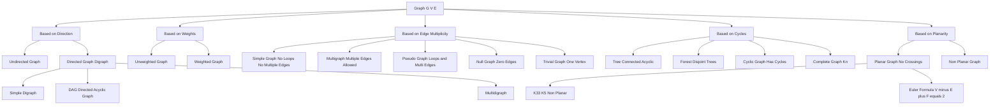
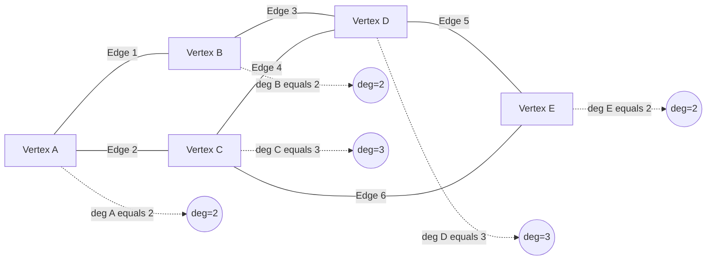
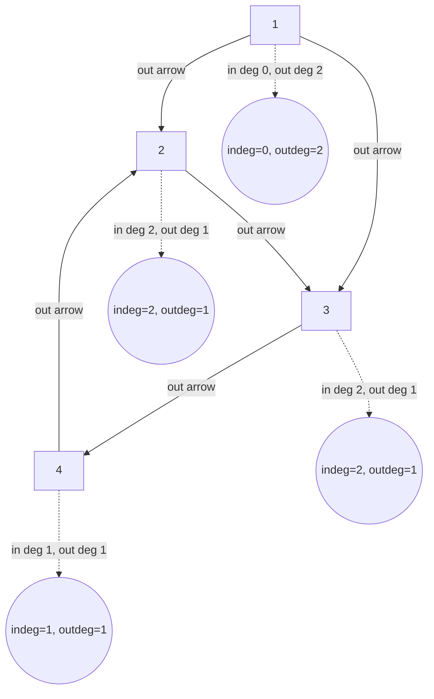
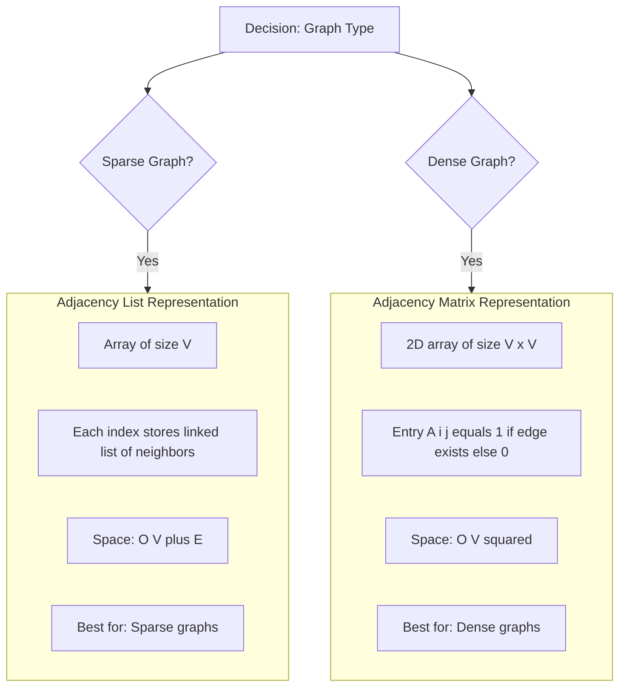
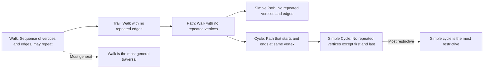
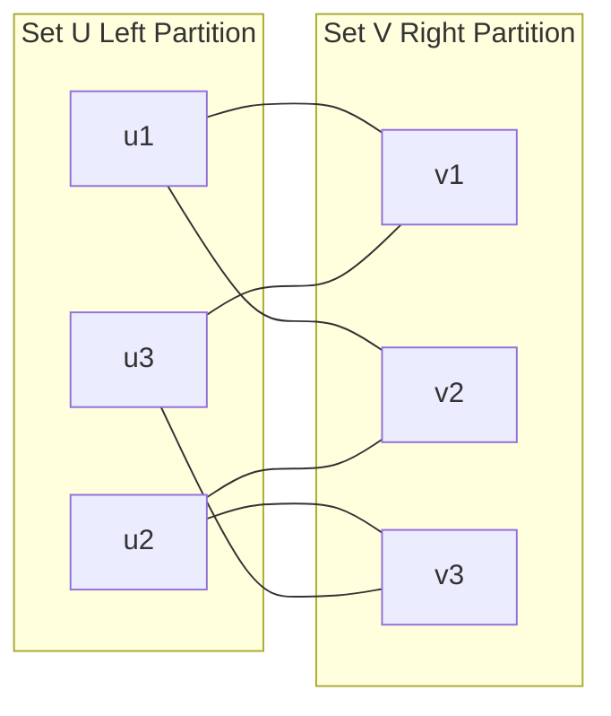
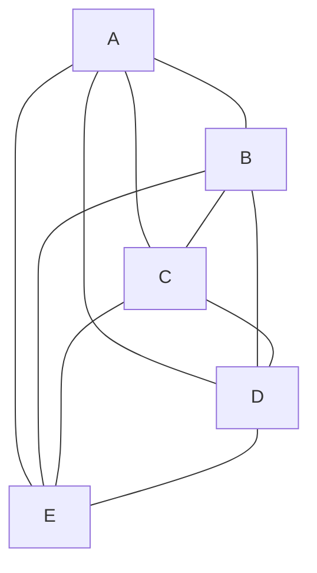
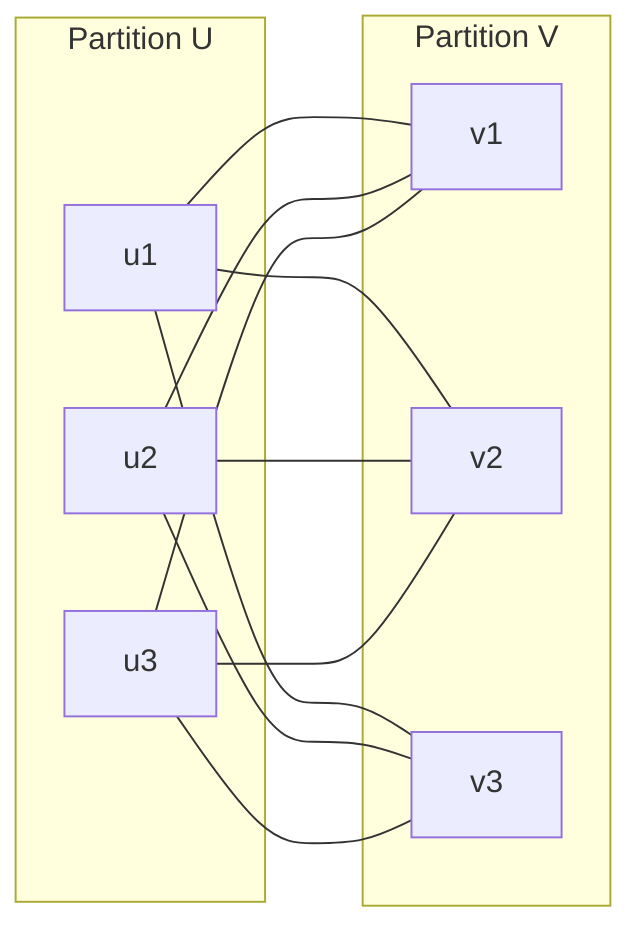

# Graphs :- Definitions

<!-- SECTION_1_START -->
# Graphs - Definitions

## 1. Core Technical Definition

> [!NOTE]
> **Formal KTU 2024 Definition**
> A **Graph** $G$ is a non-linear data structure consisting of a finite, non-empty set of **vertices** (also called nodes) $V$ and a set of **edges** $E$ that connect pairs of vertices. Formally, it is defined as an ordered pair $G = (V, E)$ where $V \neq \emptyset$ and $E \subseteq \{(u, v) \mid u, v \in V\}$.

- **Vertex (Node)**: The fundamental unit of a graph, representing an entity or object.
- **Edge**: A connection/link between two vertices, representing a relationship between them.
- **Order of a Graph**: The number of vertices $|V|$ in the graph, denoted as $n$.
- **Size of a Graph**: The number of edges $|E|$ in the graph, denoted as $m$.

> [!IMPORTANT]
> **KTU 2024 Syllabus Highlight**
> A graph with no edges is called a **null graph** (or empty graph), and a graph with only one vertex is a **trivial graph**. The graph data structure is a non-linear arrangement compared to arrays, linked lists, stacks, and queues which are linear.

## 2. Conceptual Analogy / Intuition

Imagine a **social network** like Facebook or Instagram. Each person is a **vertex (node)**, and each friendship or "follow" relationship is an **edge**. Some relationships are mutual (two-way), like Facebook friendships, while others are one-way (Twitter follows), like a directed arrow.

Think of it as a **cities and roads map**:
- **Cities** = Vertices
- **Roads** = Edges
- A **one-way road** = Directed edge
- A **two-way road** = Undirected edge
- A **road with distance** = Weighted edge

> [!TIP]
> **Why study graphs?** Graphs are the backbone of real-world problems like Google Maps (shortest path), Facebook (friend suggestions), the internet (web as a graph), compiler design (syntax trees, DAGs), and even AI search algorithms.

## 3. Graph Terminology - The Building Blocks

| Term | Symbol | Description |
|------|--------|-------------|
| **Vertex/Node** | $v \in V$ | A fundamental element/point in the graph |
| **Edge** | $e = (u, v)$ | A connection between two vertices $u$ and $v$ |
| **Adjacent vertices** | $u \sim v$ | Two vertices connected by an edge |
| **Incident edge** | $e$ on $v$ | An edge connected to a vertex |
| **Degree** | $\deg(v)$ | Number of edges incident to $v$ |
| **In-degree** | $\deg^-(v)$ | For directed: number of incoming edges |
| **Out-degree** | $\deg^+(v)$ | For directed: number of outgoing edges |
| **Path** | $P$ | Sequence of vertices where each adjacent pair is connected by an edge |
| **Cycle** | $C$ | A path that starts and ends at the same vertex |
| **Simple path** | — | A path with no repeated vertices |
| **Connected graph** | — | A graph where every pair of vertices has a path between them |
| **Subgraph** | $G' \subseteq G$ | A graph formed from a subset of vertices and edges of $G$ |
| **Complete graph** | $K_n$ | A graph where every pair of distinct vertices is connected |
| **Weighted graph** | $G_w$ | A graph where each edge has an associated weight/cost |

## 4. Mathematical Representation

A graph $G$ is mathematically defined as an **ordered pair** of two sets:

$$G = (V, E)$$

Where:
- $V = \{v_1, v_2, v_3, \ldots, v_n\}$ is the set of **vertices** (non-empty).
- $E \subseteq \{(u, v) \mid u, v \in V \text{ and } u \neq v\}$ is the set of **edges**.

## 5. Edge Count Properties

For an undirected graph with $n$ vertices, the total number of degrees satisfies the **Handshaking Theorem**:

$$\sum_{v \in V} \deg(v) = 2 \vert E \vert = 2m$$

This means the **sum of all degrees is always even** (twice the number of edges, since each edge contributes to the degree of two vertices).

> [!VISUALIZATION CONTROL]
> **Concept:** A simple undirected graph with 5 vertices and 6 edges.
> **Visualization Tool:** Draw five labeled points $A, B, C, D, E$ on a plane and connect them with curved/straight lines representing edges, e.g., $A-B, A-C, B-D, C-D, D-E, C-E$.
> **Visual Description:** Students should observe how each line touches exactly two vertices, confirming the Handshaking Theorem.

## 6. Maximum and Minimum Edges

| Graph Type | Maximum Edges | Minimum Edges |
|-----------|---------------|---------------|
| Undirected (no loops) | $\dfrac{n(n-1)}{2}$ | $0$ (null graph) |
| Directed (no loops) | $n(n-1)$ | $0$ (null graph) |
| With self-loops allowed (undirected) | $\dfrac{n(n+1)}{2}$ | $0$ |

<!-- SECTION_1_END -->

<!-- SECTION_2_START -->
# Deep Theoretical Analysis & KTU High-Yield Formula Sheet

## 1. Formal Classification of Graphs

### A. Based on Direction of Edges

#### i. Undirected Graph
> [!NOTE]
> An **undirected graph** is a graph in which edges have no orientation. The edge $(u, v)$ is identical to the edge $(v, u)$.

- Edges are represented as **unordered pairs** $\{u, v\}$.
- If there is an edge between $A$ and $B$, you can traverse from $A$ to $B$ **and** from $B$ to $A$.
- **Examples**: Facebook friendship network, road map (two-way streets).

**Formal Definition:**
$$G = (V, E) \text{ where } E \subseteq \{\{u, v\} \mid u, v \in V, u \neq v\}$$

#### ii. Directed Graph (Digraph)
> [!IMPORTANT]
> A **directed graph** (or **digraph**) is a graph in which edges have a direction associated with them. The edge $(u, v)$ is **different** from $(v, u)$.

- Edges are represented as **ordered pairs** $(u, v)$, where $u$ is the **tail** and $v$ is the **head**.
- Traversal is allowed only in the direction of the arrow.
- **Examples**: Twitter follow network, web hyperlinks, one-way streets.

**Formal Definition:**
$$G = (V, E) \text{ where } E \subseteq \{(u, v) \mid u, v \in V, u \neq v\}$$

### B. Based on Edge Weights

#### i. Unweighted Graph
A graph where all edges are considered equal — only the presence/absence of an edge matters (no cost/length assigned).

#### ii. Weighted Graph
> [!NOTE]
> A **weighted graph** is a graph in which each edge is assigned a numerical value (weight) representing cost, distance, time, or capacity.

**Formal Definition:**
$$G_w = (V, E, W) \text{ where } W : E \to \mathbb{R}$$

- **Examples**: Road networks with distances, computer networks with bandwidth.

### C. Based on Edge Multiplicity and Loops

#### i. Simple Graph
A graph with **no loops** and **no multiple edges** (no parallel edges) between the same pair of vertices.

#### ii. Multi-Graph (Multigraph)
A graph that **allows multiple edges** (parallel edges) between the same pair of vertices but no self-loops.

#### iii. Pseudo-Graph
A graph that allows **both multiple edges and self-loops** (an edge from a vertex to itself).

#### iv. Null Graph
A graph with $n$ vertices and **zero edges**, i.e., $E = \emptyset$.

#### v. Trivial Graph
A graph with exactly **one vertex** and **no edges**.

## 2. Special Types of Graphs

| Special Graph | Description | Key Property |
|--------------|-------------|--------------|
| **Complete Graph $K_n$** | Every pair of distinct vertices is connected | Undirected: $\frac{n(n-1)}{2}$ edges; Directed: $n(n-1)$ edges |
| **Bipartite Graph** | Vertices can be partitioned into two disjoint sets $V_1$ and $V_2$ such that every edge connects a vertex in $V_1$ to one in $V_2$ | No odd-length cycles |
| **Complete Bipartite $K_{m,n}$** | Bipartite with $\vert V_1 \vert = m$ and $\vert V_2 \vert = n$, all possible cross-edges exist | $m \cdot n$ edges |
| **Cyclic Graph $C_n$** | Consists of a single cycle of $n$ vertices | $n$ edges |
| **Wheel Graph $W_n$** | A cycle $C_{n-1}$ plus a central hub vertex connected to all | $2(n-1)$ edges |
| **Tree** | A connected acyclic graph | $m = n - 1$ |
| **Forest** | A disjoint union of trees | $m = n - k$ ($k$ = components) |
| **DAG (Directed Acyclic Graph)** | A directed graph with no directed cycles | Used in topological sorting |
| **Planar Graph** | Can be drawn on a plane without edge crossings | Euler's formula: $V - E + F = 2$ |

## 3. KTU High-Yield Formula Sheet

| # | Concept | Formula / Property | Unit / Note |
|---|---------|-------------------|-------------|
| 1 | Graph definition | $G = (V, E)$ | $V$ = vertices, $E$ = edges |
| 2 | Handshaking Theorem | $\sum_{v \in V} \deg(v) = 2m$ | $m = \vert E \vert$ |
| 3 | Max edges (undirected) | $m_{\max} = \dfrac{n(n-1)}{2}$ | Simple undirected |
| 4 | Max edges (directed) | $m_{\max} = n(n-1)$ | Simple directed |
| 5 | Max edges (with loops) | $m_{\max} = \dfrac{n(n+1)}{2}$ | Undirected with self-loops |
| 6 | Complete bipartite | $K_{m,n}$ has $m \cdot n$ edges | Bipartite |
| 7 | Tree property | $m = n - 1$ | Connected, acyclic |
| 8 | Forest property | $m = n - k$ | $k$ = number of components |
| 9 | Euler's formula (planar) | $V - E + F = 2$ | $F$ = faces |
| 10 | Cycle length parity | $\sum \deg(v) \geq 2 \cdot n$ implies cycle exists | — |
| 11 | In-degree = Out-degree (DAG) | $\sum \deg^-(v) = \sum \deg^+(v) = m$ | Directed |
| 12 | Path length | $k$ edges connect $k+1$ vertices | Simple path |

> [!IMPORTANT]
> **Critical KTU Note**: The Handshaking Theorem is a guaranteed 2-3 mark question in KTU exams. Always remember that the sum of all vertex degrees in any undirected graph is **exactly twice** the number of edges.

## 4. Engineering and Real-World Applications

| Field | Application | Graph Type Used |
|-------|-------------|-----------------|
| **Google Maps / GPS** | Shortest path between cities | Weighted directed graph |
| **Social Networks** | Friend suggestions, community detection | Undirected unweighted graph |
| **Internet / Web** | Web page linking (PageRank) | Directed graph |
| **Compiler Design** | Syntax trees, dependency graphs | Tree / DAG |
| **Operating Systems** | Resource allocation, deadlock detection | Wait-for graph |
| **Database** | ER diagrams, query optimization | Bipartite / DAG |
| **Computer Networks** | Routing protocols (OSPF, BGP) | Weighted graph |
| **AI / ML** | State space search, neural networks | Directed graph |
| **Bioinformatics** | Protein interaction networks | Undirected graph |
| **Project Management** | Task scheduling (PERT/CPM) | DAG |

<!-- SECTION_2_END -->

<!-- SECTION_3_START -->
# Step-by-Step Derivations & Symbolic Implementation

## 1. Mathematical Derivations

### A. Maximum Edges in a Simple Undirected Graph

> [!NOTE]
> **Theorem**: A simple undirected graph with $n$ vertices has at most $\dfrac{n(n-1)}{2}$ edges.

**Derivation:**

Consider a simple undirected graph $G = (V, E)$ with $|V| = n$.

Step 1: Each edge must connect **two distinct vertices** (no self-loops in a simple graph).

Step 2: The number of ways to select **2 vertices** from $n$ vertices is given by the combination formula:
$$\binom{n}{2} = \frac{n!}{2!(n-2)!}$$

Step 3: Simplify the expression:
$$\binom{n}{2} = \frac{n \times (n-1) \times (n-2)!}{2 \times (n-2)!}$$

Step 4: Cancel $(n-2)!$ from numerator and denominator:
$$\binom{n}{2} = \frac{n(n-1)}{2}$$

Step 5: Since each pair can have at most **one edge** (no parallel edges in simple graph):
$$|E|_{\max} = \binom{n}{2} = \frac{n(n-1)}{2}$$

$$\boxed{\therefore m_{\max} = \frac{n(n-1)}{2} \text{ for simple undirected graph}}$$

This maximum is achieved when the graph is **complete**, i.e., $G = K_n$.

---

### B. Handshaking Theorem (Sum of Degrees)

> [!IMPORTANT]
> **Theorem**: The sum of the degrees of all vertices in an undirected graph is equal to twice the number of edges.

**Derivation:**

Step 1: Let $G = (V, E)$ be an undirected graph with $|V| = n$ and $|E| = m$.

Step 2: Each edge $e = \{u, v\}$ contributes **exactly 1 to the degree of $u$** and **exactly 1 to the degree of $v$**.

Step 3: Therefore, each edge contributes a total of **2 to the sum of all degrees** in the graph.

Step 4: Summing over all edges:
$$\sum_{v \in V} \deg(v) = \sum_{e \in E} (\text{contribution of } e) = \sum_{e \in E} 2 = 2m$$

$$\boxed{\therefore \sum_{v \in V} \deg(v) = 2m}$$

**Corollary 1**: The sum of all degrees in an undirected graph is always **even**.

**Corollary 2**: The number of vertices with **odd degree** is always **even**.

---

### C. Maximum Edges in a Directed Graph

**Derivation:**

Step 1: In a directed graph, an edge $(u, v)$ is **different** from $(v, u)$ — they are distinct ordered pairs.

Step 2: The number of ordered pairs $(u, v)$ with $u \neq v$ from $n$ vertices is:
$$n \times (n-1)$$

Step 3: This is because for each of the $n$ choices of $u$, there are $(n-1)$ choices of $v$ (excluding $u$ itself, since no self-loops).

$$\boxed{\therefore m_{\max} = n(n-1) \text{ for simple directed graph}}$$

---

### D. In-degree and Out-degree Relationship in Directed Graphs

**Derivation:**

Step 1: In a directed graph, each edge has one **head** (incoming endpoint) and one **tail** (outgoing endpoint).

Step 2: Therefore, each edge contributes:
- **+1 to the out-degree** of its tail vertex.
- **+1 to the in-degree** of its head vertex.

Step 3: Summing over all edges:
$$\sum_{v \in V} \deg^+(v) = m = \sum_{v \in V} \deg^-(v)$$

$$\boxed{\therefore \sum_{v \in V} \deg^+(v) = \sum_{v \in V} \deg^-(v) = m}$$

This is the **directed version of the Handshaking Theorem**.

---

### E. Tree Property: $m = n - 1$

**Derivation by Induction:**

**Base Case**: For $n = 1$, a tree has $0$ edges, so $m = 1 - 1 = 0$. ✓

**Inductive Step**: Assume true for all trees with $k$ vertices: $m_k = k - 1$.

Consider a tree $T$ with $k+1$ vertices. Remove a leaf (vertex of degree 1) and its incident edge. The result is a tree with $k$ vertices and $k - 1$ edges (by inductive hypothesis).

Adding back the leaf and its edge gives:
$$m = (k - 1) + 1 = (k+1) - 1$$

$$\boxed{\therefore m = n - 1 \text{ for any tree with } n \text{ vertices}}$$

---

## 2. Python Implementation: Graph Data Structure

### A. Adjacency List Representation

```python
from collections import defaultdict
from typing import Dict, List, Set, Tuple, Optional
import logging

# Configure logging for graph operations
logging.basicConfig(
    level=logging.INFO,
    format="%(asctime)s - %(levelname)s - %(message)s"
)
logger = logging.getLogger(__name__)


class Graph:
    """
    Undirected Graph implementation using Adjacency List.
    Supports basic operations: add vertex, add edge, display, degree queries.
    """

    def __init__(self) -> None:
        self.adj: Dict[str, List[str]] = defaultdict(list)
        self.vertex_count: int = 0
        self.edge_count: int = 0
        logger.info("Initialized empty graph.")

    def add_vertex(self, v: str) -> None:
        """Add a vertex to the graph if not already present."""
        if v not in self.adj:
            self.adj[v] = []
            self.vertex_count += 1
            logger.info(f"Vertex '{v}' added. Total vertices: {self.vertex_count}")
        else:
            logger.warning(f"Vertex '{v}' already exists. Skipping.")

    def add_edge(self, u: str, v: str) -> None:
        """Add an undirected edge between u and v."""
        if u == v:
            logger.error(f"Self-loop on vertex '{u}' not allowed in simple graph.")
            return
        if u not in self.adj or v not in self.adj:
            logger.error(f"One or both vertices '{u}', '{v}' do not exist.")
            return
        if v not in self.adj[u]:
            self.adj[u].append(v)
            self.adj[v].append(u)
            self.edge_count += 1
            logger.info(f"Edge ({u}, {v}) added. Total edges: {self.edge_count}")
        else:
            logger.warning(f"Edge ({u}, {v}) already exists.")

    def degree(self, v: str) -> int:
        """Return the degree of vertex v."""
        if v not in self.adj:
            logger.error(f"Vertex '{v}' does not exist.")
            return 0
        return len(self.adj[v])

    def display(self) -> None:
        """Display the adjacency list representation of the graph."""
        print("\n--- Graph Adjacency List ---")
        for vertex, neighbors in self.adj.items():
            print(f"  {vertex} -> {neighbors}")
        print(f"Vertices: {self.vertex_count}, Edges: {self.edge_count}")
        print("----------------------------\n")

    def handshaking_check(self) -> Tuple[int, int]:
        """
        Verify the Handshaking Theorem:
        Sum of all vertex degrees = 2 * number of edges.
        Returns the sum_of_degrees and twice_edge_count for comparison.
        """
        sum_of_degrees: int = sum(self.degree(v) for v in self.adj)
        twice_edges: int = 2 * self.edge_count
        logger.info(f"Handshaking check: sum(deg)={sum_of_degrees}, 2|E|={twice_edges}")
        return sum_of_degrees, twice_edges


# ----- Driver Code -----
if __name__ == "__main__":
    g = Graph()

    # Add vertices
    for v in ["A", "B", "C", "D", "E"]:
        g.add_vertex(v)

    # Add edges to form a sample undirected graph
    edges_to_add: List[Tuple[str, str]] = [
        ("A", "B"), ("A", "C"), ("B", "D"),
        ("C", "D"), ("D", "E"), ("C", "E")
    ]
    for u, v in edges_to_add:
        g.add_edge(u, v)

    g.display()
    sd, te = g.handshaking_check()
    print(f"Sum of degrees = {sd}, 2 * |E| = {te}, Theorem holds: {sd == te}")
```

**Expected Output:**
```
Vertex 'A' added. Total vertices: 1
Vertex 'B' added. Total vertices: 2
Vertex 'C' added. Total vertices: 3
Vertex 'D' added. Total vertices: 4
Vertex 'E' added. Total vertices: 5
Edge (A, B) added. Total edges: 1
Edge (A, C) added. Total edges: 2
Edge (B, D) added. Total edges: 3
Edge (C, D) added. Total edges: 4
Edge (D, E) added. Total edges: 5
Edge (C, E) added. Total edges: 6

--- Graph Adjacency List ---
  A -> ['B', 'C']
  B -> ['A', 'D']
  C -> ['A', 'D', 'E']
  D -> ['B', 'C', 'E']
  E -> ['D', 'C']
Vertices: 5, Edges: 6
----------------------------

Sum of degrees = 12, 2 * |E| = 12, Theorem holds: True
```

### B. Directed Graph Implementation

```python
class DirectedGraph:
    """Directed Graph (Digraph) implementation using Adjacency List."""

    def __init__(self) -> None:
        self.adj: Dict[str, List[str]] = defaultdict(list)
        self.vertex_count: int = 0
        self.edge_count: int = 0
        logger.info("Initialized empty directed graph.")

    def add_vertex(self, v: str) -> None:
        if v not in self.adj:
            self.adj[v] = []
            self.vertex_count += 1
            logger.info(f"Vertex '{v}' added.")

    def add_edge(self, u: str, v: str) -> None:
        if u == v:
            logger.error("Self-loops not supported in simple digraph.")
            return
        if u not in self.adj or v not in self.adj:
            logger.error("Vertex does not exist.")
            return
        if v not in self.adj[u]:
            self.adj[u].append(v)
            self.edge_count += 1
            logger.info(f"Directed edge {u} -> {v} added.")

    def in_degree(self, v: str) -> int:
        return sum(1 for u in self.adj if v in self.adj[u])

    def out_degree(self, v: str) -> int:
        return len(self.adj.get(v, []))

    def display(self) -> None:
        print("\n--- Directed Graph Adjacency List ---")
        for vertex, neighbors in self.adj.items():
            print(f"  {vertex} -> {neighbors}")
        print(f"Vertices: {self.vertex_count}, Edges: {self.edge_count}")
        print("----------------------------------------\n")


# ----- Driver Code for Directed Graph -----
if __name__ == "__main__":
    dg = DirectedGraph()
    for v in ["1", "2", "3", "4"]:
        dg.add_vertex(v)

    directed_edges = [("1", "2"), ("1", "3"), ("2", "3"), ("3", "4"), ("4", "2")]
    for u, v in directed_edges:
        dg.add_edge(u, v)

    dg.display()

    for v in ["1", "2", "3", "4"]:
        print(f"Vertex {v}: in-degree={dg.in_degree(v)}, out-degree={dg.out_degree(v)}")
```

### C. Verification of Handshaking Theorem (Worked Example)

> [!NOTE]
> **Worked Example**: For a graph with 6 vertices and degrees: $3, 3, 5, 5, 2, 2$, verify if such a graph can exist.

**Solution:**

Step 1: Compute the sum of degrees:
$$\sum \deg(v) = 3 + 3 + 5 + 5 + 2 + 2 = 20$$

Step 2: Apply the Handshaking Theorem:
$$m = \frac{\sum \deg(v)}{2} = \frac{20}{2} = 10$$

Step 3: Check max edges constraint (simple undirected, $n=6$):
$$m_{\max} = \frac{6 \times 5}{2} = 15$$

Step 4: Since $m = 10 \leq 15$ and the number of odd-degree vertices = 2 (even), the degree sequence is **graphical** (such a graph exists).

$$\boxed{\text{Yes, the graph is possible with } 10 \text{ edges.}}$$

### D. Maximum Edges Calculation Table

| Vertices $n$ | Max Undirected $\frac{n(n-1)}{2}$ | Max Directed $n(n-1)$ |
|:-------------:|:---------------------------------:|:---------------------:|
| 1             | 0                                 | 0                     |
| 2             | 1                                 | 2                     |
| 3             | 3                                 | 6                     |
| 4             | 6                                 | 12                    |
| 5             | 10                                | 20                    |
| 6             | 15                                | 30                    |
| 10            | 45                                | 90                    |
| 100           | 4950                              | 9900                  |

<!-- SECTION_3_END -->

<!-- SECTION_4_START -->
# Structural Diagrams & Schematics

## 1. Classification of Graphs (Hierarchical Tree)



## 2. Sample Undirected Graph (Visual Schematic)



## 3. Sample Directed Graph (Digraph) — Topology Matrix



## 4. Adjacency List vs. Adjacency Matrix — Comparison Flow



## 5. Key Concept Map: Path, Cycle, Walk, Trail



## 6. Bipartite Graph Structure (Two-Sets Partition)



## 7. Complete Graph $K_5$ (5 Vertices, 10 Edges)



## 8. Complete Bipartite Graph $K_{3,3}$ (3-3 Partition, 9 Edges)



<!-- SECTION_4_END -->

<!-- SECTION_5_START -->
# KTU 2024 Scheme Examination Question Bank & Topic Recap

## Part A — Short Answer Questions (3 Marks Each)

### Question 1: Define a Graph Data Structure `[KTU University Exam - Dec 2023]`
**Cognitive Level:** Remember | **CO Mapped:** CO2

**Model Answer (3 Marks):**

A graph $G$ is a non-linear data structure defined as an ordered pair $G = (V, E)$ where:
- $V$ is a **non-empty finite set of vertices** (or nodes) representing entities/objects.
- $E$ is a **finite set of edges** representing connections or relationships between pairs of vertices.

Each edge in $E$ connects two vertices from $V$. If the edge has no direction, it is denoted as an unordered pair $\{u, v\}$; if it has a direction, it is denoted as an ordered pair $(u, v)$. Graphs are widely used to model relationships like networks, maps, and hierarchies where linear data structures are insufficient.

**Valuation Key:**
- [Definition with $V$ and $E$: 2 Marks]
- [Mentioning non-linear nature and ordered pair notation: 1 Mark]

---

### Question 2: State and Explain the Handshaking Theorem `[KTU University Exam - July 2024]`
**Cognitive Level:** Understand | **CO Mapped:** CO2

**Model Answer (3 Marks):**

> **Handshaking Theorem**: In any undirected graph $G = (V, E)$ with $m$ edges, the sum of the degrees of all vertices is equal to twice the number of edges.

$$\sum_{v \in V} \deg(v) = 2m = 2 \vert E \vert$$

**Explanation**: Every edge $\{u, v\}$ contributes exactly 1 to the degree of $u$ and exactly 1 to the degree of $v$. Therefore, summing degrees over all vertices counts each edge **twice**, leading to the formula $2m$.

**Important Corollary**: The number of vertices having odd degree in an undirected graph is always even.

**Valuation Key:**
- [Statement of theorem: 1 Mark]
- [Mathematical formula: 1 Mark]
- [Brief explanation with corollary: 1 Mark]

---

## Part B — Long Answer Questions (14 Marks Each, Internal Choice)

### Question A (14 Marks)

**`(a)` Define the following graph terms with examples: (i) Simple Graph (ii) Multi-Graph (iii) Pseudo-Graph (iv) Null Graph (v) Complete Graph.** `(7 Marks)` `[KTU University Exam - Dec 2023]`
**Cognitive Level:** Understand | **CO Mapped:** CO2

**Model Solution:**

**(i) Simple Graph (2 Marks):** A graph with no self-loops and no parallel (multiple) edges between the same pair of vertices.

*Example*: $G$ with $V = \{A, B, C\}$ and $E = \{\{A,B\}, \{B,C\}\}$ — only one edge between any two vertices, no loops.

**(ii) Multi-Graph (2 Marks):** A graph that allows multiple (parallel) edges between the same pair of vertices but no self-loops.

*Example*: $V = \{A, B\}$, $E$ has two distinct edges between $A$ and $B$: $e_1 = \{A, B\}$ and $e_2 = \{A, B\}$.

**(iii) Pseudo-Graph (1 Mark):** A graph that allows both self-loops (edge from a vertex to itself) and multiple edges between vertices.

*Example*: $V = \{A, B\}$, $E$ includes a self-loop at $A$ and a parallel edge from $A$ to $B$.

**(iv) Null Graph (1 Mark):** A graph with $n$ vertices and zero edges, i.e., $E = \emptyset$. All vertices are isolated.

*Example*: $V = \{A, B, C\}$, $E = \emptyset$.

**(v) Complete Graph $K_n$ (1 Mark):** A simple undirected graph in which every pair of distinct vertices is connected by exactly one edge.

*Example*: $K_3$ has 3 vertices and $\frac{3 \times 2}{2} = 3$ edges forming a triangle.

**Valuation Key for (a):**
- [Definitions of all 5 terms: 4 Marks]
- [One example for each: 3 Marks]

---

**`(b)` For a graph with 8 vertices where the degree sequence is (3, 3, 3, 3, 5, 5, 2, 2): (i) Verify if such a graph exists using the Handshaking Theorem. (ii) Find the number of edges. (iii) Calculate the maximum possible edges for this graph.** `(7 Marks)` `[KTU University Exam - July 2024]`
**Cognitive Level:** Apply | **CO Mapped:** CO2

**Model Solution:**

**Given:** $n = 8$ vertices, degree sequence $= (3, 3, 3, 3, 5, 5, 2, 2)$.

**(i) Verification using Handshaking Theorem (3 Marks):**

Step 1: Compute the sum of all vertex degrees:
$$\sum \deg(v) = 3 + 3 + 3 + 3 + 5 + 5 + 2 + 2 = 26$$

Step 2: Apply the Handshaking Theorem. For the sequence to be graphical:
$$\sum \deg(v) \text{ must be even.}$$

Since $26$ is even, the necessary condition is satisfied.

Step 3: Check if any single degree exceeds $n-1$:
$$\max \deg(v) = 5 \leq n - 1 = 7 \quad \checkmark$$

Step 4: By the Erdős–Gallai theorem or Havel-Hakimi simplification, the sequence is **graphical** (such a graph exists).

$$\boxed{\text{Yes, such a graph exists.}}$$

**(ii) Number of Edges (2 Marks):**

Using the Handshaking Theorem:
$$m = \frac{\sum \deg(v)}{2} = \frac{26}{2} = 13$$

$$\boxed{m = 13 \text{ edges}}$$

**(iii) Maximum Possible Edges (2 Marks):**

For a simple undirected graph with $n = 8$ vertices:
$$m_{\max} = \frac{n(n-1)}{2} = \frac{8 \times 7}{2} = \frac{56}{2} = 28$$

$$\boxed{m_{\max} = 28 \text{ edges (Complete Graph } K_8\text{)}}$$

**Valuation Key for (b):**
- [Stating Handshaking Theorem and checking evenness: 1 Mark]
- [Verifying max degree condition and concluding graph exists: 2 Marks]
- [Computing $m = 13$: 2 Marks]
- [Computing $m_{\max} = 28$: 2 Marks]

---

### Question B (14 Marks) — Alternative Choice

**`(a)` Explain in detail the different types of graphs based on (i) direction of edges, and (ii) presence of weights. Provide at least two real-world examples for each type.** `(7 Marks)` `[KTU University Exam - Dec 2022]`
**Cognitive Level:** Understand | **CO Mapped:** CO2

**Model Solution:**

**(i) Based on Direction of Edges (4 Marks):**

**A. Undirected Graph:** Edges have no orientation; traversal is bidirectional.

$$E \subseteq \{\{u, v\} \mid u, v \in V\}$$

*Real-World Examples*:
- **Facebook Friendship Network**: If $A$ is friends with $B$, then $B$ is also friends with $A$.
- **Road Map (Two-Way Streets)**: A two-lane road can be traveled in both directions.

**B. Directed Graph (Digraph):** Edges have a direction (ordered pair).

$$E \subseteq \{(u, v) \mid u, v \in V, u \neq v\}$$

*Real-World Examples*:
- **Twitter / Instagram Follow Network**: User $A$ may follow $B$ without $B$ following back.
- **Web Hyperlinks**: A webpage $A$ may link to $B$, but $B$ may not link back.

**C. Mixed Graph:** Contains both directed and undirected edges (less common in KTU syllabus).

**(ii) Based on Presence of Weights (3 Marks):**

**A. Unweighted Graph:** All edges are equal; only presence/absence matters.
- *Example*: A family tree or a simple friendship network.

**B. Weighted Graph:** Each edge has an associated numerical weight $W: E \to \mathbb{R}$.
- *Real-World Examples*:
  - **Google Maps**: Edge weight = distance in km between two cities.
  - **Computer Network Routing**: Edge weight = latency, bandwidth, or cost.

**Valuation Key for (a):**
- [Undirected + 2 examples: 2 Marks]
- [Directed + 2 examples: 2 Marks]
- [Weighted/Unweighted classification with examples: 3 Marks]

---

**`(b)` Consider a directed graph with 6 vertices and 9 edges. The in-degrees of the vertices are (2, 1, 3, 0, 2, 1). (i) Calculate the out-degrees. (ii) Determine if the sum of out-degrees matches the number of edges. (iii) Draw the adjacency list representation of a possible such graph.** `(7 Marks)` `[KTU University Exam - July 2023]`
**Cognitive Level:** Apply | **CO Mapped:** CO2

**Model Solution:**

**Given:** $n = 6$ vertices, $m = 9$ directed edges, in-degrees $= (2, 1, 3, 0, 2, 1)$.

**(i) Calculate Out-Degrees (3 Marks):**

Step 1: Use the property that the sum of in-degrees equals the sum of out-degrees equals the number of edges:
$$\sum \deg^-(v) = \sum \deg^+(v) = m = 9$$

Step 2: Compute the sum of given in-degrees:
$$\sum \deg^-(v) = 2 + 1 + 3 + 0 + 2 + 1 = 9 \quad \checkmark$$

Step 3: Without additional constraints, many out-degree distributions are possible. One valid out-degree sequence that sums to 9 and respects $\deg^+(v) \leq n - 1 = 5$:

$$\deg^+(v) = (1, 2, 2, 1, 2, 1), \text{ Sum} = 1+2+2+1+2+1 = 9 \quad \checkmark$$

Therefore, a possible out-degree sequence is:
$$\boxed{\deg^+ = (1, 2, 2, 1, 2, 1)}$$

**(ii) Verification (1 Mark):**

$$\sum \deg^+(v) = 1 + 2 + 2 + 1 + 2 + 1 = 9 = m \quad \checkmark$$

**Yes**, the sum of out-degrees matches the number of edges (9).

**(iii) Adjacency List Representation (3 Marks):**

A possible digraph with these properties (vertices labeled $v_1, v_2, v_3, v_4, v_5, v_6$):

| Vertex | Outgoing Neighbors | Out-degree | In-degree |
|--------|-------------------|------------|-----------|
| $v_1$ | $\{v_2\}$ | 1 | 2 |
| $v_2$ | $\{v_3, v_4\}$ | 2 | 1 |
| $v_3$ | $\{v_1, v_5\}$ | 2 | 3 |
| $v_4$ | $\{v_1\}$ | 1 | 0 |
| $v_5$ | $\{v_3, v_6\}$ | 2 | 2 |
| $v_6$ | $\{v_5\}$ | 1 | 1 |

**Total edges:** $1 + 2 + 2 + 1 + 2 + 1 = 9$ ✓

**Adjacency List:**
```
v1 -> [v2]
v2 -> [v3, v4]
v3 -> [v1, v5]
v4 -> [v1]
v5 -> [v3, v6]
v6 -> [v5]
```

**Valuation Key for (b):**
- [Stating the in-degree sum property: 1 Mark]
- [Valid out-degree sequence summing to 9: 2 Marks]
- [Verification: 1 Mark]
- [Correct adjacency list with all 9 edges: 3 Marks]

---

> [!WARNING]
> **KTU Examiner's Valuation Warning — Common Pitfalls**
> 1. **Do NOT forget to mention the non-empty condition** for the vertex set $V$ when defining a graph. A graph cannot have $V = \emptyset$ (only the null graph has $E = \emptyset$, but $V$ must be non-empty). [Lose 1 Mark]
> 2. **Do NOT confuse "null graph" with "empty graph" semantics**: Null graph has vertices but NO edges. Saying "empty graph = no vertices" is incorrect in KTU standard notation.
> 3. **For the Handshaking Theorem**: Many students write $\sum \deg(v) = m$ (forgetting the factor 2). Always write $\sum \deg(v) = 2m$. [Lose 1-2 Marks]
> 4. **In directed graphs**: Remember to clearly distinguish in-degree and out-degree; the theorem states $\sum \deg^+(v) = \sum \deg^-(v) = m$ (NOT $2m$ like undirected).
> 5. **Maximum edges**: Students often write $n^2$ instead of $n(n-1)/2$ (undirected) or $n(n-1)$ (directed). Always show the formula derivation.
> 6. **Cycle vs. Path**: A cycle MUST start and end at the same vertex; a path does not. Drawing a line and calling it a cycle will cost marks.

---

## 📌 Topic Recap & Important Things to Remember

> [!IMPORTANT]
> **Rapid Revision Checklist for KTU Exam**

### 🔑 Core Definitions
- **Graph**: $G = (V, E)$ — an ordered pair where $V$ is a **non-empty** set of vertices and $E$ is a set of edges.
- **Vertex (Node)**: A fundamental unit/entity of a graph.
- **Edge**: A link/connection between two vertices.
- **Adjacent vertices**: Two vertices joined by an edge.
- **Path**: A sequence of vertices where each consecutive pair is connected by an edge.
- **Cycle**: A path that begins and ends at the same vertex.
- **Degree of vertex $v$**: Number of edges incident on $v$ (denoted $\deg(v)$).
- **Connected graph**: A graph where every pair of vertices is joined by at least one path.
- **Subgraph**: A graph whose vertex and edge sets are subsets of another graph.

### 🔢 Essential Formulas (Must Memorize)
1. $\sum_{v \in V} \deg(v) = 2m$ **(Handshaking Theorem — Undirected)**
2. $\sum_{v \in V} \deg^+(v) = \sum_{v \in V} \deg^-(v) = m$ **(Directed)**
3. $m_{\max} = \frac{n(n-1)}{2}$ **(Simple Undirected)**
4. $m_{\max} = n(n-1)$ **(Simple Directed)**
5. $m_{\max} = \frac{n(n+1)}{2}$ **(Undirected with self-loops)**
6. $m = n - 1$ **(Tree)**
7. $m = n - k$ **(Forest with $k$ components)**
8. $V - E + F = 2$ **(Euler's Formula — Planar Graph)**

### 🧠 Must-Know Graph Types
- **Undirected vs Directed (Digraph)**
- **Weighted vs Unweighted**
- **Simple Graph, Multigraph, Pseudograph, Null Graph, Trivial Graph**
- **Complete Graph $K_n$**: every pair connected; $\frac{n(n-1)}{2}$ edges.
- **Bipartite Graph**: 2-partition vertex set, all edges cross partitions; **no odd cycles**.
- **Complete Bipartite $K_{m,n}$**: $m \cdot n$ edges.
- **Tree**: Connected + acyclic.
- **Forest**: Disjoint union of trees.
- **DAG**: Directed acyclic graph.
- **Planar Graph**: Drawable without edge crossings.

### ⚠️ Critical Properties & Theorems
- **Sum of all vertex degrees is always even** (for undirected graphs).
- **Number of odd-degree vertices is always even**.
- A graph with $n$ vertices and more than $\frac{n(n-1)}{2}$ edges is **impossible** (simple undirected).
- For any **tree**: $m = n - 1$ exactly.
- A **complete graph** has the maximum possible edges.
- A **graph with all isolated vertices** is a null graph (0 edges).
- A **trivial graph** has 1 vertex and 0 edges.
- **Euler's formula** $V - E + F = 2$ holds **only for connected planar graphs**.

### 🎯 Exam Day Strategy
- **Read the question carefully**: Identify if it is about undirected or directed graph.
- **Always show the formula first** before plugging in values.
- **Verify constraints**: Check if max degree $\leq n-1$, sum is even, etc.
- **Draw diagrams whenever possible**: KTU examiners reward neat, labeled diagrams.
- **Mention examples** for definitions to earn full marks.
- **Use proper LaTeX notation** in your answer sheet: $G = (V, E)$, $\deg(v)$, $\sum$, etc.
- **Handshaking Theorem is guaranteed** — practice 3-4 numerical problems on it.

<!-- SECTION_5_END -->
