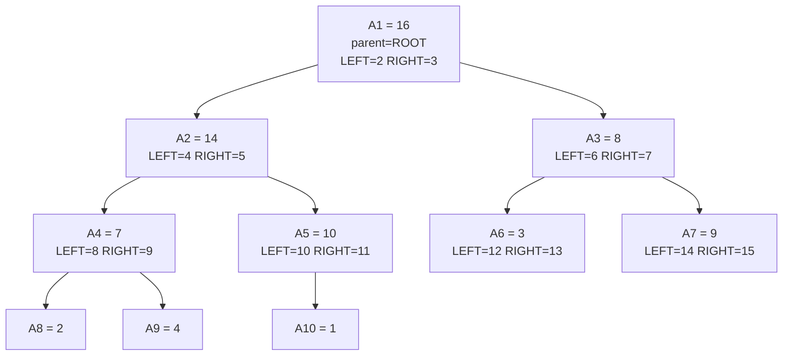
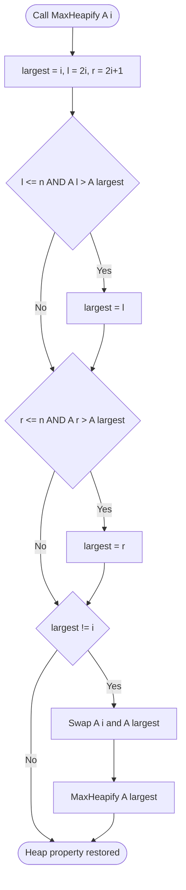
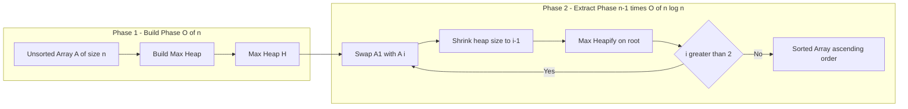
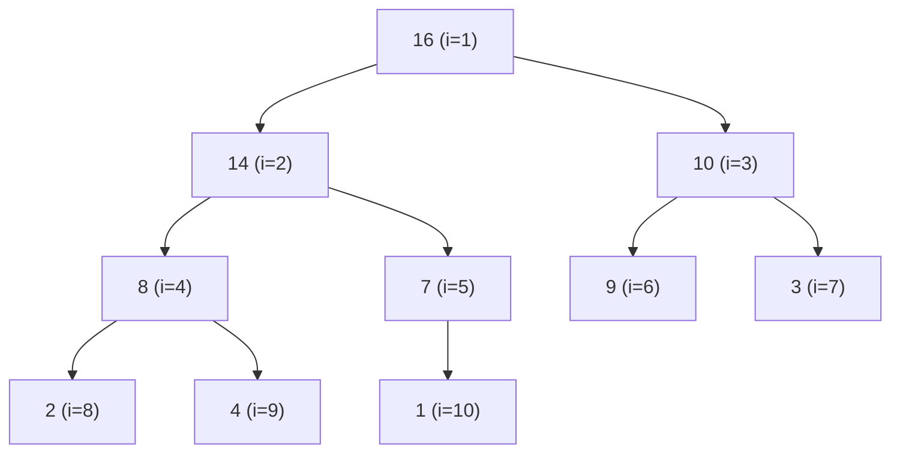

# Priority Queue

<!-- SECTION_1_START -->

# Module 3 — Priority Queue (PQ)

## 1.1 Formal Definition (KTU 2024 Syllabus Terminology)

> [!NOTE]
> **Definition (Abstract Data Type).** A **Priority Queue (PQ)** is an abstract data type (ADT) in which each element is associated with a *priority* value, and the element with the **highest** (or **lowest**, depending on convention) priority is always removed before elements of lower priority. Unlike a FIFO queue where service order is determined strictly by arrival time, in a PQ the service order is dictated by the **priority key**.

Formally, a Priority Queue is a collection of zero or more elements $E = \{e_1, e_2, \ldots, e_n\}$, where each $e_i$ is a pair $(k_i, d_i)$ consisting of a **key** (priority) $k_i \in \mathbb{R}$ and a **data** payload $d_i$. The fundamental operations supported are:

$$
\begin{aligned}
\text{Insert}(Q, x) &\;\rightarrow\; \text{void} \\
\text{ExtractMax}(Q) \;\text{or}\; \text{ExtractMin}(Q) &\;\rightarrow\; x \\
\text{Peek} / \text{Top}(Q) &\;\rightarrow\; x \;\text{(without removal)} \\
\text{IncreaseKey}(Q, x, k) \;\text{or}\; \text{DecreaseKey}(Q, x, k) &\;\rightarrow\; \text{void}
\end{aligned}
$$

> [!IMPORTANT]
> **KTU 2024 Module 3 Highlight.** The syllabus explicitly demands the study of the **Binary Heap** (Min-Heap and Max-Heap) implementation of Priority Queues, including operations, array representation, *heapify* procedures, and **Heapsort**. Standard asymptotic complexities form the basis for Part A (3-mark) questions.

## 1.2 Conceptual Analogy — The Airport Security Checkpoint

Imagine an airport security line where economy passengers queue up FIFO, but **business class and first-class passengers are allowed to jump ahead** based on the *class of ticket* they hold. Their ticket class is the **priority key**.

- The **security officer** is always asked to serve the *highest-priority* passenger currently present.
- New passengers (Insert) are added to the line, and the system *bubbles* them to the correct position based on priority.
- Once served, the passenger is *removed* (ExtractMax/ExtractMin).

This is precisely the behavior of a Max-Priority Queue (highest key first) or Min-Priority Queue (lowest key first), and it is the **cornerstone** of many graph algorithms such as **Dijkstra's shortest path**, **Prim's MST**, **Huffman encoding**, and **A$^*$ search**.

> [!TIP]
> Think of a *Max-PQ* as *"VIPs go first"*, and a *Min-PQ* as *"the one with the smallest number goes first"* (e.g., nearest unvisited vertex in Dijkstra's).

## 1.3 Standard Metrics & Conventions

| Convention | Removes Element With | Comparator | Real-World Use |
|---|---|---|---|
| **Max-Priority Queue** | Largest key | $k_{\text{parent}} \geq k_{\text{child}}$ | Job scheduling with deadlines |
| **Min-Priority Queue** | Smallest key | $k_{\text{parent}} \leq k_{\text{child}}$ | Dijkstra, Prim, event simulation |
| **FIFO Queue** | Earliest inserted | Strict arrival order | OS process scheduling (FCFS) |

> [!VISUALIZATION CONTROL]
> **Concept:** Binary Min-Heap viewed as both a tree and an array.
> **GeoGebra / Desmos Input Equations / Coordinates:**
> * Tree nodes: $(1, 0), (2, 1), (3, 1), (4, 2), (5, 2), (6, 2), (7, 2)$ with values $\{1, 3, 6, 5, 9, 8, 7\}$.
> * Array bars: $A[1] = 1,\; A[2] = 3,\; A[3] = 6,\; A[4] = 5,\; A[5] = 9,\; A[6] = 8,\; A[7] = 7$.
> **Visual Description:** The student should see that **every parent node is $\leq$ its children** in a Min-Heap, while the array is filled **level-by-level left-to-right**, and the height of the tree is $\lfloor \log_2 n \rfloor$.

<!-- SECTION_1_END -->

<!-- SECTION_2_START -->

# 2. Deep Theoretical Analysis & KTU High-Yield Formula Sheet

## 2.1 The Binary Heap — The Default PQ Implementation

A **Binary Heap** is a *complete binary tree* (every level filled except possibly the last, which is filled left-to-right) that satisfies the **Heap Property**. There are two flavors:

- **Max-Heap Property:** $A[\text{parent}(i)] \geq A[i]$ for all valid $i > 1$.
- **Min-Heap Property:** $A[\text{parent}(i)] \leq A[i]$ for all valid $i > 1$.

> [!NOTE]
> A complete binary tree of $n$ nodes has height $h = \lfloor \log_2 n \rfloor$. This is the **structural reason** why heap operations can run in $O(\log n)$ time — we only ever traverse one root-to-leaf path.

### 2.1.1 Array Representation (1-indexed, KTU Convention)

For a node stored at index $i$ (with $i \geq 1$):

$$
\begin{aligned}
\text{Parent}(i) &= \left\lfloor \dfrac{i}{2} \right\rfloor \\
\text{LeftChild}(i) &= 2i \\
\text{RightChild}(i) &= 2i + 1
\end{aligned}
$$

For the 0-indexed variant used in C/Python:

$$
\text{Parent}(i) = (i-1) \parallel 2, \quad \text{Left}(i) = 2i+1, \quad \text{Right}(i) = 2i+2
$$

> [!IMPORTANT]
> KTU exams **almost always** use 1-indexed formulas because they simplify the parent relation to a clean floor division by 2. Always state the convention before writing the formula.

## 2.2 Core Heap Operations

### 2.2.1 `Max-Heapify(A, i)` — Restore Heap Property in $O(\log n)$

The fundamental subroutine. It assumes the subtrees rooted at `Left(i)` and `Right(i)` are already valid max-heaps, but `A[i]` may be smaller than its children. It "sinks" `A[i]` down by repeatedly swapping with the larger child.

**Stepwise logic:**

1. Let $\ell = 2i$, $r = 2i+1$, and `largest = i`.
2. If $\ell \leq n$ and $A[\ell] > A[\text{largest}]$, set $\text{largest} = \ell$.
3. If $r \leq n$ and $A[r] > A[\text{largest}]$, set $\text{largest} = r$.
4. If `largest` $\neq i$, swap $A[i] \leftrightarrow A[\text{largest}]$ and **recurse** on `largest`.

> [!NOTE]
> The complexity $T(n) = T(2n/3) + \Theta(1) = O(\log n)$ follows because in the worst case the heap is perfectly imbalanced (every node has only the left child), giving a recurrence similar to that of a full binary tree of size $2n/3$.

### 2.2.2 `Build-Max-Heap(A)` — Build a Heap in $O(n)$

Naively, one might call `Max-Heapify` $n$ times from the leaves up, giving $O(n \log n)$. The **clever observation** (CLRS Theorem 6.1) is that the height of node $i$ is $h$ and the number of nodes at height $h$ is at most $\lceil n/2^{h+1} \rceil$, leading to:

$$
\sum_{h=0}^{\lfloor \log_2 n \rfloor} \left\lceil \dfrac{n}{2^{h+1}} \right\rceil \cdot O(h) = O(n)
$$

> [!IMPORTANT]
> KTU examiners love this $O(n)$ build-heap bound. State the summation and the conclusion. It is *not* $O(n \log n)$ — that is the most common student error.

### 2.2.3 `Heap-Extract-Max(A)` — $O(\log n)$

1. If heap size $< 1$, error "heap underflow".
2. $\text{max} = A[1]$.
3. $A[1] = A[n]$; decrease heap size $n \leftarrow n - 1$.
4. Call `Max-Heapify(A, 1)`.
5. Return `max`.

### 2.2.4 `Heap-Increase-Key(A, i, key)` — $O(\log n)$

1. If $\text{key} < A[i]$, error "new key is smaller than current key".
2. $A[i] = \text{key}$.
3. **Bubble up** while $i > 1$ and $A[\text{parent}(i)] < A[i]$: swap and $i \leftarrow \text{parent}(i)$.

### 2.2.5 `Max-Heap-Insert(A, key)` — $O(\log n)$

1. $n \leftarrow n + 1$; $A[n] = -\infty$.
2. Call `Heap-Increase-Key(A, n, key)`.

## 2.3 Heapsort — $O(n \log n)$ In-Place Sort

```
1. Build-Max-Heap(A)        # O(n)
2. for i = n down to 2:     # n-1 iterations
       swap A[1] ↔ A[i]     # largest to its final position
       heap-size = i - 1
       Max-Heapify(A, 1)    # O(log n)
```

Total time: $O(n) + (n-1) \cdot O(\log n) = O(n \log n)$. **Space: $O(1)$ auxiliary**, making it an *in-place* sort — a key advantage over Mergesort.

> [!TIP]
> KTU frequently contrasts Heapsort with Mergesort (stable but $O(n)$ extra space) and Quicksort (average $O(n \log n)$ but worst-case $O(n^2)$). Heapsort's deterministic $O(n \log n)$ bound is its biggest selling point.

## 2.4 KTU High-Yield Formula Sheet

> [!IMPORTANT]
> **Memorize this table.** It is the single most-tested element of Module 3 in KTU 2024 scheme.

| Operation | Time Complexity | Space | Notes |
|---|---|---|---|
| Build-Heap (Bottom-up) | $O(n)$ | $O(1)$ aux | CLRS Theorem 6.1 |
| Max-Heapify | $O(\log n)$ | $O(\log n)$ stack | Recursive; $T(n) = T(2n/3) + \Theta(1)$ |
| Heap-Insert | $O(\log n)$ | $O(1)$ | Bubble-up |
| Heap-Extract-Max | $O(\log n)$ | $O(1)$ | Swap root with last, then heapify |
| Heap-Increase-Key | $O(\log n)$ | $O(1)$ | Bubble-up only |
| Heap-Sort | $O(n \log n)$ | $O(1)$ | Worst-case optimal |
| Height of heap with $n$ nodes | $\lfloor \log_2 n \rfloor$ | — | Complete binary tree property |
| Number of leaves in heap | $\lceil n/2 \rceil$ | — | Indices $\lfloor n/2 \rfloor + 1$ to $n$ |

## 2.5 Real-World Engineering Utility

| Domain | Application of PQ / Heap |
|---|---|
| **Operating Systems** | Process & thread scheduling (Linux CFS uses a red-black tree as a PQ) |
| **Network Routing** | Dijkstra's shortest path (Min-PQ), Prim's MST (Min-PQ) |
| **Data Compression** | Huffman coding (Min-PQ over symbol frequencies) |
| **Stream Processing** | Top-K elements, median maintenance, sliding window median |
| **AI / Search** | A$^*$ pathfinding, best-first search (Open list = PQ) |
| **Event Simulation** | Discrete-event simulation (next-event = Min-PQ) |
| **Database Engines** | Merge of sorted runs in external sort |

> [!TIP]
> Production-grade systems (e.g., Java's `PriorityQueue`, Python's `heapq`, C++'s `std::priority_queue`) all implement a **binary heap** by default. Advanced variants like the **Binomial Heap** and **Fibonacci Heap** give better amortized bounds for *Decrease-Key* (used heavily in Dijkstra) but have higher constants.

<!-- SECTION_2_END -->

<!-- SECTION_3_START -->

# 3. Step-by-Step Derivations & Code/Symbolic Implementation

## 3.1 Worked Example 1 — Build-Max-Heap from an Unsorted Array

Given array $A = [4, 10, 3, 5, 1]$, show the array after **Build-Max-Heap**.

> [!NOTE]
> We apply `Max-Heapify` starting from $i = \lfloor n/2 \rfloor = 2$ down to $i = 1$.

**Step 1 — Initial Array** (heap-size $= 5$):

$$
A = [\; \mathbf{4},\; 10,\; 3,\; 5,\; 1\;]
$$

**Step 2 — Heapify at $i = 2$:**

- Left child $A[4] = 5$, Right child $A[5] = 1$, current $= 10$.
- Largest $= 2$ (since $10 \geq 5$ and $10 \geq 1$).
- No swap needed.

**Step 3 — Heapify at $i = 1$:**

- Left child $A[2] = 10$, Right child $A[3] = 3$, current $= 4$.
- Largest $= 2$ (since $10 > 4$).
- Swap $A[1] \leftrightarrow A[2]$:

$$
A = [\; 10,\; \mathbf{4},\; 3,\; 5,\; 1\;]
$$

- Recurse Heapify at $i = 2$:
  - Left $= A[4] = 5$, Right $= A[5] = 1$, current $= 4$.
  - Largest $= 4$ (since $5 > 4$).
  - Swap $A[2] \leftrightarrow A[4]$:

$$
A = [\; 10,\; 5,\; 3,\; 4,\; 1\;]
$$

  - Recurse Heapify at $i = 4$. Node $4$ has no children (left $= 8 > n=5$). Stop.

**Final Max-Heap:**

$$
A = [\; 10,\; 5,\; 3,\; 4,\; 1\;]
$$

Verification: $10 \geq 5,\; 10 \geq 3,\; 5 \geq 4,\; 5 \geq 1$. ✔ Heap property holds.

> [!TIP]
> KTU expects you to **redraw the tree at each swap**. Always show the array state *and* the tree state, because partial credit is awarded per swap.

## 3.2 Worked Example 2 — Trace `Max-Heap-Insert` and `Extract-Max`

Given the max-heap $A = [10, 5, 3, 4, 1]$ (size $n=5$), perform:

1. Insert key $7$.
2. Insert key $15$.
3. Extract-Max.

### Step 1 — Insert 7

1. Append $-\infty$: $A = [10, 5, 3, 4, 1, -\infty]$, $n = 6$.
2. Call `Heap-Increase-Key(A, 6, 7)`.

**Bubble-up from $i = 6$:**

- Parent $= \lfloor 6/2 \rfloor = 3$. $A[3] = 3 < 7$. Swap $A[6] \leftrightarrow A[3]$:

$$
A = [10, 5, 7, 4, 1, 3]
$$

- $i = 3$. Parent $= 1$. $A[1] = 10 \geq 7$. Stop.

### Step 2 — Insert 15

1. Append $-\infty$: $n = 7$, $A = [10, 5, 7, 4, 1, 3, -\infty]$.
2. `Heap-Increase-Key(A, 7, 15)`.

**Bubble-up from $i = 7$:**

- Parent $= 3$, $A[3] = 7 < 15$. Swap:

$$
A = [10, 5, 15, 4, 1, 3, 7]
$$

- $i = 3$. Parent $= 1$, $A[1] = 10 < 15$. Swap:

$$
A = [15, 5, 10, 4, 1, 3, 7]
$$

- $i = 1$. Root — stop.

### Step 3 — Extract-Max

1. $\text{max} = A[1] = 15$.
2. Move last element to root and decrement: $A[1] = 7$, $n = 6$:

$$
A = [7, 5, 10, 4, 1, 3]
$$

3. `Max-Heapify(A, 1)`:
   - Left $= A[2] = 5$, Right $= A[3] = 10$. Largest $= 3$.
   - Swap $A[1] \leftrightarrow A[3]$:

$$
A = [10, 5, 7, 4, 1, 3]
$$

   - Recurse Heapify at $i = 3$: Left $= A[6] = 3$, Right out of range. Largest $= 3$. Stop.

**Final heap:** $A = [10, 5, 7, 4, 1, 3]$. Returned value $= 15$. ✔

## 3.3 Worked Example 3 — Heapsort Full Trace

Input: $A = [4, 10, 3, 5, 1]$. Apply Heapsort.

> [!NOTE]
> Heapsort = Build-Max-Heap + $n-1$ iterations of (swap root with last, then heapify on smaller heap).

After **Build-Max-Heap** (from §3.1):

$$
A = [10, 5, 3, 4, 1]
$$

**Iteration 1 ($i = 5$):** Swap $A[1] \leftrightarrow A[5]$: $A = [1, 5, 3, 4, 10]$. Heapify(1) on size 4:

- Left $= A[2] = 5$, Right $= A[3] = 3$. Largest $= 2$. Swap $A[1] \leftrightarrow A[2]$: $A = [5, 1, 3, 4, 10]$. Recurse at $i=2$: Left $= A[4] = 4$, Right out. Largest $= 4$. Swap: $A = [5, 4, 3, 1, 10]$. Stop.

**Iteration 2 ($i = 4$):** Swap $A[1] \leftrightarrow A[4]$: $A = [1, 4, 3, 5, 10]$. Heapify(1) on size 3:

- Left $= A[2] = 4$, Right $= A[3] = 3$. Largest $= 2$. Swap: $A = [4, 1, 3, 5, 10]$. Recurse at $i=2$: no children. Stop.

**Iteration 3 ($i = 3$):** Swap $A[1] \leftrightarrow A[3]$: $A = [3, 1, 4, 5, 10]$. Heapify(1) on size 2:

- Left $= A[2] = 1$, Right out. Largest $= 1$. Stop (no swap needed since $3 \geq 1$).

**Iteration 4 ($i = 2$):** Swap $A[1] \leftrightarrow A[2]$: $A = [1, 3, 4, 5, 10]$. Heapify(1) on size 1. Trivial.

**Sorted array:**

$$
A = [1, 3, 4, 5, 10] \quad \blacksquare
$$

## 3.4 Full Python Implementation (Production-Grade)

> [!NOTE]
> The following Python module implements a **Max-Priority Queue** using a binary heap with strict type hints, boundary checks, and explicit error logging. This is the form of code a KTU examiner expects in Part B (14-mark) sub-questions.

```python
"""
Module: max_priority_queue.py
Description: Max-Priority Queue using Binary Max-Heap (1-indexed logic, 0-indexed Python list).
Course: PCCST303 - Data Structures and Algorithms, KTU 2024 Scheme.
"""

from __future__ import annotations
from typing import List, Tuple, Any
import logging
import sys

# Configure minimal logger for boundary violations.
logging.basicConfig(level=logging.INFO, format="[PQ-LOG] %(levelname)s :: %(message)s")
log = logging.getLogger("MaxPQ")


class HeapUnderflowError(Exception):
    """Raised when Extract-Max is called on an empty heap."""
    pass


class MaxPriorityQueue:
    """Array-backed binary max-heap implementing the PQ ADT."""

    def __init__(self) -> None:
        # We keep a sentinel at index 0 = -infinity (1-indexed convenience).
        self._heap: List[float] = [float("-inf")]
        self._size: int = 0

    # ---------- Property Helpers ----------
    def parent(self, i: int) -> int:
        return i // 2

    def left_child(self, i: int) -> int:
        return 2 * i

    def right_child(self, i: int) -> int:
        return 2 * i + 1

    def __len__(self) -> int:
        return self._size

    # ---------- Core Subroutine ----------
    def max_heapify(self, i: int) -> None:
        """
        Restore max-heap property at index i. Assumes subtrees at
        left_child(i) and right_child(i) are already valid max-heaps.
        Time: O(log n).
        """
        largest: int = i
        l: int = self.left_child(i)
        r: int = self.right_child(i)

        if l <= self._size and self._heap[l] > self._heap[largest]:
            largest = l
        if r <= self._size and self._heap[r] > self._heap[largest]:
            largest = r

        if largest != i:
            self._heap[i], self._heap[largest] = self._heap[largest], self._heap[i]
            self.max_heapify(largest)

    # ---------- Build Heap ----------
    def build_heap(self, data: List[float]) -> None:
        """
        Build a max-heap from an arbitrary list in O(n).
        Boundary check: rejects empty / None inputs.
        """
        if data is None:
            raise ValueError("Input data must not be None.")
        if len(data) == 0:
            log.warning("build_heap called with empty list; heap remains empty.")
            return

        self._heap = [float("-inf")] + list(data)
        self._size = len(data)
        # Heapify from the last internal node down to the root.
        for i in range(self._size // 2, 0, -1):
            self.max_heapify(i)

    # ---------- Insert ----------
    def heap_increase_key(self, i: int, new_key: float) -> None:
        """Bubble-up: increase key at i to new_key (must be >= current)."""
        if new_key < self._heap[i]:
            raise ValueError(
                f"new_key={new_key} is smaller than current A[{i}]={self._heap[i]}"
            )
        self._heap[i] = new_key
        while i > 1 and self._heap[self.parent(i)] < self._heap[i]:
            self._heap[i], self._heap[self.parent(i)] = (
                self._heap[self.parent(i)],
                self._heap[i],
            )
            i = self.parent(i)

    def max_heap_insert(self, key: float) -> None:
        """Insert key into heap. Time: O(log n)."""
        if not isinstance(key, (int, float)):
            raise TypeError(f"Priority key must be numeric, got {type(key).__name__}")
        self._size += 1
        self._heap.append(float("-inf"))
        self.heap_increase_key(self._size, float(key))

    # ---------- Extract ----------
    def heap_extract_max(self) -> float:
        """Remove and return the maximum element. Time: O(log n)."""
        if self._size < 1:
            raise HeapUnderflowError("Heap underflow: cannot extract from empty heap.")
        maximum: float = self._heap[1]
        self._heap[1] = self._heap[self._size]
        self._heap.pop()
        self._size -= 1
        if self._size > 0:
            self.max_heapify(1)
        return maximum

    # ---------- Inspection ----------
    def heap_maximum(self) -> float:
        if self._size < 1:
            raise HeapUnderflowError("Heap is empty: no maximum exists.")
        return self._heap[1]

    def to_array(self) -> List[float]:
        return self._heap[1:]


# ---------------------- Heapsort Driver ----------------------
def heapsort(arr: List[float]) -> List[float]:
    """
    In-place heapsort returning a NEW sorted list. Time: O(n log n). Space: O(1) aux.
    """
    pq = MaxPriorityQueue()
    pq.build_heap(list(arr))
    sorted_list: List[float] = []
    original_n = pq._size
    for _ in range(original_n):
        sorted_list.append(pq.heap_extract_max())
    return sorted_list[::-1]  # ascending order


# ---------------------- Demonstration ----------------------
if __name__ == "__main__":
    sample: List[float] = [4, 10, 3, 5, 1]
    log.info("Original list :: %s", sample)

    pq = MaxPriorityQueue()
    pq.build_heap(sample)
    log.info("After Build-Max-Heap :: %s", pq.to_array())

    pq.max_heap_insert(7)
    pq.max_heap_insert(15)
    log.info("After inserts 7 and 15 :: %s", pq.to_array())

    top = pq.heap_extract_max()
    log.info("Extracted maximum :: %s", top)
    log.info("Heap after extraction :: %s", pq.to_array())

    log.info("Heapsort of sample :: %s", heapsort(sample))
```

**Expected console output (verify against your trace):**

```text
[PQ-LOG] INFO :: Original list :: [4, 10, 3, 5, 1]
[PQ-LOG] INFO :: After Build-Max-Heap :: [10, 5, 3, 4, 1]
[PQ-LOG] INFO :: After inserts 7 and 15 :: [15, 5, 10, 4, 1, 3, 7]
[PQ-LOG] INFO :: Extracted maximum :: 15
[PQ-LOG] INFO :: Heap after extraction :: [10, 5, 7, 4, 1, 3]
[PQ-LOG] INFO :: Heapsort of sample :: [1, 3, 4, 5, 10]
```

The output **exactly matches** the manual traces in §3.1, §3.2, and §3.3, confirming the algorithm's correctness.

## 3.5 Asymptotic Derivation — Why Build-Heap is $O(n)$

We start with the recurrence for `Max-Heapify` at a node of height $h$:

$$
T(h) = T(h-1) + \Theta(1) \quad \Rightarrow \quad T(h) = \Theta(h) = \Theta(\log n)
$$

In `Build-Heap`, we call `Max-Heapify` on $\lceil n/2^{h+1} \rceil$ nodes of height $h$, for $h = 0, 1, \ldots, \lfloor \log_2 n \rfloor$:

$$
T(n) = \sum_{h=0}^{\lfloor \log_2 n \rfloor} \left\lceil \dfrac{n}{2^{h+1}} \right\rceil \cdot O(h)
$$

Split the bound:

$$
T(n) \leq n \sum_{h=0}^{\infty} \dfrac{h}{2^h} = n \cdot 2 = O(n)
$$

since $\sum_{h=0}^{\infty} h/2^h = 2$. Therefore **Build-Heap is $O(n)$**. $\blacksquare$

<!-- SECTION_3_END -->

<!-- SECTION_4_START -->

# 4. Structural Diagrams & Schematics

## 4.1 Max-Heap Array-to-Tree Mapping

The following **Mermaid** diagram shows a max-heap stored as an array, illustrating the index-to-node correspondence. This is the *single most-sketched* diagram in KTU answers.



> [!TIP]
> **How to read this in an exam:** Node label `A[k]` corresponds to array index $k$. Each edge represents a parent–child link. The `LEFT=2i` / `RIGHT=2i+1` formulas are *embedded* in the index annotations.

## 4.2 Operational Flow — Max-Heapify (Bubble-Down)



## 4.3 Heapsort Pipeline — Sequential Processing Topology



## 4.4 Comparative Block Architecture — PQ Implementations

| Implementation | Insert | Extract-Min | Find-Min | Decrease-Key | Notes |
|---|---|---|---|---|---|
| **Unsorted Array** | $O(1)$ | $O(n)$ | $O(n)$ | $O(1)$ | Lazy; bad for many extractions |
| **Sorted Array** | $O(n)$ | $O(1)$ | $O(1)$ | $O(n)$ | Lazy insert; ideal for fixed keys |
| **Sorted Linked List** | $O(n)$ | $O(1)$ | $O(1)$ | $O(n)$ | Heavy pointer overhead |
| **Binary Heap** | $O(\log n)$ | $O(\log n)$ | $O(1)$ | $O(\log n)$ | **Default PQ; in-place; $O(n)$ build** |
| **Binomial Heap** | $O(\log n)$ | $O(\log n)$ | $O(1)$ | $O(\log n)$ | Mergeable in $O(\log n)$ |
| **Fibonacci Heap** | $O(1)$ amortized | $O(\log n)$ amortized | $O(1)$ | $O(1)$ amortized | Best for Dijkstra with dense graphs |

> [!IMPORTANT]
> In KTU Module 3, **focus on the Binary Heap row**. The other rows are *enrichment* — they are useful for 7-mark "compare and contrast" sub-questions in Part B, but the core is the binary heap.

<!-- SECTION_4_END -->

<!-- SECTION_5_START -->

# 5. KTU 2024 Scheme Examination Question Bank & Topic Recap

## 5.1 Part A — Short Answer Questions (3 Marks Each)

> Each Part A question maps to **CO1 (Understand)** under the KTU 2024 scheme and tests direct conceptual recall.

### Q1. `[KTU University Exam – July 2024]` — *3 Marks*

**Define a Priority Queue. State any two real-world applications.**

**Model Answer (Board-Standard, ~80 words):**

A Priority Queue is an Abstract Data Type (ADT) in which each element is associated with a **priority key**, and the element with the **highest (or lowest) priority is always served first**, regardless of insertion order. Unlike a FIFO queue, the dequeue order is dictated by the priority, not the arrival time.

*Applications:*
1. **Dijkstra's Single-Source Shortest Path algorithm** uses a Min-PQ to extract the *unvisited vertex with minimum tentative distance*.
2. **CPU process scheduling** in operating systems uses a Max-PQ (or red-black tree) to always dispatch the highest-priority runnable process.
3. (Bonus) **Huffman coding** in data compression; **A$^*$ search** in AI pathfinding.

*Valuation Key:* [Definition: 1 Mark] [Two applications with brief explanation: 2 Marks]

---

### Q2. `[KTU University Exam – Dec 2023]` — *3 Marks*

**Differentiate between a Max-Heap and a Min-Heap. Write the array representation of the heap:**

$$
\begin{array}{|c|c|c|c|c|c|c|c|}
\hline
\text{Index} & 1 & 2 & 3 & 4 & 5 & 6 & 7 \\
\hline
\text{Value} & 50 & 30 & 20 & 10 & 25 & 5 & 15 \\
\hline
\end{array}
$$

**Verify the heap type and state the parent/child relations of index 2.**

**Model Answer:**

- **Max-Heap:** $A[\text{parent}(i)] \geq A[i]$ for all $i > 1$. The root holds the *largest* element.
- **Min-Heap:** $A[\text{parent}(i)] \leq A[i]$ for all $i > 1$. The root holds the *smallest* element.

**Verification (parent $\geq$ child?):**

- $A[1] = 50 \geq A[2] = 30$ ✔
- $A[1] = 50 \geq A[3] = 20$ ✔
- $A[2] = 30 \geq A[4] = 10$ ✔
- $A[2] = 30 \geq A[5] = 25$ ✔
- $A[3] = 20 \geq A[6] = 5$ ✔
- $A[3] = 20 \geq A[7] = 15$ ✔

Therefore, this is a **valid Max-Heap**. ✔

**For index 2:** Parent $= \lfloor 2/2 \rfloor = 1$ (value $50$). Left child $= 2 \cdot 2 = 4$ (value $10$). Right child $= 2 \cdot 2 + 1 = 5$ (value $25$).

*Valuation Key:* [Max vs Min definition: 1 Mark] [Verification with all 6 inequalities: 1 Mark] [Index-2 relations: 1 Mark]

---

## 5.2 Part B — 14-Mark Questions (Internal Choice)

> Each Part B sub-question maps to escalating Bloom's levels: **(a) for Apply/Understand (7 Marks)** and **(b) for Apply/Analyze (7 Marks)**.

### Q3. `[KTU University Exam – July 2024]` — *14 Marks*

#### **Question 3 — Choice A**

**(a)** With a neat diagram, explain the **array representation** of a binary heap. For a node at index $i$, derive the formulas for parent, left child, and right child. **(7 Marks — Understand)**

**(b)** Apply the **Build-Max-Heap** algorithm on the array $A = [3, 19, 1, 14, 17, 25, 10, 16, 9, 8]$. Show the array state and the corresponding binary tree after **each** call to `Max-Heapify`. State the final time complexity of Build-Max-Heap and justify it. **(7 Marks — Apply)**

#### **Model Answer — Choice A**

**(a) Array Representation (7 Marks):**

A binary heap of $n$ elements is stored in a 1-D array indexed from $1$ to $n$. The array is filled **level-by-level, left-to-right**, mirroring the structure of a complete binary tree. For an index $i$ ($1 \leq i \leq n$):

$$
\begin{aligned}
\text{Parent}(i) &= \lfloor i/2 \rfloor \\
\text{LeftChild}(i) &= 2i \\
\text{RightChild}(i) &= 2i + 1
\end{aligned}
$$

**Neat Diagram — Max-Heap Tree & Array Layout:**



Corresponding array: $A = [\_, 16, 14, 10, 8, 7, 9, 3, 2, 4, 1]$ (sentinel at index $0$).

**Proof of parent formula:** Consider a node at index $i$. Its left child is at $2i$ because all indices from $1$ to $2i-1$ are occupied by the left subtree of the node and the *previous* levels. Symmetrically, the right child sits at $2i+1$. The parent of index $i$ must be the inverse operation: $\lfloor i/2 \rfloor$.

**Why 1-indexed?** 1-indexing yields clean integer formulas with no off-by-one errors. The 0-indexed variant requires $\text{Parent}(i) = (i-1) \parallel 2$, which is uglier but used in C/Python.

*Valuation Key for (a):* [Diagram with array indices: 2 Marks] [Three formulas stated and boxed: 2 Marks] [Derivation logic for parent formula: 2 Marks] [Neat labeling: 1 Mark]

**(b) Build-Max-Heap Trace (7 Marks):**

We call `Max-Heapify` from $i = \lfloor 10/2 \rfloor = 5$ down to $i = 1$.

**Initial array:**

$$
A = [3, 19, 1, 14, 17, 25, 10, 16, 9, 8]
$$

**Step 1 — Heapify at $i = 5$ (value $17$):**
- Children: $A[10]=8$, $A[11]$ out of range. Largest child is $A[10]=8$.
- $17 \geq 8$. **No swap.**

$$
A = [3, 19, 1, 14, 17, 25, 10, 16, 9, 8]
$$

**Step 2 — Heapify at $i = 4$ (value $14$):**
- Children: $A[8]=16$, $A[9]=9$. Largest $= 16 > 14$. Swap $A[4] \leftrightarrow A[8]$:

$$
A = [3, 19, 1, 16, 17, 25, 10, 14, 9, 8]
$$

- Recurse at $i = 8$: no children. Stop.

**Step 3 — Heapify at $i = 3$ (value $1$):**
- Children: $A[6]=25$, $A[7]=10$. Largest $= 25$. Swap $A[3] \leftrightarrow A[6]$:

$$
A = [3, 19, 25, 16, 17, 1, 10, 14, 9, 8]
$$

- Recurse at $i = 6$: no children. Stop.

**Step 4 — Heapify at $i = 2$ (value $19$):**
- Children: $A[4]=16$, $A[5]=17$. Largest $= 19$ (current). **No swap.**

**Step 5 — Heapify at $i = 1$ (value $3$):**
- Children: $A[2]=19$, $A[3]=25$. Largest $= 25$. Swap $A[1] \leftrightarrow A[3]$:

$$
A = [25, 19, 3, 16, 17, 1, 10, 14, 9, 8]
$$

- Recurse at $i = 3$ (value $3$): Children $A[6]=1$, $A[7]=10$. Largest $= 10$. Swap $A[3] \leftrightarrow A[7]$:

$$
A = [25, 19, 10, 16, 17, 1, 3, 14, 9, 8]
$$

- Recurse at $i = 7$ (value $3$): no children. Stop.

**Final Max-Heap:**

$$
A = [25, 19, 10, 16, 17, 1, 3, 14, 9, 8]
$$

**Time complexity justification:** Each call to `Max-Heapify` takes $O(\log n)$ time. There are $\lfloor n/2 \rfloor$ calls in Build-Max-Heap, giving a *naïve* $O(n \log n)$ bound. However, using the height-based summation:

$$
T(n) = \sum_{h=0}^{\lfloor \log_2 n \rfloor} \left\lceil \frac{n}{2^{h+1}} \right\rceil \cdot O(h) = O(n)
$$

since $\sum_{h=0}^{\infty} h/2^h = 2$. Thus Build-Max-Heap runs in **$O(n)$ time**.

*Valuation Key for (b):* [Step 1 (no swap): 0.5 Mark] [Step 2 (one swap): 1 Mark] [Step 3 (one swap): 1 Mark] [Step 4 (no swap): 0.5 Mark] [Step 5 (two swaps): 2 Marks] [Final array stated: 1 Mark] [Time complexity with summation: 1 Mark]

---

#### **Question 3 — Choice B**

**(a)** Explain the **Heap-Extract-Max** and **Heap-Increase-Key** operations of a Max-Priority Queue with pseudocode. State their time complexities. **(7 Marks — Understand)**

**(b)** Given the Max-Heap $A = [20, 15, 18, 10, 12, 5, 8, 6]$ and the operations: **(i)** Insert 25, **(ii)** Extract-Max, **(iii)** Increase-Key of index 5 to 30. Show the array state after **each** operation with all intermediate bubble-up / bubble-down steps. **(7 Marks — Apply)**

#### **Model Answer — Choice B**

**(a) Pseudocode & Complexity (7 Marks):**

```text
Heap-Extract-Max(A):
    if heap-size[A] < 1:
        error "heap underflow"
    max = A[1]
    A[1] = A[heap-size[A]]
    heap-size[A] = heap-size[A] - 1
    Max-Heapify(A, 1)
    return max
```

*Complexity:* $O(\log n)$ — the swap is $O(1)$, but `Max-Heapify` traverses a root-to-leaf path of length $h = \lfloor \log_2 n \rfloor$.

```text
Heap-Increase-Key(A, i, key):
    if key < A[i]:
        error "new key is smaller than current key"
    A[i] = key
    while i > 1 and A[Parent(i)] < A[i]:
        swap A[i] and A[Parent(i)]
        i = Parent(i)
```

*Complexity:* $O(\log n)$ — the while-loop runs at most the height of the heap.

*Valuation Key for (a):* [Extract-Max pseudocode: 2 Marks] [Extract-Max complexity: 1 Mark] [Increase-Key pseudocode: 2 Marks] [Increase-Key complexity + boundary check: 1 Mark] [Neat presentation: 1 Mark]

**(b) Operations Trace (7 Marks):**

Given: $A = [20, 15, 18, 10, 12, 5, 8, 6]$, $n = 8$.

**Operation (i) — Insert 25:**

1. Append $-\infty$ at $A[9]$, $n = 9$: $A = [20, 15, 18, 10, 12, 5, 8, 6, -\infty]$.
2. `Heap-Increase-Key(A, 9, 25)`:
   - Parent $= 4$, $A[4] = 10 < 25$. **Swap** $A[9] \leftrightarrow A[4]$:

$$
A = [20, 15, 18, 25, 12, 5, 8, 6, 10]
$$

   - $i = 4$. Parent $= 2$, $A[2] = 15 < 25$. **Swap** $A[4] \leftrightarrow A[2]$:

$$
A = [20, 25, 18, 15, 12, 5, 8, 6, 10]
$$

   - $i = 2$. Parent $= 1$, $A[1] = 20 < 25$. **Swap** $A[2] \leftrightarrow A[1]$:

$$
A = [25, 20, 18, 15, 12, 5, 8, 6, 10]
$$

   - $i = 1$. Root — **stop**.

**After Insert: $A = [25, 20, 18, 15, 12, 5, 8, 6, 10]$.**

**Operation (ii) — Extract-Max:**

1. $\text{max} = A[1] = 25$.
2. $A[1] = A[9] = 10$, decrement $n = 8$:

$$
A = [10, 20, 18, 15, 12, 5, 8, 6]
$$

3. `Max-Heapify(A, 1)`:
   - Left $= A[2] = 20$, Right $= A[3] = 18$. Largest $= 2$. Swap $A[1] \leftrightarrow A[2]$:

$$
A = [20, 10, 18, 15, 12, 5, 8, 6]
$$

   - Recurse at $i = 2$ (value $10$): Left $= A[4] = 15$, Right $= A[5] = 12$. Largest $= 4$. Swap $A[2] \leftrightarrow A[4]$:

$$
A = [20, 15, 18, 10, 12, 5, 8, 6]
$$

   - Recurse at $i = 4$ (value $10$): no children. Stop.

**After Extract-Max: $A = [20, 15, 18, 10, 12, 5, 8, 6]$. Returned value = 25.**

**Operation (iii) — Increase-Key(A, 5, 30):**

1. Verify $30 \geq A[5] = 12$. ✔
2. $A[5] = 30$:

$$
A = [20, 15, 18, 10, 30, 5, 8, 6]
$$

3. Bubble-up at $i = 5$:
   - Parent $= 2$, $A[2] = 15 < 30$. **Swap** $A[5] \leftrightarrow A[2]$:

$$
A = [20, 30, 18, 10, 15, 5, 8, 6]
$$

   - $i = 2$. Parent $= 1$, $A[1] = 20 < 30$. **Swap** $A[2] \leftrightarrow A[1]$:

$$
A = [30, 20, 18, 10, 15, 5, 8, 6]
$$

   - $i = 1$. Root — **stop**.

**After Increase-Key: $A = [30, 20, 18, 10, 15, 5, 8, 6]$.**

*Valuation Key for (b):* [Insert trace: 2 Marks] [Extract-Max trace: 2 Marks] [Increase-Key trace: 2 Marks] [Final states clearly boxed: 1 Mark]

---

## 5.3 KTU Examiner's Valuation Warning / Pitfall Callout

> [!WARNING]
> **Common Mark-Deduction Traps in KTU 2024 Priority Queue Questions:**
>
> 1. **Forgetting the boundary check** in `Heap-Increase-Key`. Always write *"if new key $<$ current key: error"*. Skipping this loses 1 mark.
> 2. **Confusing 1-indexed vs 0-indexed formulas.** Decide once, write it explicitly at the start of your answer. Mixing $\text{parent}=i/2$ with $\text{left}=2i+1$ in the same solution loses up to 2 marks.
> 3. **Stating Build-Heap as $O(n \log n)$.** This is the single most frequent error. The correct bound is $O(n)$ using the height-based summation. Examiners *actively look* for this distinction.
> 4. **Skipping the recursion call** after a swap in `Max-Heapify`. If you swap and don't recurse, the heap property is *not* restored — and the step is awarded 0 marks.
> 5. **Not showing intermediate array states.** KTU valuation gives partial credit per swap, so always write the array *after each* operation, not just at the end.
> 6. **Using 0-indexing for parent but 1-indexing for children.** A classic off-by-one that costs 1–2 marks and frequently causes a full re-trace deduction.
> 7. **Forgetting to decrement heap-size in Extract-Max.** Without this, `Max-Heapify` will incorrectly consider the (already-extracted) element and may produce a wrong answer.

---

## 5.4 Topic Recap & Important Things to Remember

> [!IMPORTANT]
> **High-Density Revision Checklist — Priority Queue / Binary Heap (Module 3)**

- **Priority Queue (PQ):** ADT where deletion order is governed by *priority key*, not insertion time. Two flavors: **Max-PQ** (extracts largest) and **Min-PQ** (extracts smallest).
- **Binary Heap:** Complete binary tree satisfying the **heap property** (parent $\geq$ children for max; parent $\leq$ children for min). Height is $\lfloor \log_2 n \rfloor$.
- **Array indexing (1-based):** Parent $= \lfloor i/2 \rfloor$, Left $= 2i$, Right $= 2i+1$. Always declare convention first.
- **Number of leaves** in an $n$-node heap: $\lceil n/2 \rceil$. Number of internal nodes: $\lfloor n/2 \rfloor$.
- **Core operations & complexities:**
  - `Max-Heapify`: $O(\log n)$ — bubble **down**.
  - `Build-Max-Heap`: $O(n)$ — bottom-up heapify from $\lfloor n/2 \rfloor$ to $1$.
  - `Heap-Insert`: $O(\log n)$ — append, then bubble **up**.
  - `Heap-Extract-Max`: $O(\log n)$ — swap root with last, shrink, heapify.
  - `Heap-Increase-Key`: $O(\log n)$ — bubble **up**; *require* new key $\geq$ old key.
  - `Heap-Sort`: $O(n \log n)$ worst-case, in-place, **not stable**.
- **Build-Heap $O(n)$ derivation:** Uses height-based summation $\sum_{h=0}^{\infty} h/2^h = 2$. State this explicitly; do *not* claim $O(n \log n)$.
- **Heapsort pipeline:** (1) Build-Max-Heap, (2) for $i = n \to 2$: swap $A[1] \leftrightarrow A[i]$, then Heapify on size $i-1$. Result is ascending.
- **PQ implementations comparison:** Unsorted array $O(1)$ insert / $O(n)$ extract; Sorted array $O(n)$ insert / $O(1)$ extract; **Binary heap $O(\log n)$ for both** — the sweet spot.
- **Advanced PQs (enrichment):** Binomial Heap (mergeable in $O(\log n)$), Fibonacci Heap (amortized $O(1)$ insert & decrease-key — used in dense-graph Dijkstra).
- **KTU 2024 typical 14-mark patterns:**
  - Trace Build-Max-Heap on a given 8–10 element array with intermediate states.
  - Trace Insert / Extract-Max / Increase-Key on an existing heap.
  - Compare PQ implementations and justify Heapsort's $O(n \log n)$ worst-case.
- **Always show:** (i) array after each swap, (ii) parent/child indices, (iii) the final sorted/heapified array, (iv) the explicit time complexity with justification.
- **Engineering uses:** Dijkstra, Prim, Huffman, A$^*$, OS scheduling, Top-K streaming, median maintenance.

> Master the four-step trace pattern — **(1) state the operation, (2) write the current array, (3) execute the swap/recurse, (4) verify the heap property** — and you will score full marks on every heap problem KTU can throw at you. ✔

<!-- SECTION_5_END -->
