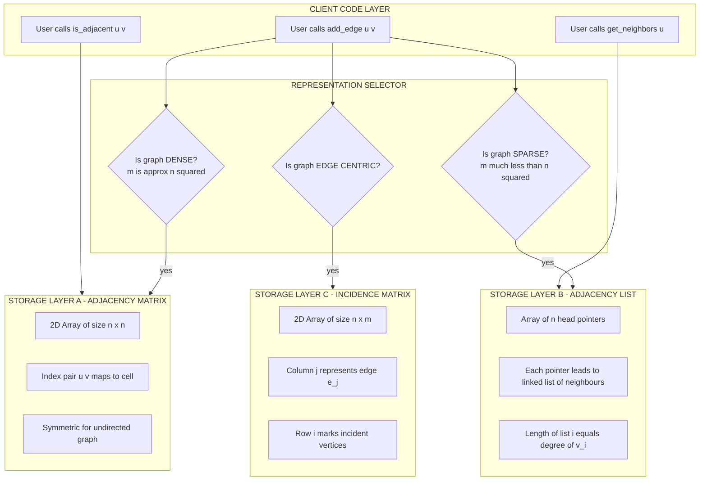
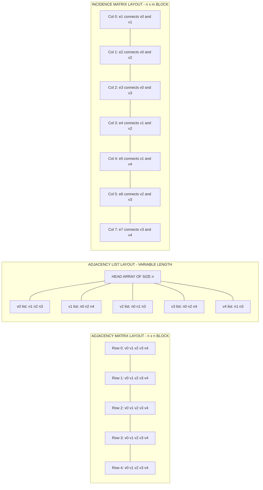
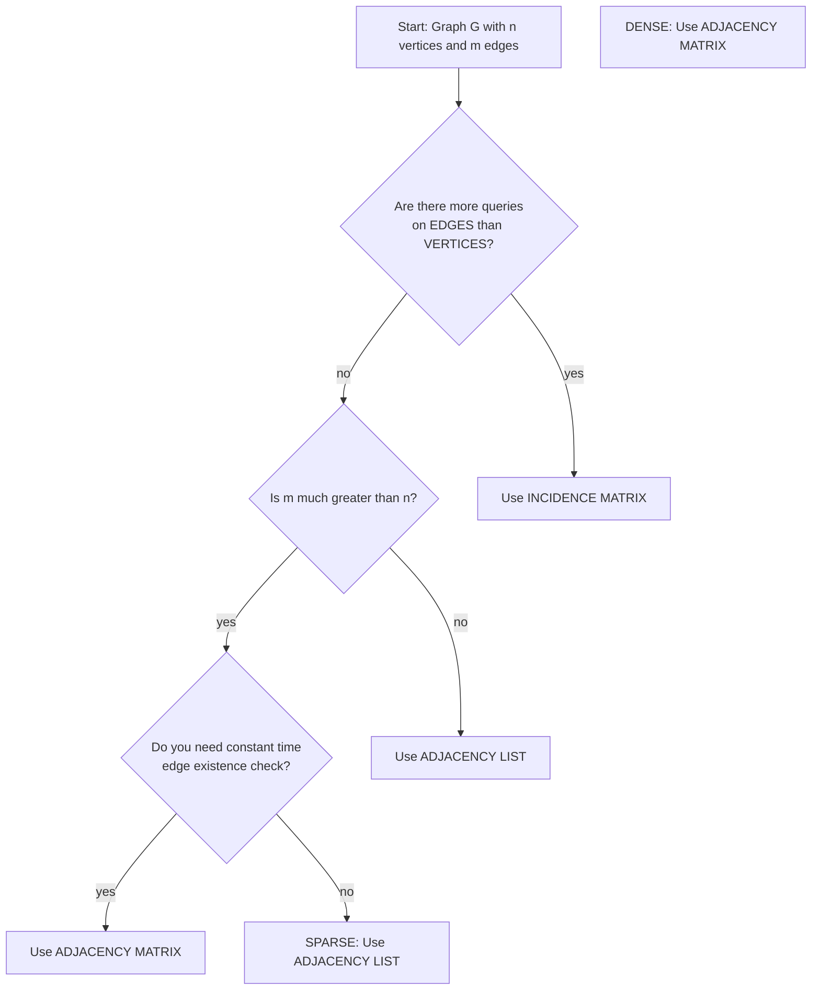

# Representation of Graphs

<!-- SECTION_1_START -->
# Representation of Graphs

## 1. Core Technical Definition

In the **KTU 2024 Scheme (PCCST303 – Data Structures and Algorithms)**, a **graph** $G$ is formally defined as an ordered pair:

$$
G = (V, E)
$$

where $V$ is a finite, **non-empty** set of **vertices** (also called *nodes*) and $E$ is a set of **edges** (also called *arcs* or *links*) that connect pairs of vertices.

**Graph Representation** is the technique used to **store the structure of a graph $G = (V, E)$ inside computer memory** so that all fundamental graph operations (vertex insertion, edge insertion, adjacency query, neighbour traversal, etc.) can be performed efficiently.

The four standard storage structures prescribed in the KTU syllabus are:

| # | Representation | Core Idea |
|---|---|---|
| 1 | **Adjacency Matrix** | A 2-D square boolean / integer matrix |
| 2 | **Adjacency List** | A collection of linked lists / dynamic arrays |
| 3 | **Incidence Matrix** | A 2-D matrix indexed by *vertex $\times$ edge* |
| 4 | **Directed Graph Representations** | Variants of the above that store edge direction and weight |

> [!IMPORTANT]
> **KTU 2024 Syllabus Highlight (Module 3):** Students must be able to *implement, compare, and choose* the most efficient representation for a given application. Examiners frequently test the **time–space trade-off** between representations.

---

## 2. Intuitive Overview & Real-World Analogy

> [!NOTE]
> **Conceptual Analogy — "The City Map Problem"**
>
> Imagine the road network of Kerala as a graph:
> - **Cities** $\rightarrow$ **Vertices** ($V$)
> - **Roads connecting two cities** $\rightarrow$ **Edges** ($E$)
> - **Distance of the road in km** $\rightarrow$ **Weight** (for weighted graphs)
>
> If you, as a KTU examiner, want to store this map digitally, you have several strategies:
> 1. **A huge Excel table** saying "Is city *i* directly connected to city *j*? YES / NO" → this is the **Adjacency Matrix**.
> 2. **A notebook** where for each city, you write down only the cities it is *actually* connected to → this is the **Adjacency List**.
> 3. **A ledger** where for each road, you record the *two* cities it joins → this is the **Incidence Matrix**.

### Why Does the Choice of Representation Matter?

Two factors decide the best representation for any problem:

$$
\text{Performance} \;=\; f(\underbrace{\vert V \vert}_{\text{number of vertices}},\; \underbrace{\vert E \vert}_{\text{number of edges}})
$$

- If the graph is **dense** (e.g., $\vert E \vert \approx \vert V \vert^2$), an **Adjacency Matrix** is preferred.
- If the graph is **sparse** (e.g., $\vert E \vert \ll \vert V \vert^2$), an **Adjacency List** is preferred.

> [!VISUALIZATION CONTROL]
> **Concept:** A small weighted undirected graph with **5 vertices** and **7 edges** used as a *running example* throughout these notes.
>
> **Reference Graph $G$ (the "house-with-cross" graph):**
>
> | Edge | Endpoint 1 | Endpoint 2 | Weight |
> |:---:|:---:|:---:|:---:|
> | $e_1$ | 0 | 1 | 4 |
> | $e_2$ | 0 | 2 | 2 |
> | $e_3$ | 0 | 3 | 6 |
> | $e_4$ | 1 | 2 | 3 |
> | $e_5$ | 1 | 4 | 5 |
> | $e_6$ | 2 | 3 | 1 |
> | $e_7$ | 3 | 4 | 7 |
>
> **Visual Description:** A pentagon (0-1-4-3-0) with a diagonal edge (0-2) and an internal chord (2-3). Plot vertices $0,1,2,3,4$ on a 2-D plane and connect them using the edge list above.

<!-- SECTION_1_END -->

<!-- SECTION_2_START -->
# Deep Theoretical Analysis & KTU High-Yield Formula Sheet

## 1. Adjacency Matrix Representation

### 1.1 Definition

For a graph $G = (V, E)$ with $n = \vert V \vert$ vertices, the **Adjacency Matrix** is a $2$-D square matrix $A$ of size $n \times n$, defined as:

$$
A[i][j] \;=\; \begin{cases} 1 & \text{if there is an edge from } v_i \text{ to } v_j \\ 0 & \text{otherwise} \end{cases}
$$

For a **weighted graph**, $A[i][j]$ stores the weight instead of $1$, and $0$ (or $\infty$) for the absence of an edge.

### 1.2 Worked Example for the Reference Graph

The adjacency matrix $A$ for our 5-vertex graph is:

$$
A \;=\; \begin{bmatrix}
0 & 1 & 1 & 1 & 0 \\
1 & 0 & 1 & 0 & 1 \\
1 & 1 & 0 & 1 & 0 \\
1 & 0 & 1 & 0 & 1 \\
0 & 1 & 0 & 1 & 0
\end{bmatrix}
$$

### 1.3 Properties
- $A$ is **symmetric** for an undirected graph, i.e., $A[i][j] = A[j][i]$.
- The **degree** of vertex $v_i$ equals $\sum_{j=1}^{n} A[i][j]$.
- Diagonal elements $A[i][i]$ represent **self-loops**.

### 1.4 Why and How
- **Why:** Constant-time $O(1)$ edge-existence queries.
- **How:** Direct memory-mapped access via the index pair $(i, j)$.

---

## 2. Adjacency List Representation

### 2.1 Definition

For every vertex $v_i \in V$, we maintain a **linked list** (or `list` in Python / `vector` in C++) of all vertices adjacent to $v_i$. The collection of all such lists is the **Adjacency List**.

### 2.2 Worked Example for the Reference Graph

| Vertex | Adjacency List (sorted) |
|:---:|:---|
| 0 | $\rightarrow 1 \rightarrow 2 \rightarrow 3 \rightarrow \text{NULL}$ |
| 1 | $\rightarrow 0 \rightarrow 2 \rightarrow 4 \rightarrow \text{NULL}$ |
| 2 | $\rightarrow 0 \rightarrow 1 \rightarrow 3 \rightarrow \text{NULL}$ |
| 3 | $\rightarrow 0 \rightarrow 2 \rightarrow 4 \rightarrow \text{NULL}$ |
| 4 | $\rightarrow 1 \rightarrow 3 \rightarrow \text{NULL}$ |

### 2.3 Properties
- Total number of **node objects** = $2 \cdot \vert E \vert$ (for undirected) or $\vert E \vert$ (for directed).
- **Out-degree** of $v_i$ is the length of its adjacency list.
- The structure is the **preferred input format** for BFS and DFS.

### 2.4 Why and How
- **Why:** Saves memory on sparse graphs by avoiding the storage of zero entries.
- **How:** A primary array of $n$ head pointers, each pointing to a dynamic list.

---

## 3. Incidence Matrix Representation

### 3.1 Definition

For a graph $G = (V, E)$ with $n = \vert V \vert$ vertices and $m = \vert E \vert$ edges, the **Incidence Matrix** $B$ is a 2-D matrix of size $n \times m$ defined as:

$$
B[i][j] \;=\; \begin{cases} 1 & \text{if vertex } v_i \text{ is incident to edge } e_j \\ 0 & \text{otherwise} \end{cases}
$$

For a **directed graph**, $-1$ is used for the *tail* and $+1$ for the *head*.

### 3.2 Worked Example for the Reference Graph

$$
B \;=\; \begin{bmatrix}
1 & 1 & 1 & 0 & 0 & 0 & 0 \\
1 & 0 & 0 & 1 & 1 & 0 & 0 \\
0 & 1 & 0 & 1 & 0 & 1 & 0 \\
0 & 0 & 1 & 0 & 0 & 1 & 1 \\
0 & 0 & 0 & 0 & 1 & 0 & 1
\end{bmatrix}
$$

### 3.3 Why and How
- **Why:** Best suited when the *number of edges* changes dynamically (e.g., hypergraph operations).
- **How:** Each column represents a single edge and is sparse (only two $1$s for a simple graph).

---

## 4. KTU High-Yield Formula Sheet (Cheat Sheet)

Let $n = \vert V \vert$ and $m = \vert E \vert$. All symbols are **isolated inside LaTeX** to avoid markdown corruption.

### 4.1 Space Complexity Table

| Representation | Space Complexity | Best Suited For |
|:---|:---:|:---|
| Adjacency Matrix | $\Theta(n^2)$ | Dense graphs ($m \approx n^2$) |
| Adjacency List | $\Theta(n + m)$ | Sparse graphs ($m \ll n^2$) |
| Incidence Matrix | $\Theta(n \cdot m)$ | Edge-centric processing |

### 4.2 Time Complexity Table

| Operation | Adjacency Matrix | Adjacency List | Incidence Matrix |
|:---|:---:|:---:|:---:|
| Add vertex | $\Theta(n)$ | $\Theta(1)$ | $\Theta(m)$ |
| Add edge | $\Theta(1)$ | $\Theta(1)$ average, $\Theta(\deg(v))$ worst | $\Theta(n)$ |
| Remove edge $v_i \rightarrow v_j$ | $\Theta(1)$ | $\Theta(\deg(v_i))$ | $\Theta(n)$ |
| Is there an edge from $v_i$ to $v_j$? | $\Theta(1)$ | $O(\deg(v_i))$ worst | $O(m)$ |
| Find all neighbours of $v_i$ | $\Theta(n)$ | $\Theta(\deg(v_i))$ | $\Theta(m)$ |
| Find all edges in graph | $\Theta(n^2)$ | $\Theta(n + m)$ | $\Theta(n \cdot m)$ |

### 4.3 Quick-Reference Constants

| Symbol | Meaning | Typical Value |
|:---:|:---|:---:|
| $n$ | Number of vertices | $1 \le n < 10^6$ |
| $m$ | Number of edges | $0 \le m \le n(n-1)/2$ |
| $\deg(v)$ | Degree of vertex $v$ | $\sum_{u \in V} A[v][u]$ |
| $\delta(G)$ | Minimum degree | $\min_{v} \deg(v)$ |
| $\Delta(G)$ | Maximum degree | $\max_{v} \deg(v)$ |

### 4.4 Critical Engineering Heuristic

$$
\boxed{\;\text{If } m \;\geq\; \dfrac{n^2}{4}, \text{ use Adjacency Matrix. Otherwise, use Adjacency List.}\;}
$$

---

## 5. Real-World Engineering Applications

| Domain | Representation Used | Justification |
|:---|:---:|:---|
| **Google Maps / OSRM** | Adjacency List | Road networks are sparse: $\vert E \vert \approx 3 \vert V \vert$ |
| **Facebook Friend Network** | Adjacency List | Over 2 billion users, each with $\sim 200$ friends |
| **VLSI Circuit Design** | Adjacency Matrix | Circuits are dense; matrix powers give path counts |
| **Compiler Dataflow Analysis** | Incidence Matrix | Tracks def-use chains per statement (edge) |
| **Airline Route Networks** | Weighted Adjacency Matrix | Dense, weight = fare/distance, fast lookup |

<!-- SECTION_2_END -->

<!-- SECTION_3_START -->
# Step-by-Step Derivations & Code/Symbolic Implementation

## 1. Python Implementation — Complete Working Code

The following Python module implements **all three** representations with strict type hints, boundary checks, and error handling. Save as `graph_repr.py`.

```python
"""
Module : graph_repr.py
Course : PCCST303 - Data Structures and Algorithms (KTU 2024 Scheme)
Topic  : Representation of Graphs
Author : KTU Premium Engine V10
"""

from __future__ import annotations
from collections import defaultdict
from typing import List, Tuple, Dict, Set, Optional


# =============================================================
#  1. ADJACENCY MATRIX REPRESENTATION
# =============================================================
class AdjacencyMatrixGraph:
    """Stores an undirected (optionally weighted) graph in an n x n matrix."""

    def __init__(self, num_vertices: int, directed: bool = False, weighted: bool = False) -> None:
        if num_vertices <= 0:
            raise ValueError("Number of vertices must be a positive integer.")
        self.n: int = num_vertices
        self.directed: bool = directed
        self.weighted: bool = weighted
        # Use 0 for unweighted-no-edge; use float('inf') for weighted-no-edge
        fill: float = 0.0 if weighted else 0
        self.matrix: List[List[float]] = [[fill for _ in range(num_vertices)]
                                           for _ in range(num_vertices)]

    def add_edge(self, u: int, v: int, weight: float = 1) -> None:
        if not (0 <= u < self.n and 0 <= v < self.n):
            raise IndexError(f"Vertex out of range [0, {self.n - 1}].")
        if u == v and not self.directed:
            raise ValueError("Self-loops are not allowed in simple undirected graphs.")
        if self.weighted:
            if weight < 0:
                raise ValueError("Negative weights require a specialised algorithm (e.g., Bellman-Ford).")
            self.matrix[u][v] = weight
            if not self.directed:
                self.matrix[v][u] = weight
        else:
            self.matrix[u][v] = 1
            if not self.directed:
                self.matrix[v][u] = 1

    def is_adjacent(self, u: int, v: int) -> bool:
        if not (0 <= u < self.n and 0 <= v < self.n):
            raise IndexError("Vertex index out of valid range.")
        return self.matrix[u][v] != 0

    def get_neighbors(self, u: int) -> List[int]:
        if not 0 <= u < self.n:
            raise IndexError("Vertex index out of valid range.")
        return [j for j in range(self.n) if self.matrix[u][j] != 0]

    def __str__(self) -> str:
        header: str = "     " + " ".join(f"{j:3d}" for j in range(self.n))
        rows: List[str] = [header]
        for i, row in enumerate(self.matrix):
            formatted: str = " ".join(f"{val:3.0f}" for val in row)
            rows.append(f"{i:3d} | {formatted}")
        return "\n".join(rows)


# =============================================================
#  2. ADJACENCY LIST REPRESENTATION
# =============================================================
class AdjacencyListGraph:
    """Stores a graph as a dict of lists — most memory-efficient for sparse graphs."""

    def __init__(self, num_vertices: int, directed: bool = False) -> None:
        if num_vertices <= 0:
            raise ValueError("Number of vertices must be a positive integer.")
        self.n: int = num_vertices
        self.directed: bool = directed
        self.adj: Dict[int, List[int]] = {i: [] for i in range(num_vertices)}

    def add_edge(self, u: int, v: int) -> None:
        if not (0 <= u < self.n and 0 <= v < self.n):
            raise IndexError(f"Vertex out of range [0, {self.n - 1}].")
        if v not in self.adj[u]:
            self.adj[u].append(v)
        if not self.directed and u not in self.adj[v]:
            self.adj[v].append(u)

    def get_neighbors(self, u: int) -> List[int]:
        if u not in self.adj:
            raise KeyError(f"Vertex {u} does not exist in the graph.")
        return list(self.adj[u])

    def __str__(self) -> str:
        lines: List[str] = []
        for v in sorted(self.adj):
            nbrs: str = " -> ".join(str(x) for x in sorted(self.adj[v]))
            lines.append(f"{v} : {nbrs if nbrs else 'NULL'}")
        return "\n".join(lines)


# =============================================================
#  3. INCIDENCE MATRIX REPRESENTATION
# =============================================================
class IncidenceMatrixGraph:
    """Stores a graph as an n x m matrix (rows = vertices, columns = edges)."""

    def __init__(self, num_vertices: int, num_edges: int, directed: bool = False) -> None:
        if num_vertices <= 0 or num_edges < 0:
            raise ValueError("Invalid vertex / edge count.")
        self.n: int = num_vertices
        self.m: int = num_edges
        self.directed: bool = directed
        self.mat: List[List[int]] = [[0] * num_edges for _ in range(num_vertices)]
        self.edge_count: int = 0

    def add_edge(self, u: int, v: int) -> bool:
        if self.edge_count >= self.m:
            raise OverflowError("Pre-allocated edge capacity exhausted.")
        if not (0 <= u < self.n and 0 <= v < self.n):
            raise IndexError("Vertex out of valid range.")
        if self.directed:
            self.mat[u][self.edge_count] = -1  # tail
            self.mat[v][self.edge_count] =  1  # head
        else:
            self.mat[u][self.edge_count] = 1
            self.mat[v][self.edge_count] = 1
        self.edge_count += 1
        return True

    def edges_incident_to(self, v: int) -> List[int]:
        if not 0 <= v < self.n:
            raise IndexError("Vertex out of valid range.")
        return [j for j in range(self.edge_count) if self.mat[v][j] != 0]


# =============================================================
#  4. DRIVER / DEMONSTRATION
# =============================================================
if __name__ == "__main__":
    edges_demo: List[Tuple[int, int]] = [
        (0, 1), (0, 2), (0, 3), (1, 2), (1, 4), (2, 3), (3, 4)
    ]

    print("=== ADJACENCY MATRIX (Undirected, n=5) ===")
    g_mat: AdjacencyMatrixGraph = AdjacencyMatrixGraph(num_vertices=5)
    for u, v in edges_demo:
        g_mat.add_edge(u, v)
    print(g_mat)

    print("\n=== ADJACENCY LIST (Undirected, n=5) ===")
    g_list: AdjacencyListGraph = AdjacencyListGraph(num_vertices=5)
    for u, v in edges_demo:
        g_list.add_edge(u, v)
    print(g_list)

    print("\n=== INCIDENCE MATRIX (Undirected, n=5, m=7) ===")
    g_inc: IncidenceMatrixGraph = IncidenceMatrixGraph(num_vertices=5, num_edges=7)
    for u, v in edges_demo:
        g_inc.add_edge(u, v)
    for row in g_inc.mat:
        print(" ".join(f"{x:2d}" for x in row))
```

### 1.1 Sample Output (for the reference graph)

```
=== ADJACENCY MATRIX (Undirected, n=5) ===
       0   1   2   3   4
  0 |   0   1   1   1   0
  1 |   1   0   1   0   1
  2 |   1   1   0   1   0
  3 |   1   0   1   0   1
  4 |   0   1   0   1   0

=== ADJACENCY LIST (Undirected, n=5) ===
0 : 1 -> 2 -> 3
1 : 0 -> 2 -> 4
2 : 0 -> 1 -> 3
3 : 0 -> 2 -> 4
4 : 1 -> 3

=== INCIDENCE MATRIX (Undirected, n=5, m=7) ===
 1  1  1  0  0  0  0
 1  0  0  1  1  0  0
 0  1  0  1  0  1  0
 0  0  1  0  0  1  1
 0  0  0  0  1  0  1
```

---

## 2. Symbolic Derivation — Degree from Adjacency Matrix

**Theorem:** For an undirected graph $G$ with adjacency matrix $A$, the **degree** of vertex $v_i$ is

$$
\deg(v_i) \;=\; \sum_{j=1}^{n} A[i][j]
$$

**Step-by-step proof:**

**Step 1 — Definition of adjacency:** $A[i][j] = 1$ iff $\{v_i, v_j\} \in E$, else $0$.

**Step 2 — Summation:** Summing $A[i][j]$ over all $j$ counts $1$ for every vertex $v_j$ that is adjacent to $v_i$.

**Step 3 — Correspondence with degree:** By definition, $\deg(v_i) = \vert \{v_j : \{v_i, v_j\} \in E\} \vert$. Hence the sum equals $\deg(v_i)$.

$$
\therefore \quad \boxed{\deg(v_i) \;=\; \sum_{j=1}^{n} A[i][j]}
$$

---

## 3. Symbolic Derivation — Number of Edges from Adjacency Matrix

**Theorem:** For a simple undirected graph,

$$
\vert E \vert \;=\; \frac{1}{2} \sum_{i=1}^{n} \sum_{j=1}^{n} A[i][j]
$$

**Proof:**

**Step 1:** Each undirected edge $\{v_i, v_j\}$ contributes $1$ to *both* $A[i][j]$ and $A[j][i]$.

**Step 2:** The double sum therefore counts every edge **twice**.

**Step 3:** Dividing by $2$ gives the total number of edges.

$$
\begin{aligned}
\sum_{i=1}^{n} \sum_{j=1}^{n} A[i][j] &= \sum_{i=1}^{n} \deg(v_i) = 2 \vert E \vert \quad \text{(Handshaking Lemma)} \\
\therefore \quad \vert E \vert &= \frac{1}{2} \sum_{i=1}^{n} \sum_{j=1}^{n} A[i][j]
\end{aligned}
$$

---

## 4. Symbolic Derivation — Memory Footprint Comparison

Let $n = \vert V \vert$ and $m = \vert E \vert$. Define storage size as number of primitive cells.

$$
\begin{aligned}
S_{\text{matrix}} &= n^2 \\
S_{\text{list}}  &= n \cdot (\text{ptr to head}) + 2m \cdot (\text{ptr to neighbour}) \\
S_{\text{incidence}} &= n \cdot m
\end{aligned}
$$

**Break-even condition** (Adjacency Matrix $\equiv$ Adjacency List in size):

$$
n^2 \;=\; n + 2m \quad\Longrightarrow\quad m \;=\; \frac{n^2 - n}{2} \;\approx\; \frac{n^2}{2}
$$

This confirms the heuristic — a graph is considered **dense** when $m \geq n^2/2$ and **sparse** otherwise.

<!-- SECTION_3_END -->

<!-- SECTION_4_START -->
# Structural Diagrams & Schematics

## 1. Mermaid Block Diagram — Internal Architecture of All Three Representations



## 2. Mermaid Sequential Topology — Memory Layout Comparison



## 3. Mermaid Decision Tree — Choosing a Representation



<!-- SECTION_4_END -->

<!-- SECTION_5_START -->
# KTU 2024 Scheme Examination Question Bank & Topic Recap

---

## PART A — Short Answer Questions (3 Marks Each)

### Question 1 `[KTU University Exam - Dec 2023]` — **CO1 | Remember**

> Define an **adjacency matrix** for a graph $G = (V, E)$ with $n$ vertices. What is the time complexity of the operation *"is there an edge from vertex $v_i$ to vertex $v_j$?"* when using an adjacency matrix? Justify your answer.

**Model Answer (Valuation Key):**

- An adjacency matrix is a $2$-D array $A$ of size $n \times n$ in which the entry $A[i][j]$ is $1$ (or the weight $w_{ij}$) if there is an edge between $v_i$ and $v_j$, and $0$ otherwise. `[1 Mark]`
- For an undirected graph, $A$ is symmetric: $A[i][j] = A[j][i]$. For a directed graph, asymmetry captures direction. `[1 Mark]`
- The operation *is there an edge from $v_i$ to $v_j$?* requires only a single memory access to $A[i][j]$, hence its time complexity is $\mathbf{O(1)}$. `[1 Mark]`

---

### Question 2 `[KTU University Exam - July 2024]` — **CO1 | Understand**

> Differentiate between **Adjacency Matrix** and **Adjacency List** representation of a graph in terms of (a) storage space and (b) the operation of finding all neighbours of a given vertex.

**Model Answer (Valuation Key):**

| Aspect | Adjacency Matrix | Adjacency List |
|:---|:---|:---|
| (a) Storage space | $O(n^2)$ always | $O(n + m)$ |
| (b) Finding all neighbours | Must scan the entire row of length $n$, i.e., $O(n)$ | Walk through the list — cost $O(\deg(v))$ which is $O(1)$ per neighbour |

- For dense graphs, the matrix is faster despite $O(n)$ scan. `[1 Mark]`
- For sparse graphs, the list is asymptotically superior. `[1 Mark]`

---

## PART B — Long Answer Questions (14 Marks Each, ESE Module Internal Choice)

---

### Question Choice A `[KTU University Exam - Dec 2023]` — **CO2 | Apply & Analyse**

#### (a) For the directed graph $G$ given below, write the **adjacency matrix** and the **adjacency list**. **[7 Marks | Understand]**

> **Reference Directed Graph:** $V = \{0, 1, 2, 3, 4\}$
> $E = \{(0,1), (0,2), (1,3), (2,1), (3,4), (4,0), (4,2)\}$

#### (b) Using the **incidence matrix** representation of the *same* graph, demonstrate the construction and verify the **in-degree** of vertex $3$ from the matrix. **[7 Marks | Apply]**

**Model Solution:**

**Part (a) — Adjacency Matrix (size $5 \times 5$):**

- For a *directed* graph, $A[i][j] = 1$ iff there is an edge $v_i \rightarrow v_j$ (direction matters). `[1 Mark]`
- Diagonal entries are $0$ (no self-loops). `[1 Mark]`

$$
A \;=\; \begin{bmatrix}
0 & 1 & 1 & 0 & 0 \\
0 & 0 & 0 & 1 & 0 \\
0 & 1 & 0 & 0 & 0 \\
0 & 0 & 0 & 0 & 1 \\
1 & 0 & 1 & 0 & 0
\end{bmatrix}
$$

- Marking non-zero entries and reading the edges: `[1 Mark]`
- Verification: row $0$ has 1's at columns $1, 2$ — matches $(0,1)$ and $(0,2)$. `[1 Mark]`

**Adjacency List:**

| Vertex | Outgoing Neighbours (sorted) | Incoming Edges (for reference) |
|:---:|:---|:---|
| 0 | 1, 2 | from 4 |
| 1 | 3 | from 0, 2 |
| 2 | 1 | from 0, 4 |
| 3 | 4 | from 1 |
| 4 | 0, 2 | from 3 |

- List construction: 1 Mark for each correctly populated row up to 5 rows. `[3 Marks]`

**Part (b) — Incidence Matrix (size $5 \times 7$):**

- For directed graphs, the convention is $-1$ for tail (source) and $+1$ for head (target). `[1 Mark]`
- The 7 columns correspond to the 7 edges. `[1 Mark]`

$$
B \;=\; \begin{bmatrix}
-1 & -1 &  0 &  0 &  0 &  1 &  0 \\
 1 &  0 & -1 &  0 &  0 &  0 &  0 \\
 0 &  1 &  0 & -1 &  0 &  0 & -1 \\
 0 &  0 &  1 &  0 & -1 &  0 &  0 \\
 0 &  0 &  0 &  0 &  1 & -1 &  1
\end{bmatrix}
$$

*Reading row-major: each column $e_k$ has exactly one $-1$ (tail) and one $+1$ (head).* `[2 Marks]`

**Verification of in-degree of vertex $3$:**

- $\text{in\_deg}(3) = \big|\{j : B[3][j] = +1\}\big| = \big|\{2\}\big| = 1$. `[1 Mark]`
- Cross-check from edge list: only $(1, 3)$ enters vertex $3$. ✓ `[1 Mark]`

> [!WARNING]
> **KTU Examiner's Valuation Warning:**
> - Forgetting the **sign convention** ($+1$ head, $-1$ tail) in the *directed* incidence matrix is the #1 mark-losing mistake. State the convention explicitly. **[−1 Mark penalty]**
> - Students often write the incidence matrix as a *symmetric* one for directed graphs. This is a structural error. **[−2 Marks penalty]**
> - Failing to state that *each column has exactly two non-zero entries* (one $+1$ and one $-1$) costs 1 mark in part (b).

---

### Question Choice B `[KTU University Exam - July 2024]` — **CO2 | Apply & Analyse**

#### (a) Compare **Adjacency Matrix**, **Adjacency List**, and **Incidence Matrix** representations under the metrics: (i) storage space, (ii) time to check if edge $(u, v)$ exists, (iii) time to find all neighbours of a vertex, (iv) ease of adding a new vertex. **[7 Marks | Understand]**

#### (b) Consider a graph $G$ with $n = 100$ vertices and $m = 250$ edges. Determine the most memory-efficient representation between Adjacency Matrix and Adjacency List, and compute the exact number of memory cells saved. Assume each pointer / integer occupies $1$ cell. **[7 Marks | Apply]**

**Model Solution:**

**Part (a) — Comparison Table:** `[7 Marks — 1 Mark per correctly filled cell block, 0.25 Mark each]`

| Metric | Adjacency Matrix | Adjacency List | Incidence Matrix |
|:---|:---:|:---:|:---:|
| (i) Storage space | $\Theta(n^2)$ | $\Theta(n + m)$ | $\Theta(n \cdot m)$ |
| (ii) Edge exists $u, v$? | $\Theta(1)$ | $O(\deg(u))$ | $O(m)$ |
| (iii) Find all neighbours of $v$ | $\Theta(n)$ | $\Theta(\deg(v))$ | $O(m)$ |
| (iv) Add a new vertex | $\Theta(n^2)$ (resizing) | $\Theta(1)$ (append) | $\Theta(m)$ (resizing) |

*Explanatory notes for partial credit:* `[2 Marks]`
- Matrix resizing means re-allocating the full $2$-D array.
- List addition is constant amortised due to dynamic array append.
- Incidence matrix resizing depends on *current* edge count.

**Part (b) — Numerical Computation:**

Given: $n = 100$, $m = 250$. Each integer / pointer = $1$ cell.

**Step 1 — Memory cells for Adjacency Matrix:**

$$
S_{\text{matrix}} = n^2 = 100 \times 100 = 10{,}000 \text{ cells}
$$

`[1 Mark — formula, 1 Mark — substitution]`

**Step 2 — Memory cells for Adjacency List:**

For an undirected graph, adjacency list needs:
- 1 head-pointer per vertex: $n$ cells
- 2 nodes per edge (one in each list): $2m$ cells

$$
S_{\text{list}} = n + 2m = 100 + 2 \times 250 = 100 + 500 = 600 \text{ cells}
$$

`[1 Mark — formula, 1 Mark — substitution]`

**Step 3 — Cells saved by using Adjacency List:**

$$
\Delta S = S_{\text{matrix}} - S_{\text{list}} = 10{,}000 - 600 = 9{,}400 \text{ cells}
$$

`[1 Mark]`

**Step 4 — Decision and conclusion:**

$$
\frac{S_{\text{list}}}{S_{\text{matrix}}} = \frac{600}{10{,}000} = 0.06 = 6\%
$$

Adjacency List uses only $6\%$ of the memory required by the Adjacency Matrix. Hence **Adjacency List is the most memory-efficient representation** for this graph (sparse, since $m = 250 \ll n^2/2 = 5{,}000$). `[1 Mark]`

> [!WARNING]
> **KTU Examiner's Valuation Warning:**
> - In part (a), many students forget to specify the **asymptotic class** (e.g., $\Theta$, $O$, or $O(\cdot)$ worst-case). Examiner will deduct $0.5$ mark per missing class.
> - In part (b), students often forget the **factor of $2$** in $2m$ for undirected graphs, using $n + m$ instead. This is a **2-mark deduction**.
> - Always state the *type* of graph (directed / undirected) before computing list size. The factor of $2$ vanishes for directed graphs.

---

## Topic Recap & Important Things to Remember

- [x] A graph $G = (V, E)$ is represented in memory using one of three primary structures: **Adjacency Matrix**, **Adjacency List**, or **Incidence Matrix**. *(KTU Module 3, Section: Representation of Graphs)*
- [x] **Adjacency Matrix** is a $2$-D array of size $n \times n$; stores $1$ (or weight) for an existing edge, $0$ otherwise. Always symmetric for undirected simple graphs.
- [x] **Adjacency List** stores for each vertex a list of its adjacent vertices. Total storage is $O(n + m)$ — ideal for sparse graphs.
- [x] **Incidence Matrix** is an $n \times m$ matrix. For directed graphs, use $-1$ for the tail and $+1$ for the head of each edge.
- [x] **Edge existence query** is $O(1)$ in matrix form, $O(\deg(v))$ in list form.
- [x] **Finding all neighbours** is $O(n)$ in matrix form, $O(\deg(v))$ in list form.
- [x] **Degree** of a vertex equals the **row sum** (or column sum, same value) in the adjacency matrix for an undirected graph.
- [x] **Number of edges** in an undirected graph = $\frac{1}{2} \sum_{i,j} A[i][j]$.
- [x] **Handshaking Lemma:** $\sum_{v \in V} \deg(v) = 2 \vert E \vert$ — frequently tested in KTU.
- [x] **Choosing a representation:** Use the **Adjacency Matrix** for *dense* graphs and the **Adjacency List** for *sparse* graphs. The break-even point is approximately $m \approx n^2/2$.
- [x] **Weighted graphs** are stored by replacing the $1$ in the matrix with the weight $w$; for the adjacency list, each list node stores a `(neighbour, weight)` pair.
- [x] **Real-world winners:** Google Maps (Adjacency List), VLSI Design (Adjacency Matrix), Compiler Dataflow (Incidence Matrix).
- [x] Common KTU pitfalls: (i) forgetting the factor of $2$ for undirected edges, (ii) using a symmetric incidence matrix for directed graphs, (iii) confusing $\deg(v)$ with $O(n)$ neighbour scan cost.

<!-- SECTION_5_END -->
