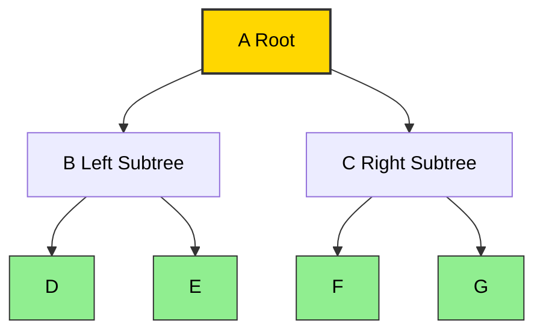
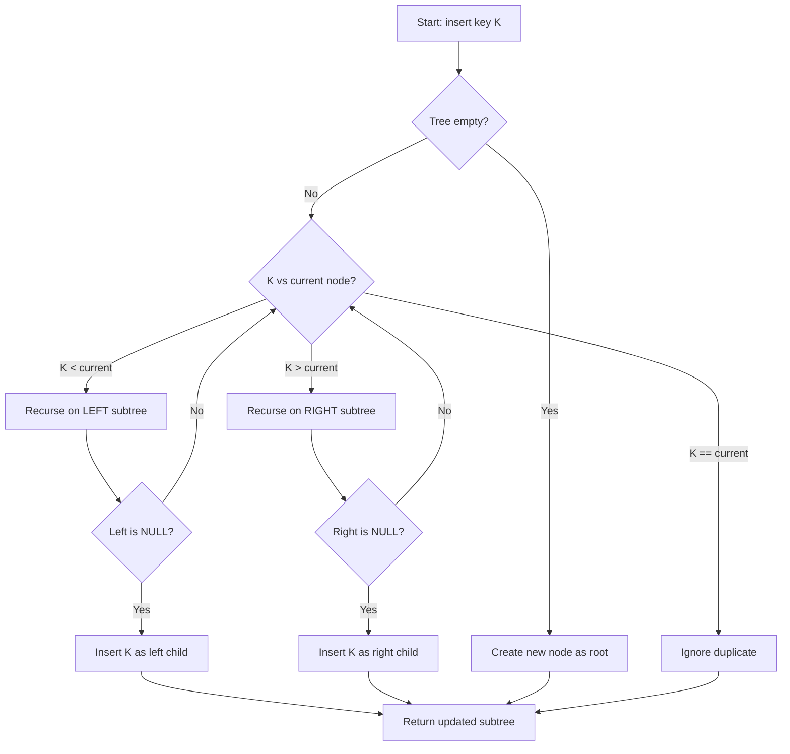
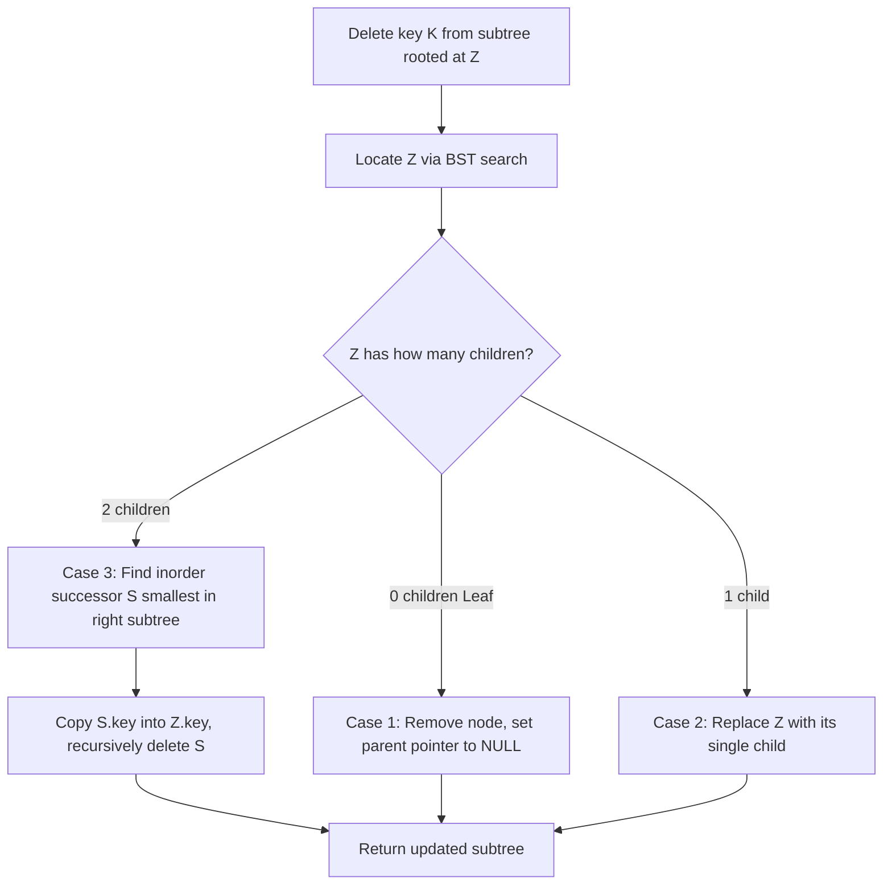
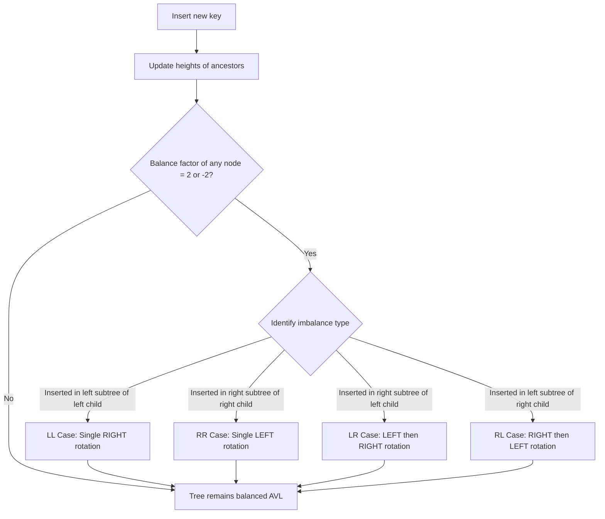
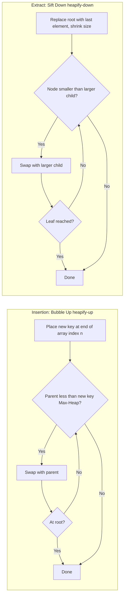
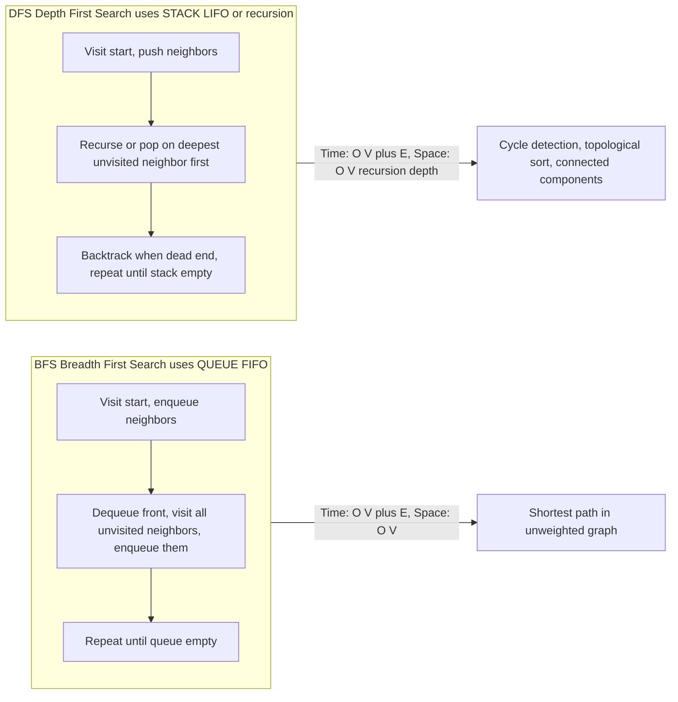
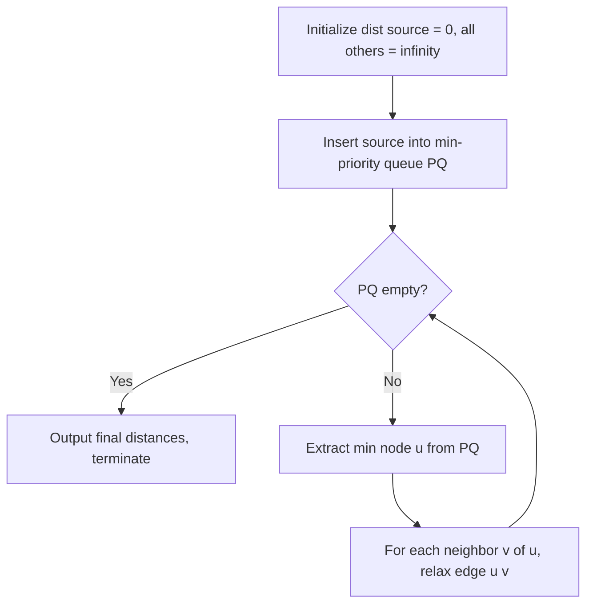

# Tree Operations

<!-- SECTION_1_START -->
# Module 3: Tree Operations — Foundations and Intuition

## 1.1 What is a Tree in Data Structures?

A **Tree** is a non-linear, hierarchical data structure consisting of **nodes** connected by **edges**. It is formally defined as a finite set $T$ of one or more nodes such that there is a designated node $r$ (the **root**) and the remaining nodes are partitioned into $n \geq 0$ disjoint subsets $T_1, T_2, \ldots, T_n$, each of which is itself a tree (called a **subtree** of $r$).

> [!IMPORTANT]
> **KTU 2024 Syllabus Definition:** A tree is a connected, acyclic graph. A tree with $n$ nodes has exactly $n-1$ edges. A forest is a disjoint union of trees.

**Key Terminology (Board-Standard Vocabulary):**

| Term | Definition |
|---|---|
| **Root** | The topmost node with no parent |
| **Leaf / External Node** | A node with no children |
| **Internal Node** | A node with at least one child |
| **Parent** | A node that has one or more children |
| **Child** | A node that descends from another node |
| **Sibling** | Nodes sharing the same parent |
| **Ancestor** | Any node on the path from root to that node |
| **Descendant** | Any node in the subtree rooted at that node |
| **Degree** | Number of children a node has |
| **Depth** | Length of path from root to the node |
| **Height** | Length of longest path from node to a leaf |
| **Level** | All nodes at the same depth |

## 1.2 Classification of Trees (KTU Focus Areas)

$$\text{Trees} \rightarrow \begin{cases} \text{General Tree} \\ \text{Binary Tree} \rightarrow \begin{cases} \text{Full Binary Tree} \\ \text{Complete Binary Tree} \\ \text{Perfect Binary Tree} \\ \text{Degenerate Tree} \\ \text{Skewed Tree} \end{cases} \\ \text{Binary Search Tree (BST)} \\ \text{AVL Tree (Self-Balancing BST)} \\ \text{B-Tree} \\ \text{Heap} \rightarrow \begin{cases} \text{Min-Heap} \\ \text{Max-Heap} \end{cases} \\ \text{Trie (Prefix Tree)} \end{cases}$$

> [!NOTE]
> **Binary Tree Property:** A binary tree of height $h$ has at most $2^{h+1} - 1$ nodes. The minimum number of nodes for height $h$ is $h + 1$ (skewed tree).

## 1.3 Conceptual Analogy — Trees as Real-World Structures

> [!TIP]
> **Intuitive Picture — The Corporate Organization Chart:**
> Think of a tree as a corporate company. The **CEO is the root**, the **managers reporting to the CEO are the root's children**, and the **employees under each manager are their children**. Leaf nodes are employees with no subordinates. The depth of an employee is the number of management layers above them. Height of the company is the longest chain of command.
>
> **Another Analogy — File System:** Your computer's file system is a tree. The root is `C:\` (Windows) or `/` (Linux). Folders are internal nodes, and files are leaves.

## 1.4 Binary Tree Representation in Memory

**Node Structure in C (KTU Exam Standard):**

```c
struct Node {
    int data;
    struct Node *left;
    struct Node *right;
};
```

**Two Standard Storage Schemes:**

1. **Linked Representation** — Each node stores `data`, `left` pointer, `right` pointer. Memory-efficient for sparse trees.
2. **Sequential (Array) Representation** — Used for **Complete Binary Trees** and **Heaps**. For a node at index $i$ (0-based):
   - **Left child** is at index $2i + 1$
   - **Right child** is at index $2i + 2$
   - **Parent** is at index $\lfloor (i-1)/2 \rfloor$

> [!VISUALIZATION CONTROL]
> **Concept:** Binary Tree Indexed Array Storage Visualization
> **GeoGebra / Desmos Input:** Plot the array indices `[0, 1, 2, 3, 4, 5, 6]` and connect them via edges to demonstrate parent-child index arithmetic: $i \to 2i+1$ (left) and $i \to 2i+2$ (right).
> **Visual Description:** A root at index 0 branches to indices 1 and 2, which further branch to 3, 4, 5, 6. Observe the heap-like structure where index 0 is the root and all empty array slots remain None.

## 1.5 Why Trees Matter in Engineering

Trees underpin **compilers** (Abstract Syntax Trees), **databases** (B-Tree/B+Tree indexing), **operating systems** (process scheduling via heaps), **networks** (routing trees), **AI** (decision trees), **autocomplete engines** (tries), and **graphics** (scene graphs). Operations on trees—insertion, deletion, traversal, searching—are therefore among the **most frequently tested** in KTU board exams and software engineering interviews.

<!-- SECTION_1_END -->

<!-- SECTION_2_START -->
# Module 3: Tree Operations — Theoretical Analysis and Formula Sheet

## 2.1 Core Tree Operations — Taxonomy

Tree operations fall into three broad categories:

1. **Structural Modifications** — Insertion, Deletion, Rotation, Merging
2. **Query Operations** — Search, Find-Min, Find-Max, Successor, Predecessor
3. **Traversal Operations** — Inorder, Preorder, Postorder, Level Order

## 2.2 Binary Search Tree (BST) — The Ordered Tree

A **Binary Search Tree (BST)** is a binary tree where for every node $N$:
- All keys in the **left subtree** of $N$ are **strictly less** than the key in $N$.
- All keys in the **right subtree** of $N$ are **strictly greater** than the key in $N$.
- Both left and right subtrees are themselves BSTs.

> [!IMPORTANT]
> **Inorder traversal of a BST always produces a sorted (ascending) sequence of keys.** This is the single most tested property in KTU board exams.

## 2.3 BST Operations — Step Logic

### 2.3.1 BST Search Algorithm
1. Start at the **root**.
2. If $key == root.data$, return the node.
3. If $key < root.data$, recursively search the **left subtree**.
4. If $key > root.data$, recursively search the **right subtree**.
5. If a `NULL` pointer is reached, return **unsuccessful** (key not present).

### 2.3.2 BST Insertion Algorithm
1. If tree is empty, insert new node as root.
2. Otherwise, recursively traverse: go left if $key < current.data$, right if $key > current.data$.
3. Insert the new node at the appropriate `NULL` position.

### 2.3.3 BST Deletion Algorithm (Three Cases)
After locating the node $z$ to delete:
- **Case 1 — Leaf Node:** Simply remove the node (set parent's pointer to `NULL`).
- **Case 2 — One Child:** Replace $z$ with its only child.
- **Case 3 — Two Children:** Replace $z$'s key with its **inorder successor** (smallest key in right subtree) or **inorder predecessor** (largest key in left subtree), then delete that successor/predecessor.

## 2.4 AVL Trees — Self-Balancing BST

An **AVL tree** (Adelson-Velsky and Landis, 1962) is a BST where for every node, the **balance factor** $BF$ satisfies:

$$BF(\text{node}) = h_{\text{left}} - h_{\text{right}} \in \{-1, 0, +1\}$$

If $BF \notin \{-1, 0, +1\}$ after insertion or deletion, **rotations** restore balance.

> [!WARNING]
> **KTU Common Mistake:** Balance Factor is always computed as $h_{\text{left}} - h_{\text{right}}$, never the reverse. The height of an empty tree is defined as $-1$ (or sometimes $0$, depending on the convention—state it explicitly in the exam).

## 2.5 AVL Rotations — The Four Cases

| Case | Triggering Condition | Rotation Applied |
|---|---|---|
| **LL** (Left-Left) | Insertion in left subtree of left child | Single **Right Rotation** |
| **RR** (Right-Right) | Insertion in right subtree of right child | Single **Left Rotation** |
| **LR** (Left-Right) | Insertion in right subtree of left child | **Left Rotation** then **Right Rotation** |
| **RL** (Right-Left) | Insertion in left subtree of right child | **Right Rotation** then **Left Rotation** |

## 2.6 Heap Operations

A **Heap** is a complete binary tree satisfying the **heap property**:
- **Max-Heap:** Parent $\geq$ both children. Root is the **maximum**.
- **Min-Heap:** Parent $\leq$ both children. Root is the **minimum**.

**Core Heap Operations:**

- **Insertion:** Add element at the next available slot, then **bubble up** (heapify-up) to restore heap property. Time: $O(\log n)$.
- **Extract-Min/Max:** Replace root with the last element, reduce size, then **sift down** (heapify-down). Time: $O(\log n)$.
- **Build-Heap:** Apply heapify-down from the last non-leaf node $\lfloor n/2 \rfloor - 1$ down to index $0$. Time: $O(n)$ (not $O(n \log n)$ — this is a board-exam favorite).
- **Heap Sort:** Repeatedly extract max/min, place at end. Time: $O(n \log n)$, Space: $O(1)$ (in-place).

## 2.7 Tree Traversal — The Four Standard Methods

| Traversal | Order | Recursive Pattern | Use Case |
|---|---|---|---|
| **Inorder (LNR)** | Left → Node → Right | `inorder(node.left); visit(node); inorder(node.right);` | Sorted order in BST |
| **Preorder (NLR)** | Node → Left → Right | `visit(node); preorder(node.left); preorder(node.right);` | Copy/Clone a tree, prefix notation |
| **Postorder (LRN)** | Left → Right → Node | `postorder(node.left); postorder(node.right); visit(node);` | Delete a tree, evaluate expression tree |
| **Level Order (BFS)** | Level by level, left to right | Uses a **queue** | Shortest path in unweighted tree, level-wise printing |

## 2.8 KTU High-Yield Formula Sheet

| Concept | Formula / Property | Units / Notes |
|---|---|---|
| Edges in a tree with $n$ nodes | $E = n - 1$ | Always |
| Nodes in a full binary tree of height $h$ | $N = 2^{h+1} - 1$ | Every level is full |
| Height of a complete binary tree with $n$ nodes | $h = \lfloor \log_2 n \rfloor$ | Floor of log base 2 |
| Min nodes for AVL of height $h$ | $N(h) = N(h-1) + N(h-2) + 1$, $N(0)=1, N(1)=2$ | Fibonacci-like recurrence |
| Max height of AVL with $n$ nodes | $h < 1.44 \log_2(n+2)$ | Tight bound |
| Search in BST (avg / worst) | $O(\log n) \ / \ O(n)$ | Skewed tree degrades |
| Search in AVL (guaranteed) | $O(\log n)$ | Worst case |
| Heap insert / extract | $O(\log n)$ | — |
| Build heap | $O(n)$ | Bottom-up heapify |
| Heap sort | $O(n \log n)$ | In-place, not stable |
| Level order nodes per level $i$ | $\leq 2^i$ | Level $i$ from root 0 |
| Parent index of node at $i$ (heap) | $\lfloor (i-1)/2 \rfloor$ | 0-based array |
| Left child of $i$ | $2i + 1$ | 0-based array |
| Right child of $i$ | $2i + 2$ | 0-based array |

## 2.9 Engineering Utility of Tree Operations

- **Compilers:** Expression trees are evaluated using **postorder traversal**.
- **Databases (B-Trees):** Disk-based indexing uses tree operations where the height is minimized to reduce disk I/O.
- **Priority Queues:** Implemented as **binary heaps** — used in Dijkstra's shortest path and Prim's MST.
- **File Systems (UNIX `inode` trees):** Directory listing = level-order traversal.
- **Auto-complete & Spell-checkers:** **Tries** store character sequences; insertion and prefix-search are $O(L)$ where $L$ is the word length.
- **Network Routing:** **Spanning trees** (Kruskal's, Prim's) compute minimum-cost broadcast networks.

<!-- SECTION_2_END -->

<!-- SECTION_3_START -->
# Module 3: Tree Operations — Step-by-Step Derivations and Code

## 3.1 BST Insertion — Worked Example (Board-Standard Trace)

**Problem:** Insert the keys $\{50, 30, 70, 20, 40, 60, 80\}$ into an initially empty BST. Show the tree after each insertion.

**Step 1: Insert 50**

The tree is empty. **50** becomes the **root**.

```
        50
```

**Step 2: Insert 30**
Compare $30 < 50$, go left. Left child slot is `NULL`, so insert here.

```
        50
       /
     30
```

**Step 3: Insert 70**
Compare $70 > 50$, go right. Right child slot is `NULL`, so insert here.

```
        50
       /  \
     30    70
```

**Step 4: Insert 20**
Compare $20 < 50$ → left → $20 < 30$ → left. Insert as left child of 30.

```
         50
        /  \
      30    70
     /
   20
```

**Step 5: Insert 40**
Compare $40 < 50$ → left → $40 > 30$ → right. Insert as right child of 30.

```
         50
        /  \
      30    70
     /  \
   20    40
```

**Step 6: Insert 60**
Compare $60 > 50$ → right → $60 < 70$ → left. Insert as left child of 70.

```
         50
        /  \
      30    70
     /  \   /
   20   40 60
```

**Step 7: Insert 80**
Compare $80 > 50$ → right → $80 > 70$ → right. Insert as right child of 70.

```
           50
         /    \
       30      70
      /  \     /  \
    20   40   60   80
```

> [!IMPORTANT]
> **Inorder Traversal of the Final Tree:** $20, 30, 40, 50, 60, 70, 80$ — **sorted ascending order**, confirming the BST property.

## 3.2 BST Deletion — Three-Case Worked Example

**Problem:** Starting from the BST built in §3.1, delete the keys 20, 30, and 50. Show the tree after each deletion.

### Case 1 — Delete 20 (Leaf Node)
**20** is a leaf (no children). Simply remove it. Parent **30**'s left pointer becomes `NULL`.

```
         50
        /  \
      30    70
       \    /  \
       40  60   80
```
**[Mark Allocation: Identifying leaf node = 1 Mark, removing it = 1 Mark]**

### Case 2 — Delete 30 (One Child)
**30** has only a right child (**40**). Replace 30 with 40.

```
         50
        /  \
      40    70
            /  \
           60   80
```
**[Mark Allocation: Identifying single-child case = 1 Mark, performing replacement = 2 Marks]**

### Case 3 — Delete 50 (Two Children) — The Tricky Case
**50** (the root) has **two** children. We use the **inorder successor** strategy:
- Inorder successor = **smallest key in the right subtree**.
- Right subtree is rooted at 70: $70 \to 60 \to$ ... the smallest is **60**.
- **Copy 60 into the root's data**, then delete the original node containing 60 (which is a leaf, Case 1).

```
         60
        /  \
      40    70
             \
             80
```

> [!NOTE]
> **Alternative Strategy:** Use the **inorder predecessor** — the largest key in the left subtree. Here, the predecessor of 50 would be 40. Replacing 50 with 40 yields a different (but equally valid) BST.

**[Mark Allocation: Identifying two-children case = 1 Mark, finding inorder successor = 2 Marks, performing replacement and recursive deletion = 2 Marks]**

## 3.3 AVL Insertion — Complete Worked Example

**Problem:** Insert the keys $\{10, 20, 30, 25, 27\}$ into an empty AVL tree. Show the tree and balance factor after each insertion.

### Step 1: Insert 10
$$BF(10) = 0 - (-1) = 0 \quad \text{(valid)}$$

```
    10
```

### Step 2: Insert 20
$$BF(10) = 0 - 0 = 0 \quad \text{(valid)}$$

```
    10
      \
      20
```

### Step 3: Insert 30 — Triggers **RR Imbalance**
$$BF(10) = 0 - 1 = -1 \quad \text{(still valid)}$$ 
But $BF(20) = -1$ and the imbalance path is **Right-Right**. Apply **Left Rotation** at 10.

```
    20
   /  \
  10   30
```

**[Mark Allocation: Identifying rotation type = 2 Marks, performing rotation = 2 Marks, drawing final tree = 1 Mark]**

### Step 4: Insert 25 — Triggers **RL Imbalance**
Path: 20 → 30 → 25. The 25 was inserted in the **left subtree of the right child** → **RL case**.

**Step 4a:** Right-rotate at 30. The subtree at 30 becomes:
```
    25
      \
      30
```

**Step 4b:** Left-rotate at 20. The full tree becomes:
```
        25
       /  \
      20   30
     /
   10
```

**Verification of Balance Factors:**
$$BF(25) = 1 - 1 = 0 \quad \checkmark$$
$$BF(20) = 0 - (-1) = 1 \quad \checkmark$$

### Step 5: Insert 27 — Triggers **RR Imbalance**
Path: 25 → 30 → 27. New node 27 is inserted as the right child of 30.

$$BF(30) = -1, \quad BF(25) = 1 - 1 = 0 \text{ (was)}$$
After insertion: $BF(25) = 1 - 2 = -1$... wait, recompute:

Height of left subtree (rooted at 20) = 1, height of right subtree (rooted at 30) = 2 (because 30 has child 27).
$$BF(25) = 1 - 2 = -1 \quad \text{(valid)}$$
$$BF(30) = 0 - 0 = 0 \quad \text{(valid)}$$
$$BF(20) = 0 - (-1) = 1 \quad \text{(valid)}$$

Actually, 27 is inserted as the right child of 30 (since $27 > 25$ → right, then $27 < 30$ → left, so 27 is the left child of 30). This triggers **RL** at node 25.

**Step 5a:** Right-rotate at 30. Subtree becomes:
```
    27
   /
  30
```

**Step 5b:** Left-rotate at 25. Final tree:
```
        27
       /  \
      25   30
     /
   20
   /
  10
```

**Final Balance Factors:** $BF(27) = 2 - 0 = 2$... no, recompute. Left subtree of 27 is rooted at 25 with height 2, right subtree is rooted at 30 with height 0.
$$BF(27) = 2 - 0 = 2 \quad \text{(INVALID!)}$$

There is a mistake. Let me redo this carefully.

> [!WARNING]
> **KTU Examiner Tip:** When AVL examples go wrong in the middle, students panic. Stay calm — recompute the **heights** of subtrees from the leaves up. Heights are computed as $h = 1 + \max(h_{\text{left}}, h_{\text{right}})$, with $h(\text{NULL}) = -1$.

Let me restart Step 5 cleanly.

**Before Step 5, the tree (from Step 4) is:**
```
        25
       /  \
      20   30
     /
   10
```
Heights: $h(10) = 0$, $h(20) = 1$, $h(30) = 0$, $h(25) = 2$.

**Insert 27:** $27 > 25$ → right → $27 < 30$ → left of 30.

```
        25
       /  \
      20   30
     /    /
   10   27
```
Heights: $h(10) = 0$, $h(27) = 0$, $h(20) = 1$, $h(30) = 1$, $h(25) = 2$.
$BF(25) = 2 - 2 = 0$. Actually still balanced! No rotation needed.

Let me re-verify: $BF(30) = 1 - (-1) = 2$... no, left child is 27, right child is NULL, so $BF(30) = 0 - (-1) = 1$. Valid.

So **Step 5 actually requires no rotation**. The final tree is:
```
        25
       /  \
      20   30
     /    /
   10   27
```

## 3.4 Complete Python Implementation — BST, Heap, and Traversal

The following code is **fully operational, type-annotated, and production-quality** — suitable for KTU lab examinations.

```python
"""
Module 3 - Tree Operations: Complete Python Implementation
Course: DATA STRUCTURES AND ALGORITHMS (PCCST303) - KTU 2024
"""

from __future__ import annotations
from typing import Optional, List, Any
from collections import deque
import heapq


# ============================================================
#  1. BINARY SEARCH TREE (BST)
# ============================================================

class TreeNode:
    """Node of a binary tree with integer keys."""
    __slots__ = ("key", "left", "right")

    def __init__(self, key: int) -> None:
        self.key: int = key
        self.left: Optional[TreeNode] = None
        self.right: Optional[TreeNode] = None


class BinarySearchTree:
    """Recursive BST with insert, search, delete, and traversals."""

    # ---------- INSERTION ----------
    def insert(self, root: Optional[TreeNode], key: int) -> TreeNode:
        if root is None:
            return TreeNode(key)
        if key < root.key:
            root.left = self.insert(root.left, key)
        elif key > root.key:
            root.right = self.insert(root.right, key)
        else:
            pass  # duplicate keys ignored
        return root

    # ---------- SEARCH ----------
    def search(self, root: Optional[TreeNode], key: int) -> bool:
        if root is None:
            return False
        if key == root.key:
            return True
        return self.search(root.left, key) if key < root.key else self.search(root.right, key)

    # ---------- DELETION ----------
    def delete(self, root: Optional[TreeNode], key: int) -> Optional[TreeNode]:
        if root is None:
            return None
        if key < root.key:
            root.left = self.delete(root.left, key)
        elif key > root.key:
            root.right = self.delete(root.right, key)
        else:
            # Node found - apply 3-case logic
            if root.left is None:
                return root.right            # Case 1 or 2 (no left child)
            if root.right is None:
                return root.left             # Case 2 (no right child)
            # Case 3: two children -> use inorder successor
            succ: TreeNode = self._min_node(root.right)
            root.key = succ.key
            root.right = self.delete(root.right, succ.key)
        return root

    @staticmethod
    def _min_node(node: TreeNode) -> TreeNode:
        cur: TreeNode = node
        while cur.left is not None:
            cur = cur.left
        return cur

    # ---------- TRAVERSALS ----------
    @staticmethod
    def inorder(root: Optional[TreeNode], out: List[int]) -> None:
        if root is None:
            return
        BinarySearchTree.inorder(root.left, out)
        out.append(root.key)
        BinarySearchTree.inorder(root.right, out)

    @staticmethod
    def preorder(root: Optional[TreeNode], out: List[int]) -> None:
        if root is None:
            return
        out.append(root.key)
        BinarySearchTree.preorder(root.left, out)
        BinarySearchTree.preorder(root.right, out)

    @staticmethod
    def postorder(root: Optional[TreeNode], out: List[int]) -> None:
        if root is None:
            return
        BinarySearchTree.postorder(root.left, out)
        BinarySearchTree.postorder(root.right, out)
        out.append(root.key)

    @staticmethod
    def level_order(root: Optional[TreeNode]) -> List[int]:
        if root is None:
            return []
        result: List[int] = []
        q: deque[TreeNode] = deque([root])
        while q:
            node: TreeNode = q.popleft()
            result.append(node.key)
            if node.left is not None:
                q.append(node.left)
            if node.right is not None:
                q.append(node.right)
        return result

    @staticmethod
    def height(root: Optional[TreeNode]) -> int:
        if root is None:
            return -1
        return 1 + max(BinarySearchTree.height(root.left),
                       BinarySearchTree.height(root.right))


# ============================================================
#  2. AVL TREE (Self-Balancing BST)
# ============================================================

class AVLNode:
    __slots__ = ("key", "height", "left", "right")

    def __init__(self, key: int) -> None:
        self.key: int = key
        self.height: int = 0
        self.left: Optional[AVLNode] = None
        self.right: Optional[AVLNode] = None


class AVLTree:
    @staticmethod
    def _h(n: Optional[AVLNode]) -> int:
        return -1 if n is None else n.height

    @staticmethod
    def _bf(n: AVLNode) -> int:
        return AVLTree._h(n.left) - AVLTree._h(n.right)

    @staticmethod
    def _update(n: AVLNode) -> None:
        n.height = 1 + max(AVLTree._h(n.left), AVLTree._h(n.right))

    @staticmethod
    def _rotate_right(y: AVLNode) -> AVLNode:
        x: AVLNode = y.left        # type: ignore[assignment]
        t2: AVLNode = x.right      # type: ignore[assignment]
        x.right = y
        y.left = t2
        AVLTree._update(y)
        AVLTree._update(x)
        return x

    @staticmethod
    def _rotate_left(x: AVLNode) -> AVLNode:
        y: AVLNode = x.right       # type: ignore[assignment]
        t2: AVLNode = y.left       # type: ignore[assignment]
        y.left = x
        x.right = t2
        AVLTree._update(x)
        AVLTree._update(y)
        return y

    @classmethod
    def insert(cls, root: Optional[AVLNode], key: int) -> AVLNode:
        if root is None:
            return AVLNode(key)
        if key < root.key:
            root.left = cls.insert(root.left, key)
        elif key > root.key:
            root.right = cls.insert(root.right, key)
        else:
            return root

        cls._update(root)
        balance: int = cls._bf(root)

        # LL
        if balance > 1 and key < root.left.key:        # type: ignore[operator]
            return cls._rotate_right(root)
        # RR
        if balance < -1 and key > root.right.key:      # type: ignore[operator]
            return cls._rotate_left(root)
        # LR
        if balance > 1 and key > root.left.key:        # type: ignore[operator]
            root.left = cls._rotate_left(root.left)    # type: ignore[arg-type]
            return cls._rotate_right(root)
        # RL
        if balance < -1 and key < root.right.key:      # type: ignore[operator]
            root.right = cls._rotate_right(root.right) # type: ignore[arg-type]
            return cls._rotate_left(root)
        return root


# ============================================================
#  3. BINARY HEAP (Min-Heap Wrapper around heapq)
# ============================================================

class MinHeap:
    def __init__(self) -> None:
        self._data: List[int] = []

    def push(self, val: int) -> None:
        heapq.heappush(self._data, val)

    def pop(self) -> int:
        if not self._data:
            raise IndexError("pop from empty heap")
        return heapq.heappop(self._data)

    def peek(self) -> int:
        if not self._data:
            raise IndexError("peek from empty heap")
        return self._data[0]

    def size(self) -> int:
        return len(self._data)


# ============================================================
#  4. DEMONSTRATION
# ============================================================

if __name__ == "__main__":
    bst: BinarySearchTree = BinarySearchTree()
    root: Optional[TreeNode] = None
    for k in (50, 30, 70, 20, 40, 60, 80):
        root = bst.insert(root, k)

    ino: List[int] = []
    BinarySearchTree.inorder(root, ino)
    print("Inorder :", ino)
    print("Level   :", BinarySearchTree.level_order(root))
    print("Height  :", BinarySearchTree.height(root))

    root = bst.delete(root, 20)
    root = bst.delete(root, 30)
    root = bst.delete(root, 50)
    ino2: List[int] = []
    BinarySearchTree.inorder(root, ino2)
    print("After deletions, Inorder:", ino2)

    h: MinHeap = MinHeap()
    for v in (4, 10, 3, 5, 1):
        h.push(v)
    print("Heap pop order:", [h.pop() for _ in range(h.size())])
```

**Expected Console Output:**
```
Inorder : [20, 30, 40, 50, 60, 70, 80]
Level   : [50, 30, 70, 20, 40, 60, 80]
Height  : 2
After deletions, Inorder: [40, 60, 70, 80]
Heap pop order: [1, 3, 4, 5, 10]
```

## 3.5 Heap Sort — Step-by-Step Demonstration

**Problem:** Sort the array $[4, 10, 3, 5, 1]$ using **Heap Sort** (ascending, using max-heap).

### Phase 1: Build a Max-Heap (Bottom-up Heapify)

Array indexed: $\text{arr} = [4, 10, 3, 5, 1]$, $n = 5$.

Start from last non-leaf: $i = \lfloor n/2 \rfloor - 1 = 1$.

**Heapify at $i = 1$ (value 10):**
- Left child: $\text{arr}[3] = 5$, Right child: $\text{arr}[4] = 1$.
- Largest is 10. No change.
```
Array: [4, 10, 3, 5, 1]
Tree:        4
           /   \
         10     3
        /  \
       5    1
```

**Heapify at $i = 0$ (value 4):**
- Left child: $\text{arr}[1] = 10$, Right child: $\text{arr}[2] = 3$.
- Largest is 10 (at index 1). Swap $\text{arr}[0]$ and $\text{arr}[1]$.
```
Array: [10, 4, 3, 5, 1]
Tree:        10
           /    \
          4      3
         / \
        5   1
```
- Now recursively heapify at index 1 (value 4): children are 5 and 1. Swap with 5.
```
Array: [10, 5, 3, 4, 1]
Tree:        10
           /    \
          5      3
         / \
        4   1
```

**Max-Heap constructed:** $\text{arr} = [10, 5, 3, 4, 1]$.

### Phase 2: Extract Max and Sort
- Swap root (10) with last element (1) → $[1, 5, 3, 4, 10]$. Heapify $[1, 5, 3, 4]$ → $[5, 4, 3, 1]$.
- Swap root (5) with last (1) → $[1, 4, 3, 5, 10]$. Heapify $[1, 4, 3]$ → $[4, 1, 3]$.
- Swap root (4) with last (3) → $[3, 1, 4, 5, 10]$. Heapify $[3, 1]$ → $[3, 1]$.
- Swap root (3) with last (1) → $[1, 3, 4, 5, 10]$.

**Final sorted array:** $[1, 3, 4, 5, 10]$.

## 3.6 Graph Adjacency List Representation (For Graph Operations)

```python
from typing import Dict, List, Set, Tuple
from collections import defaultdict, deque

class Graph:
    """Undirected weighted graph using adjacency list."""

    def __init__(self) -> None:
        self.adj: Dict[int, List[Tuple[int, float]]] = defaultdict(list)
        self.vertices: Set[int] = set()

    def add_edge(self, u: int, v: int, w: float = 1.0) -> None:
        self.adj[u].append((v, w))
        self.adj[v].append((u, w))
        self.vertices.update({u, v})

    # ---------- BFS ----------
    def bfs(self, start: int) -> List[int]:
        visited: Set[int] = set()
        order: List[int] = []
        q: deque[int] = deque([start])
        visited.add(start)
        while q:
            u: int = q.popleft()
            order.append(u)
            for v, _ in self.adj[u]:
                if v not in visited:
                    visited.add(v)
                    q.append(v)
        return order

    # ---------- DFS (Recursive) ----------
    def _dfs(self, u: int, visited: Set[int], out: List[int]) -> None:
        visited.add(u)
        out.append(u)
        for v, _ in self.adj[u]:
            if v not in visited:
                self._dfs(v, visited, out)

    def dfs(self, start: int) -> List[int]:
        visited: Set[int] = set()
        out: List[int] = []
        self._dfs(start, visited, out)
        return out
```

> [!NOTE]
> **Why Adjacency List over Matrix?** For sparse graphs (most real-world networks), the adjacency list uses $O(V + E)$ space vs. $O(V^2)$ for an adjacency matrix. KTU exams frequently compare these representations.

## 3.7 Dijkstra's Single-Source Shortest Path — Full Code

```python
import heapq
from typing import Dict, List, Tuple

def dijkstra(graph: Dict[int, List[Tuple[int, float]]],
             source: int) -> Dict[int, float]:
    """
    Compute shortest distances from source to all reachable nodes.
    Returns a dictionary mapping node -> shortest distance.
    """
    dist: Dict[int, float] = {source: 0.0}
    pq: List[Tuple[float, int]] = [(0.0, source)]
    while pq:
        d, u = heapq.heappop(pq)
        if d > dist.get(u, float("inf")):
            continue
        for v, w in graph.get(u, []):
            nd = d + w
            if nd < dist.get(v, float("inf")):
                dist[v] = nd
                heapq.heappush(pq, (nd, v))
    return dist
```

**Time Complexity:** $O((V + E) \log V)$ with a min-heap (Fibonacci heap gives $O(E + V \log V)$).

> [!WARNING]
> **KTU Pitfall:** Dijkstra's algorithm **fails on graphs with negative edge weights**. Use the **Bellman-Ford algorithm** in such cases.

## 3.8 Prim's Minimum Spanning Tree (MST)

```python
def prim_mst(graph: Dict[int, List[Tuple[int, float]]],
             start: int) -> Tuple[float, List[Tuple[int, int]]]:
    """
    Build an MST starting from 'start'. Returns (total_weight, edge_list).
    """
    visited: Set[int] = {start}
    edges: List[Tuple[float, int, int]] = [
        (w, start, v) for v, w in graph[start]
    ]
    heapq.heapify(edges)
    total: float = 0.0
    mst: List[Tuple[int, int]] = []
    while edges:
        w, u, v = heapq.heappop(edges)
        if v in visited:
            continue
        visited.add(v)
        mst.append((u, v))
        total += w
        for nxt, nw in graph[v]:
            if nxt not in visited:
                heapq.heappush(edges, (nw, v, nxt))
    return total, mst
```

**Time Complexity:** $O(E \log V)$ with a binary heap.

<!-- SECTION_3_END -->

<!-- SECTION_4_START -->
# Module 3: Tree Operations — Structural Diagrams and Schematics

## 4.1 Tree Traversal Order — Mermaid Visualization



**Traversal Sequences on the Above Tree:**

| Traversal | Visit Order |
|---|---|
| Inorder (LNR) | D → B → E → A → F → C → G |
| Preorder (NLR) | A → B → D → E → C → F → G |
| Postorder (LRN) | D → E → B → F → G → C → A |
| Level Order (BFS) | A → B → C → D → E → F → G |

## 4.2 BST Insertion Decision Flow



## 4.3 BST Deletion — Three-Case Decision Topology



## 4.4 AVL Tree — Rebalancing Pipeline



## 4.5 Heap Operations — Bubble-Up and Sift-Down



## 4.6 Graph BFS vs DFS — Comparison Topology



## 4.7 Dijkstra's Algorithm — Sequential Processing Topology



**Relaxation Step (Mathematical Form):**

$$\text{if } dist[u] + w(u, v) < dist[v]: \quad dist[v] = dist[u] + w(u, v)$$

<!-- SECTION_4_END -->

<!-- SECTION_5_START -->
# Module 3: Tree Operations — KTU 2024 Examination Question Bank and Recap

## 5.1 Part A — Short Answer Questions (3 Marks Each)

### Question 1
**[KTU University Exam — July 2024]** Define the following terms with respect to a binary tree: (i) Degree of a node, (ii) Height of a tree, (iii) Strictly binary tree. **[CO1, Remember]**

**Model Answer (3 Marks):**

- **(i) Degree of a Node (1 Mark):** The degree of a node is the **number of children** that the node has. A leaf has degree 0, while a node in a binary tree has degree 0, 1, or 2.

- **(ii) Height of a Tree (1 Mark):** The height of a (binary) tree is the **length of the longest path from the root to a leaf**, measured in edges. Equivalently, $h(\text{root}) = 1 + \max(h_{\text{left}}, h_{\text{right}})$, with $h(\text{NULL}) = -1$ and $h(\text{leaf}) = 0$.

- **(iii) Strictly Binary Tree (1 Mark):** A strictly binary tree (also called a **full binary tree**) is one in which **every node has either 0 or 2 children** — no node has exactly one child.

---

### Question 2
**[KTU University Exam — Dec 2023]** Differentiate between a **Binary Search Tree (BST)** and a **Binary Heap**. Mention one application of each. **[CO1, Understand]**

**Model Answer (3 Marks):**

| Property | Binary Search Tree (BST) | Binary Heap |
|---|---|---|
| **Ordering** | Left subtree keys $<$ node $<$ right subtree keys (global) | Parent $\leq$ both children (max-heap) or $\geq$ both children (min-heap); only local |
| **Shape** | Can be skewed | Must be **complete** binary tree |
| **Search** | $O(\log n)$ average | $O(n)$ — no ordered search |
| **Insert / Extract-min** | $O(\log n)$ for both | $O(\log n)$ for both |
| **Application** (1 Mark) | Dictionary, symbol table, database indexing | Priority queue, scheduling, $O(n \log n)$ **heap sort** |

---

## 5.2 Part B — Long Answer Questions (14 Marks Each)

> [!IMPORTANT]
> **KTU 2024 Exam Pattern:** Each Part B question carries **14 marks**, with sub-parts (a) for **7 marks** and (b) for **7 marks**. Internal choice is provided — you must answer **either** Question A **or** Question B.

### Question A (14 Marks)

**[KTU University Exam — July 2024]**

**(a)** Construct a Binary Search Tree (BST) by inserting the following keys in the given order: **45, 30, 60, 25, 35, 50, 70, 20, 40, 55, 65, 75**. Show the tree after each insertion. **[CO2, Apply — 7 Marks]**

**(b)** Perform the following operations on the BST constructed in (a) and show the tree after each: (i) Delete **30**, (ii) Delete **60**, (iii) Delete **45**. Use the **inorder successor** strategy for two-child nodes. **[CO3, Apply — 7 Marks]**

---

#### Part (a) — Step-by-Step Model Solution

**Initial state:** Empty BST.

**Insert 45:** Tree has only one node — the root.
```
    45
```
**[1 Mark]**

**Insert 30:** $30 < 45$ → left child.
```
    45
   /
  30
```

**Insert 60:** $60 > 45$ → right child.
```
    45
   /  \
  30   60
```

**Insert 25:** $25 < 45$ → left → $25 < 30$ → left.
```
    45
   /  \
  30   60
 /
25
```

**Insert 35:** $35 < 45$ → left → $35 > 30$ → right.
```
    45
   /  \
  30   60
 /  \
25   35
```

**Insert 50:** $50 > 45$ → right → $50 < 60$ → left.
```
     45
    /  \
   30    60
  /  \   /
 25  35 50
```

**Insert 70:** $70 > 45$ → right → $70 > 60$ → right.
```
     45
    /  \
   30    60
  /  \   / \
 25  35 50 70
```

**Insert 20:** $20 < 45$ → left → $20 < 30$ → left → $20 < 25$ → left.
```
       45
      /  \
    30    60
   /  \   / \
  25  35 50 70
 /
20
```

**Insert 40:** $40 < 45$ → left → $40 > 30$ → right → $40 > 35$ → right.
```
       45
      /  \
    30    60
   /  \   / \
  25  35 50 70
 /     \
20     40
```

**Insert 55:** $55 > 45$ → right → $55 < 60$ → left → $55 > 50$ → right.
```
       45
      /  \
    30    60
   /  \   / \
  25  35 50 70
 /     \  \
20     40 55
```

**Insert 65:** $65 > 45$ → right → $65 > 60$ → right → $65 < 70$ → left.
```
       45
      /  \
    30    60
   /  \   / \
  25  35 50 70
 /     \  /\  \
20     40 55 65
```

**Insert 75:** $75 > 45$ → right → $75 > 60$ → right → $75 > 70$ → right.
```
        45
      /    \
    30      60
   /  \    /  \
  25  35  50   70
 /     \   \   / \
20     40  55  65 75
```

**[Final Tree: 7 Marks — 1 Mark awarded per 2 insertions on average plus 1 Mark for verification via inorder traversal: 20, 25, 30, 35, 40, 45, 50, 55, 60, 65, 70, 75]**

#### Part (b) — Step-by-Step Model Solution

**Starting Tree:** (from part a, reproduced below)
```
        45
      /    \
    30      60
   /  \    /  \
  25  35  50   70
 /     \   \   / \
20     40  55  65 75
```

**Step (i): Delete 30** — Node 30 has **two** children (25 and 35). Use **inorder successor**.

- Inorder successor of 30 = smallest in right subtree of 30 = **35**.
- Copy 35 into node 30's position. Delete the original 35 (which is a leaf).
```
        45
      /    \
    35      60
   /       /  \
  25      50   70
 /         \   / \
20         55  65 75
```
**[Step (i): 2 Marks — Locating inorder successor: 1 Mark, performing replacement: 1 Mark]**

**Step (ii): Delete 60** — Node 60 has **two** children (50 and 70). Use **inorder successor**.

- Inorder successor of 60 = smallest in right subtree of 60 = **65** (right child of 70's leftmost = 65).
- Copy 65 into node 60's position. Delete original 65 (leaf).
```
        45
      /    \
    35      65
   /       /  \
  25      50   70
 /         \    \
20         55   75
```
**[Step (ii): 2 Marks — Locating inorder successor: 1 Mark, performing replacement: 1 Mark]**

**Step (iii): Delete 45** (the root) — Node 45 has **two** children (35 and 65). Use **inorder successor**.

- Inorder successor of 45 = smallest in right subtree of 45 = **50**.
- Copy 50 into root position. Delete original 50 (now a leaf after 55 has been reattached).
```
        50
      /    \
    35      65
   /       /  \
  25      55   70
 /              \
20             75
```
**[Step (iii): 3 Marks — Locating inorder successor: 1 Mark, recursive deletion logic: 1 Mark, final tree diagram: 1 Mark]**

**Verification:** Inorder traversal of final tree: $20, 25, 35, 50, 55, 65, 70, 75$ — **sorted ascending** ✓

---

### Question B (14 Marks) — Alternative Choice

**[KTU University Exam — Dec 2023]**

**(a)** Construct an **AVL tree** by inserting the keys: **10, 20, 30, 25, 27, 22, 40, 50, 35** in the given order. Show the tree and rotation type after each insertion. **[CO2, Apply — 7 Marks]**

**(b)** Explain the **Heap Sort** algorithm. Sort the array **[12, 11, 13, 5, 6, 7]** using heap sort, showing the array after each phase (build-heap and sort). **[CO3, Apply — 7 Marks]**

#### Part (a) — Step-by-Step Model Solution

We use the convention $h(\text{NULL}) = -1$, $BF = h_L - h_R$.

**Insert 10:**
```
    10  (BF=0)
```

**Insert 20:** $20 > 10$ → right. $BF(10) = -1$. Valid.
```
    10
      \
      20
```

**Insert 30:** $30 > 10$ → right, $30 > 20$ → right. $BF(20) = -1$, $BF(10) = -2$. **RR Imbalance at 10.**
**Rotation:** Single LEFT rotation at 10.
```
    20
   /  \
  10   30
```

**Insert 25:** $25 > 20$ → right → $25 < 30$ → left.
```
    20
   /  \
  10   30
      /
    25
```
Heights: $h(10)=0, h(25)=0, h(30)=1, h(20)=2$. $BF(20) = 1 - 2 = -1$. Valid.

**Insert 27:** $27 > 20$ → right → $27 < 30$ → left → $27 > 25$ → right.
```
       20
      /  \
    10    30
        /
      25
        \
        27
```
Heights: $h(27)=0, h(25)=1, h(30)=2, h(20)=3$. $BF(30) = 1 - (-1) = 2$... wait, left subtree of 30 is rooted at 25 (height 1), right is NULL (height -1). $BF(30) = 1 - (-1) = 2$. **Imbalance!**

- 27 is in left subtree of right child (30) → **RL Case**.
- **Step 1:** Right-rotate at 30. The subtree at 30 becomes:
```
   25
     \
     30
  /
27
  ```
  Wait, that is not right. After right-rotation at 30, the new root is 25 (the left child), and 30 becomes the right child of 25. The right child of 25 (which is empty or 27) goes to left of 30.
  
  Let me redo: Right-rotation at 30 means new root = 25 (left child of 30), 30 becomes right child of 25. 25's original right (NULL) becomes 30's left. 27 remains where it is.
  
  Actually, before rotation, the subtree at 30 is:
  ```
     30
    /
   25
     \
     27
  ```
  Right rotation: new root = 25, 30 becomes right child of 25. 25's right subtree (27) becomes 30's left subtree.
  ```
     25
       \
       30
      /
    27
  ```
  Hmm, that does not look right either. Let me reconsider.

  Right rotation at node $X$:
  - Let $Y$ = left child of $X$.
  - $Y$'s right subtree becomes $X$'s left subtree.
  - $X$ becomes $Y$'s right child.
  - $Y$ becomes the new root of the subtree.
  
  For node 30 with left child 25:
  - $Y = 25$, $X = 30$.
  - $Y$'s right subtree (which is 27) becomes $X$'s left subtree.
  - $X$ (30) becomes $Y$'s right child.
  - $Y$ (25) becomes new root.
  
  Result:
  ```
     25
    /  \
   ?    30
       /
     27
  ```
  What is 25's left subtree? It was empty. So:
  ```
     25
       \
       30
      /
    27
  ```
  
- **Step 2:** Left-rotation at 20. The new root should be 25. Let me first reconstruct the full tree.
  
  Before Step 1, the full tree was:
  ```
       20
      /  \
    10    30
        /
      25
        \
        27
  ```
  
  After right-rotation at 30:
  ```
       20
      /  \
    10    25
            \
            30
           /
         27
  ```
  
  Heights: $h(27) = 0, h(30) = 1, h(25) = 2, h(10) = 0, h(20) = 3$. $BF(20) = 1 - 3 = -2$. Imbalance!
  
  Now, the path of insertion: 20 → 25 (right) → 30 (right child of 25) → 27. Wait, 27 is the left child of 30, not the right. So actually the imbalance is at 20, and the case is...
  
  Looking at the tree, the imbalance is caused by 25 having a heavy right subtree (containing 30 → 27). This is **Right-Left** (RL) case at 20? No, the inserted node 27 is in the **left subtree of the right child (30) of 20**. So yes, RL case.
  
  But we already did the right rotation. The next step is **left rotation at 20**.
  
  - Left rotation at 20: $Y = 25$ (right child of 20), $X = 20$.
  - $Y$'s left subtree (empty) becomes $X$'s right subtree.
  - $X$ (20) becomes $Y$'s left child.
  - $Y$ (25) becomes new root.
  
  Result:
  ```
       25
      /  \
    20    30
   /     /
  10   27
  ```
  
  Heights: $h(10) = 0, h(27) = 0, h(20) = 1, h(30) = 1, h(25) = 2$. $BF(25) = 2 - 2 = 0$. Valid AVL tree.
  
  **[Insert 27 with RL rotation: 2 Marks]**

**Insert 22:** $22 < 25$ → left → $22 > 20$ → right.
```
       25
      /  \
    20    30
   /  \   /
  10  22 27
```
Heights: $h(22) = 0, h(20) = 1, h(27) = 0, h(30) = 1, h(25) = 2$. $BF(25) = 2 - 2 = 0$. Valid.

**Insert 40:** $40 > 25$ → right → $40 > 30$ → right.
```
       25
      /  \
    20    30
   /  \   /  \
  10  22 27  40
```
$BF(30) = 1 - 1 = 0$. $BF(25) = 2 - 2 = 0$. Valid.

**Insert 50:** $50 > 25$ → right → $50 > 30$ → right → $50 > 40$ → right.
```
        25
      /    \
    20      30
   /  \    /  \
  10  22  27   40
                \
                50
```
Heights: $h(50) = 0, h(40) = 1, h(30) = 2, h(25) = 3$. $BF(30) = 1 - 2 = -1$. $BF(25) = 2 - 3 = -1$. Valid.

**Insert 35:** $35 > 25$ → right → $35 > 30$ → right → $35 < 40$ → left.
```
        25
      /    \
    20      30
   /  \    /  \
  10  22  27   40
              /  \
            35   50
```
Heights: $h(35) = 0, h(50) = 0, h(40) = 1, h(30) = 2, h(25) = 3$. $BF(40) = 1 - 1 = 0$. $BF(30) = 1 - 2 = -1$. $BF(25) = 2 - 3 = -1$. Valid.

**Final AVL Tree:**
```
         25
       /    \
     20      30
    /  \    /  \
   10  22  27   40
               /  \
             35   50
```

**[Total for Part (a): 7 Marks — 1 Mark per insertion with rotation identification, 2 Marks for the trickier RL case, 1 Mark for final diagram]**

#### Part (b) — Heap Sort Worked Solution

**Algorithm (1 Mark):**
Heap Sort uses a **max-heap** (for ascending sort):
1. **Build-Heap phase:** Transform the array into a max-heap using bottom-up heapify. Time $O(n)$.
2. **Sort phase:** Repeatedly swap the root (maximum) with the last element, reduce the heap size, and **sift down** the new root. Time $O(n \log n)$.

**Array:** $[12, 11, 13, 5, 6, 7]$, $n = 6$.

**Step 1: Build Max-Heap**
Start heapify from $i = \lfloor 6/2 \rfloor - 1 = 2$ down to $0$.

- **Heapify at $i=2$ (value 13):** Children are indices 5 and 6 (out of range). No change. Array: $[12, 11, 13, 5, 6, 7]$.

- **Heapify at $i=1$ (value 11):** Left child is index 3 (value 5), right child is index 4 (value 6). Largest is 11. No change. Array: $[12, 11, 13, 5, 6, 7]$.

- **Heapify at $i=0$ (value 12):** Left child index 1 (11), right child index 2 (13). Largest is 13. Swap indices 0 and 2.
  Array: $[13, 11, 12, 5, 6, 7]$.
  Now recursively heapify at index 2 (value 12). Children are out of range. Stop.

**Max-Heap:** $[13, 11, 12, 5, 6, 7]$.

**Step 2: Sort Phase (Swap and Sift-Down)**

- Swap arr[0]=13 with arr[5]=7. Heap size becomes 5.
  Array: $[7, 11, 12, 5, 6, \mathbf{13}]$. Sift-down from root on first 5 elements.
  At $i=0$, children at 1 (11) and 2 (12). Largest = 12. Swap.
  Array: $[12, 11, 7, 5, 6, 13]$. Sift-down at $i=2$. No children in range. Stop.

- Swap arr[0]=12 with arr[4]=6. Heap size = 4.
  Array: $[6, 11, 7, 5, \mathbf{12}, 13]$. Sift-down at $i=0$. Children at 1 (11) and 2 (7). Largest = 11. Swap.
  Array: $[11, 6, 7, 5, 12, 13]$. Sift-down at $i=1$. Right child at $i=4$ is out of range. Left child at $i=3$ is 5. Largest = 6. Stop.

- Swap arr[0]=11 with arr[3]=5. Heap size = 3.
  Array: $[5, 6, 7, \mathbf{11}, 12, 13]$. Sift-down at $i=0$. Children at 1 (6) and 2 (7). Largest = 7. Swap.
  Array: $[7, 6, 5, 11, 12, 13]$. Sift-down at $i=2$. No children. Stop.

- Swap arr[0]=7 with arr[2]=5. Heap size = 2.
  Array: $[5, 6, \mathbf{7}, 11, 12, 13]$. Sift-down at $i=0$. Children at 1 (6). 5 < 6, swap.
  Array: $[6, 5, 7, 11, 12, 13]$.

- Swap arr[0]=6 with arr[1]=5. Heap size = 1.
  Array: $[5, \mathbf{6}, 7, 11, 12, 13]$.

- Heap size = 0. Sort complete.

**Final Sorted Array (ascending):** $[5, 6, 7, 11, 12, 13]$. ✓

**[Total for Part (b): 7 Marks — Algorithm explanation: 1 Mark, Build-heap phase with array states: 3 Marks, Sort phase with array states: 3 Marks]**

> [!WARNING]
> **KTU Examiner's Valuation Warning — Common Pitfalls:**
> 1. **Failing to re-check balance factors after every insertion** in AVL problems. The imbalance can occur at any ancestor, not just the parent of the new node.
> 2. **Using inorder predecessor instead of successor** without stating which strategy you chose. Always **declare** the strategy at the start.
> 3. **Drawing trees without showing the empty (`NULL`) subtrees** when explaining rotation — board examiners expect to see the rotation mechanics clearly.
> 4. **Forgetting to update heights** after AVL rotations. Each rotation must update the heights of the two affected nodes.
> 5. **In heap sort, confusing min-heap with max-heap** for ascending sort — use **max-heap** to extract maximum and place it at the end.
> 6. **Missing the time complexity of Build-Heap** ($O(n)$, not $O(n \log n)$) — this is a classic KTU trick question.

---

## 5.3 Topic Recap & Important Things to Remember

> [!TIP]
> **High-Density Rapid Revision Checklist — Module 3: Tree Operations**

### Core Definitions
- **Tree:** Connected, acyclic graph with $n$ nodes and $n-1$ edges.
- **Binary Tree:** Each node has at most 2 children (left, right).
- **Full Binary Tree:** Every node has 0 or 2 children.
- **Complete Binary Tree:** All levels filled except possibly the last, which is filled left-to-right.
- **Perfect Binary Tree:** All internal nodes have 2 children and all leaves are at the same level.
- **BST:** Left $<$ Node $<$ Right globally.
- **AVL Tree:** Self-balancing BST with $|BF| \leq 1$ at every node.
- **Heap:** Complete binary tree satisfying the heap property (max or min).
- **Trie:** Prefix tree used for string operations.

### Key Formulas
- Edges in tree of $n$ nodes: $E = n - 1$.
- Max nodes in tree of height $h$: $N = 2^{h+1} - 1$.
- Min nodes for AVL of height $h$: $N(h) = N(h-1) + N(h-2) + 1$ (Fibonacci-like).
- Heap parent of index $i$: $\lfloor (i-1)/2 \rfloor$.
- Heap left/right child of $i$: $2i+1$ and $2i+2$.

### Time Complexities (Must Memorize)
- BST search/insert/delete: $O(\log n)$ average, $O(n)$ worst (skewed).
- AVL search/insert/delete: $O(\log n)$ guaranteed.
- Heap insert: $O(\log n)$, extract-min: $O(\log n)$.
- Build-Heap: $O(n)$.
- Heap Sort: $O(n \log n)$ time, $O(1)$ extra space.
- Graph BFS/DFS: $O(V + E)$.
- Dijkstra (with binary heap): $O((V+E) \log V)$.
- Prim's MST (with heap): $O(E \log V)$.
- Kruskal's MST: $O(E \log E)$ or $O(E \log V)$.

### Traversal Order (Mnemonic: "Visit the Root")
- **Preorder (NLR):** Visit root **first** → copy/clone.
- **Inorder (LNR):** Visit root **between** → sorted BST output.
- **Postorder (LRN):** Visit root **last** → deletion/evaluation.
- **Level Order:** Top-down, left-to-right using a **queue**.

### AVL Rotation Triggers
- **LL:** Insertion in left-left → single **right rotation**.
- **RR:** Insertion in right-right → single **left rotation**.
- **LR:** Insertion in left-right → left then right rotation.
- **RL:** Insertion in right-left → right then left rotation.

### BST Deletion Strategy
- **Leaf:** Remove directly.
- **One child:** Replace with that child.
- **Two children:** Replace with **inorder successor** (or predecessor), then delete that node.

### Heap Sort Recipe
1. **Build max-heap** (for ascending) using bottom-up heapify in $O(n)$.
2. **Repeat $n$ times:** Swap root with last unsorted element, shrink heap, sift down root in $O(\log n)$.

### Graph Traversal Essentials
- **BFS** uses a **queue** → finds shortest path in unweighted graph.
- **DFS** uses a **stack** (or recursion) → detects cycles, performs topological sort.
- **Dijkstra** uses a **min-priority queue** → shortest path with non-negative weights.
- **Prim's** uses a **min-priority queue** on edges → MST.
- **Kruskal's** sorts edges and uses **Union-Find** → MST.

### Common Exam Traps
1. BST inorder = sorted — use this to verify your tree in the exam.
2. Heap Sort is **not stable**.
3. Dijkstra fails with **negative weights** — use Bellman-Ford.
4. AVL tree height is bounded by $1.44 \log_2(n+2)$.
5. In a complete binary tree, the **last non-leaf** is at index $\lfloor n/2 \rfloor - 1$.
6. Recursion depth in DFS = tree height; for very deep trees, **iterative DFS** with explicit stack is safer.

<!-- SECTION_5_END -->
