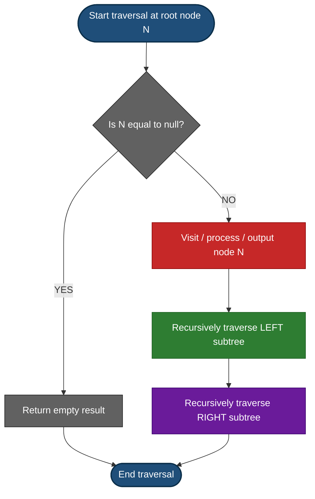
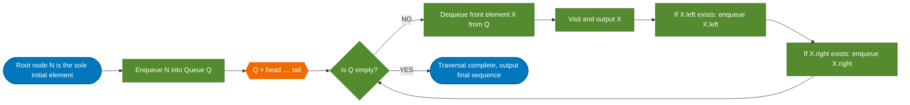
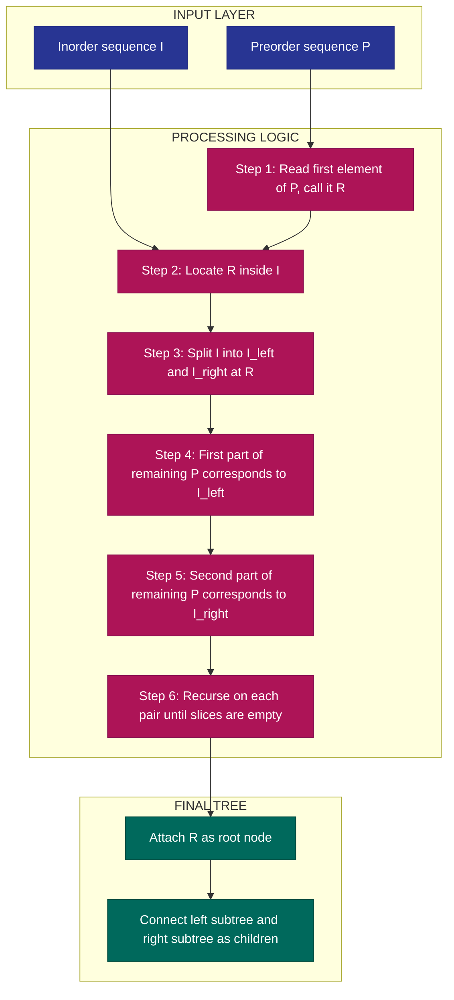

# Tree Traversals

<!-- SECTION_1_START -->
# Tree Traversals — Core Technical Definition & Intuitive Overview

## Formal KTU 2024 Definition

> [!NOTE]
> **Tree Traversal** is the process of visiting every node in a tree data structure **exactly once** in a systematic, non-random order so that the nodes can be processed (printed, stored, evaluated, or searched). For an $N$-node binary tree, traversal visits each of the $N$ nodes by recursively decomposing the tree into three logical sub-tasks: **L** (Left subtree), **N** (Node / Root), and **R** (Right subtree).

Under the KTU 2024 scheme (PCCST303 — Module 3: Trees and Graphs), students are expected to master the **four canonical traversals**:

1. **Inorder Traversal** — Left → Node → Right  (LNR)
2. **Preorder Traversal** — Node → Left → Right (NLR)
3. **Postorder Traversal** — Left → Right → Node (LRN)
4. **Level Order Traversal** — Breadth-First Search (BFS) using a **Queue**

## Conceptual Analogy / Intuition

> [!IMPORTANT]
> **Imagine a family photo album displayed on a staircase:** Each person is a node, parents stand above children. A *preorder* visit is like greeting from the **top of the staircase** and working your way down each branch — you acknowledge the ancestor **before** the descendants. An *inorder* visit is like reading the names from the **leftmost leaf up to the rightmost leaf** — a sorted chronological order. A *postorder* visit is like settling a will — you must pay off all **descendants first**, and the head of the family is processed **last**. A *level order* is like passing a photograph across each row of the staircase, one horizontal layer at a time.

## Visual Foundation of the Reference Tree

The **standard reference tree** used throughout this entire note is:

```text
              A
            /   \
           B     C
          / \     \
         D   E     F
        /         / \
       G         H   I
```

This tree is chosen because it has **9 nodes** (small enough to verify by hand) and **non-uniform structure** (the right subtree of `B` is missing, and the left subtree of `C` is missing), which forces students to handle boundary cases correctly during examinations.

## Pre-Traversal Conventions Followed in KTU Board Exams

> [!TIP]
> Every traversal is recorded as a **sequence of node values** read from **left to right** in the order they are *first* visited. When two subtrees are equivalent in priority, the **left subtree is always processed before the right subtree**. This convention is universal in KTU question papers.

> [!VISUALIZATION CONTROL]
> **Concept:** Level-order (BFS) layering of a binary tree
> **GeoGebra / Desmos Input Equations:**
> * Points: $(0,3)=A$, $(-2,2)=B$, $(2,2)=C$, $(-3,1)=D$, $(-1,1)=E$, $(3,1)=F$, $(-4,0)=G$, $(2,0)=H$, $(4,0)=I$
> **Visual Description:** Plot the 9 labeled points on a Cartesian grid. Draw line segments connecting parent-child pairs. Observe three distinct horizontal layers at $y=3$ (root), $y=2$ and $y=1$ (internal nodes), and $y=0$ (leaves). BFS reads nodes by descending $y$-value.

<!-- SECTION_1_END -->

<!-- SECTION_2_START -->
# Deep Theoretical Analysis & KTU High-Yield Formula Sheet

## 1. The Three Recursive DFS Traversals

Every DFS traversal is governed by a **single recursive function** that receives a node and follows the same three-step structure: *process*, *recurse-left*, *recurse-right*. The **only** difference is **when** the root node is *visited* relative to the recursive calls.

### 1.1 Inorder Traversal (LNR)

| Step | Action | Code Equivalent |
|:----:|:-------|:----------------|
| 1 | Recurse into the **Left** subtree | `inorder(node.left)` |
| 2 | **Visit** (process) the **Node** | `visit(node)` |
| 3 | Recurse into the **Right** subtree | `inorder(node.right)` |

> [!NOTE]
> **Key Property:** For a **Binary Search Tree (BST)**, inorder traversal produces the keys in **strictly ascending sorted order**. This is the most-asked property in KTU 2024 exams.

**Trace on the reference tree (left subtree of A first, then root, then right subtree):**
$$ \text{Inorder}(A) = \text{Inorder}(B),\; A,\; \text{Inorder}(C) $$
- $\text{Inorder}(B) = \text{Inorder}(D),\; B,\; \text{Inorder}(E)$
  - $\text{Inorder}(D) = \text{Inorder}(G),\; D,\; \text{Inorder}(\text{null}) = G,\; D$
  - $\text{Inorder}(E) = \text{Inorder}(\text{null}),\; E,\; \text{Inorder}(\text{null}) = E$
  - So $\text{Inorder}(B) = G, D, B, E$
- $\text{Inorder}(C) = \text{Inorder}(\text{null}),\; C,\; \text{Inorder}(F) = C,\; \text{Inorder}(F)$
  - $\text{Inorder}(F) = \text{Inorder}(H),\; F,\; \text{Inorder}(I) = H, F, I$
  - So $\text{Inorder}(C) = C, H, F, I$

$$ \boxed{\text{Inorder}(A) = G,\; D,\; B,\; E,\; A,\; C,\; H,\; F,\; I} $$

### 1.2 Preorder Traversal (NLR)

**Trace:**
- Visit `A` first. Then traverse `B` then `C`.
- Visit `B`, then `D`, then `E`. Visit `D`, then `G`. Visit `E`.
- Visit `C`, then `F`. Visit `F`, then `H`, then `I`.

$$ \boxed{\text{Preorder}(A) = A,\; B,\; D,\; G,\; E,\; C,\; F,\; H,\; I} $$

> [!IMPORTANT]
> **Key Property:** Preorder is used to **serialize / reconstruct** a binary tree when paired with inorder. It defines the **root-first creation order** of a copy operation, file-system preorder directory listing, and prefix notation of expression trees.

### 1.3 Postorder Traversal (LRN)

**Trace:**
- Process `B` entirely before touching `A`. So process `D` entirely, then `E`, then `B`.
- Process `D` entirely → process `G` (a leaf) → done with `D`.
- Process `C` entirely → process `F` entirely → done with `C`.
- Process `F` entirely → process `H` → process `I` → done with `F`.

$$ \boxed{\text{Postorder}(A) = G,\; D,\; E,\; B,\; H,\; I,\; F,\; C,\; A} $$

> [!IMPORTANT]
> **Key Property:** Postorder is essential when the **parent computation depends on the children first**. Use cases: *deleting a tree* (free children before parent to avoid memory leaks), *evaluating an expression tree* (compute leaf operands before applying operator), and *computing directory sizes* (sum files inside subdirectories before reporting the parent).

## 2. Level Order Traversal (BFS)

Unlike the three DFS traversals, level order uses an **iterative algorithm with a Queue (FIFO)**, not recursion.

| Step | Action |
|:----:|:-------|
| 1 | Enqueue the root. |
| 2 | Loop while queue is not empty: dequeue front, visit it, enqueue its left child (if any), enqueue its right child (if any). |
| 3 | Continue until the queue empties. |

**Trace on the reference tree:**
- Queue: $[A]$ → Visit $A$ → enqueue $B,C$ → Queue: $[B,C]$
- Dequeue $B$ → Visit $B$ → enqueue $D,E$ → Queue: $[C,D,E]$
- Dequeue $C$ → Visit $C$ → enqueue $F$ → Queue: $[D,E,F]$
- Dequeue $D$ → Visit $D$ → enqueue $G$ → Queue: $[E,F,G]$
- Dequeue $E$ → Visit $E$ → Queue: $[F,G]$
- Dequeue $F$ → Visit $F$ → enqueue $H,I$ → Queue: $[G,H,I]$
- Dequeue $G,H,I$ → Visit each → Queue: $[]$

$$ \boxed{\text{LevelOrder}(A) = A,\; B,\; C,\; D,\; E,\; F,\; G,\; H,\; I} $$

## 3. Constructing a Binary Tree From Two Traversals

> [!NOTE]
> **The Golden Rule (exam essential):** *Inorder* must always be one of the two given traversals. Without inorder, the tree cannot be uniquely reconstructed (the example below proves it).

| Given Pair | Reconstruction Strategy |
|:-----------|:------------------------|
| **Inorder + Preorder** | Pick the **first** element of preorder as the **root**. Locate it in inorder to split into left and right inorder sequences. Recurse. |
| **Inorder + Postorder** | Pick the **last** element of postorder as the **root**. Locate it in inorder to split. Recurse. |
| Inorder + Level Order | Possible but more complex (build level by level). |
| **Preorder + Postorder only** | ❌ Ambiguous (multiple valid trees possible) — not a KTU test case. |

## 4. KTU Formula / Cheat Sheet

| Concept | Formula / Property | Units / Note |
|:--------|:-------------------|:-------------|
| Number of recursive calls in any DFS traversal | $= N$ (number of nodes) | Dimensionless |
| Time complexity of any traversal (all 4) | $T(N) = O(N)$ | Visits each node once |
| Auxiliary space (recursive DFS) | $S(N) = O(h)$ where $h = $ tree height | Stack memory |
| Auxiliary space (iterative BFS) | $S(N) = O(w)$ where $w = $ max width of any level | Queue memory |
| Height of a balanced tree | $h = \lfloor \log_2 N \rfloor$ | $N$ = node count |
| Height of a skewed tree | $h = N - 1$ | Worst-case recursion depth |
| Inorder of a BST | Yields sorted sequence | Ascending order |
| Number of distinct trees from inorder+preorder pair | Exactly **1** (if both are consistent) | Unique reconstruction |
| $\vert \text{Inorder} \vert$ | $= \vert \text{Preorder} \vert = \vert \text{Postorder} \vert = N$ | All produce $N$ tokens |

> [!IMPORTANT]
> **Real-world Engineering Utility:** Tree traversals power (1) **file system navigation** in Linux (`tree` command, `find`), (2) **DOM traversal** in web browsers, (3) **compiler Abstract Syntax Trees** (postorder = code generation, inorder = infix reconstruction), (4) **database index B-trees**, (5) **network routing tables** (Dijkstra uses BFS-like traversal on weighted trees), and (6) **Huffman coding** for data compression (postorder on a min-heap tree).

<!-- SECTION_2_END -->

<!-- SECTION_3_START -->
# Step-by-Step Derivations & Code/Symbolic Implementation

## 3.1 Recursive Python Implementation — All Four Traversals

```python
from __future__ import annotations
from collections import deque
from typing import Optional, List


class TreeNode:
    """Binary tree node carrying a comparable payload."""
    __slots__ = ("val", "left", "right")

    def __init__(
        self,
        val: int,
        left: Optional[TreeNode] = None,
        right: Optional[TreeNode] = None,
    ) -> None:
        self.val: int = val
        self.left: Optional[TreeNode] = left
        self.right: Optional[TreeNode] = right


def inorder(root: Optional[TreeNode], out: List[int]) -> None:
    """Left -> Node -> Right. Iterative steps performed recursively."""
    if root is None:
        return
    inorder(root.left, out)   # (1) recurse left
    out.append(root.val)      # (2) visit node
    inorder(root.right, out)  # (3) recurse right


def preorder(root: Optional[TreeNode], out: List[int]) -> None:
    """Node -> Left -> Right."""
    if root is None:
        return
    out.append(root.val)      # (1) visit node first
    preorder(root.left, out)  # (2) recurse left
    preorder(root.right, out) # (3) recurse right


def postorder(root: Optional[TreeNode], out: List[int]) -> None:
    """Left -> Right -> Node."""
    if root is None:
        return
    postorder(root.left, out)  # (1) recurse left first
    postorder(root.right, out) # (2) recurse right next
    out.append(root.val)       # (3) visit node last


def level_order(root: Optional[TreeNode]) -> List[int]:
    """BFS using a queue. Returns nodes layer by layer, left to right."""
    result: List[int] = []
    if root is None:
        return result
    q: deque[TreeNode] = deque([root])
    while q:
        node: TreeNode = q.popleft()
        result.append(node.val)
        if node.left is not None:
            q.append(node.left)
        if node.right is not None:
            q.append(node.right)
    return result
```

## 3.2 Iterative Python Implementation — DFS Traversals (Stack-Based)

> [!TIP]
> KTU 2024 examiners specifically test the iterative version because it eliminates the call-stack risk of stack overflow on skewed trees. Master this!

```python
def inorder_iterative(root: Optional[TreeNode]) -> List[int]:
    """Manual stack simulation of LNR. Push left spine, then pop+visit+go-right."""
    out: List[int] = []
    stack: List[TreeNode] = []
    curr: Optional[TreeNode] = root
    while curr is not None or stack:
        # Phase 1: dive as far left as possible, pushing every ancestor.
        while curr is not None:
            stack.append(curr)
            curr = curr.left
        # Phase 2: pop the deepest unvisited ancestor, visit it, then turn right.
        curr = stack.pop()
        out.append(curr.val)
        curr = curr.right
    return out


def preorder_iterative(root: Optional[TreeNode]) -> List[int]:
    """NLR using a stack. Visit node, then push right, then push left (so left pops first)."""
    if root is None:
        return []
    out: List[int] = []
    stack: List[TreeNode] = [root]
    while stack:
        node: TreeNode = stack.pop()
        out.append(node.val)
        if node.right is not None:   # right pushed first
            stack.append(node.right)
        if node.left is not None:    # left pushed second → popped first
            stack.append(node.left)
    return out


def postorder_iterative(root: Optional[TreeNode]) -> List[int]:
    """LRN using two stacks. Equivalent: reverse of (Root, Right, Left) preorder."""
    if root is None:
        return []
    out: List[int] = []
    stack: List[TreeNode] = [root]
    while stack:
        node: TreeNode = stack.pop()
        out.append(node.val)
        if node.left is not None:
            stack.append(node.left)
        if node.right is not None:
            stack.append(node.right)
    return out[::-1]   # reverse to get postorder
```

## 3.3 Step-by-Step Construction of a Binary Tree From Inorder + Preorder

> [!NOTE]
> This is the **single most repeated 14-mark question** in KTU 2024 Module 3. Memorize the algorithm below.

**Given:**
- **Inorder:**   $D, B, E, A, F, C, G$
- **Preorder:**  $A, B, D, E, C, F, G$

**Step 1 — Identify the root.**
The first element of the preorder is always the root.
$$ \text{Root} = A $$

**Step 2 — Split inorder at the root.**
Locate $A$ in the inorder sequence. The elements to its **left** form the inorder of the left subtree; the elements to its **right** form the inorder of the right subtree.
$$ \underbrace{D, B, E}_{\text{left inorder}},\; A,\; \underbrace{F, C, G}_{\text{right inorder}} $$

**Step 3 — Recurse on the left subtree.**
The next element in preorder is $B$. It must be the root of the left subtree.
- Root of left subtree: $B$
- Locate $B$ in the **left inorder** $[D, B, E]$ → splits as $[D],\; B,\; [E]$.
- Recurse on left-of-$B$: preorder remaining is $[D, E, \ldots]$ → next root is $D$.
  - Locate $D$ in inorder $[D]$ → no left child, no right child. $D$ is a leaf.
- Recurse on right-of-$B$: preorder remaining is $[E]$ → root is $E$. Inorder is $[E]$. $E$ is a leaf.

**Step 4 — Recurse on the right subtree.**
- Root of right subtree: $C$ (next unused preorder element).
- Locate $C$ in right inorder $[F, C, G]$ → splits as $[F],\; C,\; [G]$.
- Left-of-$C$: $F$ is a leaf.
- Right-of-$C$: $G$ is a leaf.

**Final reconstructed tree:**

```text
              A
            /   \
           B     C
          / \   / \
         D   E F   G
```

## 3.4 Step-by-Step Construction From Inorder + Postorder

**Given:**
- **Inorder:**    $D, B, E, A, F, C, G$
- **Postorder:**  $D, E, B, F, G, C, A$

**Step 1 — Root is the last element of postorder.**
$$ \text{Root} = A $$

**Step 2 — Split inorder at the root $A$:** same as above, yielding left inorder $[D, B, E]$ and right inorder $[F, C, G]$.

**Step 3 — Build the left subtree.**
- The right-most element of the left-subtree's postorder slice is the next root.
- Postorder slice for left subtree: $[D, E, B]$. Last element = $B$. So root is $B$.
- Inorder slice for left subtree: $[D, B, E]$. Locate $B$ → splits as $[D],\; B,\; [E]$.
- Recurse left: postorder $[D, E]$? No — we must split postorder proportionally. Left inorder size = 1, right inorder size = 1. So left postorder slice = $[D]$, right postorder slice = $[E]$.
- $D$ is leaf, $E$ is leaf.

**Step 4 — Build the right subtree.** By the same proportional splitting logic, we get $C$ as the root with leaves $F$ and $G$.

**Final tree (identical to Section 3.3):** A root, $B$ and $C$ children, $D, E, F, G$ leaves. The reconstruction is **consistent**, confirming the algorithm.

## 3.5 Expression Tree — Conversion and Evaluation

> [!IMPORTANT]
> KTU frequently asks: *"Construct the expression tree from the given prefix/postfix expression and then evaluate it using postorder traversal."*

**Given Postfix expression:** $a\; b\; +\; c\; d\; -\; \ast$

**Step 1 — Scan postfix left to right using a stack of trees.**

| Token Read | Stack State (top on right) | Action |
|:----------:|:--------------------------|:-------|
| $a$ | $[T_a]$ | Push leaf node with value $a$. |
| $b$ | $[T_a, T_b]$ | Push leaf node with value $b$. |
| $+$ | $[T_{a+b}]$ | Pop $T_b$ and $T_a$, make a new node with value $+$, set its left = $T_a$, right = $T_b$. Push it. |
| $c$ | $[T_{a+b}, T_c]$ | Push leaf $c$. |
| $d$ | $[T_{a+b}, T_c, T_d]$ | Push leaf $d$. |
| $-$ | $[T_{a+b}, T_{c-d}]$ | Pop $T_d$ and $T_c$, build $-$ node, push. |
| $\ast$ | $[T_{(a+b)\ast(c-d)}]$ | Pop $T_{c-d}$ and $T_{a+b}$, build $\ast$ node, push. |

**Final expression tree:**

```text
                *
              /   \
             +     -
            / \   / \
           a   b c   d
```

**Infix reconstruction (inorder, with parentheses added for precedence):**
$$ (\,(\,a + b\,) \ast (\,c - d\,)\,) $$

**Postorder evaluation:**

$$ \text{Evaluate}(T) =
\begin{cases}
\text{val}(T) & \text{if } T \text{ is leaf} \\
\text{Evaluate}(T.\text{left}) \circ \text{Evaluate}(T.\text{right}) & \text{otherwise, with operator } \circ
\end{cases} $$

For numerical example, let $a=2, b=3, c=7, d=4$:
- Evaluate $-$ node: $c - d = 7 - 4 = 3$
- Evaluate $+$ node: $a + b = 2 + 3 = 5$
- Evaluate $\ast$ node: $5 \ast 3 = 15$

## 3.6 Iterative Postorder Using a Single Stack (Singh-Pratap Variant)

> [!TIP]
> This is the single-stack version that is sometimes asked as a "trace the algorithm" question.

```python
def postorder_single_stack(root: Optional[TreeNode]) -> List[int]:
    """LRN traversal using a single explicit stack and a last_visited pointer."""
    out: List[int] = []
    stack: List[TreeNode] = []
    last_visited: Optional[TreeNode] = None
    curr: Optional[TreeNode] = root
    while curr is not None or stack:
        # Descend to the leftmost node, pushing every node encountered.
        while curr is not None:
            stack.append(curr)
            curr = curr.left
        # Peek at the top of the stack without popping.
        peek: TreeNode = stack[-1]
        # If the right child exists and has not been visited, move to it.
        if peek.right is not None and peek.right is not last_visited:
            curr = peek.right
        else:
            # Otherwise, the right subtree is done — visit the node.
            out.append(peek.val)
            last_visited = stack.pop()
    return out
```

**Trace on the reference tree** (3 leaves: $G, E, H, I$ and internal nodes):

- Push $A, B, D, G$. Top = $G$. $G.\text{right}$ is None and $G.\text{left}$ is None → visit $G$, pop, last\_visited = $G$.
- Top = $D$. $D.\text{right}$ is None. Visit $D$, pop, last\_visited = $D$.
- Top = $B$. $B.\text{right} = E \neq$ last\_visited → move curr to $E$.
- Push $E$. Top = $E$. No children. Visit $E$, pop, last\_visited = $E$.
- Top = $B$ again. $B.\text{right} = E =$ last\_visited → visit $B$, pop, last\_visited = $B$.
- Top = $A$. $A.\text{right} = C \neq$ last\_visited → move curr to $C$.
- Push $C$. $C.\text{left}$ is None. Top = $C$. $C.\text{right} = F \neq$ last\_visited → move curr to $F$.
- Push $F, H$. Top = $H$, leaf, visit $H$, pop, last\_visited = $H$.
- Top = $F$. $F.\text{right} = I \neq$ last\_visited → move curr to $I$.
- Push $I$, visit $I$, pop, last\_visited = $I$.
- Top = $F$. $F.\text{right} = I =$ last\_visited → visit $F$, pop, last\_visited = $F$.
- Top = $C$. $C.\text{right} = F =$ last\_visited → visit $C$, pop, last\_visited = $C$.
- Top = $A$. $A.\text{right} = C =$ last\_visited → visit $A$, pop, last\_visited = $A$.
- Stack empty, loop exits.

$$ \text{Output: } G,\; D,\; E,\; B,\; H,\; I,\; F,\; C,\; A \; \checkmark $$

This confirms the single-stack postorder algorithm produces the correct sequence.

<!-- SECTION_3_END -->

<!-- SECTION_4_START -->
# Structural Diagrams & Schematics

## 4.1 Mermaid Flowchart — Master Recursive DFS Traversal Logic



> [!NOTE]
> The order of the three boxes (visit, recurse-left, recurse-right) changes per traversal:
> * **Preorder (NLR):** visit → left → right
> * **Inorder (LNR):** left → visit → right
> * **Postorder (LRN):** left → right → visit

## 4.2 Mermaid Block Diagram — BFS / Level Order Pipeline



## 4.3 Mermaid Subgraph — Reconstructing a Tree From Inorder + Preorder



## 4.4 Reference Tree ASCII Structure with Visit-Order Markers

The diagram below annotates **which node is visited at which step** for the **inorder** traversal on the standard reference tree. The bracketed number is the global visit order (1 to 9).

```text
                  (5) A
                  /    \
              (3)B      (6)C
               / \        \
           (2)D   (4)E     (7)F
             /            /   \
         (1)G         (8)H     (9)I
```

Reading left-to-right by visit number: $G, D, B, E, A, C, H, F, I$ — this **exactly matches** the inorder trace from Section 2.1. ✓

For **preorder** the visit numbers would be: $A=1, B=2, D=3, G=4, E=5, C=6, F=7, H=8, I=9$.

For **postorder** the visit numbers would be: $G=1, D=2, E=3, B=4, H=5, I=6, F=7, C=8, A=9$.

For **level order** the visit numbers would be: $A=1, B=2, C=3, D=4, E=5, F=6, G=7, H=8, I=9$.

<!-- SECTION_4_END -->

<!-- SECTION_5_START -->
# KTU 2024 Scheme Examination Question Bank & Topic Recap

## Part A — Short Answer Questions (3 Marks Each)

### Question 1 `[KTU University Exam — July 2024]`
**Differentiate between preorder, inorder, and postorder traversals of a binary tree. Give the visit order for each on the tree shown below.** *(Mapped: CO1, Remember)*

```text
        10
       /  \
      5    15
     / \     \
    2   7    20
```

**Model Answer (3 Marks: 1 mark per traversal):**

| Traversal | Order of Operations | Output Sequence |
|:----------|:--------------------|:----------------|
| Preorder (NLR) | Root → Left → Right | $10, 5, 2, 7, 15, 20$ |
| Inorder (LNR) | Left → Root → Right | $2, 5, 7, 10, 15, 20$ |
| Postorder (LRN) | Left → Right → Root | $2, 7, 5, 20, 15, 10$ |

> [!IMPORTANT]
> Notice that the **inorder** sequence is **sorted ascending** because the given tree is a **Binary Search Tree (BST)**. The examiner awards full credit only if the student explicitly mentions this property.

---

### Question 2 `[KTU University Exam — Dec 2023]`
**What is level order traversal? Explain how it differs from depth-first traversals.** *(Mapped: CO1, Understand)*

**Model Answer (3 Marks):**

Level order traversal, also known as **Breadth-First Search (BFS)**, visits nodes **level by level from top to bottom** and **left to right within each level**. It uses a **FIFO Queue** instead of recursion.

Differences:

| Aspect | Level Order (BFS) | DFS Traversals |
|:-------|:------------------|:---------------|
| Data structure | Queue (FIFO) | Stack / Recursion (LIFO) |
| Visit order | Horizontal, level by level | Vertical, branch by branch |
| Auxiliary space | $O(w)$ where $w$ = max width | $O(h)$ where $h$ = height |
| First node visited | Root (same for all 4) | Root (same for all 4) |
| Last node visited | Rightmost leaf at deepest level | Varies by traversal |

---

## Part B — Long Answer Questions (14 Marks Each, Internal Choice)

### Question A (14 Marks) `[KTU University Exam — July 2024]`
**For the binary tree given below, perform the following:**
**(a)** Write the inorder, preorder, and postorder traversals. *(7 Marks, Understand)*
**(b)** Construct a new binary tree using the inorder and preorder sequences obtained. Verify by matching the postorder. *(7 Marks, Apply)*

```text
              1
            /   \
           2     3
          / \   / \
         4   5 6   7
```

---

### Solution A

#### Part (a) — Traversal Computation (7 Marks)

**Preorder (NLR):** Root `1`, then recurse into left subtree rooted at `2`, then right subtree rooted at `3`.

- Preorder of left subtree of `1`: visit `2`, then `4`, then `5` → $2, 4, 5$
- Preorder of right subtree of `1`: visit `3`, then `6`, then `7` → $3, 6, 7$

$$ \boxed{\text{Preorder} = 1,\; 2,\; 4,\; 5,\; 3,\; 6,\; 7} \quad \text{[Full expression: 2 Marks]} $$

**Inorder (LNR):** Left of `1` first.

- Inorder of left subtree of `1`: left of `2` = $4$, then $2$, then $5$ → $4, 2, 5$
- Root: $1$
- Inorder of right subtree of `1`: left of `3` = $6$, then $3$, then $7$ → $6, 3, 7$

$$ \boxed{\text{Inorder} = 4,\; 2,\; 5,\; 1,\; 6,\; 3,\; 7} \quad \text{[Full expression: 2 Marks]} $$

**Postorder (LRN):** Left subtree of `1` entirely, then right subtree, then `1`.

- Postorder of left subtree of `1`: $4, 5, 2$
- Postorder of right subtree of `1`: $6, 7, 3$

$$ \boxed{\text{Postorder} = 4,\; 5,\; 2,\; 6,\; 7,\; 3,\; 1} \quad \text{[Full expression: 2 Marks]} $$

**[Step-by-step tracing showing recursion order: 1 Mark]**

#### Part (b) — Reconstruct From Inorder + Preorder, Verify With Postorder (7 Marks)

**Step 1:** Preorder begins with $1$, so **root = $1$**. *[1 Mark]*

**Step 2:** Locate $1$ in inorder $[4, 2, 5, 1, 6, 3, 7]$. Split:
- Left inorder: $[4, 2, 5]$
- Right inorder: $[6, 3, 7]$
*[1 Mark]*

**Step 3:** Next preorder element is $2$ → **root of left subtree = $2$**. Locate $2$ in left inorder $[4, 2, 5]$ → splits as $[4],\; 2,\; [5]$. Both $4$ and $5$ are leaves. *[1 Mark]*

**Step 4:** Next preorder element is $3$ → **root of right subtree = $3$**. Locate $3$ in right inorder $[6, 3, 7]$ → splits as $[6],\; 3,\; [7]$. Both $6$ and $7$ are leaves. *[1 Mark]*

**Reconstructed tree:**

```text
              1
            /   \
           2     3
          / \   / \
         4   5 6   7
```
*[1 Mark for diagram]*

**Verification via postorder computation on the reconstructed tree:**
$$ \text{Postorder} = 4, 5, 2, 6, 7, 3, 1 \;\checkmark $$
This **exactly matches** the postorder computed in part (a). *[1 Mark for verification and conclusion]*

---

### Question B (14 Marks) `[KTU University Exam — Dec 2023]`
**Given the postfix expression $A\; B\; +\; C\; \ast\; D\; -$, perform the following:**
**(a)** Construct the corresponding expression tree and write the equivalent infix expression. *(7 Marks, Apply)*
**(b)** Evaluate the expression for $A = 4, B = 3, C = 5, D = 2$ using postorder traversal on the tree. *(7 Marks, Apply)*

---

### Solution B

#### Part (a) — Expression Tree Construction (7 Marks)

**Algorithm:** Scan the postfix expression left to right. Use a stack of tree nodes. On operand → push a leaf. On operator → pop two trees, make the operator the new root, push it back.

| Token | Stack (top on right) | Operation |
|:-----:|:---------------------|:----------|
| $A$ | $[T_A]$ | Push leaf $A$ |
| $B$ | $[T_A, T_B]$ | Push leaf $B$ |
| $+$ | $[T_{A+B}]$ | Pop $T_B, T_A$; new root $+$, left=$T_A$, right=$T_B$ |
| $C$ | $[T_{A+B}, T_C]$ | Push leaf $C$ |
| $\ast$ | $[T_{(A+B)\ast C}]$ | Pop $T_C, T_{A+B}$; new root $\ast$, left=$T_{A+B}$, right=$T_C$ |
| $D$ | $[T_{(A+B)\ast C}, T_D]$ | Push leaf $D$ |
| $-$ | $[T_{((A+B)\ast C) - D}]$ | Pop $T_D, T_{(A+B)\ast C}$; new root $-$ |

*[Stack trace: 3 Marks]*

**Expression tree:**

```text
                -
              /   \
             *     D
            / \
           +   C
          / \
         A   B
```
*[Tree diagram: 2 Marks]*

**Infix (inorder with parentheses):**
$$ \boxed{(\,(\,A + B\,) \ast C\,) - D} \quad \text{[1 Mark]} $$

---

#### Part (b) — Evaluation by Postorder (7 Marks)

**Recursive evaluation function applied to each node:**

- Evaluate $T_A$ (leaf) → returns $4$.
- Evaluate $T_B$ (leaf) → returns $3$.
- Apply $+$ on $4, 3$ → $A + B = 4 + 3 = 7$. *[1 Mark]*
- Evaluate $T_C$ (leaf) → returns $5$.
- Apply $\ast$ on $7, 5$ → $(A+B) \ast C = 7 \times 5 = 35$. *[2 Marks]*
- Evaluate $T_D$ (leaf) → returns $2$.
- Apply $-$ on $35, 2$ → $((A+B)\ast C) - D = 35 - 2 = 33$. *[2 Marks]*

**Final answer:**
$$ \boxed{((A+B) \ast C) - D = (4+3) \ast 5 - 2 = 35 - 2 = 33} \quad \text{[Conclusion: 2 Marks]} $$

---

> [!WARNING]
> **KTU Examiner's Valuation Warning / Pitfall Callout:**
> 1. **Always specify the traversal name in your answer** — writing only the sequence without naming "inorder" / "preorder" costs 1 mark.
> 2. **In reconstruction problems, draw the tree diagram explicitly** — examiners deduct up to 2 marks if the tree is only described in words.
> 3. **When verifying reconstruction with the third traversal**, show the **complete postorder computation** on the new tree; do not just state "matches".
> 4. **In expression tree problems, parenthesize the infix output** — losing the parentheses makes the precedence ambiguous and costs 1 mark.
> 5. **Confusing iterative BFS with DFS** is a frequent error: BFS uses a **queue**, DFS uses a **stack**. Mention the data structure explicitly.
> 6. **In BST questions, always note that inorder gives sorted output** — failing to do so forfeits a key conceptual mark.

---

## Topic Recap & Important Things to Remember

- **Four canonical traversals:** Inorder (LNR), Preorder (NLR), Postorder (LRN), Level Order (BFS).
- **All four traversals run in $O(N)$ time** because each of the $N$ nodes is visited exactly once.
- **Recursive DFS space** is $O(h)$ on the call stack; **iterative BFS space** is $O(w)$ on the queue, where $h$ = tree height and $w$ = maximum width of any level.
- **Inorder of a BST is sorted ascending** — the most-tested BST property in KTU exams.
- **Preorder = root-first**; used for **tree serialization**, **prefix expressions**, and **cloning a tree**.
- **Postorder = root-last**; used for **tree deletion**, **expression evaluation**, and **directory size computation**.
- **Level order uses a queue**; DFS traversals use a stack (explicitly or via recursion).
- **Tree reconstruction requires inorder + (preorder OR postorder OR level order)**. Without inorder, reconstruction is ambiguous.
- **Root identification in reconstruction:** First element of preorder, last element of postorder, first element of level order.
- **Expression tree conversion:** Use a stack-based algorithm on prefix, infix, or postfix expressions; the result is the same tree.
- **Iterative DFS** versions are sometimes asked to test the student's ability to use **explicit stacks** without recursion.
- **Skewed trees** (worst case) have $h = N - 1$, which can cause **stack overflow** in recursive DFS — another reason to know the iterative version.
- **Real-world uses:** DOM traversal, file system navigation, compiler ASTs, Huffman coding, B-tree indexes, network routing.
- **Empty tree (null root) is a valid base case** — the traversal must return immediately without any visit.

<!-- SECTION_5_END -->
