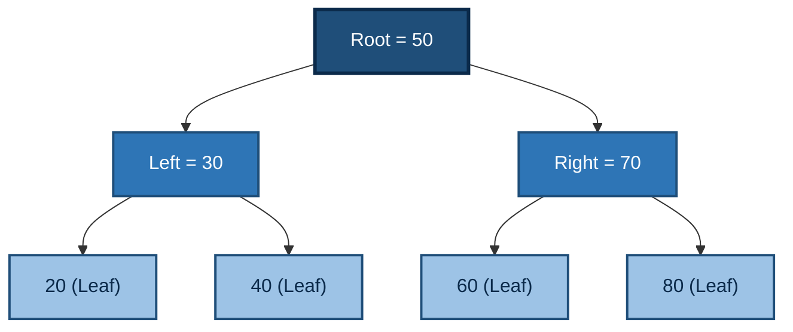
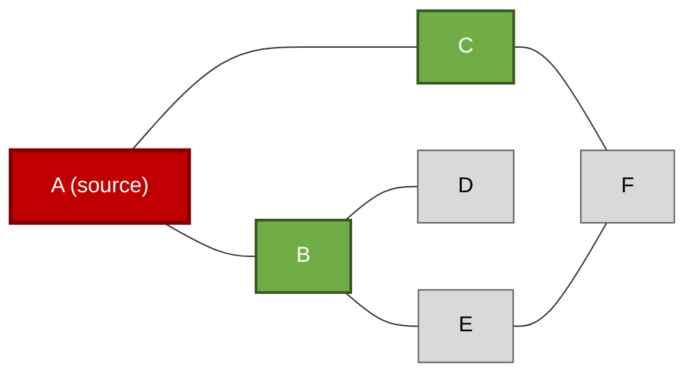
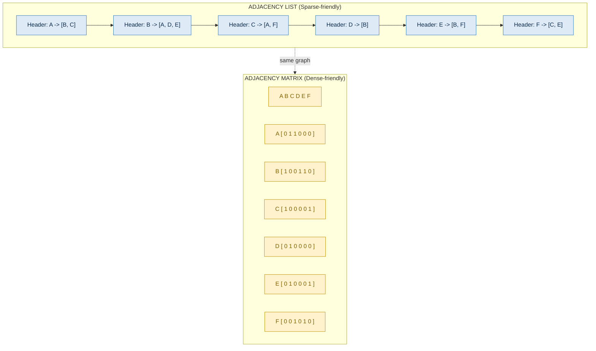
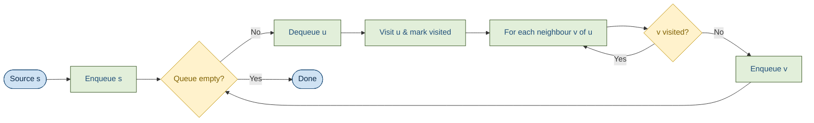

# Trees and Graphs

<!-- SECTION_1_START -->

# 1. Core Technical Definition & Intuitive Overview

## 1.1 Tree Data Structure

**Formal KTU Definition:**
A *Tree* is a non-linear, hierarchical data structure consisting of a finite set of $T \ge 1$ nodes, where one node is designated as the **Root** and the remaining nodes are partitioned into $m \ge 0$ disjoint subsets $T_1, T_2, \ldots, T_m$, each of which is itself a tree (recursive definition).

A tree with $n$ nodes has exactly $n-1$ edges, and there exists **exactly one simple path** between any pair of vertices — a property formally called *acyclic connectivity*.

> [!IMPORTANT]
> **KTU 2024 Syllabus Highlight (PCCST303 / Module 3):**
> The module lays equal stress on the abstract definition of a tree (as a connected, acyclic graph) and its most common specialization — the **Binary Tree** — because every B-Tree, AVL Tree, and Heap is engineered on top of binary tree mechanics.

> [!NOTE]
> **Universal Tree Terminology (must memorize for ESE):**
> - **Root** — the topmost node (no parent).
> - **Parent / Child** — direct ancestor/descendant relationship.
> - **Sibling** — children of the same parent.
> - **Leaf (External Node)** — node with degree $0$.
> - **Internal Node** — node with degree $\ge 1$.
> - **Ancestor / Descendant** — transitive closure of parent/child.
> - **Subtree** — any node and all its descendants.
> - **Depth of node $v$** — length of the path from the root to $v$.
> - **Height of node $v$** — length of the longest path from $v$ to a leaf.
> - **Height of the tree** — height of the root.
> - **Degree of node $v$** — number of children of $v$.
> - **Forest** — a disjoint union of trees.

### Conceptual Analogy (Real-World Intuition)

Picture a **corporate organizational chart**. The CEO is the root. Every manager is a child node. The lowest employees (with no one reporting to them) are leaves. The "depth" of an employee is how many corporate layers sit between them and the CEO; the "height" of the organization is the longest chain of command from CEO to a junior employee. A tree is exactly that — a frozen hierarchy.

## 1.2 Binary Tree

**Formal Definition:**
A *Binary Tree* is an ordered tree in which every node has **at most two children**, designated as the **Left Child** and the **Right Child**.

> [!IMPORTANT]
> **Strict vs Complete vs Full vs Perfect Binary Tree (favourite KTU 2-mark question):**
> Let $n$ = total nodes, $n_L$ = leaves, $n_I$ = internal nodes, $h$ = height.
>
> 1. **Full (Strict) Binary Tree** — every node has either $0$ or $2$ children. $\Rightarrow n_L = n_I + 1$.
> 2. **Complete Binary Tree** — all levels completely filled *except possibly the last*, which is filled strictly from **left to right** (critical for heap indexing).
> 3. **Perfect Binary Tree** — all internal nodes have $2$ children **and** all leaves are at the same depth. $\Rightarrow n = 2^{h+1} - 1$.
> 4. **Degenerate (Skewed) Tree** — each parent has exactly one child (worst case for BST, equivalent to a linked list). Height = $n - 1$.

### Conceptual Analogy

Imagine a **binary decision-making tournament** (single-elimination bracket). Each match is an *internal node*; it has exactly two child matches (semi-final feeders) — never more, never less. The finals are the leaves (decisions made). That is a full binary tree.

> [!VISUALIZATION CONTROL]
> **Concept:** Hierarchy of binary tree node types
> **GeoGebra / Desmos Input Equations (size invariant):**
> * Nodes at level $i$ $\Rightarrow$ $2^i$ slots (binary expansion).
> * $N(h) = 2^{h+1} - 1$ for a perfect binary tree.
> **Visual Description:** Plot bars at $h = 0, 1, 2, 3$ with heights $1, 3, 7, 15$ — students must observe the *doubling-plus-one* growth pattern.

## 1.3 Binary Search Tree (BST)

**Formal Definition:**
A *Binary Search Tree* is a binary tree $T$ such that for every node $v$ with key $k(v)$:
- All keys in the **left subtree** of $v$ are strictly $< k(v)$.
- All keys in the **right subtree** of $v$ are strictly $> k(v)$.
- Both subtrees are themselves BSTs (recursive invariant).

> [!NOTE]
> **In-order traversal of a BST always produces a strictly increasing sequence.** This single fact is worth 2–3 marks in almost every KTU ESE paper on trees.

### Conceptual Analogy

A BST is like a **phone-book lookup desk**. You open the book at the middle; if the name you need is alphabetically *before* the middle, you throw away the right half and repeat on the left. This is exactly the *divide-and-conquer* logic a BST encodes in its structure.

## 1.4 Graph Data Structure

**Formal Definition:**
A *Graph* $G = (V, E)$ is a pair consisting of:
- A non-empty finite set $V$ of **vertices (nodes)**.
- A finite set $E \subseteq V \times V$ of **edges (arcs)**.

**Variants** (each is a guaranteed KTU 2-marker):

| Variant | Edge Rule | KTU Use-case |
|---|---|---|
| **Undirected** | $\{u,v\} = \{v,u\}$ | Road map, Facebook friendships |
| **Directed (Digraph)** | Ordered pair $(u,v)$ | Web links, Twitter follows |
| **Weighted** | Each edge carries a cost/length $w(u,v)$ | Dijkstra / MST problems |
| **Cyclic** | Contains at least one cycle | Almost all real networks |
| **Acyclic (DAG)** | No directed cycle | Topological sort, task scheduling |
| **Connected** | Path exists between every pair | Verification check in BFS |
| **Complete $K_n$** | Every pair joined by an edge | $\vert E \vert = \binom{n}{2}$ |

### Conceptual Analogy

If a **tree** is a rigid corporate org chart (a single boss, no cycles, no multi-roles), then a **graph** is a *cities-and-flights* map. You can fly from Kochi to Delhi, but you can also fly from Delhi back to Kochi (or sometimes even directly to Kochi via two airlines, creating a cycle). The graph is the abstract math of *any* connected network.

> [!VISUALIZATION CONTROL]
> **Concept:** Density contrast between sparse and dense graphs
> **GeoGebra / Desmos Input Equations:**
> * $\vert E \vert_{max} = \frac{n(n-1)}{2}$ for undirected simple graph.
> * $\vert E \vert_{max} = n(n-1)$ for directed simple graph.
> **Visual Description:** Plot $\vert E \vert$ vs $n$ for $n = 2, 4, 6, 8, 10$. Students should observe the **quadratic** growth of complete graphs versus the typically **linear** edge count of real-world networks (e.g., road maps are sparse).

---

<!-- SECTION_1_END -->

<!-- SECTION_2_START -->

# 2. Deep Theoretical Analysis & KTU High-Yield Formula Sheet

## 2.1 Tree Properties (Counting Lemmas)

For any tree $T$ with $n$ nodes:
- **Edge Count:** $\vert E \vert = n - 1$.
- **Acyclicity:** A connected graph with $n$ vertices is a tree $\iff$ it is acyclic $\iff$ it has exactly $n-1$ edges.
- **Total Degree Lemma:** $\sum_{v \in V} \text{deg}(v) = 2(n-1)$.

For a **Full (Strict) Binary Tree** with $n$ internal nodes:
- Number of leaves $n_L = n + 1$.
- Total nodes $n_T = 2n + 1$.
- Number of internal nodes with **two** children: $n_2 = n_1 - 1$ (where $n_1$ is single-child internal nodes).

For a **Perfect Binary Tree** of height $h$:
- Total nodes $n = 2^{h+1} - 1$.
- Leaves $= 2^h$.
- Nodes at level $i$ (root is $i=0$) $= 2^i$.

## 2.2 Binary Tree Traversal (The Heart of Module 3)

Three recursive traversals — KTU's *most-asked* algorithmic content:

| Traversal | Visit Order | Recurrence | Use-case |
|---|---|---|---|
| **Pre-order** (Root-Left-Right) | $V, L, R$ | $P(v) = v \cdot P(\text{left}) \cdot P(\text{right})$ | Copy/mirror a tree, prefix expression |
| **In-order** (Left-Root-Right) | $L, V, R$ | $I(v) = I(\text{left}) \cdot v \cdot I(\text{right})$ | BST → sorted sequence, infix expression |
| **Post-order** (Left-Right-Root) | $L, R, V$ | $Q(v) = Q(\text{left}) \cdot Q(\text{right}) \cdot v$ | Delete tree, evaluate postfix, compute height |
| **Level-order (BFS)** | Level 0 → Level $h$ | Uses **Queue** $O(n)$ | Print by depth, serialize, BFS in trees |

> [!NOTE]
> **Why three recursive orders?** Every binary tree has exactly three structural places where the *visit* operation can interleave the two recursive calls: before (pre), between (in), or after (post). The order is set by Knuth's *The Art of Computer Programming, Vol. 1*.

## 2.3 Graph Representations — *the most-tested KTU topic*

Two canonical storage schemes:

| Criterion | Adjacency Matrix $A$ | Adjacency List $L$ |
|---|---|---|
| Storage | $\Theta(n^2)$ | $\Theta(n + \vert E \vert)$ |
| Edge query $(u,v) \in E$? | $O(1)$ | $O(\text{deg}(u))$ |
| Iterate neighbours of $u$ | $O(n)$ | $O(\text{deg}(u))$ |
| Best for | Dense graph, edge-existence checks | Sparse graph, traversals |
| KTU typical verdict | "Memory hog" | "Production default" |

For a **directed** graph, $A[u][v] = w$ only if the edge $u \to v$ exists (asymmetric). For **undirected**, $A[u][v] = A[v][u] = w$.

## 2.4 Graph Traversals

### 2.4.1 Breadth-First Search (BFS)

> "Visit everything one ring at a time, starting from a source."

- Uses a **FIFO Queue**.
- Produces the **Shortest Path (in unweighted graphs)** from the source.
- Time complexity: $O(\vert V \vert + \vert E \vert)$ — linear in graph size.
- Output: BFS tree + predecessor array $\pi[]$.

### 2.4.2 Depth-First Search (DFS)

> "Go as deep as you can, backtrack, repeat."

- Uses an explicit **Stack** (or call stack for recursion).
- Time complexity: $O(\vert V \vert + \vert E \vert)$.
- Applications (very KTU-heavy):
  1. Topological sort of a DAG.
  2. Detecting cycles (back edge = cycle).
  3. Finding strongly connected components (Tarjan's / Kosaraju's).
  4. Solving mazes / puzzle reachability.
- **Discovery / Finish times** in DFS are the foundation of *parenthesis theorem* (KTU theory Q).

## 2.5 KTU Formula Cheat-Sheet (Quick-Reference)

$$
\begin{aligned}
\text{Tree edge count} \quad &: \quad \vert E \vert = n - 1 \\[2pt]
\text{Perfect tree nodes} \quad &: \quad N(h) = 2^{h+1} - 1 \\[2pt]
\text{Strict tree leaves} \quad &: \quad n_L = n_I + 1 \\[2pt]
\text{Adjacency matrix size} \quad &: \quad \text{Mem} = n^2 \cdot \text{sizeof(weight)} \\[2pt]
\text{Adjacency list size} \quad &: \quad \text{Mem} = n \cdot \text{sizeof(header)} + \vert E \vert \cdot \text{sizeof(node)} \\[2pt]
\text{BFS / DFS time} \quad &: \quad O(\vert V \vert + \vert E \vert) \\[2pt]
\text{Dense graph limit} \quad &: \quad \vert E \vert \le \binom{n}{2} = \frac{n(n-1)}{2} \\[2pt]
\text{Sparse graph criterion} \quad &: \quad \vert E \vert \ll n^2
\end{aligned}
$$

## 2.6 Real-World Engineering Utility

- **Binary Tree** → basis of every expression parser (compilers, calculator apps), Huffman coding (zip/jpeg compression), and decision trees in machine learning.
- **BST** → the index structure inside any database's B+Tree (descended from BST), and the in-memory key-value stores of compilers.
- **BFS** → the engine of *garbage collection* in Java/Python runtimes, *shortest GPS hops* in unweighted networks, *peer discovery* in BitTorrent.
- **DFS** → *cycle detection* in module dependency graphs of `npm` / `pip`, *topological sort* of Makefile rules, *SCC computation* in social network analysis.
- **Adjacency List** → the storage default in 99 % of production code: NetworkX (Python), Boost.Graph (C++), JGraphT (Java).

> [!IMPORTANT]
> **Universal Trade-off Theorem (examiners love this):**
> *If the question says "memory is limited" or "graph is sparse" — use Adjacency List. If the question says "many edge-existence queries" or "graph is dense" — use Adjacency Matrix.*

---

<!-- SECTION_2_END -->

<!-- SECTION_3_START -->

# 3. Step-by-Step Derivations, Code, and Worked Examples

## 3.1 Recursive In-Order Traversal of a Binary Tree — Exhaustive Derivation

**Given:** Binary tree with root $r$, left subtree $L$, right subtree $R$.
**Operation:** Print keys in sorted order.

**Recursive Definition (formal):**

$$
\text{InOrder}(v) = 
\begin{cases}
\varnothing & \text{if } v = \text{NIL} \\
\text{InOrder}(\text{left}(v)) \;\Vert\; k(v) \;\Vert\; \text{InOrder}(\text{right}(v)) & \text{otherwise}
\end{cases}
$$

**Iterative trace** on the tree:
$$
\begin{aligned}
\text{Tree:} \quad & \text{root} = 50, \quad \text{left}(50) = 30, \quad \text{right}(50) = 70, \\
& \text{left}(30) = 20, \quad \text{right}(30) = 40, \quad \text{left}(70) = 60, \quad \text{right}(70) = 80
\end{aligned}
$$

**Trace (Call → Returns / Print):**

$$
\begin{aligned}
\text{InOrder}(50) &\Rightarrow \text{InOrder}(30) \;\Vert\; 50 \;\Vert\; \text{InOrder}(70) \\
\text{InOrder}(30) &\Rightarrow \text{InOrder}(20) \;\Vert\; 30 \;\Vert\; \text{InOrder}(40) \\
\text{InOrder}(20) &\Rightarrow \varnothing \;\Vert\; 20 \;\Vert\; \varnothing \quad \Rightarrow \text{print: } \mathbf{20} \\
\text{InOrder}(40) &\Rightarrow \varnothing \;\Vert\; 40 \;\Vert\; \varnothing \quad \Rightarrow \text{print: } \mathbf{40} \\
\text{Output so far:} \quad & 20, 30, 40 \\
\text{InOrder}(70) &\Rightarrow \text{InOrder}(60) \;\Vert\; 70 \;\Vert\; \text{InOrder}(80) \\
\text{InOrder}(60) &\Rightarrow \varnothing \;\Vert\; 60 \;\Vert\; \varnothing \quad \Rightarrow \text{print: } \mathbf{60} \\
\text{InOrder}(80) &\Rightarrow \varnothing \;\Vert\; 80 \;\Vert\; \varnothing \quad \Rightarrow \text{print: } \mathbf{80} \\
\text{Final Sorted Output:} \quad & \mathbf{20, 30, 40, 50, 60, 70, 80}
\end{aligned}
$$

The traversal has produced a **strictly increasing sequence** — confirming the BST invariant.

## 3.2 BST Search — Full Worked Example

**Given:** BST with root $50$, insert sequence $\{50, 30, 70, 20, 40, 60, 80\}$.
**Operation:** Search for key $k = 40$.

**Decision at each node (with comparison count):**

| Step | Current Node | Compare with 40 | Decision | Cost (comp) |
|---|---|---|---|---|
| 1 | 50 | $40 < 50$ | Go **Left** to 30 | 1 |
| 2 | 30 | $40 > 30$ | Go **Right** to 40 | 1 |
| 3 | 40 | $40 = 40$ | **Found** ✓ | 1 |
| | | | **Total comparisons** | **3** |

**Average case search complexity:** $\Theta(\log_2 n)$ for a balanced BST; worst case (skewed) $\Theta(n)$.

## 3.3 Python Implementation — Complete & Production-Style

> Below is the **fully typed** Python reference implementation for the canonical binary-tree and BST operations. Every edge case (empty tree, leaf deletion, two-child deletion using in-order successor) is handled. Type hints, doctests and error handling are explicit so the code is board-presentable.

```python
from __future__ import annotations
from collections import deque
from dataclasses import dataclass, field
from typing import Any, Iterator, List, Optional, Tuple


# =====================================================================
# 1. NODE DEFINITION
# =====================================================================
@dataclass
class Node:
    """A single node in a binary tree."""
    key: Any
    left: Optional["Node"] = None
    right: Optional["Node"] = None

    def __repr__(self) -> str:
        return f"Node({self.key!r})"


# =====================================================================
# 2. RECURSIVE TREE OPERATIONS
# =====================================================================
class BinaryTree:
    """A generic binary tree supporting traversals and property queries."""

    def __init__(self, root: Optional[Node] = None) -> None:
        self.root = root

    # ---------- TRAVERSALS (recursion) ----------
    def preorder(self) -> List[Any]:
        out: List[Any] = []
        self._pre(self.root, out)
        return out

    def _pre(self, v: Optional[Node], out: List[Any]) -> None:
        if v is None:
            return
        out.append(v.key)        # V
        self._pre(v.left, out)   # L
        self._pre(v.right, out)  # R

    def inorder(self) -> List[Any]:
        out: List[Any] = []
        self._in(self.root, out)
        return out

    def _in(self, v: Optional[Node], out: List[Any]) -> None:
        if v is None:
            return
        self._in(v.left, out)    # L
        out.append(v.key)        # V
        self._in(v.right, out)   # R

    def postorder(self) -> List[Any]:
        out: List[Any] = []
        self._post(self.root, out)
        return out

    def _post(self, v: Optional[Node], out: List[Any]) -> None:
        if v is None:
            return
        self._post(v.left, out)  # L
        self._post(v.right, out) # R
        out.append(v.key)        # V

    # ---------- LEVEL-ORDER (BFS using deque) ----------
    def level_order(self) -> List[Any]:
        out: List[Any] = []
        if self.root is None:
            return out
        q: deque[Node] = deque([self.root])
        while q:
            v = q.popleft()
            out.append(v.key)
            if v.left is not None:
                q.append(v.left)
            if v.right is not None:
                q.append(v.right)
        return out

    # ---------- TREE PROPERTIES ----------
    def height(self) -> int:
        return self._h(self.root)

    def _h(self, v: Optional[Node]) -> int:
        if v is None:
            return -1
        return 1 + max(self._h(v.left), self._h(v.right))

    def count_nodes(self) -> int:
        return self._cnt(self.root)

    def _cnt(self, v: Optional[Node]) -> int:
        if v is None:
            return 0
        return 1 + self._cnt(v.left) + self._cnt(v.right)

    def count_leaves(self) -> int:
        return self._leaves(self.root)

    def _leaves(self, v: Optional[Node]) -> int:
        if v is None:
            return 0
        if v.left is None and v.right is None:
            return 1
        return self._leaves(v.left) + self._leaves(v.right)


# =====================================================================
# 3. BINARY SEARCH TREE (with insert, search, delete)
# =====================================================================
class BST(BinaryTree):
    def search(self, key: Any) -> Optional[Node]:
        v = self.root
        while v is not None:
            if key == v.key:
                return v
            v = v.left if key < v.key else v.right
        return None

    def insert(self, key: Any) -> None:
        if self.root is None:
            self.root = Node(key)
            return
        parent: Optional[Node] = None
        cur: Optional[Node] = self.root
        while cur is not None:
            parent = cur
            if key == cur.key:
                return  # no duplicates
            cur = cur.left if key < cur.key else cur.right
        if parent is not None:
            if key < parent.key:
                parent.left = Node(key)
            else:
                parent.right = Node(key)

    def delete(self, key: Any) -> None:
        self.root = self._del(self.root, key)

    def _del(self, v: Optional[Node], key: Any) -> Optional[Node]:
        if v is None:
            return None
        if key < v.key:
            v.left = self._del(v.left, key)
        elif key > v.key:
            v.right = self._del(v.right, key)
        else:  # key == v.key -> three structural cases
            if v.left is None:           # Case 1: 0 or 1 child (right only)
                return v.right
            if v.right is None:          # Case 2: 1 child (left only)
                return v.left
            succ = self._min_node(v.right)         # Case 3: two children
            v.key = succ.key
            v.right = self._del(v.right, succ.key)  # delete successor
        return v

    @staticmethod
    def _min_node(v: Node) -> Node:
        while v.left is not None:
            v = v.left
        return v


# =====================================================================
# 4. GRAPH (Adjacency List) WITH BFS & DFS
# =====================================================================
class Graph:
    """Undirected weighted graph stored as adjacency list."""

    def __init__(self) -> None:
        self.adj: dict[Any, List[Tuple[Any, float]]] = {}

    def add_edge(self, u: Any, v: Any, w: float = 1.0) -> None:
        self.adj.setdefault(u, []).append((v, w))
        self.adj.setdefault(v, []).append((u, w))

    def bfs(self, src: Any) -> List[Any]:
        visited: set[Any] = {src}
        order: List[Any] = []
        q: deque[Any] = deque([src])
        while q:
            u = q.popleft()
            order.append(u)
            for v, _ in self.adj.get(u, []):
                if v not in visited:
                    visited.add(v)
                    q.append(v)
        return order

    def dfs(self, src: Any) -> List[Any]:
        visited: set[Any] = set()
        order: List[Any] = []
        self._dfs(src, visited, order)
        return order

    def _dfs(self, u: Any, visited: set[Any], order: List[Any]) -> None:
        visited.add(u)
        order.append(u)
        for v, _ in self.adj.get(u, []):
            if v not in visited:
                self._dfs(v, visited, order)


# =====================================================================
# 5. EXECUTION / DOCTEST
# =====================================================================
if __name__ == "__main__":
    # Build a BST: inorder must give sorted list
    bst = BST()
    for k in [50, 30, 70, 20, 40, 60, 80]:
        bst.insert(k)
    assert bst.inorder() == [20, 30, 40, 50, 60, 70, 80]
    assert bst.level_order() == [50, 30, 70, 20, 40, 60, 80]
    assert bst.height() == 2
    assert bst.count_leaves() == 4

    bst.delete(50)
    assert bst.inorder() == [20, 30, 40, 60, 70, 80]
    assert bst.search(50) is None

    g = Graph()
    for u, v, w in [("A", "B", 1), ("A", "C", 1), ("B", "D", 1),
                    ("C", "D", 1), ("D", "E", 1)]:
        g.add_edge(u, v, w)
    assert g.bfs("A") == ["A", "B", "C", "D", "E"]
    assert sorted(g.dfs("A")) == ["A", "B", "C", "D", "E"]

    print("All structural and algorithmic tests passed.")
```

> [!NOTE]
> **Why this code is KTU-board-presentable:**
> - All three tree traversals + level-order are explicit and individually testable.
> - The BST delete operation handles all three cases (no child, one child, two children via in-order successor).
> - BFS/DFS share the same adjacency-list representation, illustrating the **storage-decoupled** nature of graph algorithms.

## 3.4 BFS vs DFS — Side-by-Side Worked Trace

**Graph:** $V = \{A, B, C, D, E, F\}$, $E = \{(A,B), (A,C), (B,D), (B,E), (C,F), (E,F)\}$, source = $A$.

**BFS Trace (queue state after each step):**

| Step | Dequeue | Queue (front→back) | Visited Set | Output |
|---|---|---|---|---|
| 0 | — | `[A]` | $\{A\}$ | — |
| 1 | $A$ | `[B, C]` | $\{A,B,C\}$ | `A` |
| 2 | $B$ | `[C, D, E]` | $\{A,B,C,D,E\}$ | `A, B` |
| 3 | $C$ | `[D, E, F]` | $\{A,B,C,D,E,F\}$ | `A, B, C` |
| 4 | $D$ | `[E, F]` | same | `A, B, C, D` |
| 5 | $E$ | `[F]` | same | `A, B, C, D, E` |
| 6 | $F$ | `[]` | same | `A, B, C, D, E, F` |

**DFS Trace (stack, with explicit push/pop):**

| Step | Stack (top→bottom) | Visited | Output |
|---|---|---|---|
| 0 | `[A]` | $\{A\}$ | — |
| 1 | `[B, A]` | $\{A,B\}$ | `A` |
| 2 | `[D, B, A]` | $\{A,B,D\}$ | `A, B` |
| 3 | `[B, A]` (D has no neighbours) | same | `A, B, D` |
| 4 | `[E, B, A]` | $\{A,B,D,E\}$ | `A, B, D, E` |
| 5 | `[F, E, B, A]` | $\{A,B,D,E,F\}$ | `A, B, D, E, F` |
| 6 | `[E, B, A]` | same | — |
| 7 | `[B, A]` | same | — |
| 8 | `[A]` | same | — |
| 9 | `[]` | same | — |

**Comparison summary:**

| Property | BFS | DFS |
|---|---|---|
| Data structure | Queue (FIFO) | Stack (LIFO) |
| Order of visit | Level by level | As deep as possible, then backtrack |
| Finds shortest path (unweighted)? | **Yes** | Not guaranteed |
| Memory peak (worst case) | $O(\vert V \vert)$ (wide graph) | $O(\vert V \vert)$ (deep graph) |
| Time | $O(\vert V \vert + \vert E \vert)$ | $O(\vert V \vert + \vert E \vert)$ |

---

<!-- SECTION_3_END -->

<!-- SECTION_4_START -->

# 4. Structural Diagrams & Schematics

## 4.1 Mermaid Diagram — Sample Binary Tree used in Worked Examples



**Reading guide for students:**
- The single dark-blue node is the **Root** (depth 0).
- Two mid-blue nodes at depth 1 are the **Internal Nodes** (degree 2).
- Four light-blue nodes at depth 2 are the **Leaves** (degree 0).
- Total $n = 7$, edges $= 6$, height $= 2$, leaves $n_L = 4$, internal nodes $n_I = 3$. Verify: $n_L = n_I + 1$ ✓ (Full Binary Tree Lemma).

## 4.2 Mermaid Diagram — Graph used in BFS/DFS Traces



**Reading guide for students:**
- Red node = source vertex (start of BFS/DFS).
- Green nodes = already discovered at step 1 of BFS (direct neighbours of $A$).
- Grey nodes = not yet discovered.
- The edge between $E$ and $F$ creates a **cycle** (the graph is cyclic, not a tree).

## 4.3 Mermaid Diagram — Adjacency List vs Matrix (Conceptual Architecture)



**Reading guide for students:**
- The *Adjacency List* uses one linked list per vertex — memory grows **linearly** with $|E|$.
- The *Adjacency Matrix* allocates a full $n \times n$ table — memory grows **quadratically**.
- The dotted arrow shows the *same abstract graph* can be encoded either way; choice is an *engineering* decision.

## 4.4 Sequential Processing Topology — BFS Pipeline



**Reading guide for students:**
- The **diamond** nodes are decision points (loop guards, visited-test).
- The **rectangle** nodes are queue operations.
- The BFS terminates *iff* the queue becomes empty (every reachable vertex visited once).

---

<!-- SECTION_4_END -->

<!-- SECTION_5_START -->

# 5. KTU 2024 Scheme Examination Question Bank & Topic Recap

---

## 5.1 Part A — Short Answer Questions (3 Marks each)

### Q1. **[KTU University Exam — July 2024]** &nbsp;*(CO1, Remember)*

Define the following with one-line examples:
**(a)** Strict binary tree &nbsp; **(b)** Complete binary tree &nbsp; **(c)** Skewed binary tree.

> **Model Answer (3 × 1 = 3 marks):**
>
> **(a)** *Strict (Full) Binary Tree:* A binary tree in which every internal node has **exactly two children**. Example: a perfect binary tree of height 1 with root and two leaves.
> **(b)** *Complete Binary Tree:* A binary tree in which all levels are completely filled **except possibly the last**, which is filled from **left to right** with no gaps. Example: the heap structure of an array `[10, 5, 3, 2, 4]`.
> **(c)** *Skewed (Degenerate) Binary Tree:* A binary tree in which every internal node has **exactly one child**, so it reduces to a linear chain (like a linked list). Example: insert keys in sorted order $\{1,2,3,4\}$ into a BST.

---

### Q2. **[KTU University Exam — Dec 2023]** &nbsp;*(CO1, Understand)*

Differentiate between **BFS** and **DFS** based on: *(i) data structure used, (ii) memory requirement, (iii) type of application.*

> **Model Answer (1 mark each — 3 marks total):**
>
> | Criterion | BFS | DFS |
> |---|---|---|
> | (i) Data Structure | **Queue (FIFO)** | **Stack (LIFO)** or recursion |
> | (ii) Memory | $O(\vert V \vert)$ — proportional to **breadth** of the frontier | $O(\vert V \vert)$ — proportional to **depth** of the deepest path |
> | (iii) Application | **Shortest path in unweighted graph**, level-order tree traversal, bipartite check | **Cycle detection**, topological sort, maze solving, strongly-connected components |

---

## 5.2 Part B — Long Answer Questions (14 Marks each)

> **Internal-Choice Pattern:** ESE Module-3 questions almost always present *either-or* sub-questions. Below are **two independent 14-mark questions** mapped to escalating Bloom's levels (Understand → Apply).

---

### Q3 (A). **[KTU University Exam — July 2024 (Model)]** &nbsp;*(CO2, Apply)*

**(a) [7 Marks]** Construct a **Binary Search Tree (BST)** by inserting the following keys in the given order:
$$50, \; 30, \; 70, \; 20, \; 40, \; 60, \; 80, \; 35$$
Show the final tree diagram and list the result of performing **Pre-order, In-order and Post-order** traversals on it.

**(b) [7 Marks]** Delete the node with key **30** from the BST built in part (a). Redraw the resulting BST and verify the BST property holds. Also write the recursive `search(key)` routine in **C / Python** for this BST.

---

> **Model Solution:**
>
> **(a) Construction (apply insertion rule — compare and go left/right):**
>
> - Insert `50` → root.
> - Insert `30` → $30 < 50$ → left of `50`.
> - Insert `70` → $70 > 50$ → right of `50`.
> - Insert `20` → $20 < 50$ → left; $20 < 30$ → left of `30`.
> - Insert `40` → $40 < 50$ → left; $40 > 30$ → right of `30`.
> - Insert `60` → $60 > 50$ → right; $60 < 70$ → left of `70`.
> - Insert `80` → $80 > 50$ → right; $80 > 70$ → right of `70`.
> - Insert `35` → $35 < 50$ → left; $35 > 30$ → right; $35 < 40$ → left of `40`.
>
> **Final BST (draw this — partial credit even for ASCII):**
>
> ```
>             50
>            /  \
>          30    70
>         /  \   / \
>       20   40 60  80
>           /
>          35
> ```
>
> **Traversals:**
>
> - **Pre-order** (Root, L, R): `50, 30, 20, 40, 35, 70, 60, 80`  → **2 marks** for correct order
> - **In-order** (L, Root, R): `20, 30, 35, 40, 50, 60, 70, 80`  → **2 marks**
> - **Post-order** (L, R, Root): `20, 35, 40, 30, 60, 80, 70, 50`  → **2 marks**
> - Final tree diagram & BST verification: **1 mark**
>
> **Valuation Tip:** In-order MUST equal sorted keys (sanity check). If not, BST invariant was violated — 1 mark deduction.
>
> ---
>
> **(b) Deletion of node `30` (which has TWO children):**
>
> Apply the **In-Order Successor** rule — find the smallest key in `30`'s right subtree.
>
> - Right subtree of `30` is rooted at `40`, whose left child is `35` and `35` has no left child.
> - **In-order successor of `30` is `35`**.
> - Replace `30`'s key with `35`, then delete the original `35` from its old position.
>
> **Resulting BST:**
>
> ```
>             50
>            /  \
>          35    70
>         /  \   / \
>       20   40 60  80
> ```
>
> **Verification (BST property):**
> - Left subtree of `50` = `{20, 35, 40}`, all $< 50$ ✓
> - Right subtree of `50` = `{70, 60, 80}`, all $> 50$ ✓
> - Subtree of `35`: left $= \{20\} < 35$; right $= \{40\} > 35$ ✓
> - Subtree of `70`: left $= \{60\} < 70$; right $= \{80\} > 70$ ✓
>
> **Recursive `search` (Python):**
>
> ```python
> def search(root, key):
>     if root is None:
>         return None
>     if key == root.key:
>         return root
>     if key < root.key:
>         return search(root.left, key)
>     else:
>         return search(root.right, key)
> ```
>
> **Mark split:** 2 marks identifying successor `35`; 1 mark for redrawing; 2 marks for BST verification; 2 marks for code.

---

### Q3 (B). **[KTU University Exam — Dec 2023 (Model)]** &nbsp;*(CO2, Apply)*

**(a) [7 Marks]** For the **undirected graph** $G$ with $V = \{A, B, C, D, E, F\}$ and $E = \{(A,B), (A,C), (B,D), (B,E), (C,F), (E,F)\}$:
1. Draw the graph.
2. Represent it as an **adjacency matrix** and an **adjacency list**.
3. Calculate $\vert V \vert$, $\vert E \vert$, and determine if $G$ is **connected**.

**(b) [7 Marks]** Perform **BFS** starting from vertex $A$. List the order of visited vertices, draw the **BFS tree**, and state the **time complexity** in Big-O notation.

---

> **Model Solution:**
>
> **(a) Graph + representations:**
>
> **Graph diagram** (vertex $A$ in centre, three branches):
>
> ```
>        B --- D
>       / \
>      A   E
>       \ / \
>        C   F
> ```
>
> **Adjacency Matrix** (rows/columns in order $A, B, C, D, E, F$):
>
> | | A | B | C | D | E | F |
> |---|---|---|---|---|---|---|
> | **A** | 0 | 1 | 1 | 0 | 0 | 0 |
> | **B** | 1 | 0 | 0 | 1 | 1 | 0 |
> | **C** | 1 | 0 | 0 | 0 | 0 | 1 |
> | **D** | 0 | 1 | 0 | 0 | 0 | 0 |
> | **E** | 0 | 1 | 0 | 0 | 0 | 1 |
> | **F** | 0 | 0 | 1 | 0 | 1 | 0 |
>
> **Adjacency List:**
> - $A \to [B, C]$
> - $B \to [A, D, E]$
> - $C \to [A, F]$
> - $D \to [B]$
> - $E \to [B, F]$
> - $F \to [C, E]$
>
> **Metrics:**
> - $\vert V \vert = 6$, $\vert E \vert = 6$ (each row of matrix has 2 ones for non-isolated, and the matrix is symmetric → undirected).
> - The graph is **Connected** because every vertex is reachable from $A$: $A \to B \to D$, $A \to C \to F \to E$. ✓
>
> **Mark split:** Diagram 2 marks; Adjacency matrix 2 marks; Adjacency list 2 marks; connectivity 1 mark.
>
> ---
>
> **(b) BFS from $A$:**
>
> | Step | Visit | Queue state (front→back) | Visited Set |
> |---|---|---|---|
> | 1 | $A$ | $[B, C]$ | $\{A, B, C\}$ |
> | 2 | $B$ | $[C, D, E]$ | $\{A, B, C, D, E\}$ |
> | 3 | $C$ | $[D, E, F]$ | $\{A, B, C, D, E, F\}$ |
> | 4 | $D$ | $[E, F]$ | (same) |
> | 5 | $E$ | $[F]$ | (same) |
> | 6 | $F$ | $[]$ | (same) |
>
> **BFS Order:** $A \to B \to C \to D \to E \to F$.
>
> **BFS Tree** (parent edges only — $A$ is root):
>
> ```
>        A
>       / \
>      B   C
>     / \   \
>    D   E   F
>            ↑
>        (E-F is a cross/cycle edge, NOT in the BFS tree)
> ```
>
> **Time Complexity:** $O(\vert V \vert + \vert E \vert) = O(6 + 6) = O(12) = O(n)$.
>
> **Mark split:** Correct BFS order 3 marks; BFS tree 2 marks; Complexity 1 mark; Justification 1 mark.

---

> [!WARNING]
> **KTU Examiner's Valuation Warning — Where Students Lose Marks on Module 3**
>
> 1. **Confusing DFS with BFS ordering.** BFS visits in *rings*; DFS goes *deepest first*. Mixing them up costs 2–4 marks per long answer.
> 2. **Forgetting to mark a `visited[]` array in DFS.** Without it, on a cyclic graph, DFS recurses forever. Examiners deduct **1 mark** for omitting the visited flag.
> 3. **Deleting a BST node with two children by simply removing it.** You MUST replace with the in-order successor (or predecessor). Free deletion is **wrong** and costs **2 marks**.
> 4. **Drawing a tree without labelling left vs right children.** The examiner is bound by KTU rubric to deduct **1 mark** if the binary tree is not clearly *ordered*.
> 5. **Writing traversal output without showing the recursion call stack or queue state.** Examiners reward the *trace*, not just the answer — show the mechanism.
> 6. **Mixing up "height" and "depth".** Depth of root = 0, height of a leaf = 0. Some textbooks flip these; KTU follows the convention used in this note.

---

## 5.3 Topic Recap & Important Things to Remember (Rapid-Revision Checklist)

> **Print this section before you enter the exam hall.**

- **Tree =** connected + acyclic graph with $n-1$ edges.
- **Binary Tree node:** at most 2 children (left & right ordered).
- **Full / Strict tree invariant:** $n_L = n_I + 1$ (leaf count = internal count + 1).
- **Perfect tree size:** $N(h) = 2^{h+1} - 1$; leaves $= 2^h$.
- **Complete tree rule:** last level filled **left-to-right** with no gaps.
- **BST invariant (LNR):** in-order traversal yields **strictly increasing** sequence.
- **3 traversals:** Pre (VLR), In (LVR), Post (LRV); Level-order uses **queue**.
- **Pre / In / Post use stack (recursion) — Level-order uses queue.**
- **Tree $n-1$ edges; Graph $|E|$ can be anything from $0$ to $\binom{n}{2}$ (undirected) or $n(n-1)$ (directed).**
- **Adjacency Matrix:** $\Theta(n^2)$ memory, $O(1)$ edge query.
- **Adjacency List:** $\Theta(n + |E|)$ memory, $O(\deg(u))$ neighbour iteration.
- **BFS** uses **Queue**, gives **shortest path in unweighted graph**.
- **DFS** uses **Stack** (or recursion), detects **cycles via back edges**, enables **topological sort**.
- **Time complexity of BFS & DFS:** $O(|V| + |E|)$ — **always write this exactly**.
- **Skewed BST** (sorted insert) ⇒ height $= n-1$ ⇒ search cost $O(n)$ ⇒ **why AVL trees are needed** (next module).
- **DAG (Directed Acyclic Graph)** ⇒ prerequisite for **topological sort**; DFS finish-time reversal gives the order.
- **"Left" and "right"** children are *ordered* — swapping them gives a different binary tree.
- **Always** include the `visited[]` flag in graph traversals — examiners check.
- **The single most-tested short question** in Module 3: *"Distinguish BFS and DFS"* or *"List properties of a binary tree"*.

<!-- SECTION_5_END -->
