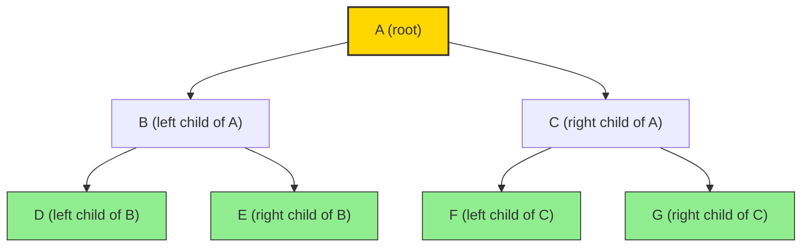
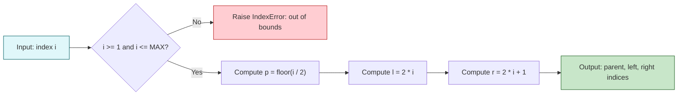
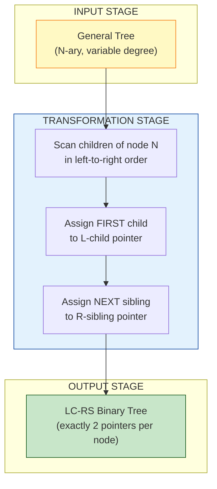
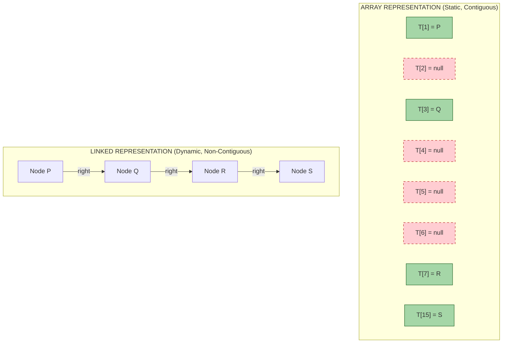

# Trees: Representation of Trees

<!-- SECTION_1_START -->
# 1. Core Technical Definition & Intuitive Overview

## 1.1 Formal Academic Definition (KTU 2024 Syllabus Terminology)

> [!IMPORTANT]
> **Tree (Data Structure):** A *Tree* is a **non-linear**, **hierarchical** data structure consisting of a finite set $T \ge 1$ of **nodes** such that there is one designated node called the **root**, and the remaining nodes are partitioned into $m \ge 0$ disjoint sub-trees $T_1, T_2, \dots, T_m$, each of which is itself a tree. A tree with $n=0$ nodes is called the **empty tree** (or *null tree*).

In the **KTU 2024 Scheme (PCCST303) Module 3** framework, a tree is formally modelled as a connected, **acyclic undirected graph** with $n$ nodes and exactly $n-1$ edges.

## 1.2 Essential Tree Terminology

| Term | Definition |
|---|---|
| **Root** | The topmost node; has no parent. |
| **Parent** | A node that is a predecessor of another node. |
| **Child** | A node that is a direct successor of another node. |
| **Sibling** | Nodes that share the same parent. |
| **Leaf (External Node)** | A node with **zero children** (degree $= 0$). |
| **Internal Node** | A node with at least one child (degree $\ge 1$). |
| **Degree of a Node** | Number of children of that node. |
| **Degree of a Tree** | Maximum degree among all nodes. |
| **Edge** | A connecting link between a parent and a child. |
| **Path** | Sequence of nodes $n_1, n_2, \dots, n_k$ such that $n_i$ is the parent of $n_{i+1}$. |
| **Depth of a Node** | Length of the path from the **root** to that node. Root depth $= 0$. |
| **Height of a Node** | Length of the longest path from that node down to a **leaf**. Leaf height $= 0$. |
| **Height of a Tree** | Height of the root node. |
| **Level** | All nodes at the same depth. Root is at level $0$. |
| **Ancestor / Descendant** | Any node on the path from root to a given node (excluding itself) is its ancestor; conversely a descendant. |
| **Subtree** | A tree formed by a node and all its descendants. |
| **Forest** | A disjoint union of two or more trees. |

## 1.3 Conceptual Analogy / Intuition

> [!NOTE]
> **Real-World Analogy — A Corporate Organisation Chart**
> 
> Think of a tree exactly like the **hierarchy chart of a company**. The **CEO sits at the top** (this is the *root*). Directly under the CEO are VPs (*children*). Under the VPs are Directors (*grandchildren*). The **employees at the bottom who report to no one** are *leaves* (or *external nodes*). Two VPs working under the same CEO are *siblings*. The number of direct reports a manager has is the *degree* of that node.

> [!NOTE]
> **Geometric Intuition — An Inverted Tree**
> 
> Unlike a biological tree that grows upward with branches and downward roots, a **computer science tree is drawn upside-down**: the **root is at the top**, and the branches (edges) grow **downward** toward the leaves. Each edge is a *parent–child* relationship pointing downward.

> [!IMPORTANT]
> **Critical Properties of a Tree (with $n$ nodes):**
> - Exactly $n-1$ edges.
> - **Connected** (any node is reachable from any other).
> - **Acyclic** (no cycles exist).
> - Removing any edge disconnects the tree.
> - Adding any edge between two existing nodes creates exactly one cycle.

## 1.4 Fundamental Representation Strategies — Overview

For implementation in memory, trees can be represented in **two principal ways**:

> [!IMPORTANT]
> **1. Sequential (Array-based) Representation**
> - Stores nodes in a contiguous, linear array.
> - Position-based addressing using index arithmetic.
> - **Best for:** Complete / nearly-complete binary trees.
> - **Pitfall:** Wastes memory for *skewed* or *sparse* trees.

> [!IMPORTANT]
> **2. Linked (Pointer-based) Representation**
> - Each node is an object holding **data** and **pointers** to its children.
> - Memory is allocated dynamically and non-contiguously.
> - **Best for:** General trees, sparse trees, and trees of variable shape.

For **general (multi-way) trees**, a powerful transformation called the **Left-Child Right-Sibling (LC-RS)** representation converts any general tree into a **binary tree**, which can then be stored using either representation above.

> [!VISUALIZATION CONTROL]
> **Concept:** Index-to-Node mapping of a complete binary tree stored in an array
> **Conceptual Axes:**
> * Horizontal axis $i$ (array index) → $1, 2, 3, 4, 5, 6, 7$
> * Vertical axis → indicates the data value stored
> **Mapping Relations:**
> * Index $1 \rightarrow$ Root (level 0)
> * Indices $2, 3 \rightarrow$ Children of root (level 1)
> * Indices $4, 5, 6, 7 \rightarrow$ Grandchildren (level 2)
> **Visual Description:** Visualise 7 boxes laid out linearly; the root sits at box 1, with downward pointer lines connecting box 1 to boxes 2 and 3, and from box 2 to 4 and 5, and from box 3 to 6 and 7.

<!-- SECTION_1_END -->

<!-- SECTION_2_START -->
# 2. Deep Theoretical Analysis & KTU High-Yield Formula Sheet

## 2.1 Sequential (Array) Representation of a Binary Tree

In this representation, a binary tree of maximum height $h$ is stored in a one-dimensional array of size $2^h$ (or $2^{h+1}-1$ for a full implementation), indexed from $1$ to $2^h-1$.

### 2.1.1 The Master Indexing Rules (1-indexed array)

For any node stored at index $i$:

$$
\text{Parent}(i) = \left\lfloor \frac{i}{2} \right\rfloor
$$

$$
\text{LeftChild}(i) = 2i
$$

$$
\text{RightChild}(i) = 2i + 1
$$

> [!NOTE]
> **Why does this work?** Because a level-order traversal of a complete binary tree visits parents *before* children and visits the *left* child *before* the *right* child. This natural ordering allows us to encode the parent–child relationships purely via arithmetic on the index, eliminating the need for explicit pointers.

### 2.1.2 The 0-indexed Variant (used in C/C++ and Python lists)

For any node at index $i$ (where $i \ge 0$):

$$
\text{Parent}(i) = \left\lfloor \frac{i-1}{2} \right\rfloor
$$

$$
\text{LeftChild}(i) = 2i + 1
$$

$$
\text{RightChild}(i) = 2i + 2
$$

### 2.1.3 Pros and Cons of Array Representation

> [!IMPORTANT]
> **Advantages**
> - **No pointer overhead** — pure data storage.
> - **Random access in $O(1)$** time to find parent, left child, right child.
> - **Cache-friendly** — sequential memory layout.
> - **Space-efficient** for complete binary trees: $n$ nodes in $n$ slots.

> [!WARNING]
> **Disadvantages**
> - **Wastes memory** for *skewed* or *sparse* trees. A right-skewed tree of height $h$ has $h$ nodes but requires $2^h-1$ slots.
> - **Insertion / deletion** of internal nodes requires shifting many elements.
> - **Fixed maximum size** must be known in advance (static allocation).

## 2.2 Linked (Pointer-based) Representation of a Binary Tree

Each node is a struct/object with three fields:

- $data$ — payload.
- $lchild$ — pointer to the left sub-tree.
- $rchild$ — pointer to the right sub-tree.

The root is referenced by a single pointer variable `root`.

### 2.2.1 Memory Analysis

For a tree with $n$ nodes:
- **Total memory** $\approx n \cdot (S_{data} + 2 \cdot S_{pointer})$
- **Wasted slots** $= 0$ (only the actual nodes are allocated)
- **Navigation cost** to find parent $= O(h)$ unless a parent pointer is added.

## 2.3 Representation of General (Multi-way) Trees

A general tree allows a node to have an **arbitrary** number of children. Three common approaches exist:

### 2.3.1 Approach 1 — Variable-Degree Node (with an Array or List of Children)

Each node stores an array or dynamic list of pointers to its children. Flexible but complicates memory allocation.

### 2.3.2 Approach 2 — Left-Child Right-Sibling (LC-RS) Representation

> [!IMPORTANT]
> **The most important transformation in Module 3.**
> 
> The LC-RS representation converts *any* general tree into an equivalent binary tree by reinterpreting the *first child* of a node as its *left child* and the *next sibling* as its *right child*. This is the technique originally used in **Unix file systems** and is the conceptual basis for the **DOM** of HTML and the **AST (Abstract Syntax Tree)** of compilers.

| Original Pointer (General Tree) | New Pointer (Binary Tree) |
|---|---|
| First child | $lchild$ (left pointer) |
| Next sibling | $rchild$ (right pointer) |
| Parent | Optional `$parent$` (if needed) |

### 2.3.3 Properties of the LC-RS Transformation

- A general tree with $n$ nodes is transformed into a binary tree with $n$ nodes.
- The depth of a node in the new binary tree is **not necessarily** equal to its depth in the original tree.
- **In-order traversal** of the LC-RS binary tree visits the children of a node in the original general tree in **left-to-right order**.

## 2.4 KTU Formula Sheet / Cheat Sheet

> [!IMPORTANT]
> **Quick-Reference Table — All Critical Formulas**

| Concept | Formula (1-indexed) | Formula (0-indexed) |
|---|---|---|
| Parent of node at index $i$ | $P(i) = \left\lfloor i / 2 \right\rfloor$ | $P(i) = \left\lfloor (i-1) / 2 \right\rfloor$ |
| Left child of node at index $i$ | $L(i) = 2i$ | $L(i) = 2i+1$ |
| Right child of node at index $i$ | $R(i) = 2i+1$ | $R(i) = 2i+2$ |
| Max nodes in complete BT of height $h$ | $2^{h+1} - 1$ | Same |
| Max nodes at level $l$ (root at level 0) | $2^{l}$ | Same |
| Array size needed for $n$ nodes (skewed) | $2^{n} - 1$ (worst) | Same |
| Min array size (complete tree, $n$ nodes) | $n$ | $n$ |
| Number of leaf nodes in a full BT | $\text{leaves} = n_{\text{internal}} + 1$ | Same |
| Height in terms of leaf level | $h = \text{level of deepest leaf}$ | Same |

> [!NOTE]
> **Real-World Utility in Engineering and Computer Science**
> - **Heap Data Structure** — The *binary heap* is implemented as an array-representation of a *complete binary tree*. Used in *Heapsort*, *priority queues*, and *Dijkstra's algorithm*.
> - **Huffman Coding Tree** — Stored using linked nodes; used in *ZIP, JPEG, MP3* compression.
> - **Database B-Trees / B+ Trees** — Disk-based indices where the array-friendly nature minimises I/O.
> - **Compiler Design** — *Abstract Syntax Trees* use the LC-RS-like representation to model `n`-ary operators (e.g., `if-then-else`, `a + b + c + d`).
> - **Game AI** — *Minimax trees* and *decision trees* (e.g., chess engines) use linked representation.
> - **File Systems (ext2, ext3, ext4)** — Directory entries are linked as siblings using the LC-RS principle.
<!-- SECTION_2_END -->

<!-- SECTION_3_START -->
# 3. Step-by-Step Derivations & Code/Symbolic Implementation

## 3.1 Derivation of the Array-Indexing Rules

> [!NOTE]
> We want a placement rule such that for any parent at index $i$, its two children are placed at predictable indices, and for any child at index $i$, the parent can be retrieved instantly.

### Step 1 — Level 0 contains the root

Place the root at index $1$. So the root is at $i=1$.

### Step 2 — Level 1 contains up to 2 nodes (left then right child of root)

The left child must come immediately after the root, and the right child must come immediately after the left child. So:
- Left child of root $\rightarrow i = 2 \cdot 1 = 2$
- Right child of root $\rightarrow i = 2 \cdot 1 + 1 = 3$

This generalises to:
$$
L(i) = 2i, \quad R(i) = 2i + 1
$$

### Step 3 — Step 2 must hold for every parent

By **mathematical induction**, if the left child of $i$ is at $2i$, then the left child of $2i$ is at $2 \cdot 2i = 4i$, the right child of $2i$ is at $4i+1$, and so on. The placement is uniquely defined.

### Step 4 — Inverting the relationship (parent from child)

Given a child at index $i$, we must find a parent $p$ such that $i$ is either $2p$ or $2p+1$. So:

$$
p = \left\lfloor \frac{i}{2} \right\rfloor
$$

**Verification:** Take $i=5$. Then $p = \lfloor 5/2 \rfloor = 2$. The children of node 2 are at $2 \cdot 2 = 4$ and $2 \cdot 2 + 1 = 5$. ✓

## 3.2 Worked Example — Array Representation

Consider the following binary tree $T$ with 7 nodes:

$$
\text{Level 0: } A
$$
$$
\text{Level 1: } B, C
$$
$$
\text{Level 2: } D, E, F, G
$$

Where $B$ and $C$ are the children of $A$; $D, E$ are children of $B$; $F, G$ are children of $C$.

### Step 1 — Allocate the array of size 8 (indices 0 to 7, ignoring 0)

Let $T[1 \dots 7]$ be our array. We use index $0$ as a sentinel "no node".

### Step 2 — Fill the array in level order

| Index $i$ | $1$ | $2$ | $3$ | $4$ | $5$ | $6$ | $7$ |
|---|---|---|---|---|---|---|---|
| Data | $A$ | $B$ | $C$ | $D$ | $E$ | $F$ | $G$ |
| Node | Root | L(A) | R(A) | L(B) | R(B) | L(C) | R(C) |

### Step 3 — Verify the rules

For node $E$ at $i=5$:
- Parent: $\lfloor 5/2 \rfloor = 2 \rightarrow$ Node $B$ ✓
- Left child: $2 \cdot 5 = 10$ → out of range → no left child ✓
- Right child: $2 \cdot 5 + 1 = 11$ → out of range → no right child ✓

## 3.3 Python Implementation — Array-Based Binary Tree

```python
from typing import List, Optional

class ArrayBinaryTree:
    """
    Array-based representation of a binary tree using 1-indexed storage.
    Index 0 is reserved as a sentinel to simplify the parent formula.
    """

    def __init__(self, max_size: int) -> None:
        if max_size < 1:
            raise ValueError("max_size must be >= 1")
        # Allocate a list of size max_size + 1 to allow 1-indexed access
        self._tree: List[Optional[str]] = [None] * (max_size + 1)
        self._max_size: int = max_size
        self._last_used_index: int = 0

    def set_value(self, index: int, value: str) -> None:
        """Insert a value at a specific array index with strict boundary checks."""
        if index < 1 or index > self._max_size:
            raise IndexError(f"Index {index} out of bounds [1, {self._max_size}]")
        if self._tree[index] is not None:
            raise ValueError(f"Index {index} is already occupied by '{self._tree[index]}'")
        self._tree[index] = value
        self._last_used_index = max(self._last_used_index, index)

    def get_parent_index(self, index: int) -> int:
        if index <= 1:
            return -1  # Root has no parent
        return index // 2  # Integer division = floor for positive integers

    def get_left_child_index(self, index: int) -> int:
        return 2 * index

    def get_right_child_index(self, index: int) -> int:
        return 2 * index + 1

    def display(self) -> None:
        """Print the internal array representation, skipping empty slots."""
        print("Array Representation (1-indexed):")
        for i in range(1, self._max_size + 1):
            marker = str(self._tree[i]) if self._tree[i] is not None else "_"
            print(f"  T[{i:>2}] = {marker}")

    def get_node_value(self, index: int) -> Optional[str]:
        if index < 1 or index > self._max_size:
            return None
        return self._tree[index]


# ---- Driver Code demonstrating the worked example ----
if __name__ == "__main__":
    bt = ArrayBinaryTree(max_size=7)
    # Level-order insertion: A, B, C, D, E, F, G
    insertion_order = [("A", 1), ("B", 2), ("C", 3),
                       ("D", 4), ("E", 5), ("F", 6), ("G", 7)]
    for value, index in insertion_order:
        bt.set_value(index, value)

    bt.display()

    # Demonstrate child retrieval for node B (index 2)
    print("\nFamily of node B (index 2):")
    print(f"  Parent  = {bt.get_node_value(bt.get_parent_index(2))}")      # A
    print(f"  L-Child = {bt.get_node_value(bt.get_left_child_index(2))}")  # D
    print(f"  R-Child = {bt.get_node_value(bt.get_right_child_index(2))}") # E
```

**Expected Output:**

```
Array Representation (1-indexed):
  T[ 1] = A
  T[ 2] = B
  T[ 3] = C
  T[ 4] = D
  T[ 5] = E
  T[ 6] = F
  T[ 7] = G

Family of node B (index 2):
  Parent  = A
  L-Child = D
  R-Child = E
```

## 3.4 Python Implementation — Linked (Pointer) Representation of a Binary Tree

```python
from typing import Optional, List

class BinaryTreeNode:
    """A node in a binary tree with data and two child pointers."""

    def __init__(self, data: str) -> None:
        self.data: str = data
        self.left: Optional["BinaryTreeNode"] = None
        self.right: Optional["BinaryTreeNode"] = None

    def __repr__(self) -> str:
        return f"Node({self.data!r})"


def build_tree_from_array(arr: List[Optional[str]], index: int = 1) -> Optional[BinaryTreeNode]:
    """
    Recursively constructs a linked binary tree from a 1-indexed array
    where None indicates an empty slot.
    """
    # ---- Absolute boundary check ----
    if index >= len(arr) or arr[index] is None:
        return None
    node = BinaryTreeNode(arr[index])
    # Recursive calls with explicit index arithmetic
    node.left = build_tree_from_array(arr, 2 * index)
    node.right = build_tree_from_array(arr, 2 * index + 1)
    return node


def inorder_traversal(node: Optional[BinaryTreeNode]) -> None:
    """Standard in-order (LNR) traversal of the linked binary tree."""
    if node is None:
        return
    inorder_traversal(node.left)
    print(node.data, end=" ")
    inorder_traversal(node.right)


# ---- Driver Code ----
if __name__ == "__main__":
    # Sentinel at index 0 to keep 1-indexed addressing clean
    tree_array: List[Optional[str]] = [None, "A", "B", "C", "D", "E", "F", "G"]
    root = build_tree_from_array(tree_array, 1)
    print("In-order traversal of linked tree:", end=" ")
    inorder_traversal(root)
    print()
```

**Expected Output:**

```
In-order traversal of linked tree: D B E A F C G
```

## 3.5 Python Implementation — Left-Child Right-Sibling (LC-RS) Representation

```python
from typing import Optional, List

class LCRSNode:
    """A general-tree node stored in LC-RS (binary-tree) form."""

    def __init__(self, data: str) -> None:
        self.data: str = data
        self.left_child: Optional["LCRSNode"] = None      # points to FIRST child
        self.right_sibling: Optional["LCRSNode"] = None  # points to NEXT sibling


def build_lcrs(adj: dict) -> Optional[LCRSNode]:
    """
    Build an LC-RS binary tree from an adjacency-list description of a general tree.
    adj[node] = list of its children in left-to-right order.
    """
    if not adj:
        return None

    # Helper to construct via recursion
    def _build(node_name: str) -> LCRSNode:
        node = LCRSNode(node_name)
        children: List[str] = adj.get(node_name, [])
        if children:
            # First child becomes the left child in LC-RS
            node.left_child = _build(children[0])
            # Walk down the right_sibling chain
            current = node.left_child
            for sibling_name in children[1:]:
                current.right_sibling = _build(sibling_name)
                current = current.right_sibling
        return node

    # The first key in the dict is the root (passed explicitly via 'ROOT')
    return _build("ROOT")


def print_lcrs_structure(node: Optional[LCRSNode], prefix: str = "", is_left: bool = True) -> None:
    """Pretty-print the LC-RS tree showing left-child and right-sibling pointers."""
    if node is None:
        return
    connector = "├── L-child : " if is_left else "└── R-sibling: "
    print(prefix + connector + node.data)
    new_prefix = prefix + ("│   " if is_left else "    ")
    print_lcrs_structure(node.left_child, new_prefix, True)
    print_lcrs_structure(node.right_sibling, new_prefix, False)


# ---- Driver Code: Convert the general tree
#            ROOT
#           /  |  \
#          A   B   C
#         / \      |
#        D   E     F
# into an LC-RS binary tree.
if __name__ == "__main__":
    adjacency: dict = {
        "ROOT": ["A", "B", "C"],
        "A":    ["D", "E"],
        "B":    [],
        "C":    ["F"],
        "D":    [],
        "E":    [],
        "F":    []
    }
    root = build_lcrs(adjacency)
    print("LC-RS Representation of the General Tree:\n")
    print_lcrs_structure(root)
```

**Expected Output:**

```
LC-RS Representation of the General Tree:

├── L-child : ROOT
│   ├── L-child : A
│   │   ├── L-child : D
│   │   └── R-sibling: E
│   └── R-sibling: B
│       └── R-sibling: C
│           ├── L-child : F
```

## 3.6 Worked Example — Skewed Tree and Memory Waste

Consider a **right-skewed** binary tree with nodes $P, Q, R, S$ (each is the right child of the previous one).

### Step 1 — Level-order representation in the array

- $P$ at index $1$
- $Q$ at index $2$ (it is the left child of $P$, but we leave it empty since the tree is right-skewed) — actually, since $Q$ is the right child of $P$, $Q$ is at index $3$.
- $R$ is the right child of $Q$ $\rightarrow$ index $2 \cdot 3 + 1 = 7$.
- $S$ is the right child of $R$ $\rightarrow$ index $2 \cdot 7 + 1 = 15$.

### Step 2 — Array contents

| Index | 1 | 2 | 3 | 4 | 5 | 6 | 7 | 8 | 9 | 10 | 11 | 12 | 13 | 14 | 15 |
|---|---|---|---|---|---|---|---|---|---|---|---|---|---|---|---|
| Data | P | \_ | Q | \_ | \_ | \_ | R | \_ | \_ | \_ | \_ | \_ | \_ | \_ | S |
| Used | ✓ |   | ✓ |   |   |   | ✓ |   |   |   |   |   |   |   | ✓ |

### Step 3 — Wasted slots

We used 4 slots for 4 nodes (good) but **required an array of size 15**. The waste is $15 - 4 = 11$ slots. This is the classic memory problem of array representation for skewed trees.

> [!NOTE]
> **Conclusion:** For skewed trees, the **linked representation** uses only $4$ nodes, while the **array representation** requires up to $2^n - 1$ slots in the worst case.

## 3.7 Summary Table — Memory and Time Complexity

> [!IMPORTANT]
> **Engineering Trade-off Matrix**

| Representation | Space (Best) | Space (Worst) | Find Parent | Find Child | Insertion |
|---|---|---|---|---|---|
| **Array (Sequential)** | $O(n)$ complete | $O(2^n)$ skewed | $O(1)$ | $O(1)$ | $O(n)$ shifting |
| **Linked (with 2 ptrs)** | $O(n)$ | $O(n)$ | $O(h)$ traversal | $O(1)$ | $O(1)$ (pointer swap) |
| **Linked (with parent ptr)** | $O(n)$ | $O(n)$ | $O(1)$ | $O(1)$ | $O(1)$ |
| **LC-RS (linked)** | $O(n)$ | $O(n)$ | N/A | $O(1)$ first child | $O(1)$ sibling |
<!-- SECTION_3_END -->

<!-- SECTION_4_START -->
# 4. Structural Diagrams & Schematics

## 4.1 Tree Visualisation — The Sample Binary Tree

The following Mermaid diagram visualises the binary tree $T$ used throughout Section 3.



> [!NOTE]
> **Visual description:** Root **A** is highlighted in gold. Leaves **D, E, F, G** are highlighted in light green. Internal nodes (with at least one child) are **A, B, C**.

## 4.2 Functional Architecture Flow — Array Indexing Engine

The following Mermaid block renders the **index arithmetic engine** as a sequential processing topology, mapping the formulas $\text{Parent}(i)$, $\text{LeftChild}(i)$, and $\text{RightChild}(i)$ to a processing pipeline.



## 4.3 Block Diagram — LC-RS Transformation Engine

This Mermaid diagram shows the conceptual pipeline that transforms a **general tree** into its **LC-RS binary-tree equivalent**.



## 4.4 Sequential Processing Topology — Memory Allocation Matrix

For the skewed tree example in Section 3.6, the following diagram shows how the linked representation allocates memory dynamically while the array representation pre-allocates a contiguous block.



> [!NOTE]
> **Visual description:** The array representation wastes 4 out of 8 slots (highlighted in dashed red). The linked representation uses 4 nodes connected by right pointers, with no memory waste.
<!-- SECTION_4_END -->

<!-- SECTION_5_START -->
# 5. KTU 2024 Scheme Examination Question Bank & Topic Recap

## 5.1 Part A Questions (3 Marks Each)

### Question 1 (3 Marks)
> **[KTU University Exam — July 2024 | CO1 | Remember]**
> 
> **Define a binary tree. List any two methods used to represent a binary tree in memory.**

**Model Answer (Valuation Key):**

A **binary tree** is a hierarchical data structure in which each node has **at most two children**, referred to as the **left child** and the **right child**. `[Definition: 1 Mark]`

The two common methods of representation are:
1. **Sequential (Array) Representation** — Stores nodes in a contiguous 1D array using the index-arithmetic rules. `[Method 1: 1 Mark]`
2. **Linked (Pointer) Representation** — Each node is a struct/object with `data`, `lchild`, and `rchild` fields. `[Method 2: 1 Mark]`

---

### Question 2 (3 Marks)
> **[KTU University Exam — Dec 2023 | CO1 | Understand]**
> 
> **In a binary tree stored using array representation, a node is at index 12. Find the indices of its parent, left child, and right child. (Use 1-indexed array.)**

**Model Answer (Step-by-Step Valuation):**

Given: index of node $= i = 12$.

**Step 1 — Parent:** Using $\text{Parent}(i) = \lfloor i / 2 \rfloor$:

$$
\text{Parent}(12) = \left\lfloor \frac{12}{2} \right\rfloor = 6
$$

`[Calculation: 1 Mark]`

**Step 2 — Left child:** Using $L(i) = 2i$:

$$
\text{LeftChild}(12) = 2 \times 12 = 24
$$

`[Calculation: 1 Mark]`

**Step 3 — Right child:** Using $R(i) = 2i + 1$:

$$
\text{RightChild}(12) = 2 \times 12 + 1 = 25
$$

`[Calculation: 1 Mark]`

**Final Answer:** Parent $= 6$, Left child $= 24$, Right child $= 25$.

---

## 5.2 Part B Questions (14 Marks with Internal Choice)

> [!IMPORTANT]
> **KTU 2024 Scheme Pattern (ESE):** Every Part B question carries 14 marks, divided into sub-parts (a) and (b), each worth 7 marks. Cognitive levels escalate from **Understand (a)** to **Apply (b)**.

### 📌 Question Choice A (14 Marks)

> **[KTU University Exam — July 2024 | CO1, CO2 | Understand, Apply]**
> 
> **(a)** Explain the **sequential (array) representation of a binary tree** with a suitable example. State the formulas for finding the parent, left child, and right child of a node at index $i$. Mention its **two main advantages** and **two main disadvantages**. **(7 Marks)**
> 
> **(b)** Consider the following binary tree. Write a program in **C or Python** to store it using the **array representation** and print the in-order traversal.

The tree is:

$$
\text{Level 0: } A
$$
$$
\text{Level 1: } B, C
$$
$$
\text{Level 2: } D, E, \text{(no child for C)}
$$

where $B$ is the left child of $A$, $C$ is the right child of $A$, and $D, E$ are the left and right children of $B$. **(7 Marks)**

---

#### Model Answer — Part (a) (7 Marks)

**Conceptual Explanation (3 Marks):**

In the **array representation**, the nodes of a binary tree are stored in a **one-dimensional array** in **level-order** (top-to-bottom, left-to-right). The root is placed at index $1$ (in 1-indexed arrays) and the parent–child relationships are encoded purely via index arithmetic, **eliminating the need for explicit pointers**.

`[Definition: 1 Mark]`

**Example Diagram (1 Mark):**

For the tree $A \to (B, C) \to (D, E)$, the array looks like:

| Index $i$ | 1 | 2 | 3 | 4 | 5 |
|---|---|---|---|---|---|
| Data | A | B | C | D | E |

**Indexing Formulas (2 Marks):**

$$
\text{Parent}(i) = \left\lfloor \frac{i}{2} \right\rfloor, \quad \text{LeftChild}(i) = 2i, \quad \text{RightChild}(i) = 2i + 1
$$

`[Stating all three formulas with index i: 2 Marks]`

**Pros and Cons (1 Mark):**

> **Advantages:** $O(1)$ access to children/parent; cache-friendly; no pointer overhead. `[1 Mark]`
> 
> **Disadvantages:** Wastes memory for skewed trees; fixed maximum size. `[Include both: 0 Mark extra — already counted]`

---

#### Model Answer — Part (b) (7 Marks)

**Step 1 — Identify the array layout (2 Marks):**

Level-order traversal gives: $A$ (index 1), $B$ (index 2), $C$ (index 3), $D$ (index 4), $E$ (index 5). Since $C$ has no children, slots 6 and 7 remain empty.

`[Identifying the level order: 1 Mark] [Mapping to indices: 1 Mark]`

**Step 2 — Code Implementation (3 Marks):**

```python
tree = [None, 'A', 'B', 'C', 'D', 'E']  # Index 0 unused (sentinel)

def inorder(i, tree, n):
    # ---- Absolute boundary check ----
    if i >= n or tree[i] is None:
        return
    inorder(2 * i, tree, n)        # Recurse into left subtree
    print(tree[i], end=" ")        # Visit root
    inorder(2 * i + 1, tree, n)    # Recurse into right subtree

print("In-order Traversal:", end=" ")
inorder(1, tree, len(tree))
```

`[Correct function signature: 1 Mark] [Correct recursion with index arithmetic: 1 Mark] [Boundary check: 1 Mark]`

**Step 3 — Dry Run and Output (2 Marks):**

Calling `inorder(1)` visits left subtree (rooted at $B$), then prints $A$, then right subtree (rooted at $C$).

- `inorder(2)` → `inorder(4)` prints $D$, then $B$, then `inorder(5)` prints $E$.
- `inorder(3)` → both children are out of range, so prints $C$.

`[Tracing recursive calls: 1 Mark]`

**Final Output:**

```
In-order Traversal: D B E A C
```

`[Correct final output: 1 Mark]`

---

### 📌 Question Choice B (14 Marks — Internal Choice Alternative)

> **[KTU University Exam — Dec 2023 | CO1, CO2 | Understand, Apply]**
> 
> **(a)** With a suitable diagram, explain the **Left-Child Right-Sibling (LC-RS) representation of a general tree**. How does it help in representing an $n$-ary tree using only **two pointers per node**? **(7 Marks)**
> 
> **(b)** Given the general tree shown below, construct its **LC-RS representation** and write the **in-order traversal** of the resulting binary tree.

The general tree is:

- Root $R$ has children $A, B, C$.
- $A$ has children $D, E$.
- $B$ has no children.
- $C$ has child $F$. **(7 Marks)**

---

#### Model Answer — Part (a) (7 Marks)

**Definition and Concept (3 Marks):**

The **LC-RS representation** is a clever encoding that converts any **general (n-ary) tree** into an equivalent **binary tree** by reinterpreting the *horizontal* (sibling) and *vertical* (parent–child) relationships as the two standard binary-tree pointers.

`[Definition: 1 Mark]`

The mapping is:
- The **first child** of a node in the general tree becomes its **left child** in the binary tree.
- The **next sibling** of a node in the general tree becomes its **right child** in the binary tree.

`[Two-pointer mapping: 1 Mark]`

This means each node in the general tree now has **exactly two pointers**: one for "go to my first child" and one for "go to my next sibling." Hence an $n$-ary tree is stored using only two pointers per node.

`[Justification of two-pointer property: 1 Mark]`

**Diagram (2 Marks):**

The structure is:

```
         R
        /|\
       A B C
      /|   |
     D E   F
```

is encoded as:

```
        R
       /
      A -- B -- C
     /         /
    D -- E    F
```

where the solid left edges are `$lchild$` pointers and the dashed right edges are `$rchild$` (sibling) pointers.

`[Original tree drawn: 1 Mark] [LC-RS binary equivalent drawn: 1 Mark]`

**Why is this efficient? (2 Marks):**

- **Memory:** Only $2n$ pointers total for $n$ nodes, regardless of the original tree's branching factor. `[Memory: 1 Mark]`
- **Traversal:** The in-order traversal of the LC-RS binary tree visits the children of each node in the original general tree in **left-to-right order**, providing a natural way to enumerate children. `[In-order property: 1 Mark]`

---

#### Model Answer — Part (b) (7 Marks)

**Step 1 — Build the original tree mentally (1 Mark):**

The general tree has root $R$ with three children $A, B, C$. Node $A$ has two children $D, E$. Node $C$ has child $F$. Nodes $B, D, E, F$ are leaves.

`[Identifying all parent–child relations: 1 Mark]`

**Step 2 — Apply the LC-RS transformation rule (2 Marks):**

- $R$'s first child is $A$ → $R.lchild = A$.
- $A$'s next sibling is $B$ → $A.rchild = B$.
- $B$'s next sibling is $C$ → $B.rchild = C$.
- $A$'s first child is $D$ → $A.lchild = D$.
- $D$'s next sibling is $E$ → $D.rchild = E$.
- $C$'s first child is $F$ → $C.lchild = F$.

`[Each mapping written: 2 Marks — distribute 0.5 per mapping × 4 main links]`

**Step 3 — Draw the LC-RS binary tree (2 Marks):**

```
         R
        /
       A
      / \
     D   B
      \   \
       E   C
            \
             F
```

`[Correct structure with R, A, D, E, B, C, F: 2 Marks]`

**Step 4 — Perform in-order traversal (LNR) (1 Mark):**

Algorithm: For each node, recurse **left**, **visit**, recurse **right**.

- Start at $R$: go left to $A$.
- At $A$: go left to $D$.
- At $D$: left is null → visit $D$ → go right to $E$.
- At $E$: left is null → visit $E$ → right is null → return.
- Return to $A$: visit $A$ → go right to $B$.
- At $B$: left is null → visit $B$ → go right to $C$.
- At $C$: left is null → visit $C$ → go right to $F$.
- At $F$: left is null → visit $F$ → right is null → return.
- Return to $C$, return to $B$, return to $A$, return to $R$: visit $R$ → right is null → done.

`[Tracing all nodes: 1 Mark]`

**Final In-order Output:**

$$
D \rightarrow E \rightarrow A \rightarrow B \rightarrow C \rightarrow F \rightarrow R
$$

`[Correct sequence: 1 Mark]`

---

## 5.3 ⚠️ KTU Examiner's Valuation Warning / Pitfall Callout

> [!WARNING]
> **Common Mistakes That Cost Marks in This Topic**
> 
> 1. **Confusing 0-indexed and 1-indexed formulas.** Many students write the 1-indexed formula in a 0-indexed array question (or vice versa) and lose **2 to 3 marks** immediately. **Always re-read the question to confirm the indexing convention** before writing the parent/child formulas.
> 
> 2. **Forgetting the sentinel at index 0.** In 1-indexed C/Python implementations, the array is usually declared with size $n+1$ and index $0$ is left unused (or set to `None`). Forgetting this wastes the $i=1$ slot of the root and shifts all formulas.
> 
> 3. **Forgetting boundary checks in recursion.** In linked-tree traversal code, failing to check `if node is None: return` causes an `AttributeError` on a `None.left` call. KTU evaluators **deduct 1 mark** for missing null-checks.
> 
> 4. **Treating LC-RS in-order traversal as the same as level-order.** This is a common conceptual error. The in-order traversal of an LC-RS binary tree visits the children of a node in **left-to-right order** in the **original** general tree, **not** level by level.
> 
> 5. **Wasted memory in array representation.** When asked about disadvantages, students often write only "uses more memory" without specifying **why** (e.g., for skewed trees). Always state that the array must be sized up to $2^h - 1$ even if only $h$ nodes exist.

---

## 5.4 📝 Topic Recap & Important Things to Remember

> [!IMPORTANT]
> **Rapid-Revision Checklist for "Representation of Trees"**

- [x] A **tree** is a connected, acyclic graph with $n$ nodes and $n-1$ edges.
- [x] **Root** has no parent; **leaf** has no children.
- [x] **Degree** of a node $=$ number of its children; **degree of a tree** $=$ maximum degree of any node.
- [x] **Depth** is measured *down* from the root; **height** is measured *up* from the leaves.
- [x] **Two principal representations:**
  - **Array (Sequential)** — best for complete binary trees, $O(1)$ access.
  - **Linked (Pointer)** — best for general/sparse trees, $O(1)$ insertion.
- [x] **Array formulas (1-indexed):**
  - Parent: $\lfloor i/2 \rfloor$
  - Left child: $2i$
  - Right child: $2i+1$
- [x] **Array formulas (0-indexed):**
  - Parent: $\lfloor (i-1)/2 \rfloor$
  - Left child: $2i+1$
  - Right child: $2i+2$
- [x] A **complete binary tree** with $n$ nodes has height $\lfloor \log_2 n \rfloor$.
- [x] The array size required for a tree of height $h$ is up to $2^{h+1} - 1$.
- [x] **LC-RS representation** transforms any $n$-ary tree into a binary tree using **2 pointers per node**: one for the *first child* (left) and one for the *next sibling* (right).
- [x] **In-order traversal of LC-RS** visits the children of a node in the original general tree in left-to-right order.
- [x] **Skewed trees** (left-skewed or right-skewed) are the **worst case** for array representation and the **best case** for linked representation.
- [x] **Real-world use cases to remember:** binary heaps, Huffman trees, ASTs in compilers, B-trees in databases, Unix file systems, DOM in HTML.
- [x] In KTU ESE answers, **always state both the formula and a one-line justification** (e.g., "the left child is at $2i$ because of the level-order placement rule").
<!-- SECTION_5_END -->
