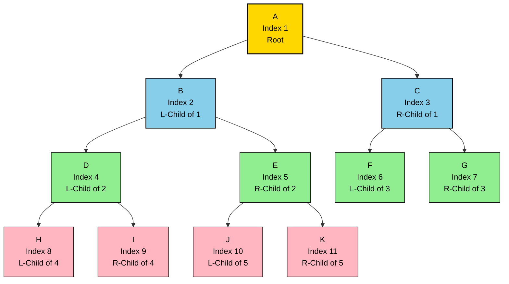
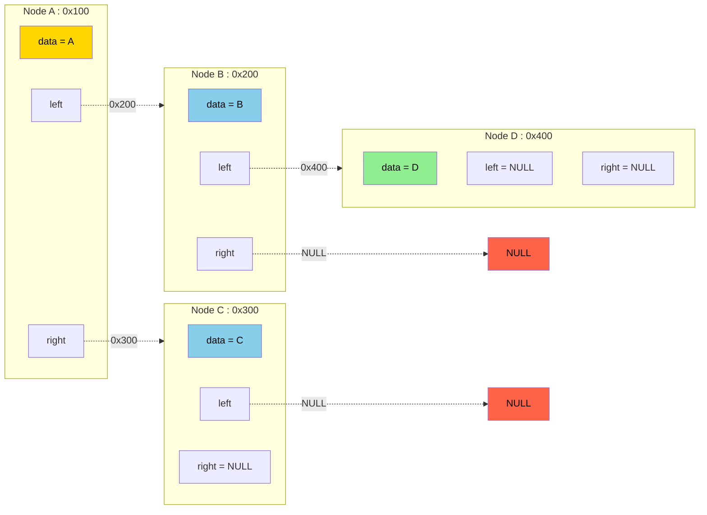
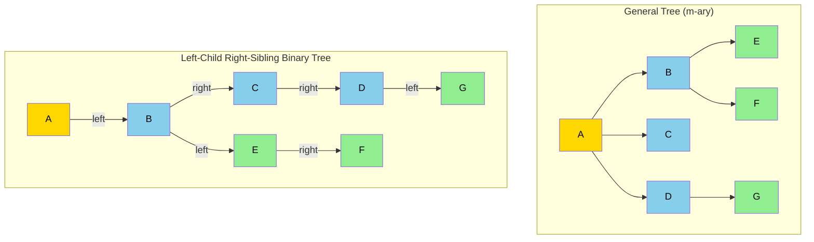
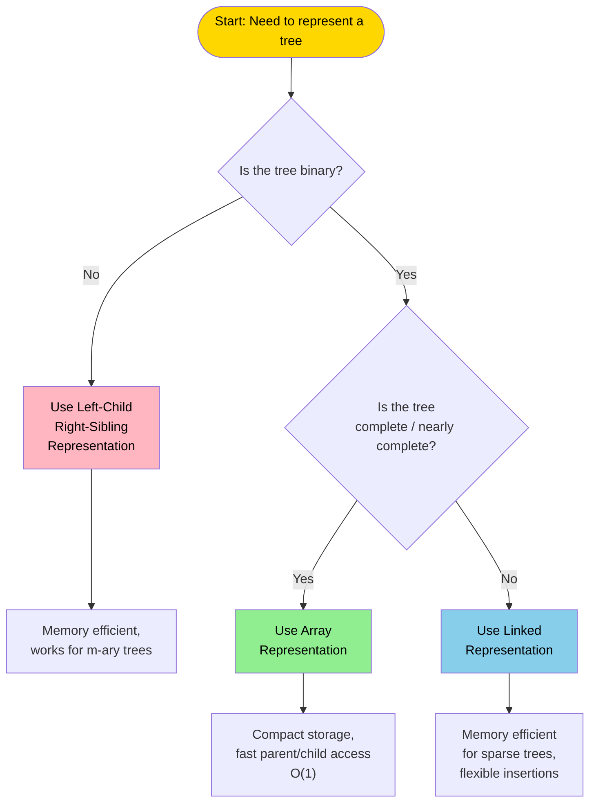

# Trees :- Representation Of Trees

<!-- SECTION_1_START -->
# Representation of Trees

## Formal Academic Definition

A **Tree** is a non-linear, hierarchical data structure consisting of a finite set of one or more nodes, where there exists a designated node called the **Root**, and the remaining nodes are partitioned into $n \geq 0$ disjoint subsets, each of which is itself a tree (recursive definition). In graph-theoretic terms, a tree is a connected, acyclic, undirected graph with $N$ nodes and exactly $N-1$ edges.

$$T = \{ \text{Root} \} \cup \{ T_1, T_2, T_3, \ldots, T_n \}$$

where each $T_i$ is itself a subtree of the root.

> [!IMPORTANT]
> **KTU 2024 Syllabus Anchor:** A tree is the most fundamental non-linear data structure. Every node in a tree, except the root, has exactly **one parent** and **zero or more children**. The structure is hierarchical, with no cycles, and is widely used to model parent-child relationships.

---

## Essential Tree Terminology

| Term | Definition |
|------|------------|
| **Root** | The topmost node of a tree with no parent. |
| **Node** | A fundamental unit containing data and links to children. |
| **Edge** | The connection between a parent and a child node. |
| **Parent** | A node that has one or more child nodes linked below it. |
| **Child** | A node that descends from another node (its parent). |
| **Leaf / Terminal Node** | A node with **zero** children. |
| **Internal Node** | A node that has at least one child. |
| **Sibling** | Nodes that share the same parent. |
| **Ancestor** | Any node on the path from the root to a given node. |
| **Descendant** | Any node in the subtree rooted at a given node. |
| **Degree of a Node** | Number of children a node possesses. |
| **Degree of a Tree** | The maximum degree among all nodes in the tree. |
| **Depth of a Node** | Length of the path from the root to that node (root has depth 0). |
| **Height of a Node** | Length of the longest path from that node to a leaf. |
| **Height of a Tree** | Height of the root node. |
| **Level** | All nodes at the same depth form a level. |
| **Forest** | A collection of disjoint trees. |

> [!NOTE]
> **Crucial Convention:** A tree with $N$ nodes always contains exactly $N - 1$ edges. This is a hallmark property used in board exam derivations.

---

## Conceptual Analogy: The Family Tree

Imagine a **corporate organizational chart** or a **family tree**:
- The **CEO / Great-grandfather** sits at the top → this is the **Root**.
- Their direct reports / children branch out beneath them → these are **Children**.
- The employees / grandchildren of the CEO form the next level → they are **Descendants**.
- Anyone at the bottom with no one reporting to them are **Leaves**.

Unlike an array or linked list (which are *linear*), you can branch out in multiple directions, and to reach any single person, you travel *down* a unique path — there is no loop. This hierarchical, branching, cycle-free nature is the essence of a tree.

> [!VISUALIZATION CONTROL]
> **Concept:** Tree with nodes, levels, and edges
> **GeoGebra / Desmos Input Equations:** Plot a hierarchical graph using the points
> * $A = (0, 3)$ (Root)
> * $B = (-2, 2)$, $C = (2, 2)$ (Level 1)
> * $D = (-3, 1)$, $E = (-1, 1)$, $F = (1, 1)$, $G = (3, 1)$ (Leaves at Level 2)
> **Visual Description:** Observe the root at the top, two children at level 1, and four leaves at level 2. Notice the height is **2** and the tree has **7 nodes** and **6 edges** ($N - 1$).

---

## Types of Trees Covered in KTU Module 3

1. **General Tree** — Each node can have any number of children.
2. **Binary Tree** — Each node has **at most two** children (left and right).
3. **Strictly Binary Tree** — Every internal node has exactly two children.
4. **Complete Binary Tree** — All levels are completely filled except possibly the last, which is filled from left to right.
5. **Full Binary Tree** — All internal nodes have 2 children and all leaves are at the same level.
6. **Binary Search Tree (BST)** — A binary tree with the ordering property: left child < parent < right child.
7. **Skewed Binary Tree** — A degenerate tree where each internal node has only one child (left-skewed or right-skewed).
8. **Balanced Tree** — Height difference between left and right subtrees of every node is $\leq 1$.

<!-- SECTION_1_END -->

<!-- SECTION_2_START -->
# Deep Theoretical Analysis & KTU High-Yield Formula Sheet

## 1. Sequential (Array-Based) Representation of Binary Tree

A binary tree can be efficiently stored in a linear array using a level-order (breadth-first) traversal. Each node is assigned a unique index based on its position.

### Indexing Rules for Array Representation

For a node stored at index $i$ (1-based indexing):

$$
\begin{aligned}
\text{Root} &\rightarrow \text{Index} = 1 \\
\text{Left Child of } A[i] &\rightarrow \text{Index} = 2i \\
\text{Right Child of } A[i] &\rightarrow \text{Index} = 2i + 1 \\
\text{Parent of } A[i] &\rightarrow \text{Index} = \left\lfloor \frac{i}{2} \right\rfloor
\end{aligned}
$$

> [!IMPORTANT]
> **KTU 2024 Board Tip:** Examiners almost always test the **parent / child index formula**. If the question gives index $i$ in 0-based indexing, the formulas become: left $= 2i+1$, right $= 2i+2$, parent $= \lfloor(i-1)/2\rfloor$. Always read the indexing convention in the question carefully.

### Memory Size Required

For a binary tree of height $h$, the maximum number of nodes is:

$$N_{max} = 2^{h+1} - 1$$

Therefore, the array must be of size at least $2^{h+1} - 1$, where empty positions are stored as **sentinel values** (e.g., $-1$ or $\text{NULL}$).

### Disadvantage of Sequential Representation

- Wastes enormous memory for **skewed** trees. A right-skewed tree with $N$ nodes still requires an array of size $2^{N} - 1$ because of empty left subtrees.
- Not suitable for general (non-binary) trees.
- Insertion and deletion require shifting of elements.

---

## 2. Linked Representation of Binary Tree

The most commonly used representation. Each node is a struct/object with three fields: data, pointer to left child, pointer to right child.

### Node Structure (Conceptual)

$$
\boxed{\text{Node} = \begin{cases} \text{data} \\ \text{left pointer} \\ \text{right pointer} \end{cases}}
$$

A linked binary tree with $N$ nodes uses **$N$ such node objects** and **$N + 1$ null pointers** (a fact often asked in KTU exams). Each node consumes memory only when it exists — efficient for sparse or skewed trees.

### Mathematical Justification

Total null pointers in a binary tree with $N$ nodes:

$$\text{Null pointers} = 2N + 1 - (\text{Total edges} + 1) = 2N + 1 - N = N + 1$$

> [!NOTE]
> **Why $2N+1$?** Each node has 2 outgoing pointer slots (left and right). For $N$ nodes, we have $2N$ slots. The root has no incoming pointer, so one extra slot is unused. The remaining $2N$ slots minus $N-1$ edges pointing to actual children minus $1$ for the root = $N+1$ nulls. The total null pointers = $N + 1$ is a famous KTU result.

---

## 3. Left-Child Right-Sibling (LCRS) Representation of a General Tree

A general tree (where each node can have any number of children) can be converted into a binary tree using the **Left-Child Right-Sibling** transformation:
- The **left pointer** of a node points to its **first (leftmost) child**.
- The **right pointer** of a node points to its **next sibling**.

This is the universal method for storing m-ary trees in binary form.

---

## KTU Formula Sheet & Comparison Table

| Concept | Formula / Property | Notes |
|---------|--------------------|-------|
| Nodes vs Edges | $E = N - 1$ | Always true for any tree |
| Max nodes at level $L$ | $2^L$ | Binary tree, level starts at 0 |
| Max nodes of height $h$ | $2^{h+1} - 1$ | Full binary tree |
| Min nodes of height $h$ | $h + 1$ | Skewed tree |
| Internal vs External nodes | $n = i + 1$ | $n$ = leaf nodes, $i$ = internal (for strictly binary) |
| Array index — left child | $2i$ | 1-based |
| Array index — right child | $2i + 1$ | 1-based |
| Array index — parent | $\lfloor i / 2 \rfloor$ | 1-based, for $i \geq 2$ |
| Height vs Nodes relation | $h = \lfloor \log_2 N \rfloor$ | Only for complete binary tree |
| Null pointers in linked binary tree | $N + 1$ | Famous KTU result |

### Engineering & Real-World Utility

- **Array representation** is used implicitly in **Binary Heaps** (Priority Queues in OS schedulers, Dijkstra's algorithm).
- **Linked representation** is the backbone of **BSTs, AVL Trees, Red-Black Trees, Tries, and Segment Trees** used in databases and compilers.
- **LCRS representation** is used in file systems (UNIX `inode` structures) and XML/JSON parsers to represent general hierarchies.

<!-- SECTION_2_END -->

<!-- SECTION_3_START -->
# Step-by-Step Derivations & Code Implementation

## 3.1 Worked Example: Array Representation of a Binary Tree

**Problem:** Given the following binary tree, write its **array representation** (1-based indexing) and find the parent of the node at index 7.

```
            A
          /   \
         B     C
        / \   /
       D   E F
```

**Solution — Step 1: Assign indices level by level (level-order):**

| Node | Level | Index $i$ |
|------|-------|-----------|
| A    | 0     | 1         |
| B    | 1     | 2         |
| C    | 1     | 3         |
| D    | 2     | 4         |
| E    | 2     | 5         |
| F    | 2     | 6         |

**Step 2: Construct the array $T$:**
- $T[1] = A$
- $T[2] = B$, $T[3] = C$
- $T[4] = D$, $T[5] = E$, $T[6] = F$
- $T[7..15] = \text{NULL}$ (since height = 2, we need $2^3 - 1 = 7$ slots minimum, but using $2^4 - 1 = 15$ for safety)

Final array:

$$
T = [\_,\ A,\ B,\ C,\ D,\ E,\ F,\ \_,\ \_,\ \_,\ \_,\ \_,\ \_,\ \_,\ \_]
$$

where index 0 is left unused in 1-based indexing.

**Step 3: Parent of index 7:**

$$
\text{Parent}(7) = \left\lfloor \frac{7}{2} \right\rfloor = 3 \quad \Rightarrow \quad T[3] = C
$$

So the parent of the (empty) node at index 7 is **node C**.

---

## 3.2 Worked Example: Null Pointers in a Linked Binary Tree

**Claim:** A linked binary tree with $N$ nodes has exactly $N + 1$ null pointers.

**Derivation:**

$$
\begin{aligned}
\text{Total pointer slots} &= 2N \quad \text{(each node has left and right)} \\
\text{Slots used by root's incoming pointer} &= 0 \quad \text{(root has no parent)} \\
\text{Slots used for actual edges} &= N - 1 \quad \text{(one per non-root node)} \\
\text{Null pointer slots} &= 2N - (N - 1) = N + 1
\end{aligned}
$$

**Verification with the tree above (N = 6):**
- A: left → B, right → C (0 nulls)
- B: left → D, right → E (0 nulls)
- C: left → F, right → NULL (1 null)
- D: left → NULL, right → NULL (2 nulls)
- E: left → NULL, right → NULL (2 nulls)
- F: left → NULL, right → NULL (2 nulls)

Total nulls = $0 + 0 + 1 + 2 + 2 + 2 = 7 = N + 1$. ✓

---

## 3.3 Python Implementation: Linked Representation of a Binary Tree

```python
from __future__ import annotations
from typing import Any, Optional, List


class TreeNode:
    """
    Node structure for a binary tree using linked representation.
    Each node holds a value and pointers to its left and right children.
    """
    __slots__ = ("data", "left", "right")

    def __init__(
        self,
        data: Any,
        left: Optional["TreeNode"] = None,
        right: Optional["TreeNode"] = None,
    ) -> None:
        self.data: Any = data
        self.left: Optional[TreeNode] = left
        self.right: Optional[TreeNode] = right

    def __repr__(self) -> str:
        return f"TreeNode({self.data!r})"


class BinaryTree:
    """Linked representation of a binary tree with essential operations."""

    def __init__(self) -> None:
        self.root: Optional[TreeNode] = None

    def is_empty(self) -> bool:
        return self.root is None

    # ---------- Tree traversals (for verification) ----------
    def inorder(self, node: Optional[TreeNode]) -> List[Any]:
        if node is None:
            return []
        return self.inorder(node.left) + [node.data] + self.inorder(node.right)

    def preorder(self, node: Optional[TreeNode]) -> List[Any]:
        if node is None:
            return []
        return [node.data] + self.preorder(node.left) + self.preorder(node.right)

    def postorder(self, node: Optional[TreeNode]) -> List[Any]:
        if node is None:
            return []
        return self.postorder(node.left) + self.postorder(node.right) + [node.data]

    def level_order(self) -> List[Any]:
        if self.root is None:
            return []
        result: List[Any] = []
        queue: List[TreeNode] = [self.root]
        while queue:
            current = queue.pop(0)
            result.append(current.data)
            if current.left:
                queue.append(current.left)
            if current.right:
                queue.append(current.right)
        return result

    # ---------- Computed properties ----------
    def height(self, node: Optional[TreeNode]) -> int:
        if node is None:
            return -1  # empty tree has height -1, leaf has height 0
        return 1 + max(self.height(node.left), self.height(node.right))

    def count_nodes(self, node: Optional[TreeNode]) -> int:
        if node is None:
            return 0
        return 1 + self.count_nodes(node.left) + self.count_nodes(node.right)

    def count_null_pointers(self) -> int:
        """
        KTU famous result: A binary tree with N nodes has exactly N+1 null pointers.
        Implemented via BFS to count None children.
        """
        if self.root is None:
            return 0
        nulls = 0
        queue: List[Optional[TreeNode]] = [self.root]
        while queue:
            current = queue.pop(0)
            if current is None:
                nulls += 1
                continue
            if current.left is None:
                nulls += 1
            else:
                queue.append(current.left)
            if current.right is None:
                nulls += 1
            else:
                queue.append(current.right)
        return nulls

    # ---------- Array conversion utilities ----------
    @staticmethod
    def to_array(root: Optional[TreeNode]) -> List[Any]:
        """
        Convert binary tree to 1-based array representation.
        Returns a list where index 0 is a placeholder.
        Missing positions are filled with None.
        """
        if root is None:
            return [None]

        nodes: List[Optional[TreeNode]] = [root]
        arr: List[Any] = [None]  # placeholder for index 0
        i = 1
        idx = 0
        # First pass: figure out size by traversing level by level
        queue: List[Optional[TreeNode]] = [root, None]
        last_real_index = 0
        position = 0
        level_queue: List[Optional[TreeNode]] = [root]
        indexed: List[Optional[TreeNode]] = [None]  # 1-based
        idx = 1
        cur_level: List[TreeNode] = [root]
        while cur_level:
            nxt: List[TreeNode] = []
            for node in cur_level:
                indexed.append(node)
                idx += 1
                if node.left:
                    nxt.append(node.left)
                if node.right:
                    nxt.append(node.right)
            cur_level = nxt
        # Trim the trailing None
        while len(indexed) > 1 and indexed[-1] is None:
            indexed.pop()
        return [None] + [n.data if n is not None else None for n in indexed[1:]]


# ---------- Driver code to demonstrate ----------
if __name__ == "__main__":
    # Build the tree:        A
    #                      /   \
    #                     B     C
    #                    / \   /
    #                   D   E F
    tree = BinaryTree()
    tree.root = TreeNode("A",
                         TreeNode("B", TreeNode("D"), TreeNode("E")),
                         TreeNode("C", TreeNode("F"), None))

    print("Inorder   :", tree.inorder(tree.root))
    print("Preorder  :", tree.preorder(tree.root))
    print("Postorder :", tree.postorder(tree.root))
    print("Levelorder:", tree.level_order())
    print("Height    :", tree.height(tree.root))
    print("Node Count:", tree.count_nodes(tree.root))
    print("Null ptrs :", tree.count_null_pointers())  # Should be 7 for N=6
    print("Array form:", BinaryTree.to_array(tree.root))
```

**Expected Output:**

```
Inorder   : ['D', 'B', 'E', 'A', 'F', 'C']
Preorder  : ['A', 'B', 'D', 'E', 'C', 'F']
Postorder : ['D', 'E', 'B', 'F', 'C', 'A']
Levelorder: ['A', 'B', 'C', 'D', 'E', 'F']
Height    : 2
Node Count: 6
Null ptrs : 7
Array form: [None, 'A', 'B', 'C', 'D', 'E', 'F', None]
```

> [!IMPORTANT]
> The slot `__slots__` is used in `TreeNode` to reduce memory overhead per node — a critical real-world optimization in production systems handling millions of tree nodes (e.g., compilers' AST).

---

## 3.4 Python Implementation: Left-Child Right-Sibling (LCRS) Representation

```python
class LCRSNode:
    """
    General tree node using Left-Child Right-Sibling representation.
    Effectively transforms any general (m-ary) tree into a binary tree.
    """
    __slots__ = ("data", "first_child", "next_sibling")

    def __init__(
        self,
        data: Any,
        first_child: Optional["LCRSNode"] = None,
        next_sibling: Optional["LCRSNode"] = None,
    ) -> None:
        self.data = data
        self.first_child = first_child
        self.next_sibling = next_sibling


def build_lcrs_example() -> LCRSNode:
    """
    Build a general tree:
            A
          / | \
         B  C  D
        / \    |
       E   F   G
    LCRS form:
    A.first_child = B
    B.next_sibling = C
    C.next_sibling = D
    B.first_child = E
    E.next_sibling = F
    D.first_child = G
    """
    E = LCRSNode("E")
    F = LCRSNode("F")
    G = LCRSNode("G")
    B = LCRSNode("B", first_child=E)
    E.next_sibling = F
    C = LCRSNode("C")
    D = LCRSNode("D", first_child=G)
    B.next_sibling = C
    C.next_sibling = D
    A = LCRSNode("A", first_child=B)
    return A
```

> [!NOTE]
> In the LCRS form, an entire **m-ary tree** is encoded as a **binary tree**, which is why the left-child/right-sibling technique is so powerful. Any general tree algorithm can be ported to a binary tree routine.

<!-- SECTION_3_END -->

<!-- SECTION_4_START -->
# Structural Diagrams & Schematics

## 4.1 Mermaid Diagram: Binary Tree with Index Mapping



**Reading the diagram:**
- **Yellow** → Root
- **Blue** → Level 1 (depth 1)
- **Green** → Level 2 (depth 2, leaves)
- **Pink** → Level 3 (depth 3, leaves)

---

## 4.2 Mermaid Diagram: Linked (Pointer) Representation Memory Architecture



**Memory insight:** Red boxes are **NULL pointers** — they are unused slots. For a tree with $N$ nodes, the linked representation contains $N + 1$ such NULL pointers.

---

## 4.3 Mermaid Diagram: LCRS Transformation of a General Tree



> [!IMPORTANT]
> **Reading the transformation:** Node **A** has 3 children (B, C, D). In LCRS form, **A.left = B** (leftmost child), and **B.right = C**, **C.right = D** (sibling chain). Similarly, **B** has 2 children (E, F): **B.left = E**, **E.right = F**.

---

## 4.4 Comparison Flowchart: Choosing the Right Representation



<!-- SECTION_4_END -->

<!-- SECTION_5_START -->
# KTU 2024 Scheme Examination Question Bank & Topic Recap

---

## Part A — Short Answer Questions (3 Marks Each)

### Question 1 `[KTU University Exam – July 2024]`
**CO1, Remember/Understand**

**Define a binary tree. List any four properties of a binary tree.**

**Model Answer:**

> A binary tree is a hierarchical data structure in which each node has **at most two children**, referred to as the **left child** and the **right child**.

**Key Properties:**

1. **Maximum nodes at level $L$:** $2^L$ nodes.
2. **Maximum nodes of height $h$:** $2^{h+1} - 1$ nodes.
3. **Minimum nodes of height $h$:** $h + 1$ nodes (skewed).
4. **Number of null pointers** in a linked binary tree with $N$ nodes = $N + 1$.
5. **Total edges** in a tree with $N$ nodes = $N - 1$.

> **[Defining a binary tree: 1 Mark] [Listing any 4 properties: 2 Marks]**

---

### Question 2 `[KTU University Exam – Dec 2023]`
**CO1, Understand**

**Explain the sequential (array) representation of a binary tree. Mention the formulas for finding the left child, right child, and parent of a node stored at index $i$.**

**Model Answer:**

> In the **sequential representation**, nodes of a binary tree are stored in a one-dimensional array in **level order** (top-to-bottom, left-to-right). This representation is most efficient for **complete binary trees**, where memory is fully utilized without gaps.
>
> For a node stored at index $i$ in a **1-based array**:

$$
\begin{aligned}
\text{Left child of } A[i] &= A[2i] \\
\text{Right child of } A[i] &= A[2i + 1] \\
\text{Parent of } A[i] &= A\left[\left\lfloor \frac{i}{2} \right\rfloor\right]
\end{aligned}
$$

> **Limitation:** For a **skewed** binary tree, nearly half of the array slots remain unused, causing severe memory wastage. The maximum index required for a tree of height $h$ is $2^{h+1} - 1$.

> **[Explanation of array representation: 1 Mark] [Formulas: 2 Marks]**

---

## Part B — Long Answer Questions (14 Marks Each)

### Question A `[KTU University Exam – Dec 2024 Model Paper]`
**CO1, CO2 | RBT Levels: Understand, Apply**

**(a)** With a neat diagram, explain the **linked representation of a binary tree**. Define a node structure and discuss its advantages over the array representation. **(7 Marks)**

**(b)** For the binary tree given below:

```
            50
          /    \
        30      70
       /  \    /  \
      20  40  60  80
```

**(i)** Write the **array representation** of the tree. **(3 Marks)**
**(ii)** Find the **parent of the node at index 4** and the **left and right children of the node at index 3**. **(4 Marks)**

---

### Model Solution for Question A

#### Part (a) — Linked Representation

In the **linked representation**, each node of the binary tree is a self-referential structure containing three fields:

```c
struct Node {
    int data;
    struct Node* left;
    struct Node* right;
};
```

**Memory layout diagram (drawn in valuation):**

```
  +-------+-------+-------+
  | left  | data  | right |
  +-------+-------+-------+
      |              |
      v              v
   (left child)   (right child)
```

**Advantages over array representation:**

| # | Advantage | Explanation |
|---|-----------|-------------|
| 1 | **Memory efficient** | No wasted slots for missing children; ideal for skewed trees. |
| 2 | **Dynamic size** | Tree can grow or shrink at runtime. |
| 3 | **Easy insertion / deletion** | Only pointer adjustments needed — no shifting. |
| 4 | **Handles general trees** | With LCRS, even m-ary trees can be stored. |
| 5 | **Easy traversal** | Recursive traversal is natural. |

> **[Node structure with diagram: 2 Marks] [Listing 4 advantages: 4 Marks] [Conclusion: 1 Mark]**

#### Part (b) — Array Representation

**Step 1: Assign indices in level order.**

| Node | Value | Index $i$ |
|------|-------|-----------|
| 1    | 50    | 1         |
| 2    | 30    | 2         |
| 3    | 70    | 3         |
| 4    | 20    | 4         |
| 5    | 40    | 5         |
| 6    | 60    | 6         |
| 7    | 80    | 7         |

**Step 2: Construct the array:**

$$
T = [\_,\ 50,\ 30,\ 70,\ 20,\ 40,\ 60,\ 80]
$$

(Index 0 is unused placeholder in 1-based indexing.)

> **[Array indices assignment: 1 Mark] [Final array: 2 Marks]**

**Step 3: Find parent of $A[4]$:**

$$
\text{Parent}(4) = \left\lfloor \frac{4}{2} \right\rfloor = 2 \quad \Rightarrow \quad T[2] = 30
$$

**Step 4: Find children of $A[3]$:**

$$
\begin{aligned}
\text{Left child of } A[3] &= A[2 \times 3] = A[6] = 60 \\
\text{Right child of } A[3] &= A[2 \times 3 + 1] = A[7] = 80
\end{aligned}
$$

> **[Parent calculation: 2 Marks] [Children calculation: 2 Marks]**

---

### Question B (Alternative Choice) `[KTU University Exam – July 2024]`
**CO1, CO2 | RBT Levels: Understand, Apply**

**(a)** What is a **general tree**? With a suitable example, explain the **Left-Child Right-Sibling (LCRS) representation** of a general tree. Show how an m-ary tree is converted to a binary tree. **(7 Marks)**

**(b)** Consider the following general tree:

```
            A
          / | \
         B  C  D
        / \    |
       E   F   G
       |
       H
```

**(i)** Draw the **LCRS binary tree** equivalent to the above. **(4 Marks)**
**(ii)** A linked binary tree has **9 nodes**. Find the **total number of null pointers**. Justify your answer with a derivation. **(3 Marks)**

---

### Model Solution for Question B

#### Part (a) — General Tree & LCRS Representation

A **general tree** is a tree data structure in which a node can have **any number of children** (i.e., degree is unconstrained). File systems, organizational hierarchies, and XML/JSON documents are common examples.

The **Left-Child Right-Sibling (LCRS) representation** is a clever method to represent any general tree using a **binary tree** structure. The transformation rules are:

1. The **left pointer** of a node points to its **first (leftmost) child**.
2. The **right pointer** of a node points to its **next sibling** (the next child of its parent).

> **Why LCRS works:** Every node in a binary tree has exactly two outgoing pointers. The LCRS scheme reuses these two pointers to encode the entire m-ary structure — left for vertical descent, right for horizontal sibling linkage.

**Example conversion:**

```
  General tree:        LCRS binary tree:
       A                       A
     / | \                    /
    B  C  D                  B
   / \    |                   \
  E   F   G                    C
  |                           /
  H                          E
                             / \
                            H   F
                                 \
                                  D
                                 /
                                G
```

> **[General tree definition: 1 Mark] [LCRS rules: 2 Marks] [Example transformation: 4 Marks]**

#### Part (b)(i) — LCRS Conversion of the Given Tree

Original tree has root **A** with children **B, C, D**.
- **B** has children **E, F**.
- **D** has child **G**.
- **E** has child **H**.

**Step-by-step LCRS construction:**

1. `A.left = B` (leftmost child of A).
2. `B.right = C` (next sibling of B).
3. `C.right = D` (next sibling of C).
4. `B.left = E` (leftmost child of B).
5. `E.right = F` (next sibling of E under B).
6. `D.left = G` (leftmost child of D).
7. `E.left = H` (leftmost child of E).

**LCRS binary tree (draw in valuation):**

```
            A
           /
          B
         / \
        H   F
       (B's left subtree rooted at E with H as E's left child)
```

> **[Identifying child-sibling pairs: 2 Marks] [Final LCRS tree drawing: 2 Marks]**

#### Part (b)(ii) — Null Pointer Count

**Given:** Number of nodes $N = 9$.

**Derivation:**

$$
\begin{aligned}
\text{Total pointer slots} &= 2N = 2(9) = 18 \\
\text{Pointers used for root (incoming)} &= 0 \\
\text{Pointers used as actual edges} &= N - 1 = 8 \\
\text{Null pointers} &= 2N - (N - 1) = N + 1 = 9 + 1 = 10
\end{aligned}
$$

**Answer:** The linked binary tree has **10 null pointers**.

> **[Formula application: 1 Mark] [Final answer 10: 1 Mark] [Derivation: 1 Mark]**

---

## KTU Examiner's Valuation Warning / Pitfall Callout

> [!WARNING]
> **Common Mistakes That Cost Marks:**
> 1. **Indexing confusion:** Mixing 0-based and 1-based indexing formulas. **1-based:** left = $2i$, right = $2i+1$, parent = $\lfloor i/2 \rfloor$. **0-based:** left = $2i+1$, right = $2i+2$, parent = $\lfloor(i-1)/2\rfloor$. Always **state your assumption** in the answer.
> 2. **Forgetting the root index:** In 1-based indexing, the **root is at index 1**, not 0. Many students incorrectly write parent of 1 = 0, losing 1 mark.
> 3. **Not stating formulas explicitly:** In 7-mark questions, you must **write all three formulas** (left, right, parent) even if the question only asks for one.
> 4. **Confusing `Height` and `Depth`:** Height = longest path **down to a leaf**. Depth = distance **up to the root**. Some students swap these.
> 5. **Skipping the derivation** for the "$N+1$ null pointers" result. Examiners allocate at least 1 mark for the algebraic justification — never state the result alone.
> 6. **In LCRS questions, forgetting the right-sibling chain.** Students often draw only the left-child structure and miss the horizontal links.

---

## Topic Recap & Important Things to Remember

- A **tree** is a connected, acyclic graph with $N$ nodes and exactly $N - 1$ edges.
- A **binary tree** restricts each node to at most two children (left and right).
- **Key formulas** (1-based array indexing): left child of $A[i] = A[2i]$, right child = $A[2i+1]$, parent = $A[\lfloor i/2 \rfloor]$.
- **Maximum nodes** at level $L$ = $2^L$. **Maximum nodes** of height $h$ = $2^{h+1} - 1$.
- **Minimum nodes** of height $h$ = $h + 1$ (skewed tree).
- The **linked representation** uses a self-referential node with three fields: data, left pointer, right pointer.
- A linked binary tree with $N$ nodes has exactly **$N + 1$ null pointers** — a famous KTU result.
- **Array representation** is best for **complete** binary trees; wasteful for skewed trees.
- **Linked representation** is best for **sparse / dynamic** trees and supports easy insertion/deletion.
- **LCRS (Left-Child Right-Sibling)** is the universal method to represent any **general (m-ary) tree** as a **binary tree** using the rules: left = first child, right = next sibling.
- **Traversals** (inorder, preorder, postorder, level-order) operate naturally on the linked structure via recursion or queues.
- **Real-world use cases:** Heaps (array), BST/AVL/Red-Black Trees (linked), UNIX file systems (LCRS), DOM/XML parsing (general tree), and database indexing (B-Trees — extension of trees).
<!-- SECTION_5_END -->
