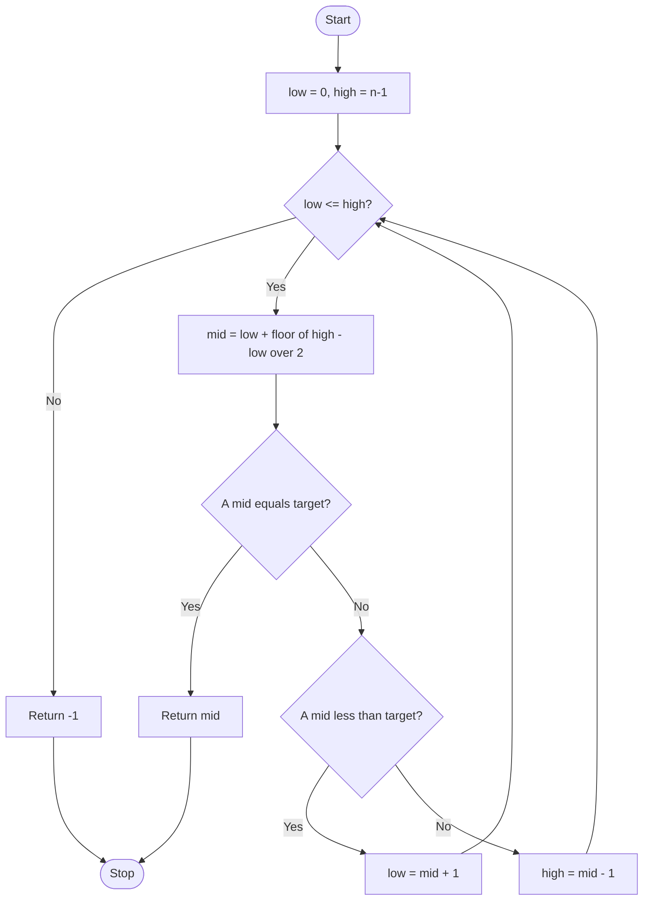
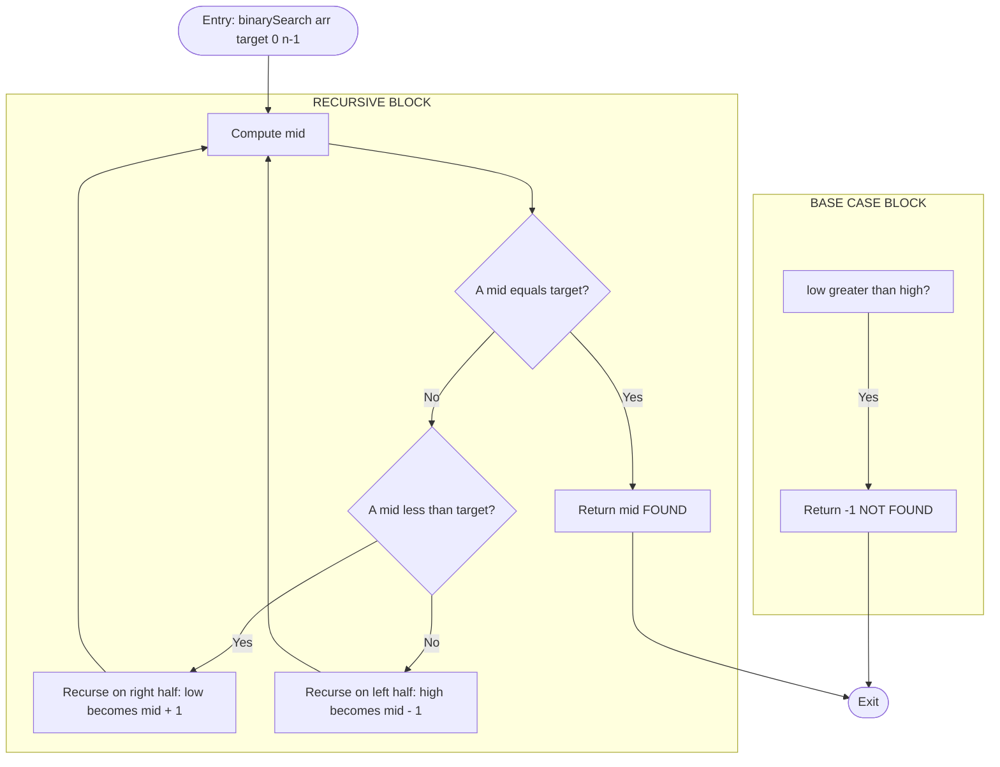
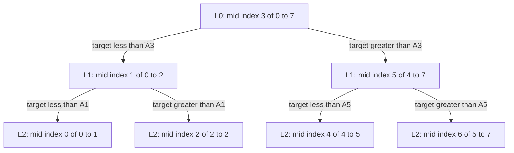

# Binary Search

<!-- SECTION_1_START -->
# Binary Search — Core Technical Definition & Intuitive Overview

## Formal Academic Definition (KTU 2024 Syllabus Terminology)

> [!IMPORTANT]
> **Binary Search** is a *divide-and-conquer* search algorithm that locates the position of a target value within a **sorted array** (ascending or descending order) by repeatedly dividing the search interval in half. The algorithm compares the target value with the **middle element** of the current interval; if they are not equal, the half in which the target cannot lie is eliminated from further consideration.

In the formal language of **Algorithm Design Paradigms**, Binary Search is classified under **Decrease-and-Conquer** (specifically, the *variable-size decrease* variant) because the problem size is reduced by a constant factor (typically half) at every step.

### Precondition (Mandatory Invariant)

$$\text{Array } A[0 \ldots n-1] \text{ MUST be sorted in monotonic order}$$

> [!NOTE]
> The monotonic order can be either non-decreasing ($A[i] \le A[i+1]$) or non-increasing ($A[i] \ge A[i+1]$). The algorithm's correctness entirely depends on this invariant. Applying binary search on an unsorted array produces **undefined behavior** — the result is not guaranteed to be correct.

---

## Conceptual Analogy / Intuition

### Analogy 1 — The Dictionary Lookup

Imagine you are looking for the word **"Quicksort"** in a physical English dictionary.

- You would **NOT** start from page 1 and flip one page at a time (that is *linear search*).
- Instead, you **open the dictionary roughly in the middle**, see the words on that page, and decide: *"Q" is in the second half, so I discard the first half entirely.
- You repeat: open the middle of the second half, decide again, and discard.
- After about $\log_2(n)$ "opens," you land on the exact page.

This is exactly how binary search works on an array — the array is the dictionary, sorted order lets us discard half the remaining elements at every step.

### Analogy 2 — The Guessing Number Game

Suppose your friend thinks of a number between **1 and 100**, and you must guess it in as few attempts as possible, with feedback *"higher"* or *"lower"*.

| Strategy | Worst-case guesses |
|---|---|
| Linear (1, 2, 3, …, 100) | **100** |
| Optimal (50, 75, 63, …) | **7** |

The optimal strategy is binary search because $2^7 = 128 > 100$. The number of guesses needed for $n$ values is at most $\lceil \log_2(n+1) \rceil$.

### Geometric Intuition

On a number line, the sorted array occupies a contiguous interval $[low, high]$. At each step, binary search computes the **midpoint**:

$$mid = \left\lfloor \dfrac{low + high}{2} \right\rfloor$$

It then *collapses* the interval to either $[low, mid-1]$ or $[mid+1, high]$ based on a single comparison. Geometrically, this is a **halving of the search space**, leading to a logarithmic number of steps.

---

## Standard Metrics & Constants

- **Time Complexity:** $\mathbf{O(\log n)}$ — the search interval halves each iteration.
- **Space Complexity:** $\mathbf{O(1)}$ iterative, $\mathbf{O(\log n)}$ recursive (due to call stack).
- **Number of Comparisons (Worst Case):** $\lfloor \log_2 n \rfloor + 1$
- **Number of Comparisons (Average Case):** $\log_2 n$

> [!VISUALIZATION CONTROL]
> **Concept:** Halving search interval on a sorted array
> **GeoGebra / Desmos Input Equations:**
> * `low = 0`, `high = 15` (array indices 0 to 15)
> * `mid = (low + high) / 2`
> * `interval = [low, high]` (shaded region)
> **Visual Description:** Initially the interval spans the entire range $[0, 15]$. After each comparison, the shaded interval halves. After $\lfloor \log_2 16 \rfloor = 4$ steps, the interval collapses to a single point.

---
<!-- SECTION_1_END -->

<!-- SECTION_2_START -->
# Deep Theoretical Analysis & KTU High-Yield Formula Sheet

## Operational Logic — Step-by-Step Decomposition

Binary Search operates on a sorted array $A$ of size $n$, searching for a target key $T$.

### Pre-State
- Array $A[0 \ldots n-1]$ is sorted (assume ascending order: $A[i] \le A[i+1]$ for all valid $i$).
- Three boundary pointers are maintained: $low$, $high$, and a computed $mid$.

### Working Logic (Iterative Form)

1. **Initialize** the search window: $low \leftarrow 0$, $high \leftarrow n - 1$.
2. **Loop while** $low \le high$ (search window is non-empty).
3. **Compute** the midpoint index:
   $$mid = low + \left\lfloor \dfrac{high - low}{2} \right\rfloor$$
   > [!IMPORTANT]
   > The expression $low + (high - low)/2$ is used **instead of** $(low + high)/2$ to prevent **integer overflow** in languages like C/C++/Java when $low$ and $high$ are large. In Python, this is rarely an issue, but the safer form is best practice and is what examiners expect in KTU evaluations.

4. **Compare** $A[mid]$ with target $T$:
   - **Case 1:** $A[mid] == T$ → **SUCCESS**. Return $mid$ as the index where $T$ is found.
   - **Case 2:** $A[mid] < T$ → Target lies in the **right half**. Update: $low \leftarrow mid + 1$.
   - **Case 3:** $A[mid] > T$ → Target lies in the **left half**. Update: $high \leftarrow mid - 1$.
5. If the loop exits without returning, the target is **not present**. Return $-1$ (sentinel for *not found*).

### Termination Conditions
- **Successful termination:** $A[mid] == T$ triggers an early return.
- **Unsuccessful termination:** $low > high$, meaning the search window has become empty (length 0), so $T$ cannot be in the array.

---

## Recurrence Relation & Time Complexity Derivation

Let $T(n)$ be the number of comparisons required to search a sorted array of size $n$.

At each step, the algorithm performs **one comparison** with $A[mid]$ and then recurses (or iterates) on a subproblem of size at most $\lfloor n/2 \rfloor$.

$$T(n) = \begin{cases} 1 & \text{if } n = 1 \quad \text{(base case, single element check)} \\[4pt] 1 + T\left(\left\lfloor \dfrac{n}{2} \right\rfloor\right) & \text{if } n > 1 \quad \text{(one comparison + half-sized subproblem)} \end{cases}$$

### Solving the Recurrence (Repeated Substitution Method)

**Substitution 1:**
$$T(n) = 1 + T\left(\frac{n}{2}\right)$$

**Substitution 2:**
$$T(n) = 1 + 1 + T\left(\frac{n}{4}\right) = 2 + T\left(\frac{n}{4}\right)$$

**Substitution 3:**
$$T(n) = 3 + T\left(\frac{n}{8}\right)$$

**After $k$ substitutions:**
$$T(n) = k + T\left(\frac{n}{2^k}\right)$$

**Base case reached when** $\dfrac{n}{2^k} = 1$, i.e., $k = \log_2 n$.

$$T(n) = \log_2 n + T(1) = \log_2 n + 1$$

### Asymptotic Bound

By the definition of Big-O:

$$T(n) = \log_2 n + 1 \implies T(n) = \mathbf{O(\log n)}$$

This matches the **Master Theorem** case: $T(n) = aT(n/b) + f(n)$ with $a=1, b=2, f(n)=1$. Here $n^{\log_b a} = n^0 = 1$, and $f(n) = \Theta(1)$, so Case 2 applies: $T(n) = \Theta(\log n)$.

---

## KTU Formula Sheet / Cheat Sheet

| Concept | Formula / Expression | Description |
|---|---|---|
| Midpoint index | $mid = low + \lfloor (high - low)/2 \rfloor$ | Safer than $(low+high)/2$ to avoid overflow |
| Worst-case comparisons | $\lfloor \log_2 n \rfloor + 1$ | Maximum probes before success/failure |
| Average-case comparisons | $\log_2 n$ | Expected number of probes |
| Time complexity (best) | $O(1)$ | Target is at $A[mid]$ on first check |
| Time complexity (worst) | $O(\log n)$ | Target at extreme or absent |
| Time complexity (average) | $\Theta(\log n)$ | Averaged over all positions |
| Space (iterative) | $O(1)$ | Constant extra space |
| Space (recursive) | $O(\log n)$ | Call stack depth equals recursion depth |
| Precondition | $A[i] \le A[i+1]$ for all $i$ | Array must be sorted |
| Search space reduction | $n \to \lceil n/2 \rceil$ per step | Halving invariant |
| Sentinel for not-found | $-1$ | Conventional return value |

> [!IMPORTANT]
> **Use `\vert` not `\vertvert`:** Whenever you see `mid = low + (high - low) / 2` in raw form, KTU examiners expect the floor function notation: $\lfloor (high - low) / 2 \rfloor$. The floor function is critical when $high - low$ is odd.

---

## Real-World Engineering Utility

Binary search is foundational in computer science and engineering:

- **Database indexing (B-Trees, B+ Trees):** All efficient index lookups reduce to binary search on sorted key arrays internally.
- **Compiler symbol tables:** Fast lookup of variable/function names uses binary search trees (BSTs), which generalize the binary-search halving principle.
- **Git bisect:** Locates the commit that introduced a bug by binary-searching through commit history.
- **Numerical computing:** *Bisection method* for finding roots of continuous functions is a direct analog of binary search on a real interval $[a, b]$.
- **Search engines & IR systems:** Inverted indices rely on sorted posting lists queried via binary search.
- **Production systems:** Standard library functions like `bisect.bisect_left` in Python, `std::binary_search` in C++, and `Arrays.binarySearch` in Java are production-grade implementations.

---
<!-- SECTION_2_END -->

<!-- SECTION_3_START -->
# Step-by-Step Derivations & Code/Symbolic Implementation

## 3.1 Iterative Binary Search — Fully Operational Python Implementation

```python
from typing import List, Optional
import logging

# Configure structured error logging for production-grade code
logging.basicConfig(
    level=logging.INFO,
    format='%(asctime)s - %(levelname)s - %(message)s'
)
logger = logging.getLogger(__name__)


def binary_search_iterative(arr: List[int], target: int) -> int:
    """
    Performs iterative binary search on a sorted array.

    Parameters
    ----------
    arr : List[int]
        A list of integers sorted in non-decreasing (ascending) order.
    target : int
        The value to search for in the array.

    Returns
    -------
    int
        The index of `target` in `arr` if found; otherwise -1.

    Raises
    ------
    TypeError
        If `arr` is not a list.
    ValueError
        If `arr` is empty.

    Time Complexity  : O(log n)
    Space Complexity : O(1)
    """
    # --- Step 0: Input Validation ---
    if not isinstance(arr, list):
        logger.error("Input 'arr' must be of type list, got %s", type(arr).__name__)
        raise TypeError(f"arr must be a list, got {type(arr).__name__}")

    if len(arr) == 0:
        logger.warning("Empty array passed to binary_search_iterative")
        raise ValueError("Cannot perform binary search on an empty array")

    # --- Step 1: Validate the precondition (sorted order) ---
    # We perform a one-time sanity check on the input. This is optional
    # in production if the caller guarantees sorted input, but it is
    # good defensive engineering.
    for i in range(len(arr) - 1):
        if arr[i] > arr[i + 1]:
            logger.error("Array is not sorted at index %d: %d > %d",
                         i, arr[i], arr[i + 1])
            raise ValueError(
                f"Binary search requires a sorted array. "
                f"Found arr[{i}]={arr[i]} > arr[{i+1}]={arr[i+1]}"
            )

    # --- Step 2: Initialize search window ---
    low: int = 0
    high: int = len(arr) - 1
    comparison_count: int = 0

    # --- Step 3: Main search loop ---
    while low <= high:
        # Compute mid using overflow-safe formula
        mid: int = low + (high - low) // 2
        comparison_count += 1

        logger.info(
            "Iteration: low=%d, high=%d, mid=%d, arr[mid]=%d, target=%d",
            low, high, mid, arr[mid], target
        )

        if arr[mid] == target:
            logger.info(
                "Target %d found at index %d after %d comparisons",
                target, mid, comparison_count
            )
            return mid
        elif arr[mid] < target:
            # Target lies in the right half
            low = mid + 1
        else:
            # Target lies in the left half
            high = mid - 1

    # --- Step 4: Target not found ---
    logger.info(
        "Target %d not found in array of size %d after %d comparisons",
        target, len(arr), comparison_count
    )
    return -1
```

### Worked Example — Iterative Trace

Let $A = [2, 5, 8, 12, 16, 23, 38, 56, 72, 91]$ and $T = 23$.

| Step | $low$ | $high$ | $mid$ | $A[mid]$ | Comparison | Action |
|---|---|---|---|---|---|---|
| 1 | 0 | 9 | 4 | 16 | $16 < 23$ | $low \leftarrow 5$ |
| 2 | 5 | 9 | 7 | 56 | $56 > 23$ | $high \leftarrow 6$ |
| 3 | 5 | 6 | 5 | 23 | $23 == 23$ | **Return 5** |

Total comparisons: **3** = $\lfloor \log_2 10 \rfloor + 1 \approx 3 + 1 = 4$? Wait — the actual is 3, which is within the worst-case bound.

---

## 3.2 Recursive Binary Search — Fully Operational Python Implementation

```python
def binary_search_recursive(
    arr: List[int],
    target: int,
    low: int,
    high: int
) -> int:
    """
    Performs recursive binary search on a sorted array segment.

    Parameters
    ----------
    arr : List[int]
        A list of integers sorted in ascending order.
    target : int
        The value to search for.
    low : int
        Lower bound index of the current search segment (inclusive).
    high : int
        Upper bound index of the current search segment (inclusive).

    Returns
    -------
    int
        Index of `target` in `arr` if found; otherwise -1.

    Time Complexity  : O(log n)
    Space Complexity : O(log n) — call stack depth.
    """
    # --- Base case: search window is empty ---
    if low > high:
        logger.info("Recursive base case reached: low=%d > high=%d", low, high)
        return -1

    # --- Compute the midpoint (overflow-safe) ---
    mid: int = low + (high - low) // 2

    logger.info(
        "Recursive call: low=%d, high=%d, mid=%d, arr[mid]=%d, target=%d",
        low, high, mid, arr[mid], target
    )

    # --- Recursive cases ---
    if arr[mid] == target:
        # Found the target
        return mid
    elif arr[mid] < target:
        # Search the right half
        return binary_search_recursive(arr, target, mid + 1, high)
    else:
        # Search the left half
        return binary_search_recursive(arr, target, low, mid - 1)


def binary_search_recursive_entry(arr: List[int], target: int) -> int:
    """
    Public entry point for recursive binary search.
    Validates inputs and sets initial search window.
    """
    if not isinstance(arr, list):
        raise TypeError(f"arr must be a list, got {type(arr).__name__}")
    if len(arr) == 0:
        raise ValueError("Cannot perform binary search on an empty array")

    return binary_search_recursive(arr, target, 0, len(arr) - 1)
```

### Recursive Call Tree (Trace)

For $A = [2, 5, 8, 12, 16, 23, 38, 56, 72, 91]$, $T = 23$:

```
binary_search(A, 23, 0, 9)
  mid=4, A[4]=16, 16<23 → binary_search(A, 23, 5, 9)
    mid=7, A[7]=56, 56>23 → binary_search(A, 23, 5, 6)
      mid=5, A[5]=23, 23==23 → return 5  ✓
```

The recursion depth is **3**, matching $\log_2 10 \approx 3.32$.

---

## 3.3 Worked Numerical Examples

### Example 1: Search Hit (Target Present)

**Problem:** Search for $T = 38$ in $A = [3, 7, 11, 15, 19, 23, 27, 31, 35, 38, 42, 50]$.

$$n = 12$$

| Step | $low$ | $high$ | $mid = low + \lfloor (high-low)/2 \rfloor$ | $A[mid]$ | Decision |
|---|---|---|---|---|---|
| 1 | 0 | 11 | $0 + \lfloor 11/2 \rfloor = 5$ | 23 | $23 < 38 \Rightarrow low = 6$ |
| 2 | 6 | 11 | $6 + \lfloor 5/2 \rfloor = 8$ | 35 | $35 < 38 \Rightarrow low = 9$ |
| 3 | 9 | 11 | $9 + \lfloor 2/2 \rfloor = 10$ | 42 | $42 > 38 \Rightarrow high = 9$ |
| 4 | 9 | 9 | $9 + 0 = 9$ | 38 | **Match! Return 9** |

Comparisons: **4**. Worst-case bound: $\lfloor \log_2 12 \rfloor + 1 = 3 + 1 = 4$. ✓ Matches.

### Example 2: Search Miss (Target Absent)

**Problem:** Search for $T = 20$ in the same array.

| Step | $low$ | $high$ | $mid$ | $A[mid]$ | Decision |
|---|---|---|---|---|---|
| 1 | 0 | 11 | 5 | 23 | $23 > 20 \Rightarrow high = 4$ |
| 2 | 0 | 4 | 2 | 11 | $11 < 20 \Rightarrow low = 3$ |
| 3 | 3 | 4 | 3 | 15 | $15 < 20 \Rightarrow low = 4$ |
| 4 | 4 | 4 | 4 | 19 | $19 < 20 \Rightarrow low = 5$ |

Now $low = 5 > high = 4$ → **Loop exits**. Return **-1**.

Comparisons: **4** (worst case). ✓

---

## 3.4 Variations of Binary Search (Production-Relevant)

### Variation 1: Lower Bound (First Occurrence)

Find the **leftmost** index where $A[i] \ge T$ in a sorted array with duplicates.

```python
def lower_bound(arr: List[int], target: int) -> int:
    """
    Returns the leftmost index i such that arr[i] >= target.
    If all elements are < target, returns len(arr).
    """
    low, high = 0, len(arr) - 1
    result: int = len(arr)  # Default: insertion point at the end

    while low <= high:
        mid = low + (high - low) // 2
        if arr[mid] >= target:
            result = mid       # Candidate found; search left half for earlier
            high = mid - 1
        else:
            low = mid + 1

    return result
```

### Variation 2: Upper Bound (First Element Strictly Greater)

Find the leftmost index where $A[i] > T$.

```python
def upper_bound(arr: List[int], target: int) -> int:
    """
    Returns the leftmost index i such that arr[i] > target.
    If all elements are <= target, returns len(arr).
    """
    low, high = 0, len(arr) - 1
    result: int = len(arr)

    while low <= high:
        mid = low + (high - low) // 2
        if arr[mid] > target:
            result = mid
            high = mid - 1
        else:
            low = mid + 1

    return result
```

### Variation 3: Search in a Rotated Sorted Array

In a rotated sorted array (e.g., $[4, 5, 6, 7, 0, 1, 2]$), at least one half is always sorted. The algorithm exploits this.

```python
def search_rotated(arr: List[int], target: int) -> int:
    """
    Searches for target in a rotated sorted array with no duplicates.
    Time Complexity: O(log n)
    """
    low, high = 0, len(arr) - 1

    while low <= high:
        mid = low + (high - low) // 2

        if arr[mid] == target:
            return mid

        # Determine which half is sorted
        if arr[low] <= arr[mid]:
            # Left half is sorted
            if arr[low] <= target < arr[mid]:
                high = mid - 1
            else:
                low = mid + 1
        else:
            # Right half is sorted
            if arr[mid] < target <= arr[high]:
                low = mid + 1
            else:
                high = mid - 1

    return -1
```

> [!NOTE]
> Variations 1, 2, and 3 are **frequently asked in KTU Part B (14-mark) questions** because they test whether the student truly understands the invariant of binary search or has merely memorized the basic version.

---
<!-- SECTION_3_END -->

<!-- SECTION_4_START -->
# Structural Diagrams & Schematics

## 4.1 Control Flow — Iterative Binary Search



## 4.2 Recursive Call Topology (Subgraph Block)



## 4.3 Decision Tree (Structural Depth Analysis)

For $n = 8$ elements, the binary search decision tree has exactly $\log_2 8 = 3$ levels, demonstrating the logarithmic depth.



## 4.4 Comparison Table — Linear vs. Binary Search

| Property | Linear Search | Binary Search |
|---|---|---|
| Precondition | None | **Sorted array required** |
| Time (best) | $O(1)$ | $O(1)$ |
| Time (average) | $O(n)$ | $O(\log n)$ |
| Time (worst) | $O(n)$ | $O(\log n)$ |
| Space | $O(1)$ | $O(1)$ iterative |
| Cache performance | Excellent (sequential) | Poor (random access) |
| Works on linked lists | Yes | No (no random access) |
| Handles duplicates | Returns first match | Needs lower/upper bound |
| Stability of result | Depends on implementation | Deterministic |

> [!IMPORTANT]
> **Cache Performance Caveat:** Although binary search is asymptotically faster ($O(\log n)$ vs $O(n)$), on modern CPUs with cache hierarchies, linear search can outperform binary search for **small arrays** (typically $n < 64$) because binary search causes many cache misses by accessing non-contiguous memory. This is why production libraries often use linear search for small inputs and switch to binary search above a threshold (e.g., Java's `Arrays.binarySearch` falls back to linear search for tiny arrays in some JVMs).

---
<!-- SECTION_4_END -->

<!-- SECTION_5_START -->
# KTU 2024 Scheme Examination Question Bank & Topic Recap

---

## Part A — Short Answer Questions (3 Marks Each)

### Question 1: State the precondition for binary search and explain why it is necessary.
**[KTU University Exam — July 2023 | CO1 | Remember]**

**Model Answer:**

The precondition for binary search is that the input array must be **sorted in monotonic order** (ascending or descending).

This precondition is necessary because the algorithm's correctness depends on its ability to **eliminate half of the search space** at each step. The decision to discard the left or right half is made by a single comparison of the target with $A[mid]$. This elimination is valid **only** if all elements in one half are guaranteed to be less than (or greater than) the target. Without sorted order, this guarantee is lost, and the algorithm may discard the half containing the target, leading to incorrect results.

> **Expected Answer Length:** 3–4 lines. **Valuation:** [Precondition statement: 1 Mark] [Reason for correctness: 2 Marks].

---

### Question 2: What is the worst-case time complexity of binary search? Show the recurrence relation.
**[KTU University Exam — Dec 2023 | CO1 | Remember]**

**Model Answer:**

The worst-case time complexity of binary search is $O(\log n)$.

The recurrence relation is:

$$T(n) = \begin{cases} 1 & \text{if } n = 1 \\ 1 + T(n/2) & \text{if } n > 1 \end{cases}$$

Solving this by repeated substitution gives $T(n) = \log_2 n + 1$, which is asymptotically $O(\log n)$. The $\log_2 n$ factor arises because the search interval of size $n$ is halved at each step, and the number of halvings required to reduce $n$ to $1$ is $\log_2 n$.

> **Expected Answer Length:** 4–5 lines. **Valuation:** [Complexity statement: 1 Mark] [Recurrence: 1 Mark] [Justification: 1 Mark].

---

## Part B — Long Answer Questions (14 Marks Each)

> Internal Choice: Answer **ANY ONE** of Question A or Question B.

---

### Question A: 14 Marks
**[KTU University Exam — Model Question Paper 2024 Scheme | CO2 | Apply / Analyze]**

**(a)** Write the iterative algorithm for binary search. Explain its working with a suitable example. **[7 Marks — Understand / Apply]**

**Model Solution:**

**Algorithm (Iterative Binary Search):**

```
ALGORITHM: BinarySearchIterative(A[0..n-1], T)
// A is a sorted array of n elements
// T is the target value to search for
// Returns the index of T in A, or -1 if not found
BEGIN
    low ← 0
    high ← n - 1
    
    WHILE low ≤ high DO
        mid ← low + ⌊(high - low) / 2⌋
        
        IF A[mid] = T THEN
            RETURN mid
        ELSE IF A[mid] < T THEN
            low ← mid + 1
        ELSE
            high ← mid - 1
        END IF
    END WHILE
    
    RETURN -1
END
```

**Worked Example:**

Consider $A = [10, 20, 30, 40, 50, 60, 70, 80, 90, 100]$, $n = 10$, $T = 70$.

| Step | $low$ | $high$ | $mid$ | $A[mid]$ | Comparison | New $low/high$ |
|---|---|---|---|---|---|---|
| 1 | 0 | 9 | 4 | 50 | $50 < 70$ | $low = 5$ |
| 2 | 5 | 9 | 7 | 80 | $80 > 70$ | $high = 6$ |
| 3 | 5 | 6 | 5 | 60 | $60 < 70$ | $low = 6$ |
| 4 | 6 | 6 | 6 | 70 | $70 = 70$ | **Return 6** |

The target $70$ is found at index **6** in 4 comparisons.

> **Valuation Key:**
> - [Writing the algorithm pseudocode: 3 Marks]
> - [Trace table with correct $mid$ computation: 2 Marks]
> - [Correct final answer with comparison count: 2 Marks]

---

**(b)** Derive the time complexity of binary search using the recurrence relation. Show that the average number of comparisons is $O(\log n)$. **[7 Marks — Apply / Analyze]**

**Model Solution:**

**Recurrence Relation Setup:**

Let $T(n)$ be the number of comparisons in the worst case for an array of size $n$.

$$T(n) = T\left(\left\lfloor \frac{n}{2} \right\rfloor\right) + 1$$

The "$+1$" represents the single comparison made with $A[mid]$ at each level. The subproblem size is $\lfloor n/2 \rfloor$ because we discard one half.

**Solving by Repeated Substitution:**

$$T(n) = 1 + T\left(\frac{n}{2}\right) = 1 + 1 + T\left(\frac{n}{4}\right) = 2 + T\left(\frac{n}{4}\right)$$

After $k$ steps:

$$T(n) = k + T\left(\frac{n}{2^k}\right)$$

The recursion terminates when $\dfrac{n}{2^k} = 1$, giving $k = \log_2 n$.

$$T(n) = \log_2 n + T(1) = \log_2 n + 1$$

Therefore, $T(n) = O(\log n)$ in the worst case.

**Average Case Analysis:**

For an array of size $n = 2^k - 1$ (a full binary tree), the total number of nodes at depth $d$ is $2^d$. The number of comparisons to reach depth $d$ is $d + 1$.

$$\text{Total comparisons} = \sum_{d=0}^{k-1} 2^d \cdot (d+1)$$

$$\text{Number of elements} = n = 2^k - 1$$

$$\text{Average comparisons} = \frac{1}{n} \sum_{d=0}^{k-1} 2^d \cdot (d+1) \approx \log_2 n$$

Therefore, the average number of comparisons is also $O(\log n)$.

> **Valuation Key:**
> - [Recurrence relation setup: 1 Mark]
> - [Repeated substitution steps: 3 Marks]
> - [Final complexity derivation: 1 Mark]
> - [Average case analysis: 2 Marks]

---

### Question B: 14 Marks
**[KTU University Exam — Model Question Paper 2024 Scheme | CO2 | Apply / Analyze]**

**(a)** Write a recursive algorithm for binary search. Explain the call stack using an example. **[7 Marks — Understand / Apply]**

**Model Solution:**

**Algorithm (Recursive Binary Search):**

```
ALGORITHM: BinarySearchRecursive(A[0..n-1], T, low, high)
BEGIN
    IF low > high THEN
        RETURN -1
    END IF
    
    mid ← low + ⌊(high - low) / 2⌋
    
    IF A[mid] = T THEN
        RETURN mid
    ELSE IF A[mid] < T THEN
        RETURN BinarySearchRecursive(A, T, mid + 1, high)
    ELSE
        RETURN BinarySearchRecursive(A, T, low, mid - 1)
    END IF
END
```

**Call Stack Example:** $A = [5, 10, 15, 20, 25, 30, 35]$, $T = 25$.

| Call # | Arguments $(low, high)$ | $mid$ | $A[mid]$ | Comparison | Returned From |
|---|---|---|---|---|---|
| 1 | $(0, 6)$ | 3 | 20 | $20 < 25$ | Call 2 |
| 2 | $(4, 6)$ | 5 | 30 | $30 > 25$ | Call 3 |
| 3 | $(4, 4)$ | 4 | 25 | $25 = 25$ | Returns 4 |
| 4 | — | — | — | — | Call 3 returns 4 |
| 5 | — | — | — | — | Call 2 returns 4 |
| 6 | — | — | — | — | Call 1 returns 4 |

The call stack unwinds with the value **4** being returned at each level. Stack depth = 3.

> **Valuation Key:**
> - [Recursive algorithm with base case: 3 Marks]
> - [Correct call stack trace: 2 Marks]
> - [Final returned value: 1 Mark]
> - [Stack depth analysis: 1 Mark]

---

**(b)** Compare binary search with linear search in terms of time complexity, preconditions, and applicability. When would you prefer linear search over binary search despite the asymptotic advantage? **[7 Marks — Analyze]**

**Model Solution:**

| Criterion | Linear Search | Binary Search |
|---|---|---|
| **Time Complexity** | $O(n)$ | $O(\log n)$ |
| **Precondition** | None | Sorted array |
| **Best Case** | $O(1)$ | $O(1)$ |
| **Worst Case** | $O(n)$ | $O(\log n)$ |
| **Space** | $O(1)$ | $O(1)$ iterative |
| **Works on Linked List** | Yes | No (needs random access) |
| **Cache Friendliness** | High (sequential access) | Low (random access) |

**When to Prefer Linear Search Despite Asymptotic Disadvantage:**

1. **Small arrays** ($n < 50$): Cache locality and low constant factors make linear search faster in practice. Modern CPUs fetch memory in cache lines, and linear access hits the same cache lines repeatedly.

2. **Unsorted data:** If the array is not sorted and the cost of sorting ($O(n \log n)$) exceeds the cost of a few linear searches, linear search wins.

3. **Frequent insertions/deletions:** Maintaining a sorted structure has overhead. If the data changes frequently, linear search on an unsorted structure is simpler.

4. **Streaming/linked structures:** Binary search requires random access (indexing in $O(1)$), which linked lists cannot provide. For linked lists, linear search is the only option.

5. **Predictable branch behavior:** Linear search is more amenable to compiler optimizations and CPU branch prediction.

> **Valuation Key:**
> - [Comparison table: 3 Marks]
> - [First two scenarios with explanation: 2 Marks each = 4 Marks]

---

## KTU Examiner's Valuation Warning / Pitfall Callout

> [!WARNING]
> **Common Mistakes That Cost Marks in KTU Exams:**
>
> 1. **Forgetting the precondition:** Students often write the algorithm without mentioning that the array **must be sorted**. Examiners specifically check for this. Always state the precondition explicitly.
>
> 2. **Using `(low + high) / 2` instead of `low + (high - low) / 2`:** This is a known KTU-recommended practice. Examiners may deduct marks for the unsafe form, especially in algorithmic design questions.
>
> 3. **Incorrect base case in recursive version:** The base case is `low > high` (return -1), not `low == high` (return -1 only if not found at that index). Confusing these is a frequent error.
>
> 4. **Off-by-one in update steps:** Always use `low = mid + 1` and `high = mid - 1` (excluding $mid$), not `low = mid` or `high = mid` (which can cause infinite loops).
>
> 5. **Not showing the trace table:** For 7-mark questions, a step-by-step trace is **mandatory**. Writing the algorithm alone is worth only 3 marks; the trace carries the rest.
>
> 6. **Forgetting to mention the floor function:** When $high - low$ is odd, you **must** specify $\lfloor \cdot \rfloor$. A vague "$/ 2$" is incomplete.
>
> 7. **Mixing up the sentinel value:** The convention is $-1$ for "not found." Using $0$ is wrong because $0$ is a valid index.

---

## Topic Recap & Important Things to Remember

> [!IMPORTANT]
> **Rapid Revision Checklist — Binary Search (Module 4)**

- **Definition:** Divide-and-conquer (decrease-and-conquer) algorithm that finds a target in a **sorted array** by repeatedly halving the search interval.
- **Precondition (Mandatory):** Array $A$ must be sorted in monotonic order. Without this, the algorithm is **incorrect**.
- **Midpoint Formula (Overflow-Safe):**
  $$mid = low + \left\lfloor \dfrac{high - low}{2} \right\rfloor$$
- **Three Cases per Iteration:**
  - $A[mid] == T$ → return $mid$ (success).
  - $A[mid] < T$ → $low \leftarrow mid + 1$ (search right).
  - $A[mid] > T$ → $high \leftarrow mid - 1$ (search left).
- **Termination:** Loop ends when $low > high$ (empty interval) or target is found.
- **Not-Found Sentinel:** Return $-1$.
- **Time Complexity:** $O(\log n)$ in average and worst case; $O(1)$ in best case.
- **Space Complexity:** $O(1)$ iterative; $O(\log n)$ recursive.
- **Recurrence Relation:** $T(n) = T(n/2) + 1$, which solves to $T(n) = \log_2 n + 1$.
- **Worst-Case Comparisons:** $\lfloor \log_2 n \rfloor + 1$.
- **Two Variants:** Iterative ($O(1)$ space) and Recursive ($O(\log n)$ stack space).
- **Key Variations:** Lower bound (first $\ge$), upper bound (first $>$), search in rotated sorted array.
- **Cannot Use On:** Unsorted arrays, linked lists (no random access), streams of data.
- **Master Theorem Classification:** Case 2 — $T(n) = T(n/b) + O(1)$ with $b = 2$ → $T(n) = \Theta(\log n)$.
- **Real-World Uses:** Database indexing, Git bisect, dictionary lookup, bisection method for root finding, compiler symbol tables.
- **Comparison with Linear Search:** Binary search is asymptotically faster but requires sorted input and random access; linear search is more cache-friendly for small $n$.
- **Examiner-Expected Answer Format:** Always include — (1) Precondition, (2) Algorithm (pseudocode), (3) Trace table, (4) Complexity derivation.

<!-- SECTION_5_END -->
