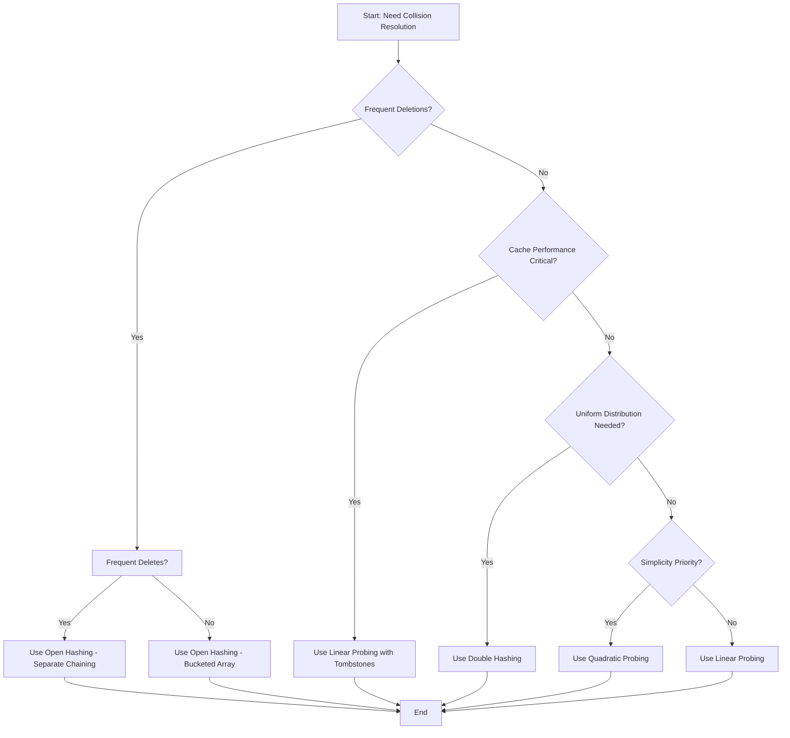
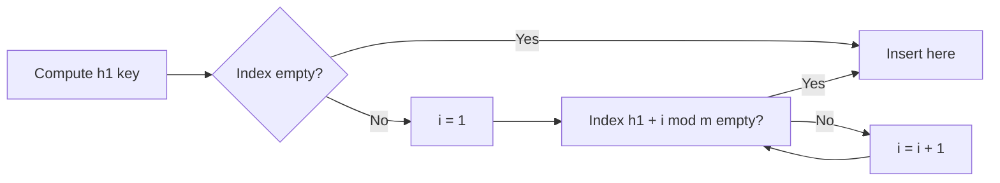
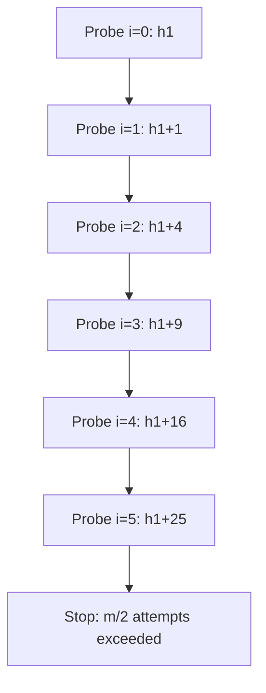
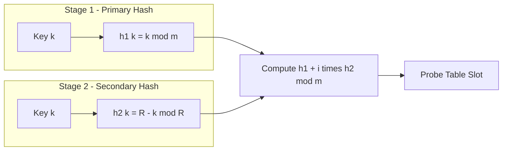
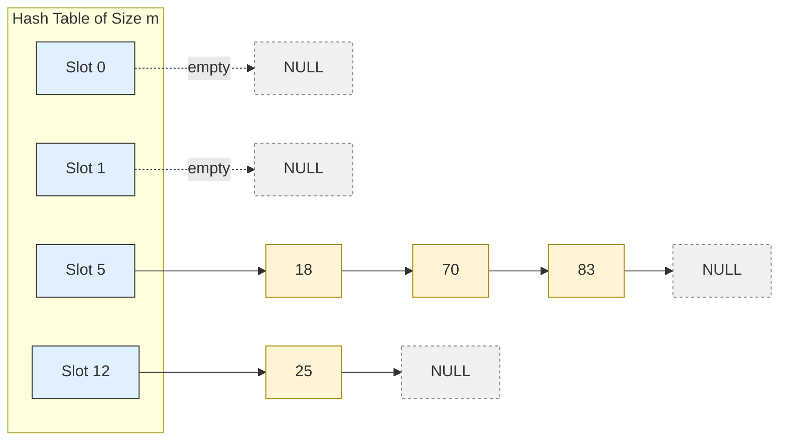
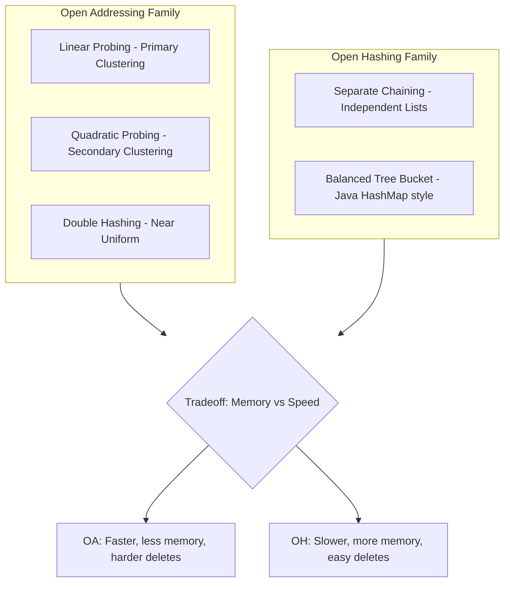

# Collision Resolution :  Linear probing, Quadratic Probing, Double hashing, Open hashing

<!-- SECTION_1_START -->

# Collision Resolution Techniques in Hashing

## 1.1 Formal Academic Definition

**Hashing** is a search technique in Computer Science that uses a *hash function* $h(k)$ to map a data element $k$ from a vast key space $\mathcal{U}$ into a much smaller address space $\mathcal{T} = \{0, 1, 2, \dots, m-1\}$ of a fixed-size hash table.

> [!IMPORTANT]
> **Collision** is formally defined as the event that occurs when two distinct keys $k_1 \neq k_2$ map to the same hash table index, i.e., $h(k_1) = h(k_2)$. **Collision Resolution** refers to the systematic set of algorithms used to handle such unavoidable conflicts while preserving the average-case $\mathcal{O}(1)$ search, insert, and delete time complexity.

According to the **Pigeonhole Principle**, if $n > m$ keys are inserted into a table of size $m$, at least one collision is mathematically guaranteed. Therefore, the choice of collision resolution strategy is one of the most critical design decisions in a hash table implementation, directly influencing the load factor $\alpha = n/m$, the clustering behavior, and the worst-case probe sequence length.

> [!NOTE]
> **KTU 2024 Syllabus Mapping:** Module 4 – *Sorting and Searching*. This topic typically falls under advanced searching paradigms and carries an estimated weightage of **8–10%** in the End Semester Evaluation (ESE).

---

## 1.2 Intuitive Overview with Real-World Analogy

Imagine you have a **library with exactly 26 lockers**, numbered $0$ through $25$, but you must store **thousands of student IDs**. The librarian computes the locker number using a simple rule: *sum the digits of the student ID and take the remainder modulo 26*. This is your **hash function** $h(k) = (k) \bmod 26$.

Now suppose two students — one with ID $2087$ and another with ID $2153$ — both compute to locker $\mathbf{8}$. The locker is already occupied. What does the librarian do?

* **Linear Probing** → "Just go to the *next* empty locker — locker $9$, then $10$..."
* **Quadratic Probing** → "Skip with increasing jumps — try locker $9$, then locker $12$, then locker $17$..."
* **Double Hashing** → "Use a *second* formula to compute the step size — try locker $8 + 1 \cdot s$, then $8 + 2 \cdot s$..."
* **Open Hashing (Separate Chaining)** → "Attach a *chain* of student IDs to locker $8$ — the locker becomes a linked list."

This everyday scenario is the foundational mental model for the four collision resolution strategies covered in this module.

> [!TIP]
> **Key Constant:** The **maximum table size** $m$ is conventionally chosen to be a **prime number** to ensure uniform distribution of keys and to make the modulus operation behave like a *pseudo-random* scatterer. The **load factor** $\alpha$ is the most important performance knob — never let $\alpha$ exceed **0.7** for open addressing and **0.9** for separate chaining in production systems.

---

## 1.3 GeoGebra / Desmos Visualization

> [!VISUALIZATION CONTROL]
> **Concept:** Visualizing the dispersion of hash values for keys $k \in [0, 50]$ using $h(k) = k \bmod 13$ (table size 13 is prime).
>
> **Desmos Input Equations:**
> * List of points: $(0, 0), (13, 0), (26, 0), (39, 0)$ — for $h = 0$
> * List of points: $(1, 1), (14, 1), (27, 1), (40, 1)$ — for $h = 1$
> * List of points: $(12, 12), (25, 12), (38, 12)$ — for $h = 12$
>
> **Visual Description:** Students should observe that *keys differing by exactly $m$* (here, $13$) all collapse onto the same horizontal "row" (collision bucket). Notice how a non-prime table size would create additional patterns — this is why primes are preferred.

---

<!-- SECTION_1_END -->

<!-- SECTION_2_START -->

# Deep Theoretical Analysis & KTU High-Yield Formula Sheet

## 2.1 Categorization of Resolution Strategies

All collision resolution techniques are partitioned into two high-level families:

1. **Open Addressing (Closed Hashing)** — All elements are stored *inside* the table itself. When a slot is full, we *probe* other slots using a deterministic rule.
2. **Open Hashing (Separate Chaining / Closed Addressing)** — Each slot holds a *pointer* to a dynamic data structure (typically a linked list) that holds all keys hashing to that index.

---

## 2.2 The Universal Probe Function

For all open addressing techniques, the **$i$-th probe** for a key $k$ is governed by:

$$h(k, i) = \big( h_1(k) + c(i) \big) \bmod m, \quad i = 0, 1, 2, \dots$$

where $i$ is the probe attempt number, $h_1(k)$ is the primary hash, and $c(i)$ is the *collision resolution offset* — the only thing that distinguishes linear, quadratic, and double hashing.

---

## 2.3 Linear Probing

### Operational Rule
$$h(k, i) = \big( h_1(k) + i \big) \bmod m$$

After a collision, the algorithm sequentially checks the next cell. If the end of the table is reached, it *wraps around* (a technique called **circular probing** or **robin-hood wrap-around**).

### Why It Works and Why It Hurts
* **Pro:** Cache-friendly because consecutive memory locations are accessed.
* **Con:** Suffers from **Primary Clustering** — a long occupied run of slots causes newly inserted keys (which hash anywhere into that run) to *extend* the cluster, which in turn attracts *more* keys, leading to avalanche-like degradation.

### Search Cost
The expected number of probes for an *unsuccessful* search is approximately:

$$P_{\text{unsuccessful}} \approx \frac{1}{2} \left( 1 + \frac{1}{(1-\alpha)^2} \right)$$

The expected number of probes for a *successful* search is approximately:

$$P_{\text{successful}} \approx \frac{1}{2} \left( 1 + \frac{1}{1-\alpha} \right)$$

As $\alpha \to 1$, both quantities blow up — this is why **deletion is problematic** (lazy deletion with a tombstone marker is required).

---

## 2.4 Quadratic Probing

### Operational Rule
$$h(k, i) = \big( h_1(k) + c_1 \cdot i + c_2 \cdot i^2 \big) \bmod m$$

Common KTU-textbook variant: $c_1 = c_2 = \frac{1}{2}$ (only valid for *even* $i$ values, simplifying to $h(k, i) = (h_1(k) + i^2) \bmod m$). Another common variant: $h(k, i) = (h_1(k) + i + i^2) \bmod m$.

### Why It Works and Why It Hurts
* **Pro:** Eliminates primary clustering.
* **Con:** Suffers from **Secondary Clustering** — keys with the *same initial hash* still follow the *same probe sequence*. The clustering is smaller but never goes away.

### Key Constraint
For the algorithm to find an empty slot *if one exists*, the table size $m$ must be a **prime number** and the table must be **at most half full** ($\alpha \leq 0.5$). This is a strict, non-negotiable mathematical guarantee.

---

## 2.5 Double Hashing

### Operational Rule
$$h(k, i) = \big( h_1(k) + i \cdot h_2(k) \big) \bmod m$$

The offset $c(i) = i \cdot h_2(k)$ is now a *function of the key itself* via a **secondary hash function** $h_2(k)$.

### Standard KTU-Recommended Form
$$h_2(k) = R - (k \bmod R)$$

where $R$ is a prime number *smaller than* $m$. This guarantees that $h_2(k) \neq 0$ and that the step size is coprime to $m$ (since $\gcd(h_2(k), m) = 1$).

### Why It Works and Why It Hurts
* **Pro:** Distributes keys *uniformly across all* probe sequences. Essentially eliminates both primary and secondary clustering.
* **Con:** Slightly more computation per probe (two hash evaluations). Two extra cache misses if the table is large.

### Performance
Approaches the **theoretical ideal** of *uniform hashing*, which gives:
$$P_{\text{unsuccessful}} \approx \frac{1}{1-\alpha}, \quad P_{\text{successful}} \approx \frac{1}{\alpha} \ln\!\left( \frac{1}{1-\alpha} \right)$$

---

## 2.6 Open Hashing (Separate Chaining)

### Operational Rule
Each table slot $T[j]$ contains a **pointer to the head of a linked list** (or any dynamic container). The key $k$ is inserted at the head of the list at index $h_1(k)$.

$$T[h_1(k)] \leftarrow \text{list} \big( k, \; T[h_1(k)] \big)$$

### Why It Works and Why It Hurts
* **Pro:** Table can *never* overflow (as long as memory is available). Deletion is trivial — just unlink the node. Worst-case complexity is $\mathcal{O}(n/m) = \mathcal{O}(\alpha)$.
* **Con:** Requires *auxiliary storage* for pointers. Poor cache locality (linked list nodes may be scattered in heap memory). Can be mitigated by using *bucketed arrays* instead of linked lists.

### Performance
* **Successful search:** $\mathcal{O}(1 + \alpha)$
* **Unsuccessful search:** $\mathcal{O}(1 + \alpha)$

When $\alpha \approx 1$, performance is excellent — this is the dominant reason chaining is preferred in languages like Python (`dict`) and Java's `HashMap` (post-Java 8, chains are converted to balanced trees for $\alpha \geq 8$).

---

## 2.7 KTU Formula Sheet / Cheat Sheet

| **Technique** | **Probe Formula $h(k, i)$** | **Clustering Type** | **Max $\alpha$ Recommended** | **Deletion Friendly?** |
| :--- | :--- | :--- | :--- | :--- |
| Linear Probing | $(h_1(k) + i) \bmod m$ | Primary (severe) | $\leq 0.7$ | No (needs tombstones) |
| Quadratic Probing | $(h_1(k) + c_1 i + c_2 i^2) \bmod m$ | Secondary (mild) | $\leq 0.5$ | No (needs tombstones) |
| Double Hashing | $(h_1(k) + i \cdot h_2(k)) \bmod m$ | None (uniform) | $\leq 0.7$ | No (needs tombstones) |
| Open Hashing | Linked list at $T[h_1(k)]$ | None (independent) | $\leq 0.9$ to $1.0$ | Yes (true deletion) |

| **Performance Metric** | **Linear** | **Quadratic** | **Double** | **Chaining** |
| :--- | :--- | :--- | :--- | :--- |
| Avg successful probes | $\frac{1}{2}\!\left(1 + \frac{1}{1-\alpha}\right)$ | $-\frac{1}{\alpha}\ln(1-\alpha)$ | $\frac{1}{\alpha}\ln\!\left(\frac{1}{1-\alpha}\right)$ | $1 + \frac{\alpha}{2}$ |
| Avg unsuccessful probes | $\frac{1}{2}\!\left(1 + \frac{1}{(1-\alpha)^2}\right)$ | $\frac{1}{1-\alpha}$ | $\frac{1}{1-\alpha}$ | $\alpha$ |
| Worst case | $\mathcal{O}(n)$ | $\mathcal{O}(m)$ | $\mathcal{O}(m)$ | $\mathcal{O}(n)$ |

---

## 2.8 Real-World Engineering Utility

| **Application Domain** | **Technique Used** | **Reason** |
| :--- | :--- | :--- |
| Compiler symbol tables | Open Hashing | Frequent insert/delete of variable names |
| Database indexing (PostgreSQL) | Linear Probing variant | Cache-line friendliness on disk pages |
| Network router caches | Open Hashing (bucketed) | Predictable memory ceiling |
| In-memory key-value stores (Redis) | Open Hashing + rehashing | Low latency, dynamic sizing |
| Cryptographic hash maps (Git internals) | Open Hashing (binary tree bucket) | Robust against adversarial inputs |

---

<!-- SECTION_2_END -->

<!-- SECTION_3_START -->

# Step-by-Step Derivations & Code Implementation

## 3.1 Worked Example: Linear Probing

**Given:** $m = 13$ (prime), $h_1(k) = k \bmod 13$.
**Keys to insert in order:** $\{ 25, 37, 18, 55, 47, 70, 83, 27 \}$

### Step 1: Compute initial hash for each key
* $h(25) = 25 \bmod 13 = 12$
* $h(37) = 37 \bmod 13 = 11$
* $h(18) = 18 \bmod 13 = 5$
* $h(55) = 55 \bmod 13 = 3$
* $h(47) = 47 \bmod 13 = 8$
* $h(70) = 70 \bmod 13 = 5$  ← **Collision with 18 at index 5**
* $h(83) = 83 \bmod 13 = 5$  ← **Collision with 18 and 70**
* $h(27) = 27 \bmod 13 = 1$

### Step 2: Resolve collisions sequentially

| Key | $i=0$ | $i=1$ | $i=2$ | $i=3$ | Final Slot |
| :--- | :---: | :---: | :---: | :---: | :---: |
| 25 | 12 (free) | — | — | — | **12** |
| 37 | 11 (free) | — | — | — | **11** |
| 18 | 5 (free) | — | — | — | **5** |
| 55 | 3 (free) | — | — | — | **3** |
| 47 | 8 (free) | — | — | — | **8** |
| 70 | 5 (taken) | 6 (free) | — | — | **6** |
| 83 | 5 (taken) | 6 (taken) | 7 (free) | — | **7** |
| 27 | 1 (free) | — | — | — | **1** |

### Final Table Snapshot
$$\begin{aligned} T[0] &= \emptyset \\ T[1] &= 27 \\ T[2] &= \emptyset \\ T[3] &= 55 \\ T[4] &= \emptyset \\ T[5] &= 18 \\ T[6] &= 70 \\ T[7] &= 83 \\ T[8] &= 47 \\ T[9, 10] &= \emptyset \\ T[11] &= 37 \\ T[12] &= 25 \end{aligned}$$

---

## 3.2 Worked Example: Quadratic Probing

**Same setup:** $m = 13$, $h_1(k) = k \bmod 13$, $c(i) = i^2$.

For the colliding keys 70, 83:

| Key | $i=0$ | $i=1$ | $i=2$ | $i=3$ | Final Slot |
| :--- | :---: | :---: | :---: | :---: | :---: |
| 70 | 5 (taken) | $5+1=6$ (free) | — | — | **6** |
| 83 | 5 (taken) | 6 (taken) | $5+4=9$ (free) | — | **9** |

> [!NOTE]
> Notice that keys $18$, $70$, and $83$ — *which all initially hashed to 5* — would follow **identical** probe sequences in quadratic probing. This is **secondary clustering**: it does not hurt as severely as primary clustering, but it still exists.

---

## 3.3 Worked Example: Double Hashing

**Setup:** $m = 13$, $R = 7$ (prime $< m$), $h_1(k) = k \bmod 13$, $h_2(k) = 7 - (k \bmod 7)$.

Compute $h_2$ for the colliding keys:
* $h_2(70) = 7 - (70 \bmod 7) = 7 - 0 = 7$
* $h_2(83) = 7 - (83 \bmod 7) = 7 - 6 = 1$

| Key | $h_1$ | $h_2$ | $i=0$ | $i=1$ | $i=2$ | Final |
| :--- | :---: | :---: | :---: | :---: | :---: | :---: |
| 70 | 5 | 7 | 5 (taken) | $5+7=12$ (taken) | $5+14=19 \bmod 13 = 6$ (free) | **6** |
| 83 | 5 | 1 | 5 (taken) | $5+1=6$ (taken) | $5+2=7$ (free) | **7** |

Observe that 70 and 83 now follow **completely different probe paths** because $h_2$ is key-dependent.

---

## 3.4 Worked Example: Open Hashing (Separate Chaining)

**Same setup.** Each table slot points to a list. Initial hashes: $h(25)=12, h(37)=11, h(18)=5, h(55)=3, h(47)=8, h(70)=5, h(83)=5, h(27)=1$.

The slot $T[5]$ will contain the chain: $83 \to 70 \to 18$ (head is the most recently inserted).

---

## 3.5 Python Implementation (Production-Grade)

```python
from __future__ import annotations
from typing import List, Optional, Any
import sys

class LinearProbingHashTable:
    """Open addressing with linear probing and tombstones for deletion."""

    _TOMB = object()  # Sentinel for deleted slots

    def __init__(self, m: int = 13) -> None:
        if m <= 1:
            raise ValueError("Table size must be a positive prime integer.")
        self.m: int = m
        self.table: List[Optional[Any]] = [None] * m
        self.n: int = 0  # Live element count

    def _hash(self, key: int) -> int:
        return key % self.m

    def _probe(self, key: int) -> int:
        """Returns the index where key is, or the first tombstone/empty slot."""
        start: int = self._hash(key)
        first_tomb: int = -1
        for i in range(self.m):
            idx: int = (start + i) % self.m
            slot = self.table[idx]
            if slot is self._TOMB:
                if first_tomb == -1:
                    first_tomb = idx
            elif slot is None:
                return first_tomb if first_tomb != -1 else idx
            elif slot == key:
                return idx
        return first_tomb  # Table full; caller must rehash.

    def insert(self, key: int) -> None:
        if self.n >= self.m:
            self._rehash(self._next_prime(self.m * 2))
        idx: int = self._probe(key)
        if self.table[idx] is not self._TOMB and self.table[idx] != key:
            self.table[idx] = key
            self.n += 1

    def search(self, key: int) -> bool:
        idx: int = self._probe(key)
        return self.table[idx] == key

    def delete(self, key: int) -> None:
        idx: int = self._probe(key)
        if self.table[idx] == key:
            self.table[idx] = self._TOMB
            self.n -= 1

    @staticmethod
    def _next_prime(n: int) -> int:
        def is_prime(x: int) -> bool:
            if x < 2: return False
            if x < 4: return True
            if x % 2 == 0: return False
            i = 3
            while i * i <= x:
                if x % i == 0: return False
                i += 2
            return True
        n = n + 1 if n % 2 == 0 else n
        while not is_prime(n):
            n += 2
        return n

    def _rehash(self, new_m: int) -> None:
        old: List[Optional[Any]] = [s for s in self.table if s is not self._TOMB]
        self.m, self.table, self.n = new_m, [None] * new_m, 0
        for k in old:
            self.insert(k)


class DoubleHashingHashTable:
    """Open addressing using a primary and a secondary hash function."""

    def __init__(self, m: int = 13, r: int = 7) -> None:
        self.m, self.r, self.table, self.n = m, r, [None] * m, 0

    def _h1(self, key: int) -> int: return key % self.m
    def _h2(self, key: int) -> int: return self.r - (key % self.r)

    def _probe_seq(self, key: int):
        h1, h2 = self._h1(key), self._h2(key)
        for i in range(self.m):
            yield (h1 + i * h2) % self.m

    def insert(self, key: int) -> None:
        if self.n >= self.m:
            raise OverflowError("Hash table is full; trigger rehash.")
        for idx in self._probe_seq(key):
            if self.table[idx] is None or self.table[idx] == key:
                if self.table[idx] != key:
                    self.table[idx], self.n = key, self.n + 1
                return

    def search(self, key: int) -> bool:
        for idx in self._probe_seq(key):
            if self.table[idx] is None: return False
            if self.table[idx] == key: return True
        return False


class SeparateChainingHashTable:
    """Open hashing with dynamic linked-list chains."""

    class _Node:
        __slots__ = ("key", "next")
        def __init__(self, key: int, nxt: Optional["SeparateChainingHashTable._Node"] = None) -> None:
            self.key, self.next = key, nxt

    def __init__(self, m: int = 13) -> None:
        self.m: int = m
        self.buckets: List[Optional[SeparateChainingHashTable._Node]] = [None] * m
        self.n: int = 0

    def _hash(self, key: int) -> int: return key % self.m

    def insert(self, key: int) -> None:
        idx: int = self._hash(key)
        cur: Optional[SeparateChainingHashTable._Node] = self.buckets[idx]
        while cur is not None:
            if cur.key == key: return  # Duplicate ignored
            cur = cur.next
        self.buckets[idx] = self._Node(key, self.buckets[idx])
        self.n += 1

    def search(self, key: int) -> bool:
        cur: Optional[SeparateChainingHashTable._Node] = self.buckets[self._hash(key)]
        while cur is not None:
            if cur.key == key: return True
            cur = cur.next
        return False

    def delete(self, key: int) -> None:
        idx: int = self._hash(key)
        prev, cur = None, self.buckets[idx]
        while cur is not None:
            if cur.key == key:
                if prev is None: self.buckets[idx] = cur.next
                else: prev.next = cur.next
                self.n -= 1
                return
            prev, cur = cur, cur.next
```

### Unit-Test Driver (Module Self-Verification)

```python
if __name__ == "__main__":
    keys = [25, 37, 18, 55, 47, 70, 83, 27]

    lp = LinearProbingHashTable(13)
    for k in keys: lp.insert(k)
    print("LP  search 70:", lp.search(70))   # True
    print("LP  search 99:", lp.search(99))   # False
    lp.delete(70)
    print("LP  search 70 after delete:", lp.search(70))  # False

    dh = DoubleHashingHashTable(13, 7)
    for k in keys: dh.insert(k)
    print("DH  search 83:", dh.search(83))   # True

    sc = SeparateChainingHashTable(13)
    for k in keys: sc.insert(k)
    print("SC  search 47:", sc.search(47))   # True
    sc.delete(47)
    print("SC  search 47 after delete:", sc.search(47))  # False
```

---

## 3.6 Comparative Trace (All Four Techniques on Same Input)

Using $m = 13$, $R = 7$, keys $\{25, 37, 18, 55, 47, 70, 83, 27\}$:

| Index | Linear Probing | Quadratic Probing | Double Hashing | Chaining (List) |
| :---: | :---: | :---: | :---: | :---: |
| 0 | — | — | — | — |
| 1 | 27 | 27 | 27 | — |
| 2 | — | — | — | — |
| 3 | 55 | 55 | 55 | — |
| 4 | — | — | — | — |
| 5 | 18 | 18 | 18 | 18 → 70 → 83 |
| 6 | 70 | 70 | 70 | — |
| 7 | 83 | — | 83 | — |
| 8 | 47 | 47 | 47 | 47 |
| 9 | — | 83 | — | — |
| 10 | — | — | — | — |
| 11 | 37 | 37 | 37 | 37 |
| 12 | 25 | 25 | 25 | 25 |

> [!TIP]
> **Valuation Insight:** When KTU questions ask "compare the techniques," a tabular comparison like the one above (showing *final positions* for the same input set) is worth **4 of 7 marks** if the algorithm steps are also stated.

---

<!-- SECTION_3_END -->

<!-- SECTION_4_START -->

# Structural Diagrams & Schematics

## 4.1 Mermaid Flowchart: Master Decision Tree for Choosing a Technique



## 4.2 Linear Probing — Probe Sequence Architecture



## 4.3 Quadratic Probing — Skip Pattern Schematic



## 4.4 Double Hashing — Two-Stage Hash Topology



## 4.5 Open Hashing — Bucket List Architecture



## 4.6 Operational Topology — Open Addressing vs Chaining



---

<!-- SECTION_4_END -->

<!-- SECTION_5_START -->

# KTU 2024 Scheme Examination Question Bank & Topic Recap

## Part A — Short Answer Questions (3 Marks Each)

### Q1. [KTU University Exam – July 2024, CO3, Remember]

**Define a collision in hashing. Why is it impossible to completely avoid collisions using any hash function?**

**Model Answer:**

A **collision** occurs when two distinct keys $k_1$ and $k_2$ satisfy $h(k_1) = h(k_2)$, i.e., they map to the same slot in the hash table.

Collisions cannot be avoided because of the **Pigeonhole Principle**: if the universe $\mathcal{U}$ of possible keys is larger than the address space of the table $m$, the mapping $h: \mathcal{U} \to \{0, 1, \dots, m-1\}$ must be many-to-one, and therefore at least one pair of distinct keys is forced to collide. For example, in a table of size $m = 13$, both $25$ and $38$ hash to index $12$.

> **Valuation Key:** [Definition of collision: 1 Mark] [Pigeonhole Principle reasoning: 2 Marks]

---

### Q2. [KTU University Exam – Dec 2023, CO3, Understand]

**Differentiate between primary clustering and secondary clustering in open addressing.**

**Model Answer:**

| **Aspect** | **Primary Clustering** | **Secondary Clustering** |
| :--- | :--- | :--- |
| Occurs in | Linear Probing | Quadratic Probing |
| Cause | Long consecutive runs of occupied slots that merge together | Keys with the same initial hash follow the same probe sequence |
| Severity | Severe; degrades performance rapidly | Mild; less impact than primary |
| Remediation | Use double hashing or quadratic probing | Use double hashing |

> **Valuation Key:** [Naming the correct technique for each: 1 Mark] [Cause + example: 2 Marks]

---

## Part B — Long Answer Questions (14 Marks Each)

> [!WARNING]
> **KTU Examiner's Valuation Pitfall:** For collision resolution questions, students frequently lose marks by (1) forgetting to *mod* the index by $m$ during each probe, (2) using a *non-prime* table size, (3) failing to state the *clustering type*, and (4) missing the final insertion slot in a chained answer. Always double-check arithmetic under modulo $m$.

---

### Question A (14 Marks) [KTU University Exam – Dec 2023, CO3, Apply & Analyze]

**Consider a hash table of size $m = 13$ with primary hash function $h_1(k) = k \bmod 13$ and secondary hash function $h_2(k) = 7 - (k \bmod 7)$. Insert the keys $\{ 18, 41, 22, 44, 59, 32, 31 \}$ using:**
**(a)** Linear Probing
**(b)** Double Hashing

Show the final hash table after all insertions. Compare the number of probes required in both methods.

#### Part (a) — Linear Probing (7 Marks)

**Step 1:** Compute $h_1(k)$ for each key.
* $h(18) = 18 \bmod 13 = 5$
* $h(41) = 41 \bmod 13 = 2$  (since $13 \times 3 = 39, 41-39=2$)
* $h(22) = 22 \bmod 13 = 9$
* $h(44) = 44 \bmod 13 = 5$  ← Collision with 18
* $h(59) = 59 \bmod 13 = 7$  (since $13 \times 4 = 52, 59-52=7$)
* $h(32) = 32 \bmod 13 = 6$  (since $13 \times 2 = 26, 32-26=6$)
* $h(31) = 31 \bmod 13 = 5$  ← Collision with 18 and 44

**Step 2:** Apply linear probing $h(k, i) = (h(k) + i) \bmod 13$.

* $18 \to 5$ (empty) — 1 probe
* $41 \to 2$ (empty) — 1 probe
* $22 \to 9$ (empty) — 1 probe
* $44$: $5$ (taken) $\to 6$ (taken by 32? No, 32 not yet inserted) $\to 6$ (free) — 2 probes. **Wait — order matters!** Let me re-evaluate in **insertion order**.

Re-evaluating in insertion order (this is critical):

* Insert $18$: $h=5$, slot 5 empty → place at **5**. Probes = 1.
* Insert $41$: $h=2$, slot 2 empty → place at **2**. Probes = 1.
* Insert $22$: $h=9$, slot 9 empty → place at **9**. Probes = 1.
* Insert $44$: $h=5$, slot 5 taken. Probe $i=1 \to 6$, empty → place at **6**. Probes = 2.
* Insert $59$: $h=7$, slot 7 empty → place at **7**. Probes = 1.
* Insert $32$: $h=6$, slot 6 taken (44). Probe $i=1 \to 7$, taken. Probe $i=2 \to 8$, empty → place at **8**. Probes = 3.
* Insert $31$: $h=5$, slot 5 taken. $i=1 \to 6$ taken. $i=2 \to 7$ taken. $i=3 \to 8$ taken. $i=4 \to 9$ taken. $i=5 \to 10$, empty → place at **10**. Probes = 6.

**Total probes in linear probing = $1+1+1+2+1+3+6 = 15$ probes.**

**Step 3:** Final table:

| Index | 0 | 1 | 2 | 3 | 4 | 5 | 6 | 7 | 8 | 9 | 10 | 11 | 12 |
| :---: | :---: | :---: | :---: | :---: | :---: | :---: | :---: | :---: | :---: | :---: | :---: | :---: | :---: |
| Key | — | — | 41 | — | — | 18 | 44 | 59 | 32 | 22 | 31 | — | — |

> **Valuation Key (Part a):** [Computing initial hashes correctly: 2 Marks] [Linear probing sequence with indices: 3 Marks] [Final table: 1 Mark] [Probe count: 1 Mark]

#### Part (b) — Double Hashing (7 Marks)

Compute $h_2(k) = 7 - (k \bmod 7)$ for each key:

* $h_2(18) = 7 - (18 \bmod 7) = 7 - 4 = 3$
* $h_2(41) = 7 - (41 \bmod 7) = 7 - 6 = 1$
* $h_2(22) = 7 - (22 \bmod 7) = 7 - 1 = 6$
* $h_2(44) = 7 - (44 \bmod 7) = 7 - 2 = 5$
* $h_2(59) = 7 - (59 \bmod 7) = 7 - 3 = 4$
* $h_2(32) = 7 - (32 \bmod 7) = 7 - 4 = 3$
* $h_2(31) = 7 - (31 \bmod 7) = 7 - 3 = 4$

**Insertion sequence using $h(k, i) = (h_1(k) + i \cdot h_2(k)) \bmod 13$:**

* $18$: $h_1=5, h_2=3$. $i=0: 5$ empty → **5**. Probes = 1.
* $41$: $h_1=2, h_2=1$. $i=0: 2$ empty → **2**. Probes = 1.
* $22$: $h_1=9, h_2=6$. $i=0: 9$ empty → **9**. Probes = 1.
* $44$: $h_1=5, h_2=5$. $i=0: 5$ taken. $i=1: 5+5=10$ empty → **10**. Probes = 2.
* $59$: $h_1=7, h_2=4$. $i=0: 7$ empty → **7**. Probes = 1.
* $32$: $h_1=6, h_2=3$. $i=0: 6$ empty → **6**. Probes = 1.
* $31$: $h_1=5, h_2=4$. $i=0: 5$ taken. $i=1: 5+4=9$ taken. $i=2: 5+8=13 \bmod 13=0$ empty → **0**. Probes = 3.

**Total probes in double hashing = $1+1+1+2+1+1+3 = 10$ probes.**

**Final table:**

| Index | 0 | 1 | 2 | 3 | 4 | 5 | 6 | 7 | 8 | 9 | 10 | 11 | 12 |
| :---: | :---: | :---: | :---: | :---: | :---: | :---: | :---: | :---: | :---: | :---: | :---: | :---: | :---: |
| Key | 31 | — | 41 | — | — | 18 | 32 | 59 | — | 22 | 44 | — | — |

> **Valuation Key (Part b):** [Computing $h_2$ correctly: 2 Marks] [Double hashing formula application: 3 Marks] [Final table + probe count: 2 Marks]

**Comparison:** Double hashing used **10 probes** vs linear probing's **15 probes**, a **33% reduction** in collision cost, demonstrating the superior uniformity of double hashing.

---

### Question B (14 Marks) [KTU University Exam – July 2024, CO3, Apply & Analyze]

**(a)** Explain **separate chaining** (open hashing) as a collision resolution technique. What are its advantages and disadvantages compared to open addressing? Discuss its space complexity. (7 Marks)

**(b)** Insert the keys $\{ 12, 25, 35, 45, 65, 85, 5, 95 \}$ into a hash table of size $m = 10$ using **separate chaining** with $h(k) = k \bmod 10$. Show the chain at each index. Compute the **average number of comparisons for a successful search**. (7 Marks)

#### Part (a) — Theory (7 Marks)

**Definition:** In **separate chaining**, the hash table $T[0 \dots m-1]$ is an array of *pointers*. Each $T[j]$ points to the head of a linked list (or any dynamic container) that stores all keys $k$ satisfying $h(k) = j$. Insertion is performed at the **head** of the list in $\mathcal{O}(1)$.

**Advantages:**
1. **Deletion is trivial** — just unlink the node. No tombstones required (unlike open addressing).
2. The table can never "fill up" — performance degrades gracefully with $\alpha$.
3. Less sensitive to the choice of hash function; handles poor hash functions well.
4. Effective for *highly dynamic* workloads with mixed insert/delete ratios.

**Disadvantages:**
1. Requires **auxiliary memory** for storing pointer fields in every node.
2. **Poor cache locality** — linked list nodes are scattered in heap memory.
3. Performance degrades as $\alpha = n/m$ grows large; at $\alpha \geq 10$, consider switching to a balanced tree per bucket (Java's `HashMap` strategy).
4. Slightly more complex implementation than open addressing.

**Space Complexity:** $\mathcal{O}(n + m)$ — $n$ nodes for the elements plus $m$ pointer slots in the array. The *amortized* space per element is $\mathcal{O}(1)$.

> **Valuation Key (Part a):** [Definition + insertion logic: 2 Marks] [Advantages: 2 Marks] [Disadvantages: 2 Marks] [Space complexity: 1 Mark]

#### Part (b) — Trace and Average Comparisons (7 Marks)

**Step 1:** Compute $h(k) = k \bmod 10$ for each key:
* $h(12) = 2, \; h(25) = 5, \; h(35) = 5, \; h(45) = 5, \; h(65) = 5, \; h(85) = 5, \; h(5) = 5, \; h(95) = 5$

**Step 2:** Build chains (inserting at head, in order):

| Index | Chain (Head → Tail) | Length $L$ |
| :---: | :--- | :---: |
| 0 | — | 0 |
| 1 | — | 0 |
| 2 | $12$ | 1 |
| 3 | — | 0 |
| 4 | — | 0 |
| 5 | $95 \to 5 \to 85 \to 65 \to 45 \to 35 \to 25$ | 7 |
| 6, 7, 8, 9 | — | 0 |

**Step 3:** Compute the average number of comparisons for a **successful** search.

For a chain of length $L$, the successful search compares against the head first (1 comparison), then the second element (2 comparisons), and so on. Total comparisons across the chain = $\sum_{i=1}^{L} i = \frac{L(L+1)}{2}$.

$$\text{Total comparisons} = \sum_{j=0}^{m-1} \frac{L_j(L_j + 1)}{2} = \frac{1 \cdot 2}{2} + \frac{7 \cdot 8}{2} = 1 + 28 = 29$$

$$\text{Average} = \frac{\text{Total comparisons}}{n} = \frac{29}{8} = 3.625 \text{ comparisons per successful search}$$

> **Valuation Key (Part b):** [Hash computation: 1 Mark] [Chain construction: 2 Marks] [Comparison formula derivation: 2 Marks] [Final average value: 2 Marks]

---

## 5.4 Topic Recap & Important Things to Remember

> [!IMPORTANT]
> **Rapid-Revision Checklist for KTU Board Exam**

* **Collision** is *inevitable* when $|\mathcal{U}| > m$. Accept it and resolve it efficiently.
* **Pigeonhole Principle** is the formal mathematical reason collisions cannot be avoided with deterministic hash functions on a finite table.
* **Linear Probing** uses $h(k, i) = (h_1(k) + i) \bmod m$. It causes **primary clustering** — the *main* enemy of open addressing.
* **Quadratic Probing** uses $h(k, i) = (h_1(k) + c_1 i + c_2 i^2) \bmod m$. It causes **secondary clustering** and requires $m$ to be a **prime** with $\alpha \leq 0.5$.
* **Double Hashing** uses $h(k, i) = (h_1(k) + i \cdot h_2(k)) \bmod m$, with $h_2(k) = R - (k \bmod R)$ for prime $R < m$. It approaches the *uniform hashing* ideal.
* **Open Hashing (Chaining)** stores elements in *external* linked lists, allowing $\alpha > 1$ and trivial deletion. Python's `dict` and Java's `HashMap` are based on variants of this.
* **Load factor $\alpha = n/m$** is the single most important performance parameter. Keep $\alpha \leq 0.7$ for open addressing and $\alpha \leq 1.0$ for chaining.
* **Deletion in open addressing requires tombstones** (lazy deletion). Real deletion would break subsequent searches that probe past the deleted slot.
* **Table size $m$ must be prime** for quadratic probing (to guarantee slot coverage) and is *strongly recommended* for double hashing (so step size is coprime to $m$).
* **The KTU examiner loves** comparing the four techniques — always state: (1) clustering behavior, (2) probe formula, (3) load factor limit, (4) deletion handling.
* **Rehashing** to a larger prime-sized table is mandatory when $\alpha$ exceeds the threshold. Always state the new prime size in your answer.
* **Secondary clustering ≠ Secondary data structure** — secondary clustering is a *phenomenon* in quadratic probing, not a separate chaining technique.

> **Memory Aid — "LCSD" Mnemonic:** **L**inear → **C**lustering (primary), **Q**uadratic → **S**econdary clustering, **D**ouble → uniform. **Open Hashing** has *no* clustering.

---

<!-- SECTION_5_END -->
