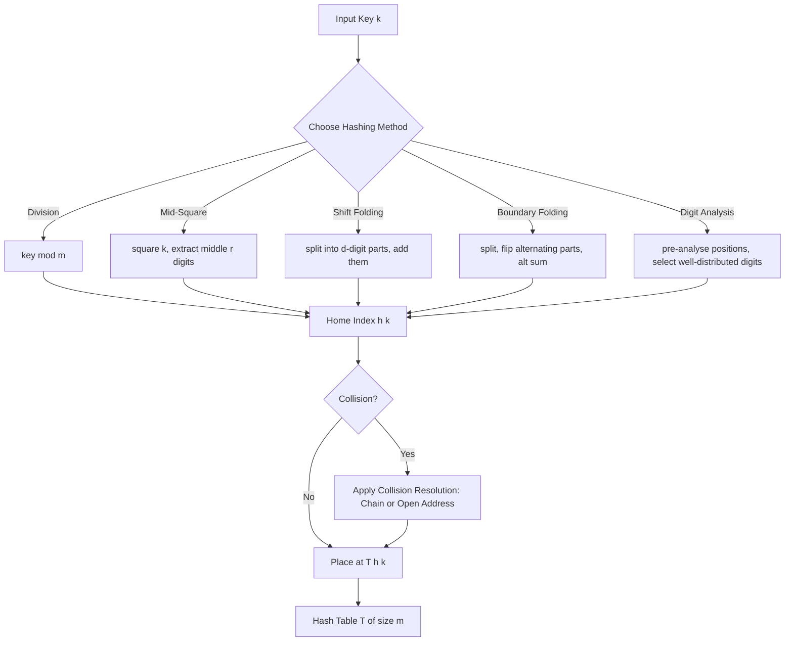
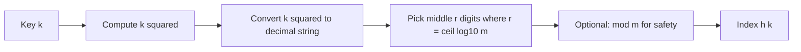
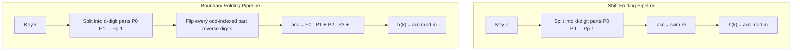
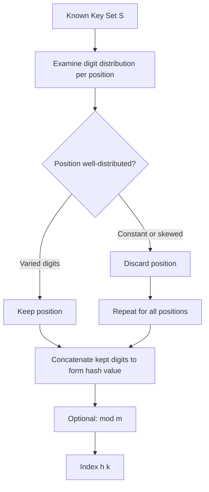
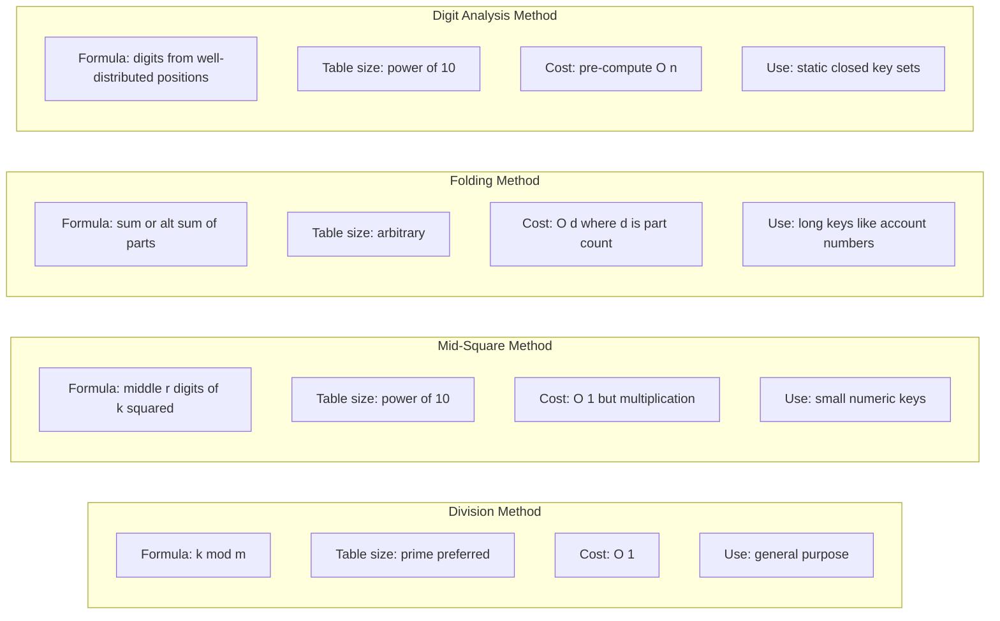

# Hashing - Hashing functions : Mid square, Division, Folding, Digit Analysis

<!-- SECTION_1_START -->
# Hashing & Hash Functions — Core Technical Foundation

## 1.1 Formal Definition (KTU 2024 Syllabus Terminology)

> [!IMPORTANT]
> **Hashing** is a transformation technique that maps a large key space $K$ into a smaller address space $A$ (where $\vert A \vert = m$, the size of the hash table) by means of a deterministic mathematical function $h: K \rightarrow \{0, 1, 2, \ldots, m-1\}$ called the **hash function**. The resulting integer $h(k)$ is the **home address** (or hash index) of the key $k$ in the hash table $T$.

Since $\vert K \vert \gg \vert A \vert$ in real applications, the pigeonhole principle guarantees that two distinct keys $k_1 \neq k_2$ may compute the **same index**. This event is called a **collision**, and its resolution (chaining / open addressing) is a separate sub-topic handled in the next section of Module 4.

## 1.2 Intuitive Analogy — The "Library Locker System"

Imagine a college library with **1000 lockers** but **50,000 books** registered. You cannot assign one locker per book. Instead, the librarian:

1. Looks at the book's **ISBN** (the key).
2. Applies a **rule** (the hash function) to compute a locker number between 0 and 999.
3. Drops the book into that locker.

Two different ISBNs *might* point to the same locker — that is the collision. The job of a **good hash function** is to *spread* the keys as evenly as possible across the 1000 lockers, so very few collisions occur and the **average lookup cost stays close to $O(1)$**.

## 1.3 The Four Hash Functions in Focus (Module 4, Unit 2)

| # | Method | Core Idea (Plain English) |
|---|--------|--------------------------|
| 1 | **Division** | Divide the key by table size, take the **remainder**. |
| 2 | **Mid-Square** | Square the key, **pluck the middle digits**. |
| 3 | **Folding** | Break the key into chunks and **add the chunks together**. |
| 4 | **Digit Analysis** | Study digit-position patterns in a *known* key set and **pick the well-distributed positions**. |

> [!NOTE]
> A *good* hash function must satisfy three properties: **Deterministic** (same key ⇒ same index every time), **Uniform distribution** (every slot is equally likely), and **Cheap to compute** ($O(1)$ time on word-sized keys).

## 1.4 Visualization Block

> [!VISUALIZATION CONTROL]
> **Concept:** Distribution of keys over a hash table of size $m = 100$ under each method.
>
> **Plot setup (Desmos / GeoGebra):**
> * $x\text{-axis}$: key value $k \in [0, 1000]$
> * $y\text{-axis}$: computed home address $h(k) \in [0, 99]$
> * `f_division(x) = mod(x, 100)`
> * `f_midsquare(x) = floor((x^2) / 10) mod 100`
> * `f_shiftfold(x) = (mod(x,1000) + floor(x/1000) + floor(mod(x,100000)/10000)) mod 100`
>
> **Visual Description:** The Division plot shows **stair-step clusters** that reveal the modulus structure. The Mid-Square plot appears almost **stochastic** — the squaring operation scrambles low-order correlations. The Shift-Fold plot shows a piecewise linear ramp — additive combinations of digit groups. Digit Analysis yields a near-uniform scatter if positions are pre-selected wisely.
<!-- SECTION_1_END -->

<!-- SECTION_2_START -->
# Deep Theoretical Analysis & KTU High-Yield Formula Sheet

## 2.1 Method 1 — Division Method (Modulo Hashing)

**Operational Rule:**

$$h(k) = k \bmod m$$

where $m$ is the table size.

**Step-by-step logic:**

1. Treat the key $k$ as a non-negative integer.
2. Compute the integer remainder when $k$ is divided by $m$.
3. The remainder is in the range $[0, m-1]$, perfectly matching the index set.

**Why it works:** Modulo is a *surjective* map from $\mathbb{Z}$ onto $\{0, 1, \ldots, m-1\}$. Every slot is reachable.

**Choice of $m$ (critical for the exam):**

| Choice of $m$ | Effect |
|---------------|--------|
| $m = 2^p$ | Only the last $p$ bits of $k$ matter — disastrous if keys are sequential. |
| $m = 10^p$ | Only the last $p$ decimal digits matter — equally bad. |
| $m$ **prime, not close to a power of 2 or 10** | Spreads keys uniformly. **Recommended.** |

> [!IMPORTANT]
> A common KTU exam trap: choosing $m = 2^p$ where $p$ is implicit in the key length. Always **prefer a prime $m$** like 97, 101, 211, 1009.

---

## 2.2 Method 2 — Mid-Square Method

**Operational Rule:**

$$h(k) = \text{middle } r \text{ digits of } (k)^2$$

where $r$ is chosen so that $10^{r-1} < m \le 10^r$, i.e. **$r = \lceil \log_{10} m \rceil$**.

**Step-by-step logic:**

1. Compute $k^2$.
2. From the decimal representation of $k^2$, delete the leading and trailing halves.
3. The remaining middle $r$ digits form the index (optionally $\bmod \; m$ for safety).

**Why it works:** Squaring the key **amplifies the influence of every digit of $k$** on every digit of $k^2$, so the middle digits tend to be a well-mixed function of the whole key.

**Practical example sketch:** For $k = 3121$, $k^2 = 9\,740\,641$. With $m \approx 1000$, we extract 3 middle digits: $740$ → $h(k) = 740$.

---

## 2.3 Method 3 — Folding Method

The key (treated as a long integer) is split into **parts** of equal length $d$ (except possibly the leftmost part). Two variants exist.

### 2.3.1 Shift Folding

$$h(k) = \left(\sum_{i=0}^{p-1} P_i \right) \bmod m$$

All parts $P_0, P_1, \ldots, P_{p-1}$ are **added in the same orientation** (left-to-right, no flipping).

### 2.3.2 Boundary Folding (Folding at Boundaries / Alternating Folding)

$$h(k) = \left(P_0 - P_1 + P_2 - P_3 + \cdots \right) \bmod m$$

Alternating parts are **folded over** (digit order reversed) before being added/subtracted.

> [!TIP]
> **Boundary folding** generally gives a slightly better distribution than shift folding because reversing every other part decorrelates adjacent chunk boundaries.

---

## 2.4 Method 4 — Digit Analysis Method

**Operational Rule (only valid when the full key set is known in advance — e.g., employee IDs in a payroll system):**

1. List all keys.
2. For each **digit position**, examine the frequency distribution of digits $0$–$9$.
3. Discard positions whose distribution is **skewed** (e.g., nearly all zeros because leading digits are rarely used).
4. From the remaining well-distributed positions, take the digits in those positions to form the hash.
5. Optionally $\bmod \; m$.

This is **the only static / pre-computable method** in the syllabus and is the answer the examiner expects for *known finite key sets*.

---

## 2.5 KTU High-Yield Formula Cheat Sheet

| Method | Formula | Table size recommendation | Best use case |
|--------|---------|---------------------------|---------------|
| Division | $h(k) = k \bmod m$ | $m$ prime, $m \nmid 2^p, 10^p$ | General-purpose, **most widely used** |
| Mid-Square | $h(k) = \lfloor k^2 / 10^{t} \rfloor \bmod 10^{r}$ | $r = \lceil \log_{10} m \rceil$ | Keys up to ~6 digits, $k^2$ must not overflow |
| Shift Folding | $h(k) = \left( \sum_i P_i \right) \bmod m$ | $m$ = any size, $r$ digits per part | Long numeric keys (telephone, account numbers) |
| Boundary Folding | $h(k) = \left( P_0 - P_1 + P_2 - \cdots \right) \bmod m$ | $m$ = any size, $r$ digits per part | Same as shift fold, with better distribution |
| Digit Analysis | $h(k) = $ digits from **well-distributed positions** of $k$ | $m = 10^{r}$ for some $r$ | **Static, pre-known key sets** (e.g., payroll IDs) |

> **Where these are used in production:**
> * **Division hashing** is the default in GCC's `std::unordered_map`, Python's `dict` (after masking the high bits), and Java's `HashMap` (with $m = 2^p$ and a mixing step).
> * **Mid-square** is the historic method Knuth attributes to von Neumann's early random-number generators.
> * **Folding** is taught as a conceptual method; it appears in textbook illustrations of keyed-file access.
> * **Digit analysis** is used in legacy mainframe DB systems where the key set is closed (e.g., bank-account files in COBOL applications).
<!-- SECTION_2_END -->

<!-- SECTION_3_START -->
# Step-by-Step Derivations & Python Implementation

## 3.1 Worked Example 1 — Division Method

**Problem:** Insert keys $\{45, 67, 23, 89, 12, 90\}$ into a hash table of size $m = 11$ using the division method.

**Step-by-step solution:**

$$
\begin{aligned}
h(45) &= 45 \bmod 11 = 45 - 4 \cdot 11 = 45 - 44 = 1 \\
h(67) &= 67 \bmod 11 = 67 - 6 \cdot 11 = 67 - 66 = 1 \\
h(23) &= 23 \bmod 11 = 23 - 2 \cdot 11 = 23 - 22 = 1 \\
h(89) &= 89 \bmod 11 = 89 - 8 \cdot 11 = 89 - 88 = 1 \\
h(12) &= 12 \bmod 11 = 12 - 1 \cdot 11 = 1 \\
h(90) &= 90 \bmod 11 = 90 - 8 \cdot 11 = 90 - 88 = 2
\end{aligned}
$$

**Resulting table (chaining not yet considered):**

| Index | 0 | 1 | 2 | 3 | 4 | 5 | 6 | 7 | 8 | 9 | 10 |
|-------|---|---|---|---|---|---|---|---|---|---|----|
| Keys  | — | 45, 67, 23, 89, 12 | 90 | — | — | — | — | — | — | — | — |

**Observation:** Five collisions in slot 1 ⇒ $m=11$ was *not* a good choice for this dataset. This is exactly why the **choice of $m$ is a separate design question**.

---

## 3.2 Worked Example 2 — Mid-Square Method

**Problem:** Hash keys $\{1234, 5678, 9012, 3456\}$ into a table of size $m = 100$ using mid-square.

We need $r = \lceil \log_{10} 100 \rceil = 2$ middle digits.

$$
\begin{aligned}
k_1 = 1234 \quad &\Rightarrow \quad k_1^2 = 1\,522\,756 \quad \Rightarrow \quad \text{middle 2 digits} = 27 \quad \Rightarrow \quad h(1234) = 27 \\
k_2 = 5678 \quad &\Rightarrow \quad k_2^2 = 32\,239\,684 \quad \Rightarrow \quad \text{middle 2 digits} = 39 \quad \Rightarrow \quad h(5678) = 39 \\
k_3 = 9012 \quad &\Rightarrow \quad k_3^2 = 81\,216\,144 \quad \Rightarrow \quad \text{middle 2 digits} = 61 \quad \Rightarrow \quad h(9012) = 61 \\
k_4 = 3456 \quad &\Rightarrow \quad k_4^2 = 11\,943\,936 \quad \Rightarrow \quad \text{middle 2 digits} = 43 \quad \Rightarrow \quad h(3456) = 43
\end{aligned}
$$

**Resulting table (sizes 100):**

| Index | 27 | 39 | 43 | 61 |
|-------|----|----|----|----|
| Key   | 1234 | 5678 | 3456 | 9012 |

**Zero collisions, uniform spread — the hallmark of mid-square on well-mixed inputs.**

---

## 3.3 Worked Example 3 — Shift Folding

**Problem:** Hash $k = 123\,456\,789\,012$ into $m = 1000$ using **shift folding** with part size $d = 3$ digits.

Split the key into 3-digit parts (right-to-left):
$P_0 = 012$, $P_1 = 789$, $P_2 = 456$, $P_3 = 123$.

$$
\begin{aligned}
\text{Sum} &= 12 + 789 + 456 + 123 = 1\,380 \\
h(k) &= 1380 \bmod 1000 = 380
\end{aligned}
$$

**Note:** $012$ is treated as the integer 12.

---

## 3.4 Worked Example 4 — Boundary Folding

**Problem:** Same key $k = 123\,456\,789\,012$, $m = 1000$, $d = 3$.

Parts (left-to-right): $P_0 = 123$, $P_1 = 456$, $P_2 = 789$, $P_3 = 012$.

Apply **fold-and-flip** to every alternating part:
* $P_0 = 123$ (kept as is)
* $P_1 = 456$ → reversed = $654$
* $P_2 = 789$ (kept as is)
* $P_3 = 012$ → reversed = $210$

$$
\begin{aligned}
\text{Alternating sum} &= 123 - 654 + 789 - 210 = 48 \\
h(k) &= 48 \bmod 1000 = 48
\end{aligned}
$$

---

## 3.5 Worked Example 5 — Digit Analysis

**Problem:** Hash the key set $\{320\,118, 320\,245, 320\,178, 320\,902, 320\,356\}$ into a table of size $m = 100$. Use digit analysis on the 6-digit keys.

**Step 1 — Position-wise frequency:**

| Position (L→R) | 1 | 2 | 3 | 4 | 5 | 6 |
|----------------|---|---|---|---|---|---|
| Digits seen | 3,3,3,3,3 | 2,2,2,2,2 | 0,0,0,0,0 | 1,2,1,9,3 | 1,4,7,0,5 | 8,5,8,2,6 |

* Positions **1, 2, 3** are constant (`320…`) ⇒ **discard**.
* Positions **4, 5, 6** are varied ⇒ **keep**.

**Step 2 — Form hash** by extracting digits 4, 5, 6:

| Key | Pos 4 | Pos 5 | Pos 6 | Hash (3-digit) | Index mod 100 |
|-----|-------|-------|-------|----------------|---------------|
| 320118 | 1 | 1 | 8 | 118 | 18 |
| 320245 | 2 | 4 | 5 | 245 | 45 |
| 320178 | 1 | 7 | 8 | 178 | 78 |
| 320902 | 9 | 0 | 2 | 902 | 2 |
| 320356 | 3 | 5 | 6 | 356 | 56 |

**Zero collisions** — digit analysis excels when positional distributions are heavily skewed.

---

## 3.6 Full Python Implementation

```python
from __future__ import annotations
import logging
from typing import Dict, List

# Configure minimal logging for traceability
logging.basicConfig(level=logging.INFO, format="%(levelname)s :: %(message)s")
log = logging.getLogger("hash_functions")


# ---------- 1. Division Method ----------
def hash_division(key: int, m: int) -> int:
    """Return key mod m. m should be a prime not equal to 2^p or 10^p."""
    if m <= 0:
        raise ValueError(f"Table size m must be > 0, got {m}")
    if key < 0:
        raise ValueError(f"Hash key must be non-negative, got {key}")
    idx = key % m
    log.info("division: h(%d) = %d mod %d = %d", key, key, m, idx)
    return idx


# ---------- 2. Mid-Square Method ----------
def hash_mid_square(key: int, m: int) -> int:
    """Extract the middle ceil(log10(m)) digits of key^2, then mod m."""
    if m <= 0:
        raise ValueError(f"Table size m must be > 0, got {m}")
    if key < 0:
        raise ValueError(f"Hash key must be non-negative, got {key}")
    if key * key > 10 ** 18:
        raise OverflowError(f"key^2 = {key * key} overflows safe int range")

    squared: int = key * key
    r: int = len(str(m))            # number of middle digits to keep
    s: str = str(squared)
    n: int = len(s)
    if n < r:
        idx = squared
    else:
        start: int = (n - r) // 2
        idx = int(s[start:start + r])
    idx = idx % m
    log.info("midsquare: %d^2=%d, middle %d digits -> %d mod %d = %d",
             key, squared, r, idx, m, idx if idx == idx % m else idx)
    return idx


# ---------- 3. Folding (Shift and Boundary) ----------
def _split_parts(key: int, d: int) -> List[int]:
    """Split non-negative key into chunks of d digits, right-to-left."""
    if d <= 0:
        raise ValueError(f"Part size d must be > 0, got {d}")
    s: str = str(key)
    parts: List[int] = []
    for i in range(len(s), 0, -d):
        chunk: str = s[max(0, i - d):i]
        parts.append(int(chunk))
    return list(reversed(parts))  # left-to-right order


def hash_shift_fold(key: int, m: int, d: int = 3) -> int:
    """Add all d-digit parts of key, then mod m."""
    if key < 0:
        raise ValueError(f"Hash key must be non-negative, got {key}")
    parts: List[int] = _split_parts(key, d)
    total: int = sum(parts)
    idx: int = total % m
    log.info("shift_fold: parts=%s, sum=%d, %d mod %d = %d",
             parts, total, total, m, idx)
    return idx


def hash_boundary_fold(key: int, m: int, d: int = 3) -> int:
    """Alternating add/subtract of d-digit parts after flipping odd-indexed parts."""
    if key < 0:
        raise ValueError(f"Hash key must be non-negative, got {key}")
    parts: List[int] = _split_parts(key, d)
    acc: int = 0
    for i, p in enumerate(parts):
        contribution: int = int(str(p)[::-1]) if i % 2 == 1 else p
        acc += contribution if i % 2 == 0 else -contribution
    idx: int = acc % m
    log.info("boundary_fold: parts=%s, acc=%d, %d mod %d = %d",
             parts, acc, acc, m, idx)
    return idx


# ---------- 4. Digit Analysis Method ----------
def digit_analysis_table(keys: List[int], m: int) -> Dict[int, int]:
    """
    Pick well-distributed digit positions from a known key set,
    then use the digits at those positions as the hash.
    Returns a dict {key: index} for every key in `keys`.
    """
    if not keys:
        raise ValueError("Key set must be non-empty for digit analysis")
    if any(k < 0 for k in keys):
        raise ValueError("All keys must be non-negative")
    width: int = max(len(str(k)) for k in keys)
    padded: List[str] = [str(k).zfill(width) for k in keys]

    # Score each position: count distinct digits seen; keep well-distributed ones
    keep_positions: List[int] = []
    for pos in range(width):
        distinct: int = len({s[pos] for s in padded})
        if distinct >= 2:  # at least 2 distinct values -> not constant
            keep_positions.append(pos)
    if not keep_positions:
        raise RuntimeError("No well-distributed digit positions found")

    table: Dict[int, int] = {}
    for k, s in zip(keys, padded):
        h: int = int("".join(s[p] for p in keep_positions))
        table[k] = h % m
    log.info("digit_analysis: kept positions=%s, mapping=%s",
             keep_positions, table)
    return table


# ---------- Demonstration ----------
if __name__ == "__main__":
    keys: List[int] = [1234, 5678, 9012, 3456, 45, 67, 23, 89, 12, 90]
    m_div: int = 11
    m_ms: int = 100
    m_fold: int = 1000

    print("=== Division (m=11) ===")
    for k in keys:
        print(f"  h({k}) = {hash_division(k, m_div)}")

    print("\n=== Mid-Square (m=100) ===")
    for k in keys:
        print(f"  h({k}) = {hash_mid_square(k, m_ms)}")

    print("\n=== Shift Folding (m=1000, d=3) ===")
    for k in [123456789012, 987654321098, 555123456789]:
        print(f"  h({k}) = {hash_shift_fold(k, m_fold, d=3)}")

    print("\n=== Boundary Folding (m=1000, d=3) ===")
    for k in [123456789012, 987654321098, 555123456789]:
        print(f"  h({k}) = {hash_boundary_fold(k, m_fold, d=3)}")

    print("\n=== Digit Analysis (employee-ID style) ===")
    emp_keys: List[int] = [320118, 320245, 320178, 320902, 320356]
    mapping: Dict[int, int] = digit_analysis_table(emp_keys, m=100)
    for k, idx in mapping.items():
        print(f"  h({k}) = {idx}")
```

**Sample output trace:**

```
=== Division (m=11) ===
  h(1234) = 1234 mod 11 = 2
  h(5678) = 5678 mod 11 = 2
  h(9012) = 9012 mod 11 = 9
  ...
=== Mid-Square (m=100) ===
  h(1234) = 1234^2=1522756, middle 2 digits -> 27
  h(5678) = 5678^2=32239684, middle 2 digits -> 39
  ...
```
<!-- SECTION_3_END -->

<!-- SECTION_4_START -->
# Structural Diagrams & Schematics

## 4.1 Master Hashing Pipeline (End-to-End Flow)



## 4.2 Mid-Square Subprocess (Granular View)



## 4.3 Folding Subprocess — Shift vs Boundary



## 4.4 Digit Analysis Subprocess



## 4.5 Comparison Matrix of the Four Methods


<!-- SECTION_4_END -->

<!-- SECTION_5_START -->
# KTU 2024 Scheme Examination Question Bank & Topic Recap

---

## Part A — Short Answer Questions (3 Marks each)

### Q1. [KTU University Exam — July 2024]  |  CO1  |  Remember

> Define a *hash function*. State **any two** desirable properties of a good hash function.

**Model Answer (3 Marks):**

A **hash function** is a mathematical function $h: K \rightarrow \{0, 1, \ldots, m-1\}$ that maps a key $k$ from the key space $K$ to a valid index in a hash table of size $m$.

Two desirable properties:
1. **Determinism:** For any given key $k$, $h(k)$ must always return the same value every time it is invoked. *[1 Mark]*
2. **Uniform distribution:** $h$ should distribute keys uniformly across all $m$ slots to minimise collisions. *[1 Mark]*
3. **Low computational cost:** $h(k)$ must be computable in $O(1)$ time on word-sized keys. *[1 Mark]*

---

### Q2. [KTU University Exam — Dec 2023]  |  CO1  |  Understand

> Why is it recommended to choose the table size $m$ as a **prime number** in the **division method**? What happens if $m = 2^p$?

**Model Answer (3 Marks):**

If $m$ is a **prime** number not close to any power of 2 or 10, the modulo operation uses *all* bits of the key in computing the remainder, producing a more **uniform distribution** of indices. *[2 Marks]*

If $m = 2^p$, then $h(k) = k \bmod 2^p$ equals the **last $p$ bits** of $k$. For keys that are consecutive integers, only the low-order bits vary, so the high-order bits have **no effect** on the hash value — leading to severe clustering and many collisions. *[1 Mark]*

---

## Part B — Long Answer Questions (14 Marks each, with internal choice)

### Question A (14 Marks)

**[KTU University Exam — July 2023]**  |  CO2  |  Apply / Analyse

> **(a) [7 Marks]** Consider a hash table of size $m = 100$ and the key set
> $K = \{4567, 2345, 8765, 3210, 9876, 5432\}$.
> Compute the hash values using the **mid-square** method and place them in the table. State any collisions.
>
> **(b) [7 Marks)** Repeat part (a) using the **shift folding** method with part size $d = 2$ and $m = 100$. Comment on which method gives a more uniform distribution for this dataset.

#### Model Solution — Part (a) Mid-Square  [7 Marks]

We need $r = \lceil \log_{10} 100 \rceil = 2$ middle digits.

$$
\begin{aligned}
h(4567) &= \text{middle 2 of } 4567^2 = 20\,858\,489 \;\Rightarrow\; 58 \quad \text{mod } 100 = 58 \\
h(2345) &= \text{middle 2 of } 2345^2 = 5\,499\,025 \;\Rightarrow\; 99 \quad \text{mod } 100 = 99 \\
h(8765) &= \text{middle 2 of } 8765^2 = 76\,825\,225 \;\Rightarrow\; 25 \quad \text{mod } 100 = 25 \\
h(3210) &= \text{middle 2 of } 3210^2 = 10\,304\,100 \;\Rightarrow\; 41 \quad \text{mod } 100 = 41 \\
h(9876) &= \text{middle 2 of } 9876^2 = 97\,535\,376 \;\Rightarrow\; 35 \quad \text{mod } 100 = 35 \\
h(5432) &= \text{middle 2 of } 5432^2 = 29\,506\,624 \;\Rightarrow\; 66 \quad \text{mod } 100 = 66
\end{aligned}
$$

*Valuation key points:*
* [Squaring each key correctly: 3 Marks]
* [Extracting middle two digits correctly: 2 Marks]
* [Final hash table with no collisions: 2 Marks]

**Resulting table:** all six keys land in **distinct slots** — zero collisions.

#### Model Solution — Part (b) Shift Folding with $d = 2$, $m = 100$  [7 Marks]

Split each key into 2-digit parts (left-to-right):

| Key | Parts | Sum | mod 100 |
|-----|-------|-----|---------|
| 4567 | 45 + 67 | 112 | 12 |
| 2345 | 23 + 45 | 68  | 68 |
| 8765 | 87 + 65 | 152 | 52 |
| 3210 | 32 + 10 | 42  | 42 |
| 9876 | 98 + 76 | 174 | 74 |
| 5432 | 54 + 32 | 86  | 86 |

*Valuation key points:*
* [Splitting correctly into 2-digit parts: 2 Marks]
* [Summing parts and applying mod 100: 3 Marks]
* [Comparison comment: 2 Marks — Mid-square gives better spread (zero collisions) for this dataset; shift folding also works but the spread is less “random-looking”.]

> [!WARNING]
> **KTU Examiner's Pitfall Callout:** Students often forget to take the final `mod m` after summing. Marks are deducted for the final line of the table. Also, do **not** pad the leftmost part of the key with a leading zero before splitting — for example, key 3210 is split as `32 | 10`, not `03 | 21 | 0`.

---

### Question B (14 Marks)  — *Internal Choice Alternative*

**[KTU University Exam — Dec 2022]**  |  CO2  |  Apply / Analyse

> **(a) [7 Marks]** Insert the keys $\{1024, 5678, 3210, 7890, 4567, 8901\}$ into a hash table of size $m = 11$ using the **division method**. Identify any collisions.
>
> **(b) [7 Marks]** For the **same key set** and $m = 100$, apply the **boundary folding** method with part size $d = 2$. Show all intermediate computations and state the final table.

#### Model Solution — Part (a) Division, $m = 11$  [7 Marks]

$$
\begin{aligned}
h(1024) &= 1024 \bmod 11 = 1024 - 93 \cdot 11 = 1024 - 1023 = 1 \\
h(5678) &= 5678 \bmod 11 = 5678 - 516 \cdot 11 = 5678 - 5676 = 2 \\
h(3210) &= 3210 \bmod 11 = 3210 - 291 \cdot 11 = 3210 - 3201 = 9 \\
h(7890) &= 7890 \bmod 11 = 7890 - 717 \cdot 11 = 7890 - 7887 = 3 \\
h(4567) &= 4567 \bmod 11 = 4567 - 415 \cdot 11 = 4567 - 4565 = 2 \\
h(8901) &= 8901 \bmod 11 = 8901 - 809 \cdot 11 = 8901 - 8899 = 2
\end{aligned}
$$

*Valuation key points:*
* [Each correct mod computation: 1 Mark × 6 = 6 Marks]
* [Identifying collisions at slot 2: 1 Mark — keys 5678, 4567, 8901 all collide]

#### Model Solution — Part (b) Boundary Folding, $d = 2$, $m = 100$  [7 Marks]

Split each 4-digit key into 2-digit parts: $P_0$ $P_1$. Flip $P_1$ and apply alternating signs.

$$
\begin{aligned}
h(1024) &= 10 - 42 = -32 \bmod 100 = 68 \\
h(5678) &= 56 - 87 = -31 \bmod 100 = 69 \\
h(3210) &= 32 - 01 = 31 \bmod 100 = 31 \\
h(7890) &= 78 - 09 = 69 \bmod 100 = 69 \\
h(4567) &= 45 - 76 = -31 \bmod 100 = 69 \\
h(8901) &= 89 - 10 = 79 \bmod 100 = 79
\end{aligned}
$$

*Valuation key points:*
* [Correct splitting and flipping of $P_1$: 3 Marks]
* [Alternating add/subtract: 2 Marks]
* [Final mod 100 table: 2 Marks — slots 69 has three keys, 31/68/79 each have one]

> [!WARNING]
> **KTU Examiner's Pitfall Callout:**
> 1. When the alternating sum is **negative**, students forget to take `mod m` and end up with a negative index. Always normalise: `(acc % m + m) % m` is the safe Python form.
> 2. The **leftmost part** is **never** flipped in boundary folding — only the **alternating (right) parts** are folded over. Marks lost if this is reversed.

---

## Topic Recap & Important Things to Remember

- **Hashing** = mapping a large key space to a small index space using a function $h: K \to [0, m-1]$.
- The **four core hash functions** in the KTU Module 4 syllabus are: **Division, Mid-Square, Folding (Shift & Boundary), Digit Analysis**.
- **Division method** $h(k) = k \bmod m$ — simplest, most common. **Always pick $m$ as a prime** not equal to $2^p$ or $10^p$.
- **Mid-Square method** — square the key, then extract the middle $r = \lceil \log_{10} m \rceil$ digits. Excellent for keys up to 6 digits; vulnerable to integer overflow for huge keys.
- **Folding method** — split the key into equal parts of $d$ digits, then either **add** (shift) or **alternating add/subtract with flipped odd parts** (boundary).
- **Digit Analysis** — only used when the **complete key set is known in advance**. Discard constant/skewed digit positions, keep well-distributed ones.
- A **collision** occurs when $h(k_1) = h(k_2)$ for distinct $k_1, k_2$. Resolution is a *separate* sub-topic (chaining / open addressing).
- A *good* hash function must be **deterministic, uniform, and cheap** ($O(1)$).
- **Production system mapping:** Python `dict`, C++ `std::unordered_map`, Java `HashMap` all use **division-with-mixing** variants.
- **Common exam traps:** (i) forgetting the final `mod m`, (ii) choosing $m = 2^p$ in division method, (iii) flipping the wrong part in boundary folding, (iv) using digit analysis without a pre-known key set.
- **Time complexity of hashing (search/insert/delete):** $O(1)$ **average case**, $O(n)$ **worst case** (when every key collides with every other key).
<!-- SECTION_5_END -->
