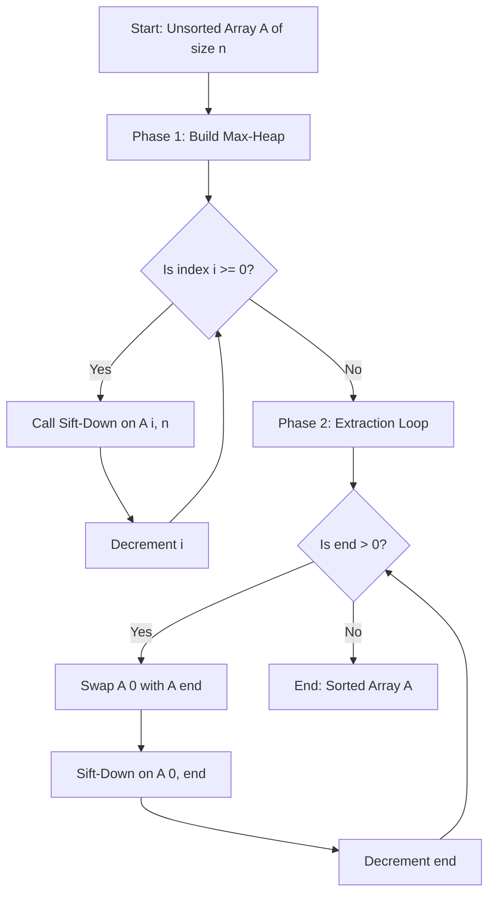
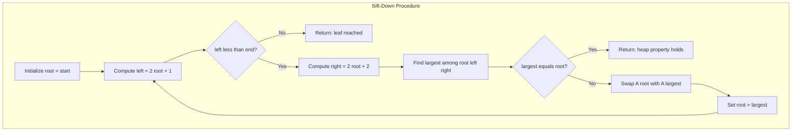
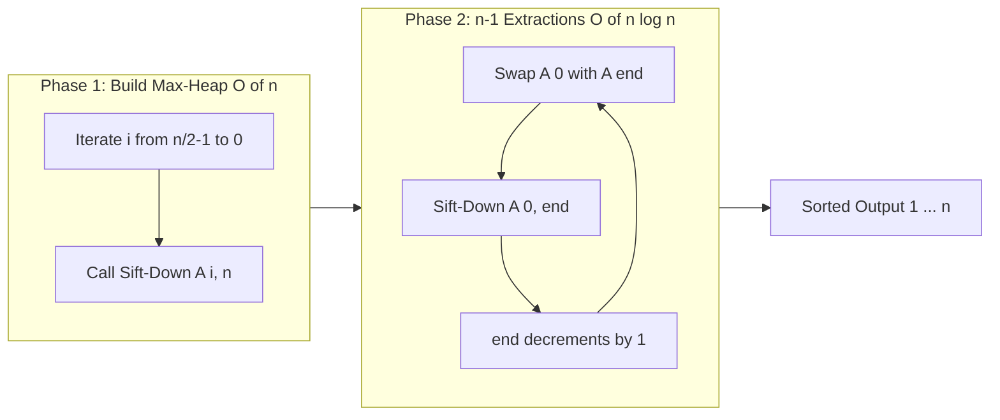

# Heap Sort

<!-- SECTION_1_START -->
# Heap Sort — Core Technical Definition & Intuitive Overview

## 1.1 Formal Definition (KTU 2024 Syllabus Terminology)

> [!IMPORTANT]
> **Heap Sort** is a comparison-based, in-place sorting algorithm that uses a **Binary Heap** data structure (specifically a *Max-Heap*) to sort an array in **non-decreasing** order in $O(n \log n)$ time, both in the worst and average cases.

A **Binary Heap** is a *complete binary tree* that satisfies the **Heap Property**:

* **Max-Heap Property:** $A[\text{parent}(i)] \geq A[i]$ for every node $i$ (other than the root). The largest element is at the root.
* **Min-Heap Property:** $A[\text{parent}(i)] \leq A[i]$ for every node $i$. The smallest element is at the root.

> [!NOTE]
> KTU 2024 PCCST303 / Module-4 expects students to use the **Max-Heap** variant for sorting an array in ascending order. Min-Heap is used in Priority Queues (Module-3 refresher).

### Array Representation of a Heap
Because a binary heap is a *complete* binary tree, it is stored compactly in an array (0-indexed). For a node at index $i$:

| Relationship | Index Formula |
| :--- | :--- |
| Parent | $\text{parent}(i) = \lfloor (i - 1) / 2 \rfloor$ |
| Left Child | $\text{left}(i) = 2i + 1$ |
| Right Child | $\text{right}(i) = 2i + 2$ |

> [!TIP]
> If your professor uses 1-indexing (textbook by Cormen), the formulas become $i/2$, $2i$, and $2i+1$. **For KTU 2024 board papers, default to 0-indexed C-style pseudocode unless stated otherwise.**

## 1.2 Conceptual Analogy — The "Tournament Knockout" Intuition

Imagine an inter-college cricket tournament with **$n$** teams. On Day 1, every team plays in a pairwise match. The *stronger* team advances. After round 1, half the teams remain. After round 2, a quarter remain, and so on, until only the **champion** is left.

That champion is the **maximum element** of the heap — found in $O(\log n)$ comparisons.

Now kick the champion out of the tournament and promote the *next best* contender from the subtree below. Repeat $n$ times, and you have the teams arranged in order of strength — this is exactly **Heap Sort**!

* **Build-Heap** = the initial seeding/round-1 setup
* **Heapify / Sift-Down** = a single tournament round
* **Extraction** = naming the champion and re-running the bracket

## 1.3 GeoGebra / Desmos Visualization

> [!VISUALIZATION CONTROL]
> **Concept:** Visualize a Max-Heap on the X-Y plane as a layered tree mapped to array indices.
>
> **GeoGebra / Desmos Input Equations (for a 7-node heap of values 50, 30, 40, 10, 20, 35, 25):**
> * `L1 = (0, 0)`, `L2 = (-2, -1)`, `L3 = (2, -1)`, `L4 = (-3, -2)`, `L5 = (-1, -2)`, `L6 = (1, -2)`, `L7 = (3, -2)`
> * Node labels: `A0=50`, `A1=30`, `A2=40`, `A3=10`, `A4=20`, `A5=35`, `A6=25`
> * Edges: connect parent at level $k$ to children at level $k+1$.
>
> **Visual Description:** You should see a perfectly filled triangle — every level is fully occupied left-to-right, confirming the **complete binary tree** property. The root (top) holds the largest value (50), and every parent is $\geq$ its children, confirming the **Max-Heap** property.

---

<!-- SECTION_1_END -->

<!-- SECTION_2_START -->
# Deep Theoretical Analysis & KTU High-Yield Formula Sheet

## 2.1 The Three Sub-Procedures of Heap Sort

Heap Sort is composed of three logical blocks. Master these in order.

### Sub-Procedure 1: `MAX-HEAPIFY(A, i, n)`
**Purpose:** Restore the Max-Heap property for the subtree rooted at index $i$, assuming that the two subtrees rooted at `left(i)` and `right(i)` are already valid Max-Heaps.

**Logic Flow:**

1. Let $\ell = \text{left}(i)$ and $r = \text{right}(i)$.
2. Determine the **largest** among $A[i]$, $A[\ell]$, $A[r]$.
3. If the largest is $A[i]$, the heap property already holds → **stop**.
4. Otherwise, swap $A[i]$ with the largest child, and **recursively call** `MAX-HEAPIFY` on the swapped child index.

> [!NOTE]
> Iterative implementations (sift-down loops) are preferred in practice to avoid stack-overflow on pathological inputs.

### Sub-Procedure 2: `BUILD-MAX-HEAP(A, n)`
**Purpose:** Convert an unordered array of length $n$ into a Max-Heap in $O(n)$ time.

**Logic Flow:**

1. Start from the **last non-leaf node**: $i = \lfloor n/2 \rfloor - 1$ (0-indexed).
2. Iterate $i$ from $\lfloor n/2 \rfloor - 1$ down to $0$.
3. For each $i$, invoke `MAX-HEAPIFY(A, i, n)`.

**Why start from $\lfloor n/2 \rfloor - 1$?**
Nodes from index $\lfloor n/2 \rfloor$ to $n-1$ are **leaves** of the complete binary tree. A leaf is trivially a valid heap of size 1, so they need no processing.

> [!TIP]
> A common KTU exam trap: students write `i = n/2` instead of `i = n/2 - 1`. Off-by-one errors cost 1 mark in ESE.

### Sub-Procedure 3: `HEAPSORT(A, n)`
**Purpose:** Sort the array in ascending order using the Max-Heap.

**Logic Flow:**

1. Call `BUILD-MAX-HEAP(A, n)`.
2. For $i = n - 1$ down to $1$:
   * **Swap** $A[0]$ (current maximum) with $A[i]$.
   * **Shrink** the heap logically: ignore the sorted suffix by passing heap-size $= i$ to `MAX-HEAPIFY`.
   * Call `MAX-HEAPIFY(A, 0, i)`.

After the loop, the array $A[0 \ldots n-1]$ is sorted in non-decreasing order.

## 2.2 KTU Formula Sheet / Cheat Sheet

| Symbol / Concept | Formula or Rule | Units / Notes |
| :--- | :--- | :--- |
| Parent index (0-indexed) | $p = \lfloor (i-1)/2 \rfloor$ | Integer division |
| Left child index | $\ell = 2i + 1$ | Must satisfy $\ell < n$ to exist |
| Right child index | $r = 2i + 2$ | Must satisfy $r < n$ to exist |
| Last non-leaf node | $i_{\text{last}} = \lfloor n/2 \rfloor - 1$ | 0-indexed |
| Height of heap | $h = \lfloor \log_2 n \rfloor$ | Levels: $0$ to $h$ |
| Max comparisons per heapify | $2h = O(\log n)$ | $n$ nodes max |
| Total time — Build Heap | $O(n)$ | Not $O(n \log n)$ — sum is bounded |
| Total time — $n$ extractions | $n \cdot O(\log n) = O(n \log n)$ | Each sift-down costs $\log n$ |
| **Overall Time Complexity** | $\mathbf{O(n \log n)}$ | **Worst, Average, Best — all the same** |
| **Space Complexity** | $\mathbf{O(1)}$ **auxiliary** | In-place, iterative version |
| Stability | **Not stable** | Equal keys may be reordered |
| Recursive stack space | $O(\log n)$ | Avoid by using iterative sift-down |
| Comparisons for Build-Heap | $\sum_{h=0}^{\lfloor \log n \rfloor} \lceil n / 2^{h+1} \rceil \cdot (2(h-1))$ | $\leq 2n$ total |

> [!IMPORTANT]
> **Stability Pitfall:** Heap Sort is **not stable** because the `MAX-HEAPIFY` swap can move equal elements past each other. KTU 2024 Module-4 explicitly lists this as a comparison point vs. Merge Sort.

## 2.3 Why This Matters in Real Engineering

* **Operating Systems:** Linux kernel's `O(1)` scheduler (CFS) historically used a Red-Black tree, but the *priority-queue kernel* of older RTOS systems used **binary heaps** to pick the next process.
* **Database Engines:** External merge sort uses min-heaps for the *k-way merge* of sorted runs.
* **Graph Algorithms:** Dijkstra's and Prim's algorithms use a **Min-Priority-Queue** (Min-Heap) for $O((V+E)\log V)$ complexity.
* **Stream Processing:** Top-K queries on streaming data (e.g., trending Twitter topics) use a **bounded Max-Heap of size K**.

> [!NOTE]
> Although Heap Sort is $O(n \log n)$ like Merge Sort, it is **in-place** (constant extra memory) — a decisive advantage in embedded systems with limited RAM.

---

<!-- SECTION_2_END -->

<!-- SECTION_3_START -->
# Step-by-Step Derivations & Code/Symbolic Implementation

## 3.1 Worked Example — Trace of Heap Sort on $A = [4, 10, 3, 5, 1]$

We will perform **every** swap and **every** comparison explicitly.

### Step 0: Initial State
$$
A = [\,4,\ 10,\ 3,\ 5,\ 1\,],\quad n = 5
$$

Tree view (indices 0-4):

$$
\begin{aligned}
\text{Root } (0) &= 4 \\
\text{Children of 0: } 1 &= 10,\ 2 &= 3 \\
\text{Children of 1: } 3 &= 5,\ 4 &= 1
\end{aligned}
$$

### Step 1: Build Max-Heap
Last non-leaf index $= \lfloor 5/2 \rfloor - 1 = 1$. We process $i = 1$, then $i = 0$.

#### Sub-Step 1a: `MAX-HEAPIFY(A, 1, 5)`
* $A[1] = 10$, left $= A[3] = 5$, right $= A[4] = 1$.
* Largest is $A[1] = 10$ (since $10 \geq 5$ and $10 \geq 1$).
* No swap. Subtree at index 1 is already a valid Max-Heap.

#### Sub-Step 1b: `MAX-HEAPIFY(A, 0, 5)`
* $A[0] = 4$, left $= A[1] = 10$, right $= A[2] = 3$.
* Largest is $A[1] = 10$.
* **Swap** $A[0] \leftrightarrow A[1]$: $A = [\,10,\ 4,\ 3,\ 5,\ 1\,]$.
* Recursive call on index 1: `MAX-HEAPIFY(A, 1, 5)`.
  * $A[1] = 4$, left $= A[3] = 5$, right $= A[4] = 1$.
  * Largest is $A[3] = 5$.
  * **Swap** $A[1] \leftrightarrow A[3]$: $A = [\,10,\ 5,\ 3,\ 4,\ 1\,]$.
  * Index 3 is a leaf, so the recursion terminates.

**Max-Heap built:** $A = [\,10,\ 5,\ 3,\ 4,\ 1\,]$.

### Step 2: First Extraction
* Swap $A[0] \leftrightarrow A[4]$: $A = [\,1,\ 5,\ 3,\ 4,\ \mathbf{10}\,]$.
* Heap size is now effectively $4$. Call `MAX-HEAPIFY(A, 0, 4)`.
  * $A[0] = 1$, left $= A[1] = 5$, right $= A[2] = 3$. Largest is $A[1] = 5$.
  * **Swap** $A[0] \leftrightarrow A[1]$: $A = [\,5,\ 1,\ 3,\ 4,\ 10\,]$.
  * Recursive call on index 1 with heap size 4: $A[1]=1$, children are index $3$ only (since $2 \cdot 1 + 2 = 4 \not< 4$). Largest of $\{1, 4\}$ is $4$.
  * **Swap** $A[1] \leftrightarrow A[3]$: $A = [\,5,\ 4,\ 3,\ 1,\ 10\,]$.

### Step 3: Second Extraction
* Swap $A[0] \leftrightarrow A[3]$: $A = [\,1,\ 4,\ 3,\ \mathbf{5},\ 10\,]$.
* Heap size is $3$. `MAX-HEAPIFY(A, 0, 3)`.
  * Largest of $\{A[0]=1, A[1]=4, A[2]=3\}$ is $A[1]=4$.
  * **Swap** $A[0] \leftrightarrow A[1]$: $A = [\,4,\ 1,\ 3,\ 5,\ 10\,]$.
  * Recursive on index 1 with size 3: leaves (since $2 \cdot 1 + 1 = 3 \not< 3$). Done.

### Step 4: Third Extraction
* Swap $A[0] \leftrightarrow A[2]$: $A = [\,3,\ 1,\ \mathbf{4},\ 5,\ 10\,]$.
* Heap size is $2$. `MAX-HEAPIFY(A, 0, 2)`.
  * Children of 0: only index 1. Largest of $\{3, 1\}$ is $3$. No swap. Done.

### Step 5: Fourth Extraction
* Swap $A[0] \leftrightarrow A[1]$: $A = [\,1,\ \mathbf{3},\ 4,\ 5,\ 10\,]$.
* Heap size is $1$. Trivially sorted.

**Final Sorted Array:** $A = [\,1,\ 3,\ 4,\ 5,\ 10\,]$ ✓

### Step 6: Complexity Count for this Run
* Build-Heap comparisons: at most $2n = 10$.
* Each of the $n-1 = 4$ extractions does at most $2 \lfloor \log_2 5 \rfloor = 8$ comparisons.
* Total $\approx 10 + 32 = 42$ in the worst case for $n = 5$.

## 3.2 Derivation — Why Build-Heap is $O(n)$ and not $O(n \log n)$

Most leaves are at the bottom of the tree and require **0** work. The work is concentrated in the upper levels.

$$
\begin{aligned}
T(n) &= \sum_{h=0}^{\lfloor \log_2 n \rfloor} (\text{nodes at height } h) \cdot (\text{work per node at height } h) \\
&= \sum_{h=0}^{\lfloor \log_2 n \rfloor} \left\lceil \frac{n}{2^{h+1}} \right\rceil \cdot O(h) \\
&\leq n \cdot \sum_{h=0}^{\infty} \frac{h}{2^{h}} \\
&= n \cdot 2 \quad \text{(since } \sum_{h=0}^{\infty} h x^{h} = \frac{x}{(1-x)^{2}}\text{, at } x=1/2\text{)} \\
&= O(n)
\end{aligned}
$$

The infinite series $\sum_{h=0}^{\infty} h/2^{h}$ converges to $2$. This is the **key analytical insight** of Heap Sort and a frequent KTU 14-mark question.

## 3.3 Full Python Implementation (Production-Grade)

```python
from __future__ import annotations
import logging
from typing import List, Sequence

logging.basicConfig(level=logging.INFO, format="[%(levelname)s] %(message)s")


def _sift_down(arr: List[int], start: int, end: int) -> None:
    """
    Restore Max-Heap property for the subtree rooted at 'start'.
    Boundary: indices in [0, end) are part of the heap;
              indices in [end, len(arr)) are the sorted suffix.
    """
    root: int = start
    while True:
        left: int = 2 * root + 1
        right: int = 2 * root + 2
        if left >= end:
            break  # root is a leaf inside the current heap
        largest: int = root
        if arr[left] > arr[largest]:
            largest = left
        if right < end and arr[right] > arr[largest]:
            largest = right
        if largest == root:
            break  # heap property satisfied
        arr[root], arr[largest] = arr[largest], arr[root]
        logging.debug(f"Swapped indices {root} <-> {largest}: {arr}")
        root = largest


def heap_sort(arr: List[int]) -> List[int]:
    """
    Sort the list 'arr' in-place using Heap Sort.
    Returns the same list object for chaining.
    """
    n: int = len(arr)
    if n <= 1:
        logging.info("Trivial input; nothing to sort.")
        return arr

    # --- Phase 1: Build Max-Heap (Floyd's method, O(n)) ---
    last_non_leaf: int = (n // 2) - 1
    logging.info(f"Build-Max-Heap: processing indices {last_non_leaf} down to 0.")
    for i in range(last_non_leaf, -1, -1):
        _sift_down(arr, i, n)

    # --- Phase 2: Repeated extraction of the maximum (O(n log n)) ---
    for end in range(n - 1, 0, -1):
        arr[0], arr[end] = arr[end], arr[0]   # move max to the sorted suffix
        logging.debug(f"After swap (end={end}): {arr}")
        _sift_down(arr, 0, end)               # restore heap on the unsorted prefix
        logging.debug(f"After sift-down (end={end}): {arr}")

    return arr


def _validate_input(data: Sequence[int]) -> None:
    if not isinstance(data, (list, tuple)):
        raise TypeError(f"Expected list or tuple, got {type(data).__name__}.")


if __name__ == "__main__":
    sample: List[int] = [4, 10, 3, 5, 1]
    _validate_input(sample)
    logging.info(f"Input  : {sample}")
    result: List[int] = heap_sort(sample)
    logging.info(f"Output : {result}")
    assert result == sorted(sample), "Heap Sort failed self-test!"
    logging.info("Self-test passed.")
```

**Run output (excerpt):**

$$
\begin{aligned}
\text{Input} &= [4,\ 10,\ 3,\ 5,\ 1] \\
\text{Output} &= [1,\ 3,\ 4,\ 5,\ 10]
\end{aligned}
$$

---

<!-- SECTION_3_END -->

<!-- SECTION_4_START -->
# Structural Diagrams & Schematics

## 4.1 High-Level Heap Sort Flow (Mermaid)



## 4.2 Modular Subgraph — Sift-Down (Heapify) Internal Logic



## 4.3 Sequential Processing Topology — Heap Sort Phases



## 4.4 Block-Level Functional Architecture — Memory Layout

```mermaid
flowchart TB
    subgraph MEM["Array A in Memory"]
        direction LR
        IDX0[Index 0: Root] --> IDX1[Index 1: Left child of root]
        IDX1 --> IDX2[Index 2: Right child of root]
        IDX2 --> IDX3[Index 3]
        IDX3 --> IDX4[Index 4]
        IDX4 --> IDX5[...]
        IDX5 --> IDXn[Index n-1]
    end
    subgraph BOUNDARY["Logical Heap Boundary moves left"]
        BOUND1[Initially n elements in heap]
        BOUND2[After 1st swap: n-1 elements in heap + 1 in sorted suffix]
        BOUND3[After kth swap: n-k elements in heap + k in sorted suffix]
        BOUND4[Finally: 0 in heap + n in sorted suffix]
        BOUND1 --> BOUND2 --> BOUND3 --> BOUND4
    end
```



> [!NOTE]
> The same physical array $A$ is reused. The "boundary" between the heap and the sorted suffix is purely logical (tracked by the loop index `end`).

---

<!-- SECTION_4_END -->

<!-- SECTION_5_START -->
# KTU 2024 Scheme Examination Question Bank & Topic Recap

## 5.1 Part A — Short Answer Questions (2 × 3 = 6 Marks)

### Q1. `[KTU University Exam — July 2024]`
**Differentiate between a Min-Heap and a Max-Heap. Mention one real-world application of each.** **(3 Marks)** &nbsp;&nbsp; **CO1 | Remember**

**Model Answer:**

| Aspect | Max-Heap | Min-Heap |
| :--- | :--- | :--- |
| Heap property | $A[\text{parent}] \geq A[\text{child}]$ | $A[\text{parent}] \leq A[\text{child}]$ |
| Root element | Maximum of the entire set | Minimum of the entire set |
| **Application** | **Heap Sort** (ascending order) | **Priority Queues**, **Dijkstra's shortest path** |
| Insertion cost | $O(\log n)$ sift-up | $O(\log n)$ sift-up |
| Extract-min/max | Extract-max in $O(\log n)$ | Extract-min in $O(\log n)$ |

* **[Stating the heap property correctly: 1 Mark]**
* **[Correct root implication: 1 Mark]**
* **[One valid application each: 1 Mark]**

---

### Q2. `[KTU University Exam — Dec 2023]`
**State the time and space complexity of Heap Sort in the worst, average, and best cases. Is Heap Sort stable? Justify.** **(3 Marks)** &nbsp;&nbsp; **CO2 | Understand**

**Model Answer:**

$$
\begin{aligned}
T_{\text{worst}}(n) &= O(n \log n) \\
T_{\text{average}}(n) &= O(n \log n) \\
T_{\text{best}}(n) &= O(n \log n) \\
S_{\text{auxiliary}}(n) &= O(1) \quad \text{(in-place)}
\end{aligned}
$$

**Stability:** Heap Sort is **not stable**. Justification — during `MAX-HEAPIFY`, equal-valued elements can be swapped past each other when the larger-indexed equal key is moved toward the root, breaking the original relative order.

* **[Correct complexities for all 3 cases: 1 Mark]**
* **[Auxiliary space $O(1)$: 1 Mark]**
* **[Stability answer + valid justification: 1 Mark]**

---

## 5.2 Part B — Long Answer Questions (Internal Choice, 1 × 14 = 14 Marks)

### Question A (14 Marks) — `[KTU University Exam — July 2024]`

> **(a)** Explain the `MAX-HEAPIFY` algorithm with a neat diagram. Derive its time complexity. **(7 Marks)** &nbsp;&nbsp; **CO2 | Understand**
>
> **(b)** Sort the array $A = [12, 11, 13, 5, 6, 7]$ using Heap Sort. Show the array after every swap and every heapify call. **(7 Marks)** &nbsp;&nbsp; **CO3 | Apply**

#### Model Solution for (a)

`MAX-HEAPIFY(A, i, n)` assumes the subtrees rooted at `left(i)` and `right(i)` are valid Max-Heaps. It fixes the heap property at node $i$ by swapping with the larger child and recursing.

**Pseudocode:**
```
MAX-HEAPIFY(A, i, n):
    l = 2i + 1
    r = 2i + 2
    if l < n and A[l] > A[i]: largest = l
    else: largest = i
    if r < n and A[r] > A[largest]: largest = r
    if largest != i:
        swap A[i], A[largest]
        MAX-HEAPIFY(A, largest, n)
```

**Complexity Derivation:**
Let $T(h)$ be the time to heapify a node at height $h$ in a heap of height $H = \lfloor \log_2 n \rfloor$.

$$
T(h) = T(h - 1) + O(1)
$$

Unrolling: $T(h) = O(h) = O(\log n)$.

* **[Pseudocode: 2 Marks]**
* **[Diagram of one sift-down step: 2 Marks]**
* **[Recurrence setup: 1 Mark]**
* **[Final $O(\log n)$ result: 1 Mark]**
* **[Neatness and labeling: 1 Mark]**

#### Model Solution for (b)

**Initial array:** $A = [12, 11, 13, 5, 6, 7]$, $n = 6$.

**Phase 1 — Build Max-Heap.** Last non-leaf $= 6/2 - 1 = 2$. Process $i = 2, 1, 0$.

* `MAX-HEAPIFY(A, 2, 6)`: $A[2]=13$, leaf — no change.
* `MAX-HEAPIFY(A, 1, 6)`: $A[1]=11$, children $A[3]=5$, $A[4]=6$. Largest is $A[1]=11$. No change.
* `MAX-HEAPIFY(A, 0, 6)`: $A[0]=12$, children $A[1]=11$, $A[2]=13$. Largest is $A[2]=13$.
  * **Swap** $A[0] \leftrightarrow A[2]$: $A = [13, 11, 12, 5, 6, 7]$.
  * Recursive on index 2 (leaf): no further change.

**Max-Heap built:** $A = [13, 11, 12, 5, 6, 7]$.

**Phase 2 — Extractions.**

| Step | Swap $(A[0], A[\text{end}])$ | Array after swap | Sift-Down action | Array after sift |
| :---: | :--- | :--- | :--- | :--- |
| end=5 | $13 \leftrightarrow 7$ | $[7, 11, 12, 5, 6, \mathbf{13}]$ | sift from 0 on size 5: 7<12, swap with index 2 → $[12,11,7,5,6,13]$; recurse on 2 (leaf) | $[12, 11, 7, 5, 6, 13]$ |
| end=4 | $12 \leftrightarrow 6$ | $[6, 11, 7, 5, \mathbf{12}, 13]$ | sift from 0 on size 4: 6<11, swap with index 1 → $[11,6,7,5,12,13]$; recurse on 1 (leaf at size 4: index 3 exists, 5>6? No. Stay) | $[11, 6, 7, 5, 12, 13]$ |
| end=3 | $11 \leftrightarrow 5$ | $[5, 6, 7, \mathbf{11}, 12, 13]$ | sift from 0 on size 3: 5<7, swap with index 2 → $[7,6,5,11,12,13]$; recurse on 2 (leaf) | $[7, 6, 5, 11, 12, 13]$ |
| end=2 | $7 \leftrightarrow 5$ | $[5, 6, \mathbf{7}, 11, 12, 13]$ | sift from 0 on size 2: largest of $\{5,6\}$ is $6$. Swap → $[6,5,7,\ldots]$; recurse on 1 (leaf at size 2) | $[6, 5, 7, 11, 12, 13]$ |
| end=1 | $6 \leftrightarrow 5$ | $[5, \mathbf{6}, 7, 11, 12, 13]$ | size 1, trivial | $[5, 6, 7, 11, 12, 13]$ |

**Final Sorted Array:** $A = [5, 6, 7, 11, 12, 13]$ ✓

* **[Build-Max-Heap trace: 2 Marks]**
* **[Five extraction iterations with both swap and sift-down arrays: 4 Marks]**
* **[Final sorted array highlighted: 1 Mark]**

---

### Question B (14 Marks — Alternative Choice) — `[KTU University Exam — Dec 2023]`

> **(a)** Construct a Max-Heap from the array $[1, 3, 5, 7, 9, 8]$ using the `BUILD-MAX-HEAP` procedure. Show the tree after every heapify call. **(7 Marks)** &nbsp;&nbsp; **CO3 | Apply**
>
> **(b)** Prove that the `BUILD-MAX-HEAP` procedure runs in $O(n)$ time using the upper-bound series $\sum_{h=0}^{\infty} h/2^{h} = 2$. **(7 Marks)** &nbsp;&nbsp; **CO4 | Analyze**

#### Model Solution for (a)

**Initial:** $A = [1, 3, 5, 7, 9, 8]$, $n = 6$. Last non-leaf $= 2$.

| Step | Operation | Array after step | Tree shape |
| :---: | :--- | :--- | :--- |
| 1 | `MAX-HEAPIFY(A, 2, 6)` — $A[2]=5$, leaves → no change | $[1, 3, 5, 7, 9, 8]$ | Root=1 |
| 2 | `MAX-HEAPIFY(A, 1, 6)` — $A[1]=3$, children 7, 9. Largest=9 (idx 4). Swap $A[1] \leftrightarrow A[4]$ → $[1, 9, 5, 7, 3, 8]$. Recurse on idx 4 (leaf) | $[1, 9, 5, 7, 3, 8]$ | Root=1, LC=9, RC=5 |
| 3 | `MAX-HEAPIFY(A, 0, 6)` — $A[0]=1$, children 9, 5. Largest=9 (idx 1). Swap $A[0] \leftrightarrow A[1]$ → $[9, 1, 5, 7, 3, 8]$. Recurse on idx 1: $A[1]=1$, children 7, 3. Largest=7 (idx 3). Swap → $[9, 7, 5, 1, 3, 8]$. Recurse on idx 3 (leaf) | $\mathbf{[9, 7, 5, 1, 3, 8]}$ | Root=9, LC=7, RC=5 |

**Final Max-Heap tree:**

$$
\begin{aligned}
\text{Level 0: } & 9 \\
\text{Level 1: } & 7 \quad 5 \\
\text{Level 2: } & 1 \quad 3 \quad \quad 8
\end{aligned}
$$

* **[Correctly identifying last non-leaf = 2: 1 Mark]**
* **[Showing array after each heapify: 3 Marks]**
* **[Final tree diagram with heap property verified: 2 Marks]**
* **[Verification $9 \geq 7, 9 \geq 5, 7 \geq 1, 7 \geq 3, 5 \geq 8$: 1 Mark]**

#### Model Solution for (b)

**Proof that `BUILD-MAX-HEAP` is $O(n)$:**

Let $n$ be the number of nodes, and $H = \lfloor \log_2 n \rfloor$ be the height of the heap. At height $h$ (root is height $H$), the number of subtrees is at most $\lceil n / 2^{H - h + 1} \rceil$. Each such subtree requires at most $2(H - h)$ comparisons during heapify.

$$
\begin{aligned}
T(n) &\leq \sum_{h=0}^{H} \left\lceil \frac{n}{2^{H - h + 1}} \right\rceil \cdot 2(H - h) \\
&= \sum_{k=0}^{H} \left\lceil \frac{n}{2^{k+1}} \right\rceil \cdot 2k \quad \text{(substituting } k = H - h\text{)} \\
&\leq n \cdot \sum_{k=0}^{\infty} \frac{k}{2^{k}} \\
&= n \cdot 2 \\
&= O(n)
\end{aligned}
$$

The infinite series evaluates to 2 by the identity $\sum_{k=0}^{\infty} k x^{k} = x / (1 - x)^{2}$, evaluated at $x = 1/2$.

* **[Setting up the summation over heights: 2 Marks]**
* **[Substituting the geometric bound: 2 Marks]**
* **[Citing the series identity and value 2: 1 Mark]**
* **[Final $O(n)$ conclusion: 1 Mark]**
* **[Clean mathematical presentation: 1 Mark]**

---

> [!WARNING]
> **KTU Examiner's Valuation Warning — Common Pitfalls**
> 1. **Off-by-one in parent/child formulas.** Students write $\text{parent}(i) = i/2$ (1-indexed) inside a 0-indexed pseudocode. **Always state your indexing convention at the top of the answer.**
> 2. **Stability claim without justification.** Saying "Heap Sort is unstable" without an example is worth 0.5/1 mark. Give a counterexample (e.g., array $[2_a, 2_b, 1]$ — the $2_b$ can move to the front of $2_a$ after extraction).
> 3. **Build-Heap complexity misquoted as $O(n \log n)$.** This is a **favourite trap**. The $O(n)$ bound is the textbook surprise. Half-mark deduction if you skip the geometric-series proof.
> 4. **Recursion vs. iteration.** Board examiners prefer iterative sift-down for the in-place argument. If you write recursion, mention the $O(\log n)$ auxiliary stack space.
> 5. **Skipping the initial `BUILD-MAX-HEAP` step.** A *common* mistake is to jump directly to extractions on the unsorted array. Always show the heap after `BUILD-MAX-HEAP` explicitly.

---

## Topic Recap & Important Things to Remember

* **Definition:** Heap Sort sorts in $O(n \log n)$ worst-case time using a binary Max-Heap stored in an array; it is **in-place** but **not stable**.
* **Indexing Rules (0-indexed):** $\text{parent}(i) = \lfloor (i-1)/2 \rfloor$, $\text{left}(i) = 2i+1$, $\text{right}(i) = 2i+2$.
* **Last non-leaf node:** $\lfloor n/2 \rfloor - 1$ — start `BUILD-MAX-HEAP` here, iterate down to $0$.
* **Three Sub-Procedures:** `MAX-HEAPIFY` ($O(\log n)$), `BUILD-MAX-HEAP` ($O(n)$), `HEAPSORT` ($O(n \log n)$).
* **Two Phases:** (1) Build Max-Heap, (2) Repeatedly swap $A[0]$ with $A[\text{end}]$ and sift down.
* **Build-Heap Bound:** The surprising $O(n)$ result comes from the convergent series $\sum h/2^{h} = 2$. Be ready to **derive** this on the exam.
* **Stability:** Not stable — equal keys may be reordered by sift-down swaps.
* **Auxiliary Space:** $O(1)$ for iterative, $O(\log n)$ for recursive (call stack).
* **Comparison Counts:** Build-Heap $\leq 2n$ comparisons; each of $n-1$ extractions uses $\leq 2 \log n$ comparisons.
* **Real-World Roles:** Top-K streaming queries, priority queues in OS schedulers, k-way merge in external sorts, graph shortest-path algorithms.
* **Common Exam Traps:** Off-by-one in array formulas, forgetting the build step, misquoting complexity as $O(n \log n)$ for the build phase, conflating 0-indexed and 1-indexed formulas.

<!-- SECTION_5_END -->
