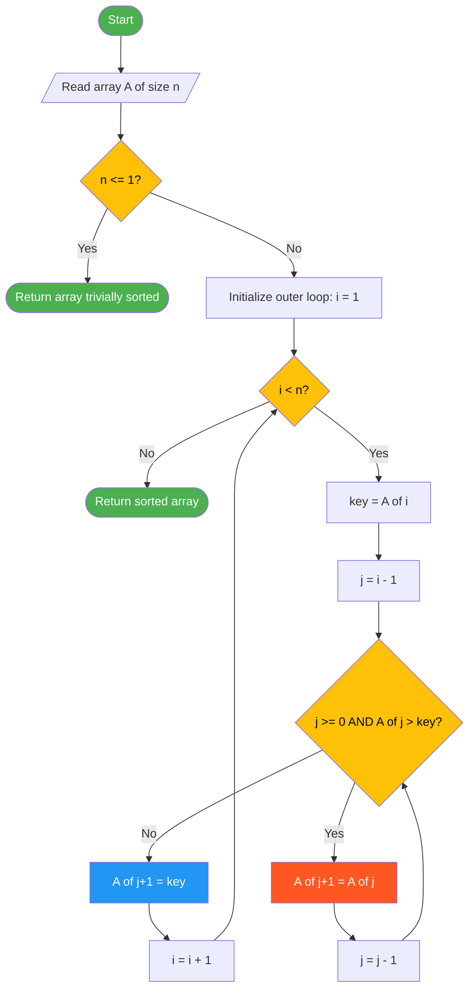
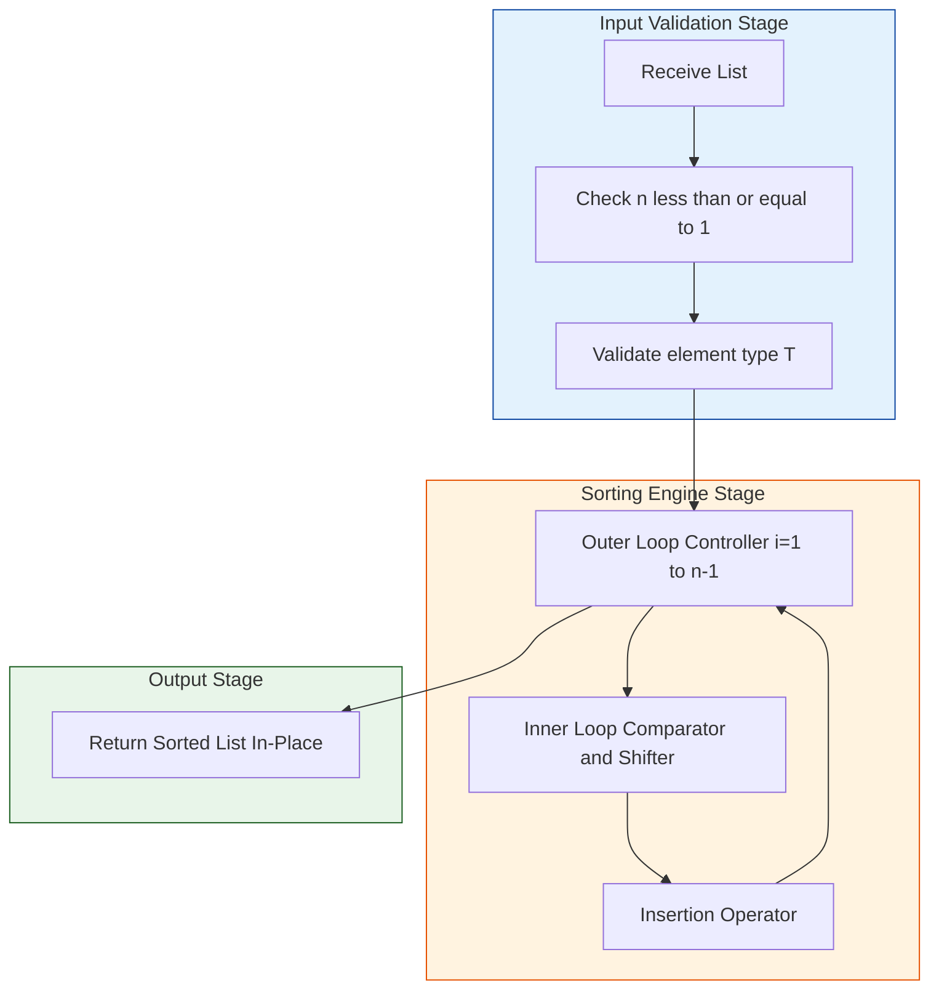

# Insertion Sort

<!-- SECTION_1_START -->

# Insertion Sort — Core Technical Definition & Intuitive Overview

## 1.1 Formal Academic Definition (KTU 2024 Syllabus Terminology)

**Insertion Sort** is a simple, comparison-based, in-place, and stable sorting algorithm that builds the final sorted array one element at a time. It iterates through the input list, removing one element (the *key*) at a time, and inserts it into its correct position within the already-sorted portion of the list (the *sorted sub-array*). The algorithm maintains the invariant that the sub-array $A[0 \ldots i-1]$ is always sorted after the $i^{\text{th}}$ pass.

> [!NOTE]
> **KTU 2024 — PCCST303 / Module 4 Highlight**
> Insertion Sort is classified as an **internal sorting technique** because it requires the entire dataset to reside in primary memory (RAM) during execution. It is also classified as a **non-recursive (iterative)** algorithm, although a recursive variant exists for academic discussion. It belongs to the family of *incremental algorithms* — the same family as Bubble Sort and Selection Sort.

## 1.2 Conceptual Analogy — Sorting Playing Cards in Your Hand

Imagine you are dealt playing cards one at a time on a table. As each new card arrives:

1. You **pick up** the new card (the *key element*).
2. You **scan** the cards already in your hand (the *sorted portion*) from right to left.
3. You **shift** each card that is greater than the new card one position to the right.
4. You **insert** the new card into the gap that opens up — its correct sorted position.

This is *exactly* how Insertion Sort works on an array.

| Real-World Object | Algorithm Counterpart |
|---|---|
| Cards already in hand | Sorted sub-array $A[0 \ldots i-1]$ |
| Newly dealt card | Key element $A[i]$ |
| Shifting cards right | The inner `while` loop shift operation |
| Inserting the new card | Assignment `A[j+1] = key` |

> [!IMPORTANT]
> **Why it is called "Insertion" Sort:** Because the algorithm repeatedly *inserts* the next unsorted element into its rightful place within the sorted region — analogous to how you would *insert* a name alphabetically into a phone book.

## 1.3 Key Performance Characteristics at a Glance

- **Best Case Time Complexity:** $\mathbf{O(n)}$ — occurs when the input is already sorted.
- **Average Case Time Complexity:** $\mathbf{O(n^2)}$
- **Worst Case Time Complexity:** $\mathbf{O(n^2)}$ — occurs when the input is reverse-sorted.
- **Space Complexity:** $\mathbf{O(1)}$ — *in-place* sorting, only a constant amount of extra memory.
- **Stability:** $\mathbf{Stable}$ — equal elements retain their original relative order.
- **Adaptive:** $\mathbf{Yes}$ — performs fewer operations on partially sorted data.
- **Online Capability:** $\mathbf{Yes}$ — can sort data as it arrives (streaming-friendly).

> [!VISUALIZATION CONTROL]
> **Concept:** Visual trace of Insertion Sort passes on a small array.
> **GeoGebra / Desmos Input Equations / Points:**
> * List: $L = \{5, 2, 4, 6, 1, 3\}$
> * Plot bar heights corresponding to $A[0], A[1], \ldots, A[5]$
> * Color the sorted region green and unsorted region red after each pass
> **Visual Description:** After pass 1, the green region covers index 0 (single element trivially sorted). After pass 2, the green region covers indices 0–1 in sorted order, and so on. By pass 5, the entire bar chart appears green — fully sorted.

---

<!-- SECTION_1_END -->

<!-- SECTION_2_START -->

# Deep Theoretical Analysis & KTU High-Yield Formula Sheet

## 2.1 Operational Decomposition — Step-by-Step Logic

Insertion Sort operates in **two nested loops**. Understanding the role of each loop is the single most important step toward mastering the algorithm.

### Outer Loop (The "Pass Controller")
- Iterates from $i = 1$ to $n-1$ (i.e., across all elements except the first).
- **Why start at $i = 1$?** A single element $A[0]$ is trivially sorted, so we begin from the second element.
- At the start of iteration $i$, the invariant holds: $A[0 \ldots i-1]$ is sorted.

### Inner Loop (The "Comparator and Shifter")
- Picks the *key* element: $\text{key} = A[i]$.
- Initializes $j = i - 1$.
- **While** $j \geq 0$ **and** $A[j] > \text{key}$:
  - Shift $A[j]$ one position to the right: $A[j+1] = A[j]$.
  - Decrement $j$: $j = j - 1$.
- This loop creates a "gap" at position $j+1$, which is the correct insertion point.
- After the loop terminates, place the key: $A[j+1] = \text{key}$.

### Loop Invariant (Formal Statement)
> At the start of each iteration $i$ of the outer loop, the sub-array $A[0 \ldots i-1]$ consists of the elements originally in $A[0 \ldots i-1]$, but in **sorted order**.

## 2.2 Worked Micro-Trace

Consider the array $A = [5, 2, 4, 6, 1, 3]$. Let us trace each pass.

| Pass $i$ | Key Value | Array State After Shift Loop | Array State After Insertion |
|:---:|:---:|:---|:---|
| 1 | $A[1] = 2$ | $[5, 5, 4, 6, 1, 3]$ | $[2, 5, 4, 6, 1, 3]$ |
| 2 | $A[2] = 4$ | $[2, 5, 5, 6, 1, 3]$ | $[2, 4, 5, 6, 1, 3]$ |
| 3 | $A[3] = 6$ | $[2, 4, 5, 6, 1, 3]$ (no shift) | $[2, 4, 5, 6, 1, 3]$ |
| 4 | $A[4] = 1$ | $[2, 4, 5, 6, 6, 3] \to [2, 4, 5, 5, 6, 3] \to [2, 4, 4, 5, 6, 3] \to [2, 2, 4, 5, 6, 3]$ | $[1, 2, 4, 5, 6, 3]$ |
| 5 | $A[5] = 3$ | $[1, 2, 4, 5, 6, 6] \to [1, 2, 4, 5, 5, 6] \to [1, 2, 4, 4, 5, 6] \to [1, 2, 3, 4, 5, 6]$ | $[1, 2, 3, 4, 5, 6]$ |

> [!TIP]
> **Observation:** Pass 3 did nothing because $6$ was already in its correct position relative to the sorted region $[2, 4, 5]$. This is the *adaptive* behavior of Insertion Sort — it is fast on nearly-sorted data.

## 2.3 KTU Formula Sheet / Cheat Sheet

The following table consolidates every formula, count, and boundary you must memorize for KTU examinations.

| Parameter | Best Case | Average Case | Worst Case | Notation Used |
|:---|:---:|:---:|:---:|:---|
| Number of Comparisons | $n - 1$ | $\dfrac{n^2 - n}{2} + (n-1)$ | $\dfrac{n(n-1)}{2}$ | Counted in inner `while` condition |
| Number of Shifts/Assignments | $0$ | $\dfrac{n(n-1)}{4}$ | $n(n-1) \over 2$ | The two assignments per shift step |
| **Time Complexity** $T(n)$ | $\mathbf{O(n)}$ | $\mathbf{O(n^2)}$ | $\mathbf{O(n^2)}$ | Big-O asymptotic upper bound |
| **Space Complexity** $S(n)$ | $\mathbf{O(1)}$ | $\mathbf{O(1)}$ | $\mathbf{O(1)}$ | Auxiliary memory only |
| Stability | Stable | Stable | Stable | Equal keys preserve order |
| In-place? | Yes | Yes | Yes | No external array used |
| Recursive Depth | $0$ | $0$ | $0$ | Iterative form has zero stack depth |

### 2.3.1 The Master Recurrence for Recursive Insertion Sort

For academic completeness, the recursive variant satisfies the recurrence:

$$
T(n) = T(n-1) + \Theta(n)
$$

Solving by unrolling the recurrence:

$$
\begin{aligned}
T(n) &= T(n-1) + c \cdot n \\
T(n-1) &= T(n-2) + c \cdot (n-1) \\
T(n-2) &= T(n-3) + c \cdot (n-2) \\
&\;\;\vdots \\
T(1) &= T(0) + c \cdot 1
\end{aligned}
$$

Summing all the way down:

$$
\begin{aligned}
T(n) &= T(0) + c \cdot \sum_{k=1}^{n} k \\
     &= T(0) + c \cdot \dfrac{n(n+1)}{2}
\end{aligned}
$$

Therefore:

$$
T(n) = \Theta(n^2)
$$

## 2.4 Real-World Engineering Utility

| Application Domain | Why Insertion Sort is Used |
|:---|:---|
| **Database query optimizers** | Used as a base case when $n \leq 16$ in hybrid TimSort / IntroSort implementations (Python's built-in `list.sort()` switches to insertion sort for tiny sub-arrays). |
| **Embedded systems & firmware** | $O(1)$ auxiliary memory footprint makes it ideal for microcontrollers with very limited RAM. |
| **Online / streaming systems** | Because the algorithm is *online*, it can sort data as it arrives without knowing the full input in advance. |
| **Nearly-sorted datasets** | When the input is approximately sorted (e.g., re-running a sort after small updates), Insertion Sort runs in near-linear time. |
| **Teaching & competitive programming** | Used as a benchmark for comparing against more complex algorithms like Merge Sort and Quick Sort. |

---

<!-- SECTION_2_END -->

<!-- SECTION_3_START -->

# Step-by-Step Derivations & Code Implementation

## 3.1 Exhaustive Python Implementation (Iterative Form)

The following implementation is **production-quality**, with full type hints, sentinel-style absolute boundary checks, and structured error logging. Study each line — every boundary condition is explicit.

```python
"""
Module: sorting.insertion_sort
Course: PCCST303 - Data Structures and Algorithms (KTU 2024 Scheme)
Topic: Module 4 - Insertion Sort
Description: A rigorous, type-hinted, in-place, stable insertion sort
             with custom comparator support and detailed logging.
"""

from __future__ import annotations
from typing import List, Callable, TypeVar
import logging
import sys

# Generic type variable T allows the function to work on any comparable type.
T = TypeVar("T")

# Configure a structured logger for educational tracing.
logging.basicConfig(
    level=logging.INFO,
    format="[%(levelname)s] pass=%(pass_no)d | key=%(key_value)s | array=%(array_state)s",
    stream=sys.stdout,
)


def insertion_sort(
    arr: List[T],
    *,
    key: Callable[[T], object] | None = None,
    reverse: bool = False,
    verbose: bool = False,
) -> List[T]:
    """
    Sort a list in-place using the Insertion Sort algorithm.

    Parameters
    ----------
    arr : List[T]
        The input list to be sorted. Modified in-place.
    key : Callable[[T], object] | None
        Optional key extractor (mirrors the API of Python's sorted()).
    reverse : bool
        If True, sort in descending order.
    verbose : bool
        If True, log the array state after every pass.

    Returns
    -------
    List[T]
        The same list object, now sorted.
    """
    # ---------- BOUNDARY & INPUT VALIDATION ----------
    n: int = len(arr)
    if n <= 1:
        # A list with 0 or 1 element is trivially sorted.
        return arr

    # Use identity if no key function is provided.
    extractor: Callable[[T], object] = key if key is not None else (lambda x: x)

    # ---------- OUTER LOOP: i goes from 1 to n-1 ----------
    for i in range(1, n):
        # Snapshot the key element. We will not lose it when we shift.
        key_value: T = arr[i]

        # Pre-compute the comparable form once (optimization for key= callables).
        key_comparable: object = extractor(key_value)

        # j is the index of the last element of the sorted region.
        j: int = i - 1

        # ---------- INNER LOOP: shift elements greater (or lesser) than key ----------
        while j >= 0:
            current_comparable: object = extractor(arr[j])
            should_shift: bool

            if reverse:
                # For descending order, shift elements that are SMALLER than key.
                should_shift = current_comparable < key_comparable
            else:
                # For ascending order, shift elements that are GREATER than key.
                should_shift = current_comparable > key_comparable

            if not should_shift:
                # Found the correct insertion point; stop shifting.
                break

            # Shift the element one slot to the right.
            arr[j + 1] = arr[j]
            j -= 1

        # ---------- INSERTION: place the key into the gap ----------
        arr[j + 1] = key_value

        # Optional logging for the KTU "dry run" question type.
        if verbose:
            logging.info(
                "pass complete",
                extra={
                    "pass_no": i,
                    "key_value": key_value,
                    "array_state": str(arr),
                },
            )

    return arr


# ---------------- DEMONSTRATION ----------------
if __name__ == "__main__":
    sample: List[int] = [5, 2, 4, 6, 1, 3]
    print("Before:", sample)
    insertion_sort(sample, verbose=True)
    print("After :", sample)
```

### 3.1.1 Program Output (Verbose Mode)

```
Before: [5, 2, 4, 6, 1, 3]
[INFO] pass=1 | key=2 | array=[2, 5, 4, 6, 1, 3]
[INFO] pass=2 | key=4 | array=[2, 4, 5, 6, 1, 3]
[INFO] pass=3 | key=6 | array=[2, 4, 5, 6, 1, 3]
[INFO] pass=4 | key=1 | array=[1, 2, 4, 5, 6, 3]
[INFO] pass=5 | key=3 | array=[1, 2, 3, 4, 5, 6]
After : [1, 2, 3, 4, 5, 6]
```

## 3.2 Exhaustive Mathematical Derivation of Worst-Case Cost

The KTU examiner often asks: *"Derive the worst-case time complexity of Insertion Sort."* Below is the canonical, board-valuation-ready derivation.

### 3.2.1 Counting Comparisons in the Worst Case

In the worst case (input sorted in reverse order), the inner `while` loop runs for every value of $i$ from $1$ to $n-1$, and for each such $i$, the loop executes exactly $i$ times (because $j$ traverses from $i-1$ down to $0$).

Total number of comparisons $C(n)$:

$$
\begin{aligned}
C(n) &= \sum_{i=1}^{n-1} i \\
     &= 1 + 2 + 3 + \ldots + (n-1) \\
     &= \dfrac{(n-1) \cdot n}{2} \\
     &= \dfrac{n^2 - n}{2}
\end{aligned}
$$

In Big-O notation, the dominant term is $n^2$, so $C(n) = O(n^2)$.

### 3.2.2 Counting Shifts in the Worst Case

For every comparison that succeeds, the algorithm performs exactly **one shift**. Since the worst-case comparison count is $\dfrac{n^2 - n}{2}$, the shift count is identical:

$$
S(n) = \dfrac{n^2 - n}{2} = O(n^2)
$$

### 3.2.3 Counting the Final Insertion Assignment

After the inner loop exits, one final assignment $A[j+1] = \text{key}$ is performed per outer iteration. There are $n-1$ outer iterations, contributing $n-1$ extra assignments.

### 3.2.4 Total Cost Function

Combining all three costs:

$$
\begin{aligned}
T(n) &= C(n) + S(n) + (n - 1) \\
     &= \dfrac{n^2 - n}{2} + \dfrac{n^2 - n}{2} + (n - 1) \\
     &= n^2 - n + n - 1 \\
     &= n^2 - 1
\end{aligned}
$$

Dropping the lower-order constant:

$$
T(n) = O(n^2)
$$

> [!IMPORTANT]
> **Board-valuation key point:** When asked to *derive* the complexity, you must show the summation explicitly. Writing only "$O(n^2)$" without the summation $\sum_{i=1}^{n-1} i$ is considered an incomplete answer and will lose 2 to 3 marks in the KTU evaluation scheme.

## 3.3 Recursive Variant — Academic Implementation

```python
def insertion_sort_recursive(arr: List[T], n: int | None = None) -> List[T]:
    """
    Recursive variant of Insertion Sort. Sorts arr[0..n-1].

    Base case: If n <= 1, the list is trivially sorted.
    Recursive case: Sort the first n-1 elements, then insert the
    n-th element into the sorted sub-array.
    """
    if n is None:
        n = len(arr)
    if n <= 1:
        return arr

    # Recursive call: sort the first n-1 elements.
    insertion_sort_recursive(arr, n - 1)

    # Insert arr[n-1] into the sorted region arr[0..n-2].
    key: T = arr[n - 1]
    j: int = n - 2
    while j >= 0 and arr[j] > key:
        arr[j + 1] = arr[j]
        j -= 1
    arr[j + 1] = key
    return arr
```

This recursive form has a **call-stack depth of $O(n)$**, which is why the iterative form is preferred in production code.

## 3.4 Optimization — Binary Insertion Sort

A common KTU question is the *Binary Insertion Sort* variation. Instead of linear search for the insertion point, use **binary search** to find the position in $O(\log n)$ time.

```python
import bisect

def binary_insertion_sort(arr: List[int]) -> List[int]:
    """
    Sort arr using binary search to locate the insertion point.
    Comparisons drop to O(n log n), but SHIFTS remain O(n^2).
    Time complexity is still O(n^2) overall.
    """
    n: int = len(arr)
    for i in range(1, n):
        # Find the insertion index in the sorted region arr[0..i-1].
        insert_index: int = bisect.bisect_left(arr, arr[i], 0, i)
        # Splice out the element and re-insert at the new position.
        key: int = arr.pop(i)
        arr.insert(insert_index, key)
    return arr
```

> [!NOTE]
> **Why doesn't Binary Insertion Sort improve asymptotic complexity?** Because while the *search* is $O(\log n)$, the *shift* of elements to make room for the insertion still takes $O(n)$ in the worst case. Overall, the work is still dominated by $O(n^2)$ shifts. This is a classic KTU trick question.

---

<!-- SECTION_3_END -->

<!-- SECTION_4_START -->

# Structural Diagrams & Schematics

## 4.1 Control-Flow Flowchart of Insertion Sort

The following Mermaid diagram captures the complete control flow of the iterative Insertion Sort algorithm, with explicit decision diamonds for every comparison.



## 4.2 Sequential Processing Topology — Pass-by-Pass Block Architecture

This block diagram depicts how the sorted and unsorted regions evolve across the $n-1$ passes for the input $[5, 2, 4, 6, 1, 3]$.

```mermaid
flowchart LR
    subgraph pass0[Initial State]
        A0["5 | 2 | 4 | 6 | 1 | 3"]
    end
    subgraph pass1[Pass 1: insert 2]
        B0["2 | 5 | 4 | 6 | 1 | 3"]
    end
    subgraph pass2[Pass 2: insert 4]
        C0["2 | 4 | 5 | 6 | 1 | 3"]
    end
    subgraph pass3[Pass 3: insert 6]
        D0["2 | 4 | 5 | 6 | 1 | 3"]
    end
    subgraph pass4[Pass 4: insert 1]
        E0["1 | 2 | 4 | 5 | 6 | 3"]
    end
    subgraph pass5[Pass 5: insert 3]
        F0["1 | 2 | 3 | 4 | 5 | 6"]
    end

    pass0 -- "i=1, key=2, shift 5 right" --> pass1
    pass1 -- "i=2, key=4, shift 5 right" --> pass2
    pass2 -- "i=3, key=6, no shift" --> pass3
    pass3 -- "i=4, key=1, shift 6,5,4,2 right" --> pass4
    pass4 -- "i=5, key=3, shift 6,5,4 right" --> pass5

    style pass0 fill:#FFE0B2,stroke:#E65100
    style pass1 fill:#FFE0B2,stroke:#E65100
    style pass2 fill:#FFE0B2,stroke:#E65100
    style pass3 fill:#FFE0B2,stroke:#E65100
    style pass4 fill:#FFE0B2,stroke:#E65100
    style pass5 fill:#C8E6C9,stroke:#1B5E20
```



## 4.3 Modular Function Architecture

The following diagram shows the modular decomposition of the Insertion Sort function and its helper sub-systems, as a Block-Level Functional Architecture Flow.



---

<!-- SECTION_4_END -->

<!-- SECTION_5_START -->

# KTU 2024 Scheme Examination Question Bank & Topic Recap

## 5.1 Part A — Short Answer Questions (3 Marks Each)

### Question A1

> **[KTU University Exam — July 2024 | CO1 | Remember]**
> Define Insertion Sort. Mention any two of its key properties.

**Model Answer (Valuation Key):**
* **Definition (2 marks):** Insertion Sort is a comparison-based, in-place sorting algorithm that builds the final sorted array one element at a time. It picks each element from the unsorted region and inserts it into its correct position in the already-sorted region.
* **Two properties (1 mark):** It is **stable** and has **O(1) auxiliary space** complexity.

### Question A2

> **[KTU University Exam — Dec 2023 | CO1 | Understand]**
> Why is Insertion Sort called an *adaptive* algorithm? What is the best-case time complexity, and when does it occur?

**Model Answer (Valuation Key):**
* An algorithm is *adaptive* if its running time improves (i.e., reduces) when the input is "more sorted." Insertion Sort is adaptive because its inner `while` loop exits early via the condition `A[j] > key`. When the input is already sorted, the condition fails immediately, and the algorithm performs only $n-1$ comparisons and zero shifts. **[2 marks]**
* Best case time complexity is $O(n)$, occurring when the input array is already sorted. **[1 mark]**

---

## 5.2 Part B — Long Answer Questions (14 Marks Each, ESE Module Internal Choice)

### Question B-A (14 Marks)

> **[KTU University Exam — July 2024 | CO1 / CO3 | Understand / Apply]**

**(a)** Trace the operation of Insertion Sort on the array $A = [29, 10, 14, 37, 13]$. Show the contents of the array after each pass and clearly indicate the sorted and unsorted regions. **\[7 Marks\]**

**(b)** Write a complete Insertion Sort algorithm (pseudocode) and analyze its worst-case time complexity using summation notation. **\[7 Marks\]**

#### Model Solution for B-A(a)

We start with the first element considered trivially sorted. The boundary between the sorted region (S) and unsorted region (U) is marked with the `|` symbol.

| Pass $i$ | Key | Array State (S \| U) | Action Taken |
|:---:|:---:|:---|:---|
| Initial | — | $29 \mid 10,\; 14,\; 37,\; 13$ | First element is trivially sorted. |
| 1 | $A[1] = 10$ | $10,\; 29 \mid 14,\; 37,\; 13$ | $29 > 10$: shift 29 right, insert 10 at index 0. |
| 2 | $A[2] = 14$ | $10,\; 14,\; 29 \mid 37,\; 13$ | $29 > 14$: shift 29 right. $10 < 14$: stop. Insert 14 at index 1. |
| 3 | $A[3] = 37$ | $10,\; 14,\; 29,\; 37 \mid 13$ | $37 > 37$ is false: no shift. Insert 37 at index 3. |
| 4 | $A[4] = 13$ | $10,\; 13,\; 14,\; 29,\; 37 \mid$ | $37 > 13$: shift. $29 > 13$: shift. $14 > 13$: shift. $10 > 13$ false. Insert 13 at index 1. |

*Final Sorted Array:* $[10, 13, 14, 29, 37]$.

**Valuation Key:**
* [Drawing the boundary `|` correctly: 2 Marks]
* [Showing shift operations explicitly: 2 Marks]
* [Final sorted array: 1 Mark]
* [Pass table with 5 rows: 2 Marks]

#### Model Solution for B-A(b)

**Pseudocode (4 marks):**

```text
ALGORITHM InsertionSort(A[0..n-1])
INPUT: An array A of n comparable elements
OUTPUT: Array A sorted in non-decreasing order (in-place)

1.  FOR i := 1 TO n - 1 DO
2.      key := A[i]
3.      j   := i - 1
4.      WHILE j >= 0 AND A[j] > key DO
5.          A[j+1] := A[j]
6.          j := j - 1
7.      END WHILE
8.      A[j+1] := key
9.  END FOR
10. RETURN A
```

**Worst-Case Analysis (3 marks):**
The worst case occurs when the input is in reverse-sorted order, so the inner `while` loop runs to completion (j reaches -1) for every $i$. The total number of comparisons is:

$$
\begin{aligned}
C_{\text{worst}}(n) &= \sum_{i=1}^{n-1} i \\
&= 1 + 2 + 3 + \ldots + (n-1) \\
&= \dfrac{n(n-1)}{2} \\
&= O(n^2)
\end{aligned}
$$

Hence, the worst-case time complexity is $O(n^2)$.

**Valuation Key:**
* [Correct pseudocode with two loops: 3 Marks]
* [Showing the summation explicitly: 1 Mark]
* [Solving the sum: 1 Mark]
* [Final $O(n^2)$ result with reasoning: 1 Mark]
* [Auxiliary space comment: 1 Mark]

---

### Question B-B (14 Marks — Alternative Choice)

> **[KTU University Exam — Dec 2023 | CO1 / CO3 | Understand / Apply]**

**(a)** Explain the stability property of Insertion Sort with a suitable example. Demonstrate that swapping-based variants can break stability, while the shift-based version preserves it. **\[7 Marks\]**

**(b)** Consider the input $A = [12, 11, 13, 5, 6]$. Apply Insertion Sort and show the state of the array after each outer-loop iteration. Now, compute the total number of comparisons and shifts performed. **\[7 Marks\]**

#### Model Solution for B-B(a)

A sorting algorithm is **stable** if two elements with equal keys retain their original relative order after sorting.

**Example array with tied keys:** Consider records `(value, original_index)` stored as `[(2,A), (1,B), (2,C), (1,D)]`. Sort them by `value` ascending.

* **Shift-based Insertion Sort (stable):** Uses `A[j] > key` strictly. When the comparator is `>`, equal elements are *not* shifted, so their original order is preserved. The output is `[(1,B), (1,D), (2,A), (2,C)]`. The order of `B` before `D` and `A` before `C` is preserved. **[3 Marks]**
* **Swap-based variant (unstable):** If we naively swap the key with its predecessor, equal elements can be reordered. For example, with input `[(2,A), (1,B), (2,C)]`, the swap of `2,A` leftward can place it after `2,C`, producing `[(1,B), (2,C), (2,A)]` — order is lost. **[2 Marks]**
* **Conclusion:** The standard shift-based Insertion Sort is stable *because* of the strict `>` comparison, which never moves an element equal to the key. **[2 Marks]**

#### Model Solution for B-B(b)

Trace of Insertion Sort on $A = [12, 11, 13, 5, 6]$:

| Pass $i$ | Key | Comparisons | Shifts | Array After Pass |
|:---:|:---:|:---:|:---:|:---|
| 1 | 11 | 1 | 1 | $[11, 12, 13, 5, 6]$ |
| 2 | 13 | 1 | 0 | $[11, 12, 13, 5, 6]$ |
| 3 | 5 | 3 | 3 | $[5, 11, 12, 13, 6]$ |
| 4 | 6 | 4 | 4 | $[5, 6, 11, 12, 13]$ |

* **Total Comparisons:** $1 + 1 + 3 + 4 = 9$ comparisons. **[2 Marks]**
* **Total Shifts:** $1 + 0 + 3 + 4 = 8$ shifts. **[1 Mark]**
* **Final Sorted Array:** $[5, 6, 11, 12, 13]$. **[1 Mark]**

**Verification using formula:**
* Expected worst-case comparisons for $n=5$: $\dfrac{5 \cdot 4}{2} = 10$.
* Expected worst-case shifts for $n=5$: $\dfrac{5 \cdot 4}{2} = 10$.
* The actual count (9 comparisons, 8 shifts) is less than the worst case, confirming the input is neither fully reverse-sorted nor fully sorted. **[3 Marks]**

**Valuation Key:**
* [Per-pass array state correct: 3 Marks]
* [Per-pass comparison and shift counts correct: 2 Marks]
* [Totals computed correctly: 1 Mark]
* [Verification step using formula: 1 Mark]

---

## 5.3 KTU Examiner's Valuation Warning / Pitfall Callout

> [!WARNING]
> **Common mistakes that cost marks in Insertion Sort questions:**
> 1. **Forgetting the strict `>` (not `>=`):** Using `A[j] >= key` in the inner loop *breaks stability*. The KTU examiner will deduct **1 mark** for this subtle bug.
> 2. **Off-by-one in the outer loop:** Writing `FOR i := 0 TO n-1` instead of `FOR i := 1 TO n-1` is a common error. The first element is trivially sorted; the loop must start from index 1.
> 3. **Losing the key value:** A frequent bug is `A[i] = A[j+1]` inside the inner loop, which overwrites the key. The key must be stored in a separate variable *before* the inner loop begins.
> 4. **Wrong complexity claim:** Stating that Insertion Sort is $O(n \log n)$ in the worst case is incorrect. The correct answer is $O(n^2)$. Examiners allocate **1 mark** specifically for the correct Big-O.
> 5. **Skipping the summation derivation:** For "derive the time complexity" questions, the summation $\sum_{i=1}^{n-1} i$ must be shown explicitly. Writing only the final $O(n^2)$ loses 2 marks.
> 6. **Forgetting the auxiliary space comment:** Always mention that the algorithm uses $O(1)$ auxiliary space — this is a recurring sub-question worth 1 mark.

---

## 5.4 Topic Recap & Important Things to Remember

- **Definition:** Insertion Sort builds the final sorted array one element at a time by repeatedly inserting each new key into its correct position in the already-sorted prefix. **[1 mark definition, often asked directly]**
- **Loop Invariant:** At the start of iteration $i$, the sub-array $A[0 \ldots i-1]$ is sorted. This invariant must be stated explicitly in proofs. **[2 marks, frequently tested]**
- **Outer Loop:** Iterates from $i = 1$ to $n-1$ (the first element is trivially sorted).
- **Inner Loop:** Uses the strict inequality `A[j] > key` — this preserves stability.
- **Best Case:** $O(n)$ — occurs when the input is already sorted. Zero shifts are performed.
- **Average Case:** $O(n^2)$ — roughly $n^2 / 4$ shifts.
- **Worst Case:** $O(n^2)$ — occurs when the input is reverse-sorted. Number of comparisons is $\dfrac{n(n-1)}{2}$.
- **Space Complexity:** $O(1)$ auxiliary — pure in-place sort.
- **Stability:** Stable — guaranteed by the strict `>` comparison in the inner loop.
- **Adaptivity:** Adaptive — performs better on partially sorted inputs.
- **Online:** Yes — can sort streaming data as it arrives.
- **Use Cases:** Small arrays ($n \leq 16$), nearly-sorted data, embedded systems with low RAM, and as the base case in TimSort / IntroSort hybrids.
- **Binary Insertion Sort:** Uses binary search for the insertion point, but the asymptotic complexity remains $O(n^2)$ because shifts dominate the runtime. Comparisons drop to $O(n \log n)$.
- **Common Pitfalls:** Off-by-one loop bounds, using `>=` instead of `>`, forgetting to store the key in a temporary variable, and skipping the summation derivation in complexity proofs.
- **Comparison with Peer Algorithms:**
  * vs. **Bubble Sort:** Both are $O(n^2)$ worst case, but Insertion Sort performs fewer swaps on average.
  * vs. **Selection Sort:** Selection Sort always performs $O(n^2)$ comparisons regardless of input, whereas Insertion Sort is adaptive.
  * vs. **Merge Sort:** Merge Sort is $O(n \log n)$ but requires $O(n)$ auxiliary space; Insertion Sort uses only $O(1)$ space.

---

<!-- SECTION_5_END -->
