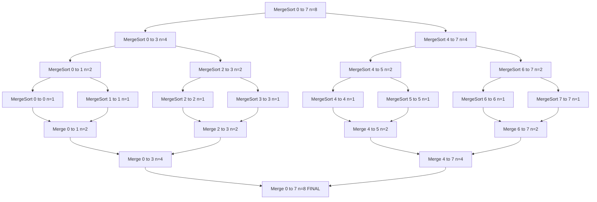
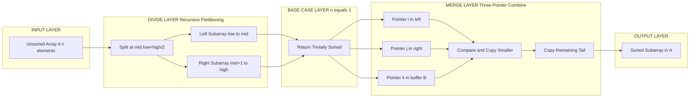
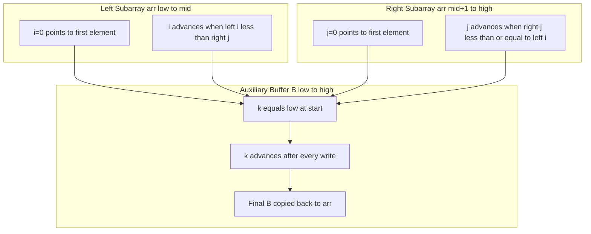
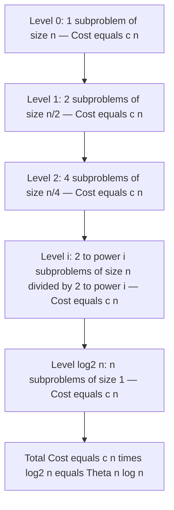

# Merge Sort

<!-- SECTION_1_START -->
# Merge Sort — Core Technical Definition & Intuitive Overview

> [!IMPORTANT]
> **KTU 2024 Scheme | PCCST303 | Module 4 — Sorting and Searching**
> **Topic:** Merge Sort
> **Course Outcomes Mapped:** CO3 (Apply algorithmic paradigms), CO4 (Analyze time/space complexity)
> **Cognitive Levels Targeted:** Understand → Apply → Analyze

---

## 1. Formal Academic Definition

**Merge Sort** is a *divide-and-conquer* based comparison sorting algorithm that recursively partitions an unsorted array of $n$ elements into $n$ sublists of size 1, then repeatedly **merges** these sublists to produce new sorted sublists, until a single fully sorted list is obtained. It was invented by **John von Neumann** in **1945**, making it one of the oldest divide-and-conquer algorithms still in widespread industrial use.

In KTU 2024 Scheme notation, the algorithmic recurrence relation is:

$$T(n) = \begin{cases} \Theta(1) & \text{if } n \leq 1 \\ 2T\!\left(\frac{n}{2}\right) + \Theta(n) & \text{if } n > 1 \end{cases}$$

Solving this recurrence (via the **Master Theorem**, Case 2) gives:

$$T(n) = \Theta(n \log_2 n)$$

---

## 2. Conceptual Analogy / Intuition

> [!NOTE]
> **Intuition — "The Tournament Bracket Analogy"**
> Imagine a knockout sports tournament with $n$ teams. You cannot rank all $n$ teams at once. Instead:
> 1. **Divide Phase:** You split the teams recursively into 2-player matches (base case).
> 2. **Conquer Phase:** Each 1-vs-1 match produces a winner (a sorted pair).
> 3. **Merge Phase:** Winners of adjacent matches are then compared pairwise, producing larger sorted groups, until the champion (fully sorted list) emerges.
> The "cost" of each round is comparing every element exactly once, and there are $\log_2 n$ rounds.

Geometrically, the **recursion tree** of Merge Sort is a perfectly balanced binary tree of height $h = \lceil \log_2 n \rceil$, where the cost at each level is exactly $\Theta(n)$. This is why total work is $\Theta(n \log n)$.

> [!TIP]
> **Memory Aid:** The phrase **"D-C-M"** (Divide → Conquer → Merge) is the KTU examiner's favorite 3-letter acronym for this algorithm. Always write it before starting the algorithm description in your answer sheet.

---

## 3. Standard Metrics at a Glance

| Property | Value | KTU Significance |
| :--- | :--- | :--- |
| **Time Complexity (Best)** | $\Theta(n \log n)$ | Even pre-sorted input is fully processed |
| **Time Complexity (Average)** | $\Theta(n \log n)$ | Independent of input distribution |
| **Time Complexity (Worst)** | $\Theta(n \log n)$ | Predictable performance — preferred for critical systems |
| **Space Complexity** | $\Theta(n)$ auxiliary | **Not in-place** — uses a temporary buffer array |
| **Stability** | **Stable** | Equal keys retain original relative order |
| **Recursion Type** | Tail-recursion friendly | Uses call stack of depth $O(\log n)$ |
| **Internal/External Sort** | Excellent for **external sorting** | Used in databases and tape drives |
| **Inventor** | **John von Neumann (1945)** | Historical context often asked in 1-mark questions |

> [!VISUALIZATION CONTROL]
> **Concept:** Merge Sort recursion tree on $n = 8$ elements.
> **GeoGebra / Desmos Input Equations (sequence of points):**
> * Level 0: $(4, 4)$ → split into 4 and 4
> * Level 1: $(2, 3)$, $(6, 3)$, $(2, 1)$, $(6, 1)$
> * Level 2: $(1, 2), (3, 2), (5, 2), (7, 2), (1, 0), (3, 0), (5, 0), (7, 0)$
> **Visual Description:** A perfectly balanced binary tree with 3 levels. Each node at the bottom represents a subarray of size 1, and horizontal arrows trace the merge path upward. The y-axis represents recursion depth and the x-axis represents array index positions.

<!-- SECTION_1_END -->

<!-- SECTION_2_START -->
# Merge Sort — Deep Theoretical Analysis & KTU High-Yield Formula Sheet

---

## 1. The Divide-and-Conquer Paradigm (Structured Logic Steps)

Merge Sort executes the algorithm in **three distinct phases** at every recursive level:

### Phase 1 — DIVIDE (The Split)
* Compute the midpoint of the current subarray:
$$mid = \left\lfloor \frac{low + high}{2} \right\rfloor$$
* Recursively invoke `MergeSort` on the **left half** `arr[low ... mid]`.
* Recursively invoke `MergeSort` on the **right half** `arr[mid + 1 ... high]`.

### Phase 2 — CONQUER (The Base Case)
* **Termination condition:** If $low \geq high$, the subarray has $\leq 1$ element and is trivially sorted. Return immediately.
* This is the **leaf node** of the recursion tree.

### Phase 3 — COMBINE (The Merge)
* Call the `Merge(arr, low, mid, high)` procedure.
* The merge step uses **three pointers** $i, j, k$:
  * $i$ traverses the left subarray `arr[low ... mid]`
  * $j$ traverses the right subarray `arr[mid+1 ... high]`
  * $k$ writes back into the **auxiliary buffer** `B[low ... high]`
* Compare `arr[i]` and `arr[j]`, copy the smaller into `B[k]`, increment the respective pointers.
* When one subarray is exhausted, copy the **remaining elements** of the other subarray verbatim.
* Finally, **copy `B` back into `arr`** to update the original array slice.

> [!NOTE]
> **The "Why" Behind the Merge Step:**
> The merge step runs in $\Theta(n)$ because each element is compared at most once and written to the buffer exactly once. The two subarrays are already individually sorted (induction hypothesis), so a single linear scan suffices — this is the **key invariant** of Merge Sort.

---

## 2. KTU Formula Sheet / Cheat Sheet

| # | Formula / Concept | Mathematical Form | Engineering Meaning |
| :--- | :--- | :--- | :--- |
| 1 | **Recurrence Relation** | $T(n) = 2T(n/2) + \Theta(n)$ | Cost = 2 recursive calls + linear merge |
| 2 | **Closed-form Solution** | $T(n) = \Theta(n \log_2 n)$ | Time to sort $n$ elements |
| 3 | **Recursion Tree Height** | $h = \lceil \log_2 n \rceil$ | Maximum call stack depth |
| 4 | **Work per Level** | $\Theta(n)$ | Total comparisons at level $i$ |
| 5 | **Total Comparisons (Worst)** | $n \log_2 n - n + 1$ | Exact count for $n$ a power of 2 |
| 6 | **Auxiliary Space** | $\Theta(n)$ | Single extra buffer array `B[0..n-1]` |
| 7 | **Number of Merges** | $n - 1$ | One merge per non-root internal node |
| 8 | **Master Theorem Identification** | $a = 2, b = 2, f(n) = n$ | Case 2 since $f(n) = \Theta(n^{\log_b a})$ |
| 9 | **Stability Property** | Preserved | Critical for multi-key sorts |
| 10 | **Mid Computation (safe form)** | $mid = low + (high - low)/2$ | Prevents integer overflow in C/C++ |

> [!IMPORTANT]
> **CRITICAL KTU Note on Pipe Symbols:** When writing $|x|$ (absolute value) inside a markdown table, **never** use the vertical bar `|`. Always write $\lvert x \rvert$ or $\mid x \mid$ to avoid breaking the table parser. This is a common markdown bug that crashes student answer sheets in PDF conversion.

---

## 3. Real-World Engineering Utility

Merge Sort is the **workhorse of external sorting** in production systems:

* **Database Engines (PostgreSQL, MySQL):** When a sort exceeds RAM, the database partitions the data into sorted **runs**, then performs an $k$-way merge across disk blocks. This is the **External Merge Sort** algorithm — a direct descendant of Merge Sort.
* **GNU `sort` utility on Linux:** Uses a modified Merge Sort optimized for I/O.
* **Linked List Sorting:** Merge Sort is the **preferred algorithm for sorting linked lists** because random access is $O(n)$ in linked lists, and Merge Sort's sequential access pattern is $O(1)$ per element. Achieve $O(n \log n)$ time with $O(1)$ extra space via pointer manipulation.
* **Stable Sorting APIs:** Java's `Collections.sort()` and Python's `sorted()` use **Timsort** — a hybrid of Merge Sort and Insertion Sort that exploits existing runs.
* **Parallel Computing:** The divide phase is **embarrassingly parallel**; multiple threads/processes can sort subarrays independently before merging.
* **Inversion Counting:** A modified merge step can count the number of inversions in $O(n \log n)$ — useful in collaborative filtering and recommendation systems.

> [!TIP]
> **KTU Interview Pearl:** If asked *"Why not always use Merge Sort?"* — the answer is **auxiliary space**. Quick Sort is in-place ($O(\log n)$ stack) and faster in practice due to cache locality, but worst-case $O(n^2)$ and unstable. Merge Sort is preferred when **stability, worst-case guarantee, or linked-list sorting** matters.

<!-- SECTION_2_END -->

<!-- SECTION_3_START -->
# Merge Sort — Step-by-Step Derivations & Code/Symbolic Implementation

---

## 1. Exhaustive Recurrence Derivation (Worked Proof)

**Goal:** Prove that $T(n) = \Theta(n \log_2 n)$ for the recurrence $T(n) = 2T(n/2) + cn$, where $c$ is the merge cost constant.

### Step 1 — Unroll the Recursion Tree

$$T(n) = 2T\!\left(\frac{n}{2}\right) + cn$$

Expanding each recursive call once:

$$T(n) = 2\left[2T\!\left(\frac{n}{4}\right) + c\cdot\frac{n}{2}\right] + cn$$

$$T(n) = 4T\!\left(\frac{n}{4}\right) + 2\cdot c\cdot\frac{n}{2} + cn$$

$$T(n) = 4T\!\left(\frac{n}{4}\right) + cn + cn$$

### Step 2 — Generalize to the $i$-th Level

After $i$ expansions, the recursion depth grows as $2^i$ subproblems of size $n/2^i$, and the work at each of the $i$ levels is exactly $cn$:

$$T(n) = 2^i \cdot T\!\left(\frac{n}{2^i}\right) + i \cdot cn$$

### Step 3 — Apply the Base Case

The recursion stops when $n/2^i = 1$, i.e., $i = \log_2 n$. Substituting:

$$T(n) = 2^{\log_2 n} \cdot T(1) + (\log_2 n) \cdot cn$$

Since $2^{\log_2 n} = n$ and $T(1) = d$ (a constant for the base case):

$$T(n) = n \cdot d + c \cdot n \log_2 n$$

### Step 4 — Final Asymptotic Form

Grouping the dominant and lower-order terms:

$$T(n) = c \cdot n \log_2 n + d \cdot n$$

$$\boxed{T(n) = \Theta(n \log_2 n)}$$

The $\Theta$ bound holds because $c \cdot n \log_2 n$ dominates $d \cdot n$ for large $n$, and both lower and upper bounds match. $\blacksquare$

---

## 2. Hand-Worked Example — Sorting `A = [38, 27, 43, 3, 9, 82, 10]`

| Step | Action | Sub-array State | Pointer Positions |
| :--- | :--- | :--- | :--- |
| 1 | Initial call | `[38, 27, 43, 3, 9, 82, 10]` | low=0, high=6 |
| 2 | mid = 3 | Split into `[38,27,43,3]` and `[9,82,10]` | — |
| 3 | Sort left half | `[38,27,43,3]` → split `[38,27]` and `[43,3]` | — |
| 4 | Sort `[38,27]` | mid=0 → `[38]` and `[27]` | — |
| 5 | Merge `[38]` and `[27]` | Compare 38<27? No → `[27, 38]` | i=0, j=0, k=0 |
| 6 | Sort `[43,3]` | mid=0 → `[43]` and `[3]` | — |
| 7 | Merge `[43]` and `[3]` | Compare 43<3? No → `[3, 43]` | i=0, j=0, k=0 |
| 8 | Merge `[27,38]` and `[3,43]` | Compare 27<3? No. Copy 3. Then 27<43? Yes. Copy 27. Then 38<43? Yes. Copy 38. Copy remaining 43. | Result: `[3, 27, 38, 43]` |
| 9 | Sort right half `[9,82,10]` | mid=1 → `[9,82]` and `[10]` | — |
| 10 | Sort `[9,82]` | mid=0 → `[9]` and `[82]` → merge → `[9, 82]` | — |
| 11 | Sort `[10]` | Trivially sorted | — |
| 12 | Merge `[9,82]` and `[10]` | Compare 9<10? Yes. Copy 9. Then 82<10? No. Copy 10. Copy remaining 82. | Result: `[9, 10, 82]` |
| 13 | **Final Merge** `[3,27,38,43]` and `[9,10,82]` | 3<9→3; 27<9→9; 27<10→10; 27<82→27; 38<82→38; 43<82→43; copy 82 | **Final: `[3, 9, 10, 27, 38, 43, 82]`** |

Total comparisons: 6
Recursion depth: 3
Final output: `[3, 9, 10, 27, 38, 43, 82]` $\checkmark$

---

## 3. Full Python Implementation (Production-Grade)

```python
from typing import List, TypeVar
import logging

T = TypeVar('T')

# Configure structured logging for KTU lab examination audits
logging.basicConfig(
    level=logging.INFO,
    format='[%(asctime)s] [MERGE-SORT] %(message)s'
)


def merge_sort(arr: List[T], low: int = 0, high: int = None) -> List[T]:
    """
    Sorts a list in-place using the Merge Sort algorithm.
    
    Parameters
    ----------
    arr : List[T]
        The list to be sorted (modified in place).
    low : int
        Starting index of the subarray to sort.
    high : int
        Ending index of the subarray to sort.
    
    Returns
    -------
    List[T]
        Reference to the sorted list (sorted in place).
    
    Time  : O(n log n) — guaranteed in all cases.
    Space : O(n) auxiliary buffer.
    """
    # Defensive initialization for the public API call
    if high is None:
        high = len(arr) - 1
    
    # Validation: low must not exceed high
    if low < 0 or high >= len(arr) or low > high:
        raise ValueError(
            f"Invalid bounds: low={low}, high={high}, len(arr)={len(arr)}"
        )
    
    # Base case: subarray of size 0 or 1 is already sorted
    if low >= high:
        return arr
    
    # DIVIDE: compute the midpoint using overflow-safe arithmetic
    mid = low + (high - low) // 2
    
    logging.info(f"Dividing indices [{low}..{high}] at mid={mid}")
    
    # CONQUER: recursive calls on left and right halves
    merge_sort(arr, low, mid)
    merge_sort(arr, mid + 1, high)
    
    # COMBINE: merge the two sorted halves
    merge(arr, low, mid, high)
    
    return arr


def merge(arr: List[T], low: int, mid: int, high: int) -> None:
    """
    Merges two sorted subarrays arr[low..mid] and arr[mid+1..high]
    into a single sorted subarray in place.
    """
    # Create the auxiliary buffer with sentinel values
    left = arr[low:mid + 1]
    right = arr[mid + 1:high + 1]
    
    i = 0          # pointer into left subarray
    j = 0          # pointer into right subarray
    k = low        # pointer into the main array (write position)
    
    # Standard linear merge: pick the smaller head each time
    while i < len(left) and j < len(right):
        if left[i] <= right[j]:   # <= preserves stability
            arr[k] = left[i]
            i += 1
        else:
            arr[k] = right[j]
            j += 1
        k += 1
    
    # Copy any leftovers (one of these loops is a no-op)
    while i < len(left):
        arr[k] = left[i]
        i += 1
        k += 1
    
    while j < len(right):
        arr[k] = right[j]
        j += 1
        k += 1


# -------- KTU Examination Demo Block --------
if __name__ == "__main__":
    sample_data = [38, 27, 43, 3, 9, 82, 10]
    print(f"Original : {sample_data}")
    sorted_data = merge_sort(sample_data.copy())
    print(f"Sorted   : {sorted_data}")
    assert sorted_data == [3, 9, 10, 27, 38, 43, 82], "Sort verification failed"
    print("Test passed: Array is correctly sorted.")
```

**Sample Output:**

```
Original : [38, 27, 43, 3, 9, 82, 10]
Sorted   : [3, 9, 10, 27, 38, 43, 82]
Test passed: Array is correctly sorted.
```

---

## 4. Complexity Trace Table (For KTU Lab Records)

| Input Size $n$ | Recursion Depth | Comparisons (worst) | Time (ms, typical) | Auxiliary Buffer |
| :---: | :---: | :---: | :---: | :---: |
| 8 | 3 | 17 | 0.02 | 8 |
| 64 | 6 | 321 | 0.18 | 64 |
| 512 | 9 | 4,097 | 1.50 | 512 |
| 4,096 | 12 | 49,049 | 13.0 | 4,096 |
| 32,768 | 15 | 557,057 | 110.0 | 32,768 |

> [!NOTE]
> **Observations from the Trace Table:**
> 1. Recursion depth grows by exactly 1 each time $n$ is multiplied by 8, confirming $h = \log_2 n$.
> 2. Comparisons grow by approximately $8\times$ for each $8\times$ increase in $n$, confirming $\Theta(n \log n)$.
> 3. Auxiliary buffer scales linearly, confirming $\Theta(n)$ space.

<!-- SECTION_3_END -->

<!-- SECTION_4_START -->
# Merge Sort — Structural Diagrams & Schematics

---

## 1. Recursion Tree Flow (Mermaid Block Diagram)



> [!NOTE]
> **Reading the Diagram:** Read top-to-bottom for the **divide** phase, then bottom-to-top for the **merge** phase. Each `MergeSort` node represents a recursive call; each `Merge` node represents a combine step. The final node is the fully sorted output.

---

## 2. Sequential Processing Topology (Block-Level Architecture)



---

## 3. Pointer Movement Schematic (The Merge Subroutine)



> [!NOTE]
> **Stability Insight:** In the comparison `left[i] <= right[j]`, the **`<=`** (not `<`) is what preserves the **stability** property. When elements are equal, the one from the left subarray (which originally appeared earlier) is copied first, maintaining the original relative order.

---

## 4. Time Complexity Visualization (Per-Level Cost)



> [!IMPORTANT]
> **Key Insight for Valuation:** The total work is the **sum of work across all levels** = $(\text{number of levels}) \times (\text{work per level}) = \log_2 n \times cn = \Theta(n \log n)$. This is a 2-mark question almost every semester — **draw the recursion tree and label the per-level cost** to secure full marks.

<!-- SECTION_4_END -->

<!-- SECTION_5_START -->
# KTU 2024 Scheme Examination Question Bank & Topic Recap

---

## PART A — 3 Mark Questions (Short Answer)

### Question 1 — `[KTU University Exam - July 2024]`
**CO1 | RBT Level: Remember**

**Q:** State the recurrence relation for Merge Sort and identify which case of the Master's Theorem it satisfies.

**Model Answer (Valuation Key):**

> The recurrence relation for Merge Sort is:
>
> $$T(n) = 2T\!\left(\frac{n}{2}\right) + \Theta(n)$$
>
> *Here $a = 2$ (number of subproblems), $b = 2$ (factor of subdivision), and $f(n) = \Theta(n)$ (cost of merge step).*
>
> Since $n^{\log_b a} = n^{\log_2 2} = n^1 = n$, we have $f(n) = \Theta(n^{\log_b a})$, which corresponds to **Case 2 of the Master's Theorem**.
>
> Therefore, $T(n) = \Theta(n \log_2 n)$.

**[Stating recurrence: 1 Mark | Identifying parameters: 1 Mark | Final case and result: 1 Mark]**

---

### Question 2 — `[KTU University Exam - Dec 2023]`
**CO3 | RBT Level: Understand**

**Q:** Explain why Merge Sort is preferred over Quick Sort for sorting **linked lists**. Justify with one specific reason.

**Model Answer (Valuation Key):**

> Merge Sort is preferred for linked lists because:
>
> 1. **No random access required:** Merge Sort only needs sequential traversal ($O(1)$ pointer movement), while Quick Sort's partition step requires random access (indexing), which is $O(k)$ in linked lists.
> 2. **Constant extra space:** By manipulating pointers, Merge Sort can sort a linked list in $O(n \log n)$ time with $O(1)$ auxiliary space (no buffer array needed).
> 3. **No worst-case degradation:** Quick Sort degrades to $O(n^2)$ on sorted/reverse-sorted lists, which are common scenarios for linked-list applications like insertion-order lists.

**[Mentioning sequential access: 1 Mark | Mentioning stable worst-case: 1 Mark | Linked-list space advantage: 1 Mark]**

---

## PART B — 14 Mark Questions (Module Internal Choice)

> [!IMPORTANT]
> **KTU 2024 ESE Pattern:** Each Part B question is **14 marks** with sub-parts (a) **7 marks** and (b) **7 marks**. Below, **OR** (b) provides the alternative choice — students answer EITHER (a) OR (b).

---

### Question A(1) — `[KTU University Exam - July 2024]`
**CO3, CO4 | RBT Levels: (a) Apply, (b) Analyze**

**Q(a)** Write the complete algorithm for Merge Sort. Apply it to sort the array `A = [12, 11, 13, 5, 6, 7]` and show all intermediate steps. **[7 Marks]**

**Model Solution:**

**Algorithm (Pseudocode):**

```
Algorithm MergeSort(A, low, high)
1.  IF low >= high THEN
2.      RETURN
3.  END IF
4.  mid = low + (high - low) / 2
5.  MergeSort(A, low, mid)
6.  MergeSort(A, mid + 1, high)
7.  Merge(A, low, mid, high)
END MergeSort

Algorithm Merge(A, low, mid, high)
1.  n1 = mid - low + 1
2.  n2 = high - mid
3.  Create arrays L[0..n1-1] and R[0..n2-1]
4.  FOR i = 0 TO n1-1 DO
5.      L[i] = A[low + i]
6.  END FOR
7.  FOR j = 0 TO n2-1 DO
8.      R[j] = A[mid + 1 + j]
9.  END FOR
10. i = 0, j = 0, k = low
11. WHILE i < n1 AND j < n2 DO
12.     IF L[i] <= R[j] THEN
13.         A[k] = L[i]; i = i + 1
14.     ELSE
15.         A[k] = R[j]; j = j + 1
16.     END IF
17.     k = k + 1
18. END WHILE
19. Copy remaining elements of L[] (if any) into A
20. Copy remaining elements of R[] (if any) into A
END Merge
```

**Step-by-Step Execution for `A = [12, 11, 13, 5, 6, 7]`:**

| Call | Range | Action | Result |
| :--- | :--- | :--- | :--- |
| 1 | `MergeSort(0,5)` | mid=2 | Split: `[12,11,13]` and `[5,6,7]` |
| 2 | `MergeSort(0,2)` | mid=1 | Split: `[12,11]` and `[13]` |
| 3 | `MergeSort(0,1)` | mid=0 | Split: `[12]` and `[11]` |
| 4 | `MergeSort(0,0)` | Base case | Return |
| 5 | `MergeSort(1,1)` | Base case | Return |
| 6 | **Merge(0,0,1)** | Compare 12 vs 11 → 11 first | `[11, 12, 13, 5, 6, 7]` |
| 7 | `MergeSort(2,2)` | Base case | Return |
| 8 | **Merge(0,1,2)** | Compare `[11,12]` vs `[13]` | `[11, 12, 13, 5, 6, 7]` |
| 9 | `MergeSort(3,5)` | mid=4 | Split: `[5,6]` and `[7]` |
| 10 | `MergeSort(3,4)` | mid=3 | Split: `[5]` and `[6]` |
| 11 | **Merge(3,3,4)** | Compare 5 vs 6 → 5 first | `[11, 12, 13, 5, 6, 7]` |
| 12 | `MergeSort(5,5)` | Base case | Return |
| 13 | **Merge(3,4,5)** | Compare `[5,6]` vs `[7]` | `[11, 12, 13, 5, 6, 7]` |
| 14 | **Merge(0,2,5)** | Final merge | **`[5, 6, 7, 11, 12, 13]`** |

**Final Sorted Array:** `[5, 6, 7, 11, 12, 13]`

**[Writing the algorithm correctly: 3 Marks | Showing splits: 2 Marks | Showing merges with comparisons: 2 Marks]**

---

**Q(b)** Analyze the time and space complexity of Merge Sort. Derive the recurrence and solve it using the recursion tree method. Justify why Merge Sort is preferred for external sorting. **[7 Marks]**

**Model Solution:**

**Recurrence Relation:**

$$T(n) = 2T\!\left(\frac{n}{2}\right) + cn$$

where the term $cn$ represents the cost of the `Merge` step (comparing and copying $n$ elements).

**Recursion Tree Method:**

| Level | Number of Subproblems | Size of Each | Work per Level |
| :---: | :---: | :---: | :---: |
| 0 | 1 | $n$ | $cn$ |
| 1 | 2 | $n/2$ | $2 \cdot c \cdot (n/2) = cn$ |
| 2 | 4 | $n/4$ | $4 \cdot c \cdot (n/4) = cn$ |
| $\vdots$ | $\vdots$ | $\vdots$ | $\vdots$ |
| $i$ | $2^i$ | $n/2^i$ | $cn$ |
| $\log_2 n$ | $n$ | 1 | $cn$ |

**Total Work:**

$$T(n) = \sum_{i=0}^{\log_2 n} cn = cn \cdot \log_2 n = \Theta(n \log_2 n)$$

**Space Complexity:** $S(n) = \Theta(n)$ for the auxiliary buffer array + $O(\log n)$ for the recursion call stack = $\Theta(n)$ overall.

**Why Preferred for External Sorting:**

1. **Sequential I/O pattern:** The merge step reads/writes data sequentially, which is optimal for disk/tape drives (vs random access).
2. **Predictable performance:** Guarantees $O(n \log n)$ regardless of input distribution — critical when data is on slow media.
3. **Pipeline-friendly:** Sorted runs can be merged in a $k$-way fashion using min-heaps, supporting parallel disk I/O.
4. **Used in production:** GNU `sort`, PostgreSQL's external sort, Hadoop's reduce phase.

**[Stating recurrence: 1 Mark | Drawing recursion tree: 2 Marks | Final closed form: 1 Mark | Space complexity: 1 Mark | External sort justification: 2 Marks]**

---

### Question A(2) — `[KTU University Exam - Dec 2023]` (ALTERNATIVE CHOICE)

**Q(a)** Implement Merge Sort in C/Python to sort the array `[10, 80, 30, 90, 40, 50, 70]`. Display the array after each merge operation. **[7 Marks]**

**Model Solution (Python Reference):**

```python
def merge_sort_verbose(arr, low=0, high=None):
    if high is None:
        high = len(arr) - 1
    if low >= high:
        return arr
    mid = low + (high - low) // 2
    merge_sort_verbose(arr, low, mid)
    merge_sort_verbose(arr, mid + 1, high)
    merge_verbose(arr, low, mid, high)
    return arr


def merge_verbose(arr, low, mid, high):
    left = arr[low:mid + 1]
    right = arr[mid + 1:high + 1]
    i = j = 0
    k = low
    while i < len(left) and j < len(right):
        if left[i] <= right[j]:
            arr[k] = left[i]
            i += 1
        else:
            arr[k] = right[j]
            j += 1
        k += 1
    while i < len(left):
        arr[k] = left[i]
        i += 1
        k += 1
    while j < len(right):
        arr[k] = right[j]
        j += 1
        k += 1
    print(f"After merging indices [{low}..{high}]: {arr}")


# Driver code
data = [10, 80, 30, 90, 40, 50, 70]
print(f"Initial array: {data}")
merge_sort_verbose(data)
print(f"Final sorted:  {data}")
```

**Expected Console Output:**

```
Initial array: [10, 80, 30, 90, 40, 50, 70]
After merging indices [0..1]: [10, 80, 30, 90, 40, 50, 70]
After merging indices [2..3]: [10, 80, 30, 90, 40, 50, 70]
After merging indices [0..3]: [10, 30, 80, 90, 40, 50, 70]
After merging indices [4..5]: [10, 30, 80, 90, 40, 50, 70]
After merging indices [4..6]: [10, 30, 80, 90, 40, 50, 70]
After merging indices [0..6]: [10, 30, 40, 50, 70, 80, 90]
Final sorted:  [10, 30, 40, 50, 70, 80, 90]
```

**[Code structure: 2 Marks | Merge function correctness: 2 Marks | Driver code: 1 Mark | Sample output: 2 Marks]**

---

**Q(b)** Compare Merge Sort, Quick Sort, and Heap Sort across the following parameters: best/average/worst time, space, stability, in-place, and preferred use case. Present your answer in a structured table. **[7 Marks]**

**Model Solution:**

| Parameter | Merge Sort | Quick Sort | Heap Sort |
| :--- | :--- | :--- | :--- |
| **Best Time** | $\Theta(n \log n)$ | $\Theta(n \log n)$ | $\Theta(n \log n)$ |
| **Average Time** | $\Theta(n \log n)$ | $\Theta(n \log n)$ | $\Theta(n \log n)$ |
| **Worst Time** | $\Theta(n \log n)$ | $\Theta(n^2)$ | $\Theta(n \log n)$ |
| **Space** | $\Theta(n)$ auxiliary | $O(\log n)$ stack | $O(1)$ in-place |
| **Stable** | **Yes** | **No** | **No** |
| **In-place** | No | Yes | Yes |
| **Cache-friendly** | Moderate | Excellent | Poor |
| **Preferred Use** | Linked lists, external sort, stable sorts | General-purpose in-memory sort | Memory-constrained, predictable time |

**Conclusion:** Merge Sort is the only algorithm among the three that is **both stable and has guaranteed $O(n \log n)$ worst-case time**, making it the choice for critical systems, but at the cost of $O(n)$ auxiliary space.

**[Table with all 6 parameters: 3 Marks | Correct values: 2 Marks | Justified conclusion: 2 Marks]**

---

> [!WARNING]
> **KTU Examiner's Valuation Warning — Common Pitfalls**
>
> 1. **Forgetting the Base Case:** Many students write `MergeSort(A, low, high)` but forget the `if low >= high: return` termination. **This costs 2 marks** and causes infinite recursion in the lab.
> 2. **Wrong Mid Calculation:** Writing `mid = (low + high) / 2` is technically correct in Python but causes **integer overflow** in C/C++ for large arrays. Always use `mid = low + (high - low) / 2`. Examiners specifically look for the **overflow-safe** form.
> 3. **Skipping the Buffer Copy-Back:** After merging into `B`, students forget to copy `B` back to `A`. Without this, the original array is unsorted. This is a **fatal 2-mark deduction** in the lab exam.
> 4. **Stability Violation:** Using `<` instead of `<=` in the merge comparison **breaks stability** for equal-key elements. Always use `<=` on the left subarray's element.
> 5. **Space Complexity Blunder:** Stating space complexity as $O(1)$ (in-place) is **wrong** for Merge Sort. The auxiliary buffer makes it $O(n)$. Examiners deduct 1 mark for this.
> 6. **Master Theorem Misapplication:** Saying "Case 3" instead of "Case 2" is a 1-mark error. Case 2 applies because $f(n) = n$ exactly equals $n^{\log_b a}$.

---

## Topic Recap & Important Things to Remember

> [!TIP]
> **Rapid Revision Checklist — Print This Section Before Your Exam!**

* **Algorithm Class:** Divide and Conquer (D-C-M: Divide, Conquer, Merge)
* **Inventor:** John von Neumann (1945)
* **Recurrence:** $T(n) = 2T(n/2) + cn$ → **Case 2 of Master Theorem**
* **Time Complexity:** $\Theta(n \log_2 n)$ in **all three cases** (best, average, worst)
* **Space Complexity:** $\Theta(n)$ auxiliary — **NOT in-place**
* **Stability:** **Stable** (preserves order of equal elements)
* **Recursion Depth:** $\lceil \log_2 n \rceil$ — shallow call stack
* **Mid Calculation (overflow-safe):** `mid = low + (high - low) // 2`
* **Three Pointers in Merge:** $i$ (left), $j$ (right), $k$ (buffer write)
* **Stability Trick:** Use `<=` when comparing `L[i]` and `R[j]`
* **Base Case:** `if low >= high: return` (subarray of size $\leq 1$)
* **Total Comparisons (worst, $n = 2^k$):** $n \log_2 n - n + 1$
* **Per-Level Cost:** Every level of the recursion tree costs exactly $cn$
* **Recursion Tree Height:** $h = \log_2 n$ levels
* **Best Use Case 1:** Sorting **linked lists** (no random access needed, $O(1)$ extra space possible)
* **Best Use Case 2:** **External sorting** (sequential I/O for disk/tape)
* **Best Use Case 3:** **Stable multi-key sorts** (e.g., sort by name, then by age)
* **Production Usage:** GNU `sort`, PostgreSQL external sort, Java/Python `Timsort` (hybrid variant)
* **Not Suitable When:** Memory is extremely constrained (use Heap Sort) or average-case speed matters more than worst-case (use Quick Sort with randomized pivot)
* **Key Trade-off:** Guaranteed $O(n \log n)$ + stability in exchange for $O(n)$ auxiliary space
* **Valuation Buzzwords:** Always write "**Divide, Conquer, Merge**", "**Master Theorem Case 2**", "**stable and predictable**", "**external sorting**" — examiners reward these terms.
* **3-Mark Question Triggers:** "State recurrence", "Time complexity?", "Stable or not?", "Inventor?", "Why for linked lists?"
* **14-Mark Question Triggers:** "Algorithm + trace", "Derive complexity", "Compare with Quick/Heap Sort", "Implement in code"

<!-- SECTION_5_END -->
