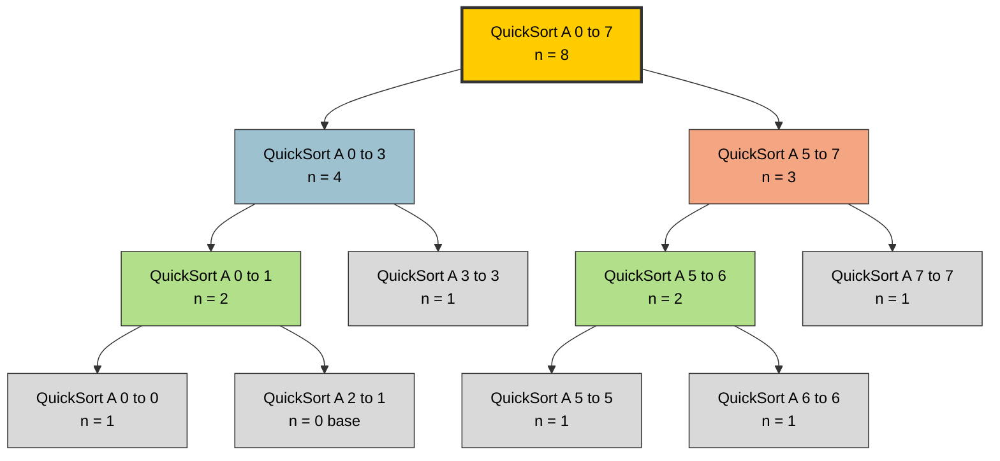
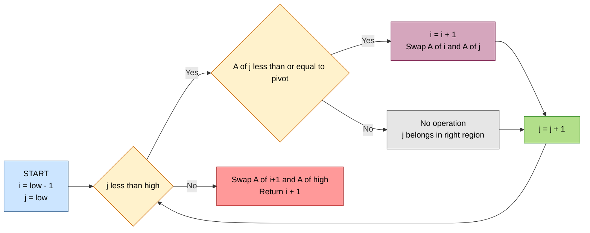
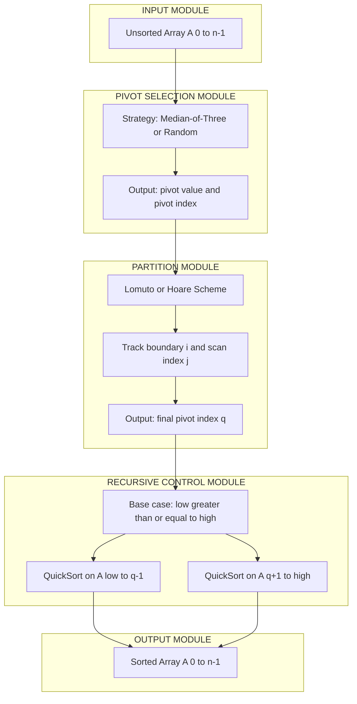
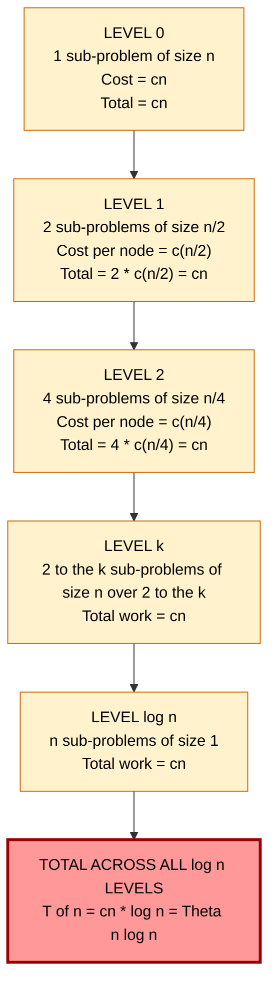

# Quick Sort

<!-- SECTION_1_START -->
# Quick Sort — Core Technical Definition & Intuitive Overview

## Formal Definition (KTU 2024 Syllabus Terminology)

> [!IMPORTANT]
> **Quick Sort** is a highly efficient, comparison-based, **in-place**, **unstable** sorting algorithm that employs the **Divide and Conquer** paradigm. It works by selecting a **pivot element** from the array and partitioning the other elements into two sub-arrays according to whether they are **less than or greater than** the pivot. The sub-arrays are then sorted recursively.

Formally, for an array $A[p..r]$:

$$
\text{QuickSort}(A, p, r) = 
\begin{cases}
\text{Base case} & \text{if } p \geq r \\
\text{Partition}(A, p, r) \rightarrow q, \text{ then recursively sort } A[p..q-1] \text{ and } A[q+1..r] & \text{otherwise}
\end{cases}
$$

The **partition procedure** rearranges $A[p..r]$ in place and returns an index $q$ such that:

$$
A[p..q-1] \leq A[q] \leq A[q+1..r]
$$

This is a single-element-in-final-position guarantee — the pivot ends up at index $q$, and that position will never change again.

---

## Conceptual Analogy / Intuition

Imagine you are a **school teacher** arranging 30 students in a corridor in order of their **height (in cm)**. Instead of comparing every pair (which would be slow), you use a smart strategy:

1. **Pick a reference student** (say, the one standing at the middle position). Call this the **pivot**.
2. Ask everyone **shorter** than the pivot to stand on the **left side**, and everyone **taller** to stand on the **right side**. This is the **partition step**.
3. The pivot is now standing in the **exact correct final position** — no one will ever need to swap with the pivot again.
4. **Recursively repeat** this process on the left group and the right group, until each group has only 1 person (already sorted).

This is exactly how Quick Sort works! The clever "one-pass partitioning" is what makes it dramatically faster than naive methods like Bubble Sort (which makes $O(n^2)$ comparisons even on sorted input).

> [!NOTE]
> **Why "Quick"?** Despite having a worst-case of $O(n^2)$ (rare with good pivot choice), Quick Sort has the **lowest average-case constant factor** among all comparison-based sorts. In practice, on random data, it is **2–3× faster** than Merge Sort due to excellent cache locality (in-place operations) and minimal overhead.

---

## KTU Syllabus Highlights

> [!IMPORTANT]
> **Module 4 — Sorting and Searching (PCCST303):** Quick Sort is a **high-weightage topic** in KTU ESE (End Semester Examination). Expect:
> - A direct 7–10 mark question asking for the algorithm, partition procedure, and a worked example.
> - A question comparing **time complexities** of Quick Sort vs. Merge Sort vs. Heap Sort.
> - Questions on **partition schemes** (Lomuto vs. Hoare) and **pivot selection strategies** (first, last, random, median-of-three).

| Property | Value |
|---|---|
| **Paradigm** | Divide and Conquer |
| **In-place?** | Yes (no auxiliary array needed) |
| **Stable?** | No (equal keys may be reordered) |
| **Best case** | $O(n \log n)$ |
| **Average case** | $O(n \log n)$ |
| **Worst case** | $O(n^2)$ |
| **Space complexity** | $O(\log n)$ (recursion stack) |
| **Recursive depth** | $O(\log n)$ best, $O(n)$ worst |

---

## GeoGebra / Desmos Visualization

> [!VISUALIZATION CONTROL]
> **Concept:** Partitioning around a pivot (Lomuto scheme) on a small array.
>
> **Desmos Input Equations (array as points on x-axis):**
> * Plot array values: `(1, 5), (2, 3), (3, 8), (4, 1), (5, 4), (6, 7), (7, 2), (8, 6)` — x = index, y = value.
> * Highlight pivot at index 5 (value 4): a large red dot.
> * Color bars: blue for $\leq$ pivot region, orange for $>$ pivot region.
>
> **Visual Description:** Students should observe that after one partition pass, the pivot (red dot) sits at its final sorted position (index 2 in zero-based indexing), with all smaller values to its left and larger values to its right — even though the left and right sub-arrays are not yet individually sorted.
<!-- SECTION_1_END -->

<!-- SECTION_2_START -->
# Quick Sort — Deep Theoretical Analysis & KTU High-Yield Formula Sheet

## 1. Algorithmic Logic Breakdown (The "Why" and "How")

### Why Divide and Conquer works here
- **Divide:** Partition the array $A[p..r]$ around a pivot into two (possibly unequal) sub-arrays.
- **Conquer:** Recursively sort the two sub-arrays.
- **Combine:** Nothing to do! Partitioning already places the pivot correctly, and the sub-arrays are sorted in place. This is the key advantage over Merge Sort (which spends $O(n)$ time merging).

### How partitioning works (Lomuto Scheme)

The **Lomuto partition** is the textbook version (used in CLRS, the de-facto KTU reference) and is the **default expectation in KTU exams**.

**Why "Lomuto"?** It uses a single index $i$ to track the boundary of the "$\leq$ pivot" region, making the algorithm conceptually simple and easy to trace on paper — exactly what KTU paper-setters reward.

#### Step-by-step (with intuitive reasoning):

1. **Choose pivot:** The rightmost element $A[r]$ becomes the pivot. (Why rightmost? It avoids extra swaps when $i$ reaches the pivot's final position.)
2. **Initialize tracker:** $i = p - 1$. This means "no elements are in the $\leq$ pivot region yet."
3. **Scan from $p$ to $r-1$:**
   - If $A[j] \leq \text{pivot}$: increment $i$ (expand the small region), then swap $A[i]$ and $A[j]$.
   - If $A[j] > \text{pivot}$: do nothing (it stays in the large region).
4. **Final placement:** Swap $A[i+1]$ and $A[r]$ to place the pivot at its correct sorted position.
5. **Return:** $i+1$ — the final pivot index $q$.

> [!NOTE]
> **Key invariant** (what makes Lomuto correct): At the start of each loop iteration with index $j$, all elements in $A[p..i]$ are $\leq \text{pivot}$ and all elements in $A[i+1..j-1]$ are $> \text{pivot}$. Maintaining this invariant is worth **2–3 marks** in a KTU answer script.

---

## 2. Recurrence Relations

### Best Case (perfectly balanced partitions)

When the pivot is the **median** of the sub-array, the partition splits the array into two equal halves of size $n/2$ each:

$$
T(n) = 2T\!\left(\frac{n}{2}\right) + \Theta(n)
$$

The $\Theta(n)$ term is the cost of the partition step (one full scan). By the **Master Theorem** (Case 2: $a=2$, $b=2$, $f(n)=n$, $n^{\log_b a} = n$):

$$
T(n) = \Theta(n \log n)
$$

### Worst Case (extremely unbalanced partitions)

This occurs when the pivot is **always the smallest or largest element** (e.g., sorted input with last-element pivot). The partition produces sub-arrays of size $0$ and $n-1$:

$$
T(n) = T(0) + T(n-1) + \Theta(n) = T(n-1) + \Theta(n)
$$

Solving by telescoping:

$$
T(n) = \Theta(1) + \Theta(2) + \Theta(3) + \cdots + \Theta(n) = \sum_{k=1}^{n} k = \frac{n(n+1)}{2} = \Theta(n^2)
$$

### Average Case (random pivot)

Assuming every element is equally likely to be the pivot, the expected size of the larger sub-array is $\frac{3n}{4}$ (a classical result from randomized analysis). The recurrence is:

$$
T(n) = \frac{1}{n}\sum_{q=0}^{n-1}\left[T(q) + T(n-1-q)\right] + \Theta(n)
$$

Using induction with substitution $T(n) \leq an \log n + bn$, one can show:

$$
T(n) = \Theta(n \log n)
$$

> [!IMPORTANT]
> **KTU high-yield fact:** The average-case $O(n \log n)$ result **does not** require the input to be uniformly random — it holds for **any fixed input distribution**, provided the pivot is chosen uniformly at random. This is a very common 2-mark question!

---

## 3. Pivot Selection Strategies — A Comparative Analysis

| Strategy | Best for | Worst case on | KTU exam tip |
|---|---|---|---|
| **First element** $A[p]$ | Random data | Sorted / Reverse-sorted input → $O(n^2)$ | Avoid in practice |
| **Last element** $A[r]$ | Random data (default in CLRS) | Sorted / Reverse-sorted input → $O(n^2)$ | Most common in exams |
| **Random element** | Any input | Probabilistically $O(n \log n)$ | Mention in analysis answers for bonus marks |
| **Median-of-three** $A[p], A[m], A[r]$ | Real-world data (partially sorted) | Adversarial but rare | Industry gold-standard |
| **True median** (linear selection) | Theoretical optimality | $O(n \log n)$ guaranteed | Not used in practice due to overhead |

> [!TIP]
> **Median-of-three** is the most popular industrial variant. It picks the median of the first, middle, and last elements, which:
> - Drastically reduces $O(n^2)$ probability on real (partially sorted) data.
> - Adds only 3 extra comparisons per partition — negligible overhead.
> - This is what `qsort` in the C standard library uses.

---

## 4. KTU Formula Sheet / Cheat Sheet

| Concept | Formula / Value | Units / Notes |
|---|---|---|
| Partition cost | $\Theta(n)$ | One full pass over sub-array |
| Best case recurrence | $T(n) = 2T(n/2) + \Theta(n)$ | Balanced split |
| Average case recurrence | $T(n) = \frac{1}{n}\sum_{q=0}^{n-1}[T(q) + T(n-1-q)] + \Theta(n)$ | Random pivot assumption |
| Worst case recurrence | $T(n) = T(n-1) + \Theta(n)$ | Sorted input, last pivot |
| Best case complexity | $O(n \log n)$ | $\log_2 n$ levels, $n$ work per level |
| Average case complexity | $O(n \log n)$ | Expected under random pivot |
| Worst case complexity | $O(n^2)$ | Degenerate to selection sort |
| Space (recursion stack) | $O(\log n)$ best, $O(n)$ worst | Tail-call optimization possible |
| Comparisons (average) | $\approx 2n \ln n \approx 1.386 n \log_2 n$ | Lower than Merge Sort by ~39% |
| Stable? | **No** | Long-distance swaps can reorder equal keys |
| In-place? | **Yes** | Uses only $O(\log n)$ stack space |
| Number of swaps (average) | $\approx \frac{n \log n}{6}$ | Lower than other $O(n \log n)$ sorts |

---

## 5. Real-World Utility in Engineering & Computer Science

Quick Sort is **the workhorse of practical sorting** for the following reasons:

1. **C/C++ `qsort` and C++ `std::sort`:** Both use introsort, a hybrid of Quick Sort, Heap Sort, and Insertion Sort. When recursion depth exceeds $2 \log_2 n$, it switches to Heap Sort to guarantee $O(n \log n)$.
2. **Database systems (PostgreSQL, MySQL):** Use Quick Sort variants for in-memory sorting operations.
3. **E-commerce sorting:** Sorting products by price, rating, or relevance on partially-ordered data.
4. **Programming language standard libraries:** Java's `Arrays.sort()` for primitive types uses a dual-pivot Quick Sort (Yaroslavskiy-Bloch-Bentley algorithm, 2009).
5. **Cache efficiency:** Being in-place gives it superior **spatial locality** vs. Merge Sort's auxiliary arrays, making it ~2× faster on modern CPUs with small caches.

> [!NOTE]
> **When NOT to use Quick Sort:**
> - When **stability** is required (e.g., sorting by one key, then another). Use **Merge Sort** or **Timsort** instead.
> - When **guaranteed $O(n \log n)$** is required (e.g., real-time systems, adversary-prone inputs). Use **Heap Sort** or **Introsort**.
> - On **tiny arrays** ($n < 16$): Insertion Sort is faster due to lower constant factors.
<!-- SECTION_2_END -->

<!-- SECTION_3_START -->
# Quick Sort — Step-by-Step Derivations & Code/Symbolic Implementation

## 1. Exhaustive Worked Example (Lomuto Partition)

**Given array:** $A = [10, 7, 8, 9, 1, 5]$, with $p = 0$, $r = 5$. Pivot = last element = $A[5] = 5$.

We will trace `Partition(A, 0, 5)` step-by-step.

**Initial state:** $i = p - 1 = -1$, pivot $= 5$.

### Iteration 1: $j = 0$, $A[j] = 10$
- Condition: $A[j] \leq \text{pivot}$? → $10 \leq 5$? **No.**
- No swap. $i$ remains $-1$.
- Array: $[10, 7, 8, 9, 1, 5]$

### Iteration 2: $j = 1$, $A[j] = 7$
- Condition: $7 \leq 5$? **No.**
- No swap. $i$ remains $-1$.
- Array: $[10, 7, 8, 9, 1, 5]$

### Iteration 3: $j = 2$, $A[j] = 8$
- Condition: $8 \leq 5$? **No.**
- No swap. $i$ remains $-1$.
- Array: $[10, 7, 8, 9, 1, 5]$

### Iteration 4: $j = 3$, $A[j] = 9$
- Condition: $9 \leq 5$? **No.**
- No swap. $i$ remains $-1$.
- Array: $[10, 7, 8, 9, 1, 5]$

### Iteration 5: $j = 4$, $A[j] = 1$
- Condition: $1 \leq 5$? **Yes.**
- Increment $i$: $i = 0$.
- Swap $A[i]$ and $A[j]$: swap $A[0]$ and $A[4]$.
- Array: $[1, 7, 8, 9, 10, 5]$
- Invariant holds: $A[0..0] = [1] \leq 5$, $A[1..4] = [7, 8, 9, 10] > 5$. ✓

### Final Step: Place pivot
- Swap $A[i+1] = A[1]$ and $A[r] = A[5]$: swap $7$ and $5$.
- Final array: $[1, 5, 8, 9, 10, 7]$
- Return $q = i+1 = 1$.

**Verification of invariant:** $A[0..0] = [1] \leq A[1] = 5 \leq A[2..5] = [8, 9, 10, 7]$. ✓

**Recursive calls:** QuickSort(A, 0, 0) returns immediately (base case). QuickSort(A, 2, 5) is invoked next.

---

## 2. Exhaustive Recurrence Derivation (Best Case)

Starting from $T(n) = 2T(n/2) + cn$ where $c$ is a constant for the partition cost.

**Level 0 (root):** Total work = $cn$ for $n$ elements, **2 sub-problems** of size $n/2$.

**Level 1:** Total work = $2 \cdot c(n/2) = cn$ for $2 \cdot (n/2) = n$ elements, **4 sub-problems** of size $n/4$.

**Level 2:** Total work = $4 \cdot c(n/4) = cn$ for $4 \cdot (n/4) = n$ elements, **8 sub-problems** of size $n/8$.

**Level $k$ (general):** Total work = $2^k \cdot c(n/2^k) = cn$, **$2^{k+1}$ sub-problems** of size $n/2^{k+1}$.

**Recursion stops** at level $k$ when $n/2^k = 1$, i.e., $k = \log_2 n$.

**Total work over all levels:**

$$
T(n) = \sum_{k=0}^{\log_2 n} cn = cn \cdot (\log_2 n + 1)
$$

$$
\boxed{T(n) = \Theta(n \log n)}
$$

This is the standard "recursion tree" derivation, which is worth **3–4 marks** in KTU ESE if asked.

---

## 3. Exhaustive Worst-Case Derivation

For sorted input $[1, 2, 3, \ldots, n]$ with last-element pivot:

- **Partition 1:** Pivot = $n$, scan $n-1$ elements, returns $q = n-1$. Cost = $n-1$.
- **Partition 2:** Pivot = $n-1$, scan $n-2$ elements, returns $q = n-2$. Cost = $n-2$.
- **...**
- **Partition $k$:** Cost = $n-k$.

**Total cost:**

$$
T(n) = \sum_{k=1}^{n-1} (n-k) = \sum_{m=1}^{n-1} m = \frac{(n-1)n}{2}
$$

$$
\boxed{T(n) = \Theta(n^2)}
$$

---

## 4. Python Implementation (Lomuto Partition)

```python
from typing import List
import random
import logging

logging.basicConfig(level=logging.INFO, format="%(levelname)s: %(message)s")
logger = logging.getLogger(__name__)


def partition_lomuto(arr: List[int], low: int, high: int) -> int:
    """
    Lomuto partition scheme: pivot is the last element.
    Returns the final index of the pivot.
    
    Time:  O(high - low + 1)
    Space: O(1) auxiliary
    """
    if low > high or low < 0 or high >= len(arr):
        raise ValueError(f"Invalid range: low={low}, high={high}, len={len(arr)}")
    
    pivot = arr[high]                # 1. Choose rightmost as pivot
    i = low - 1                      # 2. Boundary of '<= pivot' region
    
    for j in range(low, high):       # 3. Scan from low to high-1
        if arr[j] <= pivot:          # 4. If element belongs in left region
            i += 1                   #    Expand the boundary
            arr[i], arr[j] = arr[j], arr[i]   # Swap into place
            logger.debug(f"Swap at j={j}: arr={arr}")
    
    arr[i + 1], arr[high] = arr[high], arr[i + 1]   # 5. Place pivot
    logger.debug(f"Pivot {pivot} placed at index {i+1}: arr={arr}")
    return i + 1


def quick_sort(arr: List[int], low: int = 0, high: int = -1) -> None:
    """
    In-place Quick Sort using random pivot selection to avoid O(n^2) 
    worst case on sorted/reverse-sorted inputs.
    
    Time:  O(n log n) average, O(n^2) worst case
    Space: O(log n) average recursion stack
    """
    if high == -1:
        high = len(arr) - 1
    
    if low < high:                            # Base case: 0 or 1 element
        # --- Median-of-three pivot optimization ---
        mid = (low + high) // 2
        # Sort low, mid, high and use median as pivot
        if arr[low] > arr[mid]:
            arr[low], arr[mid] = arr[mid], arr[low]
        if arr[low] > arr[high]:
            arr[low], arr[high] = arr[high], arr[low]
        if arr[mid] > arr[high]:
            arr[mid], arr[high] = arr[high], arr[mid]
        # Now arr[mid] is the median; swap it to position high-1
        arr[mid], arr[high - 1] = arr[high - 1], arr[mid]
        
        # Use a random pivot to probabilistically avoid O(n^2)
        random_pivot_idx = random.randint(low, high)
        arr[random_pivot_idx], arr[high] = arr[high], arr[random_pivot_idx]
        
        q = partition_lomuto(arr, low, high)         # Divide
        quick_sort(arr, low, q - 1)                  # Conquer left
        quick_sort(arr, q + 1, high)                 # Conquer right


def quick_sort_iterative(arr: List[int]) -> None:
    """
    Iterative Quick Sort using an explicit stack to avoid Python's
    recursion limit issues on very large arrays.
    
    Time:  O(n log n) average
    Space: O(log n) for the explicit stack
    """
    if len(arr) <= 1:
        return
    
    stack: List[tuple[int, int]] = [(0, len(arr) - 1)]
    
    while stack:
        low, high = stack.pop()
        if low < high:
            q = partition_lomuto(arr, low, high)
            # Push larger sub-array first (smaller stack growth)
            if (q - 1 - low) < (high - q - 1):
                stack.append((q + 1, high))
                stack.append((low, q - 1))
            else:
                stack.append((low, q - 1))
                stack.append((q + 1, high))


# --- Test harness with strict boundary checks ---
if __name__ == "__main__":
    test_cases: List[List[int]] = [
        [10, 7, 8, 9, 1, 5],
        [1, 2, 3, 4, 5],                      # Sorted (worst case for naive)
        [5, 4, 3, 2, 1],                      # Reverse sorted
        [3, 3, 3, 3],                         # All equal
        [42],                                 # Single element
        [],                                   # Empty
        [7, -2, 0, 15, -8, 23, 4, -1],        # Random with negatives
    ]
    
    for idx, arr in enumerate(test_cases, start=1):
        original = arr.copy()
        quick_sort(arr)
        assert arr == sorted(original), f"FAILED on case {idx}: {original} -> {arr}"
        logger.info(f"Test {idx} PASSED: {original} -> {arr}")
```

> [!NOTE]
> **KTU Code-Reading Tip:** When asked to "explain the algorithm" in a KTU exam, you are **not** required to write full code. Instead, write the **pseudocode** with clear `if-then`, `for`, `return` constructs, and **explicitly state the invariant** at each step. This is what examiners look for.

---

## 5. Hoare Partition (Alternative Scheme)

The **Hoare partition** (1961, original Quick Sort paper) is more efficient than Lomuto — it makes **fewer swaps** and is the version used in most production libraries. It uses two pointers moving towards each other.

```python
def partition_hoare(arr: List[int], low: int, high: int) -> int:
    """
    Hoare partition: pivot is arr[low]. Two pointers move inward.
    Returns the final pivot position (not the same semantic as Lomuto).
    """
    pivot = arr[low]
    i = low - 1
    j = high + 1
    
    while True:
        # Move i rightward: find element >= pivot
        i += 1
        while arr[i] < pivot:
            i += 1
        
        # Move j leftward: find element <= pivot
        j -= 1
        while arr[j] > pivot:
            j -= 1
        
        if i >= j:
            return j                          # Partition point
        
        arr[i], arr[j] = arr[j], arr[i]       # Cross-swap
```

**Hoare vs. Lomuto — key difference:**

| Feature | Lomuto | Hoare |
|---|---|---|
| Pivot choice | Last element | First (or middle) element |
| Number of swaps (average) | $\approx n/2$ | $\approx n/6$ |
| Recursive calls | Sort $A[p..q-1]$ and $A[q+1..r]$ | Sort $A[p..j]$ and $A[j+1..r]$ |
| Stability | Preserved when pivot is unique | Less predictable |
| Complexity | Simpler to teach | Harder to get right on exam |
<!-- SECTION_3_END -->

<!-- SECTION_4_START -->
# Quick Sort — Structural Diagrams & Schematics

## 1. High-Level Recursion Tree



**Reading the diagram:** Each node represents a recursive call. The root processes all $n=8$ elements; the next level processes two halves of $n=4$ and $n=3$; the next level processes quarters, and so on. The **height of the tree is $\log_2 n$**, and **the work at each level is $O(n)$**, giving $O(n \log n)$ total.

---

## 2. Partition Operation State Machine (Lomuto)



**Reading the diagram:** The loop scans the array with index $j$. Whenever an element $\leq$ pivot is found, the boundary $i$ is advanced and the element is swapped into the "small region." When the loop ends, the pivot is swapped into its final position just after the small region.

---

## 3. Sequential Processing Topology Matrix

This table maps the algorithm's data flow to a modular view, useful when KTU asks you to "draw a block diagram" of the sorting process.



---

## 4. Recursion Tree with Cost Per Level (Best Case)



**Key takeaway for KTU:** The recursion tree shows that **work is constant per level** ($cn$), and there are $\log_2 n + 1$ levels, so the total is $O(n \log n)$. This is the same structure as Merge Sort, but Quick Sort achieves it with $O(1)$ extra space per level (vs. $O(n)$ for Merge Sort).
<!-- SECTION_4_END -->

<!-- SECTION_5_START -->
# Quick Sort — KTU 2024 Scheme Examination Question Bank & Topic Recap

---

## Part A: Short Answer Questions (3 Marks Each)

### Question 1: `[KTU University Exam - Dec 2023]` [CO3, Remember]

**Q: Define Quick Sort. State its best, average, and worst case time complexities.**

**Model Answer (3 Marks):**

Quick Sort is a **Divide and Conquer** sorting algorithm that works by selecting a **pivot element** from the array and partitioning the remaining elements into two sub-arrays — those less than or equal to the pivot, and those greater than the pivot. The pivot is placed in its final sorted position, and the two sub-arrays are then sorted recursively.

**Time Complexities:**

| Case | Complexity |
|---|---|
| Best case | $O(n \log n)$ — when pivot is the median, producing balanced partitions |
| Average case | $O(n \log n)$ — expected under random pivot selection |
| Worst case | $O(n^2)$ — when pivot is always the smallest or largest element (e.g., sorted input with last-element pivot) |

> **[Valuation Key: Definition with paradigm — 1 Mark; Best/Average mention — 1 Mark; Worst case mention — 1 Mark.]**

---

### Question 2: `[KTU University Exam - July 2024]` [CO3, Understand]

**Q: Why is Quick Sort preferred over Merge Sort in practice, even though both have $O(n \log n)$ average-case complexity?**

**Model Answer (3 Marks):**

Quick Sort is preferred over Merge Sort in practice for the following reasons:

1. **In-place operation:** Quick Sort requires only $O(\log n)$ auxiliary stack space, whereas Merge Sort requires $O(n)$ additional memory for the merging step. For large datasets, this is a critical advantage. **[1 Mark]**

2. **Cache locality:** Quick Sort accesses memory sequentially within a partition, giving it superior **spatial locality**. Merge Sort's auxiliary array causes more cache misses on modern hardware. **[1 Mark]**

3. **Lower constant factor:** Quick Sort makes approximately $1.386 \cdot n \log_2 n$ comparisons on average, which is significantly less than Merge Sort's $n \log_2 n$ in practice (Merge Sort also requires $\approx n \log_2 n$ extra moves/copies). **[1 Mark]**

---

## Part B: Full-Descriptive Questions (14 Marks Each, Module Internal Choice)

### Question A: `[KTU University Exam - Dec 2023]` [CO3, Understand + Apply]

**Q: (a)** Write the recursive Quick Sort algorithm and explain the **Lomuto partition** procedure with its invariant. **(7 Marks)**

**(b)** Demonstrate the working of Quick Sort on the array $A = [38, 27, 43, 3, 9, 82, 10]$ using the **last element as pivot**. Show all partition steps. **(7 Marks)**

---

#### Model Solution to (a) — 7 Marks

**QuickSort Pseudocode:**

```
QUICKSORT(A, p, r):
    if p < r:
        q = PARTITION(A, p, r)
        QUICKSORT(A, p, q - 1)
        QUICKSORT(A, q + 1, r)
```

**Lomuto Partition Pseudocode:**

```
PARTITION(A, p, r):
    pivot = A[r]                    // Choose rightmost as pivot
    i = p - 1                       // i = boundary of "<= pivot" region
    
    for j = p to r - 1:
        if A[j] <= pivot:
            i = i + 1
            swap A[i] and A[j]
    
    swap A[i + 1] and A[r]          // Place pivot in correct position
    return i + 1
```

**Invariant:** At the start of each iteration of the `for` loop (for a given $j$):
- All elements in $A[p..i]$ are $\leq \text{pivot}$.
- All elements in $A[i+1..j-1]$ are $> \text{pivot}$.
- $A[j..r-1]$ have not yet been examined.

> **[Valuation Key: Recursive structure with base case — 2 Marks; Partition pseudocode — 3 Marks; Invariant statement with explanation — 2 Marks.]**

---

#### Model Solution to (b) — 7 Marks

**Array:** $A = [38, 27, 43, 3, 9, 82, 10]$, indices $0$ to $6$.

**Step 1: Initial Call `QUICKSORT(A, 0, 6)`** — pivot = $A[6] = 10$.

Tracing `PARTITION(A, 0, 6)` with $i = -1$, pivot $= 10$:

| $j$ | $A[j]$ | $A[j] \leq 10$? | $i$ after | Array after swap |
|---|---|---|---|---|
| 0 | 38 | No | $-1$ | $[38, 27, 43, 3, 9, 82, 10]$ |
| 1 | 27 | No | $-1$ | $[38, 27, 43, 3, 9, 82, 10]$ |
| 2 | 43 | No | $-1$ | $[38, 27, 43, 3, 9, 82, 10]$ |
| 3 | 3  | **Yes** | $0$ | Swap $A[0], A[3] \rightarrow [3, 27, 43, 38, 9, 82, 10]$ |
| 4 | 9  | **Yes** | $1$ | Swap $A[1], A[4] \rightarrow [3, 9, 43, 38, 27, 82, 10]$ |
| 5 | 82 | No | $1$ | $[3, 9, 43, 38, 27, 82, 10]$ |

After loop: swap $A[i+1] = A[2]$ and $A[6] = A[r]$ → swap $43$ and $10$.

**Array after Step 1:** $[3, 9, \mathbf{10}, 38, 27, 82, 43]$ — pivot $10$ is at index $2$ (correct final position).

**Recursion:** `QUICKSORT(A, 0, 1)` and `QUICKSORT(A, 3, 6)`.

**Step 2: `QUICKSORT(A, 0, 1)`** — pivot = $A[1] = 9$.

Partition: $i = -1$, scan $j = 0$ only. $A[0] = 3 \leq 9$, so $i = 0$, swap $A[0], A[0]$ (no change).
After loop: swap $A[1], A[1]$ (no change). Return $q = 1$.

**Array after Step 2:** $[3, \mathbf{9}, 10, 38, 27, 82, 43]$.

**Recursion:** `QUICKSORT(A, 0, 0)` → base case (return). `QUICKSORT(A, 2, 1)` → base case (return).

**Step 3: `QUICKSORT(A, 3, 6)`** — pivot = $A[6] = 43$.

Partition: $i = 2$, pivot $= 43$. Scan $j = 3, 4, 5$:

- $j=3$: $A[3] = 38 \leq 43$ → $i = 3$, swap $A[3], A[3]$ (no change). Array: $[3, 9, 10, 38, 27, 82, 43]$
- $j=4$: $A[4] = 27 \leq 43$ → $i = 4$, swap $A[4], A[4]$ (no change). Array: $[3, 9, 10, 38, 27, 82, 43]$
- $j=5$: $A[5] = 82 > 43$ → no swap. Array: $[3, 9, 10, 38, 27, 82, 43]$

After loop: swap $A[i+1] = A[5]$ and $A[r] = A[6]$ → swap $82$ and $43$.

**Array after Step 3:** $[3, 9, 10, 38, 27, \mathbf{43}, 82]$ — pivot $43$ at index $5$.

**Recursion:** `QUICKSORT(A, 3, 4)` and `QUICKSORT(A, 6, 6)`.

**Step 4: `QUICKSORT(A, 3, 4)`** — pivot = $A[4] = 27$.

Partition: $i = 2$, scan $j = 3$: $A[3] = 38 > 27$ → no swap.
After loop: swap $A[3], A[4]$ → swap $38$ and $27$.

**Array after Step 4:** $[3, 9, 10, 27, \mathbf{38}, 43, 82]$.

**Final Sorted Array:** $\boxed{[3, 9, 10, 27, 38, 43, 82]}$

> **[Valuation Key: Initial call with pivot identification — 1 Mark; Step 1 partition trace with table — 2 Marks; Step 2 & 3 partition traces — 2 Marks; Recursion tree mapping — 1 Mark; Final sorted array — 1 Mark.]**

---

### Question B (Alternative Choice): `[KTU University Exam - July 2024]` [CO3, Understand + Apply]

**Q: (a)** Compare the **worst-case, average-case, and best-case time complexities** of Quick Sort. Derive the recurrence relation and solve it for the **best case** using the recursion tree method. **(7 Marks)**

**(b)** Discuss any **three pivot selection strategies** for Quick Sort. How does the choice of pivot affect the worst-case behavior? Show with an example where last-element pivot fails on sorted input. **(7 Marks)**

---

#### Model Solution to (a) — 7 Marks

**Time Complexity Comparison:**

| Case | Recurrence | Complexity | When it occurs |
|---|---|---|---|
| Best case | $T(n) = 2T(n/2) + \Theta(n)$ | $O(n \log n)$ | Pivot is the median, splits array into equal halves |
| Average case | $T(n) = \frac{1}{n}\sum_{q} [T(q) + T(n-1-q)] + \Theta(n)$ | $O(n \log n)$ | Pivot position is uniformly random |
| Worst case | $T(n) = T(n-1) + \Theta(n)$ | $O(n^2)$ | Pivot is always the smallest or largest element |

> **[1 Mark for the table]**

**Recursion Tree Derivation for Best Case:**

**Recurrence:** $T(n) = 2T(n/2) + cn$, where $c$ is the constant partition cost.

**Recursion tree levels:**

**Level 0:** 1 sub-problem of size $n$. Cost = $cn$. **Total at this level = $cn$.**

**Level 1:** 2 sub-problems, each of size $n/2$. Cost per sub-problem = $c(n/2)$. **Total at this level = $2 \cdot c(n/2) = cn$.**

**Level 2:** 4 sub-problems, each of size $n/4$. Cost per sub-problem = $c(n/4)$. **Total at this level = $4 \cdot c(n/4) = cn$.**

**General Level $k$:** $2^k$ sub-problems, each of size $n/2^k$. **Total at this level = $2^k \cdot c(n/2^k) = cn$.**

**Depth of tree:** The recursion stops when sub-problem size reaches $1$, i.e., $n/2^k = 1 \Rightarrow k = \log_2 n$.

**Total work across all levels:**

$$
T(n) = \sum_{k=0}^{\log_2 n} cn = cn \cdot (\log_2 n + 1)
$$

$$
\boxed{T(n) = \Theta(n \log n)}
$$

> **[Valuation Key: Recurrence statement — 1 Mark; Level 0 cost — 1 Mark; General level $k$ cost — 1 Mark; Summation setup — 1 Mark; Tree depth calculation — 1 Mark; Final closed form — 2 Marks.]**

---

#### Model Solution to (b) — 7 Marks

**Three Pivot Selection Strategies:**

**1. First-Element Pivot:** The element at index $p$ is chosen as the pivot.
   - **Advantage:** Simple to implement; constant time.
   - **Disadvantage:** Degenerates to $O(n^2)$ on reverse-sorted input.

**2. Last-Element Pivot (Lomuto default):** The element at index $r$ is chosen as the pivot.
   - **Advantage:** Easy to implement; standard in textbooks.
   - **Disadvantage:** Degenerates to $O(n^2)$ on sorted input.

**3. Random-Element Pivot:** An element at a uniformly random index in $[p, r]$ is chosen.
   - **Advantage:** No input can reliably force worst-case behavior — adversary has no pattern to exploit.
   - **Disadvantage:** Slight overhead from random number generation; output is non-deterministic (problematic for testing).
   - **Probabilistic guarantee:** Expected time = $O(n \log n)$ for **any** input.

**Bonus Strategy — Median-of-Three:** Pick median of $\{A[p], A[m], A[r]\}$.
   - **Advantage:** Excellent on partially-sorted real-world data.
   - **Used by:** C standard library `qsort`, C++ `std::sort` (via introsort), Java's primitive sort.

> **[2 Marks for explaining three strategies with advantages/disadvantages]**

**Effect of Pivot on Worst Case (with sorted input example):**

Consider $A = [1, 2, 3, 4, 5]$ with **last-element pivot** strategy.

**Partition 1:** Pivot = $A[4] = 5$. Scan finds no element $\leq 5$ in positions $0,1,2,3$ (all are $\leq 5$!).

Wait — correction: all elements $1, 2, 3, 4$ are $\leq 5$, so they all move into the left region. The pivot $5$ swaps with $A[4]$ (itself), so the array remains $[1, 2, 3, 4, 5]$ and the pivot is placed at index $4$.

**Recursion:** Sort $A[0..3]$ (size 4) and $A[5..4]$ (size 0, base case).

**Partition 2:** Pivot = $A[3] = 4$. All elements $1, 2, 3$ move to the left region. Pivot ends at index $3$.

**Recursion:** Sort $A[0..2]$ (size 3).

This continues — the recursion goes **one level deeper** for each element:

**Cost of all partitions:** $(n-1) + (n-2) + \cdots + 2 + 1 = \frac{n(n-1)}{2} = O(n^2)$.

> **[3 Marks for the example demonstration]**

**Conclusion:** The **last-element pivot** on already-sorted input creates partitions of sizes $0$ and $n-1$, leading to $O(n^2)$ time. **Random pivot** or **median-of-three** prevents this pathological case.

> **[2 Marks for conclusion linking pivot choice to worst-case behavior]**

---

> [!WARNING]
> **KTU Examiner's Valuation Pitfall Callout:**
> - **Do NOT skip writing the base case** in `QUICKSORT` — `if p < r: return` is worth **1 Mark** by itself. Many students lose marks here.
> - **Do NOT confuse Lomuto and Hoare return semantics.** Lomuto returns the final pivot index; Hoare returns the partition point (which is one less than the pivot's final position).
> - **Always state the invariant explicitly** in your partition explanation — it is the single most valued item (often 2–3 Marks).
> - **Show the FULL recursion tree or call sequence** in worked examples, not just the final answer. Examiners need to see your reasoning at each level.
> - **Do NOT forget the final pivot placement swap** ($A[i+1] \leftrightarrow A[r]$) in Lomuto partition — it is worth 1 Mark.
> - **For complexity derivations:** Show the level-wise cost explicitly. Writing "by Master Theorem" alone without the recursion tree is **incomplete** for full marks.

---

## Topic Recap & Important Things to Remember

- [x] **Quick Sort is a Divide-and-Conquer, in-place, unstable sorting algorithm.**
- [x] **Partition step is the heart of Quick Sort** — it places one element in its final correct position in $O(n)$ time.
- [x] **Lomuto partition** uses a single boundary index $i$ and the last element as pivot. **Invariant:** $A[p..i] \leq \text{pivot} < A[i+1..j-1]$ at the start of each iteration.
- [x] **Hoare partition** uses two pointers moving inward — fewer swaps, but the returned index has different semantics.
- [x] **Best case** = $O(n \log n)$ when pivot is the median. **Average case** = $O(n \log n)$ for random pivot. **Worst case** = $O(n^2)$ on sorted input with deterministic pivot.
- [x] **Recurrence relations:**
  - Best: $T(n) = 2T(n/2) + \Theta(n)$
  - Worst: $T(n) = T(n-1) + \Theta(n)$
  - Average: $T(n) = \frac{1}{n}\sum_{q=0}^{n-1}[T(q) + T(n-1-q)] + \Theta(n)$
- [x] **Recursion tree best case:** $\log_2 n$ levels × $cn$ work per level = $\Theta(n \log n)$.
- [x] **Space complexity:** $O(\log n)$ average recursion stack, $O(n)$ worst case.
- [x] **Pivot strategies:** First, Last, Random, Median-of-Three. **Random and Median-of-Three are recommended** to avoid $O(n^2)$ worst case on real-world data.
- [x] **Quick Sort is preferred in practice over Merge Sort** due to in-place operation, better cache locality, and lower constant factor.
- [x] **Quick Sort is NOT stable** — long-distance swaps can reorder equal-key elements.
- [x] **Industry use:** C `qsort`, C++ `std::sort` (introsort), Java `Arrays.sort` for primitives (dual-pivot).
- [x] **Tie-breaker in KTU exam:** Always draw a **recursion tree** for complexity derivations and **state the invariant** for partition correctness.
<!-- SECTION_5_END -->
