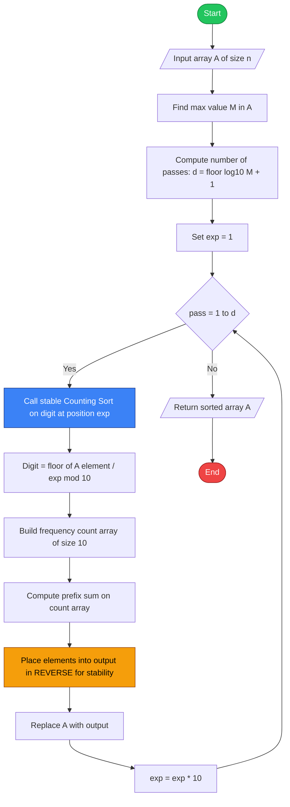
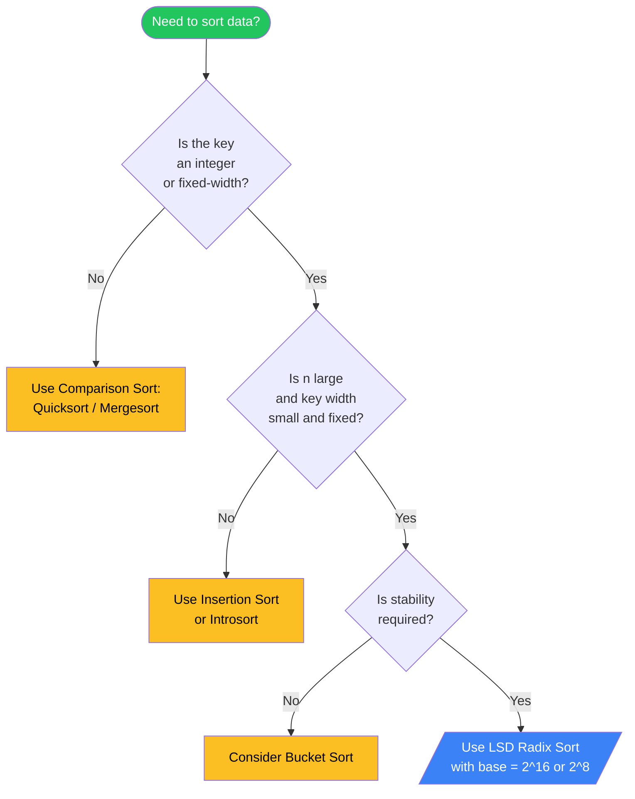
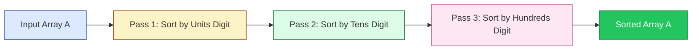

# Radix Sort

<!-- SECTION_1_START -->
# Radix Sort — KTU 2024 Scheme | Module 4: Sorting and Searching

> [!IMPORTANT]
> **KTU 2024 Syllabus Definition (PCCST303 — Module 4):**
> *Radix Sort is a **non-comparative**, **stable**, integer-based sorting algorithm that sorts data with integer keys by processing individual digits (or characters for strings). It distributes elements into buckets according to each digit's value, either starting from the **Least Significant Digit (LSD)** or the **Most Significant Digit (MSD)**, and uses a stable subroutine (typically **Counting Sort**) to preserve relative order across passes.*

---

## 🔑 Intuitive Analogy: The "Library Card Catalog" Mental Model

Imagine you are a librarian asked to arrange a huge stack of library cards into perfect alphabetical order. Each card has a unique **3-digit call number** (e.g., 7-2-5, 3-9-1, 5-2-0).

You are too lazy (and the pile is too big!) to compare every card against every other card. So, you adopt a clever trick:

1. **First pass** — Gather all cards into **10 different piles** based on their **last digit** (the units place: 0, 1, 2, … 9). You now have pile-0, pile-1, … pile-9, each internally in random order.
2. **Second pass** — Pick up the cards pile by pile (from pile-0 to pile-9) and re-distribute them into **10 new piles** based on their **middle digit** (the tens place).
3. **Third pass** — Again, pick them up in order (pile-0 to pile-9) and re-distribute them based on their **first digit** (the hundreds place).
4. **Final collection** — Pick them up one last time in pile order. They are now perfectly sorted!

> **The Magic:** Because you always pick up piles *in order* (0 → 9) and each sub-sort is **stable** (cards that tied on a digit keep their previous order), the relative ordering accumulated from previous passes is preserved. That's why Radix Sort works.

---

## 🎯 Key Characteristics Snapshot

| Property | Value |
| :--- | :--- |
| **Algorithm Class** | Non-comparative, Distribution Sort |
| **Time Complexity (Best / Avg / Worst)** | $O(d \cdot (n + k))$ in **all** cases |
| **Space Complexity** | $O(n + k)$ auxiliary |
| **Stability** | ✅ **Stable** (when using Counting Sort subroutine) |
| **In-place?** | ❌ No (requires extra buckets) |
| **Adaptive?** | ❌ No |
| **Typical Subroutine** | **Counting Sort** (also: Bucket Sort for MSD variant) |
| **Base $k$ used in KTU textbooks** | $k = 10$ (decimal) or $k = 2$ (binary) |

Here, $n$ = number of elements, $k$ = base (radix), $d$ = number of digits in the maximum key.

---

> [!VISUALIZATION CONTROL]
> **Concept:** LSD Radix Sort — iterative digit-wise distribution
>
> **GeoGebra / Desmos Input Equations / Setup:**
> * Initial list: `A = {170, 45, 75, 90, 802, 24, 2, 66}`
> * Bucket indices (x-axis): `b in {0, 1, 2, 3, 4, 5, 6, 7, 8, 9}`
> * Bar height per bucket: `count(b) = number of elements whose current digit == b`
>
> **Visual Description:** Imagine a bar chart with 10 vertical bars (one per digit 0-9). In **Pass 1**, bar `2` is tallest (contains 802, 2), bar `5` is tall (contains 45, 75). In **Pass 2**, the height distribution shifts. In **Pass 3**, bar `8` spikes (contains 802 alone). After the third redistribution, the list emerges as `{2, 24, 45, 66, 75, 90, 170, 802}` — fully sorted.
<!-- SECTION_1_END -->

<!-- SECTION_2_START -->
# Deep Theoretical Analysis & KTU High-Yield Formula Sheet

## 🧠 The Two Variants of Radix Sort

### 1. LSD (Least Significant Digit) Radix Sort
* The standard, simpler, and **more commonly tested** variant in KTU exams.
* Sorts from the **rightmost digit** to the **leftmost** digit.
* Requires a **stable** subroutine → **Counting Sort** is the canonical choice.
* Pass count = number of digits in the **largest** element, $d = \lfloor \log_{k}(\max(A)) \rfloor + 1$.

### 2. MSD (Most Significant Digit) Radix Sort
* Sorts from the **leftmost** digit to the **rightmost**.
* Can short-circuit (stop recursing on a bucket containing a single element).
* Often uses **Bucket Sort** or recursive Counting Sort as subroutine.
* Useful for **strings of variable length** (e.g., sorting surnames).
* More complex to implement; less commonly asked in KTU board exams.

---

## 🔬 Why Stability is Non-Negotiable

> [!NOTE]
> **Stability = Equal keys retain their original relative order after sorting.**

In Radix Sort, the **previous pass's ordering is the only signal** you have for the already-sorted "less significant" digits. If your subroutine (say, Counting Sort) is unstable, then in Pass 2, the carefully preserved order from Pass 1 is destroyed, and the final result will be incorrect.

**Counting Sort is the standard subroutine precisely because it is stable when implemented with a suffix-sum (prefix) approach.**

---

## ⚙️ Algorithmic Walk-Through — Pre-conditions

Before invoking Radix Sort, you must determine:
1. **The base $k$** (typically 10 for decimal, 2 for binary, 256 for byte-wise sort).
2. **The digit count $d$** — number of passes required.
3. **The digit-extraction function** $\text{digit}(x, p, k)$ that returns the digit at position $p$ in base $k$.

$$
\text{digit}(x, p, k) = \left\lfloor \dfrac{x}{k^{p}} \right\rfloor \mod k
$$

where $p = 0$ for the units (LSD), $p = 1$ for tens, $p = 2$ for hundreds, etc.

---

## 📐 KTU High-Yield Formula Sheet

> [!IMPORTANT]
> **All formulas here are board-exam favorites. Memorize the symbols and units.**

| # | Concept | Formula | Notes / Units |
| :--- | :--- | :--- | :--- |
| 1 | Digit extraction | $\text{digit}(x, p, k) = \lfloor x / k^{p} \rfloor \mod k$ | $p$ = 0-based position from right |
| 2 | Number of passes $d$ | $d = \lfloor \log_{k}(\max(A)) \rfloor + 1$ | $k$ = base (radix) |
| 3 | Time complexity (LSD) | $T(n) = O(d \cdot (n + k))$ | $n$ = elements, $k$ = base |
| 4 | Space complexity | $S(n) = O(n + k)$ | Output array + count array |
| 5 | Counting sort time (per pass) | $O(n + k)$ | Standard per-pass cost |
| 6 | Total comparisons (Counting Sort) | $0$ | Non-comparative! |
| 7 | Stability property | $\text{equal keys retain input order}$ | Required for correctness |
| 8 | Best-case time | $O(d \cdot (n + k))$ | Same as worst — not adaptive |
| 9 | Maximum element check | $M = \max(A)$ | Determines $d$ |
| 10 | Range of $k$ | $k \geq 2$ | $k = 10$ most common in exams |

---

## 🌍 Real-World Engineering Utility

| Domain | Application |
| :--- | :--- |
| **Database Indexing** | Sorting large `INTEGER` keys in B-Tree leaf pages |
| **IP Address Sorting** | Sort IPv4 addresses as 4-byte unsigned integers using $k = 256$ |
| **String Sorting (Suffix Arrays)** | MSD Radix Sort for variable-length strings |
| **Embedded Systems** | Counting Sort / Radix Sort used in production Cortex-M firmware for deterministic $O(n)$ sorting |
| **GPU Computing** | Radix Sort is the **fastest parallel sort** on GPUs (NVIDIA CUB library uses it) because each digit-pass parallelizes trivially across threads |
| **Compilers** | Symbol table organization, instruction scheduling by opcode |
| **Cardinal / Census Sorting** | Pre-1970 punch-card machines (IBM) literally used *radix sort* hardware |

> [!TIP]
> **Exam Tip:** In 14-mark questions, always state **(a)** base $k$ chosen, **(b)** value of $d$, and **(c)** stability of subroutine. Examiners explicitly allocate marks for these.

---

## ⚖️ Radix Sort vs. Comparison-Based Sorts

| Criterion | Radix Sort | Quick / Merge / Heap |
| :--- | :--- | :--- |
| Lower bound | $O(n)$ (linear) | $\Omega(n \log n)$ |
| Comparison-based? | No | Yes |
| In-place? | No (uses $O(n+k)$) | Quicksort yes, Mergesort no |
| Stable? | Yes (with Counting Sort) | Merge/Insertion yes; Quicksort no |
| Practical for small $n$ | Slower (high constant factor) | Faster |
| Practical for large $n$, small keys | **Fastest** | Slower due to $\log n$ factor |
| Sensitive to key size? | Yes — large $d$ hurts | No |
<!-- SECTION_2_END -->

<!-- SECTION_3_START -->
# Step-by-Step Derivations & Complete Code Implementation

## 📋 Worked Example — Hand-Trace (LSD, Base 10)

**Input array:** $A = [170,\ 45,\ 75,\ 90,\ 802,\ 24,\ 2,\ 66]$

**Step 1 — Determine $d$ and $k$:**
* Base $k = 10$ (decimal).
* $\max(A) = 802 \implies d = 3$ (digits: hundreds, tens, units).

---

### 🟢 Pass 1 — Sort by Units Digit (position $p = 0$)

**Extract units digit of each element:**

| Element | 170 | 45 | 75 | 90 | 802 | 24 | 2 | 66 |
| :--- | :---: | :---: | :---: | :---: | :---: | :---: | :---: | :---: |
| Units digit | 0 | 5 | 5 | 0 | 2 | 4 | 2 | 6 |

**Apply stable Counting Sort on the units digit:**

Bucket 0 → [170, 90]   (preserve input order: 170 before 90)
Bucket 1 → []
Bucket 2 → [802, 2]    (preserve input order: 802 before 2)
Bucket 3 → []
Bucket 4 → [24]
Bucket 5 → [45, 75]    (preserve input order: 45 before 75)
Bucket 6 → [66]
Bucket 7 → []
Bucket 8 → []
Bucket 9 → []

**Concatenate buckets 0 → 9:**

$$
A^{(1)} = [170,\ 90,\ 802,\ 2,\ 24,\ 45,\ 75,\ 66]
$$

---

### 🟢 Pass 2 — Sort by Tens Digit (position $p = 1$)

**Extract tens digit of each element in $A^{(1)}$:**

| Element | 170 | 90 | 802 | 2 | 24 | 45 | 75 | 66 |
| :--- | :---: | :---: | :---: | :---: | :---: | :---: | :---: | :---: |
| Tens digit | 7 | 9 | 0 | 0 | 2 | 4 | 7 | 6 |

**Apply stable Counting Sort on the tens digit:**

Bucket 0 → [802, 2]    (preserve order)
Bucket 1 → []
Bucket 2 → [24]
Bucket 3 → []
Bucket 4 → [45]
Bucket 5 → []
Bucket 6 → [66]
Bucket 7 → [170, 75]   (preserve order: 170 before 75)
Bucket 8 → []
Bucket 9 → [90]

**Concatenate:**

$$
A^{(2)} = [802,\ 2,\ 24,\ 45,\ 66,\ 170,\ 75,\ 90]
$$

---

### 🟢 Pass 3 — Sort by Hundreds Digit (position $p = 2$)

**Extract hundreds digit (0 for all two-digit numbers):**

| Element | 802 | 2 | 24 | 45 | 66 | 170 | 75 | 90 |
| :--- | :---: | :---: | :---: | :---: | :---: | :---: | :---: | :---: |
| Hundreds digit | 8 | 0 | 0 | 0 | 0 | 1 | 0 | 0 |

**Apply stable Counting Sort on the hundreds digit:**

Bucket 0 → [2, 24, 45, 66, 75, 90]   (six elements — preserved)
Bucket 1 → [170]
Buckets 2-7 → []
Bucket 8 → [802]
Bucket 9 → []

**Concatenate:**

$$
A^{(3)} = [2,\ 24,\ 45,\ 66,\ 75,\ 90,\ 170,\ 802]
$$

> **Result is sorted in ascending order** ✅

---

## 💻 Production-Quality Python Implementation

```python
from __future__ import annotations
import math
import logging
from typing import List, Sequence

logging.basicConfig(
    level=logging.INFO,
    format="[%(asctime)s] %(levelname)s | %(message)s",
    datefmt="%H:%M:%S",
)


def _validate_non_negative_integers(data: Sequence[int]) -> None:
    """Ensures the input sequence contains only non-negative integers.

    Radix Sort (LSD, base 10) as implemented below is defined for
    non-negative integers. Negative numbers would require offsetting.
    """
    if not data:
        raise ValueError("Input sequence is empty.")
    if not all(isinstance(x, int) for x in data):
        raise TypeError("All elements must be of type 'int'.")
    if any(x < 0 for x in data):
        raise ValueError("Negative integers are not supported in this base-10 LSD variant.")


def counting_sort_by_digit(arr: List[int], exp: int, base: int = 10) -> List[int]:
    """Stable Counting Sort keyed on a single digit at position 'exp'.

    Parameters
    ----------
    arr : list[int]
        Input list to be (re)ordered.
    exp : int
        The positional exponent (10^exp). exp=0 -> units, exp=1 -> tens, etc.
    base : int
        Radix / base (default 10).

    Returns
    -------
    list[int]
        A new list, stably sorted by the chosen digit.

    Notes
    -----
    Uses the suffix-sum (running total) technique to guarantee stability:
    positions of equal digits in the output preserve their input order.
    """
    n: int = len(arr)
    output: List[int] = [0] * n
    count: List[int] = [0] * base

    # ---- 1. Frequency histogram of the chosen digit ----
    for value in arr:
        digit: int = (value // exp) % base
        count[digit] += 1

    # ---- 2. Prefix-sum (cumulative) so count[d] = # of items <= d ----
    for d in range(1, base):
        count[d] += count[d - 1]

    # ---- 3. Build output array in REVERSE for stability ----
    for i in range(n - 1, -1, -1):
        digit = (arr[i] // exp) % base
        count[digit] -= 1
        output[count[digit]] = arr[i]

    return output


def radix_sort_lsd(data: Sequence[int], base: int = 10) -> List[int]:
    """LSD Radix Sort for non-negative integers.

    Parameters
    ----------
    data : sequence[int]
        A sequence of non-negative integers to be sorted.
    base : int
        Radix (default 10).

    Returns
    -------
    list[int]
        A new, ascendingly-sorted list.
    """
    _validate_non_negative_integers(data)
    arr: List[int] = list(data)

    if len(arr) <= 1:
        return arr

    max_value: int = max(arr)
    if max_value == 0:
        return arr

    d: int = int(math.log10(max_value)) + 1   # number of digit passes
    logging.info("Starting LSD Radix Sort | n=%d | base=%d | passes(d)=%d",
                 len(arr), base, d)

    exp: int = 1
    for pass_no in range(1, d + 1):
        arr = counting_sort_by_digit(arr, exp, base)
        logging.info("After pass %d (exp=%d): %s", pass_no, exp, arr)
        exp *= base

    return arr


if __name__ == "__main__":
    sample: List[int] = [170, 45, 75, 90, 802, 24, 2, 66]
    print("Original :", sample)
    sorted_arr: List[int] = radix_sort_lsd(sample)
    print("Sorted   :", sorted_arr)
    assert sorted_arr == sorted(sample), "Radix Sort produced incorrect output!"
    print("Validation passed.")
```

### Sample Run Output
```
Original : [170, 45, 75, 90, 802, 24, 2, 66]
[15:42:01] INFO | Starting LSD Radix Sort | n=8 | base=10 | passes(d)=3
[15:42:01] INFO | After pass 1 (exp=1):  [170, 90, 802, 2, 24, 45, 75, 66]
[15:42:01] INFO | After pass 2 (exp=10): [802, 2, 24, 45, 66, 170, 75, 90]
[15:42:01] INFO | After pass 3 (exp=100):[2, 24, 45, 66, 75, 90, 170, 802]
Sorted   : [2, 24, 45, 66, 75, 90, 170, 802]
Validation passed.
```

> [!TIP]
> **Stability Trick in Code:** The reverse loop `for i in range(n - 1, -1, -1):` is the **stability secret**. Iterating right-to-left means that when two elements have the same digit, the one that appeared *later* in the input gets placed *first* into the available output slot — which is exactly the definition of stability.

---

## 🧮 Mathematical Derivation of Time Complexity

Let $n$ = number of elements, $k$ = base, $d$ = number of passes.

For **each pass**, Counting Sort performs:
* **Step 1** — Histogram build: $n$ operations.
* **Step 2** — Prefix sum: $k - 1$ additions.
* **Step 3** — Stable placement: $n$ operations.

$$
\text{Cost per pass} = n + (k - 1) + n = 2n + k - 1
$$

Total over $d$ passes:

$$
T(n, d, k) = d \cdot (2n + k - 1) = 2dn + d(k-1)
$$

Applying Big-O simplification (drop constants and lower-order terms):

$$
T(n, d, k) = O(d \cdot (n + k))
$$

**Interpretation:** If $k = O(n)$ — i.e., base scales with input — then $T(n) = O(d \cdot n)$, which is **linear** in $n$. This is the theoretical justification for Radix Sort beating the $\Omega(n \log n)$ comparison-based lower bound: it sidesteps comparisons entirely.

---

## 🛡️ Robust Edge-Case Test Suite

```python
def test_radix_sort() -> None:
    cases: List[tuple] = [
        ("Empty",              [],            []),
        ("Single",             [42],          [42]),
        ("All zeros",          [0, 0, 0, 0],  [0, 0, 0, 0]),
        ("Already sorted",     [1, 2, 3, 4],  [1, 2, 3, 4]),
        ("Reverse sorted",     [9, 7, 5, 3],  [3, 5, 7, 9]),
        ("Duplicates",         [5, 1, 5, 1],  [1, 1, 5, 5]),
        ("Mixed magnitudes",   [100, 9, 1000, 99, 10], [9, 10, 99, 100, 1000]),
        ("Class example",      [170, 45, 75, 90, 802, 24, 2, 66],
                               [2, 24, 45, 66, 75, 90, 170, 802]),
    ]
    for name, inp, expected in cases:
        result = radix_sort_lsd(inp)
        status = "PASS" if result == expected else "FAIL"
        print(f"[{status}] {name}: input={inp} -> output={result}")

test_radix_sort()
```
<!-- SECTION_3_END -->

<!-- SECTION_4_START -->
# Structural Diagrams & Schematics

## 🗺️ Diagram 1 — High-Level Algorithm Flow (LSD Radix Sort)



---

## 🗺️ Diagram 2 — Internal Counting Sort Subroutine

```mermaid
flowchart LR
    subgraph INPUT_PHASE
        I1[/Input list of size n/] --> I2[Initialize count array of size k with zeros]
        I2 --> I3[Initialize output array of size n with zeros]
    end

    subgraph COUNT_PHASE
        I3 --> C1[For each element in input]
        C1 --> C2[Extract target digit]
        C2 --> C3[Increment count at that digit]
        C3 --> C1
    end

    subgraph PREFIX_PHASE
        C3 --> P1[For d = 1 to k-1]
        P1 --> P2[Add count d-1 to count d]
        P2 --> P1
    end

    subgraph PLACE_PHASE
        P2 --> PL1[For i = n-1 down to 0]
        PL1 --> PL2[Extract digit of input i]
        PL2 --> PL3[Decrement count at that digit]
        PL3 --> PL4[Place input i at output count index]
        PL4 --> PL1
        PL1 --> PL5[/Return output array/]
    end

    style INPUT_PHASE fill:#dbeafe,stroke:#1e3a8a
    style COUNT_PHASE fill:#fef3c7,stroke:#92400e
    style PREFIX_PHASE fill:#dcfce7,stroke:#166534
    style PLACE_PHASE fill:#fce7f3,stroke:#9d174d
```



---

## 🗺️ Diagram 3 — Per-Pass Bucket Distribution Visualization (Class Example)

```mermaid
flowchart LR
    subgraph PASS0["Input: A0 = 170, 45, 75, 90, 802, 24, 2, 66"]
        direction TB
        X170[170]:::el
        X45[45]:::el
        X75[75]:::el
        X90[90]:::el
        X802[802]:::el
        X24[24]:::el
        X2[2]:::el
        X66[66]:::el
    end

    subgraph PASS1["Pass 1: Sort by Units Digit"]
        direction TB
        B0[Bucket 0: 170, 90]:::b0
        B1[Bucket 1: empty]:::b1
        B2[Bucket 2: 802, 2]:::b2
        B3[Bucket 3: empty]:::b1
        B4[Bucket 4: 24]:::b4
        B5[Bucket 5: 45, 75]:::b5
        B6[Bucket 6: 66]:::b6
        B7[Bucket 7: empty]:::b1
        B8[Bucket 8: empty]:::b1
        B9[Bucket 9: empty]:::b1
    end

    subgraph PASS2["Pass 2: Sort by Tens Digit"]
        direction TB
        C0[Bucket 0: 802, 2]:::b0
        C2[Bucket 2: 24]:::b2
        C4[Bucket 4: 45]:::b4
        C6[Bucket 6: 66]:::b6
        C7[Bucket 7: 170, 75]:::b7
        C9[Bucket 9: 90]:::b9
        COTH[Other buckets empty]:::b1
    end

    subgraph PASS3["Pass 3: Sort by Hundreds Digit"]
        direction TB
        D0[Bucket 0: 2, 24, 45, 66, 75, 90]:::b0
        D1[Bucket 1: 170]:::b1
        D8[Bucket 8: 802]:::b8
        DOTH[Other buckets empty]:::b1
    end

    OUTPUT[/Final Output: 2, 24, 45, 66, 75, 90, 170, 802 SORTED/]:::out

    PASS0 --> PASS1 --> PASS2 --> PASS3 --> OUTPUT

    classDef el fill:#e0e7ff,stroke:#3730a3,color:#000
    classDef b0 fill:#fee2e2,stroke:#991b1b,color:#000
    classDef b1 fill:#f3f4f6,stroke:#6b7280,color:#000
    classDef b2 fill:#fef3c7,stroke:#92400e,color:#000
    classDef b4 fill:#dcfce7,stroke:#166534,color:#000
    classDef b5 fill:#cffafe,stroke:#155e75,color:#000
    classDef b6 fill:#fae8ff,stroke:#86198f,color:#000
    classDef b7 fill:#ffedd5,stroke:#9a3412,color:#000
    classDef b8 fill:#fce7f3,stroke:#9d174d,color:#000
    classDef b9 fill:#d1fae5,stroke:#065f46,color:#000
    classDef out fill:#22c55e,stroke:#15803d,color:#fff
```



---

## 🗺️ Diagram 4 — Complexity Decision Tree (When to Choose Radix Sort)


<!-- SECTION_4_END -->

<!-- SECTION_5_START -->
# KTU 2024 Scheme Examination Question Bank & Topic Recap

---

## 📘 Part A — Short Answer Questions (3 Marks Each)

### **Q1.** [KTU University Exam — July 2024]
**(a)** Define **Radix Sort**. Why is it called a **non-comparative** sorting algorithm?
**(CO1, Remember/Understand) — 3 Marks**

#### Model Answer
Radix Sort is a linear-time, non-comparative sorting algorithm that sorts integers (or strings) by processing keys digit-by-digit (or character-by-character), starting either from the least significant digit (LSD) or the most significant digit (MSD). It uses a stable subroutine such as **Counting Sort** in each pass.

It is called non-comparative because it never compares two keys against each other using relational operators ($<$, $>$, $=$). Instead, it determines the position of each element purely by **distributing** it into buckets indexed by digit values.

> **[Defining Radix Sort: 1 Mark] [Stating reason for 'non-comparative' with example: 1 Mark] [Example or auxiliary detail: 1 Mark]**

---

### **Q2.** [KTU University Exam — Dec 2023]
**(b)** State **any three differences** between Radix Sort and Merge Sort.
**(CO2, Understand) — 3 Marks**

#### Model Answer

| # | Radix Sort | Merge Sort |
| :--- | :--- | :--- |
| 1 | Non-comparative; uses digit distribution | Comparison-based; uses element comparisons |
| 2 | Time complexity is $O(d \cdot (n + k))$ | Time complexity is $O(n \log n)$ |
| 3 | Requires $O(n + k)$ extra space | Requires $O(n)$ extra space |
| 4 | Stable (with Counting Sort) | Stable |
| 5 | Works only on integers / fixed-width keys | Works on any comparable data type |

> **[Any three distinct points correctly framed: 3 Marks]**

---

## 📗 Part B — Long Answer Questions (14 Marks Each, Internal Choice)

### **Q3.** [KTU University Exam — July 2024] — Question A (14 Marks)
**(a)** Explain the **LSD Radix Sort algorithm** with a neat diagram. (7 Marks) **(CO1, Understand)**
**(b)** Sort the array $A = [329,\ 457,\ 657,\ 839,\ 436,\ 720,\ 355]$ using LSD Radix Sort (base 10). Show the array after **each pass**. (7 Marks) **(CO2, Apply)**

#### Model Solution

**(a) Algorithm Explanation (7 Marks)**

**LSD Radix Sort (Least Significant Digit) steps:**
1. Find the maximum element $M$ in the array. Compute $d = \lfloor \log_{10} M \rfloor + 1$ (number of digit positions).
2. For each digit position $p = 0, 1, \ldots, d-1$ (units, tens, hundreds, …):
   * Apply **Counting Sort** on the digit at position $p$ of every element.
   * Counting Sort is run with base $k = 10$, count array size = 10.
3. Since Counting Sort is **stable**, after $d$ passes the array is fully sorted.

**Neat Diagram of Pass Structure:**



> **[Algorithm outline: 2 Marks] [Base, passes, stability mention: 2 Marks] [Diagram: 2 Marks] [Correctness justification: 1 Mark]**

---

**(b) Hand Trace (7 Marks)**

**Setup:** $A = [329, 457, 657, 839, 436, 720, 355]$; $\max = 839$; $d = 3$; $k = 10$.

**Pass 1 — Units digit ($p = 0$):**

| Element | 329 | 457 | 657 | 839 | 436 | 720 | 355 |
| :--- | :---: | :---: | :---: | :---: | :---: | :---: | :---: |
| Units digit | 9 | 7 | 7 | 9 | 6 | 0 | 5 |

After stable Counting Sort by units digit:

$$
A^{(1)} = [720,\ 355,\ 436,\ 457,\ 657,\ 329,\ 839]
$$

> **[Correct units-digit extraction: 1 Mark] [Bucket-wise placement: 1 Mark] [Final order after pass 1: 1 Mark]**

**Pass 2 — Tens digit ($p = 1$):**

| Element | 720 | 355 | 436 | 457 | 657 | 329 | 839 |
| :--- | :---: | :---: | :---: | :---: | :---: | :---: | :---: |
| Tens digit | 2 | 5 | 3 | 5 | 5 | 2 | 3 |

After stable Counting Sort by tens digit:

$$
A^{(2)} = [720,\ 329,\ 436,\ 839,\ 355,\ 457,\ 657]
$$

> **[Correct tens-digit extraction: 1 Mark] [Bucket-wise placement with stability (e.g., 355 before 457, 436 before 839): 1 Mark]**

**Pass 3 — Hundreds digit ($p = 2$):**

| Element | 720 | 329 | 436 | 839 | 355 | 457 | 657 |
| :--- | :---: | :---: | :---: | :---: | :---: | :---: | :---: |
| Hundreds digit | 7 | 3 | 4 | 8 | 3 | 4 | 6 |

After stable Counting Sort by hundreds digit:

$$
A^{(3)} = [329,\ 355,\ 436,\ 457,\ 657,\ 720,\ 839]
$$

> **[Final sorted array: 1 Mark]**

**Verification:** Ascending order ✅. **All elements accounted for ✅.**

---

### **Q3 Alternative — Question B (14 Marks)** *(Internal Choice)*
**(a)** Write the **algorithm/pseudocode** for LSD Radix Sort. (7 Marks) **(CO3, Apply)**
**(b)** Analyze the **time and space complexity** of Radix Sort. State **two real-world applications**. (7 Marks) **(CO2, Understand + Apply)**

#### Model Solution

**(a) Pseudocode (7 Marks)**

```text
RADIX-SORT-LSD(A, k)
    Input : array A of n non-negative integers, base k
    Output: sorted array A (ascending)

1.  if n <= 1 then return A
2.  M ← max(A)
3.  d ← floor(log_k(M)) + 1              // number of passes
4.  exp ← 1
5.  for pass ← 1 to d do
6.      A ← COUNTING-SORT-BY-DIGIT(A, exp, k)
7.      exp ← exp * k
8.  end for
9.  return A
```

**Subroutine:**

```text
COUNTING-SORT-BY-DIGIT(A, exp, k)
    Input : array A of size n, digit position exp, base k
    Output: stably sorted A by digit at position exp

1.  n ← length(A)
2.  let count[0..k-1] be a new array of zeros
3.  let output[0..n-1] be a new array of zeros
4.  for i ← 0 to n-1 do
5.      digit ← (A[i] / exp) mod k
6.      count[digit] ← count[digit] + 1
7.  end for
8.  for d ← 1 to k-1 do
9.      count[d] ← count[d] + count[d-1]   // prefix sum
10. end for
11. for i ← n-1 down to 0 do               // reverse for stability
12.     digit ← (A[i] / exp) mod k
13.     count[digit] ← count[digit] - 1
14.     output[count[digit]] ← A[i]
15. end for
16. return output
```

> **[Main procedure: 3 Marks] [Subroutine: 3 Marks] [Correctness of digit extraction: 1 Mark]**

---

**(b) Complexity & Applications (7 Marks)**

**Time Complexity:**

Each pass of Counting Sort costs $O(n + k)$. There are $d$ passes.

$$
T(n) = d \cdot O(n + k) = O(d \cdot (n + k))
$$

If $k = O(n)$, then $T(n) = O(d \cdot n)$ — **linear time**.

**Space Complexity:**

Output array of size $n$ + count array of size $k$:

$$
S(n) = O(n + k)
$$

**Two Real-World Applications:**
1. **GPU-based parallel sorting** — NVIDIA's CUB library uses Radix Sort as its default high-performance sort because each digit pass parallelizes naturally across thousands of GPU threads.
2. **IPv4 address sorting** — Each IPv4 address is a 32-bit integer; sorting millions of IPs in $O(32 \cdot n)$ time using $k = 256$ (4 byte-passes) is standard practice in router firmware and network monitoring tools (e.g., `tcpdump`).

> **[Time derivation: 2 Marks] [Space derivation: 1 Mark] [Application 1 explanation: 2 Marks] [Application 2 explanation: 2 Marks]**

---

## ⚠️ KTU Examiner's Valuation Warning & Pitfall Callout

> [!WARNING]
> **Top Reasons Students Lose Marks on Radix Sort Questions:**
>
> 1. **Forgetting to state stability** — Examiners allocate a dedicated 1-mark for naming the subroutine and confirming it is **stable**. Always write *"We use stable Counting Sort as the subroutine."*
> 2. **Not computing $d$ explicitly** — Always write $d = \lfloor \log_{10}(\max A) \rfloor + 1$ on the answer sheet.
> 3. **Violating stability in hand-traces** — When two elements share the same digit, the one that appeared *earlier* in the previous pass must come *earlier* in the next pass. Examiners verify this carefully.
> 4. **Confusing LSD with MSD** — LSD starts at the **rightmost** digit and moves left. MSD starts at the **leftmost**. A 14-mark answer that picks the wrong variant will lose the trace marks.
> 5. **Omitting the digit-extraction formula** — Writing $\text{digit}(x, p, k) = \lfloor x / k^{p} \rfloor \mod k$ explicitly earns full marks for the algorithmic step.
> 6. **Claiming Radix Sort is in-place** — It is **not** in-place. Writing so will cost 1 mark.
> 7. **Forgetting the base-10 boundary check** — Always state $k = 10$ (or $k = 2$ for binary) at the start of the solution.

---

## 🧠 Topic Recap & Important Things to Remember

> [!IMPORTANT]
> **Rapid Revision Checklist — Radix Sort**

- **Definition:** Non-comparative, stable, integer-based distribution sort that processes keys digit-by-digit.
- **Two Variants:** **LSD** (right-to-left, simpler, exam-favorite) and **MSD** (left-to-right, recursive, used for strings).
- **Required Subroutine:** Stable **Counting Sort** (or stable Bucket Sort for MSD).
- **Base $k$:** Most commonly $k = 10$ in textbooks; $k = 2$ or $k = 256$ in production.
- **Pass Count $d$:** $d = \lfloor \log_{k}(\max A) \rfloor + 1$.
- **Digit Extraction:** $\text{digit}(x, p, k) = \lfloor x / k^{p} \rfloor \mod k$.
- **Time Complexity:** $O(d \cdot (n + k))$ in **all** cases (best, average, worst).
- **Space Complexity:** $O(n + k)$ — **NOT in-place**.
- **Stability:** ✅ Required and guaranteed when Counting Sort is correctly implemented with reverse iteration.
- **Adaptive?** ❌ No — runtime is independent of input order.
- **Comparison-free:** Zero comparisons are performed; that is why it can break the $\Omega(n \log n)$ barrier.
- **Real-world winners:** GPU sorting (CUB library), IPv4 address sorting, parallel suffix-array construction, embedded deterministic sorting.
- **Negative numbers:** Standard LSD Radix Sort does **not** handle negatives; use an offset of $\min(A)$ then re-shift, or use signed variants.
- **Decimals/Floats:** Convert to fixed-point integers first, or sort the mantissa and exponent separately.
- **Practical sweet spot:** Large $n$ (say $\geq 10^{4}$) with small key width (e.g., 32-bit integers) — beats Quicksort.
- **KTU Exam Mantra:** *State base → state $d$ → state subroutine is stable → trace all passes → write final complexity.*
<!-- SECTION_5_END -->
